## Dubbo面试题

### 1. 为什么要用Dubbo?

Dubbo是阿里巴巴开源的一款高性能、轻量级的Java RPC框架，主要解决分布式系统中的服务治理问题。使用Dubbo的主要原因包括：

**核心优势：**

1. **透明化的远程方法调用**：像调用本地方法一样调用远程方法，只需简单配置，无需任何API侵入
2. **软负载均衡及容错机制**：内置多种负载均衡策略（随机、轮询、最少活跃调用等）和容错策略
3. **服务自动注册与发现**：不再需要写死服务提供方地址，注册中心基于接口名查询服务提供者的IP地址，并且能够平滑添加或删除服务提供者
4. **高性能**：采用NIO非阻塞通信，支持多种序列化协议，性能优异
5. **服务治理能力**：提供服务降级、限流、熔断、监控、链路追踪等完善的治理功能

**适用场景：**
- 当单体应用拆分为分布式系统后，服务间需要相互调用
- 需要对服务进行统一管理、监控和治理
- 对性能有较高要求的RPC场景

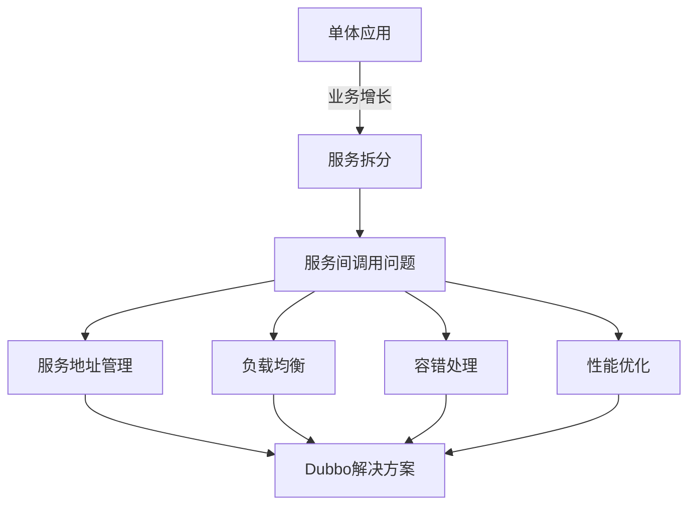

### 2. Dubbo的整体架构设计有哪些分层?

Dubbo采用微内核+插件的设计模式，整体架构分为10层，从上到下依次为：

**架构分层（从上到下）：**

1. **Service层（服务接口层）**：面向开发者，定义服务接口和实现
2. **Config层（配置层）**：对外配置接口，以ServiceConfig和ReferenceConfig为中心
3. **Proxy层（服务代理层）**：服务接口透明代理，生成服务的客户端Stub和服务器端Skeleton
4. **Registry层（注册中心层）**：封装服务地址的注册与发现
5. **Cluster层（路由层）**：封装多个提供者的路由及负载均衡，并桥接注册中心
6. **Monitor层（监控层）**：RPC调用次数和调用时间监控
7. **Protocol层（远程调用层）**：封装RPC调用，支持多种协议（Dubbo、HTTP、RMI等）
8. **Exchange层（信息交换层）**：封装请求响应模式，同步转异步
9. **Transport层（网络传输层）**：抽象mina和netty为统一接口
10. **Serialize层（数据序列化层）**：数据序列化和反序列化

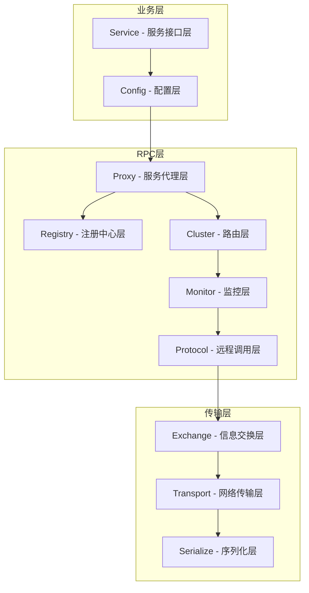

**各层职责说明：**
- 上三层（Service/Config/Proxy）是业务相关层，开发者主要接触这几层
- 中间四层（Registry/Cluster/Monitor/Protocol）是服务治理层，负责服务发现、负载均衡、监控等
- 下三层（Exchange/Transport/Serialize）是网络通信层，负责底层通信

### 3. 默认使用的是什么通信框架，还有别的选择吗?

**默认通信框架：Netty**

Dubbo默认使用Netty作为底层通信框架。Netty是一个高性能、异步事件驱动的NIO框架，具有以下优点：
- 异步非阻塞，性能高
- 内存零拷贝
- 成熟稳定，社区活跃
- 支持多种协议

**其他可选通信框架：**

| 框架 | 特点 | 适用场景 |
|------|------|----------|
| Netty（默认） | 高性能NIO框架，异步非阻塞 | 推荐使用 |
| Mina | Apache的NIO框架，较老 | 兼容旧系统 |
| Grizzly | Sun/Oracle的NIO框架 | 特定场景 |
| HTTP | 基于Servlet容器 | 与Web集成 |
| Thrift | Facebook的跨语言框架 | 跨语言调用 |

**Dubbo 2.x vs Dubbo 3.x 通信差异：**

- **Dubbo 2.x**：主要使用Netty 3.x，基于TCP长连接
- **Dubbo 3.x**：升级到Netty 4.x，同时引入了Triple协议（基于HTTP/2），支持gRPC互通

```java
// 配置通信框架示例
<dubbo:protocol name="dubbo" transporter="netty" />
// 或者
<dubbo:provider transporter="netty" />
```

### 4. 服务调用是阻塞的吗?

Dubbo支持多种调用方式，默认是**同步阻塞**调用，但也支持异步调用。

**调用方式分类：**

1. **同步调用（默认）**：调用方等待服务提供方返回结果，期间线程阻塞
2. **异步调用**：调用方发出请求后立即返回，通过Future/Callback获取结果
3. **单向调用（oneway）**：只发送请求，不等待响应，适合不关心结果的场景

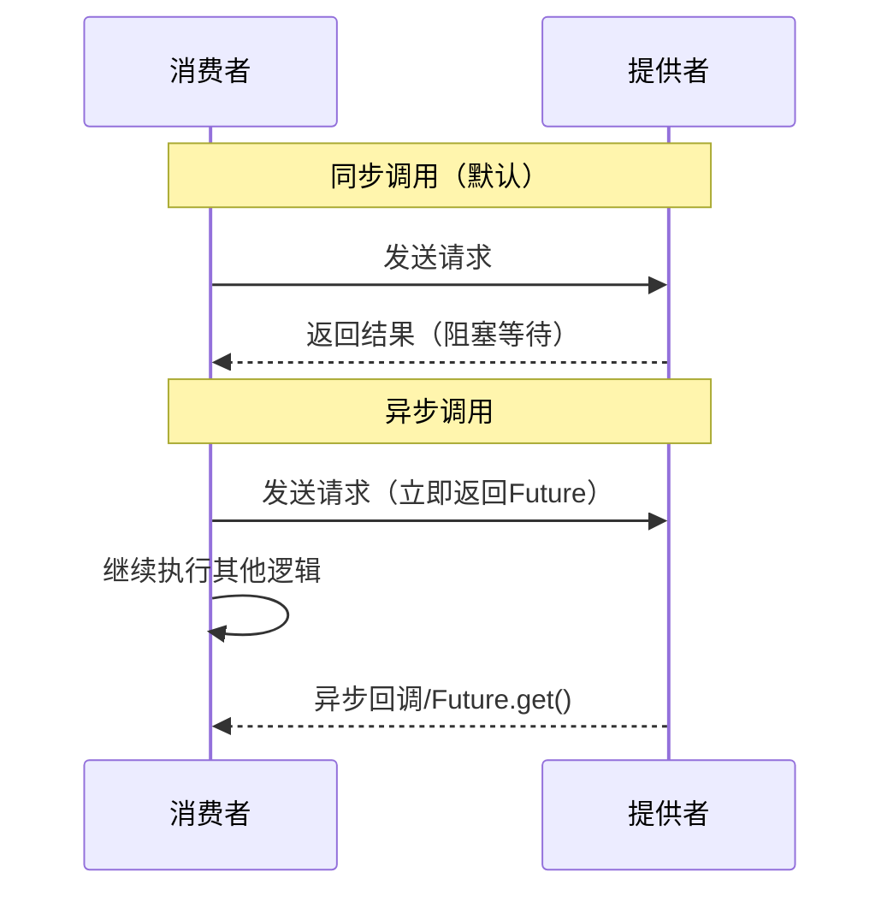

**异步调用配置示例：**

```xml
<!-- XML配置方式 -->
<dubbo:reference id="userService" interface="com.example.UserService" async="true"/>
```

```java
// 注解方式（Dubbo 3.x推荐）
@DubboReference(async = true)
private UserService userService;

// 调用后获取Future
userService.findUser(1L);
Future<User> future = RpcContext.getContext().getFuture();
User user = future.get(); // 在需要结果时获取
```

**Dubbo 3.x新增响应式调用：**

Dubbo 3.x引入了对响应式编程的支持，可以返回`CompletableFuture`：

```java
// 服务接口定义
public interface UserService {
    CompletableFuture<User> findUserAsync(Long id);
}
```

### 5. 一般使用什么注册中心?还有别的选择吗?

**推荐注册中心：ZooKeeper**

Dubbo官方推荐使用ZooKeeper作为注册中心，它是一个分布式协调服务，具有高可用、强一致性的特点。

**各注册中心对比：**

| 注册中心 | 优点 | 缺点 | 适用场景 |
|---------|------|------|----------|
| ZooKeeper（推荐） | 成熟稳定，CP模型，数据一致性强 | 性能一般，运维复杂 | 生产环境首选 |
| Nacos | 支持AP/CP切换，配置中心+注册中心二合一，阿里开源 | 相对较新 | 云原生场景推荐 |
| Redis | 性能高 | 可靠性差，不推荐 | 不推荐生产使用 |
| Multicast | 无需安装，组播发现 | 仅适合局域网 | 开发测试 |
| Simple | 内置简单注册中心 | 无高可用 | 测试环境 |
| Consul | 支持健康检查，多数据中心 | 需要额外部署 | 微服务场景 |
| Eureka | Spring Cloud生态 | 已停止维护 | Spring Cloud项目 |

**Dubbo 2.x vs Dubbo 3.x 注册中心差异：**

- **Dubbo 2.x**：主要支持ZooKeeper、Redis等
- **Dubbo 3.x**：新增对Nacos的一等公民支持，推荐使用Nacos，同时支持应用级服务发现（减少注册数据量）

```xml
<!-- ZooKeeper注册中心配置 -->
<dubbo:registry address="zookeeper://127.0.0.1:2181"/>

<!-- Nacos注册中心配置（Dubbo 3.x推荐） -->
<dubbo:registry address="nacos://127.0.0.1:8848"/>
```

### 6. 默认使用什么序列化框架，你知道的还有哪些?

**默认序列化框架：Hessian2**

Dubbo默认使用Hessian2作为序列化框架，它是一种二进制序列化协议，性能较好且跨语言支持。

**各序列化框架对比：**

| 序列化框架 | 性能 | 数据大小 | 跨语言 | 特点 |
|-----------|------|---------|--------|------|
| Hessian2（默认） | 中等 | 中等 | 支持 | 兼容性好 |
| Kryo | 高 | 小 | 不支持 | Java专用，性能最好 |
| FST | 高 | 小 | 不支持 | Java专用 |
| Protobuf | 高 | 最小 | 支持 | 跨语言首选，需定义schema |
| JSON（FastJSON/Jackson） | 低 | 大 | 支持 | 可读性好，调试方便 |
| Java原生序列化 | 最低 | 最大 | 不支持 | 不推荐 |
| Avro | 中等 | 小 | 支持 | 大数据生态 |

**Dubbo 3.x序列化变化：**

Dubbo 3.x引入Triple协议后，默认使用Protobuf序列化（与gRPC兼容），同时保留对Hessian2的支持。

```xml
<!-- 配置序列化方式 -->
<dubbo:protocol name="dubbo" serialization="kryo"/>
<!-- 或使用Protobuf（Triple协议） -->
<dubbo:protocol name="tri" serialization="protobuf"/>
```

**选择建议：**
- 纯Java环境追求性能：选Kryo或FST
- 需要跨语言：选Protobuf
- 需要可读性/调试：选JSON
- 默认场景：Hessian2即可

### 7. 服务提供者能实现失效踢出是什么原理?

服务提供者失效踢出基于**ZooKeeper的临时节点（Ephemeral Node）机制**实现。

**实现原理：**

1. 服务提供者启动时，在ZooKeeper上创建**临时节点**（非持久节点）
2. 服务提供者与ZooKeeper保持**心跳连接（Session）**
3. 当服务提供者宕机或网络断开时，ZooKeeper在Session超时后（默认40秒）自动删除该临时节点
4. ZooKeeper通知所有订阅该服务的消费者，消费者更新本地服务列表，将失效的提供者踢出

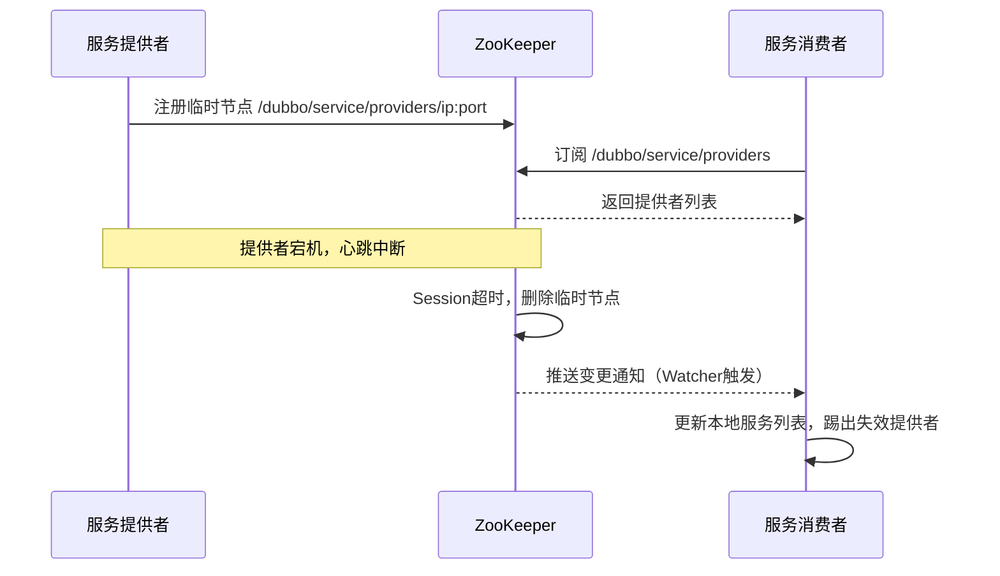

**ZooKeeper节点结构：**

```
/dubbo
  /com.example.UserService
    /providers
      /dubbo://192.168.1.1:20880/...  ← 临时节点
      /dubbo://192.168.1.2:20880/...  ← 临时节点
    /consumers
    /routers
    /configurators
```

**注意事项：**
- 临时节点的生命周期与Session绑定，Session超时时间可配置
- Dubbo 3.x使用Nacos时，通过心跳续约机制实现类似效果
- 消费者本地会缓存服务列表，即使注册中心短暂不可用也能继续调用

### 8. 服务上线怎么不影响旧版本?

服务上线不影响旧版本，主要通过以下几种策略实现：

**1. 灰度发布（金丝雀发布）**

```xml
<!-- 新版本服务提供者配置权重为0，先不接收流量 -->
<dubbo:service interface="com.example.UserService" weight="0" version="2.0.0"/>
<!-- 逐步调整权重，让部分流量进入新版本 -->
<dubbo:service interface="com.example.UserService" weight="10" version="2.0.0"/>
```

**2. 版本号隔离**

```xml
<!-- 旧版本提供者 -->
<dubbo:service interface="com.example.UserService" version="1.0.0"/>
<!-- 新版本提供者 -->
<dubbo:service interface="com.example.UserService" version="2.0.0"/>

<!-- 消费者指定版本 -->
<dubbo:reference interface="com.example.UserService" version="1.0.0"/>
```

**3. 分组隔离**

```xml
<!-- 旧版本分组 -->
<dubbo:service interface="com.example.UserService" group="stable"/>
<!-- 新版本分组 -->
<dubbo:service interface="com.example.UserService" group="beta"/>
```

**4. 路由规则**

通过Dubbo Admin配置路由规则，将特定用户/IP的流量路由到新版本：

```yaml
# 条件路由规则示例
conditions:
  - 'host = 192.168.1.100 => host = 192.168.1.200'
```

**发布流程建议：**

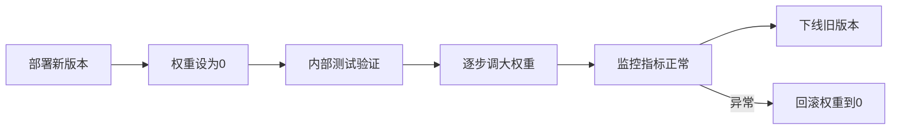

### 9. 如何解决服务调用链过长的问题?

服务调用链过长会导致响应时间增加、故障排查困难等问题，解决方案如下：

**1. 链路追踪（推荐）**

集成分布式链路追踪系统，如Zipkin、SkyWalking、Jaeger：

```xml
<!-- 集成SkyWalking，通过Java Agent方式，无需修改代码 -->
<!-- 启动参数添加 -->
<!-- -javaagent:/path/to/skywalking-agent.jar -->
```

**2. 服务合并/聚合**

将多个细粒度服务合并为粗粒度服务，减少调用层级：

```java
// 不好的设计：多次调用
User user = userService.getUser(id);
Order order = orderService.getOrder(userId);
Address address = addressService.getAddress(userId);

// 好的设计：聚合服务一次调用
UserProfile profile = userProfileService.getUserProfile(id); // 内部聚合
```

**3. 并行调用**

对于无依赖关系的服务，改串行为并行：

```java
// 使用CompletableFuture并行调用
CompletableFuture<User> userFuture = userService.getUserAsync(id);
CompletableFuture<Order> orderFuture = orderService.getOrderAsync(userId);

CompletableFuture.allOf(userFuture, orderFuture).join();
User user = userFuture.get();
Order order = orderFuture.get();
```

**4. 结果缓存**

对频繁调用且数据变化不频繁的服务启用缓存：

```xml
<dubbo:reference interface="com.example.UserService" cache="lru"/>
```

**5. 超时控制**

合理设置超时时间，避免调用链中某个节点拖垮整个链路：

```xml
<dubbo:reference interface="com.example.UserService" timeout="1000"/>
```

### 10. 说说核心的配置有哪些?

Dubbo的核心配置分为以下几类：

**1. 应用配置（ApplicationConfig）**

```xml
<dubbo:application name="my-app" version="1.0.0" owner="team-a"/>
```

**2. 注册中心配置（RegistryConfig）**

```xml
<dubbo:registry address="zookeeper://127.0.0.1:2181" timeout="10000"/>
```

**3. 协议配置（ProtocolConfig）**

```xml
<dubbo:protocol name="dubbo" port="20880" threads="200" accepts="0"/>
```

**4. 服务提供者配置（ProviderConfig）**

```xml
<dubbo:provider timeout="3000" retries="2" loadbalance="random"/>
```

**5. 服务消费者配置（ConsumerConfig）**

```xml
<dubbo:consumer timeout="3000" retries="2" check="false"/>
```

**6. 服务配置（ServiceConfig）**

```xml
<dubbo:service interface="com.example.UserService" ref="userServiceImpl"
    version="1.0.0" group="default" timeout="3000" retries="2"
    loadbalance="random" cluster="failover"/>
```

**7. 引用配置（ReferenceConfig）**

```xml
<dubbo:reference id="userService" interface="com.example.UserService"
    version="1.0.0" group="default" timeout="3000" retries="2"
    check="false" lazy="false"/>
```

**8. 方法级配置（MethodConfig）**

```xml
<dubbo:reference interface="com.example.UserService">
    <dubbo:method name="findUser" timeout="1000" retries="0"/>
    <dubbo:method name="saveUser" timeout="5000" retries="0"/>
</dubbo:reference>
```

**配置优先级（从高到低）：**

```
方法级配置 > 接口级配置 > 全局配置
消费者配置 > 提供者配置（部分配置）
```

**Dubbo 3.x注解配置方式：**

```java
@DubboService(version = "1.0.0", timeout = 3000, retries = 2)
public class UserServiceImpl implements UserService { ... }

@DubboReference(version = "1.0.0", timeout = 3000, check = false)
private UserService userService;
```

### 11. Dubbo推荐用什么协议?

**Dubbo 2.x推荐：dubbo协议**

dubbo协议是Dubbo自定义的TCP协议，基于Netty实现，具有以下特点：
- 单一长连接，NIO异步通信
- Hessian二进制序列化
- 适合小数据量、高并发的服务调用
- 不适合传输大文件（建议小于100KB）

**Dubbo 3.x推荐：Triple协议（tri）**

Triple协议是Dubbo 3.x引入的新协议，基于HTTP/2，与gRPC完全兼容：
- 支持Unary、Server Streaming、Client Streaming、Bidirectional Streaming四种调用模式
- 天然支持跨语言调用
- 支持浏览器直接访问（HTTP/1.1兼容）
- 与gRPC生态互通

**各协议对比：**

| 协议 | 连接数 | 适用场景 | 序列化 |
|------|--------|---------|--------|
| dubbo | 单连接 | 小数据高并发 | Hessian2 |
| Triple（tri） | HTTP/2多路复用 | 云原生、跨语言 | Protobuf |
| rmi | 多连接 | Java原生RMI | Java序列化 |
| hessian | 多连接 | 跨语言，文件传输 | Hessian |
| http | 多连接 | 与Web集成 | JSON/XML |
| thrift | 多连接 | 跨语言高性能 | Thrift |
| webservice | 多连接 | 系统集成 | SOAP |

```xml
<!-- Dubbo 2.x推荐配置 -->
<dubbo:protocol name="dubbo" port="20880"/>

<!-- Dubbo 3.x推荐配置 -->
<dubbo:protocol name="tri" port="50051"/>
```

### 12. 同一个服务多个注册的情况下可以直连某一个服务吗?

可以，Dubbo支持**点对点直连**，绕过注册中心直接调用指定的服务提供者。

**直连方式：**

**1. URL直连（最简单）**

```xml
<!-- 消费者配置直连地址 -->
<dubbo:reference id="userService" interface="com.example.UserService"
    url="dubbo://192.168.1.100:20880"/>
```

**2. 注解方式直连**

```java
@DubboReference(url = "dubbo://192.168.1.100:20880")
private UserService userService;
```

**3. JVM参数方式**

```bash
# 启动时指定直连地址
-Dcom.example.UserService=dubbo://192.168.1.100:20880
```

**4. 文件映射方式**

在用户目录下创建`dubbo-resolve.properties`文件：

```properties
com.example.UserService=dubbo://192.168.1.100:20880
```

**使用场景：**
- 开发调试时，直连本地或特定服务器
- 绕过注册中心进行压测
- 临时切换到特定版本的服务

**注意：** 直连方式会绕过注册中心，不享受负载均衡、容错等服务治理功能，仅建议在开发测试环境使用。

### 13. 画一画服务注册与发现的流程图

Dubbo服务注册与发现涉及四个核心角色：Registry（注册中心）、Provider（服务提供者）、Consumer（服务消费者）、Monitor（监控中心）。

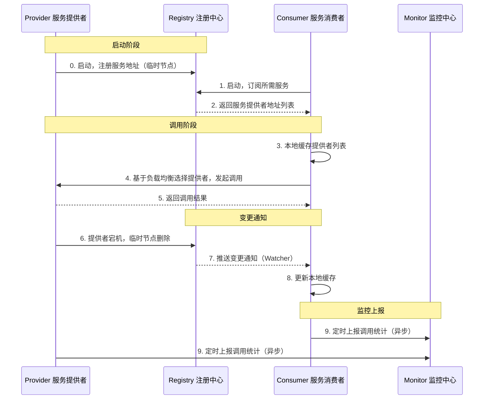

**详细流程说明：**

1. **服务注册**：Provider启动时向Registry注册自己的服务信息（IP、端口、接口名、版本等），ZooKeeper中创建临时节点
2. **服务订阅**：Consumer启动时向Registry订阅所需服务，Registry返回当前所有Provider地址列表
3. **本地缓存**：Consumer将Provider列表缓存到本地，即使Registry宕机也能继续调用
4. **服务调用**：Consumer根据负载均衡策略从本地缓存中选择一个Provider发起调用
5. **变更通知**：当Provider列表发生变化（上线/下线），Registry通过Watcher机制推送通知给Consumer
6. **监控上报**：Consumer和Provider定时将调用统计数据上报给Monitor（异步，不影响主流程）

### 14. Dubbo集群容错有几种方案?

Dubbo提供了6种集群容错策略：

**1. Failover（失败自动切换，默认）**

调用失败时自动切换到其他服务提供者重试，适合读操作。

```xml
<dubbo:reference cluster="failover" retries="2"/>
```

**2. Failfast（快速失败）**

只发起一次调用，失败立即报错，适合非幂等写操作（如新增记录）。

```xml
<dubbo:reference cluster="failfast"/>
```

**3. Failsafe（失败安全）**

调用失败时忽略异常，直接返回空结果，适合写入审计日志等不重要操作。

```xml
<dubbo:reference cluster="failsafe"/>
```

**4. Failback（失败自动恢复）**

调用失败后，后台记录失败请求，定时重发，适合消息通知等最终一致性场景。

```xml
<dubbo:reference cluster="failback"/>
```

**5. Forking（并行调用）**

同时调用多个服务提供者，只要有一个成功即返回，适合实时性要求高的读操作，但浪费资源。

```xml
<dubbo:reference cluster="forking" forks="2"/>
```

**6. Broadcast（广播调用）**

逐个调用所有提供者，任意一个报错则报错，适合通知所有提供者更新缓存等场景。

```xml
<dubbo:reference cluster="broadcast"/>
```

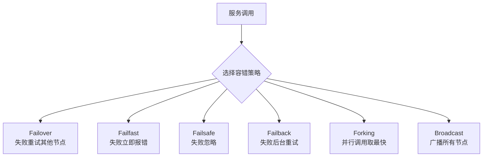

### 15. Dubbo服务降级，失败重试怎么做?

**服务降级**

服务降级是指当服务不可用或调用失败时，返回一个预设的默认值，保证系统整体可用性。

**Dubbo 2.x降级方式：**

```xml
<!-- mock=force:return null 强制返回null，不发起远程调用 -->
<dubbo:reference interface="com.example.UserService" mock="force:return null"/>

<!-- mock=fail:return null 调用失败时返回null -->
<dubbo:reference interface="com.example.UserService" mock="fail:return null"/>

<!-- 使用Mock类 -->
<dubbo:reference interface="com.example.UserService" mock="com.example.UserServiceMock"/>
```

```java
// Mock实现类
public class UserServiceMock implements UserService {
    @Override
    public User findUser(Long id) {
        // 返回降级数据
        return new User(-1L, "默认用户", "降级数据");
    }
}
```

**Dubbo 3.x降级方式（注解）：**

```java
@DubboReference(mock = "com.example.UserServiceMock")
private UserService userService;
```

**失败重试配置：**

```xml
<!-- 全局配置：失败重试2次（共调用3次） -->
<dubbo:consumer retries="2"/>

<!-- 接口级配置 -->
<dubbo:reference interface="com.example.UserService" retries="2"/>

<!-- 方法级配置（推荐对写操作设置retries=0） -->
<dubbo:reference interface="com.example.UserService">
    <dubbo:method name="findUser" retries="2"/>
    <dubbo:method name="saveUser" retries="0"/>  <!-- 写操作不重试 -->
</dubbo:reference>
```

**注意事项：**
- 写操作（新增、修改、删除）必须设置`retries="0"`，避免重复写入
- 读操作可以适当设置重试次数
- 重试会增加响应时间，需要合理设置超时时间

### 16. Dubbo使用过程中都遇到了些什么问题?

以下是Dubbo使用中常见的问题及解决方案：

**1. 服务启动时找不到提供者（No provider available）**

```
原因：消费者启动时提供者还未注册，或版本/分组不匹配
解决：
- 设置 check="false" 延迟检查
- 确认版本号和分组配置一致
- 检查注册中心连接是否正常
```

**2. 超时问题（Timeout waiting for response）**

```
原因：网络延迟、服务处理慢、线程池满
解决：
- 适当增大timeout配置
- 优化服务端处理逻辑
- 增大线程池大小（threads参数）
- 使用异步调用
```

**3. 序列化问题**

```
原因：传输对象未实现Serializable接口，或序列化框架不兼容
解决：
- 确保所有传输对象实现Serializable接口
- 保持序列化框架版本一致
- 避免传输不可序列化的对象（如Lambda）
```

**4. 线程池耗尽（Thread pool is EXHAUSTED）**

```
原因：并发量过大，线程池配置不足
解决：
- 增大threads参数（默认200）
- 使用线程池隔离
- 优化服务处理速度
- 考虑限流
```

**5. 注册中心连接问题**

```
原因：ZooKeeper集群故障，网络问题
解决：
- 配置多个注册中心地址
- 开启本地缓存（Dubbo默认开启）
- 监控注册中心健康状态
```

**6. 版本兼容问题（Dubbo 2.x升级3.x）**

```
原因：API变更，注解包名变更
解决：
- @Service改为@DubboService
- @Reference改为@DubboReference
- 检查协议兼容性
```

### 17. Dubbo Monitor实现原理?

Dubbo Monitor是Dubbo的监控中心，用于统计服务调用次数、调用时间、成功率等指标。

**实现原理：**

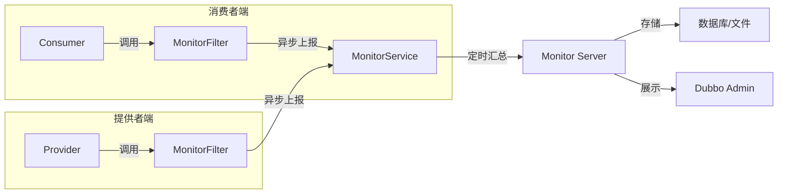

**核心组件：**

1. **MonitorFilter**：拦截每次RPC调用，记录调用信息（接口、方法、耗时、成功/失败）
2. **MonitorService**：收集调用数据，定时（默认1分钟）批量上报给Monitor Server
3. **Monitor Server**：接收并存储监控数据，提供查询接口
4. **Dubbo Admin**：可视化展示监控数据

**监控数据内容：**
- 服务接口名、方法名
- 调用次数（成功/失败）
- 平均响应时间、最大响应时间
- 并发数
- 消费者IP、提供者IP

**配置方式：**

```xml
<!-- 配置监控中心 -->
<dubbo:monitor protocol="registry"/>
<!-- 或指定地址 -->
<dubbo:monitor address="dubbo://127.0.0.1:7070"/>
```

**Dubbo 3.x监控升级：**

Dubbo 3.x推荐使用Prometheus + Grafana替代传统Monitor，通过Metrics模块暴露指标：

```yaml
# application.yml
dubbo:
  metrics:
    protocol: prometheus
    port: 9090
```

### 18. Dubbo用到哪些设计模式?

Dubbo大量使用了经典设计模式，体现了优秀的架构设计：

**1. 工厂模式**

通过`ExtensionLoader`（SPI机制）动态加载扩展实现：

```java
Protocol protocol = ExtensionLoader.getExtensionLoader(Protocol.class)
    .getExtension("dubbo");
```

**2. 代理模式**

消费者通过动态代理调用远程服务，屏蔽网络通信细节：

```java
// Dubbo使用Javassist或JDK动态代理生成Proxy
UserService userService = (UserService) Proxy.newProxyInstance(...);
```

**3. 装饰器模式**

Protocol、Cluster等组件通过包装器（Wrapper）增强功能：

```
ProtocolFilterWrapper -> ProtocolListenerWrapper -> DubboProtocol
```

**4. 观察者模式**

注册中心的服务变更通知使用观察者模式：

```java
// NotifyListener接口
registry.subscribe(url, new NotifyListener() {
    public void notify(List<URL> urls) { ... }
});
```

**5. 责任链模式**

Filter链处理请求，每个Filter负责一个切面功能：

```
MonitorFilter -> TimeoutFilter -> ExceptionFilter -> ... -> 实际调用
```

**6. 策略模式**

负载均衡、集群容错、序列化等都使用策略模式，可灵活切换：

```java
LoadBalance loadBalance = ExtensionLoader.getExtensionLoader(LoadBalance.class)
    .getExtension("random"); // 可切换为roundrobin、leastactive等
```

**7. 模板方法模式**

AbstractProtocol、AbstractRegistry等抽象类定义骨架，子类实现具体逻辑。

**8. 单例模式**

`ExtensionLoader`、`Registry`等核心组件使用单例模式。

### 19. Dubbo配置文件是如何加载到Spring中的?

Dubbo与Spring的集成通过**Spring自定义命名空间（Custom Namespace）**机制实现。

**加载流程：**

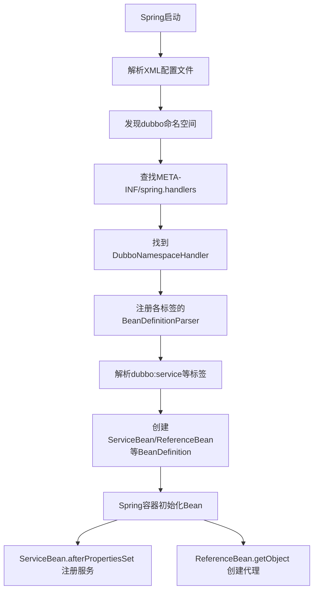

**关键文件：**

1. `META-INF/spring.handlers`：注册命名空间处理器

```properties
http\://dubbo.apache.org/schema/dubbo=org.apache.dubbo.config.spring.schema.DubboNamespaceHandler
```

2. `META-INF/spring.schemas`：注册XSD文件位置

```properties
http\://dubbo.apache.org/schema/dubbo/dubbo.xsd=META-INF/dubbo.xsd
```

3. `DubboNamespaceHandler`：注册各标签解析器

```java
public class DubboNamespaceHandler extends NamespaceHandlerSupport {
    public void init() {
        registerBeanDefinitionParser("application", new DubboBeanDefinitionParser(ApplicationConfig.class));
        registerBeanDefinitionParser("service", new DubboBeanDefinitionParser(ServiceBean.class));
        registerBeanDefinitionParser("reference", new DubboBeanDefinitionParser(ReferenceBean.class));
        // ...
    }
}
```

**Dubbo 3.x Spring Boot集成：**

Dubbo 3.x通过`@EnableDubbo`注解和`DubboAutoConfiguration`自动配置类实现与Spring Boot的集成，无需XML配置。

### 20. Dubbo SPI和Java SPI区别?

**Java SPI（Service Provider Interface）**

Java原生SPI通过`META-INF/services/`目录下的配置文件加载实现类：

```
# META-INF/services/com.example.Animal
com.example.Dog
com.example.Cat
```

```java
ServiceLoader<Animal> loader = ServiceLoader.load(Animal.class);
for (Animal animal : loader) {
    animal.speak(); // 会加载所有实现类
}
```

**Java SPI的缺点：**
- 一次性加载所有实现，浪费资源
- 无法按需获取指定实现
- 不支持依赖注入
- 不支持AOP（Wrapper机制）

**Dubbo SPI**

Dubbo SPI在Java SPI基础上做了大量增强，配置文件在`META-INF/dubbo/`目录：

```
# META-INF/dubbo/org.apache.dubbo.rpc.Protocol
dubbo=org.apache.dubbo.rpc.protocol.dubbo.DubboProtocol
http=org.apache.dubbo.rpc.protocol.http.HttpProtocol
```

```java
// 按名称获取指定实现（懒加载）
Protocol protocol = ExtensionLoader.getExtensionLoader(Protocol.class)
    .getExtension("dubbo");
```

**Dubbo SPI vs Java SPI对比：**

| 特性 | Java SPI | Dubbo SPI |
|------|---------|-----------|
| 加载方式 | 一次性加载全部 | 按需懒加载 |
| 获取方式 | 遍历所有实现 | 按名称获取指定实现 |
| 依赖注入 | 不支持 | 支持（setter注入） |
| AOP增强 | 不支持 | 支持（Wrapper机制） |
| 自适应扩展 | 不支持 | 支持（@Adaptive） |
| 激活扩展 | 不支持 | 支持（@Activate） |
| 配置目录 | META-INF/services/ | META-INF/dubbo/ |

**Dubbo SPI核心注解：**

```java
@SPI("dubbo")  // 标记扩展点接口，指定默认实现
public interface Protocol { ... }

@Adaptive  // 自适应扩展，根据URL参数动态选择实现
public class AdaptiveProtocol implements Protocol { ... }

@Activate(group = "consumer")  // 条件激活，满足条件时自动激活
public class MonitorFilter implements Filter { ... }
```

### 21. Dubbo支持分布式事务吗?

Dubbo本身**不直接支持分布式事务**，但可以与第三方分布式事务框架集成。

**为什么Dubbo不内置分布式事务？**

分布式事务涉及业务语义，框架层面难以统一处理，且会引入额外复杂性和性能开销。

**常用的分布式事务解决方案：**

**1. Seata（推荐）**

阿里开源的分布式事务框架，与Dubbo集成良好：

```xml
<!-- 引入Seata依赖 -->
<dependency>
    <groupId>io.seata</groupId>
    <artifactId>seata-spring-boot-starter</artifactId>
</dependency>
```

```java
@GlobalTransactional  // 开启全局事务
public void createOrder(Order order) {
    orderService.create(order);       // Dubbo调用
    inventoryService.deduct(order);   // Dubbo调用
    accountService.debit(order);      // Dubbo调用
}
```

**2. TCC（Try-Confirm-Cancel）模式**

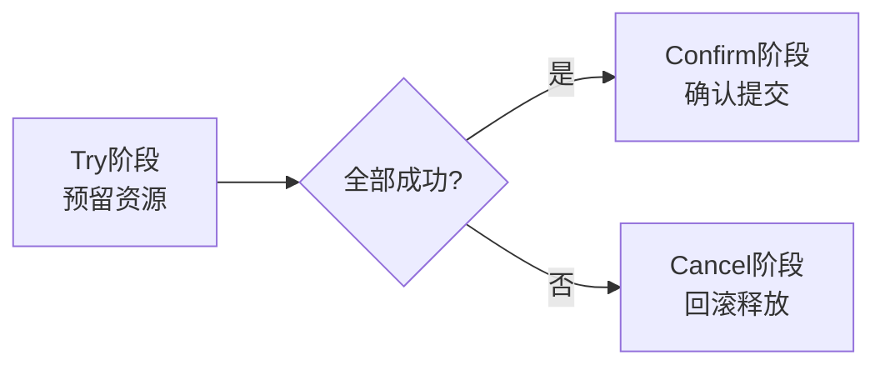

**3. 消息最终一致性**

通过可靠消息（如RocketMQ事务消息）实现最终一致性：

```
下单 -> 发送半消息 -> 执行本地事务 -> 提交/回滚消息 -> 消费者消费 -> 扣库存
```

**4. SAGA模式**

将长事务拆分为多个本地事务，每个事务有对应的补偿操作。

**选择建议：**
- 强一致性要求：使用Seata AT模式
- 高性能场景：使用TCC或消息最终一致性
- 长流程业务：使用SAGA模式

### 22. Dubbo可以对结果进行缓存吗?

可以，Dubbo内置了**结果缓存**功能，对相同参数的请求直接返回缓存结果，减少远程调用。

**缓存类型：**

| 缓存类型 | 说明 | 适用场景 |
|---------|------|---------|
| lru | 最近最少使用缓存，默认1000个 | 通用场景，推荐 |
| threadlocal | 当前线程缓存 | 线程内多次调用相同参数 |
| jcache | JSR107规范缓存，可接入Ehcache/Caffeine等 | 需要分布式缓存 |
| expiring | 带过期时间的缓存（Dubbo 3.x新增） | 需要定期刷新数据 |

**配置方式：**

```xml
<!-- 接口级缓存 -->
<dubbo:reference interface="com.example.UserService" cache="lru"/>

<!-- 方法级缓存 -->
<dubbo:reference interface="com.example.UserService">
    <dubbo:method name="findUser" cache="lru"/>
</dubbo:reference>
```

```java
// 注解方式
@DubboReference(cache = "lru")
private UserService userService;
```

**注意事项：**

1. **缓存键**：以请求参数为键，参数需实现`equals`和`hashCode`方法
2. **缓存穿透**：对null结果也会缓存，避免缓存穿透
3. **数据一致性**：缓存数据可能不一致，适合不经常变化的数据
4. **缓存容量**：默认最多缓存1000个条目（LRU），可通过`arguments`参数调整
5. **不适用场景**：写操作、实时性要求高的读操作

### 23. 服务上线怎么兼容旧版本?

服务兼容旧版本是分布式系统升级的核心问题，主要策略如下：

**1. 多版本并存（推荐）**

新旧版本同时运行，通过版本号路由：

```xml
<!-- 旧版本提供者 -->
<dubbo:service interface="com.example.UserService" version="1.0.0" ref="userServiceV1"/>
<!-- 新版本提供者 -->
<dubbo:service interface="com.example.UserService" version="2.0.0" ref="userServiceV2"/>

<!-- 旧消费者继续使用1.0.0 -->
<dubbo:reference interface="com.example.UserService" version="1.0.0"/>
<!-- 新消费者使用2.0.0 -->
<dubbo:reference interface="com.example.UserService" version="2.0.0"/>
```

**2. 向下兼容的接口设计**

- 新增方法而不修改旧方法
- 新增字段使用默认值，不删除旧字段
- 枚举值只增不减

```java
// 不好的做法：修改方法签名
// User findUser(String name); // 旧版本
// User findUser(String name, String phone); // 新版本（破坏性变更）

// 好的做法：新增重载方法
User findUser(String name);
User findUser(String name, String phone); // 新增重载，不影响旧调用
```

**3. 灰度发布流程**

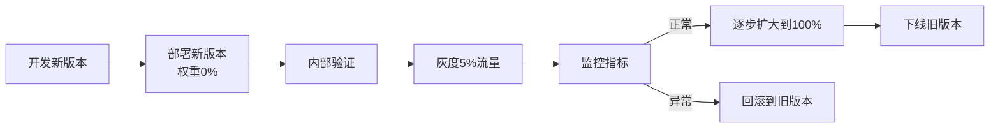

**4. 接口版本化原则**

- 向后兼容的变更：添加新功能、新字段
- 破坏性变更（需要新版本号）：删除字段、修改字段类型、修改方法签名

### 24. Dubbo必须依赖的包有哪些?

**Dubbo核心必须依赖：**

```xml
<!-- Dubbo核心包（必须） -->
<dependency>
    <groupId>org.apache.dubbo</groupId>
    <artifactId>dubbo</artifactId>
    <version>3.2.x</version>
</dependency>
```

**Dubbo 2.x最小依赖集：**

```xml
<!-- Dubbo核心 -->
<dependency>
    <groupId>com.alibaba</groupId>
    <artifactId>dubbo</artifactId>
    <version>2.6.x</version>
</dependency>

<!-- 网络通信（必须，默认Netty） -->
<dependency>
    <groupId>io.netty</groupId>
    <artifactId>netty-all</artifactId>
</dependency>

<!-- 注册中心（选其一） -->
<dependency>
    <groupId>org.apache.zookeeper</groupId>
    <artifactId>zookeeper</artifactId>
</dependency>
<dependency>
    <groupId>org.apache.curator</groupId>
    <artifactId>curator-framework</artifactId>
</dependency>
```

**Dubbo 3.x Spring Boot集成推荐依赖：**

```xml
<!-- Dubbo Spring Boot Starter（包含核心依赖） -->
<dependency>
    <groupId>org.apache.dubbo</groupId>
    <artifactId>dubbo-spring-boot-starter</artifactId>
    <version>3.2.x</version>
</dependency>

<!-- ZooKeeper注册中心 -->
<dependency>
    <groupId>org.apache.dubbo</groupId>
    <artifactId>dubbo-registry-zookeeper</artifactId>
</dependency>

<!-- 或Nacos注册中心 -->
<dependency>
    <groupId>org.apache.dubbo</groupId>
    <artifactId>dubbo-registry-nacos</artifactId>
</dependency>
```

**依赖说明：**
- `dubbo`核心包是唯一必须依赖
- 注册中心依赖根据选型决定（ZooKeeper/Nacos/其他）
- 网络框架Dubbo已内置Netty依赖，无需单独引入（Dubbo 3.x）
- Spring Boot项目推荐使用Starter简化依赖管理

### 25. Dubbo telnet命令能做什么?

Dubbo内置了Telnet命令行工具，可以直连服务进行运维管理和调试。

**连接方式：**

```bash
# 连接到Dubbo服务
telnet localhost 20880
# 或使用nc
nc -t localhost 20880
```

**常用命令：**

| 命令 | 说明 | 示例 |
|------|------|------|
| `ls` | 列出所有服务/方法 | `ls com.example.UserService` |
| `invoke` | 调用服务方法 | `invoke com.example.UserService.findUser(1)` |
| `status` | 查看服务状态 | `status` |
| `count` | 统计服务调用次数 | `count com.example.UserService 10` |
| `trace` | 跟踪方法调用 | `trace com.example.UserService findUser` |
| `log` | 修改日志级别 | `log com.example INFO` |
| `help` | 查看帮助 | `help invoke` |
| `quit`/`exit` | 退出 | `quit` |

**invoke命令示例：**

```bash
# 调用无参方法
dubbo>invoke com.example.UserService.listAll()

# 调用有参方法（JSON格式参数）
dubbo>invoke com.example.UserService.findUser(1)

# 调用复杂参数
dubbo>invoke com.example.UserService.saveUser({"name":"张三","age":25})
```

**注意：**
- Dubbo 3.x中QoS（Quality of Service）替代了部分Telnet功能
- QoS默认端口22222，提供HTTP和Telnet两种接入方式
- Telnet命令在生产环境需要注意安全，建议限制访问

**QoS命令示例（Dubbo 3.x）：**

```bash
# HTTP方式访问QoS
curl http://localhost:22222/ls
curl http://localhost:22222/online
curl http://localhost:22222/offline
```

### 26. Dubbo支持服务降级吗?

支持，Dubbo提供了多种服务降级机制。

**降级方式一：Mock降级（代码级）**

```xml
<!-- 强制返回null，不发起远程调用（force模式） -->
<dubbo:reference interface="com.example.UserService" mock="force:return null"/>

<!-- 强制抛出异常 -->
<dubbo:reference interface="com.example.UserService" mock="force:throw java.lang.RuntimeException"/>

<!-- 调用失败时执行Mock（fail模式，默认） -->
<dubbo:reference interface="com.example.UserService" mock="fail:return {}"/>

<!-- 使用Mock类 -->
<dubbo:reference interface="com.example.UserService" mock="true"/>
<!-- 需要提供 com.example.UserServiceMock 实现类 -->
```

**降级方式二：Dubbo Admin动态降级**

通过Dubbo Admin控制台动态配置降级规则，无需重启服务：

```yaml
# 动态配置规则（覆盖规则）
configVersion: v2.7
scope: service
key: com.example.UserService
configs:
  - addresses: ["0.0.0.0"]
    side: consumer
    parameters:
      mock: "force:return null"
```

**降级方式三：结合Hystrix/Sentinel**

```java
// 结合Sentinel限流降级（推荐）
@SentinelResource(value = "userService", fallback = "fallbackMethod")
public User findUser(Long id) {
    return userService.findUser(id);
}

public User fallbackMethod(Long id, Throwable ex) {
    return new User(-1L, "降级用户", null);
}
```

**Mock类实现示例：**

```java
// 命名规则：接口名 + Mock后缀
public class UserServiceMock implements UserService {
    @Override
    public User findUser(Long id) {
        log.warn("UserService降级，返回默认数据");
        return User.builder()
            .id(-1L)
            .name("系统繁忙，请稍后重试")
            .build();
    }
}
```

### 27. Dubbo如何优雅停机?

优雅停机是指服务停止时，先停止接收新请求，等待已有请求处理完成后再退出，避免请求丢失。

**Dubbo优雅停机机制：**

Dubbo通过JVM的`ShutdownHook`实现优雅停机：

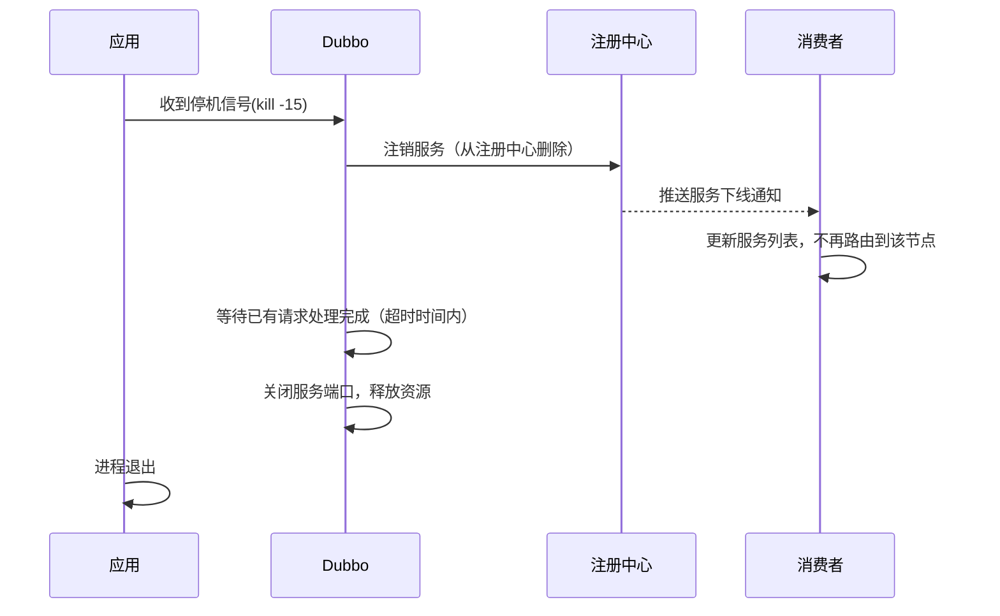

**配置优雅停机超时时间：**

```xml
<!-- 等待已有请求完成的超时时间（毫秒），默认10000ms -->
<dubbo:provider shutdown.timeout="15000"/>
```

```yaml
# Spring Boot配置
dubbo:
  provider:
    shutdown:
      timeout: 15000
```

**注意事项：**

1. **不要使用`kill -9`**：强制杀进程会跳过ShutdownHook，导致请求丢失
2. **使用`kill -15`（SIGTERM）**：让进程有机会执行清理逻辑
3. **Spring Boot集成**：需要配置`spring.main.register-shutdown-hook=true`（默认已开启）
4. **超时保障**：如果等待超时，Dubbo会强制关闭，避免无限等待

**生产环境最佳实践：**

```bash
# 优雅停机步骤
# 1. 先从负载均衡摘除（如果有外部负载均衡）
# 2. 发送SIGTERM信号
kill -15 $(cat app.pid)
# 3. 等待进程结束
# 4. 确认进程已退出
ps aux | grep app
```

### 28. Dubbo和Dubbox之间的区别?

**Dubbox简介**

Dubbox是当当网（DangDang）基于Dubbo 2.x开发的扩展版本（Dubbo eXtensions），由韩敏主导开发，主要增加了REST支持等功能。

**主要区别对比：**

| 特性 | Dubbo（Apache） | Dubbox（当当网） |
|------|----------------|----------------|
| 维护方 | Apache/阿里巴巴 | 当当网 |
| REST支持 | Dubbo 3.x原生支持 | Dubbox主要贡献 |
| HTTP/2支持 | Triple协议（Dubbo 3.x） | 不支持 |
| 社区活跃度 | 非常活跃 | 已停止维护 |
| 最新版本 | 3.x（持续更新） | 2.8.x（已停更） |
| 云原生支持 | 完整支持 | 不支持 |
| 文档 | 完整官方文档 | 较少 |

**Dubbox的历史意义：**

Dubbox在Dubbo长期未维护期间（2014-2017年）提供了很多扩展功能，特别是REST API支持，对当时的社区有重要贡献。但随着2018年Dubbo正式捐献给Apache基金会并恢复维护，加上Dubbo 3.x的发布，Dubbox已无需继续使用。

**建议：** 新项目直接使用Apache Dubbo 3.x，不推荐使用Dubbox。

### 29. Dubbo和Spring Cloud的区别?

Dubbo和Spring Cloud是目前Java生态中最主流的两个分布式服务框架，定位和侧重点不同。

**核心区别：**

| 维度 | Dubbo | Spring Cloud |
|------|-------|-------------|
| 定位 | 高性能RPC框架+服务治理 | 微服务一站式解决方案 |
| 通信协议 | TCP（dubbo协议）/HTTP2（Triple） | HTTP/REST（Feign） |
| 性能 | 高（二进制协议） | 较低（HTTP+JSON） |
| 服务注册 | ZooKeeper/Nacos等 | Eureka/Consul/Nacos |
| 配置中心 | 需借助Nacos/Apollo | Spring Cloud Config/Nacos |
| 链路追踪 | 需集成第三方 | Sleuth+Zipkin |
| 消息总线 | 无 | Spring Cloud Bus |
| 网关 | 无（需Nginx/Gateway） | Spring Cloud Gateway |
| 生态完整性 | RPC+治理 | 微服务全家桶 |
| 学习曲线 | 中等 | 较高（组件多） |
| 语言支持 | Java为主（3.x支持多语言） | Java |

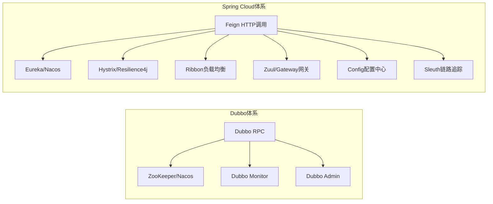

**选型建议：**

- **选Dubbo**：已有Java技术栈，对性能要求高，服务间调用频繁，团队熟悉RPC
- **选Spring Cloud**：微服务完整生态，多语言混合场景，团队已有Spring Cloud经验
- **Dubbo + Spring Cloud Alibaba**：两者并不互斥，可以结合使用（Nacos + Sentinel + Dubbo）

**Dubbo 3.x和Spring Cloud的融合趋势：**

Spring Cloud Alibaba项目将Dubbo与Spring Cloud生态打通，可以在Spring Cloud项目中使用Dubbo作为RPC框架。

### 30. 你还了解别的分布式框架吗?

**1. gRPC（Google）**

Google开源的高性能RPC框架，基于HTTP/2和Protobuf：

```protobuf
// 定义服务
service UserService {
    rpc FindUser (UserRequest) returns (UserResponse);
    rpc ListUsers (Empty) returns (stream UserResponse);
}
```

- **优点**：跨语言（支持10+语言）、高性能、双向流式调用
- **缺点**：需要定义.proto文件，学习成本略高
- **适用**：跨语言微服务、云原生场景

**2. Spring Cloud（Pivotal/VMware）**

微服务一站式解决方案，见第29题。

**3. Thrift（Facebook）**

跨语言的高性能RPC框架：
- 支持多种序列化协议和传输协议
- 跨语言支持广泛（Java、C++、Python、PHP等）
- 性能优秀，Facebook大规模使用

**4. Motan（微博）**

微博开源的轻量级RPC框架：
- 简单易用，入门门槛低
- 支持服务治理，与Consul/ZooKeeper集成
- 主要在Java生态使用

**5. SOFARPC（蚂蚁金服）**

蚂蚁金服开源的金融级RPC框架：
- 基于Bolt协议，高性能
- 支持Service Mesh（SOFAMesh）
- 金融场景经过大规模验证

**6. Tars（腾讯）**

腾讯开源的多语言RPC框架：
- 支持C++、Java、Go、Node.js等
- 微服务治理能力完善
- 腾讯内部大规模使用

**7. Brpc（百度）**

百度开源的工业级RPC框架：
- C++实现，极高性能
- 支持多种协议（HTTP/gRPC/Thrift等）
- 适合对性能极度敏感的C++服务

**框架对比总结：**

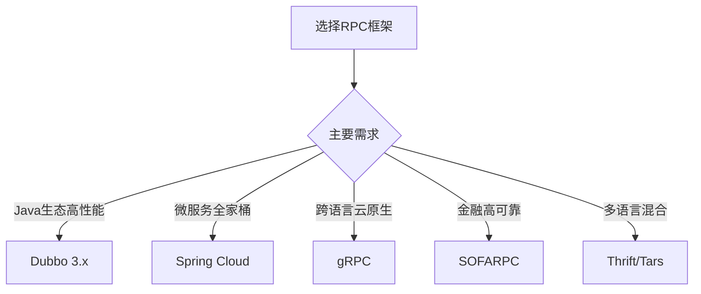

| 框架 | 公司 | 语言 | 性能 | 生态 | 推荐度 |
|------|------|------|------|------|--------|
| Dubbo 3.x | 阿里/Apache | Java为主 | 高 | 完善 | ★★★★★ |
| Spring Cloud | VMware | Java | 中 | 最完善 | ★★★★★ |
| gRPC | Google | 多语言 | 高 | 完善 | ★★★★☆ |
| Thrift | Facebook | 多语言 | 高 | 一般 | ★★★☆☆ |
| SOFARPC | 蚂蚁 | Java | 高 | 金融场景 | ★★★★☆ |
| Motan | 微博 | Java | 中 | 较少 | ★★★☆☆ |