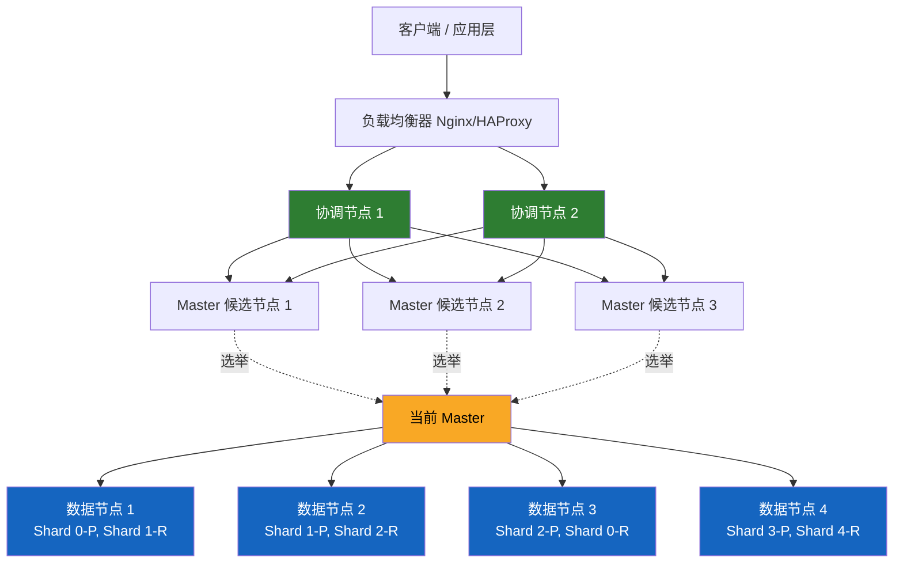
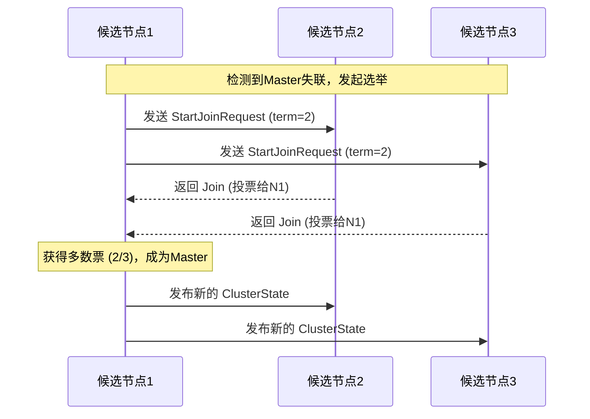
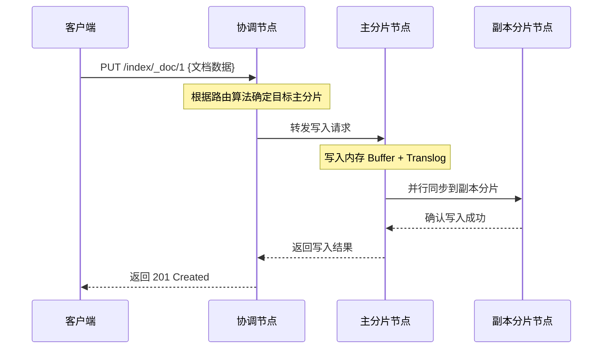
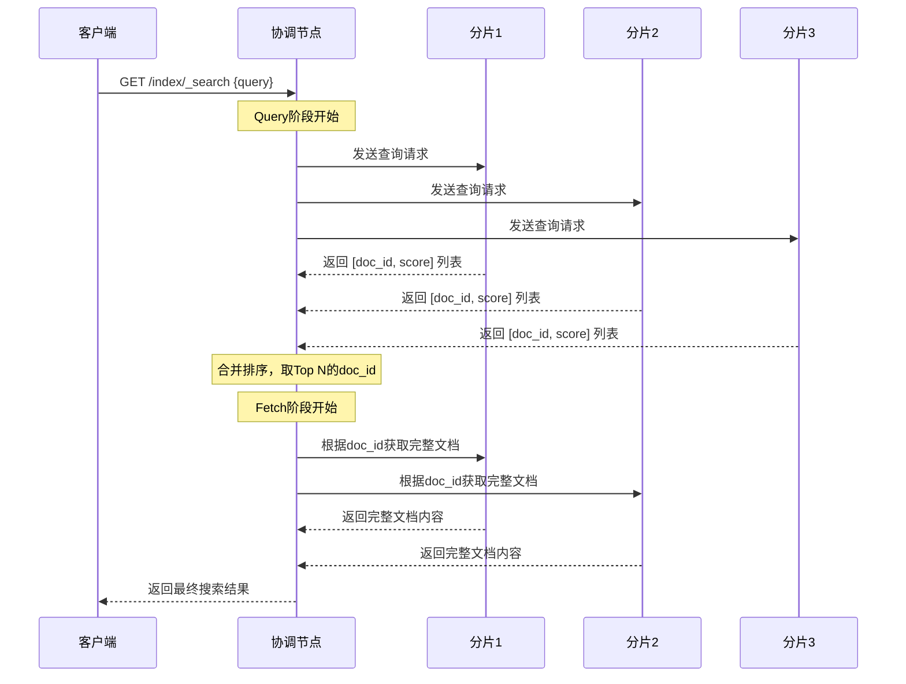
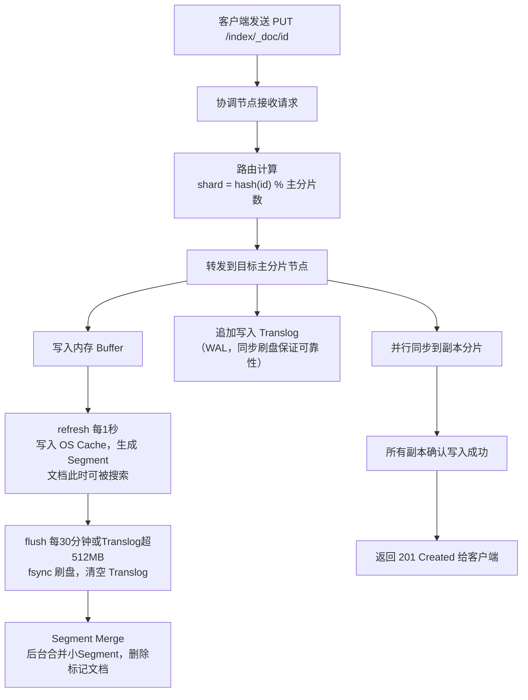
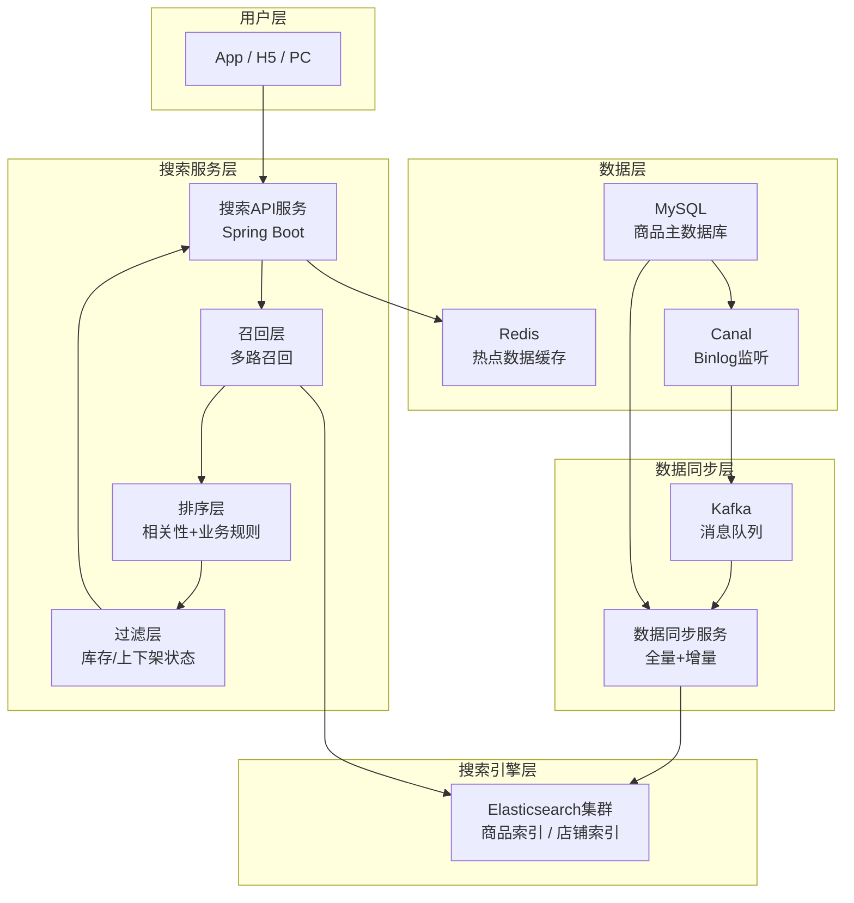
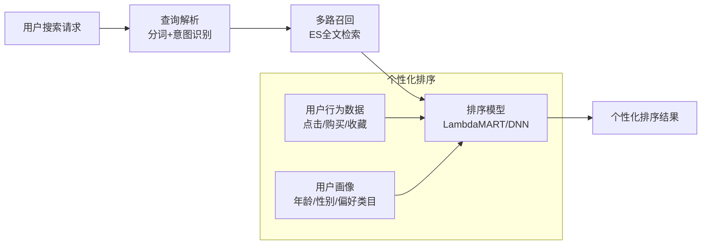

# Elasticsearch 面试题全解析

> 本文涵盖 24 道高频 Elasticsearch 面试题，每题均有详细解析，适合初学者和进阶开发者阅读。

***

## 1. elasticsearch了解多少，说说你们公司es的集群架构，索引数据大小，分片有多少，以及一些调优手段

### 基本了解

Elasticsearch（简称 ES）是一个基于 Apache Lucene 构建的**分布式、RESTful 风格的搜索和分析引擎**。它能够对海量数据进行近实时的存储、搜索和分析，广泛应用于日志分析、全文检索、电商搜索等场景。

**核心特点：**

- **分布式**：数据自动分片，横向扩展能力强
- **近实时**：写入后约 1 秒内可被搜索到
- **高可用**：副本机制保障数据不丢失
- **RESTful API**：通过 HTTP + JSON 进行交互
- **Schema-free**：支持动态映射，无需提前定义字段

### 典型集群架构



### 公司集群配置实例

**节点角色划分：**

- **Master 候选节点**：3 个，专门负责集群元数据管理（索引创建/删除、分片分配）
- **数据节点（Data Node）**：10～20 个，承担数据读写与查询计算
- **协调节点（Coordinating Node）**：2～3 个，只负责请求路由、结果合并，不存数据
- **Ingest 节点**：可选，用于写入前的数据预处理（格式转换、字段提取等）

**索引数据规模（典型电商场景）：**

- 商品索引：约 5000 万条文档，单索引大小约 50 GB
- 订单索引：按月滚动，每月约 2000 万条，使用 ILM（索引生命周期管理）
- 主分片数：5 个（每个分片控制在 10 GB 以内为佳）
- 副本数：1 个（生产环境至少保留 1 个副本）

**elasticsearch.yml 关键配置示例：**

```yaml
# 节点角色配置（Master 候选节点）
node.roles: [ master ]

# 数据节点配置
node.roles: [ data ]

# 协调节点配置
node.roles: [ ]

# 集群名称（所有节点必须一致）
cluster.name: prod-es-cluster

# 防止脑裂：最少候选 Master 数 = (master候选节点数 / 2) + 1
cluster.initial_master_nodes: ["node-master-1","node-master-2","node-master-3"]

# JVM 堆内存（建议不超过物理内存的 50%，且不超过 32 GB）
# 在 jvm.options 中设置：-Xms16g  -Xmx16g
```

### 调优手段

**写入调优：**

- 批量写入使用 `bulk` API，每批 5～15 MB，避免单条写入
- 关闭不需要的副本（写入期间设 `number_of_replicas: 0`，写完再恢复）
- 调大 `refresh_interval`（如设为 `30s`），减少 segment 生成频率
- 使用 `index.translog.durability: async` 异步刷盘（牺牲少量可靠性换性能）

**查询调优：**

- 合理设计 Mapping，避免不必要的 `_source` 和 `dynamic: true`
- 使用 `filter` 代替 `query`（filter 结果可缓存）
- 避免深度分页，使用 `search_after` 替代 `from/size`
- 冷热数据分离：热数据放 SSD 节点，冷数据放 HDD 节点

**系统调优：**

- 堆内存设为物理内存的 50%，剩余给操作系统 page cache 使用
- 关闭 swap：`swapoff -a`，并在 ES 配置中设 `bootstrap.memory_lock: true`
- 增大文件描述符上限：`ulimit -n 65536`
- 磁盘使用 SSD，RAID 10 提升 IO 吞吐

***

## 2. elasticsearch的倒排索引是什么

### 什么是倒排索引

倒排索引（Inverted Index）是全文检索的核心数据结构。与"正排索引"（文档 → 词语）相反，倒排索引建立的是**词语 → 文档列表**的映射，使得根据关键词快速找到包含该词的所有文档成为可能。

| 类型   | 结构          | 适合场景      |
| ---- | ----------- | --------- |
| 正排索引 | 文档ID → 文档内容 | 根据ID查文档   |
| 倒排索引 | 词项 → 文档ID列表 | 根据关键词搜索文档 |

### 构建示例

假设有以下三篇文档：

| 文档ID | 内容         |
| ---- | ---------- |
| doc1 | "我爱北京天安门"  |
| doc2 | "北京是中国的首都" |
| doc3 | "我爱中国"     |

经过分词和标准化后，构建出倒排索引：

| 词项（Term） | 文档列表（Posting List） |
| -------- | ------------------ |
| 我        | \[doc1, doc3]      |
| 爱        | \[doc1, doc3]      |
| 北京       | \[doc1, doc2]      |
| 天安门      | \[doc1]            |
| 中国       | \[doc2, doc3]      |
| 首都       | \[doc2]            |

### 倒排索引的内部三层结构

```
Term Index（内存，FST结构，快速定位词项前缀）
      ↓
Term Dictionary（磁盘，所有词项按字典序排列）
      ↓
Posting List（磁盘，文档ID列表 + 词频 + 位置信息）
```

1. **Term Index**：基于 FST（有限状态转换器）构建，常驻内存，极快定位词项在词典中的位置
2. **Term Dictionary**：所有词项的有序集合，存储在磁盘，二分查找定位词项
3. **Posting List**：每个词项对应的文档 ID 列表，包含词频（TF）、位置（Position）、字符偏移量（Offset）

### 搜索时的利用方式

搜索 "北京 中国" 时：

1. 在 Term Index 中快速定位两个词项
2. 从 Term Dictionary 读取对应 Posting List
3. 对两个 Posting List 做交集（AND）或并集（OR）运算
4. 按 BM25 算法计算相关性得分并排序返回

***

## 3. elasticsearch索引数据多了怎么办，如何调优，部署

### 数据量过大的问题表现

- 查询变慢，响应时间超过秒级
- 单个分片过大（超过 50 GB），导致恢复时间长
- 节点磁盘空间不足
- JVM 内存压力增大，GC 频繁

### 应对策略一：合理规划分片

分片是 ES 水平扩展的基本单位，分片数一旦创建就无法修改（需要 reindex）。

**分片数规划原则：**

- 单个分片大小建议控制在 **10～50 GB** 之间
- 分片数 = 预计总数据量 / 单分片目标大小
- 分片数不要超过数据节点数的 3 倍

```bash
# 创建索引时指定分片数
PUT /product_index
{
  "settings": {
    "number_of_shards": 5,
    "number_of_replicas": 1
  }
}
```

### 应对策略二：索引滚动（Rollover）

对于时序数据（日志、订单等），使用 **ILM（Index Lifecycle Management）** 按时间或大小自动滚动索引。

```bash
# 配置 ILM 策略
PUT _ilm/policy/my_policy
{
  "policy": {
    "phases": {
      "hot":    { "actions": { "rollover": { "max_size": "50gb", "max_age": "30d" } } },
      "warm":   { "min_age": "30d", "actions": { "shrink": { "number_of_shards": 1 } } },
      "cold":   { "min_age": "90d", "actions": { "freeze": {} } },
      "delete": { "min_age": "180d","actions": { "delete": {} } }
    }
  }
}
```

### 应对策略三：冷热分层架构

```
热层（Hot）：SSD节点  → 近期高频访问数据
暖层（Warm）：SATA节点 → 30天内数据，查询频率中等
冷层（Cold）：大容量HDD → 90天以上数据，低频查询
```

### 应对策略四：Reindex 与索引优化

```bash
# 将旧索引数据迁移到新索引（调整分片数、Mapping）
POST _reindex
{
  "source": { "index": "old_index" },
  "dest":   { "index": "new_index" }
}
```

### 部署调优要点

| 优化项               | 建议值                 | 说明                  |
| ----------------- | ------------------- | ------------------- |
| 堆内存               | 物理内存的 50%，不超过 32 GB | 留出空间给 OS page cache |
| 分片大小              | 10～50 GB            | 过大恢复慢，过小开销大         |
| refresh\_interval | 写入密集期设 30s          | 减少 segment 合并压力     |
| 副本数               | 生产环境至少 1            | 保障高可用               |
| 磁盘类型              | SSD 优先              | 随机 IO 性能关键          |

***

## 4. elasticsearch是如何实现master选举的

### Master 节点的职责

Master 节点负责管理整个集群的元数据，包括：

- 创建/删除索引
- 分配分片到数据节点
- 跟踪集群中节点的加入和离开
- 维护集群状态（Cluster State）

**注意**：Master 节点不参与数据的读写，只管理"集群的大脑"。

### 选举触发时机

- 集群启动时，没有 Master 节点
- 当前 Master 节点宕机或网络分区导致 Master 失联

### 选举算法（基于 Raft 的 Bully 变种）

ES 7.x 之前使用 Zen Discovery，ES 7.x+ 改为基于 Raft 协议的 **Cluster Coordination**。

**ES 7.x+ 选举流程：**



**核心规则：**

1. 只有在 `cluster.initial_master_nodes` 中配置的节点才能参与选举
2. 候选节点向其他节点发送 `StartJoinRequest`，携带当前 term（任期号）
3. 每个节点在同一 term 内只能投一票
4. 获得**超过半数**（quorum = N/2 + 1）投票的节点成为 Master
5. 新 Master 发布新的 ClusterState，通知所有节点

### 防止脑裂（Split Brain）

脑裂是指网络分区后，两个子集群各自选出一个 Master，导致数据不一致。

**解决方案：**

- 配置 `cluster.initial_master_nodes` 为奇数个节点（通常 3 或 5 个）
- quorum = (候选节点数 / 2) + 1，确保任意时刻只有一个分区能获得多数票

```yaml
# elasticsearch.yml 防脑裂配置
cluster.initial_master_nodes:
  - "node-master-1"
  - "node-master-2"
  - "node-master-3"
```

假设共 3 个候选节点，quorum = 2。网络分区为 1+2 时，只有 2 节点的分区能选出 Master。

***

## 5. 详细描述一下Elasticsearch索引文档的过程

### 整体流程概览



### 路由算法

ES 通过以下公式确定文档存储在哪个分片：

```
shard_num = hash(_routing) % number_of_primary_shards
```

`_routing` 默认是文档的 `_id`，也可以自定义。这就是为什么**主分片数一旦确定就不能修改**——改变分片数会导致路由结果变化，找不到原有文档。

### 写入详细步骤

**第一阶段：写入内存与 Translog**

1. 文档到达主分片节点后，先写入**内存 Buffer（In-memory buffer）**
2. 同时追加写入 **Translog（事务日志）**，保障写入不丢失（类似数据库的 WAL）
3. 此时文档还不可搜索

**第二阶段：Refresh（刷新）**

- 每隔 1 秒（`refresh_interval` 默认值），内存 Buffer 中的数据被写入**文件系统缓存（OS Cache）**，生成一个新的 Segment
- Segment 写入 OS Cache 后，文档即可被搜索到（**近实时**的原因）
- 此时数据还在内存/OS Cache 中，尚未落盘

**第三阶段：Flush（冲刷）**

- 每 30 分钟或 Translog 超过 512 MB 时，触发 Flush
- Flush 将 OS Cache 中的数据通过 `fsync` 强制写入磁盘，生成持久化的 Segment 文件
- Flush 完成后，清空对应的 Translog

**第四阶段：Segment 合并（Merge）**

- 随着时间推移，小 Segment 越来越多，ES 后台自动将小 Segment 合并为大 Segment
- 合并过程中，被标记删除的文档才会真正被物理删除

```
内存Buffer → (refresh, 1s) → OS Cache (Segment) → (flush, 30min) → 磁盘
Translog   ──────────────────────────────────────→ (flush后清空)
```

***

## 6. 详细描述一下Elasticsearch搜索的过程

### 搜索的两个阶段

ES 的搜索分为两个阶段：**Query 阶段**和 **Fetch 阶段**。



### Query 阶段（查询阶段）

1. 客户端发送搜索请求到任意一个节点，该节点成为**协调节点**
2. 协调节点将请求广播到该索引的**所有分片**（主分片或对应副本分片）
3. 每个分片在本地执行查询，返回匹配文档的 **doc\_id 和 \_score**（不返回完整文档）
4. 协调节点收集所有分片的结果，在内存中做**全局排序**，取出 Top N 条记录的 doc\_id

### Fetch 阶段（取回阶段）

1. 协调节点根据 Query 阶段得到的 doc\_id，向对应分片发起 **Multi-Get 请求**
2. 各分片根据 doc\_id 读取完整的文档内容（`_source` 字段）
3. 协调节点将所有文档整合后返回给客户端

### 深度分页问题

使用 `from/size` 分页时，每个分片都要返回 `from + size` 条记录，协调节点需要在内存中排序 `分片数 × (from + size)` 条记录，`from` 越大性能越差。

**解决方案：**

- `search_after`：基于上一页最后一条记录的排序值翻页，性能稳定
- `scroll` API：用于批量导出数据，不适合实时搜索

```bash
# 使用 search_after 翻页示例
GET /index/_search
{
  "size": 10,
  "sort": [{"timestamp": "desc"}, {"_id": "asc"}],
  "search_after": ["2024-01-15T10:00:00", "abc123"]
}
```

***

## 7. Elasticsearch在部署时，对Linux的设置有哪些优化方法

### 1. 关闭 Swap 交换分区

Swap 会导致 JVM 将内存数据换出到磁盘，严重影响 ES 性能，甚至导致节点超时被踢出集群。

```bash
# 临时关闭（重启失效）
sudo swapoff -a

# 永久关闭：注释掉 /etc/fstab 中的 swap 行
sudo sed -i '/swap/s/^/#/' /etc/fstab
```

同时在 `elasticsearch.yml` 中配置：

```yaml
bootstrap.memory_lock: true
```

### 2. 调大文件描述符限制

ES 需要大量文件句柄（每个 Segment、Translog 都是文件）。

```bash
# /etc/security/limits.conf
elasticsearch soft nofile 65536
elasticsearch hard nofile 65536

# 验证
ulimit -n
```

### 3. 调大虚拟内存映射数

Lucene 使用 mmap 映射大量文件，需要足够的虚拟内存区域数。

```bash
# 临时设置
sysctl -w vm.max_map_count=262144

# 永久设置：写入 /etc/sysctl.conf
echo "vm.max_map_count=262144" >> /etc/sysctl.conf
sysctl -p
```

### 4. 调整线程数限制

```bash
# /etc/security/limits.conf
elasticsearch soft nproc 4096
elasticsearch hard nproc 4096
```

### 5. 磁盘与 IO 调优

```bash
# 对 SSD 磁盘，设置 IO 调度器为 noop 或 deadline（减少不必要的 IO 重排）
echo noop > /sys/block/sda/queue/scheduler

# 挂载时使用 noatime 选项，减少访问时间戳更新的 IO 开销
# /etc/fstab 中添加 noatime 选项
/dev/sda1 /data ext4 defaults,noatime 0 0
```

### 6. JVM 配置（jvm.options）

```bash
# 堆内存设为物理内存的 50%，且不超过 32 GB（超过 32 GB 会关闭指针压缩，反而更耗内存）
-Xms16g
-Xmx16g

# 使用 G1GC（ES 8.x 默认）
-XX:+UseG1GC
-XX:G1HeapRegionSize=4m
-XX:+ParallelRefProcEnabled
```

### 7. 网络配置

```bash
# 增大 TCP 连接队列
sysctl -w net.core.somaxconn=65535
sysctl -w net.ipv4.tcp_max_syn_backlog=65535
```

***

## 8. lucene内部结构是什么

### Lucene 是 ES 的底层引擎

Elasticsearch 底层使用 Apache Lucene 作为全文检索库。理解 Lucene 的内部结构有助于深入理解 ES 的工作原理。

### Lucene 的核心概念层次

```
Index（索引）
  └── Segment（段，不可变的数据单元）
        ├── .tim  Term Dictionary（词项字典）
        ├── .tip  Term Index（词项索引，FST结构，常驻内存）
        ├── .doc  Frequencies（词频信息）
        ├── .pos  Positions（词项在文档中的位置）
        ├── .pay  Payloads & Offsets（偏移量）
        ├── .nvd/.nvm  Norms（字段长度归一化因子）
        ├── .dvd/.dvm  DocValues（列式存储，用于排序/聚合）
        ├── .fdt/.fdx  Stored Fields（原始文档内容 _source）
        ├── .liv  Live Documents（标记哪些文档未被删除）
        └── .si   Segment Info（段的元数据）
```

### 核心组件详解

**1. Segment（段）**

- Lucene 索引由多个不可变的 Segment 组成
- 每次 refresh 都会生成一个新的 Segment
- Segment 一旦写入就不可修改（删除只是标记，更新是删除+新增）
- 后台 Merge 线程会将小 Segment 合并为大 Segment，提升查询效率

**2. Term Dictionary + Term Index**

- Term Dictionary：所有词项的有序列表，存储在磁盘（.tim 文件）
- Term Index：基于 FST（Finite State Transducer）构建的前缀索引，常驻内存，用于快速定位词项在 Term Dictionary 中的位置

**3. Posting List（倒排列表）**

- 存储每个词项对应的文档 ID 列表
- 使用 **Frame Of Reference（FOR）** 压缩算法压缩文档 ID
- 使用 **Roaring Bitmap** 加速集合运算（交集、并集）

**4. DocValues（列式存储）**

- 用于排序、聚合、脚本计算等场景
- 按列存储，对同一字段的所有文档值连续存放，IO 效率高
- 类似于列式数据库（Parquet、ORC）的存储方式

**5. Stored Fields**

- 存储文档的原始内容（即 ES 中的 `_source`）
- 按行存储，根据 doc\_id 快速读取完整文档

### Lucene 写入与查询流程

```
写入：Document → Analyzer(分词) → IndexWriter → Segment(内存) → flush → 磁盘Segment
查询：Query → QueryParser → IndexSearcher → 遍历Segment → 合并结果 → TopDocs
```

***

## 9. Elasticsearch是如何实现Master选举的

> 本题与第 4 题相同，以下补充更多细节。

### ES 7.x 之前（Zen Discovery）

使用基于 **Bully 算法**的变种：

- 每个节点有一个唯一 ID，ID 最小的节点优先成为 Master
- 节点通过 `discovery.zen.ping.unicast.hosts` 配置的地址互相发现
- 通过 `discovery.zen.minimum_master_nodes` 设置最小投票数防止脑裂

```yaml
# ES 6.x 防脑裂配置（候选节点数为3时）
discovery.zen.minimum_master_nodes: 2
```

### ES 7.x+（Cluster Coordination，基于 Raft）

**关键改进：**

- 废弃 `minimum_master_nodes`，改为自动计算 quorum
- 引入 `voting configuration`（投票配置），动态管理参与投票的节点集合
- 选举过程更加严格，避免了 Zen Discovery 的一些边界问题

**选举步骤：**

1. 节点启动后，若在 `election.initial_timeout`（默认 100ms）内未发现 Master，发起选举
2. 候选节点广播 `StartJoinRequest`，携带当前 `term`（任期号，单调递增）
3. 收到请求的节点若 term 更大，则更新本地 term 并回复 `Join`（投票）
4. 候选节点收到超过半数的 `Join` 后，成为新 Master
5. 新 Master 发布 `ClusterState`，包含新的 term，所有节点接受并更新本地状态

### 选举的关键保证

| 保证  | 机制                                 |
| --- | ---------------------------------- |
| 唯一性 | quorum 机制确保同一 term 内只有一个节点能获得多数票   |
| 单调性 | term 单调递增，旧 Master 的消息会被新 term 拒绝  |
| 安全性 | 新 Master 必须包含最新的 ClusterState 才能当选 |

***

## 10. Elasticsearch中的节点（比如共20个），其中的10个选了一个master，另外10个选了另一个master，怎么办

### 这就是"脑裂"问题

当网络发生分区，20 个节点被分成两个孤立的子网，每个子网各有 10 个节点，各自选出一个 Master，就发生了**脑裂（Split Brain）**。

```
网络分区前：20个节点，1个Master
     ↓ 网络故障
分区A：10个节点 → 选出 Master-A
分区B：10个节点 → 选出 Master-B
     ↓ 两个Master各自接受写入，数据出现分歧
```

### 为什么 10 vs 10 会出问题

如果 quorum 设置为 `(20/2)+1 = 11`，那么 10 个节点的分区**无法达到 quorum**，两个分区都选不出 Master，集群会停止服务而不是产生两个 Master。这是正确的行为。

但如果 quorum 设置不当（比如设为 10），则两个分区都能选出 Master，导致脑裂。

### ES 的解决机制

**ES 7.x+ 的自动保护：**

- ES 自动维护一个 `voting configuration`（投票配置），记录参与投票的节点集合
- 当节点数减少时，ES 会自动收缩 voting configuration，确保 quorum 始终有效
- 10 vs 10 的情况下，只有包含**原 voting configuration 中多数节点**的分区才能选出新 Master

**ES 7.x 之前的配置保障：**

```yaml
# 配置奇数个 Master 候选节点（3、5、7个），避免平票
# minimum_master_nodes = (候选节点数 / 2) + 1
discovery.zen.minimum_master_nodes: 2  # 3个候选节点时

# 如果是20个节点（假设3个Master候选节点），不会出现10:10问题
# 因为候选节点只有3个，quorum=2，一个分区不可能同时有2个候选节点而另一个也有2个
```

### 实际生产建议

1. **Master 候选节点设为奇数（3 或 5 个）**，数据节点不参与 Master 选举
2. **物理隔离 Master 节点**，避免 Master 候选节点集中在同一机架或同一机房
3. **不要让 20 个节点都是 Master 候选节点**，只让专用的 3～5 个节点参与选举

```yaml
# 数据节点配置（不参与 Master 选举）
node.roles: [ data ]

# Master 候选节点配置
node.roles: [ master ]
```

***

## 11. 客户端在和集群连接时，如何选择特定的节点执行请求的

### 协调节点的角色

任何一个 ES 节点都可以接收客户端请求，接收请求的节点自动充当**协调节点（Coordinating Node）**，负责：

- 将请求路由到正确的分片所在节点
- 收集各节点的响应结果
- 合并结果后返回给客户端

### 写请求的路由

```
写入请求到达协调节点
    ↓
路由计算：shard_num = hash(_routing) % number_of_primary_shards
    ↓
转发到对应主分片所在节点
    ↓
主分片写入成功后，并行同步到所有副本分片
    ↓
所有副本确认后，返回成功给协调节点
```

### 读请求的路由

```
查询请求到达协调节点
    ↓
协调节点以轮询方式（Round-Robin）选择每个分片的一个副本（主或副本均可）
    ↓
并发请求所有相关分片
    ↓
收集结果，合并排序后返回
```

**读请求的负载均衡：** 协调节点会轮询选择主分片和副本分片，天然实现了读请求的负载均衡。

### Java 客户端连接方式

**方式一：Transport Client（已废弃）**

```java
// ES 7.x 已废弃，不推荐
TransportClient client = new PreBuiltTransportClient(Settings.EMPTY)
    .addTransportAddress(new TransportAddress(InetAddress.getByName("host1"), 9300));
```

**方式二：REST High Level Client（推荐）**

```java
RestHighLevelClient client = new RestHighLevelClient(
    RestClient.builder(
        new HttpHost("host1", 9200, "http"),
        new HttpHost("host2", 9200, "http"),
        new HttpHost("host3", 9200, "http")
    )
);
// 客户端内部会自动嗅探集群节点，并做负载均衡
```

**方式三：ES Java API Client（ES 8.x 推荐）**

```java
ElasticsearchClient client = new ElasticsearchClient(transport);
```

***

## 12. 详细描述一下Elasticsearch索引文档的过程

> 本题与第 5 题相同，以下从更底层的角度补充细节。

### 完整写入链路



### 写入一致性保证

ES 通过 `wait_for_active_shards` 参数控制写入确认策略：

```bash
PUT /index/_doc/1?wait_for_active_shards=all
{
  "title": "Elasticsearch 入门"
}
```

| 参数值     | 含义           |
| ------- | ------------ |
| `1`（默认） | 只需主分片确认写入即返回 |
| `2`     | 主分片 + 1个副本确认 |
| `all`   | 所有副本都确认后才返回  |

### Translog 的作用

Translog 类似数据库的 WAL（Write-Ahead Log），作用是：

- 节点宕机重启后，从 Translog 恢复尚未 flush 到磁盘的数据
- 每次写入都同步追加到 Translog，保证数据不丢失

```yaml
# 异步刷盘（性能更好，但宕机可能丢失最多5s数据）
index.translog.durability: async
index.translog.sync_interval: 5s

# 同步刷盘（默认，每次写入都强制fsync，可靠性最高）
index.translog.durability: request
```

***

## 13. 详细描述一下Elasticsearch更新和删除文档的过程

### 删除文档的过程

ES 中的 Segment 是不可变的，因此**删除不是真正的物理删除**。

**删除流程：**

1. 客户端发送 `DELETE /index/_doc/1`
2. 协调节点路由到对应主分片
3. 主分片在 `.liv`（Live Documents）文件中**标记该文档为已删除**
4. 同步到所有副本分片
5. 此时文档已不可被搜索，但数据仍占用磁盘空间
6. 下次 **Segment Merge** 时，被标记删除的文档才会被物理移除，磁盘空间才真正释放

```bash
# 手动触发 Segment 合并（会清理已删除文档，慎用于生产）
POST /index/_forcemerge?max_num_segments=1
```

### 更新文档的过程

ES 中**没有真正的原地更新**，更新 = 标记旧文档删除 + 写入新文档。

**更新流程：**

1. 客户端发送 `POST /index/_update/1 {"doc": {"price": 99}}`
2. 协调节点路由到对应主分片
3. 主分片读取旧文档的完整内容（`_source`）
4. 将新字段值合并到旧文档，生成完整的新文档
5. 标记旧文档为已删除（版本号 `_version` 加 1）
6. 写入新文档（走完整的写入流程：Buffer → Translog → Segment）
7. 同步到副本分片

**版本控制（乐观锁）：**

```bash
# 使用 if_seq_no 和 if_primary_term 实现乐观锁，防止并发更新冲突
PUT /index/_doc/1?if_seq_no=10&if_primary_term=1
{
  "title": "更新后的标题",
  "price": 99
}
# 如果当前文档的 seq_no 不是 10，则返回 409 Conflict
```

### 更新与删除对性能的影响

- 频繁更新/删除会产生大量"僵尸"文档，占用磁盘空间
- 通过 `_cat/indices` 可以查看 `deleted` 文档数量
- 建议定期执行 `forcemerge` 或依赖 ILM 自动管理

```bash
# 查看索引的已删除文档数
GET /_cat/indices/my_index?v&h=index,docs.count,docs.deleted,store.size
```

***

## 14. 详细描述一下Elasticsearch搜索的过程

> 本题与第 6 题相同，以下补充更多细节和边界情况。

### 搜索的完整流程

**Query 阶段（确定哪些文档匹配）：**

1. 客户端发送搜索请求，协调节点接收
2. 协调节点解析请求，确定需要查询哪些分片
3. 协调节点以**轮询**方式为每个分片选择一个副本（主或副本均可）
4. 并发向所有相关分片发送查询请求
5. 每个分片在本地执行查询：
   - 通过倒排索引找到匹配文档
   - 计算每个文档的相关性得分（BM25）
   - 返回 `from + size` 条 `(doc_id, score)` 给协调节点
6. 协调节点对所有分片返回的结果做**全局排序**，取出 Top N 的 doc\_id 列表

**Fetch 阶段（获取完整文档内容）：**

1. 协调节点根据 Top N 的 doc\_id，向对应分片发起 Multi-Get 请求
2. 各分片从 Stored Fields 中读取完整文档（`_source`）
3. 协调节点整合所有文档，按得分排序后返回给客户端

### 相关性评分算法 BM25

ES 默认使用 **BM25**（Best Match 25）算法计算文档与查询的相关性：

```
score(D, Q) = Σ IDF(qi) × (f(qi,D) × (k1+1)) / (f(qi,D) + k1×(1-b+b×|D|/avgdl))
```

- `IDF(qi)`：逆文档频率，词项越稀有，IDF 越高
- `f(qi,D)`：词项在文档中的词频
- `|D|`：文档长度，`avgdl`：平均文档长度
- `k1`、`b`：可调参数（默认 k1=1.2，b=0.75）

### 搜索类型

| 搜索类型                   | 说明                        | 适用场景         |
| ---------------------- | ------------------------- | ------------ |
| `query_then_fetch`（默认） | 先 Query 后 Fetch           | 常规搜索         |
| `dfs_query_then_fetch` | 先全局收集词频统计，再 Query，再 Fetch | 分片数少时提升评分准确性 |

***

## 15. 在Elasticsearch中，是怎么根据一个词找到对应的倒排索引的

### 查找过程的三步跳

```
查询词 "北京"
    ↓ 第一步：查 Term Index（内存，FST）
    找到 "北京" 在 Term Dictionary 中的大致位置（块偏移量）
    ↓ 第二步：查 Term Dictionary（磁盘，.tim 文件）
    二分查找精确定位 "北京" 词项，获取 Posting List 的文件偏移量
    ↓ 第三步：读 Posting List（磁盘，.doc/.pos 文件）
    读取包含 "北京" 的所有文档ID列表及词频、位置信息
```

### FST（有限状态转换器）详解

Term Index 使用 FST 数据结构，它是一种**压缩的前缀树**，具有以下特点：

- 共享公共前缀，极大压缩内存占用
- 查找时间复杂度为 O(词项长度)
- 只存储词项的前缀块偏移量，不存储完整词项（完整词项在 Term Dictionary 中）

```
FST 示例（存储 "北京"、"北方"、"南京"）：

        [根]
       /    \
     北      南
    /  \      \
   京   方     京
  (→块A)(→块B) (→块C)
```

### 多词查询的合并

搜索 "北京 天气" 时：

1. 分别找到 "北京" 和 "天气" 的 Posting List
2. 使用 **Roaring Bitmap** 对两个列表做交集（AND）或并集（OR）运算
3. Roaring Bitmap 是一种高效的压缩位图，支持快速集合运算

```
"北京" Posting List: [1, 3, 5, 7, 100, 200]
"天气" Posting List: [1, 2, 5, 8, 100, 300]
AND 结果:            [1, 5, 100]
```

***

## 16. Elasticsearch在部署时，对Linux的设置有哪些优化方法

> 本题与第 7 题相同，以下补充完整的检查清单。

### 完整优化检查清单

**内存相关：**

```bash
# 1. 禁用 Swap
swapoff -a
echo "vm.swappiness=1" >> /etc/sysctl.conf   # 不能完全禁用时，设为最低

# 2. 锁定内存（elasticsearch.yml）
bootstrap.memory_lock: true

# 3. 允许内存锁定（/etc/security/limits.conf）
elasticsearch soft memlock unlimited
elasticsearch hard memlock unlimited
```

**文件系统相关：**

```bash
# 4. 文件描述符
echo "elasticsearch soft nofile 65536" >> /etc/security/limits.conf
echo "elasticsearch hard nofile 65536" >> /etc/security/limits.conf

# 5. 虚拟内存映射数（Lucene mmap 需要）
echo "vm.max_map_count=262144" >> /etc/sysctl.conf
sysctl -p

# 6. 线程数
echo "elasticsearch soft nproc 4096" >> /etc/security/limits.conf
echo "elasticsearch hard nproc 4096" >> /etc/security/limits.conf
```

**磁盘 IO 相关：**

```bash
# 7. SSD 使用 noop 调度器
echo noop > /sys/block/sda/queue/scheduler

# 8. 挂载时禁用 atime 更新
# /etc/fstab: /dev/sda1 /data ext4 defaults,noatime 0 0

# 9. 预读大小（顺序读场景可适当增大）
blockdev --setra 4096 /dev/sda
```

**网络相关：**

```bash
# 10. TCP 连接队列
echo "net.core.somaxconn=65535" >> /etc/sysctl.conf
echo "net.ipv4.tcp_max_syn_backlog=65535" >> /etc/sysctl.conf

# 11. TIME_WAIT 复用
echo "net.ipv4.tcp_tw_reuse=1" >> /etc/sysctl.conf
sysctl -p
```

**验证配置是否生效：**

```bash
# 查看 ES 节点的系统配置状态
GET /_nodes/stats/process
GET /_cat/nodes?v&h=name,heap.percent,ram.percent,cpu,load_1m,disk.used_percent
```

***

## 17. 对于GC方面，在使用Elasticsearch时要注意什么

### 为什么 GC 对 ES 很重要

ES 是 Java 应用，JVM GC 停顿会直接导致：

- 节点响应超时，被 Master 踢出集群
- 查询延迟飙升
- 写入积压，导致拒绝请求（429 Too Many Requests）

### 堆内存设置原则

**黄金法则：堆内存 = 物理内存的 50%，且不超过 32 GB**

```bash
# jvm.options
-Xms16g
-Xmx16g
# Xms 和 Xmx 必须设为相同值，避免运行时动态扩缩堆带来的 GC 压力
```

**为什么不超过 32 GB？**

- JVM 在堆内存 < 32 GB 时会启用**压缩对象指针（Compressed OOPs）**，每个对象引用只占 4 字节
- 超过 32 GB 后，压缩指针失效，每个引用占 8 字节，内存利用率反而下降
- 实测 31 GB 堆 + 压缩指针往往比 33 GB 堆性能更好

**剩余内存留给 OS Page Cache：**

- Lucene 大量使用 mmap 读取 Segment 文件，依赖 OS Page Cache
- 物理内存的另外 50% 留给 OS，让 Lucene 的文件 IO 走缓存，极大提升查询性能

### GC 收集器选择

| ES 版本     | 推荐 GC      | 说明             |
| --------- | ---------- | -------------- |
| ES 7.x 以下 | CMS        | 低延迟，但碎片化问题     |
| ES 7.x+   | G1GC（默认）   | 平衡吞吐和延迟        |
| ES 8.x+   | ZGC / G1GC | ZGC 停顿时间 < 1ms |

```bash
# G1GC 推荐配置（jvm.options）
-XX:+UseG1GC
-XX:G1HeapRegionSize=4m
-XX:+ParallelRefProcEnabled
-XX:MaxGCPauseMillis=200
-XX:InitiatingHeapOccupancyPercent=30
```

### 常见 GC 问题及排查

**问题一：Full GC 频繁**

- 原因：堆内存不足，老年代占满
- 排查：`GET /_nodes/stats/jvm` 查看 `heap_used_percent`
- 解决：增大堆内存，或减少 fielddata 缓存使用

**问题二：GC 停顿导致节点超时**

- 现象：日志出现 `[gc][xxx] overhead, spent [Xs] collecting in the last [Ys]`
- 解决：升级到 G1GC 或 ZGC，减少 STW 停顿时间

**问题三：fielddata 内存溢出**

- fielddata 是 ES 对 text 字段做聚合/排序时在堆内存中构建的数据结构，非常耗内存
- 解决：对需要聚合的字段使用 `keyword` 类型（走 DocValues，不占堆内存）

```bash
# 限制 fielddata 缓存大小，防止 OOM
PUT /_cluster/settings
{
  "persistent": {
    "indices.fielddata.cache.size": "20%"
  }
}
```

### 监控 GC 的方法

```bash
# 查看 JVM 堆使用情况
GET /_nodes/stats/jvm

# 查看 GC 统计
GET /_cat/nodes?v&h=name,heap.percent,heap.current,heap.max,gc.young.count,gc.old.count
```

***

## 18. Elasticsearch对于大数据量（上亿量级）的聚合如何实现

### 聚合的挑战

上亿量级的聚合面临两大挑战：

1. **内存压力**：聚合需要在内存中维护中间结果（桶、计数器等）
2. **网络开销**：每个分片都要返回聚合中间结果，协调节点合并时开销大

### DocValues：聚合的基础

ES 聚合依赖 **DocValues**（列式存储），而非倒排索引。DocValues 将同一字段的所有文档值连续存储在磁盘上，聚合时顺序读取，IO 效率极高。

```bash
# 创建索引时，keyword/numeric 字段默认开启 DocValues
PUT /orders
{
  "mappings": {
    "properties": {
      "category": { "type": "keyword" },        # 默认 doc_values: true
      "price":    { "type": "double" },          # 默认 doc_values: true
      "title":    { "type": "text",              # text 字段默认不支持聚合
                    "fields": {
                      "keyword": { "type": "keyword" }  # 用 keyword 子字段做聚合
                    }}
    }
  }
}
```

### 大数据量聚合的优化手段

**1. 使用 execution\_hint: map 或 global\_ordinals**

```bash
GET /orders/_search
{
  "aggs": {
    "by_category": {
      "terms": {
        "field": "category",
        "size": 10,
        "execution_hint": "global_ordinals"  # 默认，适合高基数字段
      }
    }
  }
}
```

**2. 采样聚合（Sampler Aggregation）**

对上亿数据做精确聚合代价极高，可以先采样再聚合，牺牲少量精度换取性能：

```bash
GET /logs/_search
{
  "aggs": {
    "sample": {
      "sampler": { "shard_size": 5000 },
      "aggs": {
        "top_errors": {
          "terms": { "field": "error_code", "size": 10 }
        }
      }
    }
  }
}
```

**3. 近似聚合算法**

| 聚合类型  | 精确算法       | 近似算法                         | 说明           |
| ----- | ---------- | ---------------------------- | ------------ |
| 基数统计  | 精确计数（内存爆炸） | `cardinality`（HyperLogLog++） | 误差约 5%，内存极低  |
| 百分位数  | 精确排序       | `percentiles`（TDigest）       | 误差可控，内存低     |
| Top N | 精确         | `terms`（近似）                  | 分片数多时结果可能不精确 |

```bash
# 使用 cardinality 近似统计 UV（独立访客数）
GET /logs/_search
{
  "aggs": {
    "unique_users": {
      "cardinality": {
        "field": "user_id",
        "precision_threshold": 40000  # 精度阈值，越大越准但越耗内存
      }
    }
  }
}
```

**4. 预聚合（Rollup）**

对于时序数据，使用 ES 的 **Rollup** 功能提前聚合历史数据，查询时直接读取聚合结果：

```bash
PUT _rollup/job/sales_rollup
{
  "index_pattern": "sales-*",
  "rollup_index": "sales_rollup",
  "cron": "*/30 * * * * ?",
  "groups": {
    "date_histogram": { "field": "timestamp", "fixed_interval": "1h" }
  },
  "metrics": [
    { "field": "price", "metrics": ["sum", "avg", "max"] }
  ]
}
```

**5. 分片级别的聚合优化**

```bash
# 增大 shard_size 提升 terms 聚合精度（以内存换精度）
GET /orders/_search
{
  "aggs": {
    "top_products": {
      "terms": {
        "field": "product_id",
        "size": 10,
        "shard_size": 100
      }
    }
  }
}
```

***

## 19. 在并发情况下，Elasticsearch如何保证读写一致

### ES 的一致性模型

ES 是一个**最终一致性**系统，不提供强一致性保证。写入主分片成功后，副本分片的同步是异步的，在同步完成前读取副本可能读到旧数据。

### 写入一致性控制

**`wait_for_active_shards`** **参数：**

```bash
PUT /index/_doc/1?wait_for_active_shards=2
{
  "title": "并发写入测试"
}
```

| 参数值     | 含义                       |
| ------- | ------------------------ |
| `1`（默认） | 只需主分片写入成功即返回             |
| `2`     | 主分片 + 1个副本都写入成功才返回       |
| `all`   | 所有副本都写入成功才返回（最强一致性，性能最差） |

### 并发写入冲突控制（乐观锁）

ES 使用 `_seq_no`（序列号）和 `_primary_term`（主分片任期）实现乐观锁：

```bash
# 第一步：读取文档，获取 _seq_no 和 _primary_term
GET /index/_doc/1
# 返回：{ "_seq_no": 10, "_primary_term": 1, ... }

# 第二步：带版本号更新，若版本不匹配则返回 409 Conflict
PUT /index/_doc/1?if_seq_no=10&if_primary_term=1
{
  "title": "更新后的标题",
  "price": 99
}
```

**外部版本号（适合与外部数据库同步）：**

```bash
PUT /index/_doc/1?version=5&version_type=external
{
  "title": "来自数据库的数据"
}
# 只有当 ES 中的版本号 < 5 时才会写入成功
```

### 读写一致性的实际场景处理

**场景一：写后立即读**

写入后立即读取，可能因为 refresh 延迟（默认 1s）读不到最新数据。

```bash
# 写入时强制 refresh，确保立即可搜索（慎用，影响写入性能）
PUT /index/_doc/1?refresh=true
{ "title": "立即可搜索" }

# 或者等待 refresh 完成后再返回
PUT /index/_doc/1?refresh=wait_for
{ "title": "等待refresh后返回" }
```

**场景二：并发更新同一文档**

```bash
# 使用脚本更新并自动重试，retry_on_conflict=3 表示冲突时最多重试3次
POST /index/_update/1?retry_on_conflict=3
{
  "script": {
    "source": "ctx._source.count += params.count",
    "params": { "count": 1 }
  }
}
```

**场景三：分布式事务**

ES 不支持跨文档/跨索引的事务。对于需要强一致性的业务（如订单、支付），应在数据库层保证事务，ES 只作为搜索/查询的辅助存储，通过 Canal/Binlog 等方式异步同步数据。

***

## 20. 如何监控Elasticsearch集群状态

### 集群健康状态

```bash
# 查看集群整体健康状态
GET /_cluster/health
```

**三种状态含义：**

| 状态     | 含义            | 影响          |
| ------ | ------------- | ----------- |
| green  | 所有主分片和副本分片都正常 | 无影响         |
| yellow | 主分片正常，部分副本未分配 | 读写正常，但高可用降低 |
| red    | 部分主分片未分配      | 对应索引的读写受影响  |

### 常用监控 API

```bash
# 节点级别统计（CPU、内存、磁盘、GC）
GET /_nodes/stats

# 索引级别统计（文档数、大小、查询耗时）
GET /_cat/indices?v&s=store.size:desc

# 分片分配情况
GET /_cat/shards?v&h=index,shard,prirep,state,node

# 查看未分配分片的原因（排障利器）
GET /_cluster/allocation/explain

# 节点热点线程（排查 CPU 高的原因）
GET /_nodes/hot_threads

# 慢查询日志配置
PUT /my_index/_settings
{
  "index.search.slowlog.threshold.query.warn": "5s",
  "index.search.slowlog.threshold.query.info": "1s",
  "index.indexing.slowlog.threshold.index.warn": "2s"
}
```

### 关键监控指标

| 类别    | 指标                             | 告警阈值        |
| ----- | ------------------------------ | ----------- |
| 集群健康  | cluster.status                 | 非 green 告警  |
| JVM 堆 | jvm.heap\_used\_percent        | > 85% 告警    |
| GC    | gc.old.collection\_time        | 单次 > 5s 告警  |
| 磁盘    | disk.used\_percent             | > 80% 告警    |
| CPU   | cpu.percent                    | > 80% 告警    |
| 查询延迟  | search.query\_time\_in\_millis | P99 > 1s 告警 |
| 写入拒绝  | thread\_pool.write.rejected    | > 0 告警      |

### 监控工具推荐

1. **Kibana Stack Monitoring**：ES 官方监控面板，开箱即用
2. **Prometheus + Grafana**：使用 `elasticsearch_exporter` 采集指标
3. **Elastic APM**：应用性能监控，追踪查询链路

```bash
# 使用 elasticsearch_exporter 暴露 Prometheus 指标
docker run -d \
  -p 9114:9114 \
  quay.io/prometheuscommunity/elasticsearch-exporter \
  --es.uri=http://elasticsearch:9200
```

***

## 21. 介绍下你们电商搜索的整体技术架构

### 整体架构图



### 数据同步方案

**全量同步（初始化/重建索引）：**

```bash
# 零停机重建索引：创建新索引 → reindex → 原子切换别名
PUT /product_v2 { "mappings": { ... } }

POST /_reindex
{ "source": {"index": "product_v1"}, "dest": {"index": "product_v2"} }

POST /_aliases
{
  "actions": [
    { "remove": { "index": "product_v1", "alias": "product" } },
    { "add":    { "index": "product_v2", "alias": "product" } }
  ]
}
```

**增量同步（实时更新）：**

- Canal 监听 MySQL Binlog，将变更事件发布到 Kafka
- 消费者服务消费 Kafka 消息，调用 ES Update/Delete API 更新对应文档
- 延迟通常在 1 秒以内

### 搜索链路设计

**1. 查询解析：** 对用户输入进行分词、纠错、同义词扩展

**2. 多路召回：**

- 全文检索召回：ES `multi_match` 查询商品名称、描述、品牌等字段
- 类目召回：根据用户意图识别类目，精确过滤
- 个性化召回：基于用户历史行为的向量相似度召回

**3. 排序策略：**

- 相关性得分（BM25）作为基础分
- 业务规则加权（销量、好评率、广告竞价）
- 个性化排序（用户偏好模型）

**4. 过滤层：** 实时过滤下架、无库存商品（从 Redis 读取实时库存状态）

***

## 22. 介绍一下你们的个性化搜索方案

### 什么是个性化搜索

个性化搜索是指根据用户的历史行为、偏好、画像等信息，对搜索结果进行个性化排序，使不同用户搜索同一关键词时看到不同的结果排序。

### 整体方案架构



### 用户画像构建

**行为数据采集：**

- 搜索词、点击商品、加购、购买、收藏、停留时长
- 存储在 Kafka → Flink 实时计算 → Redis/HBase

**画像维度：**

- 品类偏好（近 30 天点击/购买最多的类目）
- 价格敏感度（历史购买均价区间）
- 品牌偏好（常购品牌列表）
- 活跃时段（早/中/晚活跃时间）

### 个性化排序实现

**方案一：基于 ES function\_score 的轻量级个性化**

```bash
GET /product/_search
{
  "query": {
    "function_score": {
      "query": { "match": { "title": "手机" } },
      "functions": [
        {
          "filter": { "terms": { "brand": ["华为", "小米"] } },
          "weight": 1.5
        },
        {
          "filter": { "range": { "price": { "gte": 2000, "lte": 4000 } } },
          "weight": 1.3
        },
        {
          "field_value_factor": {
            "field": "sales_30d",
            "modifier": "log1p",
            "factor": 0.1
          }
        }
      ],
      "score_mode": "multiply",
      "boost_mode": "multiply"
    }
  }
}
```

**方案二：向量化个性化（Dense Vector）**

ES 7.3+ 支持 `dense_vector` 字段，可以做向量相似度搜索：

```bash
# 商品索引中存储商品向量
PUT /product/_mapping
{
  "properties": {
    "item_vector": {
      "type": "dense_vector",
      "dims": 128
    }
  }
}

# 用用户向量做 KNN 搜索（ES 8.x）
GET /product/_search
{
  "knn": {
    "field": "item_vector",
    "query_vector": [0.1, 0.2, ...],
    "k": 100,
    "num_candidates": 1000
  }
}
```

**方案三：离线模型 + 在线打分**

1. 离线：用 LightGBM/XGBoost 训练 Learning-to-Rank 模型
2. 在线：ES 召回 Top 1000 候选集，调用排序服务打分，返回 Top 20

### A/B 测试

个性化搜索效果通过 A/B 测试验证：

- 对照组：默认 BM25 排序
- 实验组：个性化排序
- 核心指标：点击率（CTR）、转化率（CVR）、人均 GMV

***

## 23. 是否了解字典树

### 什么是字典树（Trie）

字典树（Trie，又称前缀树）是一种树形数据结构，专门用于高效存储和检索字符串集合。每个节点代表一个字符，从根节点到某个节点的路径表示一个字符串前缀。

```
存储 ["apple", "app", "application", "banana"] 的字典树：

root
├── a
│   └── p
│       └── p ✓ (app)
│           ├── l
│           │   └── e ✓ (apple)
│           └── l
│               └── i
│                   └── c
│                       └── a
│                           └── t
│                               └── i
│                                   └── o
│                                       └── n ✓ (application)
└── b
    └── a
        └── n
            └── a
                └── n
                    └── a ✓ (banana)
```

### 字典树的核心操作

| 操作   | 时间复杂度    | 说明        |
| ---- | -------- | --------- |
| 插入   | O(m)     | m 为字符串长度  |
| 查找   | O(m)     | 精确匹配      |
| 前缀查找 | O(m + k) | k 为匹配结果数量 |
| 删除   | O(m)     | 标记节点为非终止  |

### Java 实现示例

```java
public class Trie {
    private TrieNode root = new TrieNode();

    static class TrieNode {
        Map<Character, TrieNode> children = new HashMap<>();
        boolean isEnd = false;
    }

    // 插入单词
    public void insert(String word) {
        TrieNode node = root;
        for (char c : word.toCharArray()) {
            node.children.putIfAbsent(c, new TrieNode());
            node = node.children.get(c);
        }
        node.isEnd = true;
    }

    // 查找单词是否存在
    public boolean search(String word) {
        TrieNode node = root;
        for (char c : word.toCharArray()) {
            if (!node.children.containsKey(c)) return false;
            node = node.children.get(c);
        }
        return node.isEnd;
    }

    // 是否存在以 prefix 开头的单词
    public boolean startsWith(String prefix) {
        TrieNode node = root;
        for (char c : prefix.toCharArray()) {
            if (!node.children.containsKey(c)) return false;
            node = node.children.get(c);
        }
        return true;
    }
}
```

### 字典树在 ES/搜索中的应用

1. **搜索建议（Suggest）**：ES 的 `completion` 类型字段底层使用 FST（有限状态转换器，字典树的压缩变体）实现前缀补全

```bash
PUT /products
{
  "mappings": {
    "properties": {
      "suggest": {
        "type": "completion"
      }
    }
  }
}

# 前缀补全查询
GET /products/_search
{
  "suggest": {
    "product_suggest": {
      "prefix": "iph",
      "completion": {
        "field": "suggest",
        "size": 5
      }
    }
  }
}
```

1. **Term Index**：Lucene 的 Term Index 使用 FST（压缩字典树）存储词项前缀，常驻内存加速词项查找
2. **IK 分词词典**：中文分词器 IK 使用字典树存储词典，实现高效的最长匹配分词

### 字典树 vs 哈希表

| 对比项  | 字典树       | 哈希表         |
| ---- | --------- | ----------- |
| 前缀查询 | O(m)，天然支持 | 不支持         |
| 精确查询 | O(m)      | O(1) 平均     |
| 内存占用 | 共享前缀，节省空间 | 每个 key 独立存储 |
| 有序遍历 | 支持（字典序）   | 不支持         |

***

## 24. 拼写纠错是如何实现的

### 拼写纠错的应用场景

用户在搜索时经常出现拼写错误，例如：

- 英文拼写错误：`iphoen` → `iphone`
- 中文拼音错误：`苹果手jī` → `苹果手机`
- 形近字错误：`笔记夲` → `笔记本`

拼写纠错的目标是识别用户的真实意图，返回正确的搜索结果。

### 核心算法：编辑距离（Edit Distance）

编辑距离（Levenshtein Distance）衡量两个字符串的相似度，表示将一个字符串转换为另一个字符串所需的最少操作次数（插入、删除、替换）。

```
"iphoen" → "iphone"
编辑距离 = 2（删除 'e'，在 'n' 后插入 'e'）
```

**编辑距离动态规划实现：**

```java
public int editDistance(String s1, String s2) {
    int m = s1.length(), n = s2.length();
    int[][] dp = new int[m + 1][n + 1];

    for (int i = 0; i <= m; i++) dp[i][0] = i;
    for (int j = 0; j <= n; j++) dp[0][j] = j;

    for (int i = 1; i <= m; i++) {
        for (int j = 1; j <= n; j++) {
            if (s1.charAt(i-1) == s2.charAt(j-1)) {
                dp[i][j] = dp[i-1][j-1];
            } else {
                dp[i][j] = 1 + Math.min(dp[i-1][j-1],
                               Math.min(dp[i-1][j],
                                        dp[i][j-1]));
            }
        }
    }
    return dp[m][n];
}
```

### ES 内置的拼写纠错：Fuzzy Query

ES 通过 `fuzziness` 参数支持模糊匹配，底层使用编辑距离算法：

```bash
GET /products/_search
{
  "query": {
    "match": {
      "title": {
        "query": "iphoen",
        "fuzziness": "AUTO",
        "prefix_length": 2,
        "max_expansions": 50
      }
    }
  }
}
```

**`fuzziness`** **参数说明：**

| 参数值    | 含义                           |
| ------ | ---------------------------- |
| `0`    | 精确匹配，不允许错误                   |
| `1`    | 允许 1 个字符的编辑距离                |
| `2`    | 允许 2 个字符的编辑距离                |
| `AUTO` | 词长 1-2 时为 0，3-5 时为 1，>5 时为 2 |

`prefix_length`：前 N 个字符必须精确匹配，避免过多模糊展开，提升性能。

### ES 的 Suggest API（搜索建议 + 纠错）

ES 提供专门的 `term` Suggester 用于拼写纠错：

```bash
GET /products/_search
{
  "suggest": {
    "spell_check": {
      "text": "iphoen 手机",
      "term": {
        "field": "title",
        "suggest_mode": "missing",
        "min_word_length": 3,
        "max_edits": 2,
        "sort": "frequency"
      }
    }
  }
}
```

**`suggest_mode`** **参数：**

| 模式        | 含义                 |
| --------- | ------------------ |
| `missing` | 只对索引中不存在的词给出建议（默认） |
| `popular` | 给出比原词更高频的建议词       |
| `always`  | 总是给出建议词            |

**`phrase`** **Suggester（短语级别纠错）：**

```bash
GET /products/_search
{
  "suggest": {
    "phrase_check": {
      "text": "苹果 手jī",
      "phrase": {
        "field": "title",
        "max_errors": 0.5,
        "highlight": {
          "pre_tag": "<em>",
          "post_tag": "</em>"
        }
      }
    }
  }
}
```

### 工业级拼写纠错方案

**方案一：基于 ES Fuzzy + Suggest（简单场景）**

- 优点：开箱即用，无需额外开发
- 缺点：对中文支持有限，无法处理语义级别的纠错

**方案二：基于 N-gram 语言模型**

1. 离线统计搜索词的 N-gram 频率，构建语言模型
2. 对用户输入的每个词，生成编辑距离 ≤ 2 的候选词集合
3. 用语言模型对候选词打分，选择概率最高的作为纠错结果

**方案三：基于深度学习（Seq2Seq）**

- 将拼写纠错建模为序列到序列的翻译问题
- 使用 BERT 等预训练模型微调，效果最好但成本最高

### 纠错完整流程

```
用户输入: "iphoen 手机"
    ↓
分词: ["iphoen", "手机"]
    ↓
词典查找: "iphoen" 不在词典中，触发纠错
    ↓
生成候选词（编辑距离 ≤ 2）: ["iphone", "iphoee", ...]
    ↓
候选词排序（按词频/语言模型打分）: "iphone"（频率最高）
    ↓
纠错结果: "iphone 手机"
    ↓
提示用户: "您是否要搜索：iphone 手机？"
```

***

> **核心知识点总结：**
>
> - **倒排索引**是 ES 全文检索的基础，理解 Term Index → Term Dictionary → Posting List 三层结构
> - **写入流程**：Buffer → Translog → Refresh（OS Cache）→ Flush（磁盘）→ Merge
> - **搜索流程**：Query 阶段（收集 doc\_id + score）→ Fetch 阶段（获取完整文档）
> - **Master 选举**：基于 Raft 协议，quorum 机制防止脑裂
> - **性能调优**：堆内存 50% 且不超过 32 GB，关闭 swap，合理规划分片数
> - **拼写纠错**：编辑距离算法 + ES Fuzzy Query / Suggest API

