# Java基础面试题详解

## 目录
本文档包含69个Java基础面试题的详细解答，适合新手小白快速学习。

---

## Java基础面试题

### 1. 面向对象的特征有哪些方面?

面向对象编程(OOP)有四大核心特征：

**封装(Encapsulation)**
- 将数据和操作数据的方法绑定在一起，隐藏对象的内部实现细节
- 通过访问修饰符(private、protected、public)控制访问权限
- 提供公共的getter/setter方法访问私有属性

**继承(Inheritance)**
- 子类可以继承父类的属性和方法，实现代码复用
- Java使用`extends`关键字实现继承
- Java只支持单继承，但可以通过接口实现多重继承的效果

**多态(Polymorphism)**
- 同一个方法调用可以有不同的执行结果
- 分为编译时多态(方法重载)和运行时多态(方法重写)
- 通过父类引用指向子类对象实现

**抽象(Abstraction)**
- 提取事物的共同特征，忽略非本质的细节
- 通过抽象类和接口实现
- 定义规范，隐藏实现细节

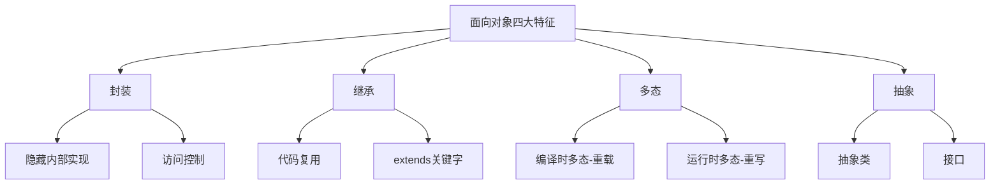

**代码示例：**
```java
// 封装示例
public class Person {
    private String name;
    private int age;
    
    public String getName() { return name; }
    public void setName(String name) { this.name = name; }
}

// 继承示例
public class Student extends Person {
    private String studentId;
}

// 多态示例
Person p = new Student(); // 父类引用指向子类对象
```

---

### 2. 访问修饰符public,private,protected,以及不写(默认)时的区别?

Java提供了四种访问修饰符，用于控制类、方法、变量的访问权限：

| 修饰符 | 同一类 | 同一包 | 不同包子类 | 不同包非子类 |
|--------|--------|--------|------------|--------------|
| private | ✓ | ✗ | ✗ | ✗ |
| 默认(default) | ✓ | ✓ | ✗ | ✗ |
| protected | ✓ | ✓ | ✓ | ✗ |
| public | ✓ | ✓ | ✓ | ✓ |

**详细说明：**

1. **private(私有)**
   - 最严格的访问级别
   - 只能在声明它的类内部访问
   - 常用于隐藏类的实现细节

2. **default(默认/包私有)**
   - 不写任何修饰符时的默认级别
   - 同一个包内的类可以访问
   - 也称为package-private

3. **protected(受保护)**
   - 同一包内的类可以访问
   - 不同包的子类也可以访问
   - 常用于希望子类可以访问但外部不能访问的成员

4. **public(公共)**
   - 最宽松的访问级别
   - 任何地方都可以访问
   - 常用于对外提供的API接口

```java
public class AccessModifierDemo {
    public String publicField = "公共字段";
    protected String protectedField = "受保护字段";
    String defaultField = "默认字段";
    private String privateField = "私有字段";
    
    public void publicMethod() {}
    protected void protectedMethod() {}
    void defaultMethod() {}
    private void privateMethod() {}
}
```

---

### 3. String是最基本的数据类型吗?

**答案：不是。**

String是一个引用类型，是Java标准库中的一个类(java.lang.String)，而不是基本数据类型。

**Java的8种基本数据类型：**


| 类型 | 字节数 | 取值范围 |
|------|--------|----------|
| byte | 1 | -128 ~ 127 |
| short | 2 | -32768 ~ 32767 |
| int | 4 | -2^31 ~ 2^31-1 |
| long | 8 | -2^63 ~ 2^63-1 |
| float | 4 | 约±3.4E38 |
| double | 8 | 约±1.7E308 |
| char | 2 | 0 ~ 65535 (Unicode字符) |
| boolean | 1 | true / false |

**String的特点：**
- String是引用类型，存储在堆内存中
- String对象是不可变的(immutable)
- String有常量池优化机制

```java
// 基本类型
int num = 10;

// 引用类型
String str = "Hello";
```

---

### 4. float f=3.4;是否正确?

**答案：不正确。**

```java
float f = 3.4;  // 编译错误！
```

**原因：**
- Java中，小数字面量默认是 `double` 类型（8字节）
- `3.4` 是double类型，赋值给float（4字节）会损失精度
- 需要强制类型转换或使用 `f` 后缀

**正确写法：**

```java
// 方式1：使用f后缀（推荐）
float f1 = 3.4f;
float f2 = 3.4F;

// 方式2：强制类型转换
float f3 = (float) 3.4;
```

---

### 5. short s1=1; s1= s1+1;有错吗?short s1=1; s1+= 1;有错吗?

**第一个有错，第二个正确。**

```java
// 错误：s1+1结果是int类型，不能直接赋值给short
short s1 = 1;
s1 = s1 + 1;  // 编译错误：不兼容的类型: 从int转换到short可能会有损失

// 正确：需要强制转换
s1 = (short) (s1 + 1);

// 正确：+=运算符隐含了强制类型转换
short s2 = 1;
s2 += 1;  // 等价于 s2 = (short)(s2 + 1)
```

**原因：**
- `s1 + 1` 会自动提升为 `int` 类型（Java的整数运算默认是int）
- `+=` 运算符会自动进行类型转换，相当于 `s1 = (short)(s1 + 1)`

---

### 6. Java有没有goto?

**答案：goto是Java的保留关键字，但没有被使用。**

```java
// goto是保留字，但不能使用
// goto label;  // 编译错误

// Java使用break和continue配合标签实现类似功能
outer:
for (int i = 0; i < 3; i++) {
    for (int j = 0; j < 3; j++) {
        if (i == 1 && j == 1) {
            break outer;  // 跳出外层循环
        }
        System.out.println(i + "," + j);
    }
}
```

**为什么Java不使用goto：**
- goto会破坏程序结构，导致代码难以理解和维护
- Java提供了更结构化的控制流语句（break、continue、return、异常处理）

---

### 7. int和Integer有什么区别?

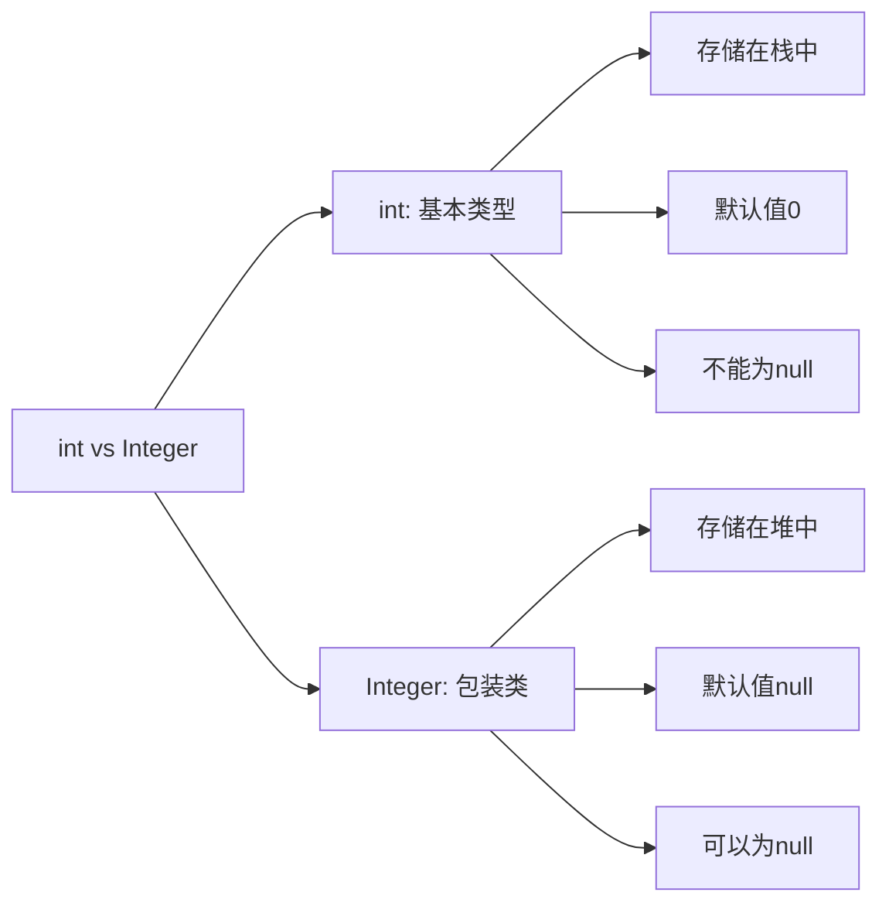

| 对比项 | int | Integer |
|--------|-----|---------|
| 类型 | 基本数据类型 | 引用类型（包装类） |
| 存储位置 | 栈 | 堆 |
| 默认值 | 0 | null |
| 是否可为null | 否 | 是 |
| 比较方式 | == | equals() |
| 性能 | 高（直接操作） | 低（对象操作） |

```java
// 基本类型
int a = 10;

// 包装类
Integer b = 10;  // 自动装箱 (autoboxing)
int c = b;       // 自动拆箱 (unboxing)

// 比较
int x = 100;
Integer y = 100;
Integer z = 100;
System.out.println(x == y);     // true（自动拆箱）
System.out.println(y == z);     // true（缓存池，-128~127）

Integer m = 200;
Integer n = 200;
System.out.println(m == n);     // false（超出缓存池范围，不同对象）
System.out.println(m.equals(n)); // true（值相等）
```

**Integer缓存池：**
- Integer缓存了 -128 到 127 之间的对象
- 这个范围内的Integer对象会被复用

---

### 8. &和&&的区别?

| 运算符 | 名称 | 短路 | 用途 |
|--------|------|------|------|
| & | 按位与 / 逻辑与 | 否 | 位运算、逻辑运算 |
| && | 短路与 | 是 | 逻辑运算 |

```java
// 1. 位运算：& 按位与
int a = 5;   // 0101
int b = 3;   // 0011
int c = a & b; // 0001 = 1

// 2. 逻辑运算：& 不短路
boolean result1 = (false & (10 / 0 > 0)); // 抛出ArithmeticException

// 3. 逻辑运算：&& 短路（推荐）
boolean result2 = (false && (10 / 0 > 0)); // false，不会执行右边

// 实际应用
String str = null;
// 错误：会抛出NullPointerException
if (str != null & str.length() > 0) { }

// 正确：短路，不会执行str.length()
if (str != null && str.length() > 0) { }
```

**短路特性：**
- `&&`：左边为false时，右边不执行
- `||`：左边为true时，右边不执行

---

### 9. 解释内存中的栈(stack)、堆(heap)和方法区(method area)的用法。

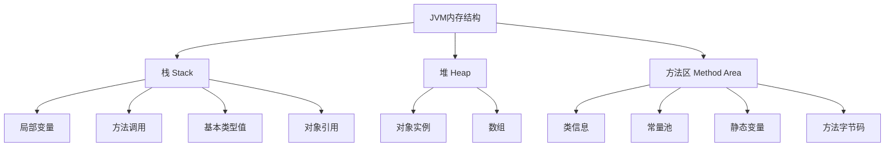

**1. 栈(Stack)：**
- 存储局部变量、方法参数、方法调用信息
- 每个线程有独立的栈
- 先进后出(LIFO)
- 自动分配和释放
- 速度快，空间小

**2. 堆(Heap)：**
- 存储对象实例和数组
- 所有线程共享
- 由垃圾回收器(GC)管理
- 速度慢，空间大

**3. 方法区(Method Area)：**
- 存储类信息、常量、静态变量、即时编译器编译后的代码
- 所有线程共享
- Java 8之前叫永久代(PermGen)，Java 8之后叫元空间(Metaspace)

```java
public class MemoryDemo {
    private static int staticVar = 10;  // 方法区（静态变量）

    public void method() {
        int localVar = 20;              // 栈（局部变量）
        String str = new String("abc"); // str引用在栈，对象在堆
        Person p = new Person();        // p引用在栈，Person对象在堆
    }
}
```

---

### 10. Math.round(11.5)等于多少?Math.round(-11.5)等于多少?

```java
Math.round(11.5);   // 12
Math.round(-11.5);  // -11
```

**Math.round()原理：**
- `round(x) = floor(x + 0.5)`
- 即：先加0.5，然后向下取整

```java
// 正数
Math.round(11.5)  = floor(11.5 + 0.5) = floor(12.0) = 12
Math.round(11.4)  = floor(11.4 + 0.5) = floor(11.9) = 11

// 负数
Math.round(-11.5) = floor(-11.5 + 0.5) = floor(-11.0) = -11
Math.round(-11.6) = floor(-11.6 + 0.5) = floor(-11.1) = -12
```

---

### 11. switch是否能作用在byte上,是否能作用在long上,是否能作用在String上?

| 类型 | 是否支持 | 说明 |
|------|---------|------|
| byte | ✓ | 支持 |
| short | ✓ | 支持 |
| char | ✓ | 支持 |
| int | ✓ | 支持 |
| long | ✗ | 不支持 |
| String | ✓ | Java 7+ 支持 |
| enum | ✓ | Java 5+ 支持 |

```java
// 支持byte
byte b = 1;
switch (b) {
    case 1: break;
}

// 不支持long
long l = 1L;
switch (l) {  // 编译错误
    case 1L: break;
}

// 支持String (Java 7+)
String str = "hello";
switch (str) {
    case "hello": break;
    case "world": break;
}

// 支持enum
enum Day { MON, TUE }
Day day = Day.MON;
switch (day) {
    case MON: break;
    case TUE: break;
}
```

---

### 12. 用最有效率的方法计算2乘以8?

```java
// 最高效：位运算（左移3位）
int result = 2 << 3;  // 2 * 2^3 = 2 * 8 = 16
```

**原理：**
- 左移n位 = 乘以2^n
- `2 << 3` = 2 * 2³ = 2 * 8 = 16
- 位运算直接操作二进制，比乘法指令快

```java
// 性能对比
int a = 2 * 8;      // 普通乘法
int b = 2 << 3;     // 位运算（更快）

// 其他例子
4 << 1  // 4 * 2 = 8
5 << 2  // 5 * 4 = 20
```

**注意：** 现代JVM的JIT编译器会自动优化乘法为位运算，所以实际开发中为了代码可读性，直接写 `2 * 8` 即可。

---

### 13. 数组有没有length()方法?String有没有length()方法?

```java
// 数组：length是属性（不是方法）
int[] arr = {1, 2, 3};
int len1 = arr.length;     // 正确
int len2 = arr.length();   // 编译错误

// String：length()是方法
String str = "hello";
int len3 = str.length();   // 正确
int len4 = str.length;     // 编译错误
```

| 类型 | 获取长度方式 | 类型 |
|------|------------|------|
| 数组 | length | 属性(final) |
| String | length() | 方法 |
| List/Collection | size() | 方法 |

---

### 14. 在Java中，如何跳出当前的多重嵌套循环?

**方法1：使用标签(label) + break（推荐）**

```java
outer:
for (int i = 0; i < 3; i++) {
    for (int j = 0; j < 3; j++) {
        if (i == 1 && j == 1) {
            break outer;  // 跳出外层循环
        }
        System.out.println(i + "," + j);
    }
}
```

**方法2：使用标志变量**

```java
boolean found = false;
for (int i = 0; i < 3 && !found; i++) {
    for (int j = 0; j < 3; j++) {
        if (i == 1 && j == 1) {
            found = true;
            break;  // 跳出内层循环
        }
    }
}
```

**方法3：提取为方法，使用return**

```java
public void search() {
    for (int i = 0; i < 3; i++) {
        for (int j = 0; j < 3; j++) {
            if (i == 1 && j == 1) {
                return;  // 直接返回，跳出所有循环
            }
        }
    }
}
```

---

### 15. 构造器(constructor)是否可被重写(override)?

**答案：不能。**

**原因：**
- 构造器不能被继承，因此不能被重写(override)
- 构造器可以被重载(overload)
- 子类可以通过 `super()` 调用父类构造器

```java
class Parent {
    // 构造器重载（可以）
    public Parent() { }
    public Parent(String name) { }
}

class Child extends Parent {
    public Child() {
        super();  // 调用父类构造器
    }

    // 这不是重写父类构造器，而是子类自己的构造器
    public Child(String name) {
        super(name);
    }
}
```

**重写(Override) vs 重载(Overload)：**
- 重写：子类重新定义父类的方法（方法签名相同）
- 重载：同一个类中，方法名相同但参数不同

---

### 16. 两个对象值相同(x.equals(y)==true),但却可有不同的hash code,这句话对不对?

**答案：不对。这违反了hashCode契约。**

**hashCode契约（必须遵守）：**
1. 同一对象多次调用hashCode()，返回值必须相同
2. **如果 `x.equals(y) == true`，则 `x.hashCode() == y.hashCode()` 必须为true**
3. 如果 `x.equals(y) == false`，hashCode可以相同也可以不同（但不同更好，减少哈希冲突）

```java
// 错误示例：违反契约
class BadPerson {
    private String name;

    @Override
    public boolean equals(Object obj) {
        if (obj instanceof BadPerson) {
            return this.name.equals(((BadPerson) obj).name);
        }
        return false;
    }

    // 错误：没有重写hashCode，使用Object的默认实现
    // 导致equals相等但hashCode不同
}

// 正确示例
class GoodPerson {
    private String name;

    @Override
    public boolean equals(Object obj) {
        if (obj instanceof GoodPerson) {
            return this.name.equals(((GoodPerson) obj).name);
        }
        return false;
    }

    @Override
    public int hashCode() {
        return name.hashCode();  // equals相等，hashCode也相等
    }
}
```

**为什么要遵守契约：**
- HashMap、HashSet等依赖hashCode和equals
- 违反契约会导致这些集合无法正常工作

```java
BadPerson p1 = new BadPerson("张三");
BadPerson p2 = new BadPerson("张三");

System.out.println(p1.equals(p2));  // true
System.out.println(p1.hashCode() == p2.hashCode());  // false（错误！）

// 导致HashMap无法正常工作
Map<BadPerson, String> map = new HashMap<>();
map.put(p1, "value");
System.out.println(map.get(p2));  // null（应该是"value"）
```

---

### 17. 是否可以继承String类?

**答案：不可以。**

**原因：String类被声明为 `final`。**

```java
public final class String { ... }

// 编译错误：无法从final String进行继承
class MyString extends String { }
```

**为什么String是final：**
1. **安全性**：String被广泛用于参数传递，如果可以继承，子类可能改变行为，导致安全问题
2. **不可变性**：保证String的不可变特性不被破坏
3. **性能优化**：JVM可以对String进行特殊优化（如字符串常量池）
4. **哈希值缓存**：String的hashCode可以缓存，继承会破坏这个优化

---

### 18. 当一个对象被当作参数传递到一个方法后，此方法可改变这个对象的属性,并可返回变化后的结果,那么这里到底是值传递还是引用传递?

**答案：Java只有值传递，没有引用传递。**

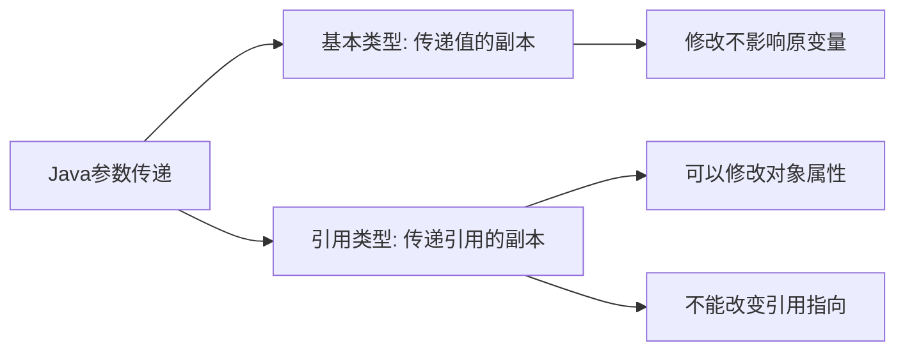

```java
// 示例1：基本类型（值传递）
public void changeInt(int x) {
    x = 100;  // 只改变副本，不影响原变量
}
int a = 10;
changeInt(a);
System.out.println(a);  // 10（未改变）

// 示例2：引用类型（传递引用的副本）
public void changePerson(Person p) {
    p.setName("李四");  // 可以修改对象属性
    p = new Person("王五");  // 不能改变原引用指向
}
Person person = new Person("张三");
changePerson(person);
System.out.println(person.getName());  // "李四"（不是"王五"）

// 示例3：String特殊性（不可变）
public void changeString(String s) {
    s = "world";  // 创建新对象，不影响原引用
}
String str = "hello";
changeString(str);
System.out.println(str);  // "hello"（未改变）
```

**关键点：**
- Java传递的是**引用的副本**，不是引用本身
- 可以通过引用副本修改对象的属性
- 不能改变原引用指向的对象

---

### 19. String和StringBuilder、StringBuffer的区别?

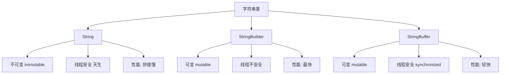

| 特性 | String | StringBuilder | StringBuffer |
|------|--------|---------------|--------------|
| 可变性 | 不可变 | 可变 | 可变 |
| 线程安全 | 安全 | 不安全 | 安全(synchronized) |
| 性能 | 拼接慢 | 快 | 较快 |
| 使用场景 | 少量拼接 | 单线程大量拼接 | 多线程大量拼接 |

```java
// String：不可变，每次拼接都创建新对象
String s = "a";
s += "b";  // 创建新String对象"ab"，原"a"对象被丢弃
s += "c";  // 再创建新String对象"abc"

// StringBuilder：可变，单线程推荐
StringBuilder sb = new StringBuilder("a");
sb.append("b");  // 在原对象上修改
sb.append("c");
String result = sb.toString();

// StringBuffer：可变，线程安全
StringBuffer sbf = new StringBuffer("a");
sbf.append("b");  // synchronized方法
sbf.append("c");
```

**性能对比（10000次拼接）：**
- String: 约 1000ms（创建大量临时对象）
- StringBuilder: 约 1ms
- StringBuffer: 约 2ms（synchronized开销）

**选择建议：**
- 少量拼接（<10次）：String（代码简洁）
- 单线程大量拼接：StringBuilder
- 多线程大量拼接：StringBuffer 或 StringBuilder + 外部同步

---

### 20. 重载(Overload)和重写(Override)的区别。重载的方法能否根据返回类型进行区分?

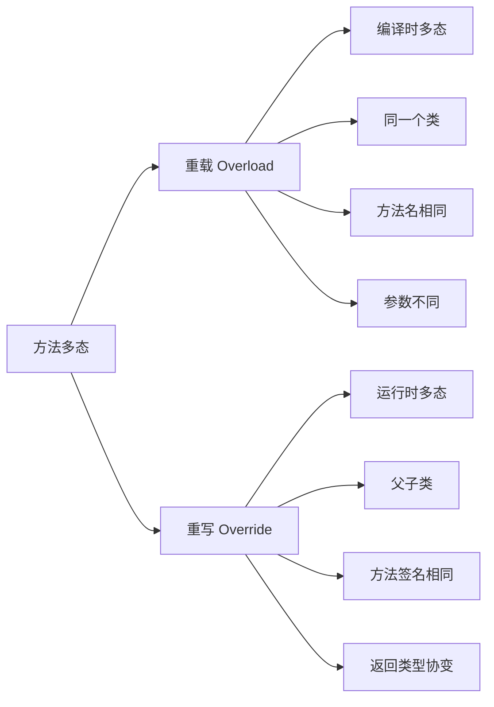

| 对比项 | 重载(Overload) | 重写(Override) |
|--------|---------------|---------------|
| 发生位置 | 同一个类 | 父子类之间 |
| 方法名 | 相同 | 相同 |
| 参数列表 | 必须不同 | 必须相同 |
| 返回类型 | 可以不同 | 相同或协变 |
| 访问修饰符 | 可以不同 | 不能更严格 |
| 异常 | 可以不同 | 不能抛出新的或更广的checked异常 |
| 多态类型 | 编译时多态 | 运行时多态 |

```java
// 重载示例
class Calculator {
    public int add(int a, int b) { return a + b; }
    public double add(double a, double b) { return a + b; }  // 参数类型不同
    public int add(int a, int b, int c) { return a + b + c; }  // 参数个数不同
}

// 重写示例
class Animal {
    public void makeSound() {
        System.out.println("动物叫");
    }
}

class Dog extends Animal {
    @Override
    public void makeSound() {  // 重写父类方法
        System.out.println("汪汪");
    }
}
```

**重载能否根据返回类型区分？**

**答案：不能。**

```java
// 编译错误：方法签名重复
class Test {
    public int method() { return 1; }
    public String method() { return "a"; }  // 编译错误
}
```

**原因：**
- 方法签名 = 方法名 + 参数列表（不包括返回类型）
- 调用时无法根据返回类型确定调用哪个方法

```java
Test t = new Test();
t.method();  // 编译器无法判断调用哪个method
```

**重写的返回类型协变：**

```java
class Parent {
    public Number getValue() { return 1; }
}

class Child extends Parent {
    @Override
    public Integer getValue() { return 1; }  // 返回类型是父类返回类型的子类（协变）
}
```


---

### 21. 描述一下JVM加载class文件的原理机制?

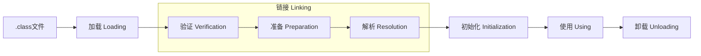

**类加载的五个阶段：**

**1. 加载(Loading)**
- 通过类的全限定名获取类的二进制字节流
- 将字节流转化为方法区的运行时数据结构
- 在堆中生成对应的Class对象

**2. 验证(Verification)**
- 确保字节码符合JVM规范
- 包括：文件格式验证、元数据验证、字节码验证、符号引用验证

**3. 准备(Preparation)**
- 为类的静态变量分配内存，并设置默认初始值
- 注意：此时只是默认值，不是代码中赋的值

```java
public static int value = 123;
// 准备阶段：value = 0（默认值）
// 初始化阶段：value = 123（赋值）
```

**4. 解析(Resolution)**
- 将常量池中的符号引用替换为直接引用

**5. 初始化(Initialization)**
- 执行类构造器 `<clinit>()` 方法
- 执行静态变量赋值和静态代码块

**类加载器：**

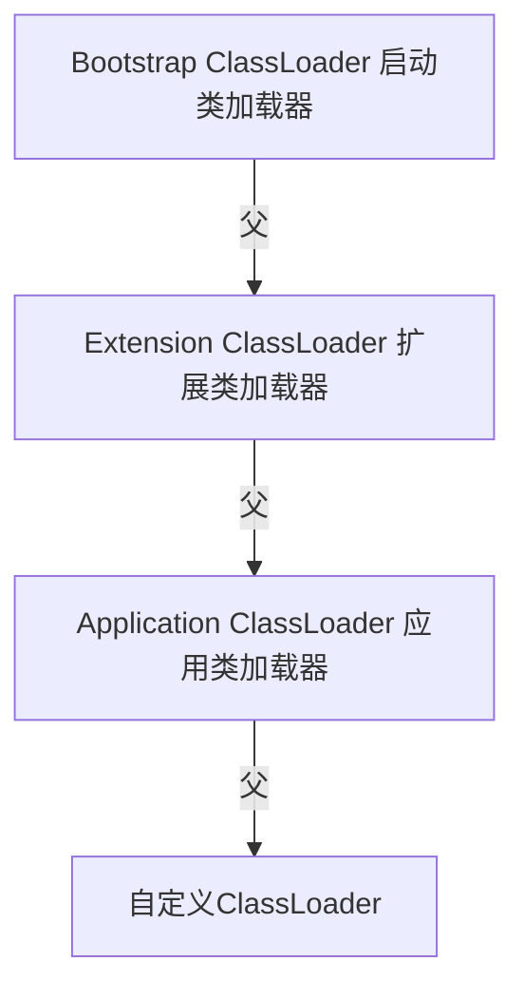

**双亲委派模型：**
- 加载类时，先委托父类加载器加载
- 父类无法加载时，才由子类加载器加载
- 保证核心类库不被篡改

---

### 22. char型变量中能不能存贮一个中文汉字,为什么?

**答案：可以。**

```java
char c = '中';  // 合法
System.out.println(c);  // 中
```

**原因：**
- Java中的char类型占2个字节（16位）
- Java使用Unicode编码，Unicode可以表示65536个字符
- 中文汉字的Unicode编码范围是 0x4E00 ~ 0x9FFF，在char的范围内

```java
char c = '中';
System.out.println((int) c);  // 20013（中文"中"的Unicode码点）
System.out.println(Character.isLetter(c));  // true
```

**注意：** 某些生僻字（增补字符）的Unicode码点超过65535，需要用两个char（代理对）表示，此时一个char无法存储。

---

### 23. 抽象类(abstract class)和接口(interface)有什么异同?

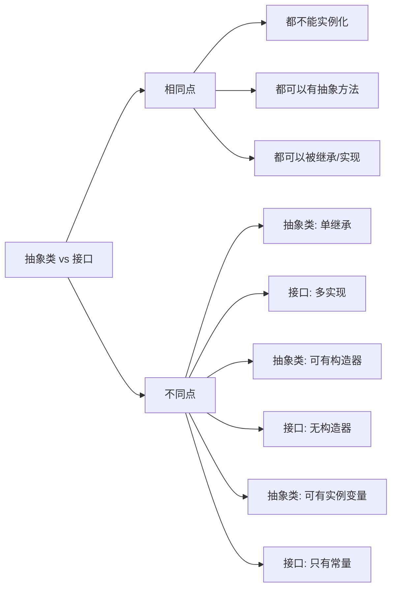

| 对比项 | 抽象类 | 接口 |
|--------|--------|------|
| 关键字 | abstract class | interface |
| 继承/实现 | extends（单继承） | implements（多实现） |
| 构造器 | 有 | 无 |
| 实例变量 | 可以有 | 只有public static final常量 |
| 方法 | 可以有具体方法 | Java 8前只有抽象方法；Java 8+可有default/static方法 |
| 访问修饰符 | 任意 | 方法默认public |
| 设计目的 | is-a关系，代码复用 | can-do关系，定义规范 |

```java
// 抽象类
abstract class Animal {
    private String name;  // 实例变量

    public Animal(String name) {  // 构造器
        this.name = name;
    }

    public abstract void makeSound();  // 抽象方法

    public void breathe() {  // 具体方法
        System.out.println("呼吸");
    }
}

// 接口
interface Flyable {
    int MAX_HEIGHT = 10000;  // 隐式 public static final

    void fly();  // 隐式 public abstract

    default void land() {  // Java 8+ 默认方法
        System.out.println("降落");
    }
}

// 使用
class Bird extends Animal implements Flyable {
    public Bird(String name) { super(name); }

    @Override
    public void makeSound() { System.out.println("叽叽"); }

    @Override
    public void fly() { System.out.println("飞翔"); }
}
```

**选择建议：**
- 用抽象类：有共同的代码实现，is-a关系（Dog is-a Animal）
- 用接口：定义行为规范，can-do关系（Bird can fly）

---

### 24. 静态嵌套类(Static Nested Class)和内部类(Inner Class)的不同?

```java
class Outer {
    private int x = 10;
    private static int y = 20;

    // 静态嵌套类（Static Nested Class）
    static class StaticNested {
        void method() {
            // System.out.println(x);  // 错误：不能访问外部类实例变量
            System.out.println(y);     // 可以访问外部类静态变量
        }
    }

    // 内部类（Inner Class / Non-static Nested Class）
    class Inner {
        void method() {
            System.out.println(x);  // 可以访问外部类实例变量
            System.out.println(y);  // 可以访问外部类静态变量
        }
    }
}

// 使用
Outer.StaticNested sn = new Outer.StaticNested();  // 不需要外部类实例

Outer outer = new Outer();
Outer.Inner inner = outer.new Inner();  // 需要外部类实例
```

| 对比项 | 静态嵌套类 | 内部类 |
|--------|-----------|--------|
| 关键字 | static | 无 |
| 实例化 | 不需要外部类实例 | 需要外部类实例 |
| 访问外部类成员 | 只能访问静态成员 | 可以访问所有成员 |
| 持有外部类引用 | 否 | 是（隐式） |
| 内存泄漏风险 | 低 | 高（持有外部类引用） |

---

### 25. Java中会存在内存泄漏吗,请简单描述。

**答案：会。** 虽然Java有GC，但仍然可能发生内存泄漏。

**内存泄漏：** 对象不再被使用，但GC无法回收（因为仍然有引用指向它）。

**常见内存泄漏场景：**

```java
// 1. 静态集合持有对象引用
static List<Object> list = new ArrayList<>();
list.add(new Object());  // 对象永远不会被GC

// 2. 未关闭的资源
Connection conn = getConnection();
// 忘记关闭，连接对象无法被GC

// 3. 内部类持有外部类引用
class Outer {
    class Inner { }  // Inner持有Outer的引用
    // 如果Inner对象生命周期比Outer长，Outer无法被GC
}

// 4. ThreadLocal未remove
ThreadLocal<Object> tl = new ThreadLocal<>();
tl.set(new Object());
// 线程池中线程不会销毁，如果不remove，对象永远不会被GC

// 5. 缓存未清理
Map<String, Object> cache = new HashMap<>();
// 不断往cache中添加，不清理，内存持续增长
```

**解决方法：**
- 使用完资源及时关闭（try-with-resources）
- 使用WeakReference/SoftReference
- ThreadLocal使用后调用remove()
- 使用内存分析工具（MAT、JProfiler）排查

---

### 26. 抽象的(abstract)方法是否可同时是静态的(static),是否可同时是本地方法(native),是否可同时被synchronized修饰?

**三个都不可以。**

```java
abstract class Test {
    // 错误：abstract方法不能是static
    public abstract static void method1();

    // 错误：abstract方法不能是native
    public abstract native void method2();

    // 错误：abstract方法不能是synchronized
    public abstract synchronized void method3();
}
```

**原因：**
- **abstract + static**：static方法属于类，不能被重写；abstract方法需要被重写，矛盾
- **abstract + native**：native方法有本地实现，abstract方法没有实现，矛盾
- **abstract + synchronized**：synchronized需要方法体来加锁，abstract没有方法体，矛盾

---

### 27. 阐述静态变量和实例变量的区别。

```java
class Counter {
    private static int staticCount = 0;  // 静态变量（类变量）
    private int instanceCount = 0;       // 实例变量

    public Counter() {
        staticCount++;
        instanceCount++;
    }
}

Counter c1 = new Counter();
Counter c2 = new Counter();
Counter c3 = new Counter();

// staticCount = 3（所有对象共享）
// c1.instanceCount = 1, c2.instanceCount = 1, c3.instanceCount = 1（各自独立）
```

| 对比项 | 静态变量 | 实例变量 |
|--------|---------|---------|
| 关键字 | static | 无 |
| 存储位置 | 方法区（元空间） | 堆（对象内部） |
| 归属 | 类 | 对象实例 |
| 共享性 | 所有实例共享 | 每个实例独立 |
| 生命周期 | 类加载到类卸载 | 对象创建到GC回收 |
| 访问方式 | 类名.变量名 | 对象.变量名 |

---

### 28. 是否可以从一个静态(static)方法内部发出对非静态(non-static)方法的调用?

**答案：不可以直接调用，但可以通过对象实例调用。**

```java
class Test {
    private int instanceVar = 10;

    public void instanceMethod() {
        System.out.println("实例方法");
    }

    public static void staticMethod() {
        // 错误：不能直接调用实例方法
        // instanceMethod();  // 编译错误
        // System.out.println(instanceVar);  // 编译错误

        // 正确：通过对象实例调用
        Test t = new Test();
        t.instanceMethod();  // 可以
        System.out.println(t.instanceVar);  // 可以
    }
}
```

**原因：**
- 静态方法属于类，调用时不需要对象实例
- 实例方法需要通过对象调用（隐含this引用）
- 静态方法中没有this，无法确定调用哪个对象的实例方法

---

### 29. 如何实现对象克隆?

**方式1：实现Cloneable接口（浅克隆）**

```java
class Person implements Cloneable {
    private String name;
    private int age;
    private Address address;  // 引用类型

    @Override
    public Person clone() throws CloneNotSupportedException {
        return (Person) super.clone();  // 浅克隆：address引用被复制，不是新对象
    }
}
```

**方式2：深克隆（手动复制引用类型）**

```java
class Person implements Cloneable {
    private String name;
    private Address address;

    @Override
    public Person clone() throws CloneNotSupportedException {
        Person cloned = (Person) super.clone();
        cloned.address = this.address.clone();  // 深克隆address
        return cloned;
    }
}
```

**方式3：序列化实现深克隆**

```java
public static <T extends Serializable> T deepClone(T obj) throws Exception {
    ByteArrayOutputStream bos = new ByteArrayOutputStream();
    ObjectOutputStream oos = new ObjectOutputStream(bos);
    oos.writeObject(obj);

    ByteArrayInputStream bis = new ByteArrayInputStream(bos.toByteArray());
    ObjectInputStream ois = new ObjectInputStream(bis);
    return (T) ois.readObject();
}
```

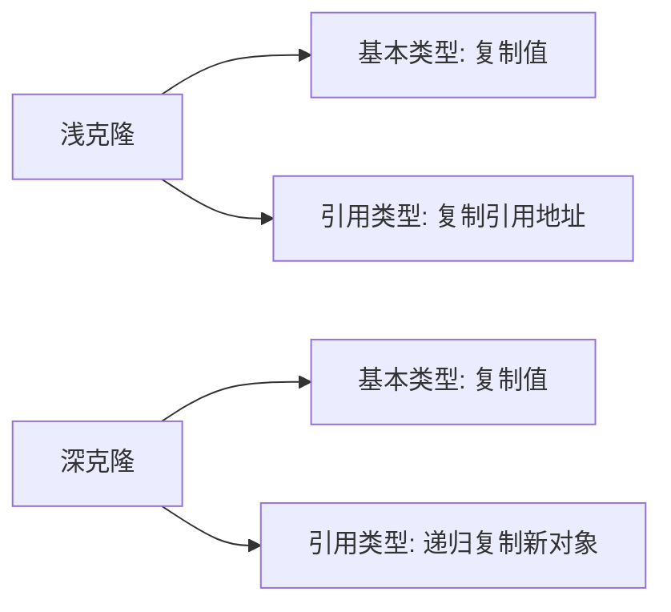

---

### 30. GC是什么?为什么要有GC?

**GC（Garbage Collection，垃圾回收）：** JVM自动回收不再使用的对象所占用的内存。

**为什么要有GC：**
- 手动管理内存（如C/C++）容易出现内存泄漏和悬空指针
- GC自动管理内存，让开发者专注于业务逻辑
- 防止内存泄漏，提高程序稳定性

**GC的工作原理：**

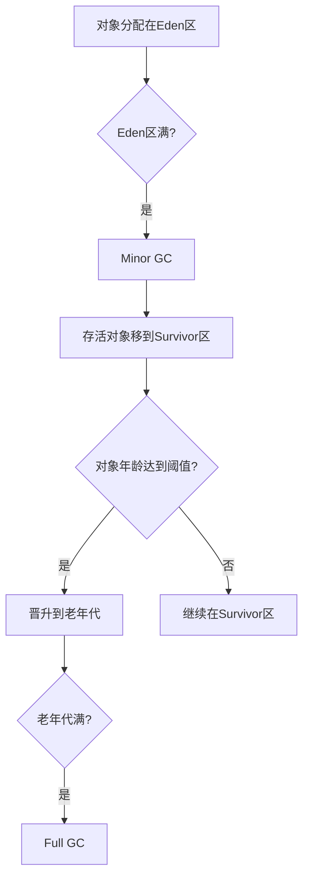

**常见GC算法：**
- **标记-清除**：标记垃圾对象，然后清除（会产生内存碎片）
- **标记-整理**：标记后，将存活对象移到一端，清除边界外的内存
- **复制算法**：将内存分两半，存活对象复制到另一半（Eden/Survivor使用）
- **分代收集**：新生代用复制算法，老年代用标记-整理

---

### 31. String s=new String("xyz");创建了几个字符串对象?

**答案：1个或2个，取决于字符串常量池中是否已有"xyz"。**

```java
String s = new String("xyz");
```

**分析：**
1. 首先检查字符串常量池中是否有"xyz"
   - 如果没有：在常量池中创建"xyz"，再在堆中创建String对象 → **2个对象**
   - 如果已有：只在堆中创建String对象 → **1个对象**

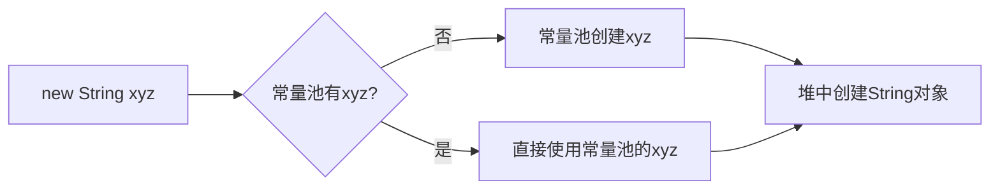

**对比：**

```java
String s1 = "xyz";          // 只在常量池中创建（如果没有的话）
String s2 = new String("xyz");  // 在堆中创建新对象

System.out.println(s1 == s2);       // false（不同对象）
System.out.println(s1.equals(s2));  // true（值相同）
System.out.println(s1 == s2.intern()); // true（intern返回常量池中的引用）
```

---

### 32. 接口是否可继承(extends)接口?抽象类是否可实现(implements)接口?抽象类是否可继承具体类(concrete class)?

```java
// 1. 接口可以继承接口（可以多继承）
interface A { void methodA(); }
interface B { void methodB(); }
interface C extends A, B { void methodC(); }  // 接口多继承

// 2. 抽象类可以实现接口（可以不实现接口的方法）
abstract class AbstractImpl implements C {
    @Override
    public void methodA() { }  // 可以实现部分方法
    // methodB()和methodC()留给子类实现
}

// 3. 抽象类可以继承具体类
class ConcreteClass {
    public void concreteMethod() { }
}
abstract class AbstractChild extends ConcreteClass {
    public abstract void abstractMethod();
}
```

**总结：**
- 接口 extends 接口：✓（可以多继承）
- 抽象类 implements 接口：✓（可以不实现所有方法）
- 抽象类 extends 具体类：✓

---

### 33. 一个".java"源文件中是否可以包含多个类(不是内部类)?有什么限制?

**答案：可以，但有限制。**

```java
// 文件名：Main.java

class Helper {  // 非public类，可以有多个
    void help() { }
}

class Util {    // 非public类，可以有多个
    void util() { }
}

public class Main {  // public类，只能有一个，且必须与文件名相同
    public static void main(String[] args) { }
}
```

**限制：**
1. 一个.java文件中最多只能有**一个public类**
2. 如果有public类，**文件名必须与public类名完全相同**
3. 可以有多个非public类（package-private）

---

### 34. Anonymous Inner Class(匿名内部类)是否可以继承其它类?是否可以实现接口?

```java
// 匿名内部类继承类
abstract class Animal {
    abstract void makeSound();
}

Animal dog = new Animal() {  // 匿名内部类继承Animal
    @Override
    void makeSound() {
        System.out.println("汪汪");
    }
};

// 匿名内部类实现接口
Runnable r = new Runnable() {  // 匿名内部类实现Runnable接口
    @Override
    public void run() {
        System.out.println("运行");
    }
};
```

**结论：**
- 匿名内部类可以继承一个类（包括抽象类）
- 匿名内部类可以实现一个接口
- 匿名内部类不能同时继承类和实现接口（因为没有类名，无法写 `extends` 和 `implements`）
- 匿名内部类不能有构造器（因为没有类名）

---

### 35. 内部类可以引用它的包含类(外部类)的成员吗?有没有什么限制?

```java
class Outer {
    private int privateVar = 1;
    protected int protectedVar = 2;
    public int publicVar = 3;
    static int staticVar = 4;

    class Inner {
        void method() {
            // 内部类可以访问外部类的所有成员（包括private）
            System.out.println(privateVar);    // 可以
            System.out.println(protectedVar);  // 可以
            System.out.println(publicVar);     // 可以
            System.out.println(staticVar);     // 可以
        }
    }

    static class StaticNested {
        void method() {
            // 静态嵌套类只能访问外部类的静态成员
            // System.out.println(privateVar);  // 错误
            System.out.println(staticVar);     // 可以
        }
    }
}
```

**限制：**
- **非静态内部类**：可以访问外部类的所有成员（包括private）
- **静态嵌套类**：只能访问外部类的静态成员
- **局部内部类/匿名内部类**：可以访问外部类成员，但只能访问final或effectively final的局部变量

```java
void method() {
    int x = 10;  // effectively final
    Runnable r = new Runnable() {
        public void run() {
            System.out.println(x);  // 可以，x是effectively final
        }
    };
}
```

---

### 36. Java中的final关键字有哪些用法?

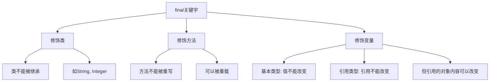

```java
// 1. final类：不能被继承
public final class String { }

// 2. final方法：不能被重写
class Parent {
    public final void finalMethod() { }
}
class Child extends Parent {
    // public void finalMethod() { }  // 编译错误
}

// 3. final变量：只能赋值一次
final int x = 10;
// x = 20;  // 编译错误

final List<String> list = new ArrayList<>();
list.add("a");  // 可以：引用不变，但对象内容可以改变
// list = new ArrayList<>();  // 编译错误：引用不能改变

// 4. final参数
public void method(final int param) {
    // param = 10;  // 编译错误
}

// 5. 空白final（blank final）：声明时不赋值，在构造器中赋值
class Config {
    private final String host;
    public Config(String host) {
        this.host = host;  // 在构造器中赋值
    }
}
```

---

### 37. 指出下面程序的运行结果

```java
class A {
    static {
        System.out.print("1");
    }
    public A() {
        System.out.print("2");
    }
}

class B extends A {
    static {
        System.out.print("a");
    }
    public B() {
        System.out.print("b");
    }
}

public class Hello {
    public static void main(String[] args) {
        A ab = new B();
        ab = new B();
    }
}
```

**运行结果：`1a2b2b`**

**执行顺序分析：**
1. 加载类A，执行A的静态块 → 输出 `1`
2. 加载类B，执行B的静态块 → 输出 `a`
3. 创建第一个B对象：
   - 调用父类A的构造器 → 输出 `2`
   - 调用B的构造器 → 输出 `b`
4. 创建第二个B对象：
   - 静态块只执行一次，不再执行
   - 调用父类A的构造器 → 输出 `2`
   - 调用B的构造器 → 输出 `b`

**规律：**
- 静态块：类加载时执行，只执行一次
- 构造器：每次创建对象时执行
- 父类静态块 → 子类静态块 → 父类构造器 → 子类构造器

---

### 38. 数据类型之间的转换

**自动类型转换（隐式转换）：** 小类型 → 大类型

```
byte → short → int → long → float → double
                char ↗
```

```java
int i = 100;
long l = i;      // 自动转换
float f = l;     // 自动转换
double d = f;    // 自动转换
```

**强制类型转换（显式转换）：** 大类型 → 小类型（可能损失精度）

```java
double d = 3.14;
int i = (int) d;  // 强制转换，i = 3（小数部分丢失）

long l = 1000000000000L;
int x = (int) l;  // 可能溢出
```

**字符串与其他类型转换：**

```java
// 其他类型 → String
String s1 = String.valueOf(123);
String s2 = Integer.toString(123);
String s3 = 123 + "";  // 简便写法

// String → 其他类型
int i = Integer.parseInt("123");
double d = Double.parseDouble("3.14");
boolean b = Boolean.parseBoolean("true");
```

---

### 39. 如何实现字符串的反转及替换?

```java
// 字符串反转
String str = "Hello World";

// 方式1：StringBuilder（推荐）
String reversed = new StringBuilder(str).reverse().toString();
// "dlroW olleH"

// 方式2：手动实现
char[] chars = str.toCharArray();
int left = 0, right = chars.length - 1;
while (left < right) {
    char temp = chars[left];
    chars[left] = chars[right];
    chars[right] = temp;
    left++;
    right--;
}
String reversed2 = new String(chars);

// 字符串替换
String s = "Hello World Hello";

// replace：替换所有匹配的字符/字符串
String r1 = s.replace("Hello", "Hi");  // "Hi World Hi"

// replaceFirst：只替换第一个
String r2 = s.replaceFirst("Hello", "Hi");  // "Hi World Hello"

// replaceAll：支持正则表达式
String r3 = s.replaceAll("\s+", "-");  // "Hello-World-Hello"（空白替换为-）
```

---

### 40. 怎样将GB2312编码的字符串转换为ISO-8859-1编码的字符串?

```java
// GB2312 → ISO-8859-1
String gb2312Str = "你好世界";

// 方式1：通过字节数组转换
byte[] bytes = gb2312Str.getBytes("GB2312");
String iso88591Str = new String(bytes, "ISO-8859-1");

// 方式2：反向转换（ISO-8859-1 → GB2312）
byte[] bytes2 = iso88591Str.getBytes("ISO-8859-1");
String original = new String(bytes2, "GB2312");

// 现代Java推荐使用Charset
import java.nio.charset.Charset;
byte[] bytes3 = gb2312Str.getBytes(Charset.forName("GB2312"));
String result = new String(bytes3, Charset.forName("ISO-8859-1"));
```

**注意：** 编码转换可能导致乱码，因为不同编码的字符集不同。现代开发推荐统一使用UTF-8编码。


---

### 41. 日期和时间

```java
// Java 8之前：Date和Calendar（不推荐）
Date now = new Date();
Calendar cal = Calendar.getInstance();
cal.get(Calendar.YEAR);   // 年
cal.get(Calendar.MONTH);  // 月（0-11）
cal.get(Calendar.DAY_OF_MONTH);  // 日

// Java 8+：LocalDate/LocalTime/LocalDateTime（推荐）
LocalDate date = LocalDate.now();          // 2024-01-15
LocalTime time = LocalTime.now();          // 10:30:45
LocalDateTime dateTime = LocalDateTime.now(); // 2024-01-15T10:30:45

// 创建指定日期
LocalDate birthday = LocalDate.of(1990, 5, 20);
LocalDateTime meeting = LocalDateTime.of(2024, 1, 15, 10, 30);

// 格式化
DateTimeFormatter formatter = DateTimeFormatter.ofPattern("yyyy-MM-dd HH:mm:ss");
String formatted = dateTime.format(formatter);  // "2024-01-15 10:30:45"

// 解析
LocalDateTime parsed = LocalDateTime.parse("2024-01-15 10:30:45", formatter);

// 日期计算
LocalDate tomorrow = date.plusDays(1);
LocalDate lastMonth = date.minusMonths(1);
long daysBetween = ChronoUnit.DAYS.between(birthday, date);
```

---

### 42. 打印昨天的当前时刻。

```java
// Java 8+ 方式（推荐）
LocalDateTime yesterday = LocalDateTime.now().minusDays(1);
System.out.println(yesterday);

// 格式化输出
DateTimeFormatter formatter = DateTimeFormatter.ofPattern("yyyy-MM-dd HH:mm:ss");
System.out.println(yesterday.format(formatter));

// Java 8之前方式
Calendar cal = Calendar.getInstance();
cal.add(Calendar.DAY_OF_MONTH, -1);
System.out.println(new SimpleDateFormat("yyyy-MM-dd HH:mm:ss").format(cal.getTime()));
```

---

### 43. 比较一下Java和JavaScript。

| 对比项 | Java | JavaScript |
|--------|------|------------|
| 类型 | 静态类型、强类型 | 动态类型、弱类型 |
| 运行环境 | JVM | 浏览器/Node.js |
| 编译方式 | 编译型（字节码） | 解释型（JIT） |
| 面向对象 | 基于类 | 基于原型 |
| 并发 | 多线程 | 单线程+事件循环 |
| 用途 | 后端、Android | 前端、全栈 |
| 继承 | extends关键字 | 原型链 |
| 关系 | 无关（名字相似是营销策略） | 无关 |

**核心区别：**
- Java是强类型语言，变量类型在编译时确定
- JavaScript是弱类型语言，变量类型在运行时确定
- 两者除了名字相似，没有任何关系

---

### 44. 什么时候用断言(assert)?

**断言(assert)** 用于在开发和测试阶段验证程序的假设条件。

```java
// 语法
assert 条件;
assert 条件 : "错误信息";

// 示例
public int divide(int a, int b) {
    assert b != 0 : "除数不能为0";  // 开发时验证
    return a / b;
}

// 启用断言（默认关闭）
// java -ea MyClass  或  java -enableassertions MyClass
```

**使用场景：**
- 验证方法的前置条件（参数合法性）
- 验证方法的后置条件（返回值合法性）
- 验证不变量（循环中的条件）

**注意：**
- 断言默认是关闭的，需要 `-ea` 参数启用
- 不要用断言做参数校验（用户输入），因为生产环境断言可能关闭
- 不要在断言中有副作用（如修改变量）

---

### 45. Error和Exception有什么区别?

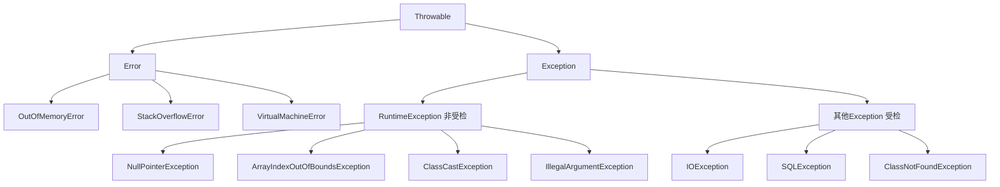

| 对比项 | Error | Exception |
|--------|-------|-----------|
| 含义 | JVM级别的严重错误 | 程序可以处理的异常 |
| 是否可恢复 | 通常不可恢复 | 可以捕获处理 |
| 是否需要捕获 | 不需要（也无意义） | 受检异常必须处理 |
| 例子 | OOM、StackOverflow | IOException、NPE |

---

### 46. try{}里有一个return语句，那么紧跟在这个try后的finally{}里的代码会不会被执行，什么时候被执行，在return前还是后?

**答案：finally一定会执行，在return之前执行（但return的值已经确定）。**

```java
public int test() {
    try {
        return 1;  // 先确定返回值为1
    } finally {
        System.out.println("finally执行");  // 在return前执行
        // return 2;  // 如果finally中有return，会覆盖try中的return
    }
}
// 输出：finally执行
// 返回值：1
```

**finally中有return的情况：**

```java
public int test2() {
    try {
        return 1;
    } finally {
        return 2;  // 覆盖try中的return
    }
}
// 返回值：2（finally中的return覆盖了try中的return）
```

**finally修改基本类型变量：**

```java
public int test3() {
    int x = 1;
    try {
        return x;  // 返回值已确定为1（副本）
    } finally {
        x = 2;  // 修改x，但不影响已确定的返回值
    }
}
// 返回值：1（不是2）
```

**finally不执行的情况：**
- `System.exit()` 被调用
- JVM崩溃
- 线程被强制终止

---

### 47. Java语言如何进行异常处理，关键字:throws、throw、try、catch、finally分别如何使用?

```java
// try-catch-finally 基本结构
try {
    // 可能抛出异常的代码
    int result = 10 / 0;
} catch (ArithmeticException e) {
    // 捕获特定异常
    System.out.println("算术异常: " + e.getMessage());
} catch (Exception e) {
    // 捕获更广泛的异常（必须在子类异常之后）
    System.out.println("其他异常: " + e.getMessage());
} finally {
    // 无论是否发生异常，都会执行
    System.out.println("finally块");
}

// throw：手动抛出异常
public void validate(int age) {
    if (age < 0) {
        throw new IllegalArgumentException("年龄不能为负数: " + age);
    }
}

// throws：声明方法可能抛出的受检异常
public void readFile(String path) throws IOException {
    FileReader reader = new FileReader(path);  // 可能抛出IOException
}

// try-with-resources（Java 7+，自动关闭资源）
try (FileReader reader = new FileReader("file.txt");
     BufferedReader br = new BufferedReader(reader)) {
    String line = br.readLine();
} catch (IOException e) {
    e.printStackTrace();
}
// 无需finally手动关闭，自动调用close()
```

---

### 48. 运行时异常与受检异常有何异同?

| 对比项 | 运行时异常(RuntimeException) | 受检异常(Checked Exception) |
|--------|------------------------------|---------------------------|
| 是否必须处理 | 否（编译器不强制） | 是（必须try-catch或throws） |
| 继承关系 | extends RuntimeException | extends Exception（非RuntimeException） |
| 常见例子 | NPE、数组越界、类型转换 | IOException、SQLException |
| 产生原因 | 通常是编程错误 | 外部因素（文件不存在、网络断开） |

```java
// 运行时异常：不需要声明或捕获
public void method() {
    String s = null;
    s.length();  // NullPointerException，不需要try-catch
}

// 受检异常：必须处理
public void readFile() throws IOException {  // 必须声明
    new FileReader("file.txt");  // 必须处理IOException
}
```

---

### 49. 列出一些你常见的运行时异常?

| 异常类 | 触发场景 |
|--------|---------|
| NullPointerException | 对null对象调用方法或访问属性 |
| ArrayIndexOutOfBoundsException | 数组下标越界 |
| ClassCastException | 类型强制转换失败 |
| NumberFormatException | 字符串转数字格式错误 |
| IllegalArgumentException | 方法参数不合法 |
| IllegalStateException | 对象状态不合法 |
| StackOverflowError | 递归过深，栈溢出 |
| OutOfMemoryError | 内存不足 |
| ConcurrentModificationException | 迭代时修改集合 |
| UnsupportedOperationException | 调用不支持的操作 |

```java
// 常见触发示例
String s = null;
s.length();  // NullPointerException

int[] arr = {1, 2, 3};
arr[5];  // ArrayIndexOutOfBoundsException

Object obj = "hello";
Integer i = (Integer) obj;  // ClassCastException

Integer.parseInt("abc");  // NumberFormatException

List<String> list = Arrays.asList("a", "b");
for (String item : list) {
    list.remove(item);  // ConcurrentModificationException
}
```

---

### 50. 阐述final、finally、finalize的区别。

| 关键字/方法 | 类型 | 作用 |
|------------|------|------|
| final | 关键字 | 修饰类（不可继承）、方法（不可重写）、变量（不可修改） |
| finally | 关键字 | try-catch-finally中，保证代码一定执行 |
| finalize | 方法 | Object的方法，GC回收对象前调用（已废弃） |

```java
// final
final int x = 10;
final class ImmutableClass { }

// finally
try {
    // 业务代码
} finally {
    // 一定执行的清理代码
}

// finalize（不推荐使用，Java 9已废弃）
class Resource {
    @Override
    protected void finalize() throws Throwable {
        // GC回收前调用，但不保证何时调用
        super.finalize();
    }
}
```

**finalize的问题：**
- 不保证何时被调用（甚至可能不被调用）
- 会延迟GC，影响性能
- Java 9已标记为废弃，推荐使用 `try-with-resources` 或 `Cleaner`

---

### 51. 类ExampleA继承Exception，类ExampleB继承ExampleA。

```java
class ExampleA extends Exception { }
class ExampleB extends ExampleA { }

// 问题：以下代码的输出是什么？
try {
    throw new ExampleB();
} catch (ExampleA e) {
    System.out.println("ExampleA");
} catch (ExampleB e) {
    System.out.println("ExampleB");
}
```

**答案：编译错误。**

**原因：** catch块中，ExampleA在ExampleB之前，由于ExampleB是ExampleA的子类，ExampleA的catch块已经能捕获ExampleB，后面的ExampleB的catch块永远不会执行，编译器报错"已捕获异常ExampleB"。

**正确写法：子类异常在前，父类异常在后**

```java
try {
    throw new ExampleB();
} catch (ExampleB e) {
    System.out.println("ExampleB");  // 先捕获子类
} catch (ExampleA e) {
    System.out.println("ExampleA");  // 再捕获父类
}
// 输出：ExampleB
```

---

### 52. List、Set、Map是否继承自Collection接口?

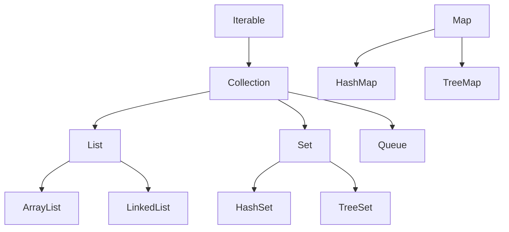

- **List**：继承自Collection ✓
- **Set**：继承自Collection ✓
- **Map**：**不继承**Collection，是独立的接口 ✗

```java
// List和Set都是Collection的子接口
Collection<String> list = new ArrayList<>();
Collection<String> set = new HashSet<>();

// Map不是Collection
Map<String, Integer> map = new HashMap<>();
// Collection<String> c = map;  // 编译错误
```

---

### 53. 阐述ArrayList、Vector、LinkedList的存储性能和特性。

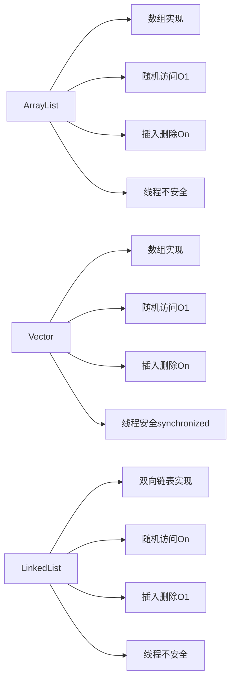

| 对比项 | ArrayList | Vector | LinkedList |
|--------|-----------|--------|------------|
| 底层结构 | 动态数组 | 动态数组 | 双向链表 |
| 随机访问 | O(1) | O(1) | O(n) |
| 插入/删除（中间） | O(n) | O(n) | O(1) |
| 线程安全 | 否 | 是(synchronized) | 否 |
| 扩容 | 1.5倍 | 2倍 | 不需要 |
| 内存 | 连续 | 连续 | 非连续（额外指针） |

**选择建议：**
- 频繁随机访问：ArrayList
- 频繁插入删除：LinkedList
- 多线程：Collections.synchronizedList(new ArrayList<>()) 或 CopyOnWriteArrayList
- 不推荐使用Vector（性能差，已过时）

---

### 54. Collection和Collections的区别?

```java
// Collection：接口，集合框架的根接口
Collection<String> list = new ArrayList<>();
list.add("a");
list.size();
list.iterator();

// Collections：工具类，提供操作集合的静态方法
List<Integer> nums = Arrays.asList(3, 1, 4, 1, 5, 9);

Collections.sort(nums);           // 排序
Collections.reverse(nums);        // 反转
Collections.shuffle(nums);        // 随机打乱
Collections.max(nums);            // 最大值
Collections.min(nums);            // 最小值
Collections.frequency(nums, 1);   // 元素出现次数

// 创建不可修改的集合
List<String> unmodifiable = Collections.unmodifiableList(list);

// 创建线程安全的集合
List<String> syncList = Collections.synchronizedList(list);

// 创建空集合
List<String> emptyList = Collections.emptyList();
```

---

### 55. List、Map、Set三个接口存取元素时，各有什么特点?

| 接口 | 有序性 | 重复性 | null | 存取特点 |
|------|--------|--------|------|---------|
| List | 有序（插入顺序） | 允许重复 | 允许 | 按索引存取，可重复 |
| Set | 无序（HashSet）/ 有序（TreeSet/LinkedHashSet） | 不允许重复 | HashSet允许一个null | 唯一性，不能重复 |
| Map | 无序（HashMap）/ 有序（TreeMap/LinkedHashMap） | key不重复，value可重复 | HashMap允许null key/value | 键值对，按key存取 |

```java
// List：有序，可重复
List<String> list = new ArrayList<>();
list.add("a"); list.add("b"); list.add("a");
// [a, b, a]

// Set：无序，不可重复
Set<String> set = new HashSet<>();
set.add("a"); set.add("b"); set.add("a");
// [a, b]（顺序不确定）

// Map：键值对，key不重复
Map<String, Integer> map = new HashMap<>();
map.put("a", 1); map.put("b", 2); map.put("a", 3);
// {a=3, b=2}（a被覆盖）
```

---

### 56. TreeMap和TreeSet在排序时如何比较元素?Collections工具类中的sort()方法如何比较元素?

**TreeMap/TreeSet的排序：**

```java
// 方式1：元素实现Comparable接口（自然排序）
class Student implements Comparable<Student> {
    private int age;

    @Override
    public int compareTo(Student other) {
        return this.age - other.age;  // 按年龄升序
    }
}

TreeSet<Student> set = new TreeSet<>();  // 使用自然排序

// 方式2：传入Comparator（定制排序）
TreeSet<Student> set2 = new TreeSet<>(
    (s1, s2) -> s2.getAge() - s1.getAge()  // 按年龄降序
);
```

**Collections.sort()的排序：**

```java
// 方式1：元素实现Comparable
List<Integer> nums = Arrays.asList(3, 1, 4, 1, 5);
Collections.sort(nums);  // 使用Integer的自然排序

// 方式2：传入Comparator
List<String> strs = Arrays.asList("banana", "apple", "cherry");
Collections.sort(strs, (a, b) -> a.length() - b.length());  // 按长度排序

// Java 8+：List.sort()
strs.sort(Comparator.comparingInt(String::length));
```

---

### 57. Thread类的sleep()方法和对象的wait()方法都可以让线程暂停执行，它们有什么区别?

（参见Java并发编程Q41，详细对比已在那里说明）

核心区别：
- `sleep()`：Thread的静态方法，不释放锁，时间到自动唤醒
- `wait()`：Object的实例方法，释放锁，需要notify唤醒，必须在同步块中调用

---

### 58. 线程的sleep()方法和yield()方法有什么区别?

| 对比项 | sleep() | yield() |
|--------|---------|---------|
| 线程状态 | TIMED_WAITING | RUNNABLE |
| 时间 | 指定时间后恢复 | 立即可被重新调度 |
| 锁 | 不释放 | 不释放 |
| 优先级 | 任何优先级线程都可运行 | 只让相同或更高优先级线程运行 |
| 可靠性 | 时间到一定恢复 | 调度器可以忽略 |

```java
Thread.sleep(1000);  // 暂停1秒，进入TIMED_WAITING
Thread.yield();      // 让出CPU，但可能立即被重新调度
```

---

### 59. 当一个线程进入一个对象的synchronized方法A之后，其它线程是否可进入此对象的synchronized方法B?

**答案：不可以。**

（参见Java并发编程Q34，详细说明已在那里）

同一个对象的所有synchronized实例方法共用同一把锁（this对象锁），一个线程持有锁时，其他线程无法进入任何synchronized实例方法。

---

### 60. 请说出与线程同步以及线程调度相关的方法。

**线程同步方法：**

```java
// Object类的方法（必须在synchronized块中调用）
object.wait();           // 释放锁，等待
object.wait(timeout);    // 等待指定时间
object.notify();         // 唤醒一个等待线程
object.notifyAll();      // 唤醒所有等待线程

// Thread类的方法
Thread.sleep(millis);    // 暂停指定时间
thread.join();           // 等待线程结束
thread.join(millis);     // 等待指定时间

// Lock接口
lock.lock();
lock.unlock();
lock.tryLock();
lock.lockInterruptibly();

// LockSupport
LockSupport.park();
LockSupport.unpark(thread);
```

**线程调度方法：**

```java
Thread.yield();              // 让出CPU时间片
thread.setPriority(n);       // 设置优先级（1-10）
thread.getPriority();        // 获取优先级
thread.interrupt();          // 中断线程
thread.isInterrupted();      // 检查中断状态
Thread.interrupted();        // 检查并清除中断状态
```


---

### 61. 编写多线程程序有几种实现方式?

（参见Java并发编程Q28，四种方式）

1. 继承Thread类
2. 实现Runnable接口（推荐）
3. 实现Callable接口（有返回值）
4. 使用线程池ExecutorService

---

### 62. synchronized关键字的用法?

```java
// 1. 修饰实例方法：锁是this对象
public synchronized void instanceMethod() {
    // 同一时刻只有一个线程可以执行
}

// 2. 修饰静态方法：锁是Class对象
public static synchronized void staticMethod() {
    // 锁的是MyClass.class，与实例锁不同
}

// 3. 修饰代码块：锁是括号中的对象
public void method() {
    synchronized(this) {
        // 锁this对象
    }

    synchronized(MyClass.class) {
        // 锁Class对象
    }

    Object lock = new Object();
    synchronized(lock) {
        // 锁自定义对象
    }
}
```

**synchronized的特性：**
- 互斥性：同一时刻只有一个线程持有锁
- 可见性：进入同步块时从主内存读，退出时写回主内存
- 可重入性：同一线程可以多次获得同一把锁

---

### 63. 举例说明同步和异步。

**同步（Synchronous）：** 调用方等待被调用方完成后才继续执行。

**异步（Asynchronous）：** 调用方不等待，被调用方完成后通过回调通知。

```java
// 同步示例：等待结果
String result = httpClient.get("http://api.example.com/data");
// 等待HTTP请求完成后才继续
System.out.println(result);

// 异步示例：不等待，通过回调处理结果
CompletableFuture<String> future = CompletableFuture.supplyAsync(() -> {
    return httpClient.get("http://api.example.com/data");
});
// 不等待，继续执行其他代码
doOtherWork();
// 需要结果时再处理
future.thenAccept(result -> System.out.println(result));

// 异步示例：线程池
ExecutorService pool = Executors.newFixedThreadPool(5);
pool.submit(() -> {
    // 异步执行，不阻塞主线程
    processData();
});
// 主线程继续执行
```

**同步 vs 异步：**
- 同步：简单直观，但可能阻塞
- 异步：复杂，但不阻塞，提高吞吐量

---

### 64. 启动一个线程是调用run()还是start()方法?

**答案：调用start()方法。**

（参见Java并发编程Q20，详细说明已在那里）

- `start()`：创建新线程，由JVM在新线程中调用run()
- `run()`：普通方法调用，在当前线程中同步执行，不创建新线程

---

### 65. 什么是线程池(thread pool)?

（参见Java并发编程Q52，详细说明已在那里）

线程池是预先创建一组线程，用于执行提交的任务，避免频繁创建销毁线程，提高性能和资源利用率。

---

### 66. 线程的基本状态以及状态之间的关系?

（参见Java并发编程(二)Q6，状态流转图已在那里）

Java线程的6种状态：NEW、RUNNABLE、BLOCKED、WAITING、TIMED_WAITING、TERMINATED

---

### 67. 简述synchronized和java.util.concurrent.locks.Lock的异同?

（参见Java并发编程Q22，详细对比已在那里）

核心区别：
- synchronized：JVM关键字，自动加锁/解锁，不支持超时/中断
- Lock：API接口，手动加锁/解锁，支持超时、中断、公平锁、多条件变量

---

### 68. Java中如何实现序列化,有什么意义?

**序列化：** 将对象转换为字节流，可以存储到文件或通过网络传输。

**反序列化：** 将字节流还原为对象。

```java
// 实现序列化：实现Serializable接口
public class Person implements Serializable {
    private static final long serialVersionUID = 1L;  // 版本号
    private String name;
    private int age;
    private transient String password;  // transient：不参与序列化
}

// 序列化（对象 → 字节流）
Person person = new Person("张三", 25);
try (ObjectOutputStream oos = new ObjectOutputStream(
        new FileOutputStream("person.dat"))) {
    oos.writeObject(person);
}

// 反序列化（字节流 → 对象）
try (ObjectInputStream ois = new ObjectInputStream(
        new FileInputStream("person.dat"))) {
    Person p = (Person) ois.readObject();
}
```

**序列化的意义：**
- 持久化：将对象保存到文件/数据库
- 网络传输：在网络中传输对象（RPC、分布式系统）
- 深克隆：通过序列化实现深拷贝
- 缓存：将对象序列化后存入Redis等缓存

**serialVersionUID的作用：**
- 版本控制，确保序列化和反序列化时类的版本一致
- 如果不指定，JVM会自动生成，类结构变化后会导致反序列化失败

---

### 69. Java中有几种类型的流?

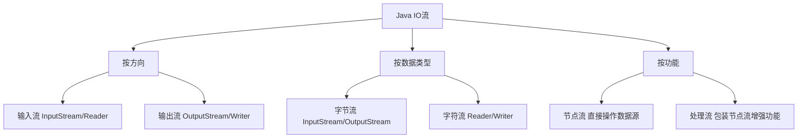

**字节流（处理二进制数据）：**

```java
// 输入
InputStream is = new FileInputStream("file.bin");
// 输出
OutputStream os = new FileOutputStream("file.bin");
```

**字符流（处理文本数据）：**

```java
// 输入
Reader reader = new FileReader("file.txt");
BufferedReader br = new BufferedReader(reader);  // 缓冲处理流
// 输出
Writer writer = new FileWriter("file.txt");
BufferedWriter bw = new BufferedWriter(writer);
```

**常用流类：**

| 类型 | 输入 | 输出 |
|------|------|------|
| 文件字节流 | FileInputStream | FileOutputStream |
| 文件字符流 | FileReader | FileWriter |
| 缓冲字节流 | BufferedInputStream | BufferedOutputStream |
| 缓冲字符流 | BufferedReader | BufferedWriter |
| 对象流 | ObjectInputStream | ObjectOutputStream |
| 数据流 | DataInputStream | DataOutputStream |
| 字节↔字符转换 | InputStreamReader | OutputStreamWriter |

---

### 70. 写一个方法，输入一个文件名和一个字符串，统计这个字符串在这个文件中出现的次数。

```java
public static int countOccurrences(String filename, String target) throws IOException {
    int count = 0;
    try (BufferedReader reader = new BufferedReader(
            new InputStreamReader(new FileInputStream(filename), "UTF-8"))) {
        String line;
        while ((line = reader.readLine()) != null) {
            int index = 0;
            while ((index = line.indexOf(target, index)) != -1) {
                count++;
                index += target.length();
            }
        }
    }
    return count;
}

// 使用示例
int count = countOccurrences("test.txt", "hello");
System.out.println("出现次数: " + count);
```

---

### 71. 如何用Java代码列出一个目录下所有的文件?

```java
// 方式1：File类（传统方式）
public static void listFiles(String dirPath) {
    File dir = new File(dirPath);
    if (dir.isDirectory()) {
        File[] files = dir.listFiles();
        if (files != null) {
            for (File file : files) {
                if (file.isFile()) {
                    System.out.println(file.getName());
                } else if (file.isDirectory()) {
                    listFiles(file.getAbsolutePath());  // 递归
                }
            }
        }
    }
}

// 方式2：Java 7+ NIO（推荐）
public static void listFilesNIO(String dirPath) throws IOException {
    Path dir = Paths.get(dirPath);
    Files.walk(dir)
         .filter(Files::isRegularFile)
         .forEach(System.out::println);
}

// 方式3：只列出当前目录（不递归）
Files.list(Paths.get(dirPath))
     .filter(Files::isRegularFile)
     .forEach(System.out::println);
```

---

### 72. 用Java的套接字编程实现一个多线程的回显(echo)服务器。

```java
// 服务器端
public class EchoServer {
    public static void main(String[] args) throws IOException {
        ServerSocket serverSocket = new ServerSocket(8080);
        System.out.println("Echo服务器启动，监听端口8080");

        ExecutorService pool = Executors.newCachedThreadPool();

        while (true) {
            Socket clientSocket = serverSocket.accept();  // 等待客户端连接
            pool.submit(() -> handleClient(clientSocket));  // 多线程处理
        }
    }

    private static void handleClient(Socket socket) {
        try (BufferedReader reader = new BufferedReader(
                    new InputStreamReader(socket.getInputStream()));
             PrintWriter writer = new PrintWriter(socket.getOutputStream(), true)) {

            String line;
            while ((line = reader.readLine()) != null) {
                System.out.println("收到: " + line);
                writer.println("Echo: " + line);  // 回显
            }
        } catch (IOException e) {
            e.printStackTrace();
        }
    }
}

// 客户端
public class EchoClient {
    public static void main(String[] args) throws IOException {
        try (Socket socket = new Socket("localhost", 8080);
             PrintWriter writer = new PrintWriter(socket.getOutputStream(), true);
             BufferedReader reader = new BufferedReader(
                     new InputStreamReader(socket.getInputStream()))) {

            writer.println("Hello Server");
            System.out.println(reader.readLine());  // Echo: Hello Server
        }
    }
}
```

---

### 73. XML文档定义有几种形式?它们之间有何本质区别?解析XML文档有哪几种方式?

**XML文档定义：**

1. **DTD（Document Type Definition）**
   - 较老的格式，语法简单
   - 不支持命名空间，数据类型有限

2. **Schema（XML Schema）**
   - 更强大，支持数据类型、命名空间
   - 本身也是XML格式

```xml
<!-- DTD示例 -->
<!DOCTYPE person [
  <!ELEMENT person (name, age)>
  <!ELEMENT name (#PCDATA)>
  <!ELEMENT age (#PCDATA)>
]>

<!-- Schema示例 -->
<xs:schema xmlns:xs="http://www.w3.org/2001/XMLSchema">
  <xs:element name="person">
    <xs:complexType>
      <xs:sequence>
        <xs:element name="name" type="xs:string"/>
        <xs:element name="age" type="xs:integer"/>
      </xs:sequence>
    </xs:complexType>
  </xs:element>
</xs:schema>
```

**XML解析方式：**

| 方式 | 特点 | 适用场景 |
|------|------|---------|
| DOM | 将整个XML加载到内存，树形结构 | 小文件，需要随机访问 |
| SAX | 事件驱动，逐行解析，不加载全部 | 大文件，只需顺序读取 |
| StAX | 拉式解析，比SAX更灵活 | 大文件，需要控制解析过程 |
| JAXB | 对象绑定，XML↔Java对象 | 需要对象映射 |

```java
// DOM解析
DocumentBuilderFactory factory = DocumentBuilderFactory.newInstance();
DocumentBuilder builder = factory.newDocumentBuilder();
Document doc = builder.parse(new File("data.xml"));
NodeList nodes = doc.getElementsByTagName("person");

// SAX解析
SAXParserFactory saxFactory = SAXParserFactory.newInstance();
SAXParser parser = saxFactory.newSAXParser();
parser.parse(new File("data.xml"), new DefaultHandler() {
    @Override
    public void startElement(String uri, String localName, String qName,
                             Attributes attributes) {
        System.out.println("开始元素: " + qName);
    }
});
```

---

### 74. 你在项目中哪些地方用到了XML?

**常见使用场景：**

1. **配置文件**：Spring的applicationContext.xml、MyBatis的mapper.xml
2. **Maven/Gradle**：pom.xml项目构建配置
3. **Web应用**：web.xml部署描述符
4. **数据交换**：与第三方系统的数据交换（如银行、政府接口）
5. **日志配置**：log4j.xml、logback.xml
6. **Android**：布局文件、AndroidManifest.xml

---

### 75. 阐述JDBC操作数据库的步骤。

```java
// JDBC操作数据库的6个步骤
public void jdbcDemo() throws Exception {
    // 1. 加载驱动
    Class.forName("com.mysql.cj.jdbc.Driver");

    // 2. 获取连接
    Connection conn = DriverManager.getConnection(
        "jdbc:mysql://localhost:3306/mydb?useSSL=false",
        "root", "password"
    );

    // 3. 创建Statement
    PreparedStatement pstmt = conn.prepareStatement(
        "SELECT * FROM users WHERE age > ?"
    );

    // 4. 执行SQL
    pstmt.setInt(1, 18);
    ResultSet rs = pstmt.executeQuery();

    // 5. 处理结果集
    while (rs.next()) {
        String name = rs.getString("name");
        int age = rs.getInt("age");
        System.out.println(name + ": " + age);
    }

    // 6. 关闭资源（逆序关闭）
    rs.close();
    pstmt.close();
    conn.close();
}

// 推荐：try-with-resources自动关闭
try (Connection conn = DriverManager.getConnection(url, user, pwd);
     PreparedStatement pstmt = conn.prepareStatement(sql)) {
    // 自动关闭
}
```

---

### 76. Statement和PreparedStatement有什么区别?哪个性能更好?

| 对比项 | Statement | PreparedStatement |
|--------|-----------|-------------------|
| SQL注入 | 有风险 | 防止SQL注入 |
| 预编译 | 每次编译 | 预编译，可复用 |
| 性能 | 低（每次编译） | 高（预编译缓存） |
| 参数处理 | 字符串拼接 | 占位符? |
| 可读性 | 低 | 高 |

```java
// Statement（不推荐，有SQL注入风险）
String name = "张三' OR '1'='1";  // 恶意输入
Statement stmt = conn.createStatement();
ResultSet rs = stmt.executeQuery(
    "SELECT * FROM users WHERE name = '" + name + "'"
    // 实际SQL: SELECT * FROM users WHERE name = '张三' OR '1'='1'
    // 返回所有用户！SQL注入成功
);

// PreparedStatement（推荐）
PreparedStatement pstmt = conn.prepareStatement(
    "SELECT * FROM users WHERE name = ?"
);
pstmt.setString(1, name);  // 参数被转义，防止注入
ResultSet rs = pstmt.executeQuery();
```

**PreparedStatement性能更好**，因为：
- SQL预编译后缓存，相同SQL多次执行只编译一次
- 数据库可以复用执行计划

---

### 77. 使用JDBC操作数据库时，如何提升读取数据的性能?如何提升更新数据的性能?

**提升读取性能：**

```java
// 1. 设置fetchSize，减少网络往返
pstmt.setFetchSize(1000);  // 每次从数据库获取1000条

// 2. 只查询需要的列
"SELECT id, name FROM users"  // 不要 SELECT *

// 3. 使用索引
"SELECT * FROM users WHERE id = ?"  // id有索引

// 4. 使用连接池，避免频繁创建连接
DataSource ds = new HikariDataSource(config);
```

**提升更新性能：**

```java
// 1. 批量更新（最重要）
conn.setAutoCommit(false);  // 关闭自动提交
PreparedStatement pstmt = conn.prepareStatement(
    "INSERT INTO users(name, age) VALUES(?, ?)"
);
for (User user : users) {
    pstmt.setString(1, user.getName());
    pstmt.setInt(2, user.getAge());
    pstmt.addBatch();  // 添加到批次
}
pstmt.executeBatch();  // 批量执行
conn.commit();  // 提交事务

// 2. 事务控制（减少提交次数）
conn.setAutoCommit(false);
// 执行多个操作
conn.commit();  // 一次提交

// 3. 使用PreparedStatement（预编译）
```

---

### 78. 在进行数据库编程时，连接池有什么作用?

**连接池的作用：**

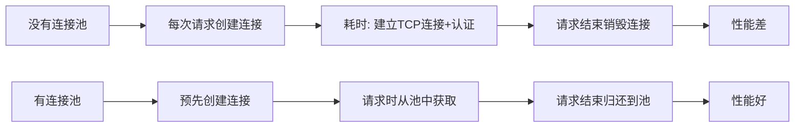

**连接池的优点：**
1. **减少连接创建开销**：数据库连接创建耗时（TCP握手、认证），连接池复用连接
2. **控制连接数**：防止连接数过多导致数据库崩溃
3. **连接管理**：自动检测失效连接，自动重连
4. **提高响应速度**：直接从池中获取连接，无需等待创建

**常用连接池：**
- HikariCP（最快，Spring Boot默认）
- Druid（阿里巴巴，功能丰富，有监控）
- C3P0（较老）
- DBCP（Apache）

```java
// HikariCP配置示例
HikariConfig config = new HikariConfig();
config.setJdbcUrl("jdbc:mysql://localhost:3306/mydb");
config.setUsername("root");
config.setPassword("password");
config.setMaximumPoolSize(10);  // 最大连接数
config.setMinimumIdle(5);       // 最小空闲连接数
config.setConnectionTimeout(30000);  // 连接超时30秒

DataSource ds = new HikariDataSource(config);
```

---

### 79. 什么是DAO模式?

**DAO（Data Access Object，数据访问对象）** 是一种设计模式，将数据访问逻辑与业务逻辑分离。

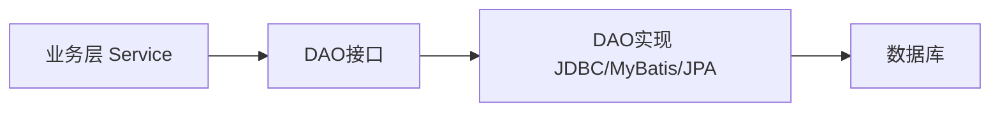

```java
// DAO接口
public interface UserDao {
    User findById(Long id);
    List<User> findAll();
    void save(User user);
    void update(User user);
    void delete(Long id);
}

// DAO实现
public class UserDaoImpl implements UserDao {
    @Override
    public User findById(Long id) {
        // JDBC实现
        String sql = "SELECT * FROM users WHERE id = ?";
        // ...
    }
}

// 业务层使用DAO
public class UserService {
    private UserDao userDao = new UserDaoImpl();

    public User getUser(Long id) {
        return userDao.findById(id);
    }
}
```

**DAO模式的优点：**
- 分离关注点：业务逻辑不关心数据存储细节
- 易于替换：可以切换不同的数据访问实现（JDBC→MyBatis→JPA）
- 易于测试：可以Mock DAO进行单元测试

---

### 80. 事务的ACID是指什么?

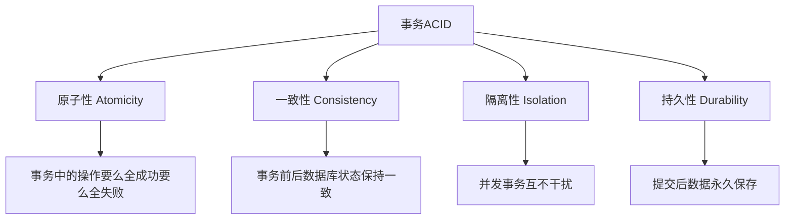

| 特性 | 含义 | 例子 |
|------|------|------|
| 原子性(A) | 事务是不可分割的最小单位，要么全做要么全不做 | 转账：扣款和入账要么都成功，要么都失败 |
| 一致性(C) | 事务执行前后，数据库从一个一致状态变到另一个一致状态 | 转账前后，两个账户总金额不变 |
| 隔离性(I) | 并发执行的事务互不干扰 | 两个用户同时转账，互不影响 |
| 持久性(D) | 事务提交后，数据永久保存，即使系统崩溃也不丢失 | 提交后，数据写入磁盘 |

```java
// JDBC事务示例
Connection conn = getConnection();
try {
    conn.setAutoCommit(false);  // 开启事务

    // 扣款
    updateBalance(conn, fromAccount, -amount);
    // 入账
    updateBalance(conn, toAccount, +amount);

    conn.commit();  // 提交事务（持久化）
} catch (Exception e) {
    conn.rollback();  // 回滚（原子性）
    throw e;
} finally {
    conn.setAutoCommit(true);
}
```


---

### 81. 说一下mysql数据库存储的原理

（参见MySQL面试题，这里简述）

MySQL InnoDB存储引擎使用B+树索引：
- 数据按页(16KB)存储
- B+树叶子节点存储完整数据行（聚簇索引）
- 非叶子节点只存储索引键值，用于快速定位
- 支持事务、行锁、MVCC

---

### 82. JDBC能否处理Blob和Clob?

**答案：可以。**

```java
// BLOB（Binary Large Object）：存储二进制数据（图片、文件等）
// CLOB（Character Large Object）：存储大文本数据

// 写入BLOB
PreparedStatement ps = conn.prepareStatement(
    "INSERT INTO files(name, data) VALUES(?, ?)");
ps.setString(1, "image.jpg");
try (FileInputStream fis = new FileInputStream("image.jpg")) {
    ps.setBinaryStream(2, fis, fis.available());
}
ps.executeUpdate();

// 读取BLOB
ResultSet rs = stmt.executeQuery("SELECT data FROM files WHERE id=1");
if (rs.next()) {
    Blob blob = rs.getBlob("data");
    byte[] data = blob.getBytes(1, (int) blob.length());
    // 或者
    InputStream is = blob.getBinaryStream();
}

// 写入CLOB
ps.setCharacterStream(1, new StringReader(longText), longText.length());

// 读取CLOB
Clob clob = rs.getClob("content");
String text = clob.getSubString(1, (int) clob.length());
```

---

### 83. 简述正则表达式及其用途。

**正则表达式(Regular Expression)** 是用于描述字符串模式的特殊语法。

**常用元字符：**

| 元字符 | 含义 |
|--------|------|
| `.` | 任意单个字符（除换行符） |
| `*` | 前面元素0次或多次 |
| `+` | 前面元素1次或多次 |
| `?` | 前面元素0次或1次 |
| `^` | 字符串开头 |
| `$` | 字符串结尾 |
| `\d` | 数字[0-9] |
| `\w` | 单词字符[a-zA-Z0-9_] |
| `\s` | 空白字符 |
| `[abc]` | a、b或c中的一个 |
| `(abc)` | 分组 |
| `{n,m}` | 重复n到m次 |

**用途：**
- 验证输入格式（邮箱、手机号、身份证）
- 字符串搜索和替换
- 文本解析和提取

---

### 84. Java中是如何支持正则表达式操作的?

```java
import java.util.regex.*;

// 1. 验证（matches）
String email = "user@example.com";
boolean isValid = email.matches("[a-zA-Z0-9._%+-]+@[a-zA-Z0-9.-]+\.[a-zA-Z]{2,}");

// 2. 查找（find）
String text = "电话：13812345678，备用：13987654321";
Pattern pattern = Pattern.compile("1[3-9]\d{9}");
Matcher matcher = pattern.matcher(text);
while (matcher.find()) {
    System.out.println("找到手机号: " + matcher.group());
}

// 3. 替换（replaceAll）
String result = "Hello   World".replaceAll("\s+", " ");  // "Hello World"

// 4. 分割（split）
String[] parts = "a,b,,c".split(",");  // ["a", "b", "", "c"]
String[] parts2 = "a,b,,c".split(",+");  // ["a", "b", "c"]

// 5. 提取分组
Pattern p = Pattern.compile("(\d{4})-(\d{2})-(\d{2})");
Matcher m = p.matcher("2024-01-15");
if (m.matches()) {
    System.out.println("年: " + m.group(1));  // 2024
    System.out.println("月: " + m.group(2));  // 01
    System.out.println("日: " + m.group(3));  // 15
}
```

---

### 85. 获得一个类的类对象有哪些方式?

```java
// 方式1：类名.class（编译时确定，最高效）
Class<String> c1 = String.class;

// 方式2：对象.getClass()（运行时获取）
String str = "hello";
Class<?> c2 = str.getClass();

// 方式3：Class.forName()（动态加载，最灵活）
Class<?> c3 = Class.forName("java.lang.String");

// 方式4：类加载器
Class<?> c4 = ClassLoader.getSystemClassLoader().loadClass("java.lang.String");

// 验证：三种方式获取的是同一个Class对象
System.out.println(c1 == c2);  // true
System.out.println(c1 == c3);  // true
```

---

### 86. 如何通过反射创建对象?

```java
// 方式1：Class.newInstance()（已废弃，只能调用无参构造器）
Class<?> clazz = Class.forName("com.example.Person");
Person p1 = (Person) clazz.newInstance();

// 方式2：Constructor.newInstance()（推荐，可以调用任意构造器）
// 无参构造器
Constructor<?> noArgCtor = clazz.getConstructor();
Person p2 = (Person) noArgCtor.newInstance();

// 有参构造器
Constructor<?> ctor = clazz.getConstructor(String.class, int.class);
Person p3 = (Person) ctor.newInstance("张三", 25);

// 访问私有构造器
Constructor<?> privateCtor = clazz.getDeclaredConstructor(String.class);
privateCtor.setAccessible(true);  // 突破访问限制
Person p4 = (Person) privateCtor.newInstance("李四");
```

---

### 87. 如何通过反射调用对象的方法?

```java
Class<?> clazz = Class.forName("com.example.Person");
Object person = clazz.newInstance();

// 调用公共方法
Method setName = clazz.getMethod("setName", String.class);
setName.invoke(person, "张三");

Method getName = clazz.getMethod("getName");
String name = (String) getName.invoke(person);

// 调用私有方法
Method privateMethod = clazz.getDeclaredMethod("privateMethod");
privateMethod.setAccessible(true);  // 突破访问限制
privateMethod.invoke(person);

// 调用静态方法
Method staticMethod = clazz.getMethod("staticMethod");
staticMethod.invoke(null);  // 静态方法第一个参数传null
```

---

### 88. 简述一下你了解的设计模式。

**设计模式分三大类：**

```mermaid
graph TD
    A[设计模式23种] --> B[创建型 5种]
    A --> C[结构型 7种]
    A --> D[行为型 11种]

    B --> B1[单例模式]
    B --> B2[工厂方法模式]
    B --> B3[抽象工厂模式]
    B --> B4[建造者模式]
    B --> B5[原型模式]

    C --> C1[适配器模式]
    C --> C2[装饰器模式]
    C --> C3[代理模式]
    C --> C4[外观模式]
    C --> C5[桥接/组合/享元]

    D --> D1[观察者模式]
    D --> D2[策略模式]
    D --> D3[模板方法模式]
    D --> D4[责任链模式]
    D --> D5[命令/迭代器/等]
```

**常用设计模式简述：**

| 模式 | 用途 | Java中的例子 |
|------|------|-------------|
| 单例 | 确保只有一个实例 | Runtime、Spring Bean |
| 工厂方法 | 创建对象，隐藏创建细节 | Calendar.getInstance() |
| 代理 | 控制对象访问 | Spring AOP、JDK动态代理 |
| 观察者 | 事件通知 | EventListener、Spring事件 |
| 装饰器 | 动态添加功能 | BufferedReader包装FileReader |
| 策略 | 算法可替换 | Comparator、排序策略 |
| 模板方法 | 定义算法骨架 | AbstractList、JdbcTemplate |
| 适配器 | 接口转换 | InputStreamReader |

---

### 89. 用Java写一个单例类。

```java
// 方式1：饿汉式（线程安全，类加载时初始化）
public class Singleton1 {
    private static final Singleton1 INSTANCE = new Singleton1();
    private Singleton1() {}
    public static Singleton1 getInstance() { return INSTANCE; }
}

// 方式2：懒汉式 + 双重检查锁（推荐，延迟初始化）
public class Singleton2 {
    private static volatile Singleton2 instance;
    private Singleton2() {}

    public static Singleton2 getInstance() {
        if (instance == null) {
            synchronized (Singleton2.class) {
                if (instance == null) {  // 双重检查
                    instance = new Singleton2();
                }
            }
        }
        return instance;
    }
}

// 方式3：静态内部类（推荐，延迟初始化，线程安全）
public class Singleton3 {
    private Singleton3() {}

    private static class Holder {
        private static final Singleton3 INSTANCE = new Singleton3();
    }

    public static Singleton3 getInstance() {
        return Holder.INSTANCE;
    }
}

// 方式4：枚举（最简洁，防止反序列化破坏单例）
public enum Singleton4 {
    INSTANCE;
    public void doSomething() { }
}
// 使用：Singleton4.INSTANCE.doSomething();
```

---

### 90. 什么是UML?

**UML（Unified Modeling Language，统一建模语言）** 是一种用于软件系统设计和文档化的标准化建模语言。

**UML的作用：**
- 可视化系统设计
- 描述系统结构和行为
- 作为开发团队的沟通工具
- 生成代码框架（部分工具支持）

---

### 91. UML中有哪些常用的图?

| 图类型 | 用途 |
|--------|------|
| 类图(Class Diagram) | 描述类的结构和类之间的关系 |
| 时序图(Sequence Diagram) | 描述对象间的交互顺序 |
| 用例图(Use Case Diagram) | 描述系统功能和用户交互 |
| 活动图(Activity Diagram) | 描述业务流程或算法流程 |
| 状态图(State Diagram) | 描述对象的状态变化 |
| 组件图(Component Diagram) | 描述系统的组件结构 |
| 部署图(Deployment Diagram) | 描述系统的物理部署 |

**类图中的关系：**

```
继承（实线+空心三角）：Dog ——▷ Animal
实现（虚线+空心三角）：Dog ----▷ Runnable
关联（实线+箭头）：Person ——> Address
聚合（实线+空心菱形）：Team ◇—— Player
组合（实线+实心菱形）：House ◆—— Room
依赖（虚线+箭头）：Order ----→ Product
```

---

### 92. 什么是Java序列化,如何实现Java序列化?

（参见Q68，详细说明已在那里）

核心：实现 `Serializable` 接口，使用 `ObjectOutputStream`/`ObjectInputStream` 进行序列化/反序列化。

---

### 93. 用Java写一个折半查找。

```java
// 折半查找（二分查找）：要求数组已排序
public static int binarySearch(int[] arr, int target) {
    int left = 0;
    int right = arr.length - 1;

    while (left <= right) {
        int mid = left + (right - left) / 2;  // 防止溢出

        if (arr[mid] == target) {
            return mid;  // 找到，返回索引
        } else if (arr[mid] < target) {
            left = mid + 1;  // 目标在右半部分
        } else {
            right = mid - 1;  // 目标在左半部分
        }
    }

    return -1;  // 未找到
}

// 递归版本
public static int binarySearchRecursive(int[] arr, int target, int left, int right) {
    if (left > right) return -1;

    int mid = left + (right - left) / 2;
    if (arr[mid] == target) return mid;
    if (arr[mid] < target) return binarySearchRecursive(arr, target, mid + 1, right);
    return binarySearchRecursive(arr, target, left, mid - 1);
}

// 使用示例
int[] arr = {1, 3, 5, 7, 9, 11, 13};
System.out.println(binarySearch(arr, 7));   // 3
System.out.println(binarySearch(arr, 6));   // -1
```

**时间复杂度：O(log n)，比线性查找O(n)快得多。**

---

## Java面试题(二)

### 1. Java中能创建volatile数组吗?

**答案：可以，但volatile只保证数组引用的可见性，不保证数组元素的可见性。**

```java
// volatile修饰数组引用
volatile int[] arr = new int[10];

// arr引用的变化对所有线程可见
arr = new int[20];  // 这个赋值对所有线程可见

// 但数组元素的修改不受volatile保护
arr[0] = 1;  // 这个修改不保证对其他线程立即可见
```

**如果需要数组元素的原子操作，使用AtomicIntegerArray：**

```java
AtomicIntegerArray atomicArr = new AtomicIntegerArray(10);
atomicArr.set(0, 1);           // 原子设置
atomicArr.getAndIncrement(0);  // 原子自增
atomicArr.compareAndSet(0, 1, 2);  // CAS操作
```

---

### 2. volatile能使一个非原子操作变成原子操作吗?

**答案：不能，volatile不保证原子性。**

```java
volatile int count = 0;

// 非原子操作：count++实际上是三步
// 1. 读取count的值
// 2. 加1
// 3. 写回count
// volatile只保证每步的可见性，但三步合起来不是原子的

// 多线程下count++仍然有竞争条件
// 解决方案：使用AtomicInteger
AtomicInteger atomicCount = new AtomicInteger(0);
atomicCount.incrementAndGet();  // 原子操作
```

**volatile能保证的：**
- 可见性：写操作立即刷新到主内存，读操作从主内存读
- 有序性：禁止指令重排序

**volatile不能保证的：**
- 原子性：复合操作（如i++）不是原子的

---

### 3. volatile修饰符的有过什么实践?

**经典实践：双重检查锁单例模式**

```java
public class Singleton {
    // volatile防止指令重排序
    private static volatile Singleton instance;

    public static Singleton getInstance() {
        if (instance == null) {
            synchronized (Singleton.class) {
                if (instance == null) {
                    instance = new Singleton();
                    // 没有volatile时，这行可能被重排序为：
                    // 1. 分配内存
                    // 3. 将引用赋给instance（此时对象未初始化）
                    // 2. 初始化对象
                    // 其他线程可能拿到未初始化的对象
                }
            }
        }
        return instance;
    }
}
```

**状态标志：**

```java
// 控制线程停止的标志
volatile boolean running = true;

Thread t = new Thread(() -> {
    while (running) {  // 每次循环都从主内存读取running
        doWork();
    }
});

// 主线程停止工作线程
running = false;  // 立即对工作线程可见
```

---

### 4. 什么是线程安全?Vector是一个线程安全类吗?

**线程安全：** 多个线程并发访问某个类时，不管运行时环境如何调度，该类都能表现出正确的行为。

**Vector是线程安全的。**

```java
// Vector：所有方法都用synchronized修饰，线程安全但性能低
Vector<String> vector = new Vector<>();
vector.add("a");  // synchronized

// ArrayList：非线程安全，性能高
ArrayList<String> list = new ArrayList<>();

// 线程安全的替代方案
List<String> syncList = Collections.synchronizedList(new ArrayList<>());
List<String> concurrentList = new CopyOnWriteArrayList<>();
```

**线程安全的集合类：**
- Vector（古老，不推荐）
- Hashtable（古老，不推荐）
- ConcurrentHashMap（推荐）
- CopyOnWriteArrayList（读多写少场景）
- BlockingQueue系列（生产者-消费者）

---

### 5. 什么是竞争条件?你怎样发现和解决竞争?

**竞争条件(Race Condition)：** 多个线程同时访问共享资源，最终结果依赖于线程执行的顺序。

```java
// 竞争条件示例
class Counter {
    private int count = 0;

    public void increment() {
        count++;  // 非原子操作，存在竞争条件
    }
}

// 多线程下count的最终值不确定
```

**发现竞争条件：**
- 代码审查：找出共享可变状态
- 压力测试：多线程并发执行，观察结果是否一致
- 工具：FindBugs、ThreadSanitizer、Java Flight Recorder

**解决方案：**

```java
// 1. synchronized
public synchronized void increment() { count++; }

// 2. AtomicInteger
AtomicInteger count = new AtomicInteger(0);
count.incrementAndGet();

// 3. Lock
Lock lock = new ReentrantLock();
lock.lock();
try { count++; } finally { lock.unlock(); }

// 4. 不可变对象（根本上消除竞争）
// 5. 线程局部变量（ThreadLocal）
```

---

### 6. 你将如何使用thread dump?你将如何分析Thread dump?

（参见Java并发编程(一)Q19，详细说明已在那里）

---

### 7. 为什么我们调用start()方法时会执行run()方法，为什么我们不能直接调用run()方法?

（参见Java并发编程(一)Q20，详细说明已在那里）

---

### 8. Java中你怎样唤醒一个阻塞的线程?

（参见Java并发编程(一)Q21，详细说明已在那里）

---

### 9. 在Java中CycliBarriar和CountdownLatch有什么区别?

（参见Java并发编程(一)Q22，详细说明已在那里）

---

### 10. 什么是不可变对象，它对写并发应用有什么帮助?

（参见Java并发编程(一)Q23，详细说明已在那里）

---

### 11. 什么是Java的内存模型，JMM是什么?

**Java内存模型(JMM, Java Memory Model)** 定义了多线程程序中变量的访问规则，规定了线程如何与主内存交互。

```mermaid
graph TD
    subgraph 线程1
        W1[工作内存1]
    end
    subgraph 线程2
        W2[工作内存2]
    end
    M[主内存 Main Memory]

    W1 <-->|read/write| M
    W2 <-->|read/write| M
```

**JMM的核心规则：**

1. **可见性**：一个线程对共享变量的修改，另一个线程能立即看到
2. **原子性**：操作不可分割
3. **有序性**：程序执行顺序按照代码顺序（禁止重排序）

**happens-before原则（保证有序性）：**
- 程序顺序规则：同一线程中，前面的操作happens-before后面的操作
- 监视器锁规则：unlock happens-before 后续的lock
- volatile规则：volatile写 happens-before 后续的volatile读
- 线程启动规则：start() happens-before 线程中的任何操作
- 线程终止规则：线程中的所有操作 happens-before join()返回

---

### 12. 什么是CAS?

（参见Java并发编程(二)Q15，详细说明已在那里）

CAS（Compare And Swap）：比较并交换，是一种无锁的原子操作。

---

### 13. 什么是乐观锁和悲观锁?

（参见Java并发编程(一)Q35，详细说明已在那里）

---

### 14. 什么是AQS?

（参见Java并发编程(二)Q18，详细说明已在那里）

---

### 15. 单例模式的线程安全性

（参见Q89，四种线程安全的单例实现）

---

### 16. Semaphore有什么作用?

（参见Java并发编程(一)Q57，详细说明已在那里）

---

### 17. Hashtable的size()方法中明明只有一条语句"return count"，为什么还要做同步?

**原因：** 保证可见性，不是为了原子性。

```java
// Hashtable.size()
public synchronized int size() {
    return count;
}
```

- `return count` 虽然是单条语句，但在多线程环境下，如果不加synchronized，可能读到其他线程修改前的旧值（缓存中的值）
- synchronized保证了读取count时能看到最新的值（从主内存读）
- 同时也保证了size()和其他修改count的方法之间的互斥

---

### 18. 线程类的构造方法、静态块是被哪个线程调用的?

```java
class MyThread extends Thread {
    static {
        System.out.println("静态块，由: " + Thread.currentThread().getName());
    }

    public MyThread() {
        System.out.println("构造方法，由: " + Thread.currentThread().getName());
    }

    @Override
    public void run() {
        System.out.println("run方法，由: " + Thread.currentThread().getName());
    }
}

// 在main线程中
MyThread t = new MyThread();
// 输出：静态块，由: main
// 输出：构造方法，由: main

t.start();
// 输出：run方法，由: Thread-0
```

**结论：**
- 静态块和构造方法由**创建线程对象的线程**调用（通常是main线程）
- run()方法由**新创建的线程**调用

---

### 19. 同步方法和同步块，哪个是更好的选择?

**同步块更好。**

```java
// 同步方法：锁住整个方法，粒度粗
public synchronized void method() {
    // 非临界区代码（不需要同步）
    doPreWork();

    // 临界区代码（需要同步）
    sharedData++;

    // 非临界区代码（不需要同步）
    doPostWork();
}

// 同步块：只锁住必要的代码，粒度细（推荐）
public void method() {
    doPreWork();  // 不加锁，并发执行

    synchronized(this) {
        sharedData++;  // 只锁住临界区
    }

    doPostWork();  // 不加锁，并发执行
}
```

**同步块的优势：**
- 减少锁的持有时间，提高并发性能
- 可以选择更细粒度的锁对象
- 减少线程等待时间

---

### 20. 高并发、任务执行时间短的业务怎样使用线程池?并发不高、任务执行时间长的业务怎样使用线程池?并发高、业务执行时间长的业务怎样使用线程池?

**场景1：高并发 + 任务执行时间短**
```java
// 使用CPU核心数的线程池，减少线程切换开销
int cpuCores = Runtime.getRuntime().availableProcessors();
ExecutorService pool = Executors.newFixedThreadPool(cpuCores);
// 或者
ThreadPoolExecutor pool = new ThreadPoolExecutor(
    cpuCores, cpuCores, 0, TimeUnit.SECONDS, new LinkedBlockingQueue<>(1000));
```

**场景2：并发不高 + 任务执行时间长**
```java
// 分析任务类型：
// CPU密集型：线程数 = CPU核心数 + 1
// IO密集型：线程数 = CPU核心数 * 2（等待IO时CPU空闲）
int threads = cpuCores * 2;  // IO密集型
ExecutorService pool = Executors.newFixedThreadPool(threads);
```

**场景3：高并发 + 任务执行时间长**
```java
// 最复杂的场景，需要：
// 1. 增大线程池（IO密集型）
// 2. 使用有界队列防止OOM
// 3. 配置合理的拒绝策略
// 4. 考虑异步化、缓存、降级等手段
ThreadPoolExecutor pool = new ThreadPoolExecutor(
    cpuCores * 2,      // 核心线程数
    cpuCores * 4,      // 最大线程数
    60, TimeUnit.SECONDS,
    new LinkedBlockingQueue<>(500),  // 有界队列
    new ThreadPoolExecutor.CallerRunsPolicy()  // 拒绝策略
);
```


---

### 21. 存在两个类,B继承A,C继承B,我们能将B转换为C么?如C=(C)B;

**答案：编译可以通过，但运行时可能抛出ClassCastException。**

```java
class A { }
class B extends A { }
class C extends B { }

B b = new B();
C c = (C) b;  // 编译通过，但运行时抛出ClassCastException

// 为什么？
// b实际指向的是B对象，不是C对象
// C是B的子类，B对象不具备C的特性，无法转换

// 什么情况下可以成功？
B b2 = new C();   // b2实际指向的是C对象
C c2 = (C) b2;   // 成功！因为b2本来就是C类型
```

**instanceof检查先于转换：**

```java
if (b instanceof C) {
    C c = (C) b;  // 安全转换
}
```

---

### 22. 哪个类包含clone方法?是Cloneable还是Object?

**答案：clone方法在Object类中，Cloneable是标记接口。**

```java
// Object类中的clone方法（protected）
protected native Object clone() throws CloneNotSupportedException;

// Cloneable是标记接口（没有任何方法）
public interface Cloneable { }
```

**使用流程：**
1. 实现 `Cloneable` 接口（标记该类可以克隆）
2. 重写 `Object.clone()` 方法（改为public并调用super.clone()）

```java
class Person implements Cloneable {
    private String name;

    @Override
    public Person clone() throws CloneNotSupportedException {
        return (Person) super.clone();
    }
}
```

如果没有实现Cloneable但调用了clone()，会抛出 `CloneNotSupportedException`。

---

### 23. Java中++操作符是线程安全的吗?

**答案：不是线程安全的。**

（参见Java并发编程相关章节）

`i++` 实际上是：读取i → 加1 → 写回i，三步非原子操作，多线程下存在竞争条件。

```java
// 线程不安全
int count = 0;
count++;  // 非原子操作

// 线程安全的方式
AtomicInteger count = new AtomicInteger(0);
count.incrementAndGet();  // 原子操作
```

---

### 24. a=a+b与a+=b的区别

```java
short a = 10;
short b = 20;

a = a + b;  // 编译错误！a+b结果为int，不能赋给short
a += b;     // 正确！+= 包含隐式类型转换，等价于 a = (short)(a + b)
```

**区别：**
- `a = a + b`：先计算 `a + b`（可能发生类型提升），再赋值给 `a`（可能需要强制转换）
- `a += b`：等价于 `a = (type_of_a)(a + b)`，包含隐式类型转换

---

### 25. 我能在不进行强制转换的情况下将一个double值赋值给long类型的变量吗?

**答案：不能，必须强制转换。**

```java
double d = 3.14;
long l = d;          // 编译错误：可能损失精度
long l2 = (long) d;  // 正确，l2 = 3（小数部分截断）

// 反向：long可以隐式转换为double
long x = 100L;
double y = x;  // 正确，自动提升（不损失精度）
```

**类型提升方向（无需强制转换）：**
`byte → short → int → long → float → double`

---

### 26. 3*0.1==0.3将会返回什么?true还是false?

**答案：false。**

```java
System.out.println(3 * 0.1 == 0.3);  // false

System.out.println(3 * 0.1);  // 0.30000000000000004
System.out.println(0.3);       // 0.3
```

**原因：** 浮点数在计算机中以二进制表示，0.1无法精确表示为二进制小数，存在舍入误差，导致 `3 * 0.1` 的结果不精确等于 `0.3`。

**正确比较浮点数：**

```java
// 方式1：使用误差范围
Math.abs(3 * 0.1 - 0.3) < 1e-10  // true

// 方式2：使用BigDecimal（精确计算）
BigDecimal result = new BigDecimal("0.1").multiply(new BigDecimal("3"));
result.equals(new BigDecimal("0.3"));  // true
```

---

### 27. int和Integer哪个会占用更多的内存?

**Integer占用更多内存。**

- `int`：4字节（基本类型，直接存储值）
- `Integer`：16字节左右（对象头8-16字节 + int值4字节 + 内存对齐）

```java
int a = 10;        // 4字节

Integer b = 10;    // ~16字节（对象）
// Java对象头：8字节（mark word）+ 4字节（class pointer，压缩后）
// int值：4字节
// 总计约16字节
```

---

### 28. 为什么Java中的String是不可变的(Immutable)?

```mermaid
graph LR
    A[String不可变的原因] --> B[安全性]
    A --> C[性能优化]
    A --> D[线程安全]
    A --> E[哈希值缓存]

    B --> B1[网络连接URL参数不会被修改]
    B --> B2[类名加载不会被篡改]
    C --> C1[字符串常量池复用]
    D --> D1[多线程可以安全共享]
    E --> E1[hashCode只需计算一次]
```

**String不可变的实现：**

```java
public final class String {
    private final char value[];  // final数组引用，且是private
    private int hash;            // 缓存的hashCode
    // 没有任何可以修改value内容的方法
}
```

**优点：**
1. **安全性**：String被广泛用于HashMap的key、网络连接参数等，不可变保证安全
2. **字符串常量池**：不可变才能安全复用（同一值只有一个对象）
3. **线程安全**：天生线程安全，无需同步
4. **hashCode缓存**：只需计算一次，性能好

---

### 29. 谈谈final、finally、finalize的区别

（参见Q50，详细说明已在那里）

---

### 30. 谈谈2的补码

**计算机中整数的存储方式：**

```
原码：最高位是符号位，其余位是绝对值
反码：正数与原码相同；负数符号位不变，其余位取反
补码：正数与原码相同；负数反码+1

以byte为例（8位）：
+5的原码/反码/补码：00000101
-5的原码：           10000101
-5的反码：           11111010
-5的补码：           11111011（反码+1）
```

**为什么用补码：**

```java
// 补码的好处：加减法可以用同一套电路
5 + (-5) = 0
00000101  (+5的补码)
11111011  (-5的补码)
---------
100000000  = 0（进位丢弃）
```

**Java中的整型都是补码存储：**

```java
// int: 32位补码
// long: 64位补码
// byte: 8位补码，范围-128到127

byte b = -128;  // 10000000（补码）
// 注意：-128没有原码形式，但补码存在
```

---

### 31. 64位JVM中，int的长度是多数?

**答案：仍然是32位（4字节）。**

Java中基本类型的大小与JVM位数无关，由Java语言规范固定：

| 类型 | 大小 | 范围 |
|------|------|------|
| byte | 8位 | -128~127 |
| short | 16位 | -32768~32767 |
| int | 32位 | -2^31~2^31-1 |
| long | 64位 | -2^63~2^63-1 |
| float | 32位 | ~±3.4E38 |
| double | 64位 | ~±1.7E308 |

---

### 32. Serial与Parallel GC之间的不同之处?

| 对比项 | Serial GC | Parallel GC |
|--------|-----------|-------------|
| 线程数 | 单线程 | 多线程并行 |
| 适用场景 | 单核CPU、小内存、客户端 | 多核CPU、大内存、吞吐量优先 |
| STW停顿 | 长（单线程GC） | 短（多线程并行） |
| 启用参数 | -XX:+UseSerialGC | -XX:+UseParallelGC |

```mermaid
graph LR
    A[Serial GC] -->|单线程| B[GC线程]
    B -->|Stop-The-World| C[暂停所有应用线程]
    C --> D[GC完成]

    E[Parallel GC] -->|多线程| F[GC线程1]
    E --> G[GC线程2]
    E --> H[GC线程n]
    F --> I[Stop-The-World 更短]
    G --> I
    H --> I
```

---

### 33. 32位和64位的JVM，int类型变量的长度是多数?

（同Q31）：都是32位，Java基本类型大小由语言规范固定，与JVM位数无关。

---

### 34. Java中WeakReference与SoftReference的区别?

**Java的4种引用强度：**

```mermaid
graph LR
    A[强引用 StrongReference] --> B[GC永远不回收]
    C[软引用 SoftReference] --> D[内存不足时回收]
    E[弱引用 WeakReference] --> F[下次GC就回收]
    G[虚引用 PhantomReference] --> H[随时被回收 用于追踪GC]
```

```java
// 强引用（默认）
Object obj = new Object();  // GC不会回收

// 软引用：内存不足时才被回收
SoftReference<byte[]> softRef = new SoftReference<>(new byte[1024 * 1024]);
byte[] data = softRef.get();  // 内存充足时不为null

// 弱引用：下次GC就会被回收
WeakReference<Object> weakRef = new WeakReference<>(new Object());
Object o = weakRef.get();  // 可能为null

// 虚引用：任何时候都可能被回收，get()始终返回null
PhantomReference<Object> phantomRef = new PhantomReference<>(new Object(), queue);
```

**使用场景：**
- 软引用：缓存（内存不足自动清理）
- 弱引用：ThreadLocalMap的key、WeakHashMap
- 虚引用：追踪GC，资源清理通知

---

### 35. WeakHashMap是怎么工作的?

**WeakHashMap** 使用弱引用作为key，当key没有强引用时，GC后该条目自动被移除。

```java
WeakHashMap<Object, String> map = new WeakHashMap<>();

Object key = new Object();
map.put(key, "value");
System.out.println(map.size());  // 1

key = null;  // 移除强引用
System.gc();  // 建议GC（不保证立即执行）

// GC后，key被回收，map自动清除该条目
System.out.println(map.size());  // 0（可能，取决于GC是否执行）
```

**工作原理：**
- key以WeakReference形式存储
- GC回收key对象后，WeakReference被加入ReferenceQueue
- WeakHashMap在操作时检查ReferenceQueue，清理对应条目

**使用场景：** 对象关联元数据，不影响对象的生命周期（如监听器管理）

---

### 36. JVM选项-XX:+UseCompressedOops有什么作用?为什么要使用?

**UseCompressedOops（压缩对象指针）：**

- 64位JVM中，指针默认是64位（8字节）
- 启用此选项后，对象指针压缩为32位（4字节）
- 当堆内存 <= 32GB时有效

**为什么使用：**
- 减少内存占用（指针从8字节变4字节，大量对象时效果明显）
- 提高缓存命中率（同样的缓存行可以存更多指针）
- JDK 6u23后默认启用（堆<32GB时自动开启）

```bash
# 查看是否启用
java -XX:+PrintFlagsFinal -version | grep UseCompressedOops

# 手动禁用
java -XX:-UseCompressedOops MyApp
```

---

### 37. 怎样通过Java程序来判断JVM是32位还是64位?

```java
// 方式1：系统属性
String arch = System.getProperty("sun.arch.data.model");
System.out.println(arch + "位JVM");  // 32 或 64

// 方式2：os.arch
String osArch = System.getProperty("os.arch");
System.out.println(osArch);  // amd64, x86_64, x86等
```

---

### 38. 32位JVM和64位JVM的最大堆内存分别是多数?

| JVM | 理论最大堆 | 实际限制 |
|-----|-----------|---------|
| 32位 | 4GB（2^32字节） | 通常1.5~2GB（受OS限制） |
| 64位 | 理论上无限 | 受物理内存和OS限制 |

```bash
# 32位JVM最大堆约1.5-2GB
java -Xmx1500m MyApp  # 32位通常能成功
java -Xmx4g MyApp     # 32位通常失败

# 64位JVM可以设置很大的堆
java -Xmx16g MyApp    # 64位正常
```

---

### 39. JRE、JDK、JVM及JIT之间有什么不同?

```mermaid
graph TD
    A[JDK] --> B[JRE]
    A --> C[开发工具 javac/javadoc等]
    B --> D[JVM]
    B --> E[Java标准库 rt.jar等]
    D --> F[JIT编译器]
    D --> G[类加载器]
    D --> H[GC]
    D --> I[执行引擎]
```

| 组件 | 全称 | 作用 |
|------|------|------|
| JVM | Java Virtual Machine | 执行Java字节码，提供跨平台能力 |
| JRE | Java Runtime Environment | 运行Java程序所需的环境（JVM+标准库） |
| JDK | Java Development Kit | 开发Java程序所需的工具集（JRE+编译器等） |
| JIT | Just-In-Time Compiler | JVM内部的即时编译器，将热点字节码编译为机器码 |

**JIT的作用：**
- Java程序启动时解释执行字节码（慢）
- JIT监测热点代码（被频繁执行的代码）
- 将热点代码编译为本地机器码（快）
- 大幅提升Java运行时性能

---

### 40. 解释Java堆空间及GC?

**堆空间结构：**

```mermaid
graph TD
    A[Java堆] --> B[新生代 Young Generation]
    A --> C[老年代 Old Generation]
    B --> D[Eden区]
    B --> E[Survivor S0]
    B --> F[Survivor S1]
```

**GC过程：**

```mermaid
flowchart TD
    A[对象在Eden区创建] --> B{Eden区满?}
    B -->|是| C[Minor GC]
    C --> D[存活对象移到S0]
    D --> E[清空Eden和S1]
    E --> F{对象年龄>=15?}
    F -->|是| G[晋升老年代]
    F -->|否| H[留在Survivor]
    G --> I{老年代满?}
    I -->|是| J[Full GC/Major GC]
```

---

### 41. 你能保证GC执行吗?

**答案：不能。**

```java
System.gc();          // 只是建议JVM进行GC，不保证立即执行
Runtime.getRuntime().gc();  // 同上

// 不推荐手动调用GC，应该让JVM自己管理
```

**为什么不能保证：**
- GC是JVM内部机制，JVM决定何时执行
- `System.gc()` 只是提示，JVM可以忽略
- 强制GC会影响性能（STW停顿）

---

### 42. 怎么获取Java程序使用的内存?堆使用的百分比?

```java
// 获取JVM内存信息
Runtime runtime = Runtime.getRuntime();

long totalMemory = runtime.totalMemory();  // JVM当前总内存
long freeMemory = runtime.freeMemory();   // JVM空闲内存
long maxMemory = runtime.maxMemory();     // JVM最大内存（-Xmx）
long usedMemory = totalMemory - freeMemory;  // 已使用内存

System.out.println("总内存: " + totalMemory / 1024 / 1024 + " MB");
System.out.println("已用内存: " + usedMemory / 1024 / 1024 + " MB");
System.out.println("最大内存: " + maxMemory / 1024 / 1024 + " MB");

double usagePercent = (double) usedMemory / maxMemory * 100;
System.out.printf("堆使用率: %.1f%%\n", usagePercent);

// 使用MemoryMXBean获取更详细信息
MemoryMXBean memBean = ManagementFactory.getMemoryMXBean();
MemoryUsage heapUsage = memBean.getHeapMemoryUsage();
System.out.println("堆已用: " + heapUsage.getUsed());
System.out.println("堆已提交: " + heapUsage.getCommitted());
System.out.println("堆最大: " + heapUsage.getMax());
```

---

### 43. Java中堆和栈有什么区别?

（参见Q9，详细说明已在那里）

| 对比项 | 堆(Heap) | 栈(Stack) |
|--------|---------|---------|
| 存储内容 | 对象实例、数组 | 局部变量、方法调用 |
| 共享性 | 所有线程共享 | 每个线程独立 |
| 管理方式 | GC自动管理 | 自动分配释放 |
| 速度 | 较慢 | 较快 |
| 空间 | 大（可配置） | 小（通常256KB~1MB） |
| 异常 | OutOfMemoryError | StackOverflowError |

---

### 44. "a==b"和"a.equals(b)"有什么区别?

```java
// == 比较引用地址（对于引用类型）
String s1 = new String("hello");
String s2 = new String("hello");
System.out.println(s1 == s2);        // false（不同对象）
System.out.println(s1.equals(s2));   // true（值相同）

// == 对基本类型比较值
int a = 5, b = 5;
System.out.println(a == b);  // true

// 包装类特殊情况（缓存池）
Integer x = 100, y = 100;
System.out.println(x == y);  // true（缓存池，同一对象）

Integer m = 200, n = 200;
System.out.println(m == n);  // false（超出缓存范围）
```

**总结：**
- `==`：基本类型比较值，引用类型比较内存地址
- `equals()`：比较对象的内容（默认和==相同，通常需要重写）

---

### 45. a.hashCode()有什么用?与a.equals(b)有什么关系?

**hashCode()的用途：**
- 用于哈希表（HashMap、HashSet）中快速查找对象

**与equals()的关系（hashCode契约）：**
- 如果 `a.equals(b) == true`，则 `a.hashCode() == b.hashCode()` 必须为true
- 反过来不一定：hashCode相同，equals不一定为true（哈希碰撞）

```java
// HashMap查找流程：
// 1. 计算key的hashCode，确定桶的位置
// 2. 在桶内用equals找到目标entry
// 如果不重写hashCode，相等的对象可能在不同的桶中找不到

class Person {
    String name;

    @Override
    public boolean equals(Object o) {
        return this.name.equals(((Person)o).name);
    }

    @Override
    public int hashCode() {
        return name.hashCode();  // 必须与equals一致
    }
}
```

---

### 46. final、finalize和finally的不同之处?

（参见Q50，详细说明已在那里）

---

### 47. Java中的编译期常量是什么?使用它又什么风险?

**编译期常量：** `static final` 修饰的基本类型或String，在编译时就确定了值。

```java
// 编译期常量
public static final int MAX = 100;
public static final String NAME = "Java";

// 编译器会将引用替换为常量值（内联）
if (value < MAX) { ... }
// 编译后变成：if (value < 100) { ... }
```

**使用风险（二进制不兼容问题）：**

```java
// 库A中
public class Config {
    public static final int MAX_SIZE = 100;  // 编译期常量
}

// 应用中
import Config;
if (size < Config.MAX_SIZE) { ... }
// 编译后：if (size < 100) { ... }（100被内联）
```

**风险：** 如果库A把MAX_SIZE改为200并重新编译，应用不重新编译的话，仍然使用的是100（旧的内联值），造成行为不一致。**必须重新编译所有使用该常量的代码。**

---

### 48. List、Set、Map和Queue之间的区别

| 接口 | 特点 | 实现类 |
|------|------|--------|
| List | 有序，允许重复，可按索引访问 | ArrayList, LinkedList, Vector |
| Set | 无序，不允许重复 | HashSet, TreeSet, LinkedHashSet |
| Map | 键值对，key不重复 | HashMap, TreeMap, LinkedHashMap |
| Queue | 先进先出队列 | LinkedList, ArrayDeque, PriorityQueue |

```java
// List：有序，允许重复
List<String> list = new ArrayList<>();
list.add("a"); list.add("a");  // [a, a]

// Set：不允许重复
Set<String> set = new HashSet<>();
set.add("a"); set.add("a");  // {a}

// Map：键值对
Map<String, Integer> map = new HashMap<>();
map.put("a", 1); map.put("a", 2);  // {a=2}（覆盖）

// Queue：FIFO
Queue<String> queue = new LinkedList<>();
queue.offer("a"); queue.offer("b");
queue.poll();  // "a"（先进先出）
```

---

### 49. poll()方法和remove()方法的区别?

| 方法 | 队列为空时 | 返回值 |
|------|---------|--------|
| poll() | 返回null | 队首元素 |
| remove() | 抛出NoSuchElementException | 队首元素 |

```java
Queue<String> queue = new LinkedList<>();

// 队列不为空时
queue.offer("a");
String a1 = queue.poll();    // "a"
String a2 = queue.remove();  // NoSuchElementException（已空）

// 安全使用
String result = queue.poll();
if (result != null) {
    // 处理result
}
```

---

### 50. Java中LinkedHashMap和PriorityQueue的区别是什么?

| 对比项 | LinkedHashMap | PriorityQueue |
|--------|---------------|---------------|
| 类型 | Map（键值对） | Queue（队列） |
| 顺序 | 插入顺序或访问顺序 | 优先级顺序（堆排序） |
| 访问方式 | 按key查找 | 按优先级出队 |
| 用途 | 有序Map、LRU缓存 | 任务调度、最小/最大堆 |

```java
// LinkedHashMap：保持插入顺序
LinkedHashMap<String, Integer> lhm = new LinkedHashMap<>();
lhm.put("c", 3); lhm.put("a", 1); lhm.put("b", 2);
// 迭代顺序：c, a, b（插入顺序）

// LinkedHashMap实现LRU缓存
LinkedHashMap<String, Integer> lru = new LinkedHashMap<>(16, 0.75f, true) {
    protected boolean removeEldestEntry(Map.Entry eldest) {
        return size() > 3;  // 超过3个时删除最久未使用的
    }
};

// PriorityQueue：按优先级出队
PriorityQueue<Integer> pq = new PriorityQueue<>();  // 最小堆
pq.offer(3); pq.offer(1); pq.offer(2);
pq.poll();  // 1（最小值先出）
```

---

### 51. ArrayList与LinkedList的不区别?

（参见Q53，详细对比已在那里）

核心：ArrayList基于数组（随机访问O(1)，插入删除O(n)），LinkedList基于双向链表（随机访问O(n)，插入删除O(1)）。

---

### 52. 用哪两种方式来实现集合的排序?

```java
// 方式1：实现Comparable接口（自然排序）
class Student implements Comparable<Student> {
    private int age;

    @Override
    public int compareTo(Student other) {
        return this.age - other.age;  // 升序
    }
}
List<Student> students = new ArrayList<>();
Collections.sort(students);  // 使用自然排序

// 方式2：传入Comparator（定制排序）
Collections.sort(students, (s1, s2) -> s2.getAge() - s1.getAge());  // 降序

// Java 8+: List.sort()
students.sort(Comparator.comparingInt(Student::getAge));
students.sort(Comparator.comparingInt(Student::getAge).reversed());

// 多字段排序
students.sort(Comparator.comparingInt(Student::getAge)
                         .thenComparing(Student::getName));
```

---

### 53. Java中怎么打印数组?

```java
int[] arr = {1, 2, 3, 4, 5};

// 方式1：Arrays.toString()（一维数组）
System.out.println(Arrays.toString(arr));  // [1, 2, 3, 4, 5]

// 方式2：Arrays.deepToString()（多维数组）
int[][] matrix = {{1, 2}, {3, 4}};
System.out.println(Arrays.deepToString(matrix));  // [[1, 2], [3, 4]]

// 方式3：for循环
for (int num : arr) {
    System.out.print(num + " ");
}

// 方式4：Stream
Arrays.stream(arr).forEach(System.out::println);

// 注意：直接println(arr)输出的是对象地址
System.out.println(arr);  // [I@1b6d3586（地址）
```

### 54. LinkedList是单链表还是双链表？
LinkedList是**双向链表**（Doubly Linked List）。

```mermaid
graph LR
    null1[null] --> |prev| A[Node A]
    A --> |next| B[Node B]
    B --> |prev| A
    B --> |next| C[Node C]
    C --> |prev| B
    C --> |next| null2[null]
```

每个节点包含三个字段：
- `prev`：指向前一个节点
- `item`：存储数据
- `next`：指向后一个节点

```java
private static class Node<E> {
    E item;
    Node<E> next;
    Node<E> prev;
}
```

**优势**：双向链表支持从头或尾双向遍历，`removeLast()`、`addFirst()` 等操作 O(1)。

### 55. TreeMap的底层实现是什么？
TreeMap基于**红黑树**（Red-Black Tree）实现，是一种自平衡二叉搜索树。

**红黑树特性**：
1. 每个节点是红色或黑色
2. 根节点是黑色
3. 叶子节点（NIL）是黑色
4. 红色节点的子节点必须是黑色
5. 从任意节点到其叶子节点的路径上，黑色节点数量相同

```mermaid
graph TD
    B1[13 黑] --> R1[8 红]
    B1 --> R2[17 红]
    R1 --> B2[1 黑]
    R1 --> B3[11 黑]
    R2 --> B4[15 黑]
    R2 --> B5[25 黑]
```

**特点**：
- 按Key自然排序或自定义Comparator排序
- `get/put/remove` 时间复杂度 O(log n)
- 不允许null Key（会抛NullPointerException）

### 56. Hashtable和HashMap的区别？
| 特性 | HashMap | Hashtable |
|------|---------|-----------|
| 线程安全 | 否 | 是（synchronized） |
| null Key/Value | 允许一个null Key，多个null Value | 不允许 |
| 继承 | AbstractMap | Dictionary |
| 初始容量 | 16 | 11 |
| 扩容 | 2倍 | 2倍+1 |
| 性能 | 高 | 低（全表锁） |
| 推荐替代 | — | ConcurrentHashMap |

**结论**：Hashtable已过时，多线程场景用 `ConcurrentHashMap`，单线程用 `HashMap`。

### 57. HashSet的底层实现是什么？
HashSet底层是一个**HashMap**，元素存储在HashMap的Key中，Value统一为一个虚拟对象 `PRESENT`。

```java
private static final Object PRESENT = new Object();
private transient HashMap<E,Object> map;

public boolean add(E e) {
    return map.put(e, PRESENT) == null;
}
```

**特点**：
- 不允许重复元素（依赖 `hashCode()` + `equals()`）
- 允许一个null元素
- 无序（不保证插入顺序）
- 增删查时间复杂度 O(1)

### 58. 如何在遍历ArrayList时安全删除元素？
**错误方式**（会抛 `ConcurrentModificationException`）：
```java
for (String s : list) {
    if (s.equals("remove")) list.remove(s); // 错误！
}
```

**正确方式1：使用Iterator**
```java
Iterator<String> it = list.iterator();
while (it.hasNext()) {
    if (it.next().equals("remove")) it.remove();
}
```

**正确方式2：倒序遍历**
```java
for (int i = list.size() - 1; i >= 0; i--) {
    if (list.get(i).equals("remove")) list.remove(i);
}
```

**正确方式3：Java 8 removeIf**
```java
list.removeIf(s -> s.equals("remove"));
```

### 59. 如何自定义一个可迭代的类？
实现 `Iterable<T>` 接口并提供 `Iterator<T>`：

```java
public class NumberRange implements Iterable<Integer> {
    private int start, end;
    public NumberRange(int start, int end) {
        this.start = start; this.end = end;
    }

    @Override
    public Iterator<Integer> iterator() {
        return new Iterator<Integer>() {
            int current = start;
            public boolean hasNext() { return current <= end; }
            public Integer next() { return current++; }
        };
    }
}

// 使用
for (int n : new NumberRange(1, 5)) {
    System.out.print(n + " "); // 1 2 3 4 5
}
```

### 60. ArrayList和HashMap的默认初始容量是多少？
| 集合 | 默认初始容量 | 扩容因子 | 扩容规则 |
|------|------------|---------|---------|
| ArrayList | 10 | — | 1.5倍（oldCapacity + oldCapacity>>1） |
| HashMap | 16 | 0.75 | 2倍（threshold = capacity * loadFactor） |
| HashSet | 16（底层HashMap） | 0.75 | 同HashMap |
| Hashtable | 11 | 0.75 | 2倍+1 |
| StringBuilder | 16 | — | 2倍+2 |

**注意**：ArrayList初始化时不分配数组，第一次add时才分配容量10的数组。

### 61. hashCode冲突时HashMap如何处理？
HashMap使用**链地址法**（拉链法）处理哈希冲突：

```mermaid
graph TD
    A[数组 table] --> B[index 0: null]
    A --> C[index 1: Node A -> Node B -> Node C]
    A --> D[index 2: Node D]
    A --> E[index 3: null]
```

**Java 8优化**：
- 链表长度 < 8：使用链表
- 链表长度 >= 8 且数组长度 >= 64：转为**红黑树**（O(n) → O(log n)）
- 红黑树节点数 <= 6：退化回链表

```java
static final int TREEIFY_THRESHOLD = 8;
static final int UNTREEIFY_THRESHOLD = 6;
static final int MIN_TREEIFY_CAPACITY = 64;
```

### 62. 如果hashCode()总返回相同值会怎样？
所有元素都会落在同一个桶（bucket）中，HashMap退化为链表（Java 8后退化为红黑树）。

**性能影响**：
- 查找：O(1) → O(n)（链表）或 O(log n)（红黑树）
- 插入：O(1) → O(n)
- 内存：大量节点堆积在一个桶

**最佳实践**：hashCode应尽量分散，避免大量冲突。

### 63. Comparator和Comparable的区别？
| 特性 | Comparable | Comparator |
|------|-----------|------------|
| 包 | java.lang | java.util |
| 方法 | compareTo(T o) | compare(T o1, T o2) |
| 实现位置 | 类内部（自然排序） | 类外部（定制排序） |
| 修改类 | 需要修改原类 | 不需要修改原类 |
| 排序方式 | 一种固定排序 | 可定义多种排序 |

```java
// Comparable：类内部实现
class Student implements Comparable<Student> {
    int age;
    public int compareTo(Student o) { return this.age - o.age; }
}

// Comparator：外部定义
Comparator<Student> byName = (a, b) -> a.name.compareTo(b.name);
list.sort(byName);
```

### 64. ByteBuffer如何创建、读写数据？
```java
// 创建
ByteBuffer buf = ByteBuffer.allocate(1024); // 堆内存
ByteBuffer direct = ByteBuffer.allocateDirect(1024); // 直接内存

// 写入数据（position移动）
buf.put((byte) 65);
buf.putInt(100);
buf.putDouble(3.14);

// 切换到读模式（flip：limit=position, position=0）
buf.flip();

// 读取数据
byte b = buf.get();
int i = buf.getInt();
double d = buf.getDouble();

// 重置到写模式（clear：position=0, limit=capacity）
buf.clear();

// 关键属性
// capacity：总容量（不变）
// limit：可读/写的边界
// position：当前读/写位置
// mark：标记位置（mark()/reset()）
```

**状态转换**：
```
写模式: position=写入量, limit=capacity
flip() → 读模式: position=0, limit=写入量
clear() → 写模式: position=0, limit=capacity
```

### 65. 什么是大端序和小端序？
**字节序**（Endianness）指多字节数据在内存中的存储顺序。

| 字节序 | 说明 | 示例（0x12345678） |
|--------|------|------------------|
| 大端序（Big-Endian） | 高位字节存低地址 | 12 34 56 78 |
| 小端序（Little-Endian） | 低位字节存低地址 | 78 56 34 12 |

**Java中**：
- `ByteBuffer` 默认使用**大端序**（`ByteOrder.BIG_ENDIAN`）
- 网络传输标准也是大端序（网络字节序）
- x86 CPU使用小端序

```java
ByteBuffer buf = ByteBuffer.allocate(4);
buf.order(ByteOrder.LITTLE_ENDIAN); // 切换字节序
buf.putInt(0x12345678);
buf.flip();
System.out.printf("%02X %02X %02X %02X%n",
    buf.get(), buf.get(), buf.get(), buf.get());
// 输出: 78 56 34 12
```

### 66. 直接缓冲区和非直接缓冲区的区别？
| 特性 | 非直接缓冲区 | 直接缓冲区 |
|------|------------|-----------|
| 创建方式 | allocate() | allocateDirect() |
| 内存位置 | JVM堆内存 | 操作系统本地内存 |
| GC管理 | 是 | 否（需手动或等GC） |
| IO性能 | 较低（需拷贝到本地内存） | 高（零拷贝） |
| 创建开销 | 低 | 高 |
| 适用场景 | 短期、小数据 | 长期、大数据IO |

**直接缓冲区原理**：避免了JVM堆 → 本地内存的数据拷贝，适合频繁IO操作。

### 67. 什么是内存映射缓冲区（MappedByteBuffer）？
`MappedByteBuffer` 将文件的一部分直接映射到内存，读写内存即读写文件，无需系统调用。

```java
RandomAccessFile file = new RandomAccessFile("data.bin", "rw");
FileChannel channel = file.getChannel();

// 将文件前1024字节映射到内存
MappedByteBuffer mbb = channel.map(
    FileChannel.MapMode.READ_WRITE, 0, 1024);

mbb.put(0, (byte) 65);  // 直接写内存，OS负责同步到文件
byte b = mbb.get(0);    // 直接读内存
```

**优势**：
- 大文件读写性能极高
- 多进程可共享同一映射区域
- 适合日志、数据库文件等场景

### 68. TCP_NODELAY选项的作用是什么？
`TCP_NODELAY` 用于禁用 **Nagle算法**。

**Nagle算法**：将小数据包合并成大包再发送，减少网络拥塞，但会增加延迟。

```java
Socket socket = new Socket();
socket.setTcpNoDelay(true); // 禁用Nagle，立即发送
```

| 场景 | 推荐设置 |
|------|---------|
| 实时游戏、交互式应用 | TCP_NODELAY=true（低延迟优先） |
| 文件传输、批量数据 | TCP_NODELAY=false（吞吐量优先） |
| HTTP/1.1 | 通常设为true |
| Redis客户端 | 默认true |

### 69. TCP和UDP的区别？
| 特性 | TCP | UDP |
|------|-----|-----|
| 连接 | 面向连接（三次握手） | 无连接 |
| 可靠性 | 可靠（确认、重传） | 不可靠 |
| 顺序 | 保证顺序 | 不保证 |
| 速度 | 较慢 | 快 |
| 头部大小 | 20字节 | 8字节 |
| 流量控制 | 有 | 无 |
| 拥塞控制 | 有 | 无 |
| 适用场景 | HTTP、FTP、邮件 | DNS、视频流、游戏 |

```mermaid
sequenceDiagram
    participant C as 客户端
    participant S as 服务端
    C->>S: SYN（建立连接）
    S->>C: SYN+ACK
    C->>S: ACK
    Note over C,S: 连接建立，开始传输
    C->>S: FIN（关闭连接）
    S->>C: ACK
    S->>C: FIN
    C->>S: ACK
```

### 70. ByteBuffer和StringBuffer的区别？
| 特性 | ByteBuffer | StringBuffer |
|------|-----------|-------------|
| 包 | java.nio | java.lang |
| 存储内容 | 字节数据 | 字符串字符 |
| 用途 | IO/网络数据缓冲 | 字符串拼接 |
| 线程安全 | 否 | 是（synchronized） |
| 读写模式 | 需flip切换 | 直接append/insert |
| 底层 | byte[] | char[] |

**总结**：ByteBuffer用于底层IO操作；StringBuffer用于字符串构建，两者完全不同用途。

### 71. Java多线程编程的最佳实践有哪些？
1. **优先使用线程池**，避免手动创建Thread
   ```java
   ExecutorService pool = Executors.newFixedThreadPool(4);
   ```

2. **使用并发集合**代替手动同步
   ```java
   ConcurrentHashMap<K,V> map = new ConcurrentHashMap<>();
   ```

3. **最小化同步范围**，只锁必要代码块

4. **避免死锁**：按固定顺序获取锁，使用tryLock设置超时

5. **使用volatile**保证可见性（适合状态标志）

6. **优先使用原子类**（AtomicInteger等）代替synchronized

7. **使用CountDownLatch/CyclicBarrier**协调线程

8. **不要在synchronized块中调用耗时操作**

9. **使用ThreadLocal**存储线程私有数据

10. **正确处理InterruptedException**，不要吞掉中断

### 72. Java集合使用的最佳实践有哪些？
1. **根据场景选择合适集合**：
   - 随机访问 → ArrayList
   - 频繁插删 → LinkedList
   - 唯一性 → HashSet
   - 排序 → TreeSet/TreeMap
   - 线程安全 → ConcurrentHashMap

2. **初始化时指定容量**，避免频繁扩容
   ```java
   new ArrayList<>(100);
   new HashMap<>(32);
   ```

3. **使用Collections工具类**：sort、shuffle、unmodifiableList

4. **遍历时不要直接删除**，使用Iterator.remove()

5. **使用泛型**，避免类型转换异常

6. **返回空集合而非null**
   ```java
   return Collections.emptyList();
   ```

7. **使用Arrays.asList()注意**：返回固定大小列表，不支持add/remove

### 73. Java线程使用的最佳实践有哪些？
1. **给线程命名**，便于调试
   ```java
   new Thread(task, "worker-1");
   ```

2. **使用线程池**而非直接new Thread

3. **设置合理的线程池大小**：
   - CPU密集型：核心数+1
   - IO密集型：核心数*2

4. **正确处理异常**，设置UncaughtExceptionHandler

5. **使用Future获取异步结果**，避免轮询

6. **及时关闭线程池**
   ```java
   pool.shutdown();
   pool.awaitTermination(60, TimeUnit.SECONDS);
   ```

7. **避免使用Thread.stop()**，使用中断机制

8. **使用Callable代替Runnable**（需要返回值时）

### 74. Java IO使用的最佳实践有哪些？
1. **使用try-with-resources**自动关闭流
   ```java
   try (InputStream in = new FileInputStream("file.txt")) {
       // 自动关闭
   }
   ```

2. **使用缓冲流**提升性能
   ```java
   new BufferedReader(new FileReader("file.txt"));
   new BufferedWriter(new FileWriter("file.txt"));
   ```

3. **指定编码**，避免乱码
   ```java
   new InputStreamReader(in, StandardCharsets.UTF_8);
   ```

4. **大文件用NIO**或逐行读取，避免OOM
   ```java
   Files.lines(Paths.get("large.txt")).forEach(System.out::println);
   ```

5. **使用Path/Files API**（Java 7+）代替File
   ```java
   Files.readAllBytes(Paths.get("file.txt"));
   Files.write(Paths.get("out.txt"), content.getBytes());
   ```

6. **异步IO考虑NIO2**（AsynchronousFileChannel）

### 75. JDBC使用的最佳实践有哪些？
1. **使用连接池**（HikariCP、Druid），不要每次new连接

2. **使用PreparedStatement**防止SQL注入
   ```java
   PreparedStatement ps = conn.prepareStatement(
       "SELECT * FROM user WHERE id = ?");
   ps.setInt(1, userId);
   ```

3. **及时关闭Connection/Statement/ResultSet**
   ```java
   try (Connection conn = ds.getConnection();
        PreparedStatement ps = conn.prepareStatement(sql);
        ResultSet rs = ps.executeQuery()) { ... }
   ```

4. **批量操作用批处理**
   ```java
   for (User u : users) {
       ps.setString(1, u.getName());
       ps.addBatch();
   }
   ps.executeBatch();
   ```

5. **事务控制**：手动提交时注意异常回滚
   ```java
   conn.setAutoCommit(false);
   try { ...; conn.commit(); }
   catch (Exception e) { conn.rollback(); }
   ```

6. **使用ORM框架**（MyBatis/JPA）简化JDBC操作

### 76. 方法重载的最佳实践有哪些？
1. **不要用重载改变语义**，重载方法应做相同的事

2. **避免参数类型歧义**，特别是自动装箱场景
   ```java
   // 容易混淆
   void process(int n) {}
   void process(Integer n) {}
   ```

3. **优先使用默认参数方式**（通过重载实现）
   ```java
   void connect(String host) { connect(host, 3306); }
   void connect(String host, int port) { ... }
   ```

4. **varargs重载要谨慎**，编译器选择规则复杂

5. **构造器重载时使用this()**复用逻辑
   ```java
   public User(String name) { this(name, 0); }
   public User(String name, int age) { ... }
   ```

### 77. SimpleDateFormat为什么线程不安全？如何解决？
**原因**：`SimpleDateFormat` 内部使用 `Calendar` 对象共享状态，多线程并发调用 `format()/parse()` 时会相互覆盖。

```java
// 线程不安全！
private static SimpleDateFormat sdf = new SimpleDateFormat("yyyy-MM-dd");
// 多线程调用 sdf.format(date) 会出现错误结果
```

**解决方案**：

**方案1：ThreadLocal（推荐）**
```java
private static ThreadLocal<SimpleDateFormat> tl =
    ThreadLocal.withInitial(() -> new SimpleDateFormat("yyyy-MM-dd"));

String formatted = tl.get().format(new Date());
```

**方案2：每次新建**（性能差）
```java
new SimpleDateFormat("yyyy-MM-dd").format(date);
```

**方案3：Java 8 DateTimeFormatter（最佳）**
```java
// DateTimeFormatter是线程安全的
DateTimeFormatter formatter = DateTimeFormatter.ofPattern("yyyy-MM-dd");
String s = LocalDate.now().format(formatter);
```

### 78. Java中如何正确格式化日期？
**Java 8之前（不推荐在多线程用）**：
```java
SimpleDateFormat sdf = new SimpleDateFormat("yyyy-MM-dd HH:mm:ss");
String s = sdf.format(new Date());
Date d = sdf.parse("2024-01-15 10:30:00");
```

**Java 8+ 推荐方式**：
```java
// 格式化
LocalDateTime now = LocalDateTime.now();
DateTimeFormatter fmt = DateTimeFormatter.ofPattern("yyyy-MM-dd HH:mm:ss");
String s = now.format(fmt);  // "2024-01-15 10:30:00"

// 解析
LocalDateTime dt = LocalDateTime.parse("2024-01-15 10:30:00", fmt);

// 常用预定义格式
LocalDate.now().format(DateTimeFormatter.ISO_LOCAL_DATE); // "2024-01-15"
```

### 79. Java如何处理时区？
```java
// 获取时区
ZoneId shanghai = ZoneId.of("Asia/Shanghai");
ZoneId utc = ZoneId.of("UTC");

// 带时区的日期时间
ZonedDateTime zdt = ZonedDateTime.now(shanghai);
System.out.println(zdt); // 2024-01-15T10:30:00+08:00[Asia/Shanghai]

// 时区转换
ZonedDateTime utcTime = zdt.withZoneSameInstant(utc);

// 旧API中处理时区
Calendar cal = Calendar.getInstance(TimeZone.getTimeZone("Asia/Shanghai"));
SimpleDateFormat sdf = new SimpleDateFormat("yyyy-MM-dd HH:mm:ss");
sdf.setTimeZone(TimeZone.getTimeZone("UTC"));
```

**最佳实践**：后端统一存储UTC时间，展示层按用户时区转换。

### 80. java.util.Date和java.sql.Date的区别？
| 特性 | java.util.Date | java.sql.Date |
|------|---------------|---------------|
| 包 | java.util | java.sql |
| 精度 | 毫秒（日期+时间） | 天（只有日期） |
| 用途 | 通用日期时间 | JDBC日期列映射 |
| 时间部分 | 有 | 归零（00:00:00） |
| 继承 | — | 继承自java.util.Date |

```java
// java.util.Date → java.sql.Date
java.util.Date utilDate = new java.util.Date();
java.sql.Date sqlDate = new java.sql.Date(utilDate.getTime());

// JDBC中使用
ps.setDate(1, new java.sql.Date(System.currentTimeMillis()));
```

**Java 8推荐**：使用 `LocalDate`（对应sql.Date）、`LocalDateTime`（对应util.Date）。

### 81. Java如何计算两个日期之间的天数差？
**Java 8方式（推荐）**：
```java
LocalDate start = LocalDate.of(2024, 1, 1);
LocalDate end = LocalDate.of(2024, 3, 15);

long days = ChronoUnit.DAYS.between(start, end); // 74

// 或使用Period
Period period = Period.between(start, end);
System.out.println(period.getMonths() + "月" + period.getDays() + "天");
```

**旧方式**：
```java
Date d1 = sdf.parse("2024-01-01");
Date d2 = sdf.parse("2024-03-15");
long diff = (d2.getTime() - d1.getTime()) / (1000 * 60 * 60 * 24);
```

### 82. 如何将字符串转换为日期？
**Java 8方式**：
```java
// 字符串 → LocalDate
LocalDate date = LocalDate.parse("2024-01-15");

// 自定义格式
DateTimeFormatter fmt = DateTimeFormatter.ofPattern("dd/MM/yyyy");
LocalDate date2 = LocalDate.parse("15/01/2024", fmt);

// 字符串 → LocalDateTime
LocalDateTime dt = LocalDateTime.parse("2024-01-15T10:30:00");
LocalDateTime dt2 = LocalDateTime.parse("2024-01-15 10:30:00",
    DateTimeFormatter.ofPattern("yyyy-MM-dd HH:mm:ss"));
```

**旧方式**：
```java
SimpleDateFormat sdf = new SimpleDateFormat("yyyy-MM-dd");
Date date = sdf.parse("2024-01-15"); // 注意：需处理ParseException
```

### 83. 如何测试含有静态方法的类？
**方案1：直接调用**（静态方法无副作用时）
```java
@Test
public void testStaticMethod() {
    int result = MathUtils.add(2, 3);
    assertEquals(5, result);
}
```

**方案2：PowerMock**（mock静态方法）
```java
@RunWith(PowerMockRunner.class)
@PrepareForTest(StaticClass.class)
public class Test {
    @Test
    public void test() {
        PowerMockito.mockStatic(StaticClass.class);
        when(StaticClass.getValue()).thenReturn(42);
        assertEquals(42, StaticClass.getValue());
    }
}
```

**方案3：Mockito 3.4+**（内置静态mock）
```java
try (MockedStatic<StaticClass> mock = Mockito.mockStatic(StaticClass.class)) {
    mock.when(StaticClass::getValue).thenReturn(42);
    assertEquals(42, StaticClass.getValue());
}
```

**最佳实践**：尽量将静态方法封装为实例方法，便于测试。

### 84. JUnit如何测试异常？
**方式1：expected属性（JUnit 4）**
```java
@Test(expected = IllegalArgumentException.class)
public void testException() {
    new User(-1); // 应抛出异常
}
```

**方式2：assertThrows（JUnit 5，推荐）**
```java
@Test
public void testException() {
    IllegalArgumentException ex = assertThrows(
        IllegalArgumentException.class,
        () -> new User(-1)
    );
    assertEquals("Age cannot be negative", ex.getMessage());
}
```

**方式3：try-catch（旧方式）**
```java
@Test
public void testException() {
    try {
        new User(-1);
        fail("Should have thrown exception");
    } catch (IllegalArgumentException e) {
        assertEquals("Age cannot be negative", e.getMessage());
    }
}
```

### 85. 常用的Java单元测试框架有哪些？
| 框架 | 用途 |
|------|------|
| JUnit 4/5 | 单元测试框架（最主流） |
| TestNG | 功能更丰富的测试框架 |
| Mockito | Mock对象框架 |
| PowerMock | 扩展Mockito，支持静态/final mock |
| AssertJ | 流式断言库 |
| Hamcrest | 匹配器断言库 |
| Spring Test | Spring集成测试 |
| WireMock | HTTP服务mock |

**典型组合**：JUnit 5 + Mockito + AssertJ

```java
@ExtendWith(MockitoExtension.class)
class UserServiceTest {
    @Mock UserRepository repo;
    @InjectMocks UserService service;

    @Test
    void testFindUser() {
        when(repo.findById(1L)).thenReturn(Optional.of(new User("Alice")));
        assertThat(service.findUser(1L).getName()).isEqualTo("Alice");
    }
}
```

### 86. @Before和@BeforeClass的区别？
| 注解 | JUnit 4 | JUnit 5 | 执行时机 | 方法要求 |
|------|---------|---------|---------|---------|
| 每个测试前 | @Before | @BeforeEach | 每个@Test方法前 | 实例方法 |
| 所有测试前 | @BeforeClass | @BeforeAll | 整个测试类开始前（只执行一次） | 静态方法 |
| 每个测试后 | @After | @AfterEach | 每个@Test方法后 | 实例方法 |
| 所有测试后 | @AfterClass | @AfterAll | 整个测试类结束后（只执行一次） | 静态方法 |

```java
@BeforeAll  // 只执行一次，初始化数据库连接
static void setupDB() { db = new TestDatabase(); }

@BeforeEach  // 每个测试前重置状态
void resetData() { db.clearTable("users"); }
```

### 87. 如何判断一个字符串是否全为数字？
**方式1：正则表达式**
```java
public static boolean isNumeric(String s) {
    return s != null && s.matches("\\d+");
}
// 注意：不支持负数和小数，如需支持："-?\\d+(\\.\\d+)?"
```

**方式2：Character.isDigit**
```java
public static boolean isNumeric(String s) {
    if (s == null || s.isEmpty()) return false;
    for (char c : s.toCharArray()) {
        if (!Character.isDigit(c)) return false;
    }
    return true;
}
```

**方式3：Apache Commons Lang**
```java
StringUtils.isNumeric("123");  // true
StringUtils.isNumericSpace("123 "); // true
```

**方式4：try-catch**
```java
try { Long.parseLong(s); return true; }
catch (NumberFormatException e) { return false; }
```

### 88. 如何实现LRU缓存？
**LRU（Least Recently Used）**：淘汰最久未使用的元素。

**方式1：LinkedHashMap（最简单）**
```java
public class LRUCache<K, V> extends LinkedHashMap<K, V> {
    private final int capacity;

    public LRUCache(int capacity) {
        super(capacity, 0.75f, true); // accessOrder=true
        this.capacity = capacity;
    }

    @Override
    protected boolean removeEldestEntry(Map.Entry<K, V> eldest) {
        return size() > capacity;
    }
}

LRUCache<Integer, String> cache = new LRUCache<>(3);
cache.put(1, "a"); cache.put(2, "b"); cache.put(3, "c");
cache.get(1);      // 访问1，2变为最久未用
cache.put(4, "d"); // 淘汰2
```

**方式2：HashMap + 双向链表**（手动实现，面试常考）
```java
// 双向链表节点
class Node { int key, val; Node prev, next; }
// HashMap存key→Node，链表维护访问顺序
// get：找到节点，移到链表头
// put：存在则更新移头，不存在则新建移头，超容量删尾
```

### 89. 如何将byte数组转换为long？
```java
// byte[] → long（大端序）
public static long bytesToLong(byte[] bytes) {
    long result = 0;
    for (int i = 0; i < 8; i++) {
        result = (result << 8) | (bytes[i] & 0xFF);
    }
    return result;
}

// 使用ByteBuffer（更简洁）
public static long bytesToLong(byte[] bytes) {
    return ByteBuffer.wrap(bytes).getLong();
}

// long → byte[]
public static byte[] longToBytes(long value) {
    return ByteBuffer.allocate(8).putLong(value).array();
}

// 示例
byte[] bytes = {0, 0, 0, 0, 0, 0, 0, 65};
long val = bytesToLong(bytes); // 65
```

### 90. 不使用StringBuffer如何反转字符串？
**方式1：char数组交换**
```java
public static String reverse(String s) {
    char[] chars = s.toCharArray();
    int left = 0, right = chars.length - 1;
    while (left < right) {
        char tmp = chars[left];
        chars[left++] = chars[right];
        chars[right--] = tmp;
    }
    return new String(chars);
}
```

**方式2：递归**
```java
public static String reverse(String s) {
    if (s.length() <= 1) return s;
    return reverse(s.substring(1)) + s.charAt(0);
}
```

**方式3：Stack**
```java
public static String reverse(String s) {
    Stack<Character> stack = new Stack<>();
    for (char c : s.toCharArray()) stack.push(c);
    StringBuilder sb = new StringBuilder();
    while (!stack.isEmpty()) sb.append(stack.pop());
    return sb.toString();
}
```

### 91. 如何统计字符串中每个单词出现的频率？
```java
public static Map<String, Integer> wordFrequency(String text) {
    Map<String, Integer> freq = new HashMap<>();
    String[] words = text.toLowerCase().split("\\s+");
    for (String word : words) {
        freq.merge(word, 1, Integer::sum);
        // 等价于：freq.put(word, freq.getOrDefault(word, 0) + 1);
    }
    return freq;
}

// Java 8 Stream方式
Map<String, Long> freq = Arrays.stream(text.split("\\s+"))
    .collect(Collectors.groupingBy(String::toLowerCase, Collectors.counting()));

// 按频率排序输出
freq.entrySet().stream()
    .sorted(Map.Entry.<String, Long>comparingByValue().reversed())
    .forEach(e -> System.out.println(e.getKey() + ": " + e.getValue()));
```

### 92. 如何判断两个字符串是否是字母异位词（Anagram）？
字母异位词：包含相同字母，顺序不同（如 "listen" 和 "silent"）。

**方式1：排序比较**
```java
public static boolean isAnagram(String s1, String s2) {
    if (s1.length() != s2.length()) return false;
    char[] a = s1.toLowerCase().toCharArray();
    char[] b = s2.toLowerCase().toCharArray();
    Arrays.sort(a);
    Arrays.sort(b);
    return Arrays.equals(a, b);
}
```

**方式2：字符计数（O(n)）**
```java
public static boolean isAnagram(String s1, String s2) {
    if (s1.length() != s2.length()) return false;
    int[] count = new int[26];
    for (char c : s1.toLowerCase().toCharArray()) count[c - 'a']++;
    for (char c : s2.toLowerCase().toCharArray()) count[c - 'a']--;
    for (int n : count) if (n != 0) return false;
    return true;
}
```

### 93. 如何打印字符串的所有排列？
使用**回溯法**（Backtracking）：

```java
public static void permutations(String s, String current, boolean[] used) {
    if (current.length() == s.length()) {
        System.out.println(current);
        return;
    }
    for (int i = 0; i < s.length(); i++) {
        if (used[i]) continue;
        used[i] = true;
        permutations(s, current + s.charAt(i), used);
        used[i] = false;
    }
}

// 调用
String s = "ABC";
permutations(s, "", new boolean[s.length()]);
// 输出: ABC, ACB, BAC, BCA, CAB, CBA
```

**时间复杂度**：O(n!)，n个字符有n!种排列。

**去重版本**（含重复字符）：先排序，跳过相同字符的重复分支。

### 94. 如何找出数组中的重复元素？
**方式1：HashSet**
```java
public static List<Integer> findDuplicates(int[] arr) {
    Set<Integer> seen = new HashSet<>();
    List<Integer> result = new ArrayList<>();
    for (int n : arr) {
        if (!seen.add(n)) result.add(n);
    }
    return result;
}
```

**方式2：HashMap计数**
```java
public static List<Integer> findDuplicates(int[] arr) {
    Map<Integer, Integer> count = new HashMap<>();
    for (int n : arr) count.merge(n, 1, Integer::sum);
    return count.entrySet().stream()
        .filter(e -> e.getValue() > 1)
        .map(Map.Entry::getKey)
        .collect(Collectors.toList());
}
```

**方式3：排序后比较相邻元素（O(1)空间）**
```java
Arrays.sort(arr);
for (int i = 1; i < arr.length; i++) {
    if (arr[i] == arr[i-1]) System.out.println(arr[i]);
}
```

### 95. 如何将字符串转换为整数（不用parseInt）？
```java
public static int myAtoi(String s) {
    if (s == null || s.isEmpty()) throw new NumberFormatException();
    s = s.trim();
    int sign = 1, i = 0;
    if (s.charAt(0) == '-') { sign = -1; i++; }
    else if (s.charAt(0) == '+') { i++; }

    int result = 0;
    while (i < s.length()) {
        char c = s.charAt(i);
        if (c < '0' || c > '9') throw new NumberFormatException();
        // 溢出检测
        if (result > (Integer.MAX_VALUE - (c - '0')) / 10) {
            return sign == 1 ? Integer.MAX_VALUE : Integer.MIN_VALUE;
        }
        result = result * 10 + (c - '0');
        i++;
    }
    return sign * result;
}
```

### 96. 如何不用临时变量交换两个整数？
**方式1：异或运算**
```java
a = a ^ b;
b = a ^ b; // b = (a^b)^b = a
a = a ^ b; // a = (a^b)^a = b
```

**方式2：加减法**
```java
a = a + b;
b = a - b; // b = (a+b)-b = a
a = a - b; // a = (a+b)-a = b
// 注意：可能溢出
```

**方式3：乘除法**（不推荐，有除零风险）

**实际开发中**：直接用临时变量，代码更清晰，编译器会优化。
```java
int tmp = a; a = b; b = tmp;
```

### 97. 接口和类的区别？
| 特性 | 接口（Interface） | 类（Class） |
|------|-----------------|------------|
| 实例化 | 不能 | 能 |
| 继承 | 可多继承（implements多个） | 单继承 |
| 方法 | 默认abstract（Java 8+可有default/static） | 任意 |
| 变量 | 只能是public static final | 任意 |
| 构造器 | 无 | 有 |
| 访问修饰符 | 方法默认public | 任意 |

**Java 8+接口新特性**：
```java
interface Greeting {
    void hello();                          // 抽象方法
    default void hi() { System.out.println("Hi!"); } // 默认方法
    static void bye() { System.out.println("Bye!"); } // 静态方法
}
```

### 98. 抽象类和接口如何选择？
**选抽象类**：
- 需要共享代码（有公共实现）
- 需要非public成员变量
- 子类之间有"is-a"关系（如Animal → Dog）
- 需要构造器初始化状态

**选接口**：
- 定义行为契约（能力），不关心实现
- 需要多继承（一个类实现多个接口）
- 不相关的类需要共同行为（如Serializable、Comparable）
- 面向接口编程，解耦

**经验法则**：
- 接口定义"能做什么"（Flyable、Serializable）
- 抽象类定义"是什么"（AbstractAnimal、BaseService）

### 99. 你在实际项目中用过哪些设计模式？
**常见实际应用**：

| 设计模式 | 实际场景 | 框架示例 |
|---------|---------|---------|
| 单例 | 配置管理、连接池 | Spring Bean（默认单例） |
| 工厂 | 对象创建解耦 | BeanFactory、DriverManager |
| 代理 | AOP、权限控制 | Spring AOP、MyBatis Mapper |
| 观察者 | 事件驱动 | Spring ApplicationEvent |
| 模板方法 | 流程固定、步骤可变 | JdbcTemplate、AbstractList |
| 策略 | 算法切换 | Comparator、排序策略 |
| 装饰器 | 功能增强 | InputStream包装类 |
| 责任链 | 请求处理流程 | Filter链、拦截器链 |
| 建造者 | 复杂对象构建 | StringBuilder、Lombok @Builder |

**面试回答建议**：结合具体项目经历说明，如"在支付模块用策略模式切换不同支付渠道"。

### 100. 什么是里氏替换原则（LSP）？
**里氏替换原则**（Liskov Substitution Principle）：

> 子类对象必须能够替换父类对象，且程序行为不变。

**通俗理解**：使用父类的地方，换成子类也能正常工作。

**违反示例**：
```java
class Rectangle { int width, height; }
class Square extends Rectangle {
    // 正方形设置宽度同时设置高度，违反了Rectangle的行为契约
    void setWidth(int w) { this.width = this.height = w; }
}
// 计算面积时，Square替换Rectangle会得到错误结果
```

**遵守原则**：
- 子类不能抛出父类没有的异常
- 子类不能加强前置条件（输入要求更严格）
- 子类不能削弱后置条件（输出保证更弱）
- 子类不能重写父类的非抽象方法（破坏契约）

**与继承的关系**：LSP是"is-a"关系的真正含义，并非语法上能继承就行。

### 101. 什么是开闭原则？
**开闭原则**（Open/Closed Principle，OCP）：

> 软件实体对扩展开放，对修改关闭。

**含义**：增加新功能时，通过扩展（新增类/方法）实现，而不修改已有代码。

**违反示例**：
```java
// 每次新增形状都要修改面积计算方法
double area(Shape s) {
    if (s instanceof Circle) return Math.PI * r * r;
    if (s instanceof Rectangle) return w * h;
    // 新增三角形 → 必须修改这里 ❌
}
```

**遵守示例**：
```java
interface Shape { double area(); }
class Circle implements Shape { public double area() { return Math.PI * r * r; } }
class Rectangle implements Shape { public double area() { return w * h; } }
// 新增三角形，只需新建类，不修改已有代码 ✓
```

### 102. Java中常用的设计原则（SOLID）是什么？
| 原则 | 全称 | 核心思想 |
|------|------|---------|
| S | Single Responsibility（单一职责） | 一个类只做一件事 |
| O | Open/Closed（开闭原则） | 对扩展开放，对修改关闭 |
| L | Liskov Substitution（里氏替换） | 子类可替换父类 |
| I | Interface Segregation（接口隔离） | 接口要小而专，不要胖接口 |
| D | Dependency Inversion（依赖倒置） | 依赖抽象，不依赖具体 |

**依赖倒置示例**：
```java
// 错误：高层依赖低层具体类
class OrderService { MySQLDatabase db = new MySQLDatabase(); }

// 正确：依赖接口（抽象）
class OrderService {
    private Database db; // 接口
    public OrderService(Database db) { this.db = db; } // 注入
}
```

### 103. 总结：Java面试核心知识点
本知识库涵盖Java面试的核心知识体系：

**基础部分**：
- OOP四大特性：封装、继承、多态、抽象
- 数据类型：基本类型、包装类、自动装箱
- String体系：String/StringBuilder/StringBuffer
- 异常体系：Checked/Unchecked Exception

**集合部分**：
- List：ArrayList（动态数组）、LinkedList（双向链表）
- Map：HashMap（数组+链表+红黑树）、TreeMap（红黑树）
- Set：HashSet（底层HashMap）
- 线程安全：ConcurrentHashMap、CopyOnWriteArrayList

**JVM部分**：
- 内存模型：堆、栈、方法区、程序计数器
- GC：标记清除、标记整理、复制算法、分代收集
- 类加载：加载→验证→准备→解析→初始化

**并发部分**：
- 线程安全：synchronized、volatile、Lock
- 并发工具：CountDownLatch、Semaphore、CyclicBarrier
- 线程池：ThreadPoolExecutor核心参数

**IO部分**：
- 传统IO：InputStream/OutputStream/Reader/Writer
- NIO：ByteBuffer、Channel、Selector

**设计模式**：单例、工厂、代理、观察者、策略、模板方法
