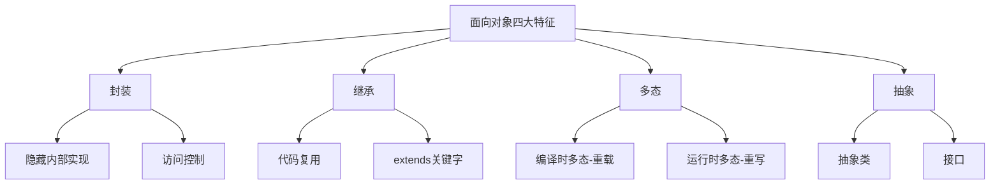

# Java基础面试题详解

## 目录
本文档包含69个Java基础面试题的详细解答，适合新手小白快速学习。

---

## Java基础面试题

### 1. 面向对象的特征有哪些方面?

面向对象编程(OOP)有四大核心特征：

**封装(Encapsulation)**
- 将数据和操作数据的方法绑定在一起，隐藏对象的内部实现细节
- 通过访问修饰符(private、protected、public)控制访问权限
- 提供公共的getter/setter方法访问私有属性

**继承(Inheritance)**
- 子类可以继承父类的属性和方法，实现代码复用
- Java使用`extends`关键字实现继承
- Java只支持单继承，但可以通过接口实现多重继承的效果

**多态(Polymorphism)**
- 同一个方法调用可以有不同的执行结果
- 分为编译时多态(方法重载)和运行时多态(方法重写)
- 通过父类引用指向子类对象实现

**抽象(Abstraction)**
- 提取事物的共同特征，忽略非本质的细节
- 通过抽象类和接口实现
- 定义规范，隐藏实现细节



**代码示例：**
```java
// 封装示例
public class Person {
    private String name;
    private int age;
    
    public String getName() { return name; }
    public void setName(String name) { this.name = name; }
}

// 继承示例
public class Student extends Person {
    private String studentId;
}

// 多态示例
Person p = new Student(); // 父类引用指向子类对象
```

---

### 2. 访问修饰符public,private,protected,以及不写(默认)时的区别?

Java提供了四种访问修饰符，用于控制类、方法、变量的访问权限：

| 修饰符 | 同一类 | 同一包 | 不同包子类 | 不同包非子类 |
|--------|--------|--------|------------|--------------|
| private | ✓ | ✗ | ✗ | ✗ |
| 默认(default) | ✓ | ✓ | ✗ | ✗ |
| protected | ✓ | ✓ | ✓ | ✗ |
| public | ✓ | ✓ | ✓ | ✓ |

**详细说明：**

1. **private(私有)**
   - 最严格的访问级别
   - 只能在声明它的类内部访问
   - 常用于隐藏类的实现细节

2. **default(默认/包私有)**
   - 不写任何修饰符时的默认级别
   - 同一个包内的类可以访问
   - 也称为package-private

3. **protected(受保护)**
   - 同一包内的类可以访问
   - 不同包的子类也可以访问
   - 常用于希望子类可以访问但外部不能访问的成员

4. **public(公共)**
   - 最宽松的访问级别
   - 任何地方都可以访问
   - 常用于对外提供的API接口

```java
public class AccessModifierDemo {
    public String publicField = "公共字段";
    protected String protectedField = "受保护字段";
    String defaultField = "默认字段";
    private String privateField = "私有字段";
    
    public void publicMethod() {}
    protected void protectedMethod() {}
    void defaultMethod() {}
    private void privateMethod() {}
}
```

---

### 3. String是最基本的数据类型吗?

**答案：不是。**

String是一个引用类型，是Java标准库中的一个类(java.lang.String)，而不是基本数据类型。

**Java的8种基本数据类型：**

