# Java并发编程面试题（全集）

> 本文档涵盖 Java 并发编程一（74题）和 Java 并发编程二（48题），共 122 道高频面试题，附详细解析、代码示例与 Mermaid 图解。

---

# 第一部分：Java 并发编程（一）

---

## 1. 在 Java 中守护线程和本地线程区别?

**守护线程（Daemon Thread）** 是为其他线程提供服务的后台线程，典型代表是垃圾回收线程（GC）。**用户线程（User Thread / 本地线程）** 是程序正常工作线程。

核心区别如下：

| 对比项 | 守护线程 | 用户线程 |
|--------|----------|----------|
| 生命周期 | 随最后一个用户线程结束而结束 | JVM 等待所有用户线程结束后才退出 |
| 设置方式 | `thread.setDaemon(true)` | 默认就是用户线程 |
| 典型用途 | GC、心跳检测、日志刷盘 | 业务逻辑 |
| JVM 退出 | 不阻止 JVM 退出 | 阻止 JVM 退出 |

```java
public class DaemonThreadDemo {
    public static void main(String[] args) throws InterruptedException {
        Thread daemon = new Thread(() -> {
            while (true) {
                System.out.println("守护线程运行中...");
                try { Thread.sleep(500); } catch (InterruptedException e) { break; }
            }
        });
        daemon.setDaemon(true); // 必须在 start() 之前设置
        daemon.start();

        Thread.sleep(2000);
        System.out.println("主线程结束，守护线程也会随之退出");
    }
}
```

注意：`setDaemon(true)` 必须在线程启动之前调用，否则抛出 `IllegalThreadStateException`。

---

## 2. 线程与进程的区别?

| 对比项 | 进程 | 线程 |
|--------|------|------|
| 定义 | 程序的一次执行实例，是资源分配的基本单位 | 进程内的执行单元，是 CPU 调度的基本单位 |
| 内存 | 独立内存空间 | 共享所在进程的内存空间 |
| 创建开销 | 大（需分配独立资源） | 小（共享进程资源） |
| 通信方式 | IPC（管道、消息队列、共享内存等） | 共享内存变量、wait/notify |
| 崩溃影响 | 不影响其他进程 | 可能导致整个进程崩溃 |

```java
// 线程共享进程堆内存示例
public class ProcessThreadDemo {
    static int sharedVar = 0; // 所有线程共享此变量

    public static void main(String[] args) throws InterruptedException {
        Thread t1 = new Thread(() -> sharedVar++);
        Thread t2 = new Thread(() -> sharedVar++);
        t1.start(); t2.start();
        t1.join(); t2.join();
        System.out.println("sharedVar = " + sharedVar); // 可能为 1 或 2（竞态条件）
    }
}
```

---

## 3. 什么是多线程中的上下文切换?

**上下文切换（Context Switch）** 是指 CPU 从一个线程切换到另一个线程时，需要保存当前线程的运行状态（程序计数器、寄存器、栈指针等），并恢复下一个线程的状态的过程。

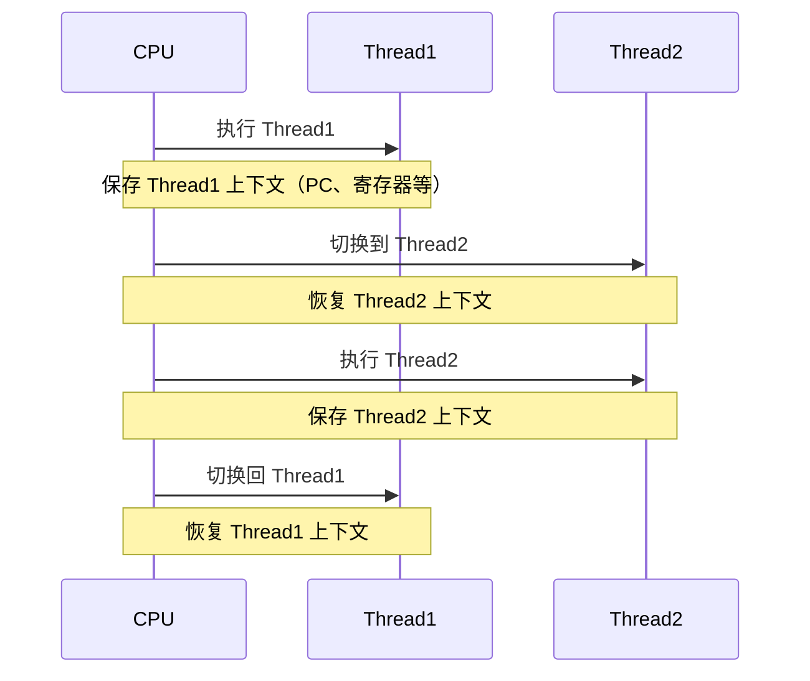

**上下文切换的触发原因：**
- 时间片耗尽（时间分片调度）
- 线程主动让出 CPU（`Thread.yield()`）
- 线程阻塞（I/O、锁等待、`sleep()`、`wait()`）
- 优先级更高的线程就绪

**减少上下文切换的方法：**
- 使用无锁并发编程（如 CAS）
- 减少线程数（使用线程池）
- 使用协程（Java 21+ 虚拟线程）
- 避免频繁的锁竞争

---

## 4. 死锁与活锁的区别，死锁与饥饿的区别?

### 死锁（Deadlock）
多个线程相互等待对方持有的资源，导致所有线程永久阻塞。

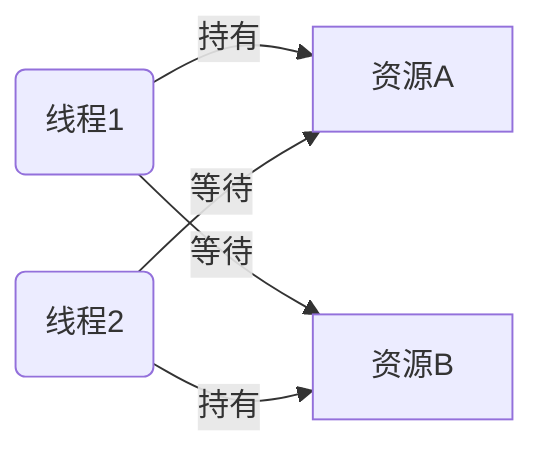

死锁必须同时满足四个条件（**科夫曼条件**）：
1. **互斥**：资源同一时刻只能被一个线程使用
2. **持有并等待**：线程持有资源同时等待其他资源
3. **不可剥夺**：已获得资源不能被强制释放
4. **循环等待**：线程间形成环形等待链

```java
// 死锁示例
public class DeadlockDemo {
    static Object lockA = new Object();
    static Object lockB = new Object();

    public static void main(String[] args) {
        Thread t1 = new Thread(() -> {
            synchronized (lockA) {
                System.out.println("T1 持有 lockA，等待 lockB");
                try { Thread.sleep(100); } catch (InterruptedException e) {}
                synchronized (lockB) { System.out.println("T1 获得 lockB"); }
            }
        });

        Thread t2 = new Thread(() -> {
            synchronized (lockB) {
                System.out.println("T2 持有 lockB，等待 lockA");
                synchronized (lockA) { System.out.println("T2 获得 lockA"); }
            }
        });

        t1.start();
        t2.start();
    }
}
```

### 活锁（Livelock）
线程没有阻塞，但不断重试并相互礼让，导致没有任何线程能推进。

> 比喻：两人在走廊相遇，都往同一方向让路，反复如此，谁都无法通过。

### 饥饿（Starvation）
某些线程因为长期无法获得所需资源（如低优先级线程总被高优先级线程抢占）而无法执行。

| 特征 | 死锁 | 活锁 | 饥饿 |
|------|------|------|------|
| 线程状态 | 阻塞 | 运行（忙等） | 等待 |
| 能否自行解除 | 否 | 有时可以 | 有时可以 |
| CPU 消耗 | 低 | 高 | 低 |

---

## 5. Java 中用到的线程调度算法是什么?

Java 线程调度依赖底层操作系统，主要使用两种算法：

**1. 抢占式调度（Preemptive Scheduling）** — Java 主要使用此方式
- 操作系统决定哪个线程运行以及运行多长时间
- 线程优先级影响获得 CPU 时间片的概率，但不能保证绝对顺序
- 高优先级线程有更多机会获得 CPU

**2. 协作式调度（Cooperative Scheduling）**
- 线程主动让出 CPU（`yield()`）
- 不依赖操作系统强制切换

```java
public class ThreadPriorityDemo {
    public static void main(String[] args) {
        Thread low = new Thread(() -> System.out.println("低优先级线程"));
        Thread high = new Thread(() -> System.out.println("高优先级线程"));

        low.setPriority(Thread.MIN_PRIORITY);  // 1
        high.setPriority(Thread.MAX_PRIORITY); // 10

        low.start();
        high.start();
        // 注意：优先级高只是"概率更高"，不能保证 high 一定先执行
    }
}
```

优先级范围：1（MIN_PRIORITY）~ 10（MAX_PRIORITY），默认为 5（NORM_PRIORITY）。

---

## 6. 什么是线程组，为什么在 Java 中不推荐使用?

**线程组（ThreadGroup）** 是 Java 早期提供的用于批量管理线程的机制，可以对组内所有线程执行统一操作（如中断、设置优先级）。

```java
ThreadGroup group = new ThreadGroup("myGroup");
Thread t1 = new Thread(group, () -> System.out.println("t1"), "thread-1");
Thread t2 = new Thread(group, () -> System.out.println("t2"), "thread-2");
t1.start();
t2.start();

System.out.println("组中活跃线程数：" + group.activeCount());
group.interrupt(); // 中断组内所有线程
```

**不推荐使用的原因：**
- API 设计过时，许多方法已废弃（如 `stop()`、`suspend()`）
- 功能有限，无法精细控制
- `ExecutorService` 和线程池提供了更好的替代方案
- 异常处理机制不完善

---

## 7. 为什么使用 Executor 框架?

Executor 框架将**任务提交**与**线程管理**分离，避免了手动创建和销毁线程的开销。

**不使用线程池的问题：**
- 频繁创建/销毁线程开销大
- 无法控制并发线程数，可能耗尽系统资源
- 线程管理代码与业务代码耦合

**Executor 框架优势：**
```java
// 不推荐：手动创建线程
new Thread(() -> doTask()).start(); // 每次都创建新线程

// 推荐：使用线程池
ExecutorService executor = Executors.newFixedThreadPool(4);
executor.submit(() -> doTask()); // 复用线程池中的线程
executor.shutdown();
```

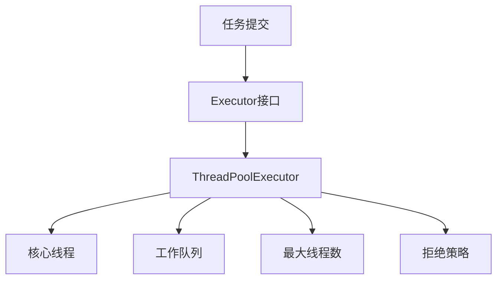

---

## 8. 在 Java 中 Executor 和 Executors 的区别?

| 对比项 | Executor | Executors |
|--------|----------|-----------|
| 类型 | 接口 | 工具类（工厂类） |
| 作用 | 定义执行任务的顶层规范（只有 `execute()` 方法） | 提供创建各种线程池的静态工厂方法 |
| 是否实例化 | 不能（接口） | 不能（工具类，构造私有） |

```java
// Executor 接口
public interface Executor {
    void execute(Runnable command);
}

// Executors 工厂方法示例
ExecutorService fixed   = Executors.newFixedThreadPool(4);       // 固定大小线程池
ExecutorService cached  = Executors.newCachedThreadPool();       // 可缓存线程池
ExecutorService single  = Executors.newSingleThreadExecutor();   // 单线程线程池
ScheduledExecutorService scheduled = Executors.newScheduledThreadPool(2); // 定时线程池
```

层级关系：
```
Executor
  └── ExecutorService
        ├── AbstractExecutorService
        │     └── ThreadPoolExecutor ← Executors 创建的实际对象
        └── ScheduledExecutorService
              └── ScheduledThreadPoolExecutor
```

---

## 9. 如何在 Windows 和 Linux 上查找哪个线程使用的 CPU 时间最长?

### Linux 环境

```bash
# 1. 找到 Java 进程 PID
jps -l
# 或
ps -ef | grep java

# 2. 查看该进程下各线程的 CPU 使用率（-H 展示线程，-p 指定 PID）
top -H -p <PID>

# 3. 找到 CPU 最高的线程 TID（十进制），转为十六进制
printf "%x\n" <TID>

# 4. 导出线程堆栈
jstack <PID> > dump.txt

# 5. 在 dump.txt 中搜索对应十六进制的 nid
grep "nid=0x<hex_tid>" dump.txt
```

### Windows 环境

```powershell
# 使用 Process Explorer（Sysinternals 工具）可视化查看线程 CPU
# 或使用 JVisualVM / JConsole
# 命令行方式：
jstack <PID>  # 查看所有线程堆栈
```

---

## 10. 什么是原子操作? 在 Java Concurrency API 中有哪些原子类?

**原子操作（Atomic Operation）** 是不可分割的操作，在执行过程中不会被其他线程打断，要么全部完成，要么完全不执行。

Java 中 `java.util.concurrent.atomic` 包提供了丰富的原子类：

| 类型 | 代表类 |
|------|--------|
| 基本类型 | `AtomicInteger`、`AtomicLong`、`AtomicBoolean` |
| 引用类型 | `AtomicReference`、`AtomicStampedReference`（解决ABA问题） |
| 数组类型 | `AtomicIntegerArray`、`AtomicLongArray` |
| 字段更新 | `AtomicIntegerFieldUpdater`、`AtomicLongFieldUpdater` |
| 高性能累加 | `LongAdder`、`LongAccumulator`（Java 8+，高并发下优于AtomicLong） |

```java
import java.util.concurrent.atomic.AtomicInteger;

public class AtomicDemo {
    private static AtomicInteger counter = new AtomicInteger(0);

    public static void main(String[] args) throws InterruptedException {
        Runnable task = () -> {
            for (int i = 0; i < 1000; i++) {
                counter.incrementAndGet(); // 原子自增，线程安全
            }
        };

        Thread t1 = new Thread(task);
        Thread t2 = new Thread(task);
        t1.start(); t2.start();
        t1.join(); t2.join();

        System.out.println("最终结果：" + counter.get()); // 一定是 2000
    }
}
```

原子类底层基于 **CAS（Compare-And-Swap）** 硬件指令实现，无需加锁，性能高于 `synchronized`。

---

## 3. 什么是多线程中的上下文切换?

**上下文切换（Context Switch）** 是指 CPU 从一个线程切换到另一个线程时，需要保存当前线程的运行状态（程序计数器、寄存器、栈信息等），并恢复下一个线程的状态的过程。

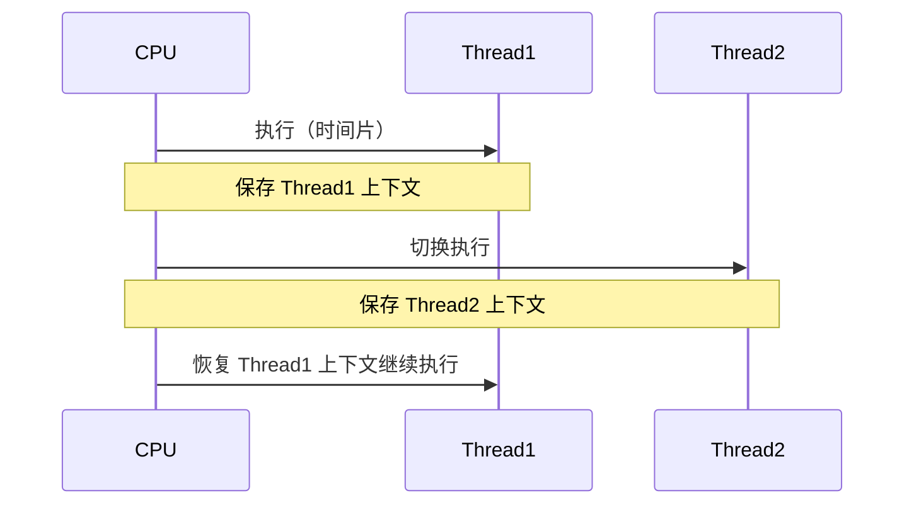

**触发上下文切换的场景：**
- 时间片耗尽（抢占式调度）
- 线程主动 `sleep()`、`wait()`、`yield()`
- I/O 阻塞
- 锁竞争导致阻塞

**减少上下文切换的方法：**
1. 减少线程数量（线程池）
2. 使用无锁并发（CAS）
3. 协程（虚拟线程，Java 21+）
4. 避免频繁加锁/解锁

---

## 4. 死锁与活锁的区别，死锁与饥饿的区别?

| 概念 | 描述 | 特征 |
|------|------|------|
| **死锁** | 两个或多个线程互相等待对方释放锁，永远阻塞 | 线程完全停止 |
| **活锁** | 线程不断响应对方的动作而改变状态，但无法推进 | 线程在运行但无进展 |
| **饥饿** | 某线程长期无法获得所需资源（如低优先级线程） | 线程一直等待 |

```java
// 死锁经典示例
public class DeadLockDemo {
    static Object lockA = new Object();
    static Object lockB = new Object();

    public static void main(String[] args) {
        Thread t1 = new Thread(() -> {
            synchronized (lockA) {
                System.out.println("T1 持有 A，等待 B");
                try { Thread.sleep(100); } catch (InterruptedException e) {}
                synchronized (lockB) { System.out.println("T1 获得 B"); }
            }
        });
        Thread t2 = new Thread(() -> {
            synchronized (lockB) {
                System.out.println("T2 持有 B，等待 A");
                synchronized (lockA) { System.out.println("T2 获得 A"); }
            }
        });
        t1.start(); t2.start();
    }
}
```

**死锁四个必要条件：**
1. 互斥条件
2. 占有并等待
3. 不可剥夺
4. 循环等待

**避免死锁：** 按固定顺序获取锁、使用 `tryLock()` 超时、使用死锁检测工具（jstack）。

---

## 5. Java 中用到的线程调度算法是什么?

Java 使用**抢占式调度（Preemptive Scheduling）**，基于优先级（1-10，默认5）。

- **抢占式调度**：高优先级线程可抢占低优先级线程的 CPU 时间片
- **时间片轮转**：同优先级线程轮流分配时间片

```java
Thread t = new Thread(() -> System.out.println("running"));
t.setPriority(Thread.MAX_PRIORITY); // 10
t.setPriority(Thread.MIN_PRIORITY); // 1
t.setPriority(Thread.NORM_PRIORITY); // 5（默认）
```

> ⚠️ 注意：Java 线程优先级最终映射到操作系统级别，不同 OS 行为不同，优先级仅作提示，不保证执行顺序。

---

## 6. 什么是线程组，为什么在 Java 中不推荐使用?

`ThreadGroup` 可以将多个线程归为一组，方便统一管理（如批量中断）。

```java
ThreadGroup group = new ThreadGroup("myGroup");
Thread t1 = new Thread(group, () -> {}, "t1");
Thread t2 = new Thread(group, () -> {}, "t2");
group.interrupt(); // 中断组内所有线程
```

**不推荐原因：**
1. API 设计缺陷，部分方法已被废弃
2. 功能有限，无法替代线程池
3. `ThreadGroup.uncaughtException()` 不够灵活
4. 现代推荐使用 `ExecutorService` + `ThreadFactory` 代替

---

## 7. 为什么使用 Executor 框架?

**直接创建线程的问题：**
- 线程创建/销毁开销大
- 无法控制线程数量，可能导致 OOM
- 缺乏统一管理和监控

**Executor 框架的优势：**
1. 线程复用，降低创建开销
2. 控制最大并发数
3. 提供任务队列缓冲
4. 支持定时、周期性任务
5. 提供 Future 获取异步结果

```java
ExecutorService pool = Executors.newFixedThreadPool(4);
Future<String> future = pool.submit(() -> {
    Thread.sleep(1000);
    return "任务完成";
});
System.out.println(future.get()); // 阻塞等待结果
pool.shutdown();
```

---

## 8. 在 Java 中 Executor 和 Executors 的区别?

| 对比 | Executor | Executors |
|------|----------|-----------|
| 类型 | 接口 | 工具类（全静态方法） |
| 作用 | 定义 `execute(Runnable)` 规范 | 提供工厂方法创建线程池 |
| 关系 | 是基础接口 | 是辅助工具类 |

```java
// Executor 接口
Executor executor = command -> new Thread(command).start();
executor.execute(() -> System.out.println("via Executor"));

// Executors 工具类
ExecutorService fixed    = Executors.newFixedThreadPool(4);
ExecutorService single   = Executors.newSingleThreadExecutor();
ExecutorService cached   = Executors.newCachedThreadPool();
ScheduledExecutorService scheduled = Executors.newScheduledThreadPool(2);
```

> ⚠️ 生产环境建议直接使用 `ThreadPoolExecutor` 构造，避免 `Executors` 工厂方法的潜在 OOM 风险。

---

## 9. 如何在 Windows 和 Linux 上查找哪个线程使用的 CPU 时间最长?

**Linux 方法：**
```bash
# 1. 找到进程 PID
ps -ef | grep java
# 2. 查看该进程内各线程 CPU 占用
top -Hp <PID>
# 3. 记录 CPU 最高的线程 TID，转换为十六进制
printf '%x\n' <TID>
# 4. 用 jstack 找到对应线程
jstack <PID> | grep -A 30 'nid=0x<hex_tid>'
```

**Windows 方法：**
使用 Process Explorer 工具查看线程 CPU 时间，或 `jstack <PID>` 导出线程栈结合线程 ID 分析。

---

## 10. 什么是原子操作？在 Java Concurrency API 中有哪些原子类？

**原子操作**是不可分割的操作，执行过程中不会被线程切换中断。`java.util.concurrent.atomic` 包提供了以下原子类：

| 分类 | 类名 |
|------|------|
| 基本类型 | `AtomicInteger`、`AtomicLong`、`AtomicBoolean` |
| 引用类型 | `AtomicReference`、`AtomicStampedReference`（解决ABA）|
| 数组类型 | `AtomicIntegerArray`、`AtomicLongArray` |
| 字段更新 | `AtomicIntegerFieldUpdater`、`AtomicLongFieldUpdater` |
| 累加器 | `LongAdder`、`LongAccumulator`（高并发累加首选）|

```java
AtomicInteger count = new AtomicInteger(0);
count.incrementAndGet();         // 原子自增
count.compareAndSet(1, 2);       // CAS: 期望值1则设为2
int val = count.getAndAdd(5);    // 原子加5，返回旧值
```

---

## 11. Lock 接口是什么？对比 synchronized 有什么优势？

`java.util.concurrent.locks.Lock` 是显式锁接口，主要实现类是 `ReentrantLock`。

| 对比维度 | synchronized | Lock |
|---------|-------------|------|
| 释放方式 | 自动释放 | 必须手动 `unlock()` |
| 中断响应 | 不可中断 | `lockInterruptibly()` 可中断 |
| 超时获取 | 不支持 | `tryLock(time, unit)` |
| 公平锁 | 不支持 | `new ReentrantLock(true)` |
| 条件变量 | 一个等待队列 | 多个 `Condition` |

```java
ReentrantLock lock = new ReentrantLock();
lock.lock();
try {
    // 临界区
} finally {
    lock.unlock(); // 必须在 finally 中释放
}
```

---

## 12. 什么是 Executors 框架？

`Executors` 框架（`java.util.concurrent`）是 Java 对线程池的完整抽象，包含：

- **Executor**：最基础接口，只有 `execute(Runnable)` 方法
- **ExecutorService**：扩展 Executor，支持 `submit()`、`shutdown()`、`invokeAll()` 等
- **ScheduledExecutorService**：支持定时和周期性任务
- **ThreadPoolExecutor**：核心实现，可精细配置线程池参数
- **ForkJoinPool**：分治并行框架，适合递归任务

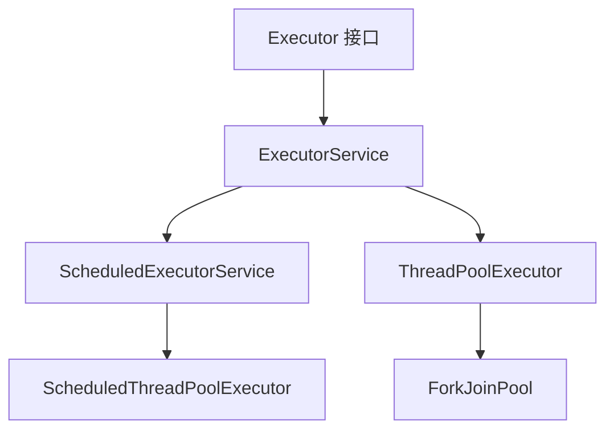

---

## 13. 什么是阻塞队列？实现原理是什么？如何实现生产者-消费者模型？

**阻塞队列**（`BlockingQueue`）是支持两个附加操作的队列：
- 当队列满时，**生产者线程阻塞**，直到队列有空间
- 当队列空时，**消费者线程阻塞**，直到队列有元素

常见实现：

| 实现类 | 特点 |
|--------|------|
| `ArrayBlockingQueue` | 有界数组，公平/非公平锁 |
| `LinkedBlockingQueue` | 可选有界链表，吞吐量高 |
| `PriorityBlockingQueue` | 优先级无界队列 |
| `SynchronousQueue` | 无容量，直接传递 |
| `DelayQueue` | 延迟元素，到期才可取 |

```java
// 生产者-消费者示例
BlockingQueue<Integer> queue = new ArrayBlockingQueue<>(10);

// 生产者
Thread producer = new Thread(() -> {
    for (int i = 0; i < 20; i++) {
        try {
            queue.put(i);  // 队列满则阻塞
            System.out.println("生产: " + i);
        } catch (InterruptedException e) { Thread.currentThread().interrupt(); }
    }
});

// 消费者
Thread consumer = new Thread(() -> {
    while (true) {
        try {
            int val = queue.take();  // 队列空则阻塞
            System.out.println("消费: " + val);
        } catch (InterruptedException e) { break; }
    }
});
producer.start(); consumer.start();
```

---

## 14. 什么是 Callable 和 Future？

**Callable** 类似 Runnable，但可以返回结果并抛出受检异常：

```java
Callable<Integer> task = () -> {
    Thread.sleep(1000);
    return 42;
};
```

**Future** 代表异步计算的结果，提供检查完成、取消、获取结果的方法：

```java
ExecutorService pool = Executors.newFixedThreadPool(2);
Future<Integer> future = pool.submit(task);
System.out.println(future.isDone());      // 是否完成
System.out.println(future.get());         // 阻塞等待结果
future.cancel(true);                      // 取消任务
```

---

## 15. 什么是 FutureTask？

`FutureTask` 同时实现了 `Runnable` 和 `Future`，既可以提交给线程池，也可以直接用 `Thread` 运行：

```java
FutureTask<String> futureTask = new FutureTask<>(() -> {
    Thread.sleep(500);
    return "计算结果";
});

new Thread(futureTask).start();           // 方式一：直接 Thread 运行
// ExecutorService.submit(futureTask);    // 方式二：线程池提交

String result = futureTask.get();         // 阻塞获取结果
System.out.println(result);
```

---

## 16. 什么是并发容器？

JDK 提供的线程安全容器（`java.util.concurrent` 包）：

| 容器 | 对应普通容器 | 特点 |
|------|------------|------|
| `ConcurrentHashMap` | `HashMap` | 分段锁/CAS，高并发读写 |
| `CopyOnWriteArrayList` | `ArrayList` | 写时复制，读多写少 |
| `CopyOnWriteArraySet` | `HashSet` | 同上 |
| `ConcurrentLinkedQueue` | `LinkedList` | 无锁队列，高并发 |
| `ConcurrentSkipListMap` | `TreeMap` | 跳表，有序并发 |
| `ArrayBlockingQueue` | — | 有界阻塞队列 |
| `LinkedBlockingQueue` | — | 可选有界阻塞队列 |

---

## 17. 多线程同步和互斥有几种实现方法？

1. **synchronized 关键字**：修饰方法或代码块，最简单
2. **ReentrantLock**：显式锁，支持公平锁、可中断、超时
3. **volatile 关键字**：保证可见性，不保证原子性
4. **Atomic 原子类**：基于 CAS，无锁原子操作
5. **ThreadLocal**：线程本地变量，彻底避免共享
6. **阻塞队列**：通过队列传递数据，避免共享状态
7. **Semaphore**：信号量，控制并发数量
8. **CountDownLatch / CyclicBarrier**：线程协调同步

---

## 18. 什么是竞争条件？如何发现和解决？

**竞争条件**（Race Condition）：多个线程并发访问共享资源，最终结果依赖线程执行顺序时产生。

**发现方式：**
- 代码审查：找到读-改-写操作
- 使用线程检测工具：Java ThreadSanitizer、FindBugs、Helgrind
- 压测 + jstack 分析线程状态

**解决方式：**
```java
// 错误：非原子的读-改-写
int count = 0;
count++;  // 多线程下不安全

// 方案1：synchronized
synchronized(this) { count++; }

// 方案2：AtomicInteger
AtomicInteger count = new AtomicInteger(0);
count.incrementAndGet();

// 方案3：使用并发容器代替普通容器
Map<String, Integer> map = new ConcurrentHashMap<>();
```


## 19. 你将如何使用thread dump?你将如何分析Thread dump?

Thread dump 是 JVM 中所有线程在某一时刻的快照，记录了每条线程的状态、调用栈等信息。

**获取 Thread Dump 的方式：**

```bash
# 方式1：jstack 命令（最常用）
jstack <pid> > thread_dump.txt

# 方式2：kill -3 信号（Linux）
kill -3 <pid>

# 方式3：jcmd 命令
jcmd <pid> Thread.print

# 方式4：VisualVM / JConsole 图形化工具

# 方式5：Java代码
Thread.getAllStackTraces();
```

**Thread Dump 典型格式：**

```
"main" #1 prio=5 os_prio=0 tid=0x00007f... nid=0x1234 runnable [0x...]
   java.lang.Thread.State: RUNNABLE
        at java.io.FileInputStream.read0(Native Method)
        at java.io.FileInputStream.read(FileInputStream.java:207)
        at com.example.Main.main(Main.java:15)

"pool-1-thread-1" #12 prio=5 os_prio=0 tid=0x... nid=0x5678 waiting on condition [0x...]
   java.lang.Thread.State: WAITING (parking)
        at sun.misc.Unsafe.park(Native Method)
        - parking to wait for <0x00000007> (a java.util.concurrent.locks.AbstractQueuedSynchronizer$ConditionObject)
        at java.util.concurrent.locks.LockSupport.park(LockSupport.java:175)
```

**分析 Thread Dump 的步骤：**

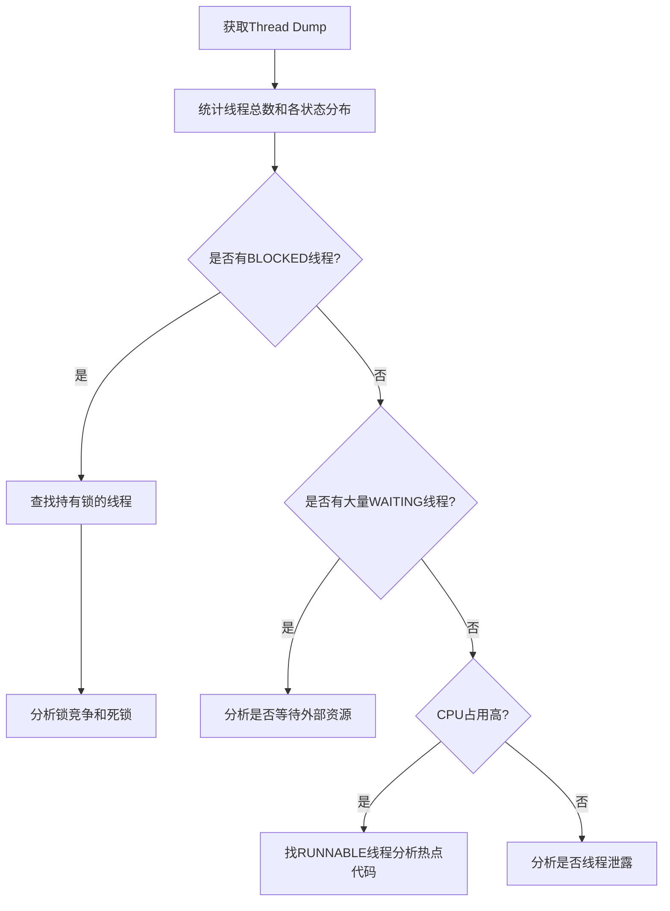

**常见问题特征：**

| 问题 | Thread Dump特征 |
|------|----------------|
| 死锁 | 循环等待锁，jstack会直接提示Found deadlock |
| CPU飙高 | 大量线程处于RUNNABLE状态，调用栈指向同一代码 |
| 线程泄漏 | 线程数持续增加 |
| 等待I/O | 大量线程WAITING在socket read/write |

---

## 20. 为什么我们调用start()方法时会执行run()方法，为什么我们不能直接调用run()方法?

**调用 start() 的过程：**

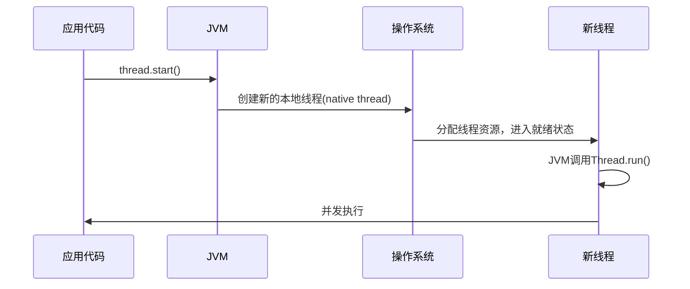

**直接调用 run() 的问题：**

```java
Thread t = new Thread(() -> {
    System.out.println("当前线程: " + Thread.currentThread().getName());
});

// 正确做法：start() 创建新线程
t.start();  // 输出: Thread-0

// 错误做法：run() 在当前线程执行
t.run();    // 输出: main（在main线程中同步执行，不创建新线程）
```

**核心区别：**

| 方法 | 是否创建新线程 | 执行方式 |
|------|--------------|---------|
| start() | 是 | 由JVM在新线程中异步调用run() |
| run() | 否 | 在当前线程中同步调用，普通方法调用 |

---

## 21. Java中你怎样唤醒一个阻塞的线程?

根据线程的不同阻塞原因，唤醒方式不同：

```mermaid
graph TD
    A[阻塞的线程] --> B{阻塞原因}
    B -->|wait()等待| C[notify/notifyAll唤醒]
    B -->|sleep()睡眠| D[等待超时自动唤醒]
    B -->|join()等待| E[被join的线程执行完毕]
    B -->|I/O阻塞| F[I/O完成或关闭连接]
    B -->|synchronized等锁| G[持锁线程释放锁]
    B -->|LockSupport.park| H[LockSupport.unpark(thread)]
    B -->|interrupt中断| I[调用thread.interrupt()]
```

**各种唤醒方式示例：**

```java
// 1. wait/notify
synchronized(lock) {
    lock.wait();       // 阻塞
}
synchronized(lock) {
    lock.notify();     // 唤醒
}

// 2. LockSupport（推荐，更灵活）
LockSupport.park();           // 阻塞当前线程
LockSupport.unpark(thread);   // 唤醒指定线程

// 3. interrupt 中断（用于可中断的阻塞操作）
thread.interrupt();
// 被中断的线程会抛出 InterruptedException
```

---

## 22. 在Java中CyclicBarrier和CountdownLatch有什么区别?

**CountDownLatch（倒计数门闩）：**

- 一次性的，计数到0后不能重置
- 允许一个或多个线程等待其他线程完成操作
- 常用于：主线程等待所有子线程完成初始化

**CyclicBarrier（循环屏障）：**

- 可重用的，所有线程到达屏障后可以重置继续使用
- 让一组线程相互等待，直到所有线程都到达屏障点
- 常用于：并行计算，分阶段任务

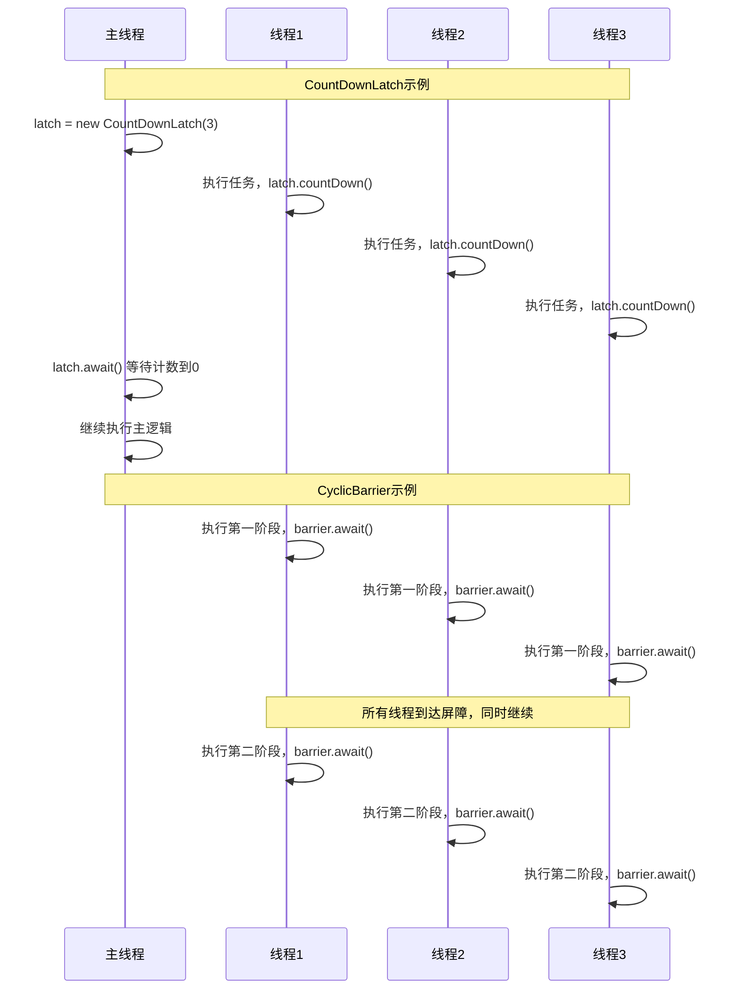

```java
// CountDownLatch
CountDownLatch latch = new CountDownLatch(3);
for (int i = 0; i < 3; i++) {
    new Thread(() -> {
        // 执行任务...
        latch.countDown();
    }).start();
}
latch.await(); // 等待3个线程完成

// CyclicBarrier
CyclicBarrier barrier = new CyclicBarrier(3, () -> System.out.println("所有线程到达屏障"));
for (int i = 0; i < 3; i++) {
    new Thread(() -> {
        // 第一阶段
        barrier.await();
        // 第二阶段（barrier可重用）
        barrier.await();
    }).start();
}
```

| 对比项 | CountDownLatch | CyclicBarrier |
|--------|----------------|---------------|
| 是否可重用 | 否（一次性） | 是（可循环） |
| 等待方向 | 主等子（一对多） | 互相等待（多对多） |
| 计数方式 | 倒计数 | 达到后重置 |
| 屏障动作 | 不支持 | 支持（所有到达后执行一个Runnable） |

---

## 23. 什么是不可变对象，它对写并发应用有什么帮助?

**不可变对象的条件：**

1. 所有字段声明为 `final`
2. 类声明为 `final`（防止子类破坏不变性）
3. 不提供 setter 方法
4. 对可变对象的引用不能泄露

```java
// 不可变对象示例
public final class ImmutablePoint {
    private final int x;
    private final int y;
    private final List<String> tags; // 注意：需要保护性复制

    public ImmutablePoint(int x, int y, List<String> tags) {
        this.x = x;
        this.y = y;
        this.tags = Collections.unmodifiableList(new ArrayList<>(tags)); // 防御性拷贝
    }

    public int getX() { return x; }
    public int getY() { return y; }
    public List<String> getTags() { return tags; }
}
```

**对并发编程的帮助：**

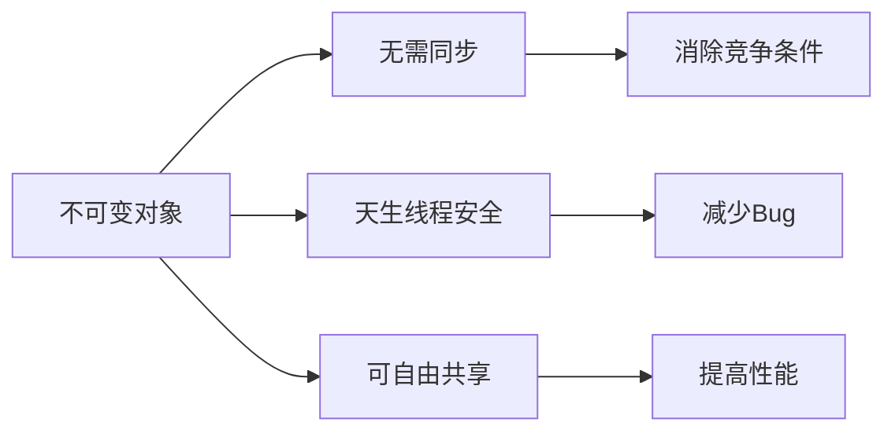

- **线程安全**：状态不可变，多线程读取不需要加锁
- **消除竞争条件**：没有写操作就没有竞争
- **可以自由共享**：不需要防御性拷贝
- **Java中的不可变类**：String、Integer等包装类、LocalDateTime等

---

## 24. 什么是多线程中的上下文切换?

上下文切换是指 CPU 从执行一个线程切换到执行另一个线程的过程。

**上下文切换过程：**


**上下文切换的开销：**
- 保存/恢复寄存器和程序计数器
- 缓存失效（CPU缓存可能需要重建）
- 内核态/用户态切换开销

**减少上下文切换的方法：**
- 减少线程数量，使用线程池
- 使用无锁编程（减少阻塞）
- 使用协程（Java 21中的虚拟线程）

---

## 25. Java中用到的线程调度算法是什么?

Java 使用**抢占式调度**（Preemptive Scheduling）算法。

**抢占式调度特点：**
- 线程优先级高的线程获得较多CPU时间
- 相同优先级的线程轮流获得CPU（时间片轮转）
- 高优先级线程可以抢占低优先级线程的CPU

```java
// Java线程优先级（1-10）
Thread.MIN_PRIORITY  = 1
Thread.NORM_PRIORITY = 5  // 默认优先级
Thread.MAX_PRIORITY  = 10

Thread t = new Thread(() -> {});
t.setPriority(Thread.MAX_PRIORITY); // 设置最高优先级
```

**注意**：Java 线程优先级只是给操作系统的"建议"，不同操作系统的实现不同，不要依赖优先级来控制逻辑。

---

## 26. 什么是线程组，为什么在Java中不推荐使用?

**线程组（ThreadGroup）：**

```java
ThreadGroup group = new ThreadGroup("myGroup");
Thread t1 = new Thread(group, () -> {}, "thread1");
Thread t2 = new Thread(group, () -> {}, "thread2");

// 获取组内线程数
group.activeCount();
// 中断组内所有线程
group.interrupt();
```

**不推荐使用的原因：**

1. **API设计有缺陷**：`enumerate()` 方法有竞争条件
2. **功能被取代**：`ExecutorService` 和 `ForkJoinPool` 提供更好的线程管理
3. **调试困难**：增加代码复杂性
4. **Java 21虚拟线程**：引入了结构化并发（StructuredTaskScope），进一步取代了线程组的使用场景

---

## 27. 为什么使用Executor框架比使用应用创建和管理线程好?

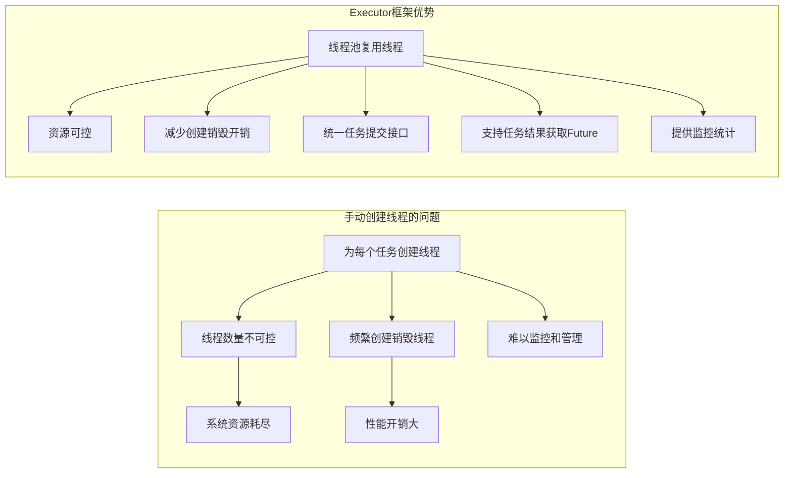

```java
// 不好的做法：每个任务创建新线程
for (Task task : tasks) {
    new Thread(task).start(); // 无法控制并发数，可能OOM
}

// 好的做法：使用线程池
ExecutorService pool = Executors.newFixedThreadPool(10);
for (Task task : tasks) {
    pool.submit(task); // 最多10个并发，超出排队
}
pool.shutdown();
```

**Executor框架的优点：**
- 线程复用，降低资源消耗
- 提高响应速度（任务提交即执行，无需等待线程创建）
- 提高可管理性（统一管理、监控、调优）
- 提供丰富功能（Future、定时任务、线程池参数调整）

---

## 28. java中有几种方法可以实现一个线程?

**4种主要方式：**

```java
// 方式1：继承 Thread 类
class MyThread extends Thread {
    @Override
    public void run() {
        System.out.println("Thread继承方式");
    }
}
new MyThread().start();

// 方式2：实现 Runnable 接口（推荐，解耦）
class MyRunnable implements Runnable {
    @Override
    public void run() {
        System.out.println("Runnable接口方式");
    }
}
new Thread(new MyRunnable()).start();

// 方式3：实现 Callable 接口（支持返回值和异常）
class MyCallable implements Callable<Integer> {
    @Override
    public Integer call() throws Exception {
        return 42;
    }
}
FutureTask<Integer> task = new FutureTask<>(new MyCallable());
new Thread(task).start();
Integer result = task.get(); // 获取返回值

// 方式4：线程池
ExecutorService pool = Executors.newFixedThreadPool(5);
pool.submit(() -> System.out.println("线程池方式"));
```

| 方式 | 优点 | 缺点 |
|------|------|------|
| 继承Thread | 简单 | 不能再继承其他类，耦合度高 |
| 实现Runnable | 可继承其他类，解耦 | 无返回值，无法抛出checked异常 |
| 实现Callable | 有返回值，可抛异常 | 稍复杂 |
| 线程池 | 资源可控，复用 | 需要配置参数 |

---

## 29. 如何停止一个正在运行的线程?

**Java没有强制停止线程的安全方法**（`Thread.stop()` 已废弃，因为会导致数据不一致）

**正确停止线程的方式：**

```java
// 方式1：使用中断机制（推荐）
Thread thread = new Thread(() -> {
    while (!Thread.currentThread().isInterrupted()) {
        // 执行工作
        try {
            Thread.sleep(100);
        } catch (InterruptedException e) {
            Thread.currentThread().interrupt(); // 重置中断标志
            break; // 退出循环
        }
    }
    System.out.println("线程正常结束");
});

thread.start();
Thread.sleep(500);
thread.interrupt(); // 请求中断

// 方式2：使用volatile标志位
class Worker implements Runnable {
    private volatile boolean running = true;

    public void stop() {
        running = false;
    }

    @Override
    public void run() {
        while (running) {
            // 执行工作
        }
    }
}
```

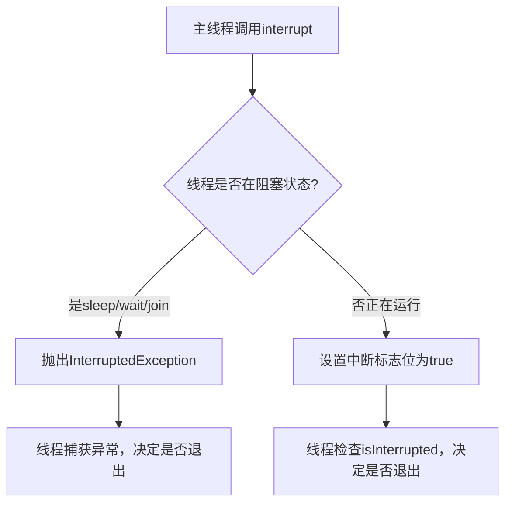

---

## 30. notify()和notifyAll()有什么区别?

**notify()：** 随机唤醒等待队列中的**一个**线程

**notifyAll()：** 唤醒等待队列中的**所有**线程

```java
synchronized(lock) {
    // notify只唤醒一个等待线程（随机选择）
    lock.notify();

    // notifyAll唤醒所有等待线程，让它们竞争锁
    lock.notifyAll();
}
```

**什么时候用哪个：**

- 用 `notifyAll()` 更安全，避免"信号丢失"（一个线程被唤醒但条件不满足，其他等待线程永远不会被唤醒）
- 只在满足以下两个条件时用 `notify()`：
  1. 所有等待线程等待相同的条件
  2. 每次通知只需唤醒一个线程处理（如生产者消费者）

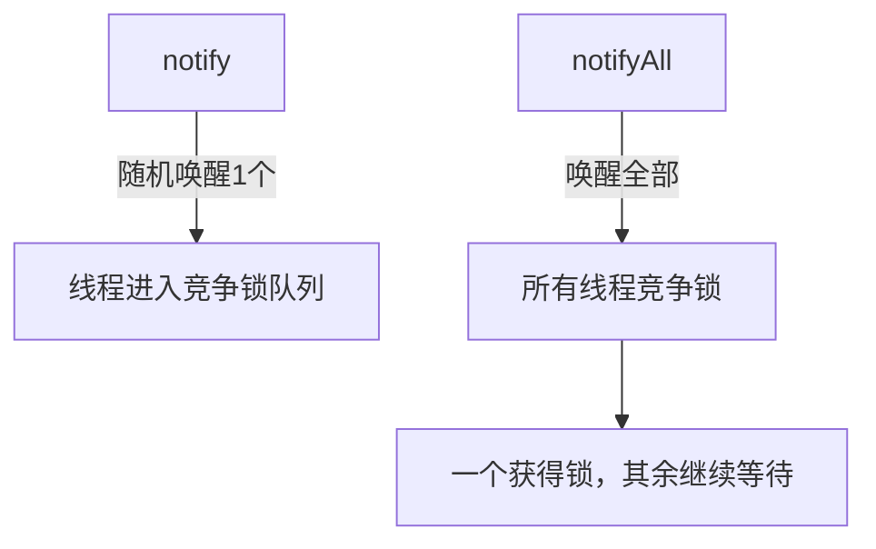

---

## 31. 什么是Daemon线程?它有什么意义?

**守护线程（Daemon Thread）：**

```java
Thread daemonThread = new Thread(() -> {
    while (true) {
        // 后台服务，如GC线程、监控线程
        System.out.println("守护线程运行中...");
        Thread.sleep(1000);
    }
});
daemonThread.setDaemon(true); // 必须在start()之前设置
daemonThread.start();
```

**守护线程 vs 用户线程：**

| 特性 | 用户线程（User Thread） | 守护线程（Daemon Thread） |
|------|------------------------|--------------------------|
| JVM退出条件 | JVM等待所有用户线程结束 | 不影响JVM退出 |
| 典型例子 | main线程、业务线程 | GC线程、日志线程 |
| 优先级 | 正常 | 较低 |

**意义：**
- 为用户线程提供后台服务
- 当所有用户线程结束时，JVM不需要等守护线程，可直接退出
- JVM内置的GC线程就是守护线程

---

## 32. java如何实现多线程之间的通讯和协作?

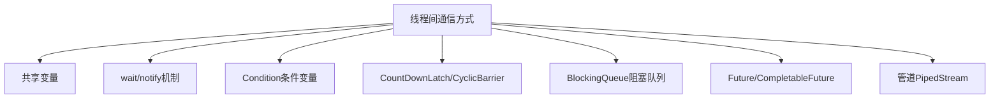

**1. wait/notify（最基础）**

```java
// 生产者
synchronized(queue) {
    while (queue.isFull()) queue.wait();
    queue.add(item);
    queue.notifyAll();
}

// 消费者
synchronized(queue) {
    while (queue.isEmpty()) queue.wait();
    item = queue.remove();
    queue.notifyAll();
}
```

**2. Condition（更灵活）**

```java
ReentrantLock lock = new ReentrantLock();
Condition notFull  = lock.newCondition();
Condition notEmpty = lock.newCondition();

// 生产者
lock.lock();
try {
    while (isFull()) notFull.await();
    add(item);
    notEmpty.signal();
} finally { lock.unlock(); }

// 消费者
lock.lock();
try {
    while (isEmpty()) notEmpty.await();
    remove();
    notFull.signal();
} finally { lock.unlock(); }
```

**3. BlockingQueue（最简洁）**

```java
BlockingQueue<String> queue = new LinkedBlockingQueue<>(10);
// 生产者
queue.put(item);    // 队满时阻塞
// 消费者
item = queue.take(); // 队空时阻塞
```

---

## 33. 什么是可重入锁(ReentrantLock)?

**可重入性：** 同一个线程可以多次获得同一个锁，不会自己死锁。

```java
ReentrantLock lock = new ReentrantLock();

// 同一线程可以多次加锁
lock.lock();         // 第1次加锁，holdCount=1
lock.lock();         // 第2次加锁，holdCount=2
// 需要对应次数的unlock
lock.unlock();       // holdCount=1
lock.unlock();       // holdCount=0，真正释放锁
```

**ReentrantLock vs synchronized：**

```java
// synchronized 也是可重入的
synchronized(this) {
    synchronized(this) { // 不会死锁，因为是同一线程
        // 可以进入
    }
}

// ReentrantLock 额外功能
ReentrantLock lock = new ReentrantLock(true); // 公平锁

// 可超时获取锁
if (lock.tryLock(1, TimeUnit.SECONDS)) {
    try { ... } finally { lock.unlock(); }
}

// 可中断等待
lock.lockInterruptibly();

// 可以查询锁状态
lock.isLocked();
lock.getQueueLength();
```

---

## 34. 当一个线程进入某个对象的一个synchronized的实例方法后，其它线程是否可进入此对象的其它方法?

**分情况讨论：**

```java
class MyObject {
    // 同步实例方法A（锁是this对象）
    public synchronized void methodA() { ... }

    // 同步实例方法B（锁是同一个this对象）
    public synchronized void methodB() { ... }

    // 非同步方法C（无锁）
    public void methodC() { ... }

    // 同步静态方法D（锁是Class对象，不是this）
    public static synchronized void methodD() { ... }
}
```

| 当线程1持有对象锁时 | 线程2可以进入? |
|-------------------|--------------|
| 另一个synchronized实例方法 | ❌ 不可以（同一把锁） |
| 普通非同步方法 | ✅ 可以（无锁） |
| synchronized静态方法 | ✅ 可以（不同的锁：Class锁 vs 对象锁） |
| 不同对象的synchronized方法 | ✅ 可以（不同对象不同锁） |

---

## 35. 乐观锁和悲观锁的理解及如何实现，有哪些实现方式?

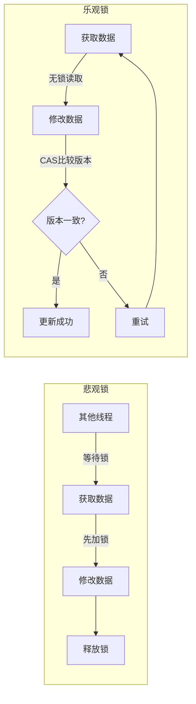

**悲观锁实现：**

```java
// synchronized
synchronized(this) { count++; }

// ReentrantLock
lock.lock();
try { count++; } finally { lock.unlock(); }

// 数据库：SELECT ... FOR UPDATE
```

**乐观锁实现：**

```java
// 1. CAS（Compare And Swap）
AtomicInteger count = new AtomicInteger(0);
count.incrementAndGet(); // 底层是CAS

// 2. 版本号（数据库乐观锁）
// UPDATE user SET balance=#{newBalance}, version=version+1
// WHERE id=#{id} AND version=#{expectedVersion}

// 3. 时间戳
```

| 对比 | 悲观锁 | 乐观锁 |
|------|--------|--------|
| 适用场景 | 写多读少，竞争激烈 | 读多写少，竞争不激烈 |
| 性能 | 低（阻塞等待） | 高（无阻塞） |
| 实现 | synchronized, Lock | CAS, 版本号 |
| 问题 | 死锁风险、性能低 | ABA问题、自旋CPU开销 |

---

## 36. SynchronizedMap和ConcurrentHashMap有什么区别?

```java
// SynchronizedMap：用Collections.synchronizedMap包装
Map<K,V> syncMap = Collections.synchronizedMap(new HashMap<>());

// ConcurrentHashMap：专门设计的并发Map
Map<K,V> concurrentMap = new ConcurrentHashMap<>();
```

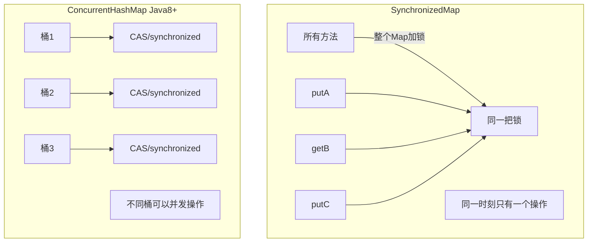

| 对比项 | SynchronizedMap | ConcurrentHashMap |
|--------|-----------------|-------------------|
| 锁粒度 | 整个Map（粗粒度） | 单个桶（细粒度） |
| 并发性能 | 低 | 高 |
| 迭代器 | 需要手动同步 | 弱一致性迭代器 |
| null键值 | 取决于底层Map | 不允许null键值 |
| 适用场景 | 低并发 | 高并发 |

---

## 37. CopyOnWriteArrayList可以用于什么应用场景?

**CopyOnWriteArrayList 写时复制原理：**

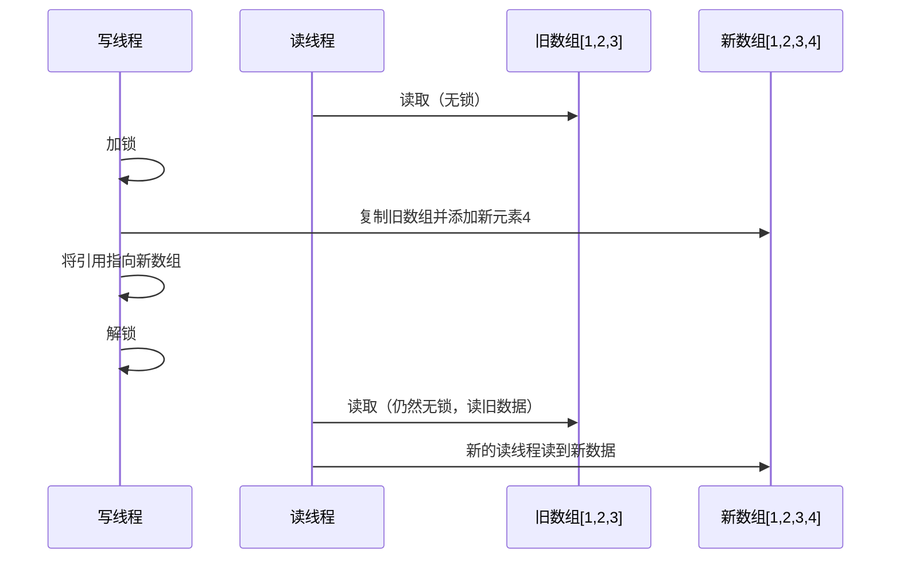

```java
CopyOnWriteArrayList<String> list = new CopyOnWriteArrayList<>();
list.add("a");      // 写操作：复制整个数组
list.get(0);        // 读操作：直接读，无锁
```

**适用场景：**

1. **读多写少**（如系统配置、黑白名单）
2. **迭代频繁，修改少**（如事件监听器列表）
3. **不需要实时一致性**（可以接受读到旧数据）

**不适用场景：**

- 写操作频繁（每次写都要复制整个数组，内存和CPU开销大）
- 数组很大（复制代价高）
- 需要强一致性读

---

## 38. 什么叫线程安全?servlet是线程安全吗?

**线程安全：** 多个线程同时访问某个对象，无需调用方进行额外同步措施，该对象的行为结果始终正确。

**Servlet 不是线程安全的！**

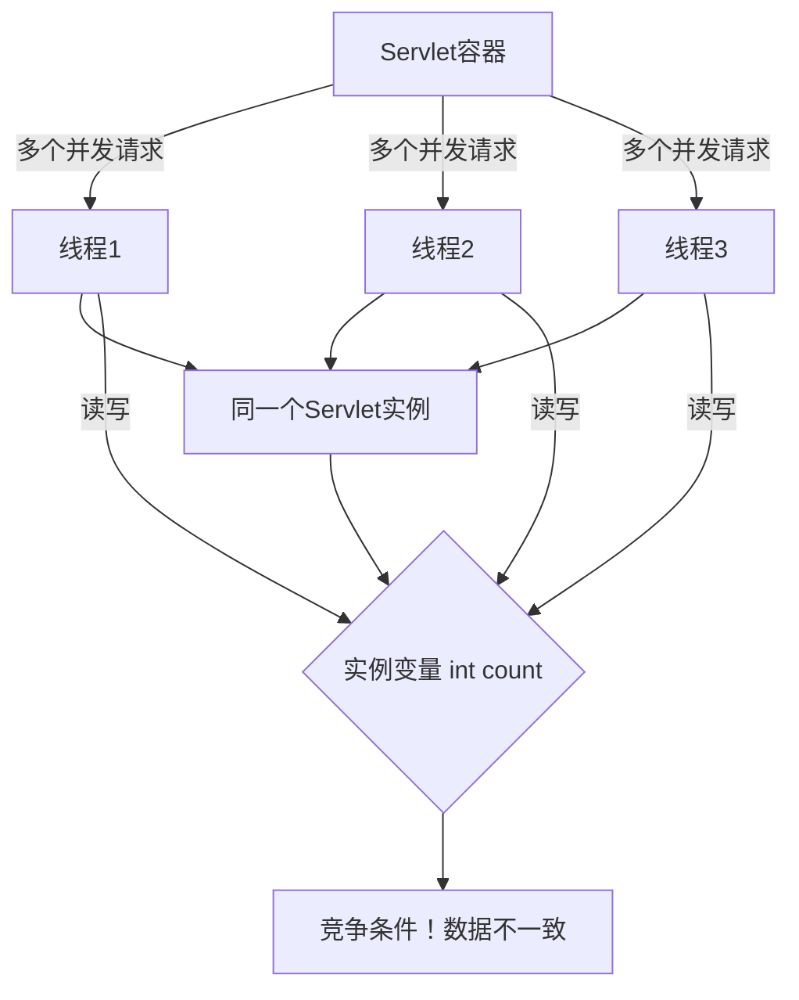

```java
// 线程不安全的 Servlet
@WebServlet("/count")
public class CountServlet extends HttpServlet {
    private int count = 0; // 实例变量，多线程共享！

    protected void doGet(HttpServletRequest req, HttpServletResponse resp) {
        count++; // 竞争条件！
        resp.getWriter().write("Count: " + count);
    }
}

// 线程安全的做法
public class SafeCountServlet extends HttpServlet {
    private AtomicInteger count = new AtomicInteger(0); // 使用原子类

    protected void doGet(HttpServletRequest req, HttpServletResponse resp) {
        int current = count.incrementAndGet(); // 线程安全
        resp.getWriter().write("Count: " + current);
    }
}
```

**使Servlet线程安全的方法：**
- 不使用实例变量（或使用线程安全的类型）
- 使用局部变量（每个线程独立的栈）
- 使用同步块
- 使用ThreadLocal
- 实现SingleThreadModel（已废弃，性能差）

---

## 39. volatile有什么用?能否用一句话说明下volatile的应用场景?

**volatile的两个作用：**

1. **可见性**：修改立即写回主内存，其他线程立即可见
2. **禁止指令重排序**：在volatile变量前后插入内存屏障

```java
// 可见性示例
class StopThread {
    private volatile boolean stop = false; // volatile保证可见性

    public void stop() { stop = true; }

    public void run() {
        while (!stop) { // 能看到stop=true的修改
            // 执行工作
        }
    }
}
```

**volatile 不能解决的问题：**

```java
volatile int count = 0;
count++; // 不是原子操作！= 读取 + 加1 + 写回
// 多线程下仍然不安全，需要用AtomicInteger或synchronized
```

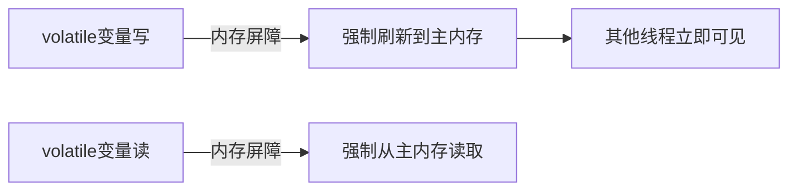

**一句话应用场景：** 适合**一个线程写、多个线程读**的共享变量，如状态标志位（`running`、`stop`）和单例模式的双重检查锁中的 instance 字段。

---

## 40. 为什么代码会重排序?

**指令重排序的目的：** 提高CPU执行效率，充分利用流水线。

**重排序的类型：**

```mermaid
graph TD
    A[重排序类型] --> B[编译器重排序]
    A --> C[处理器重排序]
    A --> D[内存系统重排序]
    B --> E[编译器优化，不改变单线程语义]
    C --> F[CPU乱序执行]
    D --> G[缓存缓冲区延迟写入]
```

**单线程下安全，多线程下有问题：**

```java
// 重排序前
int a = 1;  // 1
int b = 2;  // 2
int c = a + b; // 3

// 重排序后（编译器或CPU可能这样执行）
int b = 2;  // 2先
int a = 1;  // 1后
int c = a + b; // 3：单线程结果相同，但多线程可见性不同
```

**著名的重排序问题：**

```java
// 双重检查锁（错误写法）
class Singleton {
    private static Singleton instance;

    public static Singleton getInstance() {
        if (instance == null) {
            synchronized (Singleton.class) {
                if (instance == null) {
                    instance = new Singleton(); // 可能重排序为：1.分配内存 3.赋值给instance 2.初始化
                    // 另一个线程看到instance!=null但对象未初始化完成！
                }
            }
        }
        return instance;
    }
}

// 正确写法：加volatile禁止重排序
private static volatile Singleton instance;
```

**防止重排序的手段：**
- `volatile`：插入内存屏障
- `synchronized`：进出块时插入内存屏障
- `final`：写final字段之后，对象引用赋值之前禁止重排序

---

## 41. 在java中wait和sleep方法的不同?

| 对比项 | wait() | sleep() |
|--------|--------|---------|
| 所属类 | Object | Thread |
| 锁的释放 | 释放持有的对象锁 | 不释放锁 |
| 唤醒条件 | notify/notifyAll或超时 | 时间到期 |
| 使用场景 | 线程间协作通信 | 让线程暂停一段时间 |
| 必须在同步块? | 是（必须在synchronized中） | 否 |

```java
// wait：释放锁，等待notify
synchronized(lock) {
    lock.wait(1000); // 释放lock，等待1秒或被notify
    // 唤醒后重新获取lock继续执行
}

// sleep：不释放锁，只是暂停
synchronized(lock) {
    Thread.sleep(1000); // 持有lock，暂停1秒
    // 期间其他线程无法获取lock
}
```

---

## 42. 用Java实现阻塞队列

```java
public class BlockingQueue<T> {
    private final Queue<T> queue = new LinkedList<>();
    private final int capacity;
    private final Object lock = new Object();

    public BlockingQueue(int capacity) {
        this.capacity = capacity;
    }

    // 入队：队满则阻塞
    public void put(T item) throws InterruptedException {
        synchronized (lock) {
            while (queue.size() == capacity) {
                lock.wait(); // 队满，等待消费者消费
            }
            queue.offer(item);
            lock.notifyAll(); // 通知等待的消费者
        }
    }

    // 出队：队空则阻塞
    public T take() throws InterruptedException {
        synchronized (lock) {
            while (queue.isEmpty()) {
                lock.wait(); // 队空，等待生产者生产
            }
            T item = queue.poll();
            lock.notifyAll(); // 通知等待的生产者
            return item;
        }
    }
}
```

---

## 43. 一个线程运行时发生异常会怎样?

```java
Thread t = new Thread(() -> {
    throw new RuntimeException("线程异常");
});
t.start();
// 主线程不会受影响，线程正常退出
```

**处理线程未捕获异常：**

```java
// 设置未捕获异常处理器
t.setUncaughtExceptionHandler((thread, e) -> {
    System.out.println("线程 " + thread.getName() + " 异常: " + e.getMessage());
    // 可以在这里记录日志、告警等
});

// 设置全局默认处理器
Thread.setDefaultUncaughtExceptionHandler((thread, e) -> {
    log.error("线程异常", e);
});
```

**线程池中的异常处理：**

```java
ExecutorService pool = Executors.newFixedThreadPool(5);

// execute：异常会触发UncaughtExceptionHandler
pool.execute(() -> { throw new RuntimeException("异常"); });

// submit：异常被封装在Future中，调用get()时抛出
Future<?> future = pool.submit(() -> { throw new RuntimeException("异常"); });
try {
    future.get(); // 这里抛出 ExecutionException
} catch (ExecutionException e) {
    Throwable cause = e.getCause(); // 原始异常
}
```

---

## 44. 如何在两个线程间共享数据?

**常见方式：**

```java
// 1. 共享对象（最常见）
class SharedData {
    private volatile int value = 0;
    public synchronized void increment() { value++; }
    public int getValue() { return value; }
}

// 2. BlockingQueue（生产者-消费者）
BlockingQueue<Task> queue = new LinkedBlockingQueue<>();
// 线程1放入
queue.put(new Task());
// 线程2取出
Task task = queue.take();

// 3. Future/CompletableFuture（传递计算结果）
CompletableFuture<String> future = CompletableFuture.supplyAsync(() -> "结果");
String result = future.get();

// 4. Exchanger（两个线程交换数据）
Exchanger<String> exchanger = new Exchanger<>();
// 线程1
String data1 = exchanger.exchange("来自线程1的数据");
// 线程2
String data2 = exchanger.exchange("来自线程2的数据");
// 交换后：data1="来自线程2的数据"，data2="来自线程1的数据"
```

---

## 45. Java中notify和notifyAll有什么区别?

（与Q30相同，参见Q30的详细解答）

核心区别：
- `notify()`：随机唤醒等待队列中的一个线程
- `notifyAll()`：唤醒等待队列中的所有线程

---

## 46. 为什么wait,notify和notifyAll这些方法不在thread类里面?

**原因：** 这些方法是**锁层面**的操作，不是线程层面的操作。

```mermaid
graph LR
    A[wait/notify] --> B[操作的是对象的监视器锁]
    B --> C[任何对象都可以作为锁]
    D[Thread类] --> E[管理线程本身的生命周期]

    F[正确设计] --> G[在Object类中]
    G --> H[任意对象都能调用wait/notify]
```

**如果在Thread类中：**
```java
// 如果是Thread.wait()，则只能以线程对象作为锁
synchronized(thread) {
    thread.wait(); // 只能等待在thread对象上
}
// 但实际上我们需要在任意对象上等待
synchronized(任意对象) {
    任意对象.wait(); // 这才是正确的语义
}
```

每个 Java 对象都有一个内置的监视器锁，`wait()`/`notify()` 操作的是这个锁。Java的设计者将这些方法放在 Object 类中，允许任意对象作为线程协作的媒介（条件变量）。

---

## 47. 什么是ThreadLocal变量?

**ThreadLocal** 为每个线程提供独立的变量副本，彻底消除变量的竞争。

```java
// 每个线程都有自己独立的SimpleDateFormat实例
ThreadLocal<SimpleDateFormat> dateFormat = ThreadLocal.withInitial(
    () -> new SimpleDateFormat("yyyy-MM-dd")
);

// 线程1调用get()获取的是线程1自己的SimpleDateFormat
dateFormat.get().format(new Date());
```

```mermaid
graph TD
    TL[ThreadLocal变量]
    T1[线程1] -->|get/set| V1[线程1的副本]
    T2[线程2] -->|get/set| V2[线程2的副本]
    T3[线程3] -->|get/set| V3[线程3的副本]
    TL --> V1
    TL --> V2
    TL --> V3
```

**常见使用场景：**
- 用户会话信息（如当前登录用户）
- 数据库连接（同一线程中共享连接）
- 事务上下文
- SimpleDateFormat（非线程安全对象的线程隔离）

**内存泄漏问题：**

```java
// ThreadLocalMap使用弱引用key，但value是强引用
// 线程池场景下，线程不会销毁，value永远不会GC
// 使用完毕必须remove！
try {
    threadLocal.set(value);
    // 业务逻辑
} finally {
    threadLocal.remove(); // 防止内存泄漏！
}
```

---

## 48. Java中interrupted和isInterrupted方法的区别?

```java
// isInterrupted()：实例方法，检查中断状态，不清除标志
Thread t = new Thread();
t.isInterrupted(); // 检查t线程的中断标志，不清除

// interrupted()：静态方法，检查当前线程中断状态，并清除标志
Thread.interrupted(); // 返回当前线程中断状态，并将中断标志清为false
```

| 方法 | 类型 | 清除中断标志 | 检查对象 |
|------|------|------------|---------|
| isInterrupted() | 实例方法 | 否 | 调用的线程对象 |
| interrupted() | 静态方法 | 是（清为false） | 当前执行线程 |

```java
Thread t = new Thread(() -> {
    while (true) {
        if (Thread.interrupted()) { // 检查并清除
            System.out.println("被中断，退出");
            break;
        }
    }
});
t.start();
t.interrupt(); // 设置中断标志
```

---

## 49. 为什么wait和notify方法要在同步块中调用?

**原因：** 防止"丢失信号"（lost wakeup）问题。

```java
// 不在同步块中的危险场景（丢失唤醒）
// 线程A
if (条件不满足) {
    // 这里被切换到线程B
    // 线程B执行了notify()
    wait(); // 线程A开始等待，但notify已经错过了！
}

// 正确做法：在同步块中，wait和检查条件是原子的
synchronized(lock) {
    while (条件不满足) { // while循环防止虚假唤醒
        lock.wait();
    }
}
```

**强制规定：** Java语言规定，如果不在同步块中调用wait/notify，会抛出 `IllegalMonitorStateException`。

---

## 50. 为什么你应该在循环中检查等待条件?

```java
// 错误写法：if条件
synchronized(lock) {
    if (queue.isEmpty()) {
        lock.wait(); // 如果虚假唤醒，队列仍然是空的！
    }
    process(queue.take()); // 可能NPE
}

// 正确写法：while循环
synchronized(lock) {
    while (queue.isEmpty()) { // 被唤醒后重新检查条件
        lock.wait();
    }
    process(queue.take()); // 安全，队列一定不为空
}
```

**原因：**
1. **虚假唤醒（Spurious Wakeup）**：操作系统允许在没有notify的情况下随机唤醒线程
2. **多个线程竞争**：多个线程等待同一条件，只有一个能满足，其他被唤醒后条件已不满足
3. **notify 后条件可能再次变为不满足**：被唤醒但在获取锁之前，其他线程修改了共享状态

---

## 51. Java中的同步集合与并发集合有什么区别?

```mermaid
graph TD
    A[同步集合] -->|Collections.synchronizedXxx| B[整个集合加锁]
    B --> C[一次只允许一个操作]
    D[并发集合] --> E[ConcurrentHashMap分段锁/CAS]
    D --> F[CopyOnWriteArrayList写时复制]
    D --> G[ConcurrentLinkedQueue无锁队列]
    E --> H[允许并发读写，性能高]
    F --> H
    G --> H
```

| 对比 | 同步集合 | 并发集合 |
|------|---------|---------|
| 锁策略 | 整个集合（粗粒度锁） | 分段锁/无锁（细粒度） |
| 性能 | 低 | 高 |
| 迭代安全 | 需要手动同步迭代 | 弱一致性迭代器 |
| 常见类 | synchronizedMap/List/Set | ConcurrentHashMap, CopyOnWriteArrayList |

---

## 52. 什么是线程池?为什么要使用它?

**线程池核心参数：**

```java
ThreadPoolExecutor pool = new ThreadPoolExecutor(
    5,                          // corePoolSize：核心线程数
    10,                         // maximumPoolSize：最大线程数
    60L,                        // keepAliveTime：非核心线程空闲超时时间
    TimeUnit.SECONDS,           // 时间单位
    new LinkedBlockingQueue<>(100), // workQueue：任务队列
    Executors.defaultThreadFactory(), // threadFactory：线程工厂
    new AbortPolicy()           // handler：拒绝策略
);
```

**线程池工作流程：**

```mermaid
flowchart TD
    A[提交任务] --> B{当前线程数 < corePoolSize?}
    B -->|是| C[创建核心线程执行任务]
    B -->|否| D{任务队列未满?}
    D -->|是| E[任务入队等待]
    D -->|否| F{当前线程数 < maximumPoolSize?}
    F -->|是| G[创建非核心线程执行任务]
    F -->|否| H[执行拒绝策略]
```

**为什么使用线程池：**
- 减少线程创建/销毁的开销
- 控制并发数，防止资源耗尽
- 提供任务排队、拒绝策略等管理能力
- 提高系统响应速度（复用已创建的线程）

---

## 53. 怎么检测一个线程是否拥有锁?

```java
// 方式1：Thread.holdsLock()（检查对象锁）
boolean holds = Thread.holdsLock(lockObject);

// 方式2：ReentrantLock.isHeldByCurrentThread()
ReentrantLock lock = new ReentrantLock();
lock.isHeldByCurrentThread();

// 方式3：ReentrantLock.isLocked()（检查锁是否被任意线程持有）
lock.isLocked();

// 使用示例
synchronized(lock) {
    assert Thread.holdsLock(lock) : "必须持有lock才能进入这段代码";
}
```

---

## 54. 你如何在Java中获取线程堆栈?

```bash
# 方式1：jstack工具（最常用）
jstack <pid>
jstack -l <pid>   # 包含锁信息

# 方式2：jcmd
jcmd <pid> Thread.print

# 方式3：kill -3（Linux，输出到控制台）
kill -3 <pid>
```

```java
// 方式4：Java代码获取
// 获取当前线程堆栈
Thread.currentThread().getStackTrace();

// 获取所有线程堆栈
Map<Thread, StackTraceElement[]> allStacks = Thread.getAllStackTraces();
for (Map.Entry<Thread, StackTraceElement[]> entry : allStacks.entrySet()) {
    Thread t = entry.getKey();
    System.out.println("线程: " + t.getName());
    for (StackTraceElement element : entry.getValue()) {
        System.out.println("  " + element);
    }
}
```

---

## 55. 线程类中的yield方法有什么作用?

```java
Thread.yield(); // 让出CPU时间片，使当前线程从RUNNING变为RUNNABLE
```

**作用：** 提示调度器当前线程愿意让出CPU，但调度器可以忽略这个提示。

```mermaid
stateDiagram-v2
    [*] --> RUNNABLE: start()
    RUNNABLE --> RUNNING: 获得CPU
    RUNNING --> RUNNABLE: yield()（仍然可以立即被重新调度）
    RUNNING --> BLOCKED: sleep/wait/IO
    BLOCKED --> RUNNABLE: 超时/notify/IO完成
    RUNNING --> [*]: 执行完成
```

**注意：**
- `yield()` 只是"礼让"，不保证其他线程能获得CPU
- 通常用于测试、模拟并发竞争
- 生产代码中不推荐使用，行为依赖JVM实现

---

## 56. Java中ConcurrentHashMap的并发度是什么?

**Java 7：分段锁（Segment）**

```
ConcurrentHashMap (Java 7)
└── Segment[0]  (ReentrantLock) → 桶1, 桶2, ...
└── Segment[1]  (ReentrantLock) → 桶n, 桶n+1, ...
└── ...
└── Segment[15] (ReentrantLock) → 桶m, 桶m+1, ...
```
并发度默认为 16（Segment 数量），最多 16 个线程可以同时写入。

**Java 8：CAS + synchronized（细化到桶级别）**

```java
// Java 8中，锁直接加在每个桶（链表/红黑树头结点）上
// 并发度理论上等于桶的数量（默认16，可扩容）
// 实际并发能力更强
```

并发度在 Java 8 中已经失去意义，底层实现改为对每个桶单独同步，理论并发度等于桶数量。

---

## 57. Java中Semaphore是什么?

**Semaphore（信号量）** 控制同时访问某个资源的线程数量。

```java
// 允许最多5个线程同时访问
Semaphore semaphore = new Semaphore(5);

// 线程获取许可（许可数-1，如果为0则阻塞）
semaphore.acquire();
try {
    // 访问受限资源
} finally {
    semaphore.release(); // 释放许可（许可数+1）
}
```

```mermaid
graph LR
    A[线程1 acquire] --> S[Semaphore 许可=3]
    B[线程2 acquire] --> S
    C[线程3 acquire] --> S
    D[线程4 acquire] -->|阻塞，许可=0| W[等待]
    S -->|许可数>0| E[通过]
    W -->|有线程release| F[获得许可]
```

**典型使用场景：**
- 数据库连接池（限制最大连接数）
- API限流（控制并发请求数）
- 停车场模型（固定车位数）

---

## 58. Java线程池中submit()和execute()方法有什么区别?

```java
ExecutorService pool = Executors.newFixedThreadPool(5);

// execute()：执行Runnable，无返回值，异常直接抛出
pool.execute(() -> {
    System.out.println("执行任务");
    throw new RuntimeException("异常"); // 触发UncaughtExceptionHandler
});

// submit()：执行Runnable/Callable，返回Future
// 异常被封装在Future中
Future<?> future = pool.submit(() -> {
    throw new RuntimeException("异常"); // 异常被捕获
});

Future<String> result = pool.submit(() -> "结果"); // Callable
String value = result.get(); // "结果"

try {
    future.get(); // 这里才会抛出ExecutionException
} catch (ExecutionException e) {
    e.getCause(); // 原始RuntimeException
}
```

| 方法 | 参数类型 | 返回值 | 异常处理 |
|------|---------|--------|---------|
| execute() | Runnable | void | 直接抛出（UncaughtExceptionHandler） |
| submit() | Runnable/Callable | Future | 封装在Future.get()中 |

---

## 59. 什么是阻塞式方法?

**阻塞式方法** 是指在返回之前会阻塞当前线程的方法，线程在等待条件满足期间不消耗CPU（进入WAITING或TIMED_WAITING状态）。

**常见的阻塞式方法：**

```java
// I/O阻塞
InputStream.read();
OutputStream.write();
Socket.accept();

// 线程等待
Thread.sleep(1000);   // 定时阻塞
Thread.join();        // 等待线程结束
Object.wait();        // 等待通知

// 锁阻塞
synchronized(lock) {} // 等待锁
lock.lock();          // 等待锁

// 队列阻塞
queue.take();         // 等待元素
queue.put(item);      // 等待空间
```

与之相对的是**非阻塞方法**，如 `queue.poll()`（队空返回null而非阻塞）。

---

## 60. Java中的ReadWriteLock是什么?

**ReadWriteLock（读写锁）** 允许多个读线程同时访问，但写线程独占。

```java
ReadWriteLock rwLock = new ReentrantReadWriteLock();
Lock readLock = rwLock.readLock();
Lock writeLock = rwLock.writeLock();

// 读操作（多线程并发读，互不阻塞）
readLock.lock();
try {
    return data; // 读取共享数据
} finally {
    readLock.unlock();
}

// 写操作（独占，阻塞所有读写）
writeLock.lock();
try {
    data = newValue; // 修改共享数据
} finally {
    writeLock.unlock();
}
```

```mermaid
graph LR
    A[读线程1] -->|并发| D[读锁 可同时多持有]
    B[读线程2] -->|并发| D
    C[写线程] -->|独占| E[写锁 排他]
    D -->|写操作时阻塞| E
    E -->|写完后释放| D
```

**锁状态规则：**
- 无锁：读写都可
- 持有读锁：可以加读锁，不能加写锁
- 持有写锁：不能加任何锁（除非是同一线程的锁降级）

---

## 61. volatile变量和atomic变量有什么不同?

```java
volatile int count = 0;
count++; // 非原子！读-改-写三步操作，多线程不安全

AtomicInteger atomicCount = new AtomicInteger(0);
atomicCount.incrementAndGet(); // 原子操作，多线程安全
```

| 对比 | volatile | Atomic |
|------|---------|--------|
| 可见性 | 保证 | 保证 |
| 原子性 | 不保证 | 保证 |
| 适用场景 | 简单读写（一写多读） | 读-改-写复合操作 |
| 底层实现 | 内存屏障 | CAS指令 |

**volatile适用：**
```java
volatile boolean stop = false; // 简单标志位，只有写操作
```

**Atomic适用：**
```java
AtomicInteger counter = new AtomicInteger(0);
counter.incrementAndGet(); // 计数器，需要原子递增
counter.compareAndSet(expected, update); // CAS操作
```

---

## 62. 可以直接调用Thread类的run()方法么?

可以调用，但这样不会创建新线程，只是在当前线程中同步执行 `run()` 方法体，等同于普通的方法调用。（参见Q20的详细解答）

---

## 63. 如何让正在运行的线程暂停一段时间?

```java
// 方式1：Thread.sleep（最常用）
Thread.sleep(1000); // 暂停1秒，不释放锁

// 方式2：TimeUnit（可读性更好）
TimeUnit.SECONDS.sleep(1);
TimeUnit.MILLISECONDS.sleep(500);

// 方式3：LockSupport.parkNanos（更精确，纳秒级）
LockSupport.parkNanos(TimeUnit.SECONDS.toNanos(1));

// 方式4：Object.wait（会释放锁，适合线程间协作）
synchronized(lock) {
    lock.wait(1000); // 等待1秒或被notify
}
```

---

## 64. 你对线程优先级的理解是什么?

```java
Thread t = new Thread(() -> {});
t.setPriority(Thread.MAX_PRIORITY); // 10（最高）
t.setPriority(Thread.MIN_PRIORITY); // 1（最低）
t.setPriority(Thread.NORM_PRIORITY); // 5（默认）
```

**注意事项：**
- 优先级是给操作系统的"建议"，不同OS处理不同
- Windows 上优先级差异明显，Linux 上可能差异很小
- **不应该依赖优先级来实现程序逻辑**（不可靠）
- 高优先级线程不保证一定先执行，只是获得CPU的概率更高

---

## 65. 什么是线程调度器(Thread Scheduler)和时间分片(Time Slicing)?

**线程调度器：** 操作系统内核中负责分配CPU给线程的模块。

**时间分片（Time Slicing）：** 每个线程获得一小段CPU时间（时间片，通常10-100ms），时间片用完后切换到下一个线程。

```mermaid
gantt
    title 时间分片示意
    dateFormat X
    axisFormat %L ms

    section 线程A
    运行 :0, 20
    运行 :60, 80
    运行 :120, 140

    section 线程B
    运行 :20, 40
    运行 :80, 100
    运行 :140, 160

    section 线程C
    运行 :40, 60
    运行 :100, 120
    运行 :160, 180
```

---

## 66. 你如何确保main()方法所在的线程是Java程序最后结束的线程?

```java
// 方法1：使用Thread.join()等待所有子线程完成
Thread t1 = new Thread(() -> { ... });
Thread t2 = new Thread(() -> { ... });
t1.start();
t2.start();
t1.join(); // 等待t1完成
t2.join(); // 等待t2完成
// main线程最后结束

// 方法2：使用CountDownLatch
CountDownLatch latch = new CountDownLatch(2);
new Thread(() -> { ...; latch.countDown(); }).start();
new Thread(() -> { ...; latch.countDown(); }).start();
latch.await(); // main线程等待
// main线程最后结束

// 方法3：使用ExecutorService
ExecutorService pool = Executors.newFixedThreadPool(2);
pool.submit(task1);
pool.submit(task2);
pool.shutdown();
pool.awaitTermination(Long.MAX_VALUE, TimeUnit.NANOSECONDS);
```

---

## 67. 线程之间是如何通信的?

**线程间通信方式：**

| 方式 | 描述 | 示例 |
|------|------|------|
| 共享内存 | 通过共享变量通信 | volatile变量、synchronized共享对象 |
| wait/notify | 等待/通知机制 | 生产者消费者 |
| BlockingQueue | 阻塞队列 | 生产者消费者，线程池 |
| Future/CompletableFuture | 异步结果传递 | 异步计算 |
| Exchanger | 两线程交换数据 | 缓冲区交换 |
| Pipe管道 | 单向数据流 | PipedInputStream/OutputStream |

---

## 68. 为什么线程通信的方法wait(),notify()和notifyAll()被定义在Object类里?

（与Q46相同，参见Q46的详细解答）

原因：`wait()`/`notify()` 操作的是对象的监视器锁，每个Java对象都有监视器锁，所以这些方法属于Object类而非Thread类。

---

## 69. 为什么wait(),notify()和notifyAll()必须在同步方法或者同步块中被调用?

（与Q49相同，参见Q49的详细解答）

原因：防止"丢失信号"问题——条件检查和wait()调用之间存在时间窗口，必须保证原子性。

---

## 70. 为什么Thread类的sleep()和yield()方法是静态的?

**原因：**

`sleep()` 和 `yield()` 的语义是"**当前正在运行的线程**"暂停/让步，没有意义对另一个线程调用这两个方法。

```java
// 如果sleep()是实例方法，你可能会写出这样错误的代码：
Thread otherThread = new Thread(() -> {});
otherThread.sleep(1000); // 这会让main线程sleep，非常容易误解！

// 设计成静态方法，明确表示影响当前线程
Thread.sleep(1000); // 明确：让当前正在执行的线程sleep
```

与之对比，`interrupt()` 是实例方法，因为你可以中断**其他**线程，语义上是有意义的。

---

## 71. 如何确保线程安全?

```mermaid
graph TD
    A[确保线程安全的方法] --> B[无状态/不可变]
    A --> C[同步机制]
    A --> D[并发容器]
    A --> E[原子操作类]
    A --> F[线程局部存储ThreadLocal]

    B --> B1[无实例变量的stateless类]
    B --> B2[不可变对象如String]

    C --> C1[synchronized]
    C --> C2[ReentrantLock]
    C --> C3[volatile]

    D --> D1[ConcurrentHashMap]
    D --> D2[CopyOnWriteArrayList]
    D --> D3[BlockingQueue]

    E --> E1[AtomicInteger]
    E --> E2[AtomicReference]
```

---

## 72. 同步方法和同步块，哪个是更好的选择?

**同步块更好，原因：**

```java
// 同步方法：整个方法都同步，锁定范围可能过大
public synchronized void doWork() {
    long start = System.currentTimeMillis(); // 不需要同步的代码
    // ... 业务逻辑 ...
    synchronized(lock) {
        // 真正需要同步的代码
        this.count++;
    }
    log.info("耗时: " + (System.currentTimeMillis() - start)); // 不需要同步
}

// 同步块：精确控制同步范围，减少锁的持有时间
public void doWork() {
    long start = System.currentTimeMillis();
    // 不需要同步的代码可以并发执行

    synchronized(lock) {
        this.count++; // 只锁住真正需要的部分
    }

    log.info("耗时: " + (System.currentTimeMillis() - start));
}
```

**同步块优势：**
- 减少锁的持有时间，提高并发性能
- 可以选择更细粒度的锁对象
- 代码意图更清晰（哪些代码需要同步一目了然）

---

## 73. 如何创建守护线程?

```java
Thread daemon = new Thread(() -> {
    while (true) {
        System.out.println("守护线程运行中");
        Thread.sleep(1000);
    }
});

// 必须在start()之前设置
daemon.setDaemon(true);
daemon.start();

// 验证
System.out.println(daemon.isDaemon()); // true
```

**注意：** 守护线程创建的子线程也是守护线程。

---

## 74. 什么是Java Timer类?如何创建一个有特定时间间隔的任务?

```java
// 方式1：java.util.Timer（较老，不推荐）
Timer timer = new Timer();

// 延迟1秒后执行，之后每2秒执行一次
timer.scheduleAtFixedRate(new TimerTask() {
    @Override
    public void run() {
        System.out.println("定时任务执行: " + new Date());
    }
}, 1000, 2000);

// 取消
timer.cancel();

// 方式2：ScheduledExecutorService（推荐，更强大）
ScheduledExecutorService scheduler = Executors.newScheduledThreadPool(5);

// 延迟1秒后执行，之后每2秒执行一次
scheduler.scheduleAtFixedRate(
    () -> System.out.println("任务执行"),
    1, 2, TimeUnit.SECONDS
);

// 延迟1秒后执行，上次执行完成后再等2秒执行下次
scheduler.scheduleWithFixedDelay(
    () -> System.out.println("任务执行"),
    1, 2, TimeUnit.SECONDS
);
```

**Timer vs ScheduledExecutorService：**

| 对比 | Timer | ScheduledExecutorService |
|------|-------|--------------------------|
| 线程数 | 单线程 | 可配置 |
| 异常处理 | 一个任务异常会终止Timer | 互不影响 |
| 时间精度 | 受系统时钟影响 | 相对精确 |
| 推荐度 | 不推荐 | 推荐 |

---

# Java并发编程(二)

## 1. 并发编程三要素?

```mermaid
graph TD
    A[并发编程三要素] --> B[原子性]
    A --> C[可见性]
    A --> D[有序性]

    B --> B1[操作不可被打断<br>要么全做，要么不做]
    C --> C1[一个线程修改的值<br>其他线程立即可见]
    D --> D1[程序按代码顺序执行<br>不会重排序]

    B2[保证手段: synchronized, AtomicXxx] --> B
    C2[保证手段: volatile, synchronized] --> C
    D2[保证手段: volatile, happens-before规则] --> D
```

| 要素 | 含义 | 保证手段 |
|------|------|---------|
| 原子性 | 操作不可中断，要么全做要么不做 | synchronized, Lock, AtomicXxx |
| 可见性 | 线程对共享变量的修改对其他线程立即可见 | volatile, synchronized |
| 有序性 | 程序执行顺序按代码顺序，禁止重排序 | volatile, happens-before规则 |

---

## 2. 实现可见性的方法有哪些?

```java
// 1. volatile：最简单，适合简单读写
volatile boolean flag = false;

// 2. synchronized：进入同步块时从主存读，退出时写回主存
synchronized(this) {
    // 所有读写都保证可见性
}

// 3. final：final字段在构造函数中写入后，对所有线程可见（前提：this不逸出）
final int value = 42;

// 4. happens-before规则：以下操作后可见
// - 线程启动（start()之前的写，对子线程可见）
// - 线程join（join之前的写，对join返回后的代码可见）
// - Lock解锁（unlock之前的写，对下次lock之后可见）
```

---

## 3. 多线程的价值?

```mermaid
graph LR
    A[多线程价值] --> B[提高程序性能]
    A --> C[提高系统吞吐量]
    A --> D[改善用户体验]
    A --> E[充分利用多核CPU]

    B --> B1[并发处理I/O和计算]
    C --> C1[同时处理更多请求]
    D --> D1[UI线程不被阻塞]
    E --> E1[多核并行计算]
```

**主要价值：**
- **提高CPU利用率**：当一个线程等待I/O时，CPU可以运行其他线程
- **提高程序响应性**：UI线程不被耗时操作阻塞
- **利用多核硬件**：真正的并行计算
- **简化异步编程模型**：任务分离，结构清晰

---

## 4. 创建线程的有哪些方式?

（参见Part 1 Q28，四种方式：继承Thread、实现Runnable、实现Callable、使用线程池）

---

## 5. 创建线程的三种方式的对比?

| 方式 | 优点 | 缺点 | 适用场景 |
|------|------|------|---------|
| 继承Thread | 简单，直接重写run() | 不能继承其他类 | 简单场景 |
| 实现Runnable | 可以继承其他类，任务和线程解耦 | 无返回值，无法抛出checked异常 | 任务不需要返回值 |
| 实现Callable | 有返回值，可抛出异常 | 需要FutureTask包装，稍复杂 | 需要获取任务结果 |

---

## 6. 线程的状态流转图

```mermaid
stateDiagram-v2
    [*] --> NEW: 创建Thread对象
    NEW --> RUNNABLE: 调用start()
    RUNNABLE --> BLOCKED: 等待synchronized锁
    BLOCKED --> RUNNABLE: 获得锁
    RUNNABLE --> WAITING: wait()/join()/park()
    WAITING --> RUNNABLE: notify()/notifyAll()/unpark()
    RUNNABLE --> TIMED_WAITING: sleep(n)/wait(n)/join(n)/parkNanos(n)
    TIMED_WAITING --> RUNNABLE: 超时/notify/unpark
    RUNNABLE --> TERMINATED: run()方法结束
    TERMINATED --> [*]
```

---

## 7. Java线程具有五中基本状态

（Java 6种状态，常见说法是5或6种）

| 状态 | 说明 |
|------|------|
| NEW | 线程创建但未启动 |
| RUNNABLE | 运行中或就绪（Java不区分两者） |
| BLOCKED | 等待synchronized锁 |
| WAITING | 无限期等待（wait/join/park） |
| TIMED_WAITING | 有时限等待（sleep/wait(n)/join(n)） |
| TERMINATED | 线程执行完毕 |

---

## 8. 什么是线程池?有哪几种创建方式?

**线程池**：预先创建一组线程，用于执行提交的任务，避免频繁创建销毁线程。

**创建方式：**

```java
// 1. Executors工厂方法（不推荐在生产环境使用，存在OOM风险）
ExecutorService fixed = Executors.newFixedThreadPool(10);         // 固定线程数
ExecutorService cached = Executors.newCachedThreadPool();          // 弹性线程数
ExecutorService single = Executors.newSingleThreadExecutor();      // 单线程
ScheduledExecutorService scheduled = Executors.newScheduledThreadPool(5); // 定时

// 2. ThreadPoolExecutor直接构造（推荐，参数明确可控）
ThreadPoolExecutor pool = new ThreadPoolExecutor(
    5, 10, 60L, TimeUnit.SECONDS,
    new LinkedBlockingQueue<>(1000),
    new ThreadPoolExecutor.CallerRunsPolicy()
);
```

---

## 9. 四种线程池的创建

```java
// 1. newFixedThreadPool：固定线程数，队列无界（LinkedBlockingQueue，可能OOM）
ExecutorService fixed = Executors.newFixedThreadPool(10);

// 2. newCachedThreadPool：线程数无界（最多Integer.MAX_VALUE，可能OOM），60秒空闲回收
ExecutorService cached = Executors.newCachedThreadPool();

// 3. newSingleThreadExecutor：单线程，保证任务顺序执行
ExecutorService single = Executors.newSingleThreadExecutor();

// 4. newScheduledThreadPool：支持定时和周期任务
ScheduledExecutorService scheduled = Executors.newScheduledThreadPool(5);
scheduled.scheduleAtFixedRate(task, 0, 1, TimeUnit.SECONDS);
```

| 类型 | 核心线程数 | 最大线程数 | 队列类型 | 风险 |
|------|----------|----------|---------|------|
| Fixed | n | n | LinkedBlockingQueue（无界） | 队列OOM |
| Cached | 0 | MAX_VALUE | SynchronousQueue | 线程数OOM |
| Single | 1 | 1 | LinkedBlockingQueue（无界） | 队列OOM |
| Scheduled | n | MAX_VALUE | DelayedWorkQueue | 线程数OOM |

---

## 10. 线程池的优点?

1. **降低资源消耗**：重复利用已创建的线程，减少创建和销毁的开销
2. **提高响应速度**：任务到达时，无需等待线程创建，直接执行
3. **提高可管理性**：统一分配、调优和监控线程
4. **控制并发度**：防止大量线程消耗过多内存，导致OOM

---

## 11. 常用的并发工具类有哪些?

| 工具类 | 作用 | 使用场景 |
|--------|------|---------|
| CountDownLatch | 等待多个线程完成 | 主线程等待子任务全部完成 |
| CyclicBarrier | 多线程相互等待，达到屏障后同时继续 | 并行计算分阶段同步 |
| Semaphore | 控制同时访问的线程数 | 限流、连接池 |
| Exchanger | 两线程交换数据 | 双缓冲区切换 |
| Phaser | 多阶段的屏障（比CyclicBarrier更灵活） | 多阶段并行任务 |
| CompletableFuture | 异步编程，链式调用 | 异步任务组合 |

---

## 12. CyclicBarrier和CountDownLatch的区别

（参见Part 1 Q22，详细对比已在那里说明）

核心区别：
- CountDownLatch：一次性，主等子
- CyclicBarrier：可循环，互相等待

---

## 13. synchronized的作用?

```mermaid
graph TD
    A[synchronized] --> B[互斥性]
    A --> C[可见性]
    A --> D[有序性]

    B --> B1[同一时刻只有一个线程执行同步代码]
    C --> C1[进入同步块:从主内存读取<br>退出同步块:写回主内存]
    D --> D1[happens-before保证操作有序]
```

**三种使用方式：**

```java
// 1. 修饰实例方法：锁是this对象
public synchronized void method() {}

// 2. 修饰静态方法：锁是Class对象
public static synchronized void staticMethod() {}

// 3. 同步块：锁是括号中的对象
synchronized(lock) {}
```

---

## 14. volatile关键字的作用

（参见Part 1 Q39）

作用：
1. 保证**可见性**：写操作立即刷新到主内存，读操作从主内存读
2. 禁止**指令重排序**：通过内存屏障

不能保证**原子性**（如count++操作）。

---

## 15. 什么是CAS

**CAS（Compare And Swap/Set）**：比较并交换，是一种无锁的原子操作。

```mermaid
sequenceDiagram
    participant Thread as 线程
    participant Mem as 内存

    Thread->>Mem: 读取当前值 V=10
    Thread->>Thread: 计算新值 N=11
    Thread->>Mem: CAS(V=10, N=11)
    alt 内存值仍为10
        Mem->>Mem: 更新为11，成功
        Mem->>Thread: 返回成功
    else 内存值已被修改（不是10）
        Mem->>Thread: 返回失败
        Thread->>Thread: 重试（自旋）
    end
```

```java
// AtomicInteger底层使用CAS
AtomicInteger counter = new AtomicInteger(10);

// compareAndSet(期望值, 更新值)
boolean success = counter.compareAndSet(10, 11); // 如果当前是10，更新为11

// incrementAndGet底层
// do {
//     old = get();
//     new = old + 1;
// } while (!compareAndSet(old, new));
```

---

## 16. CAS的问题

**1. ABA问题：**

```mermaid
sequenceDiagram
    participant T1 as 线程1
    participant Mem as 内存
    participant T2 as 线程2

    T1->>Mem: 读取V=A
    T2->>Mem: 修改V: A→B
    T2->>Mem: 修改V: B→A
    T1->>Mem: CAS(期望A, 新值C): 成功！但中间被修改过
```

**解决方案：** 使用 `AtomicStampedReference`（带版本号）

```java
AtomicStampedReference<Integer> ref = new AtomicStampedReference<>(10, 0);
int stamp = ref.getStamp();
ref.compareAndSet(10, 11, stamp, stamp + 1); // 版本号+1
```

**2. 自旋CPU消耗：** 长时间自旋会占用大量CPU（适合短时间竞争）

**3. 只能保证一个变量的原子性：** 多个变量需要使用 `AtomicReference` 封装对象

---

## 17. 什么是Future?

**Future** 代表异步计算的结果，允许在将来某个时间获取结果。

```java
ExecutorService pool = Executors.newFixedThreadPool(5);

// 提交Callable任务，立即返回Future
Future<String> future = pool.submit(() -> {
    Thread.sleep(2000); // 模拟耗时操作
    return "计算结果";
});

// 主线程可以做其他事情
doOtherWork();

// 需要结果时再获取（阻塞等待）
String result = future.get(); // 阻塞到结果可用
String resultWithTimeout = future.get(3, TimeUnit.SECONDS); // 超时版本

// 检查是否完成
boolean done = future.isDone();
// 取消任务
future.cancel(true);
```

---

## 18. 什么是AQS

**AQS（AbstractQueuedSynchronizer）** 是Java并发包的基础框架，用于构建锁和同步器。

```mermaid
graph TD
    AQS[AbstractQueuedSynchronizer] --> RLock[ReentrantLock]
    AQS --> Sem[Semaphore]
    AQS --> CDL[CountDownLatch]
    AQS --> CB[CyclicBarrier内部用ReentrantLock]
    AQS --> RWL[ReentrantReadWriteLock]
    AQS --> FT[FutureTask]
```

**AQS核心：**

```
AQS维护：
1. state：同步状态（int），通过CAS修改
2. CLH等待队列：双向链表，存储等待线程节点

加锁流程：
1. 尝试CAS修改state（tryAcquire）
2. 失败则将当前线程封装为Node加入CLH队列
3. 阻塞等待（LockSupport.park）

释放锁流程：
1. 修改state（tryRelease）
2. 唤醒队列中的下一个节点（LockSupport.unpark）
```

---

## 19. AQS支持两种同步方式

**1. 独占模式（Exclusive）：** 同一时刻只有一个线程持有
- `ReentrantLock` 使用独占模式

**2. 共享模式（Shared）：** 同一时刻允许多个线程持有
- `Semaphore`、`CountDownLatch` 使用共享模式
- `ReentrantReadWriteLock` 的读锁使用共享模式

```java
// 自定义独占锁（实现AQS）
class MyMutex extends AbstractQueuedSynchronizer {
    // 尝试获取锁（独占）
    protected boolean tryAcquire(int arg) {
        return compareAndSetState(0, 1); // state 0→1
    }
    // 尝试释放锁
    protected boolean tryRelease(int arg) {
        setState(0);
        return true;
    }
    public void lock() { acquire(1); }
    public void unlock() { release(1); }
}
```

---

## 20. ReadWriteLock是什么

（参见Part 1 Q60）

读写锁允许多读单写，适用于读多写少的场景。

---

## 21. FutureTask是什么

**FutureTask** 实现了 `Runnable` 和 `Future` 接口，是将 `Callable` 任务包装成可执行且可获取结果的对象。

```java
// FutureTask = Callable + Future + Runnable
FutureTask<String> futureTask = new FutureTask<>(() -> {
    Thread.sleep(1000);
    return "计算结果";
});

// 可以用Thread执行
new Thread(futureTask).start();

// 也可以用ExecutorService执行
ExecutorService pool = Executors.newFixedThreadPool(5);
pool.submit(futureTask);

// 获取结果（阻塞等待）
String result = futureTask.get();
```

**状态机：**

```mermaid
stateDiagram-v2
    [*] --> NEW: 创建FutureTask
    NEW --> COMPLETING: 任务执行完成
    COMPLETING --> NORMAL: set(result)
    COMPLETING --> EXCEPTIONAL: setException(e)
    NEW --> CANCELLED: cancel(false)
    NEW --> INTERRUPTING: cancel(true)
    INTERRUPTING --> INTERRUPTED: 中断完成
```

---

## 22. synchronized和ReentrantLock的区别

| 对比项 | synchronized | ReentrantLock |
|--------|-------------|---------------|
| 实现层面 | JVM关键字 | API（java.util.concurrent） |
| 锁获取 | 自动 | 手动lock()/unlock() |
| 锁释放 | 自动（退出同步块） | 手动（必须finally中unlock） |
| 响应中断 | 不支持 | lockInterruptibly() |
| 超时获取 | 不支持 | tryLock(timeout) |
| 公平锁 | 非公平（无法设置） | 支持公平/非公平 |
| 条件变量 | 单一waitSet | 多个Condition |
| 锁状态查询 | 不支持 | isLocked(), getQueueLength() |
| 性能（高竞争） | JDK6后优化，差距缩小 | 略好 |

---

## 23. 什么是乐观锁和悲观锁

（参见Part 1 Q35，有详细说明）

---

## 24. 线程B怎么知道线程A修改了变量

**方法：**

1. **volatile修饰变量**：A写，B读时从主内存读，立即可见
2. **synchronized同步**：解锁后写回主内存，加锁前从主内存读
3. **happens-before关系**：
   - 线程A unlock → 线程B lock：A的写对B可见
   - 线程A start前的写对线程B（子线程）可见
   - 线程B join()返回后，A之前的写对B可见

---

## 25. synchronized、volatile、CAS比较

| 特性 | synchronized | volatile | CAS |
|------|-------------|---------|-----|
| 原子性 | ✅ | ❌（单读写原子，复合操作不行） | ✅（单变量） |
| 可见性 | ✅ | ✅ | ✅ |
| 有序性 | ✅ | ✅（禁止重排序） | ❌ |
| 阻塞 | 阻塞 | 非阻塞 | 自旋（非阻塞） |
| 适用场景 | 复杂同步逻辑 | 简单标志位 | 计数器、无锁数据结构 |

---

## 26. sleep方法和wait方法有什么区别?

（参见Part 1 Q41）

---

## 27. ThreadLocal是什么?有什么用?

（参见Part 1 Q47）

---

## 28. 为什么wait()方法和notify()/notifyAll()方法要在同步块中被调用

（参见Part 1 Q49）

---

## 29. 多线程同步有哪几种方法?

```mermaid
graph TD
    A[多线程同步方法] --> B[关键字]
    A --> C[Lock接口]
    A --> D[原子类]
    A --> E[并发容器]
    A --> F[信号量/屏障]

    B --> B1[synchronized]
    B --> B2[volatile]

    C --> C1[ReentrantLock]
    C --> C2[ReadWriteLock]

    D --> D1[AtomicInteger]
    D --> D2[AtomicReference]

    E --> E1[ConcurrentHashMap]
    E --> E2[BlockingQueue]

    F --> F1[Semaphore]
    F --> F2[CountDownLatch]
    F --> F3[CyclicBarrier]
```

---

## 30. 线程的调度策略

**两种主要策略：**

1. **分时调度**：平均分配CPU时间，每个线程轮流获得相同的时间片
2. **抢占式调度**（Java使用）：优先级高的线程获得更多CPU时间，可以抢占低优先级线程

---

## 31. ConcurrentHashMap的并发度是什么

（参见Part 1 Q56）

---

## 32. Linux环境下如何查找哪个线程使用CPU最长

```bash
# 步骤1：找到Java进程PID
jps -l
# 或者
ps -ef | grep java

# 步骤2：找到CPU占用最高的线程（TID）
top -p <pid>
# 按 H 切换显示线程
# 或者
ps -mp <pid> -o THREAD,tid,time | sort -rn | head

# 步骤3：将TID转换为16进制
printf "%x
" <tid>

# 步骤4：在jstack输出中查找对应线程
jstack <pid> | grep "0x<十六进制tid>" -A 30
```

---

## 33. Java死锁以及如何避免?

**死锁：** 两个或多个线程互相等待对方释放锁，导致永久阻塞。

```mermaid
graph LR
    T1[线程1] -->|持有| L1[锁A]
    T1 -->|等待| L2[锁B]
    T2[线程2] -->|持有| L2
    T2 -->|等待| L1
    L1 -->|被等待| T2
    L2 -->|被等待| T1
```

**死锁四个必要条件：**
1. **互斥**：资源一次只能被一个线程使用
2. **持有并等待**：持有锁的同时等待其他锁
3. **不可剥夺**：锁不能被强制释放
4. **循环等待**：线程间形成循环等待链

**避免死锁的方法：**

```java
// 方法1：固定加锁顺序（破坏循环等待）
// 总是先锁lockA，再锁lockB
synchronized(lockA) {
    synchronized(lockB) { ... }
}

// 方法2：tryLock超时（破坏持有并等待）
if (lockA.tryLock(1, TimeUnit.SECONDS)) {
    if (lockB.tryLock(1, TimeUnit.SECONDS)) {
        try { ... } finally { lockB.unlock(); }
    } else {
        lockA.unlock(); // 获取lockB失败，释放lockA
    }
}

// 方法3：减少锁的使用，使用并发容器
```

---

## 34. 死锁的原因

（参见上题Q33）

死锁的根本原因是：多个线程以**不同顺序**竞争**多个锁**，形成循环等待。

---

## 35. 怎么唤醒一个阻塞的线程

（参见Part 1 Q21）

---

## 36. 不可变对象对多线程有什么帮助

（参见Part 1 Q23）

---

## 37. 什么是多线程的上下文切换

（参见Part 1 Q24）

---

## 38. 如果你提交任务时,线程池队列已满,这时会发生什么

取决于**拒绝策略（RejectedExecutionHandler）**：

```java
// 1. AbortPolicy（默认）：抛出RejectedExecutionException
new ThreadPoolExecutor.AbortPolicy()

// 2. CallerRunsPolicy：由提交任务的线程直接执行该任务
new ThreadPoolExecutor.CallerRunsPolicy()

// 3. DiscardPolicy：静默丢弃任务，不抛异常
new ThreadPoolExecutor.DiscardPolicy()

// 4. DiscardOldestPolicy：丢弃队列中最旧的任务，然后重新提交新任务
new ThreadPoolExecutor.DiscardOldestPolicy()

// 5. 自定义拒绝策略
pool.setRejectedExecutionHandler((runnable, executor) -> {
    // 记录日志、持久化到数据库等
    log.warn("任务被拒绝: " + runnable);
});
```

---

## 39. Java中用到的线程调度算法是什么

（参见Part 1 Q25）：抢占式调度。

---

## 40. 什么是线程调度器(Thread Scheduler)和时间分片(Time Slicing)?

（参见Part 1 Q65）

---

## 41. 什么是自旋

**自旋（Spin）：** 线程在获取锁失败后，不进入阻塞状态，而是不断循环尝试获取锁（占用CPU）。

```java
// 自旋锁的概念示意
while (!lock.tryAcquire()) {
    // 什么都不做，继续循环尝试
    // Thread.yield() 可以稍微降低CPU占用
}
```

**自旋 vs 阻塞：**

| 方式 | CPU占用 | 适用场景 |
|------|---------|---------|
| 自旋 | 高（持续占用CPU） | 锁持有时间极短（微秒级） |
| 阻塞 | 低（释放CPU） | 锁持有时间较长 |

**自适应自旋（JDK6+）：** JVM根据之前自旋成功与否，动态调整自旋次数。

---

## 42. Java Concurrency API中的Lock接口(Lock interface)是什么?对比同步它有什么优势?

（参见Part 1 Q11和Q33）

Lock接口提供的额外功能：
- `tryLock()`：非阻塞获取锁
- `tryLock(timeout)`：超时获取锁
- `lockInterruptibly()`：可中断等待
- `newCondition()`：多个条件变量
- `isHeldByCurrentThread()`：查询锁状态

---

## 43. 单例模式的线程安全性

```java
// 1. 饿汉式（天生线程安全，类加载时创建）
public class Singleton {
    private static final Singleton INSTANCE = new Singleton();
    private Singleton() {}
    public static Singleton getInstance() { return INSTANCE; }
}

// 2. 懒汉式（线程不安全，需要同步）
public class Singleton {
    private static volatile Singleton instance; // volatile防止重排序

    public static Singleton getInstance() {
        if (instance == null) { // 第一次检查（无锁，高性能）
            synchronized (Singleton.class) {
                if (instance == null) { // 第二次检查（加锁后再检查）
                    instance = new Singleton();
                }
            }
        }
        return instance;
    }
}

// 3. 静态内部类（推荐，懒加载+线程安全）
public class Singleton {
    private static class Holder {
        static final Singleton INSTANCE = new Singleton();
    }
    public static Singleton getInstance() { return Holder.INSTANCE; }
}

// 4. 枚举（最简洁，防止反射和序列化破坏）
public enum Singleton {
    INSTANCE;
    public void doSomething() { ... }
}
```

---

## 44. Semaphore有什么作用

（参见Part 1 Q57）

作用：控制同时访问某资源的线程数量，适用于限流、连接池等场景。

---

## 45. Executors类是什么?

`Executors` 是线程池的工厂类，提供了快速创建常见线程池的静态方法：

```java
Executors.newFixedThreadPool(n)      // 固定线程池
Executors.newCachedThreadPool()       // 弹性线程池
Executors.newSingleThreadExecutor()   // 单线程池
Executors.newScheduledThreadPool(n)   // 定时线程池
Executors.newWorkStealingPool()        // 工作窃取线程池（ForkJoinPool）
```

**注意：** 阿里巴巴Java开发手册禁止使用Executors创建线程池，原因是隐藏了可能导致OOM的参数（无界队列或无限线程数）。推荐直接使用 `ThreadPoolExecutor`。

---

## 46. 线程类的构造方法、静态块是被哪个线程调用的

```java
class MyThread extends Thread {
    static { // 静态块被加载MyThread类的线程调用（通常是main线程）
        System.out.println("静态块，线程: " + Thread.currentThread().getName()); // main
    }

    public MyThread() { // 构造方法被创建线程对象的线程调用（通常是main线程）
        System.out.println("构造方法，线程: " + Thread.currentThread().getName()); // main
    }

    @Override
    public void run() { // run方法被新创建的线程调用
        System.out.println("run方法，线程: " + Thread.currentThread().getName()); // Thread-0
    }
}

// 调用链：main线程加载类（静态块）→ main线程new对象（构造方法）→ Thread-0执行run()
new MyThread().start();
```

---

## 47. 同步方法和同步块,哪个是更好的选择?

（参见Part 1 Q72）：同步块更好，因为锁范围更精确，持锁时间更短，并发性更高。

---

## 48. Java线程数过多会造成什么异常?

```
java.lang.OutOfMemoryError: unable to create new native thread
```

**原因：**
- 每个线程需要栈内存（默认512KB~1MB）
- 操作系统对进程最大线程数有限制（Linux默认约1024~4096）
- 内存不足时无法创建新线程

**后果：**
- `OutOfMemoryError`
- 频繁上下文切换，CPU利用率高但有效计算少（"假忙"）
- 系统响应变慢甚至崩溃

**解决方案：**
- 使用线程池，控制线程数量
- 合理设置线程栈大小（-Xss）
- 使用Java 21的虚拟线程（轻量级，数十万个也没问题）
