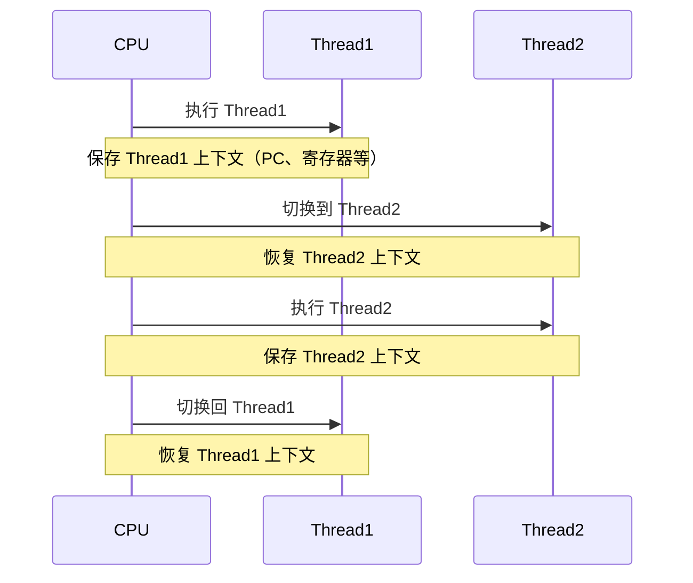
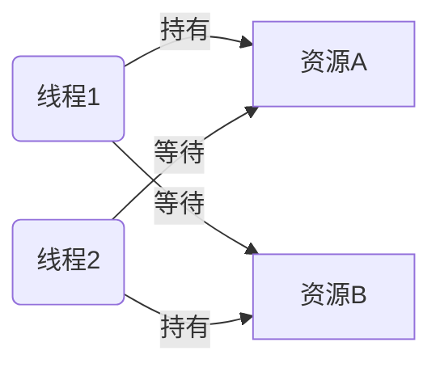
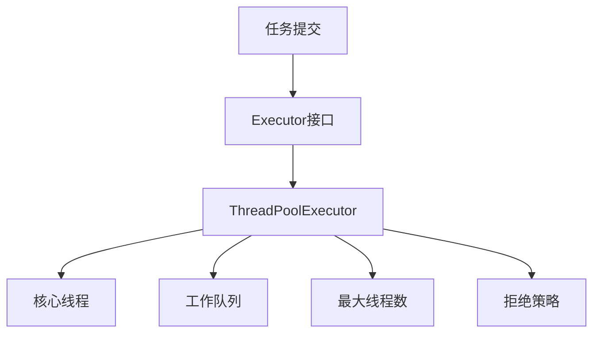
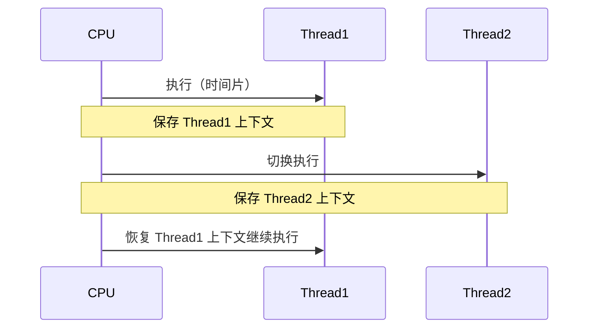
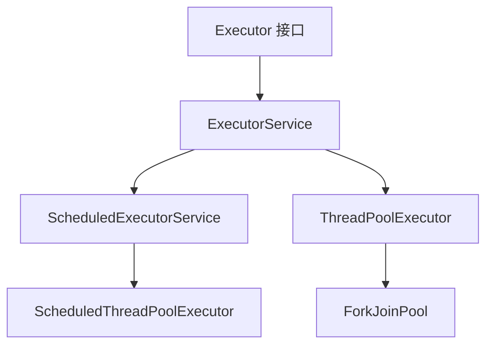

# Java并发编程面试题（全集）

> 本文档涵盖 Java 并发编程一（74题）和 Java 并发编程二（48题），共 122 道高频面试题，附详细解析、代码示例与 Mermaid 图解。

---

# 第一部分：Java 并发编程（一）

---

## 1. 在 Java 中守护线程和本地线程区别?

**守护线程（Daemon Thread）** 是为其他线程提供服务的后台线程，典型代表是垃圾回收线程（GC）。**用户线程（User Thread / 本地线程）** 是程序正常工作线程。

核心区别如下：

| 对比项 | 守护线程 | 用户线程 |
|--------|----------|----------|
| 生命周期 | 随最后一个用户线程结束而结束 | JVM 等待所有用户线程结束后才退出 |
| 设置方式 | `thread.setDaemon(true)` | 默认就是用户线程 |
| 典型用途 | GC、心跳检测、日志刷盘 | 业务逻辑 |
| JVM 退出 | 不阻止 JVM 退出 | 阻止 JVM 退出 |

```java
public class DaemonThreadDemo {
    public static void main(String[] args) throws InterruptedException {
        Thread daemon = new Thread(() -> {
            while (true) {
                System.out.println("守护线程运行中...");
                try { Thread.sleep(500); } catch (InterruptedException e) { break; }
            }
        });
        daemon.setDaemon(true); // 必须在 start() 之前设置
        daemon.start();

        Thread.sleep(2000);
        System.out.println("主线程结束，守护线程也会随之退出");
    }
}
```

注意：`setDaemon(true)` 必须在线程启动之前调用，否则抛出 `IllegalThreadStateException`。

---

## 2. 线程与进程的区别?

| 对比项 | 进程 | 线程 |
|--------|------|------|
| 定义 | 程序的一次执行实例，是资源分配的基本单位 | 进程内的执行单元，是 CPU 调度的基本单位 |
| 内存 | 独立内存空间 | 共享所在进程的内存空间 |
| 创建开销 | 大（需分配独立资源） | 小（共享进程资源） |
| 通信方式 | IPC（管道、消息队列、共享内存等） | 共享内存变量、wait/notify |
| 崩溃影响 | 不影响其他进程 | 可能导致整个进程崩溃 |

```java
// 线程共享进程堆内存示例
public class ProcessThreadDemo {
    static int sharedVar = 0; // 所有线程共享此变量

    public static void main(String[] args) throws InterruptedException {
        Thread t1 = new Thread(() -> sharedVar++);
        Thread t2 = new Thread(() -> sharedVar++);
        t1.start(); t2.start();
        t1.join(); t2.join();
        System.out.println("sharedVar = " + sharedVar); // 可能为 1 或 2（竞态条件）
    }
}
```

---

## 3. 什么是多线程中的上下文切换?

**上下文切换（Context Switch）** 是指 CPU 从一个线程切换到另一个线程时，需要保存当前线程的运行状态（程序计数器、寄存器、栈指针等），并恢复下一个线程的状态的过程。



**上下文切换的触发原因：**
- 时间片耗尽（时间分片调度）
- 线程主动让出 CPU（`Thread.yield()`）
- 线程阻塞（I/O、锁等待、`sleep()`、`wait()`）
- 优先级更高的线程就绪

**减少上下文切换的方法：**
- 使用无锁并发编程（如 CAS）
- 减少线程数（使用线程池）
- 使用协程（Java 21+ 虚拟线程）
- 避免频繁的锁竞争

---

## 4. 死锁与活锁的区别，死锁与饥饿的区别?

### 死锁（Deadlock）
多个线程相互等待对方持有的资源，导致所有线程永久阻塞。



死锁必须同时满足四个条件（**科夫曼条件**）：
1. **互斥**：资源同一时刻只能被一个线程使用
2. **持有并等待**：线程持有资源同时等待其他资源
3. **不可剥夺**：已获得资源不能被强制释放
4. **循环等待**：线程间形成环形等待链

```java
// 死锁示例
public class DeadlockDemo {
    static Object lockA = new Object();
    static Object lockB = new Object();

    public static void main(String[] args) {
        Thread t1 = new Thread(() -> {
            synchronized (lockA) {
                System.out.println("T1 持有 lockA，等待 lockB");
                try { Thread.sleep(100); } catch (InterruptedException e) {}
                synchronized (lockB) { System.out.println("T1 获得 lockB"); }
            }
        });

        Thread t2 = new Thread(() -> {
            synchronized (lockB) {
                System.out.println("T2 持有 lockB，等待 lockA");
                synchronized (lockA) { System.out.println("T2 获得 lockA"); }
            }
        });

        t1.start();
        t2.start();
    }
}
```

### 活锁（Livelock）
线程没有阻塞，但不断重试并相互礼让，导致没有任何线程能推进。

> 比喻：两人在走廊相遇，都往同一方向让路，反复如此，谁都无法通过。

### 饥饿（Starvation）
某些线程因为长期无法获得所需资源（如低优先级线程总被高优先级线程抢占）而无法执行。

| 特征 | 死锁 | 活锁 | 饥饿 |
|------|------|------|------|
| 线程状态 | 阻塞 | 运行（忙等） | 等待 |
| 能否自行解除 | 否 | 有时可以 | 有时可以 |
| CPU 消耗 | 低 | 高 | 低 |

---

## 5. Java 中用到的线程调度算法是什么?

Java 线程调度依赖底层操作系统，主要使用两种算法：

**1. 抢占式调度（Preemptive Scheduling）** — Java 主要使用此方式
- 操作系统决定哪个线程运行以及运行多长时间
- 线程优先级影响获得 CPU 时间片的概率，但不能保证绝对顺序
- 高优先级线程有更多机会获得 CPU

**2. 协作式调度（Cooperative Scheduling）**
- 线程主动让出 CPU（`yield()`）
- 不依赖操作系统强制切换

```java
public class ThreadPriorityDemo {
    public static void main(String[] args) {
        Thread low = new Thread(() -> System.out.println("低优先级线程"));
        Thread high = new Thread(() -> System.out.println("高优先级线程"));

        low.setPriority(Thread.MIN_PRIORITY);  // 1
        high.setPriority(Thread.MAX_PRIORITY); // 10

        low.start();
        high.start();
        // 注意：优先级高只是"概率更高"，不能保证 high 一定先执行
    }
}
```

优先级范围：1（MIN_PRIORITY）~ 10（MAX_PRIORITY），默认为 5（NORM_PRIORITY）。

---

## 6. 什么是线程组，为什么在 Java 中不推荐使用?

**线程组（ThreadGroup）** 是 Java 早期提供的用于批量管理线程的机制，可以对组内所有线程执行统一操作（如中断、设置优先级）。

```java
ThreadGroup group = new ThreadGroup("myGroup");
Thread t1 = new Thread(group, () -> System.out.println("t1"), "thread-1");
Thread t2 = new Thread(group, () -> System.out.println("t2"), "thread-2");
t1.start();
t2.start();

System.out.println("组中活跃线程数：" + group.activeCount());
group.interrupt(); // 中断组内所有线程
```

**不推荐使用的原因：**
- API 设计过时，许多方法已废弃（如 `stop()`、`suspend()`）
- 功能有限，无法精细控制
- `ExecutorService` 和线程池提供了更好的替代方案
- 异常处理机制不完善

---

## 7. 为什么使用 Executor 框架?

Executor 框架将**任务提交**与**线程管理**分离，避免了手动创建和销毁线程的开销。

**不使用线程池的问题：**
- 频繁创建/销毁线程开销大
- 无法控制并发线程数，可能耗尽系统资源
- 线程管理代码与业务代码耦合

**Executor 框架优势：**
```java
// 不推荐：手动创建线程
new Thread(() -> doTask()).start(); // 每次都创建新线程

// 推荐：使用线程池
ExecutorService executor = Executors.newFixedThreadPool(4);
executor.submit(() -> doTask()); // 复用线程池中的线程
executor.shutdown();
```



---

## 8. 在 Java 中 Executor 和 Executors 的区别?

| 对比项 | Executor | Executors |
|--------|----------|-----------|
| 类型 | 接口 | 工具类（工厂类） |
| 作用 | 定义执行任务的顶层规范（只有 `execute()` 方法） | 提供创建各种线程池的静态工厂方法 |
| 是否实例化 | 不能（接口） | 不能（工具类，构造私有） |

```java
// Executor 接口
public interface Executor {
    void execute(Runnable command);
}

// Executors 工厂方法示例
ExecutorService fixed   = Executors.newFixedThreadPool(4);       // 固定大小线程池
ExecutorService cached  = Executors.newCachedThreadPool();       // 可缓存线程池
ExecutorService single  = Executors.newSingleThreadExecutor();   // 单线程线程池
ScheduledExecutorService scheduled = Executors.newScheduledThreadPool(2); // 定时线程池
```

层级关系：
```
Executor
  └── ExecutorService
        ├── AbstractExecutorService
        │     └── ThreadPoolExecutor ← Executors 创建的实际对象
        └── ScheduledExecutorService
              └── ScheduledThreadPoolExecutor
```

---

## 9. 如何在 Windows 和 Linux 上查找哪个线程使用的 CPU 时间最长?

### Linux 环境

```bash
# 1. 找到 Java 进程 PID
jps -l
# 或
ps -ef | grep java

# 2. 查看该进程下各线程的 CPU 使用率（-H 展示线程，-p 指定 PID）
top -H -p <PID>

# 3. 找到 CPU 最高的线程 TID（十进制），转为十六进制
printf "%x\n" <TID>

# 4. 导出线程堆栈
jstack <PID> > dump.txt

# 5. 在 dump.txt 中搜索对应十六进制的 nid
grep "nid=0x<hex_tid>" dump.txt
```

### Windows 环境

```powershell
# 使用 Process Explorer（Sysinternals 工具）可视化查看线程 CPU
# 或使用 JVisualVM / JConsole
# 命令行方式：
jstack <PID>  # 查看所有线程堆栈
```

---

## 10. 什么是原子操作? 在 Java Concurrency API 中有哪些原子类?

**原子操作（Atomic Operation）** 是不可分割的操作，在执行过程中不会被其他线程打断，要么全部完成，要么完全不执行。

Java 中 `java.util.concurrent.atomic` 包提供了丰富的原子类：

| 类型 | 代表类 |
|------|--------|
| 基本类型 | `AtomicInteger`、`AtomicLong`、`AtomicBoolean` |
| 引用类型 | `AtomicReference`、`AtomicStampedReference`（解决ABA问题） |
| 数组类型 | `AtomicIntegerArray`、`AtomicLongArray` |
| 字段更新 | `AtomicIntegerFieldUpdater`、`AtomicLongFieldUpdater` |
| 高性能累加 | `LongAdder`、`LongAccumulator`（Java 8+，高并发下优于AtomicLong） |

```java
import java.util.concurrent.atomic.AtomicInteger;

public class AtomicDemo {
    private static AtomicInteger counter = new AtomicInteger(0);

    public static void main(String[] args) throws InterruptedException {
        Runnable task = () -> {
            for (int i = 0; i < 1000; i++) {
                counter.incrementAndGet(); // 原子自增，线程安全
            }
        };

        Thread t1 = new Thread(task);
        Thread t2 = new Thread(task);
        t1.start(); t2.start();
        t1.join(); t2.join();

        System.out.println("最终结果：" + counter.get()); // 一定是 2000
    }
}
```

原子类底层基于 **CAS（Compare-And-Swap）** 硬件指令实现，无需加锁，性能高于 `synchronized`。

---

## 3. 什么是多线程中的上下文切换?

**上下文切换（Context Switch）** 是指 CPU 从一个线程切换到另一个线程时，需要保存当前线程的运行状态（程序计数器、寄存器、栈信息等），并恢复下一个线程的状态的过程。



**触发上下文切换的场景：**
- 时间片耗尽（抢占式调度）
- 线程主动 `sleep()`、`wait()`、`yield()`
- I/O 阻塞
- 锁竞争导致阻塞

**减少上下文切换的方法：**
1. 减少线程数量（线程池）
2. 使用无锁并发（CAS）
3. 协程（虚拟线程，Java 21+）
4. 避免频繁加锁/解锁

---

## 4. 死锁与活锁的区别，死锁与饥饿的区别?

| 概念 | 描述 | 特征 |
|------|------|------|
| **死锁** | 两个或多个线程互相等待对方释放锁，永远阻塞 | 线程完全停止 |
| **活锁** | 线程不断响应对方的动作而改变状态，但无法推进 | 线程在运行但无进展 |
| **饥饿** | 某线程长期无法获得所需资源（如低优先级线程） | 线程一直等待 |

```java
// 死锁经典示例
public class DeadLockDemo {
    static Object lockA = new Object();
    static Object lockB = new Object();

    public static void main(String[] args) {
        Thread t1 = new Thread(() -> {
            synchronized (lockA) {
                System.out.println("T1 持有 A，等待 B");
                try { Thread.sleep(100); } catch (InterruptedException e) {}
                synchronized (lockB) { System.out.println("T1 获得 B"); }
            }
        });
        Thread t2 = new Thread(() -> {
            synchronized (lockB) {
                System.out.println("T2 持有 B，等待 A");
                synchronized (lockA) { System.out.println("T2 获得 A"); }
            }
        });
        t1.start(); t2.start();
    }
}
```

**死锁四个必要条件：**
1. 互斥条件
2. 占有并等待
3. 不可剥夺
4. 循环等待

**避免死锁：** 按固定顺序获取锁、使用 `tryLock()` 超时、使用死锁检测工具（jstack）。

---

## 5. Java 中用到的线程调度算法是什么?

Java 使用**抢占式调度（Preemptive Scheduling）**，基于优先级（1-10，默认5）。

- **抢占式调度**：高优先级线程可抢占低优先级线程的 CPU 时间片
- **时间片轮转**：同优先级线程轮流分配时间片

```java
Thread t = new Thread(() -> System.out.println("running"));
t.setPriority(Thread.MAX_PRIORITY); // 10
t.setPriority(Thread.MIN_PRIORITY); // 1
t.setPriority(Thread.NORM_PRIORITY); // 5（默认）
```

> ⚠️ 注意：Java 线程优先级最终映射到操作系统级别，不同 OS 行为不同，优先级仅作提示，不保证执行顺序。

---

## 6. 什么是线程组，为什么在 Java 中不推荐使用?

`ThreadGroup` 可以将多个线程归为一组，方便统一管理（如批量中断）。

```java
ThreadGroup group = new ThreadGroup("myGroup");
Thread t1 = new Thread(group, () -> {}, "t1");
Thread t2 = new Thread(group, () -> {}, "t2");
group.interrupt(); // 中断组内所有线程
```

**不推荐原因：**
1. API 设计缺陷，部分方法已被废弃
2. 功能有限，无法替代线程池
3. `ThreadGroup.uncaughtException()` 不够灵活
4. 现代推荐使用 `ExecutorService` + `ThreadFactory` 代替

---

## 7. 为什么使用 Executor 框架?

**直接创建线程的问题：**
- 线程创建/销毁开销大
- 无法控制线程数量，可能导致 OOM
- 缺乏统一管理和监控

**Executor 框架的优势：**
1. 线程复用，降低创建开销
2. 控制最大并发数
3. 提供任务队列缓冲
4. 支持定时、周期性任务
5. 提供 Future 获取异步结果

```java
ExecutorService pool = Executors.newFixedThreadPool(4);
Future<String> future = pool.submit(() -> {
    Thread.sleep(1000);
    return "任务完成";
});
System.out.println(future.get()); // 阻塞等待结果
pool.shutdown();
```

---

## 8. 在 Java 中 Executor 和 Executors 的区别?

| 对比 | Executor | Executors |
|------|----------|-----------|
| 类型 | 接口 | 工具类（全静态方法） |
| 作用 | 定义 `execute(Runnable)` 规范 | 提供工厂方法创建线程池 |
| 关系 | 是基础接口 | 是辅助工具类 |

```java
// Executor 接口
Executor executor = command -> new Thread(command).start();
executor.execute(() -> System.out.println("via Executor"));

// Executors 工具类
ExecutorService fixed    = Executors.newFixedThreadPool(4);
ExecutorService single   = Executors.newSingleThreadExecutor();
ExecutorService cached   = Executors.newCachedThreadPool();
ScheduledExecutorService scheduled = Executors.newScheduledThreadPool(2);
```

> ⚠️ 生产环境建议直接使用 `ThreadPoolExecutor` 构造，避免 `Executors` 工厂方法的潜在 OOM 风险。

---

## 9. 如何在 Windows 和 Linux 上查找哪个线程使用的 CPU 时间最长?

**Linux 方法：**
```bash
# 1. 找到进程 PID
ps -ef | grep java
# 2. 查看该进程内各线程 CPU 占用
top -Hp <PID>
# 3. 记录 CPU 最高的线程 TID，转换为十六进制
printf '%x\n' <TID>
# 4. 用 jstack 找到对应线程
jstack <PID> | grep -A 30 'nid=0x<hex_tid>'
```

**Windows 方法：**
使用 Process Explorer 工具查看线程 CPU 时间，或 `jstack <PID>` 导出线程栈结合线程 ID 分析。

---

## 10. 什么是原子操作？在 Java Concurrency API 中有哪些原子类？

**原子操作**是不可分割的操作，执行过程中不会被线程切换中断。`java.util.concurrent.atomic` 包提供了以下原子类：

| 分类 | 类名 |
|------|------|
| 基本类型 | `AtomicInteger`、`AtomicLong`、`AtomicBoolean` |
| 引用类型 | `AtomicReference`、`AtomicStampedReference`（解决ABA）|
| 数组类型 | `AtomicIntegerArray`、`AtomicLongArray` |
| 字段更新 | `AtomicIntegerFieldUpdater`、`AtomicLongFieldUpdater` |
| 累加器 | `LongAdder`、`LongAccumulator`（高并发累加首选）|

```java
AtomicInteger count = new AtomicInteger(0);
count.incrementAndGet();         // 原子自增
count.compareAndSet(1, 2);       // CAS: 期望值1则设为2
int val = count.getAndAdd(5);    // 原子加5，返回旧值
```

---

## 11. Lock 接口是什么？对比 synchronized 有什么优势？

`java.util.concurrent.locks.Lock` 是显式锁接口，主要实现类是 `ReentrantLock`。

| 对比维度 | synchronized | Lock |
|---------|-------------|------|
| 释放方式 | 自动释放 | 必须手动 `unlock()` |
| 中断响应 | 不可中断 | `lockInterruptibly()` 可中断 |
| 超时获取 | 不支持 | `tryLock(time, unit)` |
| 公平锁 | 不支持 | `new ReentrantLock(true)` |
| 条件变量 | 一个等待队列 | 多个 `Condition` |

```java
ReentrantLock lock = new ReentrantLock();
lock.lock();
try {
    // 临界区
} finally {
    lock.unlock(); // 必须在 finally 中释放
}
```

---

## 12. 什么是 Executors 框架？

`Executors` 框架（`java.util.concurrent`）是 Java 对线程池的完整抽象，包含：

- **Executor**：最基础接口，只有 `execute(Runnable)` 方法
- **ExecutorService**：扩展 Executor，支持 `submit()`、`shutdown()`、`invokeAll()` 等
- **ScheduledExecutorService**：支持定时和周期性任务
- **ThreadPoolExecutor**：核心实现，可精细配置线程池参数
- **ForkJoinPool**：分治并行框架，适合递归任务



---

## 13. 什么是阻塞队列？实现原理是什么？如何实现生产者-消费者模型？

**阻塞队列**（`BlockingQueue`）是支持两个附加操作的队列：
- 当队列满时，**生产者线程阻塞**，直到队列有空间
- 当队列空时，**消费者线程阻塞**，直到队列有元素

常见实现：

| 实现类 | 特点 |
|--------|------|
| `ArrayBlockingQueue` | 有界数组，公平/非公平锁 |
| `LinkedBlockingQueue` | 可选有界链表，吞吐量高 |
| `PriorityBlockingQueue` | 优先级无界队列 |
| `SynchronousQueue` | 无容量，直接传递 |
| `DelayQueue` | 延迟元素，到期才可取 |

```java
// 生产者-消费者示例
BlockingQueue<Integer> queue = new ArrayBlockingQueue<>(10);

// 生产者
Thread producer = new Thread(() -> {
    for (int i = 0; i < 20; i++) {
        try {
            queue.put(i);  // 队列满则阻塞
            System.out.println("生产: " + i);
        } catch (InterruptedException e) { Thread.currentThread().interrupt(); }
    }
});

// 消费者
Thread consumer = new Thread(() -> {
    while (true) {
        try {
            int val = queue.take();  // 队列空则阻塞
            System.out.println("消费: " + val);
        } catch (InterruptedException e) { break; }
    }
});
producer.start(); consumer.start();
```

---

## 14. 什么是 Callable 和 Future？

**Callable** 类似 Runnable，但可以返回结果并抛出受检异常：

```java
Callable<Integer> task = () -> {
    Thread.sleep(1000);
    return 42;
};
```

**Future** 代表异步计算的结果，提供检查完成、取消、获取结果的方法：

```java
ExecutorService pool = Executors.newFixedThreadPool(2);
Future<Integer> future = pool.submit(task);
System.out.println(future.isDone());      // 是否完成
System.out.println(future.get());         // 阻塞等待结果
future.cancel(true);                      // 取消任务
```

---

## 15. 什么是 FutureTask？

`FutureTask` 同时实现了 `Runnable` 和 `Future`，既可以提交给线程池，也可以直接用 `Thread` 运行：

```java
FutureTask<String> futureTask = new FutureTask<>(() -> {
    Thread.sleep(500);
    return "计算结果";
});

new Thread(futureTask).start();           // 方式一：直接 Thread 运行
// ExecutorService.submit(futureTask);    // 方式二：线程池提交

String result = futureTask.get();         // 阻塞获取结果
System.out.println(result);
```

---

## 16. 什么是并发容器？

JDK 提供的线程安全容器（`java.util.concurrent` 包）：

| 容器 | 对应普通容器 | 特点 |
|------|------------|------|
| `ConcurrentHashMap` | `HashMap` | 分段锁/CAS，高并发读写 |
| `CopyOnWriteArrayList` | `ArrayList` | 写时复制，读多写少 |
| `CopyOnWriteArraySet` | `HashSet` | 同上 |
| `ConcurrentLinkedQueue` | `LinkedList` | 无锁队列，高并发 |
| `ConcurrentSkipListMap` | `TreeMap` | 跳表，有序并发 |
| `ArrayBlockingQueue` | — | 有界阻塞队列 |
| `LinkedBlockingQueue` | — | 可选有界阻塞队列 |

---

## 17. 多线程同步和互斥有几种实现方法？

1. **synchronized 关键字**：修饰方法或代码块，最简单
2. **ReentrantLock**：显式锁，支持公平锁、可中断、超时
3. **volatile 关键字**：保证可见性，不保证原子性
4. **Atomic 原子类**：基于 CAS，无锁原子操作
5. **ThreadLocal**：线程本地变量，彻底避免共享
6. **阻塞队列**：通过队列传递数据，避免共享状态
7. **Semaphore**：信号量，控制并发数量
8. **CountDownLatch / CyclicBarrier**：线程协调同步

---

## 18. 什么是竞争条件？如何发现和解决？

**竞争条件**（Race Condition）：多个线程并发访问共享资源，最终结果依赖线程执行顺序时产生。

**发现方式：**
- 代码审查：找到读-改-写操作
- 使用线程检测工具：Java ThreadSanitizer、FindBugs、Helgrind
- 压测 + jstack 分析线程状态

**解决方式：**
```java
// 错误：非原子的读-改-写
int count = 0;
count++;  // 多线程下不安全

// 方案1：synchronized
synchronized(this) { count++; }

// 方案2：AtomicInteger
AtomicInteger count = new AtomicInteger(0);
count.incrementAndGet();

// 方案3：使用并发容器代替普通容器
Map<String, Integer> map = new ConcurrentHashMap<>();
```

