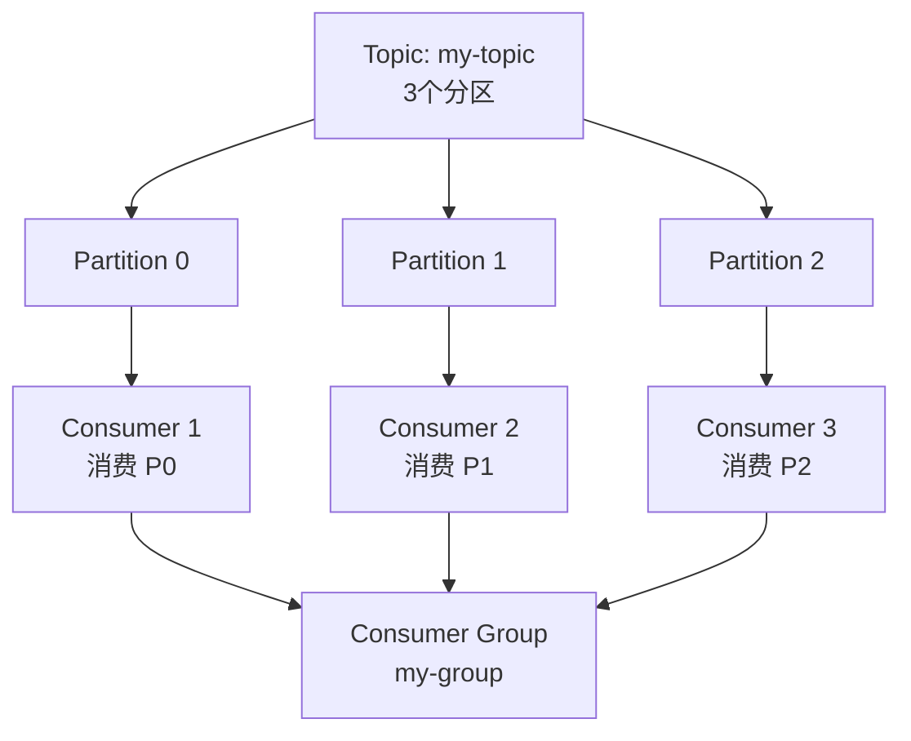
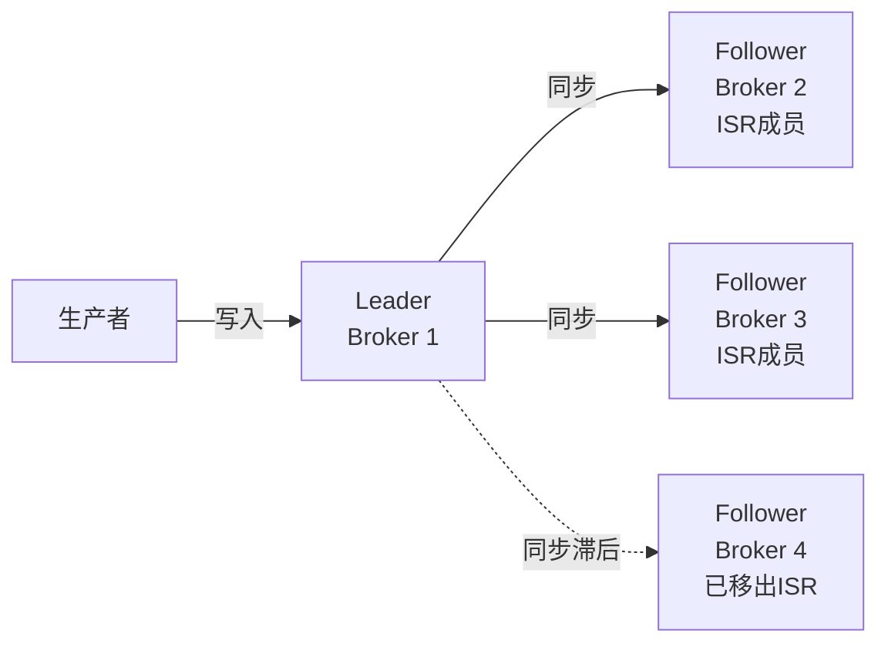
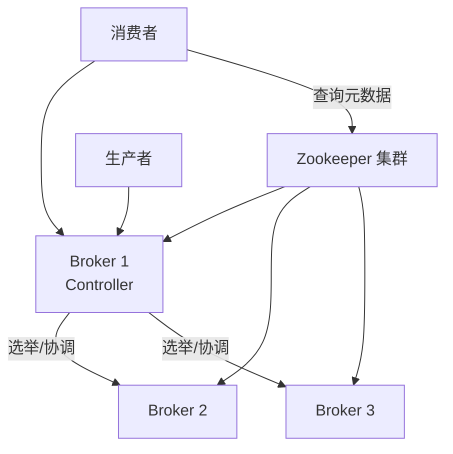
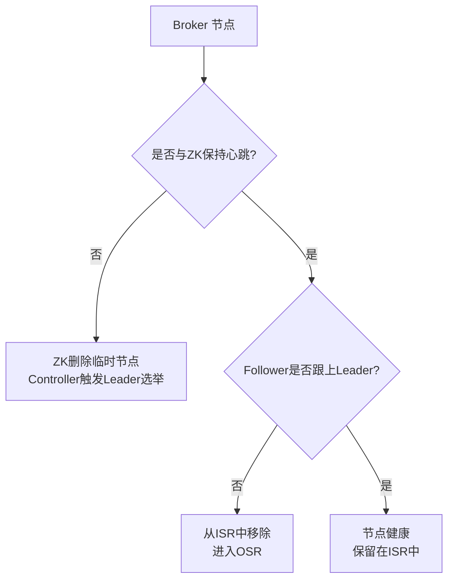
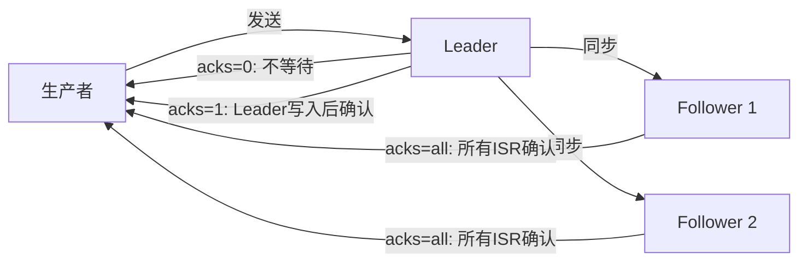
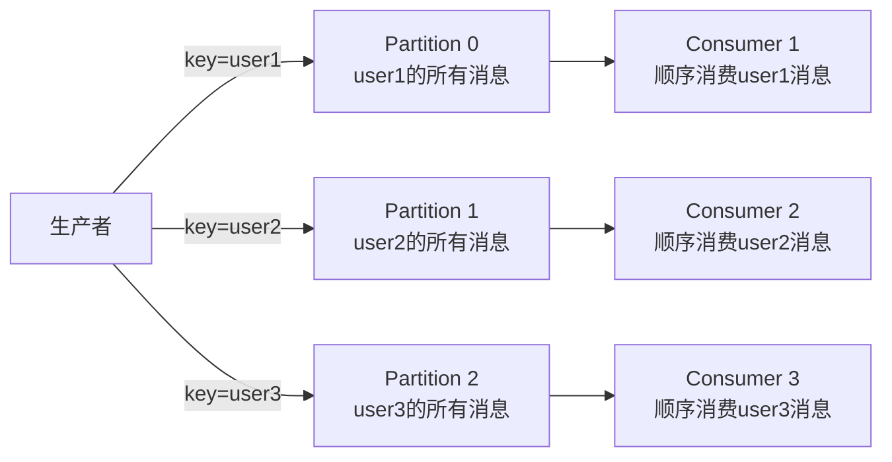
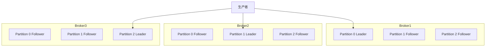
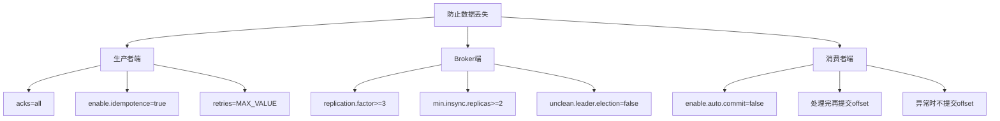

# Kafka 面试题详解

> 本文整理了 Kafka 常见面试题及详细解答，适合初学者学习和面试备考。

---

## 目录

1. [如何获取topic主题的列表](#1-如何获取topic主题的列表)
2. [生产者和消费者的命令行是什么?](#2-生产者和消费者的命令行是什么)
3. [consumer是推还是拉?](#3-consumer是推还是拉)
4. [讲讲kafka维护消费状态跟踪的方法](#4-讲讲kafka维护消费状态跟踪的方法)
5. [讲一下主从同步](#5-讲一下主从同步)
6. [为什么需要消息系统，mysql不能满足需求吗?](#6-为什么需要消息系统mysql不能满足需求吗)
7. [Zookeeper对于Kafka的作用是什么?](#7-zookeeper对于kafka的作用是什么)
8. [数据传输的事务定义有哪三种?](#8-数据传输的事务定义有哪三种)
9. [Kafka判断一个节点是否还活着有那两个条件?](#9-kafka判断一个节点是否还活着有那两个条件)
10. [Kafka与传统MQ消息系统之间有三个关键区别](#10-kafka与传统mq消息系统之间有三个关键区别)
11. [讲一讲kafka的ack的三种机制](#11-讲一讲kafka的ack的三种机制)
12. [消费者故障，出现活锁问题如何解决?](#12-消费者故障出现活锁问题如何解决)
13. [如何控制消费的位置](#13-如何控制消费的位置)
14. [kafka分布式的情况下，如何保证消息的顺序消费?](#14-kafka分布式的情况下如何保证消息的顺序消费)
15. [kafka的高可用机制是什么?](#15-kafka的高可用机制是什么)
16. [kafka如何减少数据丢失](#16-kafka如何减少数据丢失)
17. [kafka如何不消费重复数据?](#17-kafka如何不消费重复数据)

---

## 1. 如何获取topic主题的列表

### 基本命令

使用 Kafka 自带的命令行工具 `kafka-topics.sh` 可以查看所有 topic 列表：

```bash
# 列出所有 topic（Kafka 2.2 之前，需要指定 Zookeeper）
kafka-topics.sh --list --zookeeper localhost:2181

# 列出所有 topic（Kafka 2.2+，推荐使用 --bootstrap-server）
kafka-topics.sh --list --bootstrap-server localhost:9092
```

### 查看 topic 详细信息

```bash
# 查看某个 topic 的详细信息（分区数、副本数、Leader 等）
kafka-topics.sh --describe --bootstrap-server localhost:9092 --topic my-topic

# 输出示例：
# Topic: my-topic  PartitionCount: 3  ReplicationFactor: 2  Configs: ...
# Topic: my-topic  Partition: 0  Leader: 1  Replicas: 1,2  Isr: 1,2
# Topic: my-topic  Partition: 1  Leader: 2  Replicas: 2,3  Isr: 2,3
# Topic: my-topic  Partition: 2  Leader: 3  Replicas: 3,1  Isr: 3,1

# 查看所有 topic 的详细信息
kafka-topics.sh --describe --bootstrap-server localhost:9092
```

### 创建和删除 topic

```bash
# 创建 topic（3个分区，2个副本）
kafka-topics.sh --create \
  --bootstrap-server localhost:9092 \
  --topic my-topic \
  --partitions 3 \
  --replication-factor 2

# 删除 topic
kafka-topics.sh --delete \
  --bootstrap-server localhost:9092 \
  --topic my-topic
```

### 使用 Kafka Admin API（Java）

```java
import org.apache.kafka.clients.admin.AdminClient;
import org.apache.kafka.clients.admin.ListTopicsResult;
import java.util.Properties;
import java.util.Set;

Properties props = new Properties();
props.put("bootstrap.servers", "localhost:9092");

try (AdminClient adminClient = AdminClient.create(props)) {
    ListTopicsResult result = adminClient.listTopics();
    Set<String> topics = result.names().get();
    topics.forEach(System.out::println);
}
```

---

## 2. 生产者和消费者的命令行是什么?

### 生产者命令行

使用 `kafka-console-producer.sh` 向 topic 发送消息：

```bash
# 基本用法：启动控制台生产者，手动输入消息
kafka-console-producer.sh \
  --bootstrap-server localhost:9092 \
  --topic my-topic

# 启动后，每行输入一条消息，按 Enter 发送，Ctrl+C 退出
> Hello Kafka
> This is a test message
> ^C

# 指定消息的 key（使用 key.separator 分隔 key 和 value）
kafka-console-producer.sh \
  --bootstrap-server localhost:9092 \
  --topic my-topic \
  --property "parse.key=true" \
  --property "key.separator=:"
# 输入格式：key:value
> user1:{"name":"Alice","age":25}
> user2:{"name":"Bob","age":30}

# 从文件读取消息并发送
kafka-console-producer.sh \
  --bootstrap-server localhost:9092 \
  --topic my-topic < messages.txt

# 设置生产者配置（如 acks、压缩等）
kafka-console-producer.sh \
  --bootstrap-server localhost:9092 \
  --topic my-topic \
  --producer-property acks=all \
  --producer-property compression.type=gzip
```

### 消费者命令行

使用 `kafka-console-consumer.sh` 从 topic 消费消息：

```bash
# 基本用法：从最新位置开始消费
kafka-console-consumer.sh \
  --bootstrap-server localhost:9092 \
  --topic my-topic

# 从头开始消费（消费所有历史消息）
kafka-console-consumer.sh \
  --bootstrap-server localhost:9092 \
  --topic my-topic \
  --from-beginning

# 指定消费者组
kafka-console-consumer.sh \
  --bootstrap-server localhost:9092 \
  --topic my-topic \
  --group my-consumer-group \
  --from-beginning

# 显示消息的 key
kafka-console-consumer.sh \
  --bootstrap-server localhost:9092 \
  --topic my-topic \
  --from-beginning \
  --property print.key=true \
  --property key.separator=":"

# 只消费指定数量的消息后退出
kafka-console-consumer.sh \
  --bootstrap-server localhost:9092 \
  --topic my-topic \
  --from-beginning \
  --max-messages 10

# 指定从某个分区的某个 offset 开始消费
kafka-console-consumer.sh \
  --bootstrap-server localhost:9092 \
  --topic my-topic \
  --partition 0 \
  --offset 100
```

### 消费者组管理命令

```bash
# 列出所有消费者组
kafka-consumer-groups.sh \
  --bootstrap-server localhost:9092 \
  --list

# 查看消费者组的消费进度（lag）
kafka-consumer-groups.sh \
  --bootstrap-server localhost:9092 \
  --describe \
  --group my-consumer-group

# 输出示例：
# GROUP           TOPIC     PARTITION  CURRENT-OFFSET  LOG-END-OFFSET  LAG
# my-group        my-topic  0          100             105             5
# my-group        my-topic  1          200             200             0
# my-group        my-topic  2          150             155             5

# 重置消费者组的 offset（需要先停止消费者）
kafka-consumer-groups.sh \
  --bootstrap-server localhost:9092 \
  --group my-consumer-group \
  --topic my-topic \
  --reset-offsets \
  --to-earliest \
  --execute
```

---

## 3. consumer是推还是拉?

### 答案：Kafka 消费者采用**拉取（Pull）**模式

### 详细解释

#### 推模式（Push）

消息中间件主动将消息推送给消费者：

```
Broker → 主动推送 → Consumer

特点：
- 消息实时性高
- 消费者被动接收，无法控制消费速率
- 如果消费者处理速度慢，可能被压垮（消息堆积）
- Broker 需要维护每个消费者的状态
```

#### 拉模式（Pull）

消费者主动向 Broker 拉取消息：

```
Consumer → 主动拉取 → Broker

特点：
- 消费者可以控制消费速率
- 消费者可以批量拉取，提高吞吐量
- 消费者可以根据自身处理能力决定何时拉取
- 如果没有消息，消费者需要轮询（可能浪费资源）
```

### Kafka 为什么选择拉模式?

#### 原因一：消费者速率控制

```
场景：生产者每秒生产 10000 条消息，消费者每秒只能处理 1000 条

推模式问题：
  Broker 以 10000/s 的速率推送
  消费者处理不过来，内存溢出，消费者崩溃

拉模式优势：
  消费者每次只拉取自己能处理的数量（如 1000 条）
  处理完再拉取下一批，不会被压垮
```

#### 原因二：批量消费优化

```
拉模式允许消费者一次拉取多条消息（批量处理）：
  - 减少网络请求次数
  - 提高吞吐量
  - 可以批量写入数据库，减少 I/O 次数
```

#### 原因三：消费者状态简化

```
拉模式下，Broker 不需要维护每个消费者的推送状态
消费者自己维护 offset（消费位置）
Broker 只需要存储消息，不需要跟踪推送状态
```

### 拉模式的缺点及解决方案

**缺点：空轮询（Busy Waiting）**

当 topic 中没有新消息时，消费者会不断发送拉取请求，浪费网络和 CPU 资源。

**解决方案：长轮询（Long Polling）**

```java
// Kafka 消费者使用 poll 的 timeout 参数实现长轮询
ConsumerRecords<String, String> records = consumer.poll(Duration.ofMillis(500));
// 如果没有消息，最多等待 500ms 再返回
// 这样避免了频繁的空请求
```

```
长轮询工作原理：
1. 消费者发送拉取请求
2. 如果有消息，立即返回
3. 如果没有消息，Broker 等待最多 timeout 时间
4. 超时后返回空响应
5. 消费者再次发起请求
```

---

## 4. 讲讲kafka维护消费状态跟踪的方法

### Offset（偏移量）机制

Kafka 通过 **Offset（偏移量）** 来跟踪消费者的消费状态。Offset 是消息在分区中的唯一序号，从 0 开始递增。

```
分区示意图：
Partition 0: [msg0] [msg1] [msg2] [msg3] [msg4] [msg5]
              offset=0     offset=2     offset=4
                                   ↑
                              消费者当前消费到 offset=3
                              下次从 offset=4 开始消费
```

### Offset 的存储位置

#### 旧版本（Kafka 0.9 之前）：存储在 Zookeeper

```
Zookeeper 路径：
/consumers/<group_id>/offsets/<topic>/<partition_id>

缺点：
- Zookeeper 不适合高频写入
- 每次提交 offset 都要写 Zookeeper，性能差
- Zookeeper 成为瓶颈
```

#### 新版本（Kafka 0.9+）：存储在内部 topic `__consumer_offsets`

```
Kafka 内部维护一个特殊的 topic：__consumer_offsets
- 默认 50 个分区
- 消费者提交 offset 时，写入该 topic
- 通过 group_id 的哈希值确定写入哪个分区

Key：group_id + topic + partition
Value：offset + metadata + timestamp
```

### Offset 提交方式

#### 1. 自动提交（Auto Commit）

```java
Properties props = new Properties();
props.put("bootstrap.servers", "localhost:9092");
props.put("group.id", "my-group");
props.put("enable.auto.commit", "true");          // 开启自动提交
props.put("auto.commit.interval.ms", "5000");     // 每5秒自动提交一次

KafkaConsumer<String, String> consumer = new KafkaConsumer<>(props);
consumer.subscribe(Arrays.asList("my-topic"));

while (true) {
    ConsumerRecords<String, String> records = consumer.poll(Duration.ofMillis(100));
    for (ConsumerRecord<String, String> record : records) {
        System.out.println(record.value());
        // offset 会在后台自动提交，无需手动操作
    }
}
```

**风险：** 自动提交可能导致消息重复消费或丢失（详见第17题）

#### 2. 手动同步提交

```java
props.put("enable.auto.commit", "false");  // 关闭自动提交

while (true) {
    ConsumerRecords<String, String> records = consumer.poll(Duration.ofMillis(100));
    for (ConsumerRecord<String, String> record : records) {
        processRecord(record);  // 处理消息
    }
    consumer.commitSync();  // 同步提交 offset，确保处理完再提交
}
```

#### 3. 手动异步提交

```java
while (true) {
    ConsumerRecords<String, String> records = consumer.poll(Duration.ofMillis(100));
    for (ConsumerRecord<String, String> record : records) {
        processRecord(record);
    }
    // 异步提交，不阻塞，但失败时不会重试
    consumer.commitAsync((offsets, exception) -> {
        if (exception != null) {
            log.error("Commit failed for offsets: " + offsets, exception);
        }
    });
}
```

#### 4. 提交特定 Offset

```java
// 精确控制每个分区的 offset 提交
Map<TopicPartition, OffsetAndMetadata> offsets = new HashMap<>();
for (ConsumerRecord<String, String> record : records) {
    processRecord(record);
    offsets.put(
        new TopicPartition(record.topic(), record.partition()),
        new OffsetAndMetadata(record.offset() + 1)  // 提交下一条消息的 offset
    );
}
consumer.commitSync(offsets);
```

### 消费者组（Consumer Group）



- 同一消费者组内，每个分区只能被一个消费者消费
- 不同消费者组之间相互独立，各自维护自己的 offset
- 消费者数量 > 分区数量时，多余的消费者处于空闲状态

---

## 5. 讲一下主从同步

### Kafka 的副本机制

Kafka 通过**副本（Replica）**机制实现数据冗余和高可用。每个分区可以有多个副本，分布在不同的 Broker 上。

#### 副本角色

```
Leader 副本（Leader Replica）：
  - 负责处理所有的读写请求
  - 每个分区有且只有一个 Leader
  - 生产者写入消息到 Leader
  - 消费者从 Leader 读取消息（Kafka 2.4+ 支持从 Follower 读取）

Follower 副本（Follower Replica）：
  - 不处理客户端请求
  - 主动从 Leader 拉取数据进行同步
  - Leader 故障时，从 ISR 中选举新 Leader
```

#### ISR（In-Sync Replicas）

ISR 是与 Leader 保持同步的副本集合：



**ISR 的判断条件：**
```
Follower 满足以下条件才能留在 ISR 中：
1. 与 Leader 的消息差距不超过 replica.lag.max.messages（旧版本）
2. 在 replica.lag.time.max.ms（默认10秒）内向 Leader 发送过 Fetch 请求

如果 Follower 落后太多或长时间没有响应，会被移出 ISR（进入 OSR）
```

### 主从同步流程

#### 数据写入流程

```
Step 1: 生产者将消息发送给 Leader
Step 2: Leader 将消息写入本地日志（Log）
Step 3: Follower 主动向 Leader 发送 Fetch 请求拉取新消息
Step 4: Follower 将消息写入本地日志
Step 5: Follower 向 Leader 发送 ACK 确认
Step 6: 当 ISR 中所有副本都确认后，Leader 更新 HW（High Watermark）
Step 7: Leader 向生产者返回写入成功的响应
```

#### HW（High Watermark）和 LEO（Log End Offset）

```
LEO（Log End Offset）：
  每个副本日志的最后一条消息的 offset + 1
  表示该副本已写入的最新位置

HW（High Watermark，高水位）：
  ISR 中所有副本 LEO 的最小值
  消费者只能消费 HW 之前的消息（已被所有 ISR 副本确认的消息）

示意图：
Leader:    [0][1][2][3][4]  LEO=5
Follower1: [0][1][2][3]     LEO=4
Follower2: [0][1][2]        LEO=3

HW = min(5, 4, 3) = 3
消费者只能消费 offset 0~2 的消息
```

### Leader 选举

当 Leader 故障时，Kafka 从 ISR 中选举新 Leader：

```
选举规则：
1. 优先从 ISR 中选举（数据最完整）
2. 如果 ISR 为空，且 unclean.leader.election.enable=true，
   则从 OSR（Out-of-Sync Replicas）中选举（可能丢失数据）
3. 如果 unclean.leader.election.enable=false（默认），
   则等待 ISR 中有副本恢复，宁可不可用也不丢数据

选举过程（由 Controller 负责）：
1. Controller 检测到 Leader 下线
2. 从该分区的 ISR 列表中选择第一个副本作为新 Leader
3. 更新 Zookeeper/KRaft 中的元数据
4. 通知所有 Broker 新的 Leader 信息
5. 新 Leader 开始处理读写请求
```

---

## 6. 为什么需要消息系统，mysql不能满足需求吗?

### MySQL 的局限性

MySQL 作为关系型数据库，在某些场景下确实无法满足需求：

#### 1. 高吞吐量写入

```
场景：电商大促期间，每秒产生 100 万条订单日志

MySQL 的问题：
- 每次写入都需要加锁、写 redo log、binlog
- 单机 MySQL 写入 QPS 通常在 1万~5万
- 远远无法满足 100 万/秒的写入需求

Kafka 的优势：
- 顺序写磁盘，吞吐量可达 百万/秒
- 分区并行写入，水平扩展
```

#### 2. 系统解耦

```
传统方式（强耦合）：
订单服务 → 直接调用 → 库存服务
订单服务 → 直接调用 → 物流服务
订单服务 → 直接调用 → 通知服务
订单服务 → 直接调用 → 积分服务

问题：
- 任何一个下游服务故障，都会影响订单服务
- 新增下游服务需要修改订单服务代码
- 服务间强依赖，难以独立部署和扩展

消息系统方式（松耦合）：
订单服务 → 发送消息 → Kafka
                         ↓
              库存服务、物流服务、通知服务、积分服务
              各自独立消费，互不影响
```

#### 3. 流量削峰（Buffer）

```
场景：秒杀活动，瞬间涌入 10 万个请求

没有消息队列：
10万请求 → 直接打到数据库 → 数据库崩溃

有消息队列：
10万请求 → 写入 Kafka（极快）→ 返回"排队中"
                ↓
         消费者按数据库处理能力（如1000/s）逐步消费
         数据库压力平稳，不会崩溃
```

#### 4. 异步处理

```
场景：用户注册后，需要发送欢迎邮件、短信、推送通知

同步方式：
用户注册 → 发邮件（2s）→ 发短信（1s）→ 发推送（1s）→ 返回（共4s）

异步方式（消息队列）：
用户注册 → 写入消息队列（10ms）→ 立即返回
                ↓
         邮件服务、短信服务、推送服务异步消费，互不影响
```

#### 5. 数据持久化与回溯

```
MySQL 的问题：
- 消费完的数据通常需要删除，否则表会越来越大
- 无法方便地重新消费历史数据

Kafka 的优势：
- 消息默认保留 7 天（可配置）
- 消费者可以随时重置 offset，重新消费历史数据
- 适合数据审计、故障排查、数据重放等场景
```

### 消息系统 vs MySQL 对比

| 特性 | MySQL | Kafka |
|------|-------|-------|
| 写入吞吐量 | 万级/秒 | 百万级/秒 |
| 系统解耦 | 不支持 | 天然支持 |
| 流量削峰 | 不支持 | 支持 |
| 异步处理 | 不支持 | 支持 |
| 消息回溯 | 困难 | 简单（重置offset） |
| 数据持久化 | 永久 | 可配置（默认7天） |
| 事务支持 | 强 | 有限（幂等/事务生产者） |
| 查询能力 | 强（SQL） | 弱（按offset顺序读） |

---

## 7. Zookeeper对于Kafka的作用是什么?

### Zookeeper 在 Kafka 中的职责

在 Kafka 2.8 之前，Zookeeper 是 Kafka 的核心依赖组件，承担以下职责：

#### 1. Broker 注册与发现

```
每个 Kafka Broker 启动时，在 Zookeeper 中注册自己：
路径：/brokers/ids/<broker_id>
内容：{"host": "192.168.1.1", "port": 9092, "version": 4, ...}

作用：
- 其他 Broker 和客户端通过 Zookeeper 发现集群中的所有 Broker
- Broker 下线时，Zookeeper 的临时节点自动删除，触发相关处理
```

#### 2. Topic 元数据管理

```
Topic 的配置信息存储在 Zookeeper：
路径：/brokers/topics/<topic_name>
内容：{"version": 1, "partitions": {"0": [1,2,3], "1": [2,3,1]}}

包含：
- 分区数量
- 每个分区的副本分配方案
- Topic 的配置参数
```

#### 3. Controller 选举

```
Kafka 集群中有一个特殊的 Broker 叫做 Controller，负责：
- 监控 Broker 的上下线
- 触发 Leader 选举
- 管理分区状态

Controller 通过 Zookeeper 选举产生：
- 所有 Broker 竞争创建 /controller 临时节点
- 创建成功的 Broker 成为 Controller
- Controller 下线后，临时节点消失，重新选举
```

#### 4. Leader 选举协调

```
当分区 Leader 故障时：
1. Zookeeper 检测到 Leader 对应的 Broker 下线
2. 通知 Controller
3. Controller 从 ISR 中选举新 Leader
4. 将新 Leader 信息写入 Zookeeper
5. 通知相关 Broker 更新元数据
```

#### 5. 消费者组管理（旧版本）

```
Kafka 0.9 之前，消费者的 offset 存储在 Zookeeper：
路径：/consumers/<group_id>/offsets/<topic>/<partition>

Kafka 0.9+ 之后，offset 改为存储在 Kafka 内部 topic __consumer_offsets
Zookeeper 不再存储 offset
```

#### 6. ACL 权限管理

```
Kafka 的访问控制列表（ACL）存储在 Zookeeper：
路径：/kafka-acl/
内容：哪些用户/IP 可以对哪些 topic 进行哪些操作
```

### Zookeeper 架构示意图



### KRaft 模式（Kafka 2.8+）

Kafka 2.8 引入了 **KRaft（Kafka Raft）** 模式，目标是**去除对 Zookeeper 的依赖**：

```
KRaft 模式的变化：
- 元数据存储在 Kafka 内部的 __cluster_metadata topic 中
- 使用 Raft 共识算法替代 Zookeeper
- 部分 Broker 承担 Controller 角色（KRaft Controller）
- 简化了部署架构，减少了运维复杂度

Kafka 3.3+ 版本，KRaft 模式已达到生产可用状态
Kafka 4.0 计划完全移除 Zookeeper 支持
```

---

## 8. 数据传输的事务定义有哪三种?

### 三种事务语义

在消息系统中，数据传输的可靠性通常分为三个级别：

#### 1. 最多一次（At Most Once）

```
语义：消息最多被传递一次，可能丢失，但不会重复

实现方式：
- 生产者发送消息后不等待确认（acks=0）
- 消费者拉取消息后立即提交 offset，然后再处理

流程：
生产者发送 → 不等ACK → 继续发下一条
消费者拉取 → 提交offset → 处理消息
                              ↑
                         如果处理失败，消息已提交，不会重试
                         消息丢失！

适用场景：
- 允许少量数据丢失的场景
- 如：日志收集、监控指标上报
- 追求最高性能，可以接受偶尔丢失
```

#### 2. 至少一次（At Least Once）

```
语义：消息至少被传递一次，不会丢失，但可能重复

实现方式：
- 生产者等待 Broker 确认（acks=1 或 acks=all）
- 消费者处理完消息后再提交 offset

流程：
生产者发送 → 等待ACK → 未收到ACK则重试（可能重复发送）
消费者拉取 → 处理消息 → 提交offset
                ↑
           如果处理成功但提交offset失败，下次会重新消费
           消息重复！

适用场景：
- 不允许丢失数据，但可以接受重复处理的场景
- 如：订单消息（需要幂等处理）
- Kafka 默认语义
```

#### 3. 恰好一次（Exactly Once）

```
语义：消息恰好被传递一次，既不丢失也不重复

这是最难实现的语义，Kafka 通过以下机制支持：

机制一：幂等生产者（Idempotent Producer）
  - enable.idempotence=true
  - 每条消息有唯一的 <PID, Sequence Number>
  - Broker 检测到重复消息时自动去重
  - 只保证单分区内的 Exactly Once

机制二：事务（Transactions）
  - 跨分区的原子写入
  - 消费-处理-生产的原子操作（Consume-Transform-Produce）
```

**Exactly Once 代码示例（Java）：**

```java
// 生产者配置
Properties props = new Properties();
props.put("bootstrap.servers", "localhost:9092");
props.put("enable.idempotence", "true");           // 开启幂等
props.put("transactional.id", "my-transactional-id"); // 事务ID

KafkaProducer<String, String> producer = new KafkaProducer<>(props);
producer.initTransactions();

try {
    producer.beginTransaction();
    producer.send(new ProducerRecord<>("topic-a", "key", "value1"));
    producer.send(new ProducerRecord<>("topic-b", "key", "value2"));
    producer.commitTransaction();  // 原子提交
} catch (Exception e) {
    producer.abortTransaction();   // 回滚
}
```

### 三种语义对比

| 语义 | 丢失 | 重复 | 性能 | 实现复杂度 |
|------|------|------|------|-----------|
| At Most Once | 可能 | 不会 | 最高 | 简单 |
| At Least Once | 不会 | 可能 | 中等 | 中等 |
| Exactly Once | 不会 | 不会 | 最低 | 复杂 |

---

## 9. Kafka判断一个节点是否还活着有那两个条件?

### 两个判断条件

Kafka 判断一个节点（Broker）是否存活，需要同时满足以下两个条件：

#### 条件一：与 Zookeeper 保持心跳连接

```
机制：
- 每个 Broker 启动时在 Zookeeper 中创建一个临时节点（Ephemeral Node）
- Broker 定期向 Zookeeper 发送心跳（Session 心跳）
- 如果 Broker 在 zookeeper.session.timeout.ms（默认6秒）内没有发送心跳
  → Zookeeper 认为该 Broker 已死亡
  → 删除对应的临时节点
  → 触发 Controller 进行 Leader 重新选举

配置参数：
zookeeper.session.timeout.ms=6000    # Zookeeper 会话超时时间
zookeeper.connection.timeout.ms=6000 # Zookeeper 连接超时时间
```

#### 条件二：Follower 副本能够跟上 Leader 的写入进度

```
机制：
- Follower 必须持续向 Leader 发送 Fetch 请求拉取数据
- 如果 Follower 在 replica.lag.time.max.ms（默认10秒）内没有发送 Fetch 请求
  → 或者 Follower 的 LEO 落后 Leader 太多
  → Leader 将该 Follower 从 ISR 中移除
  → 该 Follower 进入 OSR（Out-of-Sync Replicas）

配置参数：
replica.lag.time.max.ms=10000   # Follower 最大允许落后时间
```

### 节点存活判断流程



### 为什么需要两个条件?

```
只有 ZK 心跳不够：
  Broker 可能与 ZK 连接正常，但处理能力下降
  Follower 无法及时同步 Leader 的数据
  如果此时 Leader 故障，选举该 Follower 为新 Leader
  会导致数据丢失

只有 ISR 跟进不够：
  Follower 可能因为网络分区，无法连接 Leader
  但 Broker 进程本身还在运行
  需要 ZK 心跳来判断 Broker 是否真正存活
```

### 相关配置参数汇总

| 参数 | 默认值 | 说明 |
|------|--------|------|
| zookeeper.session.timeout.ms | 6000ms | ZK 会话超时 |
| replica.lag.time.max.ms | 10000ms | Follower 最大落后时间 |
| replica.fetch.wait.max.ms | 500ms | Follower Fetch 等待时间 |
| min.insync.replicas | 1 | 最少同步副本数 |

---

## 10. Kafka与传统MQ消息系统之间有三个关键区别

### 传统 MQ 代表

传统消息队列系统包括：RabbitMQ、ActiveMQ、RocketMQ 等。

### 三个关键区别

#### 区别一：消息持久化与消费模式

```
传统 MQ：
  - 消息被消费后立即删除（或标记为已消费）
  - 消息只能被一个消费者消费（点对点模式）
  - 或者通过发布/订阅模式广播给所有订阅者
  - 消息不能被重复消费

Kafka：
  - 消息持久化存储，默认保留 7 天（可配置）
  - 消息可以被多个消费者组独立消费
  - 每个消费者组维护自己的 offset
  - 可以随时重置 offset，重新消费历史数据
  - 支持数据回溯和重放
```

**举例说明：**
```
场景：一条订单消息需要被库存系统、物流系统、财务系统分别消费

传统 MQ（发布/订阅）：
  消息发布 → 同时推送给3个系统 → 消息删除
  问题：如果某个系统宕机，消息可能丢失

Kafka：
  消息写入 → 持久化存储
  库存系统（消费者组A）：独立消费，维护自己的 offset
  物流系统（消费者组B）：独立消费，维护自己的 offset
  财务系统（消费者组C）：独立消费，维护自己的 offset
  任何系统宕机重启后，从上次的 offset 继续消费，不丢消息
```

#### 区别二：吞吐量与性能

```
传统 MQ：
  - 设计目标是低延迟、可靠传递
  - 支持复杂的路由规则（如 RabbitMQ 的 Exchange）
  - 单机吞吐量通常在 万~十万 级别
  - 适合消息量不大但需要复杂路由的场景

Kafka：
  - 设计目标是高吞吐量、大数据处理
  - 顺序写磁盘 + 零拷贝（Zero Copy）技术
  - 单机吞吐量可达 百万 级别
  - 适合日志收集、流式处理等大数据场景
```

**Kafka 高吞吐量的技术原因：**
```
1. 顺序写磁盘：
   随机写：100~200 次/秒
   顺序写：600MB/s（机械硬盘）、数GB/s（SSD）

2. 零拷贝（Zero Copy）：
   传统方式：磁盘 → 内核缓冲区 → 用户空间 → Socket 缓冲区 → 网卡（4次拷贝）
   零拷贝：磁盘 → 内核缓冲区 → 网卡（2次拷贝，通过 sendfile 系统调用）

3. 批量发送与压缩：
   生产者将多条消息打包成一个批次发送
   支持 gzip、snappy、lz4、zstd 压缩

4. 分区并行：
   多个分区可以并行读写，充分利用多核和多磁盘
```

#### 区别三：消费者模型

```
传统 MQ（推模式为主）：
  - Broker 主动将消息推送给消费者
  - 消费者被动接收
  - 需要 Broker 维护每个消费者的状态
  - 消费者处理能力不足时容易被压垮

Kafka（拉模式）：
  - 消费者主动从 Broker 拉取消息
  - 消费者可以控制消费速率
  - Broker 不需要维护消费者状态（消费者自己维护 offset）
  - 支持批量拉取，提高吞吐量
  - 通过长轮询避免空轮询的资源浪费
```

### 总结对比表

| 特性 | 传统 MQ（RabbitMQ等） | Kafka |
|------|---------------------|-------|
| 消息保留 | 消费后删除 | 持久化，可配置保留时间 |
| 消息回溯 | 不支持 | 支持（重置offset） |
| 吞吐量 | 万~十万/秒 | 百万/秒 |
| 消费模式 | 推模式为主 | 拉模式 |
| 路由能力 | 强（Exchange/Queue） | 弱（按分区） |
| 消息顺序 | 队列内有序 | 分区内有序 |
| 适用场景 | 业务消息、任务队列 | 日志、流处理、大数据 |

---

## 11. 讲一讲kafka的ack的三种机制

### ACK（Acknowledgment）机制

Kafka 生产者通过 `acks` 参数控制消息发送的可靠性级别，共有三种设置：

#### acks=0（不等待确认）

```
工作方式：
  生产者发送消息后，不等待任何确认，立即发送下一条消息

特点：
  - 最高吞吐量（无需等待）
  - 最低可靠性（消息可能丢失）
  - 如果 Broker 宕机或网络故障，消息直接丢失
  - 生产者无法知道消息是否成功写入

适用场景：
  - 允许丢失少量数据的场景
  - 如：实时监控指标、日志收集（丢几条无所谓）
  - 追求极致吞吐量
```

```java
props.put("acks", "0");
// 发送后不等待，直接返回
producer.send(record);  // 不关心结果
```

#### acks=1（Leader 确认）

```
工作方式：
  生产者等待 Leader 副本写入成功后返回确认
  不等待 Follower 副本同步

特点：
  - 中等吞吐量
  - 中等可靠性
  - 如果 Leader 写入成功后立即宕机，且 Follower 还未同步
    → 新选举的 Leader 没有该消息 → 消息丢失
  - 这是 Kafka 的默认设置

适用场景：
  - 大多数业务场景
  - 可以接受极少量数据丢失（Leader 故障的极端情况）
```

```java
props.put("acks", "1");  // 默认值
producer.send(record, (metadata, exception) -> {
    if (exception != null) {
        // Leader 写入失败，可以重试
        log.error("Send failed", exception);
    }
});
```

#### acks=-1 或 acks=all（所有 ISR 副本确认）

```
工作方式：
  生产者等待 ISR 中所有副本都写入成功后才返回确认

特点：
  - 最低吞吐量（需要等待所有 ISR 副本）
  - 最高可靠性（只要 ISR 中有一个副本存活，消息就不会丢失）
  - 需要配合 min.insync.replicas 使用

配合参数：
  min.insync.replicas=2  # 至少需要2个副本同步才算成功
  如果 ISR 中的副本数 < min.insync.replicas，生产者会收到异常

适用场景：
  - 金融交易、订单数据等不允许丢失的场景
  - 数据一致性要求极高的场景
```

```java
props.put("acks", "all");
props.put("min.insync.replicas", "2");  // 在 Broker 端配置
props.put("retries", "3");              // 失败时重试3次
props.put("retry.backoff.ms", "100");   // 重试间隔100ms
```

### 三种 ACK 机制对比



| acks 值 | 等待对象 | 吞吐量 | 可靠性 | 适用场景 |
|---------|---------|--------|--------|---------|
| 0 | 无 | 最高 | 最低 | 日志、监控 |
| 1 | Leader | 中等 | 中等 | 一般业务 |
| -1/all | 所有ISR | 最低 | 最高 | 金融、订单 |

---

## 12. 消费者故障，出现活锁问题如何解决?

### 什么是活锁（Livelock）?

活锁是指消费者虽然还在运行（没有死亡），但无法正常处理消息的状态：

```
活锁场景：
1. 消费者持续向 Broker 发送心跳（保持会话活跃）
2. 但消费者实际上卡住了，无法处理消息（如死循环、等待外部资源）
3. Broker 认为消费者还活着，不会触发 Rebalance
4. 该消费者负责的分区消息堆积，无法被消费
```

### 活锁的常见原因

```
1. 消费者处理逻辑中有死循环
2. 消费者等待外部资源（数据库、HTTP 接口）超时
3. 消费者处理单条消息耗时过长（超过 max.poll.interval.ms）
4. 消费者内存不足，GC 时间过长
```

### Kafka 的解决机制

#### max.poll.interval.ms（最大轮询间隔）

```
配置参数：max.poll.interval.ms（默认 5 分钟）

机制：
- 消费者必须在 max.poll.interval.ms 内调用 poll() 方法
- 如果超过这个时间没有调用 poll()
  → Kafka 认为消费者已经死亡（活锁）
  → 触发 Rebalance，将该消费者的分区分配给其他消费者

配置建议：
max.poll.interval.ms=300000    # 5分钟（默认）
max.poll.records=500           # 每次 poll 最多拉取500条
# 确保在 max.poll.interval.ms 内能处理完 max.poll.records 条消息
```

#### session.timeout.ms（会话超时）

```
配置参数：session.timeout.ms（默认 10 秒）

机制：
- 消费者必须在 session.timeout.ms 内向 Broker 发送心跳
- 如果超时没有心跳 → 触发 Rebalance

注意：心跳是后台线程发送的，与 poll() 无关
所以 session.timeout.ms 主要检测消费者进程是否存活
max.poll.interval.ms 主要检测消费者是否在正常处理消息
```

### 解决活锁的最佳实践

#### 1. 合理设置超时参数

```java
Properties props = new Properties();
// 每次最多拉取100条，避免单次处理时间过长
props.put("max.poll.records", "100");
// 设置合理的最大轮询间隔（根据业务处理时间估算）
props.put("max.poll.interval.ms", "60000");  // 1分钟
// 心跳超时
props.put("session.timeout.ms", "30000");    // 30秒
props.put("heartbeat.interval.ms", "10000"); // 10秒发一次心跳
```

#### 2. 异步处理消息

```java
// 将耗时操作放到线程池中异步处理，避免阻塞 poll 循环
ExecutorService executor = Executors.newFixedThreadPool(10);

while (true) {
    ConsumerRecords<String, String> records = consumer.poll(Duration.ofMillis(100));
    for (ConsumerRecord<String, String> record : records) {
        // 提交到线程池异步处理，不阻塞主循环
        executor.submit(() -> processRecord(record));
    }
    // 注意：异步处理时需要手动管理 offset 提交，避免消息丢失
}
```

#### 3. 设置处理超时

```java
// 对每条消息的处理设置超时时间
Future<?> future = executor.submit(() -> processRecord(record));
try {
    future.get(30, TimeUnit.SECONDS);  // 最多等待30秒
} catch (TimeoutException e) {
    future.cancel(true);
    log.error("Processing timeout for record: " + record.offset());
    // 记录失败，发送到死信队列（Dead Letter Queue）
}
```

#### 4. 监控消费者 Lag

```bash
# 定期检查消费者 lag，发现活锁
kafka-consumer-groups.sh \
  --bootstrap-server localhost:9092 \
  --describe \
  --group my-consumer-group

# 如果 LAG 持续增大，说明消费者可能出现活锁
```

---

## 13. 如何控制消费的位置

### Offset 控制方法

Kafka 提供了多种方式来控制消费者从哪个位置开始消费：

#### 1. 从最新位置消费（默认）

```java
// auto.offset.reset=latest（默认）
// 消费者组第一次消费时，从最新消息开始
props.put("auto.offset.reset", "latest");
```

#### 2. 从最早位置消费

```java
// auto.offset.reset=earliest
// 消费者组第一次消费时，从最早的消息开始（即从头消费）
props.put("auto.offset.reset", "earliest");
```

#### 3. 手动指定 Offset

```java
KafkaConsumer<String, String> consumer = new KafkaConsumer<>(props);
consumer.subscribe(Arrays.asList("my-topic"));

// 先 poll 一次触发分区分配
consumer.poll(Duration.ofMillis(0));

// 获取所有分配到的分区
Set<TopicPartition> partitions = consumer.assignment();

// 方式一：从指定 offset 开始消费
for (TopicPartition partition : partitions) {
    consumer.seek(partition, 100);  // 从 offset=100 开始消费
}

// 方式二：从最早位置开始
consumer.seekToBeginning(partitions);

// 方式三：从最新位置开始
consumer.seekToEnd(partitions);

// 方式四：从指定时间戳对应的 offset 开始消费
Map<TopicPartition, Long> timestampsToSearch = new HashMap<>();
for (TopicPartition partition : partitions) {
    // 从1小时前开始消费
    timestampsToSearch.put(partition, System.currentTimeMillis() - 3600000);
}
Map<TopicPartition, OffsetAndTimestamp> offsets =
    consumer.offsetsForTimes(timestampsToSearch);
for (Map.Entry<TopicPartition, OffsetAndTimestamp> entry : offsets.entrySet()) {
    if (entry.getValue() != null) {
        consumer.seek(entry.getKey(), entry.getValue().offset());
    }
}
```

#### 4. 通过命令行重置 Offset

```bash
# 重置到最早位置
kafka-consumer-groups.sh \
  --bootstrap-server localhost:9092 \
  --group my-consumer-group \
  --topic my-topic \
  --reset-offsets \
  --to-earliest \
  --execute

# 重置到最新位置
kafka-consumer-groups.sh \
  --bootstrap-server localhost:9092 \
  --group my-consumer-group \
  --topic my-topic \
  --reset-offsets \
  --to-latest \
  --execute

# 重置到指定 offset
kafka-consumer-groups.sh \
  --bootstrap-server localhost:9092 \
  --group my-consumer-group \
  --topic my-topic:0:100 \
  --reset-offsets \
  --to-offset 100 \
  --execute

# 重置到指定时间
kafka-consumer-groups.sh \
  --bootstrap-server localhost:9092 \
  --group my-consumer-group \
  --topic my-topic \
  --reset-offsets \
  --to-datetime 2024-01-01T00:00:00.000 \
  --execute
```

### 消费位置控制的应用场景

| 场景 | 控制方式 |
|------|---------|
| 重新处理历史数据 | seekToBeginning 或 --to-earliest |
| 跳过已知有问题的消息 | seek 到指定 offset |
| 从某个时间点重新消费 | offsetsForTimes |
| 新消费者组只消费新消息 | auto.offset.reset=latest |
| 数据迁移/重放 | 重置 offset 到指定位置 |

---

## 14. kafka分布式(不是单机)的情况下，如何保证消息的顺序消费?

### 问题分析

Kafka 只保证**分区内消息有序**，不保证跨分区的全局有序。

```
Topic 有3个分区：
Partition 0: [msg1] [msg4] [msg7]
Partition 1: [msg2] [msg5] [msg8]
Partition 2: [msg3] [msg6] [msg9]

消费者消费时，可能的顺序：msg1, msg3, msg2, msg4...（无序）
```

### 保证顺序消费的方案

#### 方案一：单分区（最简单）

```
将 Topic 设置为只有 1 个分区：
- 所有消息写入同一个分区
- 消费者按顺序消费
- 缺点：失去了并行处理能力，吞吐量受限
```

```bash
# 创建单分区 topic
kafka-topics.sh --create \
  --bootstrap-server localhost:9092 \
  --topic ordered-topic \
  --partitions 1 \
  --replication-factor 3
```

#### 方案二：按 Key 路由到同一分区（推荐）

```
原理：
  相同 key 的消息，通过 hash(key) % partitions 路由到同一分区
  同一分区内消息有序

适用场景：
  - 同一用户的操作需要有序（key = user_id）
  - 同一订单的状态变更需要有序（key = order_id）
  - 同一设备的数据需要有序（key = device_id）
```

```java
// 生产者：指定 key，相同 key 的消息进入同一分区
producer.send(new ProducerRecord<>(
    "my-topic",
    "user_12345",    // key：用户ID
    orderMessage     // value：订单消息
));

// 同一用户的所有消息都会进入同一分区，保证顺序
```



#### 方案三：消费者单线程处理

```
即使消息在同一分区，如果消费者使用多线程处理，也可能乱序：

问题：
  消费者拉取 [msg1, msg2, msg3]
  多线程处理：线程A处理msg1，线程B处理msg2，线程C处理msg3
  如果线程B先完成，msg2先被处理 → 乱序

解决方案：
  1. 消费者单线程处理（简单但性能低）
  2. 按 key 分配到不同线程（相同 key 的消息由同一线程处理）
```

```java
// 按 key 分配线程，保证同一 key 的消息顺序处理
Map<String, BlockingQueue<ConsumerRecord>> keyQueues = new ConcurrentHashMap<>();
Map<String, Thread> keyThreads = new ConcurrentHashMap<>();

for (ConsumerRecord<String, String> record : records) {
    String key = record.key();
    // 相同 key 的消息放入同一队列，由同一线程处理
    keyQueues.computeIfAbsent(key, k -> {
        BlockingQueue<ConsumerRecord> queue = new LinkedBlockingQueue<>();
        Thread t = new Thread(() -> {
            while (true) {
                ConsumerRecord r = queue.take();
                processRecord(r);
            }
        });
        keyThreads.put(k, t);
        t.start();
        return queue;
    }).put(record);
}
```

#### 方案四：全局顺序（极端场景）

```
如果需要全局严格有序（所有消息都按生产顺序消费）：
1. 单分区 + 单消费者
2. 生产者 max.in.flight.requests.per.connection=1（禁止并发发送）
3. 消费者单线程处理

代价：完全失去并行能力，吞吐量极低
```

### 生产者端保证顺序

```java
// 防止因重试导致消息乱序
props.put("max.in.flight.requests.per.connection", "1");
// 或者开启幂等生产者（自动保证顺序）
props.put("enable.idempotence", "true");
// 开启幂等后，max.in.flight.requests.per.connection 自动限制为 5
```

---

## 15. kafka的高可用机制是什么?

### 高可用的核心机制

Kafka 通过多层机制保证高可用性：

#### 1. 副本机制（Replication）

```
每个分区可以配置多个副本（Replica），分布在不同的 Broker 上：

创建 topic 时指定副本数：
kafka-topics.sh --create \
  --bootstrap-server localhost:9092 \
  --topic ha-topic \
  --partitions 3 \
  --replication-factor 3   # 3个副本

副本分布原则：
- 同一分区的不同副本分布在不同 Broker 上
- 如果有机架信息，还会分布在不同机架上
- 保证单个 Broker 或机架故障不影响数据可用性
```

#### 2. Leader-Follower 架构



#### 3. ISR 机制（In-Sync Replicas）

```
ISR 保证了数据的一致性：
- 只有 ISR 中的副本才有资格成为新 Leader
- 消息只有被 ISR 中所有副本确认后，才对消费者可见（HW 机制）
- 防止数据丢失

ISR 动态调整：
- Follower 跟上 Leader → 加入 ISR
- Follower 落后太多 → 移出 ISR（进入 OSR）
```

#### 4. Controller 高可用

```
Controller 是 Kafka 集群的管理节点，负责：
- 监控 Broker 上下线
- 触发 Leader 选举
- 管理分区状态

Controller 选举（基于 Zookeeper）：
- 所有 Broker 竞争创建 /controller 临时节点
- 创建成功的成为 Controller
- Controller 下线后，其他 Broker 重新竞选

KRaft 模式下：
- 使用 Raft 算法选举 Controller
- 不依赖 Zookeeper
- 更快的故障恢复
```

#### 5. 故障自动恢复流程

```
场景：Broker 1（包含某分区的 Leader）宕机

Step 1: Zookeeper 检测到 Broker 1 的临时节点消失
Step 2: Controller 收到通知，开始处理
Step 3: Controller 找到 Broker 1 上所有分区的 Leader
Step 4: 对每个受影响的分区，从 ISR 中选举新 Leader
Step 5: 更新 Zookeeper 中的 Leader 信息
Step 6: 通知所有 Broker 更新元数据缓存
Step 7: 生产者和消费者重新连接到新 Leader
Step 8: 服务恢复正常（通常在秒级内完成）
```

#### 6. 多数据中心高可用（MirrorMaker）

```
对于跨数据中心的高可用，使用 MirrorMaker 进行数据复制：

数据中心A（主）→ MirrorMaker → 数据中心B（备）

MirrorMaker 2.0 特性：
- 双向复制
- 自动 offset 同步
- 支持主备切换
```

### 高可用配置建议

```properties
# Broker 配置
default.replication.factor=3          # 默认副本数
min.insync.replicas=2                  # 最少同步副本数
unclean.leader.election.enable=false   # 禁止不干净的 Leader 选举

# 生产者配置
acks=all                               # 等待所有 ISR 确认
retries=Integer.MAX_VALUE              # 无限重试
enable.idempotence=true                # 开启幂等

# 消费者配置
enable.auto.commit=false               # 手动提交 offset
```

---

## 16. kafka如何减少数据丢失

### 数据丢失的场景分析

数据丢失可能发生在三个环节：生产者、Broker、消费者。

#### 生产者端的数据丢失

```
场景1：acks=0，消息发送后不等确认
  → 网络故障或 Broker 宕机，消息丢失

场景2：acks=1，Leader 写入后宕机，Follower 未同步
  → 新 Leader 没有该消息，消息丢失

场景3：重试次数不足，消息发送失败后放弃
  → 消息丢失
```

**生产者端解决方案：**

```java
Properties props = new Properties();
// 1. 设置 acks=all，等待所有 ISR 副本确认
props.put("acks", "all");

// 2. 开启幂等生产者，防止重试导致重复
props.put("enable.idempotence", "true");

// 3. 设置足够的重试次数
props.put("retries", String.valueOf(Integer.MAX_VALUE));

// 4. 设置重试间隔，避免频繁重试
props.put("retry.backoff.ms", "100");

// 5. 设置请求超时时间
props.put("request.timeout.ms", "30000");

// 6. 使用回调处理发送失败
producer.send(record, (metadata, exception) -> {
    if (exception != null) {
        // 记录失败消息，人工介入或写入备用存储
        log.error("Failed to send message: " + record.value(), exception);
        failedMessages.add(record);
    }
});
```

#### Broker 端的数据丢失

```
场景1：消息写入 PageCache 后，Broker 宕机，数据未刷盘
  → 内存中的数据丢失

场景2：ISR 中只有 Leader，Leader 宕机
  → 没有其他副本，数据丢失

场景3：unclean.leader.election.enable=true
  → 落后的 Follower 成为 Leader，丢失未同步的消息
```

**Broker 端解决方案：**

```properties
# 1. 增加副本数
default.replication.factor=3

# 2. 设置最少同步副本数
min.insync.replicas=2
# 当 ISR 中副本数 < 2 时，生产者写入会失败（抛出异常）
# 宁可不可用，也不丢数据

# 3. 禁止不干净的 Leader 选举
unclean.leader.election.enable=false

# 4. 刷盘策略（通常不建议修改，依赖 OS 的 fsync）
# log.flush.interval.messages=10000  # 每10000条消息刷盘一次
# log.flush.interval.ms=1000         # 每1秒刷盘一次
# 注意：频繁刷盘会严重影响性能，通常依赖副本机制保证可靠性
```

#### 消费者端的数据丢失

```
场景：自动提交 offset，消息拉取后还未处理，offset 已提交
  → 消费者宕机，重启后从新 offset 开始，跳过了未处理的消息
  → 消息丢失
```

**消费者端解决方案：**

```java
// 1. 关闭自动提交
props.put("enable.auto.commit", "false");

// 2. 处理完消息后再手动提交 offset
while (true) {
    ConsumerRecords<String, String> records = consumer.poll(Duration.ofMillis(100));
    for (ConsumerRecord<String, String> record : records) {
        try {
            processRecord(record);  // 先处理
        } catch (Exception e) {
            // 处理失败，不提交 offset，下次重新消费
            log.error("Process failed", e);
            continue;
        }
    }
    // 所有消息处理成功后，再提交 offset
    consumer.commitSync();
}
```

### 数据丢失防护总结



---

## 17. kafka如何不消费重复数据?比如扣款，我们不能重复的扣。

### 重复消费的原因

```
场景1：消费者处理完消息，但提交 offset 前宕机
  → 重启后重新消费同一条消息 → 重复消费

场景2：消费者处理时间过长，超过 session.timeout.ms
  → Rebalance，分区被分配给其他消费者
  → 其他消费者从上次提交的 offset 开始消费 → 重复消费

场景3：生产者重试，发送了重复消息
  → 消费者消费了重复的消息
```

### 解决方案：幂等性设计

**核心思想：** 与其防止重复消费，不如让消费逻辑具备**幂等性**（多次执行结果相同）。

#### 方案一：数据库唯一约束

```java
// 在数据库中为消息 ID 建立唯一索引
// 重复消费时，INSERT 会因唯一约束失败，不会重复扣款

@Transactional
public void processPayment(ConsumerRecord<String, String> record) {
    String messageId = record.key();  // 使用消息 key 作为唯一ID
    PaymentMessage payment = JSON.parseObject(record.value(), PaymentMessage.class);

    try {
        // 先插入消费记录（唯一约束）
        consumeRecordMapper.insert(new ConsumeRecord(messageId, "payment"));
        // 执行扣款
        accountMapper.deduct(payment.getUserId(), payment.getAmount());
    } catch (DuplicateKeyException e) {
        // 唯一约束冲突，说明已经处理过，直接跳过
        log.info("Message {} already processed, skip", messageId);
    }
}
```

#### 方案二：Redis 去重

```java
// 使用 Redis 记录已处理的消息 ID
@Autowired
private RedisTemplate<String, String> redisTemplate;

public void processPayment(ConsumerRecord<String, String> record) {
    String messageId = record.key();
    String redisKey = "processed:payment:" + messageId;

    // 使用 SETNX（SET if Not eXists）原子操作
    Boolean isNew = redisTemplate.opsForValue()
        .setIfAbsent(redisKey, "1", Duration.ofDays(7));

    if (Boolean.FALSE.equals(isNew)) {
        // 已处理过，跳过
        log.info("Message {} already processed, skip", messageId);
        return;
    }

    // 执行扣款逻辑
    doDeduct(record);
}
```

#### 方案三：状态机控制

```java
// 通过业务状态判断是否已处理
public void processPayment(PaymentMessage payment) {
    // 查询订单当前状态
    Order order = orderMapper.selectById(payment.getOrderId());

    // 只有"待支付"状态的订单才执行扣款
    if (order.getStatus() != OrderStatus.PENDING_PAYMENT) {
        log.info("Order {} status is {}, skip payment",
            payment.getOrderId(), order.getStatus());
        return;
    }

    // 使用乐观锁更新状态，防止并发重复处理
    int updated = orderMapper.updateStatus(
        payment.getOrderId(),
        OrderStatus.PENDING_PAYMENT,  // 期望的当前状态
        OrderStatus.PAID              // 更新后的状态
    );

    if (updated == 0) {
        // 状态已被其他线程更新，说明已处理
        log.info("Order {} already processed by another thread", payment.getOrderId());
        return;
    }

    // 执行实际扣款
    accountMapper.deduct(payment.getUserId(), payment.getAmount());
}
```

#### 方案四：Kafka 事务（Exactly Once）

```java
// 使用 Kafka 事务实现 Exactly Once 语义
// 适用于 Kafka → 处理 → Kafka 的场景（Consume-Transform-Produce）

Properties producerProps = new Properties();
producerProps.put("enable.idempotence", "true");
producerProps.put("transactional.id", "payment-processor-1");

KafkaProducer<String, String> producer = new KafkaProducer<>(producerProps);
producer.initTransactions();

Properties consumerProps = new Properties();
consumerProps.put("isolation.level", "read_committed");  // 只读已提交的消息

KafkaConsumer<String, String> consumer = new KafkaConsumer<>(consumerProps);

while (true) {
    ConsumerRecords<String, String> records = consumer.poll(Duration.ofMillis(100));
    producer.beginTransaction();
    try {
        for (ConsumerRecord<String, String> record : records) {
            // 处理消息并发送到输出 topic
            String result = processPayment(record.value());
            producer.send(new ProducerRecord<>("payment-result", record.key(), result));
        }
        // 原子提交：同时提交 offset 和输出消息
        producer.sendOffsetsToTransaction(
            getOffsets(records),
            consumer.groupMetadata()
        );
        producer.commitTransaction();
    } catch (Exception e) {
        producer.abortTransaction();
    }
}
```

### 幂等性设计原则

```
1. 为每条消息生成全局唯一 ID（UUID 或业务 ID）
2. 消费前检查是否已处理（数据库/Redis）
3. 使用数据库唯一约束或乐观锁防止并发重复处理
4. 业务逻辑本身设计为幂等（如：扣款前检查订单状态）
5. 对于关键业务（如扣款），优先使用数据库事务保证原子性
```

### 总结

| 方案 | 适用场景 | 优点 | 缺点 |
|------|---------|------|------|
| 数据库唯一约束 | 写数据库的场景 | 简单可靠 | 依赖数据库 |
| Redis 去重 | 高并发场景 | 性能好 | Redis 故障时有风险 |
| 状态机控制 | 有明确业务状态的场景 | 业务语义清晰 | 需要设计状态机 |
| Kafka 事务 | Kafka to Kafka 场景 | 原生支持 | 性能开销大 |

---

*本文档涵盖了 Kafka 的 17 个核心面试题，从基础操作到高级特性，希望对您的学习和面试有所帮助。*
