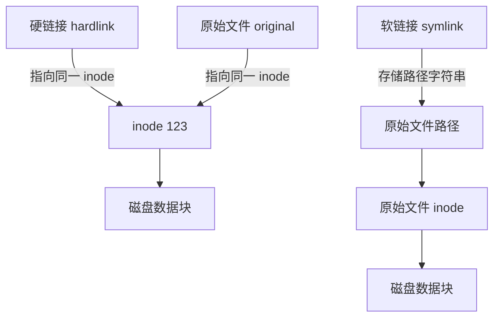
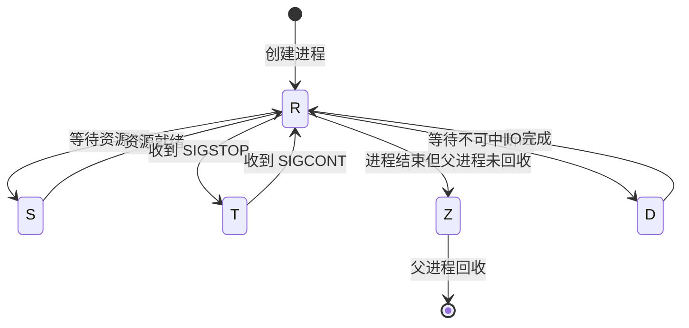
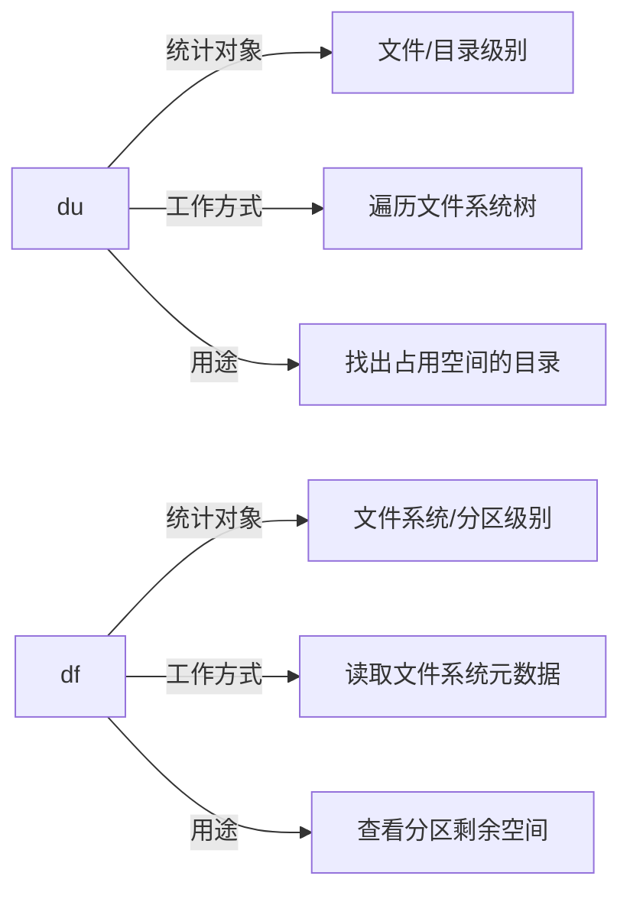
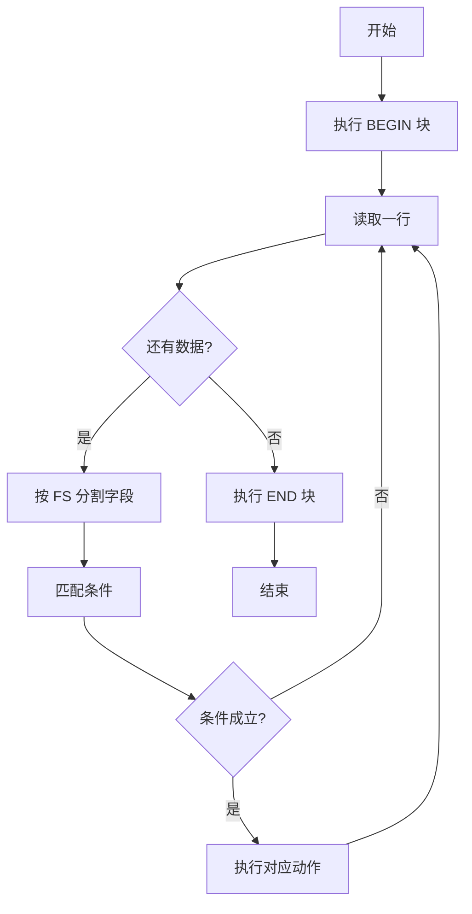

# Linux 面试题详解

本文档包含45道Linux面试题的详细解答，适合初学者和准备面试的开发者。

## 1. 绝对路径用什么符号表示?当前目录、上层目录用什么表示?主目录用什么表示?切换目录用什么命令?

### 绝对路径
绝对路径以 `/` 开头，表示从根目录开始的完整路径。

```bash
# 绝对路径示例
/home/user/documents/file.txt
/usr/local/bin
/etc/nginx/nginx.conf
```

### 当前目录
用 `.` 表示当前目录

```bash
# 在当前目录执行脚本
./script.sh

# 复制文件到当前目录
cp /home/user/file.txt .
```

### 上层目录
用 `..` 表示上一级目录

```bash
# 返回上一级目录
cd ..

# 返回上两级目录
cd ../..

# 访问上级目录的文件
cat ../config.txt
```

### 主目录
用 `~` 表示当前用户的主目录

```bash
# 切换到主目录
cd ~

# 访问主目录下的文件
cat ~/notes.txt
```

### 切换目录命令 cd
`cd` 是 "change directory" 的缩写

```bash
# 切换到绝对路径
cd /var/log

# 切换到相对路径
cd documents/projects

# 返回主目录
cd ~
# 或者
cd

# 返回上一次所在目录
cd -
```

---

## 2. 怎么查看当前进程?怎么执行退出?怎么查看当前路径?

### 查看当前进程
```bash
# 查看当前终端的进程
ps

# 查看所有进程（常用）
ps aux

# 实时动态查看进程
top

# 更好用的 top 替代品
htop
```

### 执行退出
```bash
# 退出当前 shell 或终端
exit

# 退出并返回指定状态码
exit 0   # 正常退出
exit 1   # 异常退出

# 快捷键退出
# Ctrl + D  发送 EOF 信号，退出当前 shell
```

### 查看当前路径
```bash
# pwd = print working directory
pwd

# 示例输出
# /home/user/documents
```

---

## 3. 怎么清屏?怎么退出当前命令?怎么执行睡眠?怎么查看当前用户id?查看指定帮助用什么命令?

### 清屏
```bash
# 清除终端屏幕内容
clear

# 快捷键
# Ctrl + L  同样可以清屏
```

### 退出当前命令
```bash
# Ctrl + C  终止当前正在运行的命令
# Ctrl + Z  暂停当前命令（挂起到后台）
# Ctrl + D  退出当前 shell 输入
```

### 执行睡眠
```bash
# sleep 命令，单位默认为秒
sleep 5        # 睡眠 5 秒
sleep 2m       # 睡眠 2 分钟
sleep 1h       # 睡眠 1 小时

# 实际用途：在脚本中延时
echo "开始"; sleep 3; echo "3秒后结束"
```

### 查看当前用户 ID
```bash
# 查看用户ID和组ID
id

# 只查看用户ID
id -u

# 查看当前登录用户名
whoami

# 示例输出: uid=1000(user) gid=1000(user) groups=1000(user),4(adm)
```

### 查看指定帮助
```bash
# man 命令 — manual 手册
man ls
man grep
man cd

# --help 参数
ls --help
grep --help

# info 命令（更详细）
info ls

# whatis 命令（简短描述）
whatis ls
```

---

## 4. ls 命令执行什么功能?可以带哪些参数,有什么区别?

`ls` 是 "list" 的缩写，用于列出目录中的文件和子目录。

```bash
# 基本用法
ls           # 列出当前目录内容
ls /etc      # 列出指定目录内容
```

### 常用参数对比

| 参数 | 含义 | 示例 |
|------|------|------|
| `-l` | 长格式显示（权限、大小、时间等）| `ls -l` |
| `-a` | 显示隐藏文件（以.开头的文件）| `ls -a` |
| `-h` | 人性化显示文件大小（KB/MB/GB）| `ls -lh` |
| `-r` | 逆序排列 | `ls -r` |
| `-t` | 按修改时间排序 | `ls -lt` |
| `-R` | 递归列出子目录 | `ls -R` |
| `-d` | 只显示目录本身 | `ls -d */` |
| `-i` | 显示 inode 号 | `ls -i` |
| `-S` | 按文件大小排序 | `ls -lS` |

```bash
# 组合使用示例
ls -la          # 长格式 + 显示隐藏文件
ls -lah         # 长格式 + 隐藏文件 + 人性化大小
ls -lt          # 按时间排序
ls -ltr         # 按时间逆序（最新的在最后）
```

### ls -l 输出格式说明
```
-rw-r--r-- 1 user group 4096 Jan 10 12:00 file.txt
^          ^ ^    ^     ^    ^             ^
|          | |    |     |    |             文件名
|          | |    |     |    修改时间
|          | |    |     文件大小
|          | |    所属组
|          | 所有者
|          硬链接数
文件类型和权限
```

---

## 5. 建立软链接（快捷方式），以及硬链接的命令

### 软链接（Symbolic Link）
软链接类似 Windows 的快捷方式，指向目标文件的路径。

```bash
# 语法：ln -s 目标文件 链接名
ln -s /usr/local/bin/python3 /usr/bin/python

# 创建软链接示例
ln -s /var/log/nginx/access.log ~/nginx_access.log

# 查看软链接
ls -l ~/nginx_access.log
# 输出: lrwxrwxrwx 1 user user 27 ... nginx_access.log -> /var/log/nginx/access.log
```

### 硬链接（Hard Link）
硬链接直接指向文件的 inode，两个文件名共享同一份数据。

```bash
# 语法：ln 目标文件 链接名
ln /home/user/original.txt /home/user/hardlink.txt

# 验证（两个文件的 inode 相同）
ls -i original.txt hardlink.txt
```

### 软链接 vs 硬链接对比



| 特性 | 软链接 | 硬链接 |
|------|--------|--------|
| 跨文件系统 | 支持 | 不支持 |
| 链接目录 | 支持 | 不支持 |
| 原文件删除后 | 链接失效 | 数据仍可访问 |
| inode | 不同 | 相同 |
| 参数 | `-s` | 无参数 |

---

## 6. 目录创建用什么命令?创建文件用什么命令?复制文件用什么命令?

### 创建目录
```bash
# mkdir = make directory
mkdir mydir

# 创建多级目录（-p 表示递归创建）
mkdir -p /home/user/a/b/c

# 同时创建多个目录
mkdir dir1 dir2 dir3

# 创建时设置权限
mkdir -m 755 mydir
```

### 创建文件
```bash
# touch 命令（创建空文件或更新时间戳）
touch newfile.txt

# 同时创建多个文件
touch file1.txt file2.txt file3.txt

# 使用重定向创建文件
> newfile.txt

# 使用 echo 创建带内容的文件
echo "Hello World" > hello.txt

# 使用 cat 创建文件（Ctrl+D 结束输入）
cat > myfile.txt
```

### 复制文件
```bash
# cp = copy
cp source.txt destination.txt

# 复制到目录
cp file.txt /home/user/backup/

# 复制并保留属性
cp -p file.txt backup.txt

# 复制目录（-r 递归）
cp -r mydir/ backup_dir/
```

---

## 7. 查看文件内容有哪些命令可以使用?

```bash
# cat — 一次性显示全部内容
cat file.txt

# more — 分页查看，只能向下翻页
more file.txt

# less — 分页查看，可上下翻页（推荐）
less file.txt
# less 内按 q 退出，按空格下一页，按 b 上一页

# head — 查看文件前几行（默认10行）
head file.txt
head -n 20 file.txt   # 查看前20行

# tail — 查看文件后几行（默认10行）
tail file.txt
tail -n 20 file.txt   # 查看后20行
tail -f file.txt      # 实时跟踪文件末尾（常用于看日志）

# nl — 显示内容并加上行号
nl file.txt

# od — 以八进制/十六进制查看二进制文件
od -c file.bin

# xxd — 十六进制查看
xxd file.bin
```

---

## 8. 随意写文件命令?怎么向屏幕输出带空格的字符串，比如"hello world"?

### 写文件
```bash
# 覆盖写入（> 重定向）
echo "内容" > file.txt

# 追加写入（>> 重定向）
echo "追加内容" >> file.txt

# 使用 tee 命令（同时写文件和显示到屏幕）
echo "内容" | tee file.txt
echo "追加" | tee -a file.txt

# 使用 cat 交互写入（Ctrl+D 结束）
cat > file.txt
第一行
第二行
```

### 向屏幕输出带空格的字符串
```bash
# 用双引号包裹字符串
echo "hello world"

# 用单引号包裹
echo 'hello world'

# 用转义空格
echo hello\ world

# 输出带换行
echo -e "hello\nworld"

# printf 命令
printf "hello world\n"
```

---

## 9. 终端是哪个文件夹下的哪个文件?黑洞文件是哪个文件夹下的哪个文件?

### 终端设备文件
终端设备文件位于 `/dev/` 目录下：

```bash
# 当前终端
/dev/tty

# 查看当前使用的终端
tty
# 输出示例: /dev/pts/0

# 虚拟终端（本地登录）
/dev/tty1  /dev/tty2  ... /dev/tty6

# 伪终端（SSH远程登录、终端模拟器）
/dev/pts/0  /dev/pts/1  ...

# 向某个终端发送消息
echo "hello" > /dev/pts/1
```

### 黑洞文件
黑洞文件是 `/dev/null`，写入的所有数据都会被丢弃，读取时返回 EOF。

```bash
# 丢弃命令的输出（不显示错误信息）
command 2>/dev/null

# 同时丢弃标准输出和错误输出
command > /dev/null 2>&1

# 清空文件内容
cat /dev/null > file.txt
# 或者
> file.txt
```

---

## 10. 移动文件用哪个命令?改名用哪个命令?

### 移动文件
```bash
# mv = move
mv source.txt /home/user/backup/

# 移动整个目录
mv mydir/ /tmp/
```

### 改名（mv 同样用于改名）
```bash
# 重命名文件
mv oldname.txt newname.txt

# 重命名目录
mv olddir newdir

# 移动并改名
mv /home/user/old.txt /tmp/new.txt
```

> Linux 没有专门的 rename 命令（部分系统有），移动和改名都用 `mv`。

---

## 11. 复制文件用哪个命令?如果需要连同文件夹一块复制呢?如果需要有提示功能呢?

```bash
# 基本复制文件
cp source.txt dest.txt

# 复制文件到目录
cp file.txt /home/user/backup/

# 连同文件夹一起复制（-r 递归）
cp -r sourcedir/ destdir/

# 复制时有提示（-i 交互模式，覆盖前询问）
cp -i source.txt dest.txt
# 若 dest.txt 已存在，会提示：overwrite dest.txt? (y/n)

# 组合使用：递归复制 + 提示 + 保留属性
cp -rip sourcedir/ destdir/

# 常用参数说明
# -r  递归复制目录
# -i  覆盖前提示
# -p  保留文件属性（权限、时间戳等）
# -v  显示详细过程
# -u  只复制更新的文件
```

---

## 12. 删除文件用哪个命令?如果需要连目录及目录下文件一块删除呢?删除空文件夹用什么命令?

### 删除文件
```bash
# rm = remove
rm file.txt

# 强制删除（不提示）
rm -f file.txt

# 删除前提示确认
rm -i file.txt
```

### 连同目录一起删除
```bash
# -r 递归删除目录及其内容
rm -r mydir/

# 强制递归删除（慎用！）
rm -rf mydir/

# 极度危险！永远不要执行：
# rm -rf /   （删除整个系统）
```

### 删除空文件夹
```bash
# rmdir 只能删除空目录
rmdir emptydir

# 删除多级空目录
rmdir -p a/b/c   # 依次删除 c、b、a（都必须为空）
```

> **警告**：`rm -rf` 是不可恢复的操作，执行前务必确认路径正确！

---

## 13. Linux 下命令有哪几种可使用的通配符?分别代表什么含义?

| 通配符 | 含义 | 示例 |
|--------|------|------|
| `*` | 匹配任意长度的任意字符（包括空） | `*.txt` 匹配所有 .txt 文件 |
| `?` | 匹配任意单个字符 | `file?.txt` 匹配 file1.txt |
| `[...]` | 匹配括号内任意一个字符 | `[abc].txt` 匹配 a.txt/b.txt/c.txt |
| `[^...]` | 匹配不在括号内的字符 | `[^0-9]*` 匹配非数字开头的文件 |
| `[a-z]` | 匹配字符范围 | `[a-z]*.sh` 匹配小写字母开头的脚本 |
| `{a,b}` | 匹配花括号内的任意一项 | `{jpg,png}` 匹配 jpg 或 png |

```bash
# 通配符使用示例
ls *.log              # 所有 .log 文件
ls file?.txt          # file1.txt file2.txt 等
ls file[123].txt      # file1.txt file2.txt file3.txt
ls [A-Z]*.sh          # 大写字母开头的 shell 脚本
rm *.tmp              # 删除所有 .tmp 文件
cp {*.jpg,*.png} /backup/   # 复制所有图片
```

---

## 14. 用什么命令对一个文件的内容进行统计?(行号、单词数、字节数)

```bash
# wc = word count
wc file.txt

# 输出示例：  10  20  150 file.txt
#            行数 单词数 字节数 文件名

# 只统计行数（-l = lines）
wc -l file.txt

# 只统计单词数（-w = words）
wc -w file.txt

# 只统计字节数（-c = bytes）
wc -c file.txt

# 只统计字符数（-m = chars，处理多字节字符）
wc -m file.txt

# 统计多个文件
wc -l *.txt

# 结合管道使用
cat file.txt | wc -l
ls /etc | wc -l   # 统计 /etc 下的文件数量
```

---

## 15. grep 命令有什么用?如何忽略大小写?如何查找不含该串的行?

`grep` 用于在文件中搜索匹配指定模式的行。

```bash
# 基本用法
grep "pattern" file.txt

# 忽略大小写（-i = ignore case）
grep -i "hello" file.txt
# 可以匹配 Hello、HELLO、hElLo 等

# 查找不含该字符串的行（-v = invert）
grep -v "error" file.txt
# 输出所有不含 "error" 的行

# 其他常用参数
grep -n "pattern" file.txt    # 显示匹配行的行号
grep -r "pattern" /dir/       # 递归搜索目录
grep -l "pattern" *.txt       # 只显示包含匹配的文件名
grep -c "pattern" file.txt    # 统计匹配行数
grep -w "word" file.txt       # 精确匹配整个单词
grep -A 3 "pattern" file.txt  # 显示匹配行及后3行
grep -B 3 "pattern" file.txt  # 显示匹配行及前3行
grep -C 3 "pattern" file.txt  # 显示匹配行及前后3行

# 使用正则表达式
grep -E "error|warning" file.txt   # 匹配 error 或 warning
grep "^start" file.txt             # 匹配以 start 开头的行
grep "end$" file.txt               # 匹配以 end 结尾的行

# 结合管道
ps aux | grep nginx
dmesg | grep -i error
```

---

## 16. Linux 中进程有哪几种状态?在 ps 显示出来的信息中，分别用什么符号表示的?

### 进程状态说明



| 符号 | 状态名称 | 说明 |
|------|----------|------|
| `R` | Running（运行） | 正在运行或在运行队列中等待 |
| `S` | Sleeping（睡眠） | 可中断睡眠，等待某个事件完成 |
| `D` | Disk Sleep（磁盘睡眠） | 不可中断睡眠，通常等待IO |
| `T` | Stopped（停止） | 被信号暂停，如 Ctrl+Z |
| `Z` | Zombie（僵尸） | 进程已结束但父进程未回收资源 |
| `X` | Dead（死亡） | 进程已死亡，不应出现在 ps 中 |

### 附加标志

| 符号 | 含义 |
|------|------|
| `<` | 高优先级进程 |
| `N` | 低优先级进程 |
| `L` | 有内存页锁定 |
| `s` | 会话领导进程 |
| `l` | 多线程进程 |
| `+` | 前台进程组 |

```bash
# 查看进程状态
ps aux
# STAT 列显示状态，如 Ss、R+、Sl 等

# 示例输出
# USER  PID %CPU %MEM  STAT COMMAND
# root    1  0.0  0.1  Ss   /sbin/init
# user  123  0.5  1.2  R+   ./myprogram
# user  456  0.0  0.0  Z    [defunct]
```

---

## 17. 怎么使一个命令在后台运行?

```bash
# 方法1：命令末尾加 &
./long_script.sh &
# 输出: [1] 12345  （作业号和PID）

# 方法2：nohup — 忽略挂断信号，关闭终端后继续运行
nohup ./script.sh &
nohup ./script.sh > output.log 2>&1 &

# 方法3：先运行再挂到后台
./script.sh
# 按 Ctrl+Z 暂停
bg          # 让暂停的任务在后台继续运行

# 方法4：screen — 创建独立会话
screen -S mysession
./script.sh
# Ctrl+A D 脱离会话，任务继续运行

# 方法5：tmux — 更现代的终端复用器
tmux new -s mysession
./script.sh
# Ctrl+B D 脱离会话
```

---

## 18. 利用 ps 怎么显示所有的进程?怎么利用 ps 查看指定进程的信息?

```bash
# 显示所有进程（最常用）
ps aux
# a = 所有用户的进程
# u = 以用户友好格式显示
# x = 包含没有控制终端的进程

# 另一种显示所有进程的方式
ps -ef
# -e = 所有进程
# -f = 完整格式

# 以树形结构显示进程
ps auxf
ps -ejH

# 查看指定进程名
ps aux | grep nginx
ps -ef | grep python

# 查看指定 PID 的进程
ps -p 1234
ps -p 1234 -f

# 查看指定用户的进程
ps -u username
ps aux | grep username

# 自定义输出列
ps -eo pid,ppid,cmd,%cpu,%mem --sort=-%cpu | head -10
```

---

## 19. 哪个命令专门用来查看后台任务?

```bash
# jobs 命令 — 查看当前 shell 的后台任务
jobs

# 显示详细信息（包含PID）
jobs -l

# 只显示运行中的任务
jobs -r

# 只显示停止的任务
jobs -s

# 示例输出：
# [1]-  Running    ./script1.sh &
# [2]+  Stopped    ./script2.sh
# [3]   Done       ./script3.sh
# 方括号内是作业号，+ 表示当前任务，- 表示上一个任务
```

---

## 20. 把后台任务调到前台执行使用什么命令?把停下的后台任务在后台执行起来用什么命令?

```bash
# fg — 将后台任务调到前台（foreground）
fg          # 调出最近的后台任务
fg %1       # 调出作业号为 1 的任务
fg %2       # 调出作业号为 2 的任务

# bg — 让停止的任务在后台继续运行（background）
bg          # 让最近停止的任务在后台运行
bg %1       # 让作业号为 1 的停止任务在后台运行

# 完整流程示例：
./long_script.sh     # 前台运行
# 按 Ctrl+Z 暂停
jobs                 # 查看：[1]+ Stopped ./long_script.sh
bg %1                # 在后台继续运行
jobs                 # 查看：[1]+ Running ./long_script.sh &
fg %1                # 再次调回前台
```

---

## 21. 终止进程用什么命令?带什么参数?

```bash
# kill 命令 — 向进程发送信号
kill PID              # 默认发送 SIGTERM(15)，请求进程正常退出
kill -9 PID           # 发送 SIGKILL，强制立即终止
kill -15 PID          # 发送 SIGTERM，优雅退出（默认）
kill -1 PID           # 发送 SIGHUP，重新加载配置

# killall — 按进程名终止
killall nginx
killall -9 python

# pkill — 按名称或属性终止
pkill nginx
pkill -9 -u username  # 终止某用户的所有进程
pkill -f "script.sh"  # 按完整命令行匹配

# 常用信号
# SIGHUP  (1)  — 挂断，通常用于重载配置
# SIGINT  (2)  — 中断，等同于 Ctrl+C
# SIGKILL (9)  — 强制终止，不可被捕获或忽略
# SIGTERM (15) — 请求终止，可被捕获处理
# SIGSTOP (19) — 暂停进程，等同于 Ctrl+Z
```

---

## 22. 怎么查看系统支持的所有信号?

```bash
# 方法1：kill -l（list）
kill -l

# 输出示例：
#  1) SIGHUP   2) SIGINT   3) SIGQUIT  4) SIGILL   5) SIGTRAP
#  6) SIGABRT  7) SIGBUS   8) SIGFPE   9) SIGKILL 10) SIGUSR1
# 11) SIGSEGV 12) SIGUSR2 13) SIGPIPE 14) SIGALRM 15) SIGTERM
# ...

# 方法2：trap -l（在 bash 中）
trap -l

# 方法3：查看 man 手册
man 7 signal

# 查看某个信号的编号
kill -l SIGKILL   # 输出: 9
kill -l 9         # 输出: KILL
```

---

## 23. 搜索文件用什么命令?格式是怎么样的?

```bash
# find 命令 — 最强大的文件搜索工具
# 格式：find [搜索路径] [搜索条件] [执行动作]

# 按文件名搜索
find /home -name "*.txt"
find / -name "nginx.conf"

# 忽略大小写搜索
find /home -iname "readme*"

# 按文件类型搜索
find /home -type f    # 只找普通文件
find /home -type d    # 只找目录
find /home -type l    # 只找软链接

# 按大小搜索
find / -size +100M    # 大于100MB的文件
find / -size -1k      # 小于1KB的文件
find / -size 50M      # 恰好50MB的文件

# 按时间搜索
find /home -mtime -7  # 7天内修改过的文件
find /home -atime +30 # 30天前访问过的文件
find /home -newer ref.txt  # 比 ref.txt 更新的文件

# 按权限搜索
find / -perm 777      # 权限为777的文件
find / -perm -u+x     # 用户有执行权限的文件

# 按用户搜索
find /home -user alice
find /tmp -group staff

# 搜索后执行操作
find /tmp -name "*.tmp" -delete          # 找到后删除
find /home -name "*.sh" -exec chmod +x {} \;  # 找到后执行命令

# locate 命令 — 基于数据库快速搜索（需先 updatedb）
locate nginx.conf
updatedb && locate myfile.txt

# which — 查找可执行文件位置
which python3
which nginx
```

---

## 24. 查看当前谁在使用该主机用什么命令?查找自己所在的终端信息用什么命令?

```bash
# who — 查看当前登录的用户
who
# 输出示例：
# alice  pts/0  2024-01-10 09:00 (192.168.1.100)
# bob    pts/1  2024-01-10 10:30 (192.168.1.101)

# w — 更详细，还显示用户在做什么
w
# 输出包含：用户名、终端、登录时间、空闲时间、CPU使用、当前命令

# users — 只显示用户名列表
users

# last — 查看最近登录记录
last
last -n 10   # 最近10条记录

# 查找自己所在的终端信息
tty
# 输出示例：/dev/pts/0

# whoami — 查看当前用户名
whoami

# who am i — 查看自己的登录信息（包含终端和登录时间）
who am i
```

---

## 25. 使用什么命令查看用过的命令列表?

```bash
# history 命令
history
# 显示最近使用的命令列表，带编号

# 显示最近 N 条命令
history 20

# 执行历史中的某条命令
!100        # 执行编号为100的命令
!!          # 执行上一条命令
!ls         # 执行最近一次以 ls 开头的命令

# 搜索历史命令
history | grep "git"
# 或者使用 Ctrl+R 反向搜索（交互式）

# 清除历史记录
history -c

# 历史记录保存在文件中
cat ~/.bash_history

# 相关环境变量
echo $HISTSIZE       # 内存中保存的历史条数
echo $HISTFILESIZE   # 文件中保存的历史条数
echo $HISTFILE       # 历史文件路径
```

---

## 26. 使用什么命令查看磁盘使用空间?空闲空间呢?

```bash
# df — disk free，查看文件系统磁盘使用情况
df
df -h       # 人性化显示（KB/MB/GB）
df -H       # 以1000为单位（而非1024）
df -T       # 显示文件系统类型
df -i       # 显示 inode 使用情况

# 示例输出（df -h）：
# Filesystem      Size  Used Avail Use% Mounted on
# /dev/sda1        50G   20G   28G  42% /
# /dev/sdb1       100G   60G   37G  62% /data

# 查看特定目录所在分区
df -h /home

# du — disk usage，查看目录/文件占用空间
du -h /home/user        # 递归显示目录大小
du -sh /home/user       # 只显示总大小（-s 汇总）
du -sh *                # 当前目录下各项大小
du -h --max-depth=1 /   # 只显示一层深度

# 找出最大的目录
du -sh /* 2>/dev/null | sort -rh | head -10
```

---

## 27. 使用什么命令查看网络是否连通?

```bash
# ping — 最常用的网络连通性测试
ping google.com
ping 192.168.1.1

# 指定发送次数（-c）
ping -c 4 google.com

# 指定间隔时间（-i，单位秒）
ping -i 0.5 google.com

# 指定包大小（-s）
ping -s 1024 google.com

# traceroute — 追踪数据包路由路径
traceroute google.com
traceroute -n google.com   # 不解析主机名，更快

# tracepath — 类似 traceroute，无需 root
tracepath google.com

# curl — 测试 HTTP 连通性
curl -I https://www.google.com
curl --connect-timeout 5 http://example.com

# wget — 测试下载
wget --spider http://example.com

# nc（netcat）— 测试端口连通性
nc -zv 192.168.1.1 80
nc -zv -w 3 google.com 443

# telnet — 测试端口
telnet 192.168.1.1 22
```

---

## 28. 使用什么命令查看 IP 地址及接口信息?

```bash
# ip 命令（现代推荐方式）
ip addr             # 查看所有网络接口和IP地址
ip addr show        # 同上
ip addr show eth0   # 查看指定接口
ip link show        # 查看链路层信息
ip route show       # 查看路由表

# ifconfig（传统方式，部分系统需安装 net-tools）
ifconfig            # 查看所有活动接口
ifconfig -a         # 查看所有接口（包括未激活的）
ifconfig eth0       # 查看指定接口

# 其他相关命令
hostname -I         # 快速查看本机IP地址
cat /etc/hosts      # 查看本地 hosts 文件

# 查看路由表
route -n
ip route

# 查看 DNS 配置
cat /etc/resolv.conf

# 查看网络连接状态
ss -tuln            # 查看监听的端口（推荐）
netstat -tuln       # 传统方式
ss -s               # 网络统计摘要
```

---

## 29. 查看各类环境变量用什么命令?

```bash
# env — 显示所有环境变量
env

# printenv — 打印环境变量
printenv            # 显示所有
printenv PATH       # 显示指定变量
printenv HOME USER  # 显示多个变量

# set — 显示所有变量（包括 shell 变量和函数）
set

# echo — 查看单个变量
echo $PATH
echo $HOME
echo $USER
echo $SHELL
echo $PWD

# 常见环境变量
echo $PATH    # 可执行文件搜索路径
echo $HOME    # 用户主目录
echo $USER    # 当前用户名
echo $SHELL   # 当前使用的 shell
echo $LANG    # 语言/区域设置
echo $PS1     # 命令提示符格式
echo $EDITOR  # 默认编辑器
echo $TERM    # 终端类型

# 设置环境变量
export MY_VAR="hello"
export PATH=$PATH:/new/path

# 临时设置（只对当前命令有效）
MY_VAR=hello ./script.sh
```

---

## 30. 通过什么命令指定命令提示符?

命令提示符由环境变量 `PS1` 控制。

```bash
# 查看当前提示符
echo $PS1

# 临时修改提示符
PS1="[\u@\h \W]\$ "

# 永久修改（写入 ~/.bashrc）
echo 'export PS1="[\u@\h \W]\$ "' >> ~/.bashrc
source ~/.bashrc

# PS1 常用转义字符
# \u  当前用户名
# \h  主机名（短）
# \H  主机名（完整）
# \w  当前工作目录（完整路径）
# \W  当前工作目录（只显示最后一级）
# \$  普通用户显示 $，root 显示 #
# \t  当前时间（HH:MM:SS）
# \d  当前日期
# \n  换行
# \[  开始不可打印字符序列（用于颜色代码）
# \]  结束不可打印字符序列

# 带颜色的提示符示例
PS1='\[\033[01;32m\]\u@\h\[\033[00m\]:\[\033[01;34m\]\w\[\033[00m\]\$ '
# 绿色用户名@主机名 + 蓝色路径

# PS2 是多行命令的续行提示符（默认是 >）
echo $PS2
```

---

## 31. 查找命令的可执行文件是去哪查找的?怎么对其进行设置及添加?

### PATH 变量决定命令搜索路径

```bash
# 查看当前 PATH
echo $PATH
# 输出示例：/usr/local/sbin:/usr/local/bin:/usr/sbin:/usr/bin:/sbin:/bin

# PATH 中各目录用冒号 : 分隔
# 系统按从左到右的顺序依次查找
```

### 添加新路径到 PATH

```bash
# 临时添加（只在当前 shell 会话有效）
export PATH=$PATH:/new/directory
export PATH=/new/directory:$PATH   # 添加到最前面（优先级更高）

# 永久添加（写入配置文件）
# 对当前用户有效：
echo 'export PATH=$PATH:/new/directory' >> ~/.bashrc
source ~/.bashrc

# 对所有用户有效（需要 root）：
echo 'export PATH=$PATH:/new/directory' >> /etc/profile
# 或者在 /etc/profile.d/ 下创建新文件
echo 'export PATH=$PATH:/new/directory' > /etc/profile.d/myapp.sh

# 验证
which mycommand
type mycommand
```

### 常见可执行文件目录

| 目录 | 说明 |
|------|------|
| `/bin` | 基本系统命令 |
| `/sbin` | 系统管理命令（通常需要 root）|
| `/usr/bin` | 用户级命令 |
| `/usr/sbin` | 用户级系统管理命令 |
| `/usr/local/bin` | 本地安装的命令 |
| `~/bin` 或 `~/.local/bin` | 用户自己的命令 |

---

## 32. 通过什么命令查找执行命令?

```bash
# which — 查找命令的可执行文件路径（在 PATH 中查找）
which ls
which python3
which nginx
# 输出示例：/usr/bin/ls

# whereis — 查找命令的二进制文件、源码和手册页
whereis ls
# 输出：ls: /bin/ls /usr/share/man/man1/ls.1.gz

# type — 显示命令的类型（内置/外部/别名/函数）
type ls
type cd
type ll
# 输出示例：
# ls is aliased to `ls --color=auto'
# cd is a shell builtin
# ll is aliased to `ls -alF'

# command -v — 类似 which，更可靠
command -v python3

# find — 在指定目录中查找可执行文件
find /usr -name "python*" -type f -executable
```

---

## 33. 怎么对命令进行取别名?

```bash
# alias 命令
# 查看所有别名
alias

# 创建别名
alias ll='ls -alF'
alias la='ls -A'
alias l='ls -CF'
alias grep='grep --color=auto'
alias rm='rm -i'          # 删除前提示（安全习惯）
alias cp='cp -i'
alias mv='mv -i'
alias ..='cd ..'
alias ...='cd ../..'
alias cls='clear'

# 查看某个别名的定义
alias ll

# 删除别名
unalias ll

# 临时绕过别名（使用原始命令）
\rm file.txt      # 反斜杠绕过别名
command rm file.txt

# 永久保存别名（写入 ~/.bashrc 或 ~/.bash_aliases）
echo "alias ll='ls -alF'" >> ~/.bashrc
source ~/.bashrc
```

---

## 34. du 和 df 的定义，以及区别?

### du（Disk Usage）— 磁盘使用量

`du` 统计**文件或目录**实际占用的磁盘空间。

```bash
du -sh /home/user      # 查看目录总大小
du -sh *               # 当前目录各项大小
du -h --max-depth=1    # 只显示一层
du -sh /var/log/*.log  # 各日志文件大小
```

### df（Disk Free）— 磁盘空闲量

`df` 显示**文件系统**的总容量、已用空间和可用空间。

```bash
df -h          # 查看所有挂载的文件系统
df -h /home    # 查看 /home 所在文件系统
df -i          # 查看 inode 使用情况
```

### du vs df 的区别



| 特性 | du | df |
|------|----|----|
| 统计粒度 | 文件/目录 | 整个文件系统 |
| 速度 | 较慢（需遍历）| 很快 |
| 结果差异 | 可能与 df 不一致 | 显示文件系统实际情况 |
| 包含已删除文件 | 不包含 | 包含（进程仍持有句柄时）|

> **注意**：`du` 和 `df` 的结果有时不一致，原因是某些文件被删除但进程仍持有文件句柄，`df` 仍计入已用空间，而 `du` 不会统计这些文件。

---

## 35. awk 详解

`awk` 是一个强大的文本处理工具，擅长处理结构化文本（如按列分隔的数据）。

### 基本语法

```bash
awk '条件 { 动作 }' 文件
awk -F '分隔符' '{ 动作 }' 文件
```

### 内置变量

| 变量 | 含义 |
|------|------|
| `$0` | 整行内容 |
| `$1,$2,...` | 第1、2...列的内容 |
| `NR` | 当前行号 |
| `NF` | 当前行的列数 |
| `FS` | 输入字段分隔符（默认空格）|
| `OFS` | 输出字段分隔符 |
| `RS` | 输入记录分隔符（默认换行）|
| `ORS` | 输出记录分隔符 |
| `FILENAME` | 当前文件名 |

### 常用示例

```bash
# 打印第一列
awk '{ print $1 }' file.txt

# 打印第1和第3列
awk '{ print $1, $3 }' file.txt

# 以冒号为分隔符，打印第1列
awk -F: '{ print $1 }' /etc/passwd

# 打印行号和内容
awk '{ print NR, $0 }' file.txt

# 打印最后一列
awk '{ print $NF }' file.txt

# 条件过滤：打印第3列大于100的行
awk '$3 > 100 { print $0 }' file.txt

# 打印包含 "error" 的行
awk '/error/ { print }' file.txt

# BEGIN 和 END 块
awk 'BEGIN { print "开始" } { print $1 } END { print "结束" }' file.txt

# 统计行数
awk 'END { print NR }' file.txt

# 求第2列的总和
awk '{ sum += $2 } END { print "总和:", sum }' file.txt

# 格式化输出
awk -F: '{ printf "用户: %-15s UID: %d\n", $1, $3 }' /etc/passwd

# 多条件
awk '$1 == "root" && $3 == "0" { print }' /etc/passwd

# 修改字段输出
awk -F: 'BEGIN{OFS=","} { print $1,$3,$6 }' /etc/passwd

# 处理 ps 输出，找出 CPU 使用超过 1% 的进程
ps aux | awk 'NR>1 && $3>1.0 { print $1,$2,$3,$11 }'
```

### awk 工作流程



---

## 36. 当你需要给命令绑定一个宏或者按键的时候，应该怎么做呢?

```bash
# 使用 bind 命令绑定按键（bash 内置）

# 查看所有当前绑定
bind -P

# 查看所有键绑定（简洁格式）
bind -l

# 绑定按键到命令
bind '"\C-x\C-l": "ls -la\n"'   # Ctrl+X Ctrl+L 执行 ls -la
bind '"\C-p": "pwd\n"'           # Ctrl+P 执行 pwd

# 绑定按键到 readline 函数
bind '"\C-f": forward-word'      # Ctrl+F 向前移动一个单词

# 永久保存到 ~/.inputrc
cat >> ~/.inputrc << 'EOF'
"\C-x\C-l": "ls -la\n"
"\C-p": "pwd\n"
EOF

# 使用 alias 绑定命令别名（更常用）
alias gs='git status'
alias gp='git push'

# 使用 shell 函数（更复杂的宏）
mybackup() {
    tar -czf backup_$(date +%Y%m%d).tar.gz "$@"
}

# readline 常用函数名
# backward-kill-word  — Ctrl+W 删除前一个单词
# kill-line           — Ctrl+K 删除到行尾
# yank                — Ctrl+Y 粘贴
# reverse-search-history — Ctrl+R 反向搜索历史
```

---

## 37. 如果一个 Linux 新手想要知道当前系统支持的所有命令的列表，他需要怎么做?

```bash
# 方法1：按 Tab 键两次（在空命令行）
# 在终端输入空命令后按两次 Tab，会列出所有可用命令
# 系统会提示：Display all XXXX possibilities? (y or n)

# 方法2：查看 PATH 中所有目录的可执行文件
echo $PATH | tr ':' '\n' | xargs -I{} ls {}

# 方法3：compgen 命令（bash 内置）
compgen -c          # 列出所有可用命令
compgen -c | sort   # 排序后列出
compgen -c | wc -l  # 统计命令总数

# 方法4：查看各命令目录
ls /bin /sbin /usr/bin /usr/sbin /usr/local/bin

# 方法5：使用 find 查找所有可执行文件
find $(echo $PATH | tr ':' ' ') -type f -executable 2>/dev/null | sort

# 方法6：help 命令（查看 bash 内置命令）
help
help cd
help echo

# 方法7：man -k 搜索相关命令
man -k "file"       # 搜索与 file 相关的命令
apropos "network"   # apropos 等同于 man -k
```

---

## 38. 如果你的助手想要打印出当前的目录栈，你会建议他怎么做?

```bash
# dirs 命令 — 显示目录栈
dirs

# 显示详细格式（每个目录一行，带编号）
dirs -v

# 显示完整路径（不用 ~ 缩写）
dirs -l

# 目录栈操作命令
pushd /var/log    # 将目录压入栈并切换到该目录
pushd /etc        # 再压入一个目录
dirs -v           # 查看栈内容
# 输出：
#  0  /etc
#  1  /var/log
#  2  ~

popd              # 弹出栈顶目录并切换回去
dirs -v           # 再次查看

# pushd 不带参数 — 交换栈顶两个目录
pushd

# 切换到栈中指定位置的目录
pushd +2          # 切换到编号为2的目录

# 清空目录栈
dirs -c
```

---

## 39. 你的系统目前有许多正在运行的任务，在不重启机器的条件下有什么方法可以把所有正在运行的进程移除呢?

```bash
# 注意：这是一个危险操作，通常不建议在生产环境执行！

# 方法1：kill 所有用户进程（不影响系统进程）
kill -9 -1
# -1 表示发送信号给所有当前用户可以发送信号的进程

# 方法2：pkill 终止所有匹配的进程
pkill -u username    # 终止某用户的所有进程

# 方法3：killall 按名称终止
killall -u username

# 方法4：使用 ps + xargs
ps -ef | grep username | awk '{print $2}' | xargs kill -9

# 方法5：终止所有后台任务（当前 shell）
kill $(jobs -p)

# 更安全的方式 — 逐步终止
# 先发送 SIGTERM（优雅退出）
kill -15 -1
# 等待几秒后，再发送 SIGKILL（强制）
sleep 5 && kill -9 -1

# 查看还有哪些进程在运行
ps aux --no-header | grep -v "ps\|grep\|bash" | awk '{print $2}' | wc -l
```

> **警告**：`kill -9 -1` 会终止当前用户的所有进程，包括当前 shell，执行后终端会断开。root 用户执行此命令会影响整个系统。

---

## 40. bash shell 中的 hash 命令有什么作用?

```bash
# hash 命令用于管理命令路径的哈希表缓存

# bash 会缓存已执行命令的路径，避免每次都搜索 PATH
# 这个缓存就是哈希表

# 查看当前哈希表（已缓存的命令路径）
hash
# 输出示例：
# hits  command
#    3  /usr/bin/git
#    1  /usr/bin/vim
#    5  /bin/ls

# 查看某个命令的缓存路径
hash git

# 手动添加命令到哈希表
hash -p /usr/local/bin/python3 python3

# 删除某个命令的缓存
hash -d git

# 清空整个哈希表
hash -r

# 使用场景：
# 当你安装了新版本的命令（路径改变），
# 旧路径还在缓存中，需要用 hash -r 刷新
# 例如：安装新版 node 后
hash -r
which node   # 现在会找到新版本
```

---

## 41. 哪一个 bash 内置命令能够进行数学运算?

```bash
# 方法1：let 命令（bash 内置）
let a=5+3
echo $a    # 输出: 8

let "a = 10 * 2"
echo $a    # 输出: 20

let a++    # 自增
let a--    # 自减

# 方法2：(( )) 算术表达式（推荐）
((a = 5 + 3))
echo $a

((result = 10 * 5 - 3))
echo $result

# 在条件判断中使用
if ((a > 5)); then
    echo "a 大于 5"
fi

# 方法3：$(( )) 算术展开
a=$((5 + 3))
echo $a

echo $((10 * 5))
echo $((2 ** 10))   # 2的10次方 = 1024

# 方法4：expr 命令（外部命令，较老）
expr 5 + 3
expr 10 \* 5    # 乘号需要转义
result=$(expr 10 + 5)

# 方法5：bc 命令（支持浮点数）
echo "3.14 * 2" | bc
echo "scale=2; 10/3" | bc    # scale 设置小数位数
echo "sqrt(16)" | bc -l      # 数学函数需要 -l

# 方法6：python（处理复杂计算）
python3 -c "print(2**32)"
python3 -c "import math; print(math.sqrt(2))"
```

---

## 42. 怎样一页一页地查看一个大文件的内容呢?

```bash
# more — 基础分页查看器（只能向下翻页）
more largefile.txt
# 操作：空格=下一页，Enter=下一行，q=退出，/=搜索

# less — 功能更强的分页查看器（推荐）
less largefile.txt
# 操作：
# 空格 / PgDn  — 向下翻页
# b / PgUp     — 向上翻页
# g            — 跳到文件开头
# G            — 跳到文件末尾
# /pattern     — 向下搜索
# ?pattern     — 向上搜索
# n            — 下一个搜索结果
# N            — 上一个搜索结果
# q            — 退出
# F            — 实时跟踪文件末尾（类似 tail -f）

# 结合 grep 使用
grep "error" largefile.txt | less

# 结合 cat 使用
cat largefile.txt | less

# 查看压缩文件
zless file.gz
zmore file.gz

# 指定初始行号
less +100 largefile.txt    # 从第100行开始

# 指定初始搜索词
less +/error largefile.txt  # 从第一个 error 处开始
```

---

## 43. 数据字典属于哪一个用户的?

数据字典（Data Dictionary）是数据库系统的概念，在 Linux 系统中通常指 **Oracle 数据库**的数据字典。

### Oracle 数据库中的数据字典

```sql
-- Oracle 数据字典属于 SYS 用户
-- SYS 是 Oracle 数据库的超级管理员用户

-- 数据字典视图分三类：
-- USER_*  — 当前用户拥有的对象
-- ALL_*   — 当前用户可访问的所有对象
-- DBA_*   — 数据库中所有对象（需要 DBA 权限）

-- 常用数据字典视图
SELECT * FROM USER_TABLES;      -- 当前用户的表
SELECT * FROM ALL_TABLES;       -- 所有可访问的表
SELECT * FROM DBA_USERS;        -- 所有用户（需DBA权限）
SELECT * FROM V$SESSION;        -- 当前会话信息
```

### Linux 系统层面的"数据字典"

```bash
# Linux 系统中类似数据字典的文件：

# /etc/passwd — 用户信息数据库
cat /etc/passwd

# /etc/group — 组信息数据库
cat /etc/group

# /proc — 进程和系统信息的虚拟文件系统
ls /proc

# /var/lib/dpkg/info — Debian/Ubuntu 包信息数据库
ls /var/lib/dpkg/info

# 文件系统的 inode 表也是一种数据字典
# 存储文件元数据（权限、大小、时间戳等）
stat filename
```

> 在面试中，这道题通常考查 Oracle 数据库知识：**数据字典属于 SYS 用户**，由 Oracle 系统自动维护，用户不应直接修改。

---

## 44. 怎样查看一个 Linux 命令的概要与用法?假设你在 /bin 目录中偶然看到一个你从没见过的命令，怎样才能知道它的作用和用法呢?

```bash
# 方法1：--help 参数（最快）
unknown_command --help
unknown_command -h

# 方法2：man 手册（最详细）
man unknown_command
# 按 q 退出，/ 搜索，空格翻页

# man 手册章节说明：
# 1 — 用户命令
# 2 — 系统调用
# 3 — 库函数
# 4 — 设备文件
# 5 — 文件格式
# 6 — 游戏
# 7 — 杂项
# 8 — 系统管理命令

man 1 ls      # 查看第1章的 ls
man 5 passwd  # 查看 passwd 文件格式

# 方法3：info 命令（GNU 风格，更详细）
info unknown_command

# 方法4：whatis（一行简短描述）
whatis ls
whatis grep
# 输出：ls (1) - list directory contents

# 方法5：apropos（按关键词搜索手册）
apropos "list directory"
man -k "compress"

# 方法6：type 命令（了解命令类型）
type unknown_command
# 输出：是内置命令、外部命令、别名还是函数

# 方法7：file 命令（查看文件类型）
file /bin/unknown_command
# 输出：ELF 64-bit LSB executable, x86-64...

# 方法8：strings 命令（查看二进制中的字符串）
strings /bin/unknown_command | head -50

# 方法9：网络搜索
# 直接搜索命令名 + linux

# 实际操作流程
cd /bin
ls                          # 看到陌生命令
whatis unknown_command      # 先看简短描述
unknown_command --help      # 看用法
man unknown_command         # 深入了解
```

---

## 45. 使用哪一个命令可以查看自己文件系统的磁盘空间配额呢?

```bash
# quota 命令 — 查看磁盘配额

# 查看当前用户的配额
quota
quota -v          # 详细显示（包括未超限的文件系统）
quota -s          # 人性化显示大小（KB/MB/GB）

# 查看指定用户的配额（需要 root）
quota -u username
quota -u alice -v

# 查看组配额
quota -g groupname

# repquota — 查看整个文件系统的配额报告（需要 root）
repquota /home
repquota -a       # 所有文件系统
repquota -s /home # 人性化显示

# edquota — 编辑用户配额（需要 root）
edquota -u username
edquota -g groupname

# quotacheck — 检查文件系统配额
quotacheck -avug

# quotaon/quotaoff — 开启/关闭配额
quotaon /home
quotaoff /home

# 配额输出说明
# Filesystem  blocks  quota  limit  grace  files  quota  limit  grace
# /dev/sda1   10240   20480  30720         100    200    300
# blocks: 已用块数
# quota: 软限制（可临时超过）
# limit: 硬限制（绝对不能超过）
# grace: 超过软限制的宽限期

# 查看配额配置文件
cat /etc/fstab   # 文件系统挂载配置，usrquota/grpquota 选项
```

---

## 总结

以上45道题涵盖了 Linux 日常使用和运维的核心知识点，包括：

- **文件系统操作**：路径、目录、文件的增删改查
- **进程管理**：查看、控制、终止进程
- **文本处理**：grep、awk、wc 等工具
- **网络工具**：ping、ip、ss 等命令
- **系统管理**：磁盘配额、环境变量、信号处理
- **Shell 技巧**：别名、通配符、历史命令、数学运算

掌握这些命令和概念，是成为合格 Linux 用户和运维工程师的基础。建议在实际环境中多加练习，加深理解。


