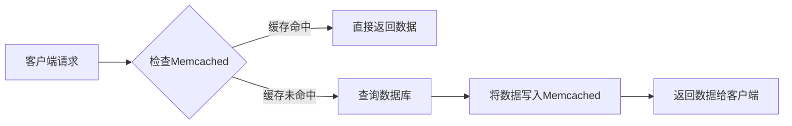
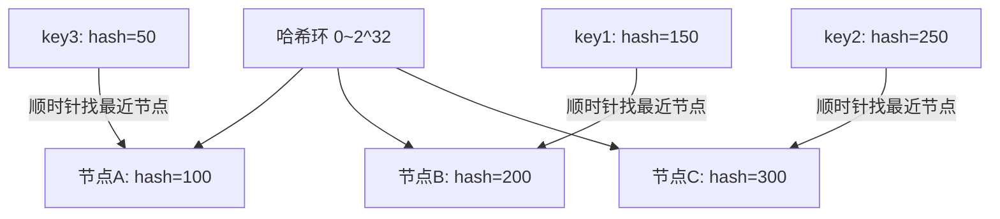
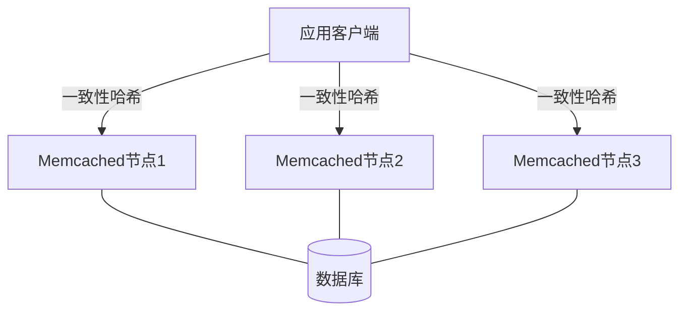
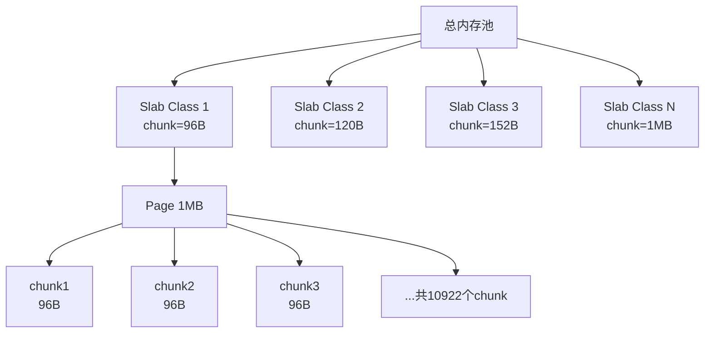
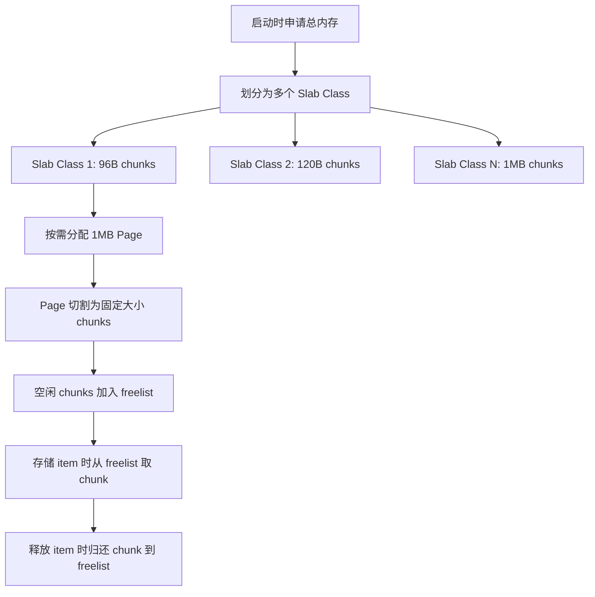
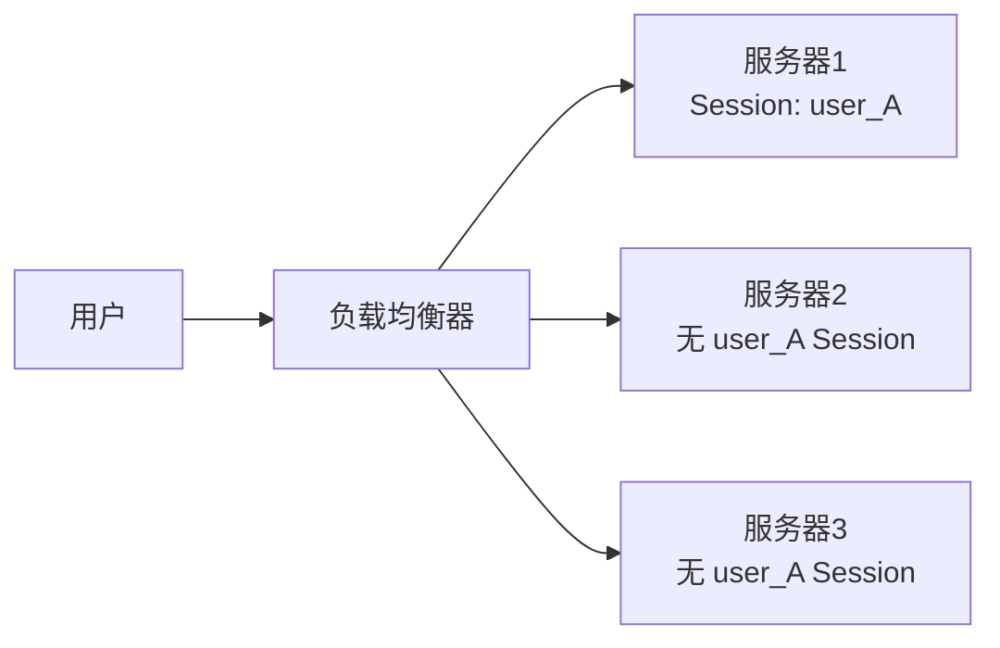
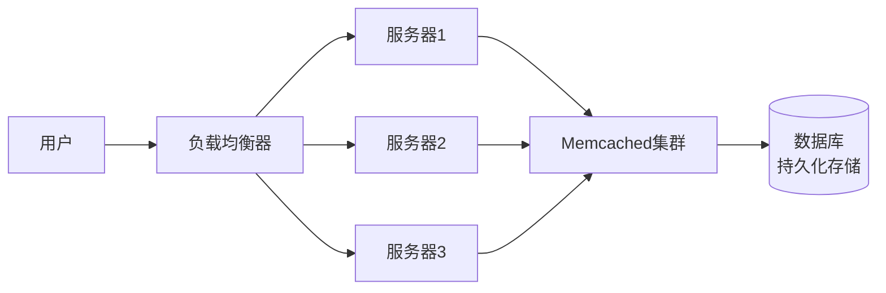

# Memcached 面试题详解

> 本文整理了 Memcached 常见面试题及详细解答，适合初学者学习和面试备考。

---

## 目录

1. [Memcached是什么，有什么作用?](#1-memcached是什么有什么作用)
2. [Memcached服务分布式集群如何实现?](#2-memcached服务分布式集群如何实现)
3. [Memcached服务特点及工作原理是什么?](#3-memcached服务特点及工作原理是什么)
4. [简述Memcached内存管理机制原理?](#4-简述memcached内存管理机制原理)
5. [memcached是怎么工作的?](#5-memcached是怎么工作的)
6. [memcached最大的优势是什么?](#6-memcached最大的优势是什么)
7. [memcached和MySQL的query cache相比，有什么优缺点?](#7-memcached和mysql的query-cache相比有什么优缺点)
8. [memcached和服务器的local cache相比，有什么优缺点?](#8-memcached和服务器的local-cache相比有什么优缺点)
9. [memcached的cache机制是怎样的?](#9-memcached的cache机制是怎样的)
10. [memcached如何实现冗余机制?](#10-memcached如何实现冗余机制)
11. [memcached如何处理容错的?](#11-memcached如何处理容错的)
12. [如何将memcached中item批量导入导出?](#12-如何将memcached中item批量导入导出)
13. [如果缓存数据在导出导入之间过期了，您又怎么处理这些数据呢?](#13-如果缓存数据在导出导入之间过期了您又怎么处理这些数据呢)
14. [memcached是如何做身份验证的?](#14-memcached是如何做身份验证的)
15. [memcached的多线程是什么?如何使用它们?](#15-memcached的多线程是什么如何使用它们)
16. [memcached能接受的key的最大长度是多少?](#16-memcached能接受的key的最大长度是多少)
17. [memcached最大能存储多大的单个item?](#17-memcached最大能存储多大的单个item)
18. [memcached能够更有效地使用内存吗?](#18-memcached能够更有效地使用内存吗)
19. [什么是二进制协议，我该关注吗?](#19-什么是二进制协议我该关注吗)
20. [memcached的内存分配器是如何工作的?为什么不使用malloc/free?为何要使用slabs?](#20-memcached的内存分配器是如何工作的为什么不使用mallocfree为何要使用slabs)
21. [memcached是原子的吗?](#21-memcached是原子的吗)
22. [如何实现集群中的session共享存储?](#22-如何实现集群中的session共享存储)
23. [memcached与redis的区别?](#23-memcached与redis的区别)

---

## 1. Memcached是什么，有什么作用?

### 什么是 Memcached?

Memcached 是一个**高性能的分布式内存对象缓存系统**，最初由 Brad Fitzpatrick 于2003年为 LiveJournal 网站开发，目前被 Facebook、Twitter、YouTube 等众多大型互联网公司广泛应用。

简单来说，Memcached 就像一个超快速的"临时储物柜"，它把经常被访问的数据存储在内存中，避免每次都去数据库查询，从而大幅提升系统的访问速度。

### Memcached 的主要作用

#### 1. 减轻数据库压力

在 Web 应用中，数据库查询往往是最耗时的操作。通过将热点数据（经常被访问的数据）缓存到 Memcached 中，可以显著减少数据库的查询次数。

**举例说明：**
```
传统方式：
用户请求 → 应用服务器 → 数据库查询 → 返回结果（耗时：100ms）

使用 Memcached：
用户请求 → 应用服务器 → Memcached 查询 → 返回结果（耗时：1-5ms）
```

#### 2. 提升响应速度

内存的读写速度远远快于磁盘，Memcached 将数据存储在内存中，可以实现毫秒级的响应速度。

**性能对比：**
- 内存访问速度：纳秒级（ns）
- SSD 硬盘访问速度：微秒级（μs）
- 机械硬盘访问速度：毫秒级（ms）
- 数据库查询（含网络）：几十到几百毫秒

#### 3. 提高系统可扩展性

通过缓存层的引入，可以让应用服务器处理更多的并发请求，而不需要频繁访问数据库，从而提高整个系统的吞吐量。

#### 4. 降低成本

相比于升级数据库硬件或增加数据库服务器，使用 Memcached 是一种更经济的性能优化方案。

### 典型应用场景

1. **数据库查询结果缓存**：缓存频繁查询的数据库记录
2. **Session 会话存储**：在分布式系统中共享用户会话信息
3. **页面片段缓存**：缓存动态生成的 HTML 片段
4. **API 响应缓存**：缓存第三方 API 的调用结果
5. **计算结果缓存**：缓存复杂计算的中间结果

### 工作流程示意图



---

## 2. Memcached服务分布式集群如何实现?

### 核心概念

Memcached 本身**不支持服务端集群**，它的分布式是通过**客户端实现**的。这一点与 Redis Cluster 不同，需要特别注意。

### 客户端分片（Client-Side Sharding）

Memcached 的分布式通过客户端的**一致性哈希算法（Consistent Hashing）**来实现，将不同的 key 分配到不同的 Memcached 节点上存储。

#### 普通哈希分片的问题

```
假设有3台服务器，使用 hash(key) % 3 来分配：
- 服务器0：存储 key0, key3, key6...
- 服务器1：存储 key1, key4, key7...
- 服务器2：存储 key2, key5, key8...

问题：如果增加一台服务器变成4台，hash(key) % 4 的结果完全不同，
导致几乎所有缓存失效，大量请求直接打到数据库！
```

#### 一致性哈希算法

一致性哈希将所有可能的哈希值组成一个虚拟的圆环（哈希环），服务器节点和数据 key 都映射到这个环上，数据存储到顺时针方向最近的服务器节点。



**一致性哈希的优势：**
- 增加或删除节点时，只影响相邻节点的数据，其他节点不受影响
- 通常只有约 1/N 的数据需要重新分配（N 为节点数量）

### 虚拟节点（Virtual Nodes）

为了解决节点分布不均匀的问题，一致性哈希引入了虚拟节点的概念：

```
每个物理节点对应多个虚拟节点（通常100-200个）
物理节点A → 虚拟节点A1, A2, A3...A150
物理节点B → 虚拟节点B1, B2, B3...B150
物理节点C → 虚拟节点C1, C2, C3...C150

这样数据分布更加均匀，避免数据倾斜问题
```

### 常用客户端库

| 语言 | 客户端库 | 是否支持一致性哈希 |
|------|---------|-----------------|
| Java | spymemcached, XMemcached | 是 |
| PHP  | php-memcached | 是 |
| Python | pylibmc, python-memcached | 是 |
| Go   | gomemcache | 是 |

### 集群架构示意图



### 注意事项

1. Memcached 节点之间**不互相通信**，完全独立
2. 数据路由完全由客户端负责
3. 没有主从复制，单节点故障会导致该节点上的数据丢失
4. 适合对数据一致性要求不高、可以容忍缓存丢失的场景

---

## 3. Memcached服务特点及工作原理是什么?

### 主要特点

#### 1. 协议简单
Memcached 使用基于文本的简单协议（也支持二进制协议），命令非常少，易于理解和使用。

常用命令：
```
set key flags exptime bytes [noreply]   # 存储数据
get key                                  # 获取数据
delete key                               # 删除数据
incr key value                           # 自增
decr key value                           # 自减
stats                                    # 查看统计信息
flush_all                                # 清空所有数据
```

#### 2. 基于 libevent 的事件处理
Memcached 使用 libevent 库进行网络 I/O 事件处理，支持高并发连接，底层采用 epoll/kqueue 等高效 I/O 多路复用机制。

#### 3. 内置内存存储
所有数据存储在内存中，读写速度极快。使用 Slab Allocator（分块内存分配器）管理内存，避免内存碎片。

#### 4. 分布式（客户端实现）
如第2题所述，分布式通过客户端一致性哈希实现，服务端节点之间完全独立。

#### 5. 数据不持久化
Memcached 不将数据写入磁盘，服务重启后数据全部丢失。这是它与 Redis 的重要区别之一。

#### 6. 支持过期时间（TTL）
每个缓存条目可以设置过期时间（Time To Live），过期后数据自动失效。

### 工作原理

#### 启动阶段
```
1. 启动时预先分配一大块内存（默认64MB，可通过 -m 参数调整）
2. 将内存划分为不同大小的 Slab Class
3. 启动监听线程和工作线程
4. 等待客户端连接
```

#### 数据存储流程
```
客户端发送 set 命令
    ↓
Memcached 计算 key 的哈希值，找到对应的哈希桶
    ↓
在合适的 Slab Class 中找到空闲的 chunk
    ↓
将数据写入 chunk，并在哈希表中记录映射关系
    ↓
返回 STORED 给客户端
```

#### 数据读取流程
```
客户端发送 get 命令
    ↓
Memcached 计算 key 的哈希值
    ↓
在哈希表中查找对应的 item
    ↓
检查 item 是否过期
    ↓
未过期：返回数据；已过期：返回 NOT_FOUND 并标记为可回收
```

#### LRU 淘汰机制
当内存不足时，Memcached 使用 **LRU（Least Recently Used，最近最少使用）** 算法淘汰旧数据：
- 每个 Slab Class 维护一个 LRU 链表
- 最近访问的 item 移到链表头部
- 内存不足时，从链表尾部淘汰数据

---

## 4. 简述Memcached内存管理机制原理?

### Slab Allocator（分块内存分配器）

Memcached 使用 Slab Allocator 来管理内存，这是其核心内存管理机制。

#### 基本概念

| 概念 | 说明 |
|------|------|
| **Page** | 内存分配的最小单位，默认大小为 1MB |
| **Slab Class** | 一组大小相同的 chunk 的集合 |
| **Chunk** | 实际存储数据的内存块，同一 Slab Class 中所有 chunk 大小相同 |
| **Item** | 存储在 chunk 中的实际数据（key + value + 元数据） |

#### Slab Class 的划分

Memcached 将内存划分为多个 Slab Class，每个 Class 中的 chunk 大小按照增长因子（默认1.25）递增：

```
Slab Class 1:  chunk 大小 =  96 bytes
Slab Class 2:  chunk 大小 = 120 bytes
Slab Class 3:  chunk 大小 = 152 bytes
Slab Class 4:  chunk 大小 = 192 bytes
...
Slab Class 42: chunk 大小 = 1MB
```

#### Slab 内存分配示意图



#### 数据存储过程

当需要存储一个 item 时：
1. 计算 item 所需的内存大小（key + value + 元数据）
2. 找到能容纳该大小的最小 Slab Class
3. 从该 Slab Class 中取出一个空闲 chunk
4. 将数据写入 chunk

**举例：**
```
存储一个 50 字节的数据：
→ 找到 chunk 大小 ≥ 50 字节的最小 Slab Class（即 Slab Class 1，96B）
→ 从 Slab Class 1 中取出一个空闲 chunk
→ 写入数据（实际使用 50B，浪费 46B）
```

#### 内存碎片问题

Slab Allocator 的缺点是存在**内部碎片**：
- 如果数据大小是 97 字节，需要使用 120 字节的 chunk，浪费 23 字节
- 最坏情况下，内存利用率约为 1/增长因子 ≈ 80%

#### 内存回收机制

Memcached 不会主动释放内存给操作系统，而是通过以下方式回收内存：
1. **过期数据懒删除**：访问时检查是否过期，过期则标记为可用
2. **LRU 淘汰**：内存不足时，淘汰最近最少使用的 item
3. **Slab 内部回收**：被淘汰的 chunk 重新加入空闲列表

---

## 5. memcached是怎么工作的?

### 整体工作流程

Memcached 采用**多线程 + 事件驱动**的架构，主要包含以下几个核心组件：

#### 线程模型

```
主线程（Main Thread）
  ├── 监听新连接请求
  └── 将新连接分发给工作线程

工作线程（Worker Threads，默认4个）
  ├── 处理客户端的读写请求
  ├── 执行 get/set/delete 等命令
  └── 通过 libevent 实现异步 I/O
```

#### 核心工作步骤

**Step 1：客户端连接**
```
客户端通过 TCP（默认端口11211）或 UDP 连接到 Memcached
主线程接受连接，通过 round-robin 分配给某个工作线程
```

**Step 2：命令解析**
```
工作线程读取客户端发送的命令
解析命令类型（get/set/delete/incr/decr 等）
提取 key、flags、exptime、bytes 等参数
```

**Step 3：哈希查找**
```
计算 key 的哈希值（使用 MurmurHash 算法）
在哈希表中查找对应的 item
哈希表使用链地址法解决冲突
```

**Step 4：数据操作**
```
GET：找到 item → 检查过期 → 返回数据
SET：找到合适 Slab → 写入数据 → 更新哈希表 → 更新 LRU 链表
DELETE：从哈希表移除 → 标记 chunk 为空闲
```

**Step 5：返回结果**
```
将操作结果写入响应缓冲区
通过 libevent 异步发送给客户端
```

### 缓存命中与未命中

```
缓存命中（Cache Hit）：
  客户端请求的 key 在 Memcached 中存在且未过期
  直接返回缓存数据，无需访问数据库

缓存未命中（Cache Miss）：
  key 不存在，或已过期
  应用程序需要从数据库获取数据，并将结果写入缓存
```

### 过期时间处理

Memcached 使用**懒过期（Lazy Expiration）**策略：
- 不主动扫描过期数据
- 只在访问时检查是否过期
- 过期数据占用的内存通过 LRU 机制回收

---

## 6. memcached最大的优势是什么?

### 核心优势

#### 1. 极高的读写性能

Memcached 的读写速度可以达到每秒数十万次操作：
- 单节点 QPS（每秒查询数）可达 **10万~100万**
- 平均响应时间在 **0.1ms~1ms** 之间
- 远超数据库的查询速度（通常需要几十到几百毫秒）

#### 2. 简单易用

- 协议极其简单，只有少数几个命令
- 客户端库几乎覆盖所有主流编程语言
- 部署和运维成本低

#### 3. 水平扩展能力强

- 通过增加节点即可线性扩展缓存容量
- 客户端一致性哈希保证扩容时缓存失效率最低
- 无需修改应用代码即可扩容

#### 4. 内存利用率高

- Slab Allocator 避免了内存碎片问题
- 相比 malloc/free 方式，内存利用率更高更稳定

#### 5. 多线程支持

- 充分利用多核 CPU 的计算能力
- 工作线程数可根据 CPU 核数调整

#### 6. 成熟稳定

- 经过十余年大规模生产环境验证
- Facebook 曾使用数千台 Memcached 服务器
- 社区活跃，文档完善

### 适用场景总结

| 场景 | 说明 |
|------|------|
| 数据库查询缓存 | 缓存 SQL 查询结果，减少数据库压力 |
| 会话（Session）存储 | 分布式系统中共享用户会话 |
| 页面/片段缓存 | 缓存渲染好的 HTML 内容 |
| 计数器 | 利用 incr/decr 实现高性能计数 |
| 临时数据存储 | 存储短期有效的临时数据 |

---

## 7. memcached和MySQL的query cache相比，有什么优缺点?

### MySQL Query Cache 简介

MySQL Query Cache 是 MySQL 内置的查询缓存机制，将 SQL 查询的结果缓存在内存中，相同的 SQL 语句直接返回缓存结果。

### 对比分析

#### Memcached 的优点（相对于 MySQL Query Cache）

**1. 缓存粒度更灵活**
```
MySQL Query Cache：以 SQL 语句为 key，必须完全相同的 SQL 才能命中缓存
Memcached：以自定义 key 为索引，可以缓存任意数据，粒度更细
```

**2. 不受表更新影响**
```
MySQL Query Cache：只要相关表有任何写操作（INSERT/UPDATE/DELETE），
                   该表相关的所有缓存立即失效
Memcached：缓存失效由应用程序控制，可以精确控制哪些缓存需要更新
```

**3. 跨服务器共享**
```
MySQL Query Cache：只能在单个 MySQL 实例内使用
Memcached：可以在多台应用服务器之间共享缓存数据
```

**4. 支持更多数据类型**
```
MySQL Query Cache：只能缓存 SQL 查询结果集
Memcached：可以缓存任意类型的数据（字符串、序列化对象等）
```

**5. 更高的并发性能**
```
MySQL Query Cache：在高并发写入场景下，频繁的缓存失效会导致严重的锁竞争
Memcached：无此问题，并发性能更好
```

#### Memcached 的缺点（相对于 MySQL Query Cache）

**1. 需要额外维护**
- 需要单独部署和运维 Memcached 服务
- 应用代码需要手动管理缓存的写入和失效

**2. 数据一致性需要手动保证**
- MySQL Query Cache 由数据库自动维护一致性
- Memcached 需要开发者在数据更新时手动删除或更新缓存

**3. 增加系统复杂度**
- 引入了额外的网络调用
- 需要处理缓存穿透、缓存雪崩等问题

### 总结对比表

| 对比项 | Memcached | MySQL Query Cache |
|--------|-----------|-------------------|
| 缓存粒度 | 灵活，自定义 key | 固定，以 SQL 为 key |
| 写操作影响 | 不受影响 | 表有写操作即失效 |
| 跨服务器共享 | 支持 | 不支持 |
| 数据类型 | 任意 | 仅 SQL 结果集 |
| 并发性能 | 高 | 高并发写时性能差 |
| 运维成本 | 需额外部署 | 内置，无需额外部署 |
| 一致性维护 | 手动 | 自动 |

> **注意**：MySQL 8.0 已经彻底移除了 Query Cache 功能，因为在高并发场景下它的性能表现很差。

---

## 8. memcached和服务器的local cache相比，有什么优缺点?

### Local Cache 简介

Local Cache（本地缓存）是指运行在应用服务器进程内部的缓存，例如：
- PHP 的 APC（Alternative PHP Cache）
- Java 的 Guava Cache、Caffeine
- Python 的 functools.lru_cache
- 内存映射文件（mmap）

### Memcached 的优点（相对于 Local Cache）

**1. 数据在多台服务器间共享**
```
场景：用户登录后，后续请求可能被负载均衡到不同的服务器

Local Cache：每台服务器各自维护缓存，数据不共享
             → 用户在服务器A登录，请求到服务器B时缓存未命中

Memcached：所有服务器共享同一个缓存集群
           → 无论请求到哪台服务器，都能命中缓存
```

**2. 缓存容量不受单机内存限制**
```
Local Cache：受限于单台应用服务器的内存大小
Memcached：可以通过增加节点横向扩展，理论上无上限
```

**3. 缓存数据一致性更好**
```
Local Cache：多台服务器各自缓存，数据更新时需要通知所有服务器
Memcached：集中存储，更新一次即可，所有服务器都能看到最新数据
```

**4. 应用服务器重启不影响缓存**
```
Local Cache：应用服务器重启后，缓存数据全部丢失
Memcached：独立部署，应用服务器重启不影响缓存数据
```

### Memcached 的缺点（相对于 Local Cache）

**1. 网络开销**
```
Local Cache：直接内存访问，速度极快（纳秒级）
Memcached：需要网络通信，有额外的网络延迟（通常 0.1ms~1ms）
```

**2. 序列化开销**
```
Local Cache：直接存储 Java/PHP 对象，无需序列化
Memcached：需要将对象序列化为字节流才能存储，读取时需要反序列化
```

**3. 单点故障风险**
```
Local Cache：分散在各服务器，单台故障不影响其他服务器
Memcached：节点故障会导致该节点上的所有缓存丢失
```

**4. 运维复杂度**
```
Local Cache：随应用部署，无需额外运维
Memcached：需要单独部署、监控和维护
```

### 选择建议

| 场景 | 推荐方案 |
|------|---------|
| 单机应用，数据量小 | Local Cache |
| 分布式应用，需要共享数据 | Memcached |
| 对延迟极度敏感 | Local Cache |
| 缓存数据量大，超过单机内存 | Memcached |
| 需要跨服务器共享 Session | Memcached |

---

## 9. memcached的cache机制是怎样的?

### 缓存存储机制

Memcached 的缓存机制基于以下几个核心设计：

#### 1. 哈希表（Hash Table）

Memcached 内部维护一个哈希表，用于快速定位 key 对应的数据：

```
哈希表结构：
  key → hash(key) → 哈希桶（bucket）→ item 链表

查找过程：
  1. 计算 hash(key)
  2. 定位到对应的哈希桶
  3. 遍历链表，比较 key 是否匹配
  4. 找到则返回 item，未找到则返回 NULL
```

#### 2. LRU 链表（Least Recently Used）

每个 Slab Class 维护一个 LRU 双向链表，用于管理 item 的访问顺序：

```
LRU 链表示意：
[最近访问] HEAD → item_A → item_B → item_C → item_D → TAIL [最久未访问]

访问 item_C 后：
[最近访问] HEAD → item_C → item_A → item_B → item_D → TAIL
```

当 Slab Class 内存不足时，从链表尾部淘汰最久未使用的 item。

#### 3. 过期时间（TTL）

每个 item 在创建时可以设置过期时间：

```
set mykey 0 3600 5    # 设置 key=mykey，过期时间 3600 秒（1小时），值长度 5 字节
hello                  # 值
```

过期时间的处理方式：
- **懒过期（Lazy Expiration）**：访问 item 时检查是否过期，过期则视为不存在
- 不会主动扫描删除过期 item，节省 CPU 资源
- 过期的 item 所占内存通过 LRU 机制逐步回收

#### 4. 内存淘汰策略

当分配新 item 但内存不足时，Memcached 的处理逻辑：

```
Step 1: 尝试在当前 Slab Class 中找到已过期的 item
Step 2: 如果没有过期 item，从 LRU 链表尾部驱逐（evict）最久未使用的 item
Step 3: 将驱逐出的 chunk 用于存储新数据
```

### 缓存命中率

缓存命中率 = 命中次数 / 总请求次数 × 100%

```
# 通过 stats 命令查看命中率
stats

# 关键指标：
get_hits:    1000000   # 命中次数
get_misses:  50000     # 未命中次数
命中率 = 1000000 / (1000000 + 50000) = 95.2%
```

一般来说，缓存命中率达到 **90% 以上**才能有效减轻数据库压力。

---

## 10. memcached如何实现冗余机制?

### Memcached 本身不支持冗余

Memcached **原生不提供数据冗余和复制功能**。每个数据只存储在一个节点上，如果该节点宕机，数据将丢失。

### 实现冗余的方案

#### 方案一：客户端双写（Client-Side Replication）

应用客户端将每份数据同时写入两个不同的 Memcached 节点：

```python
# 伪代码示例
def set_with_replication(key, value, ttl):
    node1 = get_primary_node(key)    # 主节点
    node2 = get_replica_node(key)    # 副本节点
    node1.set(key, value, ttl)
    node2.set(key, value, ttl)

def get_with_replication(key):
    node1 = get_primary_node(key)
    result = node1.get(key)
    if result is None:               # 主节点未命中，尝试副本
        node2 = get_replica_node(key)
        result = node2.get(key)
    return result
```

**缺点**：写操作性能减半，内存利用率降低一半。

#### 方案二：使用 Repcached（第三方工具）

Repcached 是一个支持主从复制的 Memcached 补丁版本，实现了异步数据复制。

```
主节点 Memcached → 异步复制 → 从节点 Memcached

特点：
- 主从之间数据保持同步
- 主节点故障时，从节点可以接管
- 对客户端透明
```

#### 方案三：结合 Redis 实现高可用

对于需要高可靠性的场景，建议直接使用 Redis，它原生支持：
- 主从复制（Replication）
- 哨兵模式（Sentinel）
- 集群模式（Cluster）

#### 方案四：应用层容错

接受缓存节点故障，通过应用层逻辑处理：
- 缓存未命中时，从数据库重新加载数据
- 使用熔断机制，避免缓存故障引发雪崩

### 总结

| 冗余方案 | 优点 | 缺点 |
|---------|------|------|
| 客户端双写 | 简单，无需额外组件 | 内存和写性能减半 |
| Repcached | 透明，自动复制 | 需要特殊版本，社区不活跃 |
| 换用 Redis | 原生支持，功能强大 | 需要迁移成本 |
| 应用层容错 | 简单 | 节点故障时有短暂性能下降 |

---

## 11. memcached如何处理容错的?

### 容错策略

Memcached 的容错处理主要依赖**客户端**来实现，服务端本身不提供容错机制。

#### 1. 节点故障检测

客户端通过以下方式检测节点故障：
- 连接超时（Connection Timeout）
- 操作超时（Operation Timeout）
- 连接被拒绝（Connection Refused）

#### 2. 故障节点的处理方式

**方式一：直接跳过（Fail Fast）**
```
节点故障 → 客户端标记该节点为不可用 → 请求直接返回 miss
→ 应用程序从数据库获取数据
→ 将数据写入其他可用节点
```

**方式二：故障转移（Failover）**
```
节点故障 → 客户端将请求路由到下一个可用节点
→ 可能导致缓存命中率下降
→ 数据库压力短暂增大
```

**方式三：节点隔离与恢复**
```
1. 检测到节点故障，将其从可用节点列表中移除
2. 定期尝试重新连接故障节点
3. 节点恢复后，重新加入可用节点列表
4. 新数据逐渐填充恢复的节点
```

#### 3. 防止缓存雪崩

当多个节点同时故障时，大量请求直接打到数据库，可能导致数据库崩溃（缓存雪崩）。

**应对措施：**
```
1. 限流（Rate Limiting）：限制单位时间内的数据库查询次数
2. 熔断（Circuit Breaker）：检测到异常时，快速失败，避免级联故障
3. 降级（Fallback）：返回默认值或简化版数据
4. 互斥锁（Mutex）：防止大量请求同时重建同一个缓存
```

#### 4. 缓存穿透防护

当请求的 key 在缓存和数据库中都不存在时，每次请求都会穿透到数据库：

```
解决方案：
1. 缓存空值：将 null 结果也缓存，设置较短的 TTL
2. 布隆过滤器（Bloom Filter）：在缓存层前加一层过滤，快速判断 key 是否存在
```

---

## 12. 如何将memcached中item批量导入导出?

### 重要说明

Memcached **没有官方的批量导入导出工具**，因为它被设计为纯缓存系统，数据随时可能过期或被淘汰。但在某些场景下（如服务迁移、数据备份），需要导出缓存数据。

### 导出方法

#### 方法一：使用 memcached-tool

```bash
# memcached-tool 是 Memcached 自带的 Perl 脚本工具
# 查看所有 slab 信息
memcached-tool 127.0.0.1:11211 display

# 导出所有 key（仅显示 key，不含 value）
memcached-tool 127.0.0.1:11211 dump
```

#### 方法二：使用 memdump 工具

```bash
# 安装 libmemcached-tools
apt-get install libmemcached-tools   # Ubuntu/Debian
yum install libmemcached             # CentOS/RHEL

# 导出所有 key 和 value
memdump --servers=127.0.0.1:11211 > memcached_dump.txt
```

#### 方法三：通过 telnet 手动操作

```bash
# 连接到 Memcached
telnet 127.0.0.1 11211

# 查看所有 slab 中的 key（利用 stats cachedump）
stats items                          # 查看各 slab 的 item 数量
stats cachedump <slab_id> <limit>    # 导出指定 slab 的 key 列表

# 示例：导出 slab 1 中的前100个 key
stats cachedump 1 100
```

#### 方法四：使用 Python 脚本批量导出

```python
import memcache
import socket

def dump_memcached(host='127.0.0.1', port=11211):
    """通过 stats cachedump 导出所有 key-value"""
    mc = memcache.Client([f'{host}:{port}'])
    
    # 获取所有 slab id
    stats_items = mc.get_stats('items')
    slab_ids = set()
    for _, stats in stats_items:
        for key in stats:
            slab_id = key.decode().split(':')[1]
            slab_ids.add(slab_id)
    
    all_data = {}
    for slab_id in slab_ids:
        # 获取该 slab 中的所有 key
        stats_dump = mc.get_stats(f'cachedump {slab_id} 0')
        for _, keys in stats_dump:
            for key in keys:
                key_str = key.decode().split(' ')[0]
                value = mc.get(key_str)
                if value:
                    all_data[key_str] = value
    
    return all_data
```

### 导入方法

```bash
# 使用 memcload 工具导入
memcload --servers=127.0.0.1:11211 < memcached_dump.txt

# 或者通过应用程序重新加载数据
# 通常做法是：清空缓存，让应用程序在访问时自动重建缓存
```

### 注意事项

1. `stats cachedump` 命令在高负载时可能影响性能，建议在低峰期执行
2. 导出的数据量可能很大，注意磁盘空间
3. 导出过程中数据可能发生变化，无法保证完全一致性

---

## 13. 如果缓存数据在导出导入之间过期了，您又怎么处理这些数据呢?

### 问题分析

在导出和导入缓存数据的过程中，部分数据可能已经过期。这些过期数据如果被重新导入，会造成数据不一致的问题。

### 处理策略

#### 策略一：导入时检查过期时间

在导出数据时，同时记录每个 item 的剩余 TTL（Time To Live）：

```python
import time

def export_with_ttl(mc, key):
    """导出数据时记录剩余 TTL"""
    value = mc.get(key)
    if value is None:
        return None
    
    # 获取 item 的过期时间信息
    # 注意：标准 Memcached 协议不直接提供剩余 TTL
    # 可以在存储时将过期时间戳一起存入 value
    export_time = time.time()
    return {
        'value': value,
        'export_time': export_time
    }

def import_with_ttl_check(mc, key, data, original_ttl):
    """导入时检查是否已过期"""
    current_time = time.time()
    elapsed = current_time - data['export_time']
    remaining_ttl = original_ttl - elapsed
    
    if remaining_ttl <= 0:
        # 数据已过期，跳过导入
        print(f"Key {key} has expired, skipping import")
        return False
    
    # 使用剩余 TTL 重新设置
    mc.set(key, data['value'], time=int(remaining_ttl))
    return True
```

#### 策略二：直接丢弃过期数据

最简单的处理方式：**不导入已过期的数据**。

```
导入逻辑：
1. 读取导出文件中的每条记录
2. 检查该记录的导出时间 + TTL 是否大于当前时间
3. 如果已过期，直接跳过
4. 如果未过期，以剩余 TTL 重新写入 Memcached
```

#### 策略三：让缓存自然重建

对于已过期的数据，**不需要特殊处理**：
- 过期数据不导入，缓存中不存在该 key
- 当应用程序访问该 key 时，缓存未命中
- 应用程序从数据库获取最新数据，重新写入缓存
- 缓存自然重建，数据保持最新

这是最推荐的方式，因为：
1. 实现简单，无需复杂的 TTL 计算
2. 重建的缓存数据一定是最新的
3. 符合缓存的设计理念（缓存是数据库的副本，不是主数据源）

#### 策略四：在 value 中嵌入时间戳

一种更健壮的方案是在存储数据时，将时间戳嵌入 value：

```python
import json
import time

def set_with_timestamp(mc, key, value, ttl):
    """存储时嵌入时间戳"""
    data = {
        'value': value,
        'created_at': time.time(),
        'ttl': ttl
    }
    mc.set(key, json.dumps(data), time=ttl)

def get_with_timestamp(mc, key):
    """读取时验证时间戳"""
    raw = mc.get(key)
    if raw is None:
        return None
    data = json.loads(raw)
    # 验证数据是否在有效期内
    if time.time() - data['created_at'] > data['ttl']:
        mc.delete(key)
        return None
    return data['value']
```

### 最佳实践建议

1. **缓存数据应该是可丢弃的**：设计系统时，缓存丢失不应导致系统故障
2. **数据库是唯一真实数据源**：缓存只是加速手段，过期数据从数据库重建即可
3. **迁移时预热缓存**：迁移完成后，通过预热脚本提前加载热点数据，避免冷启动问题

---

## 14. memcached是如何做身份验证的?

### 默认情况：没有身份验证

Memcached 的文本协议**默认不支持身份验证**。任何能连接到 Memcached 端口的客户端都可以读写数据。这是 Memcached 设计的一个重要安全隐患。

### 安全防护手段

#### 1. 网络层隔离（最常用）

通过防火墙或安全组规则，限制只有信任的 IP 才能访问 Memcached 端口：

```bash
# 使用 iptables 只允许本机和应用服务器访问
iptables -A INPUT -p tcp --dport 11211 -s 127.0.0.1 -j ACCEPT
iptables -A INPUT -p tcp --dport 11211 -s 192.168.1.0/24 -j ACCEPT
iptables -A INPUT -p tcp --dport 11211 -j DROP

# 启动时绑定到内网 IP，而非 0.0.0.0
memcached -l 127.0.0.1 -p 11211
```

#### 2. SASL 认证（二进制协议）

Memcached 1.4.3 版本之后支持通过 **SASL（Simple Authentication and Security Layer）** 进行身份验证，但仅在**二进制协议**下可用：

```bash
# 启动时开启 SASL 认证
memcached -S -p 11211

# 配置 SASL 用户名密码（需要 sasl 工具）
echo "mypassword" | saslpasswd2 -a memcached -c myuser
```

```python
# 客户端连接时提供认证信息（以 Python 为例）
import bmemcached
client = bmemcached.Client(
    ('127.0.0.1:11211',),
    username='myuser',
    password='mypassword'
)
```

#### 3. VPN / SSH 隧道

通过 VPN 或 SSH 隧道加密传输，确保数据在网络中的安全：

```bash
# SSH 端口转发示例
ssh -L 11211:memcached_server:11211 user@gateway_server
```

### 安全最佳实践

1. **永远不要**将 Memcached 端口暴露在公网上
2. 使用内网 IP 绑定，配合防火墙规则
3. 定期检查 Memcached 的访问日志
4. 对敏感数据加密后再存入缓存

---

## 15. memcached的多线程是什么?如何使用它们?

### 线程架构

Memcached 采用**一主多工（one main thread + multiple worker threads）**的多线程架构：

```
主线程（Main Thread）
  职责：监听端口，接受新的 TCP 连接
  数量：1个

工作线程（Worker Threads）
  职责：处理具体的客户端请求（get/set/delete等）
  数量：默认4个，可通过 -t 参数配置
  每个工作线程有独立的 libevent 事件循环
```

### 线程间通信

```
主线程接受新连接
    ↓ 通过管道（pipe）通知工作线程
工作线程接管该连接
    ↓
工作线程处理后续所有请求（单连接绑定单线程）
```

### 线程安全机制

Memcached 内部使用**细粒度锁**来保证线程安全：
- 哈希表扩容时使用全局锁
- 每个 Slab Class 有独立的锁
- LRU 操作使用 Slab 级别的锁

这种设计在减少锁竞争的同时，保证了数据一致性。

### 配置多线程

```bash
# 启动时指定工作线程数（建议设置为 CPU 核数）
memcached -t 8 -p 11211

# 查看当前线程数
echo "stats settings" | nc 127.0.0.1 11211 | grep num_threads
```

### 性能建议

| CPU 核数 | 推荐线程数 |
|---------|-----------|
| 2核 | 2~4 |
| 4核 | 4~8 |
| 8核 | 8~16 |
| 16核 | 16 |

> 线程数并非越多越好，过多线程会增加上下文切换开销。通常设置为 CPU 核数的 1~2 倍即可。

---

## 16. memcached能接受的key的最大长度是多少?

### 答案

Memcached 能接受的 **key 最大长度为 250 字节（250 bytes）**。

### 详细说明

```
最大 key 长度：250 字节
字符限制：key 中不能包含空格和控制字符（如换行符 \n、回车符 \r）
推荐实践：key 尽量简短，避免使用特殊字符
```

### Key 设计最佳实践

#### 1. 命名规范

```
推荐格式：业务模块:数据类型:唯一标识
示例：
  user:profile:12345        # 用户12345的个人信息
  product:detail:67890      # 商品67890的详情
  order:list:user:12345     # 用户12345的订单列表
  session:token:abc123def   # 会话token
```

#### 2. 避免过长的 Key

```
# 不推荐（key 太长，浪费内存，查找效率低）
set "this_is_a_very_long_key_name_for_storing_user_profile_data_user_id_12345" ...

# 推荐（简洁明了）
set "user:12345" ...
```

#### 3. 动态 Key 的处理

当 key 可能超过 250 字节时（如使用 URL 作为 key），可以对 key 进行哈希处理：

```python
import hashlib

def make_cache_key(raw_key):
    """将超长 key 转换为固定长度的 MD5 哈希"""
    if len(raw_key.encode('utf-8')) > 250:
        return "hash:" + hashlib.md5(raw_key.encode()).hexdigest()
    return raw_key
```

---

## 17. memcached最大能存储多大的单个item?

### 答案

Memcached 单个 item 的**默认最大大小为 1MB**。

### 详细说明

```bash
# 默认最大 item 大小：1MB（1,048,576 字节）
# 可以通过 -I 参数修改最大 item 大小

# 启动时设置最大 item 大小为 5MB
memcached -I 5m -p 11211
```

### 为什么有 1MB 的限制?

1. **内存分配效率**：Slab Allocator 的最大 Slab Class 默认为 1MB
2. **防止单个大对象占用过多内存**：避免少数大 item 耗尽缓存空间
3. **网络传输效率**：过大的 item 会增加网络传输延迟

### 超过 1MB 的数据怎么办?

#### 方案一：数据分片存储

```python
import math

def set_large_value(mc, key, value, ttl=3600, chunk_size=900*1024):
    """将大数据分片存储"""
    value_bytes = value.encode('utf-8') if isinstance(value, str) else value
    num_chunks = math.ceil(len(value_bytes) / chunk_size)
    mc.set(f"{key}:__chunks__", num_chunks, ttl)
    for i in range(num_chunks):
        chunk = value_bytes[i*chunk_size : (i+1)*chunk_size]
        mc.set(f"{key}:__chunk__{i}", chunk, ttl)

def get_large_value(mc, key):
    """读取分片数据并合并"""
    num_chunks = mc.get(f"{key}:__chunks__")
    if num_chunks is None:
        return None
    chunks = []
    for i in range(num_chunks):
        chunk = mc.get(f"{key}:__chunk__{i}")
        if chunk is None:
            return None
        chunks.append(chunk)
    return b''.join(chunks).decode('utf-8')
```

#### 方案二：压缩数据

```python
import zlib

def set_compressed(mc, key, value, ttl=3600):
    """压缩后存储"""
    compressed = zlib.compress(value.encode('utf-8'))
    mc.set(key, compressed, ttl)

def get_compressed(mc, key):
    """读取并解压"""
    compressed = mc.get(key)
    if compressed is None:
        return None
    return zlib.decompress(compressed).decode('utf-8')
```

#### 方案三：考虑使用 Redis

Redis 单个值最大支持 512MB，对于需要存储大数据的场景，Redis 是更好的选择。

---

## 18. memcached能够更有效地使用内存吗?

### 当前内存使用的问题

Memcached 的 Slab Allocator 存在**内部碎片**问题：

```
例如：存储一个 100 字节的数据
→ 需要找到 chunk 大小 ≥ 100 字节的 Slab Class
→ 假设最近的是 120 字节的 Slab Class
→ 实际浪费了 20 字节（16.7% 的内存碎片）
```

### 优化内存使用的方法

#### 1. 调整增长因子（Growth Factor）

通过 `-f` 参数调整 Slab Class 之间的大小增长比例（默认为 1.25）：

```bash
# 将增长因子调小，减少内部碎片（但会增加 Slab Class 数量）
memcached -f 1.1 -p 11211

# 增长因子越接近 1.0，Slab Class 越密集，内存碎片越少
# 但 Slab Class 数量增多，管理开销增大
```

**增长因子对比：**

| 增长因子 | Slab Class 数量 | 内存碎片率 |
|---------|----------------|----------|
| 1.25（默认）| ~42 个 | 最大约 20% |
| 1.1 | ~80+ 个 | 最大约 9% |
| 2.0 | ~20 个 | 最大约 50% |

#### 2. 预先了解数据大小分布

根据实际存储数据的大小分布，选择合适的增长因子：

```bash
# 查看各 Slab Class 的使用情况
echo "stats slabs" | nc 127.0.0.1 11211

# 查看各 Slab Class 的 item 统计
echo "stats items" | nc 127.0.0.1 11211
```

#### 3. 数据压缩

对大 value 进行压缩，减少实际占用的内存：

```python
# 使用 python-memcached 时开启自动压缩
import memcache
# min_compress_len 设置最小压缩阈值（字节）
mc = memcache.Client(['127.0.0.1:11211'], debug=0)
# 存储时如果 value > 1000 字节，自动压缩
mc.set('key', large_data, min_compress_len=1000)
```

#### 4. 合理设置过期时间

及时清理不再需要的缓存，让内存被有效复用：

```
- 对不同类型的数据设置不同的 TTL
- 热点数据设置较长 TTL
- 临时数据设置较短 TTL
- 避免设置永不过期（TTL=0）的大量数据
```

#### 5. 监控内存使用率

```bash
# 查看内存使用概况
echo "stats" | nc 127.0.0.1 11211 | grep -E "bytes|limit_maxbytes|evictions"

# 关键指标说明：
# bytes：当前使用的内存字节数
# limit_maxbytes：最大内存限制
# evictions：因内存不足被驱逐的 item 数量
# evictions > 0 说明内存不足，需要扩容或优化
```

---

## 19. 什么是二进制协议，我该关注吗?

### 文本协议 vs 二进制协议

Memcached 支持两种通信协议：

#### 文本协议（Text Protocol）

这是 Memcached 的**默认协议**，命令是人类可读的 ASCII 文本：

```
# 文本协议示例
set mykey 0 3600 5\r\n    # 命令行
hello\r\n                  # 数据
STORED\r\n                 # 响应

get mykey\r\n
VALUE mykey 0 5\r\n
hello\r\n
END\r\n
```

**优点：** 易于调试，可以直接用 telnet 测试

#### 二进制协议（Binary Protocol）

Memcached 1.3 版本引入，使用固定格式的二进制数据帧：

```
请求包格式（固定24字节头部）：
+--------+--------+--------+--------+
| Magic  | Opcode |   Key Length    |
+--------+--------+--------+--------+
|Extras  | Data   |     vbucket     |
| Length | Type   |       ID        |
+--------+--------+--------+--------+
|         Total Body Length         |
+-----------------------------------+
|              Opaque               |
+-----------------------------------+
|               CAS                 |
+-----------------------------------+
```

### 二进制协议的优势

| 特性 | 文本协议 | 二进制协议 |
|------|---------|-----------|
| 解析效率 | 需要扫描分隔符 | 固定格式，解析更快 |
| 带宽占用 | 较多（命令名称是字符串） | 较少（操作码是1字节） |
| SASL 认证 | 不支持 | 支持 |
| Pipeline | 支持 | 支持，且更高效 |
| 调试难度 | 容易（可读） | 较难（需要工具） |
| 错误信息 | 详细文本 | 状态码 |

### 我该关注吗?

**建议关注，但不强制迁移。**

如果满足以下条件，建议使用二进制协议：
1. 对性能要求极高（高并发、低延迟场景）
2. 需要使用 SASL 身份验证
3. 客户端库支持二进制协议

如果是一般场景，文本协议完全够用，且更易于调试。

```python
# Python 客户端启用二进制协议示例
import pylibmc
mc = pylibmc.Client(["127.0.0.1"], binary=True)
mc.set("key", "value")
```

---

## 20. memcached的内存分配器是如何工作的?为什么不使用malloc/free?为何要使用slabs?

### 为什么不使用 malloc/free?

#### malloc/free 的问题

如果每次存储 item 都调用 `malloc` 分配内存，每次删除都调用 `free` 释放内存，会出现以下问题：

**1. 内存碎片（Memory Fragmentation）**

```
时间线示例：
T1: malloc(100B) → 分配100字节给 item_A
T2: malloc(200B) → 分配200字节给 item_B
T3: free(item_A) → 释放100字节
T4: malloc(150B) → 需要150字节，但之前的100字节空间不够用
    → 必须再分配150字节的新空间
    → 原来的100字节形成碎片，无法利用

长期运行后，内存中会有大量无法使用的碎片
```

**2. 性能不稳定**

`malloc` 的实现（如 glibc 的 ptmalloc）需要维护复杂的空闲链表，在高并发场景下性能不稳定，分配时间不可预测。

**3. 内存泄漏风险**

手动管理 malloc/free 容易出现内存泄漏，导致 Memcached 进程内存持续增长。

### Slab Allocator 的工作原理

Slab Allocator 通过**预分配固定大小的内存块**来解决上述问题：



**核心流程：**
```
1. 启动时：向 OS 申请一大块内存（默认64MB）
2. 按需分配 Page（1MB）给各 Slab Class
3. 每个 Page 被切割成固定大小的 chunks
4. 空闲 chunks 组成 freelist
5. 存储 item：从合适的 Slab Class 的 freelist 中取一个 chunk
6. 删除 item：将 chunk 归还给 freelist（不释放给 OS）
7. 内存不足时：触发 LRU 淘汰，将被淘汰的 chunk 放入 freelist
```

### Slab Allocator 的优势

| 特性 | malloc/free | Slab Allocator |
|------|------------|----------------|
| 内存碎片 | 严重 | 极少（只有内部碎片） |
| 分配速度 | 不稳定 | 固定O(1) |
| 内存泄漏 | 有风险 | 无风险 |
| 内存归还OS | 立即 | 不归还（循环利用） |
| 实现复杂度 | 简单 | 较复杂 |

### Slab 的缺点

1. **内存不能动态释放**：内存一旦分配给某个 Slab Class，就不能转让给其他 Slab Class
2. **内部碎片**：如数据是 97 字节，但 chunk 是 120 字节，浪费 23 字节
3. **内存利用率上限**：不同 Slab Class 之间的内存无法共享，可能出现某个 Class 内存紧张，另一个 Class 内存大量空闲的情况

---

## 21. memcached是原子的吗?

### 什么是原子操作?

原子操作是指一个操作要么完全执行，要么完全不执行，不存在中间状态。

### Memcached 的原子性分析

#### 单个命令是原子的

Memcached 的每个**单个命令**都是原子执行的：

```
get key      → 原子读取，要么读到值，要么读不到
set key val  → 原子写入，要么成功，要么失败
delete key   → 原子删除，要么删除成功，要么 key 不存在
incr key 1   → 原子自增，多线程并发 incr 不会出现竞态条件
decr key 1   → 原子自减，同上
```

**incr/decr 的原子性特别重要：**
```
假设 counter = 100，两个客户端同时执行 incr counter 1
结果一定是 counter = 102（而不是 101）
这在传统 get + 计算 + set 方式中无法保证
```

#### 多个命令不是原子的

Memcached **不支持事务**，多个命令之间不保证原子性：

```
# 这不是原子操作！
get key          # 客户端A读取
# 此时客户端B可能修改了 key 的值
set key new_val  # 客户端A写入，可能覆盖了客户端B的修改
```

#### CAS（Check-And-Set）操作

为了解决并发修改问题，Memcached 提供了 **CAS（Compare and Swap）** 操作：

```
# CAS 操作流程
gets key         → 获取 key 的值和 CAS token（唯一版本号）
# 假设 CAS token = 12345

cas key 0 3600 <bytes> 12345   → 带版本号的写入
# 如果当前 CAS token 仍是 12345，写入成功（返回 STORED）
# 如果 CAS token 已被其他客户端修改，写入失败（返回 EXISTS）
```

**CAS 使用示例（Python）：**
```python
import memcache

mc = memcache.Client(['127.0.0.1:11211'])

# 使用 CAS 安全更新
def safe_increment(mc, key):
    while True:
        value, cas_token = mc.gets(key)
        new_value = value + 1
        if mc.cas(key, new_value, cas_token):
            return new_value  # 更新成功
        # 更新失败（被其他客户端抢先），重试
```

### 总结

| 操作类型 | 原子性 |
|---------|-------|
| 单个 get/set/delete | 是 |
| incr/decr | 是 |
| CAS 操作 | 是（乐观锁） |
| 多命令序列 | 否（无事务支持） |

---

## 22. 如何实现集群中的session共享存储?

### 问题背景

在分布式 Web 应用中，多台应用服务器通过负载均衡对外提供服务。如果 Session 存储在本地，用户的请求被路由到不同服务器时，会出现 Session 丢失的问题。



### 使用 Memcached 实现 Session 共享

#### 架构设计



#### PHP 实现（使用 php-memcached 扩展）

```php
<?php
// 配置 Session 使用 Memcached 存储
ini_set('session.save_handler', 'memcached');
ini_set('session.save_path', '127.0.0.1:11211,192.168.1.2:11211');

// 或者在 php.ini 中配置
// session.save_handler = memcached
// session.save_path = "127.0.0.1:11211"

session_start();
$_SESSION['user_id'] = 12345;
$_SESSION['username'] = 'alice';
```

#### Java 实现（Spring Session + Memcached）

```java
// pom.xml 依赖
// <dependency>
//     <groupId>com.github.eirslett</groupId>
//     <artifactId>spring-session-data-memcached</artifactId>
// </dependency>

@Configuration
@EnableMemcachedHttpSession(maxInactiveIntervalInSeconds = 1800)
public class SessionConfig {
    @Bean
    public MemcachedConnectionFactoryBean memcachedConnectionFactory() {
        MemcachedConnectionFactoryBean factory = new MemcachedConnectionFactoryBean();
        factory.setServers("127.0.0.1:11211");
        return factory;
    }
}
```

#### Python 实现（Flask + pylibmc）

```python
from flask import Flask, session
import pylibmc
from flask_session import Session

app = Flask(__name__)
app.config['SECRET_KEY'] = 'your-secret-key'
app.config['SESSION_TYPE'] = 'memcached'
app.config['SESSION_MEMCACHED'] = pylibmc.Client(['127.0.0.1:11211'])
app.config['PERMANENT_SESSION_LIFETIME'] = 1800  # 30分钟过期

Session(app)

@app.route('/login')
def login():
    session['user_id'] = 12345
    session['username'] = 'alice'
    return 'Login successful'
```

### Session 数据的存储格式

```
Key 格式：sess_<session_id>
Value：序列化的 Session 数据（通常是 JSON 或 PHP 序列化格式）
TTL：Session 超时时间（通常 30 分钟）

示例：
Key:   sess_abc123def456
Value: {"user_id": 12345, "username": "alice", "login_time": 1716000000}
TTL:   1800 秒
```

### 注意事项

1. **Session 安全**：Session ID 要足够随机，防止被猜测
2. **数据加密**：敏感的 Session 数据应加密后存储
3. **容量规划**：根据并发用户数和 Session 大小规划 Memcached 内存
4. **高可用**：Memcached 节点故障会导致所有 Session 丢失，需要考虑备份方案
5. **持久化**：如需 Session 持久化，可以同时写入数据库作为备份

---

## 23. memcached与redis的区别?

### 全面对比

#### 1. 数据类型

| 特性 | Memcached | Redis |
|------|-----------|-------|
| 字符串（String） | 支持 | 支持 |
| 列表（List） | 不支持 | 支持 |
| 哈希（Hash） | 不支持 | 支持 |
| 集合（Set） | 不支持 | 支持 |
| 有序集合（ZSet） | 不支持 | 支持 |
| 位图（Bitmap） | 不支持 | 支持 |
| HyperLogLog | 不支持 | 支持 |
| 地理位置（Geo） | 不支持 | 支持 |
| 流（Stream） | 不支持 | 支持 |

#### 2. 持久化

```
Memcached：
  - 不支持持久化
  - 服务重启后数据全部丢失
  - 纯内存存储

Redis：
  - RDB（快照）：定期将内存数据保存到磁盘
  - AOF（追加日志）：记录每条写命令，重启时重放
  - RDB + AOF 混合模式（Redis 4.0+）
```

#### 3. 集群与高可用

```
Memcached：
  - 无原生集群支持
  - 分布式由客户端实现（一致性哈希）
  - 无主从复制
  - 节点故障数据丢失

Redis：
  - 主从复制（Replication）
  - 哨兵模式（Sentinel）：自动故障转移
  - 集群模式（Cluster）：数据分片 + 高可用
```

#### 4. 内存管理

```
Memcached：
  - Slab Allocator，预分配固定大小内存块
  - 内存不会释放给 OS
  - 内存利用率约 80%~95%

Redis：
  - 使用 jemalloc 内存分配器
  - 支持内存淘汰策略（8种）
  - 可以设置最大内存限制（maxmemory）
```

#### 5. 线程模型

```
Memcached：
  - 多线程（主线程 + 多个工作线程）
  - 充分利用多核 CPU

Redis：
  - 单线程处理命令（Redis 6.0 之前）
  - Redis 6.0+ 引入多线程 I/O，但命令执行仍是单线程
  - 单线程避免了锁竞争，实现简单
```

#### 6. 性能对比

| 场景 | Memcached | Redis |
|------|-----------|-------|
| 简单 get/set | 略快（多线程） | 略慢（单线程） |
| 复杂数据操作 | 不支持 | 支持且高效 |
| 大并发写入 | 更好（多线程） | 稍差 |
| 内存效率 | 高（Slab） | 稍低（对象开销） |

#### 7. 功能特性对比

| 功能 | Memcached | Redis |
|------|-----------|-------|
| 发布/订阅（Pub/Sub） | 不支持 | 支持 |
| Lua 脚本 | 不支持 | 支持 |
| 事务 | 不支持 | 支持（MULTI/EXEC） |
| 管道（Pipeline） | 支持 | 支持 |
| 过期时间 | 支持 | 支持 |
| 身份验证 | SASL（有限） | 密码认证 + ACL |
| 数据大小限制 | 1MB/item | 512MB/value |

### 如何选择?

```
选择 Memcached 的场景：
✓ 只需要简单的 key-value 缓存
✓ 数据不需要持久化
✓ 需要极高的并发读写性能
✓ 已有成熟的 Memcached 基础设施
✓ 团队熟悉 Memcached

选择 Redis 的场景：
✓ 需要丰富的数据结构（List、Hash、Set 等）
✓ 需要数据持久化
✓ 需要高可用（主从、哨兵、集群）
✓ 需要发布/订阅、Lua 脚本等高级功能
✓ 需要分布式锁
✓ 新项目，推荐优先选择 Redis
```

### 总结

**Memcached** 是一个专注于简单高效缓存的工具，设计简单，性能极高，适合纯缓存场景。

**Redis** 是一个功能丰富的内存数据库，不仅可以做缓存，还可以做消息队列、分布式锁、排行榜等，是目前更主流的选择。

> 在新项目中，如果没有特殊原因，建议优先选择 Redis，因为它功能更强大，社区更活跃，生态更完善。

---

*本文档涵盖了 Memcached 的 23 个核心面试题，从基础概念到高级特性，希望对您的学习和面试有所帮助。*
