# MySQL 面试题精讲（共50题）

> 适合初学者到中级开发者，每题均有详细解释、代码示例和图解。

---

## 1. MySQL中有哪几种锁?

MySQL 的锁机制是保证数据一致性和并发控制的核心手段。

### 按锁的粒度分类

| 锁类型 | 粒度 | 并发度 | 代表引擎 |
|--------|------|--------|----------|
| 表级锁 | 整张表 | 低 | MyISAM、MEMORY |
| 行级锁 | 单行或多行 | 高 | InnoDB |
| 页级锁 | 数据页 | 中 | BDB（已废弃） |

- **表级锁**：开销小、加锁快，不会死锁，但并发冲突概率高。
- **行级锁**：开销大、加锁慢，可能死锁，但并发冲突概率低。
- **页级锁**：介于两者之间。

### 按锁的类型分类

- **共享锁（S锁 / 读锁）**：多个事务可同时持有，用于读操作。
  ```sql
  SELECT * FROM orders WHERE id = 1 LOCK IN SHARE MODE;
  ```
- **排他锁（X锁 / 写锁）**：只有一个事务可持有，用于写操作。
  ```sql
  SELECT * FROM orders WHERE id = 1 FOR UPDATE;
  ```

### InnoDB 特有的锁

- **意向锁（IS / IX）**：表级锁，表示事务将要在某些行上加 S 或 X 锁，用于快速判断表级锁冲突。
- **记录锁（Record Lock）**：锁定具体的索引记录。
- **间隙锁（Gap Lock）**：锁定两个索引值之间的间隙，防止幻读。
- **临键锁（Next-Key Lock）**：记录锁 + 间隙锁，InnoDB 默认使用，解决幻读问题。

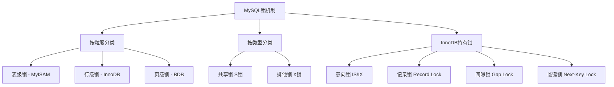

---

## 2. MySQL中有哪些不同的表格?

MySQL 支持多种存储引擎，每种引擎对应不同类型的表格：

| 表格类型 | 说明 |
|----------|------|
| **MyISAM** | MySQL 5.5 之前的默认引擎，不支持事务，速度快，适合读多写少场景 |
| **InnoDB** | MySQL 5.5 之后的默认引擎，支持事务、行级锁、外键 |
| **MEMORY** | 数据存储在内存中，速度极快，重启后数据丢失，适合临时表 |
| **MERGE** | 将多个 MyISAM 表合并为一个逻辑表 |
| **ARCHIVE** | 高压缩比存储，只支持 INSERT 和 SELECT，适合归档数据 |
| **CSV** | 以 CSV 格式存储数据，方便与外部程序交换数据 |
| **BLACKHOLE** | 写入数据直接丢弃，用于主从复制中转 |
| **NDB（Cluster）** | MySQL 集群引擎，支持分布式存储 |

查看当前 MySQL 支持的引擎：
```sql
SHOW ENGINES;
```

---

## 3. 简述在MySQL数据库中MyISAM和InnoDB的区别

这是面试中最高频的问题之一，两种引擎在多个维度上有显著差异。

### 核心区别对比表

| 特性 | MyISAM | InnoDB |
|------|--------|--------|
| 事务支持 | 不支持 | 支持（ACID） |
| 外键约束 | 不支持 | 支持 |
| 锁粒度 | 表级锁 | 行级锁（+ 表级锁） |
| 崩溃恢复 | 不支持自动恢复 | 支持（redo log） |
| 全文索引 | 支持（原生） | MySQL 5.6+ 支持 |
| COUNT(*) 查询 | 极快（保存行数） | 较慢（需扫描） |
| 存储文件 | .frm + .MYD + .MYI | .frm + .ibd |
| 数据缓存 | 只缓存索引 | 缓存索引和数据 |
| 默认版本 | MySQL 5.5 之前 | MySQL 5.5 之后 |

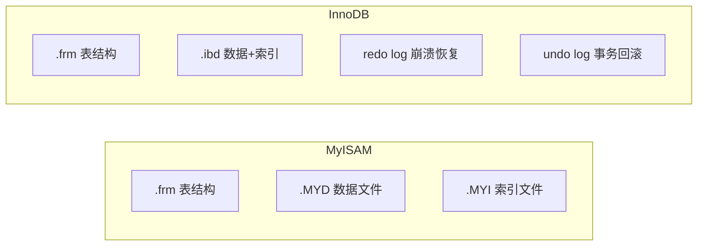

### 如何选择？

- 需要**事务、外键、高并发写入** → 选 InnoDB
- 需要**快速 COUNT(*)、全文检索、只读为主** → 可选 MyISAM（现代项目一般统一用 InnoDB）

---

## 4. MySQL中InnoDB支持的四种事务隔离级别名称，以及逐级之间的区别?

### 四种隔离级别（由低到高）

| 隔离级别 | 脏读 | 不可重复读 | 幻读 |
|----------|------|-----------|------|
| READ UNCOMMITTED（读未提交） | 可能 | 可能 | 可能 |
| READ COMMITTED（读已提交） | 不可能 | 可能 | 可能 |
| REPEATABLE READ（可重复读）默认 | 不可能 | 不可能 | InnoDB 通过 Next-Key Lock 解决 |
| SERIALIZABLE（串行化） | 不可能 | 不可能 | 不可能 |

### 概念解释

- **脏读**：事务 A 读到了事务 B 尚未提交的数据，若 B 回滚，A 读到的就是"脏"数据。
- **不可重复读**：事务 A 两次读同一行，中间事务 B 修改并提交，导致两次读结果不同。
- **幻读**：事务 A 两次查询同一范围，中间事务 B 插入新行并提交，导致第二次多出"幻影行"。

### 设置隔离级别

```sql
-- 查看当前隔离级别
SELECT @@transaction_isolation;

-- 设置会话级别
SET SESSION TRANSACTION ISOLATION LEVEL REPEATABLE READ;

-- 设置全局级别
SET GLOBAL TRANSACTION ISOLATION LEVEL READ COMMITTED;
```

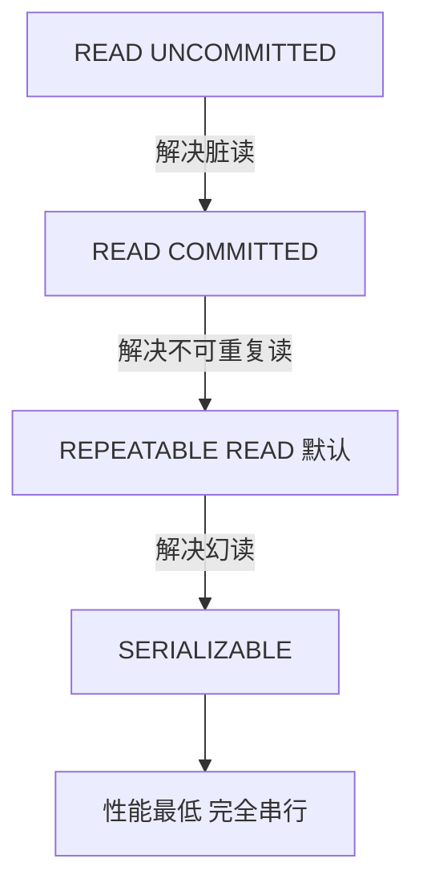

---

## 5. CHAR和VARCHAR的区别?

两者都是字符串类型，但存储方式和使用场景不同。

| 特性 | CHAR | VARCHAR |
|------|------|---------|
| 长度 | 固定长度 | 可变长度 |
| 存储空间 | 始终占用定义长度 | 实际长度 + 1~2 字节长度标记 |
| 最大长度 | 255 个字符 | 65535 字节（受行大小限制） |
| 尾部空格 | 存入时填充，取出时去除 | 保留尾部空格 |
| 速度 | 稍快（固定长度便于计算偏移） | 稍慢 |
| 适用场景 | 固定长度数据：手机号、MD5、身份证 | 长度变化大的数据：用户名、地址 |

```sql
-- CHAR(10) 存 'abc' 实际占 10 个字符（补7个空格）
CREATE TABLE t1 (name CHAR(10));

-- VARCHAR(100) 存 'abc' 只占 3+1=4 字节
CREATE TABLE t2 (name VARCHAR(100));
```

> **记忆技巧**：CHAR = 固定车位（空着也占），VARCHAR = 按需停车（停多少占多少）。

---

## 6. 主键和候选键有什么区别?

- **候选键（Candidate Key）**：能唯一标识表中每一行记录的列或列组合，一张表可以有多个候选键。
- **主键（Primary Key）**：从候选键中选出的一个，作为表的唯一标识符，每张表只能有一个主键，且不允许为 NULL。

### 举例说明

```sql
CREATE TABLE students (
    student_id   INT          NOT NULL,
    id_card      CHAR(18)     NOT NULL,
    email        VARCHAR(100) NOT NULL,
    name         VARCHAR(50),
    PRIMARY KEY (student_id)          -- student_id 被选为主键
    -- id_card 和 email 也是候选键（唯一且非空），但未被选为主键
);
```

| 对比项 | 候选键 | 主键 |
|--------|--------|------|
| 数量 | 可多个 | 只能一个 |
| NULL | 不允许 | 不允许 |
| 是否必须创建索引 | 否 | 是（自动创建唯一索引） |
| 定义 | 理论上可唯一标识行 | 从候选键中选定的那个 |

---

## 7. myisamchk是用来做什么的?

`myisamchk` 是 MySQL 自带的 **MyISAM 表维护工具**，用于检查、修复和优化 MyISAM 表。

### 常用操作

```bash
# 检查表是否损坏
myisamchk /var/lib/mysql/mydb/mytable.MYI

# 修复损坏的表
myisamchk -r /var/lib/mysql/mydb/mytable.MYI

# 优化表（整理碎片）
myisamchk -o /var/lib/mysql/mydb/mytable.MYI

# 快速检查
myisamchk -e /var/lib/mysql/mydb/mytable.MYI
```

### 在 MySQL 内也可以执行类似操作

```sql
CHECK TABLE mytable;
REPAIR TABLE mytable;
OPTIMIZE TABLE mytable;
```

> 注意：使用 `myisamchk` 时，必须先停止 MySQL 服务或锁定表，否则可能导致数据损坏。

---

## 8. 如果一个表有一列定义为TIMESTAMP，将发生什么?

`TIMESTAMP` 类型有一些特殊的自动行为：

### 自动初始化和更新

```sql
CREATE TABLE example (
    id         INT AUTO_INCREMENT PRIMARY KEY,
    name       VARCHAR(50),
    created_at TIMESTAMP DEFAULT CURRENT_TIMESTAMP,           -- 插入时自动填充当前时间
    updated_at TIMESTAMP DEFAULT CURRENT_TIMESTAMP ON UPDATE CURRENT_TIMESTAMP  -- 更新时自动刷新
);
```

### 关键特性

| 特性 | 说明 |
|------|------|
| 存储范围 | 1970-01-01 00:00:01 UTC 到 2038-01-19 03:14:07 UTC |
| 存储大小 | 4 字节 |
| 时区转换 | 存储时转为 UTC，查询时转为当前时区 |
| 自动更新 | 可设置为 `ON UPDATE CURRENT_TIMESTAMP` |
| 默认值 | 第一个 TIMESTAMP 列默认为 `DEFAULT CURRENT_TIMESTAMP ON UPDATE CURRENT_TIMESTAMP` |

> 与 DATETIME 区别：DATETIME 存储范围更大（1000-9999年），不做时区转换，占 8 字节。

---

## 9. 你怎么看到为表格定义的所有索引?

```sql
-- 方法一：SHOW INDEX
SHOW INDEX FROM table_name;

-- 方法二：SHOW KEYS（与 SHOW INDEX 等价）
SHOW KEYS FROM table_name;

-- 方法三：查询 information_schema
SELECT
    INDEX_NAME,
    COLUMN_NAME,
    NON_UNIQUE,
    INDEX_TYPE
FROM information_schema.STATISTICS
WHERE TABLE_SCHEMA = 'your_db'
  AND TABLE_NAME   = 'your_table';
```

`SHOW INDEX` 返回的主要字段说明：

| 字段 | 说明 |
|------|------|
| Key_name | 索引名称，PRIMARY 表示主键 |
| Column_name | 索引列名 |
| Non_unique | 0=唯一索引，1=非唯一索引 |
| Index_type | BTREE / HASH / FULLTEXT |
| Cardinality | 索引列中唯一值的估算数量 |

---

## 10. LIKE声明中的%和_是什么意思?

`LIKE` 用于模糊匹配字符串，有两个通配符：

| 通配符 | 含义 | 示例 |
|--------|------|------|
| `%` | 匹配任意数量的字符（包括零个） | `'%abc'` 匹配以 abc 结尾的任意字符串 |
| `_` | 匹配**恰好一个**任意字符 | `'a_c'` 匹配 abc、adc、a1c 等 |

```sql
-- 查找以 '张' 开头的名字
SELECT * FROM users WHERE name LIKE '张%';

-- 查找名字恰好两个字且以 '李' 开头
SELECT * FROM users WHERE name LIKE '李_';

-- 查找包含 'mysql' 的描述（不区分大小写）
SELECT * FROM articles WHERE content LIKE '%mysql%';

-- 如果要匹配字面量 % 或 _，用 ESCAPE 转义
SELECT * FROM t WHERE col LIKE '50\%' ESCAPE '\';
```

---

## 11. 列对比运算符是什么?

列对比运算符用于在 WHERE 子句中比较列值，MySQL 支持以下运算符：

| 运算符 | 说明 | 示例 |
|--------|------|------|
| `=` | 等于 | `WHERE age = 18` |
| `!=` 或 `<>` | 不等于 | `WHERE status <> 0` |
| `>` | 大于 | `WHERE price > 100` |
| `<` | 小于 | `WHERE score < 60` |
| `>=` | 大于等于 | `WHERE age >= 18` |
| `<=` | 小于等于 | `WHERE level <= 5` |
| `BETWEEN ... AND ...` | 在范围内（含两端） | `WHERE age BETWEEN 18 AND 30` |
| `IN (...)` | 在列表中 | `WHERE city IN ('北京','上海')` |
| `NOT IN (...)` | 不在列表中 | `WHERE id NOT IN (1,2,3)` |
| `IS NULL` | 为空 | `WHERE deleted_at IS NULL` |
| `IS NOT NULL` | 不为空 | `WHERE email IS NOT NULL` |
| `LIKE` | 模糊匹配 | `WHERE name LIKE '张%'` |
| `REGEXP` | 正则匹配 | `WHERE phone REGEXP '^1[3-9]'` |

```sql
-- 综合示例
SELECT * FROM products
WHERE price BETWEEN 50 AND 200
  AND category IN ('电子', '书籍')
  AND deleted_at IS NULL;
```

---

## 12. BLOB和TEXT有什么区别?

两者都用于存储大量数据，核心区别是 **BLOB 存二进制，TEXT 存文本**。

| 特性 | BLOB | TEXT |
|------|------|------|
| 存储内容 | 二进制数据（图片、文件、视频） | 文本字符串 |
| 字符集 | 无字符集概念 | 有字符集，支持排序规则 |
| 大小写敏感 | 是（二进制比较） | 否（按字符集排序规则） |
| 子类型 | TINYBLOB / BLOB / MEDIUMBLOB / LONGBLOB | TINYTEXT / TEXT / MEDIUMTEXT / LONGTEXT |

### 各子类型最大存储容量

| 类型 | 最大容量 |
|------|---------|
| TINY* | 255 字节 |
| * (普通) | 65,535 字节 (~64 KB) |
| MEDIUM* | 16,777,215 字节 (~16 MB) |
| LONG* | 4,294,967,295 字节 (~4 GB) |

> **建议**：实际项目中，大文件不要存数据库，存对象存储（如 OSS / S3），数据库只存 URL。

---

## 13. MySQL_fetch_array和MySQL_fetch_object的区别是什么?

这是早期 PHP 操作 MySQL 时的 API（现已废弃，PHP 7+ 移除，应使用 PDO 或 MySQLi）。

| 函数 | 返回类型 | 访问方式 |
|------|----------|---------|
| `mysql_fetch_array()` | 数组（默认同时返回数字索引和关联索引） | `$row[0]` 或 `$row['name']` |
| `mysql_fetch_object()` | 对象 | `$row->name` |
| `mysql_fetch_row()` | 仅数字索引数组 | `$row[0]` |
| `mysql_fetch_assoc()` | 仅关联数组 | `$row['name']` |

```php
// 旧方式（已废弃）
$result = mysql_query("SELECT id, name FROM users");
$row = mysql_fetch_array($result);   // ['id'=>1, 'name'=>'张三', 0=>1, 1=>'张三']
$obj = mysql_fetch_object($result);  // $obj->id, $obj->name

// 现代推荐：PDO
$pdo = new PDO('mysql:host=localhost;dbname=test', 'user', 'pass');
$stmt = $pdo->query("SELECT id, name FROM users");
$row = $stmt->fetch(PDO::FETCH_ASSOC);   // 关联数组
$obj = $stmt->fetch(PDO::FETCH_OBJ);     // 对象
```

---

## 14. MyISAM表格将在哪里存储，并且还提供其存储格式?

### 存储位置

MyISAM 表存储在 MySQL 数据目录下，按数据库名分子目录存放：

```
/var/lib/mysql/
└── your_database/
    ├── mytable.frm    # 表结构定义
    ├── mytable.MYD    # 数据文件（MY Data）
    └── mytable.MYI    # 索引文件（MY Index）
```

### 三种存储格式

| 格式 | 说明 | 适用场景 |
|------|------|---------|
| **静态（Fixed）** | 所有列都是固定长度，速度最快，损坏易恢复 | 无 VARCHAR/BLOB/TEXT 列时默认 |
| **动态（Dynamic）** | 含可变长度列，存储紧凑但碎片化严重，需定期 OPTIMIZE | 有 VARCHAR/BLOB/TEXT 列时默认 |
| **压缩（Compressed）** | 用 myisampack 工具压缩，只读，磁盘占用极小 | 归档、只读数据 |

```sql
-- 查看表的存储格式
SHOW TABLE STATUS LIKE 'mytable'\G
-- Row_format 字段显示 Fixed / Dynamic / Compressed
```

---

## 15. MySQL如何优化DISTINCT?

`DISTINCT` 用于去除重复行，MySQL 的优化策略如下：

### MySQL 的处理方式

1. **利用索引**：如果 DISTINCT 列上有索引，MySQL 可以直接扫描索引去重，无需额外排序。
2. **与 ORDER BY 结合**：若无法用索引，MySQL 先排序再去重。
3. **与 GROUP BY 等价转换**：很多情况下 `SELECT DISTINCT col` 等价于 `SELECT col GROUP BY col`，优化器可能互相转换。

```sql
-- 低效：全表扫描后去重
SELECT DISTINCT city FROM users;

-- 优化：city 列加索引后，扫描索引即可
CREATE INDEX idx_city ON users(city);
SELECT DISTINCT city FROM users;

-- DISTINCT + LIMIT 组合：找到足够不重复行后立即停止
SELECT DISTINCT city FROM users LIMIT 10;
```

### 注意事项

- `DISTINCT` 作用于**所有选择的列**，`SELECT DISTINCT a, b` 是对 (a, b) 组合去重。
- 能用 `GROUP BY` 替代的场景，`GROUP BY` 通常性能更可控。

---

## 16. 如何显示前50行?

```sql
-- 基本语法：LIMIT n 表示取前 n 行
SELECT * FROM table_name LIMIT 50;

-- 等价写法（从第0行开始取50行）
SELECT * FROM table_name LIMIT 0, 50;

-- 带条件和排序的前50行
SELECT * FROM orders
WHERE status = 1
ORDER BY created_at DESC
LIMIT 50;
```

### 分页查询

```sql
-- 第1页（前50条）
SELECT * FROM table_name LIMIT 50 OFFSET 0;

-- 第2页（第51-100条）
SELECT * FROM table_name LIMIT 50 OFFSET 50;

-- 第n页通用公式
-- LIMIT 每页数量 OFFSET (页码-1)*每页数量
SELECT * FROM table_name LIMIT 50 OFFSET (n-1)*50;
```

> **深度分页性能问题**：`LIMIT 50 OFFSET 1000000` 会扫描 100 万行再丢弃，非常慢。优化方式是用**游标分页**（记录上次最大 ID）：
> ```sql
> SELECT * FROM table_name WHERE id > last_id ORDER BY id LIMIT 50;
> ```

---

## 17. 可以使用多少列创建索引?

MySQL 对联合索引的列数有限制：

| 限制项 | 值 |
|--------|-----|
| 单个索引最多列数 | **16 列** |
| 索引键总长度（InnoDB） | **3072 字节**（MySQL 5.7+ ROW_FORMAT=DYNAMIC） |
| 索引键总长度（旧版 InnoDB） | **767 字节** |

```sql
-- 创建联合索引（最多16列，但实际超过3列就要谨慎）
CREATE INDEX idx_multi ON orders (user_id, status, created_at);

-- 查看索引长度
SHOW INDEX FROM orders;
-- Key_length 字段显示索引占用的字节数
```

### 实际建议

- **不要创建超过 3~4 列的联合索引**，维护代价大，命中率低。
- 遵循**最左前缀原则**：联合索引 (a, b, c) 可以被 a、(a,b)、(a,b,c) 命中，但不能被单独 b 或 c 命中。

---

## 18. NOW()和CURRENT_DATE()有什么区别?

| 函数 | 返回值 | 示例结果 |
|------|--------|---------|
| `NOW()` | 当前日期 + 时间 | `2026-05-19 14:30:00` |
| `CURRENT_DATE()` 或 `CURDATE()` | 仅当前日期 | `2026-05-19` |
| `CURRENT_TIME()` 或 `CURTIME()` | 仅当前时间 | `14:30:00` |
| `SYSDATE()` | 函数执行时的时间（与 NOW() 略有差异） | `2026-05-19 14:30:01` |

```sql
SELECT NOW();            -- 2026-05-19 14:30:00
SELECT CURDATE();        -- 2026-05-19
SELECT CURTIME();        -- 14:30:00
SELECT UNIX_TIMESTAMP(); -- 1747650600（Unix 时间戳）

-- 实际应用：查询今天的订单
SELECT * FROM orders WHERE DATE(created_at) = CURDATE();

-- 查询最近7天的数据
SELECT * FROM orders WHERE created_at >= DATE_SUB(NOW(), INTERVAL 7 DAY);
```

---

## 19. 什么是非标准字符串类型?

MySQL 除了标准的 CHAR 和 VARCHAR 外，还提供以下非标准（MySQL 扩展）字符串类型：

| 类型 | 说明 |
|------|------|
| **TINYTEXT** | 最大 255 字节的文本 |
| **TEXT** | 最大 65,535 字节的文本 |
| **MEDIUMTEXT** | 最大 16 MB 的文本 |
| **LONGTEXT** | 最大 4 GB 的文本 |
| **TINYBLOB** | 最大 255 字节的二进制数据 |
| **BLOB** | 最大 65,535 字节的二进制数据 |
| **MEDIUMBLOB** | 最大 16 MB 的二进制数据 |
| **LONGBLOB** | 最大 4 GB 的二进制数据 |
| **ENUM** | 枚举类型，从预定义列表中取一个值 |
| **SET** | 集合类型，可从预定义列表中取多个值 |

```sql
-- ENUM 示例
CREATE TABLE users (
    gender ENUM('male', 'female', 'other') DEFAULT 'other'
);

-- SET 示例
CREATE TABLE articles (
    tags SET('技术', '生活', '旅游', '美食')
);
INSERT INTO articles (tags) VALUES ('技术,旅游');
```

---

## 20. 什么是通用SQL函数?

SQL 通用函数按功能分为以下几类：

### 字符串函数

```sql
SELECT CONCAT('Hello', ' ', 'World');      -- Hello World
SELECT LENGTH('MySQL');                    -- 5（字节数）
SELECT CHAR_LENGTH('你好');                -- 2（字符数）
SELECT UPPER('mysql');                     -- MYSQL
SELECT LOWER('MYSQL');                     -- mysql
SELECT SUBSTRING('MySQL面试', 1, 5);       -- MySQL
SELECT TRIM('  hello  ');                  -- hello
SELECT REPLACE('abc', 'b', 'x');           -- axc
SELECT LPAD('7', 3, '0');                  -- 007
```

### 数值函数

```sql
SELECT ABS(-5);          -- 5
SELECT CEIL(4.1);         -- 5（向上取整）
SELECT FLOOR(4.9);        -- 4（向下取整）
SELECT ROUND(4.56, 1);    -- 4.6（四舍五入）
SELECT MOD(10, 3);        -- 1（取余）
SELECT RAND();            -- 0~1 之间随机数
SELECT POW(2, 10);        -- 1024
```

### 日期函数

```sql
SELECT NOW();                              -- 当前日期时间
SELECT CURDATE();                          -- 当前日期
SELECT DATE_ADD(NOW(), INTERVAL 7 DAY);   -- 7天后
SELECT DATEDIFF('2026-12-31', '2026-01-01'); -- 相差天数
SELECT YEAR(NOW());                        -- 当前年份
SELECT DATE_FORMAT(NOW(), '%Y-%m-%d');     -- 格式化日期
```

### 聚合函数

```sql
SELECT COUNT(*) FROM orders;               -- 行数
SELECT SUM(amount) FROM orders;            -- 求和
SELECT AVG(score) FROM students;           -- 平均值
SELECT MAX(price) FROM products;           -- 最大值
SELECT MIN(price) FROM products;           -- 最小值
```

### 条件函数

```sql
SELECT IF(score >= 60, '及格', '不及格') FROM students;
SELECT IFNULL(phone, '未填写') FROM users;
SELECT COALESCE(phone, email, '无联系方式') FROM users;
SELECT CASE status WHEN 1 THEN '启用' WHEN 0 THEN '禁用' ELSE '未知' END FROM users;
```

---

## 21. MySQL支持事务吗?

**支持，但取决于存储引擎。**

| 存储引擎 | 是否支持事务 |
|----------|-------------|
| InnoDB | 支持（推荐） |
| MyISAM | 不支持 |
| MEMORY | 不支持 |
| ARCHIVE | 不支持 |

### 事务的四个特性（ACID）

- **原子性（Atomicity）**：事务中的所有操作要么全部成功，要么全部回滚。
- **一致性（Consistency）**：事务执行前后，数据库从一个合法状态变到另一个合法状态。
- **隔离性（Isolation）**：多个并发事务互不干扰。
- **持久性（Durability）**：事务提交后，数据永久保存，即使系统崩溃也不会丢失。

### 事务操作示例

```sql
-- 开启事务
START TRANSACTION;

-- 转账：A 扣款
UPDATE accounts SET balance = balance - 100 WHERE id = 1;
-- 转账：B 收款
UPDATE accounts SET balance = balance + 100 WHERE id = 2;

-- 如果两步都成功，提交
COMMIT;

-- 如果中间出错，回滚
ROLLBACK;

-- 设置保存点（部分回滚）
SAVEPOINT sp1;
ROLLBACK TO SAVEPOINT sp1;
```

### 自动提交（autocommit）

```sql
-- 查看 autocommit 状态（默认为 1，即每条 SQL 自动提交）
SELECT @@autocommit;

-- 关闭自动提交
SET autocommit = 0;
```

---

## 22. MySQL里记录货币用什么字段类型好?

推荐使用 **DECIMAL（定点数）**，不要用 FLOAT 或 DOUBLE。

### 为什么不能用 FLOAT/DOUBLE？

浮点数在计算机内部是二进制近似表示，会产生精度损失：

```sql
-- 危险示例：FLOAT 精度丢失
CREATE TABLE t (price FLOAT);
INSERT INTO t VALUES (19.99);
SELECT price FROM t;  -- 可能返回 19.989999771118164
```

### 正确做法：DECIMAL

```sql
-- DECIMAL(M, D)：M 总位数，D 小数位数
-- DECIMAL(10, 2) 可存储最大 99999999.99
CREATE TABLE products (
    price   DECIMAL(10, 2) NOT NULL COMMENT '价格，单位：元',
    discount DECIMAL(4, 2)  DEFAULT 1.00 COMMENT '折扣率'
);
```

| 方案 | 优点 | 缺点 |
|------|------|------|
| DECIMAL(10,2) | 精确，无精度丢失 | 存储略大 |
| INT（存分） | 计算最快，无精度问题 | 业务层需除以100 |
| FLOAT/DOUBLE | 存储小 | 精度丢失，严禁用于货币 |

> **最佳实践**：金融系统推荐用整型存"分"（如 1999 表示 ¥19.99），彻底规避小数问题。

---

## 23. MySQL有关权限的表都有哪几个?

MySQL 将权限信息存储在 `mysql` 系统数据库的以下几张表中：

| 表名 | 说明 |
|------|------|
| `mysql.user` | 全局权限，包含用户名、密码、全局级别的权限 |
| `mysql.db` | 数据库级别权限 |
| `mysql.tables_priv` | 表级别权限 |
| `mysql.columns_priv` | 列级别权限 |
| `mysql.procs_priv` | 存储过程/函数级别权限 |
| `mysql.proxies_priv` | 代理用户权限 |

### 权限验证顺序（由大到小）

```
全局权限（user表）→ 数据库权限（db表）→ 表权限（tables_priv）→ 列权限（columns_priv）
```

### 常用权限操作

```sql
-- 创建用户
CREATE USER 'dev'@'localhost' IDENTIFIED BY 'password123';

-- 授权
GRANT SELECT, INSERT, UPDATE ON mydb.* TO 'dev'@'localhost';

-- 查看权限
SHOW GRANTS FOR 'dev'@'localhost';

-- 撤销权限
REVOKE INSERT ON mydb.* FROM 'dev'@'localhost';

-- 刷新权限（修改 mysql 系统表后需执行）
FLUSH PRIVILEGES;
```

---

## 24. 列的字符串类型可以是什么?

MySQL 支持的字符串类型汇总：

| 类型 | 最大长度 | 特点 |
|------|---------|------|
| `CHAR(n)` | 255 字符 | 固定长度，不足补空格 |
| `VARCHAR(n)` | 65535 字节 | 可变长度，有长度前缀 |
| `TINYTEXT` | 255 字节 | 小文本 |
| `TEXT` | 65,535 字节 | 普通文本 |
| `MEDIUMTEXT` | 16,777,215 字节 | 中等文本 |
| `LONGTEXT` | 4,294,967,295 字节 | 大文本 |
| `TINYBLOB` | 255 字节 | 小二进制 |
| `BLOB` | 65,535 字节 | 普通二进制 |
| `MEDIUMBLOB` | 16 MB | 中等二进制 |
| `LONGBLOB` | 4 GB | 大二进制 |
| `ENUM(val1,val2,...)` | 65535 个成员 | 枚举，只能选一个 |
| `SET(val1,val2,...)` | 64 个成员 | 集合，可选多个 |

### 选择建议

- 短固定长度字符串（MD5、手机号）→ `CHAR`
- 普通变长字符串（用户名、标题）→ `VARCHAR`
- 长文章内容 → `TEXT` 系列
- 二进制文件 → 尽量不存数据库，必须存则用 `BLOB` 系列

---

## 25. MySQL数据库作发布系统的存储，一天五万条以上的增量，预计运维三年，怎么优化?

三年累计数据量约：5万/天 × 365天 × 3年 = **5400万行**，属于中大型表，需要系统性规划。

### 1. 表结构设计优化

```sql
-- 主键用自增 BIGINT，避免 INT 溢出
CREATE TABLE articles (
    id          BIGINT UNSIGNED AUTO_INCREMENT PRIMARY KEY,
    title       VARCHAR(200) NOT NULL,
    content     MEDIUMTEXT,
    author_id   INT UNSIGNED NOT NULL,
    status      TINYINT(1)   NOT NULL DEFAULT 1,
    created_at  DATETIME     NOT NULL DEFAULT CURRENT_TIMESTAMP,
    INDEX idx_author (author_id),
    INDEX idx_status_created (status, created_at)
) ENGINE=InnoDB DEFAULT CHARSET=utf8mb4;
```

### 2. 分区表（Partitioning）

```sql
-- 按年份分区，每年约1800万行独立存储
ALTER TABLE articles
PARTITION BY RANGE (YEAR(created_at)) (
    PARTITION p2024 VALUES LESS THAN (2025),
    PARTITION p2025 VALUES LESS THAN (2026),
    PARTITION p2026 VALUES LESS THAN (2027),
    PARTITION p_future VALUES LESS THAN MAXVALUE
);
```

### 3. 归档策略

- 超过一定时间的历史数据迁移到归档表（ARCHIVE 引擎）或冷库
- 保持主表热数据量可控

### 4. 读写分离

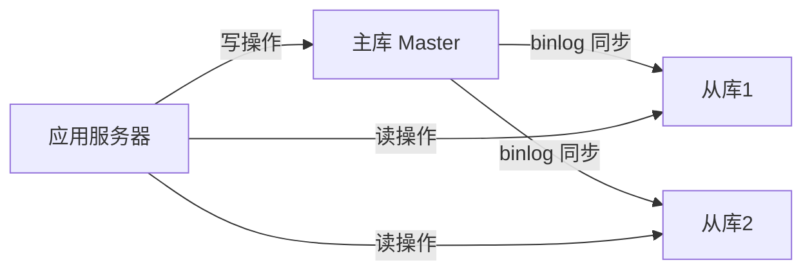

### 5. 综合优化清单

| 方向 | 措施 |
|------|------|
| 索引 | 针对高频查询字段建联合索引 |
| 缓存 | Redis 缓存热点数据，减少 DB 读压力 |
| 分区 | 按时间分区，加速范围查询和归档删除 |
| 读写分离 | 主库写，从库读，分担压力 |
| 定期维护 | OPTIMIZE TABLE 整理碎片，ANALYZE TABLE 更新统计信息 |
| 慢查询 | 开启 slow_query_log，定期分析 EXPLAIN |

---

## 26. 锁的优化策略

### 核心原则：缩短锁持有时间，降低锁粒度

```sql
-- 坏例子：事务内有耗时操作，长时间持锁
START TRANSACTION;
SELECT * FROM inventory WHERE id = 1 FOR UPDATE;
-- ... 此处调用外部接口，耗时2秒 ...
UPDATE inventory SET stock = stock - 1 WHERE id = 1;
COMMIT;

-- 好例子：先做计算，再开事务快速提交
-- 1. 先查询（不加锁）
SELECT stock FROM inventory WHERE id = 1;
-- 2. 业务逻辑处理（在事务外）
-- 3. 短事务快速执行
START TRANSACTION;
UPDATE inventory SET stock = stock - 1 WHERE id = 1 AND stock > 0;
COMMIT;
```

### 具体优化策略

1. **使用行级锁而非表级锁**：InnoDB 行锁基于索引，确保 WHERE 条件命中索引，否则退化为表锁。
2. **减小事务范围**：事务中只包含必要的 SQL，避免把网络调用等耗时操作放在事务内。
3. **按固定顺序访问资源**：多个事务操作多张表时，按相同顺序加锁，防止死锁。
4. **乐观锁代替悲观锁**：低冲突场景下用版本号机制。

```sql
-- 乐观锁示例（version 字段）
-- 读取时记录 version
SELECT id, stock, version FROM inventory WHERE id = 1;
-- 更新时检查 version 是否变化
UPDATE inventory
SET stock = stock - 1, version = version + 1
WHERE id = 1 AND version = #{读取到的version};
-- 若影响行数为0，说明数据已被其他人修改，重试
```

5. **设置锁等待超时**：避免长时间等待锁导致连接积压。

```sql
SET innodb_lock_wait_timeout = 5;  -- 等待超过5秒自动失败
```

---

## 27. 索引的底层实现原理和优化

### B+Tree 索引结构（InnoDB 默认）

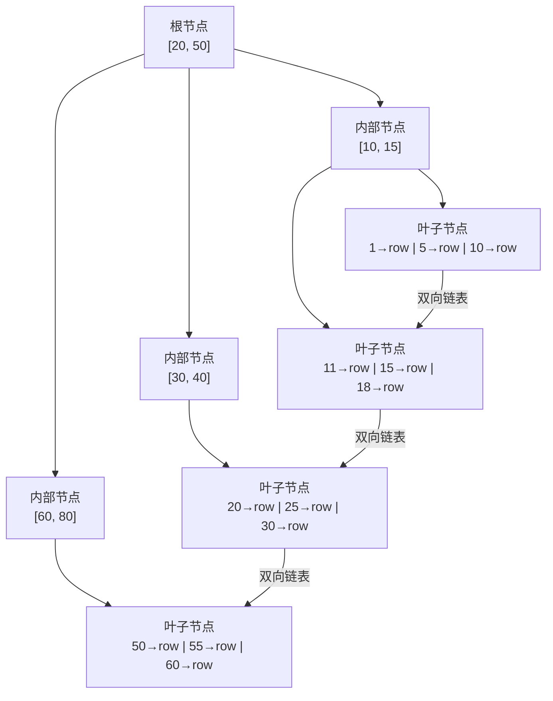

**B+Tree 特点：**
- 所有数据都存在**叶子节点**，内部节点只存键值用于导航
- 叶子节点通过**双向链表**连接，支持范围查询
- 树高度一般为 3~4 层，亿级数据只需 3~4 次 IO

### 聚簇索引 vs 非聚簇索引

| 类型 | 说明 | InnoDB 中 |
|------|------|-----------|
| 聚簇索引 | 索引和数据存在一起，叶子节点存完整行数据 | 主键索引即聚簇索引 |
| 非聚簇索引（二级索引） | 叶子节点存主键值，需回表查完整数据 | 普通索引 |

```sql
-- 覆盖索引：查询的列恰好在索引中，无需回表
CREATE INDEX idx_name_age ON users(name, age);
-- 只查 name 和 age，直接从索引返回，不回表
SELECT name, age FROM users WHERE name = '张三';
```

### 索引优化要点

```sql
-- 1. 最左前缀原则
-- 联合索引 (a, b, c) 可命中的情况
WHERE a = 1               -- ✓
WHERE a = 1 AND b = 2     -- ✓
WHERE a = 1 AND b = 2 AND c = 3  -- ✓
WHERE b = 2               -- ✗（跳过了a）

-- 2. 不要在索引列上做函数运算
SELECT * FROM users WHERE YEAR(created_at) = 2026;  -- ✗ 索引失效
SELECT * FROM users WHERE created_at >= '2026-01-01' AND created_at < '2027-01-01';  -- ✓

-- 3. 使用 EXPLAIN 分析索引使用情况
EXPLAIN SELECT * FROM orders WHERE user_id = 100 AND status = 1;
```

---

## 28. 什么情况下设置了索引但无法使用?

以下情况会导致索引失效，MySQL 退化为全表扫描：

### 1. 在索引列上使用函数或表达式

```sql
-- ✗ 失效：对列做函数运算
SELECT * FROM users WHERE LEFT(name, 2) = '张三';
SELECT * FROM orders WHERE YEAR(created_at) = 2026;

-- ✓ 改写：让索引列保持原样
SELECT * FROM users WHERE name LIKE '张三%';
SELECT * FROM orders WHERE created_at BETWEEN '2026-01-01' AND '2026-12-31 23:59:59';
```

### 2. 隐式类型转换

```sql
-- ✗ 失效：phone 是 VARCHAR，传入数字，MySQL 会做类型转换
SELECT * FROM users WHERE phone = 13812345678;

-- ✓ 保持类型一致
SELECT * FROM users WHERE phone = '13812345678';
```

### 3. 联合索引不满足最左前缀

```sql
-- 联合索引 (a, b, c)
WHERE b = 1           -- ✗ 跳过 a
WHERE a = 1 AND c = 3 -- ✗ 跳过 b，c 部分无法用索引
WHERE a = 1           -- ✓
WHERE a = 1 AND b = 2 -- ✓
```

### 4. LIKE 以通配符开头

```sql
SELECT * FROM users WHERE name LIKE '%张'; -- ✗ 前缀不固定，全表扫描
SELECT * FROM users WHERE name LIKE '张%'; -- ✓ 前缀固定，可用索引
```

### 5. IS NULL / IS NOT NULL（视情况）

- 旧版本 MySQL 中 `IS NULL` 可能不走索引；MySQL 8.0 已优化，能走索引。

### 6. 使用 OR 连接非索引列

```sql
-- ✗ 如果 email 没有索引，整个 OR 条件可能导致全表扫描
SELECT * FROM users WHERE phone = '138...' OR email = 'test@test.com';

-- ✓ 改写为 UNION
SELECT * FROM users WHERE phone = '138...'
UNION
SELECT * FROM users WHERE email = 'test@test.com';
```

### 7. 数据量过少或区分度低

- 如果索引列的值绝大多数相同（如 status 只有 0/1），优化器可能认为全表扫描更快而放弃索引。

### 8. 使用 != 或 NOT IN

```sql
SELECT * FROM users WHERE status != 1; -- 可能全表扫描
```

---

## 29. 实践中如何优化MySQL?

### 层次一：SQL 和索引优化（成本最低，效果最大）

```sql
-- 1. 用 EXPLAIN 分析执行计划
EXPLAIN SELECT * FROM orders o
JOIN users u ON o.user_id = u.id
WHERE o.status = 1 AND o.created_at > '2026-01-01';

-- 重点关注：type 列（ALL=全表扫描，最差；ref/range=较好；const=最好）
-- 重点关注：Extra 列（Using filesort / Using temporary 是性能警告）
```

### 层次二：表结构优化

- 选择合适的数据类型（能用 INT 不用 BIGINT，能用 TINYINT 不用 INT）
- 字段不允许 NULL 时设置 NOT NULL（NULL 比较特殊，会影响索引和查询）
- 大字段（TEXT/BLOB）单独放一张表，主表只存引用

### 层次三：数据库配置调优

```ini
# my.cnf 关键参数
innodb_buffer_pool_size = 4G        # InnoDB 缓冲池，建议设为物理内存的 60-80%
innodb_log_file_size = 512M         # redo log 文件大小
max_connections = 500               # 最大连接数
query_cache_type = 0                # MySQL 8.0 已移除查询缓存
slow_query_log = 1                  # 开启慢查询日志
long_query_time = 1                 # 超过1秒记录慢查询
```

### 层次四：架构优化

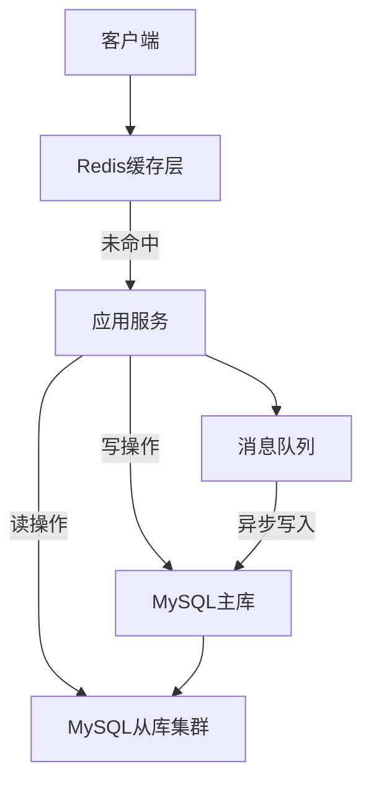

---

## 30. 优化数据库的方法

系统性总结优化数据库的各个维度：

### 1. 硬件层面

- 使用 SSD 替代机械硬盘，随机 IO 性能提升 10~100 倍
- 增加内存，扩大 `innodb_buffer_pool_size`
- 多核 CPU，提高并发处理能力

### 2. 数据库配置

| 参数 | 建议值 | 说明 |
|------|--------|------|
| `innodb_buffer_pool_size` | 物理内存的 70% | 最重要的参数 |
| `innodb_flush_log_at_trx_commit` | 2（非金融业务） | 1=最安全但慢，2=性能好稍有风险 |
| `sync_binlog` | 1 | binlog 刷盘策略 |
| `max_connections` | 按需设置 | 过大反而影响性能 |

### 3. 表设计

- 垂直分表：将大字段（如详情、内容）拆到单独表
- 水平分表：单表超过 500万~1000万行时考虑分表
- 使用合适的字段类型和长度

### 4. SQL 优化

- 避免 `SELECT *`，只取需要的列
- 用 `JOIN` 代替子查询（某些场景）
- 批量操作代替循环单条操作

```sql
-- ✗ 慢：循环1000次单条插入
INSERT INTO logs VALUES (...);

-- ✓ 快：批量插入
INSERT INTO logs VALUES (...), (...), (...); -- 一次插入多行
```

### 5. 缓存策略

- 热点数据放 Redis，减少数据库读压力
- 合理设置缓存失效时间，避免缓存击穿

---

## 31. 简单描述MySQL中，索引，主键，唯一索引，联合索引的区别，对数据库的性能有什么影响(从读写两方面)

### 各类索引定义

| 索引类型 | 说明 | 允许 NULL | 允许重复 |
|----------|------|-----------|---------|
| **普通索引（INDEX）** | 最基本的索引，无约束 | 是 | 是 |
| **唯一索引（UNIQUE）** | 索引列值必须唯一 | 是（可多个NULL） | 否 |
| **主键索引（PRIMARY KEY）** | 唯一且非空，每表只能有一个 | 否 | 否 |
| **联合索引（复合索引）** | 多列组合成一个索引 | 视列定义 | 视是否唯一 |
| **全文索引（FULLTEXT）** | 用于全文搜索 | 是 | 是 |

### 对读性能的影响

- **加快查询速度**：索引让 MySQL 避免全表扫描，在亿级数据中可将查询从秒级降到毫秒级。
- **覆盖索引**：查询列全部在索引中，无需回表，读性能极佳。
- **联合索引**：遵循最左前缀原则，合理设计可覆盖多种查询模式。

### 对写性能的影响

- **增加写开销**：每次 INSERT / UPDATE / DELETE，MySQL 需同步更新所有相关索引的 B+Tree 结构。
- **索引越多，写越慢**：每个额外索引约增加 10%~20% 的写入开销。
- **主键选择影响写性能**：
  - 自增主键：顺序写入叶子节点，IO 集中，写入高效。
  - UUID/随机主键：随机写入 B+Tree 各处，导致页分裂，写入性能差。

```sql
-- 建表最佳实践：自增主键 + 针对查询场景建联合索引
CREATE TABLE orders (
    id         BIGINT UNSIGNED AUTO_INCREMENT PRIMARY KEY,  -- 自增主键
    user_id    INT UNSIGNED    NOT NULL,
    status     TINYINT         NOT NULL DEFAULT 0,
    created_at DATETIME        NOT NULL DEFAULT CURRENT_TIMESTAMP,
    UNIQUE KEY uk_order_no (order_no),                      -- 唯一索引
    INDEX idx_user_status (user_id, status),                -- 联合索引（覆盖高频查询）
    INDEX idx_created (created_at)                          -- 时间范围查询
);
```

---

## 32. 数据库中的事务是什么?

事务（Transaction）是数据库操作的最小逻辑单元，它将一组 SQL 操作"打包"成一个整体，**要么全部成功，要么全部失败**。

### 经典案例：银行转账

```sql
START TRANSACTION;

-- 步骤1：A 账户扣款
UPDATE accounts SET balance = balance - 500 WHERE account_id = 'A';

-- 步骤2：B 账户入账
UPDATE accounts SET balance = balance + 500 WHERE account_id = 'B';

-- 两步都成功才提交
COMMIT;

-- 任意一步失败则回滚，保持数据一致
ROLLBACK;
```

如果没有事务，步骤1成功后系统崩溃，A 扣了钱但 B 没收到，钱凭空消失——这就是事务要解决的问题。

### ACID 特性详解

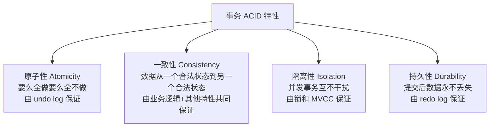

### 事务的实现机制

- **undo log**：保存操作前的旧数据，用于回滚（保证原子性）
- **redo log**：记录物理页的修改，崩溃后重做（保证持久性）
- **MVCC（多版本并发控制）**：读不加锁，通过版本链实现隔离（提升并发）

---

## 33. SQL注入漏洞产生的原因?如何防止?

### 产生原因

SQL 注入是将用户输入直接拼接到 SQL 语句中执行，导致攻击者可以改变 SQL 逻辑。

```php
// ✗ 危险代码：直接拼接用户输入
$username = $_GET['username'];  // 攻击者输入：' OR '1'='1
$sql = "SELECT * FROM users WHERE username = '$username'";
// 实际执行：SELECT * FROM users WHERE username = '' OR '1'='1'
// 结果：绕过认证，返回所有用户数据
```

更危险的例子：

```sql
-- 攻击者输入：'; DROP TABLE users; --
-- 实际执行：SELECT * FROM users WHERE username = ''; DROP TABLE users; --'
-- 后果：users 表被删除！
```

### 防止方法

**1. 使用参数化查询（预处理语句）—— 最有效的方法**

```php
// ✓ PHP PDO 参数化查询
$stmt = $pdo->prepare("SELECT * FROM users WHERE username = ? AND password = ?");
$stmt->execute([$username, $password]);

// ✓ PHP MySQLi
$stmt = $mysqli->prepare("SELECT * FROM users WHERE username = ?");
$stmt->bind_param("s", $username);
$stmt->execute();
```

```java
// ✓ Java JDBC 参数化查询
PreparedStatement stmt = conn.prepareStatement(
    "SELECT * FROM users WHERE username = ? AND password = ?"
);
stmt.setString(1, username);
stmt.setString(2, password);
```

**2. 输入验证和过滤**

```php
// 验证输入格式
if (!preg_match('/^[a-zA-Z0-9_]{3,20}$/', $username)) {
    die('用户名格式不合法');
}
```

**3. 最小权限原则**

```sql
-- Web 应用账号只给必要权限，不给 DROP、CREATE 等权限
GRANT SELECT, INSERT, UPDATE ON mydb.* TO 'webapp'@'localhost';
```

**4. 开启 WAF（Web 应用防火墙）**

**5. 错误信息不暴露给前端**（避免攻击者获取数据库结构信息）

---

## 34. 为表中的字段选择合适的数据类型

原则：**够用即可，越小越好**，小类型占用空间少，查询更快，内存利用率更高。

### 整数类型选择

| 类型 | 范围（有符号） | 字节 | 适用场景 |
|------|-------------|------|---------|
| TINYINT | -128 ~ 127 | 1 | 状态、标志位（0/1/2） |
| SMALLINT | -32768 ~ 32767 | 2 | 年龄、数量（小范围） |
| MEDIUMINT | -8M ~ 8M | 3 | 中等整数 |
| INT | -2.1B ~ 2.1B | 4 | 普通 ID、计数 |
| BIGINT | -9.2×10¹⁸ ~ ... | 8 | 超大 ID、时间戳毫秒数 |

### 字符串类型选择

```sql
-- 手机号：固定11位 → CHAR(11)
phone CHAR(11) NOT NULL

-- 用户名：变长 → VARCHAR
username VARCHAR(50) NOT NULL

-- 文章内容：长文本 → TEXT
content MEDIUMTEXT

-- 性别：枚举 → ENUM（存储仅需1字节）
gender ENUM('M', 'F', 'U') DEFAULT 'U'
```

### 日期时间类型选择

| 类型 | 范围 | 字节 | 选择建议 |
|------|------|------|---------|
| DATE | 1000-01-01 ~ 9999-12-31 | 3 | 只需日期 |
| TIME | -838:59:59 ~ 838:59:59 | 3 | 只需时间 |
| DATETIME | 1000 ~ 9999年 | 8 | 通用创建/更新时间 |
| TIMESTAMP | 1970 ~ 2038年 | 4 | 需要时区转换时 |
| INT UNSIGNED | Unix时间戳 | 4 | 高性能场景（用整数存时间戳） |

### 其他建议

- **IP 地址**：用 `INT UNSIGNED` 存储（`INET_ATON()` 转换），比 VARCHAR 节省空间且可做范围查询
- **金额**：用 `DECIMAL(10,2)` 或 `BIGINT`（存分）
- **布尔值**：用 `TINYINT(1)`，值 0 或 1

---

## 35. 存储时期

"存储时期"指的是在数据库中存储日期和时间数据的方式选择。

### 常用日期时间类型对比

| 类型 | 格式 | 范围 | 字节数 | 时区处理 |
|------|------|------|--------|---------|
| `DATE` | YYYY-MM-DD | 1000-01-01 ~ 9999-12-31 | 3 | 无 |
| `TIME` | HH:MM:SS | -838:59:59 ~ 838:59:59 | 3 | 无 |
| `DATETIME` | YYYY-MM-DD HH:MM:SS | 1000 ~ 9999年 | 8 | 不转换 |
| `TIMESTAMP` | YYYY-MM-DD HH:MM:SS | 1970-01-01 ~ 2038-01-19 | 4 | 自动转换为 UTC |
| `YEAR` | YYYY | 1901 ~ 2155 | 1 | 无 |

### 选择建议

```sql
-- 创建时间、更新时间 → DATETIME（不受2038年限制）
CREATE TABLE posts (
    id         INT AUTO_INCREMENT PRIMARY KEY,
    title      VARCHAR(200) NOT NULL,
    created_at DATETIME NOT NULL DEFAULT CURRENT_TIMESTAMP,
    updated_at DATETIME NOT NULL DEFAULT CURRENT_TIMESTAMP ON UPDATE CURRENT_TIMESTAMP
);

-- 需要跨时区的应用 → TIMESTAMP（自动转换时区）
-- 或者统一存 UTC 时间的 DATETIME + 应用层转换

-- 只存日期（生日、节假日）→ DATE
birthday DATE

-- 高性能场景：存 Unix 时间戳整数，便于计算和比较
event_time INT UNSIGNED  -- 用 UNIX_TIMESTAMP() 和 FROM_UNIXTIME() 转换
```

### DATETIME vs TIMESTAMP 关键区别

```sql
-- 修改时区后 TIMESTAMP 会变，DATETIME 不变
SET time_zone = '+08:00';
INSERT INTO t (ts_col, dt_col) VALUES (NOW(), NOW());

SET time_zone = '+00:00';
SELECT ts_col, dt_col FROM t;
-- ts_col 变为 UTC 时间（减8小时）
-- dt_col 保持原样不变
```

---

## 36. 对于关系型数据库而言，索引是相当重要的概念，请回答有关索引的几个问题

### (1) 什么是索引？

索引是数据库表中一列或多列的值构成的**有序数据结构**，类似于书的目录，帮助数据库快速定位数据，避免全表扫描。

### (2) 索引的优缺点

| 方面 | 说明 |
|------|------|
| 优点 | 大幅加速 SELECT 查询、ORDER BY 排序、JOIN 连接 |
| 缺点 | 占用额外磁盘空间；INSERT/UPDATE/DELETE 需维护索引，降低写性能 |

### (3) 什么情况下应该建索引？

```sql
-- 1. 频繁出现在 WHERE 条件中的列
SELECT * FROM orders WHERE user_id = 100;  -- user_id 建索引

-- 2. 频繁用于 ORDER BY / GROUP BY 的列
SELECT * FROM orders ORDER BY created_at DESC;  -- created_at 建索引

-- 3. 用于 JOIN 的关联列
SELECT * FROM orders o JOIN users u ON o.user_id = u.id;  -- user_id 建索引

-- 4. 区分度高的列（不适合布尔类型字段）
```

### (4) 什么情况下不应该建索引？

- 表数据量很小（全表扫描可能比索引更快）
- 列的区分度很低（如性别字段只有两个值）
- 频繁更新的列（维护索引代价高）
- 不在 WHERE/ORDER BY/JOIN 中使用的列

### (5) 如何查看索引是否被使用？

```sql
-- 使用 EXPLAIN 查看执行计划
EXPLAIN SELECT * FROM orders WHERE user_id = 100\G

-- 关键字段说明：
-- type: ALL(全表) < index < range < ref < eq_ref < const（越右越好）
-- key: 实际使用的索引名，NULL 表示未使用索引
-- rows: 估算扫描行数，越小越好
-- Extra: Using index（覆盖索引，很好）/ Using filesort（需要优化）
```

### (6) 索引类型

```sql
-- 普通索引
CREATE INDEX idx_name ON users(name);

-- 唯一索引
CREATE UNIQUE INDEX uk_email ON users(email);

-- 联合索引
CREATE INDEX idx_user_status ON orders(user_id, status);

-- 前缀索引（对长字符串只索引前N个字符）
CREATE INDEX idx_title ON articles(title(20));

-- 全文索引
CREATE FULLTEXT INDEX ft_content ON articles(content);
```

---

## 37. 解释MySQL外连接、内连接与自连接的区别

### 内连接（INNER JOIN）

只返回两张表中**都满足连接条件**的行，不满足条件的行被丢弃。

```sql
-- 查询有订单的用户（没有订单的用户不显示）
SELECT u.name, o.order_no
FROM users u
INNER JOIN orders o ON u.id = o.user_id;
```

### 外连接

#### 左外连接（LEFT JOIN）

返回**左表所有行**，右表没有匹配的行用 NULL 填充。

```sql
-- 查询所有用户及其订单（没有订单的用户也显示，订单字段为 NULL）
SELECT u.name, o.order_no
FROM users u
LEFT JOIN orders o ON u.id = o.user_id;
```

#### 右外连接（RIGHT JOIN）

返回**右表所有行**，左表没有匹配的行用 NULL 填充（实际较少使用，LEFT JOIN 调换表顺序即可）。

#### 全外连接（FULL OUTER JOIN）

MySQL 不直接支持，可用 UNION 模拟：

```sql
SELECT u.name, o.order_no FROM users u LEFT  JOIN orders o ON u.id = o.user_id
UNION
SELECT u.name, o.order_no FROM users u RIGHT JOIN orders o ON u.id = o.user_id;
```

### 自连接（SELF JOIN）

同一张表与自身连接，常用于处理层级结构（如组织架构、评论回复）。

```sql
-- 员工表自连接：查询每个员工及其上级名称
SELECT e.name AS 员工, m.name AS 上级
FROM employees e
LEFT JOIN employees m ON e.manager_id = m.id;
```

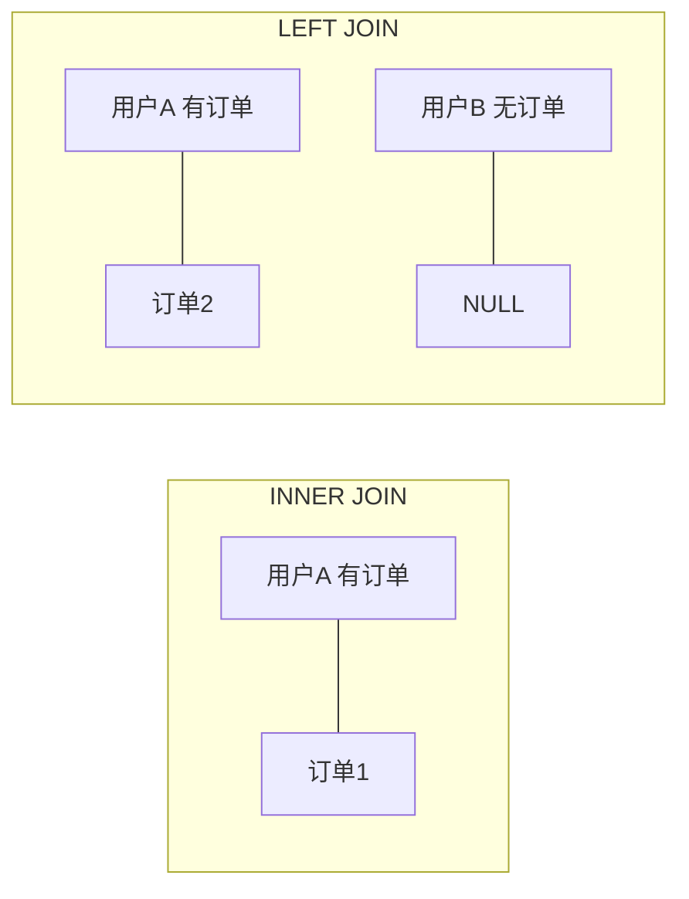

### 对比总结

| 类型 | 返回结果 |
|------|---------|
| INNER JOIN | 两表交集（都匹配的行） |
| LEFT JOIN | 左表全部 + 右表匹配（不匹配为NULL） |
| RIGHT JOIN | 右表全部 + 左表匹配（不匹配为NULL） |
| SELF JOIN | 同表自连接，处理层级数据 |

---

## 38. MySQL中的事务回滚机制概述

### 回滚的本质：undo log

InnoDB 在执行每条 DML（INSERT / UPDATE / DELETE）之前，会先把**操作前的旧数据**写入 undo log（回滚日志）。一旦事务回滚，MySQL 读取 undo log，执行逆向操作恢复数据。

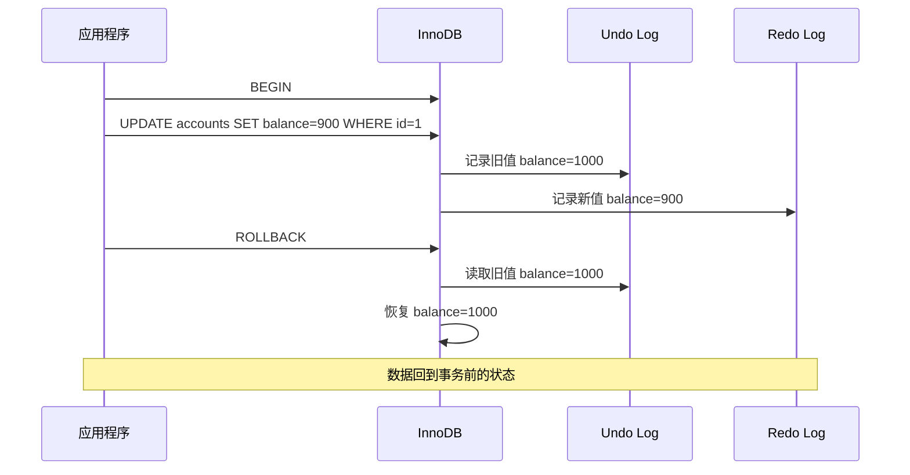

### 回滚操作

```sql
-- 全部回滚
START TRANSACTION;
UPDATE accounts SET balance = balance - 500 WHERE id = 1;
-- 发现异常，全部回滚
ROLLBACK;

-- 部分回滚：使用保存点（SAVEPOINT）
START TRANSACTION;
UPDATE orders SET status = 1 WHERE id = 100;
SAVEPOINT after_order_update;        -- 设置保存点

UPDATE inventory SET stock = stock - 1 WHERE id = 5;
-- 库存更新出错，只回滚到保存点，不影响订单更新
ROLLBACK TO SAVEPOINT after_order_update;

COMMIT;  -- 提交订单更新部分
```

### 自动回滚场景

- **语句级错误**：单条 SQL 执行失败，该条语句自动回滚（不影响事务中其他语句）。
- **死锁检测**：InnoDB 检测到死锁，自动回滚代价较小的事务。
- **连接断开**：客户端断连，MySQL 自动回滚未提交的事务。

### MVCC 与回滚

InnoDB 通过 **undo log 版本链** 实现 MVCC（多版本并发控制），读操作根据事务开始时的时间戳读取对应版本快照，不需要加锁，从而实现高并发的非阻塞读。

---

## 39. SQL语言包括哪几部分?每部分都有哪些操作关键字?

SQL 语言分为四大类：

### DDL（数据定义语言）— Data Definition Language

操作数据库对象（库、表、索引、视图等）的结构。

| 关键字 | 说明 |
|--------|------|
| `CREATE` | 创建数据库、表、索引、视图、存储过程等 |
| `ALTER` | 修改表结构（加列、改类型、加索引等） |
| `DROP` | 删除数据库、表、索引等（不可回滚） |
| `TRUNCATE` | 清空表数据，重置自增ID（不可回滚） |
| `RENAME` | 重命名表 |

```sql
CREATE TABLE users (id INT PRIMARY KEY, name VARCHAR(50));
ALTER TABLE users ADD COLUMN email VARCHAR(100);
DROP TABLE users;
TRUNCATE TABLE logs;
RENAME TABLE old_name TO new_name;
```

### DML（数据操作语言）— Data Manipulation Language

操作表中的数据行。

| 关键字 | 说明 |
|--------|------|
| `INSERT` | 插入数据 |
| `UPDATE` | 修改数据 |
| `DELETE` | 删除数据行 |
| `REPLACE` | 插入或替换（主键冲突则先删后插） |

```sql
INSERT INTO users (name, email) VALUES ('张三', 'zs@example.com');
UPDATE users SET email = 'new@example.com' WHERE id = 1;
DELETE FROM users WHERE id = 1;
```

### DQL（数据查询语言）— Data Query Language

查询数据，核心是 `SELECT`。

| 关键字 | 说明 |
|--------|------|
| `SELECT` | 查询数据 |
| `FROM` | 指定数据来源 |
| `WHERE` | 过滤条件 |
| `GROUP BY` | 分组 |
| `HAVING` | 分组后过滤 |
| `ORDER BY` | 排序 |
| `LIMIT` | 限制返回行数 |
| `JOIN / ON` | 表连接 |

### DCL（数据控制语言）— Data Control Language

控制用户权限。

| 关键字 | 说明 |
|--------|------|
| `GRANT` | 授予权限 |
| `REVOKE` | 撤销权限 |
| `COMMIT` | 提交事务 |
| `ROLLBACK` | 回滚事务 |
| `SAVEPOINT` | 设置保存点 |

---

## 40. 完整性约束包括哪些?

完整性约束用于保证数据库中数据的**正确性、一致性和有效性**。

### 实体完整性

确保表中每行数据都能被唯一标识。

```sql
-- 主键约束：唯一且非空
CREATE TABLE users (
    id INT PRIMARY KEY AUTO_INCREMENT
);

-- 唯一约束：值唯一（允许NULL）
CREATE TABLE users (
    email VARCHAR(100) UNIQUE
);
```

### 域完整性（列完整性）

确保列中的数据满足特定条件。

```sql
CREATE TABLE products (
    name    VARCHAR(100) NOT NULL,               -- 非空约束
    price   DECIMAL(10,2) DEFAULT 0.00,          -- 默认值约束
    status  TINYINT CHECK (status IN (0, 1, 2)), -- 检查约束（MySQL 8.0.16+ 生效）
    level   ENUM('A', 'B', 'C')                  -- 枚举限制值范围
);
```

### 参照完整性（引用完整性）

确保外键引用的数据存在。

```sql
CREATE TABLE orders (
    id      INT PRIMARY KEY,
    user_id INT NOT NULL,
    FOREIGN KEY (user_id) REFERENCES users(id)
        ON DELETE RESTRICT   -- 禁止删除被引用的用户
        ON UPDATE CASCADE    -- 用户ID更新时级联更新
);
```

外键动作选项：

| 动作 | 说明 |
|------|------|
| `RESTRICT` / `NO ACTION` | 有子记录时拒绝删除/更新父记录（默认） |
| `CASCADE` | 父记录删除/更新时，子记录同步删除/更新 |
| `SET NULL` | 父记录删除/更新时，子记录外键字段设为 NULL |
| `SET DEFAULT` | 父记录删除/更新时，子记录外键字段设为默认值 |

### 用户自定义完整性

业务规则层面的约束，通常由触发器或应用层代码实现。

---

## 41. 什么是锁?

锁（Lock）是数据库管理系统用于**协调多个并发事务对共享资源访问**的机制，防止多个事务同时修改同一数据导致数据不一致。

### 为什么需要锁？

```
场景：两个售票员同时卖最后一张票
事务A：SELECT 余票=1  →  卖出  →  UPDATE 余票=0
事务B：SELECT 余票=1  →  卖出  →  UPDATE 余票=0（余票变-1！）
```

没有锁的情况下，两个事务都读到余票=1，都认为可以卖，结果超卖。

### 锁的基本概念

- **锁粒度**：锁的范围大小（表锁 > 行锁）。粒度越小，并发越高，但管理开销越大。
- **锁模式**：共享锁（读锁，S）和排他锁（写锁，X）。
- **锁兼容性**：S锁和S锁兼容（多人可同时读），S锁和X锁不兼容（读写互斥），X锁和X锁不兼容（写写互斥）。

### 死锁

两个事务互相等待对方释放锁，形成循环等待：

```
事务A 持有行1的锁，等待行2的锁
事务B 持有行2的锁，等待行1的锁
→ 死锁！
```

InnoDB 有死锁检测机制，发现死锁后自动回滚代价较小的事务，另一个事务继续执行。

```sql
-- 查看最近一次死锁信息
SHOW ENGINE INNODB STATUS\G
```

---

## 42. 什么叫视图?游标是什么?

### 视图（View）

视图是一个**虚拟表**，本身不存储数据，而是基于 SELECT 查询的结果集。可以把视图理解为一个"保存的查询"，每次查询视图时都会执行底层的 SELECT。

```sql
-- 创建视图：隐藏敏感字段，只暴露安全字段
CREATE VIEW user_public_info AS
SELECT id, username, avatar, created_at
FROM users
WHERE status = 1;

-- 使用视图就像使用普通表
SELECT * FROM user_public_info WHERE id = 100;

-- 更新视图（满足条件时可写入）
UPDATE user_public_info SET avatar = 'new.jpg' WHERE id = 100;

-- 删除视图
DROP VIEW user_public_info;
```

视图的好处：
- **简化查询**：将复杂的多表JOIN封装成视图，业务代码只需查视图
- **安全性**：只暴露需要的列，隐藏敏感数据（如密码、手机号）
- **逻辑独立**：底层表结构变化时，只需修改视图，不需要修改所有业务代码

### 游标（Cursor）

游标是用于在存储过程或函数中**逐行处理结果集**的机制。游标就像一个指针，可以逐行遍历查询结果。

```sql
DELIMITER $$

CREATE PROCEDURE process_users()
BEGIN
    DECLARE done INT DEFAULT FALSE;
    DECLARE uid  INT;
    DECLARE uname VARCHAR(50);

    -- 1. 声明游标
    DECLARE cur CURSOR FOR SELECT id, name FROM users WHERE status = 1;

    -- 2. 声明游标结束处理器
    DECLARE CONTINUE HANDLER FOR NOT FOUND SET done = TRUE;

    -- 3. 打开游标
    OPEN cur;

    -- 4. 逐行读取
    read_loop: LOOP
        FETCH cur INTO uid, uname;
        IF done THEN
            LEAVE read_loop;
        END IF;
        -- 对每行数据进行处理
        INSERT INTO log_table (user_id, action) VALUES (uid, 'processed');
    END LOOP;

    -- 5. 关闭游标
    CLOSE cur;
END$$

DELIMITER ;
```

> 游标性能较差，通常只在存储过程中处理复杂逻辑时使用。能用集合操作（SET-based）解决的，优先用 SQL 集合操作而非游标。

---

## 43. 什么是存储过程?用什么来调用?

### 什么是存储过程

存储过程（Stored Procedure）是一组预先编译并存储在数据库中的 SQL 语句集合，可以接受参数、执行逻辑判断、循环等操作，类似于编程语言中的"函数"。

**优点：**
- 减少网络传输（一次调用执行多条SQL）
- 预编译，执行速度快
- 封装业务逻辑，提高代码复用性
- 可以控制权限（只给调用权限，不给表的直接操作权限）

**缺点：**
- 调试困难，版本管理不便
- 业务逻辑分散在数据库和应用层，维护复杂
- 不同数据库语法不兼容，迁移困难

### 创建和调用存储过程

```sql
DELIMITER $$

-- 创建存储过程：根据用户ID查询订单统计
CREATE PROCEDURE get_user_order_stats(
    IN  p_user_id   INT,          -- 输入参数
    OUT p_total     INT,          -- 输出参数
    OUT p_amount    DECIMAL(10,2) -- 输出参数
)
BEGIN
    SELECT COUNT(*), SUM(amount)
    INTO p_total, p_amount
    FROM orders
    WHERE user_id = p_user_id AND status = 1;
END$$

DELIMITER ;

-- 调用存储过程：使用 CALL 关键字
CALL get_user_order_stats(100, @total, @amount);

-- 查看输出参数
SELECT @total AS 订单数, @amount AS 总金额;

-- 查看所有存储过程
SHOW PROCEDURE STATUS WHERE Db = 'mydb';

-- 删除存储过程
DROP PROCEDURE IF EXISTS get_user_order_stats;
```

### 存储过程 vs 存储函数

| 对比项 | 存储过程 | 存储函数 |
|--------|---------|---------|
| 调用方式 | `CALL proc_name()` | `SELECT func_name()` |
| 返回值 | 通过 OUT 参数返回，可多个 | 必须有且只有一个返回值 |
| 能否在SQL中使用 | 不能直接嵌入SELECT | 可以嵌入SELECT |
| 事务控制 | 可以包含 COMMIT/ROLLBACK | 不能 |

---

## 44. 如何通俗地理解三个范式?

数据库设计的三个范式（Normal Form）是减少数据冗余、保证数据一致性的设计规则。

### 第一范式（1NF）：列不可再分

**要求**：表中每一列都是不可再分的原子值，不能有"集合"或"重复组"。

```
✗ 违反1NF：
| 学生ID | 姓名 | 联系方式           |
|--------|------|-------------------|
| 1      | 张三 | 手机:138, 邮箱:zs@ |  ← 联系方式可以再分

✓ 满足1NF：
| 学生ID | 姓名 | 手机        | 邮箱       |
|--------|------|-------------|------------|
| 1      | 张三 | 13812345678 | zs@qq.com  |
```

### 第二范式（2NF）：非主键列完全依赖主键

**要求**：在满足1NF的基础上，非主键列必须**完全依赖**于主键（消除部分依赖）。主要针对联合主键的情况。

```
✗ 违反2NF（联合主键：学生ID + 课程ID）：
| 学生ID | 课程ID | 成绩 | 学生姓名 | 课程名称 |
|--------|--------|------|---------|---------|
| 1      | 101    | 90   | 张三    | 数学    |
← 学生姓名只依赖学生ID（部分依赖），课程名称只依赖课程ID（部分依赖）

✓ 满足2NF：拆分为三张表
学生表：(学生ID, 学生姓名)
课程表：(课程ID, 课程名称)
成绩表：(学生ID, 课程ID, 成绩)
```

### 第三范式（3NF）：非主键列不依赖其他非主键列

**要求**：在满足2NF的基础上，非主键列之间不能有传递依赖。

```
✗ 违反3NF：
| 订单ID | 客户ID | 客户姓名 | 客户城市 |
|--------|--------|---------|---------|
| 1001   | 1      | 张三    | 北京    |
← 客户城市依赖客户ID，客户ID依赖订单ID → 传递依赖

✓ 满足3NF：拆分为两张表
订单表：(订单ID, 客户ID)
客户表：(客户ID, 客户姓名, 客户城市)
```

### 通俗记忆

- **1NF**：每格只填一个值，不能塞多个
- **2NF**：每列都要和整个主键有关，不能只和主键的一部分有关
- **3NF**：非主键列之间不能互相依赖，都要直接依赖主键

> **反范式化**：实际项目中，为了查询性能，有时会故意违反范式（如冗余存储用户名），用空间换时间。

---

## 45. 什么是基本表?什么是视图?

### 基本表（Base Table）

基本表是数据库中**实际存储数据**的表，也叫实体表或物理表。数据真实存在于磁盘上。

```sql
-- 这就是基本表，数据真实存储
CREATE TABLE users (
    id       INT PRIMARY KEY AUTO_INCREMENT,
    username VARCHAR(50) NOT NULL,
    password VARCHAR(255) NOT NULL,
    email    VARCHAR(100),
    status   TINYINT DEFAULT 1
);
```

### 视图（View）

视图是基于一个或多个基本表（或其他视图）的 **SELECT 查询定义的虚拟表**。视图本身不存储数据，每次查询视图时都会执行底层的 SELECT 语句。

```sql
-- 视图：只暴露安全字段，隐藏密码
CREATE VIEW v_users_safe AS
SELECT id, username, email, status
FROM users
WHERE status = 1;

-- 复杂视图：多表JOIN
CREATE VIEW v_order_detail AS
SELECT
    o.id        AS order_id,
    o.order_no,
    u.username  AS buyer,
    o.amount,
    o.created_at
FROM orders o
JOIN users u ON o.user_id = u.id;
```

### 基本表 vs 视图

| 对比项 | 基本表 | 视图 |
|--------|--------|------|
| 数据存储 | 真实存储在磁盘 | 不存储数据，只存查询定义 |
| 创建语句 | `CREATE TABLE` | `CREATE VIEW` |
| 数据修改 | 可以直接增删改 | 有条件才能修改（简单视图可以，复杂视图不行） |
| 性能 | 直接读取 | 每次查询都执行底层SQL |
| 用途 | 存储实际数据 | 简化查询、权限控制、逻辑抽象 |

---

## 46. 试述视图的优点?

### 1. 简化复杂查询

将复杂的多表 JOIN、子查询封装成视图，业务代码只需 `SELECT * FROM view_name`。

```sql
-- 没有视图：每次都要写复杂JOIN
SELECT o.id, u.username, p.name, oi.quantity, oi.price
FROM orders o
JOIN users u ON o.user_id = u.id
JOIN order_items oi ON o.id = oi.order_id
JOIN products p ON oi.product_id = p.id
WHERE o.status = 1;

-- 有视图：一行搞定
SELECT * FROM v_order_full_detail WHERE status = 1;
```

### 2. 数据安全性（权限控制）

通过视图只暴露允许访问的列和行，隐藏敏感数据。

```sql
-- 只让报表账号看到脱敏后的数据
CREATE VIEW v_user_report AS
SELECT
    id,
    CONCAT(LEFT(username, 1), '***') AS username,  -- 脱敏
    CONCAT(LEFT(phone, 3), '****', RIGHT(phone, 4)) AS phone,
    city,
    created_at
FROM users;

GRANT SELECT ON mydb.v_user_report TO 'report_user'@'%';
```

### 3. 逻辑数据独立性

底层表结构变化时，只需修改视图定义，不需要修改所有引用该视图的业务代码。

### 4. 数据一致性

多个应用共用同一个视图，保证数据口径统一，避免各自写不同的查询逻辑导致数据不一致。

### 5. 重用性

同一个视图可以被多个查询、多个应用复用，减少重复代码。

---

## 47. NULL是什么意思?

NULL 在数据库中表示**"未知"或"缺失"的值**，它不等于空字符串 `''`，也不等于数字 `0`，是一个特殊的标记。

### NULL 的特殊行为

```sql
-- 1. NULL 不等于任何值，包括它自己
SELECT NULL = NULL;    -- 返回 NULL（不是 TRUE！）
SELECT NULL != NULL;   -- 返回 NULL

-- 2. 判断 NULL 必须用 IS NULL / IS NOT NULL
SELECT * FROM users WHERE phone IS NULL;
SELECT * FROM users WHERE phone IS NOT NULL;

-- 3. NULL 参与运算结果仍为 NULL
SELECT 1 + NULL;       -- NULL
SELECT 'abc' || NULL;  -- NULL

-- 4. 聚合函数忽略 NULL
SELECT AVG(score) FROM students;  -- 自动忽略 score 为 NULL 的行
SELECT COUNT(*) FROM students;    -- 统计所有行（包括NULL）
SELECT COUNT(score) FROM students; -- 只统计 score 非NULL的行

-- 5. NULL 在 ORDER BY 中的排序
SELECT * FROM users ORDER BY phone ASC;   -- NULL 排在最前（MySQL默认）
SELECT * FROM users ORDER BY phone DESC;  -- NULL 排在最后
```

### NULL 对索引的影响

- InnoDB 中，NULL 值可以被索引（MySQL 8.0 优化后 `IS NULL` 可以走索引）
- 但大量 NULL 值会降低索引的区分度

### 最佳实践

```sql
-- 尽量给列设置 NOT NULL + 默认值，避免 NULL 带来的复杂性
CREATE TABLE users (
    phone   VARCHAR(11) NOT NULL DEFAULT '',   -- 空字符串代替NULL
    score   INT         NOT NULL DEFAULT 0,    -- 0代替NULL
    remark  VARCHAR(200)                       -- 确实可能没有备注时才用NULL
);

-- 处理可能为NULL的值
SELECT IFNULL(phone, '未填写') FROM users;
SELECT COALESCE(phone, mobile, '无联系方式') FROM users;
```

---

## 48. 主键、外键和索引的区别?

这三个概念经常被混淆，下面从定义、作用、约束三个维度对比：

| 对比项 | 主键（Primary Key） | 外键（Foreign Key） | 索引（Index） |
|--------|-------------------|-------------------|--------------|
| 定义 | 唯一标识表中每一行的列 | 引用另一张表主键的列 | 加速查询的数据结构 |
| 唯一性 | 必须唯一 | 不要求唯一 | 普通索引不要求唯一 |
| NULL | 不允许 | 允许（视情况） | 允许 |
| 每表数量 | 只能有一个 | 可以有多个 | 可以有多个 |
| 自动创建索引 | 是（自动创建唯一索引） | 是（自动创建普通索引） | 手动创建 |
| 主要作用 | 数据唯一标识 | 维护表间引用完整性 | 加速查询 |
| 对写性能影响 | 有（维护B+Tree） | 有（检查引用完整性） | 有（维护B+Tree） |

```sql
CREATE TABLE departments (
    dept_id   INT PRIMARY KEY,          -- 主键
    dept_name VARCHAR(50) NOT NULL
);

CREATE TABLE employees (
    emp_id    INT PRIMARY KEY,          -- 主键
    name      VARCHAR(50) NOT NULL,
    dept_id   INT,
    salary    DECIMAL(10,2),
    FOREIGN KEY (dept_id) REFERENCES departments(dept_id),  -- 外键
    INDEX idx_salary (salary)           -- 普通索引（加速薪资范围查询）
);
```

### 外键的争议

在高并发互联网项目中，**外键约束通常不在数据库层面设置**，原因：
- 外键检查会增加写操作的开销
- 分库分表后外键无法跨库
- 引用完整性由应用层代码保证，更灵活

---

## 49. 你可以用什么来确保表格里的字段只接受特定范围里的值?

有多种方式可以限制字段值的范围：

### 1. CHECK 约束（MySQL 8.0.16+ 真正生效）

```sql
CREATE TABLE products (
    id       INT PRIMARY KEY,
    price    DECIMAL(10,2) CHECK (price >= 0),                    -- 价格不能为负
    discount DECIMAL(4,2)  CHECK (discount BETWEEN 0.01 AND 1.0), -- 折扣0.01~1.0
    status   TINYINT       CHECK (status IN (0, 1, 2))            -- 只允许0/1/2
);

-- MySQL 8.0.16 之前 CHECK 约束被解析但不执行，需用其他方式
```

### 2. ENUM 类型

```sql
CREATE TABLE orders (
    status ENUM('pending', 'paid', 'shipped', 'completed', 'cancelled') NOT NULL DEFAULT 'pending'
);
-- 插入不在列表中的值会报错或被截断
```

### 3. 触发器（TRIGGER）

```sql
DELIMITER $$
CREATE TRIGGER check_age_before_insert
BEFORE INSERT ON users
FOR EACH ROW
BEGIN
    IF NEW.age < 0 OR NEW.age > 150 THEN
        SIGNAL SQLSTATE '45000'
        SET MESSAGE_TEXT = '年龄必须在0到150之间';
    END IF;
END$$
DELIMITER ;
```

### 4. 应用层验证

在业务代码中验证数据合法性，是最常用也最灵活的方式：

```java
// Java 示例
if (price < 0 || price > 999999.99) {
    throw new IllegalArgumentException("价格超出合法范围");
}
```

### 5. 无符号整数（UNSIGNED）

```sql
-- UNSIGNED 确保值不为负数
stock INT UNSIGNED NOT NULL DEFAULT 0  -- 库存不能为负
```

### 推荐组合

- 数据库层：ENUM（有限枚举值）+ CHECK（范围约束）+ UNSIGNED（非负整数）
- 应用层：业务逻辑验证（最主要的防线）
- 两层都做，互为补充

---

## 50. 说说对SQL语句优化有哪些方法?

### 1. 使用 EXPLAIN 分析执行计划

```sql
EXPLAIN SELECT * FROM orders o
JOIN users u ON o.user_id = u.id
WHERE o.status = 1 AND o.created_at > '2026-01-01'\G

-- 重点关注：
-- type: ALL(最差) → index → range → ref → eq_ref → const(最好)
-- key: 实际使用的索引，NULL表示未用索引
-- rows: 预估扫描行数，越小越好
-- Extra: Using filesort/Using temporary 需要优化
```

### 2. 避免 SELECT *，只查需要的列

```sql
-- ✗ 慢：传输所有列，无法使用覆盖索引
SELECT * FROM users WHERE id = 1;

-- ✓ 快：只取需要的列，可能命中覆盖索引
SELECT id, username, email FROM users WHERE id = 1;
```

### 3. 合理使用索引

```sql
-- ✗ 索引失效：对索引列做函数运算
SELECT * FROM orders WHERE DATE(created_at) = '2026-05-19';

-- ✓ 索引生效：保持索引列原样
SELECT * FROM orders WHERE created_at >= '2026-05-19 00:00:00'
                       AND created_at <  '2026-05-20 00:00:00';
```

### 4. 用 JOIN 代替子查询（某些场景）

```sql
-- ✗ 子查询：可能导致全表扫描
SELECT * FROM users WHERE id IN (SELECT user_id FROM orders WHERE status = 1);

-- ✓ JOIN：通常更高效
SELECT DISTINCT u.* FROM users u
JOIN orders o ON u.id = o.user_id AND o.status = 1;
```

### 5. 分页优化：避免深度 OFFSET

```sql
-- ✗ 慢：扫描100万行再丢弃
SELECT * FROM articles ORDER BY id LIMIT 20 OFFSET 1000000;

-- ✓ 快：游标分页（记录上次最大ID）
SELECT * FROM articles WHERE id > 1000020 ORDER BY id LIMIT 20;

-- ✓ 延迟关联：先用覆盖索引找ID，再回表
SELECT a.* FROM articles a
JOIN (SELECT id FROM articles ORDER BY id LIMIT 1000000, 20) t ON a.id = t.id;
```

### 6. 批量操作代替循环单条

```sql
-- ✗ 慢：1000次网络往返
for i in range(1000):
    INSERT INTO logs VALUES (...)

-- ✓ 快：一次网络往返
INSERT INTO logs VALUES (...), (...), (...);  -- 批量插入

-- 批量更新
UPDATE users SET status = 0 WHERE id IN (1, 2, 3, 4, 5);
```

### 7. 使用覆盖索引

```sql
-- 创建覆盖索引：查询的所有列都在索引中
CREATE INDEX idx_user_status_time ON orders(user_id, status, created_at);

-- 查询只用到这三列，直接从索引返回，不回表
SELECT user_id, status, created_at FROM orders
WHERE user_id = 100 AND status = 1
ORDER BY created_at DESC;
```

### 8. 优化 GROUP BY 和 ORDER BY

```sql
-- 确保 GROUP BY / ORDER BY 的列有索引
-- 避免 ORDER BY 使用表达式或函数

-- ✗ 无法用索引排序
SELECT * FROM orders ORDER BY YEAR(created_at);

-- ✓ 可以用索引排序
SELECT * FROM orders ORDER BY created_at;
```

### 9. 小表驱动大表（JOIN 顺序）

```sql
-- JOIN 时，用小结果集驱动大结果集
-- MySQL 优化器通常会自动处理，但可以用 STRAIGHT_JOIN 强制顺序
SELECT * FROM small_table s
STRAIGHT_JOIN large_table l ON s.id = l.small_id
WHERE s.status = 1;
```

### 10. 开启慢查询日志，持续监控

```sql
-- 开启慢查询日志
SET GLOBAL slow_query_log = 1;
SET GLOBAL long_query_time = 1;  -- 超过1秒记录

-- 查看慢查询日志位置
SHOW VARIABLES LIKE 'slow_query_log_file';

-- 使用 mysqldumpslow 分析
-- mysqldumpslow -s t -t 10 /var/log/mysql/slow.log
```

### 优化优先级总结

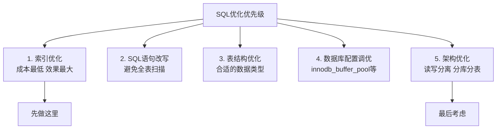

---

## 附录A：MySQL EXPLAIN 字段详解

`EXPLAIN` 是分析 SQL 性能最重要的工具，面试中经常被问到每个字段的含义。

```sql
EXPLAIN SELECT u.username, COUNT(o.id) AS order_count
FROM users u
LEFT JOIN orders o ON u.id = o.user_id
WHERE u.status = 1
GROUP BY u.id
ORDER BY order_count DESC
LIMIT 10;
```

### 各字段说明

| 字段 | 说明 |
|------|------|
| `id` | 查询序号，相同id同层执行，id越大越先执行 |
| `select_type` | 查询类型（见下表） |
| `table` | 当前行访问的表名 |
| `partitions` | 匹配的分区（非分区表为NULL） |
| `type` | 访问类型（性能关键，见下表） |
| `possible_keys` | 可能用到的索引 |
| `key` | 实际使用的索引，NULL表示未使用 |
| `key_len` | 使用的索引字节长度，越小越好 |
| `ref` | 与索引比较的列或常量 |
| `rows` | 预估需要扫描的行数，越小越好 |
| `filtered` | 经过WHERE过滤后剩余行的百分比 |
| `Extra` | 额外信息（见下表） |

### type 字段（性能从好到差）

| type值 | 说明 | 场景 |
|--------|------|------|
| `system` | 表只有一行 | 系统表 |
| `const` | 最多匹配一行（主键/唯一索引等值查询） | `WHERE id = 1` |
| `eq_ref` | 联表时使用主键或唯一非空索引 | JOIN ON主键 |
| `ref` | 使用非唯一索引的等值查询 | `WHERE status = 1`（status有索引） |
| `range` | 索引范围扫描 | `WHERE id BETWEEN 1 AND 100` |
| `index` | 全索引扫描（比ALL快，只扫索引不扫数据） | 覆盖索引扫描全表 |
| `ALL` | 全表扫描（最差，需要优化） | 无索引或索引失效 |

### Extra 字段常见值

| Extra值 | 说明 | 是否需要优化 |
|---------|------|------------|
| `Using index` | 覆盖索引，无需回表 | 好，不需要优化 |
| `Using where` | 在存储引擎返回后再用WHERE过滤 | 可接受 |
| `Using index condition` | 索引下推（ICP），在索引层过滤 | 好 |
| `Using filesort` | 需要额外排序（内存或磁盘） | 需优化，考虑加索引 |
| `Using temporary` | 使用临时表（GROUP BY/DISTINCT等） | 需优化 |
| `Using join buffer` | JOIN时无索引，使用连接缓冲区 | 需给JOIN列加索引 |

---

## 附录B：InnoDB 存储引擎架构详解

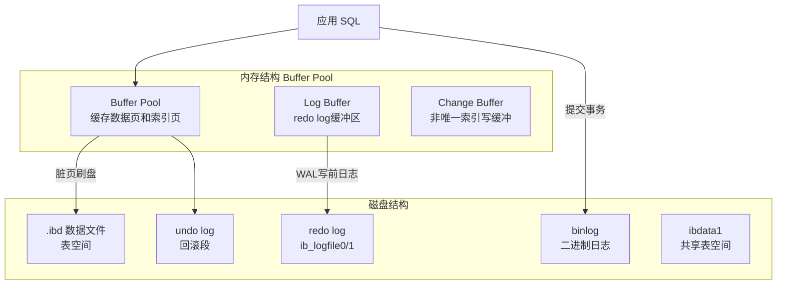

### 关键组件说明

**Buffer Pool（缓冲池）**

- InnoDB 最重要的内存结构，缓存频繁访问的数据页和索引页
- 大小由 `innodb_buffer_pool_size` 控制，建议设为物理内存的 60%-80%
- 使用改进的 LRU 算法管理页面淘汰（分 young 区和 old 区）

```sql
-- 查看 Buffer Pool 命中率（应接近100%）
SHOW STATUS LIKE 'Innodb_buffer_pool_read%';
-- Innodb_buffer_pool_read_requests: 总读取请求数
-- Innodb_buffer_pool_reads: 从磁盘读取的次数（未命中）
-- 命中率 = 1 - (reads / read_requests)
```

**redo log（重做日志）**

- 记录数据页的物理修改，用于崩溃恢复（保证持久性）
- 采用 WAL（Write-Ahead Logging）：先写日志，再写数据页
- 大小由 `innodb_log_file_size` 控制

**undo log（回滚日志）**

- 记录数据修改前的旧值，用于事务回滚（保证原子性）
- 同时为 MVCC 提供历史版本数据

**Change Buffer**

- 缓冲对非唯一二级索引的写操作，合并后批量写入
- 减少随机 IO，提升写入性能

---

## 附录C：MySQL 常用运维命令速查

### 连接与基本信息

```sql
-- 查看MySQL版本
SELECT VERSION();

-- 查看当前连接数
SHOW STATUS LIKE 'Threads_connected';

-- 查看所有活跃连接
SHOW PROCESSLIST;

-- 杀掉某个连接（id来自SHOW PROCESSLIST）
KILL CONNECTION 12345;

-- 查看数据库大小（单位MB）
SELECT
    table_schema AS '数据库',
    ROUND(SUM(data_length + index_length) / 1024 / 1024, 2) AS '大小(MB)'
FROM information_schema.tables
GROUP BY table_schema;
```

### 表维护

```sql
-- 分析表（更新索引统计信息，让优化器更准确）
ANALYZE TABLE users;

-- 优化表（整理碎片，重建表）
OPTIMIZE TABLE orders;

-- 检查表是否损坏
CHECK TABLE mytable;

-- 修复损坏的表
REPAIR TABLE mytable;
```

### 索引管理

```sql
-- 添加索引
ALTER TABLE users ADD INDEX idx_email (email);
ALTER TABLE orders ADD INDEX idx_user_status (user_id, status);
ALTER TABLE users ADD UNIQUE KEY uk_phone (phone);

-- 删除索引
ALTER TABLE users DROP INDEX idx_email;

-- 查看表的所有索引
SHOW INDEX FROM users;

-- 查看索引使用统计（哪些索引从未被使用）
SELECT * FROM sys.schema_unused_indexes;  -- MySQL 5.7+
```

### 慢查询分析

```sql
-- 开启慢查询日志
SET GLOBAL slow_query_log = ON;
SET GLOBAL long_query_time = 1;           -- 记录超过1秒的查询
SET GLOBAL log_queries_not_using_indexes = ON;  -- 记录未用索引的查询

-- 查看慢查询统计
SHOW STATUS LIKE 'Slow_queries';

-- 查看性能模式中的TOP SQL（MySQL 5.6+）
SELECT digest_text, count_star, avg_timer_wait/1000000000 AS avg_ms
FROM performance_schema.events_statements_summary_by_digest
ORDER BY avg_timer_wait DESC
LIMIT 10;
```

### 事务与锁

```sql
-- 查看当前活跃事务
SELECT * FROM information_schema.INNODB_TRX;

-- 查看当前锁等待
SELECT * FROM information_schema.INNODB_LOCK_WAITS;  -- MySQL 5.7
SELECT * FROM performance_schema.data_lock_waits;     -- MySQL 8.0

-- 查看InnoDB状态（含死锁信息）
SHOW ENGINE INNODB STATUS\G
```

---

*本文档涵盖 MySQL 面试常见的 50 个核心问题及三个附录，从基础概念到实战优化，适合面试备考和日常参考。*
