# RabbitMQ 面试题详解

## 1. 什么是 RabbitMQ

RabbitMQ 是一个开源的消息代理（Message Broker）和队列服务器，用于在分布式系统中存储和转发消息。它实现了高级消息队列协议（AMQP - Advanced Message Queuing Protocol），是目前最流行的消息中间件之一。

**核心概念：**

- **Producer（生产者）**：发送消息的应用程序
- **Consumer（消费者）**：接收消息的应用程序
- **Queue（队列）**：存储消息的缓冲区
- **Exchange（交换机）**：接收生产者发送的消息，并根据路由规则将消息路由到一个或多个队列
- **Binding（绑定）**：Exchange 和 Queue 之间的关系
- **Virtual Host（虚拟主机）**：用于逻辑隔离，一个 RabbitMQ 服务器可以有多个虚拟主机

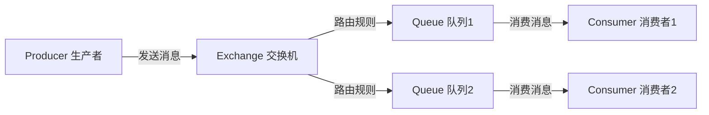

RabbitMQ 使用 Erlang 语言编写，具有高可用性、可扩展性和可靠性的特点。它支持多种消息协议，提供了丰富的客户端库，支持多种编程语言。

## 2. 为什么要使用 RabbitMQ

使用 RabbitMQ 的主要原因包括：

**1. 解耦（Decoupling）**

系统之间通过消息队列通信，生产者不需要知道消费者的存在，消费者也不需要知道生产者的存在。当某个服务出现故障时，不会影响其他服务的正常运行。

**2. 异步处理（Async Processing）**

将耗时的操作放入消息队列异步处理，提高系统响应速度。例如发送邮件、短信通知等操作可以异步执行，不阻塞主流程。

**3. 削峰填谷（Peak Shaving）**

在高并发场景下，消息队列可以作为缓冲层，将突发的大量请求暂存在队列中，消费者按照自己的处理能力逐步消费，避免系统被压垮。

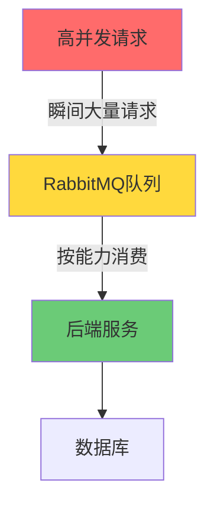

**4. 可靠性**

RabbitMQ 支持消息持久化、消息确认机制，确保消息不丢失。

**5. 灵活的路由**

通过 Exchange 和 Binding 的组合，可以实现复杂的消息路由逻辑。

## 3. 使用 RabbitMQ 的场景

**场景一：订单系统**

用户下单后，订单服务将消息发送到队列，库存服务、物流服务、通知服务分别消费消息，互不影响。

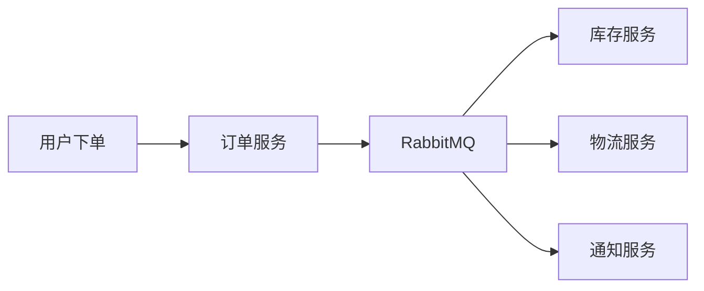

**场景二：日志收集**

各个微服务将日志发送到消息队列，日志收集服务统一消费并存储到 Elasticsearch。

**场景三：秒杀活动**

秒杀请求先进入消息队列，避免数据库被大量并发请求压垮，保证系统稳定性。

**场景四：邮件/短信通知**

注册成功后，将发送邮件的任务放入队列，异步发送，不影响注册流程的响应速度。

**场景五：分布式事务**

通过消息队列实现最终一致性，解决分布式事务问题。

**场景六：任务调度**

将定时任务放入消息队列，多个消费者并行处理，提高任务处理效率。

## 4. 如何确保消息正确地发送至 RabbitMQ？如何确保消息接收方消费了消息？

### 确保消息正确发送到 RabbitMQ

**方法一：事务机制（Transaction）**

```java
// 开启事务
channel.txSelect();
try {
    channel.basicPublish(exchange, routingKey, props, message.getBytes());
    channel.txCommit(); // 提交事务
} catch (Exception e) {
    channel.txRollback(); // 回滚事务
}
```

缺点：事务机制会降低 RabbitMQ 的消息吞吐量，性能较差。

**方法二：Confirm 确认机制（推荐）**

```java
// 开启 confirm 模式
channel.confirmSelect();

channel.basicPublish(exchange, routingKey, props, message.getBytes());

// 同步等待确认
if (channel.waitForConfirms()) {
    System.out.println("消息发送成功");
} else {
    System.out.println("消息发送失败，需要重试");
}
```

Confirm 模式分为三种：
- **单条确认**：每发一条消息等待一次确认，效率低
- **批量确认**：发送一批消息后等待确认，效率较高但出错时无法定位具体哪条失败
- **异步确认**：通过回调函数处理确认结果，效率最高（推荐）

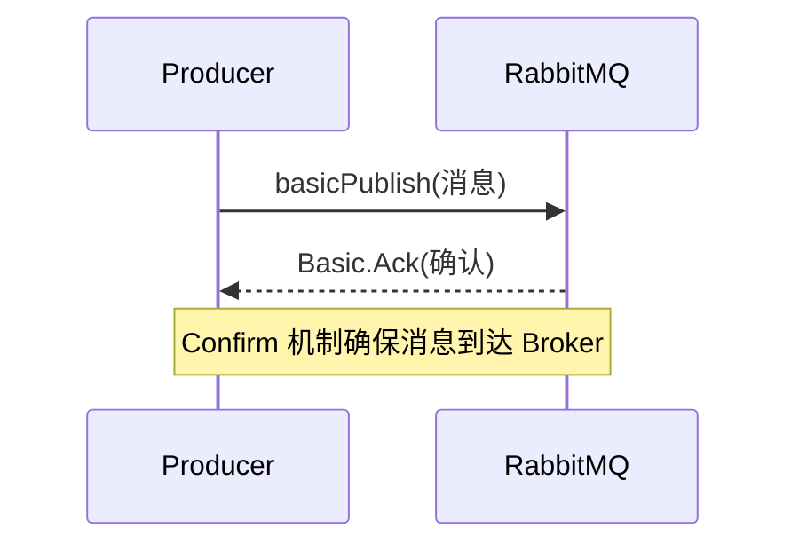

### 确保消费者消费了消息

**消费者确认机制（Consumer Acknowledgement）**

RabbitMQ 提供了消息确认机制，消费者处理完消息后需要发送 ACK 确认：

```java
// 手动确认模式（autoAck = false）
channel.basicConsume(queueName, false, (consumerTag, delivery) -> {
    try {
        // 处理消息
        processMessage(delivery.getBody());
        // 手动发送 ACK
        channel.basicAck(delivery.getEnvelope().getDeliveryTag(), false);
    } catch (Exception e) {
        // 处理失败，拒绝消息并重新入队
        channel.basicNack(delivery.getEnvelope().getDeliveryTag(), false, true);
    }
}, consumerTag -> {});
```

- **basicAck**：确认消息已处理，RabbitMQ 从队列中删除该消息
- **basicNack**：拒绝消息，可以选择重新入队或丢弃
- **basicReject**：拒绝单条消息

如果消费者在处理消息时断开连接，RabbitMQ 会将未确认的消息重新投递给其他消费者。

## 5. 如何避免消息重复投递或重复消费？

消息重复的原因：
- 网络抖动导致 ACK 未到达 RabbitMQ，消息被重新投递
- 消费者处理消息时崩溃，消息被重新投递

**解决方案：幂等性设计**

**方法一：唯一消息 ID + 数据库去重**

```java
// 生产者发送消息时附带唯一ID
String messageId = UUID.randomUUID().toString();
AMQP.BasicProperties props = new AMQP.BasicProperties.Builder()
    .messageId(messageId)
    .build();
channel.basicPublish(exchange, routingKey, props, message.getBytes());

// 消费者处理时检查是否已处理
public void consumeMessage(String messageId, String body) {
    // 查询数据库是否已处理该消息
    if (messageProcessedRepository.existsById(messageId)) {
        return; // 已处理，直接返回
    }
    // 处理消息
    doProcess(body);
    // 记录已处理
    messageProcessedRepository.save(new MessageRecord(messageId));
}
```

**方法二：Redis 去重**

```java
// 使用 Redis 的 SETNX 命令实现去重
String key = "msg:" + messageId;
Boolean isNew = redisTemplate.opsForValue().setIfAbsent(key, "1", 24, TimeUnit.HOURS);
if (Boolean.TRUE.equals(isNew)) {
    // 首次处理
    doProcess(body);
}
```

**方法三：数据库唯一约束**

对业务数据设置唯一约束，重复插入时会抛出异常，捕获异常后忽略即可。

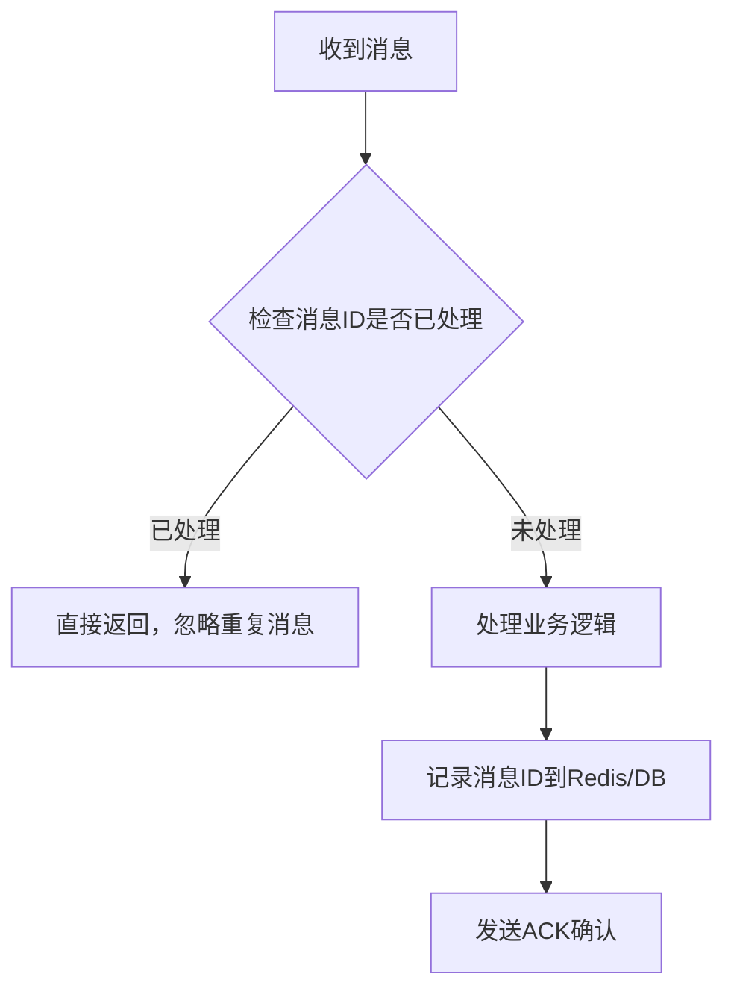

## 6. 消息基于什么传输？

RabbitMQ 的消息传输基于 **AMQP（Advanced Message Queuing Protocol，高级消息队列协议）**。

**AMQP 协议特点：**

1. **二进制协议**：AMQP 是一个二进制协议，相比文本协议（如 HTTP）更高效
2. **面向消息**：专为消息传递设计
3. **可靠性**：支持消息确认、持久化等可靠性机制
4. **安全性**：支持 TLS/SSL 加密传输
5. **跨语言**：与语言无关，支持多种编程语言

**传输层：**

RabbitMQ 默认使用 TCP 连接，端口为 5672（非加密）或 5671（TLS 加密）。

**Channel（信道）机制：**

为了避免频繁创建和销毁 TCP 连接（开销大），RabbitMQ 引入了 Channel 的概念。一个 TCP 连接上可以创建多个 Channel，每个 Channel 是独立的虚拟连接。

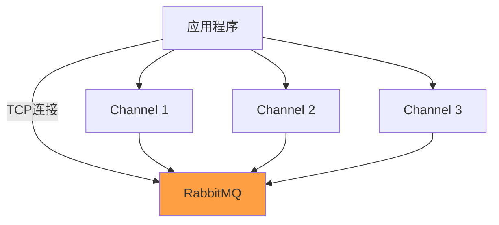

**消息结构：**

```
消息 = 消息头(Headers) + 消息体(Body)
消息头包含：
  - content-type: 消息类型
  - delivery-mode: 1=非持久化, 2=持久化
  - priority: 优先级
  - message-id: 消息唯一ID
  - timestamp: 时间戳
  - expiration: 过期时间
```

## 7. 消息如何分发？

RabbitMQ 的消息分发通过 **Exchange（交换机）** 实现，Exchange 根据类型和路由规则将消息分发到对应的队列。

**Exchange 的四种类型：**

### Direct Exchange（直连交换机）

消息的路由键（Routing Key）与队列绑定键（Binding Key）完全匹配时，消息才会被路由到该队列。

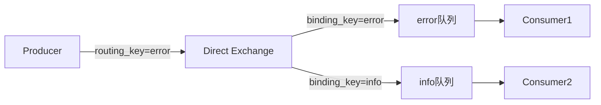

### Fanout Exchange（扇形交换机）

忽略路由键，将消息广播到所有绑定的队列，适合发布/订阅模式。

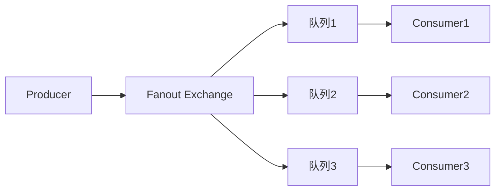

### Topic Exchange（主题交换机）

路由键支持通配符匹配：
- `*` 匹配一个单词
- `#` 匹配零个或多个单词

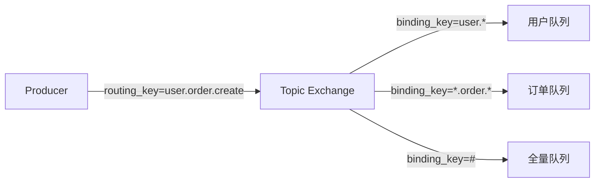

### Headers Exchange（头部交换机）

根据消息头部属性进行匹配，不使用路由键，使用较少。

**多消费者分发策略：**

当一个队列有多个消费者时，RabbitMQ 默认使用**轮询（Round-Robin）**方式分发消息，每个消费者依次获得消息。

可以通过设置 `basicQos` 实现**公平分发**，确保处理能力强的消费者获得更多消息：

```java
// 每次只预取1条消息，处理完再取下一条
channel.basicQos(1);
```

## 8. 消息怎么路由？

消息路由是指消息从 Exchange 到 Queue 的过程，由以下要素决定：

**路由要素：**
1. **Exchange 类型**：决定路由算法
2. **Routing Key**：生产者发送消息时指定的路由键
3. **Binding Key**：队列绑定到 Exchange 时指定的绑定键

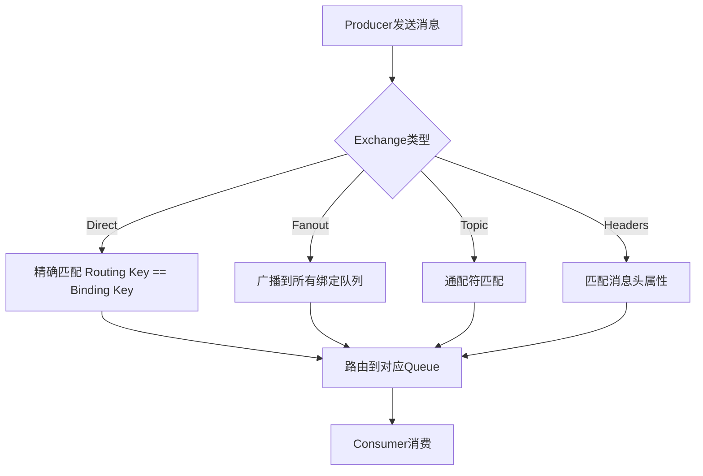

**死信队列（Dead Letter Queue）路由：**

当消息满足以下条件时，会被路由到死信交换机（DLX）：
- 消息被拒绝（basicReject/basicNack）且不重新入队
- 消息过期（TTL 到期）
- 队列达到最大长度

```java
// 创建队列时设置死信交换机
Map<String, Object> args = new HashMap<>();
args.put("x-dead-letter-exchange", "dlx.exchange");
args.put("x-dead-letter-routing-key", "dlx.routing.key");
args.put("x-message-ttl", 60000); // 消息60秒后过期
channel.queueDeclare("normal.queue", true, false, false, args);
```

**延迟队列路由（通过 TTL + 死信队列实现）：**

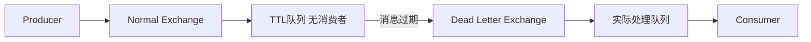

## 9. 如何确保消息不丢失？

消息丢失可能发生在三个阶段，需要分别处理：

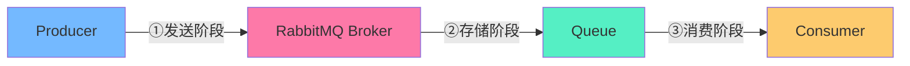

### ① 生产者到 Broker 阶段

使用 **Confirm 机制**确保消息到达 Broker：

```java
channel.confirmSelect();
channel.addConfirmListener(
    (deliveryTag, multiple) -> {
        // 消息成功到达 Broker
        log.info("消息确认成功: {}", deliveryTag);
    },
    (deliveryTag, multiple) -> {
        // 消息未到达 Broker，需要重发
        log.error("消息发送失败，需要重发: {}", deliveryTag);
        resendMessage(deliveryTag);
    }
);
```

### ② Broker 存储阶段

使用**消息持久化**确保 RabbitMQ 重启后消息不丢失：

```java
// 1. 队列持久化
channel.queueDeclare(queueName, 
    true,  // durable=true 持久化队列
    false, false, null);

// 2. 消息持久化
AMQP.BasicProperties props = new AMQP.BasicProperties.Builder()
    .deliveryMode(2) // 2=持久化消息
    .build();
channel.basicPublish(exchange, routingKey, props, message.getBytes());
```

### ③ Broker 到消费者阶段

使用**手动 ACK 机制**确保消息被成功处理：

```java
// autoAck=false 关闭自动确认
channel.basicConsume(queueName, false, (consumerTag, delivery) -> {
    try {
        processMessage(delivery.getBody());
        // 处理成功，发送确认
        channel.basicAck(delivery.getEnvelope().getDeliveryTag(), false);
    } catch (Exception e) {
        // 处理失败，重新入队
        channel.basicNack(delivery.getEnvelope().getDeliveryTag(), false, true);
    }
}, consumerTag -> {});
```

**完整的消息可靠性保障方案：**

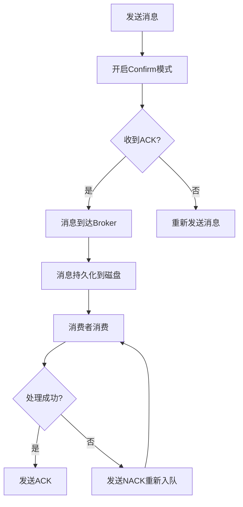

## 10. 使用 RabbitMQ 有什么好处？

**1. 应用解耦**
服务之间通过消息队列通信，降低耦合度，一个服务的故障不会直接影响其他服务。

**2. 异步处理**
将耗时操作异步化，提升系统响应速度和用户体验。例如：用户注册后异步发送欢迎邮件。

**3. 流量削峰**
在秒杀、抢购等高并发场景下，消息队列作为缓冲层，保护后端服务不被压垮。

**4. 消息持久化**
支持消息持久化到磁盘，即使 RabbitMQ 重启也不会丢失消息。

**5. 高可用性**
支持集群部署和镜像队列，提供高可用保障。

**6. 灵活的路由**
通过多种 Exchange 类型，支持复杂的消息路由场景。

**7. 多语言支持**
提供 Java、Python、Go、PHP、Ruby 等多种语言的客户端库。

**8. 管理界面**
提供 Web 管理界面，方便监控和管理消息队列。

**9. 插件机制**
支持丰富的插件，如延迟消息插件、消息追踪插件等。

**10. 社区活跃**
开源项目，社区活跃，文档完善，遇到问题容易找到解决方案。

## 11. RabbitMQ 的集群

RabbitMQ 支持多种集群模式，以实现高可用和负载均衡。

### 普通集群模式

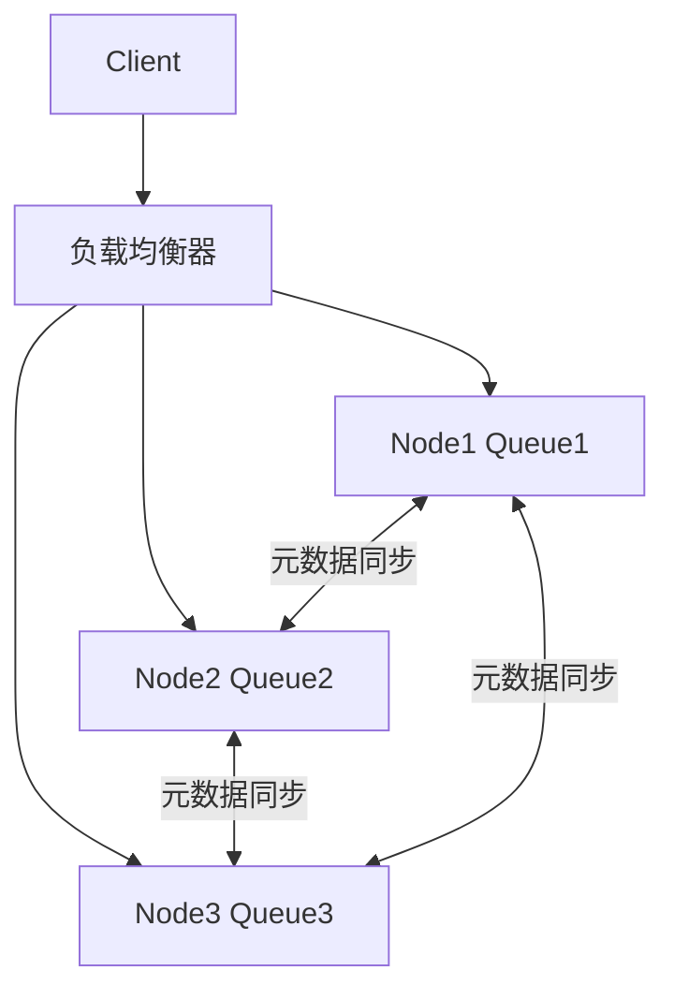

**特点：**
- 多个节点共享 Exchange、Binding 等元数据
- 队列数据只存储在创建该队列的节点上
- 其他节点访问该队列时，需要从存储节点拉取数据
- **缺点**：存储队列的节点宕机，该队列不可用

### 镜像队列模式（推荐）

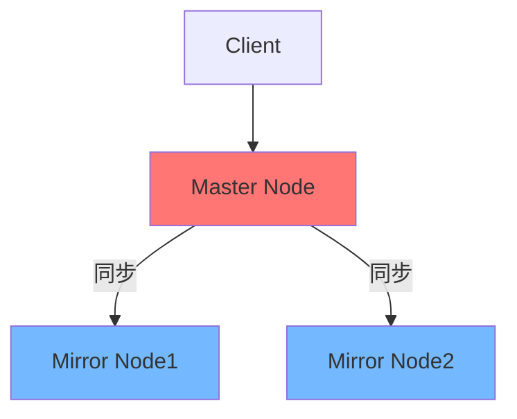

**特点：**
- 队列数据在多个节点上都有副本（镜像）
- Master 节点处理所有读写操作，并同步到 Mirror 节点
- Master 节点宕机后，Mirror 节点自动升级为 Master
- **优点**：高可用，节点宕机不影响服务
- **缺点**：数据同步消耗网络带宽，性能有所下降

**配置镜像队列：**

```bash
# 设置策略，所有队列都创建镜像
rabbitmqctl set_policy ha-all "^" '{"ha-mode":"all"}'

# 只在2个节点上创建镜像
rabbitmqctl set_policy ha-two "^" '{"ha-mode":"exactly","ha-params":2,"ha-sync-mode":"automatic"}'
```

### Quorum Queue（仲裁队列，RabbitMQ 3.8+）

RabbitMQ 3.8 引入的新队列类型，基于 Raft 协议实现，是镜像队列的替代方案。

```java
// 创建仲裁队列
Map<String, Object> args = new HashMap<>();
args.put("x-queue-type", "quorum");
channel.queueDeclare("my-quorum-queue", true, false, false, args);
```

**对比镜像队列的优势：**
- 更强的数据一致性保证
- 更好的性能
- 更简单的配置

### 集群搭建步骤

```bash
# 1. 在所有节点上安装 RabbitMQ
# 2. 确保所有节点的 .erlang.cookie 文件内容相同
# 3. 在从节点上执行
rabbitmqctl stop_app
rabbitmqctl join_cluster rabbit@master-node
rabbitmqctl start_app

# 4. 查看集群状态
rabbitmqctl cluster_status
```

## 12. MQ 的缺点

使用消息队列虽然带来了很多好处，但也引入了一些问题：

**1. 系统复杂性增加**
引入 MQ 后，系统架构变得更复杂，需要维护额外的中间件，增加了运维成本。

**2. 消息可靠性问题**
需要额外处理消息丢失、消息重复消费等问题，增加了开发复杂度。

**3. 消息顺序性难以保证**
在多消费者场景下，消息的消费顺序可能与发送顺序不一致。

**4. 数据一致性问题**
分布式系统中，消息的最终一致性难以保证，可能出现数据不一致的情况。

**5. 可用性依赖**
系统依赖 MQ 的可用性，MQ 宕机会影响整个系统的正常运行。

**6. 调试困难**
异步消息处理使得问题排查和调试变得更加困难，需要完善的日志和监控体系。

**7. 消息积压问题**
如果消费者处理速度跟不上生产者发送速度，会导致消息积压，占用大量内存或磁盘空间。

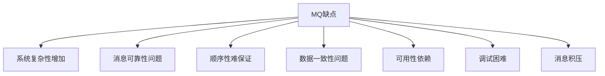

**解决消息积压的方案：**

```
1. 临时扩容消费者数量
2. 将积压的消息转移到容量更大的队列
3. 如果消息已过期，直接丢弃（需要业务允许）
4. 优化消费者处理逻辑，提高消费速度
5. 对消息进行批量处理
```
