# Redis 面试题全解析（40题）

> 适合初学者到进阶开发者，涵盖 Redis 核心概念、集群、持久化、事务、分布式锁等高频考点。

***

## 1. 什么是Redis?

Redis（Remote Dictionary Server）是一个开源的、基于内存的高性能键值对数据库。它由 Salvatore Sanfilippo 于 2009 年创建，使用 C 语言编写。

**核心特点：**

- 数据存储在内存中，读写速度极快（读可达 11 万次/秒，写可达 8.1 万次/秒）
- 支持多种数据结构（String、List、Hash、Set、Sorted Set 等）
- 支持数据持久化（RDB 和 AOF）
- 支持主从复制、哨兵模式、集群模式
- 支持事务、Lua 脚本、发布订阅等高级功能
- 单线程模型（Redis 6.0 之前），避免了多线程的锁竞争问题

**典型应用场景：** 缓存、会话管理、排行榜、消息队列、分布式锁等。

***

## 2. Redis的数据类型?

Redis 支持以下核心数据类型：

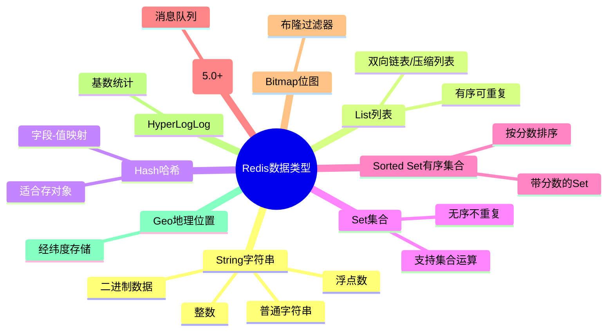
```mermaid
mindmap
  root((Redis数据类型))
    String字符串
      普通字符串
      整数
      浮点数
      二进制数据
    List列表
      有序可重复
      双向链表/压缩列表
    Hash哈希
      字段-值映射
      适合存对象
    Set集合
      无序不重复
      支持集合运算
    Sorted Set有序集合
      带分数的Set
      按分数排序
    Stream流(5.0+)
      消息队列
    Bitmap位图
      布隆过滤器
    HyperLogLog
      基数统计
    Geo地理位置
      经纬度存储
```

### 五种基础类型详解

| 类型         | 说明             | 常用命令                        | 典型场景        |
| ---------- | -------------- | --------------------------- | ----------- |
| String     | 最基本类型，最大 512MB | SET/GET/INCR/APPEND         | 缓存、计数器、分布式锁 |
| List       | 有序可重复列表        | LPUSH/RPUSH/LRANGE/LPOP     | 消息队列、最新列表   |
| Hash       | 字段-值的映射表       | HSET/HGET/HMSET/HGETALL     | 存储对象、用户信息   |
| Set        | 无序不重复集合        | SADD/SMEMBERS/SINTER/SUNION | 标签、好友关系、去重  |
| Sorted Set | 带分数的有序集合       | ZADD/ZRANGE/ZRANK/ZSCORE    | 排行榜、延迟队列    |

***

## 3. 使用Redis有哪些好处?

1. **速度极快**：数据存在内存中，读写时延在微秒级别，远超磁盘数据库。
2. **数据结构丰富**：不只是简单的 key-value，支持 List、Hash、Set 等，能直接在服务端完成复杂操作。
3. **持久化支持**：RDB 快照和 AOF 日志两种方式，重启后数据不丢失。
4. **原子操作**：单个命令是原子的，MULTI/EXEC 支持事务，Lua 脚本支持复合原子操作。
5. **高可用**：主从复制、哨兵（Sentinel）、集群（Cluster）保障高可用。
6. **发布订阅**：内置 Pub/Sub 消息机制，可做简单消息系统。
7. **过期机制**：可以给 key 设置 TTL，自动清理过期数据，天然适合缓存场景。
8. **Lua 脚本**：支持服务端执行 Lua 脚本，保证多命令的原子性。
9. **管道（Pipeline）**：批量发送命令，减少网络往返，大幅提升吞吐量。
10. **社区活跃**：生态完善，客户端覆盖几乎所有主流语言。

***

## 4. Redis相比Memcached有哪些优势?

| 对比维度    | Redis                                  | Memcached  |
| ------- | -------------------------------------- | ---------- |
| 数据结构    | 5种+（String/List/Hash/Set/ZSet/Stream等） | 仅 String   |
| 持久化     | 支持 RDB + AOF                           | 不支持，重启数据全丢 |
| 高可用     | 主从/哨兵/集群                               | 需借助第三方     |
| 事务      | 支持（MULTI/EXEC）                         | 不支持        |
| Lua脚本   | 支持                                     | 不支持        |
| 发布订阅    | 支持                                     | 不支持        |
| 集群      | 原生支持                                   | 客户端分片      |
| 内存效率    | 略低（数据结构开销）                             | 略高（纯字符串）   |
| 多线程     | 6.0+ 网络IO多线程                           | 原生多线程      |
| value大小 | 最大 512MB                               | 最大 1MB     |

**总结：** Redis 功能更丰富，适合需要复杂数据结构、持久化、高可用的场景；Memcached 更简单，适合纯缓存且对内存效率要求极高的场景。

***

## 5. Memcache与Redis的区别都有哪些?

这道题与第4题有重叠，但更侧重底层实现差异：

**1. 线程模型**

- Memcached：多线程，利用多核 CPU
- Redis 6.0 之前：单线程处理命令；Redis 6.0+：网络 IO 多线程，命令执行仍单线程

**2. 内存管理**

- Memcached：使用 Slab Allocator，预分配固定大小内存块，减少碎片但可能浪费
- Redis：使用 jemalloc/tcmalloc，动态分配，更灵活

**3. 数据淘汰**

- Memcached：仅支持 LRU
- Redis：支持 8 种淘汰策略（noeviction、allkeys-lru、volatile-lru 等）

**4. 集群方式**

- Memcached：客户端一致性哈希分片，服务端无感知
- Redis：服务端原生 Cluster，16384 个哈希槽

**5. 复制**

- Memcached：不支持
- Redis：支持主从异步复制

**6. 数据类型**

- Memcached：只有字符串
- Redis：String、List、Hash、Set、Sorted Set、Stream、Bitmap、HyperLogLog、Geo

***

## 6. Redis是单进程单线程的?

这是一个经典问题，答案需要区分 Redis 版本。

### Redis 6.0 之前：单线程模型

Redis 的**命令处理**确实是单线程的，但整个 Redis 进程并非只有一个线程：

- 主线程：处理所有客户端命令（单线程）
- 后台线程：处理 AOF 刷盘、大对象删除（异步删除）、关闭文件描述符等

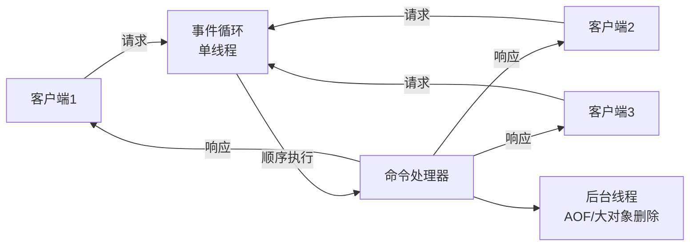
```mermaid
graph LR
    C1[客户端1] --> |请求| Q[事件循环\n单线程]
    C2[客户端2] --> |请求| Q
    C3[客户端3] --> |请求| Q
    Q --> |顺序执行| CMD[命令处理器]
    CMD --> |响应| C1
    CMD --> |响应| C2
    CMD --> |响应| C3
    CMD --> BG[后台线程\nAOF/大对象删除]
```

**为什么单线程还这么快？**

1. 纯内存操作，不涉及磁盘 IO（持久化是异步的）
2. 单线程避免了锁竞争和上下文切换开销
3. 使用 epoll/kqueue 等 IO 多路复用，高效处理大量连接
4. 数据结构设计精良，操作时间复杂度低

### Redis 6.0+：引入多线程 IO

Redis 6.0 引入了**多线程网络 IO**，但命令执行仍然是单线程：

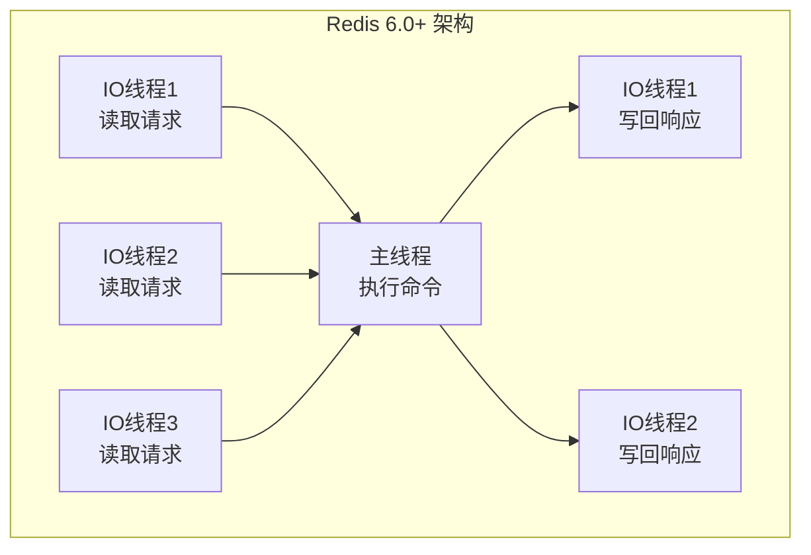
```mermaid
graph TD
    subgraph "Redis 6.0+ 架构"
        IO1[IO线程1\n读取请求] --> MAIN[主线程\n执行命令]
        IO2[IO线程2\n读取请求] --> MAIN
        IO3[IO线程3\n读取请求] --> MAIN
        MAIN --> WIO1[IO线程1\n写回响应]
        MAIN --> WIO2[IO线程2\n写回响应]
    end
```

**结论：**

- Redis 6.0 之前：单进程、命令处理单线程（有后台辅助线程）
- Redis 6.0+：命令执行单线程，网络 IO 多线程

***

## 7. 一个字符串类型的值能存储最大容量是多少?

**最大容量：512MB**

Redis String 类型底层使用 SDS（Simple Dynamic String，简单动态字符串）实现，最大存储 **512MB** 的数据。

```c
// SDS 结构示意
struct sdshdr {
    int len;    // 已使用长度
    int free;   // 剩余空间
    char buf[]; // 实际数据
};
```

**实际建议：**

- 单个 value 不要超过 10KB，否则会影响性能
- 存储大对象（如图片、视频）应使用对象存储，Redis 只存 URL 或 ID
- 超大 value 会导致网络传输慢、序列化/反序列化耗时、内存碎片等问题

***

## 8. Redis的持久化机制是什么?各自的优缺点?

Redis 提供两种持久化方式：**RDB（快照）** 和 **AOF（追加日志）**，以及两者结合的 **混合持久化**（Redis 4.0+）。

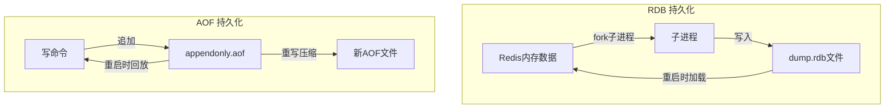
```mermaid
graph TD
    subgraph "RDB 持久化"
        R1[Redis内存数据] --> |fork子进程| R2[子进程]
        R2 --> |写入| R3[dump.rdb文件]
        R3 --> |重启时加载| R1
    end
    subgraph "AOF 持久化"
        A1[写命令] --> |追加| A2[appendonly.aof]
        A2 --> |重写压缩| A3[新AOF文件]
        A2 --> |重启时回放| A1
    end
```

### RDB（Redis Database Backup）

**原理：** 在指定时间间隔内，将内存中的数据集快照写入磁盘（fork 子进程，Copy-On-Write 机制）。

**触发方式：**

```bash
# 配置自动触发（save 秒数 修改次数）
save 900 1      # 900秒内有1次修改则触发
save 300 10     # 300秒内有10次修改则触发
save 60 10000   # 60秒内有10000次修改则触发

# 手动触发
SAVE    # 同步，阻塞主线程
BGSAVE  # 异步，fork子进程，推荐
```

**优点：**

- 文件紧凑，适合备份和灾难恢复
- 恢复速度快（直接加载二进制文件）
- 对性能影响小（子进程处理，主线程不阻塞）

**缺点：**

- 数据丢失风险：两次快照之间的数据可能丢失
- fork 子进程时，内存占用翻倍（Copy-On-Write）
- 数据量大时，fork 操作本身可能耗时较长

### AOF（Append Only File）

**原理：** 将每条写命令追加到 AOF 文件，重启时重放所有命令恢复数据。

**刷盘策略（appendfsync）：**

```bash
appendfsync always    # 每次写命令都刷盘，最安全，性能最差
appendfsync everysec  # 每秒刷盘一次，最多丢1秒数据（推荐）
appendfsync no        # 由OS决定，性能最好，可能丢较多数据
```

**AOF 重写：** AOF 文件会越来越大，Redis 会定期重写（BGREWRITEAOF），用最少命令表示当前数据状态。

**优点：**

- 数据更安全，最多丢失 1 秒数据（everysec 模式）
- 文件可读，便于排查问题
- 支持重写，控制文件大小

**缺点：**

- 文件比 RDB 大
- 恢复速度比 RDB 慢（需要回放所有命令）
- 写入性能略低于 RDB

### 混合持久化（Redis 4.0+）

```bash
aof-use-rdb-preamble yes  # 开启混合持久化
```

AOF 重写时，先写入 RDB 格式的全量数据，再追加增量 AOF 命令。兼顾了 RDB 的快速恢复和 AOF 的数据安全性。

### 对比总结

| 特性    | RDB         | AOF      | 混合     |
| ----- | ----------- | -------- | ------ |
| 数据安全性 | 低（可能丢分钟级数据） | 高（最多丢1秒） | 高      |
| 恢复速度  | 快           | 慢        | 快      |
| 文件大小  | 小           | 大        | 中      |
| 性能影响  | 小           | 中        | 中      |
| 适用场景  | 备份、可接受少量丢失  | 数据安全要求高  | 推荐生产使用 |

***

## 9. Redis常见性能问题和解决方案

### 问题1：Master 写内存快照（RDB/AOF）影响性能

**原因：** BGSAVE/BGREWRITEAOF 会 fork 子进程，内存大时 fork 耗时长，主线程短暂阻塞。

**解决：**

- Master 不开启持久化，由 Slave 负责持久化
- 使用 SSD 磁盘，加快 fork 后的写入速度
- 控制单实例内存不超过 10GB

### 问题2：主从复制延迟

**原因：** 网络带宽不足、Slave 处理能力弱、大量写操作。

**解决：**

- 主从部署在同一机房，减少网络延迟
- 避免在 Master 上执行耗时命令（如 KEYS \*）
- 使用 Redis 6.0+ 的多线程 IO 提升吞吐

### 问题3：慢查询（Slow Query）

**原因：** 使用了 O(N) 命令（KEYS、SMEMBERS、LRANGE 全量等）。

**解决：**

```bash
# 开启慢查询日志
slowlog-log-slower-than 10000  # 超过10ms记录
slowlog-max-len 128            # 最多保存128条

# 查看慢查询
SLOWLOG GET 10
```

### 问题4：内存碎片

**原因：** 频繁的增删改导致内存碎片率（mem\_fragmentation\_ratio）升高。

**解决：**

```bash
# Redis 4.0+ 支持在线碎片整理
activedefrag yes
active-defrag-ignore-bytes 100mb
active-defrag-threshold-lower 10
```

### 问题5：大 Key 问题

**原因：** 单个 key 的 value 过大（如几十 MB 的 Hash），读写耗时长，删除时阻塞主线程。

**解决：**

- 拆分大 key 为多个小 key
- 使用 UNLINK 代替 DEL（异步删除，Redis 4.0+）
- 定期扫描大 key：`redis-cli --bigkeys`

### 问题6：热点 Key

**原因：** 某个 key 访问量极高，单节点压力过大。

**解决：**

- 本地缓存（JVM 缓存）+ Redis 二级缓存
- 读写分离，多个 Slave 分担读压力
- key 加随机后缀，分散到多个节点

***

## 10. redis过期键的删除策略?

Redis 使用**惰性删除**和**定期删除**两种策略结合的方式处理过期键。

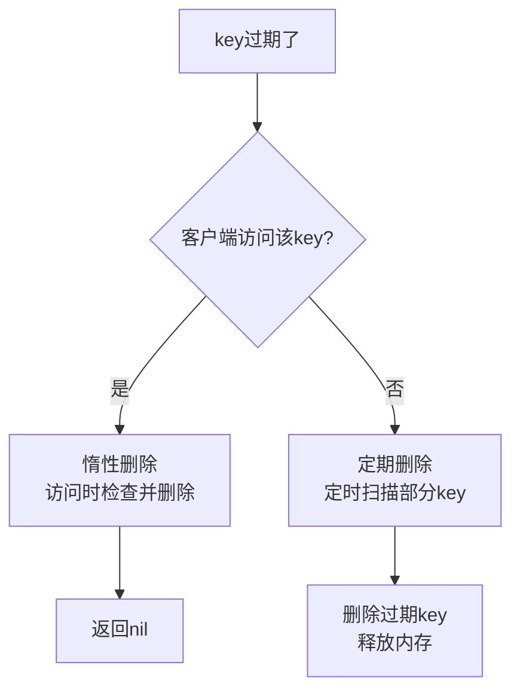
```mermaid
flowchart TD
    A[key过期了] --> B{客户端访问该key?}
    B --> |是| C[惰性删除\n访问时检查并删除]
    B --> |否| D[定期删除\n定时扫描部分key]
    C --> E[返回nil]
    D --> F[删除过期key\n释放内存]
```

### 1. 惰性删除（Lazy Expiration）

**原理：** 不主动删除过期 key，当客户端访问某个 key 时，才检查是否过期，如果过期则删除并返回 nil。

**优点：** 对 CPU 友好，不会主动消耗 CPU 去扫描。
**缺点：** 如果过期 key 长期没有被访问，会一直占用内存（内存泄漏风险）。

### 2. 定期删除（Periodic Expiration）

**原理：** Redis 每隔一段时间（默认 100ms）随机抽取一批设置了过期时间的 key，检查并删除其中已过期的 key。

**流程：**

1. 从设置了过期时间的 key 集合中随机抽取 20 个
2. 删除其中已过期的 key
3. 如果过期 key 比例超过 25%，重复步骤 1
4. 每次执行时间不超过 25ms（避免阻塞）

**优点：** 定期清理，避免内存无限增长。
**缺点：** 随机抽取，不能保证所有过期 key 都被及时清理。

### 3. 为什么不用定时删除？

定时删除（为每个 key 创建定时器，到期立即删除）虽然内存友好，但会消耗大量 CPU，在 Redis 这种高并发场景下不适用。

***

## 11. Redis的回收策略(淘汰策略)?

当 Redis 内存达到 `maxmemory` 上限时，会根据配置的淘汰策略决定如何处理新的写入请求。

```bash
# 配置最大内存
maxmemory 2gb

# 配置淘汰策略
maxmemory-policy allkeys-lru
```

### 8种淘汰策略

| 策略              | 说明                                   |
| --------------- | ------------------------------------ |
| noeviction      | 不淘汰，内存满时写操作返回错误（默认）                  |
| allkeys-lru     | 从所有 key 中淘汰最近最少使用的                   |
| volatile-lru    | 从设置了过期时间的 key 中淘汰最近最少使用的             |
| allkeys-random  | 从所有 key 中随机淘汰                        |
| volatile-random | 从设置了过期时间的 key 中随机淘汰                  |
| volatile-ttl    | 从设置了过期时间的 key 中淘汰剩余 TTL 最短的          |
| allkeys-lfu     | 从所有 key 中淘汰访问频率最低的（Redis 4.0+）       |
| volatile-lfu    | 从设置了过期时间的 key 中淘汰访问频率最低的（Redis 4.0+） |

### LRU vs LFU

- **LRU（Least Recently Used）**：淘汰最久没被访问的 key。缺点：某个 key 历史访问很多但最近没访问，会被误淘汰。
- **LFU（Least Frequently Used）**：淘汰访问频率最低的 key。更能反映 key 的"热度"，Redis 4.0+ 推荐使用。

**生产推荐：** 纯缓存场景用 `allkeys-lru` 或 `allkeys-lfu`；有持久化需求用 `volatile-lru`。

***

## 12. 为什么Redis需要把所有数据放到内存中?

Redis 的设计目标是**高性能**，将数据放在内存中是实现这一目标的核心手段。

**原因分析：**

1. **内存访问速度远超磁盘**
   - 内存随机访问：\~100 纳秒
   - SSD 随机访问：\~100 微秒（慢 1000 倍）
   - HDD 随机访问：\~10 毫秒（慢 100000 倍）
2. **避免磁盘 IO 的复杂性**
   - 不需要设计 B+ 树等磁盘友好的数据结构
   - 不需要缓冲池管理
   - 数据结构可以直接在内存中操作，实现简单高效
3. **持久化是异步的**
   - RDB/AOF 持久化在后台异步进行，不影响主线程的内存操作
   - 重启时从磁盘恢复数据到内存

**注意：** Redis 并非要求所有数据都必须在内存中。Redis 6.2+ 引入了 **Redis on Flash**（企业版），支持将部分数据存储在 SSD 上，但开源版仍以内存为主。

**内存不够怎么办？**

- 配置 `maxmemory` + 淘汰策略，让 Redis 自动淘汰冷数据
- 使用 Redis Cluster 横向扩展，多节点分担内存压力
- 数据压缩（使用 Hash 代替多个 String，开启 ziplist 编码）

***

## 13. Redis的同步机制了解么?

Redis 的同步机制主要指**主从复制（Replication）**，分为全量同步和增量同步两种。

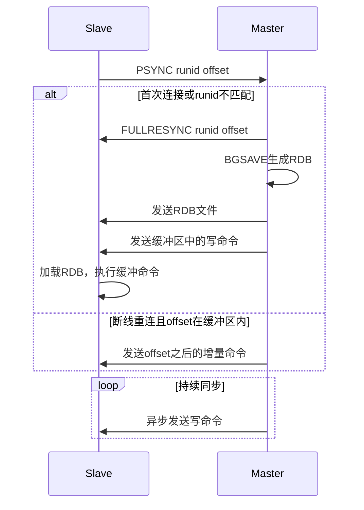
```mermaid
sequenceDiagram
    participant Slave
    participant Master
    Slave->>Master: PSYNC runid offset
    alt 首次连接或runid不匹配
        Master->>Slave: FULLRESYNC runid offset
        Master->>Master: BGSAVE生成RDB
        Master->>Slave: 发送RDB文件
        Master->>Slave: 发送缓冲区中的写命令
        Slave->>Slave: 加载RDB，执行缓冲命令
    else 断线重连且offset在缓冲区内
        Master->>Slave: 发送offset之后的增量命令
    end
    loop 持续同步
        Master->>Slave: 异步发送写命令
    end
```

### 全量同步（Full Resync）

触发条件：

- Slave 首次连接 Master
- Slave 断线重连后，复制偏移量（offset）不在 Master 的复制积压缓冲区（repl\_backlog）内

**流程：**

1. Slave 发送 `PSYNC ? -1`（首次）或 `PSYNC runid offset`（重连）
2. Master 执行 BGSAVE 生成 RDB 快照
3. Master 将 RDB 文件发送给 Slave
4. Slave 清空旧数据，加载 RDB
5. Master 将 RDB 生成期间的写命令（缓冲区）发给 Slave
6. 进入增量同步阶段

### 增量同步（Partial Resync）

触发条件：Slave 断线重连，且 offset 仍在 Master 的 repl\_backlog 缓冲区内。

**流程：** Master 只发送 Slave 缺失的那部分命令，效率远高于全量同步。

### 复制积压缓冲区（repl\_backlog）

```bash
# 配置缓冲区大小（默认1MB，生产建议调大）
repl-backlog-size 10mb
```

这是一个固定大小的环形缓冲区，Master 将最近的写命令存入其中。Slave 断线重连时，如果缺失的数据还在缓冲区内，就可以做增量同步；否则只能全量同步。

### 主从复制的特点

- **异步复制**：Master 不等待 Slave 确认，写操作延迟低，但可能丢数据
- **最终一致性**：Slave 数据可能短暂落后于 Master
- **读写分离**：Master 负责写，Slave 负责读，提升整体吞吐

***

## 14. Pipeline有什么好处，为什么要用pipeline?

### 什么是 Pipeline？

Pipeline（管道）允许客户端一次性发送多条命令，服务端批量执行后一次性返回所有结果，减少网络往返次数（RTT）。

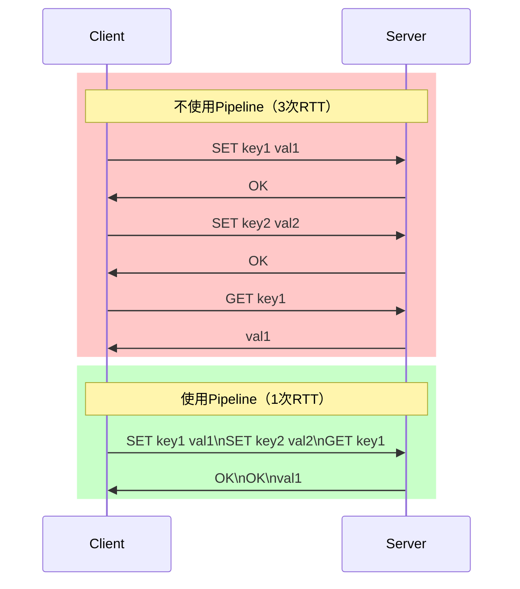
```mermaid
sequenceDiagram
    participant Client
    participant Server
    rect rgb(255, 200, 200)
        Note over Client,Server: 不使用Pipeline（3次RTT）
        Client->>Server: SET key1 val1
        Server->>Client: OK
        Client->>Server: SET key2 val2
        Server->>Client: OK
        Client->>Server: GET key1
        Server->>Client: val1
    end
    rect rgb(200, 255, 200)
        Note over Client,Server: 使用Pipeline（1次RTT）
        Client->>Server: SET key1 val1\nSET key2 val2\nGET key1
        Server->>Client: OK\nOK\nval1
    end
```

### 好处

1. **减少网络往返**：N 条命令从 N 次 RTT 降为 1 次 RTT，网络延迟高时效果显著
2. **提升吞吐量**：批量处理，服务端减少系统调用次数
3. **降低客户端等待时间**：不需要等每条命令返回再发下一条

### Java 示例（Jedis）

```java
Jedis jedis = new Jedis("localhost", 6379);
Pipeline pipeline = jedis.pipelined();

// 批量写入
for (int i = 0; i < 10000; i++) {
    pipeline.set("key" + i, "value" + i);
}

// 一次性提交并获取结果
List<Object> results = pipeline.syncAndReturnAll();
```

### 注意事项

- Pipeline 中的命令不是原子的，中间某条命令失败不会回滚其他命令
- 单次 Pipeline 不要包含太多命令（建议每批 100\~1000 条），避免服务端内存压力过大
- Pipeline 与事务（MULTI/EXEC）不同，事务保证原子性，Pipeline 不保证

***

## 15. 是否使用过Redis集群，集群的原理是什么?

### Redis Cluster 架构

Redis Cluster 是 Redis 3.0 引入的原生集群方案，通过数据分片实现横向扩展。

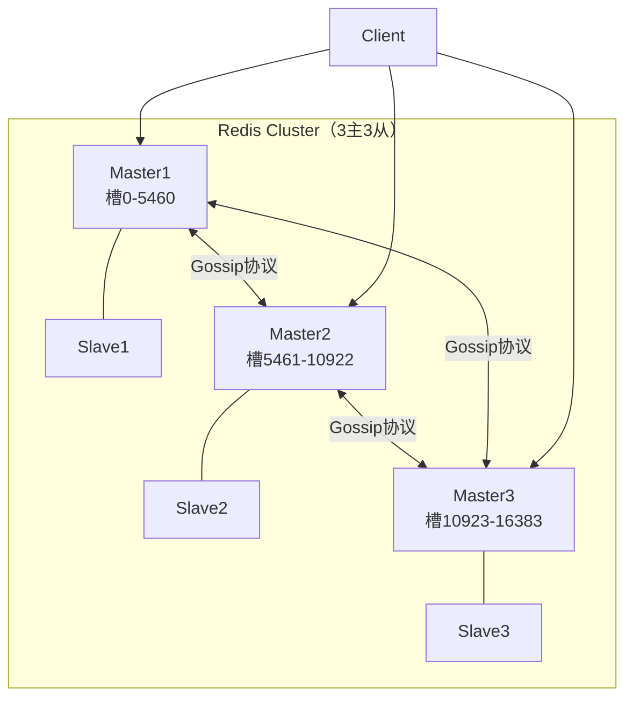
```mermaid
graph TD
    subgraph "Redis Cluster（3主3从）"
        M1[Master1\n槽0-5460] --- S1[Slave1]
        M2[Master2\n槽5461-10922] --- S2[Slave2]
        M3[Master3\n槽10923-16383] --- S3[Slave3]
        M1 <--> |Gossip协议| M2
        M2 <--> |Gossip协议| M3
        M1 <--> |Gossip协议| M3
    end
    Client --> M1
    Client --> M2
    Client --> M3
```

### 核心原理

**1. 数据分片（哈希槽）**

Redis Cluster 将数据空间划分为 **16384 个哈希槽（slot）**，每个 Master 节点负责一部分槽。

```
slot = CRC16(key) % 16384
```

**2. 节点通信（Gossip 协议）**

节点之间通过 Gossip 协议互相交换状态信息（节点存活、槽分配等），不需要中心节点。

**3. 请求路由（MOVED/ASK 重定向）**

```bash
# 客户端请求错误节点时，服务端返回 MOVED 重定向
127.0.0.1:7001> GET mykey
(error) MOVED 3999 127.0.0.1:7002
# 客户端重新向 7002 发送请求
```

**4. 故障转移**

- 节点间通过心跳检测故障（超时则标记为 PFAIL，多数节点确认则标记为 FAIL）
- Slave 自动选举成为新 Master（类似 Raft 选举）

### 集群的优势

- 无中心架构，无单点故障
- 数据自动分片，支持横向扩展
- 节点失效时自动故障转移

***

## 16. Redis集群方案什么情况下会导致整个集群不可用?

### 触发集群不可用的条件

Redis Cluster 的可用性依赖于每个哈希槽都有至少一个可用节点。

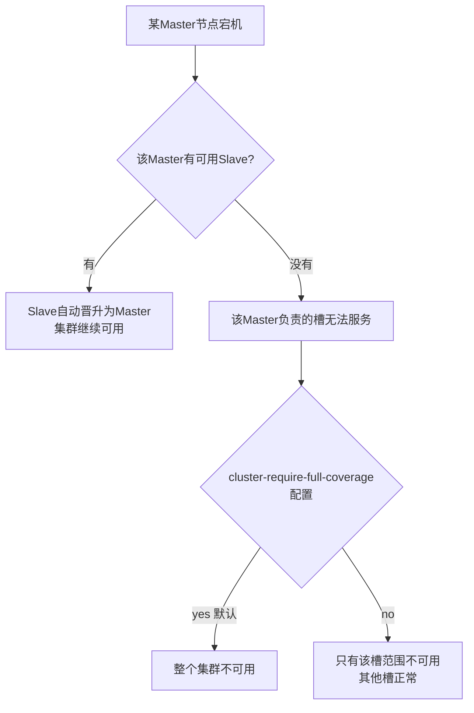
```mermaid
flowchart TD
    A[某Master节点宕机] --> B{该Master有可用Slave?}
    B --> |有| C[Slave自动晋升为Master\n集群继续可用]
    B --> |没有| D[该Master负责的槽无法服务]
    D --> E{cluster-require-full-coverage配置}
    E --> |yes 默认| F[整个集群不可用]
    E --> |no| G[只有该槽范围不可用\n其他槽正常]
```

**具体场景：**

1. **某个 Master 宕机且没有 Slave**：该 Master 负责的哈希槽无节点服务，默认情况下整个集群停止接受请求。
2. **某个 Master 和它所有的 Slave 同时宕机**：同上，该槽区间完全不可用。
3. **超过半数 Master 节点宕机**：集群无法完成故障转移投票，整体不可用。
4. **网络分区（脑裂）**：少数派分区的 Master 会停止服务（超过 `cluster-node-timeout` 后）。

### 配置建议

```bash
# 允许部分槽不可用时，其他槽继续服务（生产环境建议设为 no）
cluster-require-full-coverage no

# 节点超时时间（影响故障检测速度）
cluster-node-timeout 15000
```

**最佳实践：** 每个 Master 至少配置 1 个 Slave，重要业务配置 2 个 Slave，避免单点导致整个集群不可用。

***

## 17. Redis支持的Java客户端都有哪些?官方推荐用哪个?

### 主流 Java 客户端

| 客户端          | 特点                   | 适用场景               |
| ------------ | -------------------- | ------------------ |
| **Jedis**    | 同步阻塞，API 简单直观，轻量     | 简单场景、学习入门          |
| **Lettuce**  | 异步/响应式，基于 Netty，线程安全 | 高并发、Spring Boot 默认 |
| **Redisson** | 功能最丰富，封装了分布式对象和锁     | 分布式场景、企业级应用        |

### 官方推荐

Redis 官方网站推荐 **Lettuce** 和 **Redisson**。

- **Spring Boot 2.x+** 默认使用 **Lettuce**（替代了 Spring Boot 1.x 的 Jedis）
- 需要分布式锁、分布式集合等高级功能时推荐 **Redisson**

### Maven 依赖

```xml
<!-- Jedis -->
<dependency>
    <groupId>redis.clients</groupId>
    <artifactId>jedis</artifactId>
    <version>4.4.3</version>
</dependency>

<!-- Lettuce（Spring Boot 已内置） -->
<dependency>
    <groupId>io.lettuce</groupId>
    <artifactId>lettuce-core</artifactId>
    <version>6.2.6.RELEASE</version>
</dependency>

<!-- Redisson -->
<dependency>
    <groupId>org.redisson</groupId>
    <artifactId>redisson-spring-boot-starter</artifactId>
    <version>3.23.4</version>
</dependency>
```

***

## 18. Jedis与Redisson对比有什么优缺点?

### Jedis

**优点：**

- API 简单，与 Redis 命令一一对应，学习成本低
- 轻量，依赖少
- 同步阻塞模型，代码逻辑直观

**缺点：**

- 非线程安全，多线程环境必须使用连接池（JedisPool）
- 不支持异步操作
- 功能较基础，不支持分布式对象、分布式锁等高级特性
- 集群支持相对简单

```java
// Jedis 使用连接池示例
JedisPoolConfig config = new JedisPoolConfig();
config.setMaxTotal(100);
config.setMaxIdle(10);
JedisPool pool = new JedisPool(config, "localhost", 6379);

try (Jedis jedis = pool.getResource()) {
    jedis.set("key", "value");
    String val = jedis.get("key");
}
```

### Redisson

**优点：**

- 功能极其丰富：分布式锁、分布式集合、布隆过滤器、限流器、延迟队列等
- 线程安全，基于 Netty 异步通信
- 支持响应式编程
- 自动处理集群、哨兵、主从等拓扑
- 看门狗机制自动续期分布式锁

**缺点：**

- 封装层次深，底层 Redis 命令不透明，调试困难
- 依赖较重，引入了 Netty 等大量依赖
- 学习成本相对较高

```java
// Redisson 分布式锁示例
RedissonClient redisson = Redisson.create(config);
RLock lock = redisson.getLock("myLock");

try {
    // 尝试加锁，最多等待10秒，锁持有30秒后自动释放
    boolean locked = lock.tryLock(10, 30, TimeUnit.SECONDS);
    if (locked) {
        // 执行业务逻辑
    }
} finally {
    lock.unlock();
}
```

### 选择建议

- 简单缓存读写 → **Jedis** 或 **Lettuce**
- Spring Boot 项目 → **Lettuce**（默认集成）
- 需要分布式锁、分布式集合 → **Redisson**

***

## 19. Redis如何设置密码及验证密码?

### 设置密码

**方式一：配置文件（永久生效）**

```bash
# redis.conf
requirepass your_strong_password_here
```

**方式二：运行时设置（重启后失效）**

```bash
127.0.0.1:6379> CONFIG SET requirepass "your_password"
OK
```

### 验证密码

```bash
# 连接时直接认证
redis-cli -h 127.0.0.1 -p 6379 -a your_password

# 连接后认证
127.0.0.1:6379> AUTH your_password
OK

# 验证失败示例
127.0.0.1:6379> AUTH wrong_password
(error) WRONGPASS invalid username-password pair
```

### Redis 6.0+ ACL（访问控制列表）

Redis 6.0 引入了 ACL，支持多用户、细粒度权限控制：

```bash
# 创建用户并设置权限
ACL SETUSER alice on >password123 ~cached:* +get +set

# 说明：
# on        - 启用该用户
# >password123 - 设置密码
# ~cached:* - 只能访问 cached: 前缀的 key
# +get +set - 只允许 GET 和 SET 命令

# 查看所有用户
ACL LIST

# 切换用户认证
AUTH alice password123
```

### 安全建议

- 密码长度至少 16 位，包含大小写字母、数字和特殊字符
- 生产环境必须设置密码，并通过防火墙限制 Redis 端口访问
- Redis 6.0+ 推荐使用 ACL 替代单一密码

***

## 20. 说说Redis哈希槽的概念?

### 什么是哈希槽？

Redis Cluster 将整个数据空间划分为 **16384 个哈希槽（Hash Slot）**，每个 key 通过以下公式映射到某个槽：

```
slot = CRC16(key) % 16384
```

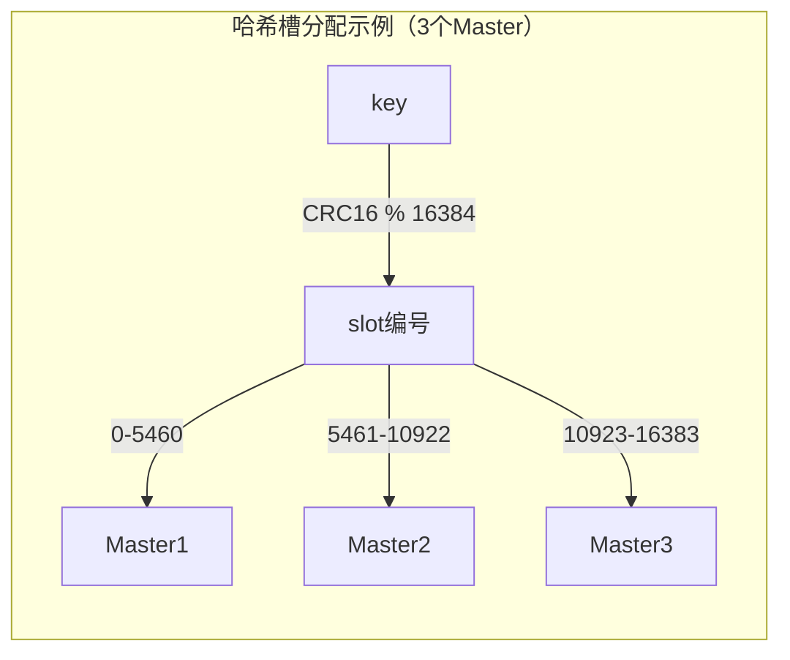
```mermaid
graph LR
    subgraph "哈希槽分配示例（3个Master）"
        K[key] --> |CRC16 % 16384| S[slot编号]
        S --> |0-5460| M1[Master1]
        S --> |5461-10922| M2[Master2]
        S --> |10923-16383| M3[Master3]
    end
```

### 为什么是 16384 个槽？

- 16384 = 2^14，心跳包中用 bitmap 表示槽分配，16384 个槽只需 2KB（16384/8=2048 字节），而 65536 个槽需要 8KB，心跳包太大
- 集群节点数通常不超过 1000 个，16384 个槽已经足够分配

### 哈希标签（Hash Tag）

如果 key 中包含 `{}`，则只对 `{}` 内的内容计算 CRC16，确保相关 key 落在同一个槽：

```bash
# 这两个 key 会落在同一个槽（因为 {} 内都是 user:1000）
SET {user:1000}.name "Alice"
SET {user:1000}.age 25

# 可以对它们执行 MGET（跨 key 操作要求在同一槽）
MGET {user:1000}.name {user:1000}.age
```

### 槽迁移（在线扩缩容）

添加或删除节点时，可以在线迁移槽，不影响服务：

```bash
# 将槽 0-1000 从 node1 迁移到 node4
redis-cli --cluster reshard 127.0.0.1:7001 \
  --cluster-from node1-id \
  --cluster-to node4-id \
  --cluster-slots 1000
```

***

## 21. Redis集群的主从复制模型是怎样的?

Redis Cluster 中每个 Master 节点可以有一个或多个 Slave 节点，构成主从复制模型。

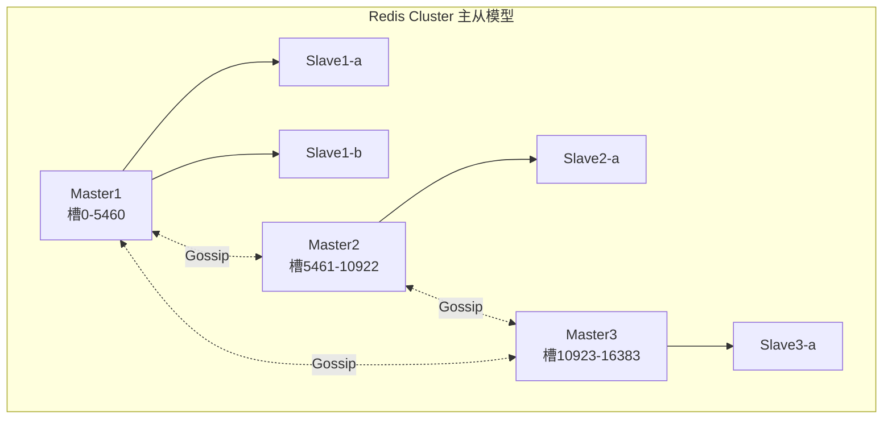
```mermaid
graph TD
    subgraph "Redis Cluster 主从模型"
        M1[Master1\n槽0-5460] --> S1a[Slave1-a]
        M1 --> S1b[Slave1-b]
        M2[Master2\n槽5461-10922] --> S2a[Slave2-a]
        M3[Master3\n槽10923-16383] --> S3a[Slave3-a]
        M1 <-.->|Gossip| M2
        M2 <-.->|Gossip| M3
        M1 <-.->|Gossip| M3
    end
```

### 复制流程

1. Slave 启动后向 Master 发送 `PSYNC` 命令
2. Master 执行 `BGSAVE` 生成 RDB，同时将新写命令缓冲
3. RDB 发送完毕后，Master 将缓冲的写命令发给 Slave
4. 之后通过异步复制保持数据同步

### 故障转移

- Master 宕机后，Cluster 中其他 Master 节点通过投票选出该 Master 的某个 Slave 晋升为新 Master
- 原 Master 恢复后，自动变为新 Master 的 Slave

### 读写分离

```bash
# Slave 默认不响应读请求，需开启 readonly
redis-cli -c -p 7002
127.0.0.1:7002> READONLY
OK
127.0.0.1:7002> GET mykey  # 此时可读取该Slave数据
```

**注意：** Slave 数据可能略落后于 Master（异步复制），读操作可能读到旧数据。

***

## 22. Redis集群会有写操作丢失吗?为什么?

**会的。** Redis Cluster 采用异步复制，在特定情况下写操作可能丢失。

### 场景一：Master 宕机前未同步到 Slave

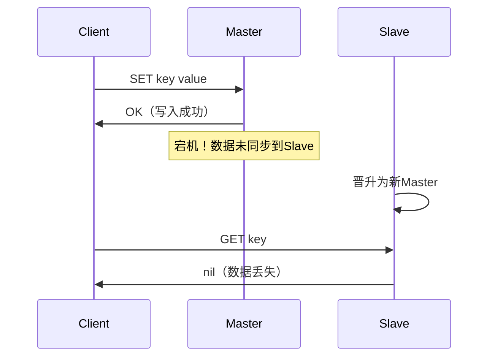
```mermaid
sequenceDiagram
    participant Client
    participant Master
    participant Slave
    Client->>Master: SET key value
    Master->>Client: OK（写入成功）
    Note over Master: 宕机！数据未同步到Slave
    Slave->>Slave: 晋升为新Master
    Client->>Slave: GET key
    Slave->>Client: nil（数据丢失）
```

**原因：** Master 确认写入后立即返回客户端，异步将数据发送给 Slave。如果 Master 在发送前宕机，这部分数据就丢失了。

### 场景二：网络分区（脑裂）

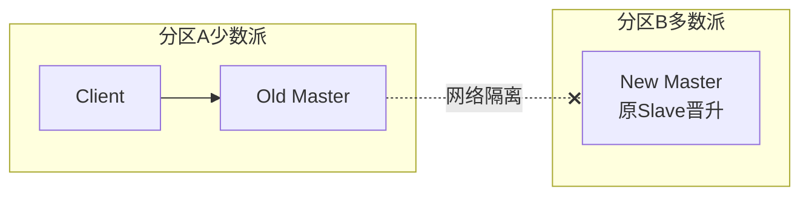
```mermaid
graph LR
    subgraph "分区A少数派"
        C[Client] --> M[Old Master]
    end
    subgraph "分区B多数派"
        NM[New Master\n原Slave晋升]
    end
    M -.-x|网络隔离| NM
```

1. 网络分区后，少数派的 Master 继续接受客户端写入
2. 多数派选出新 Master
3. 网络恢复后，Old Master 降级为 Slave，其上未同步的写操作丢失

### 如何减少数据丢失？

```bash
# 要求至少有N个Slave才接受写操作
min-replicas-to-write 1

# Slave延迟不超过N秒才接受写操作
min-replicas-max-lag 10
```

**配置含义：** 至少有 1 个 Slave 的数据延迟不超过 10 秒，Master 才接受写请求。这样虽然降低了可用性，但提高了数据安全性。

**结论：** Redis Cluster 不保证强一致性，是最终一致性模型。如果业务对数据丢失零容忍，需要额外的业务层保障（如写操作双写数据库）。

***

## 23. Redis集群之间是如何复制的?

Redis Cluster 节点间的数据复制基于**主从异步复制**，节点状态同步使用 **Gossip 协议**。

### 主从数据复制

与单机主从复制相同（见第13题），流程为：全量同步（RDB）+ 增量同步（命令流）。

### 节点间状态同步（Gossip 协议）

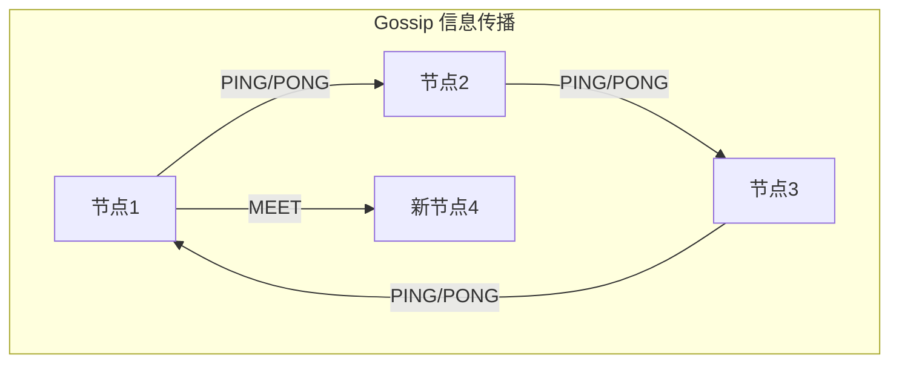
```mermaid
graph TD
    subgraph "Gossip 信息传播"
        N1[节点1] --> |PING/PONG| N2[节点2]
        N2 --> |PING/PONG| N3[节点3]
        N3 --> |PING/PONG| N1
        N1 --> |MEET| N4[新节点4]
    end
```

Gossip 协议的消息类型：

| 消息类型 | 说明                    |
| ---- | --------------------- |
| PING | 随机向部分节点发送，携带自身及已知节点信息 |
| PONG | 响应 PING，确认存活并返回自身信息   |
| MEET | 邀请新节点加入集群             |
| FAIL | 广播某节点已确认下线            |

**Gossip 特点：**

- 去中心化，无单点故障
- 最终一致性，信息传播有延迟
- 每个节点随机选择几个节点通信，O(log N) 时间内信息传遍全集群

### 复制积压缓冲区

Master 维护一个环形缓冲区（repl\_backlog），存储最近的写命令。Slave 断线重连时，若 offset 仍在缓冲区内，只需增量同步，避免代价高昂的全量同步。

***

## 24. Redis集群最大节点个数是多少?

**官方建议最大节点数：1000 个。**

### 原因分析

Redis Cluster 有 16384 个哈希槽，理论上最多支持 16384 个 Master 节点（每个节点至少负责 1 个槽）。但实际限制来自于：

1. **Gossip 通信开销**：每个节点需要与其他节点保持心跳，节点越多，通信开销越大
2. **心跳包大小**：每次心跳包含部分节点信息，节点过多会导致网络拥塞
3. **故障检测延迟**：节点数增多，故障传播时间变长

### 槽与节点的关系

```
16384 个槽 / 最多1000个节点 ≈ 每个节点至少负责 ~16 个槽
```

### 实际生产建议

- 通常 3\~6 个 Master（每个 Master 带 1\~2 个 Slave）已能满足大多数场景
- 如需更大规模，考虑多集群 + 业务分库，而非单集群无限扩展

***

## 25. Redis集群如何选择数据库?

### 重要结论：Redis Cluster 只支持数据库 0（db0）

Redis 单机模式支持 16 个数据库（db0\~db15），通过 `SELECT` 命令切换：

```bash
# 单机模式
SELECT 0  # 切换到db0（默认）
SELECT 1  # 切换到db1
```

但在 **Redis Cluster 模式下**，`SELECT` 命令被禁用，所有数据只存储在 **db0**。

### 为什么 Cluster 不支持多数据库？

1. **实现复杂度**：数据分布在不同节点，多数据库会使槽映射更复杂
2. **设计理念**：Cluster 模式通过多节点实现数据隔离，多数据库的需求可通过部署多个 Cluster 实例满足
3. **一致性维护**：多数据库在主从复制和故障转移中增加了额外复杂性

### 替代方案

- **key 前缀隔离**：用不同前缀区分业务，如 `user:xxx`、`order:xxx`
- **多实例**：不同业务部署独立的 Redis Cluster
- **命名空间**：在应用层封装 key 前缀逻辑

***

## 26. 怎么测试Redis的连通性?

### 方法一：PING 命令（最常用）

```bash
# redis-cli 直接测试
redis-cli -h 127.0.0.1 -p 6379 ping
# 输出：PONG（连通正常）

# 带密码
redis-cli -h 127.0.0.1 -p 6379 -a yourpassword ping
```

### 方法二：redis-cli 交互模式

```bash
redis-cli -h 127.0.0.1 -p 6379
127.0.0.1:6379> PING
PONG
127.0.0.1:6379> PING "hello"
"hello"
```

### 方法三：telnet / nc

```bash
# telnet
telnet 127.0.0.1 6379

# nc（netcat）
nc -zv 127.0.0.1 6379
```

### 方法四：Java 代码测试（Jedis）

```java
try (Jedis jedis = new Jedis("127.0.0.1", 6379)) {
    String result = jedis.ping();
    System.out.println(result); // PONG
}
```

### 方法五：Spring Boot Actuator 健康检查

Spring Boot Actuator 自动检测 Redis 连通性：

```bash
GET /actuator/health
# 返回示例：
# {"status":"UP","components":{"redis":{"status":"UP","details":{"version":"7.0.0"}}}}
```

***

## 27. 怎么理解Redis事务?

### Redis 事务的基本概念

Redis 事务通过 `MULTI`/`EXEC`/`DISCARD`/`WATCH` 命令实现，将一组命令打包，一次性、顺序地执行。

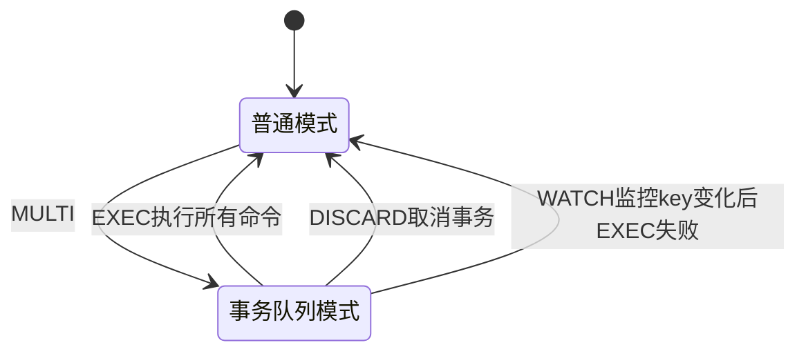
```mermaid
stateDiagram-v2
    [*] --> 普通模式
    普通模式 --> 事务队列模式: MULTI
    事务队列模式 --> 普通模式: EXEC执行所有命令
    事务队列模式 --> 普通模式: DISCARD取消事务
    事务队列模式 --> 普通模式: WATCH监控key变化后EXEC失败
```

### 事务执行流程

```bash
127.0.0.1:6379> MULTI          # 开启事务
OK
127.0.0.1:6379> SET key1 val1  # 命令入队，不立即执行
QUEUED
127.0.0.1:6379> SET key2 val2
QUEUED
127.0.0.1:6379> GET key1
QUEUED
127.0.0.1:6379> EXEC           # 提交事务，顺序执行所有命令
1) OK
2) OK
3) "val1"
```

### Redis 事务与数据库事务的区别

| 特性  | Redis 事务   | 数据库事务（ACID） |
| --- | ---------- | ----------- |
| 原子性 | 部分（见下方说明）  | 完整          |
| 一致性 | 不完全保证      | 保证          |
| 隔离性 | 单线程执行，天然隔离 | 多级别隔离       |
| 持久性 | 依赖持久化配置    | 保证          |
| 回滚  | 不支持        | 支持          |

### 重要：Redis 事务不支持回滚

```bash
MULTI
SET key1 "hello"
INCR key1        # key1是字符串，INCR运行时会失败
SET key2 "world"
EXEC
# 结果：
# 1) OK          ← SET 成功
# 2) (error) ... ← INCR 失败，但不影响其他命令
# 3) OK          ← SET 继续成功
```

**Redis 不回滚的原因：** Redis 认为命令失败通常是编程错误（类型不匹配、语法错误），不应该影响其他命令。回滚会增加复杂性，与 Redis 简单快速的设计理念相悖。

### WATCH（乐观锁）

WATCH 实现了 CAS（Compare-And-Swap）语义：

```bash
WATCH balance          # 监控 balance key
val = GET balance      # 读取当前值
# ... 计算新值 ...
MULTI
SET balance (val-100)
EXEC   # 如果EXEC前balance被其他客户端修改，返回nil（事务取消）
```

***

## 28. Redis事务相关的命令有哪几个?

| 命令                   | 说明                            |
| -------------------- | ----------------------------- |
| `MULTI`              | 开启事务，后续命令进入队列                 |
| `EXEC`               | 执行事务队列中的所有命令                  |
| `DISCARD`            | 取消事务，清空命令队列                   |
| `WATCH key [key...]` | 监控一个或多个 key，若在 EXEC 前被修改，事务失败 |
| `UNWATCH`            | 取消所有 WATCH 监控                 |

### 错误处理的两种情况

**情况一：语法错误（命令入队时报错）→ 整个事务不执行**

```bash
MULTI
SET key1 val1
NOTACOMMAND    # 语法错误，入队失败
SET key2 val2
EXEC
# (error) EXECABORT Transaction discarded because of previous errors.
# key1 和 key2 都不会被设置
```

**情况二：运行时错误（命令执行时报错）→ 只有出错命令失败，其余继续**

```bash
MULTI
SET key1 "hello"
INCR key1    # 运行时错误（对字符串执行数字操作）
SET key2 "world"
EXEC
# 1) OK      ← key1 设置成功
# 2) (error) ← INCR 失败
# 3) OK      ← key2 设置成功（不受影响）
```

***

## 29. Redis key的过期时间和永久有效分别怎么设置?

### 设置过期时间

```bash
# 创建 key 时直接指定过期时间（Redis 2.6.12+）
SET key value EX 3600          # 3600秒后过期
SET key value PX 3600000       # 3600000毫秒后过期
SET key value EXAT 1735689600  # 到指定Unix秒时间戳过期（Redis 6.2+）
SET key value PXAT 1735689600000  # 到指定Unix毫秒时间戳过期（Redis 6.2+）

# 对已有 key 设置过期时间
EXPIRE key 3600                # 秒级过期
PEXPIRE key 3600000            # 毫秒级过期
EXPIREAT key 1735689600        # 到指定Unix秒时间戳
PEXPIREAT key 1735689600000    # 到指定Unix毫秒时间戳
```

### 设置永久有效（移除过期时间）

```bash
# PERSIST 命令移除过期时间，key 变为永久有效
PERSIST key
# 返回 1 表示成功移除，0 表示 key 不存在或本来就没有过期时间
```

### 查看剩余过期时间

```bash
TTL key      # 返回剩余秒数；-1 表示永久有效；-2 表示 key 不存在
PTTL key     # 返回剩余毫秒数
```

### 实际示例

```bash
# 30分钟会话
SET session:user123 "data" EX 1800
TTL session:user123   # 返回 1800（逐渐递减）

# 移除过期时间变为永久
PERSIST session:user123
TTL session:user123   # 返回 -1（永久有效）

# 24小时计数器
SET counter 0
EXPIRE counter 86400
```

***

## 30. Redis如何做内存优化?

### 1. 使用合适的数据结构

```bash
# 差的做法：用多个 String 存储用户信息（每个 key 都有元数据开销）
SET user:1:name "Alice"
SET user:1:age "25"
SET user:1:email "alice@example.com"

# 好的做法：用 Hash 存储（一个 key，字段共享元数据）
HSET user:1 name "Alice" age 25 email "alice@example.com"
```

### 2. 利用压缩编码（ziplist/listpack）

Redis 对小对象会自动使用压缩编码，内存占用更少：

```bash
# redis.conf 调整阈值（数量和大小在阈值内时使用压缩编码）
hash-max-ziplist-entries 128   # Hash 元素不超过128个时用ziplist
hash-max-ziplist-value 64      # 每个元素值不超过64字节时用ziplist
zset-max-ziplist-entries 128
list-max-ziplist-size -2       # listpack 最大8KB
```

### 3. 设置合理的过期时间

不需要永久保存的数据一定要设置 TTL，让 Redis 自动清理，避免内存持续增长。

### 4. 在应用层压缩大 value

```java
// 存储前压缩
byte[] compressed = GzipUtils.compress(jsonString.getBytes());
jedis.set("key".getBytes(), compressed);

// 读取后解压
byte[] data = jedis.get("key".getBytes());
String json = new String(GzipUtils.decompress(data));
```

### 5. 使用 32 位 Redis

如果 key 数量不超过 2^32（约 40 亿），使用 32 位 Redis 编译版本，指针占 4 字节（64 位占 8 字节），可节省约 30% 内存。

### 6. 共享整数对象

Redis 默认缓存 0\~9999 的整数对象，多个 key 的 value 若为这些整数，共享同一对象，无额外内存分配。

### 7. 内存分析工具

```bash
# 找出内存占用最大的 key
redis-cli --bigkeys

# 查看内存总体信息
redis-cli INFO memory

# 分析特定 key 的内存占用
redis-cli MEMORY USAGE mykey

# 内存使用报告（Redis 4.0+）
redis-cli MEMORY DOCTOR
```

***

## 31. Redis回收进程如何工作的?

Redis 的内存回收（淘汰）由主线程在每次处理命令时同步触发，并非独立后台进程。

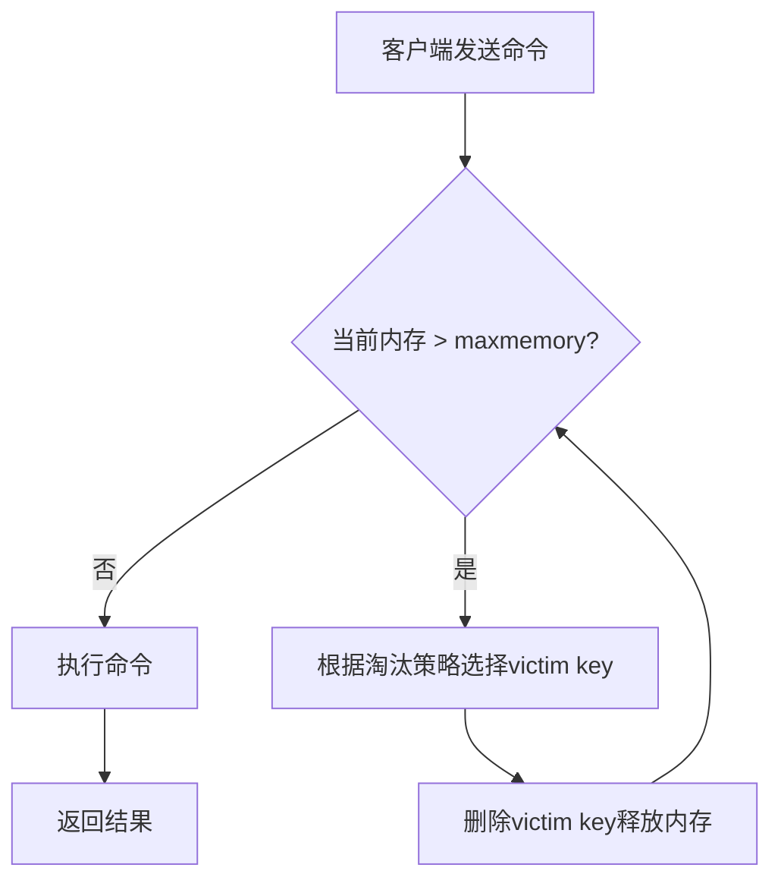
```mermaid
flowchart TD
    A[客户端发送命令] --> B{当前内存 > maxmemory?}
    B --> |否| E[执行命令]
    B --> |是| C[根据淘汰策略选择victim key]
    C --> D[删除victim key释放内存]
    D --> B
    E --> F[返回结果]
```

### 回收触发时机

每当 Redis 接收到一条新命令时，会先检查内存使用量是否超过 `maxmemory`：

- 未超过：直接执行命令
- 已超过：按配置的淘汰策略选出要删除的 key，删除后再执行命令

### 淘汰算法（以 LRU 为例）

Redis 的 LRU 并非精确 LRU，而是**近似 LRU**：

```bash
# 配置 LRU 采样数量（越大越精确，但 CPU 开销越大，默认5）
maxmemory-samples 5
```

每次淘汰时，随机采样 `maxmemory-samples` 个 key，从中选出最久未访问的那个删除。这样避免了维护精确 LRU 链表的高内存开销。

### 回收与过期的区别

| 机制   | 触发条件           | 目的     |
| ---- | -------------- | ------ |
| 过期删除 | key 的 TTL 到期   | 清理到期数据 |
| 内存淘汰 | 内存超过 maxmemory | 控制内存总量 |

两者独立运行，互相配合共同管理 Redis 内存。

***

## 32. 都有哪些办法可以降低Redis的内存使用情况呢?

### 1. 精简 key 名称

```bash
# 差：key 名过长占用内存
SET user_profile_info_name_field "Alice"

# 好：简短但仍有意义
SET u:1:name "Alice"
```

### 2. 压缩 value

- 对大字符串在应用层 GZIP/Snappy 压缩后存储
- 对 JSON 对象考虑用 MessagePack/Protobuf 序列化，体积比 JSON 小 30%\~80%

### 3. 合理使用数据结构

- 用 Hash 代替多个 String 存储对象字段
- 用 Bitmap 代替 Set 存储用户签到、在线状态等布尔集合
- 用 HyperLogLog 代替 Set 做基数统计（误差 0.81%，内存固定 12KB）

### 4. 调整压缩编码阈值

```bash
# 让更多对象使用压缩编码（ziplist/listpack）
hash-max-ziplist-entries 256   # 适当调大
hash-max-ziplist-value 128
set-max-intset-entries 512     # 纯整数 Set 使用 intset
```

### 5. 删除无用数据

```bash
# 扫描并删除无用 key（使用 SCAN 避免阻塞）
redis-cli --scan --pattern "temp:*" | xargs redis-cli del

# 异步删除大 key（Redis 4.0+，避免阻塞主线程）
UNLINK bigkey
```

### 6. 开启内存碎片整理

```bash
# Redis 4.0+ 在线碎片整理
activedefrag yes
active-defrag-ignore-bytes 100mb   # 碎片超过100MB才整理
active-defrag-threshold-lower 10   # 碎片率超过10%才整理
```

### 7. 使用对象共享

Redis 内置共享 0\~9999 的整数，value 为这些整数时不占额外内存。业务上可利用整数枚举代替字符串状态值。

### 8. 数据分片

将数据分散到多个 Redis 实例，每个实例内存压力更小，可开启更多压缩编码优化。

***

## 33. Redis的内存用完了会发生什么?

当 Redis 内存达到 `maxmemory` 上限时，行为取决于 `maxmemory-policy` 配置：

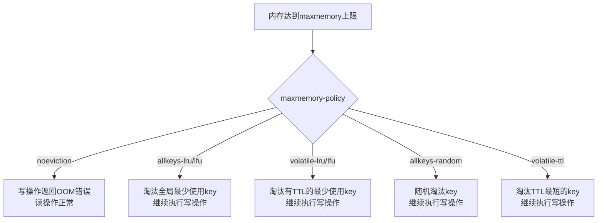
```mermaid
flowchart TD
    A[内存达到maxmemory上限] --> B{maxmemory-policy}
    B --> |noeviction| C[写操作返回OOM错误\n读操作正常]
    B --> |allkeys-lru/lfu| D[淘汰全局最少使用key\n继续执行写操作]
    B --> |volatile-lru/lfu| E[淘汰有TTL的最少使用key\n继续执行写操作]
    B --> |allkeys-random| F[随机淘汰key\n继续执行写操作]
    B --> |volatile-ttl| G[淘汰TTL最短的key\n继续执行写操作]
```

### noeviction（默认策略）下的具体表现

```bash
127.0.0.1:6379> SET newkey "value"
(error) OOM command not allowed when used memory > 'maxmemory'.

# 但读操作仍然正常
127.0.0.1:6379> GET existingkey
"value"
```

### 对应用的影响

- 如果使用 noeviction，写操作会抛出异常，应用需要捕获并处理（降级、告警等）
- 如果使用 allkeys-lru，Redis 会自动淘汰数据，应用对此无感知，但可能读到缓存缺失（cache miss）

### 生产建议

```bash
# 纯缓存场景（允许淘汰）
maxmemory-policy allkeys-lru

# 混合存储场景（部分数据不能丢）
maxmemory-policy volatile-lru  # 只淘汰有过期时间的 key

# 需要感知内存满（自己控制淘汰逻辑）
maxmemory-policy noeviction
```

同时配合监控告警，当内存使用率超过 80% 时提前告警，避免触发 OOM。

***

## 34. 一个Redis实例最多能存放多少的keys?List、Set、Sorted Set他们最多能存放多少元素?

### Redis 实例最大 key 数量

Redis 的 key 存储在哈希表中，理论上只受**内存大小**限制。官方文档说明：

> Redis can handle up to 2^32 keys, and was tested in practice to handle at least 250 million keys per instance.

即理论上限约 **42亿（2^32）** 个 key，实测可稳定运行 **2.5亿** 个 key。

### 各数据类型最大元素数量

| 数据类型       | 最大元素数量         | 说明             |
| ---------- | -------------- | -------------- |
| List       | 2^32 - 1 ≈ 42亿 | 每个列表元素不超过512MB |
| Set        | 2^32 - 1 ≈ 42亿 | 无序不重复          |
| Sorted Set | 2^32 - 1 ≈ 42亿 | 带分数的有序集合       |
| Hash       | 2^32 - 1 ≈ 42亿 | 字段-值对数量        |

### 实际瓶颈

理论上限很大，但实际瓶颈是**内存**。以 String 类型为例：

- 每个 key-value 对（空值）约占 \~50 字节的元数据开销
- 1 亿个 key 仅元数据就需要约 5GB 内存

**实践建议：**

- 单实例 key 数量控制在 1000 万以内性能最佳
- 超过 1 亿 key 时，`DEBUG SLEEP`、`BGSAVE` 等操作延迟明显增加
- 数据量大时使用 Redis Cluster 横向分片

***

## 35. MySQL里有2000w数据，redis中只存20w的数据，如何保证redis中的数据都是热点数据?

### 核心思路：让 Redis 自动淘汰冷数据，只保留热数据

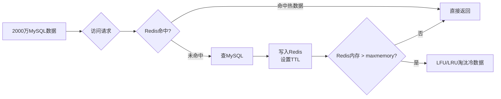
```mermaid
flowchart LR
    A[2000万MySQL数据] --> B{访问请求}
    B --> C{Redis命中?}
    C --> |命中热数据| D[直接返回]
    C --> |未命中| E[查MySQL]
    E --> F[写入Redis\n设置TTL]
    F --> G{Redis内存 > maxmemory?}
    G --> |是| H[LFU/LRU淘汰冷数据]
    G --> |否| D
```

### 方案一：配置内存上限 + LFU 淘汰策略（推荐）

```bash
# redis.conf
maxmemory 4gb              # 限制内存（约存20w条数据）
maxmemory-policy allkeys-lfu  # 淘汰访问频率最低的key（冷数据）
```

**原理：** Redis 自动将访问频率低的 key 淘汰，保留访问频繁的 key（即热点数据）。

### 方案二：业务层主动管理（Cache-Aside 模式）

```java
public String getData(String key) {
    // 1. 先查 Redis
    String value = redis.get(key);
    if (value != null) {
        return value;
    }
    
    // 2. Redis 未命中，查 MySQL
    value = mysql.query(key);
    
    // 3. 写入 Redis，设置合理的 TTL（热数据自然被频繁刷新）
    redis.set(key, value, 3600); // 1小时过期
    
    return value;
}
```

热点数据因为被频繁访问，TTL 不断被刷新（或通过 LFU 频率高不被淘汰）；冷数据 TTL 到期后自动消失。

### 方案三：预热热点数据

系统启动时，将已知的热点数据（如Top榜单、首页数据）提前加载到 Redis：

```java
// 系统启动时预热
@PostConstruct
public void warmUp() {
    List<Item> hotItems = mysql.queryTopN(200000);
    for (Item item : hotItems) {
        redis.set("item:" + item.getId(), JSON.toJSON(item), 86400);
    }
}
```

### 综合方案

1. 设置 `maxmemory`（约为20w数据的内存量）
2. 使用 `allkeys-lfu` 淘汰策略
3. Cache-Aside 模式，每次访问 MySQL 后写入 Redis 并设置 TTL
4. 高频访问的数据 TTL 不断被刷新 → 长期留在 Redis
5. 低频访问的数据 TTL 到期或被 LFU 淘汰 → 自然退出

***

## 36. Redis最适合的场景?

### 1. 缓存（最常用）

```java
// 先查缓存，缓存未命中再查数据库
String user = redis.get("user:" + id);
if (user == null) {
    user = db.query(id);
    redis.setex("user:" + id, 3600, user);
}
```

### 2. 会话管理（Session）

```bash
# 存储用户会话，设置过期时间
SET session:token123 '{"userId":1,"role":"admin"}' EX 1800
```

### 3. 排行榜

```bash
# Sorted Set 天然支持排行榜
ZADD game:score 9999 "Alice"
ZADD game:score 8888 "Bob"
ZREVRANGE game:score 0 9 WITHSCORES  # 取前10名
```

### 4. 计数器 / 限流

```bash
# 文章访问计数
INCR article:1001:views

# 接口限流（每分钟最多100次）
local count = redis.incr("rate:user:1001")
if count == 1 then redis.expire("rate:user:1001", 60) end
if count > 100 then return "限流" end
```

### 5. 消息队列（轻量级）

```bash
# List 实现简单队列
LPUSH queue:tasks '{"type":"email","to":"alice@example.com"}'
BRPOP queue:tasks 0  # 阻塞消费
```

### 6. 分布式锁

```bash
# SET NX EX 实现分布式锁
SET lock:order:1001 "random_value" NX EX 30
```

### 7. 地理位置

```bash
# 存储地理坐标
GEOADD stores 116.4074 39.9042 "store:1"

# 查找附近门店（5km内）
GEORADIUS stores 116.4074 39.9042 5 km ASC
```

### 8. 布隆过滤器（Redis Modules）

```bash
# 使用 RedisBloom 模块
BF.ADD emails "alice@example.com"
BF.EXISTS emails "alice@example.com"  # 1（可能存在）
BF.EXISTS emails "fake@example.com"   # 0（一定不存在）
```

***

## 37. 假如Redis里面有1亿个key，其中有10w个key是以某个固定的已知的前缀开头的，如果将它们全部找出来?

### 方案一：SCAN 命令（推荐）

**不要用 KEYS 命令！** `KEYS pattern` 是 O(N) 操作，会阻塞 Redis 主线程，1亿个 key 的情况下可能阻塞数秒。

```bash
# SCAN 命令（游标式迭代，不阻塞）
SCAN 0 MATCH "prefix:*" COUNT 100

# 返回示例：
# 1) "43456"   ← 下一次游标（非0则继续）
# 2) 1) "prefix:key1"
#    2) "prefix:key2"
#    ...

# 游标为0表示遍历完成
SCAN 43456 MATCH "prefix:*" COUNT 100
```

### Java 实现（Jedis）

```java
public List<String> scanKeys(Jedis jedis, String pattern) {
    List<String> result = new ArrayList<>();
    String cursor = "0";
    
    do {
        ScanResult<String> scanResult = jedis.scan(cursor, 
            new ScanParams().match(pattern).count(100));
        cursor = scanResult.getCursor();
        result.addAll(scanResult.getResult());
    } while (!"0".equals(cursor));  // 游标回到0表示遍历完成
    
    return result;
}
```

### SCAN vs KEYS 对比

| 特性    | KEYS pattern  | SCAN          |
| ----- | ------------- | ------------- |
| 时间复杂度 | O(N)          | O(1) 每次调用     |
| 是否阻塞  | 是（期间无法处理其他命令） | 否（每次只扫描少量key） |
| 返回结果  | 一次性全部返回       | 分批返回（可能有重复）   |
| 适用场景  | 测试/开发环境少量key  | 生产环境          |

### 注意事项

- SCAN 可能返回**重复 key**（rehash 期间），需要在应用层去重
- SCAN 的 COUNT 参数是提示，不保证每次精确返回 N 个
- 在 Cluster 模式下，需要对每个节点分别执行 SCAN

```bash
# Cluster 模式下扫描所有节点
redis-cli --cluster call 127.0.0.1:7001 SCAN 0 MATCH "prefix:*" COUNT 100
```

***

## 38. 如果有大量的key需要设置同一时间过期，一般需要注意什么?

### 核心问题：缓存雪崩（Cache Avalanche）

如果大量 key 在同一时刻集中过期，会导致大量请求同时穿透到数据库，造成数据库压力骤增，严重时可能导致数据库宕机。

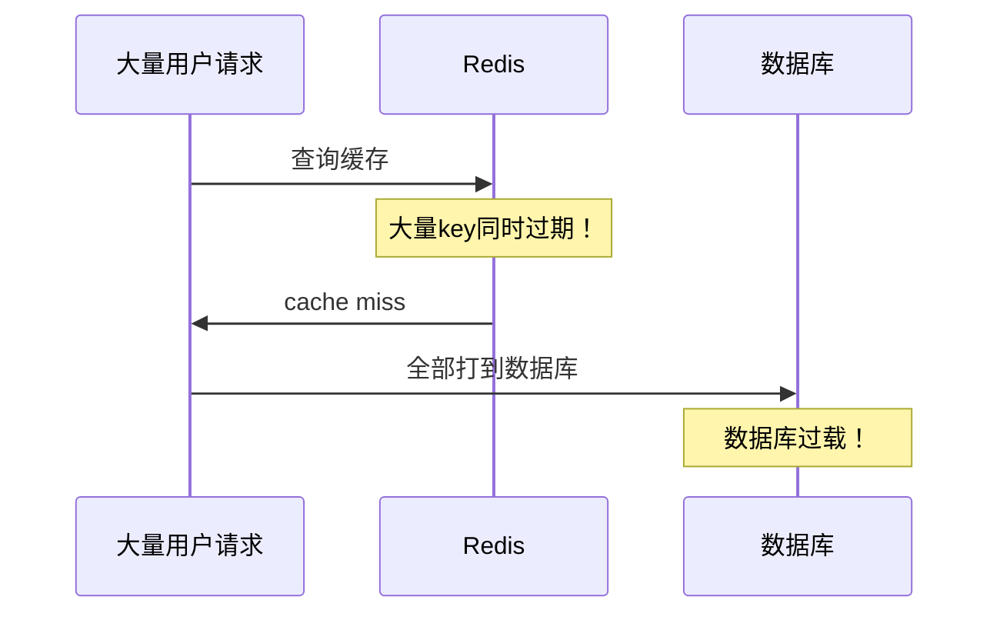
```mermaid
sequenceDiagram
    participant Users as 大量用户请求
    participant Redis
    participant DB as 数据库
    Users->>Redis: 查询缓存
    Note over Redis: 大量key同时过期！
    Redis->>Users: cache miss
    Users->>DB: 全部打到数据库
    Note over DB: 数据库过载！
```

### 解决方案

**方案一：过期时间加随机值（最常用）**

```java
// 不好：所有key同一时间过期
redis.setex("product:" + id, 3600, data);

// 好：在基础TTL上加随机偏移（±10分钟）
int randomOffset = new Random().nextInt(600) - 300;  // -300 到 +300 秒
redis.setex("product:" + id, 3600 + randomOffset, data);
```

**方案二：分批设置过期时间**

```java
// 按业务分组，不同组设置不同过期时间
for (int i = 0; i < keys.size(); i++) {
    int ttl = 3600 + (i % 10) * 60;  // 3600~4200秒之间分散
    redis.setex(keys.get(i), ttl, values.get(i));
}
```

**方案三：互斥锁防止缓存击穿**

```java
public String getWithLock(String key) {
    String value = redis.get(key);
    if (value != null) return value;
    
    // 获取分布式锁，只让一个线程回源
    if (redis.set("lock:" + key, "1", "NX", "EX", 5) != null) {
        try {
            value = db.query(key);
            redis.setex(key, 3600, value);
        } finally {
            redis.del("lock:" + key);
        }
    } else {
        // 未获取到锁，短暂等待后重试
        Thread.sleep(50);
        value = getWithLock(key);
    }
    return value;
}
```

**方案四：永不过期 + 后台异步刷新**

```java
// key 永不过期，但 value 中包含逻辑过期时间
String cache = redis.get(key);
CacheValue cv = JSON.parse(cache);
if (cv.isExpired()) {
    // 异步刷新，当前返回旧数据
    threadPool.submit(() -> refreshCache(key));
}
return cv.getData();
```

***

## 39. 使用过Redis做异步队列么，你是怎么用的?

### 方案一：List + BRPOP（简单队列）

```bash
# 生产者：将任务推入队列头部
LPUSH queue:email '{"to":"alice@example.com","subject":"Hello"}'

# 消费者：阻塞等待并取出（BRPOP超时0表示永久阻塞）
BRPOP queue:email 0
```

```java
// Java 消费者示例（Jedis）
while (true) {
    List<String> result = jedis.brpop(0, "queue:email");
    String task = result.get(1);
    processEmail(task);
}
```

**优点：** 简单，原生支持阻塞等待
**缺点：** 不支持多消费者组、不支持消息确认、宕机可能丢消息

### 方案二：发布订阅（Pub/Sub）

```bash
# 订阅者
SUBSCRIBE channel:notifications

# 发布者
PUBLISH channel:notifications '{"type":"order","orderId":1001}'
```

**优点：** 支持一对多广播
**缺点：** 消息不持久化，订阅者下线期间的消息会丢失；不支持消息确认

### 方案三：Sorted Set 实现延迟队列

```bash
# 生产者：score 为执行时间戳
ZADD delay:queue 1735690000 '{"task":"send_email","userId":123}'

# 消费者：定时轮询，取出到期任务
ZRANGEBYSCORE delay:queue 0 1735689999  # 取出score<=当前时间的任务
ZREM delay:queue task_value             # 取出后删除
```

```java
// 延迟队列消费者
while (true) {
    long now = System.currentTimeMillis() / 1000;
    Set<String> tasks = jedis.zrangeByScore("delay:queue", 0, now);
    for (String task : tasks) {
        if (jedis.zrem("delay:queue", task) > 0) {  // 确保只被一个消费者处理
            processTask(task);
        }
    }
    Thread.sleep(1000);
}
```

### 方案四：Stream（Redis 5.0+，推荐）

Stream 是 Redis 专为消息队列设计的数据结构，支持消费者组、消息确认、持久化：

```bash
# 生产者：写入消息
XADD mystream * field1 value1 field2 value2

# 创建消费者组
XGROUP CREATE mystream mygroup $ MKSTREAM

# 消费者：读取消息
XREADGROUP GROUP mygroup consumer1 COUNT 10 BLOCK 2000 STREAMS mystream >

# 消息确认（处理完成后ACK）
XACK mystream mygroup 1609459200000-0
```

### 方案对比

| 方案           | 持久化       | 消费者组  | 消息确认  | 延迟消息  |
| ------------ | --------- | ----- | ----- | ----- |
| List + BRPOP | 依赖AOF/RDB | 不支持   | 不支持   | 不支持   |
| Pub/Sub      | 不支持       | 广播模式  | 不支持   | 不支持   |
| Sorted Set   | 依赖AOF/RDB | 需自己实现 | 需自己实现 | 支持    |
| Stream       | 依赖AOF/RDB | 原生支持  | 原生支持  | 不直接支持 |

**生产建议：** 简单队列用 List；延迟队列用 Sorted Set；需要可靠消息用 Stream 或专业MQ（RabbitMQ/Kafka）。

***

## 40. 使用过Redis分布式锁么，它是什么回事?

### 为什么需要分布式锁？

单机环境下用 `synchronized` 或 `ReentrantLock` 可以保证线程安全，但在分布式系统中，多个服务实例运行在不同机器上，JVM 级别的锁无效。需要一个所有节点都能访问的"锁服务"，Redis 就是常用的选择。

### 基本实现：SET NX EX

```bash
# 加锁：key不存在时设置成功（NX），并设置过期时间防止死锁（EX）
SET lock:order:1001 "random_uuid_value" NX EX 30

# 解锁：只能由加锁者解锁（Lua脚本保证原子性）
if redis.call("GET", KEYS[1]) == ARGV[1] then
    return redis.call("DEL", KEYS[1])
else
    return 0
end
```

```java
// Java 加锁
String lockKey = "lock:order:1001";
String lockValue = UUID.randomUUID().toString();
boolean locked = "OK".equals(jedis.set(lockKey, lockValue, "NX", "EX", 30));

// Java 解锁（原子操作）
String script = "if redis.call('GET',KEYS[1])==ARGV[1] then " +
                "return redis.call('DEL',KEYS[1]) else return 0 end";
jedis.eval(script, 1, lockKey, lockValue);
```

### 为什么 value 要用随机值？

防止误删其他线程的锁：

```
线程A加锁 → 业务执行超时 → 锁自动过期
线程B加锁成功 → 线程A执行完毕，误删了线程B的锁！
```

使用随机 value，解锁时先验证 value 是否匹配，不匹配则不删除。

### Redisson 看门狗机制（推荐生产使用）

手动管理锁过期时间容易出错（业务超时 > 锁过期时间）。Redisson 提供了\*\*看门狗（Watchdog）\*\*自动续期：

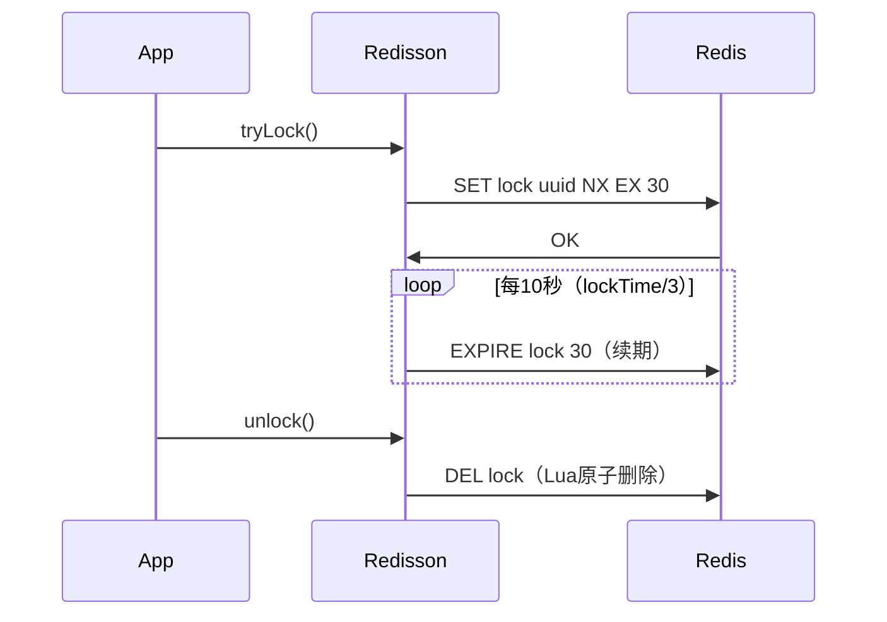
```mermaid
sequenceDiagram
    participant App
    participant Redisson
    participant Redis
    App->>Redisson: tryLock()
    Redisson->>Redis: SET lock uuid NX EX 30
    Redis->>Redisson: OK
    loop 每10秒（lockTime/3）
        Redisson->>Redis: EXPIRE lock 30（续期）
    end
    App->>Redisson: unlock()
    Redisson->>Redis: DEL lock（Lua原子删除）
```

```java
RLock lock = redisson.getLock("lock:order:1001");
try {
    // waitTime=10s（等待获取锁的时间），leaseTime=-1（看门狗自动续期）
    if (lock.tryLock(10, -1, TimeUnit.SECONDS)) {
        // 执行业务逻辑
        processOrder(1001);
    }
} finally {
    if (lock.isHeldByCurrentThread()) {
        lock.unlock();
    }
}
```

### RedLock（多节点分布式锁）

单节点 Redis 锁存在主从切换导致锁丢失的问题。Redisson 实现了 RedLock 算法：

```mermaid
graph LR
    Client --> |加锁| R1[Redis节点1]
    Client --> |加锁| R2[Redis节点2]
    Client --> |加锁| R3[Redis节点3]
    Client --> |加锁| R4[Redis节点4]
    Client --> |加锁| R5[Redis节点5]
    Note[超过半数节点加锁成功\n且总耗时 < 锁有效时间\n才认为加锁成功]
```

```java
// RedLock 示例
RLock lock1 = redisson1.getLock("lock:order");
RLock lock2 = redisson2.getLock("lock:order");
RLock lock3 = redisson3.getLock("lock:order");

RedissonRedLock redLock = new RedissonRedLock(lock1, lock2, lock3);
try {
    redLock.lock();
    // 业务逻辑
} finally {
    redLock.unlock();
}
```

### 常见问题汇总

| 问题     | 原因                     | 解决方案                 |
| ------ | ---------------------- | -------------------- |
| 死锁     | 加锁后程序崩溃未解锁             | 设置过期时间（EX）           |
| 误删他人锁  | 没有验证 value             | value 使用 UUID，解锁前校验  |
| 锁提前过期  | 业务执行时间 > 锁TTL          | Redisson 看门狗自动续期     |
| 主从切换丢锁 | Master 加锁后宕机，Slave 未同步 | 使用 RedLock 算法        |
| 锁不可重入  | 同一线程二次加锁死锁             | Redisson 可重入锁（计数器实现） |

***

## 总结

| 主题   | 核心要点                                                                |
| ---- | ------------------------------------------------------------------- |
| 数据结构 | String/List/Hash/Set/ZSet 五大基础类型，Stream/Bitmap/HyperLogLog/Geo 扩展类型 |
| 持久化  | RDB 快照（恢复快）+ AOF 日志（数据安全）+ 混合模式（推荐生产）                               |
| 线程模型 | 6.0 前单线程命令执行；6.0+ 网络 IO 多线程，命令仍单线程                                  |
| 过期策略 | 惰性删除 + 定期删除                                                         |
| 淘汰策略 | 8种策略，缓存场景推荐 allkeys-lru/lfu                                         |
| 集群   | 16384 哈希槽，Gossip 协议，最多建议 1000 节点                                    |
| 事务   | MULTI/EXEC，不支持回滚，WATCH 实现乐观锁                                        |
| 分布式锁 | SET NX EX + UUID value，生产推荐 Redisson 看门狗                            |
| 消息队列 | List（简单）/ Sorted Set（延迟）/ Stream（可靠，5.0+推荐）                         |
| 性能优化 | 避免大 key/热 key，使用 Pipeline，合理使用压缩编码                                  |

