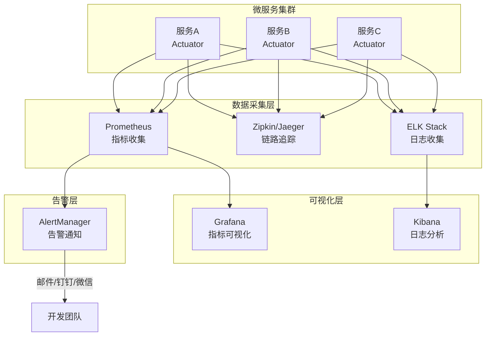

# Spring Boot 面试题详解

## 目录

1. [什么是Spring Boot?](#1-什么是spring-boot)
2. [Spring Boot有哪些优点?](#2-spring-boot有哪些优点)
3. [什么是JavaConfig?](#3-什么是javaconfig)
4. [如何重新加载SpringBoot上的更改，而无需重新启动服务器?](#4-如何重新加载springboot上的更改而无需重新启动服务器)
5. [Spring Boot中的监视器是什么?](#5-spring-boot中的监视器是什么)
6. [如何在Spring Boot中禁用Actuator端点安全性?](#6-如何在spring-boot中禁用actuator端点安全性)
7. [如何在自定义端口上运行Spring Boot应用程序?](#7-如何在自定义端口上运行spring-boot应用程序)
8. [什么是YAML?](#8-什么是yaml)
9. [如何实现Spring Boot应用程序的安全性?](#9-如何实现spring-boot应用程序的安全性)
10. [如何集成Spring Boot和ActiveMQ?](#10-如何集成spring-boot和activemq)
11. [如何使用Spring Boot实现分页和排序?](#11-如何使用spring-boot实现分页和排序)
12. [什么是Swagger?你用Spring Boot实现了它吗?](#12-什么是swagger你用spring-boot实现了它吗)
13. [什么是Spring Profiles?](#13-什么是spring-profiles)
14. [什么是Spring Batch?](#14-什么是spring-batch)
15. [什么是FreeMarker模板?](#15-什么是freemarker模板)
16. [如何使用Spring Boot实现异常处理?](#16-如何使用spring-boot实现异常处理)
17. [您使用了哪些starter maven依赖项?](#17-您使用了哪些starter-maven依赖项)
18. [什么是CSRF攻击?](#18-什么是csrf攻击)
19. [什么是WebSockets?](#19-什么是websockets)
20. [什么是AOP?](#20-什么是aop)
21. [什么是Apache Kafka?](#21-什么是apache-kafka)
22. [我们如何监视所有Spring Boot微服务?](#22-我们如何监视所有spring-boot微服务)

---

## 1. 什么是Spring Boot?

### 简介

Spring Boot是由Pivotal团队提供的全新框架,其设计目的是用来简化Spring应用的初始搭建以及开发过程。该框架使用了特定的方式来进行配置,从而使开发人员不再需要定义样板化的配置。

### 核心特性

**1. 独立运行**
- Spring Boot内嵌了Tomcat、Jetty或Undertow服务器
- 可以直接通过java -jar命令运行应用
- 不需要部署WAR文件到外部服务器

**2. 自动配置**
- 根据项目中添加的依赖自动配置Spring
- 例如：添加了spring-boot-starter-web，会自动配置SpringMVC
- 可以通过@EnableAutoConfiguration注解开启

**3. 提供starter依赖**
- starter是一组方便的依赖描述符
- 例如spring-boot-starter-web包含了构建Web应用所需的全部依赖
- 不需要手动管理繁琐的版本兼容问题

**4. 无需XML配置**
- 完全基于注解和Java代码进行配置
- 摒弃了传统Spring繁琐的XML配置文件

### Spring Boot自动配置流程

```mermaid
flowchart TD
    A[应用启动] --> B[@SpringBootApplication]
    B --> C[@EnableAutoConfiguration]
    C --> D[读取META-INF/spring.factories]
    D --> E[加载AutoConfiguration类列表]
    E --> F{检查@Conditional条件}
    F -->|条件满足| G[注册Bean到容器]
    F -->|条件不满足| H[跳过该配置]
    G --> I[应用配置完成]
    H --> I
```

### 最简单的Spring Boot应用

```java
@SpringBootApplication
public class MyApplication {
    public static void main(String[] args) {
        SpringApplication.run(MyApplication.class, args);
    }
}
```

### Spring Boot与Spring的区别

| 特性 | Spring | Spring Boot |
|------|--------|-------------|
| 配置方式 | 大量XML或Java配置 | 自动配置，极少手动配置 |
| 服务器 | 需要外部服务器 | 内嵌服务器 |
| 部署方式 | WAR包 | JAR包或WAR包 |
| 开发效率 | 较低 | 较高 |
| 学习曲线 | 陡峭 | 平缓 |

---

## 2. Spring Boot有哪些优点?

### 主要优点详解

**1. 快速开发，减少开发时间**

Spring Boot提供了大量的自动配置，开发者只需专注于业务逻辑，不需要花费大量时间在框架配置上。

**2. 无需额外的XML配置**

传统Spring项目需要大量的XML配置文件（如applicationContext.xml、web.xml等），Spring Boot完全抛弃了这种方式。

**3. 避免大量的Maven导入和各种版本冲突**

Spring Boot的starter机制将相关依赖打包，并且经过了兼容性测试，大大减少了版本冲突问题。

```xml
<!-- 只需要一个starter，不需要手动列出所有依赖 -->
<dependency>
    <groupId>org.springframework.boot</groupId>
    <artifactId>spring-boot-starter-web</artifactId>
</dependency>
```

**4. 提供意见性默认配置（Opinionated Defaults）**

Spring Boot对大多数情况提供了合理的默认配置，同时允许开发者在需要时覆盖这些配置。

**5. 基于注解的配置**

```java
@Configuration
@EnableWebSecurity
public class SecurityConfig {
    // 安全配置
}
```

**6. 内嵌HTTP服务器**

- 默认内嵌Tomcat（可切换为Jetty或Undertow）
- 应用可直接打包成可执行JAR运行
- 简化了部署流程，特别适合容器化部署

**7. 提供应用监控（Actuator）**

Spring Boot Actuator提供了生产级别的监控功能，可以监控应用的健康状况、性能指标等。

**8. 与微服务架构完美契合**

Spring Boot轻量级、易于部署的特性使其成为构建微服务的理想选择，与Spring Cloud完美配合。

**9. 活跃的社区支持**

Spring Boot拥有庞大的社区，文档完善，问题容易找到解决方案。

---

## 3. 什么是JavaConfig?

### 概念解释

JavaConfig是Spring框架提供的一种使用Java类和注解来替代传统XML配置文件的配置方式。简单来说，就是用Java代码来告诉Spring如何创建和管理Bean。

### 核心注解

**@Configuration**
- 标记一个类为配置类（相当于一个XML配置文件）
- 该类中可以包含多个@Bean方法

**@Bean**
- 标记一个方法，方法的返回值会被注册为Spring容器中的Bean
- 相当于XML中的`<bean>`标签

**@ComponentScan**
- 告诉Spring在哪些包中扫描组件
- 相当于XML中的`<context:component-scan>`

### 代码示例

**传统XML配置方式：**
```xml
<!-- applicationContext.xml -->
<beans>
    <bean id="userService" class="com.example.UserService">
        <property name="userRepository" ref="userRepository"/>
    </bean>
    <bean id="userRepository" class="com.example.UserRepository"/>
</beans>
```

**JavaConfig方式：**
```java
@Configuration
@ComponentScan(basePackages = "com.example")
public class AppConfig {

    @Bean
    public UserRepository userRepository() {
        return new UserRepository();
    }

    @Bean
    public UserService userService() {
        // 通过方法调用注入依赖
        return new UserService(userRepository());
    }
}
```

### JavaConfig的优点

| 优点 | 说明 |
|------|------|
| 类型安全 | 编译时就能发现错误，XML配置只能运行时发现 |
| 重构友好 | IDE可以安全重构Java代码 |
| 可读性强 | 代码比XML更直观 |
| 可复用性 | 配置类可以继承、组合 |
| 调试方便 | 可以设置断点调试 |

---

## 4. 如何重新加载SpringBoot上的更改，而无需重新启动服务器?

### 方法一：使用Spring Boot DevTools（推荐）

Spring Boot DevTools是官方提供的开发工具，可以实现代码修改后自动重启应用。

**添加依赖：**
```xml
<dependency>
    <groupId>org.springframework.boot</groupId>
    <artifactId>spring-boot-devtools</artifactId>
    <scope>runtime</scope>
    <optional>true</optional>
</dependency>
```

**DevTools的工作原理：**

DevTools使用两个类加载器：
- **基础类加载器**：加载不经常变化的类（如第三方库）
- **重启类加载器**：加载项目自己的类

当检测到classpath下的文件变化时，只重新加载"重启类加载器"中的类，因此重启速度比完全重启快很多。

**配置示例（application.properties）：**
```properties
# 开启自动重启（默认开启）
spring.devtools.restart.enabled=true

# 排除不需要触发重启的路径
spring.devtools.restart.exclude=static/**,public/**

# 添加额外的监控路径
spring.devtools.restart.additional-paths=scripts/**
```

### 方法二：使用JRebel（商业工具）

JRebel是一款商业插件，可以在不重启服务器的情况下实时热部署代码更改，支持更多场景（如修改类结构）。

### 方法三：LiveReload

DevTools内置了LiveReload服务器，配合浏览器插件，可以在文件变更时自动刷新浏览器。

```properties
# 开启LiveReload
spring.devtools.livereload.enabled=true
```

### 方法四：手动触发（IDEA等IDE）

在IntelliJ IDEA中，可以通过Build -> Build Project（Ctrl+F9）来触发重新编译，配合DevTools实现热重启。

### 各方法比较

| 方法 | 费用 | 重启速度 | 支持范围 |
|------|------|----------|----------|
| DevTools | 免费 | 快（比完全重启快） | 代码逻辑变更 |
| JRebel | 收费 | 极快（无需重启） | 几乎所有变更 |
| LiveReload | 免费 | 中等 | 静态资源 |

---

## 5. Spring Boot中的监视器是什么?

### 概念

Spring Boot Actuator（监视器/执行器）是Spring Boot的一个子项目，提供了一系列生产级别的功能，帮助我们监控和管理Spring Boot应用程序。

### 添加依赖

```xml
<dependency>
    <groupId>org.springframework.boot</groupId>
    <artifactId>spring-boot-starter-actuator</artifactId>
</dependency>
```

### 常用端点（Endpoints）

| 端点 | 路径 | 说明 |
|------|------|------|
| health | /actuator/health | 显示应用健康信息 |
| info | /actuator/info | 显示应用基本信息 |
| metrics | /actuator/metrics | 显示应用度量信息 |
| env | /actuator/env | 显示环境变量 |
| beans | /actuator/beans | 显示所有Spring Bean |
| mappings | /actuator/mappings | 显示所有URL映射 |
| loggers | /actuator/loggers | 显示和修改日志级别 |
| threaddump | /actuator/threaddump | 执行线程转储 |
| httptrace | /actuator/httptrace | 显示HTTP请求追踪信息 |

### 配置示例

```yaml
management:
  endpoints:
    web:
      exposure:
        # 暴露所有端点（生产环境需谨慎）
        include: "*"
        # 或者只暴露特定端点
        # include: health,info,metrics
  endpoint:
    health:
      # 显示详细健康信息
      show-details: always
```

### 自定义健康检查

```java
@Component
public class DatabaseHealthIndicator implements HealthIndicator {

    @Autowired
    private DataSource dataSource;

    @Override
    public Health health() {
        try (Connection conn = dataSource.getConnection()) {
            // 检查数据库连接
            return Health.up()
                .withDetail("database", "可用")
                .withDetail("连接数", "正常")
                .build();
        } catch (Exception e) {
            return Health.down()
                .withDetail("错误", e.getMessage())
                .build();
        }
    }
}
```

### 自定义Info信息

```yaml
info:
  app:
    name: 我的Spring Boot应用
    version: 1.0.0
    description: 这是一个示例应用
  author: 开发团队
```

---

## 6. 如何在Spring Boot中禁用Actuator端点安全性?

### 背景

默认情况下，Spring Boot Actuator的某些端点（如/actuator/env、/actuator/beans等）需要认证才能访问，以保护敏感信息。但在开发测试环境中，有时需要禁用这些安全限制。

### 方法一：在application.properties中配置（Spring Boot 2.x）

```properties
# 暴露所有端点（不需要认证即可访问）
management.endpoints.web.exposure.include=*

# 禁用安全认证（不推荐在生产环境使用）
management.security.enabled=false
```

### 方法二：在application.yml中配置

```yaml
management:
  endpoints:
    web:
      exposure:
        include: "*"
  security:
    enabled: false
```

### 方法三：通过Security配置排除Actuator路径

```java
@Configuration
@EnableWebSecurity
public class SecurityConfig extends WebSecurityConfigurerAdapter {

    @Override
    protected void configure(HttpSecurity http) throws Exception {
        http
            .authorizeRequests()
            // 允许所有人访问actuator端点
            .antMatchers("/actuator/**").permitAll()
            // 其他路径需要认证
            .anyRequest().authenticated()
            .and()
            .httpBasic();
    }
}
```

### 最佳实践建议

> **注意**：完全禁用Actuator安全性在生产环境中是危险的！
> 正确做法是：
> - **开发环境**：可以禁用安全限制方便调试
> - **生产环境**：使用Spring Security保护Actuator端点，或通过防火墙限制访问IP

```yaml
# 推荐：只暴露安全的端点
management:
  endpoints:
    web:
      exposure:
        include: health,info
```

---

## 7. 如何在自定义端口上运行Spring Boot应用程序?

### 方法一：application.properties配置（最常用）

```properties
# 修改默认端口（默认8080）
server.port=9090
```

### 方法二：application.yml配置

```yaml
server:
  port: 9090
```

### 方法三：通过命令行参数指定

```bash
# 启动时通过命令行参数指定端口
java -jar myapp.jar --server.port=9090

# 或者使用-D参数
java -Dserver.port=9090 -jar myapp.jar
```

### 方法四：设置环境变量

```bash
# Linux/Mac
export SERVER_PORT=9090
java -jar myapp.jar

# Windows
set SERVER_PORT=9090
java -jar myapp.jar
```

### 方法五：通过代码配置（EmbeddedServletContainerCustomizer）

```java
@Configuration
public class ServerConfig {

    @Bean
    public WebServerFactoryCustomizer<ConfigurableWebServerFactory> webServerFactoryCustomizer() {
        return factory -> factory.setPort(9090);
    }
}
```

### 方法六：使用随机端口

```properties
# 使用随机可用端口（适用于测试场景）
server.port=0
```

```java
// 获取实际使用的随机端口
@Autowired
private Environment environment;

public void printPort() {
    String port = environment.getProperty("local.server.port");
    System.out.println("应用运行在端口: " + port);
}
```

### 配置优先级（从高到低）

1. 命令行参数 (`--server.port=9090`)
2. 环境变量 (`SERVER_PORT`)
3. application-{profile}.properties
4. application.properties
5. 代码中的默认值

---

## 8. 什么是YAML?

### 概念

YAML（YAML Ain't Markup Language，YAML不是标记语言）是一种人类友好的数据序列化语言，在Spring Boot中被广泛用于配置文件（application.yml）。

### YAML的特点

- **缩进表示层级**：使用空格缩进（不能用Tab）表示数据层级关系
- **键值对**：使用冒号+空格分隔键和值
- **简洁**：比XML更简洁，比JSON更易读
- **支持注释**：使用#添加注释

### YAML vs Properties 对比

**application.properties写法：**
```properties
server.port=8080
server.servlet.context-path=/api
spring.datasource.url=jdbc:mysql://localhost:3306/mydb
spring.datasource.username=root
spring.datasource.password=123456
spring.datasource.driver-class-name=com.mysql.cj.jdbc.Driver
```

**application.yml写法（更清晰的层级结构）：**
```yaml
server:
  port: 8080
  servlet:
    context-path: /api

spring:
  datasource:
    url: jdbc:mysql://localhost:3306/mydb
    username: root
    password: 123456
    driver-class-name: com.mysql.cj.jdbc.Driver
```

### YAML数据类型示例

```yaml
# 字符串（不需要引号，但包含特殊字符时需要）
name: 张三
message: "Hello, World!"

# 数字
port: 8080
version: 1.5

# 布尔值
debug: true
enabled: false

# null
description: ~

# 列表（数组）
servers:
  - 192.168.1.1
  - 192.168.1.2
  - 192.168.1.3

# 对象
database:
  host: localhost
  port: 3306
  name: mydb

# 多行字符串
sql: |
  SELECT *
  FROM users
  WHERE id = 1
```

### 多Profile配置（YAML的独特优势）

```yaml
# 默认配置
server:
  port: 8080

spring:
  profiles:
    active: dev

---
# 开发环境配置
spring:
  config:
    activate:
      on-profile: dev
  datasource:
    url: jdbc:mysql://localhost:3306/devdb

---
# 生产环境配置
spring:
  config:
    activate:
      on-profile: prod
  datasource:
    url: jdbc:mysql://prod-server:3306/proddb
```

---

## 9. 如何实现Spring Boot应用程序的安全性?

### Spring Security简介

Spring Security是Spring生态中提供身份认证和授权的强大框架，Spring Boot通过`spring-boot-starter-security`自动集成。

### 添加依赖

```xml
<dependency>
    <groupId>org.springframework.boot</groupId>
    <artifactId>spring-boot-starter-security</artifactId>
</dependency>
```

### 基础安全配置

```java
@Configuration
@EnableWebSecurity
public class SecurityConfig extends WebSecurityConfigurerAdapter {

    @Autowired
    private UserDetailsService userDetailsService;

    // 配置HTTP安全规则
    @Override
    protected void configure(HttpSecurity http) throws Exception {
        http
            .csrf().disable()  // 禁用CSRF（REST API场景）
            .authorizeRequests()
                .antMatchers("/public/**").permitAll()     // 公开路径
                .antMatchers("/admin/**").hasRole("ADMIN") // 需要ADMIN角色
                .anyRequest().authenticated()              // 其他路径需要登录
            .and()
            .formLogin()
                .loginPage("/login")
                .permitAll()
            .and()
            .logout()
                .permitAll();
    }

    // 配置认证管理器
    @Override
    protected void configure(AuthenticationManagerBuilder auth) throws Exception {
        auth.userDetailsService(userDetailsService)
            .passwordEncoder(passwordEncoder());
    }

    @Bean
    public PasswordEncoder passwordEncoder() {
        return new BCryptPasswordEncoder();
    }
}
```

### 实现UserDetailsService（从数据库加载用户）

```java
@Service
public class CustomUserDetailsService implements UserDetailsService {

    @Autowired
    private UserRepository userRepository;

    @Override
    public UserDetails loadUserByUsername(String username)
            throws UsernameNotFoundException {
        User user = userRepository.findByUsername(username)
            .orElseThrow(() -> new UsernameNotFoundException(
                "用户不存在: " + username));

        return org.springframework.security.core.userdetails.User
            .withUsername(user.getUsername())
            .password(user.getPassword()) // 已加密的密码
            .roles(user.getRole())
            .build();
    }
}
```

### JWT认证（现代REST API推荐方式）

```java
// JWT工具类
@Component
public class JwtUtils {

    private String secret = "mySecretKey";
    private int expiration = 86400; // 24小时

    // 生成Token
    public String generateToken(String username) {
        return Jwts.builder()
            .setSubject(username)
            .setIssuedAt(new Date())
            .setExpiration(new Date(System.currentTimeMillis() + expiration * 1000))
            .signWith(SignatureAlgorithm.HS512, secret)
            .compact();
    }

    // 验证Token
    public boolean validateToken(String token, UserDetails userDetails) {
        String username = extractUsername(token);
        return username.equals(userDetails.getUsername()) && !isTokenExpired(token);
    }
}
```

### application.properties安全配置

```properties
# 默认用户名和密码（仅用于开发测试）
spring.security.user.name=admin
spring.security.user.password=admin123
spring.security.user.roles=ADMIN
```

---

## 10. 如何集成Spring Boot和ActiveMQ?

### ActiveMQ简介

Apache ActiveMQ是一款流行的开源消息代理（Message Broker），实现了JMS（Java Message Service）规范，支持点对点（Queue）和发布订阅（Topic）两种消息模式。

### 添加依赖

```xml
<dependency>
    <groupId>org.springframework.boot</groupId>
    <artifactId>spring-boot-starter-activemq</artifactId>
</dependency>

<!-- 如果使用连接池 -->
<dependency>
    <groupId>org.apache.activemq</groupId>
    <artifactId>activemq-pool</artifactId>
</dependency>
```

### 配置连接

```yaml
spring:
  activemq:
    broker-url: tcp://localhost:61616
    user: admin
    password: admin
    pool:
      enabled: true
      max-connections: 10

# 自定义队列名称
app:
  queue:
    name: my-queue
```

### 消息生产者（发送消息）

```java
@Service
public class MessageProducer {

    @Autowired
    private JmsTemplate jmsTemplate;

    @Value("${app.queue.name}")
    private String queueName;

    // 发送文本消息
    public void sendMessage(String message) {
        jmsTemplate.convertAndSend(queueName, message);
        System.out.println("消息已发送: " + message);
    }

    // 发送对象消息
    public void sendOrder(Order order) {
        jmsTemplate.convertAndSend(queueName, order);
    }
}
```

### 消息消费者（接收消息）

```java
@Service
public class MessageConsumer {

    // @JmsListener注解自动监听队列
    @JmsListener(destination = "${app.queue.name}")
    public void receiveMessage(String message) {
        System.out.println("收到消息: " + message);
        // 处理业务逻辑
    }

    // 接收对象消息
    @JmsListener(destination = "order-queue")
    public void receiveOrder(Order order) {
        System.out.println("收到订单: " + order.getId());
        // 处理订单
    }
}
```

### 开启JMS监听

```java
@SpringBootApplication
@EnableJms  // 开启JMS监听支持
public class MyApplication {
    public static void main(String[] args) {
        SpringApplication.run(MyApplication.class, args);
    }
}
```

### Topic（发布订阅）模式

```java
// 配置Topic
@Configuration
@EnableJms
public class JmsConfig {

    @Bean
    public JmsListenerContainerFactory<?> topicFactory(
            ConnectionFactory connectionFactory) {
        DefaultJmsListenerContainerFactory factory =
            new DefaultJmsListenerContainerFactory();
        factory.setConnectionFactory(connectionFactory);
        factory.setPubSubDomain(true); // 开启Topic模式
        return factory;
    }
}

// Topic消费者
@JmsListener(destination = "my-topic",
             containerFactory = "topicFactory")
public void receiveTopicMessage(String message) {
    System.out.println("Topic消息: " + message);
}
```

---

## 11. 如何使用Spring Boot实现分页和排序?

### Spring Data JPA分页排序

Spring Data JPA提供了非常便捷的分页和排序功能，核心接口是`Pageable`和`Page`。

### Repository层

```java
// 继承JpaRepository即可获得分页排序能力
@Repository
public interface UserRepository extends JpaRepository<User, Long> {

    // 根据条件查询并分页
    Page<User> findByStatus(String status, Pageable pageable);

    // 自定义JPQL查询
    @Query("SELECT u FROM User u WHERE u.age > :age")
    Page<User> findByAgeGreaterThan(
        @Param("age") int age, Pageable pageable);
}
```

### Service层

```java
@Service
public class UserService {

    @Autowired
    private UserRepository userRepository;

    /**
     * 获取分页用户列表
     * @param pageNum  页码（从0开始）
     * @param pageSize 每页数量
     * @param sortBy   排序字段
     */
    public Page<User> getUsers(int pageNum, int pageSize, String sortBy) {
        // 创建排序对象（升序）
        Sort sort = Sort.by(Sort.Direction.ASC, sortBy);

        // 创建分页请求
        Pageable pageable = PageRequest.of(pageNum, pageSize, sort);

        return userRepository.findAll(pageable);
    }

    // 多字段排序
    public Page<User> getUsersMultiSort(int pageNum, int pageSize) {
        Sort sort = Sort.by(
            Sort.Order.asc("lastName"),
            Sort.Order.desc("firstName")
        );
        Pageable pageable = PageRequest.of(pageNum, pageSize, sort);
        return userRepository.findAll(pageable);
    }
}
```

### Controller层

```java
@RestController
@RequestMapping("/api/users")
public class UserController {

    @Autowired
    private UserService userService;

    @GetMapping
    public ResponseEntity<Map<String, Object>> getUsers(
            @RequestParam(defaultValue = "0") int page,
            @RequestParam(defaultValue = "10") int size,
            @RequestParam(defaultValue = "id") String sortBy) {

        Page<User> userPage = userService.getUsers(page, size, sortBy);

        // 封装返回结果
        Map<String, Object> response = new HashMap<>();
        response.put("data", userPage.getContent());      // 当前页数据
        response.put("currentPage", userPage.getNumber()); // 当前页码
        response.put("totalItems", userPage.getTotalElements()); // 总记录数
        response.put("totalPages", userPage.getTotalPages()); // 总页数
        response.put("isLast", userPage.isLast()); // 是否最后一页

        return ResponseEntity.ok(response);
    }
}
```

### 请求示例

```
# 获取第1页，每页10条，按创建时间降序排列
GET /api/users?page=0&size=10&sortBy=createTime

# 响应结果
{
  "data": [...],
  "currentPage": 0,
  "totalItems": 100,
  "totalPages": 10,
  "isLast": false
}
```

---

## 12. 什么是Swagger?你用Spring Boot实现了它吗?

### Swagger简介

Swagger是一套围绕OpenAPI规范构建的开源工具，主要用于：
- **自动生成API文档**：根据代码注解自动生成接口文档
- **在线测试**：提供可视化界面，直接在浏览器中测试API
- **前后端协作**：前端可以通过Swagger文档了解所有接口信息

### 在Spring Boot中集成Swagger（使用SpringDoc）

**添加依赖（推荐使用SpringDoc，支持Spring Boot 3.x）：**
```xml
<dependency>
    <groupId>org.springdoc</groupId>
    <artifactId>springdoc-openapi-starter-webmvc-ui</artifactId>
    <version>2.1.0</version>
</dependency>
```

**配置Swagger：**
```java
@Configuration
public class SwaggerConfig {

    @Bean
    public OpenAPI customOpenAPI() {
        return new OpenAPI()
            .info(new Info()
                .title("我的API文档")
                .version("1.0")
                .description("Spring Boot项目接口文档")
                .contact(new Contact()
                    .name("开发团队")
                    .email("dev@example.com")))
            .addSecurityItem(new SecurityRequirement()
                .addList("Bearer Authentication"))
            .components(new Components()
                .addSecuritySchemes("Bearer Authentication",
                    new SecurityScheme()
                        .type(SecurityScheme.Type.HTTP)
                        .scheme("bearer")
                        .bearerFormat("JWT")));
    }
}
```

**在Controller中使用注解：**
```java
@RestController
@RequestMapping("/api/users")
@Tag(name = "用户管理", description = "用户的增删改查接口")
public class UserController {

    @Operation(summary = "获取所有用户", description = "分页获取用户列表")
    @ApiResponses({
        @ApiResponse(responseCode = "200", description = "查询成功"),
        @ApiResponse(responseCode = "401", description = "未授权")
    })
    @GetMapping
    public Page<User> getAllUsers(
            @Parameter(description = "页码，从0开始") @RequestParam int page,
            @Parameter(description = "每页数量") @RequestParam int size) {
        // ...
    }

    @Operation(summary = "根据ID获取用户")
    @GetMapping("/{id}")
    public User getUserById(
            @Parameter(description = "用户ID") @PathVariable Long id) {
        // ...
    }
}
```

**在实体类中添加文档说明：**
```java
@Schema(description = "用户实体")
public class User {

    @Schema(description = "用户ID", example = "1")
    private Long id;

    @Schema(description = "用户名", example = "zhangsan")
    private String username;

    @Schema(description = "邮箱", example = "zhangsan@example.com")
    private String email;
}
```

**访问Swagger UI：**
```
http://localhost:8080/swagger-ui.html
```

---

## 13. 什么是Spring Profiles?

### 概念

Spring Profiles（配置文件）提供了一种机制，允许我们根据不同的运行环境（开发、测试、生产等）加载不同的配置，从而实现"一套代码，多套配置"。

### 为什么需要Profiles?

不同环境通常需要不同的配置：
- **开发环境（dev）**：本地数据库、详细日志、测试账号
- **测试环境（test）**：测试服务器、内存数据库
- **生产环境（prod）**：生产数据库、最小日志、加密配置

### 配置方式

**1. 多配置文件方式（推荐）**

创建不同环境的配置文件：
```
src/main/resources/
├── application.yml          # 公共配置
├── application-dev.yml      # 开发环境
├── application-test.yml     # 测试环境
└── application-prod.yml     # 生产环境
```

```yaml
# application.yml（公共配置）
spring:
  application:
    name: my-app
  profiles:
    active: dev  # 默认使用dev环境

server:
  port: 8080
```

```yaml
# application-dev.yml
spring:
  datasource:
    url: jdbc:mysql://localhost:3306/devdb
    username: root
    password: 123456

logging:
  level:
    root: DEBUG
```

```yaml
# application-prod.yml
spring:
  datasource:
    url: jdbc:mysql://prod-db:3306/proddb
    username: ${DB_USERNAME}  # 从环境变量读取
    password: ${DB_PASSWORD}

logging:
  level:
    root: ERROR
```

**2. 在代码中使用@Profile注解**

```java
// 只在开发环境中创建此Bean
@Configuration
@Profile("dev")
public class DevDataSourceConfig {

    @Bean
    public DataSource dataSource() {
        // 使用H2内存数据库
        return new EmbeddedDatabaseBuilder()
            .setType(EmbeddedDatabaseType.H2)
            .build();
    }
}

// 只在生产环境中创建此Bean
@Configuration
@Profile("prod")
public class ProdDataSourceConfig {

    @Bean
    public DataSource dataSource() {
        // 使用连接池连接生产数据库
        HikariDataSource ds = new HikariDataSource();
        ds.setJdbcUrl("jdbc:mysql://prod-db:3306/proddb");
        return ds;
    }
}
```

### 激活Profile的方式

```properties
# 方式1：application.properties
spring.profiles.active=prod

# 方式2：命令行参数
java -jar myapp.jar --spring.profiles.active=prod

# 方式3：环境变量
SPRING_PROFILES_ACTIVE=prod java -jar myapp.jar

# 方式4：同时激活多个Profile
spring.profiles.active=prod,cloud
```

---

## 14. 什么是Spring Batch?

### 概念

Spring Batch是一个轻量级、全面的批处理框架，设计用于开发健壮的批处理应用程序。批处理是指对大量数据进行自动化、重复性的处理，不需要人工干预。

### 应用场景

- 每天凌晨自动生成报表
- 批量导入/导出数据（Excel/CSV）
- 数据库数据迁移
- 发送批量邮件/短信
- ETL（Extract-Transform-Load）数据处理

### 核心概念

**Spring Batch架构：**
```
Job（作业）
├── Step 1（步骤1）
│   ├── ItemReader（读取数据）
│   ├── ItemProcessor（处理数据）
│   └── ItemWriter（写入数据）
├── Step 2（步骤2）
└── Step 3（步骤3）
```

### 添加依赖

```xml
<dependency>
    <groupId>org.springframework.boot</groupId>
    <artifactId>spring-boot-starter-batch</artifactId>
</dependency>
```

### 完整示例：批量处理CSV文件

```java
@Configuration
@EnableBatchProcessing
public class BatchConfig {

    @Autowired
    public JobBuilderFactory jobBuilderFactory;

    @Autowired
    public StepBuilderFactory stepBuilderFactory;

    // 1. 定义ItemReader：从CSV文件读取数据
    @Bean
    public FlatFileItemReader<User> reader() {
        return new FlatFileItemReaderBuilder<User>()
            .name("userItemReader")
            .resource(new ClassPathResource("users.csv"))
            .delimited()
            .names("id", "name", "email")
            .targetType(User.class)
            .build();
    }

    // 2. 定义ItemProcessor：处理数据（如数据转换、过滤）
    @Bean
    public ItemProcessor<User, User> processor() {
        return user -> {
            // 将用户名转为大写
            user.setName(user.getName().toUpperCase());
            return user;
        };
    }

    // 3. 定义ItemWriter：将数据写入数据库
    @Bean
    public JdbcBatchItemWriter<User> writer(DataSource dataSource) {
        return new JdbcBatchItemWriterBuilder<User>()
            .itemSqlParameterSourceProvider(
                new BeanPropertyItemSqlParameterSourceProvider<>())
            .sql("INSERT INTO users (id, name, email) " +
                 "VALUES (:id, :name, :email)")
            .dataSource(dataSource)
            .build();
    }

    // 4. 定义Step
    @Bean
    public Step step1(JdbcBatchItemWriter<User> writer) {
        return stepBuilderFactory.get("step1")
            .<User, User>chunk(10) // 每次处理10条
            .reader(reader())
            .processor(processor())
            .writer(writer)
            .build();
    }

    // 5. 定义Job
    @Bean
    public Job importUserJob(JobCompletionNotificationListener listener,
                             Step step1) {
        return jobBuilderFactory.get("importUserJob")
            .incrementer(new RunIdIncrementer())
            .listener(listener)
            .flow(step1)
            .end()
            .build();
    }
}
```

---

## 15. 什么是FreeMarker模板?

### 概念

FreeMarker是一个基于Java的模板引擎，用于生成文本输出（如HTML、XML、CSV等）。在Spring Boot中，FreeMarker常用于服务端渲染（SSR）的Web应用，将数据和模板合并生成最终的HTML页面。

### 添加依赖

```xml
<dependency>
    <groupId>org.springframework.boot</groupId>
    <artifactId>spring-boot-starter-freemarker</artifactId>
</dependency>
```

### 配置FreeMarker

```yaml
spring:
  freemarker:
    template-loader-path: classpath:/templates/
    suffix: .ftlh          # 模板文件后缀
    charset: UTF-8
    cache: false           # 开发时禁用缓存
    settings:
      number_format: "0.##"
```

### FreeMarker模板语法

```html
<!-- templates/user.ftlh -->
<!DOCTYPE html>
<html>
<head>
    <title>用户列表</title>
</head>
<body>
    <h1>欢迎, ${currentUser}!</h1>

    <!-- 条件判断 -->
    <#if users?has_content>
        <table>
            <tr><th>ID</th><th>姓名</th><th>邮箱</th></tr>

            <!-- 循环遍历 -->
            <#list users as user>
            <tr>
                <td>${user.id}</td>
                <td>${user.name}</td>
                <td>${user.email!'-'}</td>  <!-- !'-'表示默认值 -->
            </tr>
            </#list>
        </table>
    <#else>
        <p>暂无用户数据</p>
    </#if>

    <!-- 日期格式化 -->
    <p>当前时间: ${now?string("yyyy-MM-dd HH:mm:ss")}</p>
</body>
</html>
```

### Controller向模板传递数据

```java
@Controller
public class UserController {

    @Autowired
    private UserService userService;

    @GetMapping("/users")
    public String listUsers(Model model) {
        List<User> users = userService.getAllUsers();
        model.addAttribute("users", users);
        model.addAttribute("currentUser", "管理员");
        model.addAttribute("now", new Date());
        return "user"; // 对应 templates/user.ftlh
    }
}
```

### FreeMarker vs Thymeleaf

| 特性 | FreeMarker | Thymeleaf |
|------|-----------|-----------|
| 语法 | 专用模板语法（FTL） | HTML属性扩展 |
| 纯HTML预览 | 不支持 | 支持 |
| 性能 | 较快 | 略慢 |
| 学习曲线 | 中等 | 中等 |
| Spring Boot整合 | 官方支持 | 官方支持 |

---

## 16. 如何使用Spring Boot实现异常处理?

### 全局异常处理（推荐方式）

使用`@ControllerAdvice`和`@ExceptionHandler`注解实现全局统一的异常处理。

**1. 定义统一返回格式：**
```java
// 统一API响应格式
public class ApiResponse<T> {
    private int code;
    private String message;
    private T data;

    // 成功响应
    public static <T> ApiResponse<T> success(T data) {
        return new ApiResponse<>(200, "成功", data);
    }

    // 错误响应
    public static <T> ApiResponse<T> error(int code, String message) {
        return new ApiResponse<>(code, message, null);
    }
}
```

**2. 定义自定义异常：**
```java
// 业务异常基类
public class BusinessException extends RuntimeException {
    private final int code;

    public BusinessException(int code, String message) {
        super(message);
        this.code = code;
    }
}

// 资源不存在异常
public class ResourceNotFoundException extends BusinessException {
    public ResourceNotFoundException(String resource, Long id) {
        super(404, resource + "不存在，ID: " + id);
    }
}
```

**3. 全局异常处理器：**
```java
@RestControllerAdvice
@Slf4j
public class GlobalExceptionHandler {

    // 处理自定义业务异常
    @ExceptionHandler(BusinessException.class)
    public ResponseEntity<ApiResponse<?>> handleBusinessException(
            BusinessException e) {
        log.warn("业务异常: {}", e.getMessage());
        return ResponseEntity
            .status(e.getCode())
            .body(ApiResponse.error(e.getCode(), e.getMessage()));
    }

    // 处理参数校验异常
    @ExceptionHandler(MethodArgumentNotValidException.class)
    public ResponseEntity<ApiResponse<?>> handleValidationException(
            MethodArgumentNotValidException e) {
        String message = e.getBindingResult()
            .getFieldErrors()
            .stream()
            .map(error -> error.getField() + ": " + error.getDefaultMessage())
            .collect(Collectors.joining(", "));
        return ResponseEntity
            .badRequest()
            .body(ApiResponse.error(400, message));
    }

    // 处理所有未预期的异常（兜底）
    @ExceptionHandler(Exception.class)
    public ResponseEntity<ApiResponse<?>> handleException(Exception e) {
        log.error("系统异常: ", e);
        return ResponseEntity
            .internalServerError()
            .body(ApiResponse.error(500, "系统内部错误，请稍后重试"));
    }
}
```

**4. 在业务代码中抛出异常：**
```java
@Service
public class UserService {

    @Autowired
    private UserRepository userRepository;

    public User getUserById(Long id) {
        return userRepository.findById(id)
            .orElseThrow(() ->
                new ResourceNotFoundException("用户", id));
    }
}
```

### 使用@ResponseStatus注解（简单场景）

```java
// 直接在异常类上标注HTTP状态码
@ResponseStatus(HttpStatus.NOT_FOUND)
public class UserNotFoundException extends RuntimeException {
    public UserNotFoundException(Long id) {
        super("未找到ID为 " + id + " 的用户");
    }
}
```

---

## 17. 您使用了哪些starter maven依赖项?

### 常用Starter汇总

**Web开发类：**
```xml
<!-- Spring MVC Web应用 -->
<dependency>
    <groupId>org.springframework.boot</groupId>
    <artifactId>spring-boot-starter-web</artifactId>
</dependency>

<!-- WebFlux响应式Web（适合高并发） -->
<dependency>
    <groupId>org.springframework.boot</groupId>
    <artifactId>spring-boot-starter-webflux</artifactId>
</dependency>
```

**数据访问类：**
```xml
<!-- Spring Data JPA（ORM框架） -->
<dependency>
    <groupId>org.springframework.boot</groupId>
    <artifactId>spring-boot-starter-data-jpa</artifactId>
</dependency>

<!-- MyBatis Plus（国内流行的ORM框架） -->
<dependency>
    <groupId>com.baomidou</groupId>
    <artifactId>mybatis-plus-boot-starter</artifactId>
    <version>3.5.3</version>
</dependency>

<!-- Redis缓存 -->
<dependency>
    <groupId>org.springframework.boot</groupId>
    <artifactId>spring-boot-starter-data-redis</artifactId>
</dependency>
```

**安全类：**
```xml
<!-- Spring Security -->
<dependency>
    <groupId>org.springframework.boot</groupId>
    <artifactId>spring-boot-starter-security</artifactId>
</dependency>
```

**消息中间件类：**
```xml
<!-- ActiveMQ -->
<dependency>
    <groupId>org.springframework.boot</groupId>
    <artifactId>spring-boot-starter-activemq</artifactId>
</dependency>

<!-- RabbitMQ -->
<dependency>
    <groupId>org.springframework.boot</groupId>
    <artifactId>spring-boot-starter-amqp</artifactId>
</dependency>

<!-- Kafka -->
<dependency>
    <groupId>org.springframework.kafka</groupId>
    <artifactId>spring-kafka</artifactId>
</dependency>
```

**监控运维类：**
```xml
<!-- Actuator监控 -->
<dependency>
    <groupId>org.springframework.boot</groupId>
    <artifactId>spring-boot-starter-actuator</artifactId>
</dependency>
```

**开发工具类：**
```xml
<!-- 热重启（开发时使用） -->
<dependency>
    <groupId>org.springframework.boot</groupId>
    <artifactId>spring-boot-devtools</artifactId>
    <scope>runtime</scope>
    <optional>true</optional>
</dependency>

<!-- Lombok（简化代码） -->
<dependency>
    <groupId>org.projectlombok</groupId>
    <artifactId>lombok</artifactId>
    <optional>true</optional>
</dependency>
```

**测试类：**
```xml
<!-- 测试（包含JUnit5、Mockito、AssertJ等） -->
<dependency>
    <groupId>org.springframework.boot</groupId>
    <artifactId>spring-boot-starter-test</artifactId>
    <scope>test</scope>
</dependency>
```

**模板引擎类：**
```xml
<!-- Thymeleaf模板 -->
<dependency>
    <groupId>org.springframework.boot</groupId>
    <artifactId>spring-boot-starter-thymeleaf</artifactId>
</dependency>

<!-- FreeMarker模板 -->
<dependency>
    <groupId>org.springframework.boot</groupId>
    <artifactId>spring-boot-starter-freemarker</artifactId>
</dependency>
```

### 常用数据库驱动

```xml
<!-- MySQL -->
<dependency>
    <groupId>com.mysql</groupId>
    <artifactId>mysql-connector-j</artifactId>
    <scope>runtime</scope>
</dependency>

<!-- H2内存数据库（测试用） -->
<dependency>
    <groupId>com.h2database</groupId>
    <artifactId>h2</artifactId>
    <scope>runtime</scope>
</dependency>
```

---

## 18. 什么是CSRF攻击?

### 概念

CSRF（Cross-Site Request Forgery，跨站请求伪造）是一种网络攻击方式。攻击者诱导已登录的用户访问恶意网站，恶意网站利用用户的登录状态向目标网站发送伪造请求，从而在用户不知情的情况下执行操作。

### 攻击原理（通俗解释）

```
1. 用户登录了银行网站A（获得了Cookie）
2. 用户在不退出的情况下，访问了攻击者的网站B
3. 网站B中有一段隐藏代码，自动向银行网站A发送转账请求
4. 浏览器会自动携带Cookie（用户在A网站的登录状态）
5. 银行网站A收到请求，以为是用户本人操作，执行了转账
```

### CSRF攻击示例

```html
<!-- 攻击者网站B中的恶意代码 -->
<form action="https://bank.com/transfer" method="POST"
      style="display:none">
    <input name="to" value="attacker-account">
    <input name="amount" value="10000">
</form>
<script>
    // 页面加载时自动提交表单
    document.forms[0].submit();
</script>
```

### Spring Boot中的CSRF防护

Spring Security默认开启CSRF保护。

**传统Web应用（表单提交）：**
```java
@Configuration
@EnableWebSecurity
public class SecurityConfig extends WebSecurityConfigurerAdapter {

    @Override
    protected void configure(HttpSecurity http) throws Exception {
        http
            // 开启CSRF保护（默认已开启）
            .csrf()
            // 服务器生成Token，每次请求都要带上这个Token
            .csrfTokenRepository(CookieCsrfTokenRepository.withHttpOnlyFalse());
    }
}
```

**Thymeleaf模板自动添加CSRF Token：**
```html
<form method="POST" action="/transfer">
    <!-- Thymeleaf自动插入CSRF Token -->
    <input type="hidden"
           name="${_csrf.parameterName}"
           value="${_csrf.token}">
    <input type="text" name="amount">
    <button type="submit">转账</button>
</form>
```

**REST API（通常禁用CSRF）：**

REST API通常使用JWT Token认证，不依赖Cookie，所以不需要CSRF保护。

```java
@Override
protected void configure(HttpSecurity http) throws Exception {
    http
        .csrf().disable() // REST API禁用CSRF
        .sessionManagement()
        .sessionCreationPolicy(SessionCreationPolicy.STATELESS);
}
```

### CSRF防护策略

| 策略 | 说明 | 适用场景 |
|------|------|----------|
| CSRF Token | 服务器生成随机Token，请求时验证 | 传统Web应用 |
| SameSite Cookie | 限制跨站Cookie发送 | 现代浏览器 |
| 验证Origin/Referer | 检查请求来源 | 作为辅助手段 |
| JWT认证 | 不使用Cookie，CSRF无效 | REST API |

---

## 19. 什么是WebSockets?

### 概念

WebSocket是一种在单个TCP连接上进行全双工通信的协议。与HTTP请求-响应模式不同，WebSocket建立连接后，客户端和服务器可以随时相互发送消息，不需要客户端主动请求。

### HTTP轮询 vs WebSocket

```
HTTP轮询（传统方式）：
客户端: "有新消息吗？" → 服务器: "没有"
客户端: "有新消息吗？" → 服务器: "没有"
客户端: "有新消息吗？" → 服务器: "有！消息内容是..."
（效率低，延迟高，浪费资源）

WebSocket（现代方式）：
客户端 ←建立连接→ 服务器
服务器: "有新消息了！" → 客户端（实时推送）
客户端: "我发了一条消息" → 服务器
（实时、高效、双向通信）
```

### Spring Boot集成WebSocket

**添加依赖：**
```xml
<dependency>
    <groupId>org.springframework.boot</groupId>
    <artifactId>spring-boot-starter-websocket</artifactId>
</dependency>
```

**WebSocket配置：**
```java
@Configuration
@EnableWebSocketMessageBroker
public class WebSocketConfig implements WebSocketMessageBrokerConfigurer {

    @Override
    public void configureMessageBroker(MessageBrokerRegistry config) {
        // 客户端订阅前缀（服务器推送给客户端）
        config.enableSimpleBroker("/topic", "/queue");
        // 客户端发送消息的前缀（客户端发给服务器）
        config.setApplicationDestinationPrefixes("/app");
    }

    @Override
    public void registerStompEndpoints(StompEndpointRegistry registry) {
        // 注册WebSocket端点
        registry.addEndpoint("/ws")
            .setAllowedOriginPatterns("*")
            .withSockJS(); // 支持不支持WebSocket的浏览器降级
    }
}
```

**服务器端处理消息：**
```java
@Controller
public class ChatController {

    // 接收客户端发送到/app/chat的消息
    // 处理后广播到/topic/messages
    @MessageMapping("/chat")
    @SendTo("/topic/messages")
    public ChatMessage sendMessage(ChatMessage message) {
        message.setTimestamp(new Date());
        return message; // 广播给所有订阅者
    }

    // 发送给特定用户
    @MessageMapping("/private")
    public void sendPrivateMessage(
            @Payload PrivateMessage message,
            Principal principal) {
        simpMessagingTemplate.convertAndSendToUser(
            message.getTo(), "/queue/messages", message);
    }
}
```

**前端JavaScript代码：**
```javascript
// 连接WebSocket
const socket = new SockJS('/ws');
const stompClient = Stomp.over(socket);

stompClient.connect({}, function(frame) {
    console.log('已连接: ' + frame);

    // 订阅消息
    stompClient.subscribe('/topic/messages', function(message) {
        const body = JSON.parse(message.body);
        console.log('收到消息: ' + body.content);
    });
});

// 发送消息
function sendMessage(content) {
    stompClient.send("/app/chat", {}, JSON.stringify({
        content: content,
        sender: "张三"
    }));
}
```

### WebSocket应用场景

- 在线聊天室
- 实时协作文档（如在线Excel）
- 实时游戏
- 股票/行情实时推送
- 实时通知系统

---

## 20. 什么是AOP?

### 概念

AOP（Aspect-Oriented Programming，面向切面编程）是一种编程范式，用于将横切关注点（如日志、事务、权限校验等）从业务逻辑中分离出来，提高代码的模块化程度。

### 核心术语

| 术语 | 说明 | 示例 |
|------|------|------|
| Aspect（切面） | 封装横切关注点的模块 | 日志切面、事务切面 |
| JoinPoint（连接点） | 程序执行的某个点 | 方法调用、异常抛出 |
| Pointcut（切入点） | 匹配连接点的表达式 | execution(* com.example.*.*(..)) |
| Advice（通知） | 切面在连接点执行的动作 | Before、After、Around |
| Target（目标对象） | 被切面代理的对象 | UserService |
| Proxy（代理） | 切面创建的增强对象 | UserService的代理类 |

### 通知类型

- **@Before**：方法执行前
- **@After**：方法执行后（无论是否异常）
- **@AfterReturning**：方法正常返回后
- **@AfterThrowing**：方法抛出异常后
- **@Around**：方法执行前后都可以介入（最强大）

### 实战示例

**1. 日志切面：**
```java
@Aspect
@Component
@Slf4j
public class LoggingAspect {

    // 切入点：com.example.service包下所有类的所有方法
    @Pointcut("execution(* com.example.service.*.*(..))")
    public void serviceMethods() {}

    // 方法执行前记录日志
    @Before("serviceMethods()")
    public void logBefore(JoinPoint joinPoint) {
        log.info("调用方法: {}", joinPoint.getSignature().getName());
        log.info("参数: {}", Arrays.toString(joinPoint.getArgs()));
    }

    // 方法正常返回后记录日志
    @AfterReturning(pointcut = "serviceMethods()",
                    returning = "result")
    public void logAfterReturning(JoinPoint joinPoint, Object result) {
        log.info("方法 {} 返回: {}",
            joinPoint.getSignature().getName(), result);
    }

    // 方法抛出异常后记录日志
    @AfterThrowing(pointcut = "serviceMethods()",
                   throwing = "error")
    public void logAfterThrowing(JoinPoint joinPoint, Throwable error) {
        log.error("方法 {} 抛出异常: {}",
            joinPoint.getSignature().getName(), error.getMessage());
    }
}
```

**2. 性能监控切面（使用@Around）：**
```java
@Aspect
@Component
@Slf4j
public class PerformanceAspect {

    // 自定义注解：标记需要监控的方法
    @Around("@annotation(com.example.annotation.MonitorPerformance)")
    public Object monitorPerformance(ProceedingJoinPoint joinPoint)
            throws Throwable {
        long startTime = System.currentTimeMillis();

        try {
            // 执行目标方法
            Object result = joinPoint.proceed();
            return result;
        } finally {
            long duration = System.currentTimeMillis() - startTime;
            log.info("方法 {} 执行耗时: {}ms",
                joinPoint.getSignature().getName(), duration);

            if (duration > 1000) {
                log.warn("方法执行时间过长，请优化！");
            }
        }
    }
}
```

**3. 权限校验切面：**
```java
@Aspect
@Component
public class AuthorizationAspect {

    @Before("@annotation(requiresRole)")
    public void checkPermission(JoinPoint joinPoint,
                                RequiresRole requiresRole) {
        String requiredRole = requiresRole.value();
        // 检查当前用户是否有权限
        Authentication auth = SecurityContextHolder.getContext()
            .getAuthentication();
        if (!hasRole(auth, requiredRole)) {
            throw new AccessDeniedException("无权限访问此资源");
        }
    }
}
```

---

## 21. 什么是Apache Kafka?

### 概念

Apache Kafka是一个分布式流处理平台，最初由LinkedIn开发，后捐赠给Apache基金会。Kafka的核心功能是高吞吐量、低延迟的消息队列，被广泛用于大数据实时流处理、日志收集等场景。

### Kafka核心概念

| 概念 | 说明 |
|------|------|
| Producer（生产者） | 发送消息到Kafka的程序 |
| Consumer（消费者） | 从Kafka读取消息的程序 |
| Broker（代理服务器） | Kafka集群中的一个节点 |
| Topic（主题） | 消息的分类，类似数据库中的表 |
| Partition（分区） | Topic的物理分片，实现并行处理 |
| Consumer Group（消费者组） | 一组消费者协同消费一个Topic |
| Offset（偏移量） | 消息在Partition中的位置索引 |

### Kafka vs ActiveMQ

| 特性 | Kafka | ActiveMQ |
|------|-------|----------|
| 吞吐量 | 极高（百万/秒） | 中等（万级/秒） |
| 消息保留 | 持久化存储（可配置保留时间） | 消费后删除 |
| 消息回放 | 支持（通过Offset） | 不支持 |
| 适用场景 | 大数据、日志、流处理 | 企业级消息队列、事务消息 |
| 协议 | 自定义协议 | JMS、AMQP、STOMP等 |

### Spring Boot集成Kafka

**添加依赖：**
```xml
<dependency>
    <groupId>org.springframework.kafka</groupId>
    <artifactId>spring-kafka</artifactId>
</dependency>
```

**配置：**
```yaml
spring:
  kafka:
    bootstrap-servers: localhost:9092
    consumer:
      group-id: my-group
      auto-offset-reset: earliest
      key-deserializer: org.apache.kafka.common.serialization.StringDeserializer
      value-deserializer: org.apache.kafka.common.serialization.StringDeserializer
    producer:
      key-serializer: org.apache.kafka.common.serialization.StringSerializer
      value-serializer: org.apache.kafka.common.serialization.StringSerializer
```

**生产者（发送消息）：**
```java
@Service
public class KafkaProducer {

    @Autowired
    private KafkaTemplate<String, String> kafkaTemplate;

    public void sendMessage(String topic, String message) {
        // 发送消息并处理结果
        kafkaTemplate.send(topic, message)
            .addCallback(
                result -> System.out.println("消息发送成功: " + message),
                ex -> System.err.println("消息发送失败: " + ex.getMessage())
            );
    }

    // 发送到指定分区
    public void sendToPartition(String topic, int partition,
                                String key, String value) {
        kafkaTemplate.send(topic, partition, key, value);
    }
}
```

**消费者（接收消息）：**
```java
@Service
public class KafkaConsumer {

    // 监听单个Topic
    @KafkaListener(topics = "my-topic",
                   groupId = "my-group")
    public void consume(String message) {
        System.out.println("接收到消息: " + message);
        // 处理业务逻辑
    }

    // 监听多个Topic
    @KafkaListener(topics = {"topic1", "topic2"},
                   groupId = "my-group")
    public void consumeMultiple(
            ConsumerRecord<String, String> record) {
        System.out.println("Topic: " + record.topic());
        System.out.println("Partition: " + record.partition());
        System.out.println("Offset: " + record.offset());
        System.out.println("Value: " + record.value());
    }
}
```

### Kafka应用场景

- **日志聚合**：收集分布式系统的日志
- **用户行为追踪**：记录用户点击、浏览行为
- **实时数据管道**：数据库变更事件（CDC）
- **流处理**：配合Kafka Streams进行实时计算
- **消峰填谷**：应对突发流量

---

## 22. 我们如何监视所有Spring Boot微服务?

### 监控体系概览



### 方案一：Spring Boot Admin（简单易用）

Spring Boot Admin是一个用于管理和监控Spring Boot应用的社区项目，提供了美观的Web界面。

**Server端（监控中心）：**
```xml
<dependency>
    <groupId>de.codecentric</groupId>
    <artifactId>spring-boot-admin-starter-server</artifactId>
    <version>3.1.0</version>
</dependency>
```

```java
@SpringBootApplication
@EnableAdminServer
public class AdminServerApplication {
    public static void main(String[] args) {
        SpringApplication.run(AdminServerApplication.class, args);
    }
}
```

**Client端（被监控的微服务）：**
```xml
<dependency>
    <groupId>de.codecentric</groupId>
    <artifactId>spring-boot-admin-starter-client</artifactId>
    <version>3.1.0</version>
</dependency>
```

```yaml
spring:
  boot:
    admin:
      client:
        # 注册到Admin Server
        url: http://admin-server:8080
        instance:
          prefer-ip: true

management:
  endpoints:
    web:
      exposure:
        include: "*"
  endpoint:
    health:
      show-details: always
```

### 方案二：Prometheus + Grafana（企业级推荐）

**步骤1：添加Micrometer依赖（Spring Boot自动集成Prometheus）：**
```xml
<dependency>
    <groupId>io.micrometer</groupId>
    <artifactId>micrometer-registry-prometheus</artifactId>
</dependency>
```

**步骤2：配置暴露Prometheus端点：**
```yaml
management:
  endpoints:
    web:
      exposure:
        include: health,info,prometheus
  metrics:
    export:
      prometheus:
        enabled: true
```

**步骤3：Prometheus配置（prometheus.yml）：**
```yaml
scrape_configs:
  - job_name: 'spring-boot-service-a'
    metrics_path: '/actuator/prometheus'
    static_configs:
      - targets: ['service-a:8080']

  - job_name: 'spring-boot-service-b'
    metrics_path: '/actuator/prometheus'
    static_configs:
      - targets: ['service-b:8081']
```

**步骤4：自定义业务指标：**
```java
@Service
public class OrderService {

    private final Counter orderCounter;
    private final Timer orderTimer;

    public OrderService(MeterRegistry registry) {
        // 注册计数器：统计订单数量
        this.orderCounter = Counter.builder("orders.created")
            .description("创建订单数量")
            .tag("type", "normal")
            .register(registry);

        // 注册计时器：统计下单耗时
        this.orderTimer = Timer.builder("orders.processing.time")
            .description("订单处理时间")
            .register(registry);
    }

    public Order createOrder(OrderRequest request) {
        return orderTimer.record(() -> {
            Order order = processOrder(request);
            orderCounter.increment();
            return order;
        });
    }
}
```

### 方案三：分布式链路追踪（Zipkin + Sleuth）

用于追踪跨多个微服务的请求链路，定位性能瓶颈。

```xml
<!-- Spring Cloud Sleuth（自动添加TraceId） -->
<dependency>
    <groupId>org.springframework.cloud</groupId>
    <artifactId>spring-cloud-starter-sleuth</artifactId>
</dependency>

<!-- 将追踪数据发送到Zipkin -->
<dependency>
    <groupId>org.springframework.cloud</groupId>
    <artifactId>spring-cloud-sleuth-zipkin</artifactId>
</dependency>
```

```yaml
spring:
  zipkin:
    base-url: http://zipkin-server:9411
  sleuth:
    sampler:
      probability: 1.0  # 采样率100%（生产环境建议0.1）
```

### 方案四：ELK日志集中管理

```xml
<!-- 使用Logback发送日志到Logstash -->
<dependency>
    <groupId>net.logstash.logback</groupId>
    <artifactId>logstash-logback-encoder</artifactId>
    <version>7.3</version>
</dependency>
```

```xml
<!-- logback-spring.xml -->
<configuration>
    <appender name="LOGSTASH"
              class="net.logstash.logback.appender.LogstashTcpSocketAppender">
        <destination>logstash:5000</destination>
        <encoder class="net.logstash.logback.encoder.LogstashEncoder"/>
    </appender>

    <root level="INFO">
        <appender-ref ref="LOGSTASH"/>
    </root>
</configuration>
```

### 监控维度总结

| 监控维度 | 工具 | 说明 |
|----------|------|------|
| 健康状态 | Spring Boot Admin / Actuator | 服务是否存活 |
| 性能指标 | Prometheus + Grafana | CPU、内存、QPS、响应时间 |
| 日志管理 | ELK（Elasticsearch+Logstash+Kibana） | 日志聚合与搜索 |
| 链路追踪 | Zipkin + Sleuth | 请求在微服务间的调用链 |
| 告警通知 | AlertManager + 钉钉/邮件 | 异常自动通知 |

---

*文档完成。以上22道面试题涵盖了Spring Boot的核心知识点，建议结合实际项目经验加深理解。*
