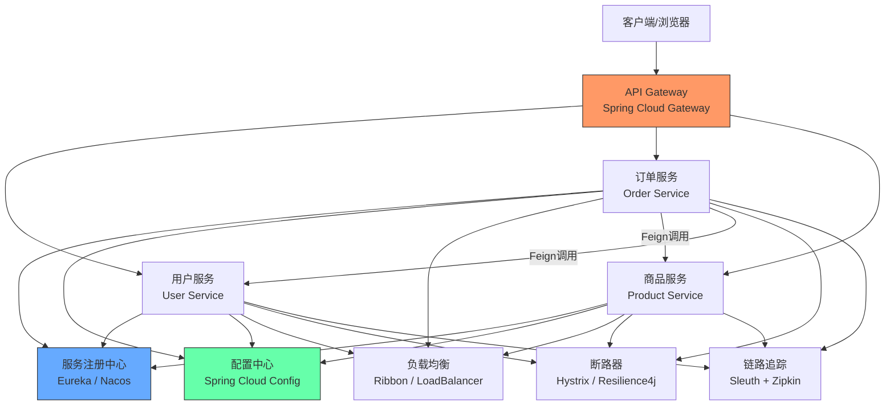
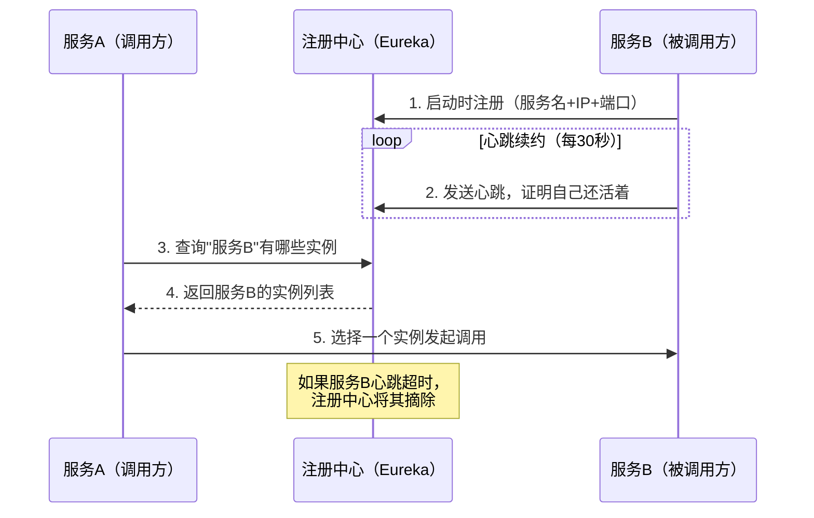
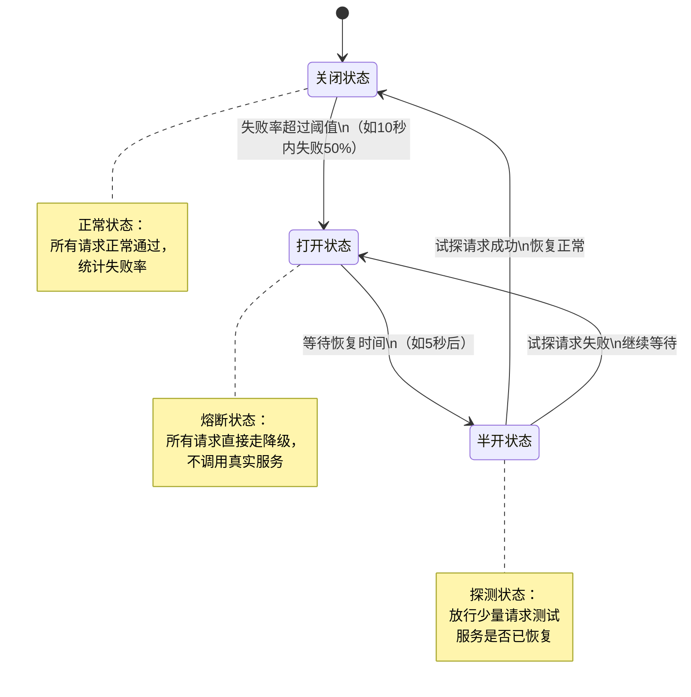
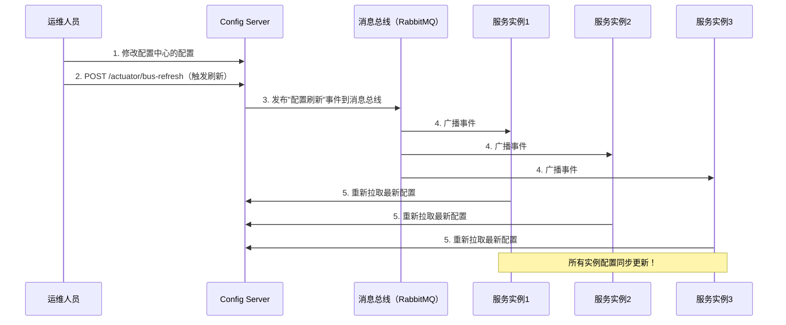

# Spring Cloud 面试题详解

## 目录

1. [什么是Spring Cloud?](#1-什么是spring-cloud)
2. [使用Spring Cloud有什么优势?](#2-使用spring-cloud有什么优势)
3. [服务注册和发现是什么意思? Spring Cloud如何实现?](#3-服务注册和发现是什么意思-spring-cloud如何实现)
4. [负载平衡的意义什么?](#4-负载平衡的意义什么)
5. [什么是Hystrix?它如何实现容错?](#5-什么是hystrix它如何实现容错)
6. [什么是Hystrix断路器?我们需要它吗?](#6-什么是hystrix断路器我们需要它吗)
7. [什么是Netflix Feign?它的优点是什么?](#7-什么是netflix-feign它的优点是什么)
8. [什么是Spring Cloud Bus?我们需要它吗?](#8-什么是spring-cloud-bus我们需要它吗)

---

## 1. 什么是Spring Cloud?

### 简介

Spring Cloud是基于Spring Boot构建的一套微服务架构开发工具集。它为开发者提供了在分布式系统（如配置管理、服务发现、断路器、智能路由、微代理、控制总线、一次性令牌、全局锁、领导选举、分布式会话、集群状态）中快速构建常见模式的工具。

简单来说：**Spring Boot帮你构建单个微服务，Spring Cloud帮你把这些微服务连接、管理起来。**

### Spring Cloud与Spring Boot的关系

```
Spring Cloud（微服务治理层）
    ├── 服务注册与发现（Eureka/Nacos）
    ├── 负载均衡（Ribbon/LoadBalancer）
    ├── 服务调用（Feign/OpenFeign）
    ├── 断路器（Hystrix/Resilience4j）
    ├── API网关（Zuul/Gateway）
    ├── 配置中心（Config/Nacos）
    └── 链路追踪（Sleuth/Zipkin）

Spring Boot（单个微服务）
    ├── 服务A（用户服务）
    ├── 服务B（订单服务）
    └── 服务C（商品服务）
```

### Spring Cloud整体架构图



### Spring Cloud核心组件列表

| 组件类型 | Netflix方案（较早） | 阿里/社区方案（推荐） |
|----------|--------------------|--------------------|
| 服务注册发现 | Eureka | Nacos |
| 负载均衡 | Ribbon | Spring Cloud LoadBalancer |
| 服务调用 | Feign | OpenFeign |
| 断路器 | Hystrix | Resilience4j / Sentinel |
| API网关 | Zuul | Spring Cloud Gateway |
| 配置中心 | Spring Cloud Config | Nacos Config |
| 链路追踪 | Sleuth + Zipkin | SkyWalking |

### 最小化Spring Cloud项目依赖

```xml
<!-- Spring Cloud依赖管理（统一版本） -->
<dependencyManagement>
    <dependencies>
        <dependency>
            <groupId>org.springframework.cloud</groupId>
            <artifactId>spring-cloud-dependencies</artifactId>
            <version>2022.0.3</version>
            <type>pom</type>
            <scope>import</scope>
        </dependency>
    </dependencies>
</dependencyManagement>
```

---

## 2. 使用Spring Cloud有什么优势?

### 核心优势详解

**1. 约定优于配置，开箱即用**

Spring Cloud基于Spring Boot构建，大量使用自动配置。引入一个starter依赖，加上少量配置，即可快速接入服务注册、负载均衡等功能，不需要大量手写基础设施代码。

**2. 与Spring生态无缝集成**

Spring Cloud与Spring Boot、Spring Data、Spring Security等完美配合，技术栈统一，团队学习成本低。

**3. 提供完整的微服务解决方案**

从服务注册、配置管理、服务调用、负载均衡，到熔断降级、API网关、链路追踪，Spring Cloud提供了一整套微服务基础设施，避免了开发者重复造轮子。

**4. 社区活跃，版本迭代快**

Spring Cloud背后有Pivotal（现VMware）支持，社区活跃，文档完善，问题容易找到解决方案。

**5. 支持多种注册中心和配置中心**

Spring Cloud抽象了通用接口，可以灵活切换不同的实现（Eureka、Nacos、Consul等），技术选型灵活。

**6. 天然支持云原生和容器化**

Spring Cloud设计上就考虑了云环境（Cloud-Native），与Docker、Kubernetes等容器技术配合良好。

### Spring Cloud解决的痛点

```
单体应用的痛点：
├── 代码耦合严重，修改一处影响全局
├── 无法针对单个功能独立扩容
├── 技术栈统一，无法针对不同模块选择最优技术
└── 部署频繁导致整个应用停机

Spring Cloud微服务的解决方案：
├── 服务拆分，职责单一，独立部署
├── 每个服务可独立水平扩展
├── 不同服务可用不同技术实现（多语言支持）
└── 单个服务更新不影响其他服务
```

### 微服务带来的新挑战及Spring Cloud的应对

| 挑战 | Spring Cloud解决方案 |
|------|---------------------|
| 服务如何找到彼此？ | Eureka/Nacos服务注册与发现 |
| 配置如何统一管理？ | Spring Cloud Config / Nacos Config |
| 如何防止级联故障？ | Hystrix / Resilience4j 断路器 |
| 如何统一入口和权限？ | Spring Cloud Gateway API网关 |
| 如何追踪跨服务请求？ | Sleuth + Zipkin 链路追踪 |
| 如何实现负载均衡？ | Ribbon / LoadBalancer |

---

## 3. 服务注册和发现是什么意思? Spring Cloud如何实现?

### 概念解释

**为什么需要服务注册和发现？**

在微服务架构中，服务实例的数量和地址是动态变化的：
- 服务可能因为扩容而增加实例
- 服务可能因为故障而减少实例
- 服务的IP地址可能因为重启或容器调度而改变

如果服务地址写死（硬编码），维护起来非常麻烦。服务注册与发现机制解决了这个问题。

**服务注册（Service Registration）**

服务启动时，将自己的信息（服务名、IP、端口、健康状态等）注册到一个中心化的注册表（服务注册中心）。

**服务发现（Service Discovery）**

服务调用方不再需要知道目标服务的具体地址，只需向注册中心查询服务名，即可获得可用的服务实例列表。

### 服务注册发现流程



### 使用Eureka实现服务注册发现

**第一步：搭建Eureka Server（注册中心）**

```xml
<!-- pom.xml -->
<dependency>
    <groupId>org.springframework.cloud</groupId>
    <artifactId>spring-cloud-starter-netflix-eureka-server</artifactId>
</dependency>
```

```java
@SpringBootApplication
@EnableEurekaServer  // 开启Eureka服务端
public class EurekaServerApplication {
    public static void main(String[] args) {
        SpringApplication.run(EurekaServerApplication.class, args);
    }
}
```

```yaml
# application.yml（Eureka Server配置）
server:
  port: 8761

eureka:
  client:
    # 自己就是注册中心，不需要向自己注册
    register-with-eureka: false
    fetch-registry: false
  server:
    # 关闭自我保护模式（开发时建议关闭）
    enable-self-preservation: false
```

**第二步：微服务注册到Eureka（Eureka Client）**

```xml
<dependency>
    <groupId>org.springframework.cloud</groupId>
    <artifactId>spring-cloud-starter-netflix-eureka-client</artifactId>
</dependency>
```

```yaml
# application.yml（微服务配置）
spring:
  application:
    name: user-service  # 服务名（重要！其他服务通过此名发现）

eureka:
  client:
    service-url:
      defaultZone: http://localhost:8761/eureka/
  instance:
    prefer-ip-address: true  # 使用IP地址注册
    instance-id: ${spring.application.name}:${server.port}
```

**第三步：服务调用方发现并调用服务**

```java
@Configuration
public class RestConfig {
    @Bean
    @LoadBalanced  // 开启负载均衡（结合服务发现使用）
    public RestTemplate restTemplate() {
        return new RestTemplate();
    }
}

@Service
public class OrderService {
    @Autowired
    private RestTemplate restTemplate;

    public User getUserById(Long userId) {
        // 直接用服务名调用，不需要写死IP和端口
        return restTemplate.getForObject(
            "http://user-service/api/users/" + userId,
            User.class
        );
    }
}
```

### 使用Nacos替代Eureka（国内推荐）

```xml
<dependency>
    <groupId>com.alibaba.cloud</groupId>
    <artifactId>spring-cloud-starter-alibaba-nacos-discovery</artifactId>
</dependency>
```

```yaml
spring:
  application:
    name: user-service
  cloud:
    nacos:
      discovery:
        server-addr: localhost:8848  # Nacos服务地址
```

### Eureka vs Nacos

| 特性 | Eureka | Nacos |
|------|--------|-------|
| 健康检查 | 客户端心跳 | 客户端心跳 + 服务端主动探测 |
| 一致性协议 | AP（可用性优先） | AP或CP（可配置） |
| 配置中心 | 不支持 | 支持（二合一） |
| 控制台 | 简单 | 功能丰富 |
| 维护状态 | 停止新功能开发 | 活跃维护 |
| 国内使用 | 减少 | 广泛使用 |

---

## 4. 负载平衡的意义什么?

### 概念

负载均衡（Load Balancing）是将客户端请求分散到多个服务实例上，避免单个实例承受过大压力，从而提高系统的整体可用性和吞吐量。

### 为什么需要负载均衡？

```
没有负载均衡的问题：
客户端 → 固定请求服务A实例1 → 实例1压力巨大，崩溃
                              实例2、3 空闲等待

有负载均衡的效果：
           ┌→ 服务A实例1（处理33%请求）
客户端 → LB├→ 服务A实例2（处理33%请求）
           └→ 服务A实例3（处理34%请求）
（三个实例均衡分担压力，任何一个挂掉，流量自动转移）
```

### 负载均衡的两种类型

**服务端负载均衡（传统方式）**
```
客户端 → Nginx/F5（负载均衡器） → 服务实例1/2/3
```
- 负载均衡逻辑在服务端（Nginx等）
- 客户端只知道负载均衡器的地址
- 需要独立部署和维护负载均衡器

**客户端负载均衡（Spring Cloud方式）**
```
客户端（内置Ribbon/LoadBalancer） → 从注册中心获取实例列表 → 自己决定调用哪个实例
```
- 负载均衡逻辑在客户端（调用方）
- 不需要独立的负载均衡器
- Spring Cloud Ribbon/LoadBalancer实现

### Spring Cloud LoadBalancer实现

**配置（Spring Boot 2.4+推荐使用Spring Cloud LoadBalancer替代Ribbon）：**

```xml
<dependency>
    <groupId>org.springframework.cloud</groupId>
    <artifactId>spring-cloud-starter-loadbalancer</artifactId>
</dependency>
```

```java
// 使用@LoadBalanced使RestTemplate支持服务名解析
@Configuration
public class AppConfig {
    @Bean
    @LoadBalanced
    public RestTemplate restTemplate() {
        return new RestTemplate();
    }
}
```

### 常见负载均衡策略

| 策略 | 说明 | 适用场景 |
|------|------|----------|
| 轮询（Round Robin） | 依次轮流调用每个实例 | 实例配置相同时（默认） |
| 随机（Random） | 随机选择一个实例 | 简单场景 |
| 加权轮询 | 配置高的实例获得更多请求 | 实例性能不同时 |
| 最少连接 | 优先选择当前连接数最少的实例 | 请求处理时长差异大时 |
| IP哈希 | 同一客户端IP总是访问同一实例 | 需要会话粘性时 |

**自定义负载均衡策略：**
```java
@Configuration
public class CustomLoadBalancerConfig {

    @Bean
    public ReactorLoadBalancer<ServiceInstance> randomLoadBalancer(
            Environment environment,
            LoadBalancerClientFactory factory) {
        String name = environment.getProperty(
            LoadBalancerClientFactory.PROPERTY_NAME);
        // 使用随机策略替代默认轮询
        return new RandomLoadBalancer(
            factory.getLazyProvider(name, ServiceInstanceListSupplier.class),
            name);
    }
}
```

### OpenFeign中的负载均衡

```java
// OpenFeign自动集成负载均衡，无需额外配置
@FeignClient(name = "user-service")
public interface UserClient {
    @GetMapping("/api/users/{id}")
    User getUserById(@PathVariable Long id);
    // 自动对user-service的多个实例进行负载均衡
}
```

---

## 5. 什么是Hystrix?它如何实现容错?

### 概念

Hystrix是Netflix开源的一个延迟和容错库，用于防止分布式系统中的级联故障（雪崩效应）。它通过隔离服务间的访问点、停止级联失败并提供降级选项来提高系统的整体弹性。

### 雪崩效应（Cascade Failure）

```
正常情况：
A → B → C → D（每个服务正常响应）

服务D出现故障（响应缓慢）：
A → B → C → D（D超时，C的线程被占用等待）
         ↓
C的线程耗尽 → C也开始超时
         ↓
B的线程耗尽 → B也开始超时
         ↓
A的线程耗尽 → 整个系统崩溃！

这就是"雪崩效应"——一个服务故障拖垮整个系统
```

### Hystrix的容错机制

**1. 超时控制**
```java
// 如果调用超过指定时间，直接中断并执行降级
@HystrixCommand(commandProperties = {
    @HystrixProperty(
        name = "execution.isolation.thread.timeoutInMilliseconds",
        value = "2000") // 超时时间2秒
})
public User getUserById(Long id) {
    return userServiceClient.getUserById(id);
}
```

**2. 线程隔离（Thread Pool Isolation）**

每个服务调用使用独立的线程池，避免一个服务故障耗尽所有线程：
```java
@HystrixCommand(
    threadPoolKey = "userServicePool",
    threadPoolProperties = {
        @HystrixProperty(name = "coreSize", value = "10"),
        @HystrixProperty(name = "maxQueueSize", value = "20")
    }
)
public User getUserById(Long id) {
    return userServiceClient.getUserById(id);
}
```

**3. 信号量隔离（Semaphore Isolation）**
```java
@HystrixCommand(commandProperties = {
    @HystrixProperty(
        name = "execution.isolation.strategy",
        value = "SEMAPHORE"),
    @HystrixProperty(
        name = "execution.isolation.semaphore.maxConcurrentRequests",
        value = "10")
})
public List<Product> getProducts() {
    return productServiceClient.getProducts();
}
```

**4. 服务降级（Fallback）**

当服务调用失败时，执行备用逻辑（降级方法）：
```java
@Service
public class OrderService {

    @HystrixCommand(fallbackMethod = "getDefaultUser")
    public User getUserById(Long id) {
        // 调用远程用户服务（可能失败）
        return userServiceClient.getUserById(id);
    }

    // 降级方法：当getUserById失败时调用
    public User getDefaultUser(Long id) {
        // 返回默认用户或缓存数据
        User defaultUser = new User();
        defaultUser.setId(id);
        defaultUser.setName("用户信息暂时不可用");
        return defaultUser;
    }
}
```

**5. 使用OpenFeign + Hystrix（更优雅的写法）**

```java
// 定义Feign客户端
@FeignClient(name = "user-service",
             fallback = UserClientFallback.class)
public interface UserClient {
    @GetMapping("/api/users/{id}")
    User getUserById(@PathVariable Long id);
}

// 定义降级实现
@Component
public class UserClientFallback implements UserClient {
    @Override
    public User getUserById(Long id) {
        User user = new User();
        user.setName("服务降级，用户信息暂时不可用");
        return user;
    }
}
```

```yaml
# 开启Feign的Hystrix支持
feign:
  hystrix:
    enabled: true
```

### Hystrix的监控（Dashboard）

```xml
<dependency>
    <groupId>org.springframework.cloud</groupId>
    <artifactId>spring-cloud-starter-netflix-hystrix-dashboard</artifactId>
</dependency>
```

```java
@SpringBootApplication
@EnableHystrixDashboard
public class HystrixDashboardApplication {
    public static void main(String[] args) {
        SpringApplication.run(HystrixDashboardApplication.class, args);
    }
}
```

访问 `http://localhost:9001/hystrix`，输入 `/actuator/hystrix.stream` 即可看到实时监控面板。

---

## 6. 什么是Hystrix断路器?我们需要它吗?

### 断路器模式

断路器（Circuit Breaker）模式来自电气工程中的保险丝概念。当电路中出现故障时，保险丝自动断开，防止故障蔓延。软件中的断路器也有相同的作用：当下游服务持续失败时，自动"断开"对该服务的调用，直接执行降级逻辑，给故障服务一段恢复时间。

### 断路器的三种状态



### 三种状态详解

**1. 关闭状态（Closed）**
- 正常工作状态
- 所有请求正常通过，同时统计失败次数和失败率
- 当失败率超过阈值（如50%），切换到打开状态

**2. 打开状态（Open）**
- 熔断状态
- 所有请求直接执行降级逻辑，不再调用真实服务
- 给故障服务一段"冷却时间"（如5秒）
- 冷却时间结束后，切换到半开状态

**3. 半开状态（Half-Open）**
- 探测恢复状态
- 允许少量请求（如1个）通过，测试服务是否已恢复
- 如果测试请求成功 → 切换回关闭状态（恢复正常）
- 如果测试请求失败 → 切换回打开状态（继续等待）

### Hystrix断路器配置

```java
@HystrixCommand(
    fallbackMethod = "fallback",
    commandProperties = {
        // 开启断路器
        @HystrixProperty(
            name = "circuitBreaker.enabled",
            value = "true"),
        // 触发断路器的最低请求数（10秒内至少有5次请求才统计）
        @HystrixProperty(
            name = "circuitBreaker.requestVolumeThreshold",
            value = "5"),
        // 失败率阈值（超过50%触发断路器）
        @HystrixProperty(
            name = "circuitBreaker.errorThresholdPercentage",
            value = "50"),
        // 断路器打开后，多久进入半开状态（毫秒）
        @HystrixProperty(
            name = "circuitBreaker.sleepWindowInMilliseconds",
            value = "5000"),
    }
)
public String callRemoteService() {
    return remoteServiceClient.call();
}

public String fallback() {
    return "服务暂时不可用，请稍后再试";
}
```

### 我们需要断路器吗？

**答案：在微服务架构中，断路器是必需的。**

理由如下：

| 场景 | 没有断路器 | 有断路器 |
|------|-----------|---------|
| 下游服务超时 | 调用方线程阻塞，最终耗尽 | 超时后立即降级，线程释放 |
| 下游服务崩溃 | 无效请求不断累积，雪崩 | 断路器打开，流量立即降级 |
| 下游服务恢复 | 正常（但恢复期间大量失败） | 半开探测，自动恢复 |
| 用户体验 | 请求长时间等待，最终报错 | 立即返回降级结果，体验好 |

### Resilience4j（Hystrix的现代替代品）

Hystrix已进入维护模式，Spring Cloud官方推荐使用Resilience4j：

```xml
<dependency>
    <groupId>org.springframework.cloud</groupId>
    <artifactId>spring-cloud-starter-circuitbreaker-resilience4j</artifactId>
</dependency>
```

```java
@Service
public class UserService {

    @Autowired
    private CircuitBreakerFactory circuitBreakerFactory;

    public User getUserById(Long id) {
        CircuitBreaker cb = circuitBreakerFactory.create("userService");
        return cb.run(
            () -> userClient.getUserById(id),
            throwable -> getDefaultUser(id) // 降级
        );
    }
}
```

```yaml
resilience4j:
  circuitbreaker:
    instances:
      userService:
        failure-rate-threshold: 50         # 失败率阈值50%
        wait-duration-in-open-state: 5s    # 断路器打开后等待5秒
        sliding-window-size: 10            # 统计最近10次请求
        minimum-number-of-calls: 5         # 至少5次请求才开始统计
```

---

## 7. 什么是Netflix Feign?它的优点是什么?

### 概念

Feign是Netflix开源的声明式HTTP客户端，后由Spring Cloud团队维护并升级为OpenFeign。它允许开发者通过定义接口和注解的方式来调用HTTP服务，而无需编写大量的RestTemplate代码。

### Feign vs RestTemplate 对比

**使用RestTemplate（繁琐）：**
```java
@Service
public class OrderService {

    @Autowired
    private RestTemplate restTemplate;

    public User getUserById(Long id) {
        // 需要手动拼URL、处理响应、类型转换
        ResponseEntity<User> response = restTemplate.getForEntity(
            "http://user-service/api/users/" + id,
            User.class
        );
        return response.getBody();
    }

    public User createUser(UserDTO dto) {
        HttpHeaders headers = new HttpHeaders();
        headers.setContentType(MediaType.APPLICATION_JSON);
        HttpEntity<UserDTO> request = new HttpEntity<>(dto, headers);
        return restTemplate.postForObject(
            "http://user-service/api/users",
            request,
            User.class
        );
    }
}
```

**使用OpenFeign（简洁）：**
```java
// 只需定义接口，像调用本地方法一样调用远程服务
@FeignClient(name = "user-service")
public interface UserClient {

    @GetMapping("/api/users/{id}")
    User getUserById(@PathVariable("id") Long id);

    @PostMapping("/api/users")
    User createUser(@RequestBody UserDTO dto);

    @DeleteMapping("/api/users/{id}")
    void deleteUser(@PathVariable("id") Long id);
}

// 调用时：直接注入接口，像调用本地方法一样
@Service
public class OrderService {

    @Autowired
    private UserClient userClient;  // 注入Feign客户端

    public User getUserById(Long id) {
        return userClient.getUserById(id);  // 简洁！
    }
}
```

### OpenFeign的优点

**1. 声明式API，代码简洁**

只需定义接口，Feign自动处理HTTP请求的构建和发送，代码量大幅减少。

**2. 与Spring Cloud无缝集成**

- 自动集成Ribbon/LoadBalancer（负载均衡）
- 自动集成Hystrix/Resilience4j（熔断降级）
- 自动集成Eureka/Nacos（服务发现）

**3. 支持Spring MVC注解**

OpenFeign支持`@GetMapping`、`@PostMapping`、`@RequestParam`、`@PathVariable`等熟悉的Spring MVC注解，学习成本极低。

**4. 支持拦截器（Interceptor）**

```java
// 统一添加认证Token
@Component
public class FeignAuthInterceptor implements RequestInterceptor {

    @Override
    public void apply(RequestTemplate template) {
        // 从当前请求上下文获取Token
        String token = SecurityContextHolder.getContext()
            .getAuthentication().getCredentials().toString();
        // 统一添加到请求头
        template.header("Authorization", "Bearer " + token);
    }
}
```

**5. 支持日志（方便调试）**

```yaml
feign:
  client:
    config:
      user-service:  # 针对特定服务
        logger-level: FULL  # NONE/BASIC/HEADERS/FULL

logging:
  level:
    com.example.client.UserClient: DEBUG
```

### 完整OpenFeign使用示例

**第一步：添加依赖**
```xml
<dependency>
    <groupId>org.springframework.cloud</groupId>
    <artifactId>spring-cloud-starter-openfeign</artifactId>
</dependency>
```

**第二步：开启Feign**
```java
@SpringBootApplication
@EnableFeignClients  // 扫描并注册所有Feign客户端
public class OrderApplication {
    public static void main(String[] args) {
        SpringApplication.run(OrderApplication.class, args);
    }
}
```

**第三步：定义Feign客户端接口**
```java
@FeignClient(
    name = "user-service",              // 服务名（与注册中心一致）
    fallback = UserClientFallback.class, // 降级实现
    configuration = FeignConfig.class   // 自定义配置
)
public interface UserClient {

    @GetMapping("/api/users/{id}")
    User getUserById(@PathVariable("id") Long id);

    @GetMapping("/api/users")
    Page<User> getUsers(
        @RequestParam("page") int page,
        @RequestParam("size") int size);
}
```

**第四步：超时配置**
```yaml
feign:
  client:
    config:
      default:            # 全局默认配置
        connect-timeout: 3000   # 连接超时（毫秒）
        read-timeout: 5000      # 读取超时（毫秒）
      user-service:       # 针对user-service的配置
        connect-timeout: 2000
        read-timeout: 3000
```

---

## 8. 什么是Spring Cloud Bus?我们需要它吗?

### 概念

Spring Cloud Bus是一个消息总线，它使用轻量级消息代理（如RabbitMQ或Kafka）将分布式系统中的所有节点连接起来。其最典型的使用场景是：**在不重启服务的情况下，将配置变更实时推送给所有服务实例。**

### 为什么需要Spring Cloud Bus?

**场景：微服务配置动态刷新的困境**

```
假设有50个服务实例，每个实例都连接到Spring Cloud Config Server：

修改配置中心的配置后：
- 每个实例都需要手动调用 POST /actuator/refresh 才能刷新配置
- 50个实例 = 需要发送50次HTTP请求
- 这种方式效率极低，维护困难！

Spring Cloud Bus的解决方案：
只需向任意一个实例（或Config Server）发送一次刷新请求，
Bus自动通过消息队列广播给所有实例，所有实例同步刷新配置！
```

### Spring Cloud Bus工作原理



### 集成Spring Cloud Bus（以RabbitMQ为例）

**添加依赖（所有微服务和Config Server都需要添加）：**
```xml
<!-- Spring Cloud Bus（使用RabbitMQ作为消息总线） -->
<dependency>
    <groupId>org.springframework.cloud</groupId>
    <artifactId>spring-cloud-starter-bus-amqp</artifactId>
</dependency>

<!-- Spring Cloud Config Client -->
<dependency>
    <groupId>org.springframework.cloud</groupId>
    <artifactId>spring-cloud-starter-config</artifactId>
</dependency>

<!-- 暴露bus-refresh端点 -->
<dependency>
    <groupId>org.springframework.boot</groupId>
    <artifactId>spring-boot-starter-actuator</artifactId>
</dependency>
```

**配置文件（bootstrap.yml）：**
```yaml
spring:
  application:
    name: user-service
  cloud:
    config:
      uri: http://config-server:8888
  rabbitmq:
    host: localhost
    port: 5672
    username: guest
    password: guest

management:
  endpoints:
    web:
      exposure:
        include: bus-refresh, bus-env
```

**使用@RefreshScope使Bean支持动态刷新：**
```java
@RestController
@RefreshScope  // 加上此注解，配置刷新后Bean会自动重建
public class ConfigController {

    @Value("${app.message:默认消息}")
    private String message;

    @GetMapping("/message")
    public String getMessage() {
        return message; // 配置刷新后，此处返回新值
    }
}
```

**触发配置刷新：**
```bash
# 刷新所有服务（通过Config Server触发）
curl -X POST http://config-server:8888/actuator/bus-refresh

# 只刷新特定服务（通过destination参数）
curl -X POST "http://config-server:8888/actuator/bus-refresh?destination=user-service:**"
```

### Spring Cloud Bus的其他用途

除了配置刷新，Spring Cloud Bus还可以用于：

**1. 自定义事件广播**
```java
// 定义自定义事件
public class UserCreatedEvent extends RemoteApplicationEvent {
    private Long userId;

    public UserCreatedEvent(Object source, String originService, Long userId) {
        super(source, originService);
        this.userId = userId;
    }
}

// 发布事件
@Autowired
private ApplicationEventPublisher publisher;

public void createUser(User user) {
    userRepository.save(user);
    // 广播用户创建事件给所有服务
    publisher.publishEvent(new UserCreatedEvent(this, "user-service", user.getId()));
}

// 其他服务监听事件
@EventListener
public void onUserCreated(UserCreatedEvent event) {
    System.out.println("新用户创建: " + event.getUserId());
    // 各服务根据需要处理
}
```

**2. 动态修改日志级别**
```bash
# 动态修改所有服务的日志级别（无需重启）
curl -X POST http://config-server:8888/actuator/bus-env \
  -H "Content-Type: application/json" \
  -d '{"name":"logging.level.com.example","value":"DEBUG"}'
```

### 我们需要Spring Cloud Bus吗？

| 场景 | 是否需要 |
|------|---------|
| 微服务实例数量多（>5个）且需要频繁更新配置 | 强烈需要 |
| 需要跨服务广播自定义事件 | 需要 |
| 只有1~2个实例，手动刷新可以接受 | 可以不用 |
| 使用Nacos作为配置中心（自带推送功能） | 可以不用 |

**结论：在生产环境的微服务架构中，如果使用Spring Cloud Config Server，Spring Cloud Bus几乎是必备的，它极大地简化了配置的动态管理。**

### Kafka作为消息总线

如果项目已经使用Kafka，可以用Kafka替代RabbitMQ：

```xml
<!-- 使用Kafka作为消息总线 -->
<dependency>
    <groupId>org.springframework.cloud</groupId>
    <artifactId>spring-cloud-starter-bus-kafka</artifactId>
</dependency>
```

```yaml
spring:
  kafka:
    bootstrap-servers: localhost:9092
```

---

## 总结

### Spring Cloud核心组件速查

| 组件 | 作用 | 推荐方案 |
|------|------|---------|
| 服务注册发现 | 服务的地址管理 | Nacos（国内）/ Consul |
| 负载均衡 | 分散请求到多个实例 | Spring Cloud LoadBalancer |
| 声明式服务调用 | 简化服务间HTTP调用 | OpenFeign |
| 断路器 | 防止雪崩，服务降级 | Resilience4j / Sentinel |
| API网关 | 统一入口、鉴权、限流 | Spring Cloud Gateway |
| 配置中心 | 统一管理配置 | Nacos Config / Spring Cloud Config |
| 消息总线 | 广播配置变更事件 | Spring Cloud Bus + RabbitMQ |
| 链路追踪 | 追踪跨服务请求链路 | Micrometer Tracing + Zipkin |

### 微服务调用链路完整示意

```
用户请求
   ↓
Spring Cloud Gateway（API网关）
- 认证鉴权（JWT验证）
- 限流（令牌桶算法）
- 路由转发
   ↓
订单服务（Order Service）
- 从Nacos获取用户服务地址
- 通过OpenFeign调用用户服务
- Resilience4j断路器保护
   ↓
用户服务（User Service）
- 查询数据库
- 返回用户信息
   ↓
全链路：Sleuth自动注入TraceId，Zipkin收集并展示调用链路
```

---

*文档完成。以上8道面试题涵盖了Spring Cloud的核心知识点，建议结合Spring Boot面试题一起复习，理解微服务架构的整体体系。*

