# Spring面试题全集（一）+（二）完整答案

> 涵盖Spring面试题（一）全部7大板块 + Spring面试题（二）全部68题，附代码示例与Mermaid图解。

---

## 目录

- [Spring面试题（一）](#spring面试题一)
  - [1. 一般问题](#1-一般问题)
  - [2. 依赖注入IoC](#2-依赖注入ioc)
  - [3. Beans](#3-beans)
  - [4. 注解](#4-注解)
  - [5. 数据访问](#5-数据访问)
  - [6. AOP](#6-aop)
  - [7. MVC](#7-mvc)
- [Spring面试题（二）](#spring面试题二)

---

# Spring面试题（一）

## 1. 一般问题

### 1.1 不同版本的Spring Framework有哪些主要功能?

Spring Framework经历了多个重要版本的演进，每个版本都带来了显著的功能改进：

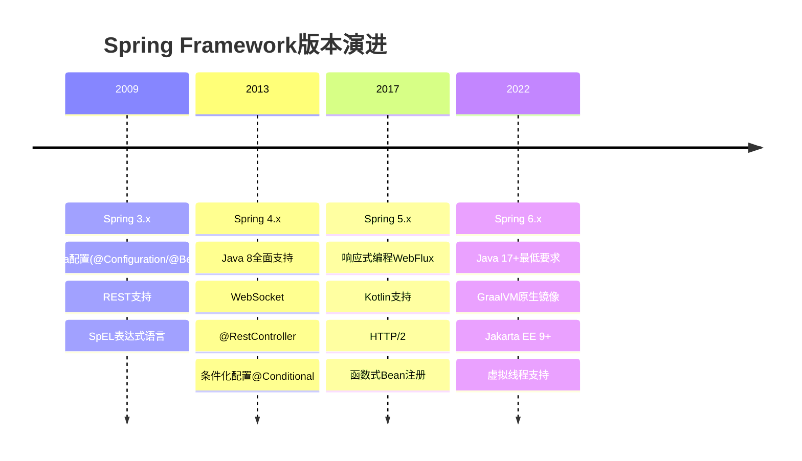

**Spring 3.x (2009-2013)**
- 引入基于Java的配置方式（`@Configuration`、`@Bean`）
- 支持REST风格Web服务，新增`RestTemplate`
- 引入SpEL（Spring Expression Language）表达式语言
- 支持声明式缓存管理（`@Cacheable`）
- 全面支持Java 5+特性（泛型、注解）

**Spring 4.x (2013-2017)**
- 全面支持Java 8（Lambda、Optional、Stream API）
- 引入`@RestController`简化REST API开发
- 支持WebSocket通信
- 引入条件化配置（`@Conditional`）
- 支持CORS跨域资源共享
- 改进测试框架

**Spring 5.x (2017-2022)**
- 基于Java 8+，支持Java 9-17
- 引入响应式编程模型（Spring WebFlux、Project Reactor）
- 支持Kotlin语言
- 引入函数式Bean注册API
- 支持HTTP/2协议
- 核心容器性能显著提升

**Spring 6.x (2022-至今)**
- 要求Java 17+作为最低版本
- 原生支持GraalVM AOT编译，可生成原生可执行文件
- 全面迁移到Jakarta EE 9+（`javax.*` → `jakarta.*`）
- 改进可观测性（Micrometer集成）
- 增强对虚拟线程（Project Loom）的支持
- 更好的云原生支持

### 1.2 什么是Spring Framework?

Spring Framework是一个开源的Java企业级应用开发框架，由Rod Johnson创建，首次发布于2003年。其核心是**控制反转（IoC）**和**面向切面编程（AOP）**。

Spring的设计哲学：让Java开发更简单、更快速、更安全。它通过提供完整的基础设施支持，让开发者专注于业务逻辑，而不必关心底层技术细节。

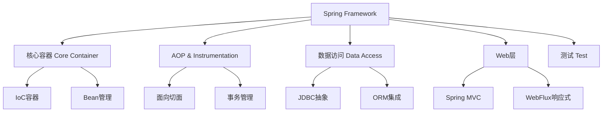

**核心特点：**
- **轻量级**：基础版本只需约1MB的JAR包，对代码侵入性极小
- **控制反转（IoC）**：对象的创建和依赖关系由Spring容器管理
- **面向切面编程（AOP）**：将横切关注点（日志、事务、安全）从业务逻辑中分离
- **容器**：负责创建、配置和管理应用程序中的对象（Bean）
- **MVC框架**：提供功能完整的MVC Web框架
- **事务管理**：提供统一的事务管理接口，支持声明式事务
- **异常处理**：将技术相关异常转换为统一的非检查异常

### 1.3 列举Spring Framework的优点。

**1. 轻量级和非侵入性**
Spring是轻量级的，对应用程序代码侵入性很小。使用Spring的POJO不需要继承特定类或实现特定接口，代码可以独立于Spring框架进行测试。

**2. 控制反转（IoC）**
通过IoC，对象的依赖关系由容器注入，而不是对象自己创建依赖。这降低了组件之间的耦合度，使代码更易于测试和维护。

**3. 面向切面编程（AOP）**
AOP允许将横切关注点（如日志记录、安全检查、事务管理）从业务逻辑中分离出来，提高了代码的模块化程度。

**4. 容器**
Spring容器负责管理对象的生命周期，包括创建、初始化、使用和销毁，开发者无需手动管理对象生命周期。

**5. MVC框架**
Spring MVC是功能完整、灵活的Web MVC框架，与Spring其他功能集成得更好。

**6. 事务管理**
Spring提供一致的事务管理接口，支持本地事务和全局事务，支持声明式事务管理，大大简化了事务处理代码。

**7. 异常处理**
Spring将各种技术（如JDBC、Hibernate）的特定异常转换为统一的非检查异常，简化了异常处理。

**8. 易于测试**
由于IoC的特性，Spring应用程序非常容易进行单元测试和集成测试。

**9. 与其他框架的集成**
Spring可以与众多流行框架无缝集成，如Hibernate、MyBatis、Struts等。

**10. 成熟的生态系统**
Spring拥有庞大的生态系统，包括Spring Boot、Spring Cloud、Spring Security、Spring Data等子项目。

### 1.4 Spring Framework有哪些不同的功能?

Spring Framework提供了以下主要功能：

**1. 依赖注入（Dependency Injection）**
这是Spring的核心功能，通过IoC容器管理对象之间的依赖关系，支持构造函数注入、Setter注入和字段注入。

**2. 面向切面编程（AOP）**
支持方法级别的拦截，可以在不修改业务代码的情况下添加横切功能，如日志、事务、安全等。

**3. 数据访问/集成**
- JDBC抽象层，简化JDBC操作
- ORM集成（Hibernate、JPA、MyBatis等）
- 统一事务管理
- 对象/XML映射（OXM）

**4. Web层**
- Spring MVC：基于Servlet的Web框架
- Spring WebFlux：响应式Web框架（Spring 5+）
- WebSocket支持
- REST支持

**5. 测试支持**
- 单元测试支持
- 集成测试支持
- Mock对象
- TestContext框架

**6. 消息传递**
- JMS（Java Message Service）支持
- 消息转换器
- 消息监听容器

**7. 缓存抽象**
提供统一的缓存API，支持多种缓存实现（EhCache、Redis、Caffeine等）。

**8. 任务调度**
支持定时任务（`@Scheduled`）和异步执行（`@Async`）。

### 1.5 Spring Framework中有多少个模块，它们分别是什么?

Spring Framework由多个模块组成，这些模块可以根据需要选择性地使用：

```mermaid
graph TD
    A[Spring Framework模块] --> B[Core Container]
    A --> C[AOP and Instrumentation]
    A --> D[Messaging]
    A --> E[Data Access/Integration]
    A --> F[Web]
    A --> G[Test]

    B --> B1[spring-core]
    B --> B2[spring-beans]
    B --> B3[spring-context]
    B --> B4[spring-context-support]
    B --> B5[spring-expression]

    C --> C1[spring-aop]
    C --> C2[spring-aspects]
    C --> C3[spring-instrument]

    D --> D1[spring-messaging]

    E --> E1[spring-jdbc]
    E --> E2[spring-tx]
    E --> E3[spring-orm]
    E --> E4[spring-oxm]
    E --> E5[spring-jms]

    F --> F1[spring-web]
    F --> F2[spring-webmvc]
    F --> F3[spring-websocket]
    F --> F4[spring-webflux]

    G --> G1[spring-test]
```

**核心容器（Core Container）**
- **spring-core**：提供IoC和DI功能的基础，包含资源加载、类型转换等核心工具
- **spring-beans**：提供BeanFactory，是Spring IoC容器的基础实现
- **spring-context**：在core和beans基础上构建，提供ApplicationContext，支持国际化、事件传播等
- **spring-context-support**：提供对第三方库集成的支持（缓存、邮件、调度等）
- **spring-expression**：提供Spring表达式语言（SpEL）

**AOP和Instrumentation**
- **spring-aop**：提供面向切面编程的实现
- **spring-aspects**：提供与AspectJ的集成
- **spring-instrument**：提供类级别的instrumentation支持

**消息传递（Messaging）**
- **spring-messaging**：提供消息传递的基础支持，包括Message、MessageChannel等抽象

**数据访问/集成（Data Access/Integration）**
- **spring-jdbc**：提供JDBC抽象层，简化JDBC操作
- **spring-tx**：提供编程式和声明式事务管理
- **spring-orm**：提供与ORM框架（Hibernate、JPA等）的集成
- **spring-oxm**：提供对象/XML映射抽象
- **spring-jms**：提供JMS消息发送和接收功能

**Web层**
- **spring-web**：提供基础的Web功能，如文件上传、IoC容器初始化等
- **spring-webmvc**：提供Spring MVC实现
- **spring-websocket**：提供WebSocket支持
- **spring-webflux**：提供响应式Web框架（Spring 5+）

**测试（Test）**
- **spring-test**：提供对JUnit和TestNG的集成测试支持

### 1.6 什么是Spring配置文件?

Spring配置文件是用于定义Spring应用程序中Bean及其依赖关系的文件。Spring支持多种配置方式：

**1. XML配置文件（传统方式）**

```xml
<?xml version="1.0" encoding="UTF-8"?>
<beans xmlns="http://www.springframework.org/schema/beans"
       xmlns:xsi="http://www.w3.org/2001/XMLSchema-instance"
       xsi:schemaLocation="http://www.springframework.org/schema/beans
           http://www.springframework.org/schema/beans/spring-beans.xsd">

    <bean id="userService" class="com.example.UserService">
        <property name="userDao" ref="userDao"/>
    </bean>

    <bean id="userDao" class="com.example.UserDaoImpl"/>
</beans>
```

**2. Java配置类（推荐方式）**

```java
@Configuration
public class AppConfig {
    @Bean
    public UserService userService() {
        return new UserService(userDao());
    }

    @Bean
    public UserDao userDao() {
        return new UserDaoImpl();
    }
}
```

**3. 注解配置**

```java
@Service
public class UserService {
    @Autowired
    private UserDao userDao;
}
```

**4. 属性文件（application.properties / application.yml）**

```properties
# application.properties
spring.datasource.url=jdbc:mysql://localhost:3306/mydb
spring.datasource.username=root
spring.datasource.password=secret
```

**配置文件的加载顺序（Spring Boot）：**
1. 命令行参数
2. 系统环境变量
3. `application-{profile}.properties`
4. `application.properties`
5. `@PropertySource`注解指定的文件

### 1.7 Spring应用程序有哪些不同组件?

一个典型的Spring应用程序由以下组件构成：

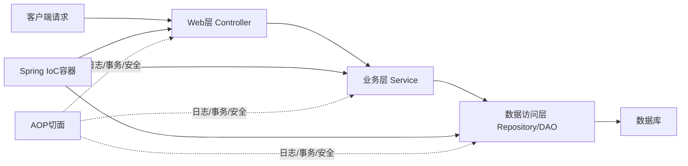

**1. Bean（Spring管理的对象）**
Spring应用程序的基本构建块，由Spring IoC容器管理的对象。

**2. Bean定义（Bean Definition）**
描述Bean的元数据，包括类名、作用域、生命周期回调、依赖关系等。

**3. Bean工厂（BeanFactory）**
Spring IoC容器的基础接口，负责Bean的实例化、配置和管理。

**4. 应用上下文（ApplicationContext）**
BeanFactory的扩展，提供更多企业级功能，如国际化、事件发布等。

**5. 配置元数据**
告诉Spring容器如何实例化、配置和组装Bean，可以是XML、注解或Java代码。

**6. AOP代理**
Spring AOP创建的代理对象，用于实现横切关注点。

**7. 事件系统**
Spring的事件发布/订阅机制，用于组件间的松耦合通信。

**典型的分层架构：**
- **表现层（Presentation Layer）**：Controller，处理HTTP请求和响应
- **业务层（Business Layer）**：Service，包含业务逻辑
- **数据访问层（Data Access Layer）**：Repository/DAO，负责数据库操作
- **领域层（Domain Layer）**：Entity/Model，表示业务实体

### 1.8 使用Spring有哪些方式?

**1. 独立应用程序**

```java
public class MainApp {
    public static void main(String[] args) {
        // 使用XML配置
        ApplicationContext context =
            new ClassPathXmlApplicationContext("applicationContext.xml");

        // 或使用Java配置
        ApplicationContext context2 =
            new AnnotationConfigApplicationContext(AppConfig.class);

        UserService userService = context.getBean(UserService.class);
        userService.doSomething();
    }
}
```

**2. Web应用程序（Spring MVC）**
在`web.xml`中配置`DispatcherServlet`，或使用Spring Boot自动配置。

**3. Spring Boot应用程序（最常用）**

```java
@SpringBootApplication
public class Application {
    public static void main(String[] args) {
        SpringApplication.run(Application.class, args);
    }
}
```

**4. 与其他框架集成**
- 与Struts集成
- 与JSF集成
- 与Hibernate/MyBatis集成

**5. 微服务架构（Spring Cloud）**
使用Spring Cloud构建微服务应用，提供服务发现、配置中心、负载均衡等功能。

**6. 响应式应用程序（Spring WebFlux）**

```java
@RestController
public class ReactiveController {
    @GetMapping("/users")
    public Flux<User> getUsers() {
        return userService.findAll();
    }
}
```

---

## 2. 依赖注入（IoC）

### 2.1 什么是Spring IOC容器?

IoC（Inversion of Control，控制反转）容器是Spring框架的核心。它负责创建对象、管理对象的生命周期、配置对象以及管理对象之间的依赖关系。

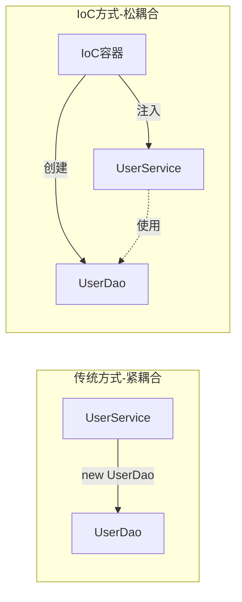

**传统方式（紧耦合）：**
```java
public class UserService {
    // 自己创建依赖对象，紧耦合
    private UserDao userDao = new UserDaoImpl();
}
```

**IoC方式（松耦合）：**
```java
public class UserService {
    // 依赖由外部注入，松耦合
    private UserDao userDao;

    public UserService(UserDao userDao) {
        this.userDao = userDao;
    }
}
```

**IoC容器的工作原理：**
1. 读取配置元数据（XML、注解或Java配置）
2. 根据配置创建Bean实例
3. 解析Bean之间的依赖关系
4. 将依赖注入到相应的Bean中
5. 管理Bean的完整生命周期

**Spring提供两种IoC容器：**
- **BeanFactory**：基础容器，提供基本的IoC功能
- **ApplicationContext**：高级容器，在BeanFactory基础上增加了更多企业级功能

### 2.2 什么是依赖注入?

依赖注入（Dependency Injection，DI）是IoC的一种具体实现方式。它是指对象的依赖关系不由对象自己创建，而是由外部容器（Spring IoC容器）在运行时注入进来。

**核心思想：**
- 对象不负责查找或创建它所依赖的对象
- 依赖关系由外部容器在运行时提供
- 对象只需要声明它需要什么，而不关心如何获得

**依赖注入的好处：**
1. **降低耦合度**：组件之间通过接口交互，不依赖具体实现
2. **提高可测试性**：可以轻松替换依赖的Mock对象进行单元测试
3. **提高可维护性**：修改依赖实现不需要修改使用者代码
4. **提高可重用性**：组件可以在不同上下文中重用

**示例：**
```java
// 定义接口
public interface MessageService {
    String getMessage();
}

// 实现类
@Service
public class EmailService implements MessageService {
    @Override
    public String getMessage() {
        return "Email message";
    }
}

// 使用依赖注入
@Component
public class MessagePrinter {
    // Spring会自动注入MessageService的实现
    @Autowired
    private MessageService messageService;

    public void printMessage() {
        System.out.println(messageService.getMessage());
    }
}
```

### 2.3 可以通过多少种方式完成依赖注入?

Spring支持三种主要的依赖注入方式：

**1. 构造函数注入（Constructor Injection）**

```java
@Service
public class UserService {
    private final UserDao userDao;
    private final EmailService emailService;

    // Spring 4.3+单构造函数可省略@Autowired
    @Autowired
    public UserService(UserDao userDao, EmailService emailService) {
        this.userDao = userDao;
        this.emailService = emailService;
    }
}
```

**2. Setter注入（Setter Injection）**

```java
@Service
public class UserService {
    private UserDao userDao;

    @Autowired
    public void setUserDao(UserDao userDao) {
        this.userDao = userDao;
    }
}
```

**3. 字段注入（Field Injection）**

```java
@Service
public class UserService {
    @Autowired
    private UserDao userDao;
}
```

**三种方式的对比：**

| 特性 | 构造函数注入 | Setter注入 | 字段注入 |
|------|------------|-----------|---------|
| 强制依赖 | 是 | 否 | 否 |
| 可选依赖 | 否 | 是 | 是 |
| 不可变性 | 支持（final） | 不支持 | 不支持 |
| 可测试性 | 最好 | 好 | 差 |
| 代码简洁性 | 一般 | 一般 | 最简洁 |
| Spring推荐 | 是（强制依赖） | 是（可选依赖） | 不推荐 |

**Spring官方推荐使用构造函数注入**，原因：
- 依赖不可变（可以使用final）
- 依赖不能为null（在构造时就会报错）
- 组件完全初始化后才能使用
- 便于单元测试（不需要Spring容器）

### 2.4 区分构造函数注入和setter注入。

| 对比维度 | 构造函数注入 | Setter注入 |
|---------|------------|-----------|
| 注入时机 | 对象创建时注入 | 对象创建后通过setter注入 |
| 强制性 | 强制依赖，不能为null | 可选依赖，可以为null |
| 不可变性 | 支持final字段，依赖不可变 | 不支持final，依赖可被修改 |
| 循环依赖 | 无法解决循环依赖 | 可以解决循环依赖 |
| 可读性 | 依赖关系清晰 | 依赖关系分散 |
| 测试性 | 无需Spring容器即可测试 | 需要调用setter方法 |
| 适用场景 | 必须的依赖 | 可选的依赖 |

**构造函数注入示例：**
```java
@Service
public class OrderService {
    private final UserService userService;    // final，不可变
    private final PaymentService paymentService;

    public OrderService(UserService userService, PaymentService paymentService) {
        this.userService = Objects.requireNonNull(userService);
        this.paymentService = Objects.requireNonNull(paymentService);
    }
}
```

**Setter注入示例：**
```java
@Service
public class OrderService {
    private UserService userService;
    private NotificationService notificationService;  // 可选依赖

    @Autowired
    public void setUserService(UserService userService) {
        this.userService = userService;
    }

    @Autowired(required = false)  // 可选依赖
    public void setNotificationService(NotificationService notificationService) {
        this.notificationService = notificationService;
    }
}
```

**最佳实践：**
- 必须的依赖使用构造函数注入
- 可选的依赖使用Setter注入
- 避免使用字段注入（不利于测试和维护）

### 2.5 spring中有多少种IOC容器?

Spring提供了两种主要的IoC容器：

**1. BeanFactory**
- 最基础的IoC容器
- 提供基本的依赖注入功能
- 采用懒加载策略（Bean在第一次请求时才创建）
- 适合资源受限的环境（如移动设备）

```java
// BeanFactory使用示例（不推荐，已较少使用）
Resource resource = new ClassPathResource("applicationContext.xml");
BeanFactory factory = new XmlBeanFactory(resource);
UserService userService = factory.getBean("userService", UserService.class);
```

**2. ApplicationContext**
- BeanFactory的子接口，功能更丰富
- 采用预加载策略（容器启动时创建所有单例Bean）
- 提供国际化支持（MessageSource）
- 提供事件发布机制（ApplicationEventPublisher）
- 提供资源加载（ResourceLoader）
- 支持AOP集成

**ApplicationContext的主要实现：**

| 实现类 | 说明 |
|--------|------|
| ClassPathXmlApplicationContext | 从类路径加载XML配置 |
| FileSystemXmlApplicationContext | 从文件系统加载XML配置 |
| AnnotationConfigApplicationContext | 从Java配置类加载配置 |
| WebApplicationContext | Web应用专用上下文 |
| AnnotationConfigWebApplicationContext | Web应用的Java配置上下文 |

```java
// 各种ApplicationContext使用示例
ApplicationContext ctx1 =
    new ClassPathXmlApplicationContext("applicationContext.xml");

ApplicationContext ctx2 =
    new FileSystemXmlApplicationContext("/path/to/applicationContext.xml");

ApplicationContext ctx3 =
    new AnnotationConfigApplicationContext(AppConfig.class);
```

### 2.6 区分BeanFactory和ApplicationContext。

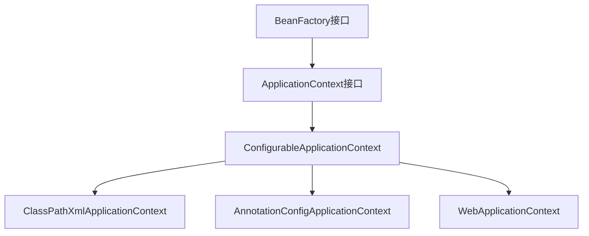

| 特性 | BeanFactory | ApplicationContext |
|------|------------|-------------------|
| Bean实例化 | 懒加载（按需创建） | 预加载（启动时创建单例） |
| 国际化支持 | 不支持 | 支持（MessageSource） |
| 事件发布 | 不支持 | 支持（ApplicationEvent） |
| AOP集成 | 手动配置 | 自动集成 |
| 注解支持 | 有限 | 完整支持 |
| 资源加载 | 基础 | 增强（ResourceLoader） |
| 环境抽象 | 不支持 | 支持（Environment） |
| 适用场景 | 资源受限环境 | 企业级应用（推荐） |

**BeanFactory的核心方法：**
```java
Object getBean(String name);
<T> T getBean(Class<T> requiredType);
boolean containsBean(String name);
boolean isSingleton(String name);
```

**ApplicationContext额外提供的功能：**
```java
// 发布事件
applicationContext.publishEvent(new UserCreatedEvent(user));

// 获取国际化消息
String message = applicationContext.getMessage("greeting", null, Locale.CHINESE);

// 获取资源
Resource resource = applicationContext.getResource("classpath:config.xml");
```

**结论：** 在实际开发中，几乎总是使用ApplicationContext，BeanFactory只在极少数资源受限的场景下使用。

### 2.7 列举IoC的一些好处。

**1. 降低耦合度**
组件之间通过接口交互，不依赖具体实现类，使得系统更加灵活。

**2. 提高可测试性**
可以轻松地将真实依赖替换为Mock对象，便于单元测试：
```java
@Test
public void testUserService() {
    UserDao mockDao = Mockito.mock(UserDao.class);
    UserService service = new UserService(mockDao);  // 构造函数注入
    // 测试...
}
```

**3. 提高代码可维护性**
修改依赖的实现不需要修改使用者的代码，只需修改配置。

**4. 促进面向接口编程**
IoC鼓励开发者面向接口编程，而不是面向具体实现。

**5. 集中管理对象**
所有对象的创建和管理都集中在IoC容器中，便于统一管理。

**6. 支持AOP**
IoC容器可以在Bean创建时自动应用AOP代理，实现横切关注点。

**7. 生命周期管理**
容器负责管理Bean的完整生命周期，包括初始化和销毁。

**8. 配置外部化**
依赖关系通过配置文件或注解定义，可以在不修改代码的情况下改变行为。


### 2.8 Spring IoC的实现机制。
Spring IoC容器的实现基于**工厂模式**和**反射机制**。

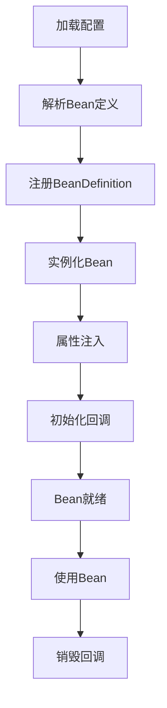

**核心实现步骤**：

**1. 加载配置元数据**
```java
// XML配置
ApplicationContext ctx = new ClassPathXmlApplicationContext("beans.xml");

// 注解配置
ApplicationContext ctx = new AnnotationConfigApplicationContext(AppConfig.class);
```

**2. 解析Bean定义**
Spring将配置信息解析为`BeanDefinition`对象，包含：
- Bean的类名
- 作用域（singleton/prototype）
- 构造函数参数
- 属性值
- 依赖关系

**3. 注册到BeanFactory**
```java
// BeanDefinition注册到BeanDefinitionRegistry
DefaultListableBeanFactory beanFactory = new DefaultListableBeanFactory();
beanFactory.registerBeanDefinition("userService", beanDefinition);
```

**4. 实例化Bean**
使用反射创建Bean实例：
```java
Class<?> clazz = Class.forName(beanDefinition.getBeanClassName());
Object bean = clazz.getDeclaredConstructor().newInstance();
```

**5. 依赖注入**
通过反射设置属性或调用setter方法：
```java
Field field = clazz.getDeclaredField("userDao");
field.setAccessible(true);
field.set(bean, userDao);
```

**6. 初始化回调**
- 调用`@PostConstruct`方法
- 调用`InitializingBean.afterPropertiesSet()`
- 调用自定义init-method

**7. 使用Bean**
应用程序通过`getBean()`获取Bean实例。

**8. 销毁回调**
容器关闭时：
- 调用`@PreDestroy`方法
- 调用`DisposableBean.destroy()`
- 调用自定义destroy-method

**关键技术**：
- **反射**：动态创建对象和调用方法
- **工厂模式**：BeanFactory作为Bean的工厂
- **单例模式**：默认Bean是单例
- **代理模式**：AOP通过动态代理实现

---

## 3. Beans

### 3.1 什么是spring bean?
Spring Bean是由Spring IoC容器管理的对象。

**定义**：
- Bean是Spring应用的基本构建块
- 由Spring容器实例化、组装和管理
- 通过配置元数据（XML、注解、Java配置）定义

```java
// 通过注解定义Bean
@Component
public class UserService {
    // Spring会自动创建UserService的实例并管理
}

// 通过Java配置定义Bean
@Configuration
public class AppConfig {
    @Bean
    public UserService userService() {
        return new UserService();
    }
}
```

**Bean的特点**：
- 由容器管理生命周期
- 支持依赖注入
- 可配置作用域（singleton、prototype等）
- 可以有初始化和销毁回调

### 3.2 spring提供了哪些配置方式?
Spring提供三种主要的配置方式：

**1. XML配置（传统方式）**
```xml
<beans>
    <bean id="userDao" class="com.example.UserDaoImpl"/>
    <bean id="userService" class="com.example.UserService">
        <property name="userDao" ref="userDao"/>
    </bean>
</beans>
```

**2. 注解配置（推荐）**
```java
@Component
public class UserService {
    @Autowired
    private UserDao userDao;
}

@Configuration
@ComponentScan("com.example")
public class AppConfig {
}
```

**3. Java配置（类型安全）**
```java
@Configuration
public class AppConfig {
    @Bean
    public UserDao userDao() {
        return new UserDaoImpl();
    }

    @Bean
    public UserService userService() {
        UserService service = new UserService();
        service.setUserDao(userDao());
        return service;
    }
}
```

**混合配置**：
```java
@Configuration
@ImportResource("classpath:legacy-beans.xml")  // 导入XML配置
@Import(DatabaseConfig.class)  // 导入其他Java配置
public class AppConfig {
}
```

**选择建议**：
- 新项目：优先使用注解配置
- 需要类型安全：使用Java配置
- 维护老项目：可能需要XML配置

### 3.3 spring支持几种bean scope?
Spring支持多种Bean作用域：

| 作用域 | 说明 | 使用场景 |
|--------|------|---------|
| singleton | 单例（默认） | 无状态Bean |
| prototype | 每次请求创建新实例 | 有状态Bean |
| request | 每个HTTP请求一个实例 | Web应用 |
| session | 每个HTTP会话一个实例 | Web应用 |
| application | 整个ServletContext一个实例 | Web应用 |
| websocket | 每个WebSocket连接一个实例 | WebSocket应用 |

```java
// 单例（默认）
@Component
@Scope("singleton")  // 可省略
public class SingletonBean { }

// 原型
@Component
@Scope("prototype")
public class PrototypeBean { }

// Web作用域
@Component
@Scope(value = WebApplicationContext.SCOPE_REQUEST, proxyMode = ScopedProxyMode.TARGET_CLASS)
public class RequestBean { }
```

**singleton vs prototype**：
```java
// singleton：容器中只有一个实例
ApplicationContext ctx = ...;
UserService s1 = ctx.getBean(UserService.class);
UserService s2 = ctx.getBean(UserService.class);
System.out.println(s1 == s2);  // true

// prototype：每次getBean都创建新实例
PrototypeBean p1 = ctx.getBean(PrototypeBean.class);
PrototypeBean p2 = ctx.getBean(PrototypeBean.class);
System.out.println(p1 == p2);  // false
```

**注意事项**：
- singleton Bean注入prototype Bean时，需要使用`@Lookup`或`ObjectFactory`
- Web作用域需要配置`proxyMode`以支持注入到singleton Bean

### 3.4 spring bean容器的生命周期是什么样的?
```mermaid
flowchart TD
    A[实例化Bean] --> B[设置属性值]
    B --> C[BeanNameAware.setBeanName]
    C --> D[BeanFactoryAware.setBeanFactory]
    D --> E[ApplicationContextAware.setApplicationContext]
    E --> F[BeanPostProcessor.postProcessBeforeInitialization]
    F --> G[@PostConstruct方法]
    G --> H[InitializingBean.afterPropertiesSet]
    H --> I[自定义init-method]
    I --> J[BeanPostProcessor.postProcessAfterInitialization]
    J --> K[Bean就绪可用]
    K --> L[容器关闭]
    L --> M[@PreDestroy方法]
    M --> N[DisposableBean.destroy]
    N --> O[自定义destroy-method]
```

**完整示例**：
```java
@Component
public class LifecycleBean implements BeanNameAware, BeanFactoryAware,
        ApplicationContextAware, InitializingBean, DisposableBean {

    public LifecycleBean() {
        System.out.println("1. 构造函数");
    }

    @Autowired
    public void setDependency(Dependency dep) {
        System.out.println("2. 属性注入");
    }

    @Override
    public void setBeanName(String name) {
        System.out.println("3. BeanNameAware");
    }

    @Override
    public void setBeanFactory(BeanFactory beanFactory) {
        System.out.println("4. BeanFactoryAware");
    }

    @Override
    public void setApplicationContext(ApplicationContext ctx) {
        System.out.println("5. ApplicationContextAware");
    }

    @PostConstruct
    public void postConstruct() {
        System.out.println("6. @PostConstruct");
    }

    @Override
    public void afterPropertiesSet() {
        System.out.println("7. InitializingBean.afterPropertiesSet");
    }

    // 通过@Bean(initMethod="customInit")指定
    public void customInit() {
        System.out.println("8. 自定义init-method");
    }

    @PreDestroy
    public void preDestroy() {
        System.out.println("9. @PreDestroy");
    }

    @Override
    public void destroy() {
        System.out.println("10. DisposableBean.destroy");
    }

    // 通过@Bean(destroyMethod="customDestroy")指定
    public void customDestroy() {
        System.out.println("11. 自定义destroy-method");
    }
}
```

**BeanPostProcessor示例**：
```java
@Component
public class MyBeanPostProcessor implements BeanPostProcessor {
    @Override
    public Object postProcessBeforeInitialization(Object bean, String beanName) {
        System.out.println("Before init: " + beanName);
        return bean;
    }

    @Override
    public Object postProcessAfterInitialization(Object bean, String beanName) {
        System.out.println("After init: " + beanName);
        return bean;  // 可以返回代理对象
    }
}
```

### 3.5 什么是spring的内部bean?
内部Bean是定义在另一个Bean内部的Bean，只能被外部Bean使用，不能被容器中的其他Bean引用。

**XML配置**：
```xml
<bean id="outer" class="com.example.Outer">
    <property name="inner">
        <!-- 内部Bean，没有id -->
        <bean class="com.example.Inner">
            <property name="name" value="inner"/>
        </bean>
    </property>
</bean>
```

**Java配置**：
```java
@Configuration
public class AppConfig {
    @Bean
    public Outer outer() {
        Outer outer = new Outer();
        // 内部Bean，不会注册到容器
        Inner inner = new Inner();
        inner.setName("inner");
        outer.setInner(inner);
        return outer;
    }
}
```

**特点**：
- 没有id或name
- 作用域总是prototype（即使外部Bean是singleton）
- 不能被其他Bean引用
- 适合只被一个Bean使用的依赖

**实际开发中**：注解配置很少使用内部Bean，通常直接定义独立的Bean。

### 3.6 什么是spring装配
Spring装配（Wiring）是指将Bean之间的依赖关系建立起来的过程。

**装配方式**：

**1. 手动装配（XML）**
```xml
<bean id="userDao" class="com.example.UserDaoImpl"/>
<bean id="userService" class="com.example.UserService">
    <property name="userDao" ref="userDao"/>  <!-- 手动指定依赖 -->
</bean>
```

**2. 自动装配（Autowiring）**
```java
@Component
public class UserService {
    @Autowired  // Spring自动注入UserDao
    private UserDao userDao;
}
```

**装配的本质**：
- 将依赖对象注入到目标Bean中
- 建立Bean之间的协作关系
- 可以通过构造函数、setter方法或字段注入

**示例**：
```java
// 构造函数装配
@Component
public class UserService {
    private final UserDao userDao;

    @Autowired
    public UserService(UserDao userDao) {
        this.userDao = userDao;
    }
}

// Setter装配
@Component
public class UserService {
    private UserDao userDao;

    @Autowired
    public void setUserDao(UserDao userDao) {
        this.userDao = userDao;
    }
}

// 字段装配
@Component
public class UserService {
    @Autowired
    private UserDao userDao;
}
```

### 3.7 自动装配有哪些方式?
Spring提供多种自动装配模式：

**XML配置的自动装配模式**：

| 模式 | 说明 |
|------|------|
| no | 默认，不自动装配 |
| byName | 根据属性名匹配Bean的id |
| byType | 根据属性类型匹配Bean |
| constructor | 根据构造函数参数类型匹配 |
| autodetect | 先尝试constructor，失败则byType（Spring 3.0已废弃） |

```xml
<!-- byName：属性名userDao匹配Bean的id -->
<bean id="userService" class="com.example.UserService" autowire="byName"/>
<bean id="userDao" class="com.example.UserDaoImpl"/>

<!-- byType：根据UserDao类型匹配 -->
<bean id="userService" class="com.example.UserService" autowire="byType"/>
<bean class="com.example.UserDaoImpl"/>
```

**注解自动装配**：

**1. @Autowired（Spring原生）**
```java
@Autowired  // 按类型装配
private UserDao userDao;

@Autowired
@Qualifier("userDaoImpl")  // 指定Bean名称
private UserDao userDao;
```

**2. @Resource（JSR-250）**
```java
@Resource  // 先按名称，再按类型
private UserDao userDao;

@Resource(name = "userDaoImpl")  // 指定Bean名称
private UserDao userDao;
```

**3. @Inject（JSR-330）**
```java
@Inject  // 按类型装配，需要javax.inject依赖
private UserDao userDao;
```

**@Autowired vs @Resource**：

| 特性 | @Autowired | @Resource |
|------|-----------|-----------|
| 来源 | Spring | JSR-250 |
| 装配策略 | 先byType，再byName | 先byName，再byType |
| required属性 | 有 | 无 |
| 配合注解 | @Qualifier | @Named |

**推荐**：优先使用`@Autowired`（Spring生态更好），构造函数注入优于字段注入。

### 3.8 自动装配有什么局限?
自动装配虽然方便，但存在以下局限性：

**1. 基本类型和String无法自动装配**
```java
@Autowired
private int port;  // 错误！基本类型无法自动装配

// 解决：使用@Value
@Value("${server.port}")
private int port;
```

**2. 多个候选Bean时产生歧义**
```java
@Autowired
private UserDao userDao;  // 如果有多个UserDao实现，会报错

// 解决方案1：@Qualifier
@Autowired
@Qualifier("userDaoImpl")
private UserDao userDao;

// 解决方案2：@Primary
@Primary
@Component
public class UserDaoImpl implements UserDao { }

// 解决方案3：使用List或Map注入所有实现
@Autowired
private List<UserDao> userDaos;
```

**3. 循环依赖问题**
```java
@Component
public class A {
    @Autowired private B b;
}

@Component
public class B {
    @Autowired private A a;  // 循环依赖
}
// 字段注入可以解决，但构造函数注入会报错
```

**4. 不够明确**
自动装配隐藏了依赖关系，不如显式配置清晰。

**5. 测试困难**
字段注入的Bean难以进行单元测试（需要反射设置依赖）。

**6. 覆盖问题**
自动装配会被显式配置覆盖。

**最佳实践**：
- 优先使用构造函数注入（依赖明确、便于测试、支持final）
- 避免循环依赖（重构设计）
- 多个候选Bean时使用@Primary或@Qualifier
- 基本类型使用@Value

---

## 4. 注解

### 4.1 什么是基于注解的容器配置
基于注解的容器配置是通过在Java类上使用注解来定义Bean和依赖关系，替代XML配置。

**传统XML配置**：
```xml
<bean id="userService" class="com.example.UserService">
    <property name="userDao" ref="userDao"/>
</bean>
<bean id="userDao" class="com.example.UserDaoImpl"/>
```

**注解配置**：
```java
@Component
public class UserService {
    @Autowired
    private UserDao userDao;
}

@Component
public class UserDaoImpl implements UserDao { }
```

**优势**：
- 更简洁，减少配置文件
- 类型安全，编译时检查
- 更接近代码，便于维护
- 支持IDE自动补全和重构

**常用注解**：
- `@Component`：通用组件
- `@Service`：业务层
- `@Repository`：数据访问层
- `@Controller`：Web控制器
- `@Autowired`：自动装配
- `@Configuration`：配置类
- `@Bean`：定义Bean

### 4.2 如何在spring中启动注解装配?
启用注解装配需要配置组件扫描。

**方式1：XML配置**
```xml
<beans xmlns="http://www.springframework.org/schema/beans"
       xmlns:context="http://www.springframework.org/schema/context">

    <!-- 启用注解驱动 -->
    <context:annotation-config/>

    <!-- 组件扫描 -->
    <context:component-scan base-package="com.example"/>
</beans>
```

**方式2：Java配置（推荐）**
```java
@Configuration
@ComponentScan(basePackages = "com.example")
public class AppConfig {
}

// 启动
ApplicationContext ctx = new AnnotationConfigApplicationContext(AppConfig.class);
```

**方式3：Spring Boot（自动配置）**
```java
@SpringBootApplication  // 包含@ComponentScan
public class Application {
    public static void main(String[] args) {
        SpringApplication.run(Application.class, args);
    }
}
```

**@ComponentScan详细配置**：
```java
@ComponentScan(
    basePackages = {"com.example.service", "com.example.dao"},
    includeFilters = @Filter(type = FilterType.ANNOTATION, classes = MyAnnotation.class),
    excludeFilters = @Filter(type = FilterType.REGEX, pattern = ".*Test.*")
)
```

**注意**：
- `<context:annotation-config/>`只激活已注册Bean的注解
- `<context:component-scan/>`会自动扫描并注册Bean，包含annotation-config功能

### 4.3 @Component, @Controller, @Repository, @Service有何区别?
这四个注解都用于标记Spring管理的组件，但有语义上的区别。

```mermaid
graph TD
    A[@Component 通用组件] --> B[@Service 业务层]
    A --> C[@Repository 数据访问层]
    A --> D[@Controller Web控制器]
```

| 注解 | 层次 | 用途 | 额外功能 |
|------|------|------|---------|
| @Component | 通用 | 任何Spring管理的组件 | 无 |
| @Service | 业务层 | 业务逻辑类 | 无（语义标识） |
| @Repository | 持久层 | DAO类 | 异常转换 |
| @Controller | 表现层 | MVC控制器 | 请求映射 |

**示例**：
```java
// 通用组件
@Component
public class EmailValidator { }

// 业务层
@Service
public class UserService {
    @Autowired
    private UserRepository userRepository;
}

// 数据访问层
@Repository
public class UserRepositoryImpl implements UserRepository {
    @PersistenceContext
    private EntityManager em;
}

// Web控制器
@Controller
public class UserController {
    @Autowired
    private UserService userService;

    @GetMapping("/users")
    public String listUsers(Model model) {
        model.addAttribute("users", userService.findAll());
        return "users";
    }
}
```

**@Repository的特殊功能**：
```java
@Repository
public class UserDao {
    public User findById(Long id) {
        // 如果抛出SQLException等持久层异常
        // Spring会自动转换为DataAccessException
    }
}
```

**实际区别**：
- 功能上：@Service和@Component完全相同
- @Repository会进行异常转换
- @Controller配合@RequestMapping使用
- 主要是**语义区分**，便于理解代码结构

### 4.4 @Required注解有什么用?
@Required注解用于标记Bean的必需属性，如果该属性未被设置，容器会抛出异常。

**注意**：@Required在Spring 5.1中已被标记为**废弃**，推荐使用构造函数注入。

```java
public class UserService {
    private UserDao userDao;

    @Required  // 标记为必需属性
    public void setUserDao(UserDao userDao) {
        this.userDao = userDao;
    }
}

// 如果未配置userDao，启动时会抛出BeanInitializationException
```

**现代替代方案**：
```java
// 方案1：构造函数注入（推荐）
@Service
public class UserService {
    private final UserDao userDao;  // final保证必须初始化

    @Autowired
    public UserService(UserDao userDao) {
        this.userDao = userDao;
    }
}

// 方案2：@Autowired(required=true)（默认）
@Service
public class UserService {
    @Autowired  // 默认required=true
    private UserDao userDao;
}

// 方案3：@NonNull（JSR-305）
@Service
public class UserService {
    private UserDao userDao;

    @Autowired
    public void setUserDao(@NonNull UserDao userDao) {
        this.userDao = userDao;
    }
}
```

### 4.5 @Autowired注解有什么用?
@Autowired是Spring的核心注解，用于自动装配Bean的依赖。

**使用位置**：

**1. 字段注入**
```java
@Service
public class UserService {
    @Autowired
    private UserDao userDao;  // 直接注入字段
}
```

**2. 构造函数注入（推荐）**
```java
@Service
public class UserService {
    private final UserDao userDao;

    @Autowired  // Spring 4.3+单构造函数可省略
    public UserService(UserDao userDao) {
        this.userDao = userDao;
    }
}
```

**3. Setter方法注入**
```java
@Service
public class UserService {
    private UserDao userDao;

    @Autowired
    public void setUserDao(UserDao userDao) {
        this.userDao = userDao;
    }
}
```

**4. 方法参数注入**
```java
@Service
public class UserService {
    private UserDao userDao;
    private EmailService emailService;

    @Autowired
    public void init(UserDao userDao, EmailService emailService) {
        this.userDao = userDao;
        this.emailService = emailService;
    }
}
```

**高级用法**：

**可选依赖**：
```java
@Autowired(required = false)
private OptionalService optionalService;  // 找不到Bean不报错

// 或使用Optional
@Autowired
private Optional<OptionalService> optionalService;
```

**注入集合**：
```java
@Autowired
private List<MessageHandler> handlers;  // 注入所有MessageHandler实现

@Autowired
private Map<String, MessageHandler> handlerMap;  // key是Bean名称
```

**注入ApplicationContext**：
```java
@Autowired
private ApplicationContext applicationContext;
```

**装配策略**：
1. 先按类型（byType）查找Bean
2. 如果找到多个，按名称（byName）匹配
3. 如果仍有歧义，抛出NoUniqueBeanDefinitionException
4. 可配合@Qualifier指定Bean名称

### 4.6 @Qualifier注解有什么用?
@Qualifier用于在多个候选Bean中指定要注入的具体Bean。

**问题场景**：
```java
public interface UserDao { }

@Repository("userDaoJdbc")
public class UserDaoJdbcImpl implements UserDao { }

@Repository("userDaoJpa")
public class UserDaoJpaImpl implements UserDao { }

@Service
public class UserService {
    @Autowired
    private UserDao userDao;  // 错误！有两个候选Bean，Spring不知道注入哪个
}
```

**解决方案1：@Qualifier**
```java
@Service
public class UserService {
    @Autowired
    @Qualifier("userDaoJdbc")  // 指定Bean名称
    private UserDao userDao;
}
```

**解决方案2：@Primary**
```java
@Repository
@Primary  // 标记为首选Bean
public class UserDaoJdbcImpl implements UserDao { }

@Service
public class UserService {
    @Autowired
    private UserDao userDao;  // 自动注入Primary Bean
}
```

**构造函数注入中使用**：
```java
@Service
public class UserService {
    private final UserDao userDao;

    @Autowired
    public UserService(@Qualifier("userDaoJdbc") UserDao userDao) {
        this.userDao = userDao;
    }
}
```

**自定义Qualifier**：
```java
@Target({ElementType.FIELD, ElementType.PARAMETER})
@Retention(RetentionPolicy.RUNTIME)
@Qualifier
public @interface JdbcDao { }

@Repository
@JdbcDao
public class UserDaoJdbcImpl implements UserDao { }

@Service
public class UserService {
    @Autowired
    @JdbcDao
    private UserDao userDao;
}
```

### 4.7 @RequestMapping注解有什么用?
@RequestMapping用于映射HTTP请求到控制器的处理方法。

**基本用法**：
```java
@Controller
@RequestMapping("/users")  // 类级别：基础路径
public class UserController {

    @RequestMapping("/list")  // 方法级别：/users/list
    public String listUsers(Model model) {
        return "users";
    }

    @RequestMapping(value = "/{id}", method = RequestMethod.GET)
    public String getUser(@PathVariable Long id, Model model) {
        return "user-detail";
    }
}
```

**HTTP方法映射**：
```java
@RequestMapping(value = "/users", method = RequestMethod.GET)
public String list() { }

@RequestMapping(value = "/users", method = RequestMethod.POST)
public String create() { }

// Spring 4.3+简化注解
@GetMapping("/users")
public String list() { }

@PostMapping("/users")
public String create() { }

@PutMapping("/users/{id}")
public String update(@PathVariable Long id) { }

@DeleteMapping("/users/{id}")
public String delete(@PathVariable Long id) { }

@PatchMapping("/users/{id}")
public String patch(@PathVariable Long id) { }
```

**参数绑定**：
```java
@GetMapping("/search")
public String search(
    @RequestParam String keyword,           // 查询参数
    @RequestParam(defaultValue = "1") int page,
    @RequestHeader("User-Agent") String userAgent,  // 请求头
    @CookieValue("sessionId") String sessionId      // Cookie
) { }

@PostMapping("/users")
public String create(@RequestBody User user) { }  // JSON请求体

@GetMapping("/users/{id}")
public String get(@PathVariable Long id) { }  // 路径变量
```

**高级配置**：
```java
@RequestMapping(
    value = "/api/users",
    method = RequestMethod.GET,
    params = "version=1",        // 要求参数version=1
    headers = "Accept=application/json",  // 要求请求头
    consumes = "application/json",  // 接受的Content-Type
    produces = "application/json"   // 返回的Content-Type
)
```

**RESTful API示例**：
```java
@RestController  // @Controller + @ResponseBody
@RequestMapping("/api/users")
public class UserRestController {

    @GetMapping
    public List<User> list() {
        return userService.findAll();
    }

    @GetMapping("/{id}")
    public User get(@PathVariable Long id) {
        return userService.findById(id);
    }

    @PostMapping
    public User create(@RequestBody User user) {
        return userService.save(user);
    }

    @PutMapping("/{id}")
    public User update(@PathVariable Long id, @RequestBody User user) {
        return userService.update(id, user);
    }

    @DeleteMapping("/{id}")
    public void delete(@PathVariable Long id) {
        userService.delete(id);
    }
}
```

---

## 5. 数据访问

### 5.1 spring DAO有什么用?
Spring DAO（Data Access Object）模块提供了统一的数据访问抽象层。

**主要功能**：

**1. 统一异常体系**
将各种持久层技术的异常转换为Spring的DataAccessException：
```java
// JDBC SQLException → DataAccessException
// Hibernate HibernateException → DataAccessException
// JPA PersistenceException → DataAccessException
```

**2. 简化数据访问代码**
```java
// 传统JDBC（繁琐）
Connection conn = null;
PreparedStatement ps = null;
ResultSet rs = null;
try {
    conn = dataSource.getConnection();
    ps = conn.prepareStatement("SELECT * FROM users WHERE id = ?");
    ps.setLong(1, id);
    rs = ps.executeQuery();
    // 处理结果...
} catch (SQLException e) {
    // 处理异常...
} finally {
    // 关闭资源...
}

// Spring JdbcTemplate（简洁）
User user = jdbcTemplate.queryForObject(
    "SELECT * FROM users WHERE id = ?",
    new Object[]{id},
    new BeanPropertyRowMapper<>(User.class)
);
```

**3. 事务管理**
提供声明式事务管理：
```java
@Transactional
public void transferMoney(Long fromId, Long toId, BigDecimal amount) {
    accountDao.debit(fromId, amount);
    accountDao.credit(toId, amount);
    // 自动提交或回滚
}
```

**4. 资源管理**
自动管理数据库连接、Session等资源的获取和释放。

**Spring DAO支持的技术**：
- JDBC（JdbcTemplate）
- Hibernate（HibernateTemplate，已废弃）
- JPA（EntityManager）
- MyBatis（SqlSessionTemplate）
- MongoDB、Redis等NoSQL

### 5.2 列举Spring DAO抛出的异常。
Spring将各种持久层技术的异常统一转换为DataAccessException体系。

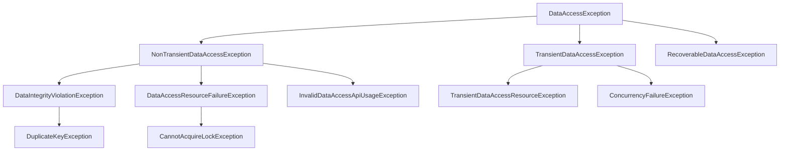

**常见异常**：

| 异常 | 说明 | 原因 |
|------|------|------|
| DataIntegrityViolationException | 数据完整性违反 | 违反唯一约束、外键约束 |
| DuplicateKeyException | 主键或唯一键重复 | 插入重复数据 |
| EmptyResultDataAccessException | 查询结果为空 | 期望单条记录但无结果 |
| IncorrectResultSizeDataAccessException | 结果数量不正确 | 期望单条但返回多条 |
| DataAccessResourceFailureException | 资源访问失败 | 数据库连接失败 |
| CannotAcquireLockException | 无法获取锁 | 死锁或锁超时 |
| OptimisticLockingFailureException | 乐观锁失败 | 版本号冲突 |
| PessimisticLockingFailureException | 悲观锁失败 | 无法获取行锁 |

**示例**：
```java
try {
    jdbcTemplate.update("INSERT INTO users(id, name) VALUES(?, ?)", 1, "Alice");
} catch (DuplicateKeyException e) {
    // 主键重复
    log.error("User already exists", e);
} catch (DataAccessException e) {
    // 其他数据访问异常
    log.error("Database error", e);
}
```

**优势**：
- 统一异常体系，不依赖具体持久层技术
- 运行时异常，不强制捕获
- 便于切换持久层实现

### 5.3 spring JDBC API中存在哪些类?
Spring JDBC模块提供了多个核心类简化JDBC操作。

**核心类**：

**1. JdbcTemplate（最常用）**
```java
@Repository
public class UserDao {
    @Autowired
    private JdbcTemplate jdbcTemplate;

    public User findById(Long id) {
        return jdbcTemplate.queryForObject(
            "SELECT * FROM users WHERE id = ?",
            new BeanPropertyRowMapper<>(User.class),
            id
        );
    }

    public int insert(User user) {
        return jdbcTemplate.update(
            "INSERT INTO users(name, email) VALUES(?, ?)",
            user.getName(), user.getEmail()
        );
    }

    public List<User> findAll() {
        return jdbcTemplate.query(
            "SELECT * FROM users",
            new BeanPropertyRowMapper<>(User.class)
        );
    }
}
```

**2. NamedParameterJdbcTemplate**
支持命名参数：
```java
@Repository
public class UserDao {
    @Autowired
    private NamedParameterJdbcTemplate namedJdbcTemplate;

    public User findByEmail(String email) {
        Map<String, Object> params = new HashMap<>();
        params.put("email", email);
        return namedJdbcTemplate.queryForObject(
            "SELECT * FROM users WHERE email = :email",
            params,
            new BeanPropertyRowMapper<>(User.class)
        );
    }
}
```

**3. SimpleJdbcInsert**
简化插入操作：
```java
@Repository
public class UserDao {
    private SimpleJdbcInsert insertActor;

    @Autowired
    public void setDataSource(DataSource dataSource) {
        this.insertActor = new SimpleJdbcInsert(dataSource)
            .withTableName("users")
            .usingGeneratedKeyColumns("id");
    }

    public long insert(User user) {
        Map<String, Object> params = new HashMap<>();
        params.put("name", user.getName());
        params.put("email", user.getEmail());
        return insertActor.executeAndReturnKey(params).longValue();
    }
}
```

**4. SimpleJdbcCall**
调用存储过程：
```java
SimpleJdbcCall jdbcCall = new SimpleJdbcCall(dataSource)
    .withProcedureName("get_user_count");
Map<String, Object> result = jdbcCall.execute();
```

**5. RowMapper**
结果集映射：
```java
public class UserRowMapper implements RowMapper<User> {
    @Override
    public User mapRow(ResultSet rs, int rowNum) throws SQLException {
        User user = new User();
        user.setId(rs.getLong("id"));
        user.setName(rs.getString("name"));
        user.setEmail(rs.getString("email"));
        return user;
    }
}
```

**6. JdbcDaoSupport**
DAO基类（已不推荐，直接注入JdbcTemplate更好）：
```java
public class UserDao extends JdbcDaoSupport {
    public User findById(Long id) {
        return getJdbcTemplate().queryForObject(...);
    }
}
```

### 5.4 使用Spring访问Hibernate的方法有哪些?
Spring提供多种方式集成Hibernate。

**方式1：直接使用Hibernate SessionFactory（推荐）**
```java
@Configuration
public class HibernateConfig {
    @Bean
    public LocalSessionFactoryBean sessionFactory(DataSource dataSource) {
        LocalSessionFactoryBean sessionFactory = new LocalSessionFactoryBean();
        sessionFactory.setDataSource(dataSource);
        sessionFactory.setPackagesToScan("com.example.entity");
        sessionFactory.setHibernateProperties(hibernateProperties());
        return sessionFactory;
    }

    private Properties hibernateProperties() {
        Properties properties = new Properties();
        properties.put("hibernate.dialect", "org.hibernate.dialect.MySQL8Dialect");
        properties.put("hibernate.show_sql", "true");
        properties.put("hibernate.hbm2ddl.auto", "update");
        return properties;
    }
}

@Repository
public class UserDao {
    @Autowired
    private SessionFactory sessionFactory;

    public User findById(Long id) {
        Session session = sessionFactory.getCurrentSession();
        return session.get(User.class, id);
    }

    @Transactional
    public void save(User user) {
        sessionFactory.getCurrentSession().save(user);
    }
}
```

**方式2：使用HibernateTemplate（已废弃）**
```java
// Spring 5.x已移除HibernateTemplate，不推荐使用
@Repository
public class UserDao extends HibernateDaoSupport {
    public User findById(Long id) {
        return getHibernateTemplate().get(User.class, id);
    }
}
```

**方式3：使用JPA（推荐）**
```java
@Configuration
@EnableJpaRepositories("com.example.repository")
public class JpaConfig {
    @Bean
    public LocalContainerEntityManagerFactoryBean entityManagerFactory(
            DataSource dataSource) {
        LocalContainerEntityManagerFactoryBean em =
            new LocalContainerEntityManagerFactoryBean();
        em.setDataSource(dataSource);
        em.setPackagesToScan("com.example.entity");
        em.setJpaVendorAdapter(new HibernateJpaVendorAdapter());
        return em;
    }
}

@Repository
public interface UserRepository extends JpaRepository<User, Long> {
    List<User> findByName(String name);
}
```

**最佳实践**：
- 新项目：使用Spring Data JPA
- 需要Hibernate特性：直接使用SessionFactory
- 避免使用HibernateTemplate（已废弃）

### 5.5 列举spring支持的事务管理类型
Spring支持两种事务管理类型：

```mermaid
graph LR
    A[Spring事务管理] --> B[编程式事务]
    A --> C[声明式事务]
    B --> B1[TransactionTemplate]
    B --> B2[PlatformTransactionManager]
    C --> C1[XML配置]
    C --> C2[@Transactional注解]
```

**1. 编程式事务管理**

**使用TransactionTemplate**：
```java
@Service
public class UserService {
    @Autowired
    private TransactionTemplate transactionTemplate;
    @Autowired
    private UserDao userDao;

    public void transferMoney(Long fromId, Long toId, BigDecimal amount) {
        transactionTemplate.execute(status -> {
            try {
                userDao.debit(fromId, amount);
                userDao.credit(toId, amount);
                return null;
            } catch (Exception e) {
                status.setRollbackOnly();
                throw e;
            }
        });
    }
}
```

**使用PlatformTransactionManager**：
```java
@Service
public class UserService {
    @Autowired
    private PlatformTransactionManager txManager;

    public void transferMoney(Long fromId, Long toId, BigDecimal amount) {
        TransactionDefinition def = new DefaultTransactionDefinition();
        TransactionStatus status = txManager.getTransaction(def);
        try {
            userDao.debit(fromId, amount);
            userDao.credit(toId, amount);
            txManager.commit(status);
        } catch (Exception e) {
            txManager.rollback(status);
            throw e;
        }
    }
}
```

**2. 声明式事务管理（推荐）**

**使用@Transactional注解**：
```java
@Service
public class UserService {
    @Autowired
    private UserDao userDao;

    @Transactional
    public void transferMoney(Long fromId, Long toId, BigDecimal amount) {
        userDao.debit(fromId, amount);
        userDao.credit(toId, amount);
        // 自动提交或回滚
    }

    @Transactional(
        propagation = Propagation.REQUIRED,
        isolation = Isolation.READ_COMMITTED,
        timeout = 30,
        rollbackFor = Exception.class,
        noRollbackFor = BusinessException.class
    )
    public void complexOperation() {
        // 事务配置
    }
}
```

**启用事务管理**：
```java
@Configuration
@EnableTransactionManagement
public class AppConfig {
    @Bean
    public PlatformTransactionManager transactionManager(DataSource dataSource) {
        return new DataSourceTransactionManager(dataSource);
    }
}
```

**XML配置**：
```xml
<tx:advice id="txAdvice" transaction-manager="transactionManager">
    <tx:attributes>
        <tx:method name="get*" read-only="true"/>
        <tx:method name="*" propagation="REQUIRED"/>
    </tx:attributes>
</tx:advice>

<aop:config>
    <aop:pointcut id="serviceOperation"
        expression="execution(* com.example.service.*.*(..))"/>
    <aop:advisor advice-ref="txAdvice" pointcut-ref="serviceOperation"/>
</aop:config>
```

**对比**：

| 特性 | 编程式 | 声明式 |
|------|--------|--------|
| 代码侵入 | 高 | 低 |
| 灵活性 | 高 | 中 |
| 易用性 | 低 | 高 |
| 推荐度 | 特殊场景 | 日常开发 |

### 5.6 spring支持哪些ORM框架
Spring支持多种ORM（Object-Relational Mapping）框架的集成。

| ORM框架 | Spring支持 | 推荐度 | 说明 |
|---------|-----------|--------|------|
| Hibernate | ✓ | ★★★★★ | 最流行的ORM框架 |
| JPA | ✓ | ★★★★★ | Java标准，Hibernate是实现之一 |
| MyBatis | ✓ | ★★★★★ | 半自动ORM，SQL可控 |
| JDO | ✓ | ★★ | 较少使用 |
| iBatis | ✓ | ★ | MyBatis前身，已废弃 |

**1. Hibernate集成**
```java
@Configuration
public class HibernateConfig {
    @Bean
    public LocalSessionFactoryBean sessionFactory(DataSource dataSource) {
        LocalSessionFactoryBean sf = new LocalSessionFactoryBean();
        sf.setDataSource(dataSource);
        sf.setPackagesToScan("com.example.entity");
        return sf;
    }
}
```

**2. JPA集成（推荐）**
```java
@Configuration
@EnableJpaRepositories("com.example.repository")
public class JpaConfig {
    @Bean
    public LocalContainerEntityManagerFactoryBean entityManagerFactory(
            DataSource dataSource) {
        LocalContainerEntityManagerFactoryBean em =
            new LocalContainerEntityManagerFactoryBean();
        em.setDataSource(dataSource);
        em.setPackagesToScan("com.example.entity");
        em.setJpaVendorAdapter(new HibernateJpaVendorAdapter());
        return em;
    }
}

// 使用Spring Data JPA
public interface UserRepository extends JpaRepository<User, Long> {
    List<User> findByName(String name);
}
```

**3. MyBatis集成**
```java
@Configuration
@MapperScan("com.example.mapper")
public class MyBatisConfig {
    @Bean
    public SqlSessionFactory sqlSessionFactory(DataSource dataSource) throws Exception {
        SqlSessionFactoryBean factory = new SqlSessionFactoryBean();
        factory.setDataSource(dataSource);
        return factory.getObject();
    }
}

@Mapper
public interface UserMapper {
    @Select("SELECT * FROM users WHERE id = #{id}")
    User findById(Long id);
}
```

**选择建议**：
- 复杂查询、SQL优化：MyBatis
- 快速开发、CRUD为主：Spring Data JPA
- 需要JPA标准：Hibernate + JPA
- 新项目推荐：Spring Data JPA 或 MyBatis-Plus

---

## 6. AOP

### 6.1 什么是AOP?
AOP（Aspect-Oriented Programming，面向切面编程）是一种编程范式，用于将横切关注点（cross-cutting concerns）从业务逻辑中分离出来。

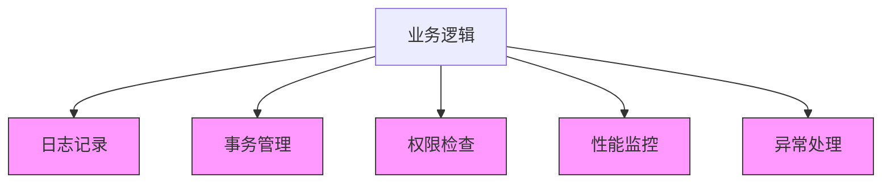

**核心概念**：

**横切关注点**：多个模块都需要的功能，如日志、事务、安全等。

**传统方式的问题**：
```java
public class UserService {
    public void createUser(User user) {
        // 日志记录
        log.info("Creating user: " + user.getName());
        // 权限检查
        if (!hasPermission()) throw new SecurityException();
        // 事务开始
        Transaction tx = beginTransaction();
        try {
            // 业务逻辑
            userDao.save(user);
            // 事务提交
            tx.commit();
        } catch (Exception e) {
            // 事务回滚
            tx.rollback();
            // 异常处理
            log.error("Failed to create user", e);
            throw e;
        }
        // 日志记录
        log.info("User created successfully");
    }
}
// 问题：业务逻辑被横切关注点淹没
```

**AOP方式**：
```java
@Service
public class UserService {
    @Transactional
    @Secured("ROLE_ADMIN")
    @Logging
    public void createUser(User user) {
        userDao.save(user);  // 只关注业务逻辑
    }
}

@Aspect
@Component
public class LoggingAspect {
    @Around("@annotation(Logging)")
    public Object log(ProceedingJoinPoint pjp) throws Throwable {
        log.info("Method: " + pjp.getSignature().getName());
        Object result = pjp.proceed();
        log.info("Method completed");
        return result;
    }
}
```

**AOP的优势**：
1. 代码复用：横切逻辑只写一次
2. 关注点分离：业务逻辑更清晰
3. 易于维护：修改横切逻辑不影响业务代码
4. 动态增强：运行时织入功能

**Spring AOP应用场景**：
- 事务管理（@Transactional）
- 日志记录
- 权限控制（@Secured）
- 性能监控
- 异常处理
- 缓存（@Cacheable）

### 6.2 什么是Aspect?
Aspect（切面）是AOP的核心概念，是横切关注点的模块化。

**定义**：Aspect = Pointcut（切点） + Advice（通知）

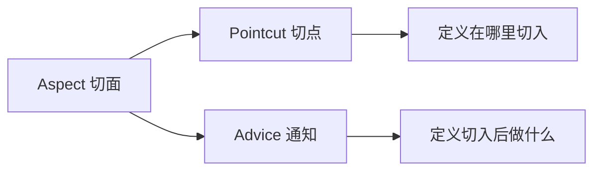

**示例**：
```java
@Aspect
@Component
public class LoggingAspect {  // 这是一个切面

    // Pointcut：定义切入点
    @Pointcut("execution(* com.example.service.*.*(..))")
    public void serviceMethods() {}

    // Advice：定义通知（切入后的行为）
    @Before("serviceMethods()")
    public void logBefore(JoinPoint joinPoint) {
        log.info("Before method: " + joinPoint.getSignature().getName());
    }

    @AfterReturning(pointcut = "serviceMethods()", returning = "result")
    public void logAfterReturning(JoinPoint joinPoint, Object result) {
        log.info("Method returned: " + result);
    }

    @AfterThrowing(pointcut = "serviceMethods()", throwing = "error")
    public void logAfterThrowing(JoinPoint joinPoint, Throwable error) {
        log.error("Method threw exception: " + error.getMessage());
    }
}
```

**完整的事务切面示例**：
```java
@Aspect
@Component
public class TransactionAspect {

    @Around("@annotation(Transactional)")
    public Object manageTransaction(ProceedingJoinPoint pjp) throws Throwable {
        TransactionStatus status = transactionManager.getTransaction(def);
        try {
            Object result = pjp.proceed();
            transactionManager.commit(status);
            return result;
        } catch (Exception e) {
            transactionManager.rollback(status);
            throw e;
        }
    }
}
```

**Aspect的组成**：
1. **Pointcut**：匹配连接点的表达式
2. **Advice**：在切点执行的代码
3. **Introduction**：为类添加新方法或属性（可选）

### 6.3 什么是切点(JoinPoint)
JoinPoint（连接点）是程序执行过程中能够插入切面的点。

**可以作为连接点的位置**：
- 方法调用
- 方法执行
- 构造函数调用
- 字段访问
- 异常处理

**Spring AOP支持的连接点**：
Spring AOP只支持**方法执行**作为连接点（AspectJ支持更多）。

```java
@Aspect
@Component
public class LoggingAspect {

    @Before("execution(* com.example.service.*.*(..))")
    public void logBefore(JoinPoint joinPoint) {
        // JoinPoint提供连接点信息
        String methodName = joinPoint.getSignature().getName();
        String className = joinPoint.getTarget().getClass().getName();
        Object[] args = joinPoint.getArgs();

        log.info("Class: " + className);
        log.info("Method: " + methodName);
        log.info("Args: " + Arrays.toString(args));
    }
}
```

**JoinPoint API**：
```java
public interface JoinPoint {
    Object[] getArgs();              // 方法参数
    Signature getSignature();        // 方法签名
    Object getTarget();              // 目标对象
    Object getThis();                // 代理对象
    String getKind();                // 连接点类型
    SourceLocation getSourceLocation();  // 源码位置
}
```

**ProceedingJoinPoint（用于@Around）**：
```java
@Around("execution(* com.example.service.*.*(..))")
public Object around(ProceedingJoinPoint pjp) throws Throwable {
    log.info("Before method");
    Object result = pjp.proceed();  // 执行目标方法
    // 或修改参数：pjp.proceed(new Object[]{newArg});
    log.info("After method");
    return result;
}
```

### 6.4 什么是通知(Advice)?
Advice（通知）是切面在特定连接点执行的动作。

**通知类型**：

```mermaid
graph TD
    A[Advice 通知] --> B[@Before 前置通知]
    A --> C[@AfterReturning 返回后通知]
    A --> D[@AfterThrowing 异常通知]
    A --> E[@After 后置通知]
    A --> F[@Around 环绕通知]

    B --> B1[方法执行前]
    C --> C1[方法正常返回后]
    D --> D1[方法抛异常后]
    E --> E1[方法执行后 无论成功失败]
    F --> F1[完全控制方法执行]
```

**完整示例**：
```java
@Aspect
@Component
public class AdviceExample {

    // 1. 前置通知：方法执行前
    @Before("execution(* com.example.service.UserService.create*(..))")
    public void beforeAdvice(JoinPoint joinPoint) {
        log.info("Before creating user");
    }

    // 2. 返回后通知：方法正常返回后
    @AfterReturning(
        pointcut = "execution(* com.example.service.UserService.find*(..))",
        returning = "result"
    )
    public void afterReturningAdvice(JoinPoint joinPoint, Object result) {
        log.info("Method returned: " + result);
    }

    // 3. 异常通知：方法抛异常后
    @AfterThrowing(
        pointcut = "execution(* com.example.service.*.*(..))",
        throwing = "error"
    )
    public void afterThrowingAdvice(JoinPoint joinPoint, Throwable error) {
        log.error("Method threw: " + error.getMessage());
    }

    // 4. 后置通知：方法执行后（无论成功失败）
    @After("execution(* com.example.service.*.*(..))")
    public void afterAdvice(JoinPoint joinPoint) {
        log.info("Method completed");
    }

    // 5. 环绕通知：完全控制方法执行
    @Around("execution(* com.example.service.*.*(..))")
    public Object aroundAdvice(ProceedingJoinPoint pjp) throws Throwable {
        long start = System.currentTimeMillis();
        try {
            Object result = pjp.proceed();  // 执行目标方法
            long time = System.currentTimeMillis() - start;
            log.info("Method took " + time + "ms");
            return result;
        } catch (Exception e) {
            log.error("Method failed", e);
            throw e;
        }
    }
}
```

**执行顺序**：
```
@Around (before)
  @Before
    目标方法执行
  @AfterReturning / @AfterThrowing
  @After
@Around (after)
```

### 6.5 有哪些类型的通知(Advice)?
（参见6.4，已详细说明五种通知类型）

Spring AOP支持五种通知类型：

| 通知类型 | 注解 | 执行时机 | 用途 |
|---------|------|---------|------|
| 前置通知 | @Before | 方法执行前 | 参数校验、日志 |
| 返回后通知 | @AfterReturning | 方法正常返回后 | 结果处理、缓存 |
| 异常通知 | @AfterThrowing | 方法抛异常后 | 异常处理、告警 |
| 后置通知 | @After | 方法执行后（finally） | 资源清理 |
| 环绕通知 | @Around | 完全控制方法执行 | 性能监控、事务 |

**选择建议**：
- 简单场景：使用@Before、@AfterReturning等
- 需要控制方法执行：使用@Around
- 需要修改返回值：使用@Around
- 需要捕获异常并处理：使用@Around或@AfterThrowing

### 6.6 指出在spring aop中concern和cross-cutting concern的不同之处。
**Concern（关注点）** vs **Cross-cutting Concern（横切关注点）**

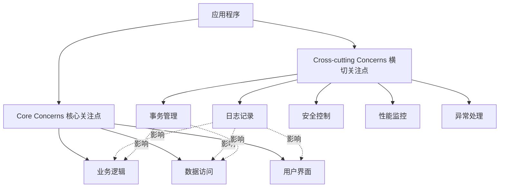

**Concern（关注点）**：
- 应用程序的某个功能模块
- 例如：用户管理、订单处理、支付功能
- 通常对应一个模块或类

**Cross-cutting Concern（横切关注点）**：
- 跨越多个模块的通用功能
- 例如：日志、事务、安全、缓存
- 如果用传统方式实现，会分散在多个模块中

**示例对比**：

**传统方式（横切关注点分散）**：
```java
public class UserService {
    public void createUser(User user) {
        log.info("Creating user");  // 日志
        checkPermission();          // 安全
        beginTransaction();         // 事务
        try {
            userDao.save(user);     // 核心业务逻辑
            commitTransaction();
        } catch (Exception e) {
            rollbackTransaction();
            throw e;
        }
    }
}

public class OrderService {
    public void createOrder(Order order) {
        log.info("Creating order");  // 日志（重复）
        checkPermission();           // 安全（重复）
        beginTransaction();          // 事务（重复）
        try {
            orderDao.save(order);    // 核心业务逻辑
            commitTransaction();
        } catch (Exception e) {
            rollbackTransaction();
            throw e;
        }
    }
}
```

**AOP方式（横切关注点集中）**：
```java
// 核心关注点：只关注业务逻辑
@Service
public class UserService {
    @Transactional
    @Secured("ROLE_ADMIN")
    @Logging
    public void createUser(User user) {
        userDao.save(user);  // 纯粹的业务逻辑
    }
}

// 横切关注点：集中管理
@Aspect
@Component
public class LoggingAspect {
    @Around("@annotation(Logging)")
    public Object log(ProceedingJoinPoint pjp) throws Throwable {
        log.info("Method: " + pjp.getSignature().getName());
        return pjp.proceed();
    }
}
```

**区别总结**：
- Concern：应用的功能模块（垂直切分）
- Cross-cutting Concern：跨模块的通用功能（水平切分）
- AOP的目标：将横切关注点模块化

### 6.7 AOP有哪些实现方式?
AOP有多种实现方式：

**1. 静态AOP（编译时织入）**
- AspectJ编译器在编译时将切面织入目标类
- 性能最好，但需要特殊编译器
- 支持所有连接点（字段访问、构造函数等）

```java
// AspectJ语法
public aspect LoggingAspect {
    pointcut serviceMethods(): execution(* com.example.service.*.*(..));

    before(): serviceMethods() {
        System.out.println("Before method");
    }
}
```

**2. 动态AOP（运行时织入）**

**2.1 JDK动态代理（基于接口）**
```java
// 目标接口
public interface UserService {
    void createUser(User user);
}

// 代理处理器
public class LoggingInvocationHandler implements InvocationHandler {
    private Object target;

    @Override
    public Object invoke(Object proxy, Method method, Object[] args) throws Throwable {
        log.info("Before method");
        Object result = method.invoke(target, args);
        log.info("After method");
        return result;
    }
}

// 创建代理
UserService proxy = (UserService) Proxy.newProxyInstance(
    UserService.class.getClassLoader(),
    new Class[]{UserService.class},
    new LoggingInvocationHandler(target)
);
```

**2.2 CGLIB动态代理（基于子类）**
```java
// 目标类（无需接口）
public class UserService {
    public void createUser(User user) { }
}

// 方法拦截器
public class LoggingMethodInterceptor implements MethodInterceptor {
    @Override
    public Object intercept(Object obj, Method method, Object[] args,
                          MethodProxy proxy) throws Throwable {
        log.info("Before method");
        Object result = proxy.invokeSuper(obj, args);
        log.info("After method");
        return result;
    }
}

// 创建代理
Enhancer enhancer = new Enhancer();
enhancer.setSuperclass(UserService.class);
enhancer.setCallback(new LoggingMethodInterceptor());
UserService proxy = (UserService) enhancer.create();
```

**Spring AOP的实现**：
- 默认使用JDK动态代理（目标类实现接口）
- 如果目标类没有接口，使用CGLIB代理
- 可通过配置强制使用CGLIB

```java
@EnableAspectJAutoProxy(proxyTargetClass = true)  // 强制CGLIB
public class AppConfig { }
```

**对比**：

| 实现方式 | 织入时机 | 性能 | 支持的连接点 | 是否需要接口 |
|---------|---------|------|-------------|------------|
| AspectJ | 编译时 | 最好 | 全部 | 否 |
| JDK代理 | 运行时 | 较好 | 方法执行 | 是 |
| CGLIB | 运行时 | 好 | 方法执行 | 否 |

### 6.8 Spring AOP and AspectJ AOP有什么区别?
Spring AOP和AspectJ AOP是两种不同的AOP实现。

| 特性 | Spring AOP | AspectJ AOP |
|------|-----------|-------------|
| 实现方式 | 动态代理（运行时） | 编译时织入/类加载时织入 |
| 织入时机 | 运行时 | 编译时/加载时/运行时 |
| 连接点 | 仅方法执行 | 方法、字段、构造函数等 |
| 性能 | 较好 | 最好 |
| 学习曲线 | 简单 | 复杂 |
| 依赖 | Spring容器 | 独立使用 |
| 配置 | 注解或XML | 注解或.aj文件 |
| 代理方式 | JDK代理/CGLIB | 字节码修改 |

**Spring AOP示例**：
```java
@Aspect
@Component
public class LoggingAspect {
    @Before("execution(* com.example.service.*.*(..))")
    public void logBefore(JoinPoint joinPoint) {
        log.info("Before: " + joinPoint.getSignature().getName());
    }
}

// 限制：只能拦截Spring Bean的方法调用
```

**AspectJ示例**：
```java
@Aspect
public class LoggingAspect {
    // 支持更多连接点
    @Before("execution(* com.example.service.*.*(..))")
    public void logBefore(JoinPoint joinPoint) { }

    // 字段访问
    @Before("get(* com.example.User.name)")
    public void logFieldAccess() { }

    // 构造函数
    @Before("call(com.example.User.new(..))")
    public void logConstructor() { }
}
```

**Spring AOP使用AspectJ语法**：
```java
// Spring AOP可以使用AspectJ的注解和表达式
@Aspect
@Component
public class MyAspect {
    @Pointcut("execution(* com.example..*.*(..))")  // AspectJ表达式
    public void allMethods() {}

    @Before("allMethods()")
    public void before() { }
}
// 但底层仍是Spring AOP（动态代理），不是真正的AspectJ
```

**何时使用AspectJ**：
- 需要拦截字段访问、构造函数
- 需要拦截非Spring管理的对象
- 对性能要求极高
- 需要编译时检查

**何时使用Spring AOP**：
- 只需要方法级别的拦截
- 使用Spring框架
- 简单易用，无需特殊编译器
- 大多数场景足够用

### 6.9 如何理解Spring中的代理?
Spring AOP通过代理模式实现，在目标对象外包装一层代理对象。

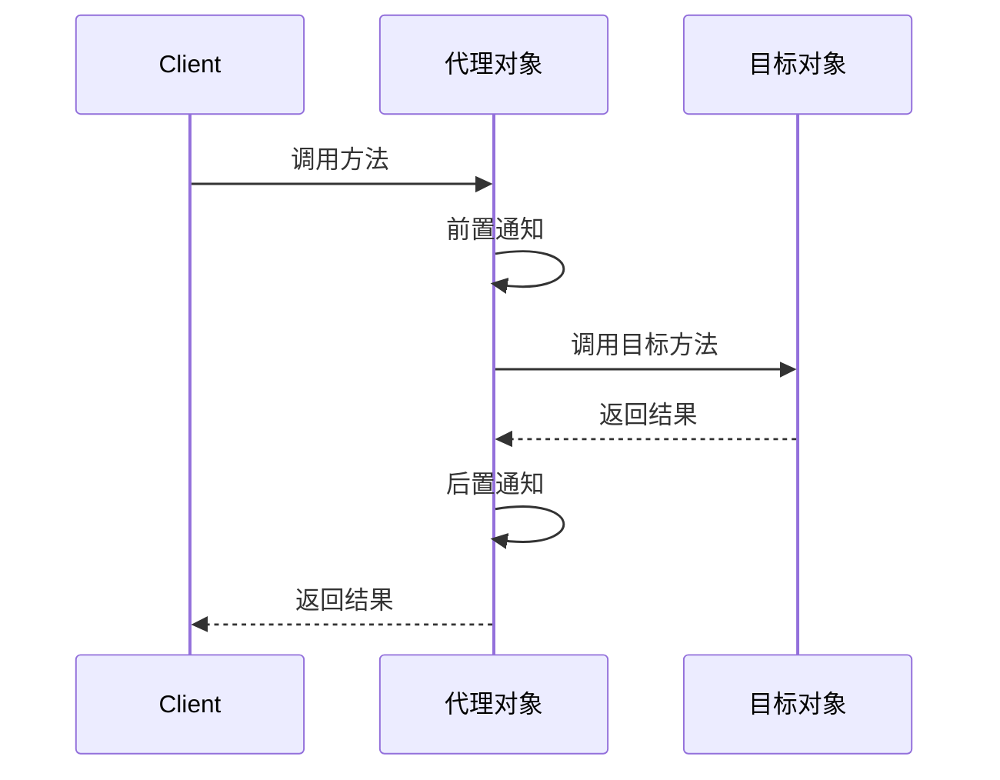

**JDK动态代理**：
```java
// 接口
public interface UserService {
    void createUser(User user);
}

// 实现类
@Service
public class UserServiceImpl implements UserService {
    @Override
    public void createUser(User user) {
        System.out.println("Creating user");
    }
}

// Spring创建的代理
UserService proxy = (UserService) Proxy.newProxyInstance(
    classLoader,
    new Class[]{UserService.class},
    invocationHandler
);

// 调用流程
proxy.createUser(user);
// 1. 调用InvocationHandler.invoke()
// 2. 执行前置通知
// 3. 调用目标对象的createUser()
// 4. 执行后置通知
// 5. 返回结果
```

**CGLIB代理**：
```java
// 无接口的类
@Service
public class UserService {
    public void createUser(User user) {
        System.out.println("Creating user");
    }
}

// Spring创建的代理（子类）
public class UserService$$EnhancerBySpringCGLIB$$12345 extends UserService {
    @Override
    public void createUser(User user) {
        // 前置通知
        super.createUser(user);  // 调用父类方法
        // 后置通知
    }
}
```

**代理的特点**：

**1. 代理对象 != 目标对象**
```java
@Service
public class UserService {
    @Autowired
    private UserService self;  // 注入的是代理对象

    public void methodA() {
        this.methodB();   // 直接调用，不走代理
        self.methodB();   // 通过代理调用，触发AOP
    }

    @Transactional
    public void methodB() { }
}
```

**2. 只有外部调用才走代理**
```java
@Service
public class UserService {
    @Transactional
    public void methodA() {
        methodB();  // 内部调用，不走代理，@Transactional不生效
    }

    @Transactional
    public void methodB() { }
}
```

**3. final方法无法被代理**
```java
@Service
public class UserService {
    @Transactional
    public final void method() { }  // CGLIB无法代理final方法
}
```

**查看代理类型**：
```java
@Autowired
private UserService userService;

System.out.println(userService.getClass().getName());
// JDK代理：com.sun.proxy.$Proxy123
// CGLIB代理：com.example.UserService$$EnhancerBySpringCGLIB$$12345
```

### 6.10 什么是编织(Weaving)?
Weaving（编织）是将切面应用到目标对象并创建代理对象的过程。

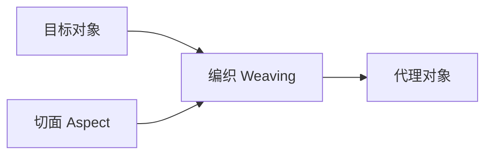

**编织时机**：

**1. 编译时编织（Compile-time Weaving, CTW）**
- 在编译Java源码时织入切面
- 需要特殊编译器（AspectJ编译器ajc）
- 性能最好，但需要修改构建流程

```xml
<!-- Maven配置AspectJ编译器 -->
<plugin>
    <groupId>org.codehaus.mojo</groupId>
    <artifactId>aspectj-maven-plugin</artifactId>
    <configuration>
        <complianceLevel>1.8</complianceLevel>
    </configuration>
</plugin>
```

**2. 编译后编织（Post-compile Weaving, PCW）**
- 在编译后的class文件中织入切面
- 可以对第三方jar包进行织入
- 也需要AspectJ编译器

**3. 类加载时编织（Load-time Weaving, LTW）**
- 在类加载到JVM时织入切面
- 需要Java Agent或特殊类加载器
- 灵活性好，但有性能开销

```java
// 启用LTW
@Configuration
@EnableLoadTimeWeaving
public class AppConfig { }
```

```bash
# 启动时指定Java Agent
java -javaagent:spring-instrument.jar -jar app.jar
```

**4. 运行时编织（Runtime Weaving）**
- Spring AOP使用的方式
- 通过动态代理在运行时织入
- 无需特殊编译器，最简单

```java
@Aspect
@Component
public class LoggingAspect {
    @Before("execution(* com.example.service.*.*(..))")
    public void log() {
        // 运行时织入
    }
}
```

**对比**：

| 编织时机 | 性能 | 灵活性 | 复杂度 | 使用场景 |
|---------|------|--------|--------|---------|
| 编译时 | 最好 | 低 | 高 | 性能敏感 |
| 编译后 | 好 | 中 | 高 | 第三方库 |
| 类加载时 | 中 | 高 | 中 | 需要完整AspectJ |
| 运行时 | 较低 | 最高 | 低 | Spring应用 |

**Spring AOP的编织过程**：
```java
// 1. Spring容器启动
// 2. 扫描@Aspect注解的类
// 3. 解析切点表达式
// 4. 为匹配的Bean创建代理对象
// 5. 将代理对象放入容器
// 6. 应用调用时，代理对象拦截并织入切面逻辑
```

---

## 7. MVC

### 7.1 Spring MVC框架有什么用?
Spring MVC是Spring框架的Web模块，用于构建Web应用程序。

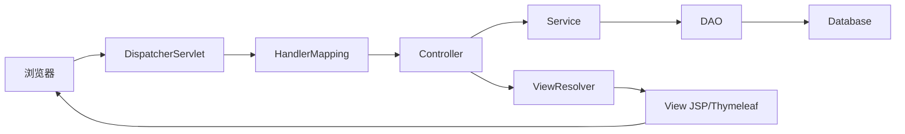

**核心功能**：

**1. MVC架构分离**
```java
// Model：数据模型
public class User {
    private String name;
    private String email;
}

// View：视图（JSP/Thymeleaf）
// user.html
<h1>User: ${user.name}</h1>

// Controller：控制器
@Controller
public class UserController {
    @GetMapping("/users/{id}")
    public String getUser(@PathVariable Long id, Model model) {
        User user = userService.findById(id);
        model.addAttribute("user", user);
        return "user";  // 返回视图名
    }
}
```

**2. 请求映射**
```java
@RestController
@RequestMapping("/api/users")
public class UserRestController {
    @GetMapping
    public List<User> list() { }

    @GetMapping("/{id}")
    public User get(@PathVariable Long id) { }

    @PostMapping
    public User create(@RequestBody User user) { }

    @PutMapping("/{id}")
    public User update(@PathVariable Long id, @RequestBody User user) { }

    @DeleteMapping("/{id}")
    public void delete(@PathVariable Long id) { }
}
```

**3. 数据绑定**
```java
@PostMapping("/users")
public String create(@ModelAttribute User user) {
    // 自动绑定表单数据到User对象
    userService.save(user);
    return "redirect:/users";
}
```

**4. 数据验证**
```java
public class User {
    @NotBlank(message = "Name is required")
    private String name;

    @Email(message = "Invalid email")
    private String email;
}

@PostMapping("/users")
public String create(@Valid @ModelAttribute User user, BindingResult result) {
    if (result.hasErrors()) {
        return "user-form";
    }
    userService.save(user);
    return "redirect:/users";
}
```

**5. 异常处理**
```java
@ControllerAdvice
public class GlobalExceptionHandler {
    @ExceptionHandler(UserNotFoundException.class)
    public ResponseEntity<String> handleNotFound(UserNotFoundException e) {
        return ResponseEntity.status(404).body(e.getMessage());
    }
}
```

**6. 拦截器**
```java
public class LoggingInterceptor implements HandlerInterceptor {
    @Override
    public boolean preHandle(HttpServletRequest request,
                            HttpServletResponse response,
                            Object handler) {
        log.info("Request: " + request.getRequestURI());
        return true;
    }
}
```

**优势**：
- 清晰的MVC分层
- 强大的请求映射
- 灵活的视图技术支持
- 完善的数据绑定和验证
- 与Spring生态无缝集成

### 7.2 描述一下DispatcherServlet的工作流程
DispatcherServlet是Spring MVC的核心，负责协调整个请求处理流程。

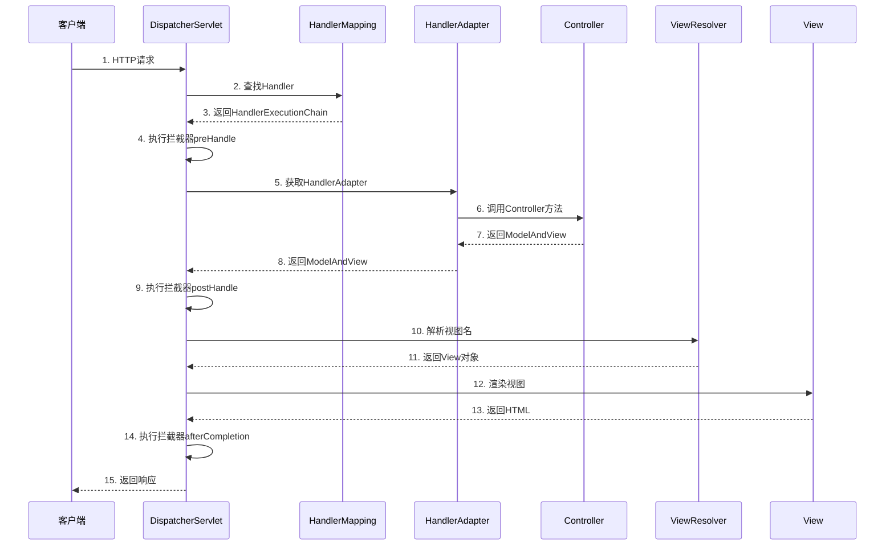

**详细流程**：

**1. 接收请求**
```java
// DispatcherServlet继承HttpServlet
protected void doDispatch(HttpServletRequest request,
                         HttpServletResponse response) {
    // 处理请求
}
```

**2. 查找Handler**
```java
// HandlerMapping根据URL找到对应的Controller方法
HandlerExecutionChain chain = getHandler(request);
// 返回：Controller方法 + 拦截器链
```

**3. 执行拦截器preHandle**
```java
if (!chain.applyPreHandle(request, response)) {
    return;  // 拦截器返回false，终止请求
}
```

**4. 调用Controller**
```java
// HandlerAdapter适配不同类型的Handler
HandlerAdapter ha = getHandlerAdapter(handler);
ModelAndView mv = ha.handle(request, response, handler);
```

**5. 执行拦截器postHandle**
```java
chain.applyPostHandle(request, response, mv);
```

**6. 视图解析**
```java
// ViewResolver解析视图名为View对象
View view = resolveViewName(mv.getViewName(), locale);
```

**7. 渲染视图**
```java
view.render(mv.getModelMap(), request, response);
```

**8. 执行拦截器afterCompletion**
```java
chain.triggerAfterCompletion(request, response, null);
```

**配置示例**：
```java
@Configuration
@EnableWebMvc
public class WebConfig implements WebMvcConfigurer {
    @Override
    public void addInterceptors(InterceptorRegistry registry) {
        registry.addInterceptor(new LoggingInterceptor())
                .addPathPatterns("/api/**");
    }

    @Bean
    public ViewResolver viewResolver() {
        InternalResourceViewResolver resolver = new InternalResourceViewResolver();
        resolver.setPrefix("/WEB-INF/views/");
        resolver.setSuffix(".jsp");
        return resolver;
    }
}
```

### 7.3 介绍一下WebApplicationContext
WebApplicationContext是ApplicationContext的Web扩展，专门用于Web应用。

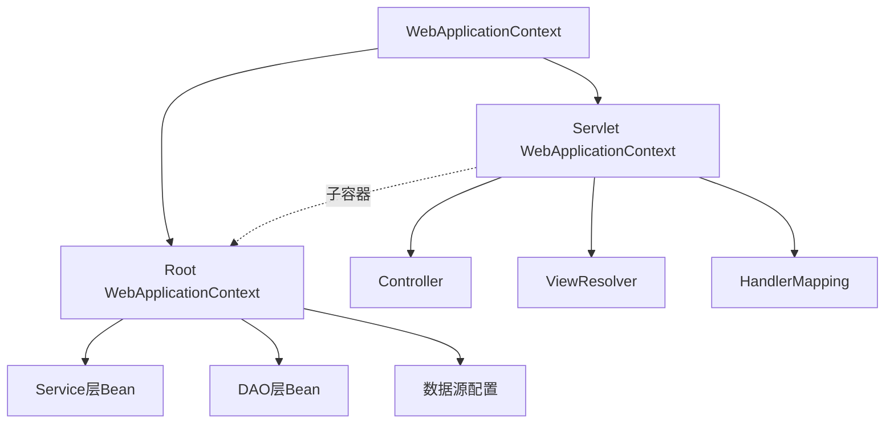

**层次结构**：

**1. Root WebApplicationContext（父容器）**
```xml
<!-- web.xml -->
<context-param>
    <param-name>contextConfigLocation</param-name>
    <param-value>/WEB-INF/applicationContext.xml</param-value>
</context-param>

<listener>
    <listener-class>org.springframework.web.context.ContextLoaderListener</listener-class>
</listener>
```

```java
// 包含业务层Bean
@Configuration
@ComponentScan(basePackages = "com.example.service")
public class RootConfig {
    @Bean
    public DataSource dataSource() { }
}
```

**2. Servlet WebApplicationContext（子容器）**
```xml
<!-- web.xml -->
<servlet>
    <servlet-name>dispatcher</servlet-name>
    <servlet-class>org.springframework.web.servlet.DispatcherServlet</servlet-class>
    <init-param>
        <param-name>contextConfigLocation</param-name>
        <param-value>/WEB-INF/dispatcher-servlet.xml</param-value>
    </init-param>
</servlet>
```

```java
// 包含Web层Bean
@Configuration
@EnableWebMvc
@ComponentScan(basePackages = "com.example.controller")
public class WebConfig {
    @Bean
    public ViewResolver viewResolver() { }
}
```

**特点**：

**1. 访问ServletContext**
```java
@Controller
public class MyController {
    @Autowired
    private WebApplicationContext context;

    public void method() {
        ServletContext servletContext = context.getServletContext();
        String realPath = servletContext.getRealPath("/");
    }
}
```

**2. 子容器可以访问父容器的Bean**
```java
@Controller
public class UserController {
    @Autowired
    private UserService userService;  // 来自Root容器
}
```

**3. 父容器不能访问子容器的Bean**
```java
@Service
public class UserService {
    @Autowired
    private UserController controller;  // 错误！无法注入
}
```

**Spring Boot中的简化**：
```java
@SpringBootApplication
public class Application {
    public static void main(String[] args) {
        SpringApplication.run(Application.class, args);
    }
}
// Spring Boot只有一个ApplicationContext，不区分Root和Servlet
```

**获取WebApplicationContext**：
```java
// 方式1：注入
@Autowired
private WebApplicationContext context;

// 方式2：从ServletContext获取
WebApplicationContext context =
    WebApplicationContextUtils.getWebApplicationContext(servletContext);

// 方式3：从Request获取
WebApplicationContext context =
    RequestContextUtils.findWebApplicationContext(request);
```

---

# Spring面试题（二）

### 1. 什么是spring?
（参见Spring面试题（一）1.2，已详细说明）

Spring是一个轻量级的Java企业级应用开发框架，核心是IoC（控制反转）和AOP（面向切面编程）。

**核心特性**：
- **IoC容器**：管理对象的创建和依赖关系
- **AOP支持**：实现横切关注点的模块化
- **事务管理**：声明式事务支持
- **MVC框架**：构建Web应用
- **数据访问**：简化JDBC、ORM集成
- **测试支持**：便于单元测试和集成测试

### 2. 使用Spring框架的好处是什么?
（参见Spring面试题（一）1.3，已详细说明）

**主要好处**：
1. **轻量级**：核心jar包很小，不侵入业务代码
2. **IoC容器**：降低耦合，便于测试
3. **AOP支持**：横切关注点模块化
4. **事务管理**：统一的事务抽象
5. **MVC框架**：构建Web应用
6. **异常处理**：统一的异常体系
7. **集成支持**：与各种框架无缝集成
8. **测试友好**：便于单元测试和集成测试

### 3. Spring由哪些模块组成?
（参见Spring面试题（一）1.5，已详细说明）

Spring Framework主要模块：

```mermaid
graph TD
    A[Spring Framework] --> B[Core Container]
    A --> C[AOP]
    A --> D[Data Access]
    A --> E[Web]
    A --> F[Test]

    B --> B1[spring-core]
    B --> B2[spring-beans]
    B --> B3[spring-context]
    B --> B4[spring-expression]

    C --> C1[spring-aop]
    C --> C2[spring-aspects]

    D --> D1[spring-jdbc]
    D --> D2[spring-tx]
    D --> D3[spring-orm]

    E --> E1[spring-web]
    E --> E2[spring-webmvc]
    E --> E3[spring-websocket]

    F --> F1[spring-test]
```

### 4. 核心容器(应用上下文)模块。
核心容器模块是Spring的基础，提供IoC和DI功能。

**核心模块**：

**1. spring-core**
- 提供框架的基础功能
- 包含IoC和DI的基本实现
- 资源访问、类型转换等工具类

**2. spring-beans**
- Bean工厂和Bean装配
- BeanFactory接口
- Bean定义和管理

**3. spring-context**
- ApplicationContext接口
- 事件传播、国际化、资源加载
- 企业级功能（JNDI、EJB集成）

**4. spring-expression（SpEL）**
- Spring表达式语言
- 运行时查询和操作对象图

**ApplicationContext实现**：
```java
// 1. ClassPathXmlApplicationContext
ApplicationContext ctx = new ClassPathXmlApplicationContext("beans.xml");

// 2. FileSystemXmlApplicationContext
ApplicationContext ctx = new FileSystemXmlApplicationContext("/path/beans.xml");

// 3. AnnotationConfigApplicationContext
ApplicationContext ctx = new AnnotationConfigApplicationContext(AppConfig.class);

// 4. WebApplicationContext（Web应用）
// 由ContextLoaderListener自动创建
```

### 5. BeanFactory-BeanFactory实现举例。
BeanFactory是Spring IoC容器的基础接口。

**BeanFactory接口**：
```java
public interface BeanFactory {
    Object getBean(String name);
    <T> T getBean(String name, Class<T> requiredType);
    <T> T getBean(Class<T> requiredType);
    boolean containsBean(String name);
    boolean isSingleton(String name);
    boolean isPrototype(String name);
    Class<?> getType(String name);
    String[] getAliases(String name);
}
```

**常见实现**：

**1. DefaultListableBeanFactory**
```java
// 最常用的BeanFactory实现
DefaultListableBeanFactory factory = new DefaultListableBeanFactory();

// 注册Bean定义
BeanDefinition bd = new RootBeanDefinition(UserService.class);
factory.registerBeanDefinition("userService", bd);

// 获取Bean
UserService service = factory.getBean("userService", UserService.class);
```

**2. XmlBeanFactory（已废弃）**
```java
// Spring 3.1后废弃，使用DefaultListableBeanFactory + XmlBeanDefinitionReader
Resource resource = new ClassPathResource("beans.xml");
BeanFactory factory = new XmlBeanFactory(resource);
```

**3. StaticListableBeanFactory**
```java
// 简单的BeanFactory实现，用于测试
StaticListableBeanFactory factory = new StaticListableBeanFactory();
factory.addBean("userService", new UserService());
```

**BeanFactory vs ApplicationContext**：
```java
// BeanFactory：基础容器
BeanFactory factory = new DefaultListableBeanFactory();
// 延迟加载：调用getBean时才创建Bean

// ApplicationContext：高级容器
ApplicationContext ctx = new AnnotationConfigApplicationContext(AppConfig.class);
// 启动时创建所有单例Bean
```

### 6. XMLBeanFactory
XmlBeanFactory是从XML文件加载Bean定义的BeanFactory实现。

**注意**：XmlBeanFactory在Spring 3.1后已**废弃**。

**传统用法（已废弃）**：
```java
Resource resource = new ClassPathResource("beans.xml");
BeanFactory factory = new XmlBeanFactory(resource);
UserService service = factory.getBean("userService", UserService.class);
```

**现代替代方案**：
```java
// 方案1：使用DefaultListableBeanFactory + XmlBeanDefinitionReader
DefaultListableBeanFactory factory = new DefaultListableBeanFactory();
XmlBeanDefinitionReader reader = new XmlBeanDefinitionReader(factory);
reader.loadBeanDefinitions(new ClassPathResource("beans.xml"));
UserService service = factory.getBean("userService", UserService.class);

// 方案2：使用ClassPathXmlApplicationContext（推荐）
ApplicationContext ctx = new ClassPathXmlApplicationContext("beans.xml");
UserService service = ctx.getBean("userService", UserService.class);

// 方案3：使用注解配置（最推荐）
@Configuration
@ComponentScan("com.example")
public class AppConfig { }

ApplicationContext ctx = new AnnotationConfigApplicationContext(AppConfig.class);
```

**为什么废弃**：
- ApplicationContext功能更强大
- 注解配置更简洁
- XmlBeanFactory功能有限，缺少企业级特性

### 7. 解释AOP模块
（参见Spring面试题（一）第6章AOP，已详细说明）

AOP模块提供面向切面编程支持，将横切关注点从业务逻辑中分离。

**核心概念**：Aspect、Pointcut、Advice、JoinPoint、Weaving

**应用场景**：日志、事务、安全、性能监控、异常处理

### 8. 解释JDBC抽象和DAO模块。
（参见Spring面试题（一）5.1和5.3，已详细说明）

**JDBC抽象**：
- JdbcTemplate简化JDBC操作
- 统一异常体系（DataAccessException）
- 自动资源管理

**DAO模块**：
- 提供DAO支持基类
- 统一的数据访问异常
- 支持多种持久层技术

### 9. 解释对象/关系映射集成模块。
（参见Spring面试题（一）5.6，已详细说明）

Spring ORM模块提供与ORM框架的集成：
- Hibernate
- JPA
- MyBatis
- JDO

**特点**：
- 统一的事务管理
- 统一的异常体系
- 简化配置

### 10. 解释WEB模块。
（参见Spring面试题（一）第7章MVC，已详细说明）

Spring Web模块包括：
- **Spring MVC**：Web应用框架
- **Spring WebFlux**：响应式Web框架
- **WebSocket**：双向通信支持
- **REST支持**：构建RESTful API

### 11. Spring配置文件
（参见Spring面试题（一）1.6，已详细说明）

Spring配置文件用于定义Bean和依赖关系。

**XML配置**：
```xml
<beans>
    <bean id="userService" class="com.example.UserService">
        <property name="userDao" ref="userDao"/>
    </bean>
</beans>
```

**Java配置**：
```java
@Configuration
public class AppConfig {
    @Bean
    public UserService userService() {
        return new UserService();
    }
}
```

**属性配置**：
```properties
# application.properties
server.port=8080
spring.datasource.url=jdbc:mysql://localhost:3306/db
```

### 12. 什么是Spring IOC容器?
（参见Spring面试题（一）2.1，已详细说明）

Spring IoC容器负责管理对象的创建、配置和生命周期。

**核心接口**：
- BeanFactory：基础容器
- ApplicationContext：高级容器

**功能**：
- 创建和管理Bean
- 依赖注入
- 生命周期管理
- AOP支持

### 13. IOC的优点是什么?
（参见Spring面试题（一）2.7，已详细说明）

**主要优点**：
1. 降低耦合度
2. 提高可测试性
3. 提高代码可维护性
4. 促进面向接口编程
5. 集中管理对象
6. 支持AOP
7. 生命周期管理
8. 配置外部化

### 14. ApplicationContext通常的实现是什么?
常见的ApplicationContext实现：

**1. ClassPathXmlApplicationContext**
```java
// 从类路径加载XML配置
ApplicationContext ctx = new ClassPathXmlApplicationContext("beans.xml");
```

**2. FileSystemXmlApplicationContext**
```java
// 从文件系统加载XML配置
ApplicationContext ctx = new FileSystemXmlApplicationContext("/path/beans.xml");
```

**3. AnnotationConfigApplicationContext**
```java
// 从Java配置类加载
ApplicationContext ctx = new AnnotationConfigApplicationContext(AppConfig.class);
```

**4. WebApplicationContext**
```java
// Web应用上下文（由ContextLoaderListener创建）
WebApplicationContext ctx = WebApplicationContextUtils
    .getWebApplicationContext(servletContext);
```

**5. AnnotationConfigWebApplicationContext**
```java
// Web应用的注解配置上下文
AnnotationConfigWebApplicationContext ctx =
    new AnnotationConfigWebApplicationContext();
ctx.register(WebConfig.class);
```

### 15. Bean工厂和Application contexts有什么区别?
（参见Spring面试题（一）2.6，已详细说明）

| 特性 | BeanFactory | ApplicationContext |
|------|------------|-------------------|
| 功能 | 基础IoC容器 | 企业级容器 |
| Bean加载 | 延迟加载 | 启动时加载 |
| 国际化 | 不支持 | 支持 |
| 事件发布 | 不支持 | 支持 |
| AOP | 需手动配置 | 自动支持 |
| 推荐使用 | 资源受限场景 | 日常开发 |

### 16. 一个Spring的应用看起来象什么?
一个典型的Spring应用包含以下结构：

```
my-spring-app/
├── src/main/java/
│   └── com/example/
│       ├── Application.java          # 启动类
│       ├── config/
│       │   └── AppConfig.java        # 配置类
│       ├── controller/
│       │   └── UserController.java   # 控制器
│       ├── service/
│       │   ├── UserService.java      # 业务接口
│       │   └── UserServiceImpl.java  # 业务实现
│       ├── repository/
│       │   └── UserRepository.java   # 数据访问
│       └── model/
│           └── User.java             # 实体类
├── src/main/resources/
│   ├── application.properties        # 配置文件
│   └── logback.xml                   # 日志配置
└── pom.xml                           # Maven配置
```

**代码示例**：
```java
// 1. 启动类
@SpringBootApplication
public class Application {
    public static void main(String[] args) {
        SpringApplication.run(Application.class, args);
    }
}

// 2. 实体类
@Entity
public class User {
    @Id
    @GeneratedValue
    private Long id;
    private String name;
    private String email;
}

// 3. Repository
@Repository
public interface UserRepository extends JpaRepository<User, Long> {
    List<User> findByName(String name);
}

// 4. Service
@Service
public class UserService {
    @Autowired
    private UserRepository userRepository;

    @Transactional
    public User createUser(User user) {
        return userRepository.save(user);
    }
}

// 5. Controller
@RestController
@RequestMapping("/api/users")
public class UserController {
    @Autowired
    private UserService userService;

    @GetMapping
    public List<User> list() {
        return userService.findAll();
    }

    @PostMapping
    public User create(@RequestBody User user) {
        return userService.createUser(user);
    }
}
```

### 17. 什么是Spring的依赖注入?
（参见Spring面试题（一）2.2，已详细说明）

依赖注入（DI）是IoC的一种实现方式，由容器负责将依赖对象注入到目标对象中。

**三种注入方式**：
1. 构造函数注入（推荐）
2. Setter方法注入
3. 字段注入

### 18. 有哪些不同类型的IOC(依赖注入)方式?
（参见Spring面试题（一）2.3，已详细说明）

**1. 构造函数注入**
```java
@Service
public class UserService {
    private final UserDao userDao;

    @Autowired
    public UserService(UserDao userDao) {
        this.userDao = userDao;
    }
}
```

**2. Setter方法注入**
```java
@Service
public class UserService {
    private UserDao userDao;

    @Autowired
    public void setUserDao(UserDao userDao) {
        this.userDao = userDao;
    }
}
```

**3. 字段注入**
```java
@Service
public class UserService {
    @Autowired
    private UserDao userDao;
}
```

### 19. 哪种依赖注入方式你建议使用，构造器注入，还是Setter方法注入?
（参见Spring面试题（一）2.4，已详细说明）

**推荐：构造函数注入**

**原因**：
1. **依赖明确**：所有依赖在构造时提供
2. **不可变性**：可以使用final字段
3. **便于测试**：无需Spring容器即可创建对象
4. **避免循环依赖**：编译时就能发现问题
5. **线程安全**：final字段天然线程安全

```java
// 推荐方式
@Service
public class UserService {
    private final UserDao userDao;
    private final EmailService emailService;

    @Autowired  // Spring 4.3+单构造函数可省略
    public UserService(UserDao userDao, EmailService emailService) {
        this.userDao = userDao;
        this.emailService = emailService;
    }
}
```

**Setter注入适用场景**：
- 可选依赖
- 需要重新配置的依赖
- 循环依赖（不推荐）

### 20. 什么是Spring beans?
（参见Spring面试题（一）3.1，已详细说明）

Spring Bean是由Spring IoC容器管理的对象。

**定义方式**：
```java
// 1. 注解方式
@Component
public class UserService { }

// 2. Java配置
@Configuration
public class AppConfig {
    @Bean
    public UserService userService() {
        return new UserService();
    }
}

// 3. XML配置
<bean id="userService" class="com.example.UserService"/>
```

### 21. 一个Spring Bean定义包含什么?
一个Spring Bean定义包含以下信息：

**核心属性**：

**1. Class（类名）**
```java
@Bean
public UserService userService() {
    return new UserService();  // 类名：UserService
}
```

**2. Name/ID（Bean名称）**
```java
@Component("myUserService")  // Bean名称
public class UserService { }
```

**3. Scope（作用域）**
```java
@Scope("prototype")  // singleton/prototype/request/session
public class UserService { }
```

**4. Constructor arguments（构造函数参数）**
```xml
<bean id="userService" class="com.example.UserService">
    <constructor-arg ref="userDao"/>
</bean>
```

**5. Properties（属性值）**
```xml
<bean id="userService" class="com.example.UserService">
    <property name="userDao" ref="userDao"/>
    <property name="maxRetry" value="3"/>
</bean>
```

**6. Autowiring mode（自动装配模式）**
```xml
<bean id="userService" class="com.example.UserService" autowire="byType"/>
```

**7. Lazy-initialization（延迟初始化）**
```java
@Lazy
@Component
public class UserService { }
```

**8. Initialization method（初始化方法）**
```java
@Bean(initMethod = "init")
public UserService userService() {
    return new UserService();
}
```

**9. Destruction method（销毁方法）**
```java
@Bean(destroyMethod = "cleanup")
public UserService userService() {
    return new UserService();
}
```

**BeanDefinition接口**：
```java
public interface BeanDefinition {
    String getBeanClassName();
    String getScope();
    boolean isLazyInit();
    String[] getDependsOn();
    boolean isAutowireCandidate();
    boolean isPrimary();
    String getInitMethodName();
    String getDestroyMethodName();
}
```

### 22. 如何给Spring容器提供配置元数据?
（参见Spring面试题（一）3.2，已详细说明）

Spring支持三种配置元数据方式：

**1. XML配置**
```xml
<beans>
    <bean id="userService" class="com.example.UserService"/>
</beans>
```

**2. 注解配置**
```java
@Component
@Scope("prototype")
public class UserService { }
```

**3. Java配置**
```java
@Configuration
public class AppConfig {
    @Bean
    public UserService userService() {
        return new UserService();
    }
}
```

### 23. 你怎样定义类的作用域?
使用@Scope注解或XML配置定义Bean的作用域。

**注解方式**：
```java
@Component
@Scope("prototype")  // 或 @Scope(ConfigurableBeanFactory.SCOPE_PROTOTYPE)
public class UserService { }

// Web作用域
@Component
@Scope(value = WebApplicationContext.SCOPE_REQUEST, proxyMode = ScopedProxyMode.TARGET_CLASS)
public class RequestBean { }
```

**Java配置**：
```java
@Configuration
public class AppConfig {
    @Bean
    @Scope("prototype")
    public UserService userService() {
        return new UserService();
    }
}
```

**XML配置**：
```xml
<bean id="userService" class="com.example.UserService" scope="prototype"/>
```

### 24. 解释Spring支持的几种bean的作用域。
（参见Spring面试题（一）3.3，已详细说明）

| 作用域 | 说明 |
|--------|------|
| singleton | 单例（默认） |
| prototype | 每次请求创建新实例 |
| request | 每个HTTP请求一个实例 |
| session | 每个HTTP会话一个实例 |
| application | 整个ServletContext一个实例 |
| websocket | 每个WebSocket连接一个实例 |

### 25. Spring框架中的单例bean是线程安全的吗?
**不是**。Spring的单例Bean默认不是线程安全的。

**问题场景**：
```java
@Service
public class UserService {
    private int counter = 0;  // 共享状态，线程不安全

    public void incrementCounter() {
        counter++;  // 多线程并发访问会出问题
    }
}
```

**解决方案**：

**1. 无状态设计（推荐）**
```java
@Service
public class UserService {
    // 只有final的依赖，没有可变状态
    private final UserDao userDao;

    public UserService(UserDao userDao) {
        this.userDao = userDao;
    }

    public User findUser(Long id) {
        return userDao.findById(id);  // 线程安全
    }
}
```

**2. 使用ThreadLocal**
```java
@Service
public class UserService {
    private ThreadLocal<Integer> counter = ThreadLocal.withInitial(() -> 0);

    public void incrementCounter() {
        counter.set(counter.get() + 1);
    }
}
```

**3. 使用同步**
```java
@Service
public class UserService {
    private int counter = 0;

    public synchronized void incrementCounter() {
        counter++;
    }
}
```

**4. 使用原子类**
```java
@Service
public class UserService {
    private AtomicInteger counter = new AtomicInteger(0);

    public void incrementCounter() {
        counter.incrementAndGet();
    }
}
```

**5. 改为prototype作用域**
```java
@Service
@Scope("prototype")  // 每次请求创建新实例
public class UserService {
    private int counter = 0;  // 不共享，线程安全
}
```

**最佳实践**：
- 单例Bean应该是无状态的
- 避免在单例Bean中使用可变的成员变量
- 如果必须有状态，使用ThreadLocal或同步机制

### 26. 解释Spring框架中bean的生命周期。
（参见Spring面试题（一）3.4，已详细说明）

Bean生命周期流程：
1. 实例化Bean
2. 设置属性值
3. BeanNameAware.setBeanName()
4. BeanFactoryAware.setBeanFactory()
5. ApplicationContextAware.setApplicationContext()
6. BeanPostProcessor.postProcessBeforeInitialization()
7. @PostConstruct方法
8. InitializingBean.afterPropertiesSet()
9. 自定义init-method
10. BeanPostProcessor.postProcessAfterInitialization()
11. Bean就绪可用
12. 容器关闭
13. @PreDestroy方法
14. DisposableBean.destroy()
15. 自定义destroy-method

### 27. 哪些是重要的bean生命周期方法?你能重载它们吗?
重要的Bean生命周期方法：

**初始化方法**：

**1. @PostConstruct（推荐）**
```java
@Component
public class MyBean {
    @PostConstruct
    public void init() {
        // 初始化逻辑
    }
}
```

**2. InitializingBean接口**
```java
@Component
public class MyBean implements InitializingBean {
    @Override
    public void afterPropertiesSet() {
        // 初始化逻辑
    }
}
```

**3. 自定义init-method**
```java
@Bean(initMethod = "customInit")
public MyBean myBean() {
    return new MyBean();
}

public class MyBean {
    public void customInit() {
        // 初始化逻辑
    }
}
```

**销毁方法**：

**1. @PreDestroy（推荐）**
```java
@Component
public class MyBean {
    @PreDestroy
    public void cleanup() {
        // 清理逻辑
    }
}
```

**2. DisposableBean接口**
```java
@Component
public class MyBean implements DisposableBean {
    @Override
    public void destroy() {
        // 清理逻辑
    }
}
```

**3. 自定义destroy-method**
```java
@Bean(destroyMethod = "customDestroy")
public MyBean myBean() {
    return new MyBean();
}

public class MyBean {
    public void customDestroy() {
        // 清理逻辑
    }
}
```

**可以重载吗？**
可以，但不推荐。如果同时定义多个初始化/销毁方法，执行顺序为：
1. @PostConstruct / @PreDestroy
2. InitializingBean / DisposableBean
3. 自定义init-method / destroy-method

**最佳实践**：
- 优先使用@PostConstruct和@PreDestroy（JSR-250标准）
- 避免同时使用多种方式

### 28. 什么是Spring的内部bean?
（参见Spring面试题（一）3.5，已详细说明）

内部Bean是定义在另一个Bean内部的Bean，只能被外部Bean使用。

**XML配置**：
```xml
<bean id="outer" class="com.example.Outer">
    <property name="inner">
        <bean class="com.example.Inner"/>  <!-- 内部Bean -->
    </property>
</bean>
```

**特点**：
- 没有id或name
- 作用域总是prototype
- 不能被其他Bean引用

### 29. 在Spring中如何注入一个java集合?
Spring支持注入List、Set、Map、Properties等集合类型。

**XML配置**：
```xml
<bean id="myBean" class="com.example.MyBean">
    <!-- List -->
    <property name="list">
        <list>
            <value>value1</value>
            <value>value2</value>
            <ref bean="otherBean"/>
        </list>
    </property>

    <!-- Set -->
    <property name="set">
        <set>
            <value>value1</value>
            <value>value2</value>
        </set>
    </property>

    <!-- Map -->
    <property name="map">
        <map>
            <entry key="key1" value="value1"/>
            <entry key="key2" value-ref="otherBean"/>
        </map>
    </property>

    <!-- Properties -->
    <property name="props">
        <props>
            <prop key="key1">value1</prop>
            <prop key="key2">value2</prop>
        </props>
    </property>
</bean>
```

**注解配置**：
```java
@Component
public class MyBean {
    // 注入所有UserService类型的Bean
    @Autowired
    private List<UserService> services;

    // 注入所有UserService类型的Bean，key是Bean名称
    @Autowired
    private Map<String, UserService> serviceMap;

    // 从配置文件注入
    @Value("${my.list}")
    private List<String> configList;
}
```

**Java配置**：
```java
@Configuration
public class AppConfig {
    @Bean
    public MyBean myBean() {
        MyBean bean = new MyBean();
        bean.setList(Arrays.asList("value1", "value2"));
        bean.setMap(Map.of("key1", "value1", "key2", "value2"));
        return bean;
    }
}
```

### 30. 什么是bean装配?
（参见Spring面试题（一）3.6，已详细说明）

Bean装配是将Bean之间的依赖关系建立起来的过程。

**装配方式**：
- 手动装配（XML配置）
- 自动装配（@Autowired）

### 31. 什么是bean的自动装配?
自动装配是Spring自动将依赖注入到Bean中的机制。

**@Autowired示例**：
```java
@Service
public class UserService {
    @Autowired  // 自动装配
    private UserDao userDao;
}
```

**自动装配策略**：
1. 按类型（byType）
2. 按名称（byName）
3. 按构造函数（constructor）

### 32. 解释不同方式的自动装配。
（参见Spring面试题（一）3.7，已详细说明）

**XML配置的自动装配模式**：

| 模式 | 说明 |
|------|------|
| no | 不自动装配（默认） |
| byName | 根据属性名匹配Bean的id |
| byType | 根据属性类型匹配Bean |
| constructor | 根据构造函数参数类型匹配 |

**注解自动装配**：
- @Autowired：按类型装配
- @Resource：先按名称，再按类型
- @Inject：按类型装配

### 33. 自动装配有哪些局限性?
（参见Spring面试题（一）3.8，已详细说明）

**主要局限**：
1. 基本类型和String无法自动装配
2. 多个候选Bean时产生歧义
3. 循环依赖问题
4. 不够明确
5. 测试困难（字段注入）
6. 覆盖问题

### 34. 你可以在Spring中注入一个null和一个空字符串吗?
可以。

**注入null**：
```xml
<bean id="myBean" class="com.example.MyBean">
    <property name="name">
        <null/>
    </property>
</bean>
```

```java
@Bean
public MyBean myBean() {
    MyBean bean = new MyBean();
    bean.setName(null);
    return bean;
}
```

**注入空字符串**：
```xml
<bean id="myBean" class="com.example.MyBean">
    <property name="name" value=""/>
</bean>
```

```java
@Value("")
private String name;

// 或
@Value("${my.name:}")  // 默认值为空字符串
private String name;
```

**注意**：
- @Autowired默认required=true，找不到Bean会报错
- 可以使用@Autowired(required=false)允许null
- 或使用Optional<T>

### 35. 什么是基于Java的Spring注解配置?给一些注解的例子
基于Java的配置使用@Configuration和@Bean注解替代XML配置。

**常用注解**：

**配置类注解**：
```java
@Configuration  // 标记配置类
@ComponentScan("com.example")  // 组件扫描
@PropertySource("classpath:app.properties")  // 加载属性文件
@Import(OtherConfig.class)  // 导入其他配置
public class AppConfig {
    @Bean  // 定义Bean
    public UserService userService() {
        return new UserService();
    }
}
```

**组件注解**：
```java
@Component  // 通用组件
@Service    // 业务层
@Repository // 数据访问层
@Controller // Web控制器
@RestController  // REST控制器
```

**依赖注入注解**：
```java
@Autowired  // 自动装配
@Qualifier("beanName")  // 指定Bean名称
@Value("${property}")  // 注入属性值
@Resource  // JSR-250
@Inject    // JSR-330
```

**作用域注解**：
```java
@Scope("prototype")  // Bean作用域
@Lazy  // 延迟初始化
```

**生命周期注解**：
```java
@PostConstruct  // 初始化方法
@PreDestroy     // 销毁方法
```

**AOP注解**：
```java
@Aspect  // 切面
@Before  // 前置通知
@After   // 后置通知
@Around  // 环绕通知
```

**事务注解**：
```java
@Transactional  // 声明式事务
```

### 36. 什么是基于注解的容器配置?
（参见Spring面试题（一）4.1，已详细说明）

基于注解的容器配置通过在Java类上使用注解来定义Bean和依赖关系。

**启用注解配置**：
```java
@Configuration
@ComponentScan("com.example")
public class AppConfig { }
```

**常用注解**：@Component、@Service、@Repository、@Controller、@Autowired

### 37. 怎样开启注解装配?
（参见Spring面试题（一）4.2，已详细说明）

**Java配置**：
```java
@Configuration
@ComponentScan(basePackages = "com.example")
public class AppConfig { }
```

**XML配置**：
```xml
<context:component-scan base-package="com.example"/>
```

**Spring Boot**：
```java
@SpringBootApplication  // 自动启用组件扫描
public class Application { }
```

### 38. @Required注解
（参见Spring面试题（一）4.4，已详细说明）

@Required注解标记Bean的必需属性，已在Spring 5.1废弃。

**现代替代方案**：
- 构造函数注入（推荐）
- @Autowired(required=true)
- @NonNull

### 39. @Autowired注解
（参见Spring面试题（一）4.5，已详细说明）

@Autowired用于自动装配Bean的依赖。

**使用位置**：
- 字段注入
- 构造函数注入（推荐）
- Setter方法注入
- 方法参数注入

### 40. @Qualifier注解
（参见Spring面试题（一）4.6，已详细说明）

@Qualifier用于在多个候选Bean中指定要注入的具体Bean。

```java
@Autowired
@Qualifier("userDaoJdbc")
private UserDao userDao;
```

### 41. 在Spring框架中如何更有效地使用JDBC?
使用JdbcTemplate简化JDBC操作。

**传统JDBC的问题**：
```java
Connection conn = null;
PreparedStatement ps = null;
ResultSet rs = null;
try {
    conn = dataSource.getConnection();
    ps = conn.prepareStatement("SELECT * FROM users WHERE id = ?");
    ps.setLong(1, id);
    rs = ps.executeQuery();
    // 处理结果...
} catch (SQLException e) {
    // 处理异常...
} finally {
    // 关闭资源...
}
```

**使用JdbcTemplate**：
```java
@Repository
public class UserDao {
    @Autowired
    private JdbcTemplate jdbcTemplate;

    public User findById(Long id) {
        return jdbcTemplate.queryForObject(
            "SELECT * FROM users WHERE id = ?",
            new BeanPropertyRowMapper<>(User.class),
            id
        );
    }

    public int insert(User user) {
        return jdbcTemplate.update(
            "INSERT INTO users(name, email) VALUES(?, ?)",
            user.getName(), user.getEmail()
        );
    }

    public List<User> findAll() {
        return jdbcTemplate.query(
            "SELECT * FROM users",
            new BeanPropertyRowMapper<>(User.class)
        );
    }
}
```

**优势**：
- 自动资源管理（连接、Statement、ResultSet）
- 统一异常处理（DataAccessException）
- 简化代码，减少样板代码
- 支持命名参数（NamedParameterJdbcTemplate）

### 42. JdbcTemplate
（参见Spring面试题（一）5.3，已详细说明）

JdbcTemplate是Spring JDBC的核心类，简化JDBC操作。

**主要方法**：
```java
// 查询单个对象
T queryForObject(String sql, RowMapper<T> rowMapper, Object... args)

// 查询列表
List<T> query(String sql, RowMapper<T> rowMapper, Object... args)

// 更新（INSERT/UPDATE/DELETE）
int update(String sql, Object... args)

// 批量更新
int[] batchUpdate(String sql, List<Object[]> batchArgs)

// 执行DDL
void execute(String sql)
```

### 43. Spring对DAO的支持
（参见Spring面试题（一）5.1，已详细说明）

Spring DAO模块提供：
- 统一异常体系（DataAccessException）
- 简化数据访问代码（JdbcTemplate）
- 事务管理支持
- 资源管理

### 44. 使用Spring通过什么方式访问Hibernate?
（参见Spring面试题（一）5.4，已详细说明）

**推荐方式**：
1. 直接使用Hibernate SessionFactory
2. 使用Spring Data JPA（最推荐）

**配置示例**：
```java
@Configuration
public class HibernateConfig {
    @Bean
    public LocalSessionFactoryBean sessionFactory(DataSource dataSource) {
        LocalSessionFactoryBean sf = new LocalSessionFactoryBean();
        sf.setDataSource(dataSource);
        sf.setPackagesToScan("com.example.entity");
        return sf;
    }
}
```

### 45. Spring支持的ORM
（参见Spring面试题（一）5.6，已详细说明）

Spring支持的ORM框架：
- Hibernate
- JPA
- MyBatis
- JDO

### 46. 如何通过HibernateDaoSupport将Spring和Hibernate结合起来?
HibernateDaoSupport是Spring提供的DAO基类，但已不推荐使用。

**传统方式（不推荐）**：
```java
public class UserDao extends HibernateDaoSupport {
    public User findById(Long id) {
        return getHibernateTemplate().get(User.class, id);
    }
}
```

**现代方式（推荐）**：
```java
@Repository
public class UserDao {
    @Autowired
    private SessionFactory sessionFactory;

    public User findById(Long id) {
        Session session = sessionFactory.getCurrentSession();
        return session.get(User.class, id);
    }
}
```

**最推荐：Spring Data JPA**
```java
public interface UserRepository extends JpaRepository<User, Long> {
    List<User> findByName(String name);
}
```

### 47. Spring支持的事务管理类型
（参见Spring面试题（一）5.5，已详细说明）

Spring支持两种事务管理类型：

**1. 编程式事务管理**
- TransactionTemplate
- PlatformTransactionManager

**2. 声明式事务管理（推荐）**
- @Transactional注解
- XML配置

### 48. Spring框架的事务管理有哪些优点?
Spring事务管理的优点：

**1. 统一的编程模型**
```java
// 无论使用JDBC、Hibernate还是JPA，事务代码都一样
@Transactional
public void transferMoney(Long fromId, Long toId, BigDecimal amount) {
    accountDao.debit(fromId, amount);
    accountDao.credit(toId, amount);
}
```

**2. 声明式事务支持**
- 通过注解或XML配置，无需编写事务代码
- 业务逻辑与事务管理分离

**3. 与Spring IoC集成**
- 事务管理器作为Bean管理
- 自动注入到需要的地方

**4. 支持多种事务管理器**
```java
// JDBC事务管理器
@Bean
public PlatformTransactionManager transactionManager(DataSource dataSource) {
    return new DataSourceTransactionManager(dataSource);
}

// JPA事务管理器
@Bean
public PlatformTransactionManager transactionManager(EntityManagerFactory emf) {
    return new JpaTransactionManager(emf);
}

// Hibernate事务管理器
@Bean
public PlatformTransactionManager transactionManager(SessionFactory sf) {
    return new HibernateTransactionManager(sf);
}
```

**5. 灵活的事务配置**
```java
@Transactional(
    propagation = Propagation.REQUIRED,
    isolation = Isolation.READ_COMMITTED,
    timeout = 30,
    rollbackFor = Exception.class,
    noRollbackFor = BusinessException.class,
    readOnly = false
)
public void complexOperation() { }
```

**6. 支持编程式事务**
```java
@Autowired
private TransactionTemplate transactionTemplate;

public void method() {
    transactionTemplate.execute(status -> {
        // 事务代码
        return null;
    });
}
```

**7. 异常处理**
- 运行时异常自动回滚
- 可配置回滚规则

### 49. 你更倾向用那种事务管理类型?
**推荐：声明式事务管理（@Transactional）**

**理由**：

**1. 代码简洁**
```java
// 声明式事务
@Transactional
public void transferMoney(Long fromId, Long toId, BigDecimal amount) {
    accountDao.debit(fromId, amount);
    accountDao.credit(toId, amount);
}

// 编程式事务（繁琐）
public void transferMoney(Long fromId, Long toId, BigDecimal amount) {
    transactionTemplate.execute(status -> {
        try {
            accountDao.debit(fromId, amount);
            accountDao.credit(toId, amount);
            return null;
        } catch (Exception e) {
            status.setRollbackOnly();
            throw e;
        }
    });
}
```

**2. 关注点分离**
- 业务逻辑与事务管理分离
- 易于维护和测试

**3. 配置灵活**
- 可以在类或方法级别配置
- 支持继承和覆盖

**4. AOP支持**
- 基于Spring AOP实现
- 可以与其他切面组合

**何时使用编程式事务**：
- 需要细粒度控制事务边界
- 只有部分代码需要事务
- 需要动态决定是否开启事务

```java
public void complexMethod() {
    // 非事务代码
    doSomething();

    // 只有这部分需要事务
    transactionTemplate.execute(status -> {
        dao.save(entity);
        return null;
    });

    // 非事务代码
    doSomethingElse();
}
```

### 50. 解释AOP
（参见Spring面试题（一）6.1，已详细说明）

AOP（面向切面编程）是一种编程范式，用于将横切关注点从业务逻辑中分离。

**核心概念**：
- Aspect（切面）
- Pointcut（切点）
- Advice（通知）
- JoinPoint（连接点）
- Weaving（编织）

**应用场景**：日志、事务、安全、性能监控、异常处理

### 51. Aspect切面
（参见Spring面试题（一）6.2，已详细说明）

Aspect是横切关注点的模块化，由Pointcut和Advice组成。

```java
@Aspect
@Component
public class LoggingAspect {
    @Pointcut("execution(* com.example.service.*.*(..))")
    public void serviceMethods() {}

    @Before("serviceMethods()")
    public void logBefore(JoinPoint joinPoint) {
        log.info("Before: " + joinPoint.getSignature().getName());
    }
}
```

### 52. 在SpringAOP中，关注点和横切关注的区别是什么?
（参见Spring面试题（一）6.6，已详细说明）

**Concern（关注点）**：
- 应用程序的某个功能模块
- 例如：用户管理、订单处理

**Cross-cutting Concern（横切关注点）**：
- 跨越多个模块的通用功能
- 例如：日志、事务、安全

**区别**：
- Concern：垂直切分（功能模块）
- Cross-cutting Concern：水平切分（通用功能）

### 53. 连接点
（参见Spring面试题（一）6.3，已详细说明）

JoinPoint是程序执行过程中能够插入切面的点。

Spring AOP只支持方法执行作为连接点。

```java
@Before("execution(* com.example.service.*.*(..))")
public void logBefore(JoinPoint joinPoint) {
    String methodName = joinPoint.getSignature().getName();
    Object[] args = joinPoint.getArgs();
    log.info("Method: " + methodName + ", Args: " + Arrays.toString(args));
}
```

### 54. 通知
（参见Spring面试题（一）6.4，已详细说明）

Advice是切面在特定连接点执行的动作。

**通知类型**：
- @Before：前置通知
- @AfterReturning：返回后通知
- @AfterThrowing：异常通知
- @After：后置通知
- @Around：环绕通知

### 55. 切点
切点（Pointcut）是匹配连接点的表达式。

**定义切点**：
```java
@Aspect
@Component
public class MyAspect {
    // 切点表达式
    @Pointcut("execution(* com.example.service.*.*(..))")
    public void serviceMethods() {}

    // 使用切点
    @Before("serviceMethods()")
    public void before() { }
}
```

**常用切点表达式**：

**1. execution（最常用）**
```java
// 匹配所有public方法
@Pointcut("execution(public * *(..))")

// 匹配service包下所有类的所有方法
@Pointcut("execution(* com.example.service.*.*(..))")

// 匹配service包及子包下所有类的所有方法
@Pointcut("execution(* com.example.service..*.*(..))")

// 匹配返回User类型的方法
@Pointcut("execution(com.example.User *(..))")

// 匹配第一个参数为Long类型的方法
@Pointcut("execution(* *(Long, ..))")
```

**2. within**
```java
// 匹配service包下所有类
@Pointcut("within(com.example.service.*)")

// 匹配UserService类
@Pointcut("within(com.example.service.UserService)")
```

**3. @annotation**
```java
// 匹配带有@Transactional注解的方法
@Pointcut("@annotation(org.springframework.transaction.annotation.Transactional)")
```

**4. @within**
```java
// 匹配带有@Service注解的类中的所有方法
@Pointcut("@within(org.springframework.stereotype.Service)")
```

**5. bean**
```java
// 匹配名为userService的Bean
@Pointcut("bean(userService)")

// 匹配所有以Service结尾的Bean
@Pointcut("bean(*Service)")
```

**组合切点**：
```java
@Pointcut("execution(* com.example.service.*.*(..)) && @annotation(Logging)")
public void serviceMethodsWithLogging() {}

@Pointcut("execution(* com.example.service.*.*(..)) || execution(* com.example.dao.*.*(..))")
public void serviceOrDao() {}

@Pointcut("execution(* com.example.service.*.*(..)) && !execution(* com.example.service.Internal*.*(..))")
public void publicServiceMethods() {}
```

### 56. 什么是引入?
引入（Introduction）是AOP的一种特殊功能，允许为现有类添加新的方法或属性。

**使用@DeclareParents**：
```java
// 定义新接口
public interface Auditable {
    void setLastModified(Date date);
    Date getLastModified();
}

// 默认实现
public class AuditableImpl implements Auditable {
    private Date lastModified;

    @Override
    public void setLastModified(Date date) {
        this.lastModified = date;
    }

    @Override
    public Date getLastModified() {
        return lastModified;
    }
}

// 切面：为所有Service添加Auditable接口
@Aspect
@Component
public class AuditAspect {
    @DeclareParents(
        value = "com.example.service.*+",  // 目标类
        defaultImpl = AuditableImpl.class   // 默认实现
    )
    public static Auditable auditable;

    @Before("execution(* com.example.service.*.*(..)) && this(auditable)")
    public void updateLastModified(Auditable auditable) {
        auditable.setLastModified(new Date());
    }
}

// 使用
UserService userService = ctx.getBean(UserService.class);
((Auditable) userService).setLastModified(new Date());
```

**应用场景**：
- 为现有类添加新功能，无需修改源码
- 实现混入（Mixin）模式

### 57. 什么是目标对象?
目标对象（Target Object）是被一个或多个切面增强的对象，也称为被通知对象。

```java
// 目标对象
@Service
public class UserService {
    public void createUser(User user) {
        // 业务逻辑
    }
}

// 切面
@Aspect
@Component
public class LoggingAspect {
    @Before("execution(* com.example.service.UserService.*(..))")
    public void logBefore(JoinPoint joinPoint) {
        Object target = joinPoint.getTarget();  // 获取目标对象
        System.out.println("Target: " + target.getClass().getName());
    }
}
```

**目标对象 vs 代理对象**：
```java
@Service
public class UserService {
    @Autowired
    private ApplicationContext context;

    public void method() {
        UserService bean = context.getBean(UserService.class);
        System.out.println(bean.getClass().getName());
        // 输出：com.example.UserService$$EnhancerBySpringCGLIB$$12345
        // bean是代理对象，不是目标对象
    }
}
```

### 58. 什么是代理?
（参见Spring面试题（一）6.9，已详细说明）

代理（Proxy）是Spring AOP创建的对象，用于拦截对目标对象的调用。

**代理类型**：
- JDK动态代理（基于接口）
- CGLIB代理（基于子类）

**代理对象包装目标对象**，在方法调用前后执行切面逻辑。

### 59. 有几种不同类型的自动代理?
Spring AOP提供多种自动代理机制：

**1. BeanNameAutoProxyCreator**
```java
@Bean
public BeanNameAutoProxyCreator beanNameAutoProxyCreator() {
    BeanNameAutoProxyCreator creator = new BeanNameAutoProxyCreator();
    creator.setBeanNames("*Service");  // 匹配所有以Service结尾的Bean
    creator.setInterceptorNames("loggingInterceptor");
    return creator;
}
```

**2. DefaultAdvisorAutoProxyCreator**
```java
@Bean
public DefaultAdvisorAutoProxyCreator defaultAdvisorAutoProxyCreator() {
    return new DefaultAdvisorAutoProxyCreator();
}
// 自动为所有Advisor创建代理
```

**3. AnnotationAwareAspectJAutoProxyCreator**
```java
@EnableAspectJAutoProxy  // 启用@Aspect注解支持
@Configuration
public class AppConfig { }
// 这是最常用的方式，支持@Aspect注解
```

**4. AspectJAwareAdvisorAutoProxyCreator**
- 支持AspectJ切点表达式
- Spring AOP默认使用

**现代开发中**：
通常使用`@EnableAspectJAutoProxy`启用自动代理，无需手动配置。

### 60. 什么是织入。什么是织入应用的不同点?
（参见Spring面试题（一）6.10，已详细说明）

织入（Weaving）是将切面应用到目标对象并创建代理对象的过程。

**织入时机**：
1. 编译时织入（Compile-time Weaving）
2. 编译后织入（Post-compile Weaving）
3. 类加载时织入（Load-time Weaving）
4. 运行时织入（Runtime Weaving）- Spring AOP使用

**Spring AOP的织入**：
- 在运行时通过动态代理织入
- 无需特殊编译器
- 最简单易用

### 61. 解释基于XML Schema方式的切面实现。
基于XML Schema的AOP配置（已较少使用）。

**XML配置示例**：
```xml
<beans xmlns:aop="http://www.springframework.org/schema/aop">

    <!-- 定义切面Bean -->
    <bean id="loggingAspect" class="com.example.LoggingAspect"/>

    <!-- AOP配置 -->
    <aop:config>
        <!-- 定义切点 -->
        <aop:pointcut id="serviceMethods"
            expression="execution(* com.example.service.*.*(..))"/>

        <!-- 定义切面 -->
        <aop:aspect ref="loggingAspect">
            <!-- 前置通知 -->
            <aop:before method="logBefore" pointcut-ref="serviceMethods"/>

            <!-- 返回后通知 -->
            <aop:after-returning method="logAfterReturning"
                pointcut-ref="serviceMethods" returning="result"/>

            <!-- 异常通知 -->
            <aop:after-throwing method="logAfterThrowing"
                pointcut-ref="serviceMethods" throwing="error"/>

            <!-- 后置通知 -->
            <aop:after method="logAfter" pointcut-ref="serviceMethods"/>

            <!-- 环绕通知 -->
            <aop:around method="logAround" pointcut-ref="serviceMethods"/>
        </aop:aspect>
    </aop:config>
</beans>
```

**切面类**：
```java
public class LoggingAspect {
    public void logBefore(JoinPoint joinPoint) {
        System.out.println("Before: " + joinPoint.getSignature().getName());
    }

    public void logAfterReturning(JoinPoint joinPoint, Object result) {
        System.out.println("Returned: " + result);
    }

    public void logAfterThrowing(JoinPoint joinPoint, Throwable error) {
        System.out.println("Exception: " + error.getMessage());
    }

    public void logAfter(JoinPoint joinPoint) {
        System.out.println("After: " + joinPoint.getSignature().getName());
    }

    public Object logAround(ProceedingJoinPoint pjp) throws Throwable {
        System.out.println("Around before");
        Object result = pjp.proceed();
        System.out.println("Around after");
        return result;
    }
}
```

**现代替代方案（推荐）**：
```java
@Aspect
@Component
public class LoggingAspect {
    @Before("execution(* com.example.service.*.*(..))")
    public void logBefore(JoinPoint joinPoint) {
        System.out.println("Before: " + joinPoint.getSignature().getName());
    }
}
```

### 62. 解释基于注解的切面实现
（参见Spring面试题（一）第6章AOP，已详细说明）

基于注解的切面实现使用@Aspect和相关注解。

**完整示例**：
```java
@Aspect
@Component
public class LoggingAspect {
    // 定义切点
    @Pointcut("execution(* com.example.service.*.*(..))")
    public void serviceMethods() {}

    // 前置通知
    @Before("serviceMethods()")
    public void logBefore(JoinPoint joinPoint) {
        log.info("Before: " + joinPoint.getSignature().getName());
    }

    // 返回后通知
    @AfterReturning(pointcut = "serviceMethods()", returning = "result")
    public void logAfterReturning(JoinPoint joinPoint, Object result) {
        log.info("Returned: " + result);
    }

    // 异常通知
    @AfterThrowing(pointcut = "serviceMethods()", throwing = "error")
    public void logAfterThrowing(JoinPoint joinPoint, Throwable error) {
        log.error("Exception: " + error.getMessage());
    }

    // 后置通知
    @After("serviceMethods()")
    public void logAfter(JoinPoint joinPoint) {
        log.info("After: " + joinPoint.getSignature().getName());
    }

    // 环绕通知
    @Around("serviceMethods()")
    public Object logAround(ProceedingJoinPoint pjp) throws Throwable {
        long start = System.currentTimeMillis();
        Object result = pjp.proceed();
        long time = System.currentTimeMillis() - start;
        log.info("Method took " + time + "ms");
        return result;
    }
}
```

**启用AspectJ支持**：
```java
@Configuration
@EnableAspectJAutoProxy
public class AppConfig { }
```

### 63. 什么是Spring MVC框架?
（参见Spring面试题（一）7.1，已详细说明）

Spring MVC是Spring框架的Web模块，用于构建Web应用程序。

**核心组件**：
- DispatcherServlet：前端控制器
- HandlerMapping：处理器映射
- Controller：控制器
- ViewResolver：视图解析器
- View：视图

**工作流程**：
1. 客户端发送请求到DispatcherServlet
2. DispatcherServlet查找HandlerMapping
3. 调用Controller处理请求
4. Controller返回ModelAndView
5. ViewResolver解析视图
6. 渲染视图并返回响应

### 64. DispatcherServlet
（参见Spring面试题（一）7.2，已详细说明）

DispatcherServlet是Spring MVC的核心，负责协调整个请求处理流程。

**配置DispatcherServlet**：

**web.xml配置**：
```xml
<servlet>
    <servlet-name>dispatcher</servlet-name>
    <servlet-class>org.springframework.web.servlet.DispatcherServlet</servlet-class>
    <init-param>
        <param-name>contextConfigLocation</param-name>
        <param-value>/WEB-INF/spring-mvc.xml</param-value>
    </init-param>
    <load-on-startup>1</load-on-startup>
</servlet>

<servlet-mapping>
    <servlet-name>dispatcher</servlet-name>
    <url-pattern>/</url-pattern>
</servlet-mapping>
```

**Java配置**：
```java
public class MyWebAppInitializer extends AbstractAnnotationConfigDispatcherServletInitializer {
    @Override
    protected Class<?>[] getRootConfigClasses() {
        return new Class[] { RootConfig.class };
    }

    @Override
    protected Class<?>[] getServletConfigClasses() {
        return new Class[] { WebConfig.class };
    }

    @Override
    protected String[] getServletMappings() {
        return new String[] { "/" };
    }
}
```

**Spring Boot**：
```java
@SpringBootApplication
public class Application {
    public static void main(String[] args) {
        SpringApplication.run(Application.class, args);
    }
}
// Spring Boot自动配置DispatcherServlet
```

**DispatcherServlet的职责**：
- 接收所有HTTP请求
- 委托给HandlerMapping查找处理器
- 委托给HandlerAdapter调用处理器
- 处理异常
- 解析视图
- 渲染响应

### 65. WebApplicationContext
（参见Spring面试题（一）7.3，已详细说明）

WebApplicationContext是ApplicationContext的Web扩展，专门用于Web应用。

**层次结构**：
- Root WebApplicationContext（父容器）：包含业务层Bean
- Servlet WebApplicationContext（子容器）：包含Web层Bean

**特点**：
- 可以访问ServletContext
- 子容器可以访问父容器的Bean
- 父容器不能访问子容器的Bean

**获取WebApplicationContext**：
```java
// 方式1：注入
@Autowired
private WebApplicationContext context;

// 方式2：从ServletContext获取
WebApplicationContext context =
    WebApplicationContextUtils.getWebApplicationContext(servletContext);

// 方式3：从Request获取
WebApplicationContext context =
    RequestContextUtils.findWebApplicationContext(request);
```

### 66. 什么是Spring MVC框架的控制器?
控制器（Controller）是Spring MVC中处理HTTP请求的组件。

**定义控制器**：
```java
@Controller
public class UserController {
    @Autowired
    private UserService userService;

    @GetMapping("/users")
    public String listUsers(Model model) {
        List<User> users = userService.findAll();
        model.addAttribute("users", users);
        return "users";  // 返回视图名
    }

    @GetMapping("/users/{id}")
    public String getUser(@PathVariable Long id, Model model) {
        User user = userService.findById(id);
        model.addAttribute("user", user);
        return "user-detail";
    }

    @PostMapping("/users")
    public String createUser(@ModelAttribute User user) {
        userService.save(user);
        return "redirect:/users";
    }
}
```

**RESTful控制器**：
```java
@RestController  // @Controller + @ResponseBody
@RequestMapping("/api/users")
public class UserRestController {
    @Autowired
    private UserService userService;

    @GetMapping
    public List<User> list() {
        return userService.findAll();
    }

    @GetMapping("/{id}")
    public User get(@PathVariable Long id) {
        return userService.findById(id);
    }

    @PostMapping
    public User create(@RequestBody User user) {
        return userService.save(user);
    }

    @PutMapping("/{id}")
    public User update(@PathVariable Long id, @RequestBody User user) {
        return userService.update(id, user);
    }

    @DeleteMapping("/{id}")
    public void delete(@PathVariable Long id) {
        userService.delete(id);
    }
}
```

**控制器的职责**：
- 接收HTTP请求
- 调用业务层处理
- 准备模型数据
- 返回视图名或响应数据

### 67. @Controller注解
（参见Spring面试题（一）4.3，已详细说明）

@Controller注解用于标记Spring MVC的控制器类。

**基本用法**：
```java
@Controller
public class UserController {
    @GetMapping("/users")
    public String list(Model model) {
        return "users";
    }
}
```

**@Controller vs @RestController**：
```java
// @Controller：返回视图
@Controller
public class UserController {
    @GetMapping("/users")
    public String list(Model model) {
        return "users";  // 返回视图名
    }
}

// @RestController：返回数据（JSON/XML）
@RestController
public class UserRestController {
    @GetMapping("/api/users")
    public List<User> list() {
        return userService.findAll();  // 自动转为JSON
    }
}
```

**@RestController等价于**：
```java
@Controller
@ResponseBody
public class UserRestController {
    @GetMapping("/api/users")
    public List<User> list() {
        return userService.findAll();
    }
}
```

### 68. @RequestMapping注解
（参见Spring面试题（一）4.7，已详细说明）

@RequestMapping用于映射HTTP请求到控制器的处理方法。

**基本用法**：
```java
@Controller
@RequestMapping("/users")  // 类级别
public class UserController {
    @RequestMapping("/list")  // 方法级别：/users/list
    public String list() {
        return "users";
    }

    @RequestMapping(value = "/{id}", method = RequestMethod.GET)
    public String get(@PathVariable Long id) {
        return "user-detail";
    }
}
```

**简化注解（Spring 4.3+）**：
```java
@GetMapping("/users")      // GET请求
@PostMapping("/users")     // POST请求
@PutMapping("/users/{id}") // PUT请求
@DeleteMapping("/users/{id}") // DELETE请求
@PatchMapping("/users/{id}")  // PATCH请求
```

**高级配置**：
```java
@RequestMapping(
    value = "/api/users",
    method = RequestMethod.GET,
    params = "version=1",        // 要求参数
    headers = "Accept=application/json",  // 要求请求头
    consumes = "application/json",  // 接受的Content-Type
    produces = "application/json"   // 返回的Content-Type
)
```

**参数绑定**：
```java
@GetMapping("/search")
public String search(
    @RequestParam String keyword,           // 查询参数
    @RequestParam(defaultValue = "1") int page,
    @RequestHeader("User-Agent") String userAgent,  // 请求头
    @CookieValue("sessionId") String sessionId      // Cookie
) { }

@PostMapping("/users")
public String create(@RequestBody User user) { }  // JSON请求体

@GetMapping("/users/{id}")
public String get(@PathVariable Long id) { }  // 路径变量
```

---

