# 微服务面试题详解

## 1. 您对微服务有何了解?

微服务（Microservices）是一种软件架构风格，将大型单体应用拆分成多个小型、独立的服务单元。每个微服务独立运行，专注于完成特定的业务功能，并通过轻量级通信机制（通常是HTTP RESTful API或消息队列）相互协作。

**核心特征：**
- **独立部署**：每个微服务可以独立开发、测试、部署和扩展
- **技术异构性**：不同微服务可以使用不同的编程语言、数据库和技术栈
- **业务能力组织**：围绕业务能力而非技术层来组织服务
- **去中心化治理**：每个团队可以自主选择最适合的技术方案
- **故障隔离**：单个服务的故障不会导致整个系统崩溃

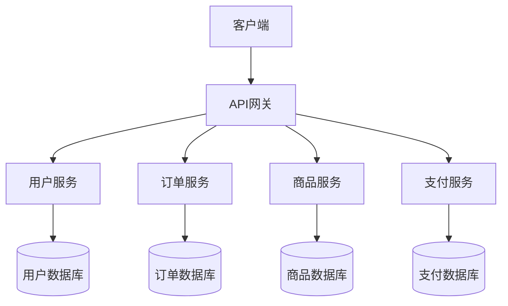

**实际应用场景：**
以电商系统为例，可以拆分为用户服务、商品服务、订单服务、支付服务、物流服务等。每个服务独立维护自己的数据库，通过API相互调用。

## 2. 微服务架构有哪些优势?

微服务架构相比传统单体架构具有多方面的优势：

**1. 技术灵活性**
- 每个服务可以选择最适合的技术栈
- 可以使用不同的编程语言（Java、Python、Go、Node.js等）
- 可以选择不同的数据存储方案（MySQL、MongoDB、Redis等）

**2. 独立部署与快速迭代**
- 单个服务的修改不需要重新部署整个应用
- 支持持续集成和持续部署（CI/CD）
- 缩短从开发到上线的周期

**3. 可扩展性**
- 针对高负载的服务进行独立扩展
- 不需要扩展整个应用，节省资源成本
- 支持水平扩展和垂直扩展

**4. 故障隔离**
- 单个服务的故障不会影响其他服务
- 提高系统整体可用性和容错能力
- 便于实现熔断、降级等容错机制

**5. 团队自治**
- 小团队可以独立负责一个或多个微服务
- 减少团队间的协调成本
- 提高开发效率和团队士气

**6. 易于理解和维护**
- 每个服务代码量较小，逻辑清晰
- 新成员更容易上手
- 降低了系统的整体复杂度

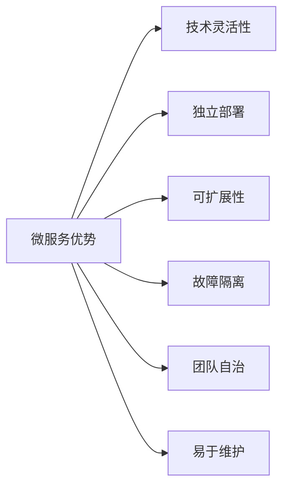

## 3. 微服务有哪些特点?

**1. 单一职责原则**
每个微服务只负责一个特定的业务功能，遵循"做一件事并做好"的原则。例如：用户服务只处理用户相关的操作，订单服务只处理订单相关的逻辑。

**2. 服务自治**
- 独立开发：各服务可以由不同团队独立开发
- 独立部署：不依赖其他服务的部署周期
- 独立扩展：根据自身负载情况进行扩展
- 独立数据库：每个服务拥有自己的数据存储

**3. 轻量级通信**
服务之间通过轻量级协议通信，常见方式包括：
- HTTP/REST API（同步）
- 消息队列如 RabbitMQ、Kafka（异步）
- gRPC（高性能二进制协议）

**4. 去中心化数据管理**
每个服务管理自己的数据库，避免数据库层面的耦合，不同服务可以选择不同类型的数据库。

**5. 弹性设计**
微服务需要能够容忍依赖服务的失败，常用模式：熔断器（Circuit Breaker）、重试、超时、降级。

**6. 可观测性**
每个服务需要提供日志、指标（Metrics）和链路追踪（Tracing），以便监控和排查问题。

## 4. 设计微服务的最佳实践是什么?

**1. 围绕业务能力划分服务**
以业务领域为边界划分服务，而不是按技术层（Controller/Service/DAO）拆分。参考领域驱动设计（DDD）中的限界上下文。

**2. 单一职责原则（SRP）**
每个微服务只做一件事，保持服务职责清晰，避免服务变成"小单体"。

**3. 数据库隔离**
每个服务拥有独立的数据库，禁止跨服务直接访问数据库，数据共享通过API或事件实现。

**4. API优先设计**
先设计API契约，再开发实现。使用OpenAPI/Swagger规范定义接口，方便团队并行开发。

**5. 实现容错与弹性**
- 使用熔断器模式（如Hystrix、Resilience4j）
- 设置合理的超时时间
- 实现重试机制和降级策略

**6. 集中化配置管理**
使用配置中心（如Spring Cloud Config、Apollo、Nacos）统一管理配置，避免硬编码。

**7. 服务发现**
使用服务注册与发现机制（如Eureka、Consul、Nacos），避免硬编码服务地址。

**8. 统一的日志与监控**
- 使用统一日志格式，包含TraceId便于追踪
- 集成分布式链路追踪（Zipkin、Jaeger）
- 使用Prometheus + Grafana监控指标

**9. 持续集成与部署（CI/CD）**
为每个服务建立独立的CI/CD流水线，实现自动化构建、测试和部署。

**10. 安全设计**
- 使用API网关统一鉴权
- 服务间通信使用TLS加密
- 实现OAuth2 + JWT身份验证

## 5. 微服务架构如何运作?

微服务架构通过将应用程序分解为一组小型、松耦合的服务来运作，每个服务独立运行并通过定义良好的API进行通信。

**核心组件与运作流程：**

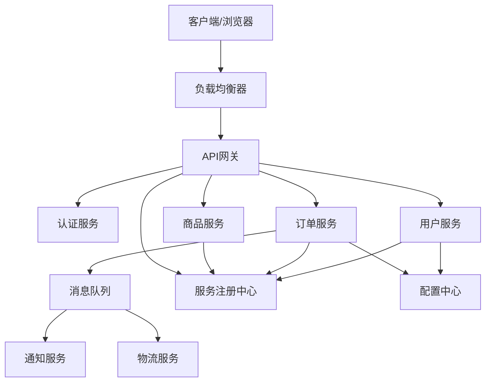

**运作步骤：**
1. **客户端请求**：客户端（App/浏览器）发送请求到API网关
2. **API网关处理**：网关进行路由、鉴权、限流、熔断等处理
3. **服务发现**：服务通过注册中心（如Nacos）找到目标服务实例地址
4. **服务调用**：通过REST或RPC调用目标服务
5. **异步通信**：对于非实时操作，通过消息队列（Kafka/RabbitMQ）异步处理
6. **数据聚合**：API网关或BFF层聚合多个服务的响应返回给客户端

## 6. 微服务架构的优缺点是什么?

**优点：**

| 优点 | 说明 |
|------|------|
| 独立部署 | 每个服务独立上线，互不影响 |
| 技术多样性 | 各服务可选择最适合的技术栈 |
| 故障隔离 | 单个服务故障不会拖垮整个系统 |
| 易于扩展 | 按需对瓶颈服务进行水平扩展 |
| 团队自治 | 小团队独立迭代，提升效率 |
| 代码可读性高 | 每个服务代码量小，易于理解 |

**缺点：**

| 缺点 | 说明 |
|------|------|
| 分布式复杂性 | 网络延迟、分区容错、数据一致性问题 |
| 运维成本高 | 需要管理大量服务实例、容器、配置 |
| 服务间通信开销 | 相比进程内调用，网络调用有额外延迟 |
| 数据一致性难 | 跨服务事务难以保证强一致性 |
| 测试复杂 | 集成测试需要启动多个服务 |
| 服务治理复杂 | 需要服务发现、熔断、限流等基础设施 |
| 调试困难 | 分布式链路追踪要求高 |

## 7. 单片，SOA和微服务架构有什么区别?

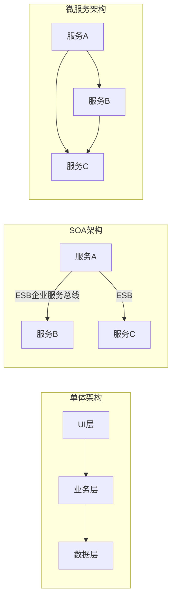

| 维度 | 单体架构 | SOA架构 | 微服务架构 |
|------|---------|---------|-----------|
| 粒度 | 整个应用是一个单元 | 粗粒度，面向业务模块 | 细粒度，面向单一业务能力 |
| 通信 | 进程内调用 | 通过ESB（企业服务总线） | 轻量级协议（HTTP/消息队列） |
| 部署 | 整体部署 | 模块可独立部署但依赖ESB | 完全独立部署 |
| 数据 | 共享单一数据库 | 通常共享数据库 | 每个服务独立数据库 |
| 耦合度 | 高耦合 | 中等耦合（ESB是瓶颈） | 低耦合 |
| 扩展方式 | 整体水平扩展 | 按模块扩展 | 按服务独立扩展 |
| 技术栈 | 统一技术栈 | 有一定灵活性 | 完全自由选择 |
| 适用场景 | 小型应用，团队小 | 企业级集成，遗留系统整合 | 大型互联网应用，快速迭代 |

**总结：** 单体架构简单但难以扩展；SOA引入了服务化但ESB成为瓶颈；微服务去掉了ESB，服务更细、更自治，但运维复杂度更高。

## 8. 在使用微服务架构时，您面临哪些挑战?

**1. 分布式系统复杂性**
- 网络不可靠，需要处理超时、重试、幂等
- 分布式事务难以保证数据一致性
- CAP理论制约，无法同时满足一致性、可用性和分区容忍性

**2. 服务间通信**
- 同步调用链路过长导致延迟累积
- 需要处理服务不可用时的降级逻辑
- 接口版本管理和兼容性问题

**3. 数据管理**
- 每个服务独立数据库，跨服务查询困难
- 数据冗余和数据同步问题
- 分布式事务（Saga模式、TCC等）实现复杂

**4. 测试困难**
- 集成测试需要启动多个服务
- 服务依赖的Mock/Stub管理复杂
- 端到端测试耗时且不稳定

**5. 运维挑战**
- 服务实例数量多，部署和监控复杂
- 需要容器化（Docker）和编排（Kubernetes）能力
- 日志分散，需要集中化日志平台（ELK）

**6. 安全性**
- 服务间通信需要认证授权
- API网关需要防止DDoS、SQL注入等攻击
- 密钥和敏感配置的安全管理

**7. 服务发现与负载均衡**
- 服务实例动态变化，需要注册中心
- 客户端负载均衡与服务端负载均衡的选择

## 9. SOA和微服务架构之间的主要区别是什么?

SOA（Service-Oriented Architecture，面向服务的架构）和微服务架构都是服务化思想，但有本质区别：

| 比较维度 | SOA | 微服务 |
|---------|-----|--------|
| 服务粒度 | 粗粒度（业务模块级别） | 细粒度（单一业务能力） |
| 通信机制 | 依赖ESB（企业服务总线），SOAP/WS协议 | 轻量级REST/HTTP、消息队列、gRPC |
| 服务耦合 | ESB成为中心化瓶颈，耦合较高 | 去中心化，服务直接通信，耦合低 |
| 数据共享 | 服务共享公共数据库 | 每个服务独立数据库 |
| 部署方式 | 通常部署在应用服务器（如JBoss） | 独立进程，支持容器化部署 |
| 治理方式 | 中心化治理，统一标准 | 去中心化治理，团队自治 |
| 目标 | 企业应用集成、遗留系统互联 | 快速迭代、独立扩展、云原生 |
| 复杂度 | ESB配置复杂，维护成本高 | 分布式复杂性，但每个服务简单 |

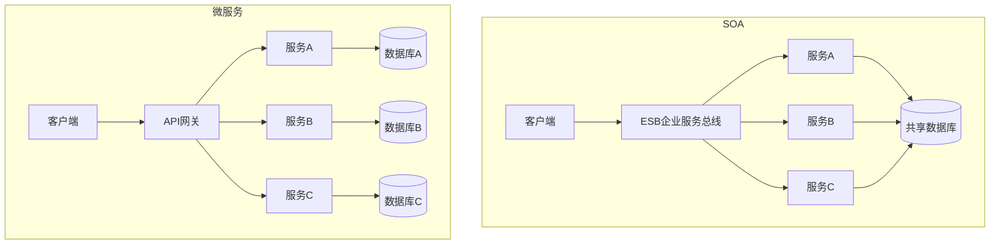

**关键区别一句话总结：** SOA是企业级集成方案，以ESB为核心；微服务是互联网架构方案，以去中心化和自治为核心。

## 10. 微服务有什么特点?

微服务的核心特点可以从以下几个维度理解（与第3题互补，从不同角度深入）：

**1. 围绕业务能力构建**
服务边界由业务领域决定，而非技术层划分。例如"订单服务"包含订单的创建、查询、修改、取消等全部逻辑，而不是把Controller单独作为一个服务。

**2. 产品而非项目**
微服务团队拥有服务的完整生命周期，"谁构建谁运行"（You build it, you run it）。团队对服务的开发、部署和运维全程负责。

**3. 智能端点与哑管道**
业务逻辑在服务端点（Endpoint）中实现，通信管道（如HTTP、消息队列）保持简单，不像SOA的ESB那样内置业务规则。

**4. 去中心化治理**
不强制所有服务使用同一技术栈，团队可以根据问题选择最合适的工具，例如用Go写高并发服务，用Python做数据分析服务。

**5. 故障设计**
微服务天生运行在不可靠网络中，必须设计成能够容忍依赖服务失败的状态，通过熔断、降级、超时等机制保证弹性。

**6. 演进式设计**
服务可以随业务需求不断演进，甚至可以将一个服务拆分成更细的多个服务，或将多个服务合并，系统整体保持灵活。

## 11. 什么是领域驱动设计?

领域驱动设计（Domain-Driven Design，DDD）是由Eric Evans在2003年提出的一种软件设计方法论。它的核心思想是：**软件设计应该以业务领域为中心**，让代码结构反映业务概念，使技术模型与业务模型保持一致。

**DDD的核心概念：**

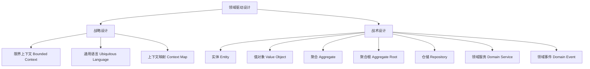

**战略设计（宏观）：**
- **限界上下文**：划定每个业务子域的边界，是微服务拆分的重要依据
- **通用语言**：开发人员与业务专家使用统一的术语交流，消除歧义
- **上下文映射**：描述不同限界上下文之间的关系（防腐层、共享内核等）

**战术设计（微观）：**
- **实体（Entity）**：有唯一标识的对象，如订单、用户
- **值对象（Value Object）**：无唯一标识，由属性定义，如地址、金额
- **聚合（Aggregate）**：一组相关对象的集合，保证业务一致性
- **聚合根（Aggregate Root）**：聚合的入口点，外部只能通过聚合根访问聚合内部对象
- **领域服务**：不属于任何实体的业务逻辑
- **领域事件**：领域内发生的重要事件，如"订单已创建"

## 12. 为什么需要域驱动设计(DDD)?

在没有DDD的项目中，随着业务复杂度增长，代码往往变成一团乱麻：业务逻辑分散在各个层，术语不统一，修改一处影响全局。DDD正是为了解决这些问题而生。

**需要DDD的原因：**

**1. 应对业务复杂性**
当业务规则复杂且频繁变化时，DDD通过领域模型将业务知识显式表达在代码中，使代码成为业务的真实映射。

**2. 消除沟通鸿沟**
业务人员说"退款"，开发人员写的代码叫`refund`，测试人员叫"回款"——这种术语不统一会导致大量沟通成本。DDD的通用语言（Ubiquitous Language）强制统一术语。

**3. 指导微服务拆分**
限界上下文（Bounded Context）天然对应微服务的边界。DDD帮助我们识别哪些功能应该在同一个服务中，哪些应该拆分。

**4. 提高代码可维护性**
领域模型将业务规则集中在领域层，避免业务逻辑散落在Controller、SQL语句中，使代码更易维护和测试。

**实际例子：**
电商系统中，"商品"在不同上下文含义不同：
- 商品目录上下文：关注商品描述、图片、价格
- 库存上下文：关注库存数量、仓库位置
- 订单上下文：关注下单时的快照价格

DDD通过限界上下文隔离这些差异，每个上下文有自己的"商品"模型。

## 13. 什么是无所不在的语言?

无所不在的语言（Ubiquitous Language）是DDD中的核心实践之一，指的是**开发团队与业务专家之间共同使用的、统一的业务术语体系**。这套语言在代码、文档、会议、测试中无处不在，消除了技术人员与业务人员之间的沟通障碍。

**为什么重要：**
- 业务专家用业务语言描述需求，开发人员用技术语言实现，两者之间的"翻译"过程容易引入错误
- 通用语言要求代码中的类名、方法名、变量名直接使用业务术语

**实际例子：**

业务说："客户下单后，系统需要锁定库存，等支付成功后扣减库存。"

使用通用语言的代码：
```java
// 好的命名 - 直接反映业务语言
Order order = customer.placeOrder(cart);
inventory.reserve(order);  // 锁定库存
payment.process(order);
inventory.deduct(order);   // 扣减库存

// 不好的命名 - 技术化，脱离业务
insertRecord(data);
updateStatus(id, 2);
```

**建立通用语言的步骤：**
1. 组织业务专家和开发人员的联合工作坊（Event Storming）
2. 识别核心业务概念和动词
3. 统一术语，消除同义词和歧义词
4. 将术语写入代码、文档和测试用例
5. 持续维护和演进语言词汇表

## 14. 什么是凝聚力?

凝聚力（Cohesion）是衡量一个模块或服务内部各元素之间关联程度的指标。**高内聚**意味着一个模块内的所有功能都紧密相关，共同完成一个明确的职责。

**内聚的类型（从低到高）：**

| 内聚类型 | 说明 | 示例 |
|---------|------|------|
| 偶然内聚 | 模块内元素没有任何关联 | 把随机工具函数放在一起 |
| 逻辑内聚 | 元素执行相似的操作但逻辑不同 | 一个方法处理所有类型的输入输出 |
| 时间内聚 | 元素在同一时间执行 | 系统初始化时执行的所有操作 |
| 过程内聚 | 元素按特定顺序执行 | 按步骤执行的流程 |
| 通信内聚 | 元素操作相同的数据 | 对同一数据结构的读写操作 |
| 顺序内聚 | 一个元素的输出是另一个的输入 | 数据处理流水线 |
| 功能内聚 | 所有元素共同完成一个单一功能（最佳） | 订单服务只处理订单相关逻辑 |

**在微服务中的意义：**
微服务应该追求**高内聚**——每个服务只做一件事，且做好这件事。如果一个服务同时处理用户管理、订单处理和支付逻辑，它的内聚性就很低，应该拆分。

**判断内聚性的简单方法：**
如果你能用一句话清晰描述一个服务的职责，它的内聚性通常是高的。如果描述中出现"以及"、"还有"，则可能需要拆分。

## 15. 什么是耦合?

耦合（Coupling）是衡量模块或服务之间相互依赖程度的指标。**低耦合**意味着服务之间的依赖关系少且松散，一个服务的变化不会强迫其他服务跟着变化。

**耦合的类型（从高到低）：**

| 耦合类型 | 说明 | 危害 |
|---------|------|------|
| 内容耦合 | 一个模块直接访问另一个模块的内部数据 | 最危险，完全破坏封装 |
| 公共耦合 | 多个模块共享全局数据 | 修改全局数据影响所有模块 |
| 控制耦合 | 一个模块控制另一个模块的流程 | 逻辑混乱，难以复用 |
| 标记耦合 | 传递复杂数据结构但只用其中一部分 | 不必要的依赖 |
| 数据耦合 | 只通过参数传递简单数据（最佳） | 最低耦合，推荐 |

**微服务中的耦合问题：**

```mermaid
graph LR
    subgraph 高耦合（不好）
        A[订单服务] -->|直接查询| B[(用户数据库)]
        A -->|直接调用内部方法| C[支付服务内部]
    end
    subgraph 低耦合（好）
        D[订单服务] -->|REST API| E[用户服务]
        D -->|消息队列| F[支付服务]
    end
```

**降低耦合的实践：**
- 通过API接口通信，不直接访问其他服务的数据库
- 使用事件驱动架构，通过消息队列解耦服务
- 定义清晰的接口契约，隐藏内部实现细节
- 避免共享代码库（共享库会引入隐式耦合）

**高内聚低耦合**是微服务设计的黄金法则：服务内部高度相关（高内聚），服务之间尽量独立（低耦合）。

## 16. 什么是REST/RESTful以及它的用途是什么?

REST（Representational State Transfer，表述性状态转移）是一种软件架构风格，由Roy Fielding在2000年的博士论文中提出。遵循REST原则设计的API称为RESTful API。

**REST的六大约束原则：**
1. **客户端-服务器分离**：UI与数据存储分离，提高可移植性
2. **无状态**：每个请求包含所有必要信息，服务器不保存客户端状态
3. **可缓存**：响应可以被缓存，提高性能
4. **统一接口**：使用标准HTTP方法和URI规范
5. **分层系统**：客户端不需要知道是否直接连接到服务器
6. **按需代码（可选）**：服务器可以向客户端发送可执行代码

**HTTP方法与CRUD对应关系：**

| HTTP方法 | 操作 | 示例 |
|---------|------|------|
| GET | 查询资源 | GET /users/1 |
| POST | 创建资源 | POST /users |
| PUT | 全量更新资源 | PUT /users/1 |
| PATCH | 部分更新资源 | PATCH /users/1 |
| DELETE | 删除资源 | DELETE /users/1 |

**RESTful API设计示例：**
```
# 用户资源
GET    /api/v1/users          # 获取用户列表
POST   /api/v1/users          # 创建用户
GET    /api/v1/users/{id}     # 获取指定用户
PUT    /api/v1/users/{id}     # 更新用户
DELETE /api/v1/users/{id}     # 删除用户

# 嵌套资源
GET    /api/v1/users/{id}/orders   # 获取用户的订单列表
```

**在微服务中的用途：**
RESTful API是微服务间同步通信最常用的方式，具有简单、通用、易于调试的优点，配合API网关可以实现统一的路由、鉴权和限流。

## 17. 你对Spring Boot有什么了解?

Spring Boot是由Pivotal团队开发的基于Spring框架的快速开发框架，它的核心目标是**简化Spring应用的创建、配置和部署**，让开发者能够以最少的配置快速启动一个生产级别的Spring应用。

**Spring Boot的核心特性：**

**1. 自动配置（Auto-Configuration）**
根据classpath中的依赖自动配置Spring Bean，无需手动编写大量XML配置。例如引入`spring-boot-starter-web`后，自动配置Tomcat和Spring MVC。

**2. 起步依赖（Starter Dependencies）**
通过`spring-boot-starter-*`简化依赖管理，一个starter包含了某个功能所需的所有依赖。
```xml
<!-- 只需引入一个starter，无需手动管理多个依赖版本 -->
<dependency>
    <groupId>org.springframework.boot</groupId>
    <artifactId>spring-boot-starter-web</artifactId>
</dependency>
```

**3. 内嵌服务器**
内置Tomcat、Jetty或Undertow，应用打包成可执行JAR，直接运行，无需部署到外部服务器。

**4. Actuator监控端点**
提供生产就绪的监控和管理功能（健康检查、指标、环境信息等）。

**5. 外部化配置**
支持`application.properties`/`application.yml`，支持多环境配置（dev/test/prod）。

**在微服务中的地位：**
Spring Boot是构建Java微服务的事实标准，配合Spring Cloud可以快速搭建完整的微服务体系。

## 18. 什么是Spring引导的执行器?

Spring Boot Actuator（执行器）是Spring Boot提供的一个生产级别的监控和管理模块。它通过暴露一系列HTTP端点（Endpoints），让运维人员和开发人员能够实时查看和管理应用的运行状态。

**引入依赖：**
```xml
<dependency>
    <groupId>org.springframework.boot</groupId>
    <artifactId>spring-boot-starter-actuator</artifactId>
</dependency>
```

**常用端点：**

| 端点 | 说明 |
|------|------|
| /actuator/health | 健康状态检查，用于K8s存活探针 |
| /actuator/info | 应用基本信息 |
| /actuator/metrics | 应用指标（内存、CPU、请求数等） |
| /actuator/env | 环境变量和配置属性 |
| /actuator/loggers | 查看和动态修改日志级别 |
| /actuator/beans | 所有Spring Bean列表 |
| /actuator/mappings | 所有URL映射 |
| /actuator/threaddump | 线程转储 |
| /actuator/heapdump | 堆内存转储 |

**配置示例（application.yml）：**
```yaml
management:
  endpoints:
    web:
      exposure:
        include: health,info,metrics,loggers
  endpoint:
    health:
      show-details: always
```

**在微服务中的作用：**
- 与Kubernetes集成，用`/health`端点做存活和就绪探针
- 与Prometheus集成（通过`micrometer`），采集指标数据
- 动态调整日志级别，线上排查问题无需重启服务

## 19. 什么是Spring Cloud?

Spring Cloud是基于Spring Boot构建的一套**微服务开发工具集**，提供了微服务架构中常见问题的解决方案，包括服务发现、配置中心、网关、熔断、负载均衡、链路追踪等。

**Spring Cloud核心组件：**

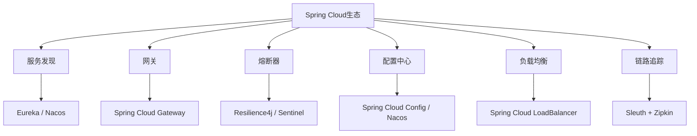

**主要组件说明：**

| 组件 | 作用 | 常用实现 |
|------|------|---------|
| 服务注册与发现 | 服务实例的注册和查找 | Eureka、Nacos、Consul |
| API网关 | 路由、鉴权、限流 | Spring Cloud Gateway、Zuul |
| 熔断器 | 防止故障扩散 | Resilience4j、Sentinel |
| 配置中心 | 集中管理配置 | Spring Cloud Config、Nacos |
| 负载均衡 | 客户端负载均衡 | Spring Cloud LoadBalancer |
| 链路追踪 | 分布式请求追踪 | Sleuth + Zipkin/Jaeger |
| 声明式HTTP客户端 | 简化服务间调用 | OpenFeign |

## 20. Spring Cloud解决了哪些问题?

Spring Cloud针对微服务架构中的常见痛点提供了开箱即用的解决方案：

**1. 服务发现问题**
微服务实例动态增减，IP和端口不固定。Spring Cloud通过Eureka/Nacos实现服务注册与发现，服务间调用通过服务名而非硬编码地址。

**2. 配置管理问题**
多个服务、多套环境（dev/test/prod）的配置难以统一管理。Spring Cloud Config / Nacos提供集中化配置中心，支持配置热更新。

**3. 服务间通信问题**
手写HTTP调用代码繁琐且容易出错。OpenFeign提供声明式HTTP客户端：
```java
@FeignClient(name = "user-service")
public interface UserClient {
    @GetMapping("/users/{id}")
    User getUser(@PathVariable Long id);
}
```

**4. 负载均衡问题**
Spring Cloud LoadBalancer提供客户端负载均衡，支持轮询、随机等策略，与服务发现无缝集成。

**5. 熔断与容错问题**
服务调用链中某个服务故障会导致级联失败。Resilience4j/Sentinel提供熔断器、限流、重试等容错机制。

**6. API网关问题**
多个微服务对外暴露不同端口和路径，客户端难以管理。Spring Cloud Gateway提供统一入口，实现路由、鉴权、限流、日志。

**7. 分布式链路追踪问题**
请求经过多个服务，难以定位问题。Sleuth自动为请求注入TraceId，配合Zipkin可视化调用链路。

## 21. 在Spring MVC应用程序中使用WebMvcTest注释有什么用处?

`@WebMvcTest`是Spring Boot提供的测试切片注解，专门用于测试Spring MVC的Controller层，它只加载MVC相关的Bean（Controller、Filter、ControllerAdvice等），而**不加载完整的应用上下文**，使Controller层的单元测试更快、更轻量。

**核心特点：**
- 只初始化Web层相关的Bean，不加载Service、Repository等
- 自动配置MockMvc
- 需要用`@MockBean`模拟依赖的Service

**使用示例：**
```java
@WebMvcTest(UserController.class)
class UserControllerTest {

    @Autowired
    private MockMvc mockMvc;

    @MockBean
    private UserService userService;  // 模拟Service层

    @Test
    void shouldReturnUser() throws Exception {
        // 配置Mock行为
        User user = new User(1L, "张三", "zhangsan@example.com");
        when(userService.findById(1L)).thenReturn(user);

        // 执行请求并验证
        mockMvc.perform(get("/users/1")
                .contentType(MediaType.APPLICATION_JSON))
            .andExpect(status().isOk())
            .andExpect(jsonPath("$.name").value("张三"))
            .andExpect(jsonPath("$.email").value("zhangsan@example.com"));
    }
}
```

**与`@SpringBootTest`的区别：**

| 注解 | 加载范围 | 速度 | 用途 |
|------|---------|------|------|
| `@WebMvcTest` | 仅Web层 | 快 | Controller单元测试 |
| `@SpringBootTest` | 完整上下文 | 慢 | 集成测试 |

在微服务中，`@WebMvcTest`非常适合对每个服务的API端点进行快速的单元测试。

## 22. 你能否给出关于休息和微服务的要点?

REST与微服务是天然的搭档，以下是两者结合的核心要点：

**REST在微服务中的角色：**
- REST是微服务间**同步通信**的首选协议，简单、标准、工具支持广泛
- 每个微服务对外暴露REST API作为服务契约
- API网关统一代理所有服务的REST接口

**核心要点汇总：**

1. **无状态设计**：REST的无状态特性与微服务的独立扩展能力完美契合，每个请求独立处理，服务可以随意水平扩展

2. **资源导向URL设计**：URI应表示资源名词，操作由HTTP方法区分
   ```
   正确：GET /orders/123
   错误：GET /getOrder?id=123
   ```

3. **版本管理**：接口需要版本化，避免升级破坏现有调用方
   ```
   /api/v1/users
   /api/v2/users
   ```

4. **统一错误响应格式**：所有服务使用一致的错误响应结构
   ```json
   {
     "code": "ORDER_NOT_FOUND",
     "message": "订单不存在",
     "timestamp": "2024-01-01T12:00:00Z"
   }
   ```

5. **幂等性设计**：GET、PUT、DELETE应设计为幂等，POST通常非幂等

6. **使用HTTP状态码**：正确使用200、201、400、401、403、404、500等状态码传达语义

7. **REST的局限性**：对于高性能场景，可以考虑gRPC替代REST；对于异步场景，使用消息队列替代REST调用

## 23. 什么是不同类型的微服务测试?

微服务测试比单体应用更复杂，需要多层次的测试策略。常见的测试类型如下：

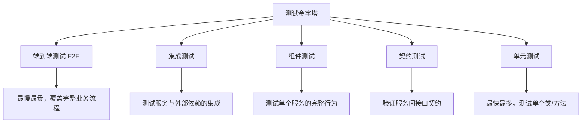

**1. 单元测试（Unit Test）**
- 测试单个类或方法的逻辑
- 使用Mock隔离外部依赖
- 工具：JUnit、Mockito
- 占比最大，运行最快

**2. 集成测试（Integration Test）**
- 测试服务与数据库、消息队列等外部依赖的集成
- 使用真实或内嵌的依赖（如H2内存数据库、Testcontainers）
- 工具：Spring Boot Test、Testcontainers

**3. 组件测试（Component Test）**
- 将整个微服务作为黑盒测试
- Mock所有外部服务依赖
- 验证服务的完整业务行为

**4. 契约测试（Contract Test）**
- 验证服务提供者和消费者之间的接口契约
- 工具：PACT、Spring Cloud Contract
- 避免集成测试中的服务依赖问题

**5. 端到端测试（E2E Test）**
- 模拟真实用户场景，测试完整业务流程
- 需要启动所有相关服务
- 工具：Selenium、Cypress、RestAssured
- 数量最少，运行最慢，维护成本最高

## 24. 您对Distributed Transaction有何了解?

分布式事务（Distributed Transaction）是指跨越多个服务或数据库的事务操作，需要保证所有参与方要么全部成功，要么全部回滚。

**为什么微服务中分布式事务很难？**
在单体应用中，一个数据库事务可以保证ACID特性。但在微服务中，每个服务有独立的数据库，无法使用本地事务跨服务保证一致性。

**常见解决方案：**

**1. 两阶段提交（2PC）**
- 阶段一（准备）：协调者询问所有参与者是否可以提交
- 阶段二（提交/回滚）：根据所有参与者的响应决定提交或回滚
- 缺点：同步阻塞，协调者单点故障，性能差，不适合高并发场景

**2. Saga模式（推荐）**
将长事务拆分为一系列本地事务，每个本地事务完成后发布事件触发下一步，失败时执行补偿事务。

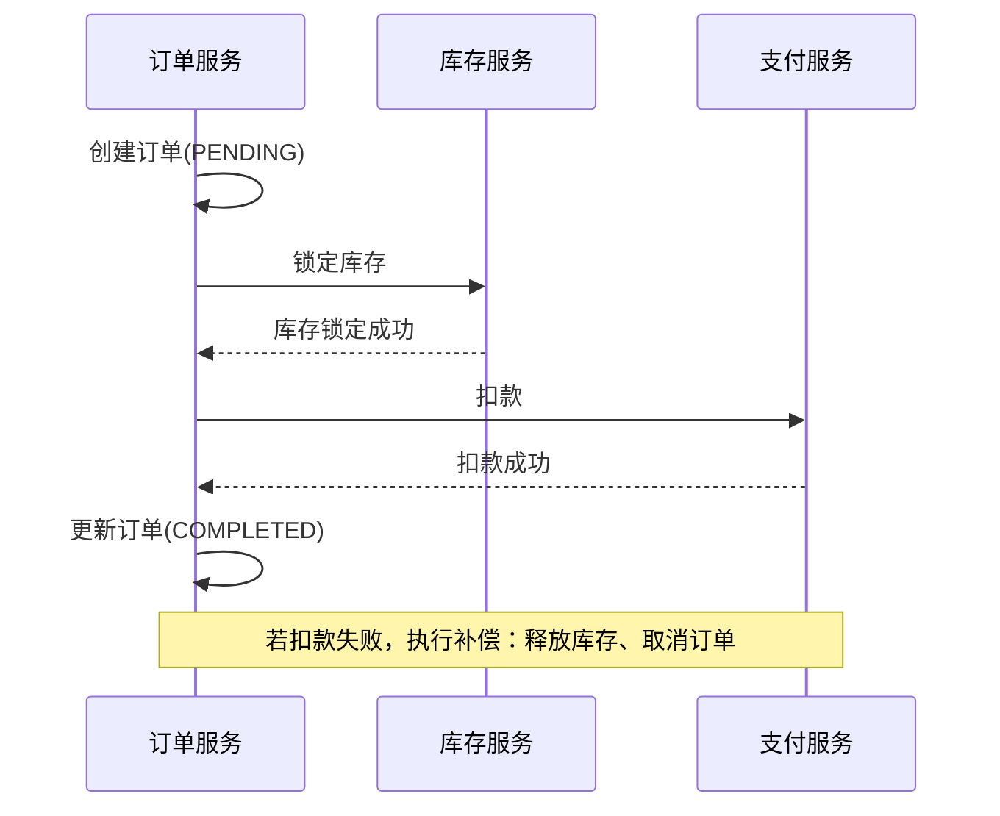

Saga有两种实现方式：
- **编排式（Choreography）**：服务通过事件相互触发，无中心协调者
- **编制式（Orchestration）**：由Saga协调器统一控制流程（如Seata）

**3. TCC模式（Try-Confirm-Cancel）**
- Try：预留资源
- Confirm：确认执行
- Cancel：释放预留资源
- 适合对一致性要求较高的金融场景

**4. 本地消息表**
将消息写入本地数据库表，通过定时任务保证消息最终发送，实现最终一致性。

## 25. 什么是Idempotence以及它在哪里使用?

幂等性（Idempotence）是指对同一操作执行一次和执行多次的效果完全相同。换句话说，**重复调用不会产生额外的副作用**。

**为什么微服务中幂等性很重要？**
网络不可靠，请求可能因超时重试被执行多次。如果操作不幂等，重复执行会导致数据错误，例如重复扣款、重复发货。

**HTTP方法的幂等性：**

| HTTP方法 | 是否幂等 | 说明 |
|---------|---------|------|
| GET | 是 | 多次查询结果相同 |
| PUT | 是 | 多次更新为同一状态 |
| DELETE | 是 | 删除后再删除，资源仍不存在 |
| POST | 否 | 多次创建会产生多条记录 |
| PATCH | 视情况而定 | 取决于操作语义 |

**实现幂等性的方法：**

**1. 唯一请求ID（幂等Token）**
客户端生成唯一的请求ID，服务端记录已处理的ID，重复请求直接返回之前的结果：
```java
// 客户端请求头携带唯一ID
POST /orders
Idempotency-Key: 550e8400-e29b-41d4-a716-446655440000

// 服务端检查
if (redis.exists("idempotent:" + idempotencyKey)) {
    return cachedResult;
}
// 处理请求并缓存结果
```

**2. 数据库唯一约束**
通过数据库唯一索引防止重复插入，重复请求抛出唯一约束异常后返回已有数据。

**3. 状态机**
操作只在特定状态下执行，已完成的操作不会被重复执行（如订单状态：待支付→已支付，不能从已支付再次支付）。

**使用场景：**
- 支付接口（防止重复扣款）
- 订单创建（防止重复下单）
- 消息消费（消息队列消费者）
- 第三方回调（支付宝/微信支付回调）

## 26. 什么是有界上下文?

有界上下文（Bounded Context）是DDD中最重要的战略设计概念之一。它定义了一个**明确的业务边界**，在这个边界内，特定的领域模型和通用语言具有统一且明确的含义。

**为什么需要有界上下文？**
在大型系统中，同一个词在不同业务场景下含义不同。例如"用户"：
- 在身份认证上下文中：关注账号、密码、权限
- 在订单上下文中：关注收货地址、购买历史
- 在营销上下文中：关注消费行为、偏好标签

如果用一个统一的"用户"模型覆盖所有场景，模型会变得臃肿且难以维护。有界上下文让每个子域拥有自己的模型。

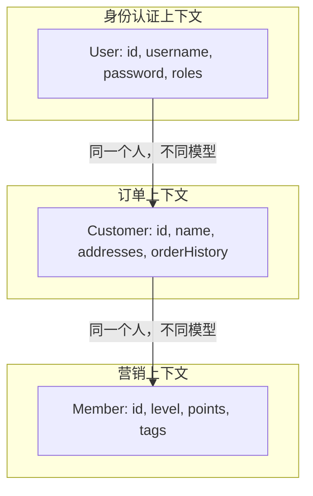

**有界上下文与微服务的关系：**
有界上下文是微服务拆分的天然边界。通常一个有界上下文对应一个或多个微服务（当上下文较大时可以进一步拆分）。

**上下文之间的集成方式：**
- **防腐层（Anti-Corruption Layer）**：在两个上下文之间建立翻译层，防止一个上下文的模型污染另一个
- **共享内核（Shared Kernel）**：两个上下文共享一小部分模型
- **开放主机服务（Open Host Service）**：提供标准化的API供其他上下文调用

## 27. 什么是双因素身份验证?

双因素身份验证（Two-Factor Authentication，2FA）是一种安全机制，要求用户在登录时提供**两种不同类型的身份凭证**，而不仅仅是密码。即使密码泄露，攻击者也无法仅凭密码登录账户。

**认证的三种因素类型：**
- **你知道的（Knowledge）**：密码、PIN码、安全问题答案
- **你拥有的（Possession）**：手机、硬件令牌、智能卡
- **你是谁（Inherence）**：指纹、面部识别、虹膜扫描

双因素认证要求从上述三类中选取**两种不同类型**的因素组合。

**常见的2FA实现方式：**

| 方式 | 说明 | 安全级别 |
|------|------|---------|
| 短信验证码（SMS OTP） | 手机收到一次性验证码 | 中（可被SIM劫持） |
| 邮件验证码 | 邮箱收到验证码 | 中 |
| TOTP（时间型一次性密码） | Google Authenticator等App生成 | 高 |
| 硬件令牌（FIDO2/U2F） | YubiKey等物理设备 | 最高 |
| 推送通知 | 手机App确认登录 | 高 |
| 生物识别 | 指纹、面部识别 | 高 |

**在微服务中的应用：**
- 管理后台、运维系统强制启用2FA
- 高风险操作（如大额转账、修改密码）触发二次验证
- 通过API网关统一处理2FA逻辑，各微服务无需单独实现

## 28. 双因素身份验证的凭据类型有哪些?

双因素身份验证中使用的凭据可以分为以下几大类：

**1. 知识因素（Something You Know）**
- 密码（Password）
- PIN码
- 安全问题答案
- 图形解锁模式

**2. 持有因素（Something You Have）**
- 手机（接收短信验证码）
- 硬件令牌（如RSA SecurID，每隔60秒生成新的OTP）
- 软件令牌（Google Authenticator、Microsoft Authenticator）
- 智能卡（如银行U盾）
- FIDO2安全密钥（如YubiKey）

**3. 生物特征因素（Something You Are）**
- 指纹识别
- 面部识别（Face ID）
- 虹膜扫描
- 声纹识别
- 静脉识别

**4. 位置因素（Somewhere You Are）**
- GPS位置验证
- IP地址白名单
- 网络环境检测（仅允许公司内网访问）

**5. 行为因素（Something You Do）**
- 键盘输入节奏分析
- 鼠标移动模式
- 触屏手势

**TOTP工作原理（最常用的软件令牌）：**
```
密钥（Secret） + 当前时间戳（30秒窗口）
        ↓ HMAC-SHA1算法
    6位数字验证码（每30秒更新）
```
服务端和客户端使用相同的密钥和时间计算出相同的验证码，无需网络传输验证码本身，安全性高。

## 29. 什么是客户证书?

客户端证书（Client Certificate）是一种基于PKI（公钥基础设施）的身份验证机制。与服务器证书（用于HTTPS，证明服务器身份）不同，客户端证书用于**证明客户端的身份**，实现双向TLS（mTLS，Mutual TLS）认证。

**工作原理：**

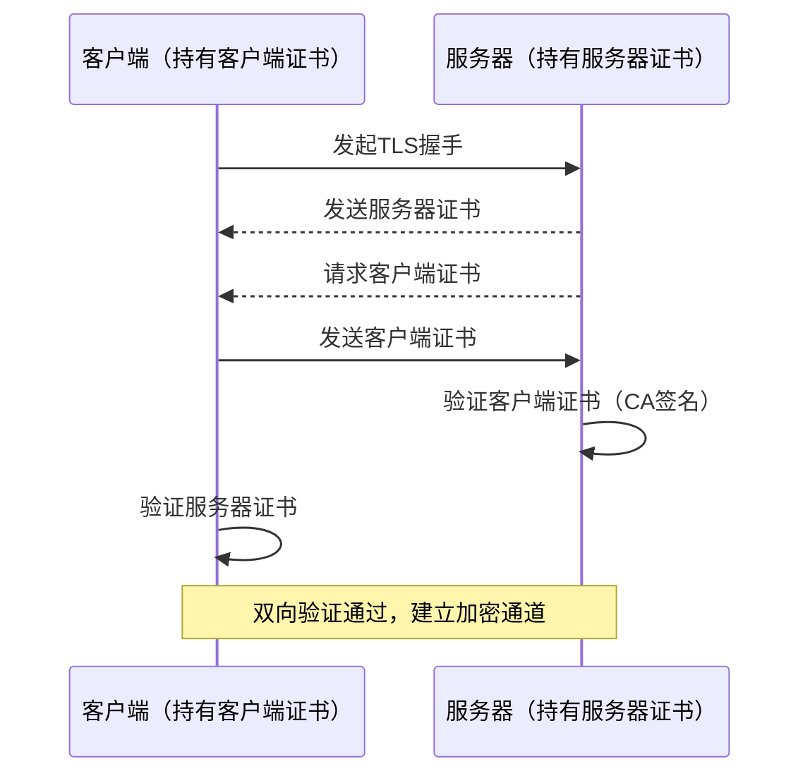

**客户端证书的组成：**
- 公钥
- 持有者信息（Common Name、Organization等）
- 有效期
- CA（证书颁发机构）的数字签名

**在微服务中的应用：**
- **服务间mTLS**：微服务之间通过客户端证书相互认证，防止未授权服务接入（服务网格如Istio自动管理证书）
- **API安全**：B2B接口要求合作方提供客户端证书，比API Key更安全
- **零信任架构**：每个服务都需要证明自己的身份，不依赖网络位置信任

**与API Key的对比：**

| 维度 | 客户端证书 | API Key |
|------|-----------|---------|
| 安全性 | 高（基于非对称加密） | 中（字符串，可能泄露） |
| 管理复杂度 | 高（证书生命周期管理） | 低 |
| 适用场景 | 高安全要求的服务间通信 | 一般的API访问控制 |

## 30. PACT在微服务架构中的用途是什么?

PACT是一个开源的**消费者驱动契约测试（Consumer-Driven Contract Testing）**框架，用于验证微服务之间的接口契约，确保服务提供者的API变更不会破坏消费者的期望。

**为什么需要PACT？**
在微服务中，服务A调用服务B的API。如果服务B修改了接口（字段改名、删除字段、修改类型），服务A可能在运行时才发现问题。PACT通过契约测试在开发阶段就发现这类问题。

**PACT工作流程：**

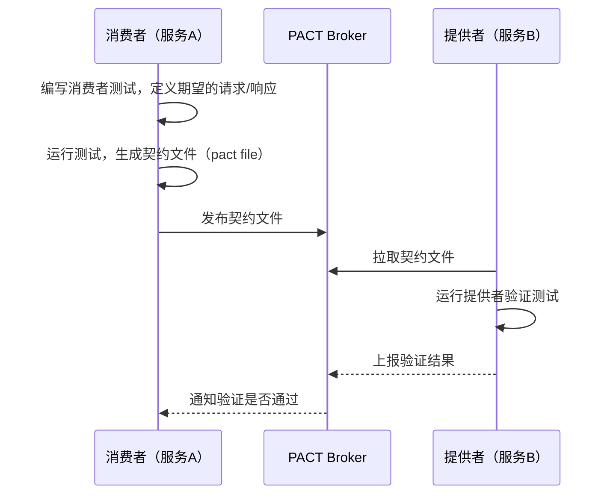

**消费者端示例（Java）：**
```java
@Pact(consumer = "OrderService", provider = "UserService")
public RequestResponsePact createPact(PactDslWithProvider builder) {
    return builder
        .given("用户ID为1的用户存在")
        .uponReceiving("获取用户信息的请求")
        .path("/users/1")
        .method("GET")
        .willRespondWith()
        .status(200)
        .body(new PactDslJsonBody()
            .integerType("id", 1)
            .stringType("name", "张三"))
        .toPact();
}
```

**PACT的优势：**
- 无需启动真实的提供者服务即可测试消费者
- 提供者可以在不影响消费者的前提下安全重构
- 通过PACT Broker集中管理所有服务间的契约

## 31. 什么是OAuth?

OAuth（Open Authorization）是一个开放标准的授权协议，允许用户授权第三方应用访问其在某个服务上的资源，而**无需将用户名和密码提供给第三方应用**。目前广泛使用的是OAuth 2.0版本。

**核心角色：**
- **资源所有者（Resource Owner）**：用户本人
- **客户端（Client）**：第三方应用（如某个App）
- **授权服务器（Authorization Server）**：负责颁发访问令牌（如微信开放平台）
- **资源服务器（Resource Server）**：存储用户资源的服务器（如微信用户信息接口）

**OAuth 2.0授权码流程（最常用）：**

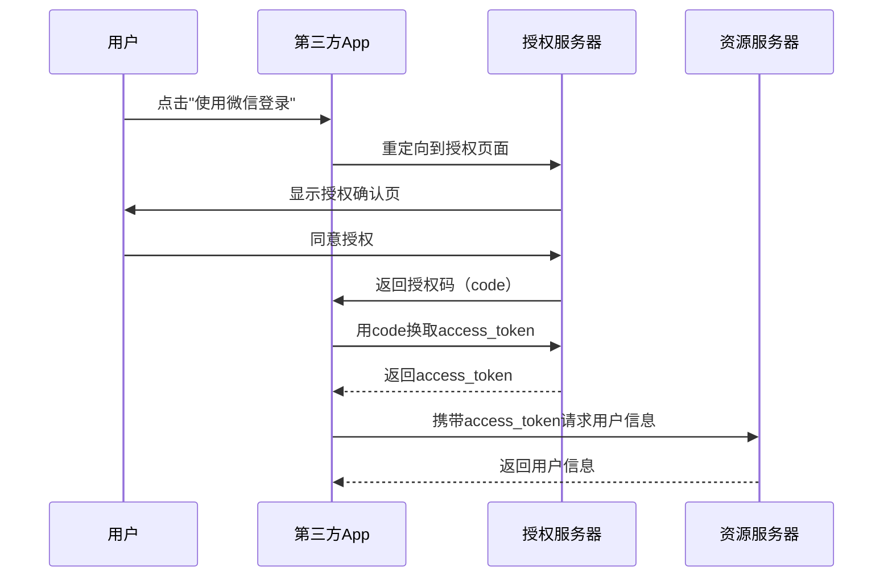

**四种授权模式：**

| 模式 | 适用场景 |
|------|---------|
| 授权码模式 | 有服务端的Web应用（最安全） |
| 隐式模式 | 纯前端SPA应用（已不推荐） |
| 密码模式 | 高度信任的第一方应用 |
| 客户端凭证模式 | 服务间通信（无用户参与） |

**在微服务中的应用：**
- 用户登录后获取JWT Token，携带Token访问各微服务
- 服务间调用使用客户端凭证模式获取Token
- API网关统一验证Token，各微服务无需重复鉴权

## 32. 康威定律是什么?

康威定律（Conway's Law）由梅尔文·康威（Melvin Conway）于1967年提出，其核心论断是：

> **"设计系统的组织，其产生的设计等同于组织间的沟通结构。"**

简单说：你的软件架构会反映你的团队组织结构。

**实际含义：**
如果一个公司有三个团队分别负责前端、后端和数据库，那么他们很可能会设计出一个三层架构的系统。如果公司按业务线（用户、订单、支付）组织团队，系统更可能演变成微服务架构。

**康威定律在微服务中的应用：**

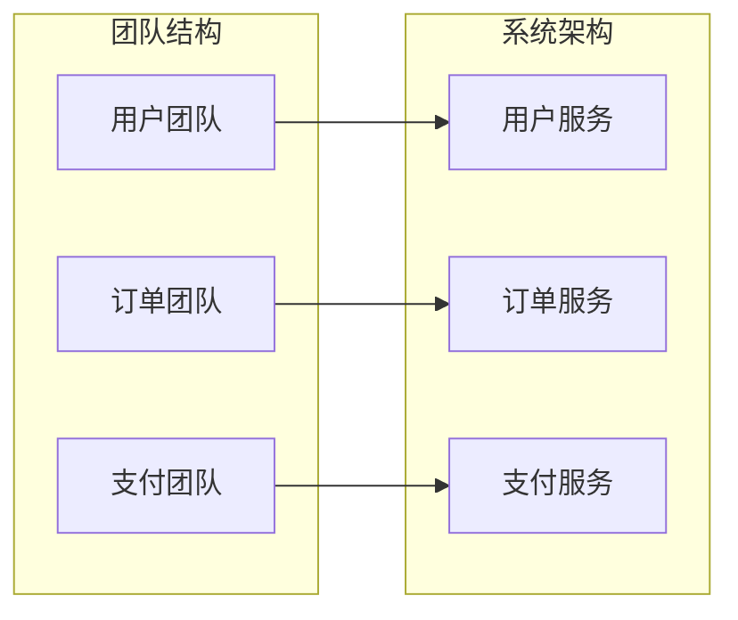

**逆康威操作（Inverse Conway Maneuver）：**
既然系统架构会反映组织结构，那么可以**反过来先调整组织结构，来推动期望的架构演进**。想要微服务架构，就先按业务能力组建小型自治团队。

**对微服务实践的启示：**
- 微服务的边界应该与团队边界对齐
- 团队规模应该匹配服务规模（亚马逊"两个披萨"原则：一个团队的规模以两个披萨能吃饱为上限）
- 避免一个团队跨越太多服务，或多个团队共同负责同一个服务

## 33. 合同测试你懂什么?

合同测试（Contract Testing）是一种验证服务之间接口契约的测试方法。它确保服务的提供者（Provider）和消费者（Consumer）对API的理解是一致的，从而在不进行完整集成测试的情况下发现接口兼容性问题。

**合同测试解决什么问题？**
在微服务中，服务A依赖服务B的API。如果服务B修改了API（如字段改名、删除字段），服务A可能在生产环境才发现问题。合同测试让这个问题在开发阶段被发现。

**两种合同测试方式：**

**1. 提供者驱动（Provider-Driven）**
由API提供者定义契约，消费者必须遵守。适合内部API标准化场景，但消费者话语权较小。

**2. 消费者驱动（Consumer-Driven Contract，CDC）**
由消费者定义对提供者的期望，提供者必须满足所有消费者的期望。这是微服务中更推荐的方式（PACT框架就是CDC）。

**合同测试 vs 集成测试：**

| 对比维度 | 合同测试 | 集成测试 |
|---------|---------|---------|
| 是否需要真实服务 | 否（Mock） | 是 |
| 运行速度 | 快 | 慢 |
| 发现问题时机 | 开发阶段 | 部署后 |
| 维护成本 | 中 | 高 |
| 测试范围 | 接口契约 | 完整业务流程 |

**合同文件示例（PACT JSON格式）：**
```json
{
  "consumer": { "name": "OrderService" },
  "provider": { "name": "UserService" },
  "interactions": [{
    "description": "获取用户信息",
    "request": { "method": "GET", "path": "/users/1" },
    "response": {
      "status": 200,
      "body": { "id": 1, "name": "张三" }
    }
  }]
}
```

## 34. 什么是端到端微服务测试?

端到端测试（End-to-End Testing，E2E）是从用户视角出发，模拟真实业务场景，验证整个系统（包括所有相关微服务、数据库、消息队列等）协同工作是否正确的测试方式。

**端到端测试的特点：**
- 需要启动所有相关服务，接近真实生产环境
- 覆盖完整的业务流程（如：用户注册→下单→支付→发货）
- 运行时间长，维护成本高
- 数量应尽量少，只覆盖最核心的业务路径

**典型的E2E测试场景（电商）：**
```
1. 用户登录
2. 搜索商品
3. 加入购物车
4. 提交订单
5. 完成支付
6. 查看订单状态
7. 确认收货
```

**E2E测试工具：**
- REST API测试：RestAssured、Postman/Newman
- UI测试：Selenium、Cypress、Playwright
- 行为驱动测试：Cucumber（BDD）

**E2E测试的挑战：**
- **环境依赖**：需要完整的测试环境，搭建和维护成本高
- **测试不稳定**：网络波动、服务启动顺序等导致偶发失败
- **执行缓慢**：完整流程可能需要数分钟
- **定位困难**：失败时难以快速定位是哪个服务的问题

**最佳实践：**
- E2E测试只覆盖最关键的"黄金路径"（Happy Path）
- 在CI/CD流水线中，E2E测试放在最后阶段执行
- 使用测试数据工厂（Test Data Factory）管理测试数据
- 配合契约测试减少对E2E测试的依赖

## 35. Container在微服务中的用途是什么?

容器（Container）是一种轻量级的虚拟化技术，将应用程序及其所有依赖（代码、运行时、库、配置）打包在一个隔离的环境中运行。Docker是目前最流行的容器技术。

**容器 vs 虚拟机：**

| 对比维度 | 容器 | 虚拟机 |
|---------|------|--------|
| 启动时间 | 秒级 | 分钟级 |
| 资源占用 | 轻量（MB级） | 重量（GB级） |
| 隔离级别 | 进程级隔离 | 硬件级隔离 |
| 可移植性 | 极高 | 较高 |
| 密度 | 一台机器可运行数百个容器 | 一台机器运行数十个VM |

**容器在微服务中的核心用途：**

**1. 环境一致性**
"在我机器上能跑"的问题彻底消失。容器镜像包含所有依赖，在开发、测试、生产环境行为完全一致。

**2. 独立部署**
每个微服务打包成独立的容器镜像，独立部署，互不干扰。

**3. 快速扩缩容**
容器启动速度快（秒级），配合Kubernetes可以根据负载自动扩缩容。

**4. 资源隔离**
通过cgroups限制每个容器的CPU和内存使用，防止一个服务耗尽所有资源。

**5. 简化CI/CD**
```
代码提交 → 构建Docker镜像 → 推送镜像仓库 → 部署到K8s
```

**典型的微服务容器化架构：**
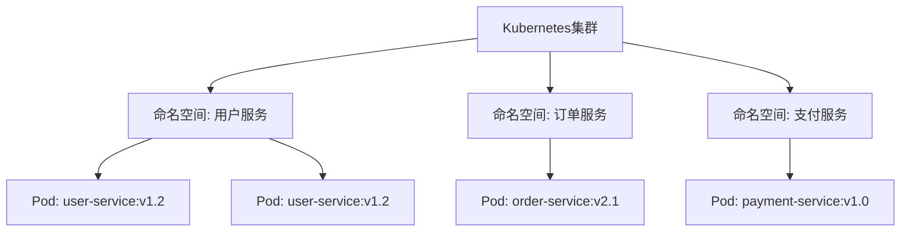

## 36. 什么是微服务架构中的DRY?

DRY（Don't Repeat Yourself，不要重复自己）是软件工程中的基本原则，意思是**避免在代码中出现重复的逻辑或知识**。每一块知识在系统中应该有唯一、明确的表示。

**DRY在微服务中的应用与挑战：**

在单体应用中，DRY很容易实现——提取公共方法或类即可。但在微服务中，DRY需要更谨慎地权衡，因为过度追求DRY可能导致服务间的耦合。

**常见的代码重复场景及解决方案：**

**1. 公共工具类（推荐共享）**
日期处理、字符串工具、加密工具等纯工具类，可以提取为内部共享库（Internal Library）。
```
common-utils → 各微服务引入
```

**2. 公共数据模型（谨慎共享）**
如果多个服务共享同一个DTO/Entity，修改共享模型会影响所有服务，引入耦合。
建议：每个服务定义自己的模型，通过API转换，宁可有少量重复也不要引入耦合。

**3. 公共业务逻辑（不应共享）**
业务逻辑属于特定服务的职责，不应该提取到共享库中。如果多个服务都需要同一段业务逻辑，考虑是否应该将其提取为一个独立的微服务。

**微服务中DRY的黄金法则：**
> 在微服务中，**少量的代码重复比服务间的耦合更可接受**。
> 宁可在两个服务中各写一个`formatDate()`方法，也不要为此引入共享依赖。

**共享库的风险：**
- 共享库版本升级需要所有服务同步更新
- 共享库中的Bug会影响所有依赖它的服务
- 共享库可能成为隐式的服务间耦合点

## 37. 什么是消费者驱动的合同(CDC)?

消费者驱动的合同（Consumer-Driven Contract，CDC）是一种契约测试方法，其核心思想是：**由服务的消费者（调用方）来定义它对提供者（被调用方）的期望，形成契约，提供者必须满足所有消费者的契约**。

**CDC与传统契约测试的区别：**
传统方式是提供者定义API文档，消费者按文档开发。CDC反过来，消费者先定义期望，提供者按消费者期望实现和验证。

**CDC工作流程：**

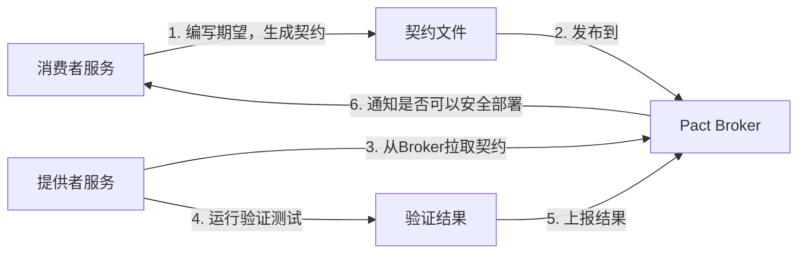

**CDC的优势：**
- 消费者有话语权，提供者不能随意破坏接口
- 不需要启动真实的提供者服务即可测试消费者
- 提供者重构时能立即知道是否影响了任何消费者
- 支持"Can I Deploy"检查：部署前确认不会破坏任何消费者

**实际案例：**
订单服务（消费者）调用用户服务（提供者）：
1. 订单服务写测试，声明"我期望`GET /users/1`返回包含`id`和`name`字段的JSON"
2. 生成契约文件发布到Pact Broker
3. 用户服务拉取契约，运行验证，确认自己满足这个期望
4. 用户服务要删除`name`字段时，验证失败，立刻发现会破坏订单服务

**主流CDC工具：**
- **PACT**：最流行的CDC工具，支持Java、JavaScript、Go、Python等多语言
- **Spring Cloud Contract**：Spring生态的CDC方案，与Spring Boot深度集成

## 38. Web，RESTful API在微服务中的作用是什么?

Web和RESTful API是微服务对外暴露能力的主要方式，在微服务架构中扮演着"服务接口"的核心角色。

**RESTful API在微服务中的具体作用：**

**1. 服务间通信的标准协议**
微服务之间通过RESTful API进行同步调用，使用HTTP方法（GET/POST/PUT/DELETE）和标准状态码进行交互，具有语言无关、协议标准、工具丰富等优点。

**2. 对外暴露业务能力**
每个微服务通过RESTful API将自己的业务能力暴露给其他服务或前端应用，API即是服务的"契约"。

**3. API版本管理**
通过URL版本号（`/api/v1/`、`/api/v2/`）管理接口演进，老版本在过渡期内继续提供服务，保证向后兼容。

**4. 与API网关集成**
API网关统一代理所有微服务的RESTful接口，实现：
- 路由转发
- 统一鉴权（JWT验证）
- 限流熔断
- 请求/响应日志
- SSL终止

**RESTful API设计在微服务中的最佳实践：**

```
# 资源命名使用名词复数
GET    /api/v1/orders          # 查询订单列表
POST   /api/v1/orders          # 创建订单
GET    /api/v1/orders/{id}     # 查询单个订单
PUT    /api/v1/orders/{id}     # 更新订单
DELETE /api/v1/orders/{id}     # 取消订单

# 使用查询参数过滤
GET /api/v1/orders?status=paid&page=1&size=20

# 嵌套资源
GET /api/v1/orders/{id}/items  # 查询订单的商品列表
```

**REST vs gRPC的选择：**

| 场景 | 推荐 |
|------|------|
| 对外API、浏览器调用 | REST |
| 内部高性能服务间通信 | gRPC |
| 异步解耦 | 消息队列（Kafka/RabbitMQ） |

## 39. 您对微服务架构中的语义监控有何了解?

语义监控（Semantic Monitoring）是一种将业务逻辑与监控相结合的监控方式。它不仅仅监控技术指标（如CPU、内存、响应时间），还通过**持续执行真实的业务测试场景**来验证系统从业务角度是否正常运行。

**传统监控 vs 语义监控：**

| 对比维度 | 传统监控 | 语义监控 |
|---------|---------|---------|
| 监控内容 | 技术指标（CPU、内存、错误率） | 业务行为（下单流程是否正常） |
| 发现问题 | 系统层面的异常 | 业务层面的异常 |
| 告警触发 | 指标超过阈值 | 业务测试失败 |
| 典型工具 | Prometheus、Grafana | 结合合成监控（Synthetic Monitoring） |

**语义监控的实现方式：**

**1. 合成事务（Synthetic Transactions）**
在生产环境中定期执行模拟真实用户行为的测试脚本：
```
每5分钟执行一次：
1. 调用登录API，验证能获取Token
2. 调用商品列表API，验证返回数据格式正确
3. 调用下单API，验证订单创建成功
4. 清理测试数据
```

**2. 业务指标监控**
除了技术指标，还监控业务指标：
- 每分钟订单创建数（突然降为0可能是故障）
- 支付成功率（低于95%触发告警）
- 用户注册转化率

**3. 端到端健康检查**
`/health`端点不只检查服务自身，还检查依赖服务和关键业务流程的可用性。

**在微服务中的价值：**
某个微服务的技术指标可能正常，但业务流程整体中断（如消息队列积压导致订单状态不更新），语义监控能更早发现这类业务层面的问题。

## 40. 我们如何进行跨功能测试?

跨功能测试（Cross-Functional Testing），也称为非功能性测试，是验证系统在功能之外的质量属性的测试，包括性能、安全性、可靠性、可用性、可维护性等。

**主要的跨功能测试类型：**

**1. 性能测试**
验证系统在不同负载下的响应时间和吞吐量：
- **负载测试**：验证正常和峰值负载下的表现
- **压力测试**：找到系统的极限和崩溃点
- **容量测试**：确定系统能支持的最大用户数
- 工具：JMeter、Gatling、k6

**2. 安全测试**
- 渗透测试：模拟攻击者寻找漏洞
- OWASP Top 10漏洞扫描
- 依赖组件的已知漏洞扫描（OWASP Dependency Check）
- 工具：OWASP ZAP、SonarQube

**3. 可靠性/混沌测试**
主动向系统注入故障，验证系统的弹性：
- 随机杀死服务实例
- 模拟网络延迟和分区
- 工具：Chaos Monkey（Netflix）、Chaos Mesh

**4. 可用性测试**
验证系统的无障碍访问能力（WCAG标准）。

**5. 兼容性测试**
验证系统在不同浏览器、设备、操作系统上的表现。

**在微服务CI/CD流水线中集成跨功能测试：**
```
单元测试 → 集成测试 → 部署测试环境 → 跨功能测试 → 部署生产
                                      ↑
                          性能测试、安全扫描、混沌测试
```

## 41. 我们如何在测试中消除非决定论?

非决定论（Non-Determinism）是指测试在相同代码下有时通过、有时失败的现象，也叫"脆弱测试"（Flaky Tests）。这是微服务测试中的常见痛点。

**非决定论的常见来源：**

**1. 时间依赖**
测试依赖当前时间，导致在不同时间运行结果不同。
```java
// 问题代码
if (LocalDate.now().isAfter(order.getExpireDate())) { ... }

// 解决方案：注入时钟，测试时使用固定时间
Clock clock = Clock.fixed(Instant.parse("2024-01-01T00:00:00Z"), ZoneOffset.UTC);
```

**2. 随机数**
测试中使用随机数导致结果不可预测。解决方案：使用固定种子或Mock随机数生成器。

**3. 共享测试数据**
多个测试共享同一数据库数据，测试间相互影响。
解决方案：每个测试独立准备和清理数据，使用事务回滚或测试容器。

**4. 异步操作**
测试没有正确等待异步操作完成就进行断言。
```java
// 问题：消息可能还没处理完
sendMessage(event);
assertThat(result).isEqualTo(expected); // 可能失败

// 解决方案：使用Awaitility等待
await().atMost(5, SECONDS).until(() -> result.equals(expected));
```

**5. 外部服务依赖**
测试依赖真实的外部服务（第三方API、数据库），网络波动导致失败。
解决方案：使用WireMock、MockServer等工具Mock外部服务。

**6. 测试执行顺序依赖**
测试A依赖测试B的执行结果。解决方案：每个测试必须独立，能以任意顺序运行。

**消除非决定论的原则：**
- 隔离外部依赖（数据库、网络、时间、随机数）
- 每个测试独立准备和清理数据
- 异步操作使用明确的等待机制
- 定期识别和修复脆弱测试（不要忽略偶发失败）

## 42. Mock或Stub有什么区别?

Mock和Stub都是测试替身（Test Double）的类型，用于替换真实依赖，但它们的用途和验证方式不同。

**Stub（桩）：**
Stub提供预设的返回值，用于**为被测代码提供间接输入**。Stub不关心自己被调用了多少次，只关心返回正确的数据。

```java
// Stub示例：预设返回值，不验证调用行为
UserRepository stubRepo = mock(UserRepository.class);
when(stubRepo.findById(1L)).thenReturn(new User(1L, "张三"));

// 测试只关心业务逻辑的输出，不关心findById被调用几次
UserService service = new UserService(stubRepo);
String name = service.getUserName(1L);
assertThat(name).isEqualTo("张三");
```

**Mock（模拟对象）：**
Mock不仅提供预设返回值，还会**验证被测代码是否以正确的方式调用了依赖**（调用次数、调用参数等）。

```java
// Mock示例：验证调用行为
EmailService mockEmail = mock(EmailService.class);
UserService service = new UserService(mockEmail);

service.registerUser("zhangsan@example.com");

// 验证sendWelcomeEmail被调用了一次，且参数正确
verify(mockEmail, times(1)).sendWelcomeEmail("zhangsan@example.com");
```

**对比总结：**

| 对比维度 | Stub | Mock |
|---------|------|------|
| 主要用途 | 提供间接输入（返回值） | 验证间接输出（调用行为） |
| 验证重点 | 被测代码的输出结果 | 被测代码与依赖的交互 |
| 失败原因 | 断言结果不符合预期 | 调用次数/参数不符合预期 |
| 适用场景 | 查询类操作 | 命令类操作（发邮件、写数据库） |

**其他测试替身类型：**
- **Fake**：有真实实现但走捷径（如内存数据库替代真实数据库）
- **Spy**：包装真实对象，可以监控调用但仍执行真实逻辑
- **Dummy**：占位符，传入但不使用（如填充方法参数）

## 43. 您对Mike Cohn的测试金字塔了解多少?

测试金字塔（Test Pyramid）是由Mike Cohn在《Succeeding with Agile》中提出的测试策略模型，它描述了不同层次测试的理想数量比例，帮助团队建立高效、可维护的测试套件。

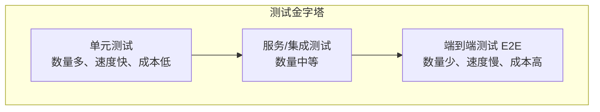

**三层结构详解：**

**底层：单元测试（Unit Tests）**
- 数量最多（占总测试的70%左右）
- 测试单个类或方法的逻辑
- 运行速度极快（毫秒级）
- 使用Mock隔离所有外部依赖
- 维护成本低，反馈最快

**中层：服务/集成测试（Service/Integration Tests）**
- 数量中等（占总测试的20%左右）
- 测试服务与外部依赖（数据库、消息队列）的集成
- 运行速度较慢（秒级）
- 使用真实或内嵌的依赖

**顶层：端到端测试（E2E Tests）**
- 数量最少（占总测试的10%左右）
- 覆盖最关键的业务流程
- 运行速度最慢（分钟级）
- 维护成本最高

**反模式——测试冰淇淋（Ice Cream Cone）：**
很多团队实际上是倒金字塔：大量E2E测试，少量单元测试。这导致测试套件运行缓慢、脆弱、难以维护。

**在微服务中的应用：**
每个微服务内部遵循测试金字塔，同时在服务间使用契约测试（Contract Tests）替代大量的集成测试，进一步减少对E2E测试的依赖。

## 44. Docker的目的是什么?

Docker是一个开源的容器化平台，它的核心目的是**将应用程序及其所有依赖打包成一个标准化的容器镜像，实现"一次构建，到处运行"**。

**Docker的核心概念：**

| 概念 | 说明 |
|------|------|
| 镜像（Image） | 只读的应用模板，包含代码、运行时、依赖 |
| 容器（Container） | 镜像的运行实例，可启动、停止、删除 |
| Dockerfile | 定义如何构建镜像的脚本文件 |
| Registry | 镜像仓库（如Docker Hub、阿里云ACR） |
| Docker Compose | 定义和运行多容器应用的工具 |

**微服务的Dockerfile示例：**
```dockerfile
# 多阶段构建，减小镜像体积
FROM maven:3.9-openjdk-17 AS builder
WORKDIR /app
COPY pom.xml .
RUN mvn dependency:go-offline
COPY src ./src
RUN mvn package -DskipTests

FROM openjdk:17-jre-slim
WORKDIR /app
COPY --from=builder /app/target/user-service.jar app.jar
EXPOSE 8080
ENTRYPOINT ["java", "-jar", "app.jar"]
```

**Docker在微服务中的具体用途：**

**1. 环境一致性**
开发、测试、生产使用完全相同的镜像，消除"在我机器上能跑"的问题。

**2. 快速部署**
容器启动时间秒级，相比虚拟机（分钟级）大幅提升部署速度。

**3. 资源隔离**
每个微服务运行在独立容器中，互不干扰，通过cgroups限制资源使用。

**4. 简化依赖管理**
不同服务可以使用不同版本的JDK、Node.js等，不会产生冲突。

**5. 支持CI/CD**
```
git push → Jenkins构建 → docker build → docker push → kubectl apply
```

**6. 本地开发多服务联调**
使用Docker Compose一键启动所有依赖服务：
```yaml
# docker-compose.yml
services:
  user-service:
    image: user-service:latest
    ports: ["8081:8080"]
  order-service:
    image: order-service:latest
    ports: ["8082:8080"]
  mysql:
    image: mysql:8.0
    environment:
      MYSQL_ROOT_PASSWORD: root
```

## 45. 什么是金丝雀释放?

金丝雀发布（Canary Release）是一种降低发布风险的部署策略。它的名字来源于煤矿工人用金丝雀检测有毒气体的做法——先将新版本发布给一小部分用户，观察是否有问题，再逐步扩大发布范围。

**金丝雀发布流程：**

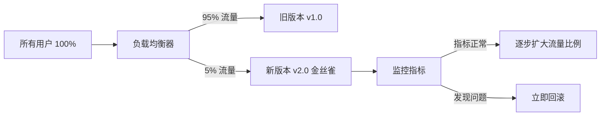

**发布步骤：**
1. 部署新版本实例（少量，如1-5%的比例）
2. 将少量流量（如5%）路由到新版本
3. 监控新版本的错误率、响应时间、业务指标
4. 若指标正常，逐步增大新版本流量比例（5% → 20% → 50% → 100%）
5. 若发现异常，立即将流量切回旧版本

**金丝雀发布 vs 蓝绿部署：**

| 对比维度 | 金丝雀发布 | 蓝绿部署 |
|---------|-----------|---------|
| 流量切换 | 渐进式（小比例到全量） | 瞬间切换（0或100%） |
| 风险控制 | 更细粒度，风险更小 | 切换快但影响面大 |
| 资源消耗 | 较少 | 需要双倍资源 |
| 回滚速度 | 立即切回 | 立即切回 |
| 适用场景 | 重要功能变更 | 快速发布和回滚 |

**在Kubernetes中实现金丝雀发布：**
通过控制新旧版本的Pod数量比例实现流量分配，或配合Istio服务网格实现更精细的流量控制（如按用户ID、Header路由）。

## 46. 什么是持续集成(CI)?

持续集成（Continuous Integration，CI）是一种软件开发实践，要求开发人员**频繁地将代码合并到共享主干**（通常每天多次），每次合并都通过自动化构建和测试来验证，从而尽早发现集成问题。

**CI的核心理念：**
- 频繁提交，避免长期分支导致的"集成地狱"
- 每次提交都自动触发构建和测试
- 构建失败立即通知，快速修复

**典型的CI流水线：**


**CI在微服务中的实践：**

**1. 每个服务独立的CI流水线**
每个微服务有自己的代码仓库和CI流水线，互不影响，某个服务的构建失败不会阻塞其他服务。

**2. 自动化测试门禁**
CI流水线中设置质量门禁：
- 单元测试覆盖率不低于80%
- 代码质量评分不低于A级
- 无高危安全漏洞

**3. 快速反馈**
CI流水线应在10分钟内完成，给开发者快速反馈。耗时长的测试（如E2E测试）放到CD阶段。

**常用CI工具：**
- Jenkins（老牌，功能强大）
- GitLab CI/CD（与GitLab深度集成）
- GitHub Actions（与GitHub深度集成）
- Jenkins X（专为Kubernetes设计）

## 47. 什么是持续监测?

持续监测（Continuous Monitoring）是指对微服务系统的运行状态进行**实时、全面、自动化的监控**，包括基础设施、应用性能、业务指标和安全事件，以便快速发现和响应问题。

**监控的四个黄金信号（Google SRE）：**
- **延迟（Latency）**：请求处理时间，区分成功和失败请求的延迟
- **流量（Traffic）**：系统负载，如每秒请求数（QPS）
- **错误（Errors）**：失败请求的比率
- **饱和度（Saturation）**：资源使用率，如CPU、内存、磁盘

**监控技术栈（常见组合）：**

```mermaid
graph TB
    Services[微服务集群] --> Metrics[指标采集]
    Services --> Logs[日志收集]
    Services --> Traces[链路追踪]
    Metrics --> Prometheus[Prometheus]
    Prometheus --> Grafana[Grafana 可视化]
    Logs --> Filebeat[Filebeat/Fluentd]
    Filebeat --> ES[Elasticsearch]
    ES --> Kibana[Kibana 日志分析]
    Traces --> Jaeger[Jaeger/Zipkin]
    Grafana --> Alert[AlertManager 告警]
    Alert --> DingTalk[钉钉/邮件/PagerDuty]
```

**监控的层次：**

| 层次 | 监控内容 | 工具 |
|------|---------|------|
| 基础设施层 | CPU、内存、磁盘、网络 | Node Exporter + Prometheus |
| 容器层 | Pod状态、容器资源 | cAdvisor + Prometheus |
| 应用层 | 请求量、响应时间、错误率 | Micrometer + Prometheus |
| 业务层 | 订单量、支付成功率 | 自定义指标 |
| 日志层 | 错误日志、访问日志 | ELK Stack |
| 链路层 | 分布式调用链路 | Jaeger/Zipkin |

**告警最佳实践：**
- 告警应该是可操作的，避免告警疲劳
- 区分紧急告警（立即处理）和警告（工作时间处理）
- 设置合理的告警阈值，避免误报

## 48. 架构师在微服务架构中的角色是什么?

在微服务架构中，架构师的角色与传统单体架构有所不同。微服务强调团队自治，架构师不再是"发号施令"的中心，而更像是**技术引路人和平台建设者**。

**架构师的核心职责：**

**1. 定义技术愿景和原则**
- 制定微服务拆分原则和边界划分标准
- 定义技术选型规范（编程语言、框架、数据库）
- 建立API设计规范和版本管理策略

**2. 设计基础设施和平台**
- 设计服务注册与发现机制
- 规划API网关架构
- 建立统一的日志、监控、链路追踪平台
- 设计CI/CD流水线标准

**3. 服务边界划分**
- 结合DDD和业务需求，指导团队划分服务边界
- 识别和解决服务间的循环依赖
- 评估服务拆分的合理性

**4. 技术治理**
- 管理技术债务，推动重构
- 评估新技术引入的风险和收益
- 制定安全规范和合规要求

**5. 跨团队协调**
- 协调多个团队之间的接口设计
- 解决跨服务的技术争议
- 推动技术标准的落地

**架构师的工作方式变化：**

| 传统架构师 | 微服务架构师 |
|-----------|------------|
| 集中决策，自上而下 | 赋能团队，去中心化 |
| 详细设计每个模块 | 定义边界和原则，细节由团队决定 |
| 关注系统内部结构 | 关注服务间的交互和整体演进 |
| 一次性大设计 | 持续演进，拥抱变化 |

**架构师需要具备的能力：**
- 深厚的分布式系统知识
- 业务理解能力（能与业务专家对话）
- 沟通和影响力（说服而非命令）
- 对新技术的持续学习能力

## 49. 我们可以用微服务创建状态机吗?

是的，微服务架构中完全可以实现状态机（State Machine）。状态机是一种对业务实体生命周期进行建模的有效方式，在微服务中尤其适合管理复杂的业务流程状态。

**什么是状态机？**
状态机定义了一个对象可能处于的所有状态，以及在特定事件触发下从一个状态转换到另一个状态的规则。

**订单状态机示例：**

```mermaid
stateDiagram-v2
    [*] --> 待支付: 创建订单
    待支付 --> 已支付: 支付成功
    待支付 --> 已取消: 超时/用户取消
    已支付 --> 备货中: 开始备货
    备货中 --> 已发货: 发货
    已发货 --> 已完成: 确认收货
    已发货 --> 退款中: 申请退款
    退款中 --> 已退款: 退款成功
    已完成 --> [*]
    已取消 --> [*]
    已退款 --> [*]
```

**在微服务中实现状态机的方式：**

**1. 使用Spring State Machine**
```java
@Configuration
@EnableStateMachine
public class OrderStateMachineConfig extends StateMachineConfigurerAdapter<OrderState, OrderEvent> {

    @Override
    public void configure(StateMachineTransitionConfigurer<OrderState, OrderEvent> transitions)
            throws Exception {
        transitions
            .withExternal()
                .source(OrderState.PENDING_PAYMENT)
                .target(OrderState.PAID)
                .event(OrderEvent.PAYMENT_SUCCESS)
            .and()
            .withExternal()
                .source(OrderState.PENDING_PAYMENT)
                .target(OrderState.CANCELLED)
                .event(OrderEvent.TIMEOUT);
    }
}
```

**2. 基于数据库的状态机**
将状态存储在数据库中，通过状态字段和业务逻辑控制状态转换，适合简单场景。

**3. 事件驱动的分布式状态机**
通过消息队列传递状态变更事件，各服务监听事件并更新自己维护的状态，适合跨服务的复杂流程（结合Saga模式）。

**状态机在微服务中的优势：**
- 业务状态清晰可见，避免非法状态转换
- 状态变更有迹可查，便于审计
- 复杂业务流程的可视化表达
- 与事件驱动架构天然契合

## 50. 什么是微服务中的反应性扩展?

反应性扩展（Reactive Extensions，也称为 ReactiveX 或 Rx）是一种编程范式，结合了**观察者模式**、**迭代器模式**和**函数式编程**，用于处理异步数据流和事件驱动编程。在微服务中，响应式编程能够显著提升系统的吞吐量和资源利用率。

**核心概念：**

| 概念 | 说明 |
|------|------|
| Observable（可观察对象） | 数据流的生产者，可以发出零个或多个数据项 |
| Observer（观察者） | 数据流的消费者，订阅并响应数据 |
| Operator（操作符） | 转换、过滤、合并数据流的函数 |
| Scheduler（调度器） | 控制操作在哪个线程上执行 |
| Backpressure（背压） | 消费者处理不过来时，通知生产者减速的机制 |

**响应式 vs 传统阻塞式：**

```mermaid
graph LR
    subgraph 传统阻塞式
        R1[请求1] --> T1[线程1 阻塞等待]
        R2[请求2] --> T2[线程2 阻塞等待]
        R3[请求3] --> T3[线程3 阻塞等待]
    end
    subgraph 响应式非阻塞
        R4[请求1] --> ET[事件循环线程]
        R5[请求2] --> ET
        R6[请求3] --> ET
        ET --> CB[回调处理结果]
    end
```

**在微服务中的应用场景：**

**1. 并行调用多个服务（聚合结果）**
```java
// 使用Project Reactor（Spring WebFlux）
// 并行调用用户服务和订单服务，合并结果
Mono<UserInfo> userMono = userService.getUser(userId);
Mono<List<Order>> ordersMono = orderService.getOrders(userId);

Mono<UserDashboard> dashboard = Mono.zip(userMono, ordersMono)
    .map(tuple -> new UserDashboard(tuple.getT1(), tuple.getT2()));
```

**2. 处理高并发请求**
响应式Web框架（如Spring WebFlux）使用少量线程处理大量并发请求，相比传统Servlet模型可以支持更高的并发。

**3. 流式数据处理**
处理实时数据流（如传感器数据、日志流）时，响应式编程可以以背压机制控制处理速度，避免内存溢出。

**4. 服务编排**
```java
// 串行调用：先验证库存，再创建订单，再扣款
inventoryService.check(item)
    .flatMap(available -> orderService.create(order))
    .flatMap(createdOrder -> paymentService.charge(createdOrder))
    .subscribe(
        result -> log.info("下单成功: {}", result),
        error -> log.error("下单失败: {}", error.getMessage())
    );
```

**主流响应式框架：**

| 语言 | 框架 |
|------|------|
| Java | Project Reactor（Spring WebFlux）、RxJava |
| JavaScript | RxJS |
| Python | RxPY |
| Go | RxGo |

**响应式编程的优势与挑战：**

优势：
- 更高的吞吐量，更少的线程资源占用
- 天然支持异步非阻塞操作
- 丰富的操作符简化异步逻辑

挑战：
- 学习曲线陡峭，调试困难
- 栈追踪信息不直观
- 不适合所有场景（CPU密集型任务优势不明显）

---

## 总结

微服务架构是现代分布式系统的主流选择，核心思想是将大型单体应用拆分为小型、自治、独立部署的服务单元。掌握微服务需要理解以下关键领域：

- **架构设计**：DDD、限界上下文、高内聚低耦合
- **通信机制**：REST、gRPC、消息队列、事件驱动
- **服务治理**：服务发现、API网关、熔断限流
- **数据管理**：数据库隔离、分布式事务、Saga模式
- **测试策略**：测试金字塔、契约测试、CDC
- **部署运维**：Docker、Kubernetes、CI/CD、金丝雀发布
- **可观测性**：日志、指标、链路追踪
- **安全**：OAuth2、JWT、mTLS、双因素认证

---

## 补充深入：熔断器模式（Circuit Breaker）

熔断器模式是微服务弹性设计中最重要的模式之一，名字来源于电路中的断路器。当下游服务出现故障时，熔断器自动"断开"，阻止请求继续发往故障服务，避免级联失败。

**熔断器的三种状态：**

```mermaid
stateDiagram-v2
    [*] --> 关闭Closed: 初始状态
    关闭Closed --> 打开Open: 失败率超过阈值
    打开Open --> 半开HalfOpen: 等待超时后
    半开HalfOpen --> 关闭Closed: 试探请求成功
    半开HalfOpen --> 打开Open: 试探请求失败
```

- **关闭（Closed）**：正常状态，请求正常通过，统计失败率
- **打开（Open）**：熔断状态，所有请求直接返回失败（快速失败），不调用下游
- **半开（Half-Open）**：恢复探测状态，允许少量请求通过，若成功则关闭熔断器

**Resilience4j 熔断器配置示例：**
```java
@Bean
public CircuitBreakerConfig circuitBreakerConfig() {
    return CircuitBreakerConfig.custom()
        .failureRateThreshold(50)           // 失败率超过50%触发熔断
        .waitDurationInOpenState(Duration.ofSeconds(30))  // 熔断30秒后进入半开
        .permittedNumberOfCallsInHalfOpenState(5)         // 半开状态允许5次试探
        .slidingWindowSize(10)              // 统计最近10次请求
        .build();
}

@CircuitBreaker(name = "userService", fallbackMethod = "getUserFallback")
public User getUser(Long id) {
    return userServiceClient.getUser(id);
}

public User getUserFallback(Long id, Exception e) {
    // 降级逻辑：返回缓存数据或默认值
    return new User(id, "未知用户");
}
```

---

## 补充深入：API网关详解

API网关（API Gateway）是微服务架构中的统一入口，所有外部请求都经过网关路由到对应的微服务。

**API网关的核心功能：**

```mermaid
graph TB
    Client[客户端] --> GW[API网关]
    GW --> Auth[身份认证/授权]
    GW --> RateLimit[限流]
    GW --> CB[熔断]
    GW --> LB[负载均衡]
    GW --> Route[路由转发]
    GW --> Log[日志记录]
    GW --> Transform[请求/响应转换]
    Route --> S1[用户服务]
    Route --> S2[订单服务]
    Route --> S3[商品服务]
```

**Spring Cloud Gateway 路由配置示例：**
```yaml
spring:
  cloud:
    gateway:
      routes:
        - id: user-service
          uri: lb://user-service        # lb:// 表示使用负载均衡
          predicates:
            - Path=/api/v1/users/**
          filters:
            - StripPrefix=2             # 去掉前两段路径
            - name: RequestRateLimiter  # 限流过滤器
              args:
                redis-rate-limiter.replenishRate: 100
                redis-rate-limiter.burstCapacity: 200
        - id: order-service
          uri: lb://order-service
          predicates:
            - Path=/api/v1/orders/**
            - Header=X-Request-Source, mobile  # 只匹配移动端请求
```

**网关 vs 直接调用的对比：**

| 维度 | 使用API网关 | 直接调用 |
|------|-----------|---------|
| 鉴权 | 统一在网关处理 | 每个服务各自实现 |
| 限流 | 统一配置 | 分散配置 |
| 日志 | 统一记录访问日志 | 分散记录 |
| 客户端复杂度 | 低（只需知道网关地址） | 高（需要知道所有服务地址） |
| 单点风险 | 网关需要高可用部署 | 无单点 |

**BFF（Backend for Frontend）模式：**
当不同客户端（App、Web、小程序）对数据格式需求不同时，可以为每类客户端建立专属的BFF网关层，在BFF中聚合和裁剪数据，避免通用API过于臃肿。

---

## 补充深入：服务注册与发现

服务注册与发现（Service Registry and Discovery）是微服务架构的基础设施之一。由于微服务实例数量多且动态变化（扩缩容、故障重启），服务间调用不能依赖硬编码的IP地址，需要一套动态的服务寻址机制。

**工作原理：**

```mermaid
sequenceDiagram
    participant S as 服务实例（订单服务）
    participant R as 注册中心（Nacos）
    participant C as 调用方（用户服务）
    S->>R: 启动时注册（服务名、IP、端口、健康状态）
    S->>R: 定期发送心跳（保持注册有效）
    C->>R: 查询"订单服务"的实例列表
    R-->>C: 返回可用实例列表
    C->>S: 根据负载均衡策略选择实例发起调用
    Note over S,R: 实例下线或心跳超时，注册中心自动摘除
```

**客户端发现 vs 服务端发现：**

| 模式 | 说明 | 代表 |
|------|------|------|
| 客户端发现 | 客户端查询注册中心，自己做负载均衡 | Eureka + Ribbon |
| 服务端发现 | 客户端请求负载均衡器，由其查询注册中心 | AWS ALB、Kubernetes Service |

**主流注册中心对比：**

| 注册中心 | 一致性协议 | 健康检查 | 配置中心 | 推荐场景 |
|---------|-----------|---------|---------|---------|
| Eureka | AP（最终一致） | 客户端心跳 | 否 | Spring Cloud老项目 |
| Nacos | AP/CP可切换 | 客户端心跳+主动探测 | 是 | 新项目首选 |
| Consul | CP（Raft协议） | 多种方式 | 是 | 多语言环境 |
| Zookeeper | CP（ZAB协议） | 临时节点 | 否 | Dubbo生态 |

**Nacos服务注册示例（Spring Boot）：**
```yaml
# application.yml
spring:
  application:
    name: order-service
  cloud:
    nacos:
      discovery:
        server-addr: 127.0.0.1:8848
        namespace: dev
        group: DEFAULT_GROUP
```

```java
// 使用OpenFeign调用，服务名自动解析为实例地址
@FeignClient(name = "user-service")
public interface UserClient {
    @GetMapping("/users/{id}")
    User getUser(@PathVariable Long id);
}
```

---

## 补充深入：分布式链路追踪

在微服务架构中，一个用户请求可能经过十几个服务。当出现性能问题或错误时，如何快速定位是哪个服务出了问题？分布式链路追踪（Distributed Tracing）正是为此而生。

**核心概念：**

| 概念 | 说明 |
|------|------|
| Trace | 一次完整请求的全链路，由唯一的 TraceId 标识 |
| Span | 链路中的一个操作单元（如一次服务调用、一次数据库查询） |
| TraceId | 贯穿整个请求链路的唯一标识，在服务间传递 |
| SpanId | 当前操作单元的唯一标识 |
| ParentSpanId | 父操作单元的 SpanId，用于构建调用树 |

**链路追踪示意：**

```mermaid
graph LR
    GW[网关 Span1] --> US[用户服务 Span2]
    GW --> OS[订单服务 Span3]
    OS --> PS[商品服务 Span4]
    OS --> PAY[支付服务 Span5]
    US --> DB1[(用户DB Span6)]
    OS --> DB2[(订单DB Span7)]
    style GW fill:#f9f,stroke:#333
    style OS fill:#bbf,stroke:#333
```

所有 Span 共享同一个 TraceId，通过 ParentSpanId 构建完整的调用树。

**Spring Boot 集成 Micrometer Tracing（Spring Boot 3.x）：**
```xml
<dependency>
    <groupId>io.micrometer</groupId>
    <artifactId>micrometer-tracing-bridge-otel</artifactId>
</dependency>
<dependency>
    <groupId>io.opentelemetry</groupId>
    <artifactId>opentelemetry-exporter-zipkin</artifactId>
</dependency>
```

```yaml
management:
  tracing:
    sampling:
      probability: 1.0   # 采样率，生产环境建议 0.1（10%）
  zipkin:
    tracing:
      endpoint: http://zipkin:9411/api/v2/spans
```

TraceId 会自动注入到日志中，便于在 ELK 中按 TraceId 检索完整链路日志：
```
2024-01-01 12:00:00 [order-service,abc123,def456] INFO  OrderService - 创建订单成功
                                ↑TraceId  ↑SpanId
```

**主流链路追踪工具：**

| 工具 | 特点 |
|------|------|
| Zipkin | 轻量，部署简单，社区成熟 |
| Jaeger | CNCF项目，功能强大，适合大规模 |
| SkyWalking | 国产，支持多语言，UI友好 |
| OpenTelemetry | 标准化规范，厂商中立，未来趋势 |

---

## 补充深入：消息队列在微服务中的应用

消息队列（Message Queue）是微服务异步通信的核心基础设施，用于解耦服务、削峰填谷、保证最终一致性。

**消息队列解决的问题：**

```mermaid
graph LR
    subgraph 同步调用问题
        A1[订单服务] -->|同步HTTP| B1[库存服务]
        A1 -->|同步HTTP| C1[通知服务]
        A1 -->|同步HTTP| D1[积分服务]
        B1 -->|任一失败则整体失败| A1
    end
    subgraph 消息队列解耦
        A2[订单服务] -->|发布事件| MQ[消息队列]
        MQ -->|异步消费| B2[库存服务]
        MQ -->|异步消费| C2[通知服务]
        MQ -->|异步消费| D2[积分服务]
    end
```

**核心使用场景：**

**1. 异步处理**
用户下单后，发送短信通知、更新积分、记录日志等操作不需要同步完成，通过消息队列异步处理，提升下单接口响应速度。

**2. 削峰填谷**
秒杀活动瞬间涌入大量请求，将请求写入消息队列，下游服务按自身处理能力消费，避免数据库被压垮。

**3. 服务解耦**
订单服务只需发布"订单创建"事件，不需要知道有哪些服务关心这个事件，新增消费者无需修改订单服务。

**4. 最终一致性**
通过消息队列实现跨服务的数据最终一致性，配合本地消息表保证消息不丢失。

**主流消息队列对比：**

| 特性 | Kafka | RabbitMQ | RocketMQ |
|------|-------|---------|---------|
| 吞吐量 | 极高（百万级/秒） | 中等（万级/秒） | 高（十万级/秒） |
| 消息顺序 | 分区内有序 | 队列内有序 | 支持全局顺序 |
| 消息延迟 | 毫秒级 | 微秒级 | 毫秒级 |
| 消息回溯 | 支持（按时间/偏移量） | 不支持 | 支持 |
| 事务消息 | 支持 | 支持 | 支持 |
| 适用场景 | 日志收集、流处理 | 任务队列、RPC | 电商、金融 |

**Spring Boot 集成 RabbitMQ 示例：**
```java
// 发布者：订单服务
@Service
public class OrderService {
    @Autowired
    private RabbitTemplate rabbitTemplate;

    public Order createOrder(OrderRequest request) {
        Order order = saveOrder(request);
        // 发布订单创建事件
        rabbitTemplate.convertAndSend(
            "order.exchange",
            "order.created",
            new OrderCreatedEvent(order.getId(), order.getUserId())
        );
        return order;
    }
}

// 消费者：通知服务
@Component
public class NotificationConsumer {
    @RabbitListener(queues = "notification.order.created")
    public void handleOrderCreated(OrderCreatedEvent event) {
        // 发送短信通知
        smsService.send(event.getUserId(), "您的订单已创建成功！");
    }
}
```

---

## 补充深入：微服务安全架构

微服务的安全设计比单体应用更复杂，需要在多个层面建立防护。

**微服务安全的四个层面：**

```mermaid
graph TB
    External[外部请求] --> L1[边界安全层]
    L1 --> L2[传输安全层]
    L2 --> L3[身份认证层]
    L3 --> L4[授权层]
    L1 --> WAF[WAF防火墙/DDoS防护]
    L2 --> TLS[TLS/mTLS加密]
    L3 --> JWT[JWT/OAuth2认证]
    L4 --> RBAC[RBAC权限控制]
```

**JWT（JSON Web Token）工作原理：**

JWT由三部分组成，用`.`分隔：
```
Header.Payload.Signature
eyJhbGciOiJIUzI1NiJ9.eyJzdWIiOiJ1c2VyMSIsInJvbGVzIjpbIlVTRVIiXSwiZXhwIjoxNzA0MDY3MjAwfQ.abc123
```

- **Header**：算法类型（如HS256、RS256）
- **Payload**：用户信息（userId、roles、过期时间），Base64编码，不加密
- **Signature**：对Header+Payload的签名，防止篡改

**微服务中JWT的使用流程：**
```mermaid
sequenceDiagram
    participant C as 客户端
    participant GW as API网关
    participant Auth as 认证服务
    participant MS as 业务微服务
    C->>Auth: 登录（用户名+密码）
    Auth-->>C: 返回JWT Token
    C->>GW: 请求（携带JWT）
    GW->>GW: 验证JWT签名和有效期
    GW->>MS: 转发请求（Header中携带用户信息）
    MS-->>GW: 返回响应
    GW-->>C: 返回响应
```

**服务间安全（mTLS）：**
在零信任架构中，服务间通信也需要双向认证。服务网格（如Istio）可以自动为每个服务颁发证书并管理mTLS，业务代码无需关心。

**常见安全漏洞防护：**

| 漏洞类型 | 防护措施 |
|---------|---------|
| SQL注入 | 使用参数化查询/ORM，禁止拼接SQL |
| XSS | 输出编码，Content-Security-Policy |
| CSRF | CSRF Token，SameSite Cookie |
| 敏感数据泄露 | 日志脱敏，HTTPS传输，加密存储 |
| 未授权访问 | API网关统一鉴权，最小权限原则 |
| 依赖漏洞 | 定期扫描（OWASP Dependency Check） |

---

## 补充深入：微服务配置管理

在微服务架构中，每个服务都有自己的配置，加上多套环境（dev/test/staging/prod），配置管理的复杂度急剧上升。集中化配置管理是解决这一问题的关键实践。

**配置管理面临的挑战：**
- 服务数量多，配置分散在各个服务的配置文件中
- 多环境配置难以统一管理
- 配置变更需要重新部署服务（如果硬编码在代码中）
- 敏感配置（数据库密码、API密钥）的安全存储

**Nacos 配置中心使用示例：**

```yaml
# bootstrap.yml（优先于 application.yml 加载）
spring:
  application:
    name: order-service
  cloud:
    nacos:
      config:
        server-addr: 127.0.0.1:8848
        namespace: dev
        group: DEFAULT_GROUP
        file-extension: yaml
        # 自动刷新配置
        refresh-enabled: true
```

```java
// 使用 @RefreshScope 实现配置热更新，无需重启服务
@RestController
@RefreshScope
public class OrderController {

    @Value("${order.max-items:10}")
    private int maxItems;

    @GetMapping("/config")
    public String getConfig() {
        return "最大商品数: " + maxItems;
    }
}
```

**配置的分层管理策略：**

| 配置层级 | 内容 | 存储位置 |
|---------|------|---------|
| 公共配置 | 所有服务共享的配置（如日志格式） | 配置中心公共命名空间 |
| 环境配置 | 各环境差异配置（数据库地址等） | 配置中心各环境命名空间 |
| 服务配置 | 服务特有的业务配置 | 配置中心服务专属配置 |
| 本地配置 | 开发调试用的本地覆盖 | 本地 application-local.yml |

**敏感配置的安全处理：**
- 使用 Vault（HashiCorp）或 AWS Secrets Manager 存储密钥
- 配置中心中只存储密钥的引用，不存储明文
- 通过环境变量注入容器，避免写入代码仓库
- 定期轮换密钥，最小化密钥暴露时间

---

## 补充深入：微服务从单体迁移的策略

很多项目需要从现有的单体应用逐步迁移到微服务架构，这是一个需要谨慎规划的过程。

**迁移策略：绞杀者模式（Strangler Fig Pattern）**

绞杀者模式是最常用的单体迁移策略，名字来源于热带雨林中的绞杀榕——它从宿主树的外部生长，逐渐包裹并替代宿主树。

```mermaid
graph LR
    subgraph 迁移过程
        Client[客户端] --> Proxy[代理层/API网关]
        Proxy -->|新功能| MS[新微服务]
        Proxy -->|旧功能| Monolith[单体应用]
        Note[随着微服务增多，单体逐渐萎缩直至消亡]
    end
```

**迁移步骤：**
1. **识别边界**：使用DDD识别单体中的限界上下文，确定拆分顺序
2. **优先拆分**：先拆分变化频繁、独立性强的模块（如通知服务、文件服务）
3. **建立代理层**：在单体前面加一层代理（API网关），新旧流量分别路由
4. **逐步迁移**：将单体中的功能逐步迁移到新微服务，同时保持单体运行
5. **数据迁移**：将共享数据库中的数据逐步迁移到各服务独立数据库
6. **下线旧代码**：当所有功能迁移完成后，下线单体应用

**迁移时的注意事项：**
- 不要试图一次性完成迁移，采用渐进式策略
- 数据库拆分是最难的部分，需要处理数据一致性问题
- 保持单体和微服务并行运行期间的数据同步
- 每次迁移后充分测试，确保功能等价
- 建立完善的监控，及时发现迁移引入的问题

---

## 补充深入：微服务面试高频考点速查

**服务拆分粒度如何把握？**
没有固定标准，参考原则：
- 一个服务由一个小团队（2-8人）独立维护
- 服务能用一句话描述其职责
- 服务的部署频率和变更频率相近
- 避免过度拆分（Nano Services），服务间通信开销超过业务价值

**微服务和SOA的本质区别一句话：**
SOA以ESB为中心做企业集成，微服务去掉ESB做去中心化自治。

**CAP理论在微服务中的体现：**
- **C（一致性）**：所有节点同一时刻看到相同数据
- **A（可用性）**：每个请求都能收到响应（不保证最新数据）
- **P（分区容忍性）**：网络分区时系统仍能运行

分布式系统无法同时满足CAP三者，微服务通常选择AP（如Eureka、Nacos默认模式），牺牲强一致性换取高可用，通过最终一致性弥补。

**服务间调用超时设置建议：**
- 连接超时：1-3秒
- 读取超时：根据业务，一般3-10秒
- 重试次数：2-3次（需保证幂等）
- 熔断阈值：失败率50%，窗口10秒

**微服务常见面试追问：**
- 如何保证消息不丢失？→ 消息持久化 + 消费者ACK确认 + 死信队列
- 如何处理消息重复消费？→ 消费者实现幂等（唯一消息ID去重）
- 如何实现分布式锁？→ Redis SETNX + 过期时间，或Redisson，或Zookeeper
- 如何做服务降级？→ 熔断器fallback返回默认值/缓存数据/友好提示
- 微服务数量多了怎么管理？→ 服务网格（Istio）+ Kubernetes + 统一可观测平台

**微服务适用场景判断：**
不是所有项目都适合微服务。以下情况适合采用微服务：
- 团队规模较大（10人以上），需要并行开发
- 业务复杂度高，不同模块变化频率差异大
- 有明确的业务边界，可以按领域拆分
- 团队具备容器化和分布式系统运维能力
- 有持续集成和持续部署的工程文化

以下情况不建议使用微服务：
- 初创项目，业务边界不清晰
- 团队规模小（5人以下），运维能力有限
- 业务逻辑简单，单体能轻松应对
- 项目生命周期短，不值得承担微服务的复杂度成本

**学习路径建议：**
1. 先掌握 Spring Boot 基础
2. 理解 REST API 设计规范
3. 学习 Docker 容器化
4. 实践 Spring Cloud 核心组件（Nacos、Gateway、OpenFeign）
5. 深入分布式理论（CAP、BASE、Saga）
6. 进阶 Kubernetes 和服务网格（Istio）
