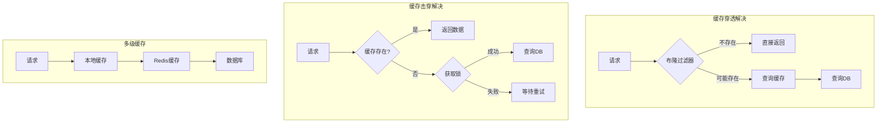
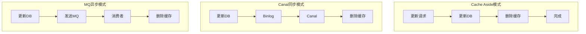
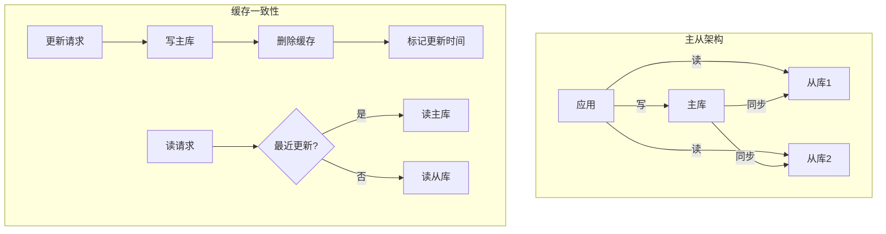
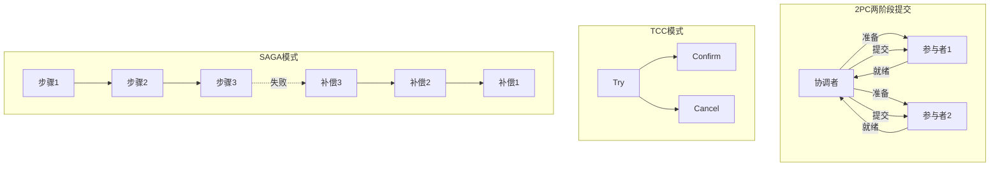
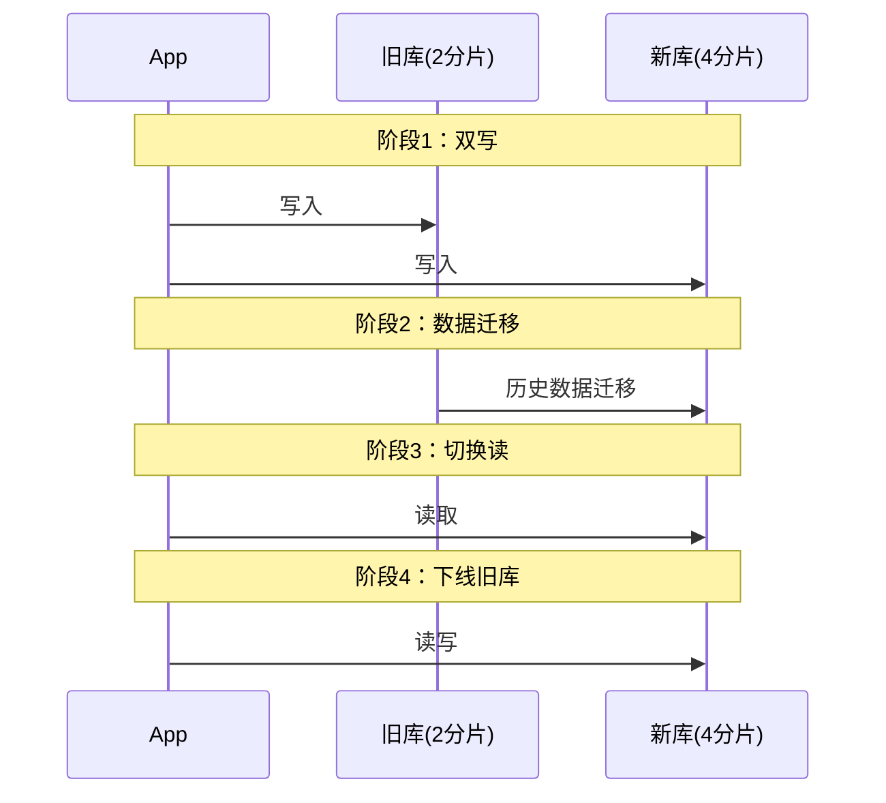

## 数据库与缓存

### 1. 数据库软件架构设计些什么

**问题分析：**

数据库架构设计需要考虑性能、可用性、扩展性、一致性等多个维度。

**设计要点：**

**1. 表结构设计**
- 范式设计：减少冗余
- 反范式设计：提升性能
- 字段类型选择：合适的类型
- 索引设计：加速查询

**2. 分库分表**
- 垂直拆分：按业务拆分
- 水平拆分：按数据量拆分
- 分片策略：哈希、范围

**3. 读写分离**
- 主库：写操作
- 从库：读操作
- 延迟处理：主从延迟

**4. 高可用**
- 主从架构
- 双主架构
- 集群架构

**代码示例：**

```sql
-- 表设计示例
CREATE TABLE `order` (
    `id` BIGINT PRIMARY KEY AUTO_INCREMENT,
    `user_id` BIGINT NOT NULL,
    `product_id` BIGINT NOT NULL,
    `amount` DECIMAL(10,2) NOT NULL,
    `status` TINYINT NOT NULL DEFAULT 0,
    `created_at` TIMESTAMP NOT NULL DEFAULT CURRENT_TIMESTAMP,
    `updated_at` TIMESTAMP NOT NULL DEFAULT CURRENT_TIMESTAMP ON UPDATE CURRENT_TIMESTAMP,
    INDEX `idx_user_id` (`user_id`),
    INDEX `idx_created_at` (`created_at`)
) ENGINE=InnoDB DEFAULT CHARSET=utf8mb4;
```

**最佳实践：**

1. **合理范式**：根据场景选择范式级别
2. **索引优化**：覆盖索引、联合索引
3. **分库分表**：单表控制在1000万以内
4. **读写分离**：提升并发能力
5. **监控优化**：慢查询监控

---

### 2. 细聊冗余表数据一致性

**问题分析：**

为了性能，经常需要冗余数据，但冗余带来一致性问题。

**解决方案：**

**方案1：事务保证**

```java
@Transactional
public void updateOrder(Order order) {
    // 更新订单表
    orderMapper.update(order);
    
    // 更新冗余的用户订单统计表
    userOrderStatMapper.updateCount(order.getUserId());
}
```

**方案2：异步同步**

```java
/**
 * 消息队列异步同步
 */
@Service
public class OrderService {
    
    public void updateOrder(Order order) {
        // 更新主表
        orderMapper.update(order);
        
        // 发送MQ消息
        OrderUpdateMessage msg = new OrderUpdateMessage(order);
        rabbitTemplate.send("order.update", msg);
    }
}

@Component
public class OrderUpdateConsumer {
    
    @RabbitListener(queues = "order.update.queue")
    public void handle(OrderUpdateMessage msg) {
        // 更新冗余表
        userOrderStatMapper.updateCount(msg.getUserId());
    }
}
```

**方案3：定时同步**

```java
/**
 * 定时任务同步
 */
@Scheduled(cron = "0 */10 * * * ?")
public void syncData() {
    // 每10分钟同步一次
    List<Order> orders = orderMapper.selectUnsyncedOrders();
    for (Order order : orders) {
        userOrderStatMapper.updateCount(order.getUserId());
        orderMapper.markSynced(order.getId());
    }
}
```

**最佳实践：**

1. **强一致性**：使用事务
2. **最终一致性**：使用MQ或定时任务
3. **补偿机制**：定时对账，修复不一致
4. **监控告警**：监控数据一致性

---

### 3. 缓存架构设计细节二三事

**问题分析：**

缓存是提升系统性能的关键手段，但缓存使用不当会引发各种问题：
- 缓存穿透：查询不存在的数据，缓存无法拦截
- 缓存击穿：热点数据过期，大量请求打到DB
- 缓存雪崩：大量缓存同时过期
- 缓存一致性：缓存与数据库数据不一致
- 缓存预热：系统启动时缓存为空

**解决方案：**

**1. 缓存穿透解决方案**

**方案A：布隆过滤器**

```java
/**
 * 布隆过滤器防止缓存穿透
 */
@Service
public class BloomFilterService {
    
    private BloomFilter<Long> bloomFilter;
    
    @PostConstruct
    public void init() {
        // 初始化布隆过滤器，预期1000万数据，误判率0.01%
        bloomFilter = BloomFilter.create(
            Funnels.longFunnel(),
            10_000_000,
            0.0001
        );
        
        // 加载所有有效ID
        List<Long> validIds = loadAllValidIds();
        validIds.forEach(bloomFilter::put);
    }
    
    public User getUser(Long userId) {
        // 1. 布隆过滤器判断
        if (!bloomFilter.mightContain(userId)) {
            return null; // 一定不存在
        }
        
        // 2. 查询缓存
        String key = "user:" + userId;
        User user = (User) redisTemplate.opsForValue().get(key);
        if (user != null) {
            return user;
        }
        
        // 3. 查询数据库
        user = userMapper.selectById(userId);
        if (user != null) {
            redisTemplate.opsForValue().set(key, user, 30, TimeUnit.MINUTES);
        }
        
        return user;
    }
}
```

**方案B：缓存空值**

```java
/**
 * 缓存空值防止穿透
 */
public User getUserWithNullCache(Long userId) {
    String key = "user:" + userId;
    
    // 查询缓存
    Object cached = redisTemplate.opsForValue().get(key);
    
    // 缓存命中
    if (cached != null) {
        return cached instanceof User ? (User) cached : null;
    }
    
    // 查询数据库
    User user = userMapper.selectById(userId);
    
    if (user != null) {
        // 缓存真实数据，30分钟
        redisTemplate.opsForValue().set(key, user, 30, TimeUnit.MINUTES);
    } else {
        // 缓存空值，5分钟
        redisTemplate.opsForValue().set(key, "NULL", 5, TimeUnit.MINUTES);
    }
    
    return user;
}
```

**2. 缓存击穿解决方案**

**方案A：互斥锁**

```java
/**
 * 互斥锁防止缓存击穿
 */
public User getUserWithMutex(Long userId) {
    String key = "user:" + userId;
    
    // 查询缓存
    User user = (User) redisTemplate.opsForValue().get(key);
    if (user != null) {
        return user;
    }
    
    // 获取分布式锁
    String lockKey = "lock:user:" + userId;
    Boolean locked = redisTemplate.opsForValue().setIfAbsent(
        lockKey, "1", 10, TimeUnit.SECONDS);
    
    if (Boolean.TRUE.equals(locked)) {
        try {
            // 双重检查
            user = (User) redisTemplate.opsForValue().get(key);
            if (user != null) {
                return user;
            }
            
            // 查询数据库
            user = userMapper.selectById(userId);
            if (user != null) {
                redisTemplate.opsForValue().set(key, user, 30, TimeUnit.MINUTES);
            }
            
            return user;
        } finally {
            // 释放锁
            redisTemplate.delete(lockKey);
        }
    } else {
        // 未获取到锁，等待后重试
        try {
            Thread.sleep(50);
        } catch (InterruptedException e) {
            Thread.currentThread().interrupt();
        }
        return getUserWithMutex(userId);
    }
}
```

**方案B：热点数据永不过期**

```java
/**
 * 逻辑过期，热点数据永不过期
 */
public class CacheValue<T> {
    private T data;
    private Long expireTime;
    
    public boolean isExpired() {
        return System.currentTimeMillis() > expireTime;
    }
}

public User getUserWithLogicalExpire(Long userId) {
    String key = "user:" + userId;
    
    // 查询缓存
    CacheValue<User> cached = (CacheValue<User>) redisTemplate.opsForValue().get(key);
    
    if (cached == null) {
        // 缓存未命中，加载数据
        return loadAndCache(userId);
    }
    
    // 检查逻辑过期
    if (cached.isExpired()) {
        // 异步更新缓存
        CompletableFuture.runAsync(() -> loadAndCache(userId));
    }
    
    // 返回旧数据
    return cached.getData();
}
```

**3. 缓存雪崩解决方案**

**方案A：过期时间加随机值**

```java
/**
 * 过期时间加随机值，避免同时过期
 */
public void cacheWithRandomExpire(String key, Object value) {
    // 基础过期时间30分钟
    int baseExpire = 30 * 60;
    
    // 随机增加0-5分钟
    int randomExpire = ThreadLocalRandom.current().nextInt(5 * 60);
    
    int finalExpire = baseExpire + randomExpire;
    
    redisTemplate.opsForValue().set(key, value, finalExpire, TimeUnit.SECONDS);
}
```

**方案B：多级缓存**

```java
/**
 * 本地缓存 + Redis缓存
 */
@Service
public class MultiLevelCacheService {
    
    // L1缓存：本地缓存（Caffeine）
    private LoadingCache<String, User> localCache = Caffeine.newBuilder()
        .maximumSize(10_000)
        .expireAfterWrite(5, TimeUnit.MINUTES)
        .build(key -> loadFromRedis(key));
    
    @Autowired
    private RedisTemplate<String, Object> redisTemplate;
    
    public User getUser(Long userId) {
        String key = "user:" + userId;
        
        try {
            // 1. 查询本地缓存
            return localCache.get(key);
        } catch (Exception e) {
            // 2. 本地缓存未命中，查询Redis
            User user = loadFromRedis(key);
            if (user != null) {
                return user;
            }
            
            // 3. Redis未命中，查询数据库
            user = userMapper.selectById(userId);
            if (user != null) {
                redisTemplate.opsForValue().set(key, user, 30, TimeUnit.MINUTES);
                localCache.put(key, user);
            }
            
            return user;
        }
    }
    
    private User loadFromRedis(String key) {
        return (User) redisTemplate.opsForValue().get(key);
    }
}
```

**方案C：Redis集群 + 持久化**

```yaml
# Redis集群配置
spring:
  redis:
    cluster:
      nodes:
        - 192.168.1.10:6379
        - 192.168.1.11:6379
        - 192.168.1.12:6379
    # 开启持久化
    # AOF持久化
    appendonly: yes
    appendfsync: everysec
```

**4. 缓存预热**

```java
/**
 * 缓存预热
 */
@Component
public class CacheWarmer {
    
    @Autowired
    private RedisTemplate<String, Object> redisTemplate;
    
    @Autowired
    private ProductService productService;
    
    /**
     * 应用启动时预热
     */
    @PostConstruct
    public void warmUp() {
        log.info("开始缓存预热...");
        
        // 1. 预热热门商品
        List<Product> hotProducts = productService.getHotProducts(1000);
        for (Product product : hotProducts) {
            String key = "product:" + product.getId();
            redisTemplate.opsForValue().set(key, product, 1, TimeUnit.HOURS);
        }
        
        // 2. 预热分类数据
        List<Category> categories = categoryService.getAllCategories();
        redisTemplate.opsForValue().set("categories", categories, 1, TimeUnit.DAYS);
        
        log.info("缓存预热完成，预热{}个商品", hotProducts.size());
    }
    
    /**
     * 定时预热
     */
    @Scheduled(cron = "0 0 */1 * * ?") // 每小时
    public void scheduledWarmUp() {
        warmUp();
    }
}
```

**5. 缓存更新策略**

**策略A：Cache Aside（旁路缓存）**

```java
/**
 * 读：先读缓存，未命中读DB，写入缓存
 * 写：先写DB，再删除缓存
 */
@Service
public class CacheAsideService {
    
    public User getUser(Long userId) {
        String key = "user:" + userId;
        
        // 读缓存
        User user = (User) redisTemplate.opsForValue().get(key);
        if (user != null) {
            return user;
        }
        
        // 读数据库
        user = userMapper.selectById(userId);
        if (user != null) {
            // 写缓存
            redisTemplate.opsForValue().set(key, user, 30, TimeUnit.MINUTES);
        }
        
        return user;
    }
    
    @Transactional
    public void updateUser(User user) {
        // 1. 更新数据库
        userMapper.updateById(user);
        
        // 2. 删除缓存
        String key = "user:" + user.getId();
        redisTemplate.delete(key);
    }
}
```

**策略B：Read/Write Through（读写穿透）**

```java
/**
 * 缓存代理，应用只与缓存交互
 */
@Service
public class CacheProxyService {
    
    public User getUser(Long userId) {
        // 缓存自动处理DB读取
        return cacheManager.get("user:" + userId, () -> {
            return userMapper.selectById(userId);
        });
    }
    
    public void updateUser(User user) {
        // 缓存自动处理DB写入
        cacheManager.put("user:" + user.getId(), user, () -> {
            userMapper.updateById(user);
        });
    }
}
```

**策略C：Write Behind（异步写回）**

```java
/**
 * 写缓存后异步写DB
 */
@Service
public class WriteBehindService {
    
    private BlockingQueue<User> writeQueue = new LinkedBlockingQueue<>(10000);
    
    @PostConstruct
    public void init() {
        // 启动异步写线程
        new Thread(this::asyncWrite).start();
    }
    
    public void updateUser(User user) {
        // 1. 更新缓存
        String key = "user:" + user.getId();
        redisTemplate.opsForValue().set(key, user, 30, TimeUnit.MINUTES);
        
        // 2. 加入写队列
        writeQueue.offer(user);
    }
    
    private void asyncWrite() {
        while (true) {
            try {
                User user = writeQueue.take();
                // 批量写入数据库
                userMapper.updateById(user);
            } catch (InterruptedException e) {
                Thread.currentThread().interrupt();
                break;
            }
        }
    }
}
```

**架构设计：**



**最佳实践：**

1. **缓存穿透**：布隆过滤器 + 缓存空值
2. **缓存击穿**：互斥锁 + 热点数据永不过期
3. **缓存雪崩**：过期时间随机 + 多级缓存 + 集群
4. **缓存预热**：启动时预热热点数据
5. **缓存更新**：优先使用Cache Aside模式
6. **监控告警**：监控缓存命中率、响应时间
7. **容量规划**：合理设置缓存大小和过期时间

**性能指标：**
- 缓存命中率：>90%
- 响应时间：<10ms
- 可用性：99.99%

---

### 4. 缓存与数据库一致性优化

**问题分析：**

缓存与数据库一致性是分布式系统的经典问题。更新数据时，如何保证缓存和数据库的数据一致？

**一致性级别：**
- 强一致性：任何时刻读取的都是最新数据
- 弱一致性：允许短暂不一致
- 最终一致性：一段时间后最终一致

**常见问题：**
- 先更新DB还是先更新缓存？
- 更新缓存还是删除缓存？
- 如何处理并发更新？
- 如何处理更新失败？

**解决方案：**

**方案1：先更新DB，再删除缓存（推荐）**

```java
/**
 * Cache Aside模式
 */
@Service
public class CacheAsidePattern {
    
    @Autowired
    private UserMapper userMapper;
    
    @Autowired
    private RedisTemplate<String, Object> redisTemplate;
    
    /**
     * 读操作
     */
    public User getUser(Long userId) {
        String key = "user:" + userId;
        
        // 1. 读缓存
        User user = (User) redisTemplate.opsForValue().get(key);
        if (user != null) {
            return user;
        }
        
        // 2. 读数据库
        user = userMapper.selectById(userId);
        
        // 3. 写缓存
        if (user != null) {
            redisTemplate.opsForValue().set(key, user, 30, TimeUnit.MINUTES);
        }
        
        return user;
    }
    
    /**
     * 写操作：先更新DB，再删除缓存
     */
    @Transactional
    public void updateUser(User user) {
        // 1. 更新数据库
        userMapper.updateById(user);
        
        // 2. 删除缓存
        String key = "user:" + user.getId();
        redisTemplate.delete(key);
        
        // 注意：这里可能存在短暂不一致
        // 如果删除缓存失败，需要重试机制
    }
}
```

**为什么先更新DB再删除缓存？**

```
场景1：先删除缓存，再更新DB
时间线：
T1: 线程A删除缓存
T2: 线程B读缓存（未命中）
T3: 线程B读DB（旧数据）
T4: 线程B写缓存（旧数据）
T5: 线程A更新DB（新数据）
结果：缓存是旧数据，DB是新数据，不一致！

场景2：先更新DB，再删除缓存
时间线：
T1: 线程A更新DB
T2: 线程B读缓存（旧数据）
T3: 线程A删除缓存
T4: 线程B再次读取（未命中，读DB新数据）
结果：短暂不一致，但很快一致
```

**方案2：延迟双删**

```java
/**
 * 延迟双删策略
 */
@Service
public class DelayedDoubleDeleteService {
    
    @Transactional
    public void updateUser(User user) {
        String key = "user:" + user.getId();
        
        // 1. 删除缓存
        redisTemplate.delete(key);
        
        // 2. 更新数据库
        userMapper.updateById(user);
        
        // 3. 延迟后再次删除缓存
        CompletableFuture.runAsync(() -> {
            try {
                // 延迟500ms
                Thread.sleep(500);
                redisTemplate.delete(key);
            } catch (InterruptedException e) {
                Thread.currentThread().interrupt();
            }
        });
    }
}
```

**方案3：基于消息队列的最终一致性**

```java
/**
 * 基于MQ的缓存更新
 */
@Service
public class MqBasedCacheService {
    
    @Autowired
    private RabbitTemplate rabbitTemplate;
    
    @Transactional
    public void updateUser(User user) {
        // 1. 更新数据库
        userMapper.updateById(user);
        
        // 2. 发送MQ消息
        CacheInvalidateMessage message = new CacheInvalidateMessage();
        message.setKey("user:" + user.getId());
        message.setRetryCount(0);
        
        rabbitTemplate.convertAndSend("cache.invalidate.exchange", 
            "cache.invalidate", message);
    }
}

/**
 * 消费者：删除缓存
 */
@Component
public class CacheInvalidateConsumer {
    
    @Autowired
    private RedisTemplate<String, Object> redisTemplate;
    
    @RabbitListener(queues = "cache.invalidate.queue")
    public void handleInvalidate(CacheInvalidateMessage message) {
        try {
            // 删除缓存
            redisTemplate.delete(message.getKey());
            log.info("缓存删除成功: {}", message.getKey());
        } catch (Exception e) {
            log.error("缓存删除失败: {}", message.getKey(), e);
            
            // 重试机制
            if (message.getRetryCount() < 3) {
                message.setRetryCount(message.getRetryCount() + 1);
                rabbitTemplate.convertAndSend("cache.invalidate.exchange", 
                    "cache.invalidate", message);
            }
        }
    }
}
```

**方案4：基于Canal的数据同步**

```java
/**
 * Canal监听MySQL binlog，同步更新缓存
 */
@Component
public class CanalCacheSync {
    
    @Autowired
    private RedisTemplate<String, Object> redisTemplate;
    
    /**
     * 监听binlog变化
     */
    public void onBinlogChange(CanalEntry.Entry entry) {
        CanalEntry.RowChange rowChange = CanalEntry.RowChange.parseFrom(entry.getStoreValue());
        
        CanalEntry.EventType eventType = rowChange.getEventType();
        String tableName = entry.getHeader().getTableName();
        
        if ("user".equals(tableName)) {
            for (CanalEntry.RowData rowData : rowChange.getRowDatasList()) {
                if (eventType == CanalEntry.EventType.UPDATE || 
                    eventType == CanalEntry.EventType.DELETE) {
                    // 获取主键
                    String userId = getColumnValue(rowData, "id");
                    
                    // 删除缓存
                    String key = "user:" + userId;
                    redisTemplate.delete(key);
                    
                    log.info("Canal同步删除缓存: {}", key);
                }
            }
        }
    }
    
    private String getColumnValue(CanalEntry.RowData rowData, String columnName) {
        for (CanalEntry.Column column : rowData.getAfterColumnsList()) {
            if (column.getName().equals(columnName)) {
                return column.getValue();
            }
        }
        return null;
    }
}
```

**方案5：分布式锁保证一致性**

```java
/**
 * 使用分布式锁保证更新原子性
 */
@Service
public class DistributedLockCacheService {
    
    @Autowired
    private RedissonClient redissonClient;
    
    public void updateUser(User user) {
        String lockKey = "lock:user:" + user.getId();
        RLock lock = redissonClient.getLock(lockKey);
        
        try {
            // 获取锁
            if (lock.tryLock(10, 30, TimeUnit.SECONDS)) {
                try {
                    // 1. 更新数据库
                    userMapper.updateById(user);
                    
                    // 2. 删除缓存
                    String cacheKey = "user:" + user.getId();
                    redisTemplate.delete(cacheKey);
                    
                } finally {
                    lock.unlock();
                }
            }
        } catch (InterruptedException e) {
            Thread.currentThread().interrupt();
        }
    }
}
```

**方案6：读写锁优化**

```java
/**
 * 读写锁：读多写少场景
 */
@Service
public class ReadWriteLockCacheService {
    
    @Autowired
    private RedissonClient redissonClient;
    
    /**
     * 读操作：使用读锁
     */
    public User getUser(Long userId) {
        String lockKey = "rwlock:user:" + userId;
        RReadWriteLock rwLock = redissonClient.getReadWriteLock(lockKey);
        RLock readLock = rwLock.readLock();
        
        try {
            readLock.lock();
            
            String key = "user:" + userId;
            User user = (User) redisTemplate.opsForValue().get(key);
            
            if (user == null) {
                user = userMapper.selectById(userId);
                if (user != null) {
                    redisTemplate.opsForValue().set(key, user, 30, TimeUnit.MINUTES);
                }
            }
            
            return user;
        } finally {
            readLock.unlock();
        }
    }
    
    /**
     * 写操作：使用写锁
     */
    public void updateUser(User user) {
        String lockKey = "rwlock:user:" + user.getId();
        RReadWriteLock rwLock = redissonClient.getReadWriteLock(lockKey);
        RLock writeLock = rwLock.writeLock();
        
        try {
            writeLock.lock();
            
            // 更新数据库
            userMapper.updateById(user);
            
            // 删除缓存
            String key = "user:" + user.getId();
            redisTemplate.delete(key);
            
        } finally {
            writeLock.unlock();
        }
    }
}
```

**架构设计：**



**最佳实践：**

1. **优先方案**：先更新DB，再删除缓存
2. **重试机制**：缓存删除失败要重试
3. **延迟双删**：解决并发读写问题
4. **Canal同步**：大规模系统推荐
5. **分布式锁**：强一致性场景使用
6. **监控告警**：监控缓存一致性
7. **降级策略**：缓存故障时直接读DB

**一致性方案对比：**

| 方案 | 一致性 | 复杂度 | 性能 | 适用场景 |
|------|--------|--------|------|----------|
| 先更新DB再删缓存 | 最终一致 | 低 | 高 | 通用场景 |
| 延迟双删 | 最终一致 | 低 | 高 | 并发读写场景 |
| MQ异步 | 最终一致 | 中 | 高 | 大规模系统 |
| Canal同步 | 最终一致 | 高 | 高 | 企业级系统 |
| 分布式锁 | 强一致 | 中 | 中 | 强一致性要求 |

---

### 5. 主从DB与cache一致性优化

**问题分析：**

在主从架构中，主从同步存在延迟，如果写主库后立即读从库，可能读到旧数据。结合缓存使用，一致性问题更加复杂。

**核心问题：**
- 主从延迟：通常10-100ms，高峰期可能更长
- 读写分离：写主库，读从库
- 缓存一致性：缓存与主从库的一致性

**解决方案：**

**方案1：强制读主库**

```java
/**
 * 写后读场景，强制读主库
 */
@Service
public class MasterSlaveService {
    
    @Autowired
    private DataSource masterDataSource;
    
    @Autowired
    private DataSource slaveDataSource;
    
    /**
     * 更新操作：写主库
     */
    @Transactional
    public void updateUser(User user) {
        // 使用主库
        DataSourceContextHolder.setDataSource("master");
        userMapper.updateById(user);
        
        // 删除缓存
        String key = "user:" + user.getId();
        redisTemplate.delete(key);
    }
    
    /**
     * 读操作：写后短时间内读主库
     */
    public User getUser(Long userId, boolean forcemaster) {
        String key = "user:" + userId;
        
        // 查询缓存
        User user = (User) redisTemplate.opsForValue().get(key);
        if (user != null) {
            return user;
        }
        
        // 根据标志选择数据源
        if (forceMaster) {
            DataSourceContextHolder.setDataSource("master");
        } else {
            DataSourceContextHolder.setDataSource("slave");
        }
        
        user = userMapper.selectById(userId);
        
        if (user != null) {
            redisTemplate.opsForValue().set(key, user, 30, TimeUnit.MINUTES);
        }
        
        return user;
    }
}
```

**方案2：延迟读取**

```java
/**
 * 写后延迟读取，等待主从同步
 */
@Service
public class DelayedReadService {
    
    private static final long REPLICATION_DELAY = 100; // 主从延迟时间
    
    @Transactional
    public void updateUser(User user) {
        // 写主库
        userMapper.updateById(user);
        
        // 删除缓存
        String key = "user:" + user.getId();
        redisTemplate.delete(key);
        
        // 标记最近更新时间
        String updateTimeKey = "update_time:" + user.getId();
        redisTemplate.opsForValue().set(updateTimeKey, 
            System.currentTimeMillis(), 1, TimeUnit.SECONDS);
    }
    
    public User getUser(Long userId) {
        String key = "user:" + userId;
        
        // 查询缓存
        User user = (User) redisTemplate.opsForValue().get(key);
        if (user != null) {
            return user;
        }
        
        // 检查是否最近更新过
        String updateTimeKey = "update_time:" + userId;
        Long updateTime = (Long) redisTemplate.opsForValue().get(updateTimeKey);
        
        boolean forceMaster = false;
        if (updateTime != null) {
            long elapsed = System.currentTimeMillis() - updateTime;
            if (elapsed < REPLICATION_DELAY) {
                forceMaster = true; // 最近更新过，读主库
            }
        }
        
        // 选择数据源
        DataSourceContextHolder.setDataSource(forceMaster ? "master" : "slave");
        user = userMapper.selectById(userId);
        
        if (user != null) {
            redisTemplate.opsForValue().set(key, user, 30, TimeUnit.MINUTES);
        }
        
        return user;
    }
}
```

**方案3：缓存标记版本号**

```java
/**
 * 使用版本号保证一致性
 */
@Service
public class VersionBasedCacheService {
    
    @Transactional
    public void updateUser(User user) {
        // 更新数据库，版本号+1
        user.setVersion(user.getVersion() + 1);
        userMapper.updateById(user);
        
        // 更新缓存版本号
        String versionKey = "user:version:" + user.getId();
        redisTemplate.opsForValue().set(versionKey, user.getVersion());
        
        // 删除缓存数据
        String dataKey = "user:" + user.getId();
        redisTemplate.delete(dataKey);
    }
    
    public User getUser(Long userId) {
        String dataKey = "user:" + userId;
        String versionKey = "user:version:" + userId;
        
        // 查询缓存
        User cachedUser = (User) redisTemplate.opsForValue().get(dataKey);
        Integer cachedVersion = (Integer) redisTemplate.opsForValue().get(versionKey);
        
        if (cachedUser != null && cachedVersion != null) {
            // 检查版本号
            if (cachedUser.getVersion().equals(cachedVersion)) {
                return cachedUser;
            }
        }
        
        // 读主库获取最新数据
        DataSourceContextHolder.setDataSource("master");
        User user = userMapper.selectById(userId);
        
        if (user != null) {
            redisTemplate.opsForValue().set(dataKey, user, 30, TimeUnit.MINUTES);
            redisTemplate.opsForValue().set(versionKey, user.getVersion());
        }
        
        return user;
    }
}
```

**方案4：订阅binlog实时同步**

```java
/**
 * 使用Canal订阅binlog，实时更新缓存
 */
@Component
public class CanalBinlogListener {
    
    @Autowired
    private RedisTemplate<String, Object> redisTemplate;
    
    /**
     * 监听binlog变化
     */
    public void onDataChange(BinlogEvent event) {
        if ("user".equals(event.getTableName())) {
            Long userId = event.getUserId();
            String key = "user:" + userId;
            
            if (event.isUpdate() || event.isDelete()) {
                // 删除缓存
                redisTemplate.delete(key);
            } else if (event.isInsert()) {
                // 可选：直接写入缓存
                User user = event.getUser();
                redisTemplate.opsForValue().set(key, user, 30, TimeUnit.MINUTES);
            }
        }
    }
}
```

**架构设计：**



**最佳实践：**

1. **写后读主**：更新后短时间内强制读主库
2. **延迟标记**：标记更新时间，延迟期内读主库
3. **版本控制**：使用版本号校验数据一致性
4. **Canal同步**：实时监听binlog，更新缓存
5. **监控延迟**：监控主从同步延迟
6. **降级策略**：主库压力大时允许读从库旧数据

---

### 6. DB主从一致性架构优化4种方法

**问题分析：**

主从同步延迟是读写分离架构的核心问题，需要在性能和一致性之间权衡。

**解决方案：**

**方法1：半同步复制**

```sql
-- MySQL半同步复制配置
-- 主库配置
INSTALL PLUGIN rpl_semi_sync_master SONAME 'semisync_master.so';
SET GLOBAL rpl_semi_sync_master_enabled = 1;
SET GLOBAL rpl_semi_sync_master_timeout = 1000; -- 1秒超时

-- 从库配置
INSTALL PLUGIN rpl_semi_sync_slave SONAME 'semisync_slave.so';
SET GLOBAL rpl_semi_sync_slave_enabled = 1;
```

**特点：**
- 主库等待至少一个从库确认后才返回
- 保证数据不丢失
- 性能略有下降

**方法2：并行复制**

```sql
-- MySQL 5.7+ 并行复制
SET GLOBAL slave_parallel_type = 'LOGICAL_CLOCK';
SET GLOBAL slave_parallel_workers = 4; -- 4个并行线程
SET GLOBAL slave_preserve_commit_order = 1;
```

**方法3：读写分离中间件**

```java
/**
 * 智能路由：根据SQL类型和延迟情况选择数据源
 */
@Component
public class SmartDataSourceRouter {
    
    @Autowired
    private DataSourceMonitor monitor;
    
    public DataSource route(String sql, boolean forceMaster) {
        // 强制主库
        if (forceMaster) {
            return masterDataSource;
        }
        
        // 写操作必须主库
        if (isWriteOperation(sql)) {
            return masterDataSource;
        }
        
        // 检查从库延迟
        long delay = monitor.getReplicationDelay();
        if (delay > 1000) { // 延迟超过1秒
            return masterDataSource; // 降级到主库
        }
        
        // 负载均衡选择从库
        return selectSlave();
    }
    
    private boolean isWriteOperation(String sql) {
        String upperSql = sql.trim().toUpperCase();
        return upperSql.startsWith("INSERT") || 
               upperSql.startsWith("UPDATE") || 
               upperSql.startsWith("DELETE");
    }
}
```

**方法4：应用层解决**

```java
/**
 * 会话级主库标记
 */
@Component
public class SessionMasterMarker {
    
    private ThreadLocal<Boolean> masterFlag = new ThreadLocal<>();
    
    /**
     * 标记当前会话使用主库
     */
    public void markMaster(long duration) {
        masterFlag.set(true);
        
        // 定时清除标记
        CompletableFuture.runAsync(() -> {
            try {
                Thread.sleep(duration);
                masterFlag.remove();
            } catch (InterruptedException e) {
                Thread.currentThread().interrupt();
            }
        });
    }
    
    public boolean shouldUseMaster() {
        Boolean flag = masterFlag.get();
        return flag != null && flag;
    }
}

@Service
public class UserService {
    
    @Autowired
    private SessionMasterMarker masterMarker;
    
    @Transactional
    public void updateUser(User user) {
        // 更新操作
        userMapper.updateById(user);
        
        // 标记接下来1秒内使用主库
        masterMarker.markMaster(1000);
    }
    
    public User getUser(Long userId) {
        // 根据标记选择数据源
        if (masterMarker.shouldUseMaster()) {
            DataSourceContextHolder.setDataSource("master");
        } else {
            DataSourceContextHolder.setDataSource("slave");
        }
        
        return userMapper.selectById(userId);
    }
}
```

**最佳实践：**

1. **半同步复制**：关键业务使用，保证数据不丢
2. **并行复制**：减少主从延迟
3. **智能路由**：根据延迟动态选择数据源
4. **会话标记**：写后读场景标记使用主库
5. **监控告警**：实时监控主从延迟

---

### 7. 多库多事务降低数据不一致概率

**问题分析：**

分布式事务是分布式系统的难题，如何在多个数据库之间保证数据一致性？

**解决方案：**

**方案1：两阶段提交（2PC）**

```java
/**
 * XA事务：两阶段提交
 */
@Service
public class XATransactionService {
    
    @Autowired
    private DataSource dataSource1;
    
    @Autowired
    private DataSource dataSource2;
    
    public void transferMoney(Long fromUserId, Long toUserId, BigDecimal amount) {
        // 创建XA事务管理器
        UserTransaction userTransaction = null;
        
        try {
            userTransaction = getUserTransaction();
            userTransaction.begin();
            
            // 操作数据库1：扣款
            Connection conn1 = dataSource1.getConnection();
            PreparedStatement ps1 = conn1.prepareStatement(
                "UPDATE account SET balance = balance - ? WHERE user_id = ?");
            ps1.setBigDecimal(1, amount);
            ps1.setLong(2, fromUserId);
            ps1.executeUpdate();
            
            // 操作数据库2：加款
            Connection conn2 = dataSource2.getConnection();
            PreparedStatement ps2 = conn2.prepareStatement(
                "UPDATE account SET balance = balance + ? WHERE user_id = ?");
            ps2.setBigDecimal(1, amount);
            ps2.setLong(2, toUserId);
            ps2.executeUpdate();
            
            // 提交事务
            userTransaction.commit();
            
        } catch (Exception e) {
            // 回滚事务
            if (userTransaction != null) {
                userTransaction.rollback();
            }
            throw new RuntimeException("转账失败", e);
        }
    }
}
```

**方案2：TCC（Try-Confirm-Cancel）**

```java
/**
 * TCC模式
 */
@Service
public class TCCTransferService {
    
    /**
     * Try阶段：预留资源
     */
    public boolean tryTransfer(Long fromUserId, Long toUserId, BigDecimal amount) {
        // 1. 冻结转出账户金额
        boolean frozen = accountService.freeze(fromUserId, amount);
        if (!frozen) {
            return false;
        }
        
        // 2. 预留转入账户空间
        boolean reserved = accountService.reserve(toUserId, amount);
        if (!reserved) {
            // 回滚冻结
            accountService.unfreeze(fromUserId, amount);
            return false;
        }
        
        return true;
    }
    
    /**
     * Confirm阶段：确认执行
     */
    public void confirmTransfer(Long fromUserId, Long toUserId, BigDecimal amount) {
        // 1. 扣减冻结金额
        accountService.deductFrozen(fromUserId, amount);
        
        // 2. 增加预留金额
        accountService.addReserved(toUserId, amount);
    }
    
    /**
     * Cancel阶段：取消执行
     */
    public void cancelTransfer(Long fromUserId, Long toUserId, BigDecimal amount) {
        // 1. 解冻金额
        accountService.unfreeze(fromUserId, amount);
        
        // 2. 释放预留
        accountService.releaseReserved(toUserId, amount);
    }
}
```

**方案3：SAGA模式**

```java
/**
 * SAGA模式：长事务拆分
 */
@Service
public class SagaOrderService {
    
    public void createOrder(Order order) {
        try {
            // 步骤1：创建订单
            Long orderId = orderService.create(order);
            
            // 步骤2：扣减库存
            inventoryService.deduct(order.getProductId(), order.getQuantity());
            
            // 步骤3：扣减余额
            accountService.deduct(order.getUserId(), order.getAmount());
            
            // 步骤4：发送通知
            notificationService.send(order.getUserId(), orderId);
            
        } catch (Exception e) {
            // 补偿操作
            compensate(order);
            throw e;
        }
    }
    
    /**
     * 补偿操作
     */
    private void compensate(Order order) {
        try {
            // 反向操作
            accountService.refund(order.getUserId(), order.getAmount());
            inventoryService.restore(order.getProductId(), order.getQuantity());
            orderService.cancel(order.getId());
        } catch (Exception e) {
            log.error("补偿失败", e);
            // 记录补偿失败，人工介入
        }
    }
}
```

**方案4：本地消息表**

```java
/**
 * 本地消息表保证最终一致性
 */
@Service
public class LocalMessageService {
    
    @Transactional
    public void createOrder(Order order) {
        // 1. 创建订单
        orderMapper.insert(order);
        
        // 2. 插入本地消息表（同一事务）
        LocalMessage message = new LocalMessage();
        message.setType("ORDER_CREATED");
        message.setContent(JSON.toJSONString(order));
        message.setStatus("PENDING");
        messageMapper.insert(message);
    }
    
    /**
     * 定时扫描本地消息表，发送MQ
     */
    @Scheduled(fixedRate = 1000)
    public void scanAndSend() {
        List<LocalMessage> messages = messageMapper.selectPending();
        
        for (LocalMessage message : messages) {
            try {
                // 发送MQ
                rabbitTemplate.send("order.created", message.getContent());
                
                // 更新状态为已发送
                message.setStatus("SENT");
                messageMapper.updateById(message);
                
            } catch (Exception e) {
                log.error("消息发送失败: {}", message.getId(), e);
            }
        }
    }
}
```

**方案5：Seata分布式事务**

```java
/**
 * Seata AT模式
 */
@Service
public class SeataOrderService {
    
    @GlobalTransactional(name = "create-order", rollbackFor = Exception.class)
    public void createOrder(Order order) {
        // 1. 创建订单（数据库1）
        orderService.create(order);
        
        // 2. 扣减库存（数据库2）
        inventoryService.deduct(order.getProductId(), order.getQuantity());
        
        // 3. 扣减余额（数据库3）
        accountService.deduct(order.getUserId(), order.getAmount());
        
        // Seata自动管理分布式事务
    }
}
```

**架构设计：**



**最佳实践：**

1. **避免分布式事务**：优先考虑业务拆分
2. **最终一致性**：大多数场景使用最终一致性
3. **TCC模式**：对一致性要求高的场景
4. **SAGA模式**：长事务场景
5. **本地消息表**：简单可靠的最终一致性方案
6. **Seata**：复杂分布式事务场景

**方案对比：**

| 方案 | 一致性 | 性能 | 复杂度 | 适用场景 |
|------|--------|------|--------|----------|
| 2PC | 强一致 | 低 | 中 | 小规模事务 |
| TCC | 强一致 | 中 | 高 | 金融场景 |
| SAGA | 最终一致 | 高 | 中 | 长事务 |
| 本地消息表 | 最终一致 | 高 | 低 | 通用场景 |
| Seata | 强一致 | 中 | 低 | 企业级应用 |

---

### 8. mysql并行复制降低主从同步延时的思路与启示

**问题分析：**

MySQL主从复制延迟是高并发场景下的常见问题。传统的单线程复制模式下，主库并发写入，从库串行回放，导致主从延迟越来越大。主要挑战包括：
- 主库高并发写入，从库单线程回放成为瓶颈
- 大事务回放耗时长，阻塞后续事务
- 网络延迟导致binlog传输慢
- 从库硬件性能不足

**解决方案：**

**方案1: 基于库的并行复制（MySQL 5.6）**

MySQL 5.6引入了基于schema（database）的并行复制，不同库的事务可以并行回放。

```sql
-- 主库配置
[mysqld]
server-id = 1
log-bin = mysql-bin
binlog_format = ROW

-- 从库配置
[mysqld]
server-id = 2
relay-log = relay-bin
slave-parallel-type = DATABASE
slave-parallel-workers = 4  # 并行线程数
```

优点：
- 实现简单，配置即可生效
- 不同库之间完全并行，无冲突

缺点：
- 单库内仍然串行，效果有限
- 对于单库应用无效果

**方案2: 基于组提交的并行复制（MySQL 5.7）**

MySQL 5.7引入了基于GTID的并行复制，同一组提交的事务可以并行回放。

```sql
-- 主库配置
[mysqld]
gtid_mode = ON
enforce_gtid_consistency = ON
log-slave-updates = ON
binlog_group_commit_sync_delay = 100  # 延迟100微秒
binlog_group_commit_sync_no_delay_count = 10  # 或累积10个事务

-- 从库配置
[mysqld]
gtid_mode = ON
enforce_gtid_consistency = ON
slave-parallel-type = LOGICAL_CLOCK
slave-parallel-workers = 8
slave_preserve_commit_order = ON  # 保持提交顺序
```

原理：主库在同一时刻提交的事务，在从库可以并行回放，因为它们之间没有锁冲突。

优点：
- 单库内也能并行，效果显著
- 基于逻辑时钟，更智能

缺点：
- 需要开启GTID
- 配置相对复杂

**方案3: 基于WriteSet的并行复制（MySQL 8.0）**

MySQL 8.0引入了基于WriteSet的并行复制，通过检测事务修改的行是否冲突来决定是否并行。

```sql
-- 主库配置
[mysqld]
binlog_transaction_dependency_tracking = WRITESET
transaction_write_set_extraction = XXHASH64
binlog_transaction_dependency_history_size = 25000

-- 从库配置
[mysqld]
slave-parallel-type = LOGICAL_CLOCK
slave-parallel-workers = 16
slave_preserve_commit_order = ON
```

优点：
- 并行度最高，即使不在同一组提交也能并行
- 自动检测冲突，无需人工干预

缺点：
- 需要MySQL 8.0+
- 内存开销增加

**方案4: 半同步复制 + 并行复制**

```sql
-- 主库安装半同步插件
INSTALL PLUGIN rpl_semi_sync_master SONAME 'semisync_master.so';
SET GLOBAL rpl_semi_sync_master_enabled = 1;
SET GLOBAL rpl_semi_sync_master_timeout = 1000;  # 1秒超时

-- 从库安装半同步插件
INSTALL PLUGIN rpl_semi_sync_slave SONAME 'semisync_slave.so';
SET GLOBAL rpl_semi_sync_slave_enabled = 1;
```

**架构设计：**

```
主库写入流程：
事务1 ──┐
事务2 ──┼──> 组提交 ──> Binlog ──> 从库
事务3 ──┘

从库回放流程（MySQL 5.7+）：
Binlog ──> IO线程 ──> Relay Log ──┬──> Worker1: 事务1
                                   ├──> Worker2: 事务2
                                   ├──> Worker3: 事务3
                                   └──> Worker4: 事务4
```

**最佳实践：**

1. **选择合适的并行策略**：
   - MySQL 5.6: 多库场景使用DATABASE模式
   - MySQL 5.7: 使用LOGICAL_CLOCK + 组提交优化
   - MySQL 8.0: 使用WRITESET获得最佳并行度

2. **优化主库组提交**：
   - 适当增加binlog_group_commit_sync_delay
   - 增大binlog_group_commit_sync_no_delay_count
   - 让更多事务在同一组提交

3. **合理设置并行线程数**：
   - 根据CPU核心数设置，通常4-16个
   - 监控worker利用率，避免过多或过少

4. **避免大事务**：
   - 大事务会阻塞并行回放
   - 拆分大事务为小事务
   - 使用pt-online-schema-change做DDL

5. **监控主从延迟**：
```sql
-- 查看主从延迟
SHOW SLAVE STATUS\G
-- 关注 Seconds_Behind_Master

-- 查看并行复制状态
SELECT * FROM performance_schema.replication_applier_status_by_worker;
```

6. **硬件优化**：
   - 从库使用SSD，提升IO性能
   - 增加从库内存，提升缓存命中率
   - 使用更快的网络，减少传输延迟

**启示：**

1. **并行化是解决性能瓶颈的通用思路**：将串行改为并行
2. **冲突检测是并行化的关键**：如何判断哪些操作可以并行
3. **组提交优化**：批量处理提升吞吐量
4. **架构演进**：从DATABASE → LOGICAL_CLOCK → WRITESET，并行度逐步提升

---

### 9. 互联网公司为啥不使用mysql分区表?

**问题分析：**

MySQL分区表是将一个大表的数据按照规则分散到多个物理文件中，看似能解决大表问题，但互联网公司很少使用。主要原因包括：
- 分区表的限制和坑太多
- 性能提升有限，甚至可能下降
- 运维复杂度高
- 有更好的替代方案（分库分表）

**MySQL分区表的问题：**

**问题1: 分区键限制**

所有唯一索引（包括主键）必须包含分区键，这在业务上很难满足。

```sql
-- 错误示例：主键不包含分区键
CREATE TABLE orders (
    order_id BIGINT PRIMARY KEY,
    user_id BIGINT,
    create_time DATETIME
) PARTITION BY RANGE (YEAR(create_time)) (
    PARTITION p2023 VALUES LESS THAN (2024),
    PARTITION p2024 VALUES LESS THAN (2025)
);
-- ERROR: A PRIMARY KEY must include all columns in the table's partitioning function

-- 正确但不合理：主键必须包含分区键
CREATE TABLE orders (
    order_id BIGINT,
    user_id BIGINT,
    create_time DATETIME,
    PRIMARY KEY (order_id, create_time)  -- 不符合业务逻辑
) PARTITION BY RANGE (YEAR(create_time)) (...);
```

**问题2: 查询性能问题**

如果查询条件不包含分区键，会扫描所有分区，性能反而下降。

```sql
-- 高效查询：包含分区键
SELECT * FROM orders 
WHERE create_time >= '2024-01-01' AND user_id = 12345;
-- 只扫描p2024分区

-- 低效查询：不包含分区键
SELECT * FROM orders WHERE order_id = 123456;
-- 扫描所有分区，性能差
```

**问题3: 分区数量限制**

MySQL 5.6之前最多1024个分区，5.7之后最多8192个分区，但分区过多会导致：
- 打开表的开销大（每个分区都是独立文件）
- 内存占用高
- 查询优化器性能下降

**问题4: 运维复杂**

```sql
-- 添加分区（需要锁表）
ALTER TABLE orders ADD PARTITION (
    PARTITION p2025 VALUES LESS THAN (2026)
);

-- 删除分区（数据会丢失）
ALTER TABLE orders DROP PARTITION p2023;

-- 分区维护需要定期执行，容易遗忘
```

**更好的替代方案：**

**方案1: 分库分表（推荐）**

使用ShardingSphere、MyCat等中间件实现分库分表。

```java
// ShardingSphere配置
spring.shardingsphere.rules.sharding.tables.orders.actual-data-nodes=ds$->{0..3}.orders_$->{0..15}
spring.shardingsphere.rules.sharding.tables.orders.database-strategy.standard.sharding-column=user_id
spring.shardingsphere.rules.sharding.tables.orders.table-strategy.standard.sharding-column=order_id

// 分库算法
spring.shardingsphere.rules.sharding.sharding-algorithms.database-inline.type=INLINE
spring.shardingsphere.rules.sharding.sharding-algorithms.database-inline.props.algorithm-expression=ds$->{user_id % 4}

// 分表算法
spring.shardingsphere.rules.sharding.sharding-algorithms.table-inline.type=INLINE
spring.shardingsphere.rules.sharding.sharding-algorithms.table-inline.props.algorithm-expression=orders_$->{order_id % 16}
```

优点：
- 突破单机限制，可以水平扩展
- 灵活的分片策略
- 对应用透明

**方案2: 冷热数据分离**

将历史数据归档到历史表，保持主表数据量小。

```sql
-- 主表：只保留近3个月数据
CREATE TABLE orders (
    order_id BIGINT PRIMARY KEY,
    user_id BIGINT,
    create_time DATETIME,
    INDEX idx_create_time (create_time)
);

-- 历史表：3个月前的数据
CREATE TABLE orders_history (
    order_id BIGINT PRIMARY KEY,
    user_id BIGINT,
    create_time DATETIME,
    INDEX idx_create_time (create_time)
);

-- 定时归档任务
INSERT INTO orders_history 
SELECT * FROM orders 
WHERE create_time < DATE_SUB(NOW(), INTERVAL 3 MONTH);

DELETE FROM orders 
WHERE create_time < DATE_SUB(NOW(), INTERVAL 3 MONTH);
```

**最佳实践：**

1. **避免使用MySQL分区表**：除非场景非常简单且符合限制
2. **优先考虑分库分表**：适合互联网高并发场景
3. **冷热分离**：简单有效的大表优化方案
4. **选择合适的数据库**：时序数据用时序数据库，大数据用NoSQL
5. **提前规划**：在数据量还小的时候就做好架构设计

---

### 10. 如何防止根目录被删

**问题分析：**

数据库根目录被误删是灾难性事故，可能导致数据完全丢失、业务长时间中断。常见误删场景包括：
- 运维人员误操作：`rm -rf /data/mysql/*`
- 脚本错误：变量为空导致删除根目录
- 权限管理不当：普通用户有删除权限
- 自动化脚本bug

**解决方案：**

**方案1: 文件系统权限控制**

```bash
# 1. 使用专用mysql用户
useradd -r -s /sbin/nologin mysql

# 2. 设置目录权限
chown -R mysql:mysql /data/mysql
chmod 700 /data/mysql

# 3. 使用chattr锁定关键文件
chattr +i /data/mysql/my.cnf  # 不可修改
chattr +a /data/mysql/logs/   # 只能追加

# 解锁（需要时）
chattr -i /data/mysql/my.cnf
```

**方案2: 安全删除脚本**

```bash
#!/bin/bash
# safe_rm.sh - 安全删除脚本

PROTECTED_DIRS=(
    "/data/mysql"
    "/var/lib/mysql"
    "/"
    "/usr"
    "/etc"
)

# 检查是否删除保护目录
for dir in "${PROTECTED_DIRS[@]}"; do
    if [[ "$1" == "$dir"* ]]; then
        echo "ERROR: Cannot delete protected directory: $1"
        exit 1
    fi
done

# 二次确认
echo "Are you sure you want to delete: $1? Type 'yes' to confirm:"
read confirmation
if [[ "$confirmation" != "yes" ]]; then
    echo "Deletion cancelled"
    exit 0
fi

# 移动到回收站
TRASH_DIR="/data/trash/$(date +%Y%m%d_%H%M%S)"
mkdir -p "$TRASH_DIR"
mv "$1" "$TRASH_DIR/"
echo "Moved to trash: $TRASH_DIR"

# 设置别名：alias rm='safe_rm.sh'
```

**方案3: 审计和监控**

```bash
# 使用auditd监控删除操作
auditctl -w /data/mysql -p wa -k mysql_watch

# 实时监控文件变化
inotifywait -m -r -e delete /data/mysql/ | while read path action file; do
    echo "$(date): $action $path$file" >> /var/log/mysql_delete.log
    # 发送告警
    curl -X POST "https://alert.company.com/api/alert" \
         -d "message=MySQL file deleted: $path$file"
done
```

**方案4: 备份和快照**

```bash
# LVM快照（秒级恢复）
lvcreate -L 10G -s -n mysql_snap /dev/vg0/mysql_lv

# 恢复
lvconvert --merge /dev/vg0/mysql_snap

# ZFS快照
zfs snapshot tank/mysql@backup_$(date +%Y%m%d)
zfs rollback tank/mysql@backup_20240516

# 定期全量备份
xtrabackup --backup --target-dir="/data/backup/mysql/$(date +%Y%m%d)"
```

**最佳实践：**

1. **权限最小化**：普通用户无删除权限，root操作需二次确认
2. **多层防护**：权限控制 + 安全脚本 + 审计监控 + 定期备份
3. **快速恢复**：LVM/ZFS快照实现秒级恢复
4. **监控告警**：文件删除实时告警，目录完整性检查
5. **人员培训**：操作规范培训，误删恢复演练

---

### 11. 即使删了全库，保证半小时恢复

**问题分析：**

全库被删是最严重的数据库事故，要在半小时内恢复需要：
- 完善的备份策略
- 快速的恢复流程
- 自动化的恢复工具
- 定期的恢复演练

**解决方案：**

**方案1: 全量备份 + 增量binlog**

```bash
# 1. 每日全量备份（凌晨2点）
#!/bin/bash
# daily_backup.sh
BACKUP_DIR="/data/backup/mysql/$(date +%Y%m%d)"
mkdir -p "$BACKUP_DIR"

# 使用xtrabackup全量备份（支持热备）
xtrabackup --backup \
           --target-dir="$BACKUP_DIR" \
           --user=backup \
           --password=xxx \
           --parallel=4

# 备份binlog位置信息
cat "$BACKUP_DIR/xtrabackup_binlog_info"

# 上传到对象存储（异地容灾）
aws s3 sync "$BACKUP_DIR" "s3://mysql-backup/$(date +%Y%m%d)/"

# 2. 实时备份binlog
# my.cnf配置
[mysqld]
log-bin=/data/mysql/binlog/mysql-bin
expire_logs_days=7
sync_binlog=1

# binlog实时同步到备份服务器
rsync -avz /data/mysql/binlog/ backup-server:/data/mysql-binlog/
```

**快速恢复流程（30分钟内）：**

```bash
#!/bin/bash
# quick_restore.sh - 快速恢复脚本

# 第1步：停止MySQL（1分钟）
systemctl stop mysql

# 第2步：清理数据目录（1分钟）
rm -rf /data/mysql/data/*

# 第3步：从S3下载最新备份（5分钟，假设100GB数据）
LATEST_BACKUP=$(aws s3 ls s3://mysql-backup/ | tail -1 | awk '{print $2}')
aws s3 sync "s3://mysql-backup/$LATEST_BACKUP" /data/restore/

# 第4步：恢复全量备份（10分钟）
xtrabackup --prepare --target-dir=/data/restore/
xtrabackup --copy-back --target-dir=/data/restore/
chown -R mysql:mysql /data/mysql/

# 第5步：启动MySQL（1分钟）
systemctl start mysql

# 第6步：应用增量binlog（10分钟）
# 从备份点恢复到删除前的时间点
BINLOG_FILE=$(cat /data/restore/xtrabackup_binlog_info | awk '{print $1}')
BINLOG_POS=$(cat /data/restore/xtrabackup_binlog_info | awk '{print $2}')

mysqlbinlog --start-position=$BINLOG_POS \
            --stop-datetime="2024-05-16 10:30:00" \
            /data/mysql-binlog/$BINLOG_FILE \
            /data/mysql-binlog/mysql-bin.* | mysql -u root -p

# 第7步：验证数据（2分钟）
mysql -u root -p -e "SELECT COUNT(*) FROM important_table;"

echo "恢复完成！总耗时: $SECONDS 秒"
```

**方案2: 延迟从库（最简单）**

```sql
-- 配置延迟1小时的从库
CHANGE MASTER TO
    MASTER_HOST='master-host',
    MASTER_USER='repl',
    MASTER_PASSWORD='xxx',
    MASTER_DELAY=3600;  -- 延迟1小时

START SLAVE;

-- 主库误删后，从库还有1小时窗口期
-- 立即停止从库复制
STOP SLAVE;

-- 将从库提升为主库
-- 业务切换到从库，恢复完成（5分钟内）
```

**方案3: 快照备份（云环境）**

```bash
# AWS RDS自动快照
aws rds create-db-snapshot \
    --db-instance-identifier mydb \
    --db-snapshot-identifier mydb-snapshot-$(date +%Y%m%d)

# 从快照恢复（15分钟）
aws rds restore-db-instance-from-db-snapshot \
    --db-instance-identifier mydb-restored \
    --db-snapshot-identifier mydb-snapshot-20240516

# 阿里云RDS克隆实例（10分钟）
aliyun rds CloneDBInstance \
    --DBInstanceId rm-xxx \
    --BackupId 12345678
```

**方案4: 实时同步到备份集群**

```bash
# 使用MySQL Group Replication多副本
# 配置3节点MGR集群
[mysqld]
plugin-load-add=group_replication.so
group_replication_group_name="aaaaaaaa-bbbb-cccc-dddd-eeeeeeeeeeee"
group_replication_start_on_boot=off
group_replication_local_address="node1:33061"
group_replication_group_seeds="node1:33061,node2:33061,node3:33061"

# 即使一个节点数据被删，其他节点仍有完整数据
# 切换到其他节点即可（1分钟）
```

**方案5: 逻辑备份 + 物理备份双保险**

```bash
# 逻辑备份（mysqldump）
mysqldump --all-databases \
          --single-transaction \
          --master-data=2 \
          --flush-logs \
          --triggers --routines --events \
          | gzip > /data/backup/all_$(date +%Y%m%d).sql.gz

# 物理备份（xtrabackup）
xtrabackup --backup --target-dir=/data/backup/physical/

# 两种备份互为补充
# 物理备份恢复快，逻辑备份可选择性恢复
```

**恢复演练（每月一次）：**

```bash
#!/bin/bash
# restore_drill.sh - 恢复演练脚本

echo "开始恢复演练: $(date)"

# 1. 在测试环境恢复
./quick_restore.sh --env=test

# 2. 验证数据完整性
mysql -h test-db -e "
    SELECT 
        table_schema,
        COUNT(*) as table_count,
        SUM(table_rows) as total_rows
    FROM information_schema.tables
    WHERE table_schema NOT IN ('mysql','information_schema','performance_schema')
    GROUP BY table_schema;
"

# 3. 验证业务功能
curl http://test-api/health

# 4. 记录恢复时间
echo "恢复演练完成: $(date)"
echo "总耗时: $SECONDS 秒"

# 5. 生成演练报告
cat > /tmp/drill_report.txt <<EOF
恢复演练报告
时间: $(date)
恢复耗时: $SECONDS 秒
数据完整性: OK
业务功能: OK
EOF
```

**最佳实践：**

1. **多层备份策略**：
   - 全量备份（每日）
   - 增量binlog（实时）
   - 延迟从库（1小时延迟）
   - 快照备份（每小时）

2. **异地容灾**：
   - 备份上传到对象存储
   - 跨地域复制
   - 多云备份

3. **自动化恢复**：
   - 一键恢复脚本
   - 自动化测试
   - 监控告警

4. **定期演练**：
   - 每月恢复演练
   - 记录恢复时间
   - 优化恢复流程

5. **快速切换**：
   - 延迟从库快速提升
   - 读写分离架构
   - 多活架构

**恢复时间对比：**

| 方案 | 恢复时间 | 数据丢失 | 成本 | 复杂度 |
|------|---------|---------|------|--------|
| 延迟从库 | 5分钟 | 0 | 低 | 低 |
| 云快照 | 15分钟 | 最近1小时 | 中 | 低 |
| 全量+binlog | 30分钟 | 0 | 中 | 中 |
| 逻辑备份 | 2小时 | 最近1天 | 低 | 低 |

**总结：**

要实现半小时内恢复，关键是：延迟从库（最快）、云快照（简单）、全量+binlog（通用）。最重要的是定期演练，确保恢复流程可靠。

---

### 12. 啥，又要为表增加一列属性？

**问题分析：**

在大表上增加列是常见需求，但会遇到以下问题：
- ALTER TABLE会锁表，导致业务中断
- 大表DDL耗时长（可能数小时）
- 主从延迟增大
- 可能导致磁盘空间不足

**传统方案的问题：**

```sql
-- 直接ALTER TABLE（不推荐）
ALTER TABLE users ADD COLUMN age INT DEFAULT 0;

-- 问题：
-- 1. 锁表：整个表不可读写
-- 2. 耗时长：1亿行数据可能需要1小时
-- 3. 主从延迟：从库串行执行，延迟更大
-- 4. 空间占用：需要重建整个表，临时占用双倍空间
```

**解决方案：**

**方案1: Online DDL（MySQL 5.6+）**

```sql
-- MySQL 5.6+ 支持在线DDL
ALTER TABLE users 
ADD COLUMN age INT DEFAULT 0,
ALGORITHM=INPLACE,  -- 原地修改，不复制表
LOCK=NONE;          -- 不锁表

-- 查看DDL进度
SELECT * FROM performance_schema.events_stages_current;

-- 注意：
-- 1. 添加列支持INPLACE，但某些操作仍需COPY
-- 2. 需要足够的innodb_online_alter_log_max_size
-- 3. 大表仍然耗时长
```

**方案2: pt-online-schema-change（推荐）**

```bash
# 安装percona-toolkit
yum install percona-toolkit

# 在线修改表结构
pt-online-schema-change \
  --alter "ADD COLUMN age INT DEFAULT 0" \
  --execute \
  D=mydb,t=users \
  --host=localhost \
  --user=root \
  --password=xxx \
  --chunk-size=1000 \
  --max-load="Threads_running=50" \
  --critical-load="Threads_running=100" \
  --progress=time,30

# 原理：
# 1. 创建新表 _users_new（带新列）
# 2. 创建触发器，同步增量数据
# 3. 分批复制旧表数据到新表（chunk-size=1000）
# 4. 重命名表：users -> users_old, _users_new -> users
# 5. 删除旧表和触发器
```

**方案3: gh-ost（GitHub开源）**

```bash
# 安装gh-ost
wget https://github.com/github/gh-ost/releases/download/v1.1.5/gh-ost-binary-linux-amd64.tar.gz
tar -xzf gh-ost-binary-linux-amd64.tar.gz

# 在线修改表结构
gh-ost \
  --user="root" \
  --password="xxx" \
  --host="localhost" \
  --database="mydb" \
  --table="users" \
  --alter="ADD COLUMN age INT DEFAULT 0" \
  --execute \
  --chunk-size=1000 \
  --max-load="Threads_running=50" \
  --critical-load="Threads_running=100" \
  --throttle-control-replicas="slave1:3306,slave2:3306" \
  --max-lag-millis=1500

# 优点：
# 1. 不使用触发器，通过binlog同步
# 2. 可暂停、恢复、回滚
# 3. 对主从延迟敏感，自动限流
```

**方案4: 分阶段迁移**

```sql
-- 第1阶段：添加列（允许NULL）
ALTER TABLE users ADD COLUMN age INT NULL;

-- 第2阶段：分批更新默认值
UPDATE users SET age = 0 WHERE age IS NULL LIMIT 10000;
-- 循环执行，直到全部更新完成

-- 第3阶段：修改为NOT NULL
ALTER TABLE users MODIFY COLUMN age INT NOT NULL DEFAULT 0;
```

**方案5: 双写方案（业务改造）**

```java
// 第1步：添加新列（允许NULL）
ALTER TABLE users ADD COLUMN age INT NULL;

// 第2步：应用层双写
@Service
public class UserService {
    public void updateUser(User user) {
        // 同时写入新旧字段
        userMapper.update(user);
    }
}

// 第3步：数据迁移（后台任务）
@Scheduled(cron = "0 0 2 * * ?")
public void migrateData() {
    int offset = 0;
    int limit = 1000;
    while (true) {
        List<User> users = userMapper.selectNullAge(offset, limit);
        if (users.isEmpty()) break;
        
        for (User user : users) {
            user.setAge(calculateAge(user.getBirthday()));
            userMapper.updateAge(user);
        }
        offset += limit;
    }
}

// 第4步：验证数据完整性
SELECT COUNT(*) FROM users WHERE age IS NULL;

// 第5步：修改为NOT NULL
ALTER TABLE users MODIFY COLUMN age INT NOT NULL DEFAULT 0;
```

**方案对比：**

| 方案 | 锁表 | 耗时 | 风险 | 适用场景 |
|------|------|------|------|----------|
| 直接ALTER | 是 | 长 | 高 | 小表 |
| Online DDL | 否 | 长 | 中 | 中等表 |
| pt-osc | 否 | 长 | 低 | 大表 |
| gh-ost | 否 | 长 | 低 | 超大表 |
| 分阶段 | 否 | 长 | 低 | 灵活场景 |
| 双写 | 否 | 长 | 低 | 复杂逻辑 |

**最佳实践：**

1. **小表（<100万行）**：直接ALTER TABLE
2. **中等表（100万-1000万行）**：Online DDL
3. **大表（>1000万行）**：pt-osc或gh-ost
4. **超大表（>1亿行）**：gh-ost + 分阶段迁移

5. **注意事项**：
   - 在业务低峰期执行
   - 提前评估磁盘空间（需要1.5-2倍表大小）
   - 监控主从延迟
   - 准备回滚方案
   - 先在从库测试

6. **避免的操作**：
   - 高峰期DDL
   - 多个大表同时DDL
   - 没有测试就上生产

---

### 13. 这才是真正的表扩展方案

**问题分析：**

传统的表扩展方案（加列）存在诸多问题，真正灵活的扩展方案应该支持：
- 动态添加属性，无需修改表结构
- 支持不同实体有不同属性
- 查询性能不能太差
- 存储空间合理

**解决方案：**

**方案1: EAV模型（Entity-Attribute-Value）**

```sql
-- 实体表
CREATE TABLE entities (
    entity_id BIGINT PRIMARY KEY,
    entity_type VARCHAR(50),
    create_time DATETIME
);

-- 属性定义表
CREATE TABLE attributes (
    attr_id INT PRIMARY KEY,
    attr_name VARCHAR(50),
    attr_type VARCHAR(20),  -- int, string, date, etc.
    INDEX idx_name (attr_name)
);

-- 属性值表
CREATE TABLE entity_attributes (
    entity_id BIGINT,
    attr_id INT,
    attr_value TEXT,
    PRIMARY KEY (entity_id, attr_id),
    INDEX idx_attr (attr_id)
);

-- 插入数据
INSERT INTO entities VALUES (1, 'user', NOW());
INSERT INTO attributes VALUES (1, 'age', 'int');
INSERT INTO attributes VALUES (2, 'city', 'string');
INSERT INTO entity_attributes VALUES (1, 1, '25');
INSERT INTO entity_attributes VALUES (1, 2, 'Beijing');

-- 查询（需要JOIN）
SELECT 
    e.entity_id,
    MAX(CASE WHEN a.attr_name = 'age' THEN ea.attr_value END) as age,
    MAX(CASE WHEN a.attr_name = 'city' THEN ea.attr_value END) as city
FROM entities e
JOIN entity_attributes ea ON e.entity_id = ea.entity_id
JOIN attributes a ON ea.attr_id = a.attr_id
WHERE e.entity_id = 1
GROUP BY e.entity_id;
```

优点：
- 灵活扩展，无需修改表结构
- 支持稀疏属性

缺点：
- 查询复杂，性能差
- 无法利用索引
- 类型不安全

**方案2: JSON字段（推荐）**

```sql
-- MySQL 5.7+ 支持JSON类型
CREATE TABLE users (
    user_id BIGINT PRIMARY KEY,
    username VARCHAR(50),
    profile JSON,  -- 扩展属性
    create_time DATETIME,
    INDEX idx_username (username)
);

-- 插入数据
INSERT INTO users VALUES (
    1, 
    'zhangsan', 
    '{"age": 25, "city": "Beijing", "hobbies": ["reading", "coding"]}',
    NOW()
);

-- 查询JSON字段
SELECT 
    user_id,
    username,
    JSON_EXTRACT(profile, '$.age') as age,
    JSON_EXTRACT(profile, '$.city') as city
FROM users
WHERE user_id = 1;

-- 简化语法
SELECT 
    user_id,
    username,
    profile->>'$.age' as age,
    profile->>'$.city' as city
FROM users
WHERE profile->>'$.city' = 'Beijing';

-- 创建虚拟列索引（MySQL 5.7+）
ALTER TABLE users ADD COLUMN age INT GENERATED ALWAYS AS (profile->>'$.age') VIRTUAL;
CREATE INDEX idx_age ON users(age);

-- 查询使用索引
SELECT * FROM users WHERE age > 20;

-- 更新JSON字段
UPDATE users 
SET profile = JSON_SET(profile, '$.age', 26)
WHERE user_id = 1;

-- 添加新属性
UPDATE users 
SET profile = JSON_INSERT(profile, '$.email', 'zhangsan@example.com')
WHERE user_id = 1;

-- 删除属性
UPDATE users 
SET profile = JSON_REMOVE(profile, '$.hobbies')
WHERE user_id = 1;
```

优点：
- 灵活扩展
- 查询相对简单
- 支持索引（虚拟列）
- 类型安全（JSON验证）

缺点：
- JSON字段不能太大
- 复杂查询性能仍然不如普通列

**方案3: 宽表 + 预留字段**

```sql
CREATE TABLE users (
    user_id BIGINT PRIMARY KEY,
    username VARCHAR(50),
    -- 常用字段
    age INT,
    city VARCHAR(50),
    -- 预留字段
    ext_int_1 INT,
    ext_int_2 INT,
    ext_int_3 INT,
    ext_str_1 VARCHAR(100),
    ext_str_2 VARCHAR(100),
    ext_str_3 VARCHAR(100),
    ext_text_1 TEXT,
    ext_json JSON,
    create_time DATETIME
);

-- 使用预留字段
-- ext_int_1 存储会员等级
-- ext_str_1 存储推荐人
UPDATE users SET ext_int_1 = 5, ext_str_1 = 'referrer123' WHERE user_id = 1;
```

优点：
- 查询性能好
- 可以建索引
- 实现简单

缺点：
- 字段语义不清晰
- 预留字段用完后仍需加列
- 浪费存储空间

**方案4: 垂直分表**

```sql
-- 主表（核心字段）
CREATE TABLE users (
    user_id BIGINT PRIMARY KEY,
    username VARCHAR(50),
    password VARCHAR(100),
    create_time DATETIME
);

-- 扩展表1（基本信息）
CREATE TABLE user_profiles (
    user_id BIGINT PRIMARY KEY,
    age INT,
    gender TINYINT,
    city VARCHAR(50),
    FOREIGN KEY (user_id) REFERENCES users(user_id)
);

-- 扩展表2（偏好设置）
CREATE TABLE user_preferences (
    user_id BIGINT PRIMARY KEY,
    theme VARCHAR(20),
    language VARCHAR(10),
    notification_enabled BOOLEAN,
    FOREIGN KEY (user_id) REFERENCES users(user_id)
);

-- 查询（需要JOIN）
SELECT 
    u.user_id,
    u.username,
    p.age,
    p.city,
    pr.theme
FROM users u
LEFT JOIN user_profiles p ON u.user_id = p.user_id
LEFT JOIN user_preferences pr ON u.user_id = pr.user_id
WHERE u.user_id = 1;
```

优点：
- 字段语义清晰
- 按需加载，减少IO
- 不同表可以不同存储引擎

缺点：
- 查询需要JOIN
- 事务复杂度增加

**方案5: MongoDB等NoSQL**

```javascript
// MongoDB文档模型
db.users.insertOne({
    user_id: 1,
    username: "zhangsan",
    age: 25,
    city: "Beijing",
    hobbies: ["reading", "coding"],
    profile: {
        education: "Bachelor",
        company: "ABC Corp"
    },
    tags: ["vip", "active"]
});

// 查询
db.users.find({ user_id: 1 });

// 动态添加字段
db.users.updateOne(
    { user_id: 1 },
    { $set: { email: "zhangsan@example.com" } }
);

// 创建索引
db.users.createIndex({ "profile.company": 1 });
```

优点：
- 完全灵活的schema
- 查询简单
- 水平扩展容易

缺点：
- 事务支持弱
- 复杂查询能力不如SQL

**方案选择：**

| 场景 | 推荐方案 | 理由 |
|------|---------|------|
| 属性少且固定 | 直接加列 | 简单高效 |
| 属性多且动态 | JSON字段 | 灵活且性能可接受 |
| 超大规模 | NoSQL | 水平扩展 |
| 属性分组明确 | 垂直分表 | 按需加载 |
| 临时方案 | 预留字段 | 快速实现 |

**最佳实践：**

1. **优先使用JSON字段**：MySQL 5.7+的JSON类型是最佳平衡
2. **为热点字段建虚拟列索引**：提升查询性能
3. **控制JSON大小**：单个JSON不超过1MB
4. **垂直分表**：将不常用字段分离
5. **NoSQL作为补充**：超大规模或完全动态schema场景

---


### 14. 一分钟掌握数据库垂直拆分

**问题分析：**

单表字段过多（50+列）导致查询性能下降，需要垂直拆分。

**解决方案：**

**拆分原则：**
1. 按访问频率拆分（热数据/冷数据）
2. 按业务模块拆分
3. 按字段大小拆分（TEXT/BLOB单独存储）

**示例：**

```sql
-- 拆分前：用户表（30个字段）
CREATE TABLE users (
    id BIGINT PRIMARY KEY,
    username VARCHAR(50),
    password VARCHAR(100),
    email VARCHAR(100),
    phone VARCHAR(20),
    -- ... 25个其他字段
    avatar TEXT,
    bio TEXT,
    settings JSON
);

-- 拆分后：基础表（高频访问）
CREATE TABLE user_basic (
    id BIGINT PRIMARY KEY,
    username VARCHAR(50),
    password VARCHAR(100),
    email VARCHAR(100),
    phone VARCHAR(20),
    status TINYINT,
    create_time DATETIME,
    INDEX idx_username (username),
    INDEX idx_email (email)
);

-- 详情表（低频访问）
CREATE TABLE user_detail (
    user_id BIGINT PRIMARY KEY,
    real_name VARCHAR(50),
    id_card VARCHAR(18),
    address VARCHAR(200),
    company VARCHAR(100),
    -- ... 其他低频字段
    FOREIGN KEY (user_id) REFERENCES user_basic(id)
);

-- 扩展表（大字段）
CREATE TABLE user_profile (
    user_id BIGINT PRIMARY KEY,
    avatar TEXT,
    bio TEXT,
    settings JSON,
    FOREIGN KEY (user_id) REFERENCES user_basic(id)
);
```

**查询优化：**

```java
// 只查基础信息
UserBasic basic = userBasicMapper.selectById(userId);

// 需要详情时才关联查询
UserDetail detail = userDetailMapper.selectByUserId(userId);

// 组装完整对象
User user = User.builder()
    .basic(basic)
    .detail(detail)
    .build();
```

**最佳实践：**
- 1:1关系，主键相同
- 高频字段放基础表
- 大字段单独存储
- 按需JOIN，避免全量查询

---

### 15. 单KEY业务，数据库水平切分架构实践

**问题分析：**

用户表、订单表等单KEY业务，按主键水平切分。

**解决方案：**

**分片策略：**

```java
// 取模分片
public class ModuloSharding {
    private static final int SHARD_COUNT = 4;
    
    public int getShardIndex(Long userId) {
        return (int) (userId % SHARD_COUNT);
    }
    
    public String getTableName(Long userId) {
        return "user_" + getShardIndex(userId);
    }
}

// 使用
String tableName = sharding.getTableName(12345L);  // user_1
```

**路由配置：**

```yaml
# ShardingSphere配置
sharding:
  tables:
    t_user:
      actual-data-nodes: ds$->{0..3}.t_user_$->{0..3}
      database-strategy:
        inline:
          sharding-column: user_id
          algorithm-expression: ds$->{user_id % 4}
      table-strategy:
        inline:
          sharding-column: user_id
          algorithm-expression: t_user_$->{user_id % 4}
```

**全局ID生成：**

```java
// Snowflake保证全局唯一
@Component
public class IdGenerator {
    private SnowflakeIdWorker idWorker = new SnowflakeIdWorker(1, 1);
    
    public long nextId() {
        return idWorker.nextId();
    }
}
```

**最佳实践：**
- 分片键选择：高基数、均匀分布
- 分片数量：2的N次方（便于扩容）
- 避免跨分片JOIN
- 使用全局唯一ID

---

### 16. 数据库秒级平滑扩容架构方案

**问题分析：**

数据库容量不足，需要在线扩容，不能停服。

**解决方案：**

**方案1：双写扩容**



**实现代码：**

```java
@Service
public class UserService {
    
    @Autowired
    private UserMapper oldMapper;  // 旧库
    
    @Autowired
    private UserMapper newMapper;  // 新库
    
    @Value("${migration.phase}")
    private String phase;  // phase1/phase2/phase3
    
    public void saveUser(User user) {
        if ("phase1".equals(phase) || "phase2".equals(phase)) {
            // 双写
            oldMapper.insert(user);
            newMapper.insert(user);
        } else {
            // 只写新库
            newMapper.insert(user);
        }
    }
    
    public User getUser(Long id) {
        if ("phase3".equals(phase)) {
            // 读新库
            return newMapper.selectById(id);
        } else {
            // 读旧库
            return oldMapper.selectById(id);
        }
    }
}
```

**数据迁移脚本：**

```python
# 分批迁移，避免锁表
def migrate_data():
    batch_size = 1000
    max_id = get_max_id_from_old_db()
    
    for start_id in range(0, max_id, batch_size):
        end_id = start_id + batch_size
        
        # 查询旧库
        users = old_db.query(
            f"SELECT * FROM users WHERE id >= {start_id} AND id < {end_id}"
        )
        
        # 写入新库
        for user in users:
            shard_index = user['id'] % 4
            new_db[shard_index].insert(user)
        
        # 记录进度
        save_progress(end_id)
        
        # 限流
        time.sleep(0.1)
```

**最佳实践：**
- 分阶段执行，每阶段充分验证
- 双写期间监控数据一致性
- 支持快速回滚
- 限流迁移，避免影响线上


### 17. 100亿数据平滑数据迁移,不影响服务

**问题分析：**
超大规模数据迁移，要求零停机。

**解决方案：**
1. 双写新旧库
2. 并行全量迁移
3. 数据校验
4. 灰度切换
5. 下线旧库

**最佳实践：**
- 限流保护
- 断点续传
- 实时监控

---

### 18. 58到家数据库30条军规解读

**核心军规：**
1. 字段必须有注释和默认值
2. 合理使用索引
3. 避免SELECT *
4. 事务尽量短
5. 单表<500万行

---

### 19. 再议58到家数据库军规

**补充规范：**
- 分库分表规范
- 读写分离规范
- 缓存使用规范
- 慢查询优化
- 备份恢复规范

---

### 20. 业界难题-"跨库分页"的四种方案

**方案对比：**
1. 全局查询+内存排序：简单但性能差
2. 二次查询：减少数据传输
3. 禁止跳页：性能好但体验差
4. 搜索引擎：最佳方案（推荐）

---

### 21. 用uid分库，uname上的查询怎么办？

**解决方案：**
1. 映射表：username → user_id
2. 冗余索引：所有分片都建索引
3. 搜索引擎：ES辅助查询

---

### 22. mysql-proxy数据库中间件架构

**核心功能：**
- SQL路由
- 结果归并
- 读写分离
- 连接池管理

**主流中间件：**
MyCat、ShardingSphere、Vitess

---