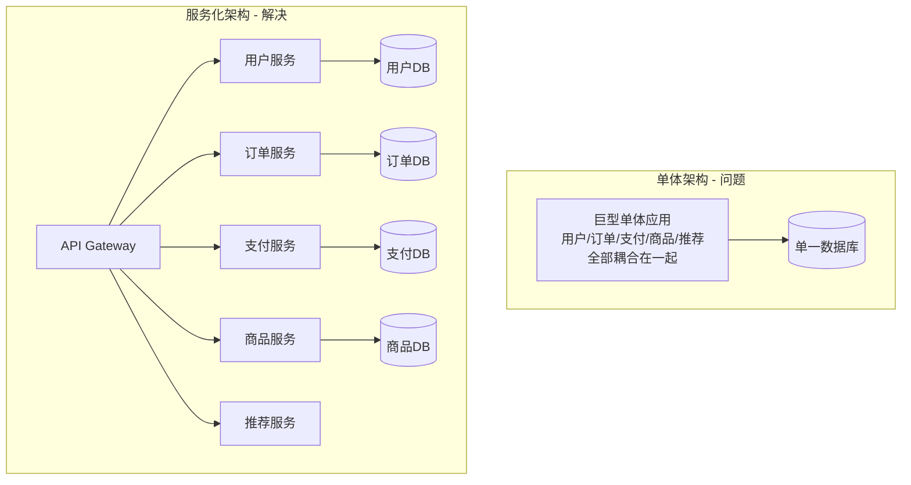
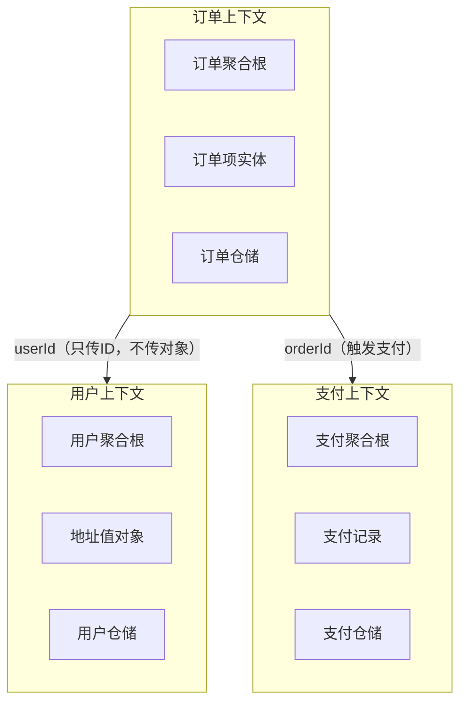
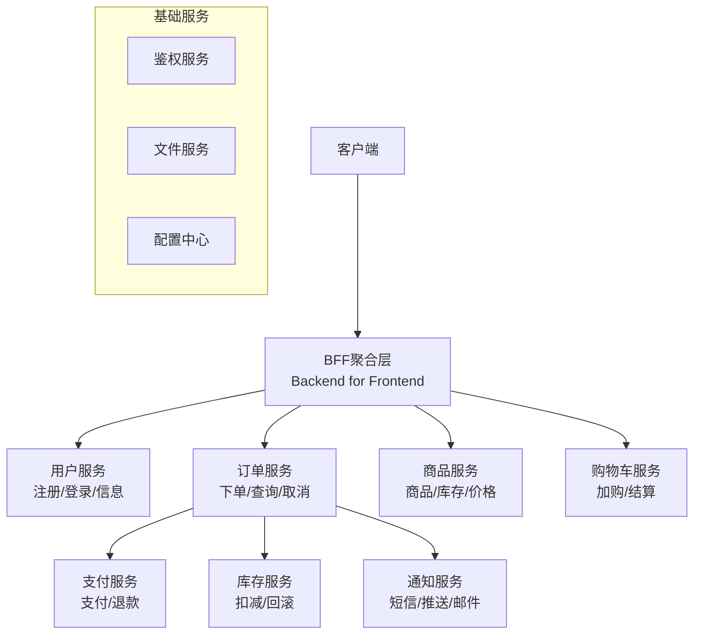
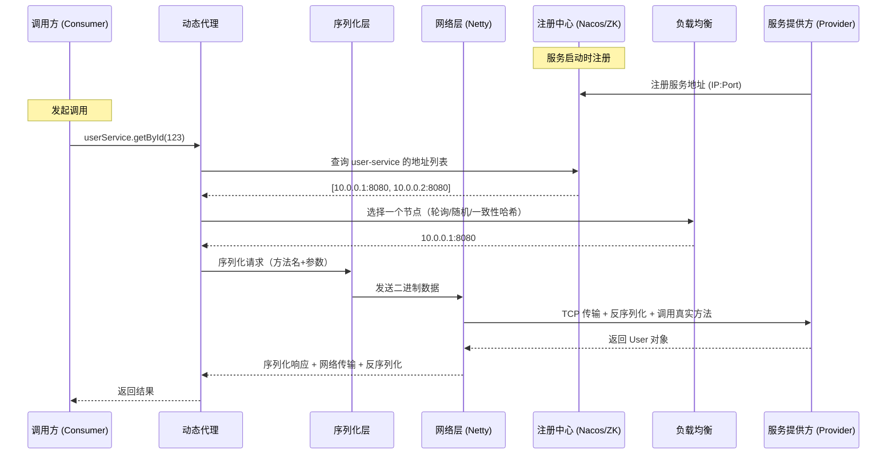
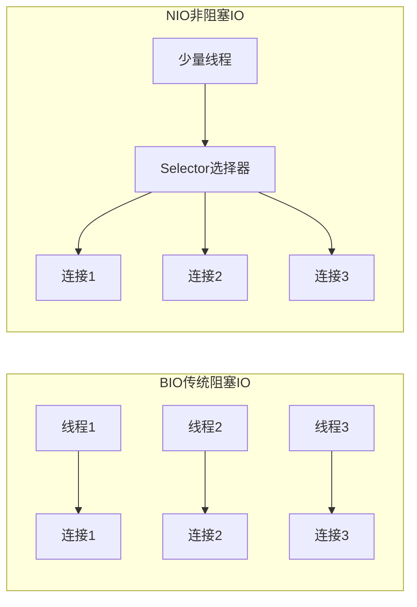
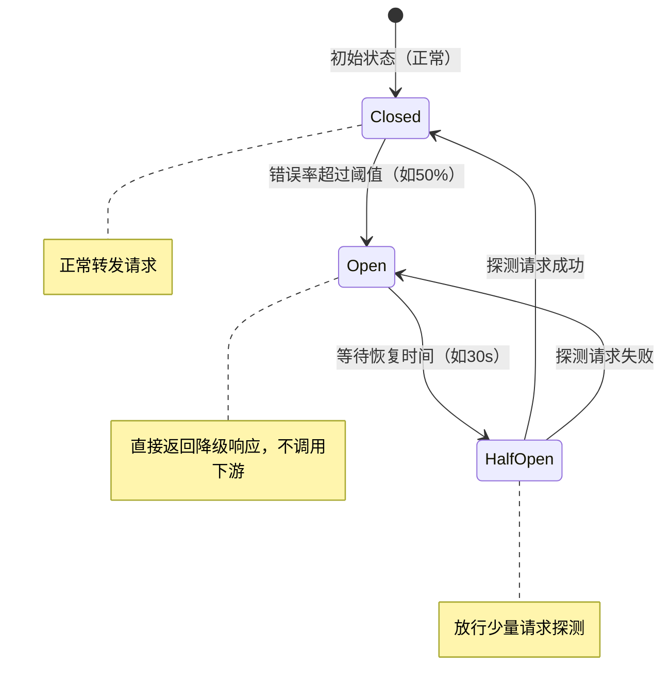
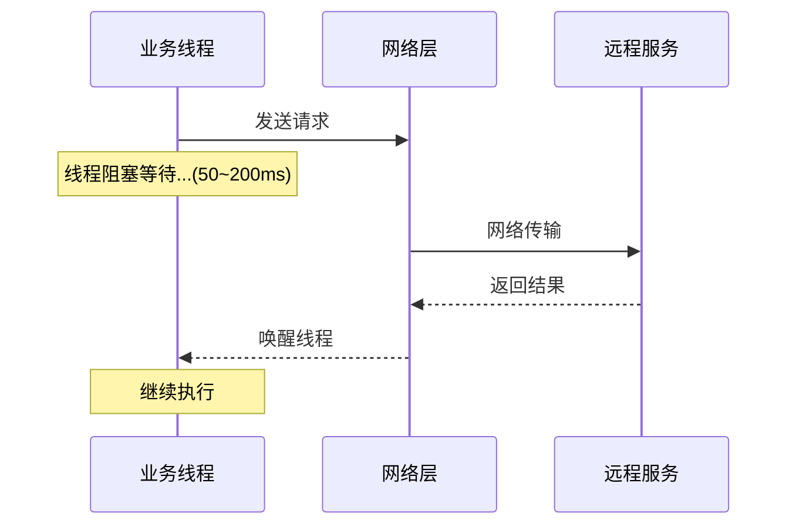
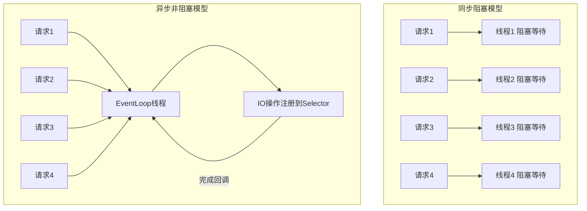

## 服务化与微服务

### 1. 互联网架构为什么要做服务化？

#### 单体架构的痛点

随着业务增长，单体应用会遇到以下问题：

- **部署风险高**：改一行代码需要重新部署整个应用，任何模块的 Bug 都可能导致全站宕机
- **扩展困难**：只有订单模块压力大，却不得不扩容整个应用
- **技术栈锁定**：所有模块必须用同一语言、同一框架
- **团队协作冲突**：多团队修改同一代码库，合并冲突频繁
- **启动慢**：应用越来越大，本地启动需要几分钟

#### 服务化前后对比



#### 服务化的五大价值

**① 解耦：服务独立开发部署**

每个服务有独立的代码仓库、独立的发布流程。支付团队上线新功能不需要等待推荐团队。

**② 复用：避免重复开发**

用户鉴权、短信发送、文件上传等通用能力封装为独立服务，所有业务服务直接调用，不再各自实现一套。

```java
// 没有服务化：每个模块各自实现短信发送（重复代码）
// OrderModule 有一套，UserModule 有一套

// 服务化后：统一调用短信服务
smsServiceClient.send(phone, content); // 所有模块复用同一服务
```

**③ 扩展：按需扩展特定服务**

大促期间只有订单服务和支付服务压力大，只需扩容这两个服务，其他服务保持不变，节省资源成本。

**④ 容错：故障隔离**

推荐服务挂了，不影响用户下单。通过熔断器（Circuit Breaker）隔离故障，防止级联雪崩。

**⑤ 技术异构：选择最合适的技术栈**

| 服务   | 技术选型                | 原因          |
| ---- | ------------------- | ----------- |
| 推荐服务 | Python + TensorFlow | AI/ML 生态更成熟 |
| 实时计算 | Go                  | 高并发低延迟      |
| 业务服务 | Java + Spring Boot  | 生态完善，团队熟悉   |
| 数据分析 | Scala + Spark       | 大数据处理       |

***

### 2. 微服务架构多"微"才合适？

#### 核心原则：按业务边界划分，而非技术层次

**错误的拆分方式（按技术层）：**

```
Controller 服务
Service 服务      ← 这不是微服务，这是把单体拆成了分布式单体
DAO 服务
```

**正确的拆分方式（按业务域）：**

```
用户域：注册、登录、个人信息
订单域：下单、取消、查询
支付域：支付、退款、对账
商品域：商品管理、库存、价格
```

#### DDD（领域驱动设计）划分服务边界

DDD 的核心概念：**限界上下文（Bounded Context）** — 每个上下文内部有自己的领域模型，上下文之间通过接口通信。



**关键原则**：上下文之间只传递 ID，不共享领域对象，不共享数据库表。

#### 服务粒度判断标准

| 维度   | 建议                | 说明             |
| ---- | ----------------- | -------------- |
| 团队规模 | 2-Pizza 团队（5\~9人） | 一个服务由一个小团队完全负责 |
| 代码规模 | 1\~3 万行           | 超过则考虑拆分        |
| 部署频率 | 能独立快速部署           | 每周可独立发布        |
| 数据库  | 独立数据库/Schema      | 不与其他服务共享表      |
| 变更频率 | 变更原因单一            | 符合单一职责原则       |

#### 过度拆分 vs 拆分不足

**过度拆分的症状：**

- 一个业务操作需要调用 5+ 个服务
- 服务之间循环依赖（A 调 B，B 调 A）
- 每个服务只有几百行代码
- 大量服务只被一个调用方使用

**拆分不足的症状：**

- 服务代码超过 10 万行
- 多个团队频繁修改同一服务
- 某个模块需要独立扩容但无法做到
- 发布一个小功能需要测试整个服务

#### 实战：电商系统服务划分示例



***

### 3. 为什么说要搞定微服务架构，先搞定RPC框架？

#### RPC 是微服务的血管

微服务拆分后，原来的本地方法调用变成了跨网络的远程调用。RPC（Remote Procedure Call，远程过程调用）框架让这个过程对开发者透明——调用远程服务就像调用本地方法一样。

```java
// 没有 RPC 框架：手写 HTTP 调用，繁琐且不统一
HttpClient client = HttpClient.newHttpClient();
HttpRequest request = HttpRequest.newBuilder()
    .uri(URI.create("http://user-service/api/users/" + userId))
    .build();
HttpResponse<String> response = client.send(request, BodyHandlers.ofString());
User user = objectMapper.readValue(response.body(), User.class);

// 有 RPC 框架（Dubbo）：像调用本地方法一样
@Reference
private UserService userService;  // 自动注入远程代理

User user = userService.getById(userId);  // 透明的远程调用
```

#### RPC 完整调用链路



#### RPC 五大核心能力

**① 序列化：高效数据传输**

网络只能传输字节流，需要将 Java 对象转换为字节，接收方再还原。

**② 网络通信：高性能 IO（Netty）**

Netty 基于 NIO（非阻塞 IO），一个线程可以处理数千个连接，远优于传统 BIO（一连接一线程）。



**③ 服务发现：动态路由**

服务实例动态上下线，调用方自动感知，无需手动配置 IP。

**④ 负载均衡：流量分发**

| 策略              | 原理           | 适用场景       |
| --------------- | ------------ | ---------- |
| 轮询（Round Robin） | 依次分发         | 服务器性能相近    |
| 随机（Random）      | 随机选择         | 简单场景       |
| 加权轮询            | 按权重分发        | 服务器性能不同    |
| 一致性哈希           | 相同参数路由到同一节点  | 有状态服务、缓存亲和 |
| 最少活跃连接          | 选择当前连接数最少的节点 | 请求耗时差异大    |

**⑤ 容错机制：熔断、降级、重试**



#### 主流 RPC 框架对比

| 框架                     | 公司       | 协议                | 注册中心            | 特点           |
| ---------------------- | -------- | ----------------- | --------------- | ------------ |
| Dubbo                  | 阿里       | Dubbo/Triple      | ZooKeeper/Nacos | Java 生态最成熟   |
| gRPC                   | Google   | HTTP/2 + Protobuf | 自定义             | 跨语言，高性能      |
| Spring Cloud OpenFeign | Pivotal  | HTTP/REST         | Eureka/Nacos    | Spring 生态集成好 |
| Thrift                 | Facebook | 自定义二进制            | 无内置             | 跨语言          |

***

### 4. 微服务架构之RPC-client序列化细节

#### 为什么序列化很重要

序列化性能直接影响 RPC 调用的整体性能。一次 RPC 调用中，序列化/反序列化的耗时可能占总耗时的 30%\~50%。

#### 四种主流序列化方案详解

**① JSON（Jackson / Gson / Fastjson）**

```java
// Jackson 序列化示例
ObjectMapper mapper = new ObjectMapper();

// 序列化：Java 对象 → JSON 字符串 → 字节数组
User user = new User(1L, "张三", 25);
byte[] bytes = mapper.writeValueAsBytes(user);
// 结果：{"id":1,"name":"张三","age":25}  约 30 字节

// 反序列化：字节数组 → Java 对象
User restored = mapper.readValue(bytes, User.class);
```

- **优点**：可读性好，跨语言，调试方便
- **缺点**：体积大（字段名重复传输），解析慢
- **适用**：对外 API、调试阶段、跨语言场景

**② Protobuf（Protocol Buffers）**

先定义 `.proto` 文件，再生成代码：

```protobuf
// user.proto
syntax = "proto3";
package com.example;

message User {
    int64 id = 1;
    string name = 2;
    int32 age = 3;
}
```

```java
// 生成的 Java 代码使用
User user = User.newBuilder()
    .setId(1L)
    .setName("张三")
    .setAge(25)
    .build();

byte[] bytes = user.toByteArray();
// 结果：约 10 字节（比 JSON 小 3 倍！）

User restored = User.parseFrom(bytes);
```

- **优点**：体积最小（字段用数字编号，不传字段名），速度最快，跨语言
- **缺点**：需要预先定义 schema，可读性差
- **适用**：高性能跨语言 RPC（gRPC 默认使用）

**③ Hessian**

```java
// Hessian 序列化（Dubbo 默认）
ByteArrayOutputStream bos = new ByteArrayOutputStream();
HessianOutput out = new HessianOutput(bos);
out.writeObject(user);
byte[] bytes = bos.toByteArray();

HessianInput in = new HessianInput(new ByteArrayInputStream(bytes));
User restored = (User) in.readObject();
```

- **优点**：比 JSON 体积小，支持复杂对象图（循环引用），Java 生态兼容好
- **缺点**：跨语言支持有限，性能不如 Kryo
- **适用**：Java 内部服务间通信（Dubbo 默认选择）

**④ Kryo**

```java
// Kryo 序列化（性能最高，但不跨语言）
// 注意：Kryo 非线程安全，使用 ThreadLocal 隔离
private static final ThreadLocal<Kryo> KRYO_LOCAL = ThreadLocal.withInitial(() -> {
    Kryo kryo = new Kryo();
    kryo.register(User.class);
    return kryo;
});

public byte[] serialize(User user) {
    Kryo kryo = KRYO_LOCAL.get();
    ByteArrayOutputStream bos = new ByteArrayOutputStream();
    Output output = new Output(bos);
    kryo.writeObject(output, user);
    output.flush();
    return bos.toByteArray();
    // 结果：约 8 字节（最小！）
}

public User deserialize(byte[] bytes) {
    Kryo kryo = KRYO_LOCAL.get();
    Input input = new Input(new ByteArrayInputStream(bytes));
    return kryo.readObject(input, User.class);
}
```

- **优点**：Java 生态中性能最高，体积最小
- **缺点**：只支持 Java，Kryo 非线程安全需要注意
- **适用**：Java 内部高性能场景（Spark 默认序列化）

#### 性能对比（序列化 100 万次 User 对象）

| 方案             | 序列化耗时  | 反序列化耗时 | 字节大小  |
| -------------- | ------ | ------ | ----- |
| JSON (Jackson) | 2800ms | 3200ms | 30 字节 |
| Hessian        | 1200ms | 1500ms | 18 字节 |
| Protobuf       | 400ms  | 350ms  | 10 字节 |
| Kryo           | 200ms  | 180ms  | 8 字节  |

#### 序列化的常见坑

**坑1：字段增删的兼容性**

```java
// 旧版本 User
public class User {
    private Long id;
    private String name;
}

// 新版本 User（新增字段）
public class User {
    private Long id;
    private String name;
    private Integer age;  // 新增字段
}

// JSON/Hessian：新增字段反序列化旧数据时 age=null，向前兼容
// Protobuf：字段编号不变则兼容，绝对不能修改已有字段的编号
// Kryo：默认不兼容，需开启 kryo.setRegistrationRequired(false)
```

**坑2：循环引用导致栈溢出**

```java
// 对象循环引用会导致 JSON 序列化栈溢出
public class Department {
    private List<Employee> employees;
}
public class Employee {
    private Department department;  // 循环引用！
}

// 解决方案：@JsonIgnore 断开循环
public class Employee {
    @JsonIgnore
    private Department department;
}
```

***

### 5. RPC-client异步收发核心细节

#### 同步调用的问题



**问题**：线程在等待网络 IO 期间完全阻塞，无法做其他事情。如果线程池有 200 个线程，下游服务响应慢时，200 个线程全部阻塞，新请求无法处理 → **线程池耗尽**。

#### 方案一：Future 模式

```java
// 发起异步调用，立即返回 Future（不阻塞）
CompletableFuture<User> future = userService.getUserAsync(userId);

// 在等待期间可以做其他事情
doOtherWork();

// 需要结果时再获取（此时可能已经完成，也可能还需等待）
User user = future.get(3, TimeUnit.SECONDS);  // 最多等3秒，超时抛异常
```

#### 方案二：Callback 回调

```java
// 回调模式：结果返回时自动触发回调函数
userService.getUserAsync(userId, new Callback<User>() {
    @Override
    public void onSuccess(User user) {
        processUser(user);
    }

    @Override
    public void onFailure(Throwable e) {
        log.error("获取用户失败", e);
    }
});
// 调用后立即返回，不阻塞
```

**缺点**：多个异步操作嵌套时形成"回调地狱"：

```java
// 回调地狱（难以维护）
userService.getUser(userId, user -> {
    orderService.getOrders(user.getId(), orders -> {
        paymentService.getPayments(orders.get(0).getId(), payments -> {
            // 嵌套越来越深...
        });
    });
});
```

#### 方案三：CompletableFuture（推荐）

CompletableFuture 是 Java 8 引入的异步编程利器，支持链式调用，解决回调地狱。

```java
// 链式异步调用（清晰易读）
CompletableFuture<OrderDetailVO> result =
    CompletableFuture.supplyAsync(() -> userService.getUser(userId))
    .thenComposeAsync(user ->
        CompletableFuture.supplyAsync(() -> orderService.getOrders(user.getId()))
    )
    .thenApply(orders -> buildOrderDetailVO(orders))
    .exceptionally(e -> {
        log.error("查询失败", e);
        return OrderDetailVO.empty();
    });

// 并行执行多个异步任务（比串行快很多）
CompletableFuture<User> userFuture =
    CompletableFuture.supplyAsync(() -> userService.getUser(userId));
CompletableFuture<List<Order>> orderFuture =
    CompletableFuture.supplyAsync(() -> orderService.getOrders(userId));
CompletableFuture<Address> addressFuture =
    CompletableFuture.supplyAsync(() -> addressService.getDefault(userId));

// 等待三个任务全部完成
CompletableFuture.allOf(userFuture, orderFuture, addressFuture).join();

// 总耗时 ≈ max(三个任务耗时)，而非三者之和
User user = userFuture.get();
List<Order> orders = orderFuture.get();
Address address = addressFuture.get();
```

**串行 vs 并行耗时对比：**

```
串行调用（总耗时 300ms）：
[获取用户 100ms] → [获取订单 100ms] → [获取地址 100ms]

并行调用（总耗时 100ms）：
[获取用户 100ms]
[获取订单 100ms]  ← 三个同时执行
[获取地址 100ms]
```

#### 方案四：Reactive 响应式编程（Project Reactor）

适用于高并发、流式数据处理场景（如 Spring WebFlux）。

```java
// Project Reactor 示例（Spring WebFlux）
@GetMapping("/user/{id}/profile")
public Mono<UserProfileVO> getUserProfile(@PathVariable Long id) {
    Mono<User> userMono = userService.findById(id);
    Mono<List<Order>> ordersMono = orderService.findByUserId(id);

    // 并行获取，合并结果，全程非阻塞
    return Mono.zip(userMono, ordersMono)
        .map(tuple -> new UserProfileVO(tuple.getT1(), tuple.getT2()))
        .onErrorReturn(UserProfileVO.empty());
    // 一个线程可以处理数千个并发请求
}
```

#### 异步模型线程对比



#### 四种方案选型建议

| 方案                | 代码复杂度 | 性能 | 适用场景        |
| ----------------- | ----- | -- | ----------- |
| 同步调用              | 最低    | 低  | 并发量低，逻辑简单   |
| Future            | 低     | 中  | 需要等待结果，偶尔并行 |
| CompletableFuture | 中     | 高  | 多个异步任务编排，推荐 |
| Reactive          | 高     | 最高 | 超高并发，流式处理   |

> **实践建议**：大多数业务场景用 CompletableFuture 就够了。Reactive 学习曲线陡峭，只在真正需要极致吞吐量时引入。

***

