## 消息系统

---

### 1. HTTP 如何像 TCP 一样实时收消息？

#### 1.1 问题背景

HTTP 是"请求-响应"模型，天生是**客户端主动、服务端被动**。而 IM、通知、行情等场景需要**服务端主动推送**，HTTP 原生不支持这种模式。

#### 1.2 四种解决方案

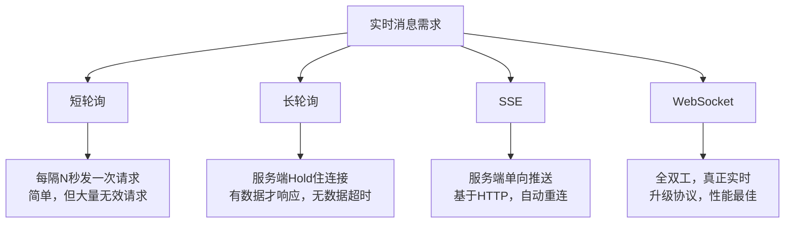

---

**方案一：短轮询（Short Polling）**

```
客户端每隔N秒发一次请求，无论有没有新消息都返回。

Client ──GET /messages──► Server ──"无新消息"──► Client
  (1秒后)
Client ──GET /messages──► Server ──"无新消息"──► Client
  (1秒后)
Client ──GET /messages──► Server ──"有新消息!"──► Client
```

```javascript
// 前端实现
setInterval(() => {
    fetch('/api/messages/poll')
        .then(res => res.json())
        .then(data => { if (data.messages.length > 0) render(data.messages); });
}, 1000);
```

**缺点：** 大量无效请求，服务器压力大，消息有延迟（最大N秒）

---

**方案二：长轮询（Long Polling / Comet）**

```
客户端发请求，服务端Hold住连接（不立即返回），直到有新消息或超时才响应。

Client ──GET /poll──────────────────────────────────► Server
                                  (服务器等待有消息)
Client ◄──"新消息来了!"──────────────────────────────  Server
Client ──立刻再发GET /poll──────────────────────────► Server
```

```java
// Spring Boot 长轮询实现（DeferredResult）
@GetMapping("/poll")
public DeferredResult<List<Message>> poll(@RequestParam String userId) {
    DeferredResult<List<Message>> result = new DeferredResult<>(30_000L); // 30秒超时
    // 将result存起来，有消息时触发
    messageHolder.put(userId, result);
    result.onTimeout(() -> result.setResult(Collections.emptyList()));
    return result;
}

// 有新消息时触发
public void pushMessage(String userId, Message msg) {
    DeferredResult<List<Message>> result = messageHolder.remove(userId);
    if (result != null) result.setResult(List.of(msg));
}
```

**优点：** 相比短轮询减少无效请求，消息实时性更好
**缺点：** 服务端需要保持大量悬挂连接，内存消耗大

---

**方案三：SSE（Server-Sent Events）**

服务端到客户端的**单向**持久化推送，基于 HTTP，自带断线重连。

```java
// Spring Boot SSE
@GetMapping(value = "/sse", produces = MediaType.TEXT_EVENT_STREAM_VALUE)
public SseEmitter sse(@RequestParam String userId) {
    SseEmitter emitter = new SseEmitter(Long.MAX_VALUE);
    sseClients.put(userId, emitter);
    emitter.onCompletion(() -> sseClients.remove(userId));
    return emitter;
}

// 推送消息
public void push(String userId, String data) throws IOException {
    SseEmitter emitter = sseClients.get(userId);
    if (emitter != null) {
        emitter.send(SseEmitter.event().data(data).id(String.valueOf(System.currentTimeMillis())));
    }
}
```

```javascript
// 前端
const es = new EventSource('/sse?userId=123');
es.onmessage = (e) => console.log('收到消息:', e.data);
es.onerror = () => { /* 自动重连 */ };
```

---

**方案四：WebSocket（推荐）**

HTTP 协议升级，建立**全双工**持久连接，双方都可随时发送数据。

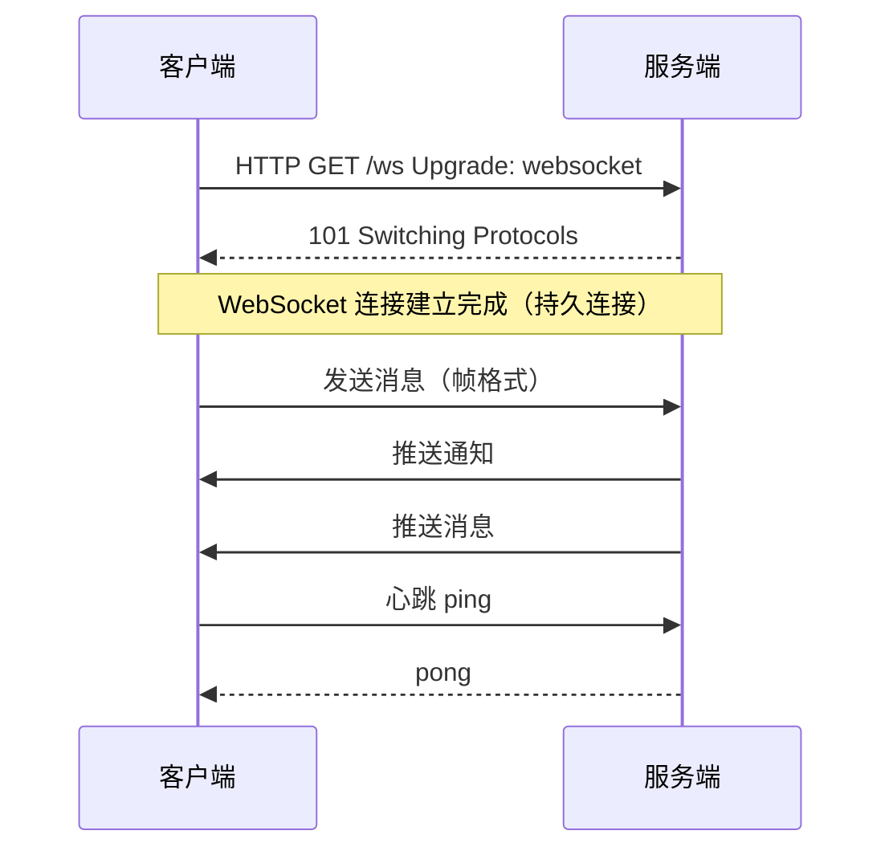

```java
// Spring Boot WebSocket
@Component
public class ChatHandler extends TextWebSocketHandler {
    private final Map<String, WebSocketSession> sessions = new ConcurrentHashMap<>();

    @Override
    public void afterConnectionEstablished(WebSocketSession session) {
        String userId = getUser(session);
        sessions.put(userId, session);
    }

    @Override
    protected void handleTextMessage(WebSocketSession session, TextMessage message) throws Exception {
        // 处理并广播消息
        sessions.values().forEach(s -> {
            try { s.sendMessage(message); } catch (IOException e) { /* 处理异常 */ }
        });
    }
}
```

#### 1.3 四种方案对比

| 方案 | 实时性 | 服务端压力 | 双向通信 | 适用场景 |
|------|--------|-----------|---------|---------|
| 短轮询 | 低（秒级延迟） | 高 | 支持 | 低实时性需求 |
| 长轮询 | 中（毫秒~秒） | 中 | 支持 | 消息量少，兼容性要求高 |
| SSE | 高 | 低 | 仅服务端→客户端 | 通知、行情推送 |
| WebSocket | 极高 | 低 | 全双工 | IM、游戏、协同编辑 |

---

### 2. 微信为什么不丢消息？

#### 2.1 消息投递可靠性模型

消息系统的可靠性目标：**At-Least-Once**（至少一次投递）+ 接收方去重 = **Exactly-Once**（恰好一次）

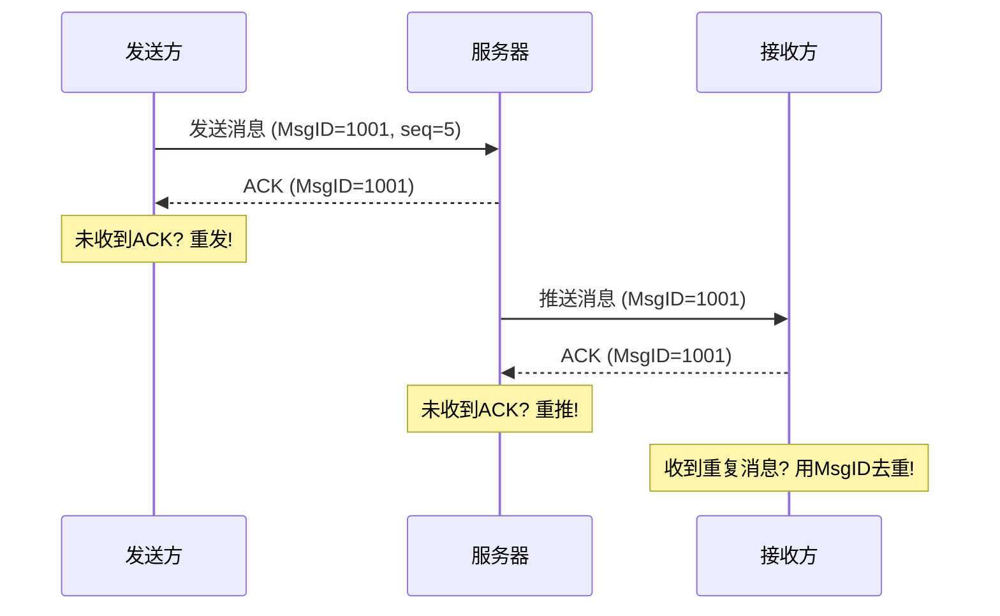

#### 2.2 四层保障机制

**1. 消息唯一ID**
```
每条消息分配全局唯一ID（如雪花算法生成），用于：
- 接收方去重：收到相同ID的消息直接丢弃
- 消息追踪：定位问题
- 幂等处理：确保消息只处理一次
```

**2. ACK + 重传机制**
```
发送方流程：
发送消息 → 等待ACK → 超时未收到? → 重发（最多N次）→ N次后报失败

接收方流程：
收到消息 → 写入存储 → 回复ACK
         → ACK发送失败 → 发送方重发 → 接收方用MsgID去重
```

**3. 消息持久化**
```
消息不仅发给在线用户，还要写入服务器存储（MySQL/HBase）：
- 保证对方离线也能收到（离线消息）
- 数据不在服务器内存中，重启不丢失
- 多端漫游读取
```

**4. 序列号（seq）机制**
```
每个用户维护一个单调递增的消息序列号（seq）：
- 客户端记录最大已收seq
- 上线时告诉服务器：我的最大seq=N，请给我N+1之后的消息
- 服务器补发缺失的消息

这样即使网络闪断，也能在重连后补回所有缺失消息。
```

#### 2.3 微信的 SYNC 协议

微信使用的是"拉取同步"模型（而非纯推送）：

```
1. 服务器收到消息 → 给接收方发一个"你有新消息"的通知（很小）
2. 接收方收到通知 → 主动调用 Sync 接口拉取完整消息
3. 这样即使通知丢了，客户端定时心跳也会触发 Sync
```

---

### 3. 微信为啥不丢"离线消息"？

#### 3.1 离线消息存储架构

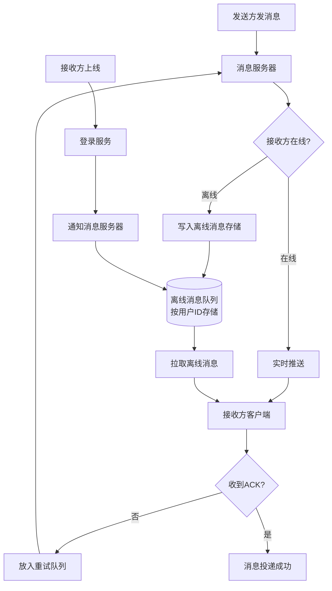

#### 3.2 关键实现细节

**离线消息的存储结构：**
```
用户离线消息表（以 userId + seq 为索引）：

┌──────────┬─────┬─────────┬──────────────┬──────────────┐
│ user_id  │ seq │ msg_id  │ content      │ expire_time  │
├──────────┼─────┼─────────┼──────────────┼──────────────┤
│ user_123 │  51 │ msg_001 │ "你好"        │ 2026-05-25  │
│ user_123 │  52 │ msg_002 │ "在吗？"      │ 2026-05-25  │
│ user_456 │  10 │ msg_003 │ "周末聚餐"    │ 2026-05-25  │
└──────────┴─────┴─────────┴──────────────┴──────────────┘
```

**上线拉取流程：**
```
1. 客户端登录，携带本地最大seq（如50）
2. 服务器查询 seq > 50 的所有离线消息
3. 分批下发（防止消息太多一次性占用大量带宽）
4. 客户端每批确认，服务器逐步删除已确认的离线消息
5. 全部确认后完成同步
```

**离线消息容量限制：**
```
离线消息通常有上限（如3天、5000条），超出后：
- 超时的消息自动过期删除
- 超数量限制时删除最老的消息
- 客户端显示"消息太多，部分消息已过期"
```

#### 3.3 APNs / FCM 离线推送

用户手机 App 被杀进程后，依赖系统级推送通道：

```
iOS：APNs（Apple Push Notification service）
Android：FCM（Firebase Cloud Messaging）/ 厂商通道（华为、小米、OPPO）

流程：
微信服务器 → APNs服务器 → iOS系统 → 唤醒微信 → 微信拉取离线消息
                         ↑
                   用户设备离线时消息在APNs排队
```

---

### 4. 群消息如何做到不丢不重？

#### 4.1 核心挑战

群消息比单聊复杂得多：
- 一条消息要投递给 N 个群成员（N 可能是几千甚至几万）
- 每个成员可能在线/离线/多端
- 需要保证所有人都收到，且只收到一次

#### 4.2 扩散写 vs 扩散读

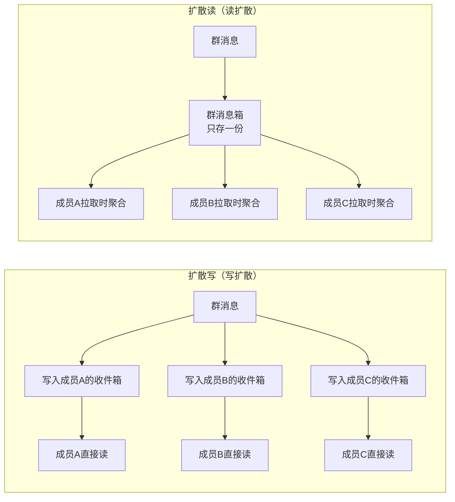

| 对比维度 | 扩散写 | 扩散读 |
|---------|--------|--------|
| 存储成本 | 高（N倍冗余） | 低（只存一份） |
| 读取性能 | 高（直接读自己收件箱） | 低（需聚合多个群） |
| 实时性 | 高 | 中 |
| 适合群规模 | 小群（<500人） | 大群（>500人） |

**微信的实际策略：**
- 普通群（≤200人）：扩散写，性能好
- 大群（>200人）：扩散读，节省存储

#### 4.3 群消息不丢不重实现

**不丢：**
```
1. 消息写入群消息存储后才ACK发送方
2. 每个成员维护独立的已读seq
3. 服务器推送 + ACK，未ACK则重推
4. 成员上线拉取未读消息（通过seq对齐）
```

**不重（去重）：**
```
1. 每条群消息有全局唯一MsgID
2. 客户端维护已处理MsgID集合（或通过seq判断）
3. 收到重复MsgID，直接丢弃不展示

seq示例：
群里消息的全局seq：1, 2, 3, 4, 5...
A的已读seq=3，B的已读seq=5
A上线拉取：seq > 3 的消息 → 得到4、5
```

#### 4.4 已读/未读计数实现

```
群未读数 = 群最大seq - 该成员已读seq

存储结构：
group_read_table:
┌──────────┬──────────┬──────────┐
│ group_id │ user_id  │ read_seq │
├──────────┼──────────┼──────────┤
│  grp_001 │ user_A   │   50     │ ← A已读到50
│  grp_001 │ user_B   │   47     │ ← B有3条未读
└──────────┴──────────┴──────────┘

群当前最大seq = 50
B的未读数 = 50 - 47 = 3
```

---

### 5. QQ 状态同步究竟是推还是拉？

#### 5.1 在线状态的挑战

QQ联系人列表可能有几百个好友，每个好友都有在线状态（在线/离线/隐身/Q我吧...），状态随时变化。如果用纯推送，每次状态变化都推给所有好友，流量和性能开销极大。

#### 5.2 推拉结合方案

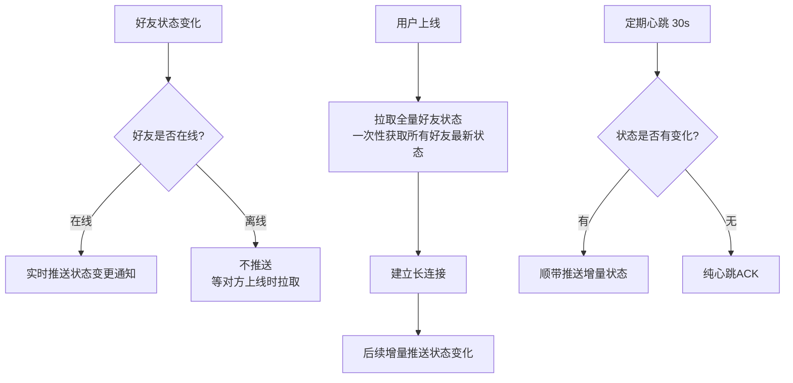

**上线时（全量拉）：**
```
登录 → 拉取好友列表 → 批量查询所有好友的在线状态 → 一次性展示
好处：只查一次，避免N次推送的积压
```

**在线时（增量推）：**
```
好友A上线 → 服务器知道与A有共同好友B、C、D → 推送"A上线"给B、C、D
好友A下线 → 同理推送"A下线"
```

**心跳兼顾状态同步：**
```
客户端每30秒发一次心跳：
- 告知服务器"我还活着"
- 顺带携带本地状态版本号
- 服务器返回有差异的状态变更（增量）
```

#### 5.3 状态存储设计

```
在线状态存储在 Redis（高性能，支持过期）：

HSET user:status:123  status  "online"
                      device  "iPhone"
                      last_active  "1716004000"

设置过期时间（如5分钟）：心跳定期刷新TTL，超时自动标记离线
```

---

### 6. 微信多点登录与 QQ 消息漫游架构

#### 6.1 多端登录策略对比

| 产品 | 策略 | 说明 |
|------|------|------|
| QQ | 允许多端同时在线 | 手机、PC、Web 同时收消息 |
| 微信 | 手机+PC/Web 二选一 | 手机优先，PC登录需手机扫码确认 |
| 微信（新版） | 允许多端 | 但消息同步策略不同 |

#### 6.2 多端消息同步架构

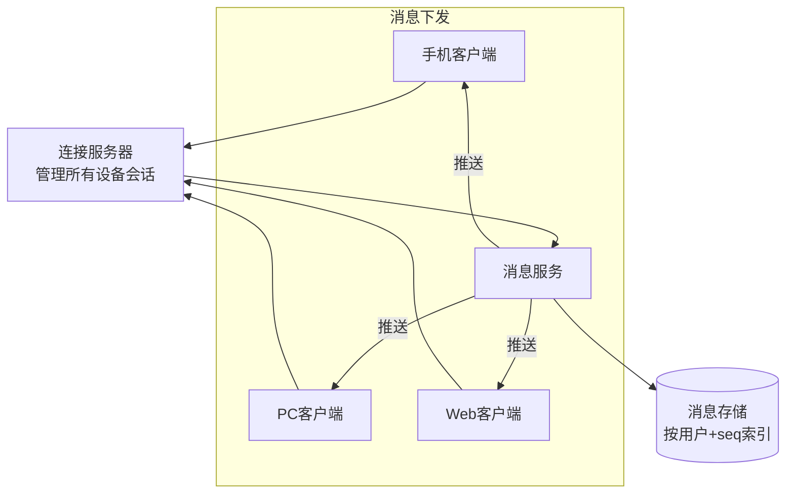

**消息同步规则：**
```
1. 新消息到来 → 推送到该用户所有在线设备

2. 设备A已读消息 → 通知服务器已读seq=N
                 → 服务器推送"已读N"给设备B、C
                 → 设备B、C标记相同消息为已读

3. 设备B下线后上线 → 拉取 seq > 本地最大seq 的消息
```

#### 6.3 消息漫游

```
消息漫游 = 消息保存在服务端，可以在任意新设备上查看历史消息

存储分层：
┌─────────────────────────────────────────────────────┐
│  热存储（Redis）：最近3天的消息，访问速度快             │
├─────────────────────────────────────────────────────┤
│  温存储（MySQL/TiDB）：最近3个月，按需加载             │
├─────────────────────────────────────────────────────┤
│  冷存储（HBase/对象存储）：3个月以上，异步归档          │
└─────────────────────────────────────────────────────┘

用户拉取历史消息时：
- 优先从热存储读（快）
- 热存储没有则查温存储
- 再没有则从冷存储异步加载（可能需要等待）
```

---

### 7. 消息"时序"与"一致性"为何这么难？

#### 7.1 问题来源

```
场景：用户A和B同时给用户C发消息

A 发送："你好" (时间戳 10:00:00.100)
B 发送："在吗" (时间戳 10:00:00.050)

但由于网络延迟，服务器先收到A的消息：
服务器收到："你好" → seq=1
服务器收到："在吗" → seq=2

C看到的顺序：
  [1] 你好
  [2] 在吗

而实际发送时序应该是：
  [1] 在吗  （B先发）
  [2] 你好  （A后发）
```

时序问题的根本原因：**分布式系统中没有全局统一的物理时钟**（NTP误差可达几毫秒到几十毫秒）。

#### 7.2 逻辑时钟（Lamport Clock）

由 Leslie Lamport 提出，不依赖物理时钟，通过**事件因果关系**定义顺序。

**规则：**
```
1. 每个节点维护一个本地计数器 t
2. 每发生一个事件，t++
3. 发送消息时，附带当前 t
4. 收到消息时，t = max(本地t, 消息t) + 1
```

```
节点A: t=0          节点B: t=0

A发消息(t=1) ──────► B收到，t=max(0,1)+1=2
A: t=1               B: t=2

             B发消息(t=3) ──► A收到，t=max(1,3)+1=4
             B: t=3           A: t=4
```

**局限：** Lamport时钟只能判断"A发生在B之前"，不能判断"A和B并发"。

#### 7.3 向量时钟（Vector Clock）

每个节点维护一个**向量**，记录所有节点的逻辑时间，可以准确判断并发。

```
系统有3个节点 A、B、C，向量格式：[A的时间, B的时间, C的时间]

初始状态：A=[0,0,0], B=[0,0,0], C=[0,0,0]

A发生事件: A=[1,0,0]
A→B发消息: B=[1,1,0]（合并取最大值，B自己+1）
B→C发消息: C=[1,1,1]

判断规则：
  向量a < 向量b：a的每个分量都 ≤ b的对应分量（且至少有一个<）→ a先发生
  向量a 和 b 无法比较 → 并发事件
```

#### 7.4 实际系统中的解法

**方案一：服务器端统一定序**
```
所有消息经过同一个 Sequencer 服务，分配全局递增 seq，以此为准。
缺点：Sequencer 是单点，需要高可用。
```

**方案二：客户端时间戳 + 服务器修正**
```
客户端发送时携带本地时间戳，服务器收到后：
1. 记录服务器接收时间（server_time）
2. 用 server_time 作为排序依据
3. 客户端显示时用 server_time 排序
```

**方案三：雪花ID（Snowflake）**
```
Twitter Snowflake 生成的ID天然有序：
64位 = 1位符号 + 41位毫秒时间戳 + 10位机器ID + 12位序列号

相同毫秒内也能生成有序ID（最多4096个/毫秒/机器）
ID越大 = 时间越晚，可以直接用ID排序消息
```

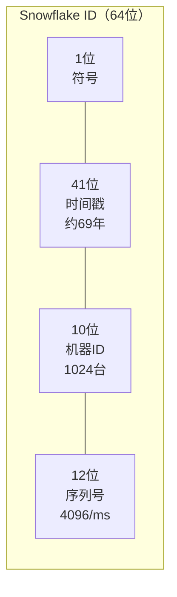

---

### 8. 通用实时消息平台架构设计

#### 8.1 整体架构

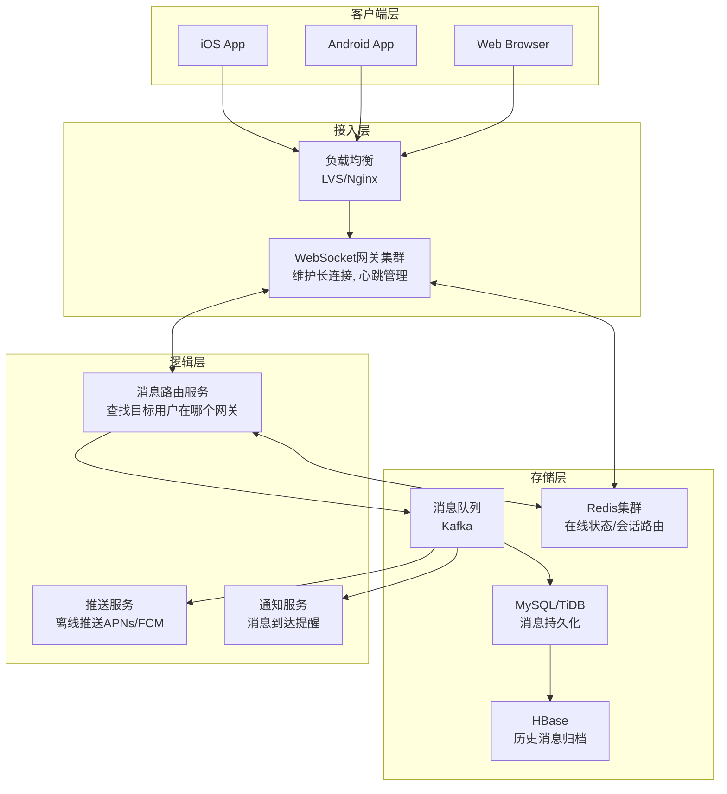

#### 8.2 各层职责详解

**接入层（WebSocket网关）：**
```
- 维护客户端长连接（每台机器可维持10万+连接）
- 管理心跳（检测客户端存活）
- 连接信息注册到 Redis：userId → gatewayIP:port
- 将消息转发给逻辑层，不处理业务逻辑
```

**消息路由服务：**
```
路由规则存储在 Redis：
SET user:gateway:userA  "gateway-01:8080"
SET user:gateway:userB  "gateway-02:8080"

投递流程：
1. 收到发给B的消息
2. 查 Redis：B在 gateway-02
3. 通过内部RPC调用 gateway-02，让它把消息推给B
4. B不在线：消息写入离线存储
```

**消息队列（Kafka）的作用：**
```
消息写入Kafka（持久化），多个消费者并行处理：
- 消费者1：写入MySQL（持久化存储）
- 消费者2：推送到在线用户
- 消费者3：离线推送（APNs/FCM）
- 消费者4：更新未读计数

好处：解耦，各模块独立扩展，Kafka保证消息不丢
```

---

### 9. 微信为啥这么省流量？

#### 9.1 协议层优化：Protobuf 替代 JSON

```
JSON（文本协议）：
{"userId":12345,"content":"你好","timestamp":1716004000}
大小：约55字节

Protobuf（二进制协议）：
同样内容编码后约 15-20 字节
压缩率约 60-70%

原因：
- JSON包含字段名（"userId"、"content"等），Protobuf用字段编号代替
- JSON是文本，数字也用字符串表示；Protobuf用二进制编码
```

```protobuf
// Protobuf 定义
message ChatMessage {
    int64 user_id = 1;    // 字段名不传输，只传字段编号1
    string content = 2;
    int64 timestamp = 3;
}
```

#### 9.2 数据压缩

```
文本消息：先Protobuf序列化，再gzip压缩
图片/视频：
  - 发送时压缩（降分辨率、降质量）
  - 接收时按需加载（先显示缩略图，点击才加载原图）
  - 相同图片只存一份（MD5去重），发送只传哈希值
```

#### 9.3 增量同步（Delta Sync）

```
不传全量，只传变化量：

联系人信息：
  - 第一次登录：下载全量联系人
  - 后续登录：只同步上次登录后的变更
  - 服务端记录每个用户的数据版本号（version），客户端上传本地version，服务端只返回更新的部分
```

#### 9.4 图片/视频智能压缩策略

```
发送图片时：
1. 客户端压缩（按网络质量动态调整压缩率）
   - WiFi: 发原图或轻压缩
   - 4G:   中等压缩
   - 2G/弱网: 强压缩
2. 服务器存储多个版本（原图、缩略图、中图）
3. 接收时，根据当前网络质量选择合适版本

视频：发送前强制压缩，聊天列表只显示封面图，播放时才流式加载
```

#### 9.5 连接复用 & 心跳优化

```
问题：心跳包过于频繁也会耗流量和电量

微信心跳策略（动态心跳）：
- 默认心跳间隔：300秒（5分钟）
- 网络不稳定时缩短到 30s
- 后台运行时延长到 600s
- 结合系统推送通道（APNs/FCM），App 在后台不维持长连接
```

---

### 10. 应用层/安全层/传输层协议选型

#### 10.1 协议栈全景

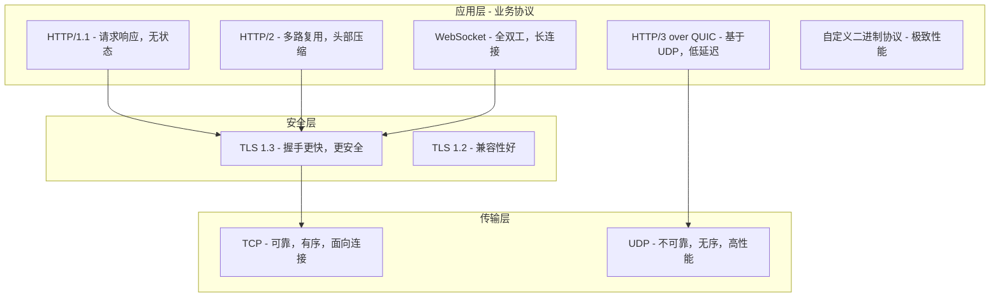

#### 10.2 各层选型指南

**传输层选择：**

| 选TCP的场景 | 选UDP的场景 |
|------------|------------|
| 文件传输（完整性要求高） | 视频通话（实时性 > 完整性） |
| 网页浏览（内容必须完整） | 游戏（低延迟，可丢帧） |
| IM消息（不能丢） | DNS查询（小包，一次性） |
| 支付交易（绝对可靠） | 音频流（少量丢包可接受） |

**安全层选择：**
```
统一用 TLS 1.3（最新版本）：
- 握手从 2-RTT 减少到 1-RTT（首次），0-RTT（会话恢复）
- 废弃了不安全的加密算法（RSA密钥交换、RC4等）
- 前向安全（Perfect Forward Secrecy）：每次会话独立密钥，历史流量无法解密

移动端注意：证书固定（Certificate Pinning）防止中间人攻击
```

**应用层选择：**

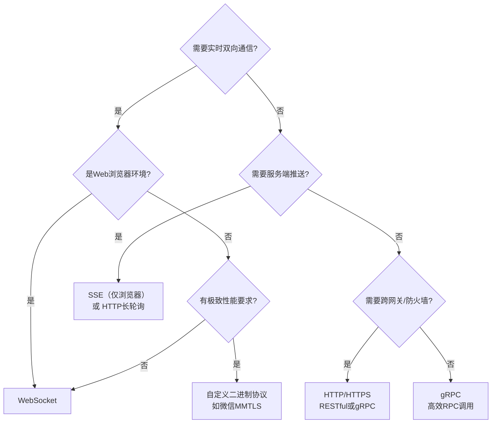

#### 10.3 IM 系统推荐协议栈

```
手机端 IM：
  传输层：TCP（消息可靠）
  安全层：TLS 1.3
  应用层：自定义二进制协议（如Protobuf over WebSocket）

音视频通话：
  传输层：UDP（低延迟优先）
  可靠性：SRTP（安全实时传输协议）自带重传和纠错
  安全层：DTLS（UDP版本的TLS）

跨防火墙（企业IM）：
  走 WebSocket（基于HTTP，通常防火墙不拦截）
  端口443（HTTPS端口，几乎不被封锁）
```

---

### 11. 库存扣多了，到底怎么整

#### 11.1 问题复现（超卖场景）

```
库存剩余：1
并发两个请求同时进来：

时刻T1: 请求A查询库存 → 结果=1
时刻T2: 请求B查询库存 → 结果=1
时刻T3: 请求A判断 1>0，可以购买 → 执行UPDATE stock=stock-1 → 库存=0
时刻T4: 请求B判断 1>0，可以购买 → 执行UPDATE stock=stock-1 → 库存=-1 ← 超卖！

根本原因：查询和扣减不是原子操作
```

#### 11.2 方案一：数据库行锁（悲观锁）

```sql
-- 开启事务，SELECT FOR UPDATE 锁定行
BEGIN;
SELECT stock FROM products WHERE id = 1 FOR UPDATE;  -- 加行锁，其他事务等待

-- Java代码判断
-- if (stock > 0) {
UPDATE products SET stock = stock - 1 WHERE id = 1;
-- }

COMMIT;  -- 提交，释放锁
```

```
时刻T1: 请求A: SELECT FOR UPDATE → 获得锁，stock=1
时刻T2: 请求B: SELECT FOR UPDATE → 等待锁
时刻T3: 请求A: UPDATE stock=0，COMMIT，释放锁
时刻T4: 请求B: 获得锁，stock=0 → 判断不可购买，ROLLBACK
```

**优点：** 实现简单，完全防超卖
**缺点：** 数据库压力大，并发高时大量请求阻塞

#### 11.3 方案二：乐观锁（版本号）

```sql
-- 查询时不加锁
SELECT stock, version FROM products WHERE id = 1;
-- 假设 stock=10, version=5

-- 更新时带上version，如果version变了说明被别人改过，更新失败
UPDATE products
SET stock = stock - 1, version = version + 1
WHERE id = 1 AND version = 5 AND stock > 0;
-- 影响行数=0 表示被抢先了，需要重试
```

```java
public boolean deductStock(long productId) {
    for (int retry = 0; retry < 3; retry++) {
        Product p = productMapper.selectById(productId);
        if (p.getStock() <= 0) return false;
        int rows = productMapper.updateWithVersion(productId, p.getVersion());
        if (rows > 0) return true; // 扣减成功
        // rows==0: 被别人抢先，重试
    }
    return false; // 重试N次后失败
}
```

**优点：** 无锁等待，并发高
**缺点：** 高并发下大量重试，CPU浪费；适合读多写少场景

#### 11.4 方案三：Redis 原子操作

```lua
-- Lua脚本保证原子性（Redis单线程执行Lua）
local stock = tonumber(redis.call('get', KEYS[1]))
if stock == nil then
    return -1  -- key不存在
end
if stock <= 0 then
    return 0   -- 库存不足
end
redis.call('decr', KEYS[1])  -- 原子减1
return 1  -- 扣减成功
```

```java
// Spring Data Redis 执行Lua脚本
DefaultRedisScript<Long> script = new DefaultRedisScript<>(luaScript, Long.class);
Long result = redisTemplate.execute(script, List.of("stock:product:1"));
if (result == 1) {
    // 扣减成功，异步写入数据库（最终一致性）
    mqTemplate.sendMessage(new StockDeductEvent(productId));
}
```

**优点：** 性能极高，Redis单线程无锁竞争
**缺点：** Redis挂了怎么办（持久化+主从）；需要保证Redis和DB最终一致性

#### 11.5 方案四：消息队列串行化

```
所有库存扣减请求写入 MQ（单分区）→ 消费者单线程处理 → 天然串行

用户请求 → 写入Kafka（单partition） → 消费者 → 查库存 → 扣减 → 返回结果

优点：彻底串行化，不会超卖
缺点：延迟增大（需要等队列处理），用户体验差；适合异步场景
```

#### 11.6 方案选型建议

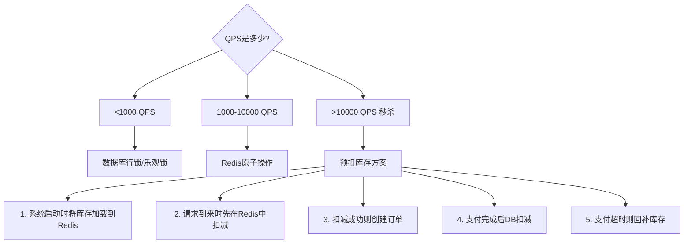

---

### 12. 库存扣减完整方案对比

#### 12.1 预扣库存（秒杀标准方案）

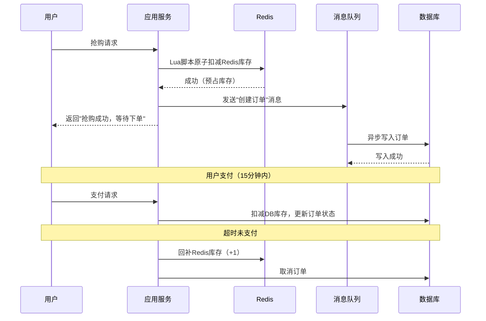

#### 12.2 四种方案完整对比

| 方案 | 原理 | 性能 | 一致性 | 实现复杂度 | 适用场景 |
|------|------|------|--------|-----------|---------|
| SELECT FOR UPDATE | 数据库行锁 | 低 | 强 | 简单 | 低并发 |
| 乐观锁（version） | CAS思想 | 中 | 强 | 简单 | 读多写少 |
| Redis DECR + Lua | 原子操作 | 高 | 最终 | 中 | 高并发 |
| 预扣+MQ+DB | 分层处理 | 极高 | 最终 | 复杂 | 秒杀 |

---

### 13. CAS 在分布式 ID 生成方案上的应用

#### 13.1 CAS 原理

CAS（Compare And Swap，比较并交换）是一种**无锁（Lock-Free）**并发算法，由硬件层面的原子指令支持（x86下是`CMPXCHG`指令）。

```
CAS(内存地址, 期望值, 新值) 操作语义：
  if (*addr == expected) {
      *addr = newValue;
      return true;   // 更新成功
  } else {
      return false;  // 更新失败（已被别人修改）
  }

关键：上面的判断+赋值是原子操作，不可被中断
```

#### 13.2 Java 中的 CAS

```java
// AtomicLong 基于 CAS 实现的线程安全计数器
AtomicLong counter = new AtomicLong(0);

// getAndIncrement() 的底层逻辑（伪代码）：
public long getAndIncrement() {
    long current, next;
    do {
        current = get();          // 读取当前值
        next = current + 1;       // 计算新值
    } while (!compareAndSet(current, next));  // CAS失败则重试
    return current;
}

// 应用：无锁ID生成器
public class LocalIdGenerator {
    private final AtomicLong sequence = new AtomicLong(0);
    public long nextId() {
        return sequence.incrementAndGet();
    }
}
```

#### 13.3 分布式 ID 生成方案

**方案一：UUID**
```java
String id = UUID.randomUUID().toString(); // e.g., "550e8400-e29b-41d4-a716-446655440000"
// 优点：无需中心节点，本地生成
// 缺点：无序（索引性能差），太长（36字符），不含时间信息
```

**方案二：数据库自增 + CAS**
```sql
-- 号段模式：一次从DB取一段ID（如1000个），在内存中用AtomicLong分发
UPDATE id_generator SET max_id = max_id + step, version = version + 1
WHERE biz_tag = 'order' AND version = #{currentVersion}
-- version充当CAS的expected值，防止并发多取
```

```java
// 美团Leaf号段模式示意
class Segment {
    AtomicLong value = new AtomicLong(0); // 当前值
    long max;   // 最大值
    int step;   // 步长
}
// 当前号段用完时（value >= max），触发从DB取下一段
// 双Buffer：提前异步加载下一个号段，切换时无需等待
```

**方案三：雪花算法（Snowflake）**
```java
public class SnowflakeIdGenerator {
    private static final long EPOCH = 1609459200000L; // 2021-01-01起始时间戳
    private static final int WORKER_BITS = 10;    // 机器ID位数（1024台机器）
    private static final int SEQUENCE_BITS = 12;  // 序列号位数（4096/ms）

    private final long workerId;
    private long lastTimestamp = -1L;
    private long sequence = 0L;

    public synchronized long nextId() {
        long now = System.currentTimeMillis();
        if (now == lastTimestamp) {
            sequence = (sequence + 1) & 0xFFF; // 12位，超出则等待下一毫秒
            if (sequence == 0) now = waitNextMillis(lastTimestamp);
        } else {
            sequence = 0;
        }
        lastTimestamp = now;
        return ((now - EPOCH) << (WORKER_BITS + SEQUENCE_BITS))
             | (workerId << SEQUENCE_BITS)
             | sequence;
    }
}
```

**方案对比：**

| 方案 | 有序 | 性能 | 依赖 | 位数 | 适用场景 |
|------|------|------|------|------|---------|
| UUID | 否 | 极高 | 无 | 128位 | 分布式，无序场景 |
| 数据库自增 | 是 | 低 | 数据库 | 任意 | 小规模 |
| 号段模式 | 是 | 高 | 数据库（批量） | 任意 | 中大规模 |
| 雪花算法 | 趋势递增 | 极高 | 无（需机器ID） | 64位 | 中大规模 |
| Redis INCR | 是 | 高 | Redis | 任意 | 高并发 |

---

### 14. CAS 下 ABA 问题及优化方案

#### 14.1 ABA 问题详解

```
场景：栈顶指针操作

初始状态：栈 top → A → B → null

线程1：读取 top=A，准备用CAS将top从A改为B（弹出A）
       （线程1被挂起）

线程2：弹出A（top=B）
       弹出B（top=null）
       推入新节点A（top=A，但这是新的A，内容可能不同）

线程1：恢复，CAS检查 top==A？是！（但这个A已经是新对象了）
       执行 top=B，但B已经被弹出并可能被回收！→ 悬挂指针/数据错误

ABA的本质：
  线程1看到的A→B→A变化，最终值和初始值相同，但中间发生了修改
  CAS只比较"值"，无法感知中间的变化过程
```

#### 14.2 解决方案一：版本号（AtomicStampedReference）

```java
// AtomicStampedReference = 值 + 版本号（stamp）
AtomicStampedReference<String> ref = new AtomicStampedReference<>("A", 0);

// 读取当前值和版本号
int[] stampHolder = new int[1];
String current = ref.get(stampHolder);  // current="A", stamp=0

// CAS：不仅比较值，还比较版本号
boolean success = ref.compareAndSet(
    "A",           // 期望值
    "B",           // 新值
    stampHolder[0], // 期望版本号（0）
    stampHolder[0] + 1 // 新版本号（1）
);

// 即使值从A→B→A，版本号会从0→1→2，CAS会失败
// 因为期望版本号是0，但实际已经是2
```

#### 14.3 解决方案二：标记引用（AtomicMarkableReference）

```java
// 只用一个boolean标记（不需要完整版本号时用这个）
AtomicMarkableReference<Node> head = new AtomicMarkableReference<>(node, false);

// 标记为"待删除"（逻辑删除），而不是直接物理删除
head.compareAndSet(node, node, false, true); // 标记为true=已删除
```

#### 14.4 解决方案三：不可变对象 + GC

```
Java的GC机制天然解决了部分ABA问题：
- 对象A被弹出后，如果线程1持有引用，GC不会回收它
- 推入新的A时，会创建新对象，内存地址不同
- 如果比较的是对象引用（地址），则ABA不会发生

但对于原始类型（int/long），仍然存在ABA问题 → 需要版本号
```

#### 14.5 CAS 的三大问题总结

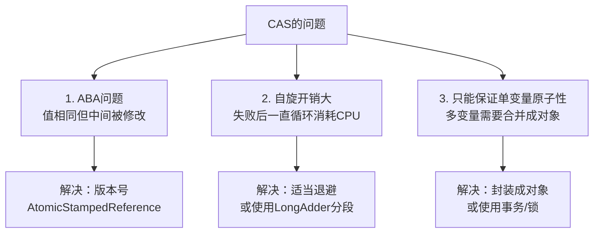

**LongAdder vs AtomicLong：**
```
AtomicLong：单个变量，高并发下大量CAS失败重试，自旋严重

LongAdder：分段计数（Cell数组），每个线程操作不同的槽，减少竞争
           求和时将所有槽累加 → 高并发计数场景性能提升10倍+

// 适用场景：
AtomicLong → 需要精确读取当前值（如ID生成）
LongAdder  → 只关心累计总数（如统计请求次数）
```
