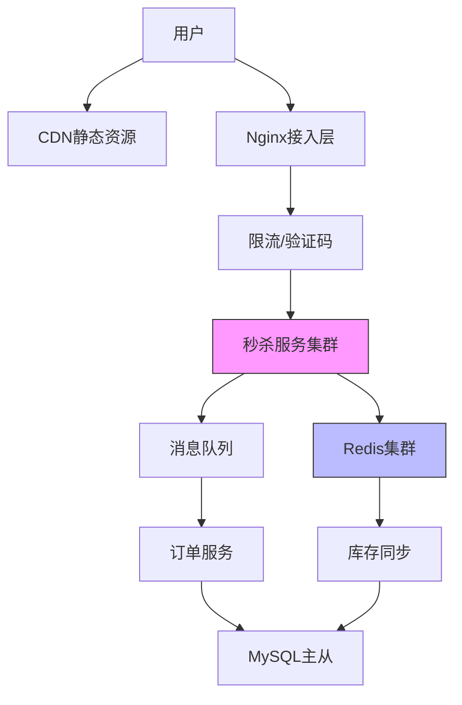
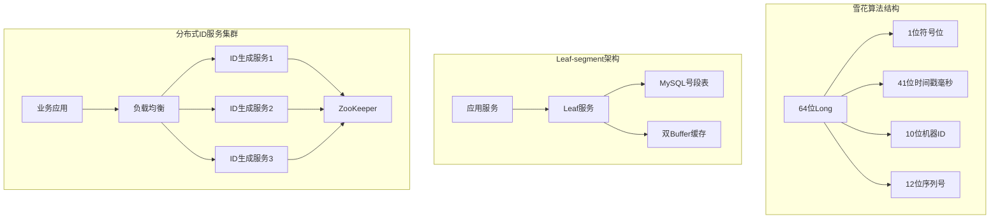
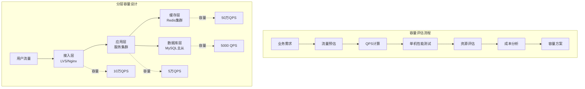
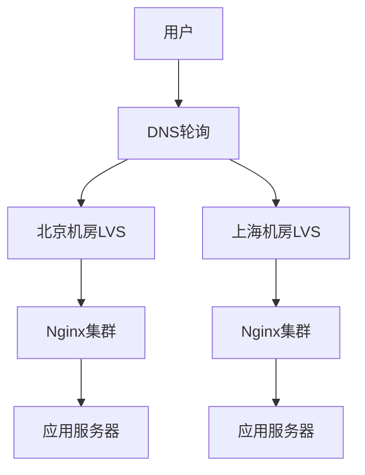
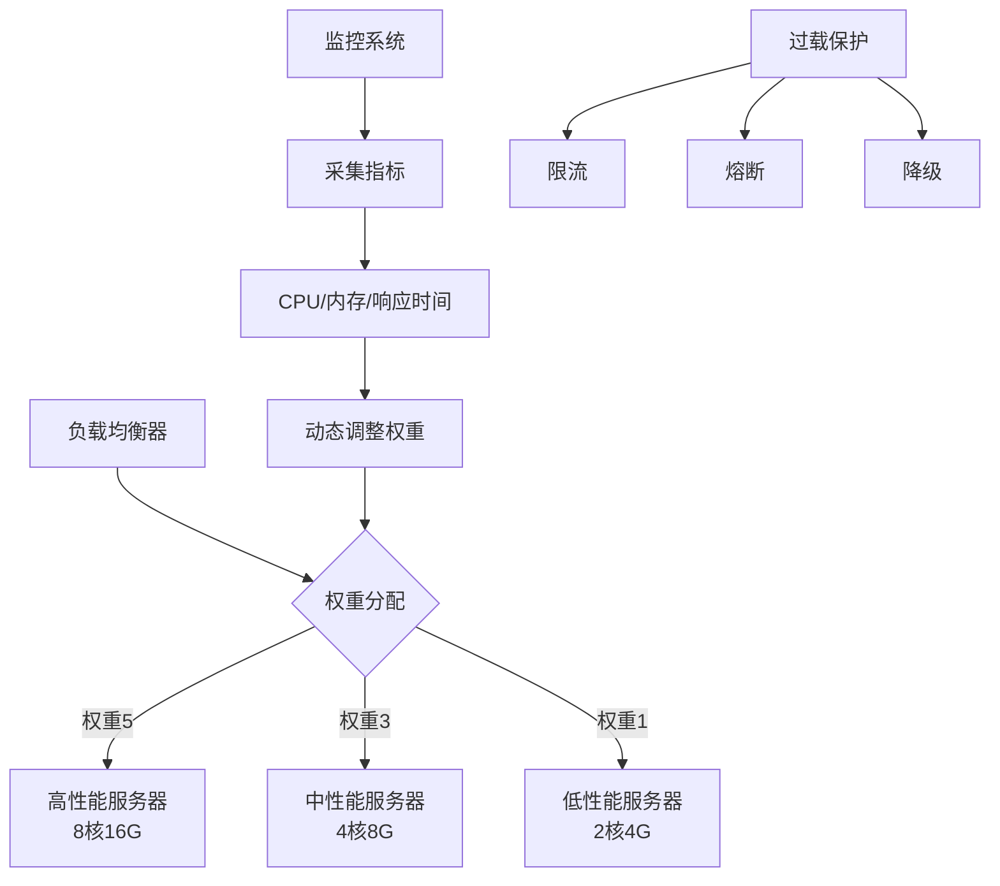
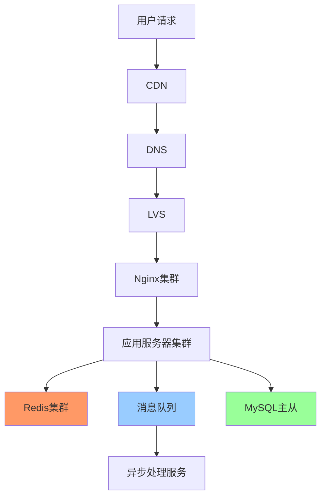
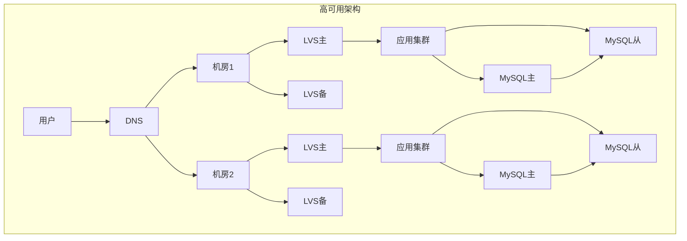
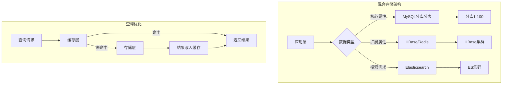
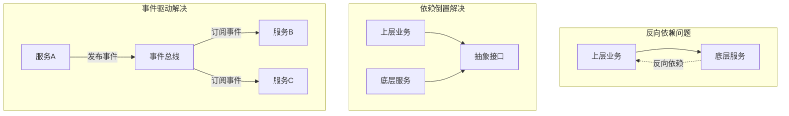
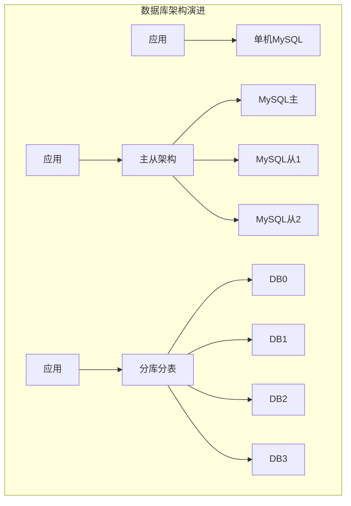

## 通用设计与方法论

### 1. 架构 秒杀系统优化思路

**问题分析：**

秒杀系统面临的核心挑战是在极短时间内处理海量并发请求，典型场景下可能有数百万用户同时抢购少量商品（如100件）。主要技术难点包括：

- 瞬时高并发：QPS可能达到平时的100-1000倍
- 读多写少：大量用户查询，极少数成功下单
- 库存超卖：并发扣减库存容易出现数据不一致
- 系统雪崩：流量洪峰可能压垮整个系统
- 黄牛党：恶意刷单、机器人抢购

**解决方案：**

**1. 前端优化层**

- 页面静态化：商品详情页CDN缓存，减少动态请求
- 按钮控制：倒计时结束前禁用按钮，防止提前请求
- 答题验证码：增加人机识别，防止机器刷单
- 限流：前端限制同一用户重复点击频率

**2. 接入层优化**

- Nginx限流：使用limit\_req模块限制单IP请求频率
- 动静分离：静态资源走CDN，动态请求走应用服务器
- 负载均衡：LVS/Nginx多层负载，分散流量

**3. 服务层优化**

- 异步化：秒杀请求异步处理，快速返回
- 削峰填谷：消息队列缓冲请求，平滑处理
- 限流降级：超过阈值直接返回"已售罄"
- 热点隔离：秒杀服务独立部署，不影响正常业务

**4. 数据层优化**

- Redis预减库存：内存操作，性能极高
- 库存分段：将100件库存分成10段，减少锁竞争
- 数据库兜底：Redis扣减成功后异步写DB
- 乐观锁：使用版本号防止超卖

**架构设计：**



**代码实现：**

```java
@Service
public class SeckillService {
    
    @Autowired
    private RedisTemplate<String, Object> redisTemplate;
    
    @Autowired
    private RabbitTemplate rabbitTemplate;
    
    /**
     * 秒杀接口 - Redis预减库存
     */
    public SeckillResult doSeckill(Long userId, Long productId) {
        // 1. 防重复购买
        String userKey = "seckill:user:" + productId + ":" + userId;
        Boolean hasOrdered = redisTemplate.hasKey(userKey);
        if (Boolean.TRUE.equals(hasOrdered)) {
            return SeckillResult.fail("您已经参与过该商品的秒杀");
        }
        
        // 2. Redis预减库存（原子操作）
        String stockKey = "seckill:stock:" + productId;
        Long stock = redisTemplate.opsForValue().decrement(stockKey);
        
        if (stock == null || stock < 0) {
            // 库存不足，恢复库存
            redisTemplate.opsForValue().increment(stockKey);
            return SeckillResult.fail("商品已售罄");
        }
        
        // 3. 标记用户已参与
        redisTemplate.opsForValue().set(userKey, "1", 24, TimeUnit.HOURS);
        
        // 4. 异步创建订单（发送MQ消息）
        SeckillMessage message = new SeckillMessage(userId, productId);
        rabbitTemplate.convertAndSend("seckill.exchange", "seckill.order", message);
        
        return SeckillResult.success("排队中，请稍后查看订单");
    }
    
    /**
     * 初始化库存到Redis
     */
    public void initStock(Long productId, Integer stock) {
        String stockKey = "seckill:stock:" + productId;
        redisTemplate.opsForValue().set(stockKey, stock);
    }
}

/**
 * 订单消费者 - 异步处理订单
 */
@Component
public class SeckillOrderConsumer {
    
    @Autowired
    private OrderService orderService;
    
    @Autowired
    private StockService stockService;
    
    @RabbitListener(queues = "seckill.order.queue")
    public void handleOrder(SeckillMessage message) {
        try {
            // 1. 数据库乐观锁扣减库存
            boolean success = stockService.decreaseStock(message.getProductId());
            
            if (!success) {
                log.warn("库存扣减失败: {}", message);
                return;
            }
            
            // 2. 创建订单
            orderService.createOrder(message.getUserId(), message.getProductId());
            
        } catch (Exception e) {
            log.error("订单处理失败", e);
            // 补偿：恢复Redis库存
            String stockKey = "seckill:stock:" + message.getProductId();
            redisTemplate.opsForValue().increment(stockKey);
        }
    }
}

/**
 * 库存服务 - 乐观锁扣减
 */
@Service
public class StockService {
    
    @Autowired
    private StockMapper stockMapper;
    
    public boolean decreaseStock(Long productId) {
        // 使用乐观锁，version字段防止超卖
        int affected = stockMapper.decreaseStock(productId);
        return affected > 0;
    }
}
```

```sql
-- 库存表设计
CREATE TABLE seckill_stock (
    id BIGINT PRIMARY KEY AUTO_INCREMENT,
    product_id BIGINT NOT NULL UNIQUE,
    stock INT NOT NULL DEFAULT 0,
    version INT NOT NULL DEFAULT 0,
    created_at TIMESTAMP DEFAULT CURRENT_TIMESTAMP,
    updated_at TIMESTAMP DEFAULT CURRENT_TIMESTAMP ON UPDATE CURRENT_TIMESTAMP,
    INDEX idx_product_id (product_id)
) ENGINE=InnoDB;

-- 乐观锁扣减库存
UPDATE seckill_stock 
SET stock = stock - 1, version = version + 1
WHERE product_id = #{productId} 
  AND stock > 0 
  AND version = #{version};
```

```nginx
# Nginx限流配置
http {
    # 限制每个IP每秒最多10个请求
    limit_req_zone $binary_remote_addr zone=seckill:10m rate=10r/s;
    
    server {
        location /api/seckill {
            limit_req zone=seckill burst=20 nodelay;
            proxy_pass http://seckill_backend;
        }
    }
}
```

**最佳实践：**

1. **分层防护**：前端、接入层、服务层、数据层多层限流，层层过滤无效请求
2. **库存分段**：将库存分成多个段，减少Redis单key的竞争热点
3. **异步处理**：秒杀请求快速返回，订单创建异步化，提升用户体验
4. **降级预案**：准备降级开关，流量过大时直接返回"已售罄"
5. **监控告警**：实时监控QPS、错误率、库存数，及时发现问题
6. **压测验证**：上线前必须进行全链路压测，验证系统容量
7. **防刷策略**：验证码、设备指纹、行为分析多维度防止黄牛

**性能指标：**

- 支持10万+QPS
- 99%请求响应时间<100ms
- 零超卖
- 系统可用性99.99%

***

### 2. 架构 细聊分布式ID生成方法

**问题分析：**

分布式系统中，传统的数据库自增ID无法满足需求，因为：

- 多数据库实例：无法保证全局唯一性
- 高并发场景：数据库自增成为性能瓶颈
- 分库分表：需要全局唯一ID来标识数据
- 业务需求：可能需要ID有序、包含时间信息、不暴露业务量

分布式ID需要满足的特性：

- 全局唯一性：绝对不能重复
- 高性能：生成速度快，支持高并发
- 高可用：服务稳定，不能成为单点
- 趋势递增：方便MySQL索引，提升查询性能
- 信息安全：不暴露业务规模（可选）

**解决方案：**

**方案1：UUID**

- 优点：本地生成，性能极高，实现简单
- 缺点：36位字符串，占用空间大；无序，影响MySQL索引性能；不包含业务信息

**方案2：数据库自增ID**

- 单机：使用MySQL的AUTO\_INCREMENT
- 多机：设置不同的起始值和步长（如机器1从1开始步长3，机器2从2开始步长3）
- 优点：简单，ID递增
- 缺点：数据库压力大，扩展性差，存在单点风险

**方案3：Redis INCR**

- 利用Redis的INCR原子操作生成ID
- 优点：性能高（10万+QPS），实现简单
- 缺点：依赖Redis，需要持久化防止重启后ID重复

**方案4：雪花算法（Snowflake）**

- Twitter开源的分布式ID生成算法
- 64位Long型ID = 1位符号位 + 41位时间戳 + 10位机器ID + 12位序列号
- 优点：高性能、趋势递增、包含时间信息、不依赖第三方
- 缺点：依赖机器时钟，时钟回拨会导致ID重复

**方案5：美团Leaf**

- Leaf-segment：数据库号段模式，批量获取ID
- Leaf-snowflake：优化的雪花算法，解决时钟回拨问题
- 优点：高可用、高性能、支持容灾

**方案6：百度UidGenerator**

- 基于雪花算法改进
- 使用RingBuffer预生成ID，提升性能
- 优点：性能极高（600万+QPS），解决时钟回拨

**架构设计：**



**代码实现：**

```java
/**
 * 雪花算法实现
 */
public class SnowflakeIdGenerator {
    
    // 起始时间戳 (2020-01-01)
    private final long twepoch = 1577808000000L;
    
    // 机器ID所占位数
    private final long workerIdBits = 5L;
    private final long datacenterIdBits = 5L;
    
    // 序列号所占位数
    private final long sequenceBits = 12L;
    
    // 机器ID最大值 31
    private final long maxWorkerId = -1L ^ (-1L << workerIdBits);
    private final long maxDatacenterId = -1L ^ (-1L << datacenterIdBits);
    
    // 序列号最大值 4095
    private final long sequenceMask = -1L ^ (-1L << sequenceBits);
    
    // 位移量
    private final long workerIdShift = sequenceBits;
    private final long datacenterIdShift = sequenceBits + workerIdBits;
    private final long timestampLeftShift = sequenceBits + workerIdBits + datacenterIdBits;
    
    private long workerId;
    private long datacenterId;
    private long sequence = 0L;
    private long lastTimestamp = -1L;
    
    public SnowflakeIdGenerator(long workerId, long datacenterId) {
        if (workerId > maxWorkerId || workerId < 0) {
            throw new IllegalArgumentException("Worker ID 超出范围");
        }
        if (datacenterId > maxDatacenterId || datacenterId < 0) {
            throw new IllegalArgumentException("Datacenter ID 超出范围");
        }
        this.workerId = workerId;
        this.datacenterId = datacenterId;
    }
    
    public synchronized long nextId() {
        long timestamp = timeGen();
        
        // 时钟回拨检测
        if (timestamp < lastTimestamp) {
            throw new RuntimeException(
                String.format("时钟回拨，拒绝生成ID %d 毫秒", lastTimestamp - timestamp));
        }
        
        // 同一毫秒内
        if (lastTimestamp == timestamp) {
            sequence = (sequence + 1) & sequenceMask;
            // 序列号溢出
            if (sequence == 0) {
                timestamp = tilNextMillis(lastTimestamp);
            }
        } else {
            sequence = 0L;
        }
        
        lastTimestamp = timestamp;
        
        // 组装ID
        return ((timestamp - twepoch) << timestampLeftShift)
                | (datacenterId << datacenterIdShift)
                | (workerId << workerIdShift)
                | sequence;
    }
    
    private long tilNextMillis(long lastTimestamp) {
        long timestamp = timeGen();
        while (timestamp <= lastTimestamp) {
            timestamp = timeGen();
        }
        return timestamp;
    }
    
    private long timeGen() {
        return System.currentTimeMillis();
    }
}

/**
 * Leaf-segment 号段模式
 */
@Service
public class LeafSegmentService {
    
    @Autowired
    private LeafAllocMapper leafAllocMapper;
    
    // 双Buffer缓存
    private Map<String, SegmentBuffer> cache = new ConcurrentHashMap<>();
    
    public Long getId(String bizTag) {
        SegmentBuffer buffer = cache.get(bizTag);
        if (buffer == null) {
            buffer = new SegmentBuffer();
            cache.put(bizTag, buffer);
        }
        
        return getIdFromBuffer(buffer, bizTag);
    }
    
    private Long getIdFromBuffer(SegmentBuffer buffer, String bizTag) {
        while (true) {
            buffer.rLock().lock();
            try {
                Segment segment = buffer.getCurrent();
                
                // 检查是否需要加载下一个号段
                if (!buffer.isNextReady() && 
                    segment.getIdle() < segment.getStep() * 0.9) {
                    // 异步加载下一个号段
                    loadNextSegment(buffer, bizTag);
                }
                
                long value = segment.getValue().getAndIncrement();
                if (value < segment.getMax()) {
                    return value;
                }
                
            } finally {
                buffer.rLock().unlock();
            }
            
            // 切换到下一个号段
            waitAndSwitchSegment(buffer);
        }
    }
    
    private void loadNextSegment(SegmentBuffer buffer, String bizTag) {
        // 从数据库获取号段
        LeafAlloc alloc = leafAllocMapper.updateAndGet(bizTag);
        
        Segment next = buffer.getSegments()[buffer.nextPos()];
        next.setValue(new AtomicLong(alloc.getMaxId() - alloc.getStep()));
        next.setMax(alloc.getMaxId());
        next.setStep(alloc.getStep());
        
        buffer.setNextReady(true);
    }
    
    private void waitAndSwitchSegment(SegmentBuffer buffer) {
        buffer.wLock().lock();
        try {
            buffer.switchPos();
            buffer.setNextReady(false);
        } finally {
            buffer.wLock().unlock();
        }
    }
}

/**
 * Redis INCR方案
 */
@Service
public class RedisIdGenerator {
    
    @Autowired
    private RedisTemplate<String, String> redisTemplate;
    
    public Long generateId(String bizKey) {
        String key = "id:generator:" + bizKey;
        Long id = redisTemplate.opsForValue().increment(key);
        
        // 设置过期时间，防止key无限增长
        if (id == 1) {
            redisTemplate.expire(key, 1, TimeUnit.DAYS);
        }
        
        return id;
    }
    
    /**
     * 批量获取ID，减少网络开销
     */
    public List<Long> generateIds(String bizKey, int count) {
        String key = "id:generator:" + bizKey;
        Long endId = redisTemplate.opsForValue().increment(key, count);
        
        List<Long> ids = new ArrayList<>(count);
        for (long i = endId - count + 1; i <= endId; i++) {
            ids.add(i);
        }
        return ids;
    }
}
```

```sql
-- Leaf号段表设计
CREATE TABLE leaf_alloc (
    biz_tag VARCHAR(128) NOT NULL COMMENT '业务标识',
    max_id BIGINT NOT NULL DEFAULT 1 COMMENT '当前最大ID',
    step INT NOT NULL COMMENT '步长',
    description VARCHAR(256) COMMENT '描述',
    update_time TIMESTAMP NOT NULL DEFAULT CURRENT_TIMESTAMP ON UPDATE CURRENT_TIMESTAMP,
    PRIMARY KEY (biz_tag)
) ENGINE=InnoDB;

-- 更新并获取号段
UPDATE leaf_alloc 
SET max_id = max_id + step 
WHERE biz_tag = #{bizTag};

SELECT biz_tag, max_id, step 
FROM leaf_alloc 
WHERE biz_tag = #{bizTag};
```

**最佳实践：**

1. **选型建议**：
   - 小规模系统：Redis INCR，简单高效
   - 中大规模系统：雪花算法或Leaf-segment
   - 超大规模系统：百度UidGenerator或自研方案
2. **雪花算法优化**：
   - 时钟回拨处理：记录最后时间戳，回拨时等待或拒绝
   - 机器ID管理：使用ZooKeeper自动分配，避免手动配置
   - 预生成：使用RingBuffer提前生成ID，提升性能
3. **高可用保障**：
   - 服务集群部署，避免单点故障
   - 号段模式使用双Buffer，无缝切换
   - 监控ID生成速率，及时发现异常
4. **性能优化**：
   - 批量获取ID，减少网络开销
   - 本地缓存号段，减少数据库访问
   - 异步加载下一个号段，避免阻塞
5. **安全考虑**：
   - 不要直接暴露ID给用户，使用业务编号映射
   - 敏感业务使用随机ID，防止遍历攻击

**方案对比：**

| 方案           | 性能 | 复杂度 | 依赖    | 有序性  | 适用场景     |
| ------------ | -- | --- | ----- | ---- | -------- |
| UUID         | 极高 | 低   | 无     | 无序   | 不需要有序的场景 |
| 数据库自增        | 低  | 低   | MySQL | 有序   | 小规模系统    |
| Redis INCR   | 高  | 低   | Redis | 有序   | 中小规模系统   |
| 雪花算法         | 极高 | 中   | 无     | 趋势递增 | 大规模分布式系统 |
| Leaf-segment | 高  | 中   | MySQL | 趋势递增 | 需要高可用的系统 |
| UidGenerator | 极高 | 高   | 无     | 趋势递增 | 超高并发系统   |

***

### 3. 互联网架构，如何进行容量设计？

**问题分析：**

容量设计是架构设计的核心环节，目的是确保系统能够支撑预期的业务量，同时避免资源浪费。容量设计不足会导致系统崩溃，过度设计则造成成本浪费。

容量设计需要考虑的维度：

- 业务量预估：日活用户、QPS、数据量增长
- 性能指标：响应时间、吞吐量、并发数
- 资源评估：CPU、内存、磁盘、网络带宽
- 冗余设计：高峰期、突发流量、容灾备份
- 成本控制：资源利用率、扩容成本

**解决方案：**

**1. 容量评估方法论**

**步骤1：业务量预估**

- 日活用户（DAU）
- 平均每用户请求数
- 高峰期流量倍数（通常是平均值的3-5倍）
- 未来增长预期（如年增长50%）

**步骤2：QPS计算**

```
平均QPS = DAU × 每用户请求数 / 86400秒
高峰QPS = 平均QPS × 高峰倍数
设计QPS = 高峰QPS × 安全系数（1.5-2倍）
```

**步骤3：资源评估**

- 单机QPS：通过压测获得
- 所需机器数 = 设计QPS / 单机QPS
- 考虑冗余：实际机器数 = 所需机器数 × 1.5（N+1冗余）

**步骤4：存储容量**

```
数据量 = 单条记录大小 × 记录数 × 增长系数
存储空间 = 数据量 × 副本数 × 安全系数（1.5倍）
```

**2. 分层容量设计**

**接入层容量**

- Nginx：单机支持1-5万QPS
- LVS：单机支持50-80万QPS
- 带宽：按峰值流量 × 1.5倍设计

**应用层容量**

- 单机QPS：通过压测确定（通常500-5000）
- 机器数：按高峰QPS计算，预留30-50%冗余
- 连接池：数据库连接数 = 机器数 × 每机器连接数

**缓存层容量**

- Redis：单实例支持10万QPS
- 内存：热点数据大小 × 1.5倍
- 集群规模：按QPS和内存需求计算

**数据库层容量**

- MySQL：单机支持1000-5000 QPS（读）
- 写入：单机支持500-1000 QPS
- 存储：按数据增长预估，预留1年空间
- 分库分表：单表建议不超过500万-1000万行

**架构设计：**



**代码实现：**

```java
/**
 * 容量计算工具类
 */
public class CapacityCalculator {
    
    /**
     * 计算所需QPS
     */
    public static long calculateQPS(long dau, int avgRequestPerUser, 
                                     double peakFactor, double safetyFactor) {
        long avgQPS = (dau * avgRequestPerUser) / 86400;
        long peakQPS = (long) (avgQPS * peakFactor);
        long designQPS = (long) (peakQPS * safetyFactor);
        
        System.out.println("平均QPS: " + avgQPS);
        System.out.println("高峰QPS: " + peakQPS);
        System.out.println("设计QPS: " + designQPS);
        
        return designQPS;
    }
    
    /**
     * 计算所需机器数
     */
    public static int calculateMachineCount(long designQPS, int singleMachineQPS, 
                                             double redundancyFactor) {
        int theoreticalCount = (int) Math.ceil((double) designQPS / singleMachineQPS);
        int actualCount = (int) Math.ceil(theoreticalCount * redundancyFactor);
        
        System.out.println("理论机器数: " + theoreticalCount);
        System.out.println("实际机器数: " + actualCount);
        
        return actualCount;
    }
    
    /**
     * 示例：电商系统容量设计
     */
    public static void main(String[] args) {
        System.out.println("=== 电商系统容量设计 ===\n");
        
        long dau = 1_000_000; // 100万日活
        int avgRequestPerUser = 50;
        double peakFactor = 5.0;
        double safetyFactor = 2.0;
        
        long designQPS = calculateQPS(dau, avgRequestPerUser, peakFactor, safetyFactor);
        
        int singleMachineQPS = 2000;
        int appServerCount = calculateMachineCount(designQPS, singleMachineQPS, 1.5);
    }
}
```

**最佳实践：**

1. **压测验证**：容量设计必须通过压测验证，模拟真实业务场景
2. **冗余设计**：预留30-50%资源应对突发流量
3. **分层设计**：接入层、应用层、缓存层、数据库层分别设计
4. **监控告警**：实时监控QPS、响应时间、错误率
5. **弹性伸缩**：使用容器化部署，配置自动扩缩容
6. **容量规划周期**：日常监控、月度评估、季度规划、年度预算

***

### 4. 线程数究竟设多少合理

**问题分析：**

线程数设置是性能优化的关键参数，设置不当会导致：

- 线程过少：CPU利用率低，无法充分发挥硬件性能
- 线程过多：上下文切换频繁，内存占用高，性能反而下降

**解决方案：**

**1. 理论计算公式**

**CPU密集型任务**

```
线程数 = CPU核心数 + 1
```

**IO密集型任务**

```
线程数 = CPU核心数 × (1 + IO耗时 / CPU耗时)
```

**Web应用（Tomcat）**

```
线程数 = QPS × 响应时间（秒）
例如：QPS=1000，响应时间=100ms
线程数 = 1000 × 0.1 = 100
```

**代码实现：**

```java
/**
 * 线程池配置工具类
 */
public class ThreadPoolConfig {
    
    public static int getCpuCores() {
        return Runtime.getRuntime().availableProcessors();
    }
    
    /**
     * CPU密集型线程池
     */
    public static ThreadPoolExecutor createCpuIntensivePool() {
        int coreSize = getCpuCores() + 1;
        return new ThreadPoolExecutor(
            coreSize, coreSize,
            60L, TimeUnit.SECONDS,
            new LinkedBlockingQueue<>(100),
            new ThreadFactoryBuilder().setNameFormat("cpu-pool-%d").build(),
            new ThreadPoolExecutor.CallerRunsPolicy()
        );
    }
    
    /**
     * IO密集型线程池
     */
    public static ThreadPoolExecutor createIoIntensivePool() {
        int coreSize = getCpuCores() * 2;
        int maxSize = getCpuCores() * 4;
        return new ThreadPoolExecutor(
            coreSize, maxSize,
            60L, TimeUnit.SECONDS,
            new LinkedBlockingQueue<>(1000),
            new ThreadFactoryBuilder().setNameFormat("io-pool-%d").build(),
            new ThreadPoolExecutor.CallerRunsPolicy()
        );
    }
    
    /**
     * 根据任务特性计算线程数
     */
    public static int calculateThreadCount(long cpuTime, long waitTime, 
                                             double targetUtilization) {
        int cpuCores = getCpuCores();
        double ratio = (double) waitTime / cpuTime;
        int threadCount = (int) (cpuCores * targetUtilization * (1 + ratio));
        
        System.out.println("建议线程数: " + threadCount);
        return threadCount;
    }
}
```

**最佳实践：**

1. **根据任务类型选择**：CPU密集型用核心数+1，IO密集型用核心数×2-4
2. **压测验证**：在真实环境下压测，选择性价比最高的配置
3. **监控调优**：监控线程池活跃度、队列长度、任务拒绝率
4. **避免过度配置**：线程不是越多越好，每个线程占用约1MB内存
5. **数据库连接池**：10-50个连接通常足够，不宜过多

***

### 5. 单点系统架构的可用性与性能优化

**问题分析：**

单点系统是指系统中某个组件只有一个实例，一旦该组件故障，整个系统将不可用。单点问题是高可用架构的大敌。

常见单点场景：单机数据库、单实例应用、单点配置中心、单点任务调度

**解决方案：**

**1. 可用性优化**

- 主从架构：一主多从，主节点故障时从节点接管
- 双主架构：两个主节点互为备份
- 集群架构：多节点对等，无主从之分

**2. 性能优化**

- 垂直扩展：升级硬件
- 水平扩展：增加机器数量
- 缓存优化：多级缓存
- 异步化：消息队列解耦

**代码实现：**

```java
/**
 * 多级缓存
 */
@Service
public class MultiLevelCacheService {
    
    // L1缓存：本地缓存
    private LoadingCache<String, Object> localCache = Caffeine.newBuilder()
        .maximumSize(10_000)
        .expireAfterWrite(5, TimeUnit.MINUTES)
        .build(key -> loadFromL2Cache(key));
    
    @Autowired
    private RedisTemplate<String, Object> redisTemplate;
    
    public User getUser(Long userId) {
        String key = "user:" + userId;
        
        // 1. 查询本地缓存
        Object cached = localCache.get(key);
        if (cached != null) return (User) cached;
        
        // 2. 查询Redis
        User user = (User) redisTemplate.opsForValue().get(key);
        if (user != null) {
            localCache.put(key, user);
            return user;
        }
        
        // 3. 查询数据库
        user = userMapper.selectById(userId);
        if (user != null) {
            redisTemplate.opsForValue().set(key, user, 30, TimeUnit.MINUTES);
            localCache.put(key, user);
        }
        return user;
    }
    
    private Object loadFromL2Cache(String key) {
        return redisTemplate.opsForValue().get(key);
    }
}
```

**最佳实践：**

1. 消除单点：关键组件必须有备份
2. 性能优化：优先考虑水平扩展
3. 监控告警：实时监控组件健康状态
4. 降级预案：核心功能优先保障
5. 数据一致性：主从延迟监控

***

### 6. 一分钟了解负载均衡的一切

**问题分析：**

负载均衡是将请求分发到多个服务器的技术，目的是提高系统的可用性、性能和扩展性。

**解决方案：**

**1. 负载均衡分类**

- 四层负载均衡（L4）：基于IP+端口，如LVS、F5
- 七层负载均衡（L7）：基于HTTP协议，如Nginx、HAProxy

**2. 负载均衡算法**

- 轮询（Round Robin）：依次分发请求
- 加权轮询：根据服务器权重分配
- 最少连接：选择当前连接数最少的服务器
- IP哈希：根据客户端IP哈希选择服务器
- 一致性哈希：解决节点增减时的数据迁移问题

**代码实现：**

```java
/**
 * 轮询算法
 */
public class RoundRobinLoadBalancer {
    private AtomicInteger position = new AtomicInteger(0);
    
    public Server select(List<Server> servers) {
        if (servers.isEmpty()) return null;
        int pos = position.getAndIncrement() % servers.size();
        return servers.get(pos);
    }
}

/**
 * 加权轮询算法
 */
public class WeightedRoundRobinLoadBalancer {
    private AtomicInteger position = new AtomicInteger(0);
    
    public Server select(List<Server> servers) {
        int totalWeight = servers.stream()
            .mapToInt(Server::getWeight).sum();
        
        int pos = position.getAndIncrement() % totalWeight;
        int currentWeight = 0;
        
        for (Server server : servers) {
            currentWeight += server.getWeight();
            if (pos < currentWeight) {
                return server;
            }
        }
        return servers.get(0);
    }
}

/**
 * 一致性哈希算法
 */
public class ConsistentHashLoadBalancer {
    private TreeMap<Integer, Server> ring = new TreeMap<>();
    private int virtualNodes = 150;
    
    public void addServer(Server server) {
        for (int i = 0; i < virtualNodes; i++) {
            String virtualKey = server.getIp() + "#" + i;
            int hash = hash(virtualKey);
            ring.put(hash, server);
        }
    }
    
    public Server select(String key) {
        int hash = hash(key);
        Map.Entry<Integer, Server> entry = ring.ceilingEntry(hash);
        if (entry == null) entry = ring.firstEntry();
        return entry.getValue();
    }
    
    private int hash(String key) {
        return Math.abs(key.hashCode());
    }
}
```

**Nginx配置：**

```nginx
upstream backend {
    server 192.168.1.10:8080 weight=3;
    server 192.168.1.11:8080 weight=2;
    server 192.168.1.12:8080 weight=1;
    
    # 健康检查
    check interval=3000 rise=2 fall=3 timeout=1000;
}

server {
    listen 80;
    location / {
        proxy_pass http://backend;
    }
}
```

**最佳实践：**

1. 分层负载均衡：LVS做四层，Nginx做七层
2. 健康检查：定期检查后端服务器
3. 会话保持：使用IP哈希或Cookie
4. 动态权重：根据服务器性能调整
5. 监控告警：监控负载均衡器状态

***

### 7. lvs为何不能完全替代DNS轮询

**问题分析：**

LVS（Linux Virtual Server）和DNS轮询都是负载均衡技术，但各有优缺点，不能完全互相替代。

**DNS轮询特点：**

- 原理：DNS返回多个IP地址，客户端随机选择
- 优点：简单、成本低、跨地域
- 缺点：无健康检查、缓存导致不均衡、切换慢

**LVS特点：**

- 原理：四层负载均衡，转发数据包
- 优点：性能高、健康检查、实时切换
- 缺点：单地域、需要专门部署

**解决方案：**

**1. DNS轮询适用场景**

- 跨地域负载均衡（如CDN）
- 多机房容灾
- 简单的流量分发
- 成本敏感的场景

**2. LVS适用场景**

- 单地域高性能负载均衡
- 需要健康检查
- 需要实时故障切换
- 需要精确的流量控制

**3. 组合使用**

```
DNS轮询（跨地域）
    ↓
LVS（地域内四层负载）
    ↓
Nginx（七层负载）
    ↓
应用服务器
```

**架构设计：**



**DNS配置示例：**

```bash
# DNS轮询配置
www.example.com.  IN  A  1.1.1.1  ; 北京机房
www.example.com.  IN  A  2.2.2.2  ; 上海机房
www.example.com.  IN  A  3.3.3.3  ; 广州机房
```

**最佳实践：**

1. **分层使用**：DNS做跨地域，LVS做地域内
2. **智能DNS**：根据用户地理位置返回最近的IP
3. **健康检查**：DNS配合监控，自动摘除故障机房
4. **TTL设置**：DNS TTL不宜过长，便于快速切换
5. **混合架构**：DNS + LVS + Nginx三层负载

**对比总结：**

| 特性   | DNS轮询     | LVS         |
| ---- | --------- | ----------- |
| 性能   | 一般        | 极高（50万+QPS） |
| 健康检查 | 无         | 有           |
| 故障切换 | 慢（受TTL影响） | 快（秒级）       |
| 跨地域  | 支持        | 不支持         |
| 成本   | 低         | 中           |
| 复杂度  | 低         | 中           |

***

### 8. 如何实施异构服务器的负载均衡及过载保护？

**问题分析：**

异构服务器是指性能不同的服务器（如不同CPU、内存配置），如果使用相同的负载均衡策略，会导致性能差的服务器过载，性能好的服务器资源浪费。

**解决方案：**

**1. 加权负载均衡**

根据服务器性能设置不同权重：

- 高性能服务器：权重高
- 低性能服务器：权重低

```nginx
upstream backend {
    server 192.168.1.10:8080 weight=5;  # 高性能：8核16G
    server 192.168.1.11:8080 weight=3;  # 中性能：4核8G
    server 192.168.1.12:8080 weight=1;  # 低性能：2核4G
}
```

**2. 动态权重调整**

根据服务器实时负载动态调整权重：

```java
@Component
public class DynamicWeightAdjuster {
    
    @Scheduled(fixedRate = 10000)
    public void adjustWeights() {
        List<Server> servers = getServers();
        
        for (Server server : servers) {
            // 获取服务器负载
            ServerMetrics metrics = getMetrics(server);
            
            // 根据CPU、内存、响应时间计算权重
            int weight = calculateWeight(metrics);
            
            // 更新权重
            updateWeight(server, weight);
        }
    }
    
    private int calculateWeight(ServerMetrics metrics) {
        // CPU使用率越低，权重越高
        double cpuFactor = 1.0 - metrics.getCpuUsage();
        
        // 内存使用率越低，权重越高
        double memFactor = 1.0 - metrics.getMemUsage();
        
        // 响应时间越短，权重越高
        double rtFactor = 1.0 / (metrics.getResponseTime() / 100.0);
        
        // 综合计算权重
        int weight = (int) ((cpuFactor + memFactor + rtFactor) * 100);
        
        // 权重范围：1-10
        return Math.max(1, Math.min(10, weight));
    }
}
```

**3. 过载保护**

**限流保护**

```java
@Component
public class OverloadProtection {
    
    private Map<Server, RateLimiter> limiters = new ConcurrentHashMap<>();
    
    public boolean allowRequest(Server server) {
        // 根据服务器性能设置不同的限流阈值
        RateLimiter limiter = limiters.computeIfAbsent(server, s -> {
            int qps = s.getMaxQps(); // 根据服务器性能设置
            return RateLimiter.create(qps);
        });
        
        return limiter.tryAcquire();
    }
}
```

**熔断降级**

```java
@Service
public class CircuitBreakerService {
    
    private Map<Server, CircuitBreaker> breakers = new ConcurrentHashMap<>();
    
    public <T> T execute(Server server, Supplier<T> supplier) {
        CircuitBreaker breaker = breakers.computeIfAbsent(server, 
            s -> CircuitBreaker.ofDefaults("server-" + s.getId()));
        
        try {
            return breaker.executeSupplier(supplier);
        } catch (Exception e) {
            log.error("服务器{}调用失败", server.getIp(), e);
            throw e;
        }
    }
}
```

**自适应限流**

```java
@Component
public class AdaptiveLimiter {
    
    public boolean allowRequest(Server server) {
        ServerMetrics metrics = getMetrics(server);
        
        // CPU使用率超过80%，开始限流
        if (metrics.getCpuUsage() > 0.8) {
            double rejectRate = (metrics.getCpuUsage() - 0.8) / 0.2;
            return Math.random() > rejectRate;
        }
        
        // 响应时间超过阈值，开始限流
        if (metrics.getResponseTime() > 1000) {
            return Math.random() > 0.5;
        }
        
        return true;
    }
}
```

**架构设计：**



**最佳实践：**

1. **性能评估**：压测确定每台服务器的最大QPS
2. **加权分配**：根据性能设置初始权重
3. **动态调整**：根据实时负载动态调整权重
4. **过载保护**：限流、熔断、降级多重保护
5. **监控告警**：实时监控服务器负载，及时告警
6. **平滑上线**：新服务器逐步增加权重，避免突然过载

***

### 9. 究竟啥才是互联网架构"高并发"

**问题分析：**

高并发是指系统能够同时处理大量请求的能力。但"高并发"是一个相对概念，不同业务场景对高并发的定义不同。

**高并发的衡量指标：**

- QPS（每秒查询数）：系统每秒处理的请求数
- TPS（每秒事务数）：系统每秒完成的事务数
- 并发用户数：同时在线的用户数
- 响应时间：请求的处理时间

**不同场景的高并发标准：**

- 小型网站：1000 QPS
- 中型网站：1万 QPS
- 大型网站：10万 QPS
- 超大型网站：100万+ QPS

**解决方案：**

**1. 高并发架构设计原则**

**无状态化**

- 应用服务器不保存状态
- 状态存储在缓存或数据库
- 便于水平扩展

**分层架构**

- 接入层：负载均衡
- 应用层：业务逻辑
- 缓存层：热点数据
- 数据层：持久化存储

**异步化**

- 同步改异步
- 消息队列削峰填谷
- 提升系统吞吐量

**缓存**

- 多级缓存
- 减少数据库压力
- 提升响应速度

**2. 高并发优化技术**

**前端优化**

```javascript
// 防抖：减少请求频率
function debounce(func, wait) {
    let timeout;
    return function() {
        clearTimeout(timeout);
        timeout = setTimeout(() => func.apply(this, arguments), wait);
    };
}

// 节流：限制请求频率
function throttle(func, wait) {
    let lastTime = 0;
    return function() {
        const now = Date.now();
        if (now - lastTime >= wait) {
            func.apply(this, arguments);
            lastTime = now;
        }
    };
}
```

**接入层优化**

```nginx
# Nginx限流
limit_req_zone $binary_remote_addr zone=one:10m rate=10r/s;

server {
    location /api/ {
        limit_req zone=one burst=20 nodelay;
        proxy_pass http://backend;
    }
}
```

**应用层优化**

```java
/**
 * 连接池复用
 */
@Configuration
public class HttpClientConfig {
    
    @Bean
    public CloseableHttpClient httpClient() {
        PoolingHttpClientConnectionManager cm = 
            new PoolingHttpClientConnectionManager();
        cm.setMaxTotal(200);
        cm.setDefaultMaxPerRoute(20);
        
        return HttpClients.custom()
            .setConnectionManager(cm)
            .build();
    }
}

/**
 * 异步处理
 */
@Service
public class AsyncService {
    
    @Async
    public CompletableFuture<String> asyncTask() {
        // 异步执行耗时任务
        return CompletableFuture.completedFuture("result");
    }
}
```

**缓存层优化**

```java
/**
 * 缓存预热
 */
@Component
public class CacheWarmer {
    
    @PostConstruct
    public void warmUp() {
        // 启动时预加载热点数据
        List<Product> hotProducts = productService.getHotProducts();
        for (Product product : hotProducts) {
            String key = "product:" + product.getId();
            redisTemplate.opsForValue().set(key, product);
        }
    }
}

/**
 * 缓存穿透保护
 */
public Object getWithBloomFilter(String key) {
    // 布隆过滤器判断key是否存在
    if (!bloomFilter.mightContain(key)) {
        return null;
    }
    
    // 查询缓存
    Object value = redisTemplate.opsForValue().get(key);
    if (value != null) {
        return value;
    }
    
    // 查询数据库
    value = database.query(key);
    if (value != null) {
        redisTemplate.opsForValue().set(key, value);
    }
    
    return value;
}
```

**数据库优化**

```java
/**
 * 批量操作
 */
public void batchInsert(List<User> users) {
    // 批量插入，减少数据库交互次数
    userMapper.batchInsert(users);
}

/**
 * 读写分离
 */
@Transactional(readOnly = true)
public User getUser(Long id) {
    // 只读操作，路由到从库
    return userMapper.selectById(id);
}

@Transactional
public void updateUser(User user) {
    // 写操作，路由到主库
    userMapper.updateById(user);
}
```

**架构设计：**



**最佳实践：**

1. **分层优化**：每一层都要优化，不能有短板
2. **缓存为王**：合理使用缓存，减少数据库压力
3. **异步解耦**：同步改异步，提升吞吐量
4. **水平扩展**：无状态设计，便于扩容
5. **监控告警**：实时监控QPS、响应时间、错误率
6. **压测验证**：上线前必须压测，验证系统容量
7. **降级预案**：准备降级方案，保证核心功能

**高并发优化检查清单：**

- [ ] 前端：防抖节流、资源压缩、CDN加速
- [ ] 接入层：负载均衡、限流、连接复用
- [ ] 应用层：无状态、异步化、连接池
- [ ] 缓存层：多级缓存、缓存预热、防穿透
- [ ] 数据库：读写分离、分库分表、索引优化
- [ ] 消息队列：削峰填谷、异步处理
- [ ] 监控：实时监控、告警、日志

***

### 10. 究竟啥才是互联网架构"高可用"

**问题分析：**

高可用（High Availability，HA）是指系统能够持续提供服务的能力，通常用可用性百分比来衡量。

**可用性计算：**

```
可用性 = 正常运行时间 / 总时间 × 100%

99.9%（3个9）：年故障时间 8.76小时
99.99%（4个9）：年故障时间 52.56分钟
99.999%（5个9）：年故障时间 5.26分钟
```

**高可用的核心：**

- 消除单点故障
- 故障自动切换
- 数据不丢失
- 服务快速恢复

**解决方案：**

**1. 冗余设计**

**主从架构**

```
主节点 + 从节点
主节点故障时，从节点接管
```

**集群架构**

```
多个对等节点
任意节点故障，其他节点继续服务
```

**多机房容灾**

```
同城双活：两个机房同时提供服务
异地多活：多个地域同时提供服务
```

**2. 故障检测与切换**

```java
/**
 * 健康检查
 */
@Component
public class HealthChecker {
    
    @Scheduled(fixedRate = 5000)
    public void checkHealth() {
        for (Server server : servers) {
            boolean healthy = doHealthCheck(server);
            
            if (!healthy) {
                // 标记为不健康
                server.setHealthy(false);
                
                // 触发告警
                alertService.alert("服务器不健康: " + server.getIp());
                
                // 自动摘除
                loadBalancer.removeServer(server);
            }
        }
    }
}

/**
 * 自动故障切换
 */
@Component
public class FailoverManager {
    
    public void failover(Server failedServer) {
        log.warn("服务器故障，开始切换: {}", failedServer.getIp());
        
        // 1. 摘除故障节点
        loadBalancer.removeServer(failedServer);
        
        // 2. 如果是主节点，提升从节点
        if (failedServer.isMaster()) {
            Server slave = selectBestSlave();
            promoteToMaster(slave);
        }
        
        // 3. 通知监控系统
        monitorService.notifyFailover(failedServer);
        
        log.info("故障切换完成");
    }
}
```

**3. 数据备份与恢复**

```java
/**
 * 数据备份
 */
@Component
public class BackupService {
    
    @Scheduled(cron = "0 0 2 * * ?") // 每天凌晨2点
    public void backup() {
        String backupFile = "backup_" + LocalDate.now() + ".sql";
        
        // 执行备份
        String cmd = String.format(
            "mysqldump -h%s -u%s -p%s %s > %s",
            host, user, password, database, backupFile
        );
        
        executeCommand(cmd);
        
        // 上传到云存储
        uploadToCloud(backupFile);
        
        log.info("数据备份完成: {}", backupFile);
    }
}

/**
 * 数据恢复
 */
public void restore(String backupFile) {
    String cmd = String.format(
        "mysql -h%s -u%s -p%s %s < %s",
        host, user, password, database, backupFile
    );
    
    executeCommand(cmd);
    
    log.info("数据恢复完成");
}
```

**4. 限流降级**

```java
/**
 * 限流
 */
@Component
public class RateLimiterService {
    
    private RateLimiter limiter = RateLimiter.create(1000); // 1000 QPS
    
    public boolean tryAcquire() {
        return limiter.tryAcquire();
    }
}

/**
 * 降级
 */
@Service
public class DegradeService {
    
    private volatile boolean degraded = false;
    
    public Object invoke() {
        if (degraded) {
            // 降级：返回默认值或缓存数据
            return getDefaultValue();
        }
        
        try {
            return normalInvoke();
        } catch (Exception e) {
            // 异常时自动降级
            degraded = true;
            return getDefaultValue();
        }
    }
}
```

**架构设计：**



**最佳实践：**

1. **消除单点**：所有关键组件都要有冗余
2. **自动切换**：故障自动检测和切换，减少人工干预
3. **数据备份**：定期备份，异地存储
4. **限流降级**：保护系统，保证核心功能
5. **监控告警**：实时监控，快速响应
6. **容灾演练**：定期演练，验证方案有效性
7. **灰度发布**：降低发布风险

**高可用设计检查清单：**

- [ ] 是否有单点故障？
- [ ] 故障能否自动切换？
- [ ] 数据是否有备份？
- [ ] 是否有监控告警？
- [ ] 是否有降级预案？
- [ ] 是否定期演练？
- [ ] RTO/RPO是否满足要求？

***

### 11. 100亿数据1万属性数据架构设计

**问题分析：**

海量数据（100亿条）+ 海量属性（1万个属性）的存储和查询是典型的大数据架构挑战。传统关系型数据库无法满足需求。

**核心挑战：**

- 存储：100亿 × 1万属性，数据量巨大
- 查询：如何快速检索特定属性
- 扩展：如何支持属性动态增加
- 性能：如何保证查询性能

**解决方案：**

**方案1：列式存储（HBase/Cassandra）**

适合海量数据、稀疏属性的场景。

```java
/**
 * HBase存储方案
 */
public class HBaseStorage {
    
    /**
     * 表设计：
     * RowKey: 数据ID
     * ColumnFamily: 属性分类（如基础属性、扩展属性）
     * Column: 具体属性名
     * Value: 属性值
     */
    public void saveData(String id, Map<String, String> attributes) {
        Table table = connection.getTable(TableName.valueOf("data_table"));
        
        Put put = new Put(Bytes.toBytes(id));
        
        for (Map.Entry<String, String> entry : attributes.entrySet()) {
            String attrName = entry.getKey();
            String attrValue = entry.getValue();
            
            // 根据属性类型选择列族
            String cf = getColumnFamily(attrName);
            
            put.addColumn(
                Bytes.toBytes(cf),
                Bytes.toBytes(attrName),
                Bytes.toBytes(attrValue)
            );
        }
        
        table.put(put);
    }
    
    public Map<String, String> getData(String id) {
        Table table = connection.getTable(TableName.valueOf("data_table"));
        
        Get get = new Get(Bytes.toBytes(id));
        Result result = table.get(get);
        
        Map<String, String> attributes = new HashMap<>();
        
        for (Cell cell : result.rawCells()) {
            String attrName = Bytes.toString(CellUtil.cloneQualifier(cell));
            String attrValue = Bytes.toString(CellUtil.cloneValue(cell));
            attributes.put(attrName, attrValue);
        }
        
        return attributes;
    }
}
```

**方案2：文档存储（MongoDB/Elasticsearch）**

适合属性动态变化、需要复杂查询的场景。

```java
/**
 * MongoDB存储方案
 */
@Service
public class MongoStorage {
    
    @Autowired
    private MongoTemplate mongoTemplate;
    
    /**
     * 文档结构：
     * {
     *   "_id": "数据ID",
     *   "attr1": "value1",
     *   "attr2": "value2",
     *   ...
     *   "attr10000": "value10000"
     * }
     */
    public void saveData(String id, Map<String, Object> attributes) {
        Document doc = new Document("_id", id);
        doc.putAll(attributes);
        
        mongoTemplate.save(doc, "data_collection");
    }
    
    public Map<String, Object> getData(String id) {
        Document doc = mongoTemplate.findById(id, Document.class, "data_collection");
        return doc != null ? new HashMap<>(doc) : null;
    }
    
    /**
     * 按属性查询
     */
    public List<Map<String, Object>> queryByAttribute(String attrName, Object attrValue) {
        Query query = new Query(Criteria.where(attrName).is(attrValue));
        
        List<Document> docs = mongoTemplate.find(query, Document.class, "data_collection");
        
        return docs.stream()
            .map(doc -> new HashMap<String, Object>(doc))
            .collect(Collectors.toList());
    }
}
```

**方案3：分库分表 + KV存储**

核心属性存MySQL，扩展属性存Redis/HBase。

```java
/**
 * 混合存储方案
 */
@Service
public class HybridStorage {
    
    @Autowired
    private DataMapper dataMapper;
    
    @Autowired
    private RedisTemplate<String, Object> redisTemplate;
    
    /**
     * 核心属性存MySQL
     */
    public void saveCoreData(DataEntity entity) {
        dataMapper.insert(entity);
    }
    
    /**
     * 扩展属性存Redis
     */
    public void saveExtAttributes(String id, Map<String, String> extAttrs) {
        String key = "data:ext:" + id;
        redisTemplate.opsForHash().putAll(key, extAttrs);
    }
    
    /**
     * 查询完整数据
     */
    public DataVO getData(String id) {
        // 1. 查询核心属性
        DataEntity entity = dataMapper.selectById(id);
        
        // 2. 查询扩展属性
        String key = "data:ext:" + id;
        Map<Object, Object> extAttrs = redisTemplate.opsForHash().entries(key);
        
        // 3. 组装返回
        DataVO vo = new DataVO();
        BeanUtils.copyProperties(entity, vo);
        vo.setExtAttributes(extAttrs);
        
        return vo;
    }
}
```

**方案4：搜索引擎（Elasticsearch）**

适合需要全文检索、复杂查询的场景。

```java
/**
 * Elasticsearch存储方案
 */
@Service
public class EsStorage {
    
    @Autowired
    private ElasticsearchRestTemplate esTemplate;
    
    /**
     * 索引设计：动态映射
     */
    public void saveData(String id, Map<String, Object> attributes) {
        IndexQuery query = new IndexQueryBuilder()
            .withId(id)
            .withObject(attributes)
            .build();
        
        esTemplate.index(query, IndexCoordinates.of("data_index"));
    }
    
    /**
     * 多条件查询
     */
    public List<Map<String, Object>> search(Map<String, Object> conditions) {
        BoolQueryBuilder boolQuery = QueryBuilders.boolQuery();
        
        for (Map.Entry<String, Object> entry : conditions.entrySet()) {
            boolQuery.must(QueryBuilders.termQuery(entry.getKey(), entry.getValue()));
        }
        
        NativeSearchQuery searchQuery = new NativeSearchQueryBuilder()
            .withQuery(boolQuery)
            .build();
        
        SearchHits<Map> hits = esTemplate.search(searchQuery, Map.class, 
            IndexCoordinates.of("data_index"));
        
        return hits.stream()
            .map(hit -> hit.getContent())
            .collect(Collectors.toList());
    }
}
```

**架构设计：**



**最佳实践：**

1. **分层存储**：
   - 热数据：Redis（内存）
   - 温数据：MySQL（SSD）
   - 冷数据：HBase/HDFS（机械盘）
2. **属性分类**：
   - 核心属性：MySQL，支持事务
   - 扩展属性：NoSQL，灵活扩展
   - 搜索属性：ES，全文检索
3. **分库分表**：
   - 按ID哈希分库：100个库
   - 按时间分表：每月一张表
   - 单表控制在1000万以内
4. **索引优化**：
   - 常用查询字段建索引
   - 避免全表扫描
   - 使用覆盖索引
5. **缓存策略**：
   - 热点数据缓存
   - 缓存预热
   - 缓存更新策略
6. **数据压缩**：
   - HBase开启压缩（Snappy/LZO）
   - 减少存储空间
   - 提升IO性能

**性能优化：**

```java
/**
 * 批量查询优化
 */
public List<DataVO> batchGetData(List<String> ids) {
    // 1. 批量查询缓存
    List<String> cacheKeys = ids.stream()
        .map(id -> "data:" + id)
        .collect(Collectors.toList());
    
    List<Object> cached = redisTemplate.opsForValue().multiGet(cacheKeys);
    
    // 2. 找出未命中的ID
    List<String> missedIds = new ArrayList<>();
    for (int i = 0; i < ids.size(); i++) {
        if (cached.get(i) == null) {
            missedIds.add(ids.get(i));
        }
    }
    
    // 3. 批量查询数据库
    if (!missedIds.isEmpty()) {
        List<DataEntity> entities = dataMapper.selectBatchIds(missedIds);
        
        // 4. 写入缓存
        for (DataEntity entity : entities) {
            String key = "data:" + entity.getId();
            redisTemplate.opsForValue().set(key, entity, 1, TimeUnit.HOURS);
        }
    }
    
    // 5. 组装结果
    return assembleResult(cached, missedIds);
}
```

***

### 12. 架构设计中常见"反向依赖"与解耦方案

**问题分析：**

反向依赖是指底层模块依赖上层模块，违反了依赖倒置原则，导致系统耦合度高、难以维护和扩展。

**常见反向依赖场景：**

- 数据层依赖业务层
- 通用模块依赖业务模块
- 基础服务依赖上层服务

**解决方案：**

**1. 依赖倒置原则（DIP）**

高层模块和低层模块都依赖抽象，而不是相互依赖。

```java
/**
 * 错误示例：反向依赖
 */
// 通用消息服务依赖具体业务
public class MessageService {
    @Autowired
    private OrderService orderService; // 反向依赖
    
    public void sendMessage(String userId) {
        Order order = orderService.getOrder(userId);
        // 发送消息
    }
}

/**
 * 正确示例：依赖倒置
 */
// 定义抽象接口
public interface MessageContentProvider {
    String getContent(String userId);
}

// 通用消息服务依赖抽象
public class MessageService {
    @Autowired
    private MessageContentProvider contentProvider;
    
    public void sendMessage(String userId) {
        String content = contentProvider.getContent(userId);
        // 发送消息
    }
}

// 业务层实现接口
@Service
public class OrderMessageProvider implements MessageContentProvider {
    @Autowired
    private OrderService orderService;
    
    @Override
    public String getContent(String userId) {
        Order order = orderService.getOrder(userId);
        return "您的订单" + order.getId() + "已发货";
    }
}
```

**2. 事件驱动解耦**

使用事件机制解耦模块间依赖。

```java
/**
 * 定义事件
 */
public class OrderCreatedEvent {
    private Long orderId;
    private Long userId;
    private BigDecimal amount;
    // getters and setters
}

/**
 * 发布事件
 */
@Service
public class OrderService {
    @Autowired
    private ApplicationEventPublisher eventPublisher;
    
    public void createOrder(Order order) {
        // 创建订单
        orderMapper.insert(order);
        
        // 发布事件（不依赖其他服务）
        OrderCreatedEvent event = new OrderCreatedEvent();
        event.setOrderId(order.getId());
        event.setUserId(order.getUserId());
        event.setAmount(order.getAmount());
        
        eventPublisher.publishEvent(event);
    }
}

/**
 * 监听事件
 */
@Component
public class OrderEventListener {
    
    @Autowired
    private NotificationService notificationService;
    
    @Autowired
    private PointsService pointsService;
    
    @EventListener
    public void handleOrderCreated(OrderCreatedEvent event) {
        // 发送通知
        notificationService.sendOrderNotification(event.getUserId(), event.getOrderId());
        
        // 增加积分
        pointsService.addPoints(event.getUserId(), event.getAmount());
    }
}
```

**3. 消息队列解耦**

使用MQ实现服务间异步解耦。

```java
/**
 * 生产者：发送消息
 */
@Service
public class OrderService {
    @Autowired
    private RabbitTemplate rabbitTemplate;
    
    public void createOrder(Order order) {
        // 创建订单
        orderMapper.insert(order);
        
        // 发送MQ消息
        OrderMessage message = new OrderMessage(order);
        rabbitTemplate.convertAndSend("order.exchange", "order.created", message);
    }
}

/**
 * 消费者：处理消息
 */
@Component
public class OrderMessageConsumer {
    
    @RabbitListener(queues = "order.notification.queue")
    public void handleNotification(OrderMessage message) {
        // 发送通知
        notificationService.send(message);
    }
    
    @RabbitListener(queues = "order.points.queue")
    public void handlePoints(OrderMessage message) {
        // 增加积分
        pointsService.add(message);
    }
}
```

**4. 回调机制解耦**

底层模块提供回调接口，上层模块实现回调。

```java
/**
 * 底层模块：定义回调接口
 */
public interface DataProcessor {
    void process(Data data);
}

public class DataImportService {
    private List<DataProcessor> processors = new ArrayList<>();
    
    public void registerProcessor(DataProcessor processor) {
        processors.add(processor);
    }
    
    public void importData(List<Data> dataList) {
        for (Data data : dataList) {
            // 导入数据
            save(data);
            
            // 回调处理器
            for (DataProcessor processor : processors) {
                processor.process(data);
            }
        }
    }
}

/**
 * 上层模块：实现回调
 */
@Component
public class OrderDataProcessor implements DataProcessor {
    
    @Override
    public void process(Data data) {
        // 处理订单相关逻辑
        if ("order".equals(data.getType())) {
            processOrder(data);
        }
    }
}
```

**5. 依赖注入解耦**

使用Spring的依赖注入实现解耦。

```java
/**
 * 定义接口
 */
public interface PaymentService {
    void pay(Order order);
}

/**
 * 多种实现
 */
@Service("alipayService")
public class AlipayService implements PaymentService {
    @Override
    public void pay(Order order) {
        // 支付宝支付
    }
}

@Service("wechatPayService")
public class WechatPayService implements PaymentService {
    @Override
    public void pay(Order order) {
        // 微信支付
    }
}

/**
 * 使用方：依赖接口
 */
@Service
public class OrderService {
    
    @Autowired
    @Qualifier("alipayService")
    private PaymentService paymentService;
    
    public void payOrder(Order order) {
        paymentService.pay(order);
    }
}
```

**架构设计：**



**最佳实践：**

1. **依赖抽象**：模块间依赖接口，不依赖具体实现
2. **事件驱动**：使用事件解耦同步依赖
3. **消息队列**：使用MQ解耦异步依赖
4. **分层清晰**：严格遵守分层架构，下层不依赖上层
5. **接口隔离**：接口职责单一，避免接口污染
6. **依赖注入**：使用IoC容器管理依赖

**重构步骤：**

1. 识别反向依赖
2. 提取抽象接口
3. 上层实现接口
4. 底层依赖接口
5. 测试验证
6. 逐步迁移

***

### 13. 典型数据库架构设计与实践

**问题分析：**

数据库架构设计需要考虑性能、可用性、扩展性、一致性等多个维度。

**典型架构演进：**

1. 单机数据库
2. 主从架构（读写分离）
3. 分库分表
4. 分布式数据库

**解决方案：**

**1. 主从架构（读写分离）**

```java
/**
 * 动态数据源配置
 */
@Configuration
public class DataSourceConfig {
    
    @Bean
    public DataSource dataSource() {
        DynamicDataSource dynamicDataSource = new DynamicDataSource();
        
        // 主库
        DataSource master = createDataSource("jdbc:mysql://master:3306/db");
        
        // 从库
        DataSource slave1 = createDataSource("jdbc:mysql://slave1:3306/db");
        DataSource slave2 = createDataSource("jdbc:mysql://slave2:3306/db");
        
        Map<Object, Object> targetDataSources = new HashMap<>();
        targetDataSources.put("master", master);
        targetDataSources.put("slave1", slave1);
        targetDataSources.put("slave2", slave2);
        
        dynamicDataSource.setTargetDataSources(targetDataSources);
        dynamicDataSource.setDefaultTargetDataSource(master);
        
        return dynamicDataSource;
    }
}

/**
 * 读写分离路由
 */
@Aspect
@Component
public class DataSourceAspect {
    
    @Around("@annotation(org.springframework.transaction.annotation.Transactional)")
    public Object route(ProceedingJoinPoint pjp) throws Throwable {
        MethodSignature signature = (MethodSignature) pjp.getSignature();
        Transactional transactional = signature.getMethod()
            .getAnnotation(Transactional.class);
        
        if (transactional != null && transactional.readOnly()) {
            // 只读操作，路由到从库
            DataSourceContextHolder.setDataSource(selectSlave());
        } else {
            // 写操作，路由到主库
            DataSourceContextHolder.setDataSource("master");
        }
        
        try {
            return pjp.proceed();
        } finally {
            DataSourceContextHolder.clearDataSource();
        }
    }
    
    private String selectSlave() {
        // 随机选择从库
        int random = ThreadLocalRandom.current().nextInt(2);
        return "slave" + (random + 1);
    }
}
```

**2. 分库分表**

```java
/**
 * 分库分表策略
 */
@Component
public class ShardingStrategy {
    
    private static final int DB_COUNT = 8;  // 8个库
    private static final int TABLE_COUNT = 16; // 每库16张表
    
    /**
     * 根据用户ID分库
     */
    public String getDatabase(Long userId) {
        int dbIndex = (int) (userId % DB_COUNT);
        return "db_" + dbIndex;
    }
    
    /**
     * 根据用户ID分表
     */
    public String getTable(Long userId) {
        int tableIndex = (int) (userId % TABLE_COUNT);
        return "user_" + tableIndex;
    }
    
    /**
     * 获取完整表名
     */
    public String getFullTableName(Long userId) {
        return getDatabase(userId) + "." + getTable(userId);
    }
}

/**
 * 分库分表DAO
 */
@Repository
public class UserShardingDao {
    
    @Autowired
    private ShardingStrategy shardingStrategy;
    
    @Autowired
    private JdbcTemplate jdbcTemplate;
    
    public User selectById(Long userId) {
        String tableName = shardingStrategy.getFullTableName(userId);
        String sql = "SELECT * FROM " + tableName + " WHERE id = ?";
        
        return jdbcTemplate.queryForObject(sql, new BeanPropertyRowMapper<>(User.class), userId);
    }
    
    public void insert(User user) {
        String tableName = shardingStrategy.getFullTableName(user.getId());
        String sql = "INSERT INTO " + tableName + " (id, name, age) VALUES (?, ?, ?)";
        
        jdbcTemplate.update(sql, user.getId(), user.getName(), user.getAge());
    }
}
```

**3. ShardingSphere方案**

```yaml
# ShardingSphere配置
spring:
  shardingsphere:
    datasource:
      names: ds0,ds1,ds2,ds3
      ds0:
        type: com.zaxxer.hikari.HikariDataSource
        driver-class-name: com.mysql.cj.jdbc.Driver
        jdbc-url: jdbc:mysql://localhost:3306/db0
      ds1:
        jdbc-url: jdbc:mysql://localhost:3306/db1
      ds2:
        jdbc-url: jdbc:mysql://localhost:3306/db2
      ds3:
        jdbc-url: jdbc:mysql://localhost:3306/db3
    
    rules:
      sharding:
        tables:
          user:
            actual-data-nodes: ds$->{0..3}.user_$->{0..15}
            database-strategy:
              standard:
                sharding-column: user_id
                sharding-algorithm-name: db-inline
            table-strategy:
              standard:
                sharding-column: user_id
                sharding-algorithm-name: table-inline
        
        sharding-algorithms:
          db-inline:
            type: INLINE
            props:
              algorithm-expression: ds$->{user_id % 4}
          table-inline:
            type: INLINE
            props:
              algorithm-expression: user_$->{user_id % 16}
```

**4. 数据库连接池优化**

```java
/**
 * HikariCP配置
 */
@Configuration
public class HikariConfig {
    
    @Bean
    public DataSource dataSource() {
        HikariConfig config = new HikariConfig();
        config.setJdbcUrl("jdbc:mysql://localhost:3306/db");
        config.setUsername("user");
        config.setPassword("password");
        
        // 连接池大小
        config.setMaximumPoolSize(20);
        config.setMinimumIdle(5);
        
        // 连接超时
        config.setConnectionTimeout(30000);
        config.setIdleTimeout(600000);
        config.setMaxLifetime(1800000);
        
        // 性能优化
        config.addDataSourceProperty("cachePrepStmts", "true");
        config.addDataSourceProperty("prepStmtCacheSize", "250");
        config.addDataSourceProperty("prepStmtCacheSqlLimit", "2048");
        
        return new HikariDataSource(config);
    }
}
```

**架构设计：**



**最佳实践：**

1. **读写分离**：主库写，从库读，提升性能
2. **分库分表**：单表超过1000万考虑分表
3. **索引优化**：合理建立索引，避免全表扫描
4. **连接池**：使用HikariCP，合理配置连接数
5. **慢查询优化**：监控慢查询，及时优化
6. **数据归档**：历史数据归档，减轻主库压力

***

### 14. TCP接入层的负载均衡、高可用、扩展性架构

**问题分析：**

TCP接入层是系统的入口，需要处理海量长连接，要求高性能、高可用、易扩展。

**核心挑战：**

- 长连接管理：百万级连接
- 负载均衡：连接均匀分布
- 高可用：单点故障自动切换
- 扩展性：支持水平扩展

**解决方案：**

**1. 架构设计**

```
客户端 -> DNS -> LVS -> 接入服务器集群 -> 业务服务器
```

**2. 负载均衡方案**

```java
/**
 * 一致性哈希负载均衡
 */
public class ConsistentHashLoadBalancer {
    private TreeMap<Long, Server> ring = new TreeMap<>();
    
    public void addServer(Server server) {
        for (int i = 0; i < 150; i++) {
            long hash = hash(server.getIp() + "#" + i);
            ring.put(hash, server);
        }
    }
    
    public Server route(String clientId) {
        long hash = hash(clientId);
        Map.Entry<Long, Server> entry = ring.ceilingEntry(hash);
        return entry != null ? entry.getValue() : ring.firstEntry().getValue();
    }
}
```

**3. 连接管理**

```java
/**
 * 连接管理器
 */
public class ConnectionManager {
    private ConcurrentHashMap<String, Channel> connections = new ConcurrentHashMap<>();
    
    public void addConnection(String userId, Channel channel) {
        connections.put(userId, channel);
    }
    
    public void removeConnection(String userId) {
        connections.remove(userId);
    }
    
    public void sendMessage(String userId, String message) {
        Channel channel = connections.get(userId);
        if (channel != null && channel.isActive()) {
            channel.writeAndFlush(message);
        }
    }
}
```

**最佳实践：**

1. **一致性哈希**：保证同一用户连接到同一服务器
2. **心跳检测**：定期检测连接状态，清理死连接
3. **连接迁移**：服务器下线时平滑迁移连接
4. **限流保护**：单机连接数限制，防止过载

***

### 15. "配置"也有架构演进？看完深有痛感

**问题分析：**

配置管理是系统的重要组成部分，配置方式的演进反映了架构的成熟度。

**配置演进路径：**

1. 硬编码
2. 配置文件
3. 数据库配置
4. 配置中心

**解决方案：**

**配置中心架构**

```java
/**
 * 配置客户端
 */
@Component
public class ConfigClient {
    
    @Value("${config.center.url}")
    private String configCenterUrl;
    
    private Map<String, String> localCache = new ConcurrentHashMap<>();
    
    @PostConstruct
    public void init() {
        // 启动时拉取配置
        pullConfig();
        
        // 定期刷新
        scheduleRefresh();
        
        // 监听配置变化
        watchConfig();
    }
    
    public String getConfig(String key) {
        return localCache.get(key);
    }
}
```

**最佳实践：**

1. **配置分层**：环境配置、应用配置、业务配置
2. **版本管理**：配置变更可追溯、可回滚
3. **灰度发布**：配置变更支持灰度
4. **实时生效**：配置变更实时推送

***

### 16. 跨公网调用的大坑与架构优化方案

**问题分析：**

跨公网调用面临网络不稳定、延迟高、带宽受限等问题。

**常见问题：**

- 网络延迟：100-300ms
- 丢包重传：不稳定
- 带宽限制：上传慢
- 安全风险：数据泄露

**解决方案：**

**1. 协议优化**

```java
/**
 * 使用HTTP/2或gRPC
 */
@Configuration
public class GrpcConfig {
    
    @Bean
    public ManagedChannel grpcChannel() {
        return ManagedChannelBuilder
            .forAddress("api.example.com", 443)
            .useTransportSecurity()
            .keepAliveTime(30, TimeUnit.SECONDS)
            .build();
    }
}
```

**2. 数据压缩**

```java
/**
 * Gzip压缩
 */
public byte[] compress(String data) throws IOException {
    ByteArrayOutputStream bos = new ByteArrayOutputStream();
    GZIPOutputStream gzip = new GZIPOutputStream(bos);
    gzip.write(data.getBytes(StandardCharsets.UTF_8));
    gzip.close();
    return bos.toByteArray();
}
```

**3. 重试机制**

```java
/**
 * 指数退避重试
 */
public <T> T retryCall(Supplier<T> supplier) {
    int maxRetries = 3;
    int delay = 100;
    
    for (int i = 0; i < maxRetries; i++) {
        try {
            return supplier.get();
        } catch (Exception e) {
            if (i == maxRetries - 1) throw e;
            Thread.sleep(delay * (1 << i));
        }
    }
    return null;
}
```

**最佳实践：**

1. **协议选择**：使用HTTP/2、gRPC等高效协议
2. **数据压缩**：减少传输数据量
3. **超时控制**：设置合理超时时间
4. **重试机制**：指数退避重试
5. **熔断降级**：快速失败，避免雪崩
6. **加密传输**：HTTPS/TLS保证安全

***

### 17. DNS在架构设计中的巧用

**问题分析：**

DNS不仅用于域名解析，还可以用于负载均衡、容灾切换、灰度发布等场景。

**DNS应用场景：**

**1. 负载均衡**

```bash
# DNS轮询
www.example.com  IN  A  1.1.1.1
www.example.com  IN  A  2.2.2.2
www.example.com  IN  A  3.3.3.3
```

**2. 智能DNS**

根据用户地理位置返回最近的服务器IP。

**3. 容灾切换**

```java
/**
 * DNS故障切换
 */
public class DnsFailover {
    
    public void switchToDr() {
        // 主机房故障，切换DNS到备机房
        updateDnsRecord("www.example.com", "backup-ip");
    }
}
```

**4. 灰度发布**

```bash
# 10%流量到新版本
www.example.com  IN  A  1.1.1.1  weight=90
www.example.com  IN  A  2.2.2.2  weight=10
```

**最佳实践：**

1. **TTL设置**：根据场景设置合理TTL
2. **智能DNS**：根据地理位置就近接入
3. **健康检查**：自动摘除故障节点
4. **HTTPDNS**：避免DNS劫持

***

### 18. session一致性架构设计实践

**问题分析：**

分布式系统中，用户请求可能路由到不同服务器，如何保证session一致性是关键问题。

**解决方案：**

**方案1：Session Sticky（会话粘滞）**

```nginx
upstream backend {
    ip_hash;
    server 192.168.1.10:8080;
    server 192.168.1.11:8080;
}
```

优点：简单
缺点：负载不均衡，服务器故障session丢失

**方案2：Session复制**

所有服务器同步session。

优点：高可用
缺点：性能差，不适合大规模集群

**方案3：Session集中存储**

```java
/**
 * Redis存储Session
 */
@Configuration
@EnableRedisHttpSession
public class SessionConfig {
    
    @Bean
    public RedisConnectionFactory connectionFactory() {
        return new LettuceConnectionFactory();
    }
}

/**
 * 使用Session
 */
@RestController
public class UserController {
    
    @GetMapping("/login")
    public String login(HttpSession session) {
        session.setAttribute("user", user);
        return "success";
    }
    
    @GetMapping("/info")
    public User info(HttpSession session) {
        return (User) session.getAttribute("user");
    }
}
```

**方案4：Token方案（推荐）**

```java
/**
 * JWT Token
 */
public class JwtUtil {
    
    public String generateToken(User user) {
        return Jwts.builder()
            .setSubject(user.getId().toString())
            .setIssuedAt(new Date())
            .setExpiration(new Date(System.currentTimeMillis() + 86400000))
            .signWith(SignatureAlgorithm.HS256, SECRET_KEY)
            .compact();
    }
    
    public Long getUserId(String token) {
        Claims claims = Jwts.parser()
            .setSigningKey(SECRET_KEY)
            .parseClaimsJws(token)
            .getBody();
        return Long.parseLong(claims.getSubject());
    }
}
```

**最佳实践：**

1. **无状态化**：优先使用Token，避免Session
2. **集中存储**：如需Session，使用Redis集中存储
3. **过期策略**：设置合理过期时间
4. **安全性**：Token签名，防止篡改

***

### 19. 互联网智能广告系统简易流程与架构

**问题分析：**

广告系统需要实时竞价、精准投放、效果追踪，是典型的高并发、低延迟系统。

**核心流程：**

1. 用户请求广告
2. 广告召回（粗排）
3. 广告排序（精排）
4. 竞价
5. 返回广告
6. 曝光/点击追踪

**架构设计：**

```java
/**
 * 广告服务
 */
@Service
public class AdService {
    
    public List<Ad> getAds(AdRequest request) {
        // 1. 召回：根据用户画像召回候选广告
        List<Ad> candidates = recallAds(request);
        
        // 2. 排序：根据CTR预估排序
        List<Ad> ranked = rankAds(candidates, request);
        
        // 3. 竞价：根据出价和质量分计算
        List<Ad> auctioned = auction(ranked);
        
        // 4. 返回Top N
        return auctioned.subList(0, Math.min(3, auctioned.size()));
    }
    
    private List<Ad> recallAds(AdRequest request) {
        // 多路召回：兴趣、行为、地域等
        return adRecallService.recall(request);
    }
    
    private List<Ad> rankAds(List<Ad> ads, AdRequest request) {
        // CTR预估模型排序
        return ads.stream()
            .sorted((a1, a2) -> Double.compare(
                predictCtr(a2, request), 
                predictCtr(a1, request)))
            .collect(Collectors.toList());
    }
}
```

**最佳实践：**

1. **多级缓存**：广告数据缓存，减少DB查询
2. **异步追踪**：曝光点击异步记录
3. **实时计算**：实时更新CTR、转化率
4. **AB测试**：持续优化算法

***

### 20. 计数系统架构实践一次搞定

**问题分析：**

计数系统（如点赞数、阅读数、库存数）需要高并发、高性能、数据准确。

**解决方案：**

**方案1：Redis计数**

```java
/**
 * Redis计数器
 */
@Service
public class CounterService {
    
    @Autowired
    private RedisTemplate<String, String> redisTemplate;
    
    /**
     * 增加计数
     */
    public Long increment(String key) {
        return redisTemplate.opsForValue().increment(key);
    }
    
    /**
     * 获取计数
     */
    public Long getCount(String key) {
        String value = redisTemplate.opsForValue().get(key);
        return value != null ? Long.parseLong(value) : 0L;
    }
    
    /**
     * 批量获取
     */
    public Map<String, Long> batchGet(List<String> keys) {
        List<String> values = redisTemplate.opsForValue().multiGet(keys);
        Map<String, Long> result = new HashMap<>();
        for (int i = 0; i < keys.size(); i++) {
            String value = values.get(i);
            result.put(keys.get(i), value != null ? Long.parseLong(value) : 0L);
        }
        return result;
    }
}
```

**方案2：Redis + MySQL双写**

```java
/**
 * 双写方案
 */
@Service
public class DualWriteCounterService {
    
    @Autowired
    private RedisTemplate<String, String> redisTemplate;
    
    @Autowired
    private CounterMapper counterMapper;
    
    /**
     * 增加计数
     */
    public void increment(String key) {
        // 1. Redis计数
        redisTemplate.opsForValue().increment(key);
        
        // 2. 异步写MySQL
        asyncWriteDb(key);
    }
    
    @Async
    private void asyncWriteDb(String key) {
        // 每100次写一次DB
        Long count = redisTemplate.opsForValue().increment(key + ":db_sync");
        if (count % 100 == 0) {
            Long total = getCount(key);
            counterMapper.updateCount(key, total);
        }
    }
}
```

**方案3：分段计数**

```java
/**
 * 分段计数，减少热点
 */
@Service
public class SegmentCounterService {
    
    private static final int SEGMENT_COUNT = 10;
    
    public void increment(String key) {
        // 随机选择一个分段
        int segment = ThreadLocalRandom.current().nextInt(SEGMENT_COUNT);
        String segmentKey = key + ":seg:" + segment;
        redisTemplate.opsForValue().increment(segmentKey);
    }
    
    public Long getCount(String key) {
        // 汇总所有分段
        long total = 0;
        for (int i = 0; i < SEGMENT_COUNT; i++) {
            String segmentKey = key + ":seg:" + i;
            String value = redisTemplate.opsForValue().get(segmentKey);
            total += value != null ? Long.parseLong(value) : 0;
        }
        return total;
    }
}
```

**最佳实践：**

1. **Redis计数**：高性能，适合实时计数
2. **异步落库**：定期同步到MySQL，保证数据持久化
3. **分段计数**：减少单key热点
4. **容错处理**：Redis故障时降级到DB

***

