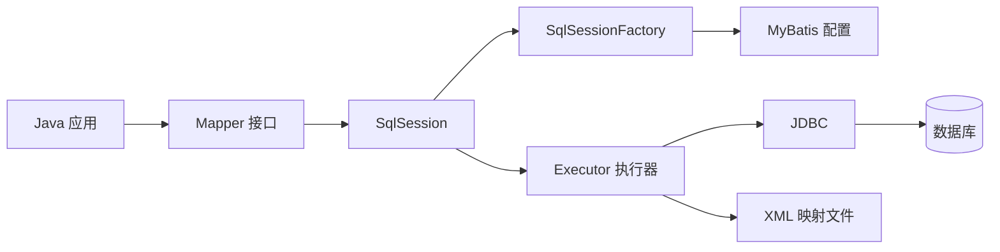
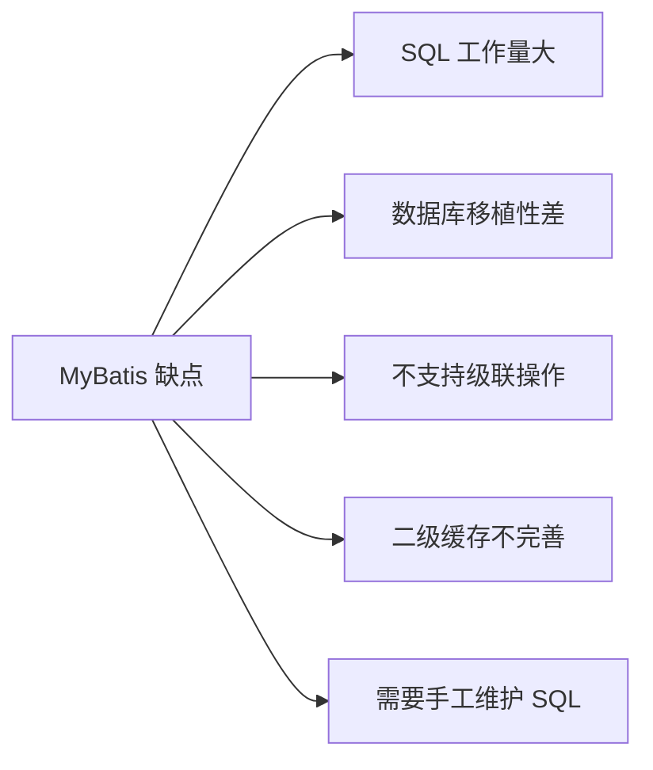
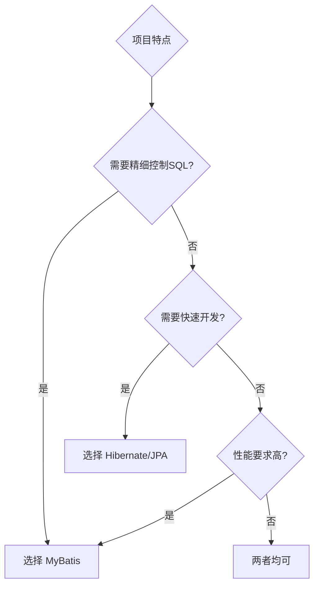
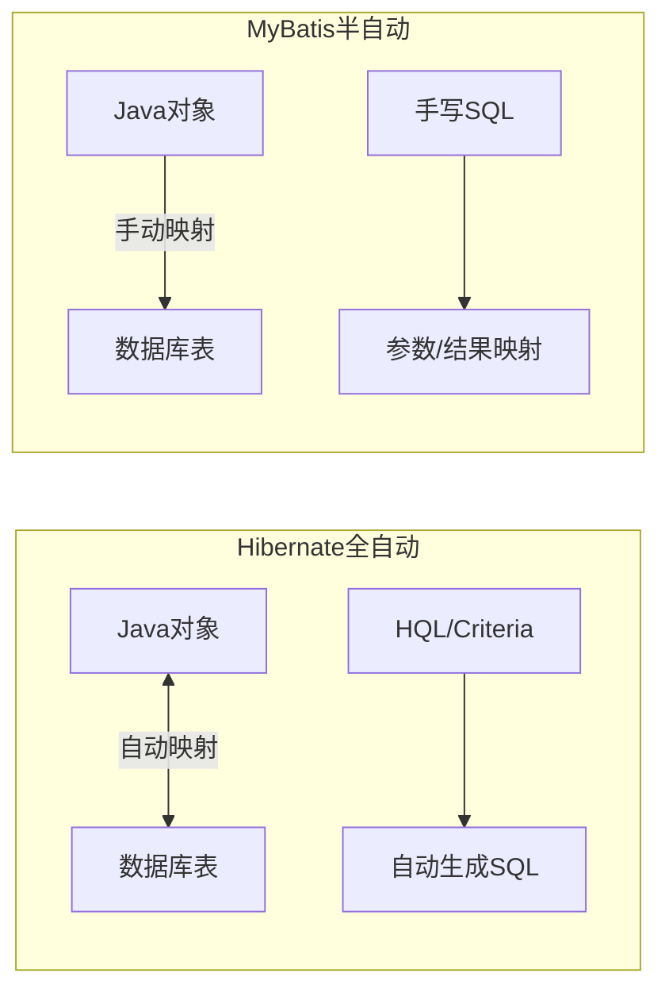
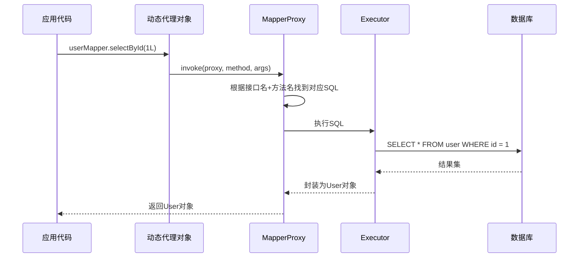
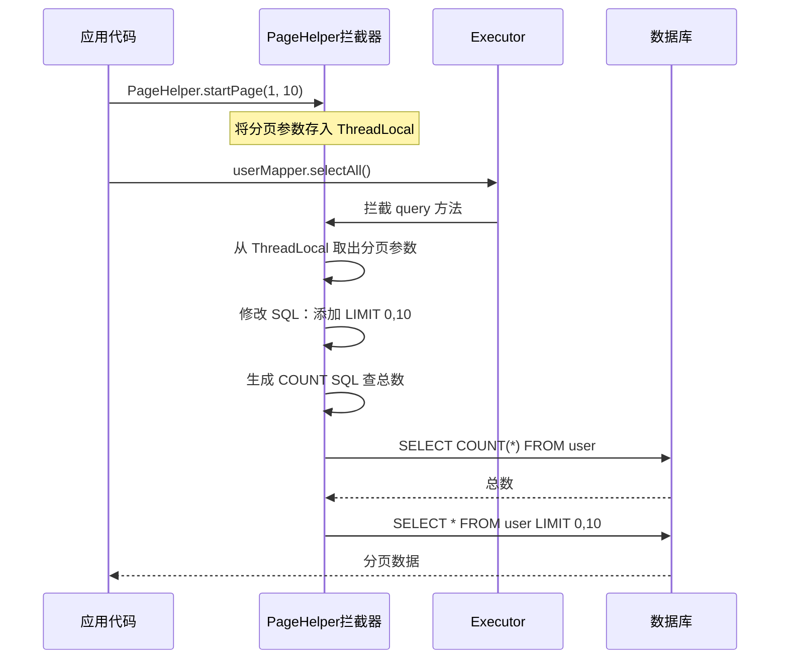
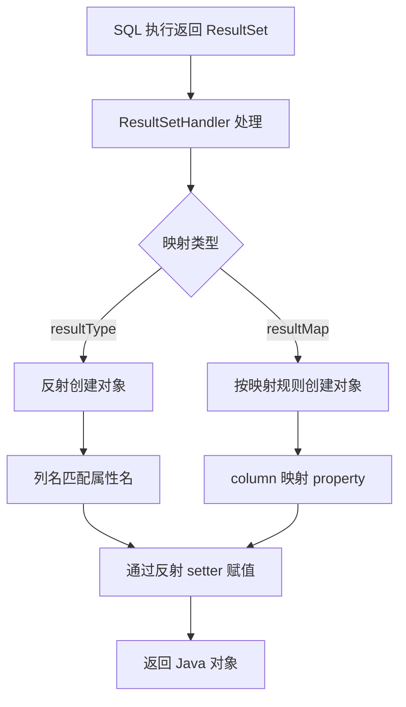
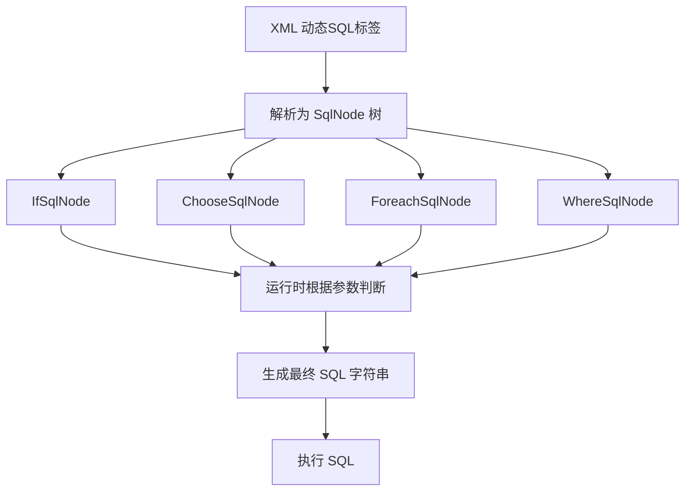

# MyBatis 面试题

## 基础概念

### 1. 什么是 MyBatis?

MyBatis 是一款优秀的**持久层框架**，它支持自定义 SQL、存储过程以及高级映射。MyBatis 免除了几乎所有的 JDBC 代码以及设置参数和获取结果集的工作。MyBatis 可以通过简单的 XML 或注解来配置和映射原始类型、接口和 Java POJO（Plain Old Java Objects，普通老式 Java 对象）为数据库中的记录。

MyBatis 的前身是 **iBatis**，由 Clinton Begin 创建，后来捐献给 Apache 软件基金会，2010 年迁移到 Google Code，并改名为 MyBatis，2013 年迁移到 GitHub。

**核心组成：**

- **SqlSessionFactory**：创建 SqlSession 的工厂，通过配置文件或 Java 代码构建
- **SqlSession**：执行 SQL 语句的核心接口，类似于 JDBC 的 Connection
- **Mapper 接口**：定义数据库操作方法的接口
- **XML 映射文件**：定义 SQL 语句和结果映射的配置文件



**快速入门示例：**

```java
// 1. 读取配置文件，构建 SqlSessionFactory
String resource = "mybatis-config.xml";
InputStream inputStream = Resources.getResourceAsStream(resource);
SqlSessionFactory sqlSessionFactory = new SqlSessionFactoryBuilder().build(inputStream);

// 2. 获取 SqlSession
try (SqlSession session = sqlSessionFactory.openSession()) {
    // 3. 获取 Mapper 接口
    UserMapper mapper = session.getMapper(UserMapper.class);
    // 4. 执行查询
    User user = mapper.selectById(1L);
    System.out.println(user);
}
```

```xml
<!-- mybatis-config.xml -->
<?xml version="1.0" encoding="UTF-8" ?>
<!DOCTYPE configuration PUBLIC "-//mybatis.org//DTD Config 3.0//EN"
  "http://mybatis.org/dtd/mybatis-3-config.dtd">
<configuration>
  <environments default="development">
    <environment id="development">
      <transactionManager type="JDBC"/>
      <dataSource type="POOLED">
        <property name="driver" value="com.mysql.cj.jdbc.Driver"/>
        <property name="url" value="jdbc:mysql://localhost:3306/test"/>
        <property name="username" value="root"/>
        <property name="password" value="123456"/>
      </dataSource>
    </environment>
  </environments>
  <mappers>
    <mapper resource="mapper/UserMapper.xml"/>
  </mappers>
</configuration>
```

### 2. MyBatis 的优点

MyBatis 相比传统 JDBC 和其他 ORM 框架有以下显著优点：

**1. 基于 SQL 语句编程，灵活性高**

- SQL 写在 XML 里，与程序代码解耦，便于统一管理和维护
- 支持编写任意复杂的 SQL，满足各种业务需求
- 可以对 SQL 进行优化，提升性能

**2. 消除了大量 JDBC 冗余代码**

- 不需要手动开关连接、创建 Statement、处理 ResultSet
- 自动完成参数设置和结果集映射

**3. 与各种数据库兼容**

- 因为 MyBatis 使用 JDBC 来连接数据库，所以只要 JDBC 支持的数据库 MyBatis 都支持

**4. 能够与 Spring 很好地集成**

- 提供 mybatis-spring 整合包，与 Spring 无缝集成

**5. 提供映射标签，支持对象与数据库的 ORM 字段关系映射**

- 支持对象关系组件维护

**6. 提供 XML 标签，支持编写动态 SQL**

- `<if>`、`<choose>`、`<foreach>` 等标签让 SQL 更灵活

```java
// 传统 JDBC 代码（繁琐）
Connection conn = null;
PreparedStatement ps = null;
ResultSet rs = null;
try {
    conn = DriverManager.getConnection(url, user, password);
    ps = conn.prepareStatement("SELECT * FROM user WHERE id = ?");
    ps.setLong(1, 1L);
    rs = ps.executeQuery();
    if (rs.next()) {
        User user = new User();
        user.setId(rs.getLong("id"));
        user.setName(rs.getString("name"));
        // ... 手动映射每个字段
    }
} finally {
    // 手动关闭资源
    if (rs != null) rs.close();
    if (ps != null) ps.close();
    if (conn != null) conn.close();
}

// MyBatis 代码（简洁）
User user = userMapper.selectById(1L);
```

### 3. MyBatis 框架的缺点

MyBatis 也存在一些不足之处，在选型时需要综合考虑：

**1. SQL 语句编写工作量较大**

- 尤其是字段多、关联表多时，SQL 编写量大
- 对开发人员的 SQL 能力有一定要求

**2. SQL 语句依赖于数据库，导致数据库移植性差**

- 不同数据库的 SQL 语法有差异（如分页语法：MySQL 用 LIMIT，Oracle 用 ROWNUM）
- 更换数据库时需要修改大量 SQL

**3. 不支持级联删除、级联更新**

- 需要手动编写相关 SQL 逻辑

**4. 二级缓存机制不够完善**

- 二级缓存是基于 namespace 的，多表操作时容易出现脏数据问题

**5. 相比 Hibernate，需要更多的手工工作**

- 没有自动建表功能
- 没有完整的对象关系管理能力



### 4. MyBatis 框架适用场合

MyBatis 适合以下场景，选择合适的框架非常重要：

**适合使用 MyBatis 的场景：**

1. **需要对 SQL 进行精细控制的项目**
   - 复杂查询、报表统计、数据分析类项目
   - 需要 SQL 调优的高性能场景
2. **需求变化频繁的互联网项目**
   - 业务逻辑复杂，SQL 需要频繁调整
   - 互联网电商、金融等业务系统
3. **对性能要求较高的项目**
   - 可以直接优化 SQL，避免 ORM 生成低效 SQL
4. **数据库表结构复杂的项目**
   - 多表关联、复杂聚合查询

**不适合使用 MyBatis 的场景：**

1. 需要频繁切换数据库的项目（移植性要求高）
2. 业务逻辑简单、CRUD 操作为主的项目（Hibernate 更合适）
3. 团队 SQL 能力较弱的项目



### 5. MyBatis 与 Hibernate 有哪些不同?

MyBatis 和 Hibernate 是 Java 中最常用的两个 ORM 框架，它们有本质上的区别：

| 对比维度   | MyBatis      | Hibernate      |
| ------ | ------------ | -------------- |
| ORM 类型 | 半自动 ORM      | 全自动 ORM        |
| SQL 控制 | 手写 SQL，完全控制  | 自动生成 SQL       |
| 学习成本   | 较低，会 SQL 即可  | 较高，需学习 HQL     |
| 数据库移植性 | 差（SQL 依赖数据库） | 好（自动适配方言）      |
| 开发效率   | 中等           | 高（简单 CRUD）     |
| 性能优化   | 容易（直接优化 SQL） | 较难（需了解生成的 SQL） |
| 缓存机制   | 一级+二级缓存      | 一级+二级+查询缓存     |
| 适用场景   | 复杂 SQL、高性能   | 快速开发、简单业务      |

**Hibernate 示例（全自动）：**

```java
// Hibernate 自动生成 SQL，开发者无需关心 SQL 细节
Session session = sessionFactory.openSession();
User user = session.get(User.class, 1L);  // 自动生成 SELECT SQL
user.setName("新名字");
session.update(user);  // 自动生成 UPDATE SQL
```

**MyBatis 示例（半自动）：**

```xml
<!-- 需要手动编写 SQL -->
<select id="selectById" resultType="User">
    SELECT id, name, email FROM user WHERE id = #{id}
</select>
<update id="updateUser">
    UPDATE user SET name = #{name} WHERE id = #{id}
</update>
```



**总结：**

- 如果项目 SQL 复杂、需要精细调优，选 **MyBatis**
- 如果项目以简单 CRUD 为主、追求开发效率，选 **Hibernate**

## SQL 映射

### 6. #{}和${}的区别是什么?

这是 MyBatis 中非常重要的一个知识点，也是面试高频题。

**`#{}`** **— 预编译参数（推荐使用）**

- 使用 `?` 占位符，通过 JDBC 的 `PreparedStatement` 预编译处理
- MyBatis 会对传入的值进行**转义处理**，防止 SQL 注入
- 传入字符串时会自动加上引号

**`${}`** **— 字符串替换（直接拼接）**

- 直接将参数值替换到 SQL 中，不做任何处理
- **存在 SQL 注入风险**，不建议用于用户输入的参数
- 适合用于动态表名、列名、ORDER BY 等场景

```java
// Mapper 接口
public interface UserMapper {
    User selectById(@Param("id") Long id);
    List<User> selectByTable(@Param("tableName") String tableName);
    List<User> selectOrderBy(@Param("column") String column);
}
```

```xml
<!-- #{}：预编译，安全 -->
<select id="selectById" resultType="User">
    SELECT * FROM user WHERE id = #{id}
    <!-- 生成的 SQL：SELECT * FROM user WHERE id = ? -->
    <!-- 参数：1 -->
</select>

<!-- ${}：字符串替换，用于动态表名 -->
<select id="selectByTable" resultType="User">
    SELECT * FROM ${tableName} WHERE status = 1
    <!-- 生成的 SQL：SELECT * FROM user_2024 WHERE status = 1 -->
</select>

<!-- ${}：用于动态排序列名 -->
<select id="selectOrderBy" resultType="User">
    SELECT * FROM user ORDER BY ${column} DESC
    <!-- 生成的 SQL：SELECT * FROM user ORDER BY create_time DESC -->
</select>
```

**SQL 注入风险演示：**

```java
// 危险！使用 ${} 传入用户输入
// 如果 name = "' OR '1'='1"
// 生成 SQL：SELECT * FROM user WHERE name = '' OR '1'='1'
// 会查出所有数据！

// 安全！使用 #{} 传入用户输入
// 如果 name = "' OR '1'='1"
// 生成 SQL：SELECT * FROM user WHERE name = "' OR '1'='1'"
// 作为字符串处理，不会注入
```

**总结对比：**

| 特性     | #{}                    | ${}            |
| ------ | ---------------------- | -------------- |
| 处理方式   | 预编译（PreparedStatement） | 字符串替换          |
| SQL 注入 | 安全，自动转义                | 不安全，有注入风险      |
| 适用场景   | 参数值（推荐）                | 表名、列名、ORDER BY |
| 性能     | 可利用预编译缓存               | 每次重新编译         |

### 7. 当实体类中的属性名和表中的字段名不一样，怎么办?

在实际开发中，数据库字段名通常是下划线命名（`user_name`），而 Java 属性名是驼峰命名（`userName`），需要做映射处理。

**方式一：SQL 中使用别名（最简单）**

```xml
<select id="selectUser" resultType="User">
    SELECT
        id,
        user_name AS userName,
        user_email AS userEmail,
        create_time AS createTime
    FROM user
    WHERE id = #{id}
</select>
```

**方式二：使用** **`<resultMap>`** **标签（最灵活，推荐）**

```xml
<!-- 定义结果映射 -->
<resultMap id="UserResultMap" type="com.example.entity.User">
    <!-- id 标签用于主键映射 -->
    <id property="id" column="id"/>
    <!-- result 标签用于普通字段映射 -->
    <result property="userName" column="user_name"/>
    <result property="userEmail" column="user_email"/>
    <result property="createTime" column="create_time"/>
</resultMap>

<!-- 使用 resultMap 替代 resultType -->
<select id="selectUser" resultMap="UserResultMap">
    SELECT * FROM user WHERE id = #{id}
</select>
```

**方式三：开启驼峰命名自动映射（最方便）**

在 MyBatis 配置文件中开启 `mapUnderscoreToCamelCase`：

```xml
<!-- mybatis-config.xml -->
<configuration>
    <settings>
        <!-- 开启驼峰命名自动映射：user_name -> userName -->
        <setting name="mapUnderscoreToCamelCase" value="true"/>
    </settings>
</configuration>
```

或在 Spring Boot 的 `application.yml` 中配置：

```yaml
mybatis:
  configuration:
    map-underscore-to-camel-case: true
```

开启后，`user_name` 会自动映射到 `userName`，无需额外配置。

**三种方式对比：**

| 方式        | 优点        | 缺点            |
| --------- | --------- | ------------- |
| SQL 别名    | 简单直接      | 每个 SQL 都要写，繁琐 |
| resultMap | 灵活，支持复杂映射 | 需要额外配置        |
| 驼峰自动映射    | 一次配置，全局生效 | 只支持下划线转驼峰规则   |

### 8. 模糊查询 like 语句该怎么写?

模糊查询是常见需求，但写法不当会有 SQL 注入风险。

**方式一：在 Java 代码中拼接通配符（推荐）**

```java
// Service 层
String keyword = "%" + userInput + "%";
List<User> users = userMapper.selectByName(keyword);
```

```xml
<select id="selectByName" resultType="User">
    SELECT * FROM user WHERE name LIKE #{name}
</select>
```

**方式二：使用** **`CONCAT`** **函数（推荐，SQL 层处理）**

```xml
<select id="selectByName" resultType="User">
    SELECT * FROM user WHERE name LIKE CONCAT('%', #{name}, '%')
</select>
```

**方式三：使用** **`bind`** **标签（MyBatis 特有）**

```xml
<select id="selectByName" resultType="User">
    <bind name="pattern" value="'%' + name + '%'"/>
    SELECT * FROM user WHERE name LIKE #{pattern}
</select>
```

**错误写法（有 SQL 注入风险，不要用）：**

```xml
<!-- 危险！${}直接拼接，存在 SQL 注入 -->
<select id="selectByName" resultType="User">
    SELECT * FROM user WHERE name LIKE '%${name}%'
</select>
```

**推荐使用 CONCAT 方式**，因为：

1. 使用 `#{}` 预编译，安全无注入风险
2. SQL 逻辑集中在 XML 中，不需要 Java 层处理
3. 跨数据库兼容性好（MySQL、PostgreSQL 都支持 CONCAT）

### 9. Dao 接口的工作原理是什么？Dao 接口里的方法能重载吗?

**Dao 接口工作原理（动态代理）**

MyBatis 中，Dao 接口（也叫 Mapper 接口）不需要写实现类，MyBatis 会通过**JDK 动态代理**自动生成代理对象。



**核心原理代码（简化版）：**

```java
// MyBatis 内部通过 JDK 动态代理生成 Mapper 实现
// MapperProxy 实现了 InvocationHandler
public class MapperProxy<T> implements InvocationHandler {
    private final SqlSession sqlSession;
    private final Class<T> mapperInterface;

    @Override
    public Object invoke(Object proxy, Method method, Object[] args) {
        // 根据接口全限定名 + 方法名，找到对应的 MappedStatement
        // 例如：com.example.mapper.UserMapper.selectById
        String statementId = mapperInterface.getName() + "." + method.getName();
        MappedStatement ms = sqlSession.getConfiguration().getMappedStatement(statementId);
        // 执行对应的 SQL
        return sqlSession.selectOne(statementId, args[0]);
    }
}

// 获取代理对象
UserMapper mapper = session.getMapper(UserMapper.class);
// mapper 实际上是 MapperProxy 的代理实例
```

**Dao 接口方法能重载吗？**

**不能重载！** 原因如下：

MyBatis 通过 `接口全限定名 + 方法名` 来定位 XML 中的 SQL 语句（即 namespace + id）。如果方法重载，两个方法名相同，MyBatis 无法区分应该执行哪个 SQL。

```java
// 错误示例：不能重载
public interface UserMapper {
    User selectById(Long id);
    User selectById(Long id, String name);  // 编译不报错，但运行时会出问题
}
```

```xml
<!-- XML 中 id 不能重复 -->
<select id="selectById" resultType="User">SELECT * FROM user WHERE id = #{id}</select>
<!-- 下面这个会报错：id 重复 -->
<select id="selectById" resultType="User">SELECT * FROM user WHERE id = #{id} AND name = #{name}</select>
```

**正确做法：使用不同的方法名**

```java
public interface UserMapper {
    User selectById(Long id);
    User selectByIdAndName(@Param("id") Long id, @Param("name") String name);
}
```

### 10. MyBatis 是如何进行分页的？分页插件的原理是什么?

**MyBatis 分页的几种方式：**

**方式一：使用 RowBounds 对象（逻辑分页，不推荐）**

```java
// RowBounds 是内存分页，先查出所有数据再截取，数据量大时性能差
int offset = (pageNum - 1) * pageSize;  // 偏移量
int limit = pageSize;                    // 每页条数
RowBounds rowBounds = new RowBounds(offset, limit);
List<User> users = sqlSession.selectList("selectAll", null, rowBounds);
```

**方式二：在 SQL 中直接写分页（物理分页，推荐）**

```xml
<!-- MySQL 分页 -->
<select id="selectPage" resultType="User">
    SELECT * FROM user
    WHERE status = 1
    LIMIT #{offset}, #{pageSize}
</select>

<!-- Oracle 分页（不同数据库语法不同） -->
<select id="selectPage" resultType="User">
    SELECT * FROM (
        SELECT t.*, ROWNUM rn FROM user t WHERE ROWNUM &lt;= #{end}
    ) WHERE rn &gt; #{start}
</select>
```

**方式三：使用 PageHelper 插件（最推荐）**

```xml
<!-- pom.xml 引入依赖 -->
<dependency>
    <groupId>com.github.pagehelper</groupId>
    <artifactId>pagehelper-spring-boot-starter</artifactId>
    <version>1.4.6</version>
</dependency>
```

```java
// 使用 PageHelper，只需在查询前调用 startPage
PageHelper.startPage(pageNum, pageSize);
List<User> users = userMapper.selectAll();  // 自动添加 LIMIT 子句
PageInfo<User> pageInfo = new PageInfo<>(users);

System.out.println("总记录数：" + pageInfo.getTotal());
System.out.println("总页数：" + pageInfo.getPages());
System.out.println("当前页数据：" + pageInfo.getList());
```

**PageHelper 分页插件原理：**



PageHelper 本质是一个 **MyBatis 拦截器（Interceptor）**，它拦截 `Executor` 的 `query` 方法，在执行前动态修改 SQL，添加数据库对应的分页语句（LIMIT、ROWNUM 等）。

### 11. MyBatis 是如何将 SQL 执行结果封装为目标对象并返回的？都有哪些映射形式?

MyBatis 结果集映射是其核心功能之一，有以下几种映射形式：

**映射形式一：使用** **`resultType`（自动映射）**

```xml
<!-- 列名与属性名相同时，自动映射 -->
<select id="selectById" resultType="com.example.entity.User">
    SELECT id, name, email FROM user WHERE id = #{id}
</select>

<!-- 也可以映射为 Map -->
<select id="selectAsMap" resultType="java.util.HashMap">
    SELECT id, name, email FROM user WHERE id = #{id}
</select>

<!-- 映射为基本类型 -->
<select id="countUser" resultType="int">
    SELECT COUNT(*) FROM user
</select>
```

**映射形式二：使用** **`resultMap`（手动映射，最灵活）**

```xml
<resultMap id="UserResultMap" type="User">
    <id property="id" column="id"/>
    <result property="userName" column="user_name"/>
    <result property="userEmail" column="user_email"/>
    <!-- 关联对象映射 -->
    <association property="dept" javaType="Dept">
        <id property="deptId" column="dept_id"/>
        <result property="deptName" column="dept_name"/>
    </association>
    <!-- 集合映射 -->
    <collection property="roles" ofType="Role">
        <id property="roleId" column="role_id"/>
        <result property="roleName" column="role_name"/>
    </collection>
</resultMap>
```

**底层封装原理：**



**自动映射规则：**

1. 列名与属性名完全相同（大小写不敏感）
2. 开启 `mapUnderscoreToCamelCase` 后，下划线列名自动转驼峰属性名
3. 无法匹配的列会被忽略（不报错）

```java
// MyBatis 内部使用反射进行赋值
// 伪代码示意
Object result = resultType.newInstance();  // 创建对象
for (ResultMapping mapping : resultMap.getResultMappings()) {
    Object value = resultSet.getObject(mapping.getColumn());  // 从结果集取值
    // 通过反射调用 setter 方法
    Method setter = result.getClass().getMethod("set" + capitalize(mapping.getProperty()), ...);
    setter.invoke(result, value);
}
```

### 12. 如何执行批量插入?

批量插入是提升数据库写入性能的重要手段，MyBatis 提供了多种方式。

**方式一：使用** **`<foreach>`** **标签（最常用）**

```java
// Mapper 接口
public interface UserMapper {
    int batchInsert(@Param("users") List<User> users);
}
```

```xml
<insert id="batchInsert">
    INSERT INTO user (name, email, create_time)
    VALUES
    <foreach collection="users" item="user" separator=",">
        (#{user.name}, #{user.email}, #{user.createTime})
    </foreach>
</insert>
```

```java
// 调用示例
List<User> users = new ArrayList<>();
for (int i = 0; i < 1000; i++) {
    users.add(new User("用户" + i, "user" + i + "@example.com"));
}
userMapper.batchInsert(users);
```

生成的 SQL：

```sql
INSERT INTO user (name, email, create_time) VALUES
('用户0', 'user0@example.com', '2024-01-01'),
('用户1', 'user1@example.com', '2024-01-01'),
...
('用户999', 'user999@example.com', '2024-01-01')
```

**方式二：使用 ExecutorType.BATCH（JDBC 批处理）**

```java
// 开启 BATCH 模式的 SqlSession
SqlSession sqlSession = sqlSessionFactory.openSession(ExecutorType.BATCH);
try {
    UserMapper mapper = sqlSession.getMapper(UserMapper.class);
    for (User user : users) {
        mapper.insert(user);  // 不立即执行，先缓存
    }
    sqlSession.flushStatements();  // 批量提交
    sqlSession.commit();
} catch (Exception e) {
    sqlSession.rollback();
} finally {
    sqlSession.close();
}
```

**两种方式对比：**

| 方式      | 原理            | 优点     | 缺点         |
| ------- | ------------- | ------ | ---------- |
| foreach | 拼接一条大 SQL     | 一次网络请求 | SQL 过长可能超限 |
| BATCH   | JDBC addBatch | 内存占用小  | 多次网络请求     |

**注意：** 使用 `foreach` 时，建议每批不超过 500-1000 条，避免 SQL 过长。

### 13. 如何获取自动生成的（主）键值?

插入数据后获取数据库自动生成的主键（如 AUTO\_INCREMENT），是常见需求。

**方式一：使用** **`useGeneratedKeys`** **和** **`keyProperty`（推荐）**

```xml
<insert id="insertUser" useGeneratedKeys="true" keyProperty="id">
    INSERT INTO user (name, email) VALUES (#{name}, #{email})
</insert>
```

```java
User user = new User();
user.setName("张三");
user.setEmail("zhangsan@example.com");

userMapper.insertUser(user);

// 插入后，user.getId() 就是数据库生成的主键
System.out.println("生成的主键：" + user.getId());
```

**方式二：使用** **`<selectKey>`** **标签（适合 Oracle 等不支持自增的数据库）**

```xml
<!-- Oracle 使用序列生成主键 -->
<insert id="insertUser">
    <selectKey keyProperty="id" resultType="long" order="BEFORE">
        SELECT user_seq.nextval FROM dual
    </selectKey>
    INSERT INTO user (id, name, email) VALUES (#{id}, #{name}, #{email})
</insert>

<!-- MySQL 也可以用 selectKey，在插入后获取 -->
<insert id="insertUser">
    <selectKey keyProperty="id" resultType="long" order="AFTER">
        SELECT LAST_INSERT_ID()
    </selectKey>
    INSERT INTO user (name, email) VALUES (#{name}, #{email})
</insert>
```

**`selectKey`** **属性说明：**

| 属性          | 说明                          |
| ----------- | --------------------------- |
| keyProperty | 主键对应的 Java 属性名              |
| resultType  | 主键的 Java 类型                 |
| order       | BEFORE（插入前执行）或 AFTER（插入后执行） |

**Spring Boot 中的配置示例：**

```java
@Mapper
public interface UserMapper {
    // useGeneratedKeys 方式，插入后 user.id 会被自动填充
    @Options(useGeneratedKeys = true, keyProperty = "id")
    @Insert("INSERT INTO user(name, email) VALUES(#{name}, #{email})")
    int insert(User user);
}
```

### 14. 在 mapper 中如何传递多个参数?

当 Mapper 方法需要传入多个参数时，有以下几种方式：

**方式一：使用** **`@Param`** **注解（最推荐）**

```java
public interface UserMapper {
    List<User> selectByNameAndAge(
        @Param("name") String name,
        @Param("age") Integer age
    );
}
```

```xml
<select id="selectByNameAndAge" resultType="User">
    SELECT * FROM user
    WHERE name = #{name} AND age = #{age}
</select>
```

**方式二：使用 Map 传参**

```java
public interface UserMapper {
    List<User> selectByMap(Map<String, Object> params);
}
```

```java
// 调用时
Map<String, Object> params = new HashMap<>();
params.put("name", "张三");
params.put("age", 25);
List<User> users = userMapper.selectByMap(params);
```

```xml
<select id="selectByMap" resultType="User">
    SELECT * FROM user
    WHERE name = #{name} AND age = #{age}
</select>
```

**方式三：封装为 JavaBean（参数较多时推荐）**

```java
// 定义查询条件对象
public class UserQuery {
    private String name;
    private Integer minAge;
    private Integer maxAge;
    private String email;
    // getter/setter...
}

public interface UserMapper {
    List<User> selectByQuery(UserQuery query);
}
```

```xml
<select id="selectByQuery" resultType="User">
    SELECT * FROM user
    WHERE name = #{name}
      AND age BETWEEN #{minAge} AND #{maxAge}
      AND email = #{email}
</select>
```

**方式四：顺序参数（不推荐，可读性差）**

```java
// 不使用 @Param，通过 arg0, arg1 或 param1, param2 引用
List<User> selectByNameAndAge(String name, Integer age);
```

```xml
<!-- MyBatis 3.4.1 之前用 #{0}, #{1} -->
<!-- MyBatis 3.4.1 之后用 #{arg0}, #{arg1} 或 #{param1}, #{param2} -->
<select id="selectByNameAndAge" resultType="User">
    SELECT * FROM user WHERE name = #{param1} AND age = #{param2}
</select>
```

**推荐优先级：** `@Param` > JavaBean > Map > 顺序参数

## 动态 SQL

### 15. MyBatis 动态 SQL 有什么用？执行原理？有哪些动态 SQL?

**动态 SQL 的作用：**

动态 SQL 是 MyBatis 最强大的特性之一，它允许根据不同的条件动态拼接 SQL 语句，避免了在 Java 代码中手动拼接 SQL 字符串的繁琐和错误。

**执行原理：**

MyBatis 在解析 XML 时，会将动态 SQL 标签解析为 `SqlNode` 对象树，执行时遍历这棵树，根据参数条件动态生成最终的 SQL 字符串。



**所有动态 SQL 标签：**

**1.** **`<if>`** **— 条件判断**

```xml
<select id="selectUser" resultType="User">
    SELECT * FROM user WHERE 1=1
    <if test="name != null and name != ''">
        AND name = #{name}
    </if>
    <if test="age != null">
        AND age = #{age}
    </if>
</select>
```

**2.** **`<choose>/<when>/<otherwise>`** **— 多选一（类似 switch-case）**

```xml
<select id="selectUser" resultType="User">
    SELECT * FROM user WHERE
    <choose>
        <when test="id != null">id = #{id}</when>
        <when test="name != null">name = #{name}</when>
        <otherwise>status = 1</otherwise>
    </choose>
</select>
```

**3.** **`<where>`** **— 智能 WHERE 子句**

```xml
<!-- <where> 会自动处理多余的 AND/OR，并在有条件时添加 WHERE -->
<select id="selectUser" resultType="User">
    SELECT * FROM user
    <where>
        <if test="name != null">AND name = #{name}</if>
        <if test="age != null">AND age = #{age}</if>
    </where>
</select>
```

**4.** **`<set>`** **— 智能 SET 子句（用于 UPDATE）**

```xml
<!-- <set> 会自动去掉最后多余的逗号 -->
<update id="updateUser">
    UPDATE user
    <set>
        <if test="name != null">name = #{name},</if>
        <if test="email != null">email = #{email},</if>
        <if test="age != null">age = #{age},</if>
    </set>
    WHERE id = #{id}
</update>
```

**5.** **`<foreach>`** **— 循环（用于 IN 查询、批量操作）**

```xml
<select id="selectByIds" resultType="User">
    SELECT * FROM user WHERE id IN
    <foreach collection="ids" item="id" open="(" separator="," close=")">
        #{id}
    </foreach>
</select>
```

**6.** **`<trim>`** **— 自定义前缀/后缀处理**

```xml
<!-- trim 是 where 和 set 的底层实现 -->
<select id="selectUser" resultType="User">
    SELECT * FROM user
    <trim prefix="WHERE" prefixOverrides="AND |OR ">
        <if test="name != null">AND name = #{name}</if>
        <if test="age != null">AND age = #{age}</if>
    </trim>
</select>
```

**7.** **`<bind>`** **— 变量绑定**

```xml
<select id="selectByName" resultType="User">
    <bind name="pattern" value="'%' + name + '%'"/>
    SELECT * FROM user WHERE name LIKE #{pattern}
</select>
```

**8.** **`<sql>`** **和** **`<include>`** **— SQL 片段复用**

```xml
<!-- 定义可复用的 SQL 片段 -->
<sql id="userColumns">id, name, email, age, create_time</sql>

<select id="selectAll" resultType="User">
    SELECT <include refid="userColumns"/> FROM user
</select>
```

