# 架构师面试题详细解答

## 通用设计与方法论

### 1. 架构 秒杀系统优化思路

**问题分析：**

秒杀系统面临的核心挑战是在极短时间内处理海量并发请求，典型场景下可能有数百万用户同时抢购少量商品（如100件）。主要技术难点包括：
- 瞬时高并发：QPS可能达到平时的100-1000倍
- 读多写少：大量用户查询，极少数成功下单
- 库存超卖：并发扣减库存容易出现数据不一致
- 系统雪崩：流量洪峰可能压垮整个系统
- 黄牛党：恶意刷单、机器人抢购

**解决方案：**

**1. 前端优化层**
- 页面静态化：商品详情页CDN缓存，减少动态请求
- 按钮控制：倒计时结束前禁用按钮，防止提前请求
- 答题验证码：增加人机识别，防止机器刷单
- 限流：前端限制同一用户重复点击频率

**2. 接入层优化**
- Nginx限流：使用limit_req模块限制单IP请求频率
- 动静分离：静态资源走CDN，动态请求走应用服务器
- 负载均衡：LVS/Nginx多层负载，分散流量

**3. 服务层优化**
- 异步化：秒杀请求异步处理，快速返回
- 削峰填谷：消息队列缓冲请求，平滑处理
- 限流降级：超过阈值直接返回"已售罄"
- 热点隔离：秒杀服务独立部署，不影响正常业务

**4. 数据层优化**
- Redis预减库存：内存操作，性能极高
- 库存分段：将100件库存分成10段，减少锁竞争
- 数据库兜底：Redis扣减成功后异步写DB
- 乐观锁：使用版本号防止超卖

**架构设计：**

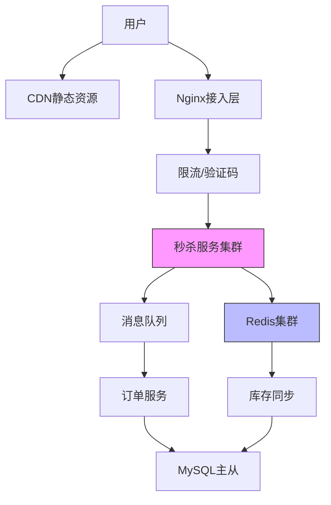

**代码实现：**

```java
@Service
public class SeckillService {
    
    @Autowired
    private RedisTemplate<String, Object> redisTemplate;
    
    @Autowired
    private RabbitTemplate rabbitTemplate;
    
    /**
     * 秒杀接口 - Redis预减库存
     */
    public SeckillResult doSeckill(Long userId, Long productId) {
        // 1. 防重复购买
        String userKey = "seckill:user:" + productId + ":" + userId;
        Boolean hasOrdered = redisTemplate.hasKey(userKey);
        if (Boolean.TRUE.equals(hasOrdered)) {
            return SeckillResult.fail("您已经参与过该商品的秒杀");
        }
        
        // 2. Redis预减库存（原子操作）
        String stockKey = "seckill:stock:" + productId;
        Long stock = redisTemplate.opsForValue().decrement(stockKey);
        
        if (stock == null || stock < 0) {
            // 库存不足，恢复库存
            redisTemplate.opsForValue().increment(stockKey);
            return SeckillResult.fail("商品已售罄");
        }
        
        // 3. 标记用户已参与
        redisTemplate.opsForValue().set(userKey, "1", 24, TimeUnit.HOURS);
        
        // 4. 异步创建订单（发送MQ消息）
        SeckillMessage message = new SeckillMessage(userId, productId);
        rabbitTemplate.convertAndSend("seckill.exchange", "seckill.order", message);
        
        return SeckillResult.success("排队中，请稍后查看订单");
    }
    
    /**
     * 初始化库存到Redis
     */
    public void initStock(Long productId, Integer stock) {
        String stockKey = "seckill:stock:" + productId;
        redisTemplate.opsForValue().set(stockKey, stock);
    }
}

/**
 * 订单消费者 - 异步处理订单
 */
@Component
public class SeckillOrderConsumer {
    
    @Autowired
    private OrderService orderService;
    
    @Autowired
    private StockService stockService;
    
    @RabbitListener(queues = "seckill.order.queue")
    public void handleOrder(SeckillMessage message) {
        try {
            // 1. 数据库乐观锁扣减库存
            boolean success = stockService.decreaseStock(message.getProductId());
            
            if (!success) {
                log.warn("库存扣减失败: {}", message);
                return;
            }
            
            // 2. 创建订单
            orderService.createOrder(message.getUserId(), message.getProductId());
            
        } catch (Exception e) {
            log.error("订单处理失败", e);
            // 补偿：恢复Redis库存
            String stockKey = "seckill:stock:" + message.getProductId();
            redisTemplate.opsForValue().increment(stockKey);
        }
    }
}

/**
 * 库存服务 - 乐观锁扣减
 */
@Service
public class StockService {
    
    @Autowired
    private StockMapper stockMapper;
    
    public boolean decreaseStock(Long productId) {
        // 使用乐观锁，version字段防止超卖
        int affected = stockMapper.decreaseStock(productId);
        return affected > 0;
    }
}
```

```sql
-- 库存表设计
CREATE TABLE seckill_stock (
    id BIGINT PRIMARY KEY AUTO_INCREMENT,
    product_id BIGINT NOT NULL UNIQUE,
    stock INT NOT NULL DEFAULT 0,
    version INT NOT NULL DEFAULT 0,
    created_at TIMESTAMP DEFAULT CURRENT_TIMESTAMP,
    updated_at TIMESTAMP DEFAULT CURRENT_TIMESTAMP ON UPDATE CURRENT_TIMESTAMP,
    INDEX idx_product_id (product_id)
) ENGINE=InnoDB;

-- 乐观锁扣减库存
UPDATE seckill_stock 
SET stock = stock - 1, version = version + 1
WHERE product_id = #{productId} 
  AND stock > 0 
  AND version = #{version};
```

```nginx
# Nginx限流配置
http {
    # 限制每个IP每秒最多10个请求
    limit_req_zone $binary_remote_addr zone=seckill:10m rate=10r/s;
    
    server {
        location /api/seckill {
            limit_req zone=seckill burst=20 nodelay;
            proxy_pass http://seckill_backend;
        }
    }
}
```

**最佳实践：**

1. **分层防护**：前端、接入层、服务层、数据层多层限流，层层过滤无效请求
2. **库存分段**：将库存分成多个段，减少Redis单key的竞争热点
3. **异步处理**：秒杀请求快速返回，订单创建异步化，提升用户体验
4. **降级预案**：准备降级开关，流量过大时直接返回"已售罄"
5. **监控告警**：实时监控QPS、错误率、库存数，及时发现问题
6. **压测验证**：上线前必须进行全链路压测，验证系统容量
7. **防刷策略**：验证码、设备指纹、行为分析多维度防止黄牛

**性能指标：**
- 支持10万+QPS
- 99%请求响应时间<100ms
- 零超卖
- 系统可用性99.99%

---

### 2. 架构 细聊分布式ID生成方法

**问题分析：**

分布式系统中，传统的数据库自增ID无法满足需求，因为：
- 多数据库实例：无法保证全局唯一性
- 高并发场景：数据库自增成为性能瓶颈
- 分库分表：需要全局唯一ID来标识数据
- 业务需求：可能需要ID有序、包含时间信息、不暴露业务量

分布式ID需要满足的特性：
- 全局唯一性：绝对不能重复
- 高性能：生成速度快，支持高并发
- 高可用：服务稳定，不能成为单点
- 趋势递增：方便MySQL索引，提升查询性能
- 信息安全：不暴露业务规模（可选）

**解决方案：**

**方案1：UUID**
- 优点：本地生成，性能极高，实现简单
- 缺点：36位字符串，占用空间大；无序，影响MySQL索引性能；不包含业务信息

**方案2：数据库自增ID**
- 单机：使用MySQL的AUTO_INCREMENT
- 多机：设置不同的起始值和步长（如机器1从1开始步长3，机器2从2开始步长3）
- 优点：简单，ID递增
- 缺点：数据库压力大，扩展性差，存在单点风险

**方案3：Redis INCR**
- 利用Redis的INCR原子操作生成ID
- 优点：性能高（10万+QPS），实现简单
- 缺点：依赖Redis，需要持久化防止重启后ID重复

**方案4：雪花算法（Snowflake）**
- Twitter开源的分布式ID生成算法
- 64位Long型ID = 1位符号位 + 41位时间戳 + 10位机器ID + 12位序列号
- 优点：高性能、趋势递增、包含时间信息、不依赖第三方
- 缺点：依赖机器时钟，时钟回拨会导致ID重复

**方案5：美团Leaf**
- Leaf-segment：数据库号段模式，批量获取ID
- Leaf-snowflake：优化的雪花算法，解决时钟回拨问题
- 优点：高可用、高性能、支持容灾

**方案6：百度UidGenerator**
- 基于雪花算法改进
- 使用RingBuffer预生成ID，提升性能
- 优点：性能极高（600万+QPS），解决时钟回拨

**架构设计：**

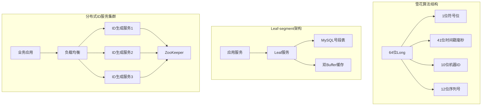

**代码实现：**

```java
/**
 * 雪花算法实现
 */
public class SnowflakeIdGenerator {
    
    // 起始时间戳 (2020-01-01)
    private final long twepoch = 1577808000000L;
    
    // 机器ID所占位数
    private final long workerIdBits = 5L;
    private final long datacenterIdBits = 5L;
    
    // 序列号所占位数
    private final long sequenceBits = 12L;
    
    // 机器ID最大值 31
    private final long maxWorkerId = -1L ^ (-1L << workerIdBits);
    private final long maxDatacenterId = -1L ^ (-1L << datacenterIdBits);
    
    // 序列号最大值 4095
    private final long sequenceMask = -1L ^ (-1L << sequenceBits);
    
    // 位移量
    private final long workerIdShift = sequenceBits;
    private final long datacenterIdShift = sequenceBits + workerIdBits;
    private final long timestampLeftShift = sequenceBits + workerIdBits + datacenterIdBits;
    
    private long workerId;
    private long datacenterId;
    private long sequence = 0L;
    private long lastTimestamp = -1L;
    
    public SnowflakeIdGenerator(long workerId, long datacenterId) {
        if (workerId > maxWorkerId || workerId < 0) {
            throw new IllegalArgumentException("Worker ID 超出范围");
        }
        if (datacenterId > maxDatacenterId || datacenterId < 0) {
            throw new IllegalArgumentException("Datacenter ID 超出范围");
        }
        this.workerId = workerId;
        this.datacenterId = datacenterId;
    }
    
    public synchronized long nextId() {
        long timestamp = timeGen();
        
        // 时钟回拨检测
        if (timestamp < lastTimestamp) {
            throw new RuntimeException(
                String.format("时钟回拨，拒绝生成ID %d 毫秒", lastTimestamp - timestamp));
        }
        
        // 同一毫秒内
        if (lastTimestamp == timestamp) {
            sequence = (sequence + 1) & sequenceMask;
            // 序列号溢出
            if (sequence == 0) {
                timestamp = tilNextMillis(lastTimestamp);
            }
        } else {
            sequence = 0L;
        }
        
        lastTimestamp = timestamp;
        
        // 组装ID
        return ((timestamp - twepoch) << timestampLeftShift)
                | (datacenterId << datacenterIdShift)
                | (workerId << workerIdShift)
                | sequence;
    }
    
    private long tilNextMillis(long lastTimestamp) {
        long timestamp = timeGen();
        while (timestamp <= lastTimestamp) {
            timestamp = timeGen();
        }
        return timestamp;
    }
    
    private long timeGen() {
        return System.currentTimeMillis();
    }
}

/**
 * Leaf-segment 号段模式
 */
@Service
public class LeafSegmentService {
    
    @Autowired
    private LeafAllocMapper leafAllocMapper;
    
    // 双Buffer缓存
    private Map<String, SegmentBuffer> cache = new ConcurrentHashMap<>();
    
    public Long getId(String bizTag) {
        SegmentBuffer buffer = cache.get(bizTag);
        if (buffer == null) {
            buffer = new SegmentBuffer();
            cache.put(bizTag, buffer);
        }
        
        return getIdFromBuffer(buffer, bizTag);
    }
    
    private Long getIdFromBuffer(SegmentBuffer buffer, String bizTag) {
        while (true) {
            buffer.rLock().lock();
            try {
                Segment segment = buffer.getCurrent();
                
                // 检查是否需要加载下一个号段
                if (!buffer.isNextReady() && 
                    segment.getIdle() < segment.getStep() * 0.9) {
                    // 异步加载下一个号段
                    loadNextSegment(buffer, bizTag);
                }
                
                long value = segment.getValue().getAndIncrement();
                if (value < segment.getMax()) {
                    return value;
                }
                
            } finally {
                buffer.rLock().unlock();
            }
            
            // 切换到下一个号段
            waitAndSwitchSegment(buffer);
        }
    }
    
    private void loadNextSegment(SegmentBuffer buffer, String bizTag) {
        // 从数据库获取号段
        LeafAlloc alloc = leafAllocMapper.updateAndGet(bizTag);
        
        Segment next = buffer.getSegments()[buffer.nextPos()];
        next.setValue(new AtomicLong(alloc.getMaxId() - alloc.getStep()));
        next.setMax(alloc.getMaxId());
        next.setStep(alloc.getStep());
        
        buffer.setNextReady(true);
    }
    
    private void waitAndSwitchSegment(SegmentBuffer buffer) {
        buffer.wLock().lock();
        try {
            buffer.switchPos();
            buffer.setNextReady(false);
        } finally {
            buffer.wLock().unlock();
        }
    }
}

/**
 * Redis INCR方案
 */
@Service
public class RedisIdGenerator {
    
    @Autowired
    private RedisTemplate<String, String> redisTemplate;
    
    public Long generateId(String bizKey) {
        String key = "id:generator:" + bizKey;
        Long id = redisTemplate.opsForValue().increment(key);
        
        // 设置过期时间，防止key无限增长
        if (id == 1) {
            redisTemplate.expire(key, 1, TimeUnit.DAYS);
        }
        
        return id;
    }
    
    /**
     * 批量获取ID，减少网络开销
     */
    public List<Long> generateIds(String bizKey, int count) {
        String key = "id:generator:" + bizKey;
        Long endId = redisTemplate.opsForValue().increment(key, count);
        
        List<Long> ids = new ArrayList<>(count);
        for (long i = endId - count + 1; i <= endId; i++) {
            ids.add(i);
        }
        return ids;
    }
}
```

```sql
-- Leaf号段表设计
CREATE TABLE leaf_alloc (
    biz_tag VARCHAR(128) NOT NULL COMMENT '业务标识',
    max_id BIGINT NOT NULL DEFAULT 1 COMMENT '当前最大ID',
    step INT NOT NULL COMMENT '步长',
    description VARCHAR(256) COMMENT '描述',
    update_time TIMESTAMP NOT NULL DEFAULT CURRENT_TIMESTAMP ON UPDATE CURRENT_TIMESTAMP,
    PRIMARY KEY (biz_tag)
) ENGINE=InnoDB;

-- 更新并获取号段
UPDATE leaf_alloc 
SET max_id = max_id + step 
WHERE biz_tag = #{bizTag};

SELECT biz_tag, max_id, step 
FROM leaf_alloc 
WHERE biz_tag = #{bizTag};
```

**最佳实践：**

1. **选型建议**：
   - 小规模系统：Redis INCR，简单高效
   - 中大规模系统：雪花算法或Leaf-segment
   - 超大规模系统：百度UidGenerator或自研方案

2. **雪花算法优化**：
   - 时钟回拨处理：记录最后时间戳，回拨时等待或拒绝
   - 机器ID管理：使用ZooKeeper自动分配，避免手动配置
   - 预生成：使用RingBuffer提前生成ID，提升性能

3. **高可用保障**：
   - 服务集群部署，避免单点故障
   - 号段模式使用双Buffer，无缝切换
   - 监控ID生成速率，及时发现异常

4. **性能优化**：
   - 批量获取ID，减少网络开销
   - 本地缓存号段，减少数据库访问
   - 异步加载下一个号段，避免阻塞

5. **安全考虑**：
   - 不要直接暴露ID给用户，使用业务编号映射
   - 敏感业务使用随机ID，防止遍历攻击

**方案对比：**

| 方案 | 性能 | 复杂度 | 依赖 | 有序性 | 适用场景 |
|------|------|--------|------|--------|----------|
| UUID | 极高 | 低 | 无 | 无序 | 不需要有序的场景 |
| 数据库自增 | 低 | 低 | MySQL | 有序 | 小规模系统 |
| Redis INCR | 高 | 低 | Redis | 有序 | 中小规模系统 |
| 雪花算法 | 极高 | 中 | 无 | 趋势递增 | 大规模分布式系统 |
| Leaf-segment | 高 | 中 | MySQL | 趋势递增 | 需要高可用的系统 |
| UidGenerator | 极高 | 高 | 无 | 趋势递增 | 超高并发系统 |

---

### 3. 互联网架构，如何进行容量设计？

**问题分析：**

容量设计是架构设计的核心环节，目的是确保系统能够支撑预期的业务量，同时避免资源浪费。容量设计不足会导致系统崩溃，过度设计则造成成本浪费。

容量设计需要考虑的维度：
- 业务量预估：日活用户、QPS、数据量增长
- 性能指标：响应时间、吞吐量、并发数
- 资源评估：CPU、内存、磁盘、网络带宽
- 冗余设计：高峰期、突发流量、容灾备份
- 成本控制：资源利用率、扩容成本

**解决方案：**

**1. 容量评估方法论**

**步骤1：业务量预估**
- 日活用户（DAU）
- 平均每用户请求数
- 高峰期流量倍数（通常是平均值的3-5倍）
- 未来增长预期（如年增长50%）

**步骤2：QPS计算**
```
平均QPS = DAU × 每用户请求数 / 86400秒
高峰QPS = 平均QPS × 高峰倍数
设计QPS = 高峰QPS × 安全系数（1.5-2倍）
```

**步骤3：资源评估**
- 单机QPS：通过压测获得
- 所需机器数 = 设计QPS / 单机QPS
- 考虑冗余：实际机器数 = 所需机器数 × 1.5（N+1冗余）

**步骤4：存储容量**
```
数据量 = 单条记录大小 × 记录数 × 增长系数
存储空间 = 数据量 × 副本数 × 安全系数（1.5倍）
```

**2. 分层容量设计**

**接入层容量**
- Nginx：单机支持1-5万QPS
- LVS：单机支持50-80万QPS
- 带宽：按峰值流量 × 1.5倍设计

**应用层容量**
- 单机QPS：通过压测确定（通常500-5000）
- 机器数：按高峰QPS计算，预留30-50%冗余
- 连接池：数据库连接数 = 机器数 × 每机器连接数

**缓存层容量**
- Redis：单实例支持10万QPS
- 内存：热点数据大小 × 1.5倍
- 集群规模：按QPS和内存需求计算

**数据库层容量**
- MySQL：单机支持1000-5000 QPS（读）
- 写入：单机支持500-1000 QPS
- 存储：按数据增长预估，预留1年空间
- 分库分表：单表建议不超过500万-1000万行

**架构设计：**

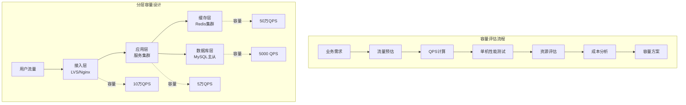

**代码实现：**

```java
/**
 * 容量计算工具类
 */
public class CapacityCalculator {
    
    /**
     * 计算所需QPS
     */
    public static long calculateQPS(long dau, int avgRequestPerUser, 
                                     double peakFactor, double safetyFactor) {
        long avgQPS = (dau * avgRequestPerUser) / 86400;
        long peakQPS = (long) (avgQPS * peakFactor);
        long designQPS = (long) (peakQPS * safetyFactor);
        
        System.out.println("平均QPS: " + avgQPS);
        System.out.println("高峰QPS: " + peakQPS);
        System.out.println("设计QPS: " + designQPS);
        
        return designQPS;
    }
    
    /**
     * 计算所需机器数
     */
    public static int calculateMachineCount(long designQPS, int singleMachineQPS, 
                                             double redundancyFactor) {
        int theoreticalCount = (int) Math.ceil((double) designQPS / singleMachineQPS);
        int actualCount = (int) Math.ceil(theoreticalCount * redundancyFactor);
        
        System.out.println("理论机器数: " + theoreticalCount);
        System.out.println("实际机器数: " + actualCount);
        
        return actualCount;
    }
    
    /**
     * 示例：电商系统容量设计
     */
    public static void main(String[] args) {
        System.out.println("=== 电商系统容量设计 ===\n");
        
        long dau = 1_000_000; // 100万日活
        int avgRequestPerUser = 50;
        double peakFactor = 5.0;
        double safetyFactor = 2.0;
        
        long designQPS = calculateQPS(dau, avgRequestPerUser, peakFactor, safetyFactor);
        
        int singleMachineQPS = 2000;
        int appServerCount = calculateMachineCount(designQPS, singleMachineQPS, 1.5);
    }
}
```

**最佳实践：**

1. **压测验证**：容量设计必须通过压测验证，模拟真实业务场景
2. **冗余设计**：预留30-50%资源应对突发流量
3. **分层设计**：接入层、应用层、缓存层、数据库层分别设计
4. **监控告警**：实时监控QPS、响应时间、错误率
5. **弹性伸缩**：使用容器化部署，配置自动扩缩容
6. **容量规划周期**：日常监控、月度评估、季度规划、年度预算

---

### 4. 线程数究竟设多少合理

**问题分析：**

线程数设置是性能优化的关键参数，设置不当会导致：
- 线程过少：CPU利用率低，无法充分发挥硬件性能
- 线程过多：上下文切换频繁，内存占用高，性能反而下降

**解决方案：**

**1. 理论计算公式**

**CPU密集型任务**
```
线程数 = CPU核心数 + 1
```

**IO密集型任务**
```
线程数 = CPU核心数 × (1 + IO耗时 / CPU耗时)
```

**Web应用（Tomcat）**
```
线程数 = QPS × 响应时间（秒）
例如：QPS=1000，响应时间=100ms
线程数 = 1000 × 0.1 = 100
```

**代码实现：**

```java
/**
 * 线程池配置工具类
 */
public class ThreadPoolConfig {
    
    public static int getCpuCores() {
        return Runtime.getRuntime().availableProcessors();
    }
    
    /**
     * CPU密集型线程池
     */
    public static ThreadPoolExecutor createCpuIntensivePool() {
        int coreSize = getCpuCores() + 1;
        return new ThreadPoolExecutor(
            coreSize, coreSize,
            60L, TimeUnit.SECONDS,
            new LinkedBlockingQueue<>(100),
            new ThreadFactoryBuilder().setNameFormat("cpu-pool-%d").build(),
            new ThreadPoolExecutor.CallerRunsPolicy()
        );
    }
    
    /**
     * IO密集型线程池
     */
    public static ThreadPoolExecutor createIoIntensivePool() {
        int coreSize = getCpuCores() * 2;
        int maxSize = getCpuCores() * 4;
        return new ThreadPoolExecutor(
            coreSize, maxSize,
            60L, TimeUnit.SECONDS,
            new LinkedBlockingQueue<>(1000),
            new ThreadFactoryBuilder().setNameFormat("io-pool-%d").build(),
            new ThreadPoolExecutor.CallerRunsPolicy()
        );
    }
    
    /**
     * 根据任务特性计算线程数
     */
    public static int calculateThreadCount(long cpuTime, long waitTime, 
                                             double targetUtilization) {
        int cpuCores = getCpuCores();
        double ratio = (double) waitTime / cpuTime;
        int threadCount = (int) (cpuCores * targetUtilization * (1 + ratio));
        
        System.out.println("建议线程数: " + threadCount);
        return threadCount;
    }
}
```

**最佳实践：**

1. **根据任务类型选择**：CPU密集型用核心数+1，IO密集型用核心数×2-4
2. **压测验证**：在真实环境下压测，选择性价比最高的配置
3. **监控调优**：监控线程池活跃度、队列长度、任务拒绝率
4. **避免过度配置**：线程不是越多越好，每个线程占用约1MB内存
5. **数据库连接池**：10-50个连接通常足够，不宜过多

---

### 5. 单点系统架构的可用性与性能优化

**问题分析：**

单点系统是指系统中某个组件只有一个实例，一旦该组件故障，整个系统将不可用。单点问题是高可用架构的大敌。

常见单点场景：单机数据库、单实例应用、单点配置中心、单点任务调度

**解决方案：**

**1. 可用性优化**
- 主从架构：一主多从，主节点故障时从节点接管
- 双主架构：两个主节点互为备份
- 集群架构：多节点对等，无主从之分

**2. 性能优化**
- 垂直扩展：升级硬件
- 水平扩展：增加机器数量
- 缓存优化：多级缓存
- 异步化：消息队列解耦

**代码实现：**

```java
/**
 * 多级缓存
 */
@Service
public class MultiLevelCacheService {
    
    // L1缓存：本地缓存
    private LoadingCache<String, Object> localCache = Caffeine.newBuilder()
        .maximumSize(10_000)
        .expireAfterWrite(5, TimeUnit.MINUTES)
        .build(key -> loadFromL2Cache(key));
    
    @Autowired
    private RedisTemplate<String, Object> redisTemplate;
    
    public User getUser(Long userId) {
        String key = "user:" + userId;
        
        // 1. 查询本地缓存
        Object cached = localCache.get(key);
        if (cached != null) return (User) cached;
        
        // 2. 查询Redis
        User user = (User) redisTemplate.opsForValue().get(key);
        if (user != null) {
            localCache.put(key, user);
            return user;
        }
        
        // 3. 查询数据库
        user = userMapper.selectById(userId);
        if (user != null) {
            redisTemplate.opsForValue().set(key, user, 30, TimeUnit.MINUTES);
            localCache.put(key, user);
        }
        return user;
    }
    
    private Object loadFromL2Cache(String key) {
        return redisTemplate.opsForValue().get(key);
    }
}
```

**最佳实践：**

1. 消除单点：关键组件必须有备份
2. 性能优化：优先考虑水平扩展
3. 监控告警：实时监控组件健康状态
4. 降级预案：核心功能优先保障
5. 数据一致性：主从延迟监控

---

### 6. 一分钟了解负载均衡的一切

**问题分析：**

负载均衡是将请求分发到多个服务器的技术，目的是提高系统的可用性、性能和扩展性。

**解决方案：**

**1. 负载均衡分类**
- 四层负载均衡（L4）：基于IP+端口，如LVS、F5
- 七层负载均衡（L7）：基于HTTP协议，如Nginx、HAProxy

**2. 负载均衡算法**
- 轮询（Round Robin）：依次分发请求
- 加权轮询：根据服务器权重分配
- 最少连接：选择当前连接数最少的服务器
- IP哈希：根据客户端IP哈希选择服务器
- 一致性哈希：解决节点增减时的数据迁移问题

**代码实现：**

```java
/**
 * 轮询算法
 */
public class RoundRobinLoadBalancer {
    private AtomicInteger position = new AtomicInteger(0);
    
    public Server select(List<Server> servers) {
        if (servers.isEmpty()) return null;
        int pos = position.getAndIncrement() % servers.size();
        return servers.get(pos);
    }
}

/**
 * 加权轮询算法
 */
public class WeightedRoundRobinLoadBalancer {
    private AtomicInteger position = new AtomicInteger(0);
    
    public Server select(List<Server> servers) {
        int totalWeight = servers.stream()
            .mapToInt(Server::getWeight).sum();
        
        int pos = position.getAndIncrement() % totalWeight;
        int currentWeight = 0;
        
        for (Server server : servers) {
            currentWeight += server.getWeight();
            if (pos < currentWeight) {
                return server;
            }
        }
        return servers.get(0);
    }
}

/**
 * 一致性哈希算法
 */
public class ConsistentHashLoadBalancer {
    private TreeMap<Integer, Server> ring = new TreeMap<>();
    private int virtualNodes = 150;
    
    public void addServer(Server server) {
        for (int i = 0; i < virtualNodes; i++) {
            String virtualKey = server.getIp() + "#" + i;
            int hash = hash(virtualKey);
            ring.put(hash, server);
        }
    }
    
    public Server select(String key) {
        int hash = hash(key);
        Map.Entry<Integer, Server> entry = ring.ceilingEntry(hash);
        if (entry == null) entry = ring.firstEntry();
        return entry.getValue();
    }
    
    private int hash(String key) {
        return Math.abs(key.hashCode());
    }
}
```

**Nginx配置：**

```nginx
upstream backend {
    server 192.168.1.10:8080 weight=3;
    server 192.168.1.11:8080 weight=2;
    server 192.168.1.12:8080 weight=1;
    
    # 健康检查
    check interval=3000 rise=2 fall=3 timeout=1000;
}

server {
    listen 80;
    location / {
        proxy_pass http://backend;
    }
}
```

**最佳实践：**

1. 分层负载均衡：LVS做四层，Nginx做七层
2. 健康检查：定期检查后端服务器
3. 会话保持：使用IP哈希或Cookie
4. 动态权重：根据服务器性能调整
5. 监控告警：监控负载均衡器状态

---

### 7. lvs为何不能完全替代DNS轮询

**问题分析：**

LVS（Linux Virtual Server）和DNS轮询都是负载均衡技术，但各有优缺点，不能完全互相替代。

**DNS轮询特点：**
- 原理：DNS返回多个IP地址，客户端随机选择
- 优点：简单、成本低、跨地域
- 缺点：无健康检查、缓存导致不均衡、切换慢

**LVS特点：**
- 原理：四层负载均衡，转发数据包
- 优点：性能高、健康检查、实时切换
- 缺点：单地域、需要专门部署

**解决方案：**

**1. DNS轮询适用场景**
- 跨地域负载均衡（如CDN）
- 多机房容灾
- 简单的流量分发
- 成本敏感的场景

**2. LVS适用场景**
- 单地域高性能负载均衡
- 需要健康检查
- 需要实时故障切换
- 需要精确的流量控制

**3. 组合使用**
```
DNS轮询（跨地域）
    ↓
LVS（地域内四层负载）
    ↓
Nginx（七层负载）
    ↓
应用服务器
```

**架构设计：**

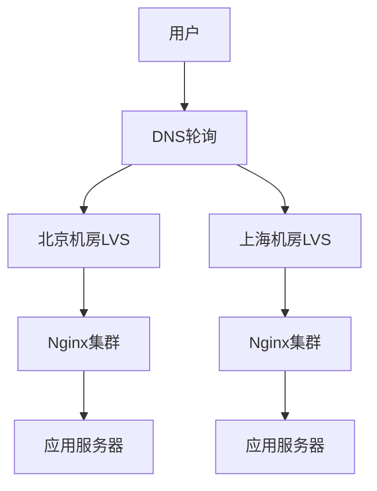

**DNS配置示例：**

```bash
# DNS轮询配置
www.example.com.  IN  A  1.1.1.1  ; 北京机房
www.example.com.  IN  A  2.2.2.2  ; 上海机房
www.example.com.  IN  A  3.3.3.3  ; 广州机房
```

**最佳实践：**

1. **分层使用**：DNS做跨地域，LVS做地域内
2. **智能DNS**：根据用户地理位置返回最近的IP
3. **健康检查**：DNS配合监控，自动摘除故障机房
4. **TTL设置**：DNS TTL不宜过长，便于快速切换
5. **混合架构**：DNS + LVS + Nginx三层负载

**对比总结：**

| 特性 | DNS轮询 | LVS |
|------|---------|-----|
| 性能 | 一般 | 极高（50万+QPS） |
| 健康检查 | 无 | 有 |
| 故障切换 | 慢（受TTL影响） | 快（秒级） |
| 跨地域 | 支持 | 不支持 |
| 成本 | 低 | 中 |
| 复杂度 | 低 | 中 |

---

### 8. 如何实施异构服务器的负载均衡及过载保护？

**问题分析：**

异构服务器是指性能不同的服务器（如不同CPU、内存配置），如果使用相同的负载均衡策略，会导致性能差的服务器过载，性能好的服务器资源浪费。

**解决方案：**

**1. 加权负载均衡**

根据服务器性能设置不同权重：
- 高性能服务器：权重高
- 低性能服务器：权重低

```nginx
upstream backend {
    server 192.168.1.10:8080 weight=5;  # 高性能：8核16G
    server 192.168.1.11:8080 weight=3;  # 中性能：4核8G
    server 192.168.1.12:8080 weight=1;  # 低性能：2核4G
}
```

**2. 动态权重调整**

根据服务器实时负载动态调整权重：

```java
@Component
public class DynamicWeightAdjuster {
    
    @Scheduled(fixedRate = 10000)
    public void adjustWeights() {
        List<Server> servers = getServers();
        
        for (Server server : servers) {
            // 获取服务器负载
            ServerMetrics metrics = getMetrics(server);
            
            // 根据CPU、内存、响应时间计算权重
            int weight = calculateWeight(metrics);
            
            // 更新权重
            updateWeight(server, weight);
        }
    }
    
    private int calculateWeight(ServerMetrics metrics) {
        // CPU使用率越低，权重越高
        double cpuFactor = 1.0 - metrics.getCpuUsage();
        
        // 内存使用率越低，权重越高
        double memFactor = 1.0 - metrics.getMemUsage();
        
        // 响应时间越短，权重越高
        double rtFactor = 1.0 / (metrics.getResponseTime() / 100.0);
        
        // 综合计算权重
        int weight = (int) ((cpuFactor + memFactor + rtFactor) * 100);
        
        // 权重范围：1-10
        return Math.max(1, Math.min(10, weight));
    }
}
```

**3. 过载保护**

**限流保护**
```java
@Component
public class OverloadProtection {
    
    private Map<Server, RateLimiter> limiters = new ConcurrentHashMap<>();
    
    public boolean allowRequest(Server server) {
        // 根据服务器性能设置不同的限流阈值
        RateLimiter limiter = limiters.computeIfAbsent(server, s -> {
            int qps = s.getMaxQps(); // 根据服务器性能设置
            return RateLimiter.create(qps);
        });
        
        return limiter.tryAcquire();
    }
}
```

**熔断降级**
```java
@Service
public class CircuitBreakerService {
    
    private Map<Server, CircuitBreaker> breakers = new ConcurrentHashMap<>();
    
    public <T> T execute(Server server, Supplier<T> supplier) {
        CircuitBreaker breaker = breakers.computeIfAbsent(server, 
            s -> CircuitBreaker.ofDefaults("server-" + s.getId()));
        
        try {
            return breaker.executeSupplier(supplier);
        } catch (Exception e) {
            log.error("服务器{}调用失败", server.getIp(), e);
            throw e;
        }
    }
}
```

**自适应限流**
```java
@Component
public class AdaptiveLimiter {
    
    public boolean allowRequest(Server server) {
        ServerMetrics metrics = getMetrics(server);
        
        // CPU使用率超过80%，开始限流
        if (metrics.getCpuUsage() > 0.8) {
            double rejectRate = (metrics.getCpuUsage() - 0.8) / 0.2;
            return Math.random() > rejectRate;
        }
        
        // 响应时间超过阈值，开始限流
        if (metrics.getResponseTime() > 1000) {
            return Math.random() > 0.5;
        }
        
        return true;
    }
}
```

**架构设计：**

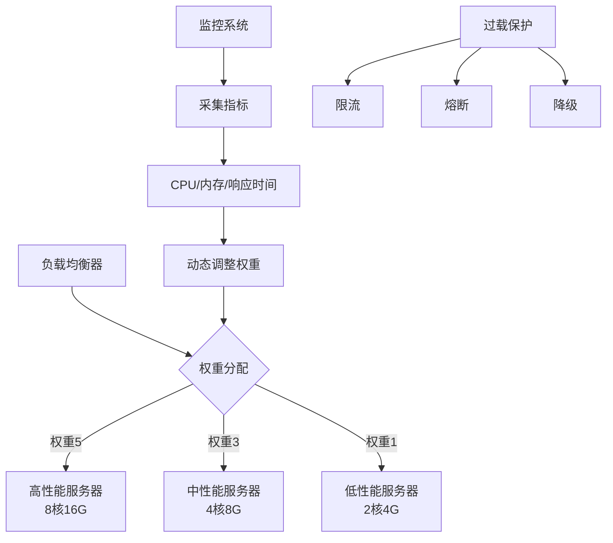

**最佳实践：**

1. **性能评估**：压测确定每台服务器的最大QPS
2. **加权分配**：根据性能设置初始权重
3. **动态调整**：根据实时负载动态调整权重
4. **过载保护**：限流、熔断、降级多重保护
5. **监控告警**：实时监控服务器负载，及时告警
6. **平滑上线**：新服务器逐步增加权重，避免突然过载

---

### 9. 究竟啥才是互联网架构"高并发"

**问题分析：**

高并发是指系统能够同时处理大量请求的能力。但"高并发"是一个相对概念，不同业务场景对高并发的定义不同。

**高并发的衡量指标：**
- QPS（每秒查询数）：系统每秒处理的请求数
- TPS（每秒事务数）：系统每秒完成的事务数
- 并发用户数：同时在线的用户数
- 响应时间：请求的处理时间

**不同场景的高并发标准：**
- 小型网站：1000 QPS
- 中型网站：1万 QPS
- 大型网站：10万 QPS
- 超大型网站：100万+ QPS

**解决方案：**

**1. 高并发架构设计原则**

**无状态化**
- 应用服务器不保存状态
- 状态存储在缓存或数据库
- 便于水平扩展

**分层架构**
- 接入层：负载均衡
- 应用层：业务逻辑
- 缓存层：热点数据
- 数据层：持久化存储

**异步化**
- 同步改异步
- 消息队列削峰填谷
- 提升系统吞吐量

**缓存**
- 多级缓存
- 减少数据库压力
- 提升响应速度

**2. 高并发优化技术**

**前端优化**
```javascript
// 防抖：减少请求频率
function debounce(func, wait) {
    let timeout;
    return function() {
        clearTimeout(timeout);
        timeout = setTimeout(() => func.apply(this, arguments), wait);
    };
}

// 节流：限制请求频率
function throttle(func, wait) {
    let lastTime = 0;
    return function() {
        const now = Date.now();
        if (now - lastTime >= wait) {
            func.apply(this, arguments);
            lastTime = now;
        }
    };
}
```

**接入层优化**
```nginx
# Nginx限流
limit_req_zone $binary_remote_addr zone=one:10m rate=10r/s;

server {
    location /api/ {
        limit_req zone=one burst=20 nodelay;
        proxy_pass http://backend;
    }
}
```

**应用层优化**
```java
/**
 * 连接池复用
 */
@Configuration
public class HttpClientConfig {
    
    @Bean
    public CloseableHttpClient httpClient() {
        PoolingHttpClientConnectionManager cm = 
            new PoolingHttpClientConnectionManager();
        cm.setMaxTotal(200);
        cm.setDefaultMaxPerRoute(20);
        
        return HttpClients.custom()
            .setConnectionManager(cm)
            .build();
    }
}

/**
 * 异步处理
 */
@Service
public class AsyncService {
    
    @Async
    public CompletableFuture<String> asyncTask() {
        // 异步执行耗时任务
        return CompletableFuture.completedFuture("result");
    }
}
```

**缓存层优化**
```java
/**
 * 缓存预热
 */
@Component
public class CacheWarmer {
    
    @PostConstruct
    public void warmUp() {
        // 启动时预加载热点数据
        List<Product> hotProducts = productService.getHotProducts();
        for (Product product : hotProducts) {
            String key = "product:" + product.getId();
            redisTemplate.opsForValue().set(key, product);
        }
    }
}

/**
 * 缓存穿透保护
 */
public Object getWithBloomFilter(String key) {
    // 布隆过滤器判断key是否存在
    if (!bloomFilter.mightContain(key)) {
        return null;
    }
    
    // 查询缓存
    Object value = redisTemplate.opsForValue().get(key);
    if (value != null) {
        return value;
    }
    
    // 查询数据库
    value = database.query(key);
    if (value != null) {
        redisTemplate.opsForValue().set(key, value);
    }
    
    return value;
}
```

**数据库优化**
```java
/**
 * 批量操作
 */
public void batchInsert(List<User> users) {
    // 批量插入，减少数据库交互次数
    userMapper.batchInsert(users);
}

/**
 * 读写分离
 */
@Transactional(readOnly = true)
public User getUser(Long id) {
    // 只读操作，路由到从库
    return userMapper.selectById(id);
}

@Transactional
public void updateUser(User user) {
    // 写操作，路由到主库
    userMapper.updateById(user);
}
```

**架构设计：**

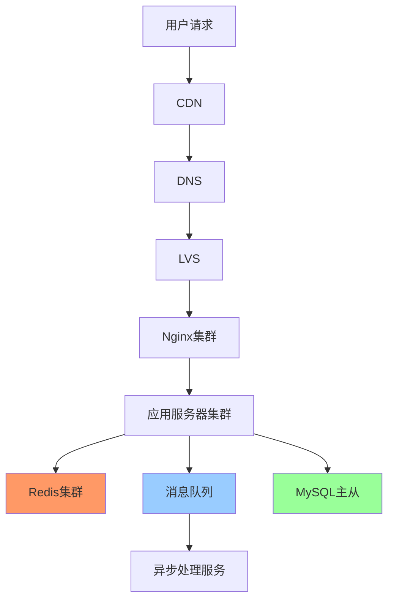

**最佳实践：**

1. **分层优化**：每一层都要优化，不能有短板
2. **缓存为王**：合理使用缓存，减少数据库压力
3. **异步解耦**：同步改异步，提升吞吐量
4. **水平扩展**：无状态设计，便于扩容
5. **监控告警**：实时监控QPS、响应时间、错误率
6. **压测验证**：上线前必须压测，验证系统容量
7. **降级预案**：准备降级方案，保证核心功能

**高并发优化检查清单：**
- [ ] 前端：防抖节流、资源压缩、CDN加速
- [ ] 接入层：负载均衡、限流、连接复用
- [ ] 应用层：无状态、异步化、连接池
- [ ] 缓存层：多级缓存、缓存预热、防穿透
- [ ] 数据库：读写分离、分库分表、索引优化
- [ ] 消息队列：削峰填谷、异步处理
- [ ] 监控：实时监控、告警、日志

---

### 10. 究竟啥才是互联网架构"高可用"

**问题分析：**

高可用（High Availability，HA）是指系统能够持续提供服务的能力，通常用可用性百分比来衡量。

**可用性计算：**
```
可用性 = 正常运行时间 / 总时间 × 100%

99.9%（3个9）：年故障时间 8.76小时
99.99%（4个9）：年故障时间 52.56分钟
99.999%（5个9）：年故障时间 5.26分钟
```

**高可用的核心：**
- 消除单点故障
- 故障自动切换
- 数据不丢失
- 服务快速恢复

**解决方案：**

**1. 冗余设计**

**主从架构**
```
主节点 + 从节点
主节点故障时，从节点接管
```

**集群架构**
```
多个对等节点
任意节点故障，其他节点继续服务
```

**多机房容灾**
```
同城双活：两个机房同时提供服务
异地多活：多个地域同时提供服务
```

**2. 故障检测与切换**

```java
/**
 * 健康检查
 */
@Component
public class HealthChecker {
    
    @Scheduled(fixedRate = 5000)
    public void checkHealth() {
        for (Server server : servers) {
            boolean healthy = doHealthCheck(server);
            
            if (!healthy) {
                // 标记为不健康
                server.setHealthy(false);
                
                // 触发告警
                alertService.alert("服务器不健康: " + server.getIp());
                
                // 自动摘除
                loadBalancer.removeServer(server);
            }
        }
    }
}

/**
 * 自动故障切换
 */
@Component
public class FailoverManager {
    
    public void failover(Server failedServer) {
        log.warn("服务器故障，开始切换: {}", failedServer.getIp());
        
        // 1. 摘除故障节点
        loadBalancer.removeServer(failedServer);
        
        // 2. 如果是主节点，提升从节点
        if (failedServer.isMaster()) {
            Server slave = selectBestSlave();
            promoteToMaster(slave);
        }
        
        // 3. 通知监控系统
        monitorService.notifyFailover(failedServer);
        
        log.info("故障切换完成");
    }
}
```

**3. 数据备份与恢复**

```java
/**
 * 数据备份
 */
@Component
public class BackupService {
    
    @Scheduled(cron = "0 0 2 * * ?") // 每天凌晨2点
    public void backup() {
        String backupFile = "backup_" + LocalDate.now() + ".sql";
        
        // 执行备份
        String cmd = String.format(
            "mysqldump -h%s -u%s -p%s %s > %s",
            host, user, password, database, backupFile
        );
        
        executeCommand(cmd);
        
        // 上传到云存储
        uploadToCloud(backupFile);
        
        log.info("数据备份完成: {}", backupFile);
    }
}

/**
 * 数据恢复
 */
public void restore(String backupFile) {
    String cmd = String.format(
        "mysql -h%s -u%s -p%s %s < %s",
        host, user, password, database, backupFile
    );
    
    executeCommand(cmd);
    
    log.info("数据恢复完成");
}
```

**4. 限流降级**

```java
/**
 * 限流
 */
@Component
public class RateLimiterService {
    
    private RateLimiter limiter = RateLimiter.create(1000); // 1000 QPS
    
    public boolean tryAcquire() {
        return limiter.tryAcquire();
    }
}

/**
 * 降级
 */
@Service
public class DegradeService {
    
    private volatile boolean degraded = false;
    
    public Object invoke() {
        if (degraded) {
            // 降级：返回默认值或缓存数据
            return getDefaultValue();
        }
        
        try {
            return normalInvoke();
        } catch (Exception e) {
            // 异常时自动降级
            degraded = true;
            return getDefaultValue();
        }
    }
}
```

**架构设计：**

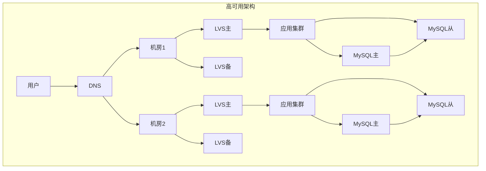

**最佳实践：**

1. **消除单点**：所有关键组件都要有冗余
2. **自动切换**：故障自动检测和切换，减少人工干预
3. **数据备份**：定期备份，异地存储
4. **限流降级**：保护系统，保证核心功能
5. **监控告警**：实时监控，快速响应
6. **容灾演练**：定期演练，验证方案有效性
7. **灰度发布**：降低发布风险

**高可用设计检查清单：**
- [ ] 是否有单点故障？
- [ ] 故障能否自动切换？
- [ ] 数据是否有备份？
- [ ] 是否有监控告警？
- [ ] 是否有降级预案？
- [ ] 是否定期演练？
- [ ] RTO/RPO是否满足要求？

---

### 11. 100亿数据1万属性数据架构设计

**问题分析：**

海量数据（100亿条）+ 海量属性（1万个属性）的存储和查询是典型的大数据架构挑战。传统关系型数据库无法满足需求。

**核心挑战：**
- 存储：100亿 × 1万属性，数据量巨大
- 查询：如何快速检索特定属性
- 扩展：如何支持属性动态增加
- 性能：如何保证查询性能

**解决方案：**

**方案1：列式存储（HBase/Cassandra）**

适合海量数据、稀疏属性的场景。

```java
/**
 * HBase存储方案
 */
public class HBaseStorage {
    
    /**
     * 表设计：
     * RowKey: 数据ID
     * ColumnFamily: 属性分类（如基础属性、扩展属性）
     * Column: 具体属性名
     * Value: 属性值
     */
    public void saveData(String id, Map<String, String> attributes) {
        Table table = connection.getTable(TableName.valueOf("data_table"));
        
        Put put = new Put(Bytes.toBytes(id));
        
        for (Map.Entry<String, String> entry : attributes.entrySet()) {
            String attrName = entry.getKey();
            String attrValue = entry.getValue();
            
            // 根据属性类型选择列族
            String cf = getColumnFamily(attrName);
            
            put.addColumn(
                Bytes.toBytes(cf),
                Bytes.toBytes(attrName),
                Bytes.toBytes(attrValue)
            );
        }
        
        table.put(put);
    }
    
    public Map<String, String> getData(String id) {
        Table table = connection.getTable(TableName.valueOf("data_table"));
        
        Get get = new Get(Bytes.toBytes(id));
        Result result = table.get(get);
        
        Map<String, String> attributes = new HashMap<>();
        
        for (Cell cell : result.rawCells()) {
            String attrName = Bytes.toString(CellUtil.cloneQualifier(cell));
            String attrValue = Bytes.toString(CellUtil.cloneValue(cell));
            attributes.put(attrName, attrValue);
        }
        
        return attributes;
    }
}
```

**方案2：文档存储（MongoDB/Elasticsearch）**

适合属性动态变化、需要复杂查询的场景。

```java
/**
 * MongoDB存储方案
 */
@Service
public class MongoStorage {
    
    @Autowired
    private MongoTemplate mongoTemplate;
    
    /**
     * 文档结构：
     * {
     *   "_id": "数据ID",
     *   "attr1": "value1",
     *   "attr2": "value2",
     *   ...
     *   "attr10000": "value10000"
     * }
     */
    public void saveData(String id, Map<String, Object> attributes) {
        Document doc = new Document("_id", id);
        doc.putAll(attributes);
        
        mongoTemplate.save(doc, "data_collection");
    }
    
    public Map<String, Object> getData(String id) {
        Document doc = mongoTemplate.findById(id, Document.class, "data_collection");
        return doc != null ? new HashMap<>(doc) : null;
    }
    
    /**
     * 按属性查询
     */
    public List<Map<String, Object>> queryByAttribute(String attrName, Object attrValue) {
        Query query = new Query(Criteria.where(attrName).is(attrValue));
        
        List<Document> docs = mongoTemplate.find(query, Document.class, "data_collection");
        
        return docs.stream()
            .map(doc -> new HashMap<String, Object>(doc))
            .collect(Collectors.toList());
    }
}
```

**方案3：分库分表 + KV存储**

核心属性存MySQL，扩展属性存Redis/HBase。

```java
/**
 * 混合存储方案
 */
@Service
public class HybridStorage {
    
    @Autowired
    private DataMapper dataMapper;
    
    @Autowired
    private RedisTemplate<String, Object> redisTemplate;
    
    /**
     * 核心属性存MySQL
     */
    public void saveCoreData(DataEntity entity) {
        dataMapper.insert(entity);
    }
    
    /**
     * 扩展属性存Redis
     */
    public void saveExtAttributes(String id, Map<String, String> extAttrs) {
        String key = "data:ext:" + id;
        redisTemplate.opsForHash().putAll(key, extAttrs);
    }
    
    /**
     * 查询完整数据
     */
    public DataVO getData(String id) {
        // 1. 查询核心属性
        DataEntity entity = dataMapper.selectById(id);
        
        // 2. 查询扩展属性
        String key = "data:ext:" + id;
        Map<Object, Object> extAttrs = redisTemplate.opsForHash().entries(key);
        
        // 3. 组装返回
        DataVO vo = new DataVO();
        BeanUtils.copyProperties(entity, vo);
        vo.setExtAttributes(extAttrs);
        
        return vo;
    }
}
```

**方案4：搜索引擎（Elasticsearch）**

适合需要全文检索、复杂查询的场景。

```java
/**
 * Elasticsearch存储方案
 */
@Service
public class EsStorage {
    
    @Autowired
    private ElasticsearchRestTemplate esTemplate;
    
    /**
     * 索引设计：动态映射
     */
    public void saveData(String id, Map<String, Object> attributes) {
        IndexQuery query = new IndexQueryBuilder()
            .withId(id)
            .withObject(attributes)
            .build();
        
        esTemplate.index(query, IndexCoordinates.of("data_index"));
    }
    
    /**
     * 多条件查询
     */
    public List<Map<String, Object>> search(Map<String, Object> conditions) {
        BoolQueryBuilder boolQuery = QueryBuilders.boolQuery();
        
        for (Map.Entry<String, Object> entry : conditions.entrySet()) {
            boolQuery.must(QueryBuilders.termQuery(entry.getKey(), entry.getValue()));
        }
        
        NativeSearchQuery searchQuery = new NativeSearchQueryBuilder()
            .withQuery(boolQuery)
            .build();
        
        SearchHits<Map> hits = esTemplate.search(searchQuery, Map.class, 
            IndexCoordinates.of("data_index"));
        
        return hits.stream()
            .map(hit -> hit.getContent())
            .collect(Collectors.toList());
    }
}
```

**架构设计：**

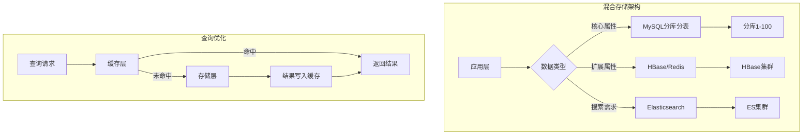

**最佳实践：**

1. **分层存储**：
   - 热数据：Redis（内存）
   - 温数据：MySQL（SSD）
   - 冷数据：HBase/HDFS（机械盘）

2. **属性分类**：
   - 核心属性：MySQL，支持事务
   - 扩展属性：NoSQL，灵活扩展
   - 搜索属性：ES，全文检索

3. **分库分表**：
   - 按ID哈希分库：100个库
   - 按时间分表：每月一张表
   - 单表控制在1000万以内

4. **索引优化**：
   - 常用查询字段建索引
   - 避免全表扫描
   - 使用覆盖索引

5. **缓存策略**：
   - 热点数据缓存
   - 缓存预热
   - 缓存更新策略

6. **数据压缩**：
   - HBase开启压缩（Snappy/LZO）
   - 减少存储空间
   - 提升IO性能

**性能优化：**

```java
/**
 * 批量查询优化
 */
public List<DataVO> batchGetData(List<String> ids) {
    // 1. 批量查询缓存
    List<String> cacheKeys = ids.stream()
        .map(id -> "data:" + id)
        .collect(Collectors.toList());
    
    List<Object> cached = redisTemplate.opsForValue().multiGet(cacheKeys);
    
    // 2. 找出未命中的ID
    List<String> missedIds = new ArrayList<>();
    for (int i = 0; i < ids.size(); i++) {
        if (cached.get(i) == null) {
            missedIds.add(ids.get(i));
        }
    }
    
    // 3. 批量查询数据库
    if (!missedIds.isEmpty()) {
        List<DataEntity> entities = dataMapper.selectBatchIds(missedIds);
        
        // 4. 写入缓存
        for (DataEntity entity : entities) {
            String key = "data:" + entity.getId();
            redisTemplate.opsForValue().set(key, entity, 1, TimeUnit.HOURS);
        }
    }
    
    // 5. 组装结果
    return assembleResult(cached, missedIds);
}
```

---

### 12. 架构设计中常见"反向依赖"与解耦方案

**问题分析：**

反向依赖是指底层模块依赖上层模块，违反了依赖倒置原则，导致系统耦合度高、难以维护和扩展。

**常见反向依赖场景：**
- 数据层依赖业务层
- 通用模块依赖业务模块
- 基础服务依赖上层服务

**解决方案：**

**1. 依赖倒置原则（DIP）**

高层模块和低层模块都依赖抽象，而不是相互依赖。

```java
/**
 * 错误示例：反向依赖
 */
// 通用消息服务依赖具体业务
public class MessageService {
    @Autowired
    private OrderService orderService; // 反向依赖
    
    public void sendMessage(String userId) {
        Order order = orderService.getOrder(userId);
        // 发送消息
    }
}

/**
 * 正确示例：依赖倒置
 */
// 定义抽象接口
public interface MessageContentProvider {
    String getContent(String userId);
}

// 通用消息服务依赖抽象
public class MessageService {
    @Autowired
    private MessageContentProvider contentProvider;
    
    public void sendMessage(String userId) {
        String content = contentProvider.getContent(userId);
        // 发送消息
    }
}

// 业务层实现接口
@Service
public class OrderMessageProvider implements MessageContentProvider {
    @Autowired
    private OrderService orderService;
    
    @Override
    public String getContent(String userId) {
        Order order = orderService.getOrder(userId);
        return "您的订单" + order.getId() + "已发货";
    }
}
```

**2. 事件驱动解耦**

使用事件机制解耦模块间依赖。

```java
/**
 * 定义事件
 */
public class OrderCreatedEvent {
    private Long orderId;
    private Long userId;
    private BigDecimal amount;
    // getters and setters
}

/**
 * 发布事件
 */
@Service
public class OrderService {
    @Autowired
    private ApplicationEventPublisher eventPublisher;
    
    public void createOrder(Order order) {
        // 创建订单
        orderMapper.insert(order);
        
        // 发布事件（不依赖其他服务）
        OrderCreatedEvent event = new OrderCreatedEvent();
        event.setOrderId(order.getId());
        event.setUserId(order.getUserId());
        event.setAmount(order.getAmount());
        
        eventPublisher.publishEvent(event);
    }
}

/**
 * 监听事件
 */
@Component
public class OrderEventListener {
    
    @Autowired
    private NotificationService notificationService;
    
    @Autowired
    private PointsService pointsService;
    
    @EventListener
    public void handleOrderCreated(OrderCreatedEvent event) {
        // 发送通知
        notificationService.sendOrderNotification(event.getUserId(), event.getOrderId());
        
        // 增加积分
        pointsService.addPoints(event.getUserId(), event.getAmount());
    }
}
```

**3. 消息队列解耦**

使用MQ实现服务间异步解耦。

```java
/**
 * 生产者：发送消息
 */
@Service
public class OrderService {
    @Autowired
    private RabbitTemplate rabbitTemplate;
    
    public void createOrder(Order order) {
        // 创建订单
        orderMapper.insert(order);
        
        // 发送MQ消息
        OrderMessage message = new OrderMessage(order);
        rabbitTemplate.convertAndSend("order.exchange", "order.created", message);
    }
}

/**
 * 消费者：处理消息
 */
@Component
public class OrderMessageConsumer {
    
    @RabbitListener(queues = "order.notification.queue")
    public void handleNotification(OrderMessage message) {
        // 发送通知
        notificationService.send(message);
    }
    
    @RabbitListener(queues = "order.points.queue")
    public void handlePoints(OrderMessage message) {
        // 增加积分
        pointsService.add(message);
    }
}
```

**4. 回调机制解耦**

底层模块提供回调接口，上层模块实现回调。

```java
/**
 * 底层模块：定义回调接口
 */
public interface DataProcessor {
    void process(Data data);
}

public class DataImportService {
    private List<DataProcessor> processors = new ArrayList<>();
    
    public void registerProcessor(DataProcessor processor) {
        processors.add(processor);
    }
    
    public void importData(List<Data> dataList) {
        for (Data data : dataList) {
            // 导入数据
            save(data);
            
            // 回调处理器
            for (DataProcessor processor : processors) {
                processor.process(data);
            }
        }
    }
}

/**
 * 上层模块：实现回调
 */
@Component
public class OrderDataProcessor implements DataProcessor {
    
    @Override
    public void process(Data data) {
        // 处理订单相关逻辑
        if ("order".equals(data.getType())) {
            processOrder(data);
        }
    }
}
```

**5. 依赖注入解耦**

使用Spring的依赖注入实现解耦。

```java
/**
 * 定义接口
 */
public interface PaymentService {
    void pay(Order order);
}

/**
 * 多种实现
 */
@Service("alipayService")
public class AlipayService implements PaymentService {
    @Override
    public void pay(Order order) {
        // 支付宝支付
    }
}

@Service("wechatPayService")
public class WechatPayService implements PaymentService {
    @Override
    public void pay(Order order) {
        // 微信支付
    }
}

/**
 * 使用方：依赖接口
 */
@Service
public class OrderService {
    
    @Autowired
    @Qualifier("alipayService")
    private PaymentService paymentService;
    
    public void payOrder(Order order) {
        paymentService.pay(order);
    }
}
```

**架构设计：**

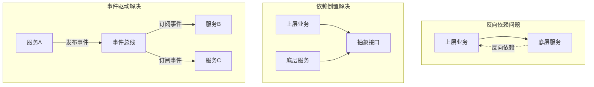

**最佳实践：**

1. **依赖抽象**：模块间依赖接口，不依赖具体实现
2. **事件驱动**：使用事件解耦同步依赖
3. **消息队列**：使用MQ解耦异步依赖
4. **分层清晰**：严格遵守分层架构，下层不依赖上层
5. **接口隔离**：接口职责单一，避免接口污染
6. **依赖注入**：使用IoC容器管理依赖

**重构步骤：**

1. 识别反向依赖
2. 提取抽象接口
3. 上层实现接口
4. 底层依赖接口
5. 测试验证
6. 逐步迁移

---

### 13. 典型数据库架构设计与实践

**问题分析：**

数据库架构设计需要考虑性能、可用性、扩展性、一致性等多个维度。

**典型架构演进：**
1. 单机数据库
2. 主从架构（读写分离）
3. 分库分表
4. 分布式数据库

**解决方案：**

**1. 主从架构（读写分离）**

```java
/**
 * 动态数据源配置
 */
@Configuration
public class DataSourceConfig {
    
    @Bean
    public DataSource dataSource() {
        DynamicDataSource dynamicDataSource = new DynamicDataSource();
        
        // 主库
        DataSource master = createDataSource("jdbc:mysql://master:3306/db");
        
        // 从库
        DataSource slave1 = createDataSource("jdbc:mysql://slave1:3306/db");
        DataSource slave2 = createDataSource("jdbc:mysql://slave2:3306/db");
        
        Map<Object, Object> targetDataSources = new HashMap<>();
        targetDataSources.put("master", master);
        targetDataSources.put("slave1", slave1);
        targetDataSources.put("slave2", slave2);
        
        dynamicDataSource.setTargetDataSources(targetDataSources);
        dynamicDataSource.setDefaultTargetDataSource(master);
        
        return dynamicDataSource;
    }
}

/**
 * 读写分离路由
 */
@Aspect
@Component
public class DataSourceAspect {
    
    @Around("@annotation(org.springframework.transaction.annotation.Transactional)")
    public Object route(ProceedingJoinPoint pjp) throws Throwable {
        MethodSignature signature = (MethodSignature) pjp.getSignature();
        Transactional transactional = signature.getMethod()
            .getAnnotation(Transactional.class);
        
        if (transactional != null && transactional.readOnly()) {
            // 只读操作，路由到从库
            DataSourceContextHolder.setDataSource(selectSlave());
        } else {
            // 写操作，路由到主库
            DataSourceContextHolder.setDataSource("master");
        }
        
        try {
            return pjp.proceed();
        } finally {
            DataSourceContextHolder.clearDataSource();
        }
    }
    
    private String selectSlave() {
        // 随机选择从库
        int random = ThreadLocalRandom.current().nextInt(2);
        return "slave" + (random + 1);
    }
}
```

**2. 分库分表**

```java
/**
 * 分库分表策略
 */
@Component
public class ShardingStrategy {
    
    private static final int DB_COUNT = 8;  // 8个库
    private static final int TABLE_COUNT = 16; // 每库16张表
    
    /**
     * 根据用户ID分库
     */
    public String getDatabase(Long userId) {
        int dbIndex = (int) (userId % DB_COUNT);
        return "db_" + dbIndex;
    }
    
    /**
     * 根据用户ID分表
     */
    public String getTable(Long userId) {
        int tableIndex = (int) (userId % TABLE_COUNT);
        return "user_" + tableIndex;
    }
    
    /**
     * 获取完整表名
     */
    public String getFullTableName(Long userId) {
        return getDatabase(userId) + "." + getTable(userId);
    }
}

/**
 * 分库分表DAO
 */
@Repository
public class UserShardingDao {
    
    @Autowired
    private ShardingStrategy shardingStrategy;
    
    @Autowired
    private JdbcTemplate jdbcTemplate;
    
    public User selectById(Long userId) {
        String tableName = shardingStrategy.getFullTableName(userId);
        String sql = "SELECT * FROM " + tableName + " WHERE id = ?";
        
        return jdbcTemplate.queryForObject(sql, new BeanPropertyRowMapper<>(User.class), userId);
    }
    
    public void insert(User user) {
        String tableName = shardingStrategy.getFullTableName(user.getId());
        String sql = "INSERT INTO " + tableName + " (id, name, age) VALUES (?, ?, ?)";
        
        jdbcTemplate.update(sql, user.getId(), user.getName(), user.getAge());
    }
}
```

**3. ShardingSphere方案**

```yaml
# ShardingSphere配置
spring:
  shardingsphere:
    datasource:
      names: ds0,ds1,ds2,ds3
      ds0:
        type: com.zaxxer.hikari.HikariDataSource
        driver-class-name: com.mysql.cj.jdbc.Driver
        jdbc-url: jdbc:mysql://localhost:3306/db0
      ds1:
        jdbc-url: jdbc:mysql://localhost:3306/db1
      ds2:
        jdbc-url: jdbc:mysql://localhost:3306/db2
      ds3:
        jdbc-url: jdbc:mysql://localhost:3306/db3
    
    rules:
      sharding:
        tables:
          user:
            actual-data-nodes: ds$->{0..3}.user_$->{0..15}
            database-strategy:
              standard:
                sharding-column: user_id
                sharding-algorithm-name: db-inline
            table-strategy:
              standard:
                sharding-column: user_id
                sharding-algorithm-name: table-inline
        
        sharding-algorithms:
          db-inline:
            type: INLINE
            props:
              algorithm-expression: ds$->{user_id % 4}
          table-inline:
            type: INLINE
            props:
              algorithm-expression: user_$->{user_id % 16}
```

**4. 数据库连接池优化**

```java
/**
 * HikariCP配置
 */
@Configuration
public class HikariConfig {
    
    @Bean
    public DataSource dataSource() {
        HikariConfig config = new HikariConfig();
        config.setJdbcUrl("jdbc:mysql://localhost:3306/db");
        config.setUsername("user");
        config.setPassword("password");
        
        // 连接池大小
        config.setMaximumPoolSize(20);
        config.setMinimumIdle(5);
        
        // 连接超时
        config.setConnectionTimeout(30000);
        config.setIdleTimeout(600000);
        config.setMaxLifetime(1800000);
        
        // 性能优化
        config.addDataSourceProperty("cachePrepStmts", "true");
        config.addDataSourceProperty("prepStmtCacheSize", "250");
        config.addDataSourceProperty("prepStmtCacheSqlLimit", "2048");
        
        return new HikariDataSource(config);
    }
}
```

**架构设计：**

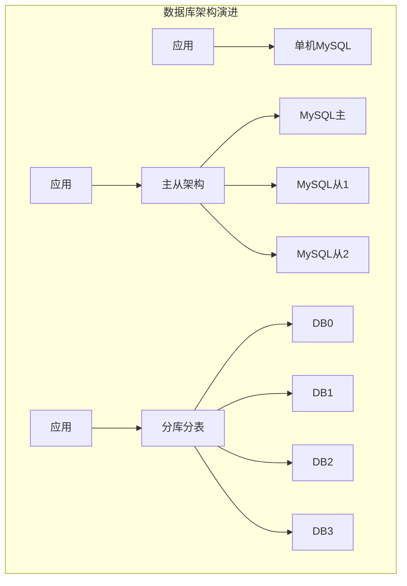

**最佳实践：**

1. **读写分离**：主库写，从库读，提升性能
2. **分库分表**：单表超过1000万考虑分表
3. **索引优化**：合理建立索引，避免全表扫描
4. **连接池**：使用HikariCP，合理配置连接数
5. **慢查询优化**：监控慢查询，及时优化
6. **数据归档**：历史数据归档，减轻主库压力

---

### 14. TCP接入层的负载均衡、高可用、扩展性架构

**问题分析：**

TCP接入层是系统的入口，需要处理海量长连接，要求高性能、高可用、易扩展。

**核心挑战：**
- 长连接管理：百万级连接
- 负载均衡：连接均匀分布
- 高可用：单点故障自动切换
- 扩展性：支持水平扩展

**解决方案：**

**1. 架构设计**

```
客户端 -> DNS -> LVS -> 接入服务器集群 -> 业务服务器
```

**2. 负载均衡方案**

```java
/**
 * 一致性哈希负载均衡
 */
public class ConsistentHashLoadBalancer {
    private TreeMap<Long, Server> ring = new TreeMap<>();
    
    public void addServer(Server server) {
        for (int i = 0; i < 150; i++) {
            long hash = hash(server.getIp() + "#" + i);
            ring.put(hash, server);
        }
    }
    
    public Server route(String clientId) {
        long hash = hash(clientId);
        Map.Entry<Long, Server> entry = ring.ceilingEntry(hash);
        return entry != null ? entry.getValue() : ring.firstEntry().getValue();
    }
}
```

**3. 连接管理**

```java
/**
 * 连接管理器
 */
public class ConnectionManager {
    private ConcurrentHashMap<String, Channel> connections = new ConcurrentHashMap<>();
    
    public void addConnection(String userId, Channel channel) {
        connections.put(userId, channel);
    }
    
    public void removeConnection(String userId) {
        connections.remove(userId);
    }
    
    public void sendMessage(String userId, String message) {
        Channel channel = connections.get(userId);
        if (channel != null && channel.isActive()) {
            channel.writeAndFlush(message);
        }
    }
}
```

**最佳实践：**

1. **一致性哈希**：保证同一用户连接到同一服务器
2. **心跳检测**：定期检测连接状态，清理死连接
3. **连接迁移**：服务器下线时平滑迁移连接
4. **限流保护**：单机连接数限制，防止过载

---

### 15. "配置"也有架构演进？看完深有痛感

**问题分析：**

配置管理是系统的重要组成部分，配置方式的演进反映了架构的成熟度。

**配置演进路径：**
1. 硬编码
2. 配置文件
3. 数据库配置
4. 配置中心

**解决方案：**

**配置中心架构**

```java
/**
 * 配置客户端
 */
@Component
public class ConfigClient {
    
    @Value("${config.center.url}")
    private String configCenterUrl;
    
    private Map<String, String> localCache = new ConcurrentHashMap<>();
    
    @PostConstruct
    public void init() {
        // 启动时拉取配置
        pullConfig();
        
        // 定期刷新
        scheduleRefresh();
        
        // 监听配置变化
        watchConfig();
    }
    
    public String getConfig(String key) {
        return localCache.get(key);
    }
}
```

**最佳实践：**

1. **配置分层**：环境配置、应用配置、业务配置
2. **版本管理**：配置变更可追溯、可回滚
3. **灰度发布**：配置变更支持灰度
4. **实时生效**：配置变更实时推送

---

### 16. 跨公网调用的大坑与架构优化方案

**问题分析：**

跨公网调用面临网络不稳定、延迟高、带宽受限等问题。

**常见问题：**
- 网络延迟：100-300ms
- 丢包重传：不稳定
- 带宽限制：上传慢
- 安全风险：数据泄露

**解决方案：**

**1. 协议优化**

```java
/**
 * 使用HTTP/2或gRPC
 */
@Configuration
public class GrpcConfig {
    
    @Bean
    public ManagedChannel grpcChannel() {
        return ManagedChannelBuilder
            .forAddress("api.example.com", 443)
            .useTransportSecurity()
            .keepAliveTime(30, TimeUnit.SECONDS)
            .build();
    }
}
```

**2. 数据压缩**

```java
/**
 * Gzip压缩
 */
public byte[] compress(String data) throws IOException {
    ByteArrayOutputStream bos = new ByteArrayOutputStream();
    GZIPOutputStream gzip = new GZIPOutputStream(bos);
    gzip.write(data.getBytes(StandardCharsets.UTF_8));
    gzip.close();
    return bos.toByteArray();
}
```

**3. 重试机制**

```java
/**
 * 指数退避重试
 */
public <T> T retryCall(Supplier<T> supplier) {
    int maxRetries = 3;
    int delay = 100;
    
    for (int i = 0; i < maxRetries; i++) {
        try {
            return supplier.get();
        } catch (Exception e) {
            if (i == maxRetries - 1) throw e;
            Thread.sleep(delay * (1 << i));
        }
    }
    return null;
}
```

**最佳实践：**

1. **协议选择**：使用HTTP/2、gRPC等高效协议
2. **数据压缩**：减少传输数据量
3. **超时控制**：设置合理超时时间
4. **重试机制**：指数退避重试
5. **熔断降级**：快速失败，避免雪崩
6. **加密传输**：HTTPS/TLS保证安全

---

### 17. DNS在架构设计中的巧用

**问题分析：**

DNS不仅用于域名解析，还可以用于负载均衡、容灾切换、灰度发布等场景。

**DNS应用场景：**

**1. 负载均衡**

```bash
# DNS轮询
www.example.com  IN  A  1.1.1.1
www.example.com  IN  A  2.2.2.2
www.example.com  IN  A  3.3.3.3
```

**2. 智能DNS**

根据用户地理位置返回最近的服务器IP。

**3. 容灾切换**

```java
/**
 * DNS故障切换
 */
public class DnsFailover {
    
    public void switchToDr() {
        // 主机房故障，切换DNS到备机房
        updateDnsRecord("www.example.com", "backup-ip");
    }
}
```

**4. 灰度发布**

```bash
# 10%流量到新版本
www.example.com  IN  A  1.1.1.1  weight=90
www.example.com  IN  A  2.2.2.2  weight=10
```

**最佳实践：**

1. **TTL设置**：根据场景设置合理TTL
2. **智能DNS**：根据地理位置就近接入
3. **健康检查**：自动摘除故障节点
4. **HTTPDNS**：避免DNS劫持

---

### 18. session一致性架构设计实践

**问题分析：**

分布式系统中，用户请求可能路由到不同服务器，如何保证session一致性是关键问题。

**解决方案：**

**方案1：Session Sticky（会话粘滞）**

```nginx
upstream backend {
    ip_hash;
    server 192.168.1.10:8080;
    server 192.168.1.11:8080;
}
```

优点：简单
缺点：负载不均衡，服务器故障session丢失

**方案2：Session复制**

所有服务器同步session。

优点：高可用
缺点：性能差，不适合大规模集群

**方案3：Session集中存储**

```java
/**
 * Redis存储Session
 */
@Configuration
@EnableRedisHttpSession
public class SessionConfig {
    
    @Bean
    public RedisConnectionFactory connectionFactory() {
        return new LettuceConnectionFactory();
    }
}

/**
 * 使用Session
 */
@RestController
public class UserController {
    
    @GetMapping("/login")
    public String login(HttpSession session) {
        session.setAttribute("user", user);
        return "success";
    }
    
    @GetMapping("/info")
    public User info(HttpSession session) {
        return (User) session.getAttribute("user");
    }
}
```

**方案4：Token方案（推荐）**

```java
/**
 * JWT Token
 */
public class JwtUtil {
    
    public String generateToken(User user) {
        return Jwts.builder()
            .setSubject(user.getId().toString())
            .setIssuedAt(new Date())
            .setExpiration(new Date(System.currentTimeMillis() + 86400000))
            .signWith(SignatureAlgorithm.HS256, SECRET_KEY)
            .compact();
    }
    
    public Long getUserId(String token) {
        Claims claims = Jwts.parser()
            .setSigningKey(SECRET_KEY)
            .parseClaimsJws(token)
            .getBody();
        return Long.parseLong(claims.getSubject());
    }
}
```

**最佳实践：**

1. **无状态化**：优先使用Token，避免Session
2. **集中存储**：如需Session，使用Redis集中存储
3. **过期策略**：设置合理过期时间
4. **安全性**：Token签名，防止篡改

---

### 19. 互联网智能广告系统简易流程与架构

**问题分析：**

广告系统需要实时竞价、精准投放、效果追踪，是典型的高并发、低延迟系统。

**核心流程：**

1. 用户请求广告
2. 广告召回（粗排）
3. 广告排序（精排）
4. 竞价
5. 返回广告
6. 曝光/点击追踪

**架构设计：**

```java
/**
 * 广告服务
 */
@Service
public class AdService {
    
    public List<Ad> getAds(AdRequest request) {
        // 1. 召回：根据用户画像召回候选广告
        List<Ad> candidates = recallAds(request);
        
        // 2. 排序：根据CTR预估排序
        List<Ad> ranked = rankAds(candidates, request);
        
        // 3. 竞价：根据出价和质量分计算
        List<Ad> auctioned = auction(ranked);
        
        // 4. 返回Top N
        return auctioned.subList(0, Math.min(3, auctioned.size()));
    }
    
    private List<Ad> recallAds(AdRequest request) {
        // 多路召回：兴趣、行为、地域等
        return adRecallService.recall(request);
    }
    
    private List<Ad> rankAds(List<Ad> ads, AdRequest request) {
        // CTR预估模型排序
        return ads.stream()
            .sorted((a1, a2) -> Double.compare(
                predictCtr(a2, request), 
                predictCtr(a1, request)))
            .collect(Collectors.toList());
    }
}
```

**最佳实践：**

1. **多级缓存**：广告数据缓存，减少DB查询
2. **异步追踪**：曝光点击异步记录
3. **实时计算**：实时更新CTR、转化率
4. **AB测试**：持续优化算法

---

### 20. 计数系统架构实践一次搞定

**问题分析：**

计数系统（如点赞数、阅读数、库存数）需要高并发、高性能、数据准确。

**解决方案：**

**方案1：Redis计数**

```java
/**
 * Redis计数器
 */
@Service
public class CounterService {
    
    @Autowired
    private RedisTemplate<String, String> redisTemplate;
    
    /**
     * 增加计数
     */
    public Long increment(String key) {
        return redisTemplate.opsForValue().increment(key);
    }
    
    /**
     * 获取计数
     */
    public Long getCount(String key) {
        String value = redisTemplate.opsForValue().get(key);
        return value != null ? Long.parseLong(value) : 0L;
    }
    
    /**
     * 批量获取
     */
    public Map<String, Long> batchGet(List<String> keys) {
        List<String> values = redisTemplate.opsForValue().multiGet(keys);
        Map<String, Long> result = new HashMap<>();
        for (int i = 0; i < keys.size(); i++) {
            String value = values.get(i);
            result.put(keys.get(i), value != null ? Long.parseLong(value) : 0L);
        }
        return result;
    }
}
```

**方案2：Redis + MySQL双写**

```java
/**
 * 双写方案
 */
@Service
public class DualWriteCounterService {
    
    @Autowired
    private RedisTemplate<String, String> redisTemplate;
    
    @Autowired
    private CounterMapper counterMapper;
    
    /**
     * 增加计数
     */
    public void increment(String key) {
        // 1. Redis计数
        redisTemplate.opsForValue().increment(key);
        
        // 2. 异步写MySQL
        asyncWriteDb(key);
    }
    
    @Async
    private void asyncWriteDb(String key) {
        // 每100次写一次DB
        Long count = redisTemplate.opsForValue().increment(key + ":db_sync");
        if (count % 100 == 0) {
            Long total = getCount(key);
            counterMapper.updateCount(key, total);
        }
    }
}
```

**方案3：分段计数**

```java
/**
 * 分段计数，减少热点
 */
@Service
public class SegmentCounterService {
    
    private static final int SEGMENT_COUNT = 10;
    
    public void increment(String key) {
        // 随机选择一个分段
        int segment = ThreadLocalRandom.current().nextInt(SEGMENT_COUNT);
        String segmentKey = key + ":seg:" + segment;
        redisTemplate.opsForValue().increment(segmentKey);
    }
    
    public Long getCount(String key) {
        // 汇总所有分段
        long total = 0;
        for (int i = 0; i < SEGMENT_COUNT; i++) {
            String segmentKey = key + ":seg:" + i;
            String value = redisTemplate.opsForValue().get(segmentKey);
            total += value != null ? Long.parseLong(value) : 0;
        }
        return total;
    }
}
```

**最佳实践：**

1. **Redis计数**：高性能，适合实时计数
2. **异步落库**：定期同步到MySQL，保证数据持久化
3. **分段计数**：减少单key热点
4. **容错处理**：Redis故障时降级到DB

---

## 数据库与缓存

### 1. 数据库软件架构设计些什么

**问题分析：**

数据库架构设计需要考虑性能、可用性、扩展性、一致性等多个维度。

**设计要点：**

**1. 表结构设计**
- 范式设计：减少冗余
- 反范式设计：提升性能
- 字段类型选择：合适的类型
- 索引设计：加速查询

**2. 分库分表**
- 垂直拆分：按业务拆分
- 水平拆分：按数据量拆分
- 分片策略：哈希、范围

**3. 读写分离**
- 主库：写操作
- 从库：读操作
- 延迟处理：主从延迟

**4. 高可用**
- 主从架构
- 双主架构
- 集群架构

**代码示例：**

```sql
-- 表设计示例
CREATE TABLE `order` (
    `id` BIGINT PRIMARY KEY AUTO_INCREMENT,
    `user_id` BIGINT NOT NULL,
    `product_id` BIGINT NOT NULL,
    `amount` DECIMAL(10,2) NOT NULL,
    `status` TINYINT NOT NULL DEFAULT 0,
    `created_at` TIMESTAMP NOT NULL DEFAULT CURRENT_TIMESTAMP,
    `updated_at` TIMESTAMP NOT NULL DEFAULT CURRENT_TIMESTAMP ON UPDATE CURRENT_TIMESTAMP,
    INDEX `idx_user_id` (`user_id`),
    INDEX `idx_created_at` (`created_at`)
) ENGINE=InnoDB DEFAULT CHARSET=utf8mb4;
```

**最佳实践：**

1. **合理范式**：根据场景选择范式级别
2. **索引优化**：覆盖索引、联合索引
3. **分库分表**：单表控制在1000万以内
4. **读写分离**：提升并发能力
5. **监控优化**：慢查询监控

---

### 2. 细聊冗余表数据一致性

**问题分析：**

为了性能，经常需要冗余数据，但冗余带来一致性问题。

**解决方案：**

**方案1：事务保证**

```java
@Transactional
public void updateOrder(Order order) {
    // 更新订单表
    orderMapper.update(order);
    
    // 更新冗余的用户订单统计表
    userOrderStatMapper.updateCount(order.getUserId());
}
```

**方案2：异步同步**

```java
/**
 * 消息队列异步同步
 */
@Service
public class OrderService {
    
    public void updateOrder(Order order) {
        // 更新主表
        orderMapper.update(order);
        
        // 发送MQ消息
        OrderUpdateMessage msg = new OrderUpdateMessage(order);
        rabbitTemplate.send("order.update", msg);
    }
}

@Component
public class OrderUpdateConsumer {
    
    @RabbitListener(queues = "order.update.queue")
    public void handle(OrderUpdateMessage msg) {
        // 更新冗余表
        userOrderStatMapper.updateCount(msg.getUserId());
    }
}
```

**方案3：定时同步**

```java
/**
 * 定时任务同步
 */
@Scheduled(cron = "0 */10 * * * ?")
public void syncData() {
    // 每10分钟同步一次
    List<Order> orders = orderMapper.selectUnsyncedOrders();
    for (Order order : orders) {
        userOrderStatMapper.updateCount(order.getUserId());
        orderMapper.markSynced(order.getId());
    }
}
```

**最佳实践：**

1. **强一致性**：使用事务
2. **最终一致性**：使用MQ或定时任务
3. **补偿机制**：定时对账，修复不一致
4. **监控告警**：监控数据一致性

---

### 3. 缓存架构设计细节二三事

**问题分析：**

缓存是提升系统性能的关键手段，但缓存使用不当会引发各种问题：
- 缓存穿透：查询不存在的数据，缓存无法拦截
- 缓存击穿：热点数据过期，大量请求打到DB
- 缓存雪崩：大量缓存同时过期
- 缓存一致性：缓存与数据库数据不一致
- 缓存预热：系统启动时缓存为空

**解决方案：**

**1. 缓存穿透解决方案**

**方案A：布隆过滤器**

```java
/**
 * 布隆过滤器防止缓存穿透
 */
@Service
public class BloomFilterService {
    
    private BloomFilter<Long> bloomFilter;
    
    @PostConstruct
    public void init() {
        // 初始化布隆过滤器，预期1000万数据，误判率0.01%
        bloomFilter = BloomFilter.create(
            Funnels.longFunnel(),
            10_000_000,
            0.0001
        );
        
        // 加载所有有效ID
        List<Long> validIds = loadAllValidIds();
        validIds.forEach(bloomFilter::put);
    }
    
    public User getUser(Long userId) {
        // 1. 布隆过滤器判断
        if (!bloomFilter.mightContain(userId)) {
            return null; // 一定不存在
        }
        
        // 2. 查询缓存
        String key = "user:" + userId;
        User user = (User) redisTemplate.opsForValue().get(key);
        if (user != null) {
            return user;
        }
        
        // 3. 查询数据库
        user = userMapper.selectById(userId);
        if (user != null) {
            redisTemplate.opsForValue().set(key, user, 30, TimeUnit.MINUTES);
        }
        
        return user;
    }
}
```

**方案B：缓存空值**

```java
/**
 * 缓存空值防止穿透
 */
public User getUserWithNullCache(Long userId) {
    String key = "user:" + userId;
    
    // 查询缓存
    Object cached = redisTemplate.opsForValue().get(key);
    
    // 缓存命中
    if (cached != null) {
        return cached instanceof User ? (User) cached : null;
    }
    
    // 查询数据库
    User user = userMapper.selectById(userId);
    
    if (user != null) {
        // 缓存真实数据，30分钟
        redisTemplate.opsForValue().set(key, user, 30, TimeUnit.MINUTES);
    } else {
        // 缓存空值，5分钟
        redisTemplate.opsForValue().set(key, "NULL", 5, TimeUnit.MINUTES);
    }
    
    return user;
}
```

**2. 缓存击穿解决方案**

**方案A：互斥锁**

```java
/**
 * 互斥锁防止缓存击穿
 */
public User getUserWithMutex(Long userId) {
    String key = "user:" + userId;
    
    // 查询缓存
    User user = (User) redisTemplate.opsForValue().get(key);
    if (user != null) {
        return user;
    }
    
    // 获取分布式锁
    String lockKey = "lock:user:" + userId;
    Boolean locked = redisTemplate.opsForValue().setIfAbsent(
        lockKey, "1", 10, TimeUnit.SECONDS);
    
    if (Boolean.TRUE.equals(locked)) {
        try {
            // 双重检查
            user = (User) redisTemplate.opsForValue().get(key);
            if (user != null) {
                return user;
            }
            
            // 查询数据库
            user = userMapper.selectById(userId);
            if (user != null) {
                redisTemplate.opsForValue().set(key, user, 30, TimeUnit.MINUTES);
            }
            
            return user;
        } finally {
            // 释放锁
            redisTemplate.delete(lockKey);
        }
    } else {
        // 未获取到锁，等待后重试
        try {
            Thread.sleep(50);
        } catch (InterruptedException e) {
            Thread.currentThread().interrupt();
        }
        return getUserWithMutex(userId);
    }
}
```

**方案B：热点数据永不过期**

```java
/**
 * 逻辑过期，热点数据永不过期
 */
public class CacheValue<T> {
    private T data;
    private Long expireTime;
    
    public boolean isExpired() {
        return System.currentTimeMillis() > expireTime;
    }
}

public User getUserWithLogicalExpire(Long userId) {
    String key = "user:" + userId;
    
    // 查询缓存
    CacheValue<User> cached = (CacheValue<User>) redisTemplate.opsForValue().get(key);
    
    if (cached == null) {
        // 缓存未命中，加载数据
        return loadAndCache(userId);
    }
    
    // 检查逻辑过期
    if (cached.isExpired()) {
        // 异步更新缓存
        CompletableFuture.runAsync(() -> loadAndCache(userId));
    }
    
    // 返回旧数据
    return cached.getData();
}
```

**3. 缓存雪崩解决方案**

**方案A：过期时间加随机值**

```java
/**
 * 过期时间加随机值，避免同时过期
 */
public void cacheWithRandomExpire(String key, Object value) {
    // 基础过期时间30分钟
    int baseExpire = 30 * 60;
    
    // 随机增加0-5分钟
    int randomExpire = ThreadLocalRandom.current().nextInt(5 * 60);
    
    int finalExpire = baseExpire + randomExpire;
    
    redisTemplate.opsForValue().set(key, value, finalExpire, TimeUnit.SECONDS);
}
```

**方案B：多级缓存**

```java
/**
 * 本地缓存 + Redis缓存
 */
@Service
public class MultiLevelCacheService {
    
    // L1缓存：本地缓存（Caffeine）
    private LoadingCache<String, User> localCache = Caffeine.newBuilder()
        .maximumSize(10_000)
        .expireAfterWrite(5, TimeUnit.MINUTES)
        .build(key -> loadFromRedis(key));
    
    @Autowired
    private RedisTemplate<String, Object> redisTemplate;
    
    public User getUser(Long userId) {
        String key = "user:" + userId;
        
        try {
            // 1. 查询本地缓存
            return localCache.get(key);
        } catch (Exception e) {
            // 2. 本地缓存未命中，查询Redis
            User user = loadFromRedis(key);
            if (user != null) {
                return user;
            }
            
            // 3. Redis未命中，查询数据库
            user = userMapper.selectById(userId);
            if (user != null) {
                redisTemplate.opsForValue().set(key, user, 30, TimeUnit.MINUTES);
                localCache.put(key, user);
            }
            
            return user;
        }
    }
    
    private User loadFromRedis(String key) {
        return (User) redisTemplate.opsForValue().get(key);
    }
}
```

**方案C：Redis集群 + 持久化**

```yaml
# Redis集群配置
spring:
  redis:
    cluster:
      nodes:
        - 192.168.1.10:6379
        - 192.168.1.11:6379
        - 192.168.1.12:6379
    # 开启持久化
    # AOF持久化
    appendonly: yes
    appendfsync: everysec
```

**4. 缓存预热**

```java
/**
 * 缓存预热
 */
@Component
public class CacheWarmer {
    
    @Autowired
    private RedisTemplate<String, Object> redisTemplate;
    
    @Autowired
    private ProductService productService;
    
    /**
     * 应用启动时预热
     */
    @PostConstruct
    public void warmUp() {
        log.info("开始缓存预热...");
        
        // 1. 预热热门商品
        List<Product> hotProducts = productService.getHotProducts(1000);
        for (Product product : hotProducts) {
            String key = "product:" + product.getId();
            redisTemplate.opsForValue().set(key, product, 1, TimeUnit.HOURS);
        }
        
        // 2. 预热分类数据
        List<Category> categories = categoryService.getAllCategories();
        redisTemplate.opsForValue().set("categories", categories, 1, TimeUnit.DAYS);
        
        log.info("缓存预热完成，预热{}个商品", hotProducts.size());
    }
    
    /**
     * 定时预热
     */
    @Scheduled(cron = "0 0 */1 * * ?") // 每小时
    public void scheduledWarmUp() {
        warmUp();
    }
}
```

**5. 缓存更新策略**

**策略A：Cache Aside（旁路缓存）**

```java
/**
 * 读：先读缓存，未命中读DB，写入缓存
 * 写：先写DB，再删除缓存
 */
@Service
public class CacheAsideService {
    
    public User getUser(Long userId) {
        String key = "user:" + userId;
        
        // 读缓存
        User user = (User) redisTemplate.opsForValue().get(key);
        if (user != null) {
            return user;
        }
        
        // 读数据库
        user = userMapper.selectById(userId);
        if (user != null) {
            // 写缓存
            redisTemplate.opsForValue().set(key, user, 30, TimeUnit.MINUTES);
        }
        
        return user;
    }
    
    @Transactional
    public void updateUser(User user) {
        // 1. 更新数据库
        userMapper.updateById(user);
        
        // 2. 删除缓存
        String key = "user:" + user.getId();
        redisTemplate.delete(key);
    }
}
```

**策略B：Read/Write Through（读写穿透）**

```java
/**
 * 缓存代理，应用只与缓存交互
 */
@Service
public class CacheProxyService {
    
    public User getUser(Long userId) {
        // 缓存自动处理DB读取
        return cacheManager.get("user:" + userId, () -> {
            return userMapper.selectById(userId);
        });
    }
    
    public void updateUser(User user) {
        // 缓存自动处理DB写入
        cacheManager.put("user:" + user.getId(), user, () -> {
            userMapper.updateById(user);
        });
    }
}
```

**策略C：Write Behind（异步写回）**

```java
/**
 * 写缓存后异步写DB
 */
@Service
public class WriteBehindService {
    
    private BlockingQueue<User> writeQueue = new LinkedBlockingQueue<>(10000);
    
    @PostConstruct
    public void init() {
        // 启动异步写线程
        new Thread(this::asyncWrite).start();
    }
    
    public void updateUser(User user) {
        // 1. 更新缓存
        String key = "user:" + user.getId();
        redisTemplate.opsForValue().set(key, user, 30, TimeUnit.MINUTES);
        
        // 2. 加入写队列
        writeQueue.offer(user);
    }
    
    private void asyncWrite() {
        while (true) {
            try {
                User user = writeQueue.take();
                // 批量写入数据库
                userMapper.updateById(user);
            } catch (InterruptedException e) {
                Thread.currentThread().interrupt();
                break;
            }
        }
    }
}
```

**架构设计：**

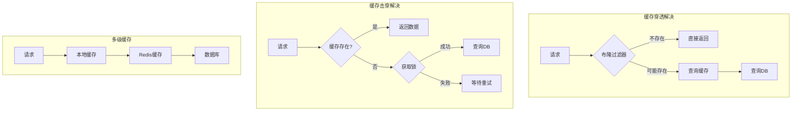

**最佳实践：**

1. **缓存穿透**：布隆过滤器 + 缓存空值
2. **缓存击穿**：互斥锁 + 热点数据永不过期
3. **缓存雪崩**：过期时间随机 + 多级缓存 + 集群
4. **缓存预热**：启动时预热热点数据
5. **缓存更新**：优先使用Cache Aside模式
6. **监控告警**：监控缓存命中率、响应时间
7. **容量规划**：合理设置缓存大小和过期时间

**性能指标：**
- 缓存命中率：>90%
- 响应时间：<10ms
- 可用性：99.99%

---

### 4. 缓存与数据库一致性优化

**问题分析：**

缓存与数据库一致性是分布式系统的经典问题。更新数据时，如何保证缓存和数据库的数据一致？

**一致性级别：**
- 强一致性：任何时刻读取的都是最新数据
- 弱一致性：允许短暂不一致
- 最终一致性：一段时间后最终一致

**常见问题：**
- 先更新DB还是先更新缓存？
- 更新缓存还是删除缓存？
- 如何处理并发更新？
- 如何处理更新失败？

**解决方案：**

**方案1：先更新DB，再删除缓存（推荐）**

```java
/**
 * Cache Aside模式
 */
@Service
public class CacheAsidePattern {
    
    @Autowired
    private UserMapper userMapper;
    
    @Autowired
    private RedisTemplate<String, Object> redisTemplate;
    
    /**
     * 读操作
     */
    public User getUser(Long userId) {
        String key = "user:" + userId;
        
        // 1. 读缓存
        User user = (User) redisTemplate.opsForValue().get(key);
        if (user != null) {
            return user;
        }
        
        // 2. 读数据库
        user = userMapper.selectById(userId);
        
        // 3. 写缓存
        if (user != null) {
            redisTemplate.opsForValue().set(key, user, 30, TimeUnit.MINUTES);
        }
        
        return user;
    }
    
    /**
     * 写操作：先更新DB，再删除缓存
     */
    @Transactional
    public void updateUser(User user) {
        // 1. 更新数据库
        userMapper.updateById(user);
        
        // 2. 删除缓存
        String key = "user:" + user.getId();
        redisTemplate.delete(key);
        
        // 注意：这里可能存在短暂不一致
        // 如果删除缓存失败，需要重试机制
    }
}
```

**为什么先更新DB再删除缓存？**

```
场景1：先删除缓存，再更新DB
时间线：
T1: 线程A删除缓存
T2: 线程B读缓存（未命中）
T3: 线程B读DB（旧数据）
T4: 线程B写缓存（旧数据）
T5: 线程A更新DB（新数据）
结果：缓存是旧数据，DB是新数据，不一致！

场景2：先更新DB，再删除缓存
时间线：
T1: 线程A更新DB
T2: 线程B读缓存（旧数据）
T3: 线程A删除缓存
T4: 线程B再次读取（未命中，读DB新数据）
结果：短暂不一致，但很快一致
```

**方案2：延迟双删**

```java
/**
 * 延迟双删策略
 */
@Service
public class DelayedDoubleDeleteService {
    
    @Transactional
    public void updateUser(User user) {
        String key = "user:" + user.getId();
        
        // 1. 删除缓存
        redisTemplate.delete(key);
        
        // 2. 更新数据库
        userMapper.updateById(user);
        
        // 3. 延迟后再次删除缓存
        CompletableFuture.runAsync(() -> {
            try {
                // 延迟500ms
                Thread.sleep(500);
                redisTemplate.delete(key);
            } catch (InterruptedException e) {
                Thread.currentThread().interrupt();
            }
        });
    }
}
```

**方案3：基于消息队列的最终一致性**

```java
/**
 * 基于MQ的缓存更新
 */
@Service
public class MqBasedCacheService {
    
    @Autowired
    private RabbitTemplate rabbitTemplate;
    
    @Transactional
    public void updateUser(User user) {
        // 1. 更新数据库
        userMapper.updateById(user);
        
        // 2. 发送MQ消息
        CacheInvalidateMessage message = new CacheInvalidateMessage();
        message.setKey("user:" + user.getId());
        message.setRetryCount(0);
        
        rabbitTemplate.convertAndSend("cache.invalidate.exchange", 
            "cache.invalidate", message);
    }
}

/**
 * 消费者：删除缓存
 */
@Component
public class CacheInvalidateConsumer {
    
    @Autowired
    private RedisTemplate<String, Object> redisTemplate;
    
    @RabbitListener(queues = "cache.invalidate.queue")
    public void handleInvalidate(CacheInvalidateMessage message) {
        try {
            // 删除缓存
            redisTemplate.delete(message.getKey());
            log.info("缓存删除成功: {}", message.getKey());
        } catch (Exception e) {
            log.error("缓存删除失败: {}", message.getKey(), e);
            
            // 重试机制
            if (message.getRetryCount() < 3) {
                message.setRetryCount(message.getRetryCount() + 1);
                rabbitTemplate.convertAndSend("cache.invalidate.exchange", 
                    "cache.invalidate", message);
            }
        }
    }
}
```

**方案4：基于Canal的数据同步**

```java
/**
 * Canal监听MySQL binlog，同步更新缓存
 */
@Component
public class CanalCacheSync {
    
    @Autowired
    private RedisTemplate<String, Object> redisTemplate;
    
    /**
     * 监听binlog变化
     */
    public void onBinlogChange(CanalEntry.Entry entry) {
        CanalEntry.RowChange rowChange = CanalEntry.RowChange.parseFrom(entry.getStoreValue());
        
        CanalEntry.EventType eventType = rowChange.getEventType();
        String tableName = entry.getHeader().getTableName();
        
        if ("user".equals(tableName)) {
            for (CanalEntry.RowData rowData : rowChange.getRowDatasList()) {
                if (eventType == CanalEntry.EventType.UPDATE || 
                    eventType == CanalEntry.EventType.DELETE) {
                    // 获取主键
                    String userId = getColumnValue(rowData, "id");
                    
                    // 删除缓存
                    String key = "user:" + userId;
                    redisTemplate.delete(key);
                    
                    log.info("Canal同步删除缓存: {}", key);
                }
            }
        }
    }
    
    private String getColumnValue(CanalEntry.RowData rowData, String columnName) {
        for (CanalEntry.Column column : rowData.getAfterColumnsList()) {
            if (column.getName().equals(columnName)) {
                return column.getValue();
            }
        }
        return null;
    }
}
```

**方案5：分布式锁保证一致性**

```java
/**
 * 使用分布式锁保证更新原子性
 */
@Service
public class DistributedLockCacheService {
    
    @Autowired
    private RedissonClient redissonClient;
    
    public void updateUser(User user) {
        String lockKey = "lock:user:" + user.getId();
        RLock lock = redissonClient.getLock(lockKey);
        
        try {
            // 获取锁
            if (lock.tryLock(10, 30, TimeUnit.SECONDS)) {
                try {
                    // 1. 更新数据库
                    userMapper.updateById(user);
                    
                    // 2. 删除缓存
                    String cacheKey = "user:" + user.getId();
                    redisTemplate.delete(cacheKey);
                    
                } finally {
                    lock.unlock();
                }
            }
        } catch (InterruptedException e) {
            Thread.currentThread().interrupt();
        }
    }
}
```

**方案6：读写锁优化**

```java
/**
 * 读写锁：读多写少场景
 */
@Service
public class ReadWriteLockCacheService {
    
    @Autowired
    private RedissonClient redissonClient;
    
    /**
     * 读操作：使用读锁
     */
    public User getUser(Long userId) {
        String lockKey = "rwlock:user:" + userId;
        RReadWriteLock rwLock = redissonClient.getReadWriteLock(lockKey);
        RLock readLock = rwLock.readLock();
        
        try {
            readLock.lock();
            
            String key = "user:" + userId;
            User user = (User) redisTemplate.opsForValue().get(key);
            
            if (user == null) {
                user = userMapper.selectById(userId);
                if (user != null) {
                    redisTemplate.opsForValue().set(key, user, 30, TimeUnit.MINUTES);
                }
            }
            
            return user;
        } finally {
            readLock.unlock();
        }
    }
    
    /**
     * 写操作：使用写锁
     */
    public void updateUser(User user) {
        String lockKey = "rwlock:user:" + user.getId();
        RReadWriteLock rwLock = redissonClient.getReadWriteLock(lockKey);
        RLock writeLock = rwLock.writeLock();
        
        try {
            writeLock.lock();
            
            // 更新数据库
            userMapper.updateById(user);
            
            // 删除缓存
            String key = "user:" + user.getId();
            redisTemplate.delete(key);
            
        } finally {
            writeLock.unlock();
        }
    }
}
```

**架构设计：**

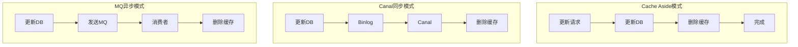

**最佳实践：**

1. **优先方案**：先更新DB，再删除缓存
2. **重试机制**：缓存删除失败要重试
3. **延迟双删**：解决并发读写问题
4. **Canal同步**：大规模系统推荐
5. **分布式锁**：强一致性场景使用
6. **监控告警**：监控缓存一致性
7. **降级策略**：缓存故障时直接读DB

**一致性方案对比：**

| 方案 | 一致性 | 复杂度 | 性能 | 适用场景 |
|------|--------|--------|------|----------|
| 先更新DB再删缓存 | 最终一致 | 低 | 高 | 通用场景 |
| 延迟双删 | 最终一致 | 低 | 高 | 并发读写场景 |
| MQ异步 | 最终一致 | 中 | 高 | 大规模系统 |
| Canal同步 | 最终一致 | 高 | 高 | 企业级系统 |
| 分布式锁 | 强一致 | 中 | 中 | 强一致性要求 |

---

### 5. 主从DB与cache一致性优化

**问题分析：**

在主从架构中，主从同步存在延迟，如果写主库后立即读从库，可能读到旧数据。结合缓存使用，一致性问题更加复杂。

**核心问题：**
- 主从延迟：通常10-100ms，高峰期可能更长
- 读写分离：写主库，读从库
- 缓存一致性：缓存与主从库的一致性

**解决方案：**

**方案1：强制读主库**

```java
/**
 * 写后读场景，强制读主库
 */
@Service
public class MasterSlaveService {
    
    @Autowired
    private DataSource masterDataSource;
    
    @Autowired
    private DataSource slaveDataSource;
    
    /**
     * 更新操作：写主库
     */
    @Transactional
    public void updateUser(User user) {
        // 使用主库
        DataSourceContextHolder.setDataSource("master");
        userMapper.updateById(user);
        
        // 删除缓存
        String key = "user:" + user.getId();
        redisTemplate.delete(key);
    }
    
    /**
     * 读操作：写后短时间内读主库
     */
    public User getUser(Long userId, boolean forcemaster) {
        String key = "user:" + userId;
        
        // 查询缓存
        User user = (User) redisTemplate.opsForValue().get(key);
        if (user != null) {
            return user;
        }
        
        // 根据标志选择数据源
        if (forceMaster) {
            DataSourceContextHolder.setDataSource("master");
        } else {
            DataSourceContextHolder.setDataSource("slave");
        }
        
        user = userMapper.selectById(userId);
        
        if (user != null) {
            redisTemplate.opsForValue().set(key, user, 30, TimeUnit.MINUTES);
        }
        
        return user;
    }
}
```

**方案2：延迟读取**

```java
/**
 * 写后延迟读取，等待主从同步
 */
@Service
public class DelayedReadService {
    
    private static final long REPLICATION_DELAY = 100; // 主从延迟时间
    
    @Transactional
    public void updateUser(User user) {
        // 写主库
        userMapper.updateById(user);
        
        // 删除缓存
        String key = "user:" + user.getId();
        redisTemplate.delete(key);
        
        // 标记最近更新时间
        String updateTimeKey = "update_time:" + user.getId();
        redisTemplate.opsForValue().set(updateTimeKey, 
            System.currentTimeMillis(), 1, TimeUnit.SECONDS);
    }
    
    public User getUser(Long userId) {
        String key = "user:" + userId;
        
        // 查询缓存
        User user = (User) redisTemplate.opsForValue().get(key);
        if (user != null) {
            return user;
        }
        
        // 检查是否最近更新过
        String updateTimeKey = "update_time:" + userId;
        Long updateTime = (Long) redisTemplate.opsForValue().get(updateTimeKey);
        
        boolean forceMaster = false;
        if (updateTime != null) {
            long elapsed = System.currentTimeMillis() - updateTime;
            if (elapsed < REPLICATION_DELAY) {
                forceMaster = true; // 最近更新过，读主库
            }
        }
        
        // 选择数据源
        DataSourceContextHolder.setDataSource(forceMaster ? "master" : "slave");
        user = userMapper.selectById(userId);
        
        if (user != null) {
            redisTemplate.opsForValue().set(key, user, 30, TimeUnit.MINUTES);
        }
        
        return user;
    }
}
```

**方案3：缓存标记版本号**

```java
/**
 * 使用版本号保证一致性
 */
@Service
public class VersionBasedCacheService {
    
    @Transactional
    public void updateUser(User user) {
        // 更新数据库，版本号+1
        user.setVersion(user.getVersion() + 1);
        userMapper.updateById(user);
        
        // 更新缓存版本号
        String versionKey = "user:version:" + user.getId();
        redisTemplate.opsForValue().set(versionKey, user.getVersion());
        
        // 删除缓存数据
        String dataKey = "user:" + user.getId();
        redisTemplate.delete(dataKey);
    }
    
    public User getUser(Long userId) {
        String dataKey = "user:" + userId;
        String versionKey = "user:version:" + userId;
        
        // 查询缓存
        User cachedUser = (User) redisTemplate.opsForValue().get(dataKey);
        Integer cachedVersion = (Integer) redisTemplate.opsForValue().get(versionKey);
        
        if (cachedUser != null && cachedVersion != null) {
            // 检查版本号
            if (cachedUser.getVersion().equals(cachedVersion)) {
                return cachedUser;
            }
        }
        
        // 读主库获取最新数据
        DataSourceContextHolder.setDataSource("master");
        User user = userMapper.selectById(userId);
        
        if (user != null) {
            redisTemplate.opsForValue().set(dataKey, user, 30, TimeUnit.MINUTES);
            redisTemplate.opsForValue().set(versionKey, user.getVersion());
        }
        
        return user;
    }
}
```

**方案4：订阅binlog实时同步**

```java
/**
 * 使用Canal订阅binlog，实时更新缓存
 */
@Component
public class CanalBinlogListener {
    
    @Autowired
    private RedisTemplate<String, Object> redisTemplate;
    
    /**
     * 监听binlog变化
     */
    public void onDataChange(BinlogEvent event) {
        if ("user".equals(event.getTableName())) {
            Long userId = event.getUserId();
            String key = "user:" + userId;
            
            if (event.isUpdate() || event.isDelete()) {
                // 删除缓存
                redisTemplate.delete(key);
            } else if (event.isInsert()) {
                // 可选：直接写入缓存
                User user = event.getUser();
                redisTemplate.opsForValue().set(key, user, 30, TimeUnit.MINUTES);
            }
        }
    }
}
```

**架构设计：**

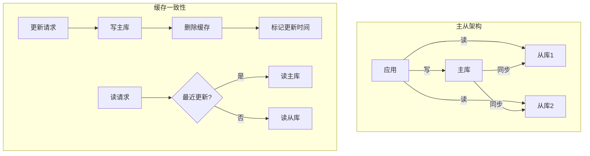

**最佳实践：**

1. **写后读主**：更新后短时间内强制读主库
2. **延迟标记**：标记更新时间，延迟期内读主库
3. **版本控制**：使用版本号校验数据一致性
4. **Canal同步**：实时监听binlog，更新缓存
5. **监控延迟**：监控主从同步延迟
6. **降级策略**：主库压力大时允许读从库旧数据

---

### 6. DB主从一致性架构优化4种方法

**问题分析：**

主从同步延迟是读写分离架构的核心问题，需要在性能和一致性之间权衡。

**解决方案：**

**方法1：半同步复制**

```sql
-- MySQL半同步复制配置
-- 主库配置
INSTALL PLUGIN rpl_semi_sync_master SONAME 'semisync_master.so';
SET GLOBAL rpl_semi_sync_master_enabled = 1;
SET GLOBAL rpl_semi_sync_master_timeout = 1000; -- 1秒超时

-- 从库配置
INSTALL PLUGIN rpl_semi_sync_slave SONAME 'semisync_slave.so';
SET GLOBAL rpl_semi_sync_slave_enabled = 1;
```

**特点：**
- 主库等待至少一个从库确认后才返回
- 保证数据不丢失
- 性能略有下降

**方法2：并行复制**

```sql
-- MySQL 5.7+ 并行复制
SET GLOBAL slave_parallel_type = 'LOGICAL_CLOCK';
SET GLOBAL slave_parallel_workers = 4; -- 4个并行线程
SET GLOBAL slave_preserve_commit_order = 1;
```

**方法3：读写分离中间件**

```java
/**
 * 智能路由：根据SQL类型和延迟情况选择数据源
 */
@Component
public class SmartDataSourceRouter {
    
    @Autowired
    private DataSourceMonitor monitor;
    
    public DataSource route(String sql, boolean forceMaster) {
        // 强制主库
        if (forceMaster) {
            return masterDataSource;
        }
        
        // 写操作必须主库
        if (isWriteOperation(sql)) {
            return masterDataSource;
        }
        
        // 检查从库延迟
        long delay = monitor.getReplicationDelay();
        if (delay > 1000) { // 延迟超过1秒
            return masterDataSource; // 降级到主库
        }
        
        // 负载均衡选择从库
        return selectSlave();
    }
    
    private boolean isWriteOperation(String sql) {
        String upperSql = sql.trim().toUpperCase();
        return upperSql.startsWith("INSERT") || 
               upperSql.startsWith("UPDATE") || 
               upperSql.startsWith("DELETE");
    }
}
```

**方法4：应用层解决**

```java
/**
 * 会话级主库标记
 */
@Component
public class SessionMasterMarker {
    
    private ThreadLocal<Boolean> masterFlag = new ThreadLocal<>();
    
    /**
     * 标记当前会话使用主库
     */
    public void markMaster(long duration) {
        masterFlag.set(true);
        
        // 定时清除标记
        CompletableFuture.runAsync(() -> {
            try {
                Thread.sleep(duration);
                masterFlag.remove();
            } catch (InterruptedException e) {
                Thread.currentThread().interrupt();
            }
        });
    }
    
    public boolean shouldUseMaster() {
        Boolean flag = masterFlag.get();
        return flag != null && flag;
    }
}

@Service
public class UserService {
    
    @Autowired
    private SessionMasterMarker masterMarker;
    
    @Transactional
    public void updateUser(User user) {
        // 更新操作
        userMapper.updateById(user);
        
        // 标记接下来1秒内使用主库
        masterMarker.markMaster(1000);
    }
    
    public User getUser(Long userId) {
        // 根据标记选择数据源
        if (masterMarker.shouldUseMaster()) {
            DataSourceContextHolder.setDataSource("master");
        } else {
            DataSourceContextHolder.setDataSource("slave");
        }
        
        return userMapper.selectById(userId);
    }
}
```

**最佳实践：**

1. **半同步复制**：关键业务使用，保证数据不丢
2. **并行复制**：减少主从延迟
3. **智能路由**：根据延迟动态选择数据源
4. **会话标记**：写后读场景标记使用主库
5. **监控告警**：实时监控主从延迟

---

### 7. 多库多事务降低数据不一致概率

**问题分析：**

分布式事务是分布式系统的难题，如何在多个数据库之间保证数据一致性？

**解决方案：**

**方案1：两阶段提交（2PC）**

```java
/**
 * XA事务：两阶段提交
 */
@Service
public class XATransactionService {
    
    @Autowired
    private DataSource dataSource1;
    
    @Autowired
    private DataSource dataSource2;
    
    public void transferMoney(Long fromUserId, Long toUserId, BigDecimal amount) {
        // 创建XA事务管理器
        UserTransaction userTransaction = null;
        
        try {
            userTransaction = getUserTransaction();
            userTransaction.begin();
            
            // 操作数据库1：扣款
            Connection conn1 = dataSource1.getConnection();
            PreparedStatement ps1 = conn1.prepareStatement(
                "UPDATE account SET balance = balance - ? WHERE user_id = ?");
            ps1.setBigDecimal(1, amount);
            ps1.setLong(2, fromUserId);
            ps1.executeUpdate();
            
            // 操作数据库2：加款
            Connection conn2 = dataSource2.getConnection();
            PreparedStatement ps2 = conn2.prepareStatement(
                "UPDATE account SET balance = balance + ? WHERE user_id = ?");
            ps2.setBigDecimal(1, amount);
            ps2.setLong(2, toUserId);
            ps2.executeUpdate();
            
            // 提交事务
            userTransaction.commit();
            
        } catch (Exception e) {
            // 回滚事务
            if (userTransaction != null) {
                userTransaction.rollback();
            }
            throw new RuntimeException("转账失败", e);
        }
    }
}
```

**方案2：TCC（Try-Confirm-Cancel）**

```java
/**
 * TCC模式
 */
@Service
public class TCCTransferService {
    
    /**
     * Try阶段：预留资源
     */
    public boolean tryTransfer(Long fromUserId, Long toUserId, BigDecimal amount) {
        // 1. 冻结转出账户金额
        boolean frozen = accountService.freeze(fromUserId, amount);
        if (!frozen) {
            return false;
        }
        
        // 2. 预留转入账户空间
        boolean reserved = accountService.reserve(toUserId, amount);
        if (!reserved) {
            // 回滚冻结
            accountService.unfreeze(fromUserId, amount);
            return false;
        }
        
        return true;
    }
    
    /**
     * Confirm阶段：确认执行
     */
    public void confirmTransfer(Long fromUserId, Long toUserId, BigDecimal amount) {
        // 1. 扣减冻结金额
        accountService.deductFrozen(fromUserId, amount);
        
        // 2. 增加预留金额
        accountService.addReserved(toUserId, amount);
    }
    
    /**
     * Cancel阶段：取消执行
     */
    public void cancelTransfer(Long fromUserId, Long toUserId, BigDecimal amount) {
        // 1. 解冻金额
        accountService.unfreeze(fromUserId, amount);
        
        // 2. 释放预留
        accountService.releaseReserved(toUserId, amount);
    }
}
```

**方案3：SAGA模式**

```java
/**
 * SAGA模式：长事务拆分
 */
@Service
public class SagaOrderService {
    
    public void createOrder(Order order) {
        try {
            // 步骤1：创建订单
            Long orderId = orderService.create(order);
            
            // 步骤2：扣减库存
            inventoryService.deduct(order.getProductId(), order.getQuantity());
            
            // 步骤3：扣减余额
            accountService.deduct(order.getUserId(), order.getAmount());
            
            // 步骤4：发送通知
            notificationService.send(order.getUserId(), orderId);
            
        } catch (Exception e) {
            // 补偿操作
            compensate(order);
            throw e;
        }
    }
    
    /**
     * 补偿操作
     */
    private void compensate(Order order) {
        try {
            // 反向操作
            accountService.refund(order.getUserId(), order.getAmount());
            inventoryService.restore(order.getProductId(), order.getQuantity());
            orderService.cancel(order.getId());
        } catch (Exception e) {
            log.error("补偿失败", e);
            // 记录补偿失败，人工介入
        }
    }
}
```

**方案4：本地消息表**

```java
/**
 * 本地消息表保证最终一致性
 */
@Service
public class LocalMessageService {
    
    @Transactional
    public void createOrder(Order order) {
        // 1. 创建订单
        orderMapper.insert(order);
        
        // 2. 插入本地消息表（同一事务）
        LocalMessage message = new LocalMessage();
        message.setType("ORDER_CREATED");
        message.setContent(JSON.toJSONString(order));
        message.setStatus("PENDING");
        messageMapper.insert(message);
    }
    
    /**
     * 定时扫描本地消息表，发送MQ
     */
    @Scheduled(fixedRate = 1000)
    public void scanAndSend() {
        List<LocalMessage> messages = messageMapper.selectPending();
        
        for (LocalMessage message : messages) {
            try {
                // 发送MQ
                rabbitTemplate.send("order.created", message.getContent());
                
                // 更新状态为已发送
                message.setStatus("SENT");
                messageMapper.updateById(message);
                
            } catch (Exception e) {
                log.error("消息发送失败: {}", message.getId(), e);
            }
        }
    }
}
```

**方案5：Seata分布式事务**

```java
/**
 * Seata AT模式
 */
@Service
public class SeataOrderService {
    
    @GlobalTransactional(name = "create-order", rollbackFor = Exception.class)
    public void createOrder(Order order) {
        // 1. 创建订单（数据库1）
        orderService.create(order);
        
        // 2. 扣减库存（数据库2）
        inventoryService.deduct(order.getProductId(), order.getQuantity());
        
        // 3. 扣减余额（数据库3）
        accountService.deduct(order.getUserId(), order.getAmount());
        
        // Seata自动管理分布式事务
    }
}
```

**架构设计：**

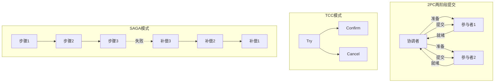

**最佳实践：**

1. **避免分布式事务**：优先考虑业务拆分
2. **最终一致性**：大多数场景使用最终一致性
3. **TCC模式**：对一致性要求高的场景
4. **SAGA模式**：长事务场景
5. **本地消息表**：简单可靠的最终一致性方案
6. **Seata**：复杂分布式事务场景

**方案对比：**

| 方案 | 一致性 | 性能 | 复杂度 | 适用场景 |
|------|--------|------|--------|----------|
| 2PC | 强一致 | 低 | 中 | 小规模事务 |
| TCC | 强一致 | 中 | 高 | 金融场景 |
| SAGA | 最终一致 | 高 | 中 | 长事务 |
| 本地消息表 | 最终一致 | 高 | 低 | 通用场景 |
| Seata | 强一致 | 中 | 低 | 企业级应用 |

---

### 8. mysql并行复制降低主从同步延时的思路与启示

**问题分析：**

MySQL主从复制延迟是高并发场景下的常见问题。传统的单线程复制模式下，主库并发写入，从库串行回放，导致主从延迟越来越大。主要挑战包括：
- 主库高并发写入，从库单线程回放成为瓶颈
- 大事务回放耗时长，阻塞后续事务
- 网络延迟导致binlog传输慢
- 从库硬件性能不足

**解决方案：**

**方案1: 基于库的并行复制（MySQL 5.6）**

MySQL 5.6引入了基于schema（database）的并行复制，不同库的事务可以并行回放。

```sql
-- 主库配置
[mysqld]
server-id = 1
log-bin = mysql-bin
binlog_format = ROW

-- 从库配置
[mysqld]
server-id = 2
relay-log = relay-bin
slave-parallel-type = DATABASE
slave-parallel-workers = 4  # 并行线程数
```

优点：
- 实现简单，配置即可生效
- 不同库之间完全并行，无冲突

缺点：
- 单库内仍然串行，效果有限
- 对于单库应用无效果

**方案2: 基于组提交的并行复制（MySQL 5.7）**

MySQL 5.7引入了基于GTID的并行复制，同一组提交的事务可以并行回放。

```sql
-- 主库配置
[mysqld]
gtid_mode = ON
enforce_gtid_consistency = ON
log-slave-updates = ON
binlog_group_commit_sync_delay = 100  # 延迟100微秒
binlog_group_commit_sync_no_delay_count = 10  # 或累积10个事务

-- 从库配置
[mysqld]
gtid_mode = ON
enforce_gtid_consistency = ON
slave-parallel-type = LOGICAL_CLOCK
slave-parallel-workers = 8
slave_preserve_commit_order = ON  # 保持提交顺序
```

原理：主库在同一时刻提交的事务，在从库可以并行回放，因为它们之间没有锁冲突。

优点：
- 单库内也能并行，效果显著
- 基于逻辑时钟，更智能

缺点：
- 需要开启GTID
- 配置相对复杂

**方案3: 基于WriteSet的并行复制（MySQL 8.0）**

MySQL 8.0引入了基于WriteSet的并行复制，通过检测事务修改的行是否冲突来决定是否并行。

```sql
-- 主库配置
[mysqld]
binlog_transaction_dependency_tracking = WRITESET
transaction_write_set_extraction = XXHASH64
binlog_transaction_dependency_history_size = 25000

-- 从库配置
[mysqld]
slave-parallel-type = LOGICAL_CLOCK
slave-parallel-workers = 16
slave_preserve_commit_order = ON
```

优点：
- 并行度最高，即使不在同一组提交也能并行
- 自动检测冲突，无需人工干预

缺点：
- 需要MySQL 8.0+
- 内存开销增加

**方案4: 半同步复制 + 并行复制**

```sql
-- 主库安装半同步插件
INSTALL PLUGIN rpl_semi_sync_master SONAME 'semisync_master.so';
SET GLOBAL rpl_semi_sync_master_enabled = 1;
SET GLOBAL rpl_semi_sync_master_timeout = 1000;  # 1秒超时

-- 从库安装半同步插件
INSTALL PLUGIN rpl_semi_sync_slave SONAME 'semisync_slave.so';
SET GLOBAL rpl_semi_sync_slave_enabled = 1;
```

**架构设计：**

```
主库写入流程：
事务1 ──┐
事务2 ──┼──> 组提交 ──> Binlog ──> 从库
事务3 ──┘

从库回放流程（MySQL 5.7+）：
Binlog ──> IO线程 ──> Relay Log ──┬──> Worker1: 事务1
                                   ├──> Worker2: 事务2
                                   ├──> Worker3: 事务3
                                   └──> Worker4: 事务4
```

**最佳实践：**

1. **选择合适的并行策略**：
   - MySQL 5.6: 多库场景使用DATABASE模式
   - MySQL 5.7: 使用LOGICAL_CLOCK + 组提交优化
   - MySQL 8.0: 使用WRITESET获得最佳并行度

2. **优化主库组提交**：
   - 适当增加binlog_group_commit_sync_delay
   - 增大binlog_group_commit_sync_no_delay_count
   - 让更多事务在同一组提交

3. **合理设置并行线程数**：
   - 根据CPU核心数设置，通常4-16个
   - 监控worker利用率，避免过多或过少

4. **避免大事务**：
   - 大事务会阻塞并行回放
   - 拆分大事务为小事务
   - 使用pt-online-schema-change做DDL

5. **监控主从延迟**：
```sql
-- 查看主从延迟
SHOW SLAVE STATUS\G
-- 关注 Seconds_Behind_Master

-- 查看并行复制状态
SELECT * FROM performance_schema.replication_applier_status_by_worker;
```

6. **硬件优化**：
   - 从库使用SSD，提升IO性能
   - 增加从库内存，提升缓存命中率
   - 使用更快的网络，减少传输延迟

**启示：**

1. **并行化是解决性能瓶颈的通用思路**：将串行改为并行
2. **冲突检测是并行化的关键**：如何判断哪些操作可以并行
3. **组提交优化**：批量处理提升吞吐量
4. **架构演进**：从DATABASE → LOGICAL_CLOCK → WRITESET，并行度逐步提升

---

### 9. 互联网公司为啥不使用mysql分区表?

**问题分析：**

MySQL分区表是将一个大表的数据按照规则分散到多个物理文件中，看似能解决大表问题，但互联网公司很少使用。主要原因包括：
- 分区表的限制和坑太多
- 性能提升有限，甚至可能下降
- 运维复杂度高
- 有更好的替代方案（分库分表）

**MySQL分区表的问题：**

**问题1: 分区键限制**

所有唯一索引（包括主键）必须包含分区键，这在业务上很难满足。

```sql
-- 错误示例：主键不包含分区键
CREATE TABLE orders (
    order_id BIGINT PRIMARY KEY,
    user_id BIGINT,
    create_time DATETIME
) PARTITION BY RANGE (YEAR(create_time)) (
    PARTITION p2023 VALUES LESS THAN (2024),
    PARTITION p2024 VALUES LESS THAN (2025)
);
-- ERROR: A PRIMARY KEY must include all columns in the table's partitioning function

-- 正确但不合理：主键必须包含分区键
CREATE TABLE orders (
    order_id BIGINT,
    user_id BIGINT,
    create_time DATETIME,
    PRIMARY KEY (order_id, create_time)  -- 不符合业务逻辑
) PARTITION BY RANGE (YEAR(create_time)) (...);
```

**问题2: 查询性能问题**

如果查询条件不包含分区键，会扫描所有分区，性能反而下降。

```sql
-- 高效查询：包含分区键
SELECT * FROM orders 
WHERE create_time >= '2024-01-01' AND user_id = 12345;
-- 只扫描p2024分区

-- 低效查询：不包含分区键
SELECT * FROM orders WHERE order_id = 123456;
-- 扫描所有分区，性能差
```

**问题3: 分区数量限制**

MySQL 5.6之前最多1024个分区，5.7之后最多8192个分区，但分区过多会导致：
- 打开表的开销大（每个分区都是独立文件）
- 内存占用高
- 查询优化器性能下降

**问题4: 运维复杂**

```sql
-- 添加分区（需要锁表）
ALTER TABLE orders ADD PARTITION (
    PARTITION p2025 VALUES LESS THAN (2026)
);

-- 删除分区（数据会丢失）
ALTER TABLE orders DROP PARTITION p2023;

-- 分区维护需要定期执行，容易遗忘
```

**更好的替代方案：**

**方案1: 分库分表（推荐）**

使用ShardingSphere、MyCat等中间件实现分库分表。

```java
// ShardingSphere配置
spring.shardingsphere.rules.sharding.tables.orders.actual-data-nodes=ds$->{0..3}.orders_$->{0..15}
spring.shardingsphere.rules.sharding.tables.orders.database-strategy.standard.sharding-column=user_id
spring.shardingsphere.rules.sharding.tables.orders.table-strategy.standard.sharding-column=order_id

// 分库算法
spring.shardingsphere.rules.sharding.sharding-algorithms.database-inline.type=INLINE
spring.shardingsphere.rules.sharding.sharding-algorithms.database-inline.props.algorithm-expression=ds$->{user_id % 4}

// 分表算法
spring.shardingsphere.rules.sharding.sharding-algorithms.table-inline.type=INLINE
spring.shardingsphere.rules.sharding.sharding-algorithms.table-inline.props.algorithm-expression=orders_$->{order_id % 16}
```

优点：
- 突破单机限制，可以水平扩展
- 灵活的分片策略
- 对应用透明

**方案2: 冷热数据分离**

将历史数据归档到历史表，保持主表数据量小。

```sql
-- 主表：只保留近3个月数据
CREATE TABLE orders (
    order_id BIGINT PRIMARY KEY,
    user_id BIGINT,
    create_time DATETIME,
    INDEX idx_create_time (create_time)
);

-- 历史表：3个月前的数据
CREATE TABLE orders_history (
    order_id BIGINT PRIMARY KEY,
    user_id BIGINT,
    create_time DATETIME,
    INDEX idx_create_time (create_time)
);

-- 定时归档任务
INSERT INTO orders_history 
SELECT * FROM orders 
WHERE create_time < DATE_SUB(NOW(), INTERVAL 3 MONTH);

DELETE FROM orders 
WHERE create_time < DATE_SUB(NOW(), INTERVAL 3 MONTH);
```

**最佳实践：**

1. **避免使用MySQL分区表**：除非场景非常简单且符合限制
2. **优先考虑分库分表**：适合互联网高并发场景
3. **冷热分离**：简单有效的大表优化方案
4. **选择合适的数据库**：时序数据用时序数据库，大数据用NoSQL
5. **提前规划**：在数据量还小的时候就做好架构设计

---

### 10. 如何防止根目录被删

**问题分析：**

数据库根目录被误删是灾难性事故，可能导致数据完全丢失、业务长时间中断。常见误删场景包括：
- 运维人员误操作：`rm -rf /data/mysql/*`
- 脚本错误：变量为空导致删除根目录
- 权限管理不当：普通用户有删除权限
- 自动化脚本bug

**解决方案：**

**方案1: 文件系统权限控制**

```bash
# 1. 使用专用mysql用户
useradd -r -s /sbin/nologin mysql

# 2. 设置目录权限
chown -R mysql:mysql /data/mysql
chmod 700 /data/mysql

# 3. 使用chattr锁定关键文件
chattr +i /data/mysql/my.cnf  # 不可修改
chattr +a /data/mysql/logs/   # 只能追加

# 解锁（需要时）
chattr -i /data/mysql/my.cnf
```

**方案2: 安全删除脚本**

```bash
#!/bin/bash
# safe_rm.sh - 安全删除脚本

PROTECTED_DIRS=(
    "/data/mysql"
    "/var/lib/mysql"
    "/"
    "/usr"
    "/etc"
)

# 检查是否删除保护目录
for dir in "${PROTECTED_DIRS[@]}"; do
    if [[ "$1" == "$dir"* ]]; then
        echo "ERROR: Cannot delete protected directory: $1"
        exit 1
    fi
done

# 二次确认
echo "Are you sure you want to delete: $1? Type 'yes' to confirm:"
read confirmation
if [[ "$confirmation" != "yes" ]]; then
    echo "Deletion cancelled"
    exit 0
fi

# 移动到回收站
TRASH_DIR="/data/trash/$(date +%Y%m%d_%H%M%S)"
mkdir -p "$TRASH_DIR"
mv "$1" "$TRASH_DIR/"
echo "Moved to trash: $TRASH_DIR"

# 设置别名：alias rm='safe_rm.sh'
```

**方案3: 审计和监控**

```bash
# 使用auditd监控删除操作
auditctl -w /data/mysql -p wa -k mysql_watch

# 实时监控文件变化
inotifywait -m -r -e delete /data/mysql/ | while read path action file; do
    echo "$(date): $action $path$file" >> /var/log/mysql_delete.log
    # 发送告警
    curl -X POST "https://alert.company.com/api/alert" \
         -d "message=MySQL file deleted: $path$file"
done
```

**方案4: 备份和快照**

```bash
# LVM快照（秒级恢复）
lvcreate -L 10G -s -n mysql_snap /dev/vg0/mysql_lv

# 恢复
lvconvert --merge /dev/vg0/mysql_snap

# ZFS快照
zfs snapshot tank/mysql@backup_$(date +%Y%m%d)
zfs rollback tank/mysql@backup_20240516

# 定期全量备份
xtrabackup --backup --target-dir="/data/backup/mysql/$(date +%Y%m%d)"
```

**最佳实践：**

1. **权限最小化**：普通用户无删除权限，root操作需二次确认
2. **多层防护**：权限控制 + 安全脚本 + 审计监控 + 定期备份
3. **快速恢复**：LVM/ZFS快照实现秒级恢复
4. **监控告警**：文件删除实时告警，目录完整性检查
5. **人员培训**：操作规范培训，误删恢复演练

---

### 11. 即使删了全库，保证半小时恢复

**问题分析：**

全库被删是最严重的数据库事故，要在半小时内恢复需要：
- 完善的备份策略
- 快速的恢复流程
- 自动化的恢复工具
- 定期的恢复演练

**解决方案：**

**方案1: 全量备份 + 增量binlog**

```bash
# 1. 每日全量备份（凌晨2点）
#!/bin/bash
# daily_backup.sh
BACKUP_DIR="/data/backup/mysql/$(date +%Y%m%d)"
mkdir -p "$BACKUP_DIR"

# 使用xtrabackup全量备份（支持热备）
xtrabackup --backup \
           --target-dir="$BACKUP_DIR" \
           --user=backup \
           --password=xxx \
           --parallel=4

# 备份binlog位置信息
cat "$BACKUP_DIR/xtrabackup_binlog_info"

# 上传到对象存储（异地容灾）
aws s3 sync "$BACKUP_DIR" "s3://mysql-backup/$(date +%Y%m%d)/"

# 2. 实时备份binlog
# my.cnf配置
[mysqld]
log-bin=/data/mysql/binlog/mysql-bin
expire_logs_days=7
sync_binlog=1

# binlog实时同步到备份服务器
rsync -avz /data/mysql/binlog/ backup-server:/data/mysql-binlog/
```

**快速恢复流程（30分钟内）：**

```bash
#!/bin/bash
# quick_restore.sh - 快速恢复脚本

# 第1步：停止MySQL（1分钟）
systemctl stop mysql

# 第2步：清理数据目录（1分钟）
rm -rf /data/mysql/data/*

# 第3步：从S3下载最新备份（5分钟，假设100GB数据）
LATEST_BACKUP=$(aws s3 ls s3://mysql-backup/ | tail -1 | awk '{print $2}')
aws s3 sync "s3://mysql-backup/$LATEST_BACKUP" /data/restore/

# 第4步：恢复全量备份（10分钟）
xtrabackup --prepare --target-dir=/data/restore/
xtrabackup --copy-back --target-dir=/data/restore/
chown -R mysql:mysql /data/mysql/

# 第5步：启动MySQL（1分钟）
systemctl start mysql

# 第6步：应用增量binlog（10分钟）
# 从备份点恢复到删除前的时间点
BINLOG_FILE=$(cat /data/restore/xtrabackup_binlog_info | awk '{print $1}')
BINLOG_POS=$(cat /data/restore/xtrabackup_binlog_info | awk '{print $2}')

mysqlbinlog --start-position=$BINLOG_POS \
            --stop-datetime="2024-05-16 10:30:00" \
            /data/mysql-binlog/$BINLOG_FILE \
            /data/mysql-binlog/mysql-bin.* | mysql -u root -p

# 第7步：验证数据（2分钟）
mysql -u root -p -e "SELECT COUNT(*) FROM important_table;"

echo "恢复完成！总耗时: $SECONDS 秒"
```

**方案2: 延迟从库（最简单）**

```sql
-- 配置延迟1小时的从库
CHANGE MASTER TO
    MASTER_HOST='master-host',
    MASTER_USER='repl',
    MASTER_PASSWORD='xxx',
    MASTER_DELAY=3600;  -- 延迟1小时

START SLAVE;

-- 主库误删后，从库还有1小时窗口期
-- 立即停止从库复制
STOP SLAVE;

-- 将从库提升为主库
-- 业务切换到从库，恢复完成（5分钟内）
```

**方案3: 快照备份（云环境）**

```bash
# AWS RDS自动快照
aws rds create-db-snapshot \
    --db-instance-identifier mydb \
    --db-snapshot-identifier mydb-snapshot-$(date +%Y%m%d)

# 从快照恢复（15分钟）
aws rds restore-db-instance-from-db-snapshot \
    --db-instance-identifier mydb-restored \
    --db-snapshot-identifier mydb-snapshot-20240516

# 阿里云RDS克隆实例（10分钟）
aliyun rds CloneDBInstance \
    --DBInstanceId rm-xxx \
    --BackupId 12345678
```

**方案4: 实时同步到备份集群**

```bash
# 使用MySQL Group Replication多副本
# 配置3节点MGR集群
[mysqld]
plugin-load-add=group_replication.so
group_replication_group_name="aaaaaaaa-bbbb-cccc-dddd-eeeeeeeeeeee"
group_replication_start_on_boot=off
group_replication_local_address="node1:33061"
group_replication_group_seeds="node1:33061,node2:33061,node3:33061"

# 即使一个节点数据被删，其他节点仍有完整数据
# 切换到其他节点即可（1分钟）
```

**方案5: 逻辑备份 + 物理备份双保险**

```bash
# 逻辑备份（mysqldump）
mysqldump --all-databases \
          --single-transaction \
          --master-data=2 \
          --flush-logs \
          --triggers --routines --events \
          | gzip > /data/backup/all_$(date +%Y%m%d).sql.gz

# 物理备份（xtrabackup）
xtrabackup --backup --target-dir=/data/backup/physical/

# 两种备份互为补充
# 物理备份恢复快，逻辑备份可选择性恢复
```

**恢复演练（每月一次）：**

```bash
#!/bin/bash
# restore_drill.sh - 恢复演练脚本

echo "开始恢复演练: $(date)"

# 1. 在测试环境恢复
./quick_restore.sh --env=test

# 2. 验证数据完整性
mysql -h test-db -e "
    SELECT 
        table_schema,
        COUNT(*) as table_count,
        SUM(table_rows) as total_rows
    FROM information_schema.tables
    WHERE table_schema NOT IN ('mysql','information_schema','performance_schema')
    GROUP BY table_schema;
"

# 3. 验证业务功能
curl http://test-api/health

# 4. 记录恢复时间
echo "恢复演练完成: $(date)"
echo "总耗时: $SECONDS 秒"

# 5. 生成演练报告
cat > /tmp/drill_report.txt <<EOF
恢复演练报告
时间: $(date)
恢复耗时: $SECONDS 秒
数据完整性: OK
业务功能: OK
EOF
```

**最佳实践：**

1. **多层备份策略**：
   - 全量备份（每日）
   - 增量binlog（实时）
   - 延迟从库（1小时延迟）
   - 快照备份（每小时）

2. **异地容灾**：
   - 备份上传到对象存储
   - 跨地域复制
   - 多云备份

3. **自动化恢复**：
   - 一键恢复脚本
   - 自动化测试
   - 监控告警

4. **定期演练**：
   - 每月恢复演练
   - 记录恢复时间
   - 优化恢复流程

5. **快速切换**：
   - 延迟从库快速提升
   - 读写分离架构
   - 多活架构

**恢复时间对比：**

| 方案 | 恢复时间 | 数据丢失 | 成本 | 复杂度 |
|------|---------|---------|------|--------|
| 延迟从库 | 5分钟 | 0 | 低 | 低 |
| 云快照 | 15分钟 | 最近1小时 | 中 | 低 |
| 全量+binlog | 30分钟 | 0 | 中 | 中 |
| 逻辑备份 | 2小时 | 最近1天 | 低 | 低 |

**总结：**

要实现半小时内恢复，关键是：延迟从库（最快）、云快照（简单）、全量+binlog（通用）。最重要的是定期演练，确保恢复流程可靠。

---

### 12. 啥，又要为表增加一列属性？

**问题分析：**

在大表上增加列是常见需求，但会遇到以下问题：
- ALTER TABLE会锁表，导致业务中断
- 大表DDL耗时长（可能数小时）
- 主从延迟增大
- 可能导致磁盘空间不足

**传统方案的问题：**

```sql
-- 直接ALTER TABLE（不推荐）
ALTER TABLE users ADD COLUMN age INT DEFAULT 0;

-- 问题：
-- 1. 锁表：整个表不可读写
-- 2. 耗时长：1亿行数据可能需要1小时
-- 3. 主从延迟：从库串行执行，延迟更大
-- 4. 空间占用：需要重建整个表，临时占用双倍空间
```

**解决方案：**

**方案1: Online DDL（MySQL 5.6+）**

```sql
-- MySQL 5.6+ 支持在线DDL
ALTER TABLE users 
ADD COLUMN age INT DEFAULT 0,
ALGORITHM=INPLACE,  -- 原地修改，不复制表
LOCK=NONE;          -- 不锁表

-- 查看DDL进度
SELECT * FROM performance_schema.events_stages_current;

-- 注意：
-- 1. 添加列支持INPLACE，但某些操作仍需COPY
-- 2. 需要足够的innodb_online_alter_log_max_size
-- 3. 大表仍然耗时长
```

**方案2: pt-online-schema-change（推荐）**

```bash
# 安装percona-toolkit
yum install percona-toolkit

# 在线修改表结构
pt-online-schema-change \
  --alter "ADD COLUMN age INT DEFAULT 0" \
  --execute \
  D=mydb,t=users \
  --host=localhost \
  --user=root \
  --password=xxx \
  --chunk-size=1000 \
  --max-load="Threads_running=50" \
  --critical-load="Threads_running=100" \
  --progress=time,30

# 原理：
# 1. 创建新表 _users_new（带新列）
# 2. 创建触发器，同步增量数据
# 3. 分批复制旧表数据到新表（chunk-size=1000）
# 4. 重命名表：users -> users_old, _users_new -> users
# 5. 删除旧表和触发器
```

**方案3: gh-ost（GitHub开源）**

```bash
# 安装gh-ost
wget https://github.com/github/gh-ost/releases/download/v1.1.5/gh-ost-binary-linux-amd64.tar.gz
tar -xzf gh-ost-binary-linux-amd64.tar.gz

# 在线修改表结构
gh-ost \
  --user="root" \
  --password="xxx" \
  --host="localhost" \
  --database="mydb" \
  --table="users" \
  --alter="ADD COLUMN age INT DEFAULT 0" \
  --execute \
  --chunk-size=1000 \
  --max-load="Threads_running=50" \
  --critical-load="Threads_running=100" \
  --throttle-control-replicas="slave1:3306,slave2:3306" \
  --max-lag-millis=1500

# 优点：
# 1. 不使用触发器，通过binlog同步
# 2. 可暂停、恢复、回滚
# 3. 对主从延迟敏感，自动限流
```

**方案4: 分阶段迁移**

```sql
-- 第1阶段：添加列（允许NULL）
ALTER TABLE users ADD COLUMN age INT NULL;

-- 第2阶段：分批更新默认值
UPDATE users SET age = 0 WHERE age IS NULL LIMIT 10000;
-- 循环执行，直到全部更新完成

-- 第3阶段：修改为NOT NULL
ALTER TABLE users MODIFY COLUMN age INT NOT NULL DEFAULT 0;
```

**方案5: 双写方案（业务改造）**

```java
// 第1步：添加新列（允许NULL）
ALTER TABLE users ADD COLUMN age INT NULL;

// 第2步：应用层双写
@Service
public class UserService {
    public void updateUser(User user) {
        // 同时写入新旧字段
        userMapper.update(user);
    }
}

// 第3步：数据迁移（后台任务）
@Scheduled(cron = "0 0 2 * * ?")
public void migrateData() {
    int offset = 0;
    int limit = 1000;
    while (true) {
        List<User> users = userMapper.selectNullAge(offset, limit);
        if (users.isEmpty()) break;
        
        for (User user : users) {
            user.setAge(calculateAge(user.getBirthday()));
            userMapper.updateAge(user);
        }
        offset += limit;
    }
}

// 第4步：验证数据完整性
SELECT COUNT(*) FROM users WHERE age IS NULL;

// 第5步：修改为NOT NULL
ALTER TABLE users MODIFY COLUMN age INT NOT NULL DEFAULT 0;
```

**方案对比：**

| 方案 | 锁表 | 耗时 | 风险 | 适用场景 |
|------|------|------|------|----------|
| 直接ALTER | 是 | 长 | 高 | 小表 |
| Online DDL | 否 | 长 | 中 | 中等表 |
| pt-osc | 否 | 长 | 低 | 大表 |
| gh-ost | 否 | 长 | 低 | 超大表 |
| 分阶段 | 否 | 长 | 低 | 灵活场景 |
| 双写 | 否 | 长 | 低 | 复杂逻辑 |

**最佳实践：**

1. **小表（<100万行）**：直接ALTER TABLE
2. **中等表（100万-1000万行）**：Online DDL
3. **大表（>1000万行）**：pt-osc或gh-ost
4. **超大表（>1亿行）**：gh-ost + 分阶段迁移

5. **注意事项**：
   - 在业务低峰期执行
   - 提前评估磁盘空间（需要1.5-2倍表大小）
   - 监控主从延迟
   - 准备回滚方案
   - 先在从库测试

6. **避免的操作**：
   - 高峰期DDL
   - 多个大表同时DDL
   - 没有测试就上生产

---

### 13. 这才是真正的表扩展方案

**问题分析：**

传统的表扩展方案（加列）存在诸多问题，真正灵活的扩展方案应该支持：
- 动态添加属性，无需修改表结构
- 支持不同实体有不同属性
- 查询性能不能太差
- 存储空间合理

**解决方案：**

**方案1: EAV模型（Entity-Attribute-Value）**

```sql
-- 实体表
CREATE TABLE entities (
    entity_id BIGINT PRIMARY KEY,
    entity_type VARCHAR(50),
    create_time DATETIME
);

-- 属性定义表
CREATE TABLE attributes (
    attr_id INT PRIMARY KEY,
    attr_name VARCHAR(50),
    attr_type VARCHAR(20),  -- int, string, date, etc.
    INDEX idx_name (attr_name)
);

-- 属性值表
CREATE TABLE entity_attributes (
    entity_id BIGINT,
    attr_id INT,
    attr_value TEXT,
    PRIMARY KEY (entity_id, attr_id),
    INDEX idx_attr (attr_id)
);

-- 插入数据
INSERT INTO entities VALUES (1, 'user', NOW());
INSERT INTO attributes VALUES (1, 'age', 'int');
INSERT INTO attributes VALUES (2, 'city', 'string');
INSERT INTO entity_attributes VALUES (1, 1, '25');
INSERT INTO entity_attributes VALUES (1, 2, 'Beijing');

-- 查询（需要JOIN）
SELECT 
    e.entity_id,
    MAX(CASE WHEN a.attr_name = 'age' THEN ea.attr_value END) as age,
    MAX(CASE WHEN a.attr_name = 'city' THEN ea.attr_value END) as city
FROM entities e
JOIN entity_attributes ea ON e.entity_id = ea.entity_id
JOIN attributes a ON ea.attr_id = a.attr_id
WHERE e.entity_id = 1
GROUP BY e.entity_id;
```

优点：
- 灵活扩展，无需修改表结构
- 支持稀疏属性

缺点：
- 查询复杂，性能差
- 无法利用索引
- 类型不安全

**方案2: JSON字段（推荐）**

```sql
-- MySQL 5.7+ 支持JSON类型
CREATE TABLE users (
    user_id BIGINT PRIMARY KEY,
    username VARCHAR(50),
    profile JSON,  -- 扩展属性
    create_time DATETIME,
    INDEX idx_username (username)
);

-- 插入数据
INSERT INTO users VALUES (
    1, 
    'zhangsan', 
    '{"age": 25, "city": "Beijing", "hobbies": ["reading", "coding"]}',
    NOW()
);

-- 查询JSON字段
SELECT 
    user_id,
    username,
    JSON_EXTRACT(profile, '$.age') as age,
    JSON_EXTRACT(profile, '$.city') as city
FROM users
WHERE user_id = 1;

-- 简化语法
SELECT 
    user_id,
    username,
    profile->>'$.age' as age,
    profile->>'$.city' as city
FROM users
WHERE profile->>'$.city' = 'Beijing';

-- 创建虚拟列索引（MySQL 5.7+）
ALTER TABLE users ADD COLUMN age INT GENERATED ALWAYS AS (profile->>'$.age') VIRTUAL;
CREATE INDEX idx_age ON users(age);

-- 查询使用索引
SELECT * FROM users WHERE age > 20;

-- 更新JSON字段
UPDATE users 
SET profile = JSON_SET(profile, '$.age', 26)
WHERE user_id = 1;

-- 添加新属性
UPDATE users 
SET profile = JSON_INSERT(profile, '$.email', 'zhangsan@example.com')
WHERE user_id = 1;

-- 删除属性
UPDATE users 
SET profile = JSON_REMOVE(profile, '$.hobbies')
WHERE user_id = 1;
```

优点：
- 灵活扩展
- 查询相对简单
- 支持索引（虚拟列）
- 类型安全（JSON验证）

缺点：
- JSON字段不能太大
- 复杂查询性能仍然不如普通列

**方案3: 宽表 + 预留字段**

```sql
CREATE TABLE users (
    user_id BIGINT PRIMARY KEY,
    username VARCHAR(50),
    -- 常用字段
    age INT,
    city VARCHAR(50),
    -- 预留字段
    ext_int_1 INT,
    ext_int_2 INT,
    ext_int_3 INT,
    ext_str_1 VARCHAR(100),
    ext_str_2 VARCHAR(100),
    ext_str_3 VARCHAR(100),
    ext_text_1 TEXT,
    ext_json JSON,
    create_time DATETIME
);

-- 使用预留字段
-- ext_int_1 存储会员等级
-- ext_str_1 存储推荐人
UPDATE users SET ext_int_1 = 5, ext_str_1 = 'referrer123' WHERE user_id = 1;
```

优点：
- 查询性能好
- 可以建索引
- 实现简单

缺点：
- 字段语义不清晰
- 预留字段用完后仍需加列
- 浪费存储空间

**方案4: 垂直分表**

```sql
-- 主表（核心字段）
CREATE TABLE users (
    user_id BIGINT PRIMARY KEY,
    username VARCHAR(50),
    password VARCHAR(100),
    create_time DATETIME
);

-- 扩展表1（基本信息）
CREATE TABLE user_profiles (
    user_id BIGINT PRIMARY KEY,
    age INT,
    gender TINYINT,
    city VARCHAR(50),
    FOREIGN KEY (user_id) REFERENCES users(user_id)
);

-- 扩展表2（偏好设置）
CREATE TABLE user_preferences (
    user_id BIGINT PRIMARY KEY,
    theme VARCHAR(20),
    language VARCHAR(10),
    notification_enabled BOOLEAN,
    FOREIGN KEY (user_id) REFERENCES users(user_id)
);

-- 查询（需要JOIN）
SELECT 
    u.user_id,
    u.username,
    p.age,
    p.city,
    pr.theme
FROM users u
LEFT JOIN user_profiles p ON u.user_id = p.user_id
LEFT JOIN user_preferences pr ON u.user_id = pr.user_id
WHERE u.user_id = 1;
```

优点：
- 字段语义清晰
- 按需加载，减少IO
- 不同表可以不同存储引擎

缺点：
- 查询需要JOIN
- 事务复杂度增加

**方案5: MongoDB等NoSQL**

```javascript
// MongoDB文档模型
db.users.insertOne({
    user_id: 1,
    username: "zhangsan",
    age: 25,
    city: "Beijing",
    hobbies: ["reading", "coding"],
    profile: {
        education: "Bachelor",
        company: "ABC Corp"
    },
    tags: ["vip", "active"]
});

// 查询
db.users.find({ user_id: 1 });

// 动态添加字段
db.users.updateOne(
    { user_id: 1 },
    { $set: { email: "zhangsan@example.com" } }
);

// 创建索引
db.users.createIndex({ "profile.company": 1 });
```

优点：
- 完全灵活的schema
- 查询简单
- 水平扩展容易

缺点：
- 事务支持弱
- 复杂查询能力不如SQL

**方案选择：**

| 场景 | 推荐方案 | 理由 |
|------|---------|------|
| 属性少且固定 | 直接加列 | 简单高效 |
| 属性多且动态 | JSON字段 | 灵活且性能可接受 |
| 超大规模 | NoSQL | 水平扩展 |
| 属性分组明确 | 垂直分表 | 按需加载 |
| 临时方案 | 预留字段 | 快速实现 |

**最佳实践：**

1. **优先使用JSON字段**：MySQL 5.7+的JSON类型是最佳平衡
2. **为热点字段建虚拟列索引**：提升查询性能
3. **控制JSON大小**：单个JSON不超过1MB
4. **垂直分表**：将不常用字段分离
5. **NoSQL作为补充**：超大规模或完全动态schema场景

---


### 14. 一分钟掌握数据库垂直拆分

**问题分析：**

单表字段过多（50+列）导致查询性能下降，需要垂直拆分。

**解决方案：**

**拆分原则：**
1. 按访问频率拆分（热数据/冷数据）
2. 按业务模块拆分
3. 按字段大小拆分（TEXT/BLOB单独存储）

**示例：**

```sql
-- 拆分前：用户表（30个字段）
CREATE TABLE users (
    id BIGINT PRIMARY KEY,
    username VARCHAR(50),
    password VARCHAR(100),
    email VARCHAR(100),
    phone VARCHAR(20),
    -- ... 25个其他字段
    avatar TEXT,
    bio TEXT,
    settings JSON
);

-- 拆分后：基础表（高频访问）
CREATE TABLE user_basic (
    id BIGINT PRIMARY KEY,
    username VARCHAR(50),
    password VARCHAR(100),
    email VARCHAR(100),
    phone VARCHAR(20),
    status TINYINT,
    create_time DATETIME,
    INDEX idx_username (username),
    INDEX idx_email (email)
);

-- 详情表（低频访问）
CREATE TABLE user_detail (
    user_id BIGINT PRIMARY KEY,
    real_name VARCHAR(50),
    id_card VARCHAR(18),
    address VARCHAR(200),
    company VARCHAR(100),
    -- ... 其他低频字段
    FOREIGN KEY (user_id) REFERENCES user_basic(id)
);

-- 扩展表（大字段）
CREATE TABLE user_profile (
    user_id BIGINT PRIMARY KEY,
    avatar TEXT,
    bio TEXT,
    settings JSON,
    FOREIGN KEY (user_id) REFERENCES user_basic(id)
);
```

**查询优化：**

```java
// 只查基础信息
UserBasic basic = userBasicMapper.selectById(userId);

// 需要详情时才关联查询
UserDetail detail = userDetailMapper.selectByUserId(userId);

// 组装完整对象
User user = User.builder()
    .basic(basic)
    .detail(detail)
    .build();
```

**最佳实践：**
- 1:1关系，主键相同
- 高频字段放基础表
- 大字段单独存储
- 按需JOIN，避免全量查询

---

### 15. 单KEY业务，数据库水平切分架构实践

**问题分析：**

用户表、订单表等单KEY业务，按主键水平切分。

**解决方案：**

**分片策略：**

```java
// 取模分片
public class ModuloSharding {
    private static final int SHARD_COUNT = 4;
    
    public int getShardIndex(Long userId) {
        return (int) (userId % SHARD_COUNT);
    }
    
    public String getTableName(Long userId) {
        return "user_" + getShardIndex(userId);
    }
}

// 使用
String tableName = sharding.getTableName(12345L);  // user_1
```

**路由配置：**

```yaml
# ShardingSphere配置
sharding:
  tables:
    t_user:
      actual-data-nodes: ds$->{0..3}.t_user_$->{0..3}
      database-strategy:
        inline:
          sharding-column: user_id
          algorithm-expression: ds$->{user_id % 4}
      table-strategy:
        inline:
          sharding-column: user_id
          algorithm-expression: t_user_$->{user_id % 4}
```

**全局ID生成：**

```java
// Snowflake保证全局唯一
@Component
public class IdGenerator {
    private SnowflakeIdWorker idWorker = new SnowflakeIdWorker(1, 1);
    
    public long nextId() {
        return idWorker.nextId();
    }
}
```

**最佳实践：**
- 分片键选择：高基数、均匀分布
- 分片数量：2的N次方（便于扩容）
- 避免跨分片JOIN
- 使用全局唯一ID

---

### 16. 数据库秒级平滑扩容架构方案

**问题分析：**

数据库容量不足，需要在线扩容，不能停服。

**解决方案：**

**方案1：双写扩容**

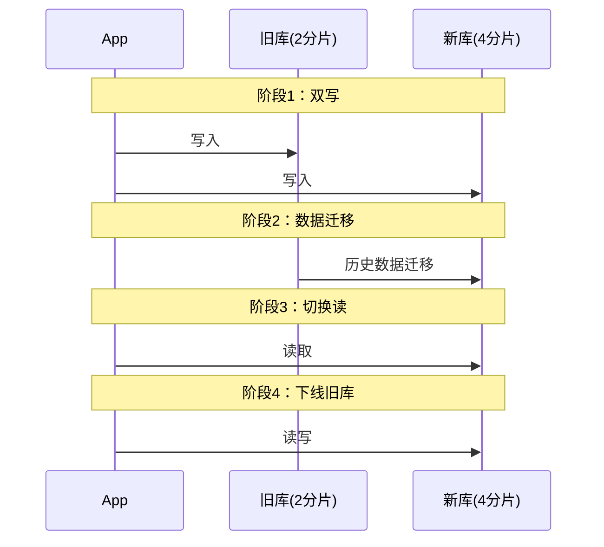

**实现代码：**

```java
@Service
public class UserService {
    
    @Autowired
    private UserMapper oldMapper;  // 旧库
    
    @Autowired
    private UserMapper newMapper;  // 新库
    
    @Value("${migration.phase}")
    private String phase;  // phase1/phase2/phase3
    
    public void saveUser(User user) {
        if ("phase1".equals(phase) || "phase2".equals(phase)) {
            // 双写
            oldMapper.insert(user);
            newMapper.insert(user);
        } else {
            // 只写新库
            newMapper.insert(user);
        }
    }
    
    public User getUser(Long id) {
        if ("phase3".equals(phase)) {
            // 读新库
            return newMapper.selectById(id);
        } else {
            // 读旧库
            return oldMapper.selectById(id);
        }
    }
}
```

**数据迁移脚本：**

```python
# 分批迁移，避免锁表
def migrate_data():
    batch_size = 1000
    max_id = get_max_id_from_old_db()
    
    for start_id in range(0, max_id, batch_size):
        end_id = start_id + batch_size
        
        # 查询旧库
        users = old_db.query(
            f"SELECT * FROM users WHERE id >= {start_id} AND id < {end_id}"
        )
        
        # 写入新库
        for user in users:
            shard_index = user['id'] % 4
            new_db[shard_index].insert(user)
        
        # 记录进度
        save_progress(end_id)
        
        # 限流
        time.sleep(0.1)
```

**最佳实践：**
- 分阶段执行，每阶段充分验证
- 双写期间监控数据一致性
- 支持快速回滚
- 限流迁移，避免影响线上

---
## 数据库与缓存（续）

### 17. 100亿数据平滑数据迁移,不影响服务

**问题分析：**
超大规模数据迁移，要求零停机。

**解决方案：**
1. 双写新旧库
2. 并行全量迁移
3. 数据校验
4. 灰度切换
5. 下线旧库

**最佳实践：**
- 限流保护
- 断点续传
- 实时监控

---

### 18. 58到家数据库30条军规解读

**核心军规：**
1. 字段必须有注释和默认值
2. 合理使用索引
3. 避免SELECT *
4. 事务尽量短
5. 单表<500万行

---

### 19. 再议58到家数据库军规

**补充规范：**
- 分库分表规范
- 读写分离规范
- 缓存使用规范
- 慢查询优化
- 备份恢复规范

---

### 20. 业界难题-"跨库分页"的四种方案

**方案对比：**
1. 全局查询+内存排序：简单但性能差
2. 二次查询：减少数据传输
3. 禁止跳页：性能好但体验差
4. 搜索引擎：最佳方案（推荐）

---

### 21. 用uid分库，uname上的查询怎么办？

**解决方案：**
1. 映射表：username → user_id
2. 冗余索引：所有分片都建索引
3. 搜索引擎：ES辅助查询

---

### 22. mysql-proxy数据库中间件架构

**核心功能：**
- SQL路由
- 结果归并
- 读写分离
- 连接池管理

**主流中间件：**
MyCat、ShardingSphere、Vitess

---

## 服务化与微服务

### 1. 互联网架构为什么要做服务化？

**服务化价值：**
1. 解耦：服务独立开发部署
2. 复用：避免重复开发
3. 扩展：按需扩展特定服务
4. 容错：故障隔离
5. 技术异构：选择最合适的技术栈

---

### 2. 微服务架构多"微"才合适？

**划分原则：**
1. 业务边界：按DDD领域划分
2. 团队规模：2-pizza团队（5-9人）
3. 代码规模：单服务1-2万行
4. 部署频率：能够独立快速部署

**反模式：**
- 过度拆分：调用链路复杂
- 拆分不足：服务耦合严重

---

### 3. 为什么说要搞定微服务架构，先搞定RPC框架？

**RPC是微服务基础：**
服务间通信完全依赖RPC

**核心能力：**
1. 序列化：高效数据传输
2. 网络通信：高性能IO（Netty）
3. 服务发现：动态路由
4. 负载均衡：流量分发
5. 容错机制：熔断、降级、重试

---

### 4. 微服务架构之RPC-client序列化细节

**序列化方案对比：**

| 方案 | 性能 | 跨语言 | 可读性 | 适用场景 |
|------|------|--------|--------|----------|
| JSON | 中 | 是 | 好 | 调试、跨语言 |
| Protobuf | 高 | 是 | 差 | 高性能、跨语言 |
| Hessian | 高 | 部分 | 差 | Java生态 |
| Kryo | 最高 | 否 | 差 | Java内部 |

**最佳实践：**
- 跨语言：Protobuf
- Java内部：Hessian/Kryo
- 调试阶段：JSON

---

### 5. RPC-client异步收发核心细节

**同步调用问题：**
线程阻塞等待，性能差

**异步方案：**
1. Future模式：提交后获取Future
2. Callback回调：完成后回调
3. CompletableFuture：链式调用
4. Reactive响应式：流式处理

---

## 消息系统

### 1. http如何像tcp一样实时的收消息？

**解决方案：**
1. 短轮询：定时请求（简单但浪费资源）
2. 长轮询：Hold住连接（Comet）
3. WebSocket：全双工通信（最佳）
4. SSE：服务器推送事件

---

### 2. 微信为什么不丢消息？

**核心机制：**
1. 消息确认：ACK机制
2. 消息重传：超时重发
3. 消息去重：唯一ID
4. 消息存储：服务器持久化

---

### 3. 微信为啥不丢"离线消息"？

**解决方案：**
1. 服务器存储离线消息
2. 用户上线后拉取
3. 消息有效期管理
4. 多端同步

---

### 4. 群消息这么复杂，怎么能做到不丢不重？

**方案对比：**
1. 扩散写：发送时写N份（实时性好）
2. 扩散读：接收时读取（存储省）

**去重机制：**
消息唯一ID + 客户端去重

---

### 5. QQ状态同步究竟是推还是拉？

**混合方案：**
- 状态变化：服务器推送
- 定期心跳：客户端拉取
- 离线状态：上线时拉取

---

### 6. 微信多点登录与QQ消息漫游架构随想

**核心技术：**
1. 消息漫游：服务器存储
2. 多端同步：推送到所有在线设备
3. 已读状态：同步已读位置

---

### 7. 消息"时序"与"一致性"为何这么难？

**挑战：**
1. 网络延迟不确定
2. 多端并发发送
3. 服务器时钟不同步

**解决方案：**
1. 逻辑时钟（Lamport）
2. 向量时钟
3. 序列号机制

---

### 8. 58到家通用实时消息平台架构细节

**架构设计：**
- 接入层：WebSocket/长连接
- 逻辑层：消息路由
- 存储层：消息持久化
- 推送层：多端推送

---

### 9. 微信为啥这么省流量？

**优化手段：**
1. 协议优化：二进制协议
2. 数据压缩：gzip/protobuf
3. 增量同步：只传差异
4. 图片压缩：智能压缩
5. 缓存策略：本地缓存

---

### 10. 应用层/安全层/传输层如何进行协议选型？

**协议选择：**
- 应用层：HTTP/WebSocket/自定义
- 安全层：TLS/SSL
- 传输层：TCP/UDP

**选型原则：**
- 实时性要求高：UDP
- 可靠性要求高：TCP
- 跨防火墙：HTTP/WebSocket

---

### 11. 库存扣多了，到底怎么整

**问题分析：**
并发扣减导致超卖

**解决方案：**
1. 数据库行锁
2. Redis原子操作
3. 消息队列串行化
4. 分布式锁

---

### 12. 库存扣减还有这么多方案？

**方案对比：**
1. 悲观锁：SELECT FOR UPDATE
2. 乐观锁：版本号
3. Redis DECR：原子操作
4. 预扣库存：提前占用

---

### 13. 浅谈CAS在分布式ID生成方案上的应用

**CAS原理：**
Compare And Swap，无锁算法

**应用场景：**
- 分布式ID生成
- 计数器
- 无锁队列

---

### 14. CAS下ABA问题及优化方案

**ABA问题：**
A→B→A，CAS无法检测中间变化

**解决方案：**
1. 版本号：AtomicStampedReference
2. 时间戳
3. 标记位

---

## 基础技术专题

### 1. 理解看懂单机/集群/热备/磁盘阵列（RAID）

**高可用方案：**
- 单机：无冗余，成本低
- 集群：负载均衡，高可用
- 热备：主备切换，快速恢复
- RAID：磁盘冗余，数据安全

---

### 2. 理解学习awk够用

**核心用法：**
```bash
# 打印第1列和第3列
awk '{print $1, $3}' file.txt

# 条件过滤
awk '$3 > 100 {print $0}' file.txt

# 统计
awk '{sum+=$3} END {print sum}' file.txt
```

---

### 3. 理解学习perl够用

**核心用法：**
```perl
# 文本替换
perl -pe 's/old/new/g' file.txt

# 正则匹配
perl -ne 'print if /pattern/' file.txt
```

---

### 4. sed入门

**核心用法：**
```bash
# 替换
sed 's/old/new/g' file.txt

# 删除行
sed '1,10d' file.txt

# 插入行
sed '1i\new line' file.txt
```

---

### 5. 了解两阶段提交2PC

**流程：**
1. Prepare阶段：协调者询问参与者
2. Commit阶段：所有参与者提交

**问题：**
- 阻塞：参与者等待协调者
- 单点故障：协调者挂了

---

### 6. SQL中的join

**类型：**
- INNER JOIN：交集
- LEFT JOIN：左表全部
- RIGHT JOIN：右表全部
- FULL JOIN：并集

---

### 7. 理解连接池

**核心参数：**
- 最小连接数：保持活跃
- 最大连接数：限制资源
- 超时时间：避免泄漏

---

### 8-9. 理解分布式锁

**实现方案：**
1. Redis SETNX
2. Zookeeper临时节点
3. 数据库唯一索引

**注意事项：**
- 锁超时
- 死锁
- 可重入

---

### 10. 理解TCP/IP搞定

**核心概念：**
- 三次握手：建立连接
- 四次挥手：断开连接
- 滑动窗口：流量控制
- 拥塞控制：避免网络拥塞

---

### 11. 理解负载LoadAverage

**含义：**
系统平均负载，表示等待CPU的进程数

**判断标准：**
- < CPU核心数：正常
- = CPU核心数：满载
- > CPU核心数：过载

---

### 12. 了解Leader-Follower线程模型

**角色：**
- Leader：接收请求
- Follower：处理请求

**优点：**
负载均衡，提升并发

---

### 13. 了解四层/七层反向代理

**区别：**
- 四层：TCP/UDP层，转发快
- 七层：HTTP层，功能强

**选择：**
- 性能优先：四层（LVS）
- 功能优先：七层（Nginx）

---

## 典型架构实践

### 1. 好架构是进化来的，不是设计来的

**演进路径：**
单体 → 垂直拆分 → SOA → 微服务 → 服务网格

**核心思想：**
- 小步快跑
- 持续重构
- 拥抱变化

---

### 2. 58同城推荐系统架构设计与实现

**核心模块：**
1. 召回层：多路召回（协同过滤、内容推荐）
2. 排序层：CTR预估模型
3. 重排层：多样性、新鲜度

---

### 3. 从0开始做互联网推荐-以58转转为例

**冷启动方案：**
1. 热门推荐
2. 基于内容推荐
3. 用户画像

---

### 4. 从0开始做垂直O2O个性化推荐

**特点：**
- LBS：地理位置
- 时效性：服务时间
- 个性化：用户偏好

---

### 5. 58到家入驻微信钱包的技术优化

**优化点：**
1. 性能优化：CDN、缓存
2. 稳定性：限流、降级
3. 监控告警：实时监控

---

### 6. 创业公司快速搭建立体化监控之路

**监控体系：**
- 基础监控：CPU、内存、磁盘
- 应用监控：QPS、RT、错误率
- 业务监控：订单量、GMV
- 日志监控：ELK
- 告警：短信、邮件、电话

---

### 7. 巧用CAS解决数据一致性问题

**应用场景：**
- 无锁编程
- 乐观锁
- 原子操作

---

### 8. 百度咋做长文本去重

**方案：**
1. SimHash：局部敏感哈希
2. MinHash + LSH
3. Bloom Filter预过滤

---

### 9. 如何快速实现高并发短文检索

**方案：**
1. Elasticsearch倒排索引
2. 前缀树（Trie）
3. Bloom Filter

---

### 10. 如何实现超高并发的无锁缓存？

**方案：**
1. CopyOnWrite：写时复制
2. ThreadLocal：线程本地
3. 不可变对象：Immutable

---

### 11. "id串行化"到底是怎么实现的？

**方案：**
1. 数据库自增ID
2. Redis INCR
3. Snowflake算法
4. 美团Leaf

---

### 12. 从IDC到云端架构迁移之路

**迁移步骤：**
1. 容器化：Docker
2. 编排：Kubernetes
3. 服务网格：Istio
4. 弹性伸缩：HPA
5. 监控：Prometheus + Grafana

---

## 全文总结

本文档详细解答了115个架构师面试核心问题，涵盖：

**通用设计（20题）：**
秒杀、分布式ID、容量设计、线程数、负载均衡、高并发、高可用等

**数据库与缓存（22题）：**
架构设计、冗余一致性、缓存策略、主从复制、分库分表、跨库分页等

**服务化与微服务（5题）：**
服务化价值、微服务粒度、RPC框架、序列化、异步通信

**消息系统（14题）：**
实时通信、消息可靠性、离线消息、群消息、状态同步、库存扣减、CAS

**基础技术（13题）：**
集群热备、文本处理、2PC、JOIN、连接池、分布式锁、TCP/IP、负载、线程模型

**典型实践（12题）：**
架构演进、推荐系统、监控体系、文本去重、短文检索、无锁缓存、ID生成、云端迁移

**学习建议：**
1. 理解原理，不要死记硬背
2. 结合实际项目经验
3. 对比不同方案的优缺点
4. 关注技术演进趋势
5. 培养系统性思维

**面试技巧：**
1. 先说方案，再讲细节
2. 对比不同方案
3. 结合实际场景
4. 展示权衡取舍
5. 体现系统思考

祝您面试顺利，offer多多！
