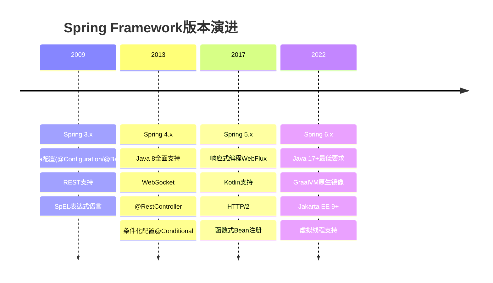
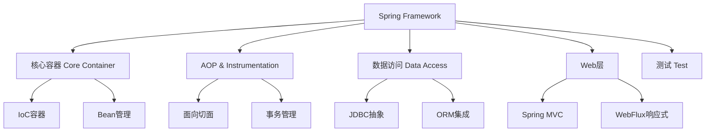
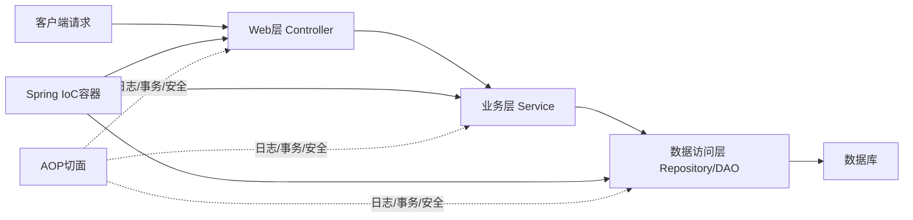
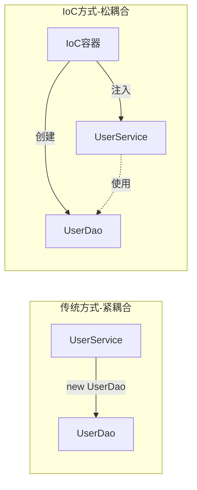
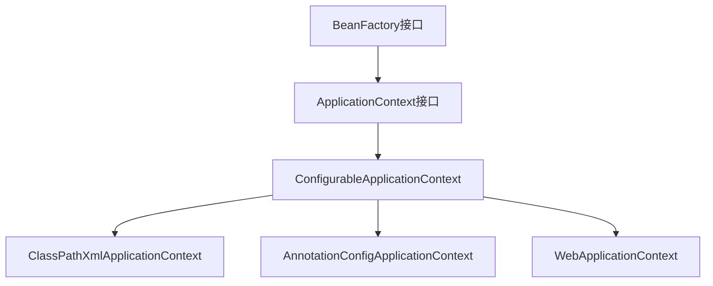

# Spring面试题全集（一）+（二）完整答案

> 涵盖Spring面试题（一）全部7大板块 + Spring面试题（二）全部68题，附代码示例与Mermaid图解。

---

## 目录

- [Spring面试题（一）](#spring面试题一)
  - [1. 一般问题](#1-一般问题)
  - [2. 依赖注入IoC](#2-依赖注入ioc)
  - [3. Beans](#3-beans)
  - [4. 注解](#4-注解)
  - [5. 数据访问](#5-数据访问)
  - [6. AOP](#6-aop)
  - [7. MVC](#7-mvc)
- [Spring面试题（二）](#spring面试题二)

---

# Spring面试题（一）

## 1. 一般问题

### 1.1 不同版本的Spring Framework有哪些主要功能?

Spring Framework经历了多个重要版本的演进，每个版本都带来了显著的功能改进：



**Spring 3.x (2009-2013)**
- 引入基于Java的配置方式（`@Configuration`、`@Bean`）
- 支持REST风格Web服务，新增`RestTemplate`
- 引入SpEL（Spring Expression Language）表达式语言
- 支持声明式缓存管理（`@Cacheable`）
- 全面支持Java 5+特性（泛型、注解）

**Spring 4.x (2013-2017)**
- 全面支持Java 8（Lambda、Optional、Stream API）
- 引入`@RestController`简化REST API开发
- 支持WebSocket通信
- 引入条件化配置（`@Conditional`）
- 支持CORS跨域资源共享
- 改进测试框架

**Spring 5.x (2017-2022)**
- 基于Java 8+，支持Java 9-17
- 引入响应式编程模型（Spring WebFlux、Project Reactor）
- 支持Kotlin语言
- 引入函数式Bean注册API
- 支持HTTP/2协议
- 核心容器性能显著提升

**Spring 6.x (2022-至今)**
- 要求Java 17+作为最低版本
- 原生支持GraalVM AOT编译，可生成原生可执行文件
- 全面迁移到Jakarta EE 9+（`javax.*` → `jakarta.*`）
- 改进可观测性（Micrometer集成）
- 增强对虚拟线程（Project Loom）的支持
- 更好的云原生支持

### 1.2 什么是Spring Framework?

Spring Framework是一个开源的Java企业级应用开发框架，由Rod Johnson创建，首次发布于2003年。其核心是**控制反转（IoC）**和**面向切面编程（AOP）**。

Spring的设计哲学：让Java开发更简单、更快速、更安全。它通过提供完整的基础设施支持，让开发者专注于业务逻辑，而不必关心底层技术细节。



**核心特点：**
- **轻量级**：基础版本只需约1MB的JAR包，对代码侵入性极小
- **控制反转（IoC）**：对象的创建和依赖关系由Spring容器管理
- **面向切面编程（AOP）**：将横切关注点（日志、事务、安全）从业务逻辑中分离
- **容器**：负责创建、配置和管理应用程序中的对象（Bean）
- **MVC框架**：提供功能完整的MVC Web框架
- **事务管理**：提供统一的事务管理接口，支持声明式事务
- **异常处理**：将技术相关异常转换为统一的非检查异常

### 1.3 列举Spring Framework的优点。

**1. 轻量级和非侵入性**
Spring是轻量级的，对应用程序代码侵入性很小。使用Spring的POJO不需要继承特定类或实现特定接口，代码可以独立于Spring框架进行测试。

**2. 控制反转（IoC）**
通过IoC，对象的依赖关系由容器注入，而不是对象自己创建依赖。这降低了组件之间的耦合度，使代码更易于测试和维护。

**3. 面向切面编程（AOP）**
AOP允许将横切关注点（如日志记录、安全检查、事务管理）从业务逻辑中分离出来，提高了代码的模块化程度。

**4. 容器**
Spring容器负责管理对象的生命周期，包括创建、初始化、使用和销毁，开发者无需手动管理对象生命周期。

**5. MVC框架**
Spring MVC是功能完整、灵活的Web MVC框架，与Spring其他功能集成得更好。

**6. 事务管理**
Spring提供一致的事务管理接口，支持本地事务和全局事务，支持声明式事务管理，大大简化了事务处理代码。

**7. 异常处理**
Spring将各种技术（如JDBC、Hibernate）的特定异常转换为统一的非检查异常，简化了异常处理。

**8. 易于测试**
由于IoC的特性，Spring应用程序非常容易进行单元测试和集成测试。

**9. 与其他框架的集成**
Spring可以与众多流行框架无缝集成，如Hibernate、MyBatis、Struts等。

**10. 成熟的生态系统**
Spring拥有庞大的生态系统，包括Spring Boot、Spring Cloud、Spring Security、Spring Data等子项目。

### 1.4 Spring Framework有哪些不同的功能?

Spring Framework提供了以下主要功能：

**1. 依赖注入（Dependency Injection）**
这是Spring的核心功能，通过IoC容器管理对象之间的依赖关系，支持构造函数注入、Setter注入和字段注入。

**2. 面向切面编程（AOP）**
支持方法级别的拦截，可以在不修改业务代码的情况下添加横切功能，如日志、事务、安全等。

**3. 数据访问/集成**
- JDBC抽象层，简化JDBC操作
- ORM集成（Hibernate、JPA、MyBatis等）
- 统一事务管理
- 对象/XML映射（OXM）

**4. Web层**
- Spring MVC：基于Servlet的Web框架
- Spring WebFlux：响应式Web框架（Spring 5+）
- WebSocket支持
- REST支持

**5. 测试支持**
- 单元测试支持
- 集成测试支持
- Mock对象
- TestContext框架

**6. 消息传递**
- JMS（Java Message Service）支持
- 消息转换器
- 消息监听容器

**7. 缓存抽象**
提供统一的缓存API，支持多种缓存实现（EhCache、Redis、Caffeine等）。

**8. 任务调度**
支持定时任务（`@Scheduled`）和异步执行（`@Async`）。

### 1.5 Spring Framework中有多少个模块，它们分别是什么?

Spring Framework由多个模块组成，这些模块可以根据需要选择性地使用：

```mermaid
graph TD
    A[Spring Framework模块] --> B[Core Container]
    A --> C[AOP and Instrumentation]
    A --> D[Messaging]
    A --> E[Data Access/Integration]
    A --> F[Web]
    A --> G[Test]

    B --> B1[spring-core]
    B --> B2[spring-beans]
    B --> B3[spring-context]
    B --> B4[spring-context-support]
    B --> B5[spring-expression]

    C --> C1[spring-aop]
    C --> C2[spring-aspects]
    C --> C3[spring-instrument]

    D --> D1[spring-messaging]

    E --> E1[spring-jdbc]
    E --> E2[spring-tx]
    E --> E3[spring-orm]
    E --> E4[spring-oxm]
    E --> E5[spring-jms]

    F --> F1[spring-web]
    F --> F2[spring-webmvc]
    F --> F3[spring-websocket]
    F --> F4[spring-webflux]

    G --> G1[spring-test]
```



**核心容器（Core Container）**
- **spring-core**：提供IoC和DI功能的基础，包含资源加载、类型转换等核心工具
- **spring-beans**：提供BeanFactory，是Spring IoC容器的基础实现
- **spring-context**：在core和beans基础上构建，提供ApplicationContext，支持国际化、事件传播等
- **spring-context-support**：提供对第三方库集成的支持（缓存、邮件、调度等）
- **spring-expression**：提供Spring表达式语言（SpEL）

**AOP和Instrumentation**
- **spring-aop**：提供面向切面编程的实现
- **spring-aspects**：提供与AspectJ的集成
- **spring-instrument**：提供类级别的instrumentation支持

**消息传递（Messaging）**
- **spring-messaging**：提供消息传递的基础支持，包括Message、MessageChannel等抽象

**数据访问/集成（Data Access/Integration）**
- **spring-jdbc**：提供JDBC抽象层，简化JDBC操作
- **spring-tx**：提供编程式和声明式事务管理
- **spring-orm**：提供与ORM框架（Hibernate、JPA等）的集成
- **spring-oxm**：提供对象/XML映射抽象
- **spring-jms**：提供JMS消息发送和接收功能

**Web层**
- **spring-web**：提供基础的Web功能，如文件上传、IoC容器初始化等
- **spring-webmvc**：提供Spring MVC实现
- **spring-websocket**：提供WebSocket支持
- **spring-webflux**：提供响应式Web框架（Spring 5+）

**测试（Test）**
- **spring-test**：提供对JUnit和TestNG的集成测试支持

### 1.6 什么是Spring配置文件?

Spring配置文件是用于定义Spring应用程序中Bean及其依赖关系的文件。Spring支持多种配置方式：

**1. XML配置文件（传统方式）**

```xml
<?xml version="1.0" encoding="UTF-8"?>
<beans xmlns="http://www.springframework.org/schema/beans"
       xmlns:xsi="http://www.w3.org/2001/XMLSchema-instance"
       xsi:schemaLocation="http://www.springframework.org/schema/beans
           http://www.springframework.org/schema/beans/spring-beans.xsd">

    <bean id="userService" class="com.example.UserService">
        <property name="userDao" ref="userDao"/>
    </bean>

    <bean id="userDao" class="com.example.UserDaoImpl"/>
</beans>
```

**2. Java配置类（推荐方式）**

```java
@Configuration
public class AppConfig {
    @Bean
    public UserService userService() {
        return new UserService(userDao());
    }

    @Bean
    public UserDao userDao() {
        return new UserDaoImpl();
    }
}
```

**3. 注解配置**

```java
@Service
public class UserService {
    @Autowired
    private UserDao userDao;
}
```

**4. 属性文件（application.properties / application.yml）**

```properties
# application.properties
spring.datasource.url=jdbc:mysql://localhost:3306/mydb
spring.datasource.username=root
spring.datasource.password=secret
```

**配置文件的加载顺序（Spring Boot）：**
1. 命令行参数
2. 系统环境变量
3. `application-{profile}.properties`
4. `application.properties`
5. `@PropertySource`注解指定的文件

### 1.7 Spring应用程序有哪些不同组件?

一个典型的Spring应用程序由以下组件构成：



**1. Bean（Spring管理的对象）**
Spring应用程序的基本构建块，由Spring IoC容器管理的对象。

**2. Bean定义（Bean Definition）**
描述Bean的元数据，包括类名、作用域、生命周期回调、依赖关系等。

**3. Bean工厂（BeanFactory）**
Spring IoC容器的基础接口，负责Bean的实例化、配置和管理。

**4. 应用上下文（ApplicationContext）**
BeanFactory的扩展，提供更多企业级功能，如国际化、事件发布等。

**5. 配置元数据**
告诉Spring容器如何实例化、配置和组装Bean，可以是XML、注解或Java代码。

**6. AOP代理**
Spring AOP创建的代理对象，用于实现横切关注点。

**7. 事件系统**
Spring的事件发布/订阅机制，用于组件间的松耦合通信。

**典型的分层架构：**
- **表现层（Presentation Layer）**：Controller，处理HTTP请求和响应
- **业务层（Business Layer）**：Service，包含业务逻辑
- **数据访问层（Data Access Layer）**：Repository/DAO，负责数据库操作
- **领域层（Domain Layer）**：Entity/Model，表示业务实体

### 1.8 使用Spring有哪些方式?

**1. 独立应用程序**

```java
public class MainApp {
    public static void main(String[] args) {
        // 使用XML配置
        ApplicationContext context =
            new ClassPathXmlApplicationContext("applicationContext.xml");

        // 或使用Java配置
        ApplicationContext context2 =
            new AnnotationConfigApplicationContext(AppConfig.class);

        UserService userService = context.getBean(UserService.class);
        userService.doSomething();
    }
}
```

**2. Web应用程序（Spring MVC）**
在`web.xml`中配置`DispatcherServlet`，或使用Spring Boot自动配置。

**3. Spring Boot应用程序（最常用）**

```java
@SpringBootApplication
public class Application {
    public static void main(String[] args) {
        SpringApplication.run(Application.class, args);
    }
}
```

**4. 与其他框架集成**
- 与Struts集成
- 与JSF集成
- 与Hibernate/MyBatis集成

**5. 微服务架构（Spring Cloud）**
使用Spring Cloud构建微服务应用，提供服务发现、配置中心、负载均衡等功能。

**6. 响应式应用程序（Spring WebFlux）**

```java
@RestController
public class ReactiveController {
    @GetMapping("/users")
    public Flux<User> getUsers() {
        return userService.findAll();
    }
}
```

---

## 2. 依赖注入（IoC）

### 2.1 什么是Spring IOC容器?

IoC（Inversion of Control，控制反转）容器是Spring框架的核心。它负责创建对象、管理对象的生命周期、配置对象以及管理对象之间的依赖关系。



**传统方式（紧耦合）：**
```java
public class UserService {
    // 自己创建依赖对象，紧耦合
    private UserDao userDao = new UserDaoImpl();
}
```

**IoC方式（松耦合）：**
```java
public class UserService {
    // 依赖由外部注入，松耦合
    private UserDao userDao;

    public UserService(UserDao userDao) {
        this.userDao = userDao;
    }
}
```

**IoC容器的工作原理：**
1. 读取配置元数据（XML、注解或Java配置）
2. 根据配置创建Bean实例
3. 解析Bean之间的依赖关系
4. 将依赖注入到相应的Bean中
5. 管理Bean的完整生命周期

**Spring提供两种IoC容器：**
- **BeanFactory**：基础容器，提供基本的IoC功能
- **ApplicationContext**：高级容器，在BeanFactory基础上增加了更多企业级功能

### 2.2 什么是依赖注入?

依赖注入（Dependency Injection，DI）是IoC的一种具体实现方式。它是指对象的依赖关系不由对象自己创建，而是由外部容器（Spring IoC容器）在运行时注入进来。

**核心思想：**
- 对象不负责查找或创建它所依赖的对象
- 依赖关系由外部容器在运行时提供
- 对象只需要声明它需要什么，而不关心如何获得

**依赖注入的好处：**
1. **降低耦合度**：组件之间通过接口交互，不依赖具体实现
2. **提高可测试性**：可以轻松替换依赖的Mock对象进行单元测试
3. **提高可维护性**：修改依赖实现不需要修改使用者代码
4. **提高可重用性**：组件可以在不同上下文中重用

**示例：**
```java
// 定义接口
public interface MessageService {
    String getMessage();
}

// 实现类
@Service
public class EmailService implements MessageService {
    @Override
    public String getMessage() {
        return "Email message";
    }
}

// 使用依赖注入
@Component
public class MessagePrinter {
    // Spring会自动注入MessageService的实现
    @Autowired
    private MessageService messageService;

    public void printMessage() {
        System.out.println(messageService.getMessage());
    }
}
```

### 2.3 可以通过多少种方式完成依赖注入?

Spring支持三种主要的依赖注入方式：

**1. 构造函数注入（Constructor Injection）**

```java
@Service
public class UserService {
    private final UserDao userDao;
    private final EmailService emailService;

    // Spring 4.3+单构造函数可省略@Autowired
    @Autowired
    public UserService(UserDao userDao, EmailService emailService) {
        this.userDao = userDao;
        this.emailService = emailService;
    }
}
```

**2. Setter注入（Setter Injection）**

```java
@Service
public class UserService {
    private UserDao userDao;

    @Autowired
    public void setUserDao(UserDao userDao) {
        this.userDao = userDao;
    }
}
```

**3. 字段注入（Field Injection）**

```java
@Service
public class UserService {
    @Autowired
    private UserDao userDao;
}
```

**三种方式的对比：**

| 特性 | 构造函数注入 | Setter注入 | 字段注入 |
|------|------------|-----------|---------|
| 强制依赖 | 是 | 否 | 否 |
| 可选依赖 | 否 | 是 | 是 |
| 不可变性 | 支持（final） | 不支持 | 不支持 |
| 可测试性 | 最好 | 好 | 差 |
| 代码简洁性 | 一般 | 一般 | 最简洁 |
| Spring推荐 | 是（强制依赖） | 是（可选依赖） | 不推荐 |

**Spring官方推荐使用构造函数注入**，原因：
- 依赖不可变（可以使用final）
- 依赖不能为null（在构造时就会报错）
- 组件完全初始化后才能使用
- 便于单元测试（不需要Spring容器）

### 2.4 区分构造函数注入和setter注入。

| 对比维度 | 构造函数注入 | Setter注入 |
|---------|------------|-----------|
| 注入时机 | 对象创建时注入 | 对象创建后通过setter注入 |
| 强制性 | 强制依赖，不能为null | 可选依赖，可以为null |
| 不可变性 | 支持final字段，依赖不可变 | 不支持final，依赖可被修改 |
| 循环依赖 | 无法解决循环依赖 | 可以解决循环依赖 |
| 可读性 | 依赖关系清晰 | 依赖关系分散 |
| 测试性 | 无需Spring容器即可测试 | 需要调用setter方法 |
| 适用场景 | 必须的依赖 | 可选的依赖 |

**构造函数注入示例：**
```java
@Service
public class OrderService {
    private final UserService userService;    // final，不可变
    private final PaymentService paymentService;

    public OrderService(UserService userService, PaymentService paymentService) {
        this.userService = Objects.requireNonNull(userService);
        this.paymentService = Objects.requireNonNull(paymentService);
    }
}
```

**Setter注入示例：**
```java
@Service
public class OrderService {
    private UserService userService;
    private NotificationService notificationService;  // 可选依赖

    @Autowired
    public void setUserService(UserService userService) {
        this.userService = userService;
    }

    @Autowired(required = false)  // 可选依赖
    public void setNotificationService(NotificationService notificationService) {
        this.notificationService = notificationService;
    }
}
```

**最佳实践：**
- 必须的依赖使用构造函数注入
- 可选的依赖使用Setter注入
- 避免使用字段注入（不利于测试和维护）

### 2.5 spring中有多少种IOC容器?

Spring提供了两种主要的IoC容器：

**1. BeanFactory**
- 最基础的IoC容器
- 提供基本的依赖注入功能
- 采用懒加载策略（Bean在第一次请求时才创建）
- 适合资源受限的环境（如移动设备）

```java
// BeanFactory使用示例（不推荐，已较少使用）
Resource resource = new ClassPathResource("applicationContext.xml");
BeanFactory factory = new XmlBeanFactory(resource);
UserService userService = factory.getBean("userService", UserService.class);
```

**2. ApplicationContext**
- BeanFactory的子接口，功能更丰富
- 采用预加载策略（容器启动时创建所有单例Bean）
- 提供国际化支持（MessageSource）
- 提供事件发布机制（ApplicationEventPublisher）
- 提供资源加载（ResourceLoader）
- 支持AOP集成

**ApplicationContext的主要实现：**

| 实现类 | 说明 |
|--------|------|
| ClassPathXmlApplicationContext | 从类路径加载XML配置 |
| FileSystemXmlApplicationContext | 从文件系统加载XML配置 |
| AnnotationConfigApplicationContext | 从Java配置类加载配置 |
| WebApplicationContext | Web应用专用上下文 |
| AnnotationConfigWebApplicationContext | Web应用的Java配置上下文 |

```java
// 各种ApplicationContext使用示例
ApplicationContext ctx1 =
    new ClassPathXmlApplicationContext("applicationContext.xml");

ApplicationContext ctx2 =
    new FileSystemXmlApplicationContext("/path/to/applicationContext.xml");

ApplicationContext ctx3 =
    new AnnotationConfigApplicationContext(AppConfig.class);
```

### 2.6 区分BeanFactory和ApplicationContext。



| 特性 | BeanFactory | ApplicationContext |
|------|------------|-------------------|
| Bean实例化 | 懒加载（按需创建） | 预加载（启动时创建单例） |
| 国际化支持 | 不支持 | 支持（MessageSource） |
| 事件发布 | 不支持 | 支持（ApplicationEvent） |
| AOP集成 | 手动配置 | 自动集成 |
| 注解支持 | 有限 | 完整支持 |
| 资源加载 | 基础 | 增强（ResourceLoader） |
| 环境抽象 | 不支持 | 支持（Environment） |
| 适用场景 | 资源受限环境 | 企业级应用（推荐） |

**BeanFactory的核心方法：**
```java
Object getBean(String name);
<T> T getBean(Class<T> requiredType);
boolean containsBean(String name);
boolean isSingleton(String name);
```

**ApplicationContext额外提供的功能：**
```java
// 发布事件
applicationContext.publishEvent(new UserCreatedEvent(user));

// 获取国际化消息
String message = applicationContext.getMessage("greeting", null, Locale.CHINESE);

// 获取资源
Resource resource = applicationContext.getResource("classpath:config.xml");
```

**结论：** 在实际开发中，几乎总是使用ApplicationContext，BeanFactory只在极少数资源受限的场景下使用。

### 2.7 列举IoC的一些好处。

**1. 降低耦合度**
组件之间通过接口交互，不依赖具体实现类，使得系统更加灵活。

**2. 提高可测试性**
可以轻松地将真实依赖替换为Mock对象，便于单元测试：
```java
@Test
public void testUserService() {
    UserDao mockDao = Mockito.mock(UserDao.class);
    UserService service = new UserService(mockDao);  // 构造函数注入
    // 测试...
}
```

**3. 提高代码可维护性**
修改依赖的实现不需要修改使用者的代码，只需修改配置。

**4. 促进面向接口编程**
IoC鼓励开发者面向接口编程，而不是面向具体实现。

**5. 集中管理对象**
所有对象的创建和管理都集中在IoC容器中，便于统一管理。

**6. 支持AOP**
IoC容器可以在Bean创建时自动应用AOP代理，实现横切关注点。

**7. 生命周期管理**
容器负责管理Bean的完整生命周期，包括初始化和销毁。

**8. 配置外部化**
依赖关系通过配置文件或注解定义，可以在不修改代码的情况下改变行为。

