# ZooKeeper面试题

## 1. ZooKeeper是什么?

ZooKeeper 是一个开源的分布式协调服务框架，由 Apache 软件基金会维护。它是 Google Chubby 的开源实现，主要用于解决分布式系统中的数据一致性问题。

**核心特点：**

- **分布式协调服务**：为分布式应用提供一致性服务的软件
- **高性能**：读操作性能极高，适合读多写少的场景
- **高可靠**：集群中只要有半数以上节点存活，ZooKeeper 就能正常服务
- **顺序一致性**：从同一个客户端发起的事务请求，最终会严格按照发起顺序应用到 ZooKeeper 中
- **原子性**：所有事务请求的处理结果在整个集群中所有机器上的应用情况是一致的
- **单一视图**：无论客户端连接到哪个服务器，看到的数据模型都是一致的
- **实时性**：在一定时间范围内，客户端能读到最新的数据

**应用场景：**
- 配置管理
- 分布式锁
- 集群管理
- 命名服务
- 负载均衡

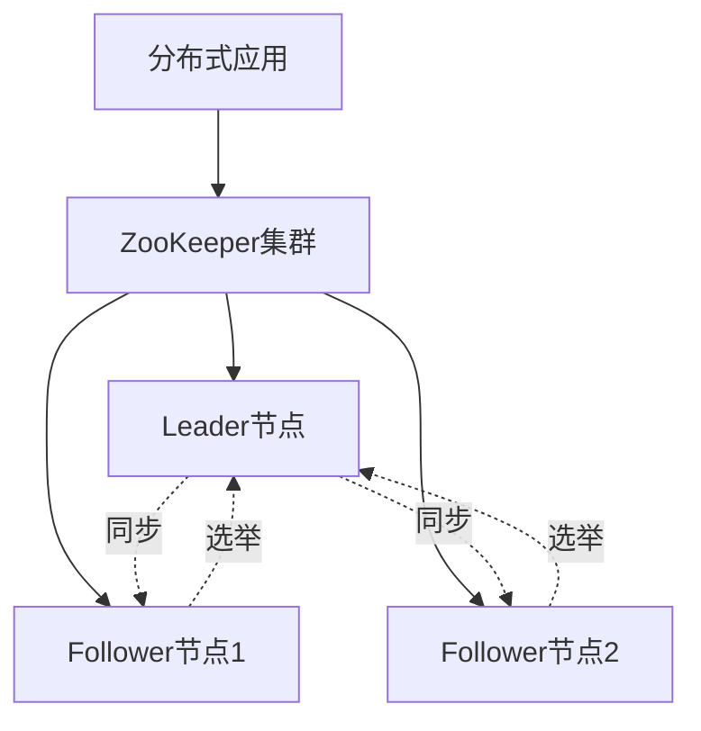
```mermaid
graph TB
    A[分布式应用] --> B[ZooKeeper集群]
    B --> C[Leader节点]
    B --> D[Follower节点1]
    B --> E[Follower节点2]
    C -.同步.-> D
    C -.同步.-> E
    D -.选举.-> C
    E -.选举.-> C
```

## 2. ZooKeeper提供了什么?

ZooKeeper 为分布式应用提供了一系列核心服务和功能：

**1. 文件系统**
- 提供类似文件系统的树形数据结构
- 每个节点称为 ZNode，可以存储数据
- 支持层级命名空间

**2. 通知机制**
- 客户端可以在 ZNode 上注册 Watcher 监听
- 当 ZNode 数据发生变化时，ZooKeeper 会通知所有注册了该节点 Watcher 的客户端
- 实现了发布/订阅模式

**3. 分布式锁**
- 利用 ZNode 的唯一性和临时节点特性实现分布式锁
- 支持公平锁（有序节点）和非公平锁

**4. 集群管理**
- 通过临时节点感知集群成员的上下线
- 实现 Master 选举

**5. 配置管理**
- 集中存储配置信息
- 通过 Watcher 机制实现配置的动态更新

**6. 命名服务**
- 提供全局唯一的命名空间
- 类似 DNS 的服务发现功能

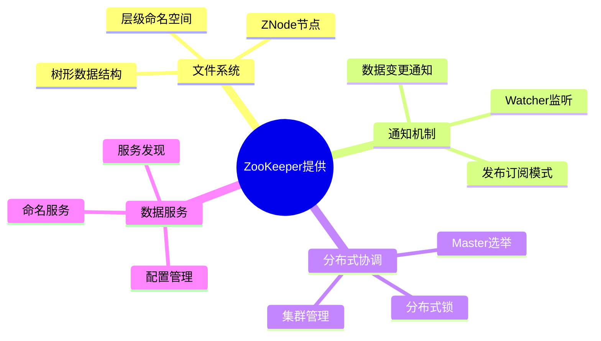
```mermaid
mindmap
  root((ZooKeeper提供))
    文件系统
      树形数据结构
      ZNode节点
      层级命名空间
    通知机制
      Watcher监听
      数据变更通知
      发布订阅模式
    分布式协调
      分布式锁
      Master选举
      集群管理
    数据服务
      配置管理
      命名服务
      服务发现
```

## 3. Zookeeper文件系统

ZooKeeper 的数据模型采用树形层级结构，类似于 Unix 文件系统，但有以下特点：

**结构特点：**
- 根节点为 `/`
- 每个节点称为 ZNode
- 每个 ZNode 既可以存储数据，也可以有子节点（与文件系统中文件和目录的区别不同）
- 节点路径必须是绝对路径，以 `/` 开头
- 每个 ZNode 最多存储 **1MB** 的数据

**ZNode 包含的信息：**

```
ZNode
├── data          # 节点数据
├── stat          # 节点状态信息
│   ├── czxid     # 创建时的事务ID
│   ├── mzxid     # 最后修改时的事务ID
│   ├── ctime     # 创建时间
│   ├── mtime     # 最后修改时间
│   ├── version   # 数据版本号
│   ├── cversion  # 子节点版本号
│   ├── aversion  # ACL版本号
│   ├── ephemeralOwner # 临时节点的会话ID
│   ├── dataLength     # 数据长度
│   └── numChildren    # 子节点数量
└── children      # 子节点列表
```

**文件系统示意图：**

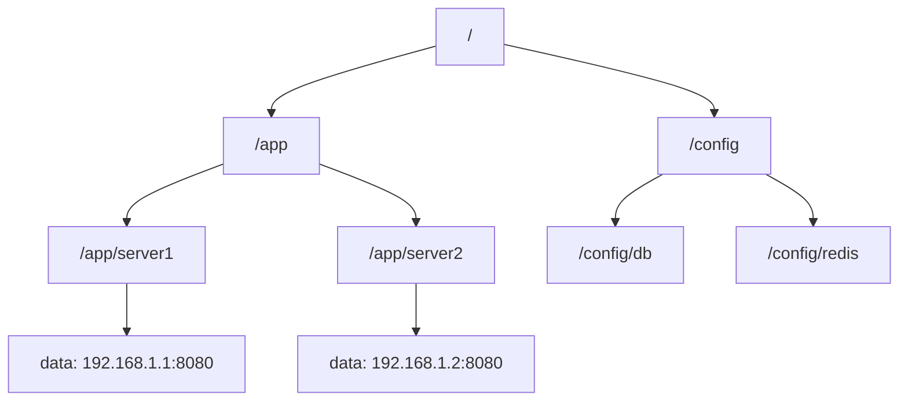
```mermaid
graph TD
    root["/"] --> app["/app"]
    root --> config["/config"]
    app --> server1["/app/server1"]
    app --> server2["/app/server2"]
    config --> db["/config/db"]
    config --> redis["/config/redis"]
    server1 --> s1data["data: 192.168.1.1:8080"]
    server2 --> s2data["data: 192.168.1.2:8080"]
```

**操作命令示例：**

```bash
# 创建节点
create /app "myapp"

# 读取节点数据
get /app

# 修改节点数据
set /app "newdata"

# 查看子节点
ls /app

# 删除节点
delete /app

# 查看节点状态
stat /app
```

## 4. ZAB协议

ZAB（ZooKeeper Atomic Broadcast，ZooKeeper 原子广播协议）是 ZooKeeper 专门设计的一种支持崩溃恢复的原子广播协议，是 ZooKeeper 实现分布式数据一致性的核心算法。

**ZAB 协议的两种模式：**

**1. 崩溃恢复模式（Recovery Mode）**
- 当 ZooKeeper 集群启动或 Leader 崩溃时进入此模式
- 通过选举产生新的 Leader
- 新 Leader 确保所有 Follower 与自己数据同步后，退出恢复模式

**2. 消息广播模式（Broadcast Mode）**
- 正常工作状态下的模式
- Leader 接收客户端写请求，广播给所有 Follower
- 超过半数 Follower 确认后，提交事务

**消息广播流程：**

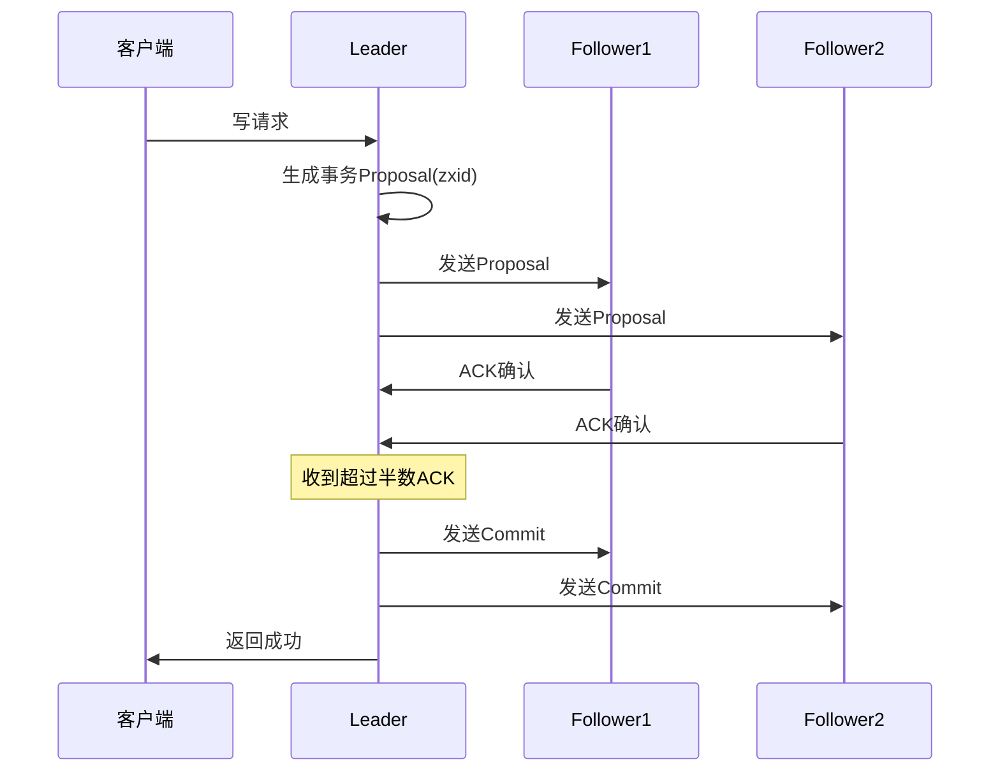
```mermaid
sequenceDiagram
    participant C as 客户端
    participant L as Leader
    participant F1 as Follower1
    participant F2 as Follower2

    C->>L: 写请求
    L->>L: 生成事务Proposal(zxid)
    L->>F1: 发送Proposal
    L->>F2: 发送Proposal
    F1->>L: ACK确认
    F2->>L: ACK确认
    Note over L: 收到超过半数ACK
    L->>F1: 发送Commit
    L->>F2: 发送Commit
    L->>C: 返回成功
```

**Leader 选举流程：**

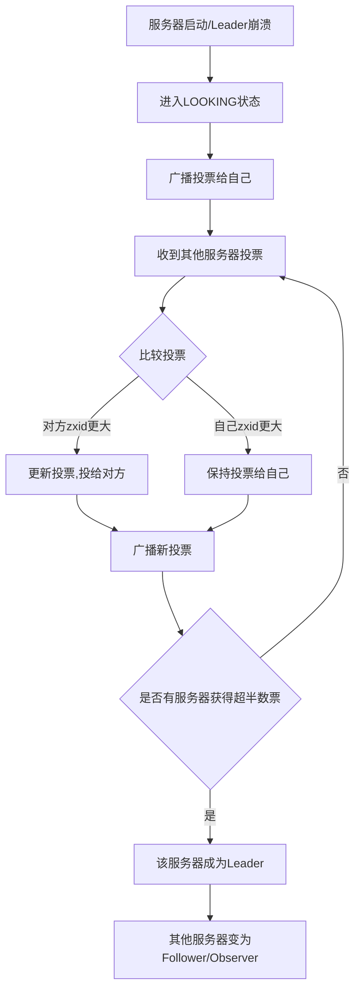
```mermaid
flowchart TD
    A[服务器启动/Leader崩溃] --> B[进入LOOKING状态]
    B --> C[广播投票给自己]
    C --> D[收到其他服务器投票]
    D --> E{比较投票}
    E -->|对方zxid更大| F[更新投票,投给对方]
    E -->|自己zxid更大| G[保持投票给自己]
    F --> H[广播新投票]
    G --> H
    H --> I{是否有服务器获得超半数票}
    I -->|否| D
    I -->|是| J[该服务器成为Leader]
    J --> K[其他服务器变为Follower/Observer]
```

**ZXID（事务ID）结构：**

```
ZXID = epoch(高32位) + counter(低32位)
- epoch: Leader 的任期编号，每次选举新 Leader 时递增
- counter: 事务计数器，每次事务递增，Leader 切换时重置为0
```

## 5. 四种类型的数据节点Znode

ZooKeeper 中的 ZNode 分为四种类型，根据是否持久化和是否有序来区分：

**1. 持久节点（PERSISTENT）**
- 创建后永久存在，除非主动删除
- 不会因为客户端会话结束而消失
- 适用于存储持久化配置信息

```bash
create /persistent_node "data"
```

**2. 持久顺序节点（PERSISTENT_SEQUENTIAL）**
- 持久存在，节点名称后自动追加单调递增的数字后缀
- 后缀格式：10位数字，如 `/node0000000001`
- 适用于需要全局唯一有序编号的场景

```bash
create -s /sequential_node "data"
# 实际创建: /sequential_node0000000001
```

**3. 临时节点（EPHEMERAL）**
- 与客户端会话绑定，会话结束（超时或断开）后自动删除
- 不能有子节点
- 适用于服务注册、集群成员管理

```bash
create -e /ephemeral_node "data"
```

**4. 临时顺序节点（EPHEMERAL_SEQUENTIAL）**
- 临时存在 + 自动编号
- 会话结束后自动删除
- 适用于实现分布式公平锁

```bash
create -e -s /lock_node "data"
# 实际创建: /lock_node0000000001
```

**对比表格：**

| 类型 | 持久性 | 有序性 | 能有子节点 | 典型用途 |
|------|--------|--------|-----------|---------|
| PERSISTENT | 持久 | 无序 | 是 | 配置存储 |
| PERSISTENT_SEQUENTIAL | 持久 | 有序 | 是 | 分布式ID生成 |
| EPHEMERAL | 临时 | 无序 | 否 | 服务注册 |
| EPHEMERAL_SEQUENTIAL | 临时 | 有序 | 否 | 分布式锁 |

**ZooKeeper 3.6+ 新增容器节点和TTL节点：**

- **容器节点（CONTAINER）**：当最后一个子节点被删除后，容器节点也会被自动删除
- **TTL节点（TTL）**：可以设置过期时间，超时后自动删除（需要开启配置）

## 6. Zookeeper Watcher机制--数据变更通知

Watcher 机制是 ZooKeeper 实现分布式通知的核心功能，允许客户端监听 ZNode 的变化并在变化发生时收到通知。

**Watcher 工作原理：**

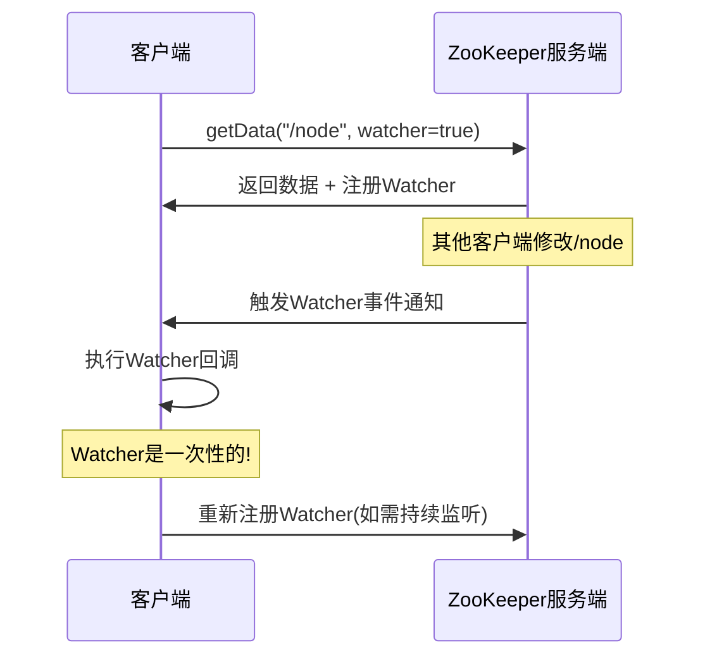
```mermaid
sequenceDiagram
    participant C as 客户端
    participant ZK as ZooKeeper服务端

    C->>ZK: getData("/node", watcher=true)
    ZK->>C: 返回数据 + 注册Watcher
    Note over ZK: 其他客户端修改/node
    ZK->>C: 触发Watcher事件通知
    C->>C: 执行Watcher回调
    Note over C: Watcher是一次性的!
    C->>ZK: 重新注册Watcher(如需持续监听)
```

**Watcher 的特性：**

1. **一次性触发**：Watcher 被触发后自动失效，如需持续监听需重新注册
2. **轻量级**：服务端只发送通知，不发送具体变更数据，客户端需主动获取
3. **顺序性**：同一客户端的 Watcher 回调按顺序执行
4. **异步通知**：Watcher 通知是异步的

**可以注册 Watcher 的操作：**

```java
// 监听节点数据变化
zk.getData("/node", watcher, stat);

// 监听节点是否存在（包括创建和删除）
zk.exists("/node", watcher);

// 监听子节点列表变化
zk.getChildren("/node", watcher);
```

**Watcher 事件类型：**

| 事件类型 | 触发条件 |
|---------|---------|
| NodeCreated | 节点被创建 |
| NodeDeleted | 节点被删除 |
| NodeDataChanged | 节点数据被修改 |
| NodeChildrenChanged | 子节点列表发生变化 |
| None | 客户端与服务端连接状态变化 |

**ZooKeeper 3.6+ 持久化 Watcher：**

3.6 版本新增了 `addWatch` 接口，支持持久化 Watcher，无需每次触发后重新注册：

```java
// 持久化Watcher，不会自动失效
zk.addWatch("/node", watcher, AddWatchMode.PERSISTENT);

// 持久递归Watcher，监听节点及所有子节点
zk.addWatch("/node", watcher, AddWatchMode.PERSISTENT_RECURSIVE);
```

## 7. 客户端注册Watcher实现

客户端注册 Watcher 的过程涉及客户端本地存储和服务端注册两个步骤。

**注册流程：**

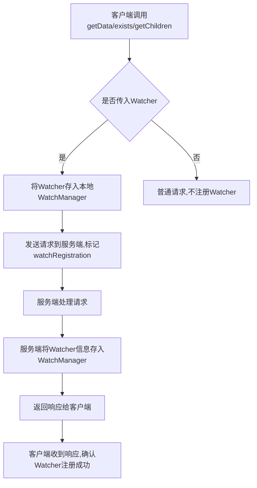
```mermaid
flowchart TD
    A[客户端调用getData/exists/getChildren] --> B{是否传入Watcher}
    B -->|是| C[将Watcher存入本地WatchManager]
    B -->|否| D[普通请求,不注册Watcher]
    C --> E[发送请求到服务端,标记watchRegistration]
    E --> F[服务端处理请求]
    F --> G[服务端将Watcher信息存入WatchManager]
    G --> H[返回响应给客户端]
    H --> I[客户端收到响应,确认Watcher注册成功]
```

**客户端 WatchManager 实现：**

```java
// ZooKeeper客户端内部维护三类Watcher存储
public class ZKWatchManager implements ClientWatchManager {
    // 数据Watcher: getData注册
    private final Map<String, Set<Watcher>> dataWatches = new HashMap<>();
    
    // 存在性Watcher: exists注册
    private final Map<String, Set<Watcher>> existWatches = new HashMap<>();
    
    // 子节点Watcher: getChildren注册
    private final Map<String, Set<Watcher>> childWatches = new HashMap<>();
    
    // 默认Watcher: 构造ZooKeeper时传入
    private volatile Watcher defaultWatcher;
}
```

**自定义 Watcher 示例：**

```java
import org.apache.zookeeper.*;
import org.apache.zookeeper.data.Stat;

public class MyWatcher implements Watcher {
    
    private ZooKeeper zk;
    
    @Override
    public void process(WatchedEvent event) {
        String path = event.getPath();
        Event.EventType type = event.getType();
        Event.KeeperState state = event.getState();
        
        System.out.println("收到事件: path=" + path 
            + ", type=" + type + ", state=" + state);
        
        if (type == Event.EventType.NodeDataChanged) {
            try {
                // 重新获取数据并重新注册Watcher
                byte[] data = zk.getData(path, this, new Stat());
                System.out.println("新数据: " + new String(data));
            } catch (Exception e) {
                e.printStackTrace();
            }
        }
    }
}

// 使用示例
ZooKeeper zk = new ZooKeeper("localhost:2181", 3000, new MyWatcher());
Stat stat = new Stat();
// 注册Watcher监听数据变化
byte[] data = zk.getData("/mynode", new MyWatcher(), stat);
```

**注意事项：**
- 同一个 Watcher 对象可以注册到多个节点
- 同一个节点可以注册多个不同的 Watcher 对象
- 默认 Watcher（构造时传入）会接收连接状态变化事件

## 8. 服务端处理Watcher实现

服务端负责存储 Watcher 并在数据变更时触发通知。

**服务端 Watcher 存储结构：**

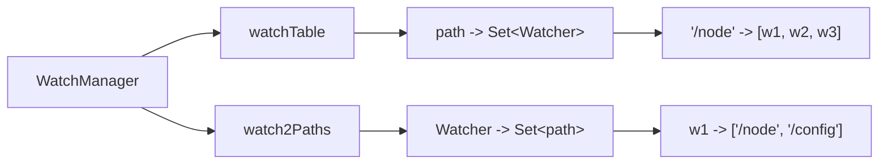
```mermaid
graph LR
    A[WatchManager] --> B[watchTable]
    A --> C[watch2Paths]
    B --> D["path -> Set&lt;Watcher&gt;"]
    C --> E["Watcher -> Set&lt;path&gt;"]
    D --> F["'/node' -> [w1, w2, w3]"]
    E --> G["w1 -> ['/node', '/config']"]
```

**服务端处理流程：**

```java
// 服务端WatchManager核心逻辑（简化版）
public class WatchManager {
    // 路径 -> Watcher集合的映射
    private final HashMap<String, HashSet<Watcher>> watchTable = new HashMap<>();
    // Watcher -> 路径集合的映射（用于会话关闭时清理）
    private final HashMap<Watcher, HashSet<String>> watch2Paths = new HashMap<>();
    
    // 注册Watcher
    public synchronized void addWatch(String path, Watcher watcher) {
        HashSet<Watcher> list = watchTable.get(path);
        if (list == null) {
            list = new HashSet<>();
            watchTable.put(path, list);
        }
        list.add(watcher);
        
        HashSet<String> paths = watch2Paths.get(watcher);
        if (paths == null) {
            paths = new HashSet<>();
            watch2Paths.put(watcher, paths);
        }
        paths.add(path);
    }
    
    // 触发Watcher
    public Set<Watcher> triggerWatch(String path, EventType type) {
        WatchedEvent e = new WatchedEvent(type, KeeperState.SyncConnected, path);
        Set<Watcher> watchers = watchTable.remove(path); // 移除，一次性
        if (watchers != null) {
            for (Watcher w : watchers) {
                w.process(e); // 发送通知给客户端
            }
        }
        return watchers;
    }
}
```

**触发时机：**

| 操作 | 触发的Watcher类型 |
|------|-----------------|
| setData | getData注册的Watcher |
| create(path) | exists注册的Watcher + 父节点getChildren的Watcher |
| delete(path) | getData/exists/getChildren注册的Watcher + 父节点getChildren的Watcher |

## 9. 客户端回调Watcher

客户端收到服务端的 Watcher 通知后，通过专门的线程执行回调。

**回调执行流程：**

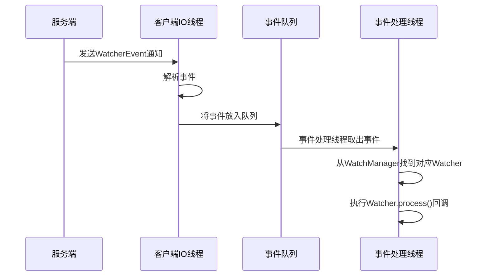
```mermaid
sequenceDiagram
    participant S as 服务端
    participant IO as 客户端IO线程
    participant EQ as 事件队列
    participant ET as 事件处理线程

    S->>IO: 发送WatcherEvent通知
    IO->>IO: 解析事件
    IO->>EQ: 将事件放入队列
    EQ->>ET: 事件处理线程取出事件
    ET->>ET: 从WatchManager找到对应Watcher
    ET->>ET: 执行Watcher.process()回调
```

**客户端事件处理线程（EventThread）：**

```java
// ZooKeeper客户端内部的EventThread（简化版）
class EventThread extends Thread {
    private final LinkedBlockingQueue<Object> waitingEvents = new LinkedBlockingQueue<>();
    
    @Override
    public void run() {
        while (true) {
            Object event = waitingEvents.take();
            if (event instanceof WatcherSetEventPair) {
                WatcherSetEventPair pair = (WatcherSetEventPair) event;
                // 遍历所有匹配的Watcher并执行回调
                for (Watcher watcher : pair.watchers) {
                    watcher.process(pair.event);
                }
            }
        }
    }
}
```

**重要特性：**
- 所有 Watcher 回调在同一个 EventThread 中串行执行
- 回调中不能执行耗时操作，否则会阻塞后续事件处理
- 如需耗时操作，应在回调中异步提交到线程池

```java
// 正确做法：在Watcher中异步处理
public void process(WatchedEvent event) {
    // 快速提交到线程池，不阻塞EventThread
    executor.submit(() -> {
        // 耗时的业务逻辑
        handleEvent(event);
    });
}
```

## 10. ACL权限控制机制

ACL（Access Control List，访问控制列表）是 ZooKeeper 提供的权限控制机制，用于控制对 ZNode 的访问权限。

**ACL 组成：**

每个 ACL 由三部分组成：`scheme:id:permissions`

**权限类型（Permissions）：**

| 权限 | 缩写 | 说明 |
|------|------|------|
| CREATE | c | 创建子节点 |
| READ | r | 读取节点数据和子节点列表 |
| WRITE | w | 修改节点数据 |
| DELETE | d | 删除子节点 |
| ADMIN | a | 设置节点ACL |

**认证方案（Scheme）：**

| Scheme | 说明 |
|--------|------|
| world | 所有人，id固定为`anyone` |
| auth | 已认证的用户 |
| digest | 用户名:密码方式认证 |
| ip | 基于IP地址认证 |
| x509 | 基于客户端X509证书认证 |

**使用示例：**

```bash
# 查看节点ACL
getAcl /node

# 设置world权限（所有人可读写）
setAcl /node world:anyone:rw

# 设置digest认证
addauth digest user1:password1
create /secure_node "data" digest:user1:BASE64(SHA1(user1:password1)):rwcda

# 设置IP限制
setAcl /node ip:192.168.1.0/24:r
```

**Java 代码示例：**

```java
// 创建带ACL的节点
List<ACL> acls = new ArrayList<>();

// 添加digest认证
acls.add(new ACL(ZooDefs.Perms.ALL, 
    new Id("digest", DigestAuthenticationProvider.generateDigest("user:password"))));

zk.create("/secure", "data".getBytes(), acls, CreateMode.PERSISTENT);

// 添加认证信息
zk.addAuthInfo("digest", "user:password".getBytes());
```

**ACL 特点：**
- ACL 不具有继承性，每个节点的 ACL 独立设置
- ZooKeeper 默认使用 `world:anyone:cdrwa`（所有权限）
- 生产环境建议配置严格的 ACL 控制

## 11. Chroot特性

Chroot（Change Root）是 ZooKeeper 客户端的一个特性，允许客户端将某个节点路径设置为根节点，实现命名空间隔离。

**使用方式：**

在连接字符串中添加路径后缀：

```java
// 普通连接
ZooKeeper zk = new ZooKeeper("host1:2181,host2:2181,host3:2181", 3000, watcher);

// 使用Chroot，将/app作为根节点
ZooKeeper zk = new ZooKeeper("host1:2181,host2:2181,host3:2181/app", 3000, watcher);

// 此时操作/config实际上是操作ZooKeeper中的/app/config
zk.create("/config", data, acls, CreateMode.PERSISTENT);
// 实际创建的是 /app/config
```

**Chroot 的作用：**

```mermaid
graph LR
    subgraph ZooKeeper服务端
        root["/"]
        app["/app"]
        service["/service"]
        appconfig["/app/config"]
        applock["/app/lock"]
        serviceconfig["/service/config"]
    end
    
    subgraph 客户端A使用Chroot=/app
        A["create('/config')"] -->|实际操作| appconfig
        B["create('/lock')"] -->|实际操作| applock
    end
    
    subgraph 客户端B使用Chroot=/service
        C["create('/config')"] -->|实际操作| serviceconfig
    end
```

**优点：**
- 不同应用使用同一个 ZooKeeper 集群，互不干扰
- 简化客户端路径管理，无需每次都写完整路径
- 实现多租户隔离

**注意事项：**
- Chroot 路径必须在连接前已存在于 ZooKeeper 中
- Chroot 只影响客户端视角，服务端存储的仍是完整路径

## 12. 会话管理

ZooKeeper 的会话（Session）是客户端与服务端之间的连接抽象，会话管理是 ZooKeeper 的核心功能之一。

**会话状态机：**

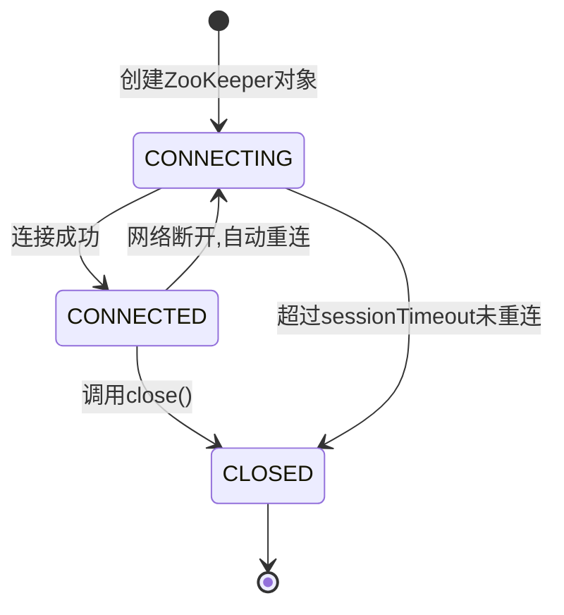
```mermaid
stateDiagram-v2
    [*] --> CONNECTING: 创建ZooKeeper对象
    CONNECTING --> CONNECTED: 连接成功
    CONNECTED --> CONNECTING: 网络断开,自动重连
    CONNECTED --> CLOSED: 调用close()
    CONNECTING --> CLOSED: 超过sessionTimeout未重连
    CLOSED --> [*]
```

**会话核心参数：**

| 参数 | 说明 |
|------|------|
| sessionId | 全局唯一的会话ID |
| sessionTimeout | 会话超时时间（客户端设置，服务端协商） |
| tickTime | 服务端基本时间单位（默认2000ms） |
| minSessionTimeout | 最小超时时间（2 * tickTime） |
| maxSessionTimeout | 最大超时时间（20 * tickTime） |

**会话超时机制：**

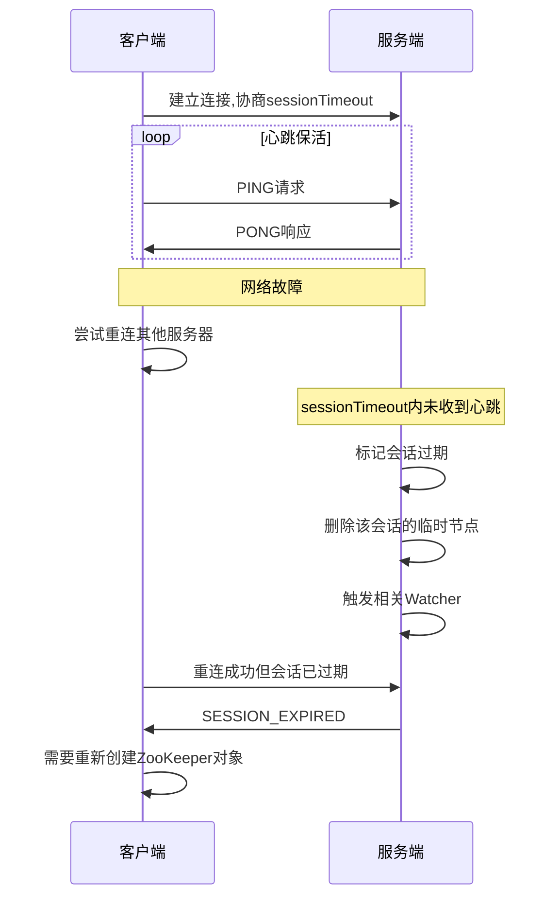
```mermaid
sequenceDiagram
    participant C as 客户端
    participant S as 服务端

    C->>S: 建立连接,协商sessionTimeout
    loop 心跳保活
        C->>S: PING请求
        S->>C: PONG响应
    end
    Note over C,S: 网络故障
    C->>C: 尝试重连其他服务器
    Note over S: sessionTimeout内未收到心跳
    S->>S: 标记会话过期
    S->>S: 删除该会话的临时节点
    S->>S: 触发相关Watcher
    C->>S: 重连成功但会话已过期
    S->>C: SESSION_EXPIRED
    C->>C: 需要重新创建ZooKeeper对象
```

**分桶策略（会话超时检测优化）：**

ZooKeeper 使用分桶策略管理会话超时，将超时时间相近的会话放在同一个桶中批量处理，减少检测开销：

```
时间轴: |--bucket1--|--bucket2--|--bucket3--|
会话:    s1,s2,s3    s4,s5       s6,s7,s8
```

每个 tickTime 检查一个桶，批量处理过期会话，提高效率。

## 13. 服务器角色

ZooKeeper 集群中的服务器有三种角色：

**1. Leader（领导者）**
- 集群中唯一的写请求处理者
- 负责发起和提交事务
- 负责与 Follower 进行心跳检测
- 通过 ZAB 协议广播事务给 Follower

**2. Follower（跟随者）**
- 处理客户端读请求
- 将写请求转发给 Leader
- 参与 Leader 选举投票
- 参与事务提交的 ACK 投票

**3. Observer（观察者）**
- 处理客户端读请求（与 Follower 相同）
- 将写请求转发给 Leader
- **不参与** Leader 选举投票
- **不参与** 事务提交的 ACK 投票
- 用于扩展读性能，不影响写性能和选举

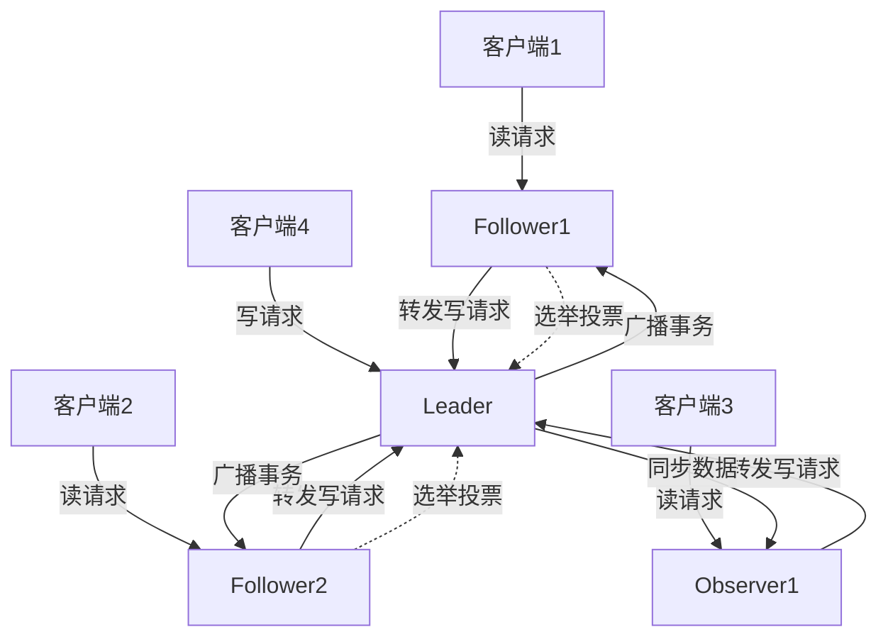
```mermaid
graph TB
    Client1[客户端1] -->|读请求| F1[Follower1]
    Client2[客户端2] -->|读请求| F2[Follower2]
    Client3[客户端3] -->|读请求| O1[Observer1]
    Client4[客户端4] -->|写请求| L[Leader]
    F1 -->|转发写请求| L
    F2 -->|转发写请求| L
    O1 -->|转发写请求| L
    L -->|广播事务| F1
    L -->|广播事务| F2
    L -->|同步数据| O1
    F1 -.->|选举投票| L
    F2 -.->|选举投票| L
```

**角色对比：**

| 特性 | Leader | Follower | Observer |
|------|--------|----------|----------|
| 处理读请求 | 是 | 是 | 是 |
| 处理写请求 | 是（直接处理） | 是（转发给Leader） | 是（转发给Leader） |
| 参与选举 | 是 | 是 | 否 |
| 参与ACK投票 | 是 | 是 | 否 |
| 影响写性能 | 是 | 是 | 否 |

**配置 Observer：**

```properties
# zoo.cfg 中配置Observer
server.1=host1:2888:3888
server.2=host2:2888:3888
server.3=host3:2888:3888
server.4=host4:2888:3888:observer  # 指定为Observer
```

## 14. Zookeeper下Server工作状态

ZooKeeper 服务器在运行过程中有四种工作状态：

**1. LOOKING（选举状态）**
- 服务器启动时或 Leader 崩溃后进入此状态
- 正在进行 Leader 选举
- 不对外提供服务

**2. FOLLOWING（跟随状态）**
- 服务器已确定 Leader，自己作为 Follower
- 正常工作状态，处理读请求，转发写请求

**3. LEADING（领导状态）**
- 服务器被选为 Leader
- 正常工作状态，处理所有写请求，广播事务

**4. OBSERVING（观察状态）**
- 服务器作为 Observer 运行
- 处理读请求，转发写请求，不参与投票

**状态转换图：**

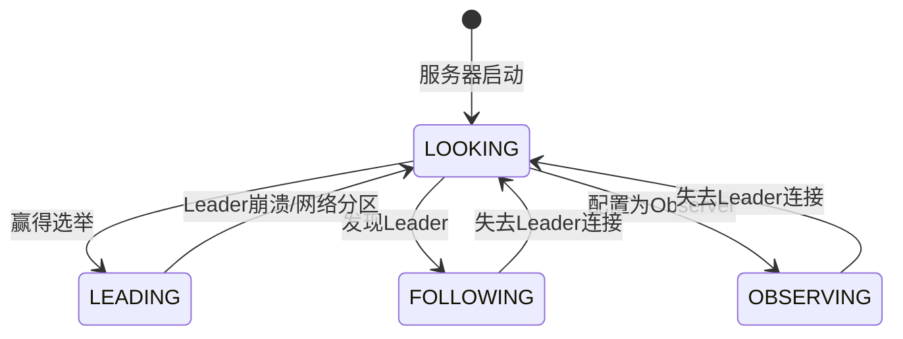
```mermaid
stateDiagram-v2
    [*] --> LOOKING: 服务器启动
    LOOKING --> LEADING: 赢得选举
    LOOKING --> FOLLOWING: 发现Leader
    LOOKING --> OBSERVING: 配置为Observer
    LEADING --> LOOKING: Leader崩溃/网络分区
    FOLLOWING --> LOOKING: 失去Leader连接
    OBSERVING --> LOOKING: 失去Leader连接
```

**服务器启动流程：**

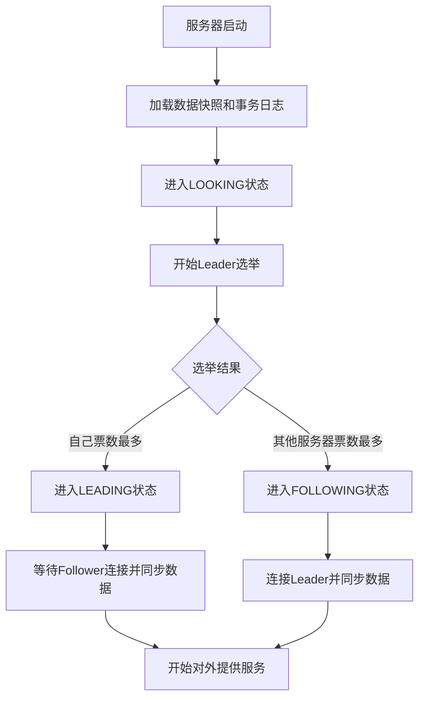
```mermaid
flowchart TD
    A[服务器启动] --> B[加载数据快照和事务日志]
    B --> C[进入LOOKING状态]
    C --> D[开始Leader选举]
    D --> E{选举结果}
    E -->|自己票数最多| F[进入LEADING状态]
    E -->|其他服务器票数最多| G[进入FOLLOWING状态]
    F --> H[等待Follower连接并同步数据]
    G --> I[连接Leader并同步数据]
    H --> J[开始对外提供服务]
    I --> J
```

## 15. 数据同步

ZooKeeper 集群中，Leader 选举完成后需要将数据同步给所有 Follower，确保数据一致性。

**同步场景：**

根据 Follower 的数据状态，Leader 会选择不同的同步方式：

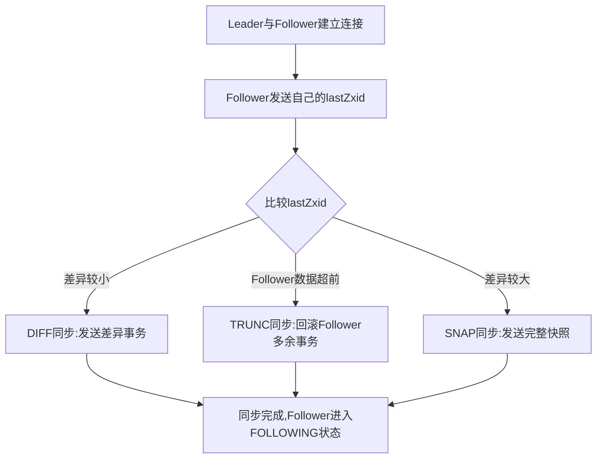
```mermaid
flowchart TD
    A[Leader与Follower建立连接] --> B[Follower发送自己的lastZxid]
    B --> C{比较lastZxid}
    C -->|差异较小| D[DIFF同步:发送差异事务]
    C -->|Follower数据超前| E[TRUNC同步:回滚Follower多余事务]
    C -->|差异较大| F[SNAP同步:发送完整快照]
    D --> G[同步完成,Follower进入FOLLOWING状态]
    E --> G
    F --> G
```

**四种同步方式详解：**

**1. DIFF（差异同步）**
- 适用场景：Follower 的 lastZxid 在 Leader 的提交日志范围内
- 方式：Leader 只发送 Follower 缺少的事务日志
- 效率最高

**2. TRUNC（回滚同步）**
- 适用场景：Follower 的 lastZxid 比 Leader 的 lastZxid 还大（旧 Leader 崩溃前提交了未广播的事务）
- 方式：让 Follower 回滚到 Leader 的 lastZxid

**3. SNAP（快照同步）**
- 适用场景：Follower 数据差异太大，或 Follower 是全新节点
- 方式：Leader 发送完整的数据快照
- 效率最低，但适用于差异大的情况

**4. TRUNC+DIFF（回滚后差异同步）**
- 适用场景：Follower 有部分超前数据，同时也缺少部分数据
- 方式：先回滚超前部分，再补充缺失部分

**数据同步完成条件：**

超过半数的 Follower 完成同步后，Leader 才开始对外提供服务。

## 16. zookeeper是如何保证事务的顺序一致性的?

ZooKeeper 通过多种机制共同保证事务的顺序一致性：

**1. 全局唯一递增的 ZXID**

每个事务都有一个全局唯一且单调递增的事务 ID（ZXID）：

```
ZXID = epoch(高32位) + counter(低32位)
```

- `epoch`：Leader 任期号，每次选举新 Leader 时递增
- `counter`：事务计数器，在同一任期内单调递增

**2. 单一写入点**

所有写请求都必须经过 Leader 处理，Leader 按照接收顺序为每个事务分配 ZXID，保证全局顺序。

**3. ZAB 协议的两阶段提交**

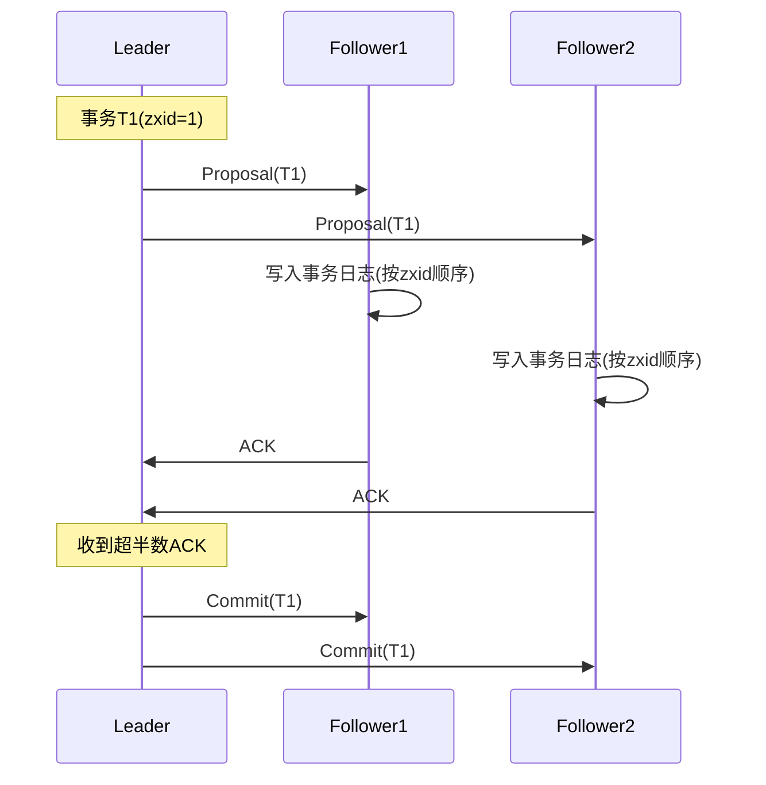
```mermaid
sequenceDiagram
    participant L as Leader
    participant F1 as Follower1
    participant F2 as Follower2

    Note over L: 事务T1(zxid=1)
    L->>F1: Proposal(T1)
    L->>F2: Proposal(T1)
    F1->>F1: 写入事务日志(按zxid顺序)
    F2->>F2: 写入事务日志(按zxid顺序)
    F1->>L: ACK
    F2->>L: ACK
    Note over L: 收到超半数ACK
    L->>F1: Commit(T1)
    L->>F2: Commit(T1)
```

**4. Follower 按顺序处理事务**

Follower 严格按照 ZXID 的顺序应用事务，不会乱序执行。

**5. 客户端请求的顺序保证**

同一客户端的请求按照发送顺序处理，通过 `cxid`（客户端事务ID）保证。

**顺序一致性 vs 强一致性：**

```
顺序一致性：所有操作按照某个全局顺序执行，且每个客户端看到的操作顺序与其发出的顺序一致
强一致性（线性一致性）：读操作总能读到最新写入的数据

ZooKeeper 默认提供顺序一致性，不保证强一致性
如需强一致性读，需要在读之前调用 sync() 方法
```

```java
// 确保读到最新数据
zk.sync("/node", (rc, path, ctx) -> {
    // sync完成后再读取
    zk.getData("/node", false, (rc2, path2, ctx2, data, stat) -> {
        // 此时读到的是最新数据
    }, null);
}, null);
```

## 17. 分布式集群中为什么会有Master?

在分布式集群中设置 Master（主节点）是解决分布式一致性问题的常见方案。

**为什么需要 Master：**

**1. 解决数据一致性问题**

如果没有 Master，多个节点同时接受写请求，会导致数据冲突：

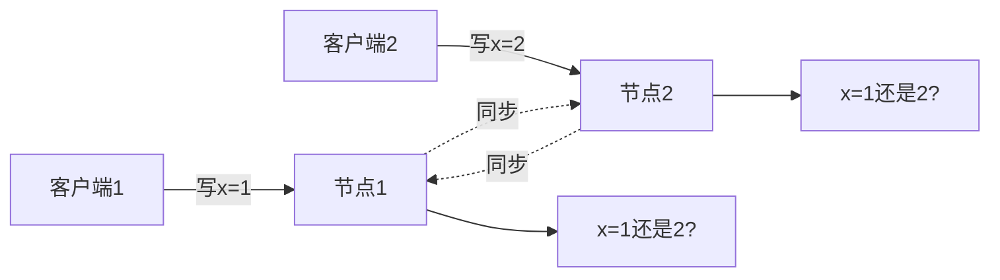
```mermaid
graph LR
    C1[客户端1] -->|写x=1| N1[节点1]
    C2[客户端2] -->|写x=2| N2[节点2]
    N1 -.同步.-> N2
    N2 -.同步.-> N1
    N1 --> Q1[x=1还是2?]
    N2 --> Q2[x=1还是2?]
```

有了 Master 后：

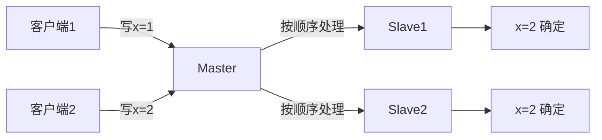
```mermaid
graph LR
    C1[客户端1] -->|写x=1| M[Master]
    C2[客户端2] -->|写x=2| M
    M -->|按顺序处理| S1[Slave1]
    M -->|按顺序处理| S2[Slave2]
    S1 --> R1[x=2 确定]
    S2 --> R2[x=2 确定]
```

**2. 简化协调逻辑**

- Master 作为单一决策点，避免分布式协商的复杂性
- 减少节点间通信开销
- 简化事务顺序管理

**3. 提高系统性能**

- 读写分离：Master 处理写，Slave 处理读
- 避免分布式锁的性能开销

**Master 的缺点及解决方案：**

| 问题 | 解决方案 |
|------|---------|
| 单点故障 | 通过选举机制自动切换Master |
| 性能瓶颈 | 读写分离，Observer扩展读能力 |
| 脑裂问题 | 过半机制，确保只有一个Master |

**ZooKeeper 的 Master 选举实现：**

```java
// 利用临时节点实现Master选举
public class MasterElection {
    private ZooKeeper zk;
    private static final String MASTER_PATH = "/master";
    
    public void electMaster() {
        try {
            // 尝试创建临时节点，成功则成为Master
            zk.create(MASTER_PATH, "master_data".getBytes(),
                ZooDefs.Ids.OPEN_ACL_UNSAFE, CreateMode.EPHEMERAL);
            System.out.println("我是Master!");
        } catch (KeeperException.NodeExistsException e) {
            // 节点已存在，监听Master节点，等待重新选举
            watchMaster();
        }
    }
    
    private void watchMaster() {
        zk.exists(MASTER_PATH, event -> {
            if (event.getType() == Watcher.Event.EventType.NodeDeleted) {
                // Master下线，重新选举
                electMaster();
            }
        }, null);
    }
}
```

## 18. zk节点宕机如何处理?

ZooKeeper 集群对节点宕机有完善的容错处理机制。

**不同角色宕机的处理方式：**

**1. Follower/Observer 宕机**

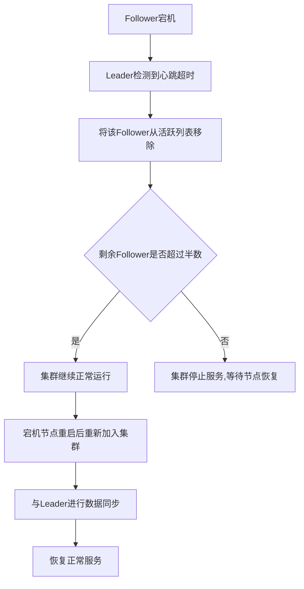
```mermaid
flowchart TD
    A[Follower宕机] --> B[Leader检测到心跳超时]
    B --> C[将该Follower从活跃列表移除]
    C --> D{剩余Follower是否超过半数}
    D -->|是| E[集群继续正常运行]
    D -->|否| F[集群停止服务,等待节点恢复]
    E --> G[宕机节点重启后重新加入集群]
    G --> H[与Leader进行数据同步]
    H --> I[恢复正常服务]
```

**2. Leader 宕机**

```mermaid
flowchart TD
    A[Leader宕机] --> B[Follower检测到Leader心跳超时]
    B --> C[所有Follower进入LOOKING状态]
    C --> D[开始新一轮Leader选举]
    D --> E[选出新Leader]
    E --> F[新Leader与Follower进行数据同步]
    F --> G[集群恢复服务]
    Note1[整个过程通常需要200ms~数秒]
```

**容错能力计算：**

```
集群节点数 N，可容忍宕机数 F
要求: N > 2F，即 F < N/2

常见配置:
- 3节点集群: 可容忍1个节点宕机
- 5节点集群: 可容忍2个节点宕机
- 7节点集群: 可容忍3个节点宕机
```

**脑裂（Split-Brain）问题：**

网络分区时，可能出现两个分区各自选出 Leader 的情况，ZooKeeper 通过过半机制解决：

```mermaid
graph TB
    subgraph 分区A 3个节点
        L1[Leader1]
        F1[Follower1]
        F2[Follower2]
    end
    subgraph 分区B 2个节点
        F3[Follower3]
        F4[Follower4]
    end
    
    L1 -.网络分区.-> F3
    Note1["分区A: 3>5/2, 可以选举Leader"]
    Note2["分区B: 2<5/2, 无法选举Leader,停止服务"]
```

**生产环境建议：**
- 使用奇数个节点（3、5、7）
- 跨机房部署时注意网络分区风险
- 配置合理的 `tickTime` 和 `sessionTimeout`

## 19. zookeeper负载均衡和nginx负载均衡区别

ZooKeeper 和 Nginx 都可以实现负载均衡，但原理和适用场景有很大差异。

**Nginx 负载均衡：**

```mermaid
graph LR
    Client[客户端] --> Nginx[Nginx反向代理]
    Nginx -->|轮询/权重/IP哈希| S1[服务器1]
    Nginx -->|轮询/权重/IP哈希| S2[服务器2]
    Nginx -->|轮询/权重/IP哈希| S3[服务器3]
```

**ZooKeeper 负载均衡：**

```mermaid
graph LR
    S1[服务器1] -->|注册| ZK[ZooKeeper]
    S2[服务器2] -->|注册| ZK
    S3[服务器3] -->|注册| ZK
    Client[客户端] -->|查询服务列表| ZK
    ZK -->|返回服务列表| Client
    Client -->|直连| S1
```

**详细对比：**

| 对比维度 | Nginx 负载均衡 | ZooKeeper 负载均衡 |
|---------|--------------|------------------|
| 工作层次 | 网络层（反向代理） | 应用层（服务注册发现） |
| 负载均衡位置 | 服务端负载均衡 | 客户端负载均衡 |
| 服务发现 | 静态配置 | 动态注册发现 |
| 健康检查 | 主动探测 | 临时节点自动感知 |
| 性能 | 高（C语言实现） | 相对较低（需要额外通信） |
| 适用场景 | HTTP/TCP代理 | 微服务注册发现 |
| 配置变更 | 需要重新加载配置 | 实时动态更新 |
| 单点问题 | Nginx本身是单点 | 集群部署，高可用 |

**ZooKeeper 负载均衡实现示例：**

```java
// 服务提供者：注册服务
public class ServiceProvider {
    public void register(String serviceName, String address) throws Exception {
        String path = "/services/" + serviceName + "/" + address;
        zk.create(path, address.getBytes(), 
            ZooDefs.Ids.OPEN_ACL_UNSAFE, CreateMode.EPHEMERAL);
    }
}

// 服务消费者：发现服务并负载均衡
public class ServiceConsumer {
    public String getService(String serviceName) throws Exception {
        List<String> servers = zk.getChildren("/services/" + serviceName, true);
        // 随机负载均衡
        int index = new Random().nextInt(servers.size());
        return servers.get(index);
    }
}
```

**选择建议：**
- HTTP 服务代理、静态资源分发 → 选 Nginx
- 微服务注册发现、动态扩缩容 → 选 ZooKeeper（或 Consul、Nacos）

## 20. Zookeeper有哪几种部署模式?

ZooKeeper 支持三种部署模式：

**1. 单机模式（Standalone Mode）**

只有一台服务器，适用于开发和测试环境。

```properties
# zoo.cfg 单机配置
tickTime=2000
dataDir=/var/lib/zookeeper
clientPort=2181
```

```bash
# 启动单机模式
bin/zkServer.sh start
```

**缺点：** 单点故障，不适合生产环境。

**2. 伪集群模式（Pseudo-Cluster Mode）**

在一台机器上运行多个 ZooKeeper 实例，通过不同端口区分，适用于本地测试集群。

```properties
# zoo1.cfg
tickTime=2000
dataDir=/tmp/zk1
clientPort=2181
server.1=localhost:2888:3888
server.2=localhost:2889:3889
server.3=localhost:2890:3890

# zoo2.cfg
tickTime=2000
dataDir=/tmp/zk2
clientPort=2182
server.1=localhost:2888:3888
server.2=localhost:2889:3889
server.3=localhost:2890:3890

# zoo3.cfg
tickTime=2000
dataDir=/tmp/zk3
clientPort=2183
server.1=localhost:2888:3888
server.2=localhost:2889:3889
server.3=localhost:2890:3890
```

**3. 集群模式（Cluster Mode）**

多台机器各运行一个 ZooKeeper 实例，生产环境推荐使用。

```properties
# 每台机器的 zoo.cfg
tickTime=2000
initLimit=10
syncLimit=5
dataDir=/var/lib/zookeeper
clientPort=2181
server.1=zk1.example.com:2888:3888
server.2=zk2.example.com:2888:3888
server.3=zk3.example.com:2888:3888
```

```bash
# 在每台机器的 dataDir 下创建 myid 文件
echo "1" > /var/lib/zookeeper/myid  # 机器1
echo "2" > /var/lib/zookeeper/myid  # 机器2
echo "3" > /var/lib/zookeeper/myid  # 机器3
```

**三种模式对比：**

| 模式 | 机器数 | 高可用 | 适用场景 |
|------|--------|--------|---------|
| 单机 | 1 | 否 | 开发测试 |
| 伪集群 | 1（多进程） | 否 | 本地集群测试 |
| 集群 | 3+ | 是 | 生产环境 |

## 21. 集群最少要几台机器，集群规则是怎样的?

**最少机器数：3 台**

ZooKeeper 集群需要超过半数节点存活才能正常工作：

```
最少节点数 = 2F + 1，其中 F 是允许宕机的节点数

F=1（允许1台宕机）: 最少需要 2*1+1 = 3 台
F=2（允许2台宕机）: 最少需要 2*2+1 = 5 台
```

**为什么不用 2 台？**

```
2台集群: 允许宕机数 F < 2/2 = 1，即 F=0
意味着任何一台宕机，集群就无法工作
2台集群没有容错能力，还不如单机
```

**奇数 vs 偶数节点：**

```
3节点: 允许1台宕机，容错数=1
4节点: 允许1台宕机，容错数=1（与3节点相同，但多用了1台机器）
5节点: 允许2台宕机，容错数=2
6节点: 允许2台宕机，容错数=2（与5节点相同）

结论: 偶数节点不能提高容错能力，推荐使用奇数节点
```

**集群规则总结：**

```mermaid
graph TD
    A[集群节点数 N] --> B{N是否为奇数}
    B -->|奇数| C[容错数 = N-1/2]
    B -->|偶数| D[容错数 = N/2-1]
    C --> E["3节点: 容错1台"]
    C --> F["5节点: 容错2台"]
    C --> G["7节点: 容错3台"]
    D --> H["4节点: 容错1台(浪费1台)"]
    D --> I["6节点: 容错2台(浪费1台)"]
```

**生产环境推荐：**
- 小规模：3 节点
- 中规模：5 节点
- 大规模读场景：5 节点 + N 个 Observer

## 22. 集群支持动态添加机器吗?

**ZooKeeper 3.5 之前：不支持动态扩容**

需要停止整个集群，修改配置文件后重启：

```bash
# 1. 停止所有节点
bin/zkServer.sh stop

# 2. 修改所有节点的 zoo.cfg，添加新节点
server.4=newhost:2888:3888

# 3. 在新节点创建配置和 myid 文件

# 4. 重启所有节点
bin/zkServer.sh start
```

**ZooKeeper 3.5+ 支持动态重配置（Dynamic Reconfiguration）**

无需停机即可添加或删除节点：

```bash
# 启用动态重配置（zoo.cfg）
reconfigEnabled=true
dynamicConfigFile=/path/to/zoo.cfg.dynamic
```

```bash
# 动态添加节点（通过zkCli）
reconfig -add "server.4=newhost:2888:3888:participant"

# 动态删除节点
reconfig -remove "4"

# 查看当前配置
config
```

**Java API 动态重配置：**

```java
// 动态添加节点
byte[] config = zk.getConfig(false, stat);
String newConfig = new String(config) + "\nserver.4=newhost:2888:3888:participant";
zk.reconfig(null, null, newConfig, -1, stat);
```

**版本对比：**

| 版本 | 动态扩容 | 说明 |
|------|---------|------|
| < 3.5 | 不支持 | 需要停机重启 |
| >= 3.5 | 支持 | Dynamic Reconfiguration |

**注意事项：**
- 动态重配置需要开启 `reconfigEnabled=true`
- 需要配置相应的 ACL 权限才能执行 reconfig 命令
- 添加节点后，新节点需要与 Leader 完成数据同步才能提供服务

## 23. Zookeeper对节点的watch监听通知是永久的吗?为什么不是永久的?

**默认情况下，Watcher 不是永久的，是一次性的。**

**原因分析：**

**1. 设计哲学：推拉结合**

ZooKeeper 的 Watcher 采用"推通知 + 拉数据"的设计：
- 服务端推送变更通知（轻量）
- 客户端主动拉取最新数据

如果是永久 Watcher，服务端需要维护大量 Watcher 状态，内存开销巨大。

**2. 避免事件风暴**

如果 Watcher 是永久的，一个频繁变更的节点会持续触发大量通知，可能导致客户端处理不过来（事件风暴）。

**3. 保证数据一致性**

一次性 Watcher 强制客户端在每次收到通知后重新注册，此时客户端会重新读取最新数据，避免了因网络延迟导致的数据不一致。

**一次性 Watcher 的使用模式：**

```java
public class PersistentWatchDemo implements Watcher {
    private ZooKeeper zk;
    private String path;
    
    @Override
    public void process(WatchedEvent event) {
        if (event.getType() == Event.EventType.NodeDataChanged) {
            try {
                // 1. 读取最新数据
                byte[] data = zk.getData(path, this, null); // 重新注册Watcher
                System.out.println("数据变更: " + new String(data));
            } catch (Exception e) {
                e.printStackTrace();
            }
        }
    }
}
```

**ZooKeeper 3.6+ 持久化 Watcher：**

3.6 版本引入了持久化 Watcher，解决了需要反复注册的问题：

```java
// 持久化Watcher，触发后不会自动失效
zk.addWatch("/node", event -> {
    System.out.println("收到事件: " + event.getType());
    // 无需重新注册
}, AddWatchMode.PERSISTENT);

// 持久递归Watcher，监听节点及所有子节点的变化
zk.addWatch("/node", event -> {
    System.out.println("收到事件: " + event.getPath() + " " + event.getType());
}, AddWatchMode.PERSISTENT_RECURSIVE);
```

**版本对比：**

| 特性 | 传统Watcher | 持久化Watcher(3.6+) |
|------|------------|-------------------|
| 触发次数 | 一次 | 持续触发 |
| 需要重新注册 | 是 | 否 |
| 内存开销 | 低 | 较高 |
| 适用场景 | 一次性监听 | 持续监听 |

## 24. Zookeeper的java客户端都有哪些?

ZooKeeper 有多个 Java 客户端可供选择：

**1. ZooKeeper 原生客户端**

Apache ZooKeeper 官方提供的客户端，功能完整但 API 较为底层。

```xml
<dependency>
    <groupId>org.apache.zookeeper</groupId>
    <artifactId>zookeeper</artifactId>
    <version>3.8.0</version>
</dependency>
```

```java
ZooKeeper zk = new ZooKeeper("localhost:2181", 3000, watcher);
zk.create("/node", "data".getBytes(), ZooDefs.Ids.OPEN_ACL_UNSAFE, CreateMode.PERSISTENT);
```

**缺点：** API 复杂，需要手动处理重连、Watcher 重注册等问题。

**2. ZkClient**

对原生客户端的封装，简化了 API，支持自动重连和序列化。

```xml
<dependency>
    <groupId>com.101tec</groupId>
    <artifactId>zkclient</artifactId>
    <version>0.11</version>
</dependency>
```

```java
ZkClient zkClient = new ZkClient("localhost:2181", 3000);
zkClient.createPersistent("/node", "data");
zkClient.subscribeDataChanges("/node", new IZkDataListener() {
    public void handleDataChange(String path, Object data) {
        System.out.println("数据变更: " + data);
    }
    public void handleDataDeleted(String path) {
        System.out.println("节点删除: " + path);
    }
});
```

**3. Apache Curator（推荐）**

Netflix 开源，现为 Apache 顶级项目，是目前最流行的 ZooKeeper 客户端。

```xml
<dependency>
    <groupId>org.apache.curator</groupId>
    <artifactId>curator-framework</artifactId>
    <version>5.4.0</version>
</dependency>
<dependency>
    <groupId>org.apache.curator</groupId>
    <artifactId>curator-recipes</artifactId>
    <version>5.4.0</version>
</dependency>
```

```java
// 创建客户端
CuratorFramework client = CuratorFrameworkFactory.builder()
    .connectString("localhost:2181")
    .sessionTimeoutMs(5000)
    .connectionTimeoutMs(3000)
    .retryPolicy(new ExponentialBackoffRetry(1000, 3))
    .build();
client.start();

// CRUD操作
client.create().forPath("/node", "data".getBytes());
byte[] data = client.getData().forPath("/node");
client.setData().forPath("/node", "newdata".getBytes());
client.delete().forPath("/node");

// 分布式锁
InterProcessMutex lock = new InterProcessMutex(client, "/lock");
lock.acquire();
try {
    // 临界区代码
} finally {
    lock.release();
}
```

**客户端对比：**

| 特性 | 原生客户端 | ZkClient | Curator |
|------|-----------|---------|---------|
| API 易用性 | 低 | 中 | 高 |
| 自动重连 | 否 | 是 | 是 |
| 分布式原语 | 否 | 部分 | 丰富 |
| 社区活跃度 | 高 | 低 | 高 |
| 推荐程度 | 学习用 | 不推荐 | 生产推荐 |

**Curator 提供的分布式原语（Recipes）：**
- `InterProcessMutex`：分布式互斥锁
- `InterProcessReadWriteLock`：分布式读写锁
- `LeaderSelector`：Leader 选举
- `DistributedAtomicLong`：分布式原子计数器
- `PathChildrenCache`：子节点缓存和监听
- `TreeCache`：树形节点缓存

## 25. chubby是什么，和zookeeper比你怎么看?

**Chubby 简介：**

Chubby 是 Google 内部开发的分布式锁服务，2006 年在论文《The Chubby lock service for loosely-coupled distributed systems》中公开。ZooKeeper 是 Chubby 的开源实现和改进版本。

**Chubby 的设计目标：**
- 为松耦合的分布式系统提供粗粒度的分布式锁服务
- 提供可靠的小文件存储
- 支持分布式系统的 Master 选举

**Chubby vs ZooKeeper 对比：**

| 对比维度 | Chubby | ZooKeeper |
|---------|--------|-----------|
| 开源性 | 闭源（Google内部） | 开源（Apache） |
| 一致性协议 | Paxos | ZAB（类Paxos） |
| 设计定位 | 锁服务 | 通用协调服务 |
| API风格 | 文件系统API | 树形节点API |
| 客户端缓存 | 支持客户端缓存 | 不支持客户端缓存 |
| 事件通知 | 支持 | 支持（Watcher） |
| 会话机制 | 租约（Lease） | 会话（Session） |
| 节点类型 | 文件/目录 | 4种ZNode类型 |

**主要区别：**

**1. 设计哲学不同**
- Chubby：专注于锁服务，提供粗粒度锁
- ZooKeeper：通用协调框架，提供原语让用户自己实现各种功能

**2. 客户端缓存**
- Chubby：支持客户端缓存数据，减少服务端压力
- ZooKeeper：不支持客户端缓存，每次读取都访问服务端（Curator 的 Cache 是客户端实现的）

**3. 一致性保证**
- Chubby：提供更强的一致性保证
- ZooKeeper：提供顺序一致性，读操作可能读到旧数据

**4. 生态系统**
- ZooKeeper 有丰富的开源生态（Curator、Kafka、HBase、Hadoop 等都依赖 ZooKeeper）

**总结：**

ZooKeeper 在 Chubby 的基础上做了改进，更加通用和灵活。由于开源，ZooKeeper 在大数据生态中得到了广泛应用。但随着技术发展，etcd（基于 Raft 协议）在 Kubernetes 生态中逐渐取代了 ZooKeeper 的部分场景。

## 26. 说几个zookeeper常用的命令。

**连接 ZooKeeper：**

```bash
# 连接本地ZooKeeper
bin/zkCli.sh

# 连接远程ZooKeeper
bin/zkCli.sh -server host:2181

# 连接集群
bin/zkCli.sh -server host1:2181,host2:2181,host3:2181
```

**节点操作命令：**

```bash
# 查看根节点下的子节点
ls /

# 查看节点数据
get /node

# 查看节点数据和状态信息
get -s /node

# 创建持久节点
create /node "data"

# 创建临时节点
create -e /node "data"

# 创建顺序节点
create -s /node "data"

# 创建临时顺序节点
create -e -s /node "data"

# 修改节点数据
set /node "newdata"

# 删除节点（节点必须没有子节点）
delete /node

# 递归删除节点及所有子节点
deleteall /node

# 查看节点状态
stat /node

# 查看子节点列表
ls /node

# 查看子节点列表和状态
ls -s /node
```

**监听命令：**

```bash
# 监听节点数据变化
get -w /node

# 监听子节点变化
ls -w /node

# 监听节点是否存在
stat -w /node
```

**ACL 命令：**

```bash
# 查看节点ACL
getAcl /node

# 设置节点ACL
setAcl /node world:anyone:r

# 添加认证信息
addauth digest user:password
```

**配额命令：**

```bash
# 设置节点配额（最多10个子节点，数据不超过1000字节）
setquota -n 10 -b 1000 /node

# 查看配额
listquota /node

# 删除配额
delquota /node
```

**四字命令（通过 telnet 或 nc 执行）：**

```bash
# 查看服务器状态
echo stat | nc localhost 2181

# 查看服务器配置
echo conf | nc localhost 2181

# 查看连接的客户端
echo cons | nc localhost 2181

# 检查服务器是否正常（返回imok）
echo ruok | nc localhost 2181

# 查看环境变量
echo envi | nc localhost 2181

# 查看监控数据
echo mntr | nc localhost 2181
```

## 27. ZAB和Paxos算法的联系与区别?

**Paxos 算法简介：**

Paxos 是 Leslie Lamport 提出的分布式一致性算法，是分布式系统领域最重要的算法之一。

**Paxos 的角色：**
- **Proposer（提议者）**：提出提案
- **Acceptor（接受者）**：接受或拒绝提案
- **Learner（学习者）**：学习已通过的提案

**Paxos 两阶段流程：**

```mermaid
sequenceDiagram
    participant P as Proposer
    participant A1 as Acceptor1
    participant A2 as Acceptor2
    participant A3 as Acceptor3

    Note over P,A3: Phase 1: Prepare
    P->>A1: Prepare(n)
    P->>A2: Prepare(n)
    P->>A3: Prepare(n)
    A1->>P: Promise(n, 之前接受的值)
    A2->>P: Promise(n, 之前接受的值)
    
    Note over P,A3: Phase 2: Accept
    P->>A1: Accept(n, value)
    P->>A2: Accept(n, value)
    A1->>P: Accepted
    A2->>P: Accepted
    Note over P: 超半数接受，提案通过
```

**ZAB 与 Paxos 的联系：**

1. ZAB 借鉴了 Paxos 的核心思想：过半数原则
2. 两者都使用提案编号（ZAB 的 ZXID 类似 Paxos 的提案编号）
3. 两者都需要超过半数节点同意才能提交

**ZAB 与 Paxos 的区别：**

| 对比维度 | Paxos | ZAB |
|---------|-------|-----|
| 设计目标 | 通用分布式一致性 | 专为ZooKeeper设计 |
| 事务顺序 | 不保证全局顺序 | 严格保证全局顺序 |
| Leader | 无固定Leader | 有固定Leader |
| 崩溃恢复 | 基本Paxos不处理 | 专门的崩溃恢复模式 |
| 数据同步 | 不涉及 | 有完整的数据同步机制 |
| 复杂度 | 理论算法，实现复杂 | 工程实现，更实用 |

**核心区别详解：**

**1. 顺序性**
- Paxos：每个提案独立，不保证提案间的顺序
- ZAB：所有事务严格按 ZXID 顺序执行，保证全局顺序一致性

**2. 主备模式**
- Paxos：任何节点都可以发起提案
- ZAB：只有 Leader 可以发起事务，简化了协调逻辑

**3. 崩溃恢复**
- Paxos：没有专门的崩溃恢复机制
- ZAB：有完整的崩溃恢复模式，包括 Leader 选举和数据同步

**总结：**

ZAB 不是 Paxos 的简单实现，而是针对 ZooKeeper 场景专门设计的协议，在 Paxos 思想的基础上增加了顺序性保证和崩溃恢复机制，更适合实际工程应用。

