## 典型架构实践

---

### 1. 好架构是进化来的，不是设计来的

#### 核心理念

软件架构不是一开始就能完美设计出来的，而是随着业务发展不断演进的。过度设计（Over-engineering）是初级架构师的常见错误——在业务验证之前就引入微服务、分布式等复杂方案，反而增加了维护成本和出错概率。

> **奥卡姆剃刀原则**：如无必要，勿增实体。能用简单方案解决的问题，不要引入复杂架构。

#### 架构演进路径

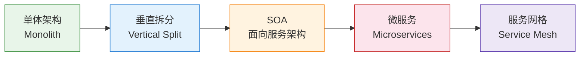

#### 各阶段详解

**① 单体架构（Monolith）**

所有功能模块打包在一个应用中部署。

```
my-app.jar
├── 用户模块 (UserService)
├── 订单模块 (OrderService)
├── 支付模块 (PaymentService)
└── 商品模块 (ProductService)
```

- **适用场景**：团队 < 10 人，业务初期，快速验证
- **优点**：开发简单、调试方便、部署成本低
- **缺点**：随规模增长，代码耦合严重，部署风险高，技术栈统一

**② 垂直拆分**

按业务域将单体拆成多个独立应用，每个应用有自己的数据库。

```
用户系统 (user-service)     → user_db
订单系统 (order-service)    → order_db  
支付系统 (payment-service)  → payment_db
```

- **适用场景**：团队 10~50 人，业务方向明确
- **解决的问题**：部署隔离、数据库独立

**③ SOA（Service-Oriented Architecture）**

通过企业服务总线（ESB）将各系统连接，统一接口协议（如 WebService/SOAP）。

- **缺点**：ESB 成为瓶颈，协议重，治理复杂，已逐步被淘汰

**④ 微服务（Microservices）**

将业务拆成更细粒度的服务，每个服务：
- 独立部署
- 独立扩展
- 轻量级通信（HTTP/REST 或 gRPC）
- 围绕业务能力组织（而非技术分层）

**⑤ 服务网格（Service Mesh）**

将服务治理（熔断、限流、追踪、安全）从业务代码剥离，下沉到基础设施层（Sidecar Proxy）。

代表：Istio + Envoy

#### 何时演进的判断依据

| 阶段 | 触发条件 |
|------|---------|
| 单体 → 垂直拆分 | 单体部署影响面太大，或团队扩张导致代码冲突 |
| 垂直拆分 → 微服务 | 服务内部出现独立扩展需求，或功能迭代相互阻塞 |
| 微服务 → 服务网格 | 服务数量 > 50，跨服务治理成本显著上升 |

#### 演进原则

1. **小步快跑**：每次重构只解决当前最迫切的问题，避免"大爆炸式"重构
2. **持续重构**：技术债要及时偿还，不要等到无法维护再动手
3. **拥抱变化**：架构要为变化留有余地，用接口隔离变化点

---

### 2. 58同城推荐系统架构设计与实现

#### 推荐系统整体架构

推荐系统的目标是：在海量内容中，高效找到用户最可能感兴趣的内容并展示。

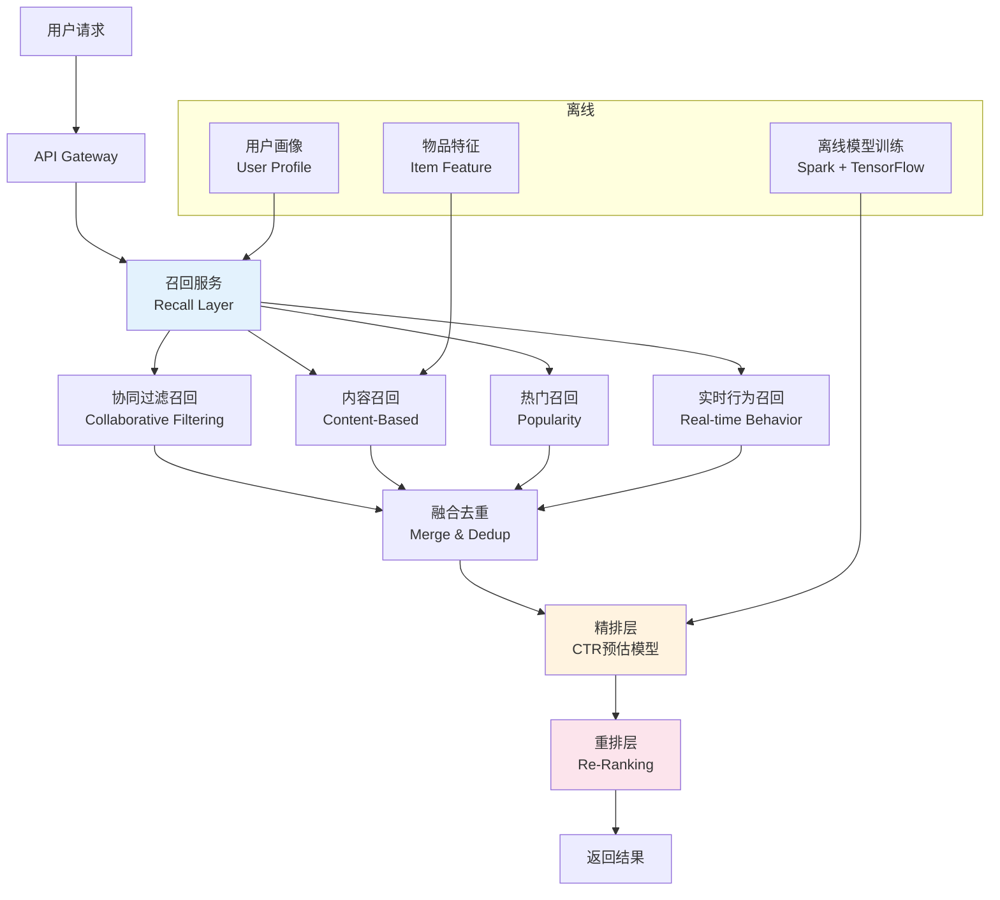

#### 三层架构详解

**① 召回层（Recall Layer）**

从亿级候选集中快速筛选出数千条候选，强调**高效**和**覆盖**。

| 召回策略 | 原理 | 适用场景 |
|---------|------|---------|
| 协同过滤（CF） | "相似用户喜欢的你也喜欢" | 有历史行为的老用户 |
| 内容推荐 | 物品标签与用户标签匹配 | 新用户冷启动 |
| 热门召回 | 全局/地域热门榜单 | 兜底策略 |
| 实时行为 | 用户最近点击/搜索 | 捕捉短期兴趣 |

**协同过滤原理（ItemCF 示例）：**

```java
// 计算物品相似度：同时被多少用户喜欢
// sim(i, j) = |users(i) ∩ users(j)| / sqrt(|users(i)| * |users(j)|)

public Map<Long, Double> getTopKSimilarItems(long itemId, int topK) {
    // 1. 从 Redis 获取喜欢该物品的用户列表
    Set<Long> users = redisClient.smembers("item:like:" + itemId);
    
    Map<Long, Integer> cooccurrence = new HashMap<>();
    for (Long userId : users) {
        // 2. 获取该用户喜欢的其他物品
        Set<Long> userItems = redisClient.smembers("user:like:" + userId);
        for (Long otherItem : userItems) {
            if (!otherItem.equals(itemId)) {
                cooccurrence.merge(otherItem, 1, Integer::sum);
            }
        }
    }
    
    // 3. 归一化计算相似度
    int userCount = users.size();
    return cooccurrence.entrySet().stream()
        .collect(Collectors.toMap(
            Map.Entry::getKey,
            e -> e.getValue() / Math.sqrt(userCount * getItemUserCount(e.getKey()))
        ));
}
```

**② 排序层（Ranking Layer）**

对召回的数千候选精确打分，使用 CTR（Click-Through Rate）预估模型。

- **特征工程**：用户特征（年龄、城市、历史行为）+ 物品特征（类目、价格）+ 上下文特征（时间、设备）
- **模型**：LR → GBDT → Wide&Deep → DeepFM
- **服务化**：TensorFlow Serving / TorchServe

**③ 重排层（Re-Ranking Layer）**

排序层只关注单条结果的分数，重排层解决**整体结果质量**问题：

- **多样性**：同一类目不能连续出现超过 3 条
- **新鲜度**：控制新发布物品的曝光比例
- **流量调控**：广告插入、运营活动强插

```java
// 多样性重排：同类目最多连续出现2次
public List<Item> diversityReRank(List<Item> ranked) {
    List<Item> result = new ArrayList<>();
    Map<String, Integer> categoryCount = new HashMap<>();
    
    for (Item item : ranked) {
        String category = item.getCategory();
        int count = categoryCount.getOrDefault(category, 0);
        if (count < 2) {
            result.add(item);
            categoryCount.put(category, count + 1);
        }
        if (result.size() >= 20) break;
    }
    return result;
}
```

---

### 3. 从0开始做互联网推荐 — 以58转转为例

#### 冷启动问题

**冷启动**是推荐系统最核心的挑战之一，分三类：

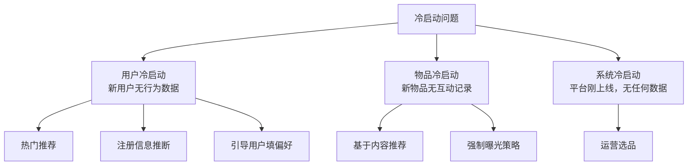

#### 三阶段冷启动方案

**阶段一：热门推荐（Day 0）**

没有任何用户数据时，展示全平台热门内容。

```java
// 热门榜单：按最近24小时点击量排序
SELECT item_id, COUNT(*) as click_count
FROM user_behavior
WHERE behavior_type = 'click'
  AND create_time >= DATE_SUB(NOW(), INTERVAL 24 HOUR)
GROUP BY item_id
ORDER BY click_count DESC
LIMIT 100;
```

热门推荐的**问题**：马太效应（越热越曝光），新内容无曝光机会。
**解决**：引入 ε-greedy 策略，90% 展示当前最优，10% 随机探索新内容。

**阶段二：基于内容推荐（有物品数据后）**

分析物品的文本、图片、标签，构建物品画像，匹配用户浏览历史。

```
物品画像示例（转转二手手机）：
{
  "item_id": 12345,
  "category": "手机",
  "brand": "苹果",
  "model": "iPhone 13",
  "price_range": "2000-3000",
  "condition": "9成新",
  "tags": ["苹果", "128G", "黑色", "深圳"]
}
```

**阶段三：用户画像（有用户行为后）**

通过用户的历史行为（浏览、点击、收藏、购买）刻画用户兴趣。

```java
// 用户画像构建（实时流计算，Flink）
public class UserProfileJob {
    // 用户最近7天浏览的类目分布
    // {"手机": 0.5, "电脑": 0.3, "相机": 0.2}
    
    public Map<String, Double> buildCategoryInterest(String userId) {
        List<BehaviorEvent> events = behaviorStore.queryRecent(userId, 7);
        Map<String, Long> categoryCount = events.stream()
            .collect(Collectors.groupingBy(
                BehaviorEvent::getCategory, Collectors.counting()));
        
        long total = categoryCount.values().stream().mapToLong(Long::longValue).sum();
        return categoryCount.entrySet().stream()
            .collect(Collectors.toMap(
                Map.Entry::getKey,
                e -> (double) e.getValue() / total
            ));
    }
}
```

#### 数据积累策略


---

### 4. 从0开始做垂直O2O个性化推荐

#### O2O 推荐的三大核心特征

O2O（Online to Offline）推荐与纯电商推荐的最大区别：

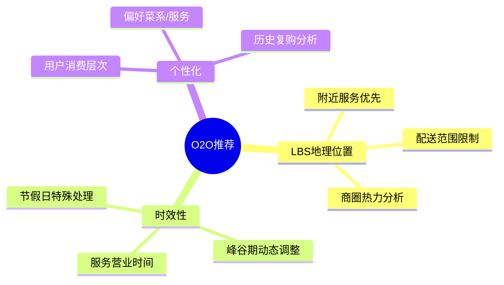

#### LBS（基于地理位置的服务）实现

**核心问题**：如何高效查询"附近 3 公里内的服务"？

**方案：GeoHash + Redis**

GeoHash 将二维坐标编码为字符串，相邻位置的字符串前缀相同。

```java
// 使用 Redis GEO 命令
// 存储商家位置
redisTemplate.opsForGeo().add("merchants", 
    new Point(116.397, 39.916),  // 经纬度
    "merchant_001");

// 查询附近3公里商家
GeoResults<RedisGeoCommands.GeoLocation<String>> results = 
    redisTemplate.opsForGeo().radius("merchants",
        new Circle(new Point(116.400, 39.918), 
                   new Distance(3, Metrics.KILOMETERS)),
        RedisGeoCommands.GeoRadiusCommandArgs.newGeoRadiusArgs()
            .includeDistance()
            .sortAscending()
            .limit(20));
```

**查询复杂度**：O(N+log(M))，N 是结果数量，M 是总数量。

#### 时效性处理

```java
// 服务可用性检查（结合时间 + 业务规则）
public boolean isServiceAvailable(long merchantId) {
    Merchant merchant = merchantService.get(merchantId);
    LocalTime now = LocalTime.now();
    DayOfWeek day = LocalDate.now().getDayOfWeek();
    
    // 营业时间检查
    if (now.isBefore(merchant.getOpenTime()) || 
        now.isAfter(merchant.getCloseTime())) {
        return false;
    }
    
    // 休息日检查
    if (merchant.getRestDays().contains(day)) {
        return false;
    }
    
    // 峰值期运力检查（骑手数量）
    int availableRiders = riderService.getAvailableCount(merchantId);
    return availableRiders > 0;
}
```

#### 个性化评分公式

```
最终得分 = α×个性化分 + β×距离衰减分 + γ×时效分 + δ×平台质量分

其中：
- 个性化分：用户历史偏好匹配度（0~1）
- 距离衰减分：1 / (1 + distance_km)
- 时效分：订单量/容量比，避免推荐排队严重的店
- 平台质量分：评分、评论数、投诉率综合
```

---

### 5. 58到家入驻微信钱包的技术优化

#### 背景

微信钱包是超高流量入口，入驻后面临的挑战：
- 瞬时流量峰值（数十倍日常）
- 资金安全要求极高
- 用户体验要求秒级响应

#### 整体优化架构

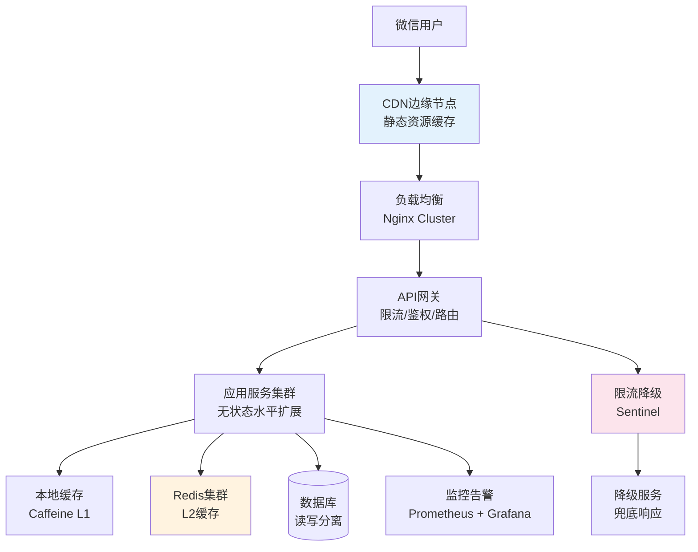

#### 关键优化点

**① 性能优化：CDN + 多级缓存**

```java
// 多级缓存查询（L1本地 → L2 Redis → DB）
@Service
public class ServiceQueryService {
    
    private final Cache<Long, ServiceInfo> localCache = 
        Caffeine.newBuilder()
            .maximumSize(10_000)
            .expireAfterWrite(30, TimeUnit.SECONDS)
            .build();
    
    public ServiceInfo getServiceInfo(long serviceId) {
        // L1：本地缓存（纳秒级，无网络开销）
        ServiceInfo info = localCache.getIfPresent(serviceId);
        if (info != null) return info;
        
        // L2：Redis（毫秒级）
        String key = "service:" + serviceId;
        info = redisTemplate.opsForValue().get(key);
        if (info != null) {
            localCache.put(serviceId, info);
            return info;
        }
        
        // L3：数据库（百毫秒级，加分布式锁防缓存击穿）
        String lockKey = "lock:service:" + serviceId;
        if (redisLock.tryLock(lockKey, 3, TimeUnit.SECONDS)) {
            try {
                info = serviceMapper.selectById(serviceId);
                redisTemplate.opsForValue().set(key, info, 5, TimeUnit.MINUTES);
                localCache.put(serviceId, info);
            } finally {
                redisLock.unlock(lockKey);
            }
        }
        return info;
    }
}
```

**② 稳定性：限流 + 熔断降级**

```java
// 使用 Sentinel 注解实现限流降级
@SentinelResource(
    value = "queryHomePageService",
    blockHandler = "homePageFallback",      // 触发限流时调用
    fallback = "homePageDegradeFallback"    // 触发熔断时调用
)
public HomePageVO queryHomePage(Long userId) {
    // 正常业务逻辑
    return buildHomePageVO(userId);
}

// 降级兜底：返回缓存的静态推荐列表
public HomePageVO homePageFallback(Long userId, BlockException e) {
    log.warn("限流触发, userId={}", userId);
    return staticRecommendService.getDefaultRecommend();
}
```

**③ 监控告警**

| 监控维度 | 指标 | 告警阈值 |
|---------|------|---------|
| 系统层 | CPU 使用率 | > 80% |
| 应用层 | P99 响应时间 | > 500ms |
| 应用层 | 错误率 | > 1% |
| 业务层 | 支付成功率 | < 99.5% |
| 缓存层 | Redis 命中率 | < 90% |

---

### 6. 创业公司快速搭建立体化监控之路

#### 为什么监控是基础设施

没有监控的系统是"盲飞"，出现问题时：
- 不知道哪里出了问题
- 不知道什么时候出的问题
- 不知道影响了多少用户

#### 监控体系全景图

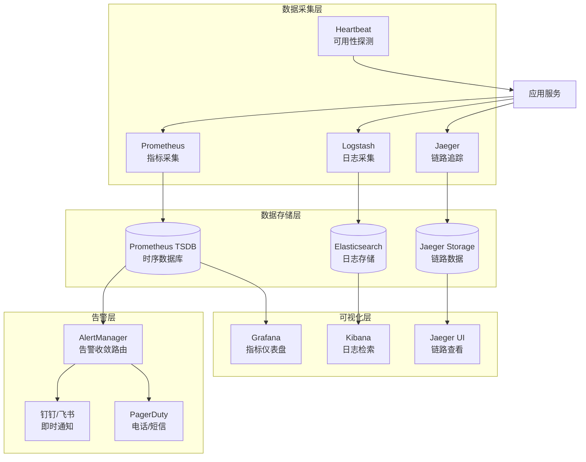

#### 四层监控详解

**① 基础设施监控**

使用 `node_exporter` 采集主机指标：

```yaml
# Prometheus 采集配置
scrape_configs:
  - job_name: 'node'
    static_configs:
      - targets: ['10.0.0.1:9100', '10.0.0.2:9100']
```

关键指标：
- `node_cpu_seconds_total`：CPU 使用率
- `node_memory_MemAvailable_bytes`：可用内存
- `node_filesystem_avail_bytes`：磁盘剩余
- `node_network_receive_bytes_total`：网络流量

**② 应用监控（JVM + 业务指标）**

Spring Boot + Micrometer 自动暴露指标端点：

```java
// 自定义业务指标
@Component
public class OrderMetrics {
    
    private final Counter orderCreatedCounter;
    private final Timer orderProcessTimer;
    
    public OrderMetrics(MeterRegistry registry) {
        this.orderCreatedCounter = Counter.builder("order.created.total")
            .tag("service", "order")
            .description("订单创建总数")
            .register(registry);
        
        this.orderProcessTimer = Timer.builder("order.process.duration")
            .description("订单处理耗时")
            .register(registry);
    }
    
    public void recordOrderCreated() {
        orderCreatedCounter.increment();
    }
    
    public void recordProcessTime(Runnable task) {
        orderProcessTimer.record(task);
    }
}
```

**③ 业务监控**

业务监控关注的是"用户视角"的健康度：

```sql
-- 定时查询关键业务指标（可用 Grafana + MySQL 数据源）
SELECT 
    DATE_FORMAT(create_time, '%Y-%m-%d %H:%i') as time_slot,
    COUNT(*) as order_count,
    SUM(amount) as gmv,
    SUM(CASE WHEN status = 'SUCCESS' THEN 1 ELSE 0 END) / COUNT(*) as success_rate
FROM orders
WHERE create_time >= DATE_SUB(NOW(), INTERVAL 1 HOUR)
GROUP BY time_slot
ORDER BY time_slot;
```

**④ 日志监控（ELK Stack）**

```
应用 → Filebeat → Logstash（解析/过滤）→ Elasticsearch → Kibana
```

关键日志规范：
```java
// 使用结构化日志（便于 ELK 解析）
log.info("order_created", 
    kv("orderId", orderId),
    kv("userId", userId), 
    kv("amount", amount),
    kv("traceId", MDC.get("traceId")));  // 关联链路追踪
```

#### 告警分级策略

| 级别 | 触发条件 | 通知方式 | 响应时间 |
|------|---------|---------|---------|
| P0 | 服务不可用 / 支付失败率 > 5% | 电话 + 短信 | 5分钟 |
| P1 | 错误率 > 1% / P99 > 1s | 钉钉 + 短信 | 15分钟 |
| P2 | CPU > 80% / 内存 > 90% | 钉钉 | 30分钟 |
| P3 | 磁盘 > 70% / 慢查询增多 | 邮件 | 当天 |

#### 创业公司最小化监控方案（成本优先）

```
第1步：Prometheus + Grafana（免费）
第2步：接入 ELK（ElasticSearch 社区版免费）
第3步：告警接入企业微信/钉钉（免费 Webhook）
第4步：APM 链路追踪（Skywalking 开源版）
```

---

### 7. 巧用CAS解决数据一致性问题

#### 什么是 CAS

CAS（Compare And Swap，比较并交换）是一种**无锁**的并发控制技术。

操作语义：
```
CAS(内存地址, 期望值, 新值)
如果内存地址的当前值 == 期望值，则将其更新为新值，返回 true
否则不做任何操作，返回 false（调用方需重试）
```

这是一条**原子指令**（CPU 层面保证），不需要操作系统级的锁。

#### 三种并发控制方式对比

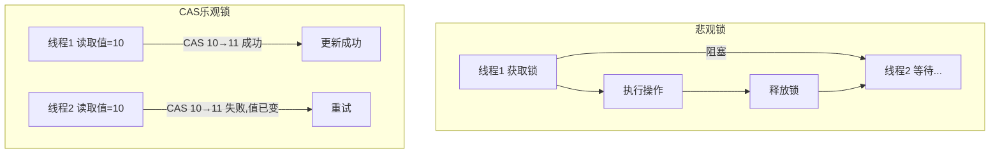

#### Java 中的 CAS 实现

**AtomicInteger 底层原理：**

```java
// AtomicInteger 内部使用 Unsafe 类调用 CPU 原子指令
public class AtomicInteger {
    private volatile int value;  // volatile 保证可见性
    
    // 自增操作（无锁）
    public int incrementAndGet() {
        return unsafe.getAndAddInt(this, valueOffset, 1) + 1;
    }
    
    // CAS 操作
    public boolean compareAndSet(int expect, int update) {
        return unsafe.compareAndSwapInt(this, valueOffset, expect, update);
    }
}

// 使用示例：并发计数器
AtomicInteger counter = new AtomicInteger(0);

// 多线程环境下安全自增
int newValue = counter.incrementAndGet();
```

**手写 CAS 自旋重试：**

```java
// 模拟 CAS 重试逻辑（AtomicInteger 内部做了类似的事）
public int casIncrement(AtomicInteger ai) {
    int oldValue, newValue;
    do {
        oldValue = ai.get();          // 读取当前值
        newValue = oldValue + 1;      // 计算新值
    } while (!ai.compareAndSet(oldValue, newValue));  // CAS失败则重试
    return newValue;
}
```

#### CAS 在业务中的应用

**场景一：数据库乐观锁（防超卖）**

```java
// 库存扣减（version 字段实现乐观锁）
@Update("UPDATE inventory SET stock = stock - #{count}, version = version + 1 " +
        "WHERE item_id = #{itemId} AND version = #{version} AND stock >= #{count}")
int deductStock(@Param("itemId") long itemId, 
                @Param("count") int count, 
                @Param("version") int version);

// 调用层加重试
public boolean tryDeductStock(long itemId, int count) {
    for (int i = 0; i < 3; i++) {  // 最多重试3次
        Inventory inv = inventoryMapper.selectByItemId(itemId);
        if (inv.getStock() < count) return false;  // 库存不足
        
        int rows = inventoryMapper.deductStock(itemId, count, inv.getVersion());
        if (rows > 0) return true;  // CAS成功
        // rows == 0 说明 version 已被其他线程修改，重试
    }
    return false;  // 重试耗尽
}
```

**场景二：Redis 原子操作**

```java
// Redis SETNX 实现分布式锁（底层也是 CAS 思想）
Boolean acquired = redisTemplate.opsForValue()
    .setIfAbsent("lock:order:" + orderId, "1", 30, TimeUnit.SECONDS);
// setIfAbsent = SET key value NX EX seconds
// 仅当 key 不存在时设置 → CAS(null, "1")
```

#### CAS 的缺陷与解决方案

| 问题 | 描述 | 解决方案 |
|------|------|---------|
| ABA 问题 | 值从 A 改为 B 再改回 A，CAS 认为没变化 | 使用 `AtomicStampedReference` 带版本号 |
| 自旋开销 | 竞争激烈时大量 CPU 空转 | 限制重试次数，退化为加锁 |
| 只能保护单变量 | 无法原子更新多个变量 | 使用锁或数据库事务 |

```java
// 解决 ABA 问题：使用带版本号的原子引用
AtomicStampedReference<Integer> ref = 
    new AtomicStampedReference<>(100, 0);  // 值=100, 版本=0

int[] stampHolder = new int[1];
int current = ref.get(stampHolder);         // 获取当前值和版本
int stamp = stampHolder[0];

// CAS 必须值和版本同时匹配才能成功
boolean success = ref.compareAndSet(current, 200, stamp, stamp + 1);
```

---

### 8. 百度咋做长文本去重

#### 问题背景

海量 Web 爬虫每天抓取数十亿网页，其中存在大量重复/近似内容：
- 完全相同（转载）
- 高度相似（洗稿）
- 部分相似（引用）

传统方案（MD5 哈希）只能检测**完全相同**的内容，无法处理"相似"。

#### 方案一：SimHash（主流方案）

SimHash 是 Google 用于网页去重的算法，能将文本映射为固定长度（64位）的指纹，**相似文本的指纹汉明距离很小**。

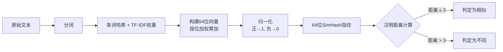

**Java 实现：**

```java
public class SimHash {
    
    public long simHash(String text) {
        // 1. 分词（实际使用 jieba/HanLP）
        List<String> tokens = tokenize(text);
        
        // 2. 构建64维加权向量
        long[] weights = new long[64];
        for (String token : tokens) {
            long hash = murmurHash64(token);
            double weight = getTfIdfWeight(token);  // TF-IDF 权重
            for (int i = 0; i < 64; i++) {
                if (((hash >> i) & 1) == 1) {
                    weights[i] += weight;
                } else {
                    weights[i] -= weight;
                }
            }
        }
        
        // 3. 降维：正数→1, 负数→0
        long fingerprint = 0;
        for (int i = 0; i < 64; i++) {
            if (weights[i] > 0) {
                fingerprint |= (1L << i);
            }
        }
        return fingerprint;
    }
    
    // 计算两个指纹的汉明距离（不同位的数量）
    public int hammingDistance(long hash1, long hash2) {
        return Long.bitCount(hash1 ^ hash2);  // XOR后统计1的个数
    }
    
    // 相似度判断（阈值通常为3）
    public boolean isSimilar(String text1, String text2) {
        return hammingDistance(simHash(text1), simHash(text2)) <= 3;
    }
}
```

**海量文本的高效查找（分段查找）：**

直接遍历数十亿指纹太慢。利用鸽巢原理：
> 两个指纹汉明距离 ≤ 3，则将64位分成4段（每段16位），至少有一段完全相同。

```java
// 将64位指纹分4段，建4个索引
// 只要其中一段命中，就取出来详细比较
public List<Long> findSimilar(long fingerprint) {
    long seg1 = (fingerprint >> 48) & 0xFFFF;
    long seg2 = (fingerprint >> 32) & 0xFFFF;
    long seg3 = (fingerprint >> 16) & 0xFFFF;
    long seg4 = fingerprint & 0xFFFF;
    
    // 对每段建 HashMap 索引，O(1) 查找
    Set<Long> candidates = new HashSet<>();
    candidates.addAll(index1.getOrDefault(seg1, List.of()));
    candidates.addAll(index2.getOrDefault(seg2, List.of()));
    candidates.addAll(index3.getOrDefault(seg3, List.of()));
    candidates.addAll(index4.getOrDefault(seg4, List.of()));
    
    // 精确比较候选集
    return candidates.stream()
        .filter(fp -> hammingDistance(fp, fingerprint) <= 3)
        .collect(Collectors.toList());
}
```

#### 方案二：MinHash + LSH

MinHash 适合集合相似度（Jaccard 相似度）：
- 将文本转为 n-gram 集合
- 用多个哈希函数计算 MinHash 签名
- LSH（局部敏感哈希）加速查找

**适用场景**：短文本集合相似度，如文章段落级别比较。

#### 方案三：Bloom Filter 预过滤

```java
// Bloom Filter：用极小内存判断"某文本是否已见过"
// 误判率可控（有false positive，无false negative）

BloomFilter<String> filter = BloomFilter.create(
    Funnels.stringFunnel(Charset.defaultCharset()),
    100_000_000,  // 预期元素数：1亿
    0.001);       // 可接受误判率：0.1%
// 内存占用：约 143MB（远小于存储1亿URL）

// 写入
filter.put(docId);

// 查询（可能误判为存在，但不会误判为不存在）
if (!filter.mightContain(docId)) {
    // 一定是新文档，直接入库
    saveDocument(doc);
} else {
    // 可能重复，用 SimHash 精确判断
    checkSimHash(doc);
}
```

#### 三种方案对比

| 方案 | 检测类型 | 时间复杂度 | 适用规模 |
|------|---------|----------|---------|
| MD5 | 完全相同 | O(n) | 任意 |
| SimHash | 近似重复（改动<10%） | O(1) 查找 | 十亿级 |
| MinHash+LSH | 集合相似度 | O(1) 查找 | 亿级 |
| Bloom Filter | 完全相同（预过滤） | O(k)，k为哈希函数数 | 百亿级 |

---

### 9. 如何快速实现高并发短文检索

#### 核心问题

检索系统需要：
1. 支持关键词/短语全文搜索
2. 毫秒级响应（< 100ms）
3. 支持亿级数据量

#### 方案一：Elasticsearch 倒排索引（主流方案）

**倒排索引原理：**

正向索引：文档 → 词列表
倒排索引：词 → 包含该词的文档列表

```
文档1："北京 美食 推荐"
文档2："上海 美食 攻略"
文档3："北京 旅游 攻略"

倒排索引：
"北京" → [文档1, 文档3]
"美食" → [文档1, 文档2]
"推荐" → [文档1]
"攻略" → [文档2, 文档3]
```

**Elasticsearch 使用示例：**

```java
// 创建索引（mapping 定义字段类型）
PUT /posts
{
  "mappings": {
    "properties": {
      "title":   { "type": "text", "analyzer": "ik_max_word" },
      "content": { "type": "text", "analyzer": "ik_max_word" },
      "tags":    { "type": "keyword" },
      "created_at": { "type": "date" }
    }
  }
}

// Java 查询
SearchRequest request = new SearchRequest("posts");
SearchSourceBuilder sourceBuilder = new SearchSourceBuilder();
sourceBuilder.query(
    QueryBuilders.boolQuery()
        .must(QueryBuilders.matchQuery("content", "Java 微服务"))
        .filter(QueryBuilders.termQuery("tags", "backend"))
        .filter(QueryBuilders.rangeQuery("created_at").gte("now-7d"))
);
sourceBuilder.from(0).size(20);
sourceBuilder.sort("_score", SortOrder.DESC);
request.source(sourceBuilder);

SearchResponse response = client.search(request, RequestOptions.DEFAULT);
```

**ES 架构（生产环境）：**

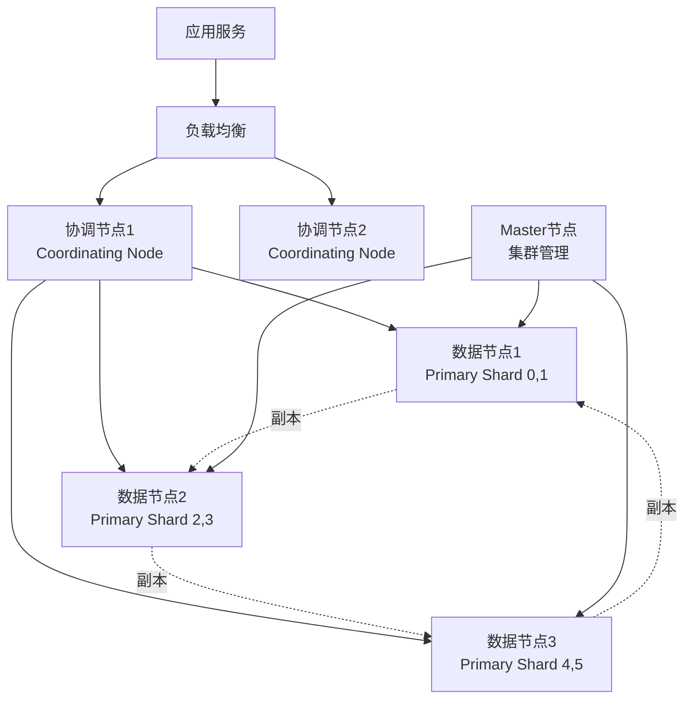

#### 方案二：前缀树（Trie）

适用于**自动补全、前缀匹配**场景（如搜索框联想词）。

```java
class TrieNode {
    Map<Character, TrieNode> children = new HashMap<>();
    boolean isEnd = false;
    int frequency = 0;  // 搜索频次，用于排序
}

public class Trie {
    private TrieNode root = new TrieNode();
    
    // 插入词
    public void insert(String word, int freq) {
        TrieNode node = root;
        for (char c : word.toCharArray()) {
            node.children.putIfAbsent(c, new TrieNode());
            node = node.children.get(c);
        }
        node.isEnd = true;
        node.frequency = freq;
    }
    
    // 前缀搜索：返回所有以 prefix 开头的词（按频次排序）
    public List<String> searchPrefix(String prefix) {
        TrieNode node = root;
        for (char c : prefix.toCharArray()) {
            if (!node.children.containsKey(c)) return List.of();
            node = node.children.get(c);
        }
        
        List<String> results = new ArrayList<>();
        dfs(node, new StringBuilder(prefix), results);
        results.sort((a, b) -> getFreq(b) - getFreq(a));
        return results.subList(0, Math.min(10, results.size()));
    }
}
```

#### 方案三：Bloom Filter 快速过滤

在检索前用 Bloom Filter 快速排除"一定不存在"的查询，减少 ES 压力。

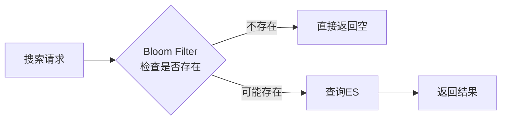

#### 性能调优要点

| 调优项 | 说明 |
|-------|------|
| 分片数量 | 单分片不超过 50GB，分片数 = 总数据量 / 30GB |
| 副本数量 | 生产环境最少1副本，读多写少可增至2个 |
| 索引刷新间隔 | 写入密集时将 `refresh_interval` 改为 `30s` |
| 查询缓存 | 对 filter 类查询开启 query cache |
| 文档字段 | 不需要搜索的字段设置 `"index": false` |

---

### 10. 如何实现超高并发的无锁缓存？

#### 问题背景

传统缓存加锁的问题：
- `synchronized` / `Lock` 在高并发下竞争激烈
- 锁导致线程排队，吞吐量受限
- 持有锁的线程被调度走，其他线程等待（锁竞争开销）

无锁方案的目标：**多线程读写缓存，不阻塞任何线程**。

#### 方案一：CopyOnWrite（写时复制）

适用于**读多写少**场景（读:写 >> 100:1）。

```java
// CopyOnWriteArrayList 原理
public class CopyOnWriteCache<K, V> {
    
    // volatile 保证可见性，读操作不需要锁
    private volatile Map<K, V> cache = new HashMap<>();
    
    // 读操作：无锁，直接读快照
    public V get(K key) {
        return cache.get(key);  // 无锁！
    }
    
    // 写操作：复制整个 Map，修改后替换引用
    public synchronized void put(K key, V value) {
        Map<K, V> newCache = new HashMap<>(cache);  // 复制
        newCache.put(key, value);                   // 修改副本
        cache = newCache;                            // 原子替换引用（volatile写）
    }
}
```

**原理**：读操作直接读旧快照，无需加锁；写操作在副本上操作，完成后用 `volatile` 写原子替换引用。读永远不会被写阻塞。

**缺点**：写操作需要复制整个数据结构，内存占用翻倍。

#### 方案二：ThreadLocal（线程本地缓存）

每个线程有自己独立的缓存副本，彻底消除线程间竞争。

```java
// ThreadLocal 缓存：每个线程独立一份，零竞争
public class ThreadLocalCache {
    
    private static final ThreadLocal<Map<String, Object>> LOCAL_CACHE = 
        ThreadLocal.withInitial(HashMap::new);
    
    // 完全无锁，每个线程操作自己的 Map
    public static Object get(String key) {
        return LOCAL_CACHE.get().get(key);
    }
    
    public static void put(String key, Object value) {
        LOCAL_CACHE.get().put(key, value);
    }
    
    // 重要：请求结束后必须清理，否则线程池复用导致数据泄漏
    public static void clear() {
        LOCAL_CACHE.remove();
    }
}

// 在 Web 请求中使用（拦截器清理）
@Component
public class CacheClearInterceptor implements HandlerInterceptor {
    @Override
    public void afterCompletion(HttpServletRequest request, 
                                HttpServletResponse response, 
                                Object handler, Exception ex) {
        ThreadLocalCache.clear();  // 请求结束清理
    }
}
```

**适用场景**：同一请求内多次查询相同数据（如用户信息），避免重复查 Redis。

#### 方案三：不可变对象（Immutable）

不可变对象**天生线程安全**，可以被任意多线程同时读取，完全无需同步。

```java
// 不可变配置对象（只读缓存）
public final class SystemConfig {  // final 类，不可继承
    private final String appName;
    private final int maxConnections;
    private final List<String> whiteList;  // 防御性复制
    
    public SystemConfig(String appName, int maxConnections, List<String> whiteList) {
        this.appName = appName;
        this.maxConnections = maxConnections;
        this.whiteList = List.copyOf(whiteList);  // 不可变副本
    }
    
    // 只有 getter，没有 setter
    public String getAppName() { return appName; }
    public int getMaxConnections() { return maxConnections; }
    public List<String> getWhiteList() { return whiteList; }
}

// 配置热更新：替换整个对象引用（原子操作）
public class ConfigHolder {
    private static volatile SystemConfig config;  // volatile 保证可见性
    
    public static SystemConfig get() { return config; }
    
    // 热更新：直接替换引用，读线程始终能拿到一个完整一致的配置
    public static void update(SystemConfig newConfig) {
        config = newConfig;
    }
}
```

#### 生产级无锁缓存：Caffeine

Caffeine 是目前 Java 生态最高性能的本地缓存库，底层使用 W-TinyLFU 算法 + 无锁数据结构。

```java
// Caffeine 配置示例
Cache<String, User> userCache = Caffeine.newBuilder()
    .maximumSize(10_000)                          // 最大条目数
    .expireAfterWrite(10, TimeUnit.MINUTES)       // 写后10分钟过期
    .expireAfterAccess(5, TimeUnit.MINUTES)       // 访问后5分钟过期
    .refreshAfterWrite(1, TimeUnit.MINUTES)       // 1分钟后异步刷新
    .recordStats()                                // 开启统计（命中率等）
    .build();

// 统计缓存效率
CacheStats stats = userCache.stats();
System.out.printf("命中率: %.2f%%, 平均加载时间: %.2fms%n",
    stats.hitRate() * 100, 
    stats.averageLoadPenalty() / 1_000_000.0);
```

#### 四种方案选型

| 方案 | 读性能 | 写性能 | 适用场景 |
|------|-------|-------|---------|
| CopyOnWrite | 极高（无锁） | 低（复制开销） | 读多写少，数据量小 |
| ThreadLocal | 极高（无竞争） | 极高（无竞争） | 请求级临时缓存 |
| 不可变对象 | 极高 | 低（整体替换） | 配置/字典数据 |
| Caffeine | 高（无锁实现） | 高 | 通用本地缓存 |

---

### 11. "ID串行化"到底是怎么实现的？

#### 为什么需要分布式 ID

分布式系统中，多个服务节点同时写入数据库，数据库自增 ID 的问题：
- 多库多表时 ID 冲突
- 暴露数据量（安全问题）
- 扩容后 ID 不连续

一个好的分布式 ID 需要满足：**全局唯一、趋势递增、高性能、高可用**。

#### 方案一：数据库自增 ID

```sql
-- 单库场景，最简单
CREATE TABLE orders (
    id BIGINT AUTO_INCREMENT PRIMARY KEY,
    ...
);

-- 多主架构：不同节点设置不同步长
-- 节点1: AUTO_INCREMENT = 1, 步长 = 2 → 1, 3, 5, 7...
-- 节点2: AUTO_INCREMENT = 2, 步长 = 2 → 2, 4, 6, 8...
SET @@auto_increment_increment = 2;
SET @@auto_increment_offset = 1;
```

**缺点**：扩容时步长固定，无法动态调整；依赖数据库，高并发下是瓶颈。

#### 方案二：Redis INCR

```java
// Redis 原子自增，性能极高（10w+ QPS）
public long nextId(String bizType) {
    String key = "id:seq:" + bizType;
    long seq = redisTemplate.opsForValue().increment(key);
    
    // 组合业务前缀 + 日期 + 序列号
    String dateStr = LocalDate.now().format(DateTimeFormatter.BASIC_ISO_DATE);
    return Long.parseLong(dateStr + String.format("%06d", seq));
    // 例：20240318000001
}
```

**缺点**：Redis 重启丢失序号（需持久化），依赖 Redis 可用性。

#### 方案三：Snowflake 算法（Twitter）

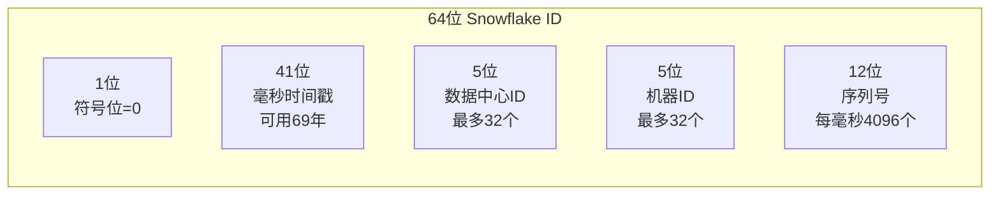

```java
public class SnowflakeIdGenerator {
    private static final long EPOCH = 1609459200000L;  // 2021-01-01 基准时间
    private static final long WORKER_BITS = 5;
    private static final long DC_BITS = 5;
    private static final long SEQ_BITS = 12;
    
    private static final long MAX_SEQ = ~(-1L << SEQ_BITS);  // 4095
    private static final long WORKER_SHIFT = SEQ_BITS;
    private static final long DC_SHIFT = SEQ_BITS + WORKER_BITS;
    private static final long TIMESTAMP_SHIFT = DC_SHIFT + DC_BITS;
    
    private final long workerId;
    private final long datacenterId;
    private long sequence = 0;
    private long lastTimestamp = -1;
    
    public SnowflakeIdGenerator(long workerId, long datacenterId) {
        this.workerId = workerId;
        this.datacenterId = datacenterId;
    }
    
    public synchronized long nextId() {
        long timestamp = System.currentTimeMillis();
        
        if (timestamp < lastTimestamp) {
            throw new RuntimeException("时钟回拨！拒绝生成ID");
        }
        
        if (timestamp == lastTimestamp) {
            sequence = (sequence + 1) & MAX_SEQ;
            if (sequence == 0) {
                // 当前毫秒序列号用尽，等待下一毫秒
                timestamp = waitNextMillis(lastTimestamp);
            }
        } else {
            sequence = 0;  // 新的毫秒，序列号归零
        }
        
        lastTimestamp = timestamp;
        
        return ((timestamp - EPOCH) << TIMESTAMP_SHIFT)
            | (datacenterId << DC_SHIFT)
            | (workerId << WORKER_SHIFT)
            | sequence;
    }
    
    private long waitNextMillis(long lastTimestamp) {
        long timestamp = System.currentTimeMillis();
        while (timestamp <= lastTimestamp) {
            timestamp = System.currentTimeMillis();
        }
        return timestamp;
    }
}
```

**优点**：完全本地生成，无网络依赖，每毫秒可生成 4096 个 ID。
**缺点**：依赖机器时钟，时钟回拨会导致 ID 重复（需处理）。

#### 方案四：美团 Leaf

美团 Leaf 提供两种模式：

**Leaf-Segment（号段模式）：**

```
数据库存储：biz_tag → max_id, step, update_time
每次批量获取一段 ID（如 max_id ~ max_id+step）
号段用完后再申请下一段（双 buffer 预加载）
```

```sql
-- Leaf 号段表
CREATE TABLE leaf_alloc (
    biz_tag    VARCHAR(128) NOT NULL,
    max_id     BIGINT NOT NULL DEFAULT 1,    -- 当前已分配到的最大ID
    step       INT NOT NULL DEFAULT 2000,     -- 每次申请的号段步长
    update_time TIMESTAMP NOT NULL,
    PRIMARY KEY (biz_tag)
);

-- 申请号段（使用乐观锁）
UPDATE leaf_alloc SET max_id = max_id + step, update_time = NOW()
WHERE biz_tag = 'order';
```

**Leaf-Snowflake（Snowflake 模式增强）：**
- 用 ZooKeeper 解决 workerId 分配问题
- 处理时钟回拨：检测到回拨时等待追上后再工作

#### 四种方案对比

| 方案 | 性能 | 可用性 | 有序性 | 适用场景 |
|------|-----|-------|-------|---------|
| DB 自增 | 低 | 依赖 DB | 严格递增 | 单体小系统 |
| Redis INCR | 高 | 依赖 Redis | 递增 | 中等规模 |
| Snowflake | 极高 | 本地生成 | 趋势递增 | 大规模分布式 |
| 美团 Leaf | 高 | 高（双buffer） | 趋势递增 | 大规模生产推荐 |

---

### 12. 从IDC到云端架构迁移之路

#### 迁移背景与挑战

从自建机房（IDC）迁移到云（阿里云/AWS/腾讯云）的核心挑战：
- 服务不能停（零停机迁移）
- 数据不能丢（数据一致性）
- 业务不受影响（平滑切量）

#### 迁移整体路线图

```mermaid
graph LR
    subgraph Phase1[第一阶段：容器化]
        Docker[Docker 打包应用]
        Registry[镜像仓库]
    end

    subgraph Phase2[第二阶段：云原生]
        K8s[Kubernetes 编排]
        ConfigMap[配置管理<br/>ConfigMap/Secret]
        HPA[弹性伸缩 HPA]
    end

    subgraph Phase3[第三阶段：服务治理]
        Istio[服务网格 Istio]
        Prometheus[监控 Prometheus]
        Jaeger[链路追踪 Jaeger]
    end

    subgraph Phase4[第四阶段：数据迁移]
        DTS[数据迁移服务 DTS]
        DoubleWrite[双写过渡期]
        TrafficSwitch[流量切换]
    end

    Phase1 --> Phase2 --> Phase3 --> Phase4

    style Phase1 fill:#e8f5e9
    style Phase2 fill:#e3f2fd
    style Phase3 fill:#fff3e0
    style Phase4 fill:#fce4ec
```

#### 第一步：容器化（Docker）

将应用从"依赖特定服务器环境"变为"自带运行环境的容器"。

```dockerfile
# 多阶段构建 Dockerfile（Spring Boot 应用）
# Stage 1: 构建
FROM maven:3.8-openjdk-17 AS builder
WORKDIR /app
COPY pom.xml .
RUN mvn dependency:go-offline  # 缓存依赖层
COPY src ./src
RUN mvn package -DskipTests

# Stage 2: 运行（更小的基础镜像）
FROM openjdk:17-jre-slim
WORKDIR /app

# 非 root 用户运行（安全）
RUN addgroup --system appgroup && adduser --system appuser --ingroup appgroup
USER appuser

# 利用 Docker 分层缓存（依赖层变化少于代码层）
ARG JAR_FILE=target/*.jar
COPY --from=builder /app/${JAR_FILE} app.jar

# JVM 参数（容器感知）
ENTRYPOINT ["java", \
  "-XX:+UseContainerSupport", \
  "-XX:MaxRAMPercentage=75.0", \
  "-jar", "app.jar"]
```

#### 第二步：Kubernetes 编排

```yaml
# Deployment：声明式定义应用部署
apiVersion: apps/v1
kind: Deployment
metadata:
  name: order-service
  namespace: production
spec:
  replicas: 3
  selector:
    matchLabels:
      app: order-service
  strategy:
    type: RollingUpdate          # 滚动更新，零停机
    rollingUpdate:
      maxUnavailable: 1          # 最多1个Pod不可用
      maxSurge: 1                # 最多多启1个Pod
  template:
    spec:
      containers:
      - name: order-service
        image: myregistry/order-service:v1.2.0
        resources:
          requests:
            cpu: "500m"          # 申请资源
            memory: "512Mi"
          limits:
            cpu: "2000m"         # 限制资源上限
            memory: "1Gi"
        readinessProbe:          # 就绪探针：通过才接流量
          httpGet:
            path: /actuator/health/readiness
            port: 8080
          initialDelaySeconds: 15
        livenessProbe:           # 存活探针：失败则重启
          httpGet:
            path: /actuator/health/liveness
            port: 8080
          initialDelaySeconds: 30

---
# HPA：根据 CPU 自动扩缩容
apiVersion: autoscaling/v2
kind: HorizontalPodAutoscaler
metadata:
  name: order-service-hpa
spec:
  scaleTargetRef:
    apiVersion: apps/v1
    kind: Deployment
    name: order-service
  minReplicas: 2
  maxReplicas: 20
  metrics:
  - type: Resource
    resource:
      name: cpu
      target:
        type: Utilization
        averageUtilization: 70    # CPU > 70% 扩容
```

#### 第三步：服务网格（Istio）

Istio 将熔断、限流、重试、加密等治理能力注入到 Sidecar（Envoy），业务代码无需改造。

```yaml
# 流量管理：金丝雀发布（90%流量走v1，10%走v2）
apiVersion: networking.istio.io/v1alpha3
kind: VirtualService
metadata:
  name: order-service
spec:
  hosts:
  - order-service
  http:
  - route:
    - destination:
        host: order-service
        subset: v1
      weight: 90
    - destination:
        host: order-service
        subset: v2
      weight: 10  # 逐步调整：10% → 30% → 100%

---
# 熔断配置
apiVersion: networking.istio.io/v1alpha3
kind: DestinationRule
metadata:
  name: order-service
spec:
  host: order-service
  trafficPolicy:
    outlierDetection:
      consecutiveErrors: 5     # 连续5次错误触发熔断
      interval: 30s
      baseEjectionTime: 30s   # 熔断30秒
```

#### 第四步：数据库零停机迁移

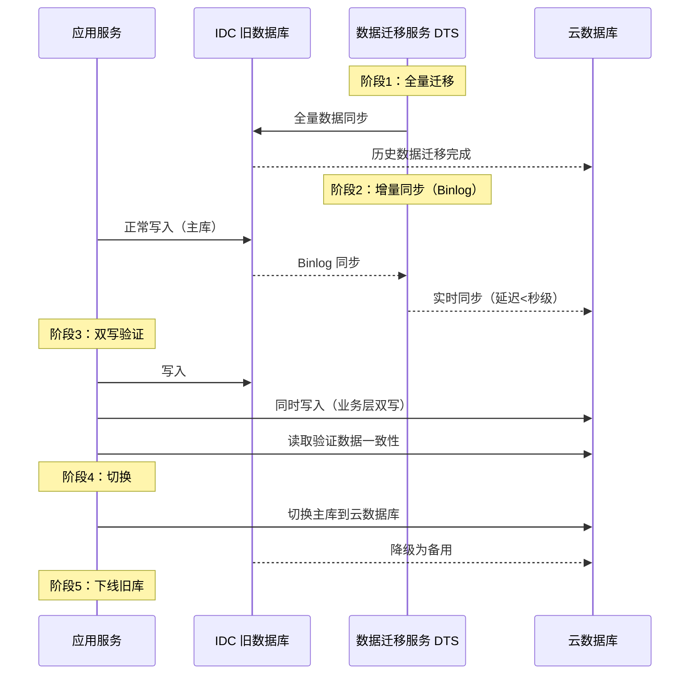

#### 迁移监控与回滚预案

```java
// 关键：双写 + 影子流量验证
@Service
public class MigrationOrderService {
    
    private final boolean migrationMode = true;  // 迁移开关
    
    public Order createOrder(OrderRequest req) {
        // 主写旧库
        Order order = oldDbMapper.insert(req);
        
        if (migrationMode) {
            try {
                // 同步写新库（验证一致性）
                newDbMapper.insert(req);
            } catch (Exception e) {
                // 新库写失败不影响主流程，记录差异
                migrationAlertService.reportInconsistency(req, e);
            }
        }
        return order;
    }
}
```

| 迁移阶段 | 风险 | 回滚方案 |
|---------|------|---------|
| 容器化 | 应用启动问题 | 保留原始部署方式，容器化失败回退 |
| K8s 部署 | 配置错误 | kubectl rollout undo |
| 数据库迁移 | 数据不一致 | DTS 支持反向同步，将新库数据同步回旧库 |
| 流量切换 | 新库性能不达预期 | DNS/LB 秒级切回旧库 |

---
