## 基础技术专题

---

### 1. 理解看懂单机/集群/热备/磁盘阵列（RAID）

#### 1.1 单机架构

单台服务器承载所有服务，是最简单的部署方式。

**特点：**
- 架构简单，运维成本低
- 无冗余，一旦宕机服务完全不可用
- 适合开发/测试环境，或访问量极小的业务

```
用户请求
   │
   ▼
[单台服务器]  ← 所有服务都在这里
   │
[本地磁盘]
```

---

#### 1.2 集群架构

多台服务器协同工作，通过负载均衡分摊请求压力。

**特点：**
- 水平扩展，增加节点即可提升性能
- 某节点宕机，其他节点继续服务
- 需要解决会话共享、数据一致性等问题

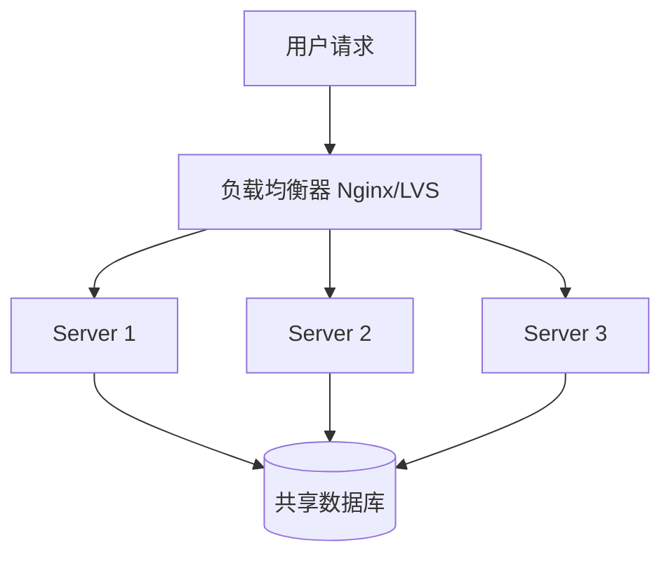

**负载均衡算法：**
| 算法 | 说明 | 适用场景 |
|------|------|----------|
| 轮询 (Round Robin) | 依次分配给每台服务器 | 服务器性能相近 |
| 加权轮询 | 按权重比例分配 | 服务器性能不均 |
| 最少连接 | 分配给当前连接数最少的服务器 | 请求处理时间差异大 |
| IP Hash | 相同IP始终路由到同一服务器 | 需要会话保持 |

---

#### 1.3 热备（HA高可用）

主节点提供服务，备节点实时同步，主节点宕机后自动切换。

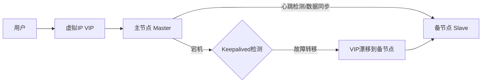

**主要实现方案：**
- **Keepalived + VRRP**：通过虚拟IP漂移实现切换
- **MySQL MHA**：MySQL主备自动切换
- **Redis Sentinel**：Redis哨兵模式

**关键指标：**
- **RTO（恢复时间目标）**：故障到恢复服务的时间
- **RPO（恢复点目标）**：最多丢失多少数据

---

#### 1.4 磁盘阵列（RAID）

将多块物理磁盘组合成一个逻辑磁盘，提升性能或可靠性。

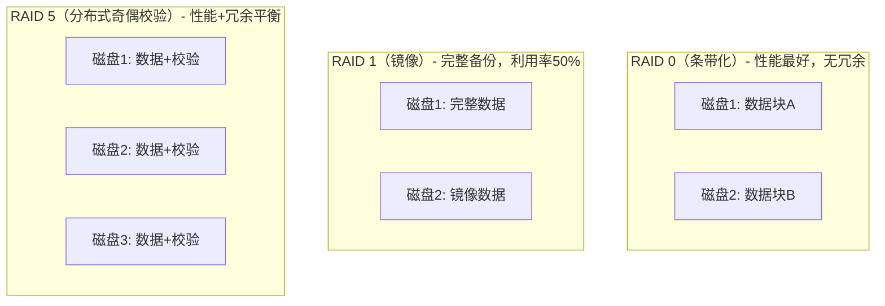

| RAID级别 | 最少磁盘数 | 允许坏盘数 | 读性能 | 写性能 | 磁盘利用率 | 适用场景 |
|----------|-----------|-----------|--------|--------|-----------|----------|
| RAID 0 | 2 | 0 | 高 | 高 | 100% | 临时文件、日志 |
| RAID 1 | 2 | 1 | 一般 | 一般 | 50% | 系统盘、重要数据 |
| RAID 5 | 3 | 1 | 高 | 中 | (N-1)/N | 常规服务器 |
| RAID 6 | 4 | 2 | 高 | 低 | (N-2)/N | 高可靠需求 |
| RAID 10 | 4 | 最多各镜像组坏1块 | 高 | 高 | 50% | 数据库服务器 |

---

### 2. 理解学习 awk 够用

awk 是强大的文本处理工具，按行读取文件，按列（字段）处理数据。

#### 2.1 基本语法

```bash
awk '条件 {动作}' 文件名
```

**内置变量：**
| 变量 | 含义 |
|------|------|
| `$0` | 当前整行内容 |
| `$1, $2, $N` | 第N个字段 |
| `NF` | 当前行的字段总数 |
| `NR` | 当前行号 |
| `FS` | 字段分隔符（默认空格/Tab） |
| `OFS` | 输出字段分隔符 |
| `RS` | 行分隔符（默认换行） |

#### 2.2 常用示例

```bash
# 打印第1列和第3列
awk '{print $1, $3}' file.txt

# 以冒号为分隔符，打印第1和第7列（查看用户Shell）
awk -F: '{print $1, $7}' /etc/passwd

# 条件过滤：打印第3列大于100的行
awk '$3 > 100 {print $0}' file.txt

# 统计第3列的总和
awk '{sum+=$3} END {print "总和:", sum}' file.txt

# 统计行数（类似 wc -l）
awk 'END {print NR}' file.txt

# 打印行号
awk '{print NR, $0}' file.txt

# 过滤包含关键字的行（类似 grep）
awk '/ERROR/ {print}' app.log

# BEGIN和END块：处理前/后执行
awk 'BEGIN{print "开始"} {print $0} END{print "结束"}' file.txt

# 多条件：打印第1列等于"admin"且第3列>100的行
awk '$1=="admin" && $3>100 {print $0}' file.txt

# 自定义输出格式（printf）
awk '{printf "%-10s %5d\n", $1, $3}' file.txt

# 统计每个IP的访问次数（分析Nginx日志）
awk '{count[$1]++} END {for(ip in count) print ip, count[ip]}' access.log | sort -k2 -rn | head -10
```

#### 2.3 实战：分析日志

```bash
# 统计HTTP状态码分布
awk '{print $9}' access.log | sort | uniq -c | sort -rn

# 计算请求平均响应时间（假设第10列是响应时间）
awk '{sum+=$10; count++} END {print "平均响应时间:", sum/count "ms"}' access.log

# 提取某时间段的日志
awk '$4>="[18/May/2026:10:00:00" && $4<="[18/May/2026:11:00:00"' access.log
```

---

### 3. 理解学习 perl 够用

Perl 是功能强大的文本处理语言，在运维脚本和文本处理中广泛使用。

#### 3.1 单行命令（-e / -pe / -ne）

```bash
# -e：执行一段Perl代码
perl -e 'print "Hello, World!\n"'

# -p：逐行读取并打印，类似 sed
perl -p -e 's/old/new/g' file.txt

# -n：逐行读取但不自动打印，类似 awk -F
perl -n -e 'print if /pattern/' file.txt

# -i：原地修改文件（-i.bak 会生成备份）
perl -i.bak -pe 's/foo/bar/g' file.txt
```

#### 3.2 正则表达式

```perl
# 基本替换
perl -pe 's/old/new/g' file.txt

# 不区分大小写替换
perl -pe 's/error/ERROR/gi' file.txt

# 捕获组：交换两列
perl -pe 's/(\w+)\s+(\w+)/$2 $1/' file.txt

# 删除行尾空格
perl -pe 's/\s+$//' file.txt

# 删除空行
perl -ne 'print unless /^\s*$/' file.txt

# 提取IP地址
perl -ne 'print "$1\n" if /(\d{1,3}\.\d{1,3}\.\d{1,3}\.\d{1,3})/' file.txt
```

#### 3.3 常用特殊变量

| 变量 | 含义 |
|------|------|
| `$_` | 当前行（默认变量） |
| `$.` | 当前行号 |
| `$0` | 脚本名 |
| `@ARGV` | 命令行参数 |
| `$1, $2` | 正则捕获组 |

---

### 4. sed 入门

sed（Stream Editor）是流式文本编辑器，按行处理文本。

#### 4.1 基本语法

```bash
sed [选项] '地址 命令' 文件
```

**常用选项：**
| 选项 | 说明 |
|------|------|
| `-n` | 不自动打印，只打印被选中的行 |
| `-e` | 指定多个编辑命令 |
| `-i` | 原地修改文件（`-i.bak` 备份） |
| `-r` / `-E` | 使用扩展正则 |

#### 4.2 地址（定位）

```bash
# 第3行
sed '3 命令' file

# 第1到第5行
sed '1,5 命令' file

# 最后一行
sed '$ 命令' file

# 匹配正则的行
sed '/pattern/ 命令' file

# 奇数行（step寻址）
sed '1~2 命令' file
```

#### 4.3 常用命令

```bash
# 替换（s = substitute）
sed 's/old/new/'        # 替换每行第一个
sed 's/old/new/g'       # 替换每行所有
sed 's/old/new/2'       # 替换每行第2个
sed 's/old/new/gi'      # 不区分大小写全替换

# 删除行（d = delete）
sed '1,10d' file.txt          # 删除第1到10行
sed '/^#/d' file.txt          # 删除注释行
sed '/^\s*$/d' file.txt       # 删除空行

# 打印（p = print），常配合 -n 使用
sed -n '5,10p' file.txt       # 只打印第5到10行
sed -n '/ERROR/p' file.txt    # 只打印包含ERROR的行

# 插入（i = insert，在行前）
sed '3i\新增的行' file.txt    # 在第3行前插入

# 追加（a = append，在行后）
sed '3a\追加的行' file.txt    # 在第3行后追加

# 替换整行（c = change）
sed '3c\替换整行内容' file.txt

# 多命令（-e 或用分号）
sed -e 's/foo/bar/g' -e 's/baz/qux/g' file.txt
sed 's/foo/bar/g; s/baz/qux/g' file.txt

# 原地修改并备份
sed -i.bak 's/old/new/g' file.txt
```

#### 4.4 实战案例

```bash
# 修改配置文件中的端口号
sed -i 's/^port=.*/port=8080/' config.properties

# 删除文件中的所有注释和空行
sed -e '/^#/d' -e '/^\s*$/d' config.conf

# 在每行末尾追加分号
sed 's/$/;/' file.txt

# 提取第10到20行
sed -n '10,20p' file.txt
```

---

### 5. 了解两阶段提交（2PC）

#### 5.1 背景

在分布式系统中，一个事务可能涉及多个节点（如多个数据库），需要保证这些节点**要么全部提交，要么全部回滚**，这就是分布式事务问题。2PC（Two-Phase Commit，两阶段提交）是解决此问题的经典协议。

**角色：**
- **协调者（Coordinator）**：发起事务的节点（如应用服务器）
- **参与者（Participant）**：执行事务的节点（如多个数据库）

#### 5.2 流程详解

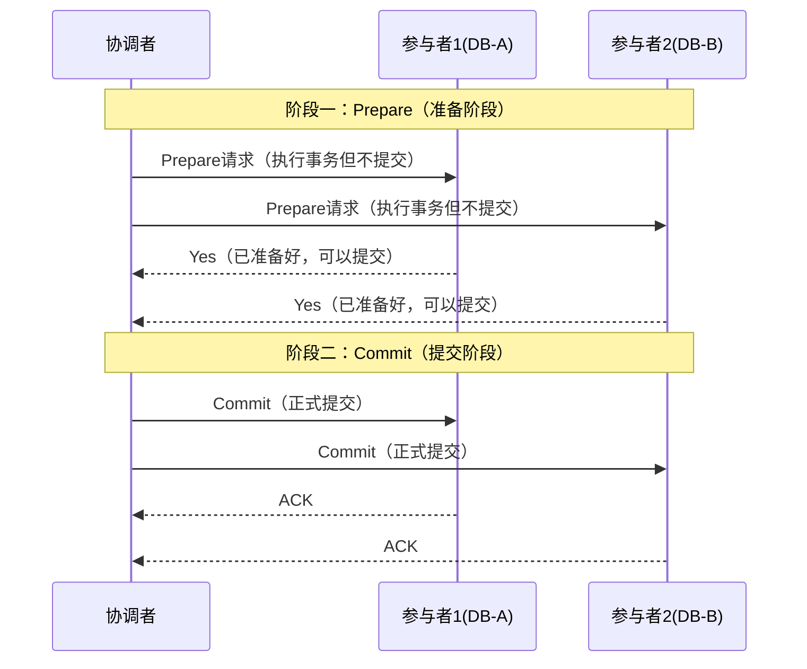

**其中一个参与者回复No的情况：**

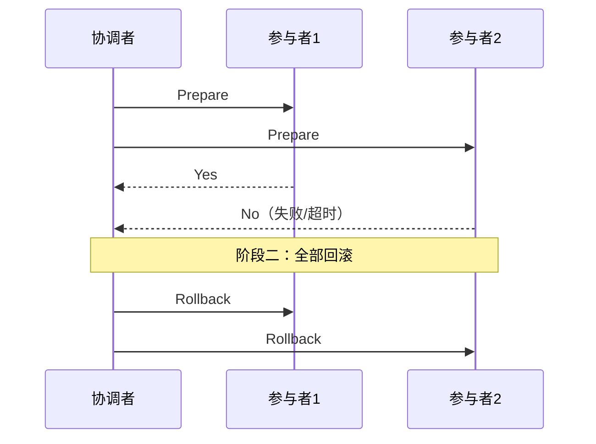

#### 5.3 缺点分析

| 问题 | 说明 |
|------|------|
| **同步阻塞** | Prepare阶段参与者锁定资源，等待协调者决定，整个期间其他事务无法访问这些资源 |
| **单点故障** | 协调者挂掉，参与者永远处于等待状态，事务悬挂 |
| **数据不一致** | Commit阶段协调者崩溃，部分参与者提交了，部分没有 |
| **脑裂** | 网络分区时，参与者无法判断是提交还是回滚 |

#### 5.4 改进方案

- **3PC（三阶段提交）**：增加CanCommit阶段，引入超时机制，减少阻塞
- **TCC（Try-Confirm-Cancel）**：业务层面的补偿事务，性能更好
- **SAGA模式**：长事务拆分为多个本地事务，通过补偿实现回滚
- **Seata**：阿里开源分布式事务框架，支持AT/TCC/SAGA/XA模式

---

### 6. SQL 中的 JOIN

#### 6.1 类型一览

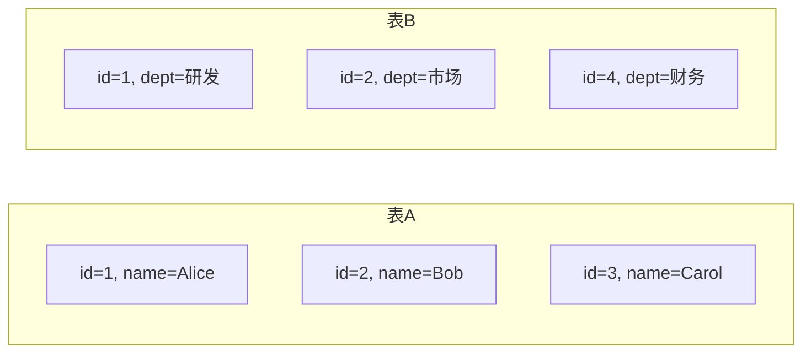

| JOIN类型 | 返回数据 | 说明 |
|---------|---------|------|
| `INNER JOIN` | 两表交集 | 只返回两边都有匹配的行 |
| `LEFT JOIN` | 左表全部 + 右表匹配 | 右表无匹配则右侧列为NULL |
| `RIGHT JOIN` | 右表全部 + 左表匹配 | 左表无匹配则左侧列为NULL |
| `FULL OUTER JOIN` | 两表并集 | 无匹配的一侧列为NULL（MySQL不支持，用UNION模拟） |
| `CROSS JOIN` | 笛卡尔积 | 左表每行与右表每行组合，慎用 |
| `SELF JOIN` | 表自连接 | 同一张表关联自身，常用于树形结构 |

#### 6.2 图示理解

```
表A：用户表          表B：部门表
┌────┬───────┐      ┌────┬──────┐
│ id │ name  │      │ id │ dept │
├────┼───────┤      ├────┼──────┤
│  1 │ Alice │      │  1 │ 研发 │
│  2 │ Bob   │      │  2 │ 市场 │
│  3 │ Carol │      │  4 │ 财务 │
└────┴───────┘      └────┴──────┘

INNER JOIN (id匹配)：   LEFT JOIN：
┌─────┬───────┬──────┐  ┌─────┬───────┬──────┐
│ id  │ name  │ dept │  │ id  │ name  │ dept │
├─────┼───────┼──────┤  ├─────┼───────┼──────┤
│  1  │ Alice │ 研发 │  │  1  │ Alice │ 研发 │
│  2  │ Bob   │ 市场 │  │  2  │ Bob   │ 市场 │
└─────┴───────┴──────┘  │  3  │ Carol │ NULL │
                         └─────┴───────┴──────┘
```

#### 6.3 SQL 示例

```sql
-- INNER JOIN：只查有部门的用户
SELECT u.name, d.dept_name
FROM users u
INNER JOIN departments d ON u.dept_id = d.id;

-- LEFT JOIN：查所有用户，没有部门显示NULL
SELECT u.name, d.dept_name
FROM users u
LEFT JOIN departments d ON u.dept_id = d.id;

-- LEFT JOIN 查没有部门的用户（左表独有）
SELECT u.name
FROM users u
LEFT JOIN departments d ON u.dept_id = d.id
WHERE d.id IS NULL;

-- SELF JOIN：查询员工和他的上级（树形结构）
SELECT e.name AS 员工, m.name AS 上级
FROM employees e
LEFT JOIN employees m ON e.manager_id = m.id;

-- MySQL模拟 FULL OUTER JOIN
SELECT u.name, d.dept_name FROM users u LEFT JOIN departments d ON u.dept_id = d.id
UNION
SELECT u.name, d.dept_name FROM users u RIGHT JOIN departments d ON u.dept_id = d.id;
```

#### 6.4 性能注意事项

- JOIN的列尽量加索引，否则会全表扫描
- 避免在JOIN条件上使用函数，会导致索引失效
- 小表驱动大表（小表作为驱动表，用INNER JOIN时MySQL自动优化）
- 超过3张表的JOIN要谨慎，考虑用代码层面处理

---

### 7. 理解连接池

#### 7.1 为什么需要连接池？

建立数据库连接是一个耗时操作（需要TCP握手、数据库认证等），通常需要 **10~100ms**。如果每次请求都创建新连接，高并发下会造成：
- 响应时间飙升
- 数据库连接数耗尽
- 大量系统资源浪费

连接池预先创建一批连接，请求到来时直接复用，用完归还，而不是销毁。

#### 7.2 工作原理

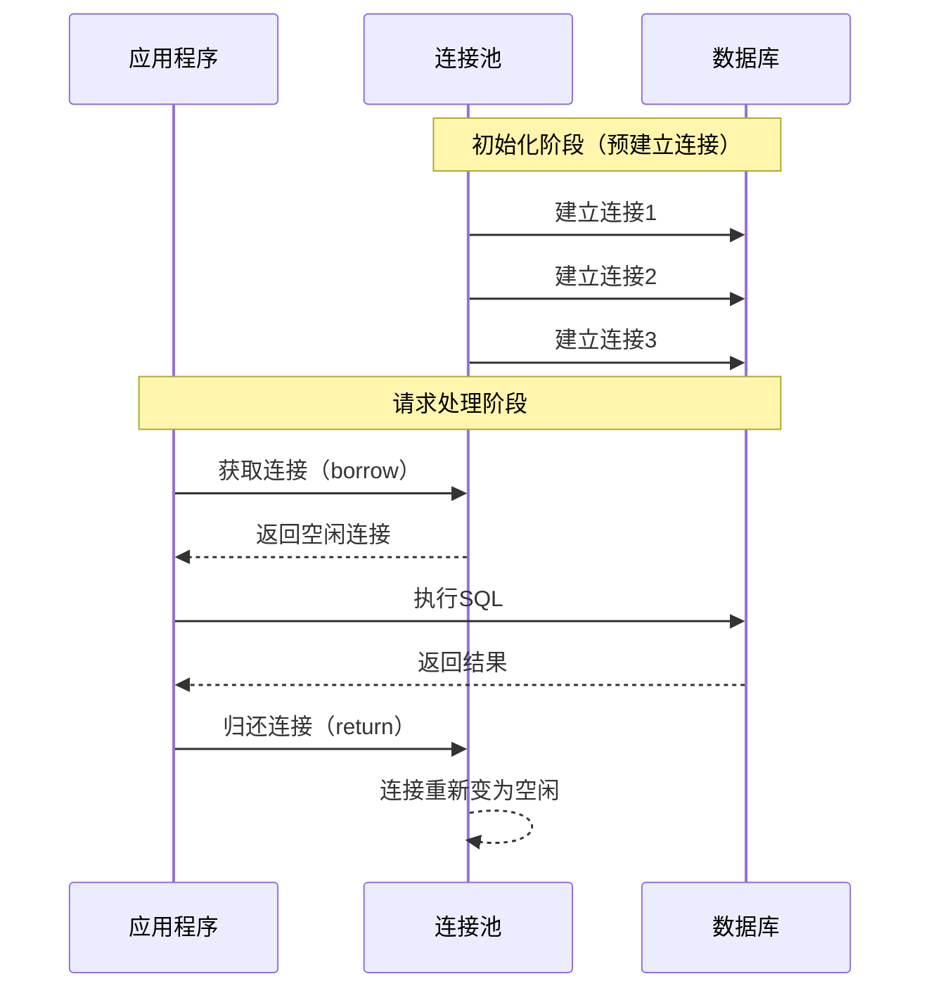

#### 7.3 核心参数详解

以 HikariCP（Spring Boot默认连接池）为例：

```yaml
spring:
  datasource:
    hikari:
      minimum-idle: 5          # 最小空闲连接数（保持活跃，随时可用）
      maximum-pool-size: 20    # 最大连接数（超过此数，请求等待）
      connection-timeout: 30000 # 等待连接超时（ms），超时抛异常
      idle-timeout: 600000     # 连接空闲超过此时间则关闭（ms）
      max-lifetime: 1800000    # 连接最大存活时间（ms），防止DB端断开
      connection-test-query: SELECT 1  # 检测连接是否有效
```

**参数调优经验：**

```
最大连接数 = CPU核心数 × 2 + 磁盘数量

（PostgreSQL官方建议公式，适用于大多数OLTP场景）
```

| 参数 | 设置过小 | 设置过大 |
|------|---------|---------|
| `maximum-pool-size` | 请求排队等待，响应慢 | 数据库连接数耗尽，OOM |
| `connection-timeout` | 正常慢请求报超时错误 | 请求长时间挂起 |
| `max-lifetime` | 连接频繁重建，性能差 | DB端可能已断开，出现异常 |

#### 7.4 常见问题

**连接泄漏（Connection Leak）：**
```
现象：连接池耗尽，新请求一直等待
原因：代码中获取连接后未归还（未关闭Connection）
解决：try-with-resources / 开启泄漏检测
```

```java
// 错误写法：异常发生时连接未关闭
Connection conn = dataSource.getConnection();
Statement stmt = conn.createStatement();
stmt.execute(sql); // 如果这里抛异常，conn永远不会关闭
conn.close();

// 正确写法：try-with-resources 自动关闭
try (Connection conn = dataSource.getConnection();
     Statement stmt = conn.createStatement()) {
    stmt.execute(sql);
}
```

---

### 8-9. 理解分布式锁

#### 8.1 为什么需要分布式锁？

单机环境下用 `synchronized` 或 `ReentrantLock` 就能解决并发问题。但在分布式系统中，多个节点跑在不同JVM进程，JVM级别的锁无法跨进程生效，需要一个**所有节点都能访问的第三方存储**来协调。

**典型场景：**
- 防止重复扣库存（电商秒杀）
- 定时任务防重复执行（多节点只跑一个）
- 幂等处理（防止消息重复消费）

#### 8.2 方案一：Redis 分布式锁

**基本原理：** 利用 Redis 的 `SET NX`（Not Exists）命令，只有当 key 不存在时才能设置成功。

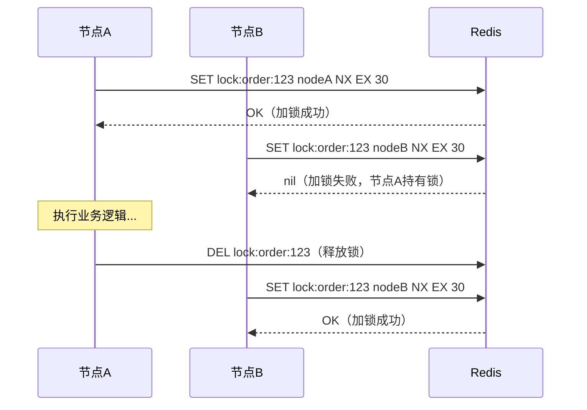

**正确的加锁命令（原子操作）：**
```bash
# 一条命令完成：设置key，值为唯一标识，NX表示不存在才设置，EX 30表示30秒过期
SET lock:resource_key unique_value NX EX 30
```

**Java 实现（Redisson）：**
```java
// 推荐使用 Redisson，它封装了很多细节（续期、可重入等）
RLock lock = redissonClient.getLock("lock:order:" + orderId);
boolean locked = lock.tryLock(3, 30, TimeUnit.SECONDS); // 等待3秒，锁持有30秒
if (locked) {
    try {
        // 执行业务逻辑
        doBusinessLogic();
    } finally {
        lock.unlock(); // 一定要在finally中释放
    }
}
```

**锁释放的坑（必须用Lua脚本保证原子性）：**
```lua
-- 释放锁：先判断是否是自己的锁，再删除（防止误删他人的锁）
if redis.call("get", KEYS[1]) == ARGV[1] then
    return redis.call("del", KEYS[1])
else
    return 0
end
```

**常见问题：**
| 问题 | 现象 | 解决方案 |
|------|------|---------|
| 锁过期业务未完成 | 锁自动失效，多个节点进入临界区 | Redisson看门狗（Watchdog）自动续期 |
| Redis主从切换 | 主节点宕机，从节点没有锁信息 | RedLock算法（多数派加锁）|
| 误删他人锁 | 节点A的锁过期，节点B加锁，节点A业务完成误删节点B的锁 | 锁value存唯一标识（UUID），释放时先验证 |

---

#### 8.3 方案二：Zookeeper 分布式锁

**原理：** 利用 ZK 的有序临时节点（Ephemeral Sequential Node）实现公平锁。

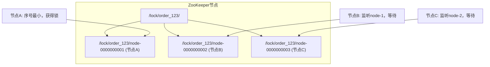

**流程：**
1. 每个客户端在 `/lock/resource/` 下创建有序临时节点
2. 序号最小的节点获得锁
3. 其他节点监听（Watch）前一个节点
4. 前一个节点删除时，下一个节点被唤醒并尝试获取锁
5. 客户端宕机，临时节点自动删除，锁自动释放

**优点：** 天然支持公平锁、可重入、锁超时自动释放（临时节点）
**缺点：** 性能比Redis差，ZK集群本身的维护成本高

---

#### 8.4 方案三：数据库分布式锁

```sql
-- 建表
CREATE TABLE distributed_lock (
    lock_key   VARCHAR(64) PRIMARY KEY,  -- 锁的唯一标识
    lock_value VARCHAR(64) NOT NULL,     -- 锁的持有者标识（如UUID）
    expire_time DATETIME NOT NULL        -- 过期时间
);

-- 加锁（INSERT，利用主键唯一约束）
INSERT INTO distributed_lock(lock_key, lock_value, expire_time)
VALUES ('order_lock', 'uuid-xxx', DATE_ADD(NOW(), INTERVAL 30 SECOND));
-- 插入成功=加锁成功；唯一键冲突=加锁失败

-- 释放锁
DELETE FROM distributed_lock WHERE lock_key='order_lock' AND lock_value='uuid-xxx';
```

**优点：** 实现简单，无需额外组件
**缺点：** 性能差，依赖数据库可用性，需手动清理过期锁

---

#### 8.5 三种方案对比

| 维度 | Redis | Zookeeper | 数据库 |
|------|-------|-----------|--------|
| 性能 | 高 | 中 | 低 |
| 可靠性 | 中（主从切换有风险） | 高（强一致） | 中 |
| 实现复杂度 | 中 | 高 | 低 |
| 锁超时自动释放 | 支持（EX参数） | 支持（临时节点） | 需手动清理 |
| 推荐度 | ★★★★★ | ★★★★ | ★★ |

---

### 10. 理解 TCP/IP

#### 10.1 TCP/IP 分层模型

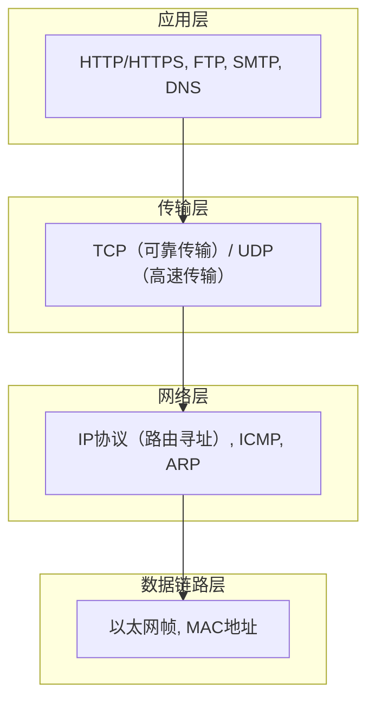

#### 10.2 三次握手（建立连接）

**为什么需要三次？** 确保双方的收发能力都正常，防止历史连接干扰。

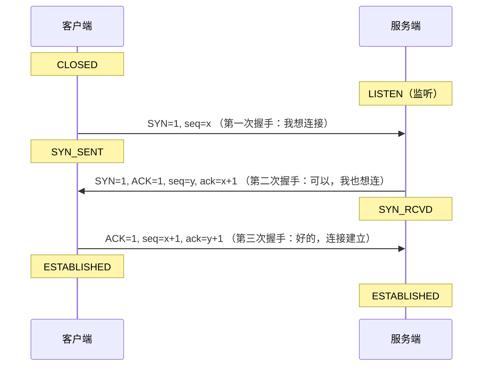

**字段解释：**
- `SYN`：同步序列号，发起连接请求
- `ACK`：确认号，表示确认收到
- `seq`：序列号，标识数据顺序
- `ack`：期望下次收到的序列号

#### 10.3 四次挥手（断开连接）

**为什么需要四次？** TCP是全双工的，双方各自独立关闭各自方向的连接，所以需要4步。

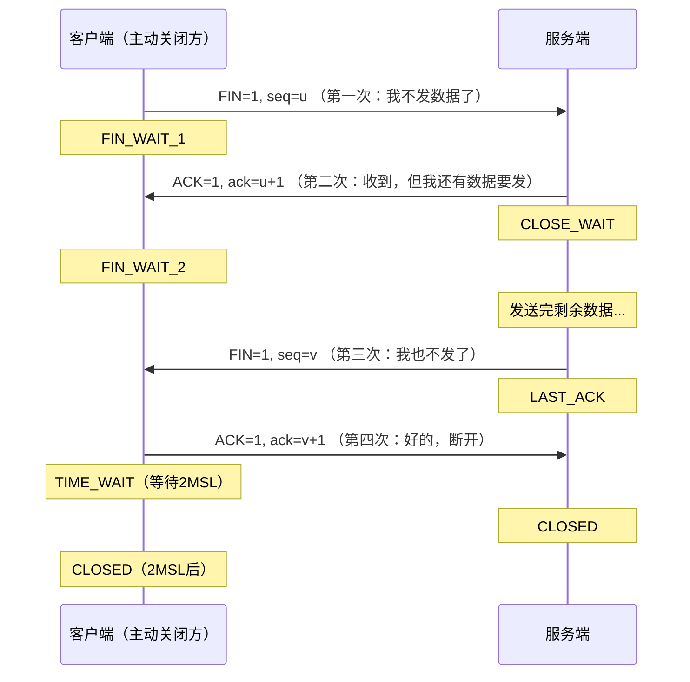

**TIME_WAIT 为什么要等待 2MSL？**
- MSL（Maximum Segment Lifetime）= 报文最大生存时间（通常60秒）
- 等待2MSL确保最后一个ACK能到达对方（万一ACK丢失，对方会重发FIN，2MSL内能收到）
- 让本次连接的所有报文在网络中消失，防止下一个相同四元组的连接受干扰

#### 10.4 滑动窗口（流量控制）

```
发送方不能无限制地发送数据，接收方用"窗口"告诉发送方自己的缓冲区还有多少空间。

发送方缓冲区：
┌─────────────────────────────────────────────┐
│已发已确认│已发未确认│  可发送  │  不可发送   │
└─────────────────────────────────────────────┘
          ▲          ▲          ▲
          │          │          └── 窗口右边界
          │          └── 已发未确认区域
          └── 已确认区域

窗口大小由接收方在ACK报文中告知发送方（rwnd字段）
```

#### 10.5 拥塞控制

防止发送方发送速率超过网络承载能力，导致网络拥塞。

```
拥塞窗口（cwnd）变化过程：

cwnd大小
   │          /慢开始阈值
   │         /
   │        /     拥塞避免（线性增长）
   │       /
   │      /  慢开始（指数增长）
   │     /
   │    /
   └─────────────────► 时间
   
遇到丢包：
- 超时重传：cwnd=1，重新慢开始
- 快速重传（收到3个重复ACK）：cwnd减半，进入拥塞避免
```

#### 10.6 TCP vs UDP 对比

| 特性 | TCP | UDP |
|------|-----|-----|
| 连接 | 面向连接（三次握手） | 无连接 |
| 可靠性 | 可靠（确认、重传） | 不可靠 |
| 顺序 | 保证顺序 | 不保证 |
| 速度 | 较慢 | 快 |
| 开销 | 头部20字节 | 头部8字节 |
| 适用场景 | HTTP、FTP、邮件 | DNS、视频流、游戏 |

---

### 11. 理解负载 LoadAverage

#### 11.1 什么是 Load Average？

Load Average（系统平均负载）表示**在过去一段时间内，处于可运行状态和不可中断状态的平均进程数**。

用 `uptime` 或 `top` 查看：
```bash
$ uptime
10:30:00 up 5 days, load average: 1.23, 2.45, 1.89
                                   ↑      ↑      ↑
                                  1分钟  5分钟  15分钟
```

**注意：** Load Average 不等于 CPU 使用率！
- 等待 CPU 的进程（CPU密集型）
- 等待 IO 的进程（IO密集型，D状态进程）
- 都会贡献到 Load Average

#### 11.2 如何判断是否正常？

```
核心公式：负载 / CPU核心数

比值 < 0.7：系统运行良好
比值 = 1.0：满载（每个CPU核心都有一个任务在运行/等待）
比值 > 1.0：过载（有任务在排队等待CPU）
```

**实际判断示例：**
```bash
# 查看CPU核心数
nproc        # 或
cat /proc/cpuinfo | grep -c "processor"

# 4核CPU示例：
load average: 3.5  → 3.5/4 = 0.875  ✅ 正常
load average: 4.0  → 4.0/4 = 1.0    ⚠️ 满载
load average: 6.0  → 6.0/4 = 1.5    ❌ 过载
```

#### 11.3 高负载排查步骤

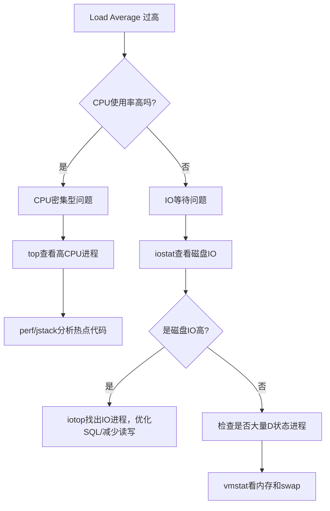

```bash
# 关键排查命令
uptime              # 查看负载
top -H              # 查看进程和线程
vmstat 1            # 每秒输出一次系统统计（关注wa列=IO等待）
iostat -x 1         # 查看磁盘IO详情
iotop               # 查看哪个进程在大量读写磁盘
cat /proc/loadavg   # 原始负载数据
```

#### 11.4 vmstat 关键列说明

```
$ vmstat 1
procs -----------memory---------- ---swap-- -----io---- -system-- ------cpu-----
 r  b   swpd   free   buff  cache   si   so    bi    bo   in   cs  us sy id wa st
 2  0      0 1024000  12000 800000   0    0     5    10  200  400  20  5 70  5  0
 ↑  ↑                              ↑    ↑     ↑     ↑        ↑   ↑  ↑  ↑  ↑
 |  |                              |    |     |     |        |   |  |  |  IO等待
 |  |                              |    |     |     |        |   |  |  系统态
 |  等待IO的进程数                  |    |     |     |        |   |  用户态
 可运行的进程数                    换入  换出   块读  块写     中断  上下文切换
```

---

### 12. 了解 Leader-Follower 线程模型

#### 12.1 背景

传统多线程服务器：每来一个连接就创建一个线程处理，线程数随连接数线性增长，导致：
- 上下文切换开销大
- 内存消耗多
- 线程竞争激烈

Leader-Follower 模型是一种高效的多线程事件处理模式，常见于 ACE 框架和 Nginx 多进程模型的变体中。

#### 12.2 模型结构

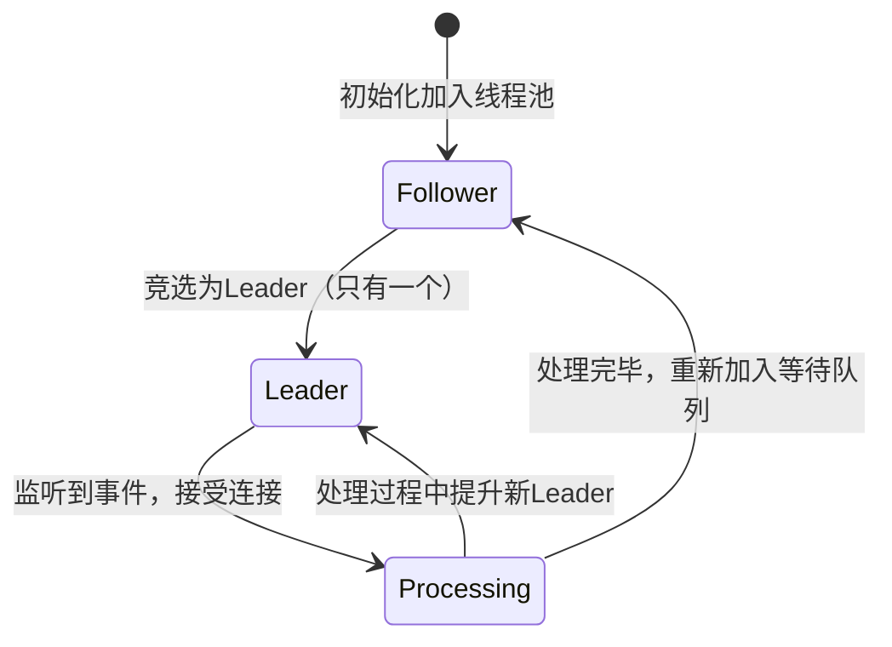

**三种角色：**
| 角色 | 说明 |
|------|------|
| **Leader（领导者）** | 有且仅有一个。负责监听句柄（epoll/select），等待I/O事件 |
| **Follower（追随者）** | 等待成为Leader的线程，处于挂起/等待状态 |
| **Processing（处理者）** | 当前正在处理事件的线程 |

#### 12.3 处理流程

```
1. 线程池启动，一个线程成为 Leader，其余成为 Follower

2. Leader 在 select/epoll 上等待事件

3. 事件到来：
   a. Leader 从 Follower 中唤醒一个，让它成为新 Leader
   b. 原 Leader 变为 Processing，处理这个事件

4. 处理完毕，Processing 线程重新变为 Follower

5. 新 Leader 继续监听事件
```

**关键特点：**
- 任何时刻只有一个 Leader 在监听，避免了惊群问题（thundering herd）
- 事件分发无需额外线程，减少上下文切换
- 线程数固定，内存占用可控

#### 12.4 与其他模型对比

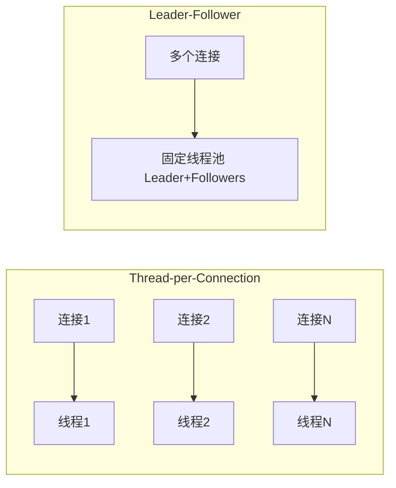

| 模型 | 线程数 | 适用场景 |
|------|--------|---------|
| Thread-per-Connection | 随连接数增长 | 连接数少，处理时间长 |
| 线程池 + 队列 | 固定 | 通用，Spring默认 |
| Leader-Follower | 固定 | 高并发，短连接 |
| Reactor（Netty） | 固定（少量） | 极高并发，NIO |

---

### 13. 了解四层/七层反向代理

#### 13.1 OSI模型与代理层次

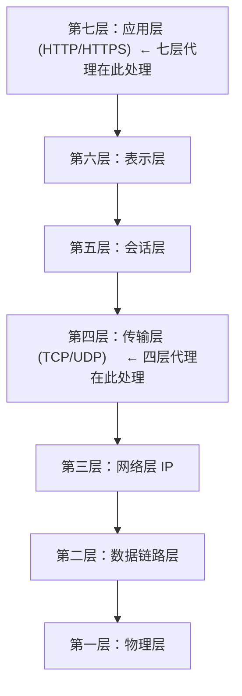

#### 13.2 四层反向代理

在传输层（TCP/UDP）转发数据包，代理服务器**不解析数据包内容**，只根据IP和端口进行转发。

**代表产品：** LVS（Linux Virtual Server）、HAProxy（四层模式）、Nginx Stream模块

```
客户端 → [四层代理: 看到的是IP+端口] → 后端服务器

代理看到：目标IP=192.168.1.100, 端口=80
代理做的：修改目标IP，转发数据包
代理不知道：HTTP方法是什么、URL是什么、Cookie是什么
```

**LVS 三种模式：**
| 模式 | 原理 | 性能 | 适用场景 |
|------|------|------|---------|
| DR（直接路由） | 改目标MAC，响应直接到客户端 | 最高 | 同机房，响应数据量大 |
| NAT（网络地址转换） | 改源/目标IP | 中 | 跨网段 |
| TUN（IP隧道） | 封装IP包 | 高 | 跨地域 |

#### 13.3 七层反向代理

在应用层（HTTP/HTTPS）处理请求，代理服务器**完整解析HTTP报文**，功能更丰富。

**代表产品：** Nginx（HTTP模块）、HAProxy（HTTP模式）、Envoy、Kong

```
客户端 → [七层代理: 完整解析HTTP] → 后端服务器

代理看到：GET /api/users HTTP/1.1
          Host: example.com
          Cookie: session=xxx
代理能做：
  - 按URL路径路由（/api → 服务A，/static → 服务B）
  - SSL终止（HTTPS解密后转发HTTP）
  - 修改Header（添加X-Real-IP）
  - 限流、鉴权、缓存
  - 压缩响应（gzip）
```

**Nginx 七层代理配置示例：**
```nginx
# 按路径路由到不同后端
upstream api_servers {
    server 192.168.1.10:8080 weight=3;
    server 192.168.1.11:8080 weight=1;
}

upstream static_servers {
    server 192.168.1.20:80;
}

server {
    listen 80;

    # /api 路径转发到API服务
    location /api/ {
        proxy_pass http://api_servers;
        proxy_set_header X-Real-IP $remote_addr;
        proxy_set_header X-Forwarded-For $proxy_add_x_forwarded_for;
    }

    # 静态资源转发到文件服务
    location /static/ {
        proxy_pass http://static_servers;
    }
}
```

#### 13.4 四层 vs 七层 对比

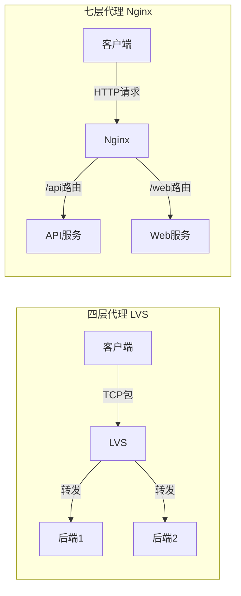

| 对比维度 | 四层代理（LVS） | 七层代理（Nginx） |
|---------|--------------|----------------|
| 工作层次 | 传输层（TCP/UDP） | 应用层（HTTP） |
| 性能 | 极高（内核转发，百万QPS） | 高（用户态，十万QPS级） |
| 功能 | 简单（只做转发） | 丰富（路由、鉴权、缓存等） |
| 可见内容 | IP + 端口 | 完整HTTP报文 |
| SSL终止 | 不支持（透传） | 支持 |
| 灵活路由 | 仅按IP/端口 | 按URL、Header、Cookie |
| 典型场景 | 高并发入口 | 微服务网关、API路由 |

**实际架构中常配合使用：**
```
用户 → DNS → LVS（四层，做高可用入口）→ Nginx（七层，做路由和功能处理）→ 后端服务
```
